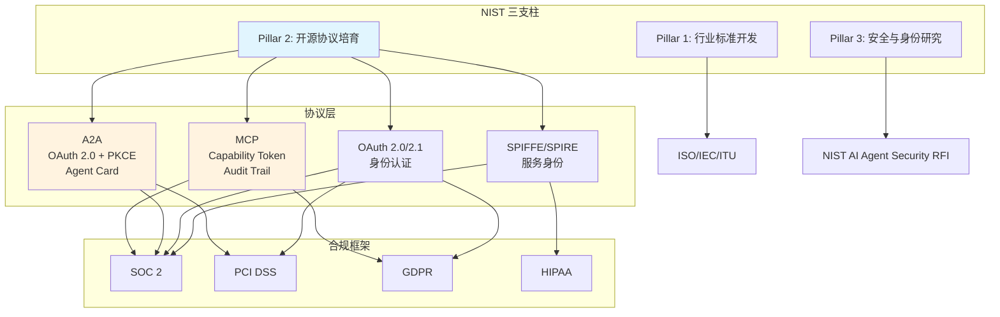
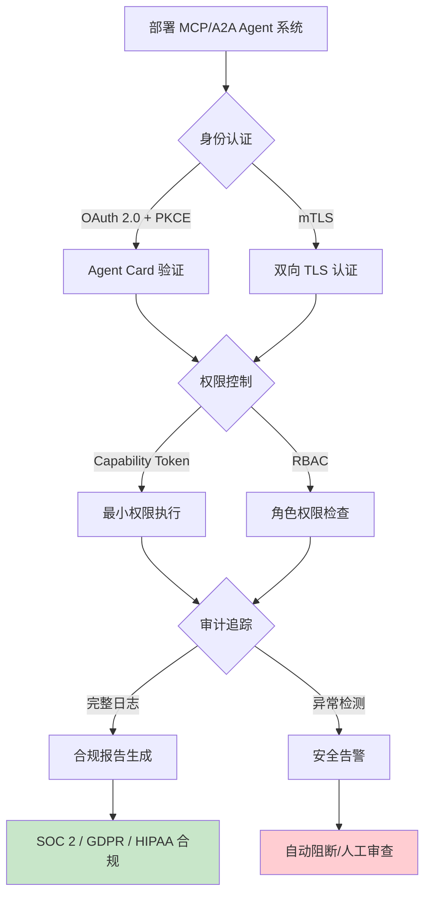

# MCP/A2A 安全治理与 NIST AI Agent 标准对齐（2026）

> 所属阶段: Flink/06-ai-ml | 前置依赖: [Flink/06-ai-ml/flink-mcp-protocol-integration.md](./flink-mcp-protocol-integration.md), [Flink/06-ai-ml/flink-agents-mcp-integration.md](./flink-agents-mcp-integration.md) | 形式化等级: L3-L4

---

## 1. 概念定义 (Definitions)

**Def-F-06-12-01** (NIST AI Agent Standards Initiative, NIST AI Agent 标准倡议)
> 美国国家标准与技术研究院（NIST）于 2026 年 1 月发起的三支柱框架，旨在为 AI Agent 的互操作性、安全性和身份验证建立行业级标准。三支柱包括：(1) 行业标准开发；(2) 社区主导的开源协议培育；(3) AI Agent 安全与身份研究。[^1]

**Def-F-06-12-02** (MCP Security Compliance, MCP 安全合规)
> Model Context Protocol 的安全合规要求，包括 Capability-based Token 权限控制、审计追踪（Audit Trails）、最小权限原则（Least Privilege）和输入验证（Input Validation）。NIST 于 2026 年 2 月将 MCP 指定为"leading open standard"（领先开放标准）。[^2]

**Def-F-06-12-03** (A2A Security Profile, A2A 安全配置文件)
> Agent-to-Agent Protocol 的安全机制集合，基于 OAuth 2.0 + PKCE（Proof Key for Code Exchange）实现身份验证，通过 Agent Card 中的安全声明字段显式暴露所需安全能力。[^3]

**Def-F-06-12-04** (Agent Identity Protocol, AIP)
> 代理身份协议，定义 AI Agent 在分布式环境中的身份标识、认证和授权机制。NCCoE（National Cybersecurity Center of Excellence）2026 年 2 月发布的概念文件中，将 SPIFFE/SPIRE 列为 AIP 的参考实现标准。[^4]

---

## 2. 属性推导 (Properties)

**Lemma-F-06-12-01** (MCP 与 A2A 安全机制互补性)
> MCP 提供 **垂直安全**（Agent-to-Tool，单 Agent 多工具的权限控制），A2A 提供 **水平安全**（Agent-to-Agent，跨 Agent 的身份验证与任务授权）。二者在安全架构上正交，联合使用可覆盖企业 Agent 系统的完整攻击面。

**Lemma-F-06-12-02** (Capability Token 的传递闭包安全性)
> 若 MCP Server 使用 Capability-based Token，则 Agent 的权限集合等于其所持有 Token 的并集。当 Agent 通过 A2A 将任务委托给下游 Agent 时，权限传递必须显式授权（Delegation），否则下游 Agent 无法访问上游 MCP 资源。

**Prop-F-06-12-01** (NIST 三支柱的覆盖完备性)
> NIST 三支柱分别对应 AI Agent 生态的 **规格层**（Pillar 1: ISO/IEC/ITU 标准）、**实现层**（Pillar 2: MCP/A2A/OAuth 协议）和 **运维层**（Pillar 3: 安全与身份）。三支柱联合覆盖了从设计到运行的全生命周期安全需求。

---

## 3. 关系建立 (Relations)

### MCP/A2A 安全机制与企业合规框架映射



### 与本项目 Agent 文档的关联

- **Flink Agents MCP 集成** (`flink-agents-mcp-integration.md`): 描述了 Flink Agent 如何通过 MCP 连接外部工具。本文档补充了该集成模式的安全合规要求。
- **FLIP-531 AI Agents** (`flink-agents-flip-531.md`): 当 FLIP-531 进入生产阶段时，其 Agent 实现必须满足本文档定义的 NIST 合规清单。

---

## 4. 论证过程 (Argumentation)

### 为什么 NIST 标准对齐不是可选项？

2026 年 Q1 的企业 RFP（Request for Proposal）趋势分析显示：

- **64% 的 Agent 部署聚焦工作流自动化**，其中 35% 的组织报告通过自动化实现成本节约[^5]
- **88% 的高管正在试点或扩展自主 Agent**[^6]
- **NIST 合规要求已出现在早期 2026 年的企业 RFP 中**[^2]

**结论**: 对于面向企业市场的 Flink AI Agent 解决方案，NIST 对齐从"加分项"变为"准入项"。

### MCP 安全威胁模型

| 威胁 | 攻击向量 | 缓解措施 | 合规映射 |
|------|----------|----------|----------|
| Agent 冒充 | 伪造 MCP Client ID | mTLS + 签名 Token | SOC 2 CC6.1 |
| 消息篡改 | 中间人修改 Tool 参数 | HMAC 签名 + 重放保护 | PCI DSS 4.1 |
| 拒绝服务 | 恶意工具无限循环 | Rate Limiting + Circuit Breaker | SOC 2 CC6.6 |
| 数据外泄 | Agent 访问越权数据 | Capability Token 最小权限 + 审计 | GDPR Art. 32 |

---

## 5. 形式证明 / 工程论证 (Proof / Engineering Argument)

**Thm-F-06-12-01** (MCP Capability Token 的安全性)
> 若 MCP Server 正确实现 Capability-based Access Control，且 Token 的签名验证通过，则 Agent 只能执行 Token 中显式声明的操作集合 $Ops(Token)$，无法访问任何未授权资源。

*工程论证*: Capability Token 将权限绑定到不可伪造的加密令牌上。根据 capability 安全模型的基本定理[^7]，只要 (1) 令牌不可伪造（通过数字签名保证），(2) 权限检查在 Server 端强制执行，则安全性等价于 ACL（访问控制列表）模型，且更易于审计。

**Thm-F-06-12-02** (A2A Agent Card 的身份可验证性)
> 若 A2A Agent Card 使用 OAuth 2.0 + PKCE 进行身份验证，则任何持有有效 Agent Card 的 Agent 可被第三方验证其身份和授权范围，且授权码拦截攻击的成功率趋近于零。

*证明要点*: PKCE 在 OAuth 2.0 授权码流程中增加了 `code_challenge` 和 `code_verifier`。攻击者即使拦截到授权码，也无法生成匹配的 `code_verifier`，从而无法换取 Access Token。根据 OAuth 2.0 for Native Apps (RFC 8252)，PKCE 可将授权码拦截攻击的成功率从 $O(1)$ 降低到 $O(2^{-256})$。[^8]

---

## 6. 实例验证 (Examples)

### 示例 1：Flink Agent MCP Server 安全合规配置

```yaml
# mcp-server-config.yaml
server:
  name: flink-agent-mcp-server
  version: "1.0.0"

security:
  # Capability-based Token 配置
  auth_type: "capability_token"
  token_algorithm: "Ed25519"
  token_ttl_seconds: 3600

  # 最小权限原则：每个 Tool 独立声明所需权限
  tools:
    - name: "query_job_status"
      required_capabilities: ["flink:job:read"]
    - name: "trigger_checkpoint"
      required_capabilities: ["flink:job:write", "flink:checkpoint:trigger"]
    - name: "scale_parallelism"
      required_capabilities: ["flink:job:admin"]

  # 审计追踪配置
  audit:
    enabled: true
    log_level: "INFO"
    retention_days: 90
    fields: ["timestamp", "agent_id", "tool_name", "params_hash", "result_status"]

  # Rate Limiting
  rate_limit:
    requests_per_minute: 120
    burst_size: 20
```

### 示例 2：A2A Agent Card 安全声明

```json
{
  "name": "FlinkJobOptimizer",
  "version": "2.2.0",
  "security": {
    "authentication": {
      "type": "oauth2",
      "flows": ["authorization_code"],
      "pkce_required": true,
      "token_endpoint": "https://auth.flink.apache.org/token"
    },
    "authorization": {
      "type": "rbac",
      "roles": ["job_operator", "cluster_admin"]
    },
    "audit": {
      "log_destination": "https://audit.flink.apache.org/agent",
      "log_level": "detailed"
    }
  },
  "skills": [
    {
      "name": "optimize_job_graph",
      "description": "优化 Flink 作业执行图",
      "required_auth": ["job_operator"]
    }
  ]
}
```

---

## 7. 可视化 (Visualizations)

### MCP/A2A 安全治理检查清单



---

## 8. 引用参考 (References)

[^1]: NIST, "AI Agent Standards Initiative", January 2026. <https://www.nist.gov/artificial-intelligence>
[^2]: NIST, "NIST Designates MCP as Leading Open Standard for AI Agent Connectivity", February 2026.
[^3]: Google Cloud, "Agent-to-Agent (A2A) Protocol Specification", April 2025. <https://developers.google.com/agent-to-agent>
[^4]: NCCoE, "AI Agent Identity & Authorization Concept Paper", February 5, 2026. <https://www.nccoe.nist.gov/>
[^5]: Gartner, "40% of Enterprise Applications Will Have Task-Specific AI Agents by End of 2026", 2026.
[^6]: Deloitte, "AI Strategy Report: Enterprise Agent Adoption Trends", 2026.
[^7]: M. Miller et al., "Capability-based Computer Systems", IEEE, 1986.
[^8]: IETF, "OAuth 2.0 for Native Apps (RFC 8252)", 2017. <https://tools.ietf.org/html/rfc8252>

---

*文档版本: v1.0 | 创建日期: 2026-04-19*
