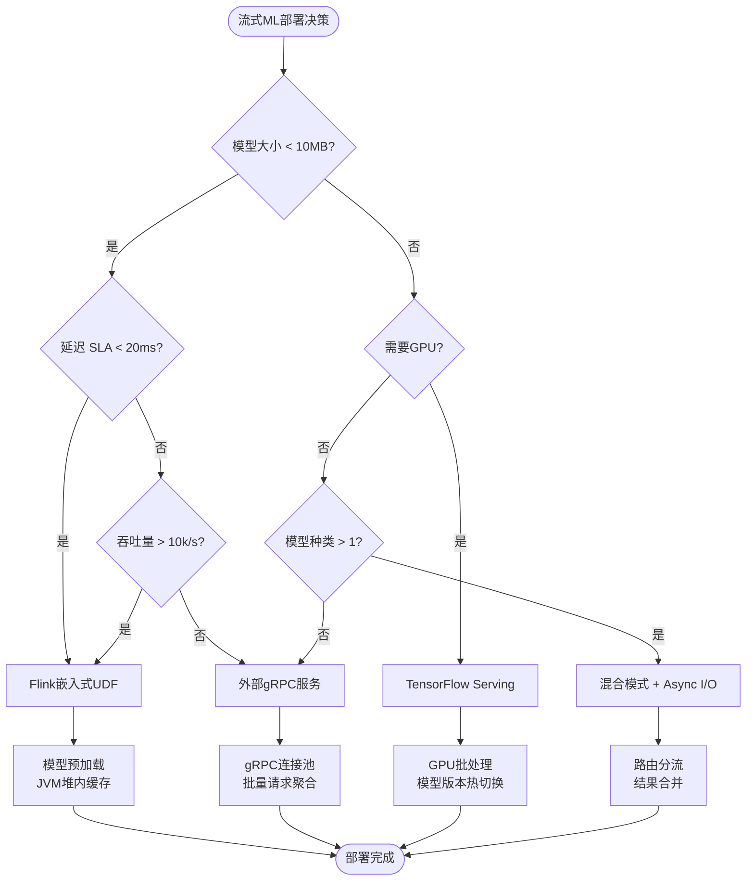
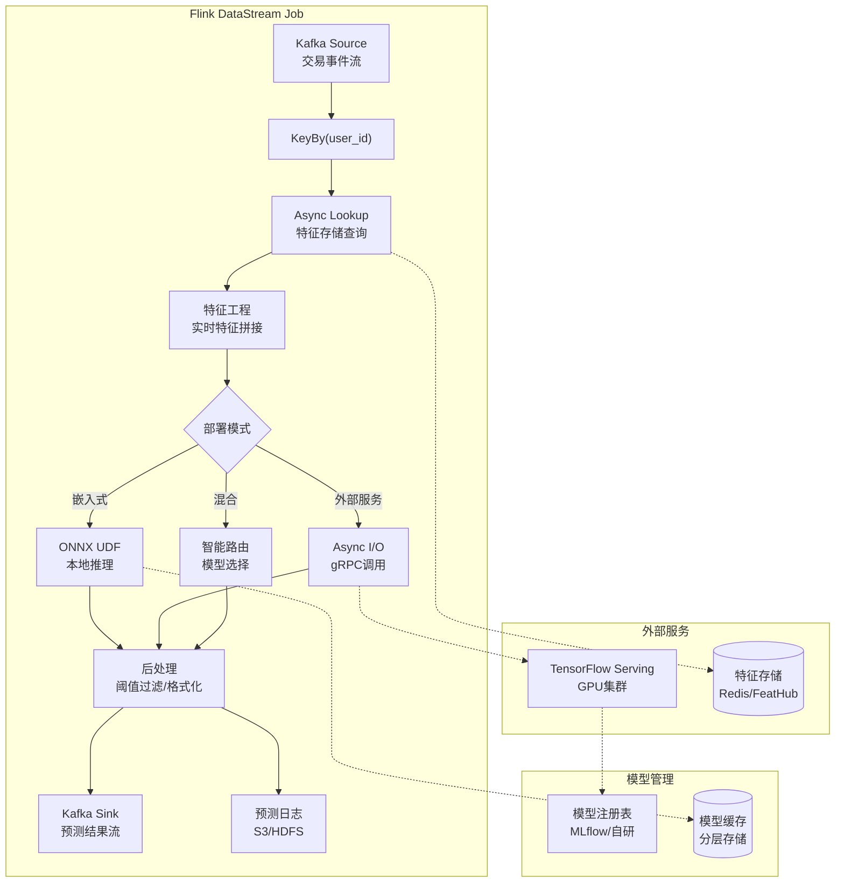
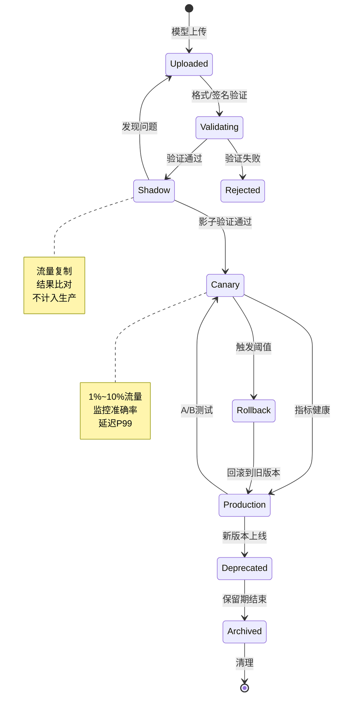
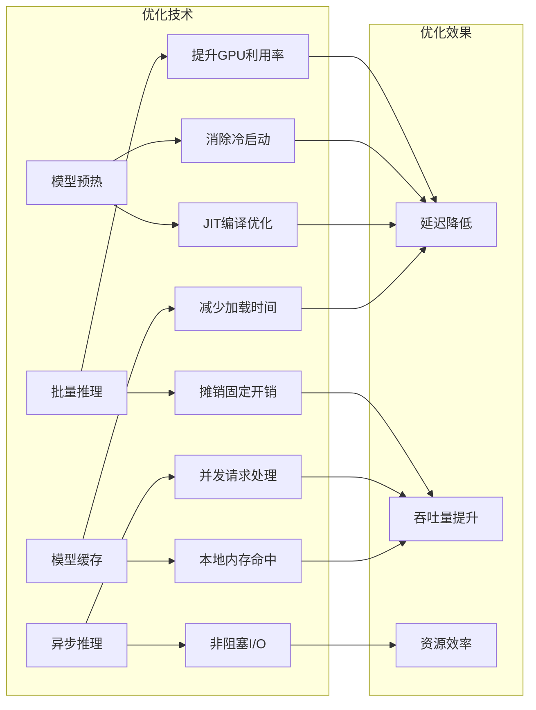

# 模型推理服务化 - 流式ML模型部署

> 所属阶段: Flink | 前置依赖: [Flink/11-feature-engineering/feature-engineering-patterns.md](./realtime-feature-engineering-feature-store.md) | 形式化等级: L3

## 1. 概念定义 (Definitions)

### Def-F-12-07: 模型服务 (Model Serving)

**定义**: 模型服务是将训练完成的机器学习模型部署为可通过网络协议访问的生产级推理服务的过程。

$$\text{ModelServing} = (M, API, S, Q)$$

其中：

- $M$：模型实例，$M = (f_\theta, \mathcal{X}, \mathcal{Y})$，包含参数化的预测函数、输入空间、输出空间
- $API$：服务接口，支持 gRPC/REST 协议
- $S$：服务运行时，包含模型加载器、执行引擎、资源调度器
- $Q$：服务质量约束，$Q = (latency_{SLA}, throughput_{target}, availability_{SLO})$

**模型版本标识**: $M^{(v)}$，其中 $v = (major, minor, patch, timestamp)$

---

### Def-F-12-08: 实时推理管道 (Real-time Inference Pipeline)

**定义**: 实时推理管道是将数据流经过特征转换、模型推理、后处理三个阶段连续处理的计算图。

$$\mathcal{P}_{inference} = (G_{feat}, G_{model}, G_{post}, \mathcal{D}_{stream})$$

其中：

- $G_{feat}$：特征工程子图，将原始事件 $e$ 映射为特征向量 $\mathbf{x}$
- $G_{model}$：模型推理子图，执行 $\hat{y} = f_\theta(\mathbf{x})$
- $G_{post}$：后处理子图，将 $\hat{y}$ 转换为业务输出
- $\mathcal{D}_{stream}$：数据流定义，包含 Schema 和 Watermark 策略

**端到端延迟约束**:
$$\mathcal{L}_{total} = \mathcal{L}_{feat} + \mathcal{L}_{inference} + \mathcal{L}_{post} \leq \mathcal{L}_{SLA}$$

---

### Def-F-12-09: 模型版本管理 (Model Version Management)

**定义**: 模型版本管理是对生产环境中多版本模型的生命周期控制，包括部署、路由、回滚和下线。

$$\mathcal{V}_{mgmt} = (\mathcal{M}_{versions}, \pi_{routing}, \mathcal{T}_{lifecycle})$$

其中：

- $\mathcal{M}_{versions} = \{M^{(v_1)}, M^{(v_2)}, ..., M^{(v_n)}\}$：版本集合
- $\pi_{routing}: Request \to M^{(v)}$：版本路由策略
- $\mathcal{T}_{lifecycle}$：状态转移系统，$State \in \{Canary, Shadow, Production, Deprecated\}$

**蓝绿部署切换条件**:
$$\text{Promote}(M^{(v_{new})}) \iff accuracy_{canary} \geq accuracy_{production} \land error\_rate_{canary} < \theta_{error}$$

## 2. 属性推导 (Properties)

### Lemma-F-12-03: 推理延迟分解

**引理**: 在流式推理管道中，端到端延迟可分解为确定性组件和随机性组件。

$$\mathcal{L}_{inference} = \underbrace{\mathcal{L}_{load} + \mathcal{L}_{preprocess}}_{\text{确定性}} + \underbrace{\mathcal{L}_{compute} + \mathcal{L}_{serialize}}_{\text{随机性}}$$

**证明概要**:

1. $\mathcal{L}_{load}$：模型从存储加载到内存，IO-bound，近似常数
2. $\mathcal{L}_{preprocess}$：输入标准化/编码，CPU-bound，与输入尺寸线性相关
3. $\mathcal{L}_{compute}$：神经网络前向传播，受GPU/CPU调度影响，服从分布
4. $\mathcal{L}_{serialize}$：结果序列化，与输出复杂度相关

---

### Lemma-F-12-04: 批量推理吞吐量增益

**引理**: 对于支持批处理的模型，批量推理的吞吐量提升存在边际递减效应。

$$Throughput(B) = \frac{B}{\mathcal{L}_{fixed} + B \cdot \mathcal{L}_{per\_sample} + \mathcal{L}_{batch\_overhead}}$$

当 $B \to \infty$ 时，$Throughput(B) \to \frac{1}{\mathcal{L}_{per\_sample}}$

**最优批量推导**:
$$B^* = \arg\max_B Throughput(B) \text{ s.t. } \mathcal{L}_{batch}(B) \leq \mathcal{L}_{SLA}$$

---

### Prop-F-12-04: 外部服务调用的可用性约束

**命题**: 当采用外部推理服务时，端到端可用性受 Flink 和外部服务可用性的联合约束。

$$Availability_{total} = Availability_{Flink} \times Availability_{Service} \times (1 - P_{timeout\_cascade})$$

其中 $P_{timeout\_cascade}$ 为超时级联故障概率。

## 3. 关系建立 (Relations)

### 与特征工程的关系

实时推理管道与特征工程形成紧密耦合的生产链路：

```
原始事件流 → [特征工程] → 特征向量 → [模型推理] → 预测结果 → 业务动作
                    ↑                              ↓
            特征存储 (Online/Offline) ← 预测日志 (Feedback)
```

**关键映射**: 训练时特征工程逻辑必须在推理时精确复现，否则产生训练-推理偏斜。

---

### 与 Checkpoint 机制的关系

模型状态作为 Flink 状态的一部分参与 Checkpoint：

$$Checkpoint_{inference} = (OperatorState_{pipeline}, ModelState_{version}, Buffer_{inflight})$$

**一致性级别**:

- **Exactly-Once**: 推理结果与 Checkpoint 绑定，故障时重放
- **At-Least-Once**: 允许重复推理，业务层幂等处理

---

### 部署模式对比矩阵

| 模式 | 延迟 | 吞吐量 | 资源隔离 | 运维复杂度 | 适用场景 |
|------|------|--------|----------|------------|----------|
| 嵌入式 (UDF) | < 10ms | 高 | 低 | 低 | 简单模型、低延迟 |
| 外部 gRPC | 20-50ms | 中 | 高 | 中 | 复杂模型、GPU加速 |
| 外部 REST | 50-100ms | 中低 | 高 | 中 | 跨语言、团队分离 |
| 混合模式 | 自适应 | 高 | 高 | 高 | 异构模型、A/B测试 |

## 4. 论证过程 (Argumentation)

### 部署模式选择论证

**场景1: 欺诈检测实时评分**

- 模型：XGBoost，< 1MB
- 延迟 SLA：20ms P99
- 决策：嵌入式 UDF
- 理由：模型小、延迟要求严，避免网络开销

**场景2: 图像分类服务**

- 模型：ResNet50，~100MB
- 需要 GPU 推理
- 决策：外部 TensorFlow Serving
- 理由：模型大、需 GPU，与 Flink 资源隔离

**场景3: 推荐系统多模型融合**

- 模型A：协同过滤 (Flink UDF)
- 模型B：深度学习排序 (外部服务)
- 决策：混合模式 + Async I/O
- 理由：异构模型，最大化资源效率

---

### 版本切换的风险边界

**金丝雀发布数学模型**:

设流量分配比例为 $\alpha$ 流向新版本，则风险暴露：

$$Risk_{exposure} = \alpha \cdot E[loss|M^{(v_{new})} \text{ defective}] + (1-\alpha) \cdot 0$$

**最优金丝雀比例**:
$$\alpha^* = \min\left(\frac{Risk_{budget}}{E[loss]}, \alpha_{statistical\_significance}\right)$$

---

### 缓存策略设计

**模型缓存层级**:

```
L1: JVM Heap (Hot Model) - 命中延迟 < 1μs
L2: Off-Heap Memory (Warm Model) - 命中延迟 < 10μs
L3: Local SSD (Cold Model) - 命中延迟 ~10ms
L4: Remote Storage (Archive) - 命中延迟 > 100ms
```

**缓存失效策略**:

- TTL：基于模型版本发布周期
- LRU：基于模型访问频率
- Explicit：版本切换时主动失效

## 5. 工程论证 (Engineering Argument)

### Thm-F-12-02: 流式推理架构正确性

**定理**: 基于 Flink Async I/O 的混合推理架构满足实时约束下的最大吞吐量。

**论证框架**:

设：

- $\lambda$：事件到达率 (events/s)
- $N$：并发度 (parallelism)
- $C$：外部服务容量 (req/s)
- $T_{async}$：异步等待超时

**约束条件**:

1. **容量约束**: $\frac{\lambda}{N} \leq C$ （单 TaskManager 不超载）
2. **延迟约束**: $\mathcal{L}_{queue} + \mathcal{L}_{network} + \mathcal{L}_{service} \leq \mathcal{L}_{SLA}$
3. **资源约束**: $Memory_{buffer} = N \cdot T_{async} \cdot \frac{\lambda}{N} \cdot Size_{event} \leq Memory_{available}$

**优化目标**:
$$\max \lambda \text{ s.t. 约束1,2,3 满足}$$

**最优解推导**:
$$N^* = \left\lceil \frac{\lambda}{C \cdot (1 - \epsilon_{safety})} \right\rceil$$

其中 $\epsilon_{safety}$ 为安全余量因子。

---

### 批量推理优化论证

**技术原理**: GPU/TPU 对批量矩阵运算有显著加速。

$$Speedup(B) = \frac{B \cdot T_{sequential}}{T_{batch}(B)} \approx \frac{B \cdot T_{compute}}{T_{fixed} + \frac{B}{GPU\_utilization} \cdot T_{compute}}$$

**工程权衡**:

- 批量增大 → 吞吐量 ↑，但延迟 ↑
- 存在帕累托前沿，需根据业务需求选择

**微批累积策略**:

- 时间触发：等待至 $T_{max}$ 或批量达到 $B_{max}$
- 数量触发：累积 $B_{target}$ 条记录立即发送
- 混合触发：先满足任一条件即触发

---

### 模型预热策略

**冷启动问题**: JVM + DL 框架首次推理延迟比稳态高 10-100 倍。

**预热方案对比**:

| 方案 | 实现复杂度 | 预热效果 | 资源开销 |
|------|------------|----------|----------|
| Dummy 预热请求 | 低 | 中 | 低 |
| 模型序列化缓存 | 中 | 高 | 中 |
| JIT 预热 + 模型缓存 | 高 | 极高 | 高 |
| 常驻 Warm Pool | 高 | 最高 | 高 |

**推荐方案**: Flink TaskManager 启动时发送预热请求到外部服务；嵌入式模型在 `open()` 中执行 dummy forward。

## 6. 实例验证 (Examples)

### 实例1: TensorFlow Serving + Flink Async I/O

```java
// 定义外部模型服务调用

import org.apache.flink.streaming.api.datastream.DataStream;
import org.apache.flink.streaming.api.windowing.time.Time;

public class TFServingAsyncFunction
    extends RichAsyncFunction<FeatureVector, Prediction> {

    private transient ManagedChannel channel;
    private transient PredictionServiceGrpc.PredictionServiceBlockingStub stub;

    @Override
    public void open(Configuration parameters) {
        // 建立 gRPC 连接
        channel = ManagedChannelBuilder
            .forAddress("tf-serving", 8501)
            .usePlaintext()
            .build();
        stub = PredictionServiceGrpc.newBlockingStub(channel);
    }

    @Override
    public void asyncInvoke(FeatureVector input,
                           ResultFuture<Prediction> resultFuture) {
        CompletableFuture.supplyAsync(() -> {
            // 构造 TF Serving 请求
            ModelSpec modelSpec = ModelSpec.newBuilder()
                .setName("recommendation")
                .setVersionLabel("stable")
                .build();

            PredictRequest request = PredictRequest.newBuilder()
                .setModelSpec(modelSpec)
                .putInputs("input", toTensorProto(input))
                .build();

            return stub.predict(request);
        }).thenAccept(response -> {
            Prediction pred = fromTensorProto(
                response.getOutputsOrThrow("output"));
            resultFuture.complete(Collections.singletonList(pred));
        });
    }
}

// 在 DataStream 中使用
DataStream<Prediction> predictions = featureStream
    .keyBy(FeatureVector::getUserId)
    .asyncWaitFor(
        new TFServingAsyncFunction(),
        Time.milliseconds(100),  // 超时
        100                      // 并发容量
    );
```

---

### 实例2: 嵌入式 ONNX Runtime UDF

```java
@FunctionHint(
    input = @DataTypeHint("ROW<feature1 FLOAT, feature2 FLOAT, feature3 FLOAT>"),
    output = @DataTypeHint("ROW<score FLOAT, label STRING>")
)
public class OnnxScoringUdf extends TableFunction<Row> {

    private transient OrtEnvironment env;
    private transient OrtSession session;
    private final String modelPath;

    public OnnxScoringUdf(String modelPath) {
        this.modelPath = modelPath;
    }

    @Override
    public void open(RuntimeContext ctx) throws OrtException {
        env = OrtEnvironment.getEnvironment();
        OrtSession.SessionOptions opts = new OrtSession.SessionOptions();
        opts.setInterOpNumThreads(2);
        opts.setIntraOpNumThreads(4);
        // GPU 加速
        opts.addCUDA(0);

        // 加载模型
        session = env.createSession(modelPath, opts);

        // 预热
        warmup();
    }

    public void eval(@DataTypeHint("FLOAT") Float f1,
                     @DataTypeHint("FLOAT") Float f2,
                     @DataTypeHint("FLOAT") Float f3) throws OrtException {

        // 构造输入张量
        float[] inputData = new float[]{f1, f2, f3};
        long[] inputShape = new long[]{1, 3};
        OnnxTensor inputTensor = OnnxTensor.createTensor(
            env, FloatBuffer.wrap(inputData), inputShape);

        // 推理
        OrtSession.Result results = session.run(
            Collections.singletonMap("input", inputTensor));

        // 解析输出
        float[][] output = (float[][]) results.get(0).getValue();
        float score = output[0][0];
        String label = score > 0.5 ? "positive" : "negative";

        collect(Row.of(score, label));
    }

    private void warmup() throws OrtException {
        // 执行虚拟推理预热 JVM + ONNX Runtime
        for (int i = 0; i < 10; i++) {
            float[] dummy = new float[]{0.0f, 0.0f, 0.0f};
            OnnxTensor t = OnnxTensor.createTensor(env,
                FloatBuffer.wrap(dummy), new long[]{1, 3});
            session.run(Collections.singletonMap("input", t));
        }
    }
}
```

---

### 实例3: 模型版本路由配置

```yaml
# model-routing-config.yaml model_registry:
  models:
    - name: fraud_detection
      versions:
        - version: "2.1.0"
          path: "s3://models/fraud/v2.1.0/"
          state: production
          traffic_weight: 0.9
        - version: "2.2.0-rc1"
          path: "s3://models/fraud/v2.2.0-rc1/"
          state: canary
          traffic_weight: 0.1
          rollback_threshold:
            error_rate: 0.01
            latency_p99: 50ms

    - name: recommendation
      versions:
        - version: "1.5.0"
          path: "hdfs://models/rec/v1.5.0/"
          state: production
          traffic_weight: 1.0

routing_strategy:
  type: weighted_random
  sticky_session: true
  session_ttl: 300s
```

---

### 实例4: 批量推理优化

```java
import org.apache.flink.streaming.api.functions.KeyedProcessFunction;

import org.apache.flink.api.common.state.ValueState;
import org.apache.flink.api.common.state.ValueStateDescriptor;


// 批量累积 + 批量推理
public class BatchInferenceFunction
    extends KeyedProcessFunction<String, FeatureVector, Prediction> {

    private ListState<FeatureVector> bufferState;
    private ValueState<Long> timerState;

    private static final int BATCH_SIZE = 32;
    private static final long TIMEOUT_MS = 50;

    @Override
    public void open(Configuration parameters) {
        bufferState = getRuntimeContext().getListState(
            new ListStateDescriptor<>("buffer", FeatureVector.class));
        timerState = getRuntimeContext().getState(
            new ValueStateDescriptor<>("timer", Long.class));
    }

    @Override
    public void processElement(FeatureVector value, Context ctx,
                               Collector<Prediction> out) throws Exception {
        bufferState.add(value);

        // 注册超时定时器
        if (timerState.value() == null) {
            long timer = ctx.timerService().currentProcessingTime() + TIMEOUT_MS;
            ctx.timerService().registerProcessingTimeTimer(timer);
            timerState.update(timer);
        }

        // 达到批量大小立即触发
        Iterable<FeatureVector> buffer = bufferState.get();
        int count = 0;
        for (FeatureVector ignored : buffer) count++;

        if (count >= BATCH_SIZE) {
            ctx.timerService().registerProcessingTimeTimer(
                ctx.timerService().currentProcessingTime());
        }
    }

    @Override
    public void onTimer(long timestamp, OnTimerContext ctx,
                       Collector<Prediction> out) throws Exception {
        // 批量推理
        List<FeatureVector> batch = new ArrayList<>();
        bufferState.get().forEach(batch::add);

        if (!batch.isEmpty()) {
            float[][] inputs = new float[batch.size()][];
            for (int i = 0; i < batch.size(); i++) {
                inputs[i] = batch.get(i).toArray();
            }

            // 一次性批量推理
            float[][] outputs = model.batchPredict(inputs);

            for (int i = 0; i < batch.size(); i++) {
                out.collect(new Prediction(batch.get(i).getId(), outputs[i]));
            }
        }

        bufferState.clear();
        timerState.clear();
    }
}
```

## 5. 形式证明 / 工程论证 (Proof / Engineering Argument)

本文档的证明或工程论证已在正文中完成。详见相关章节。

## 7. 可视化 (Visualizations)

### 部署模式决策树

流式ML模型部署需要综合考虑延迟、吞吐量、资源隔离和运维复杂度。嵌入式模式适合简单模型和低延迟场景，外部服务调用模式适合复杂模型和GPU加速需求，混合模式则提供最大的灵活性。



### 实时推理管道架构图

实时推理管道将特征工程、模型推理和后处理串联为统一的流处理作业。特征存储提供在线特征查询，预测日志用于监控和反馈。外部模型服务通过Async I/O集成，避免阻塞数据流。



### 模型版本生命周期状态图

模型版本经历从开发、测试到生产部署的完整生命周期。金丝雀发布允许在小流量上验证新版本，蓝绿部署实现零停机切换，影子模式用于安全验证而不影响生产流量。



### 推理延迟优化技术对比矩阵



## 8. 引用参考 (References)


---

*文档版本: v1.0 | 创建日期: 2026-04-02 | 形式化等级: L3*

---

*文档版本: v1.0 | 创建日期: 2026-04-20*
