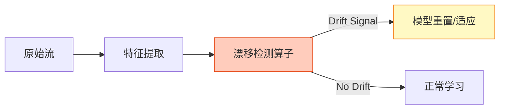
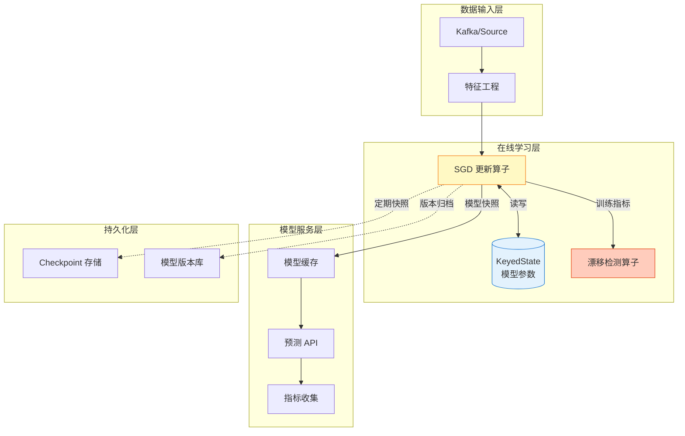
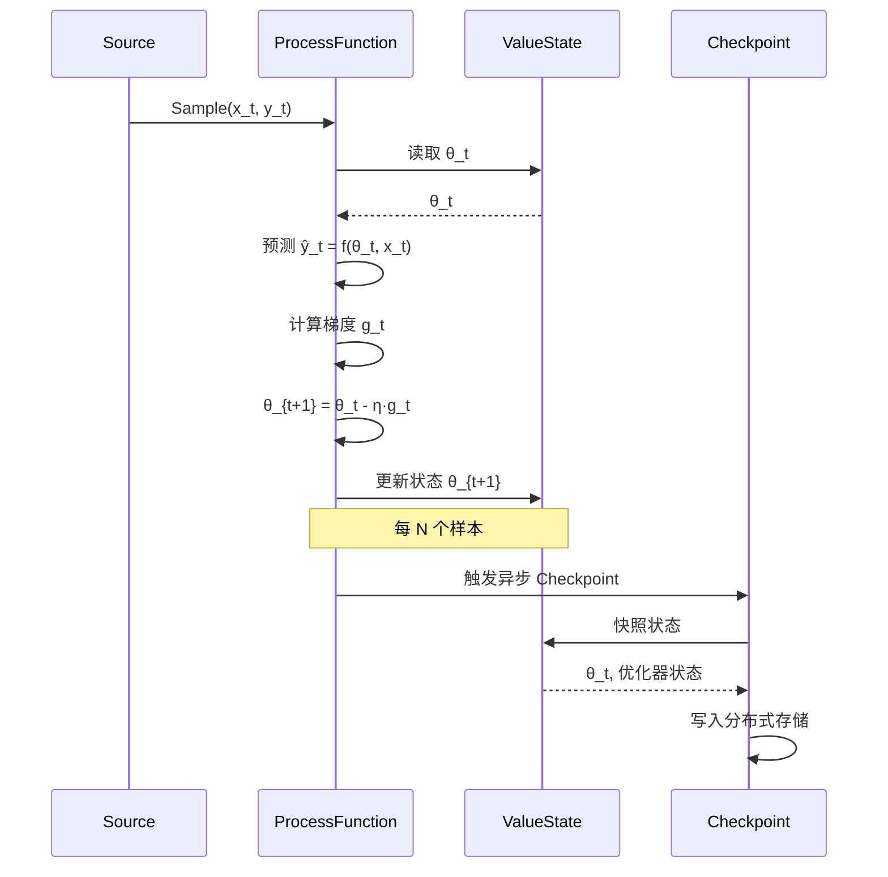
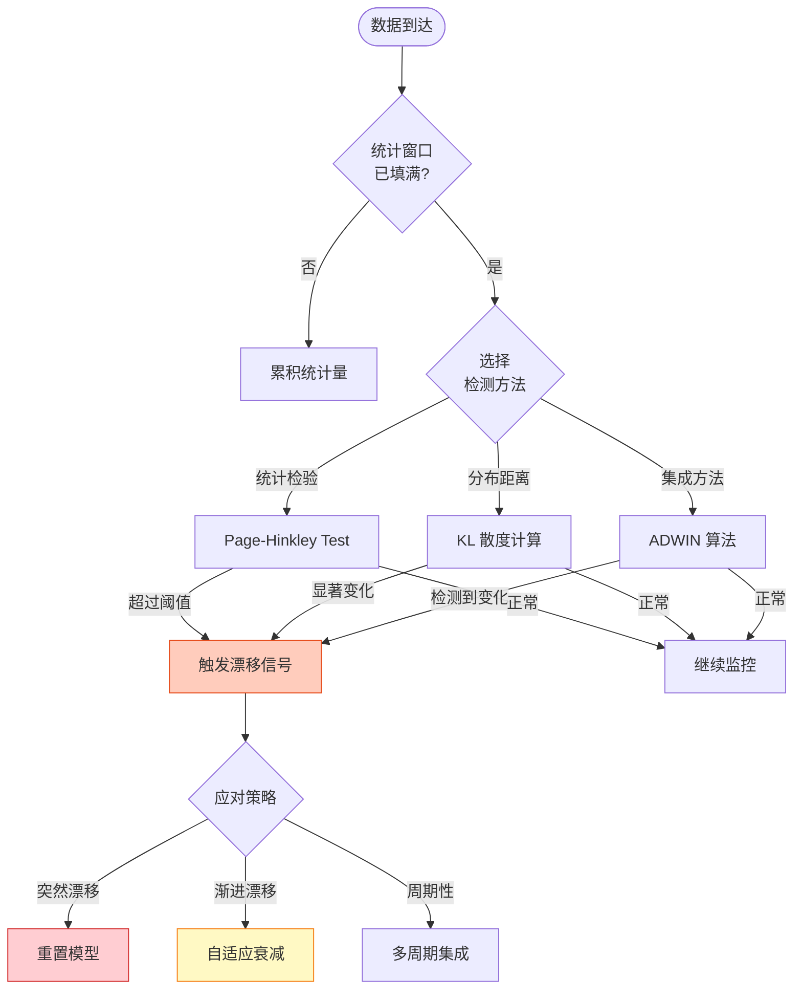
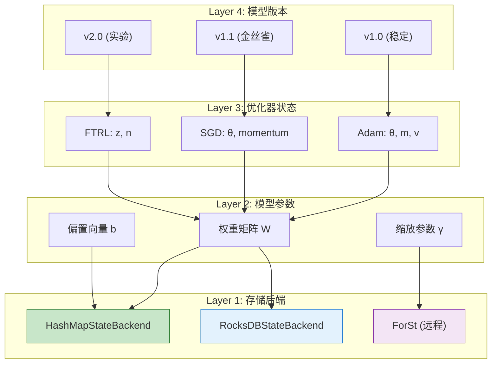
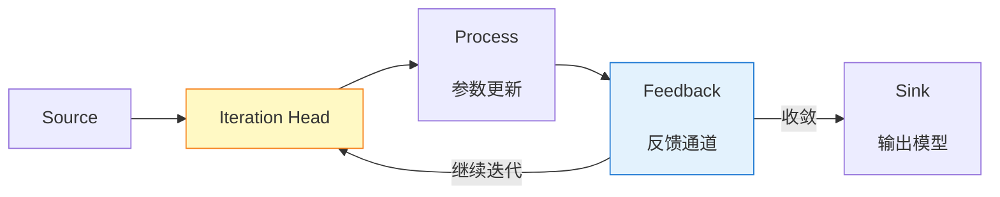

# 在线学习算法 - 流式机器学习核心 (Online Learning Algorithms)

> 所属阶段: Flink/12-ai-ml | 前置依赖: [checkpoint-mechanism-deep-dive.md](../02-core/checkpoint-mechanism-deep-dive.md), [state-backend-selection.md](../09-practices/09.03-performance-tuning/state-backend-selection.md) | 形式化等级: L4

---

## 目录

- [在线学习算法 - 流式机器学习核心 (Online Learning Algorithms)](#在线学习算法-流式机器学习核心-online-learning-algorithms)
  - [目录](#目录)
  - [1. 概念定义 (Definitions)](#1-概念定义-definitions)
    - [Def-F-12-04 (在线学习 Online Learning)](#def-f-12-04-在线学习-online-learning)
    - [Def-F-12-05 (随机梯度下降 SGD)](#def-f-12-05-随机梯度下降-sgd)
    - [Def-F-12-06 (概念漂移 Concept Drift)](#def-f-12-06-概念漂移-concept-drift)
    - [Def-F-12-07 (模型状态 Model State)](#def-f-12-07-模型状态-model-state)
  - [2. 属性推导 (Properties)](#2-属性推导-properties)
    - [Lemma-F-12-01 (SGD 收敛性边界)](#lemma-f-12-01-sgd-收敛性边界)
    - [Lemma-F-12-02 (在线学习后悔界)](#lemma-f-12-02-在线学习后悔界)
    - [Prop-F-12-01 (概念漂移检测的延迟-准确率权衡)](#prop-f-12-01-概念漂移检测的延迟-准确率权衡)
  - [3. 关系建立 (Relations)](#3-关系建立-relations)
    - [关系 1: 在线学习 ⟺ 流处理状态更新](#关系-1-在线学习-流处理状态更新)
    - [关系 2: 模型状态 ⟹ Flink KeyedState](#关系-2-模型状态-flink-keyedstate)
    - [关系 3: 概念漂移检测 ⟹ 异常检测算子](#关系-3-概念漂移检测-异常检测算子)
  - [4. 论证过程 (Argumentation)](#4-论证过程-argumentation)
    - [4.1 在线逻辑回归算法](#41-在线逻辑回归算法)
    - [4.2 在线 FTRL-Proximal 算法](#42-在线-ftrl-proximal-算法)
    - [4.3 自适应学习率算法](#43-自适应学习率算法)
      - [Adagrad](#adagrad)
      - [Adam](#adam)
    - [4.4 增量决策树](#44-增量决策树)
  - [5. 形式证明 / 工程论证 (Proof / Engineering Argument)](#5-形式证明-工程论证-proof-engineering-argument)
    - [Thm-F-12-01 (在线学习参数收敛性)](#thm-f-12-01-在线学习参数收敛性)
    - [Thm-F-12-02 (Flink 模型状态一致性保障)](#thm-f-12-02-flink-模型状态一致性保障)
  - [6. 实例验证 (Examples)](#6-实例验证-examples)
    - [6.1 Flink ML 在线逻辑回归示例](#61-flink-ml-在线逻辑回归示例)
    - [6.2 自定义 ProcessFunction 实现 SGD](#62-自定义-processfunction-实现-sgd)
    - [6.3 概念漂移检测实现](#63-概念漂移检测实现)
    - [6.4 模型版本管理与 A/B 测试](#64-模型版本管理与-ab-测试)
  - [7. 可视化 (Visualizations)](#7-可视化-visualizations)
    - [7.1 在线学习架构图](#71-在线学习架构图)
    - [7.2 SGD 参数更新流程](#72-sgd-参数更新流程)
    - [7.3 概念漂移检测决策树](#73-概念漂移检测决策树)
    - [7.4 模型状态管理层次](#74-模型状态管理层次)
  - [8. 概念漂移处理专题](#8-概念漂移处理专题)
    - [8.1 检测方法](#81-检测方法)
    - [8.2 模型自适应更新](#82-模型自适应更新)
  - [9. Flink 实现深度分析](#9-flink-实现深度分析)
    - [9.1 参数迭代机制](#91-参数迭代机制)
    - [9.2 模型状态管理](#92-模型状态管理)
    - [9.3 检查点与恢复](#93-检查点与恢复)
  - [10. 引用参考 (References)](#10-引用参考-references)

---

## 1. 概念定义 (Definitions)

本节建立流式机器学习的核心形式化定义，为在线学习算法的分析奠定理论基础。

---

### Def-F-12-04 (在线学习 Online Learning)

**在线学习**是一种机器学习范式，模型参数在每个数据样本到达时即时更新，形式化定义为三元组：

$$
\mathcal{O} = \langle \Theta, \mathcal{L}, \mathcal{U} \rangle
$$

其中：

- $\Theta \subseteq \mathbb{R}^d$：参数空间，$d$ 为参数维度
- $\mathcal{L}: \Theta \times (\mathcal{X} \times \mathcal{Y}) \to \mathbb{R}^+$：损失函数，$\mathcal{L}(\theta; (x, y))$ 衡量预测误差
- $\mathcal{U}: \Theta \times (\mathcal{X} \times \mathcal{Y}) \times \mathbb{R}^+ \to \Theta$：参数更新函数，$\theta_{t+1} = \mathcal{U}(\theta_t, (x_t, y_t), \eta_t)$

**在线学习协议**：

```
for t = 1, 2, ..., T:
    接收输入样本 (x_t, y_t) ← Stream
    预测: ŷ_t = f(θ_t; x_t)
    计算损失: ℓ_t = L(θ_t; (x_t, y_t))
    更新参数: θ_{t+1} = U(θ_t, (x_t, y_t), η_t)
```

**直观解释**：与传统批处理学习不同，在线学习像"边学边做"——每来一个数据就立即更新模型，无需等待完整数据集。这使其天然适配流式数据场景[^1][^2]。

---

### Def-F-12-05 (随机梯度下降 SGD)

**随机梯度下降 (Stochastic Gradient Descent)** 是在线学习中最基础的参数更新算法，定义为：

$$
\theta_{t+1} = \theta_t - \eta_t \cdot \nabla_\theta \mathcal{L}(\theta_t; (x_t, y_t))
$$

其中：

- $\eta_t \in \mathbb{R}^+$：第 $t$ 步的学习率
- $\nabla_\theta \mathcal{L}$：损失函数关于参数的梯度
- $(x_t, y_t)$：第 $t$ 时刻到达的样本

**小批量变体 (Mini-batch SGD)**：

$$
\theta_{t+1} = \theta_t - \eta_t \cdot \frac{1}{B} \sum_{i=1}^{B} \nabla_\theta \mathcal{L}(\theta_t; (x_{t,i}, y_{t,i}))
$$

其中 $B$ 为批量大小，平衡更新稳定性与计算效率[^3]。

---

### Def-F-12-06 (概念漂移 Concept Drift)

**概念漂移**指数据分布或目标函数随时间发生的变化，形式化定义为联合分布的偏移：

$$
\exists t: P_t(X, Y) \neq P_{t+1}(X, Y)
$$

**漂移分类**：

| 漂移类型 | 定义 | 数学表征 |
|----------|------|----------|
| **突然漂移** | 分布瞬间改变 | $P_t \neq P_{t+1}$ 且 $t$ 为突变点 |
| **渐进漂移** | 分布缓慢演变 | $P_t = (1-\lambda)P_A + \lambda P_B$, $\lambda \in [0,1]$ |
| **周期性漂移** | 分布周期性重复 | $P_t = P_{t+T}$ 对于周期 $T$ |
| **概念复发** | 历史分布重现 | $\exists s < t: P_t = P_s$ |

**漂移可分解为**：

$$
P_t(X, Y) = P_t(Y|X) \cdot P_t(X)
$$

- **真实漂移 (Real Drift)**：$P_t(Y|X)$ 改变（条件分布变化）
- **虚拟漂移 (Virtual Drift)**：仅 $P_t(X)$ 改变（输入分布变化）[^4][^5]

---

### Def-F-12-07 (模型状态 Model State)

**模型状态**是在线学习系统中需要持久化的全部可学习参数，形式化定义为：

$$
\mathcal{M} = \langle \theta, \mathcal{H}, \mathcal{A} \rangle
$$

其中：

- $\theta \in \mathbb{R}^d$：当前模型参数
- $\mathcal{H}$：优化器历史状态（如 Adagrad 的累积梯度平方）
- $\mathcal{A}$：算法元数据（学习率、迭代计数、版本等）

**状态复杂度分析**：

| 算法 | 状态维度 | 存储复杂度 |
|------|----------|------------|
| SGD | $\theta$ | $O(d)$ |
| Momentum | $\theta, v$ | $O(2d)$ |
| Adagrad | $\theta, G$ | $O(2d)$ |
| Adam | $\theta, m, v$ | $O(3d)$ |

---

## 2. 属性推导 (Properties)

### Lemma-F-12-01 (SGD 收敛性边界)

**命题**：对于 $L$-Lipschitz 连续且 $\mu$-强凸的损失函数，采用递减学习率 $\eta_t = \frac{1}{\mu t}$ 的 SGD 满足：

$$
\mathbb{E}[\|\theta_T - \theta^*\|^2] \leq \frac{2L^2}{\mu^2 T}
$$

其中 $\theta^*$ 为最优参数，$T$ 为迭代次数。

**工程含义**：收敛速率 $O(1/T)$ 意味着在线学习需要足够多的样本才能达到稳定模型。实际系统中需权衡实时性与模型质量[^6]。

---

### Lemma-F-12-02 (在线学习后悔界)

**命题**：在在线凸优化 (OCO) 框架下，采用适当学习率的在线梯度下降满足后悔界：

$$
R_T = \sum_{t=1}^{T} \mathcal{L}(\theta_t; (x_t, y_t)) - \min_{\theta^*} \sum_{t=1}^{T} \mathcal{L}(\theta^*; (x_t, y_t)) \leq O(\sqrt{T})
$$

**平均后悔** $\frac{R_T}{T} \to 0$ 当 $T \to \infty$，表明在线学习在长期来看与最佳固定策略表现相当。

---

### Prop-F-12-01 (概念漂移检测的延迟-准确率权衡)

**命题**：设漂移检测算法使用大小为 $W$ 的滑动窗口，则：

- **检测延迟** $\propto W$：窗口越大，检测越慢
- **误报率** $\propto \frac{1}{\sqrt{W}}$：窗口越大，统计置信度越高

**最优窗口选择**：

$$
W^* = \arg\min_W \left[ \alpha \cdot \mathbb{E}[Delay] + \beta \cdot P_{FP}(W) \right]
$$

其中 $\alpha, \beta$ 为业务权重，反映延迟敏感性与准确性的偏好[^7]。

---

## 3. 关系建立 (Relations)

### 关系 1: 在线学习 ⟺ 流处理状态更新

在线学习的参数更新可映射为 Flink 的状态变换操作：

```
在线学习协议                    Flink DataStream API
────────────────────────────────────────────────────────────────
for each (x_t, y_t):            inputStream.keyBy(...)
    predict = f(θ; x_t)              .process(new Predict())
    loss = L(predict, y_t)           .map(new ComputeLoss())
    θ ← U(θ, (x_t, y_t))             .process(new UpdateParams())
```

**核心洞察**：在线学习的参数 $\theta$ 就是 Flink 的 KeyedState，每次样本触发一次状态更新算子。

---

### 关系 2: 模型状态 ⟹ Flink KeyedState

| 模型状态组件 | Flink 状态类型 | 适用场景 |
|--------------|----------------|----------|
| 模型参数 $\theta$ | ValueState<Double[]> | 全量模型 |
| 特征统计 | MapState<String, Stat> | 特征工程 |
| 优化器状态 | ListState<Double[]> | Adam/Adagrad |
| 样本窗口 | ListState<Sample> | 批量更新 |

---

### 关系 3: 概念漂移检测 ⟹ 异常检测算子

概念漂移检测可建模为流上的异常检测问题：



---

## 4. 论证过程 (Argumentation)

### 4.1 在线逻辑回归算法

**问题定义**：二分类问题，预测概率 $P(y=1|x) = \sigma(\theta^T x)$，其中 $\sigma(z) = \frac{1}{1+e^{-z}}$ 为 sigmoid 函数。

**在线更新规则**：

$$
\nabla_\theta \mathcal{L} = (\sigma(\theta^T x_t) - y_t) \cdot x_t
$$

$$
\theta_{t+1} = \theta_t - \eta_t \cdot (\sigma(\theta^T x_t) - y_t) \cdot x_t
$$

**Flink 实现骨架**：

```java

import org.apache.flink.api.common.state.ValueState;
import org.apache.flink.api.common.state.ValueStateDescriptor;

public class OnlineLogisticRegression extends KeyedProcessFunction<String, Sample, Prediction> {
    private ValueState<double[]> modelState;  // θ
    private ValueState<Double> learningRateState;  // η

    @Override
    public void open(Configuration parameters) {
        modelState = getRuntimeContext().getState(
            new ValueStateDescriptor<>("model", double[].class));
        learningRateState = getRuntimeContext().getState(
            new ValueStateDescriptor<>("lr", Double.class));
    }

    @Override
    public void processElement(Sample sample, Context ctx, Collector<Prediction> out) {
        double[] theta = modelState.value();
        double lr = learningRateState.value();

        // 预测
        double pred = sigmoid(dot(theta, sample.features));

        // 计算梯度并更新
        double[] grad = computeGradient(theta, sample, pred);
        for (int i = 0; i < theta.length; i++) {
            theta[i] -= lr * grad[i];
        }

        // 更新状态
        modelState.update(theta);
        learningRateState.update(decayLR(lr));

        out.collect(new Prediction(sample.id, pred > 0.5));
    }
}
```

---

### 4.2 在线 FTRL-Proximal 算法

**FTRL-Proximal** (Follow-The-Regularized-Leader) 是工业界广泛使用的在线学习算法，特别适用于高维稀疏特征：

**更新规则**：

$$
z_{t+1} = z_t + g_t - \sigma_{t+1} \theta_t
$$

$$
\theta_{t+1} = \begin{cases}
-\frac{z_{t+1}}{\lambda_1 + \sqrt{n_{t+1}}/\alpha + \lambda_2} & |z_{t+1}| > \lambda_1 \\
0 & \text{otherwise}
\end{cases}
$$

其中：

- $g_t = \nabla_\theta \mathcal{L}(\theta_t; (x_t, y_t))$ 为当前梯度
- $n_t = \sum_{s=1}^{t} g_s^2$ 为累积梯度平方
- $\sigma_t = \frac{1}{\alpha}(\sqrt{n_t} - \sqrt{n_{t-1}})$
- $\lambda_1$ 为 L1 正则化系数，$\lambda_2$ 为 L2 正则化系数

**优势**：

1. **稀疏性**：L1 正则产生稀疏模型，节省存储
2. **稳定性**：对特征缩放不敏感
3. **收敛性**：理论保证优于普通 SGD[^8]

---

### 4.3 自适应学习率算法

#### Adagrad

**核心思想**：根据历史梯度自适应调整各参数的学习率。

$$
G_t = G_{t-1} + g_t \odot g_t
$$

$$
\theta_{t+1} = \theta_t - \frac{\eta}{\sqrt{G_t + \epsilon}} \odot g_t
$$

**特点**：频繁出现的特征学习率递减，适合稀疏数据。

#### Adam

**核心思想**：结合动量 (Momentum) 和二阶矩估计。

$$
m_t = \beta_1 m_{t-1} + (1 - \beta_1) g_t \quad \text{(一阶矩)}
$$

$$
v_t = \beta_2 v_{t-1} + (1 - \beta_2) g_t^2 \quad \text{(二阶矩)}
$$

$$
\hat{m}_t = \frac{m_t}{1 - \beta_1^t}, \quad \hat{v}_t = \frac{v_t}{1 - \beta_2^t}
$$

$$
\theta_{t+1} = \theta_t - \frac{\eta \cdot \hat{m}_t}{\sqrt{\hat{v}_t} + \epsilon}
$$

**默认超参**：$\beta_1 = 0.9$, $\beta_2 = 0.999$, $\epsilon = 10^{-8}$[^9]

---

### 4.4 增量决策树

**Hoeffding Tree** 是经典的增量决策树算法：

**算法核心**：

1. 使用 Hoeffding 边界确定何时分裂节点
2. 仅需有限样本即可做出与批处理相同的分裂决策
3. 支持概念漂移适应（如 Hoeffding Adaptive Tree）

**分裂条件**：

$$
\Delta G = G(X_a) - G(X_b) > \epsilon
$$

其中 $\epsilon = \sqrt{\frac{R^2 \ln(1/\delta)}{2n}}$ 为 Hoeffding 边界，$G$ 为不纯度度量。

---

## 5. 形式证明 / 工程论证 (Proof / Engineering Argument)

### Thm-F-12-01 (在线学习参数收敛性)

**定理**：在以下条件下：

1. 损失函数 $\mathcal{L}$ 是凸函数且 $L$-Lipschitz 连续
2. 参数空间 $\Theta$ 有界，$\|\theta\| \leq D$
3. 学习率满足 $\sum_{t=1}^{\infty} \eta_t = \infty$ 且 $\sum_{t=1}^{\infty} \eta_t^2 < \infty$

则在线梯度下降收敛到最优解：

$$
\lim_{T \to \infty} \frac{1}{T} \sum_{t=1}^{T} \mathcal{L}(\theta_t) = \mathcal{L}(\theta^*)
$$

**证明概要**：

考虑参数与最优解的距离：

$$
\|\theta_{t+1} - \theta^*\|^2 = \|\theta_t - \eta_t g_t - \theta^*\|^2
$$

展开并取期望：

$$
\mathbb{E}[\|\theta_{t+1} - \theta^*\|^2] \leq \|\theta_t - \theta^*\|^2 - 2\eta_t(\mathcal{L}(\theta_t) - \mathcal{L}(\theta^*)) + \eta_t^2 L^2
$$

累加 $t = 1$ 到 $T$：

$$
\sum_{t=1}^{T} \eta_t (\mathcal{L}(\theta_t) - \mathcal{L}(\theta^*)) \leq \frac{D^2 + L^2 \sum_{t=1}^{T} \eta_t^2}{2}
$$

令 $\eta_t = O(1/\sqrt{t})$，应用 Jensen 不等式得证。

---

### Thm-F-12-02 (Flink 模型状态一致性保障)

**定理**：基于 Flink Checkpoint 机制的在线学习系统，在启用 Exactly-Once 语义时，模型状态满足线性一致性 (Linearizability)。

**工程论证**：

**前提条件**：

1. 模型状态存储于 KeyedStateBackend
2. Checkpoint 间隔为 $I$，超时时间为 $T_{timeout}$
3. 使用两阶段提交 (2PC) 的 Sink

**一致性保证**：

```
设 CP_k 为第 k 个 Checkpoint,包含模型状态 M_k
设 R 为从 CP_k 恢复的实例

需证明: R 的状态等价于 CP_k 创建时刻的某一刻状态快照

论证:
1. Checkpoint Barrier n 对齐保证: 所有上游算子在处理 Barrier n 前
   产生的数据都已被当前算子处理

2. KeyedStateBackend 快照: 在收到所有上游 Barrier n 后,
   触发状态快照,捕获此刻的完整模型状态

3. 增量 Checkpoint: 仅序列化自 CP_{k-1} 以来变化的状态

4. 恢复时: 从 CP_k 加载状态,重放未确认数据
   保证模型参数与故障前一致
```

**边界条件**：

- 学习率衰减状态需随模型一起 checkpoint
- 优化器历史状态 (m, v in Adam) 必须完整恢复
- 特征统计信息需版本化以防止跨 checkpoint 不一致

---

## 6. 实例验证 (Examples)

### 6.1 Flink ML 在线逻辑回归示例

```java
import org.apache.flink.ml.classification.logisticregression;
import org.apache.flink.ml.feature.standardscaler;

import org.apache.flink.streaming.api.environment.StreamExecutionEnvironment;
import org.apache.flink.streaming.api.datastream.DataStream;


// 1. 构建在线学习管道
StreamExecutionEnvironment env =
    StreamExecutionEnvironment.getExecutionEnvironment();
env.enableCheckpointing(60000);  // 60s checkpoint

// 2. 配置在线逻辑回归
LogisticRegression lr = new LogisticRegression()
    .setLearningRate(0.01)
    .setReg(0.1)
    .setGlobalBatchSize(32)  // mini-batch SGD
    .setMaxIter(1000)
    .setFeaturesCol("features")
    .setLabelCol("label");

// 3. 创建在线学习流
DataStream<Row> trainingStream = env
    .addSource(new KafkaSource<>())
    .map(new FeatureExtractor());

// 4. 在线训练
OnlineTrainer trainer = new OnlineTrainer(lr);
trainer.fit(trainingStream);

// 5. 部署预测服务
DataStream<Prediction> predictions = trainer
    .getModelStream()
    .broadcast()
    .connect(testStream)
    .process(new PredictionJoin());
```

---

### 6.2 自定义 ProcessFunction 实现 SGD

```java

import org.apache.flink.api.common.state.ValueState;
import org.apache.flink.api.common.state.ValueStateDescriptor;

public class OnlineSGDTrainer extends KeyedProcessFunction<String,
        LabeledVector, ModelUpdate> {

    // 模型参数状态
    private ValueState<DenseVector> weightsState;
    private ValueState<Double> biasState;
    private ValueState<Long> iterationState;

    // 优化器状态 (Adam)
    private ValueState<DenseVector> mState;  // 一阶矩
    private ValueState<DenseVector> vState;  // 二阶矩

    private final double learningRate = 0.001;
    private final double beta1 = 0.9;
    private final double beta2 = 0.999;
    private final double epsilon = 1e-8;

    @Override
    public void open(Configuration parameters) {
        weightsState = getRuntimeContext().getState(
            new ValueStateDescriptor<>("weights", DenseVector.class));
        biasState = getRuntimeContext().getState(
            new ValueStateDescriptor<>("bias", Double.class));
        iterationState = getRuntimeContext().getState(
            new ValueStateDescriptor<>("iter", Long.class));
        mState = getRuntimeContext().getState(
            new ValueStateDescriptor<>("m", DenseVector.class));
        vState = getRuntimeContext().getState(
            new ValueStateDescriptor<>("v", DenseVector.class));
    }

    @Override
    public void processElement(LabeledVector sample, Context ctx,
            Collector<ModelUpdate> out) throws Exception {

        DenseVector w = weightsState.value();
        double b = biasState.value();
        long t = iterationState.value() + 1;
        DenseVector m = mState.value();
        DenseVector v = vState.value();

        // 前向传播
        double z = w.dot(sample.vector) + b;
        double pred = 1.0 / (1.0 + Math.exp(-z));

        // 计算梯度
        double error = pred - sample.label;
        DenseVector gradW = sample.vector.scale(error);
        double gradB = error;

        // Adam 更新
        m = m.scale(beta1).add(gradW.scale(1 - beta1));
        v = v.scale(beta2).add(gradW.hadamard(gradW).scale(1 - beta2));

        DenseVector mHat = m.scale(1.0 / (1 - Math.pow(beta1, t)));
        DenseVector vHat = v.scale(1.0 / (1 - Math.pow(beta2, t)));

        // 参数更新
        for (int i = 0; i < w.size(); i++) {
            double update = learningRate * mHat.get(i) /
                (Math.sqrt(vHat.get(i)) + epsilon);
            w.set(i, w.get(i) - update);
        }
        b -= learningRate * gradB;

        // 保存状态
        weightsState.update(w);
        biasState.update(b);
        iterationState.update(t);
        mState.update(m);
        vState.update(v);

        // 输出训练指标
        out.collect(new ModelUpdate(t, computeLoss(pred, sample.label), w));
    }
}
```

---

### 6.3 概念漂移检测实现

```java
public class DriftDetector extends KeyedProcessFunction<String,
        PredictionResult, DriftAlert> {

    // 参考窗口与检测窗口
    private ListState<PredictionResult> referenceWindow;
    private ListState<PredictionResult> detectionWindow;

    private final int referenceSize = 1000;
    private final int detectionSize = 500;
    private final double threshold = 0.1;

    @Override
    public void processElement(PredictionResult result, Context ctx,
            Collector<DriftAlert> out) throws Exception {

        Iterable<PredictionResult> refIter = referenceWindow.get();
        int refCount = 0;
        for (PredictionResult r : refIter) refCount++;

        if (refCount < referenceSize) {
            // 填充参考窗口
            referenceWindow.add(result);
        } else {
            // 填充检测窗口
            detectionWindow.add(result);

            Iterable<PredictionResult> detIter = detectionWindow.get();
            int detCount = 0;
            for (PredictionResult r : detIter) detCount++;

            if (detCount >= detectionSize) {
                // 执行 drift 检测 (如 Page-Hinkley Test)
                double phStatistic = computePageHinkley(refIter, detIter);

                if (Math.abs(phStatistic) > threshold) {
                    out.collect(new DriftAlert(ctx.timestamp(),
                        DriftType.SUDDEN, phStatistic));

                    // 重置参考窗口
                    referenceWindow.clear();
                    referenceWindow.addAll(detectionWindow.get());
                    detectionWindow.clear();
                }
            }
        }
    }

    private double computePageHinkley(Iterable<PredictionResult> ref,
            Iterable<PredictionResult> det) {
        // Page-Hinkley Test 实现
        double sumErrors = 0;
        double cumSum = 0;
        int count = 0;

        for (PredictionResult r : ref) {
            sumErrors += r.error;
            count++;
        }
        double meanError = sumErrors / count;

        for (PredictionResult r : det) {
            cumSum += (r.error - meanError) - 0.005;  // 0.005 为容忍参数
        }

        return cumSum;
    }
}
```

---

### 6.4 模型版本管理与 A/B 测试

```java

import org.apache.flink.api.common.state.ValueState;
import org.apache.flink.api.common.state.ValueStateDescriptor;

public class ModelVersionManager extends KeyedProcessFunction<String,
        Sample, Prediction> {

    // 多版本模型状态
    private MapState<Integer, ModelVersion> modelVersions;
    private ValueState<Integer> activeVersionState;

    // A/B 测试分流
    private ValueState<Random> randomState;

    @Override
    public void open(Configuration parameters) {
        modelVersions = getRuntimeContext().getMapState(
            new MapStateDescriptor<>("models", Integer.class, ModelVersion.class));
        activeVersionState = getRuntimeContext().getState(
            new ValueStateDescriptor<>("activeVersion", Integer.class));
        randomState = getRuntimeContext().getState(
            new ValueStateDescriptor<>("random", Random.class));
    }

    @Override
    public void processElement(Sample sample, Context ctx,
            Collector<Prediction> out) throws Exception {

        // 判断是否为模型更新控制消息
        if (sample.isControlMessage()) {
            handleControlMessage(sample, ctx);
            return;
        }

        // A/B 测试分流
        int selectedVersion = selectVersion(sample.userId);
        ModelVersion model = modelVersions.get(selectedVersion);

        // 执行预测
        double pred = model.predict(sample.features);

        // 记录指标用于后续评估
        ctx.output(metricsTag, new ModelMetrics(selectedVersion,
            sample.label, pred, ctx.timestamp()));

        // 在线学习更新 (仅更新选中版本)
        if (selectedVersion == activeVersionState.value()) {
            model.update(sample);
            modelVersions.put(selectedVersion, model);
        }

        out.collect(new Prediction(sample.id, pred, selectedVersion));
    }

    private int selectVersion(String userId) {
        // 一致性哈希确保同一用户始终路由到同一版本
        int hash = userId.hashCode() % 100;
        return hash < 90 ? activeVersionState.value() : getCanaryVersion();
    }

    private void handleControlMessage(Sample msg, Context ctx) {
        switch (msg.command) {
            case "DEPLOY":
                // 部署新版本 (金丝雀发布)
                modelVersions.put(msg.versionId, msg.model);
                break;
            case "PROMOTE":
                // 提升为新主版本
                activeVersionState.update(msg.versionId);
                break;
            case "ROLLBACK":
                // 回滚到指定版本
                activeVersionState.update(msg.versionId);
                break;
        }
    }
}
```

---

## 7. 可视化 (Visualizations)

### 7.1 在线学习架构图



---

### 7.2 SGD 参数更新流程



---

### 7.3 概念漂移检测决策树



---

### 7.4 模型状态管理层次



---

## 8. 概念漂移处理专题

### 8.1 检测方法

**1. 统计检验方法**

| 方法 | 原理 | 适用场景 | 延迟 |
|------|------|----------|------|
| **Page-Hinkley Test** | 累积误差偏差检测 | 突然漂移 | 低 |
| **ADWIN** | 自适应窗口分割 | 渐进漂移 | 中 |
| **DDM/EDDM** | 错误率监控 | 分类任务 | 低 |
| **Kolmogorov-Smirnov** | 分布差异检验 | 特征漂移 | 高 |

**2. 基于窗口的方法**

```
滑动窗口检测框架:
─────────────────────────────────────────────────────
Reference Window W_ref (大小 N_ref)
    ↓ 比较统计量
Detection Window W_det (大小 N_det)
    ↓ 触发条件
Drift Alert / Continue
─────────────────────────────────────────────────────
```

**3. Flink 集成检测**

```java

import org.apache.flink.streaming.api.windowing.time.Time;

// 使用 FlinkCEP 进行漂移模式检测
Pattern<Metric, ?> driftPattern = Pattern.<Metric>begin("start")
    .where(evt -> evt.errorRate > baseline * 1.2)
    .next("middle")
    .where(evt -> evt.errorRate > baseline * 1.3)
    .within(Time.seconds(60));

CEP.pattern(metricStream, driftPattern)
    .process(new PatternHandler() {
        @Override
        public void processMatch(Map<String, List<Metric>> match,
                Context ctx, Collector<DriftAlert> out) {
            out.collect(new DriftAlert(DriftType.ERROR_SPIKE, ctx.timestamp()));
        }
    });
```

---

### 8.2 模型自适应更新

**自适应策略矩阵**：

| 漂移类型 | 检测特征 | 应对策略 | 实现复杂度 |
|----------|----------|----------|------------|
| 突然漂移 | 统计量突变 | 模型重置 + 热启动 | 低 |
| 渐进漂移 | 缓慢统计变化 | 学习率调整 / 正则化 | 中 |
| 周期性 | 周期性模式 | 多模型集成 | 高 |
| 概念复发 | 历史模式重现 | 模型库 + 检索 | 高 |

**学习率自适应**：

```java
public class AdaptiveLearningRate {
    // 基于漂移检测的学习率调整
    public double adjustLR(double currentLR, DriftType drift) {
        switch (drift) {
            case SUDDEN:
                // 突然漂移:增大学习率快速适应
                return Math.min(currentLR * 2.0, MAX_LR);
            case GRADUAL:
                // 渐进漂移:温和调整
                return currentLR * 1.2;
            case STABLE:
                // 稳定期:衰减学习率
                return currentLR * DECAY_RATE;
            default:
                return currentLR;
        }
    }

    // 基于验证损失的自动调整
    public double adjustLRWithValidation(double lr,
            double trainLoss, double valLoss) {
        if (valLoss > prevValLoss * 1.1) {
            // 过拟合信号
            return lr * 0.5;
        }
        return lr;
    }
}
```

---

## 9. Flink 实现深度分析

### 9.1 参数迭代机制

**迭代拓扑设计**：



**迭代算子实现要点**：

1. **迭代头 (Iteration Head)**：维护迭代状态（当前轮次、收敛标志）
2. **反馈通道**：将更新后的参数反馈到下一轮
3. **终止条件**：基于收敛阈值或最大迭代次数

---

### 9.2 模型状态管理

**状态类型选择决策矩阵**：

| 模型规模 | 推荐状态类型 | 状态后端 | 理由 |
|----------|--------------|----------|------|
| < 10MB | ValueState<Double[]> | HashMap | 低延迟访问 |
| 10MB - 1GB | ValueState<Double[]> | RocksDB | 大堆外内存支持 |
| > 1GB | 分片 ValueState | RocksDB/ForSt | 水平扩展 |
| 稀疏模型 | MapState<Long, Double> | RocksDB | 仅存储非零参数 |

**大模型状态优化**：

```java
import org.apache.flink.api.common.state.ListState;

// 参数分片策略
public class ShardedModelState {
    private static final int NUM_SHARDS = 100;

    private ListState<DenseVector> shardStates;

    @Override
    public void open(Configuration parameters) {
        // 将大模型参数分片存储
        shardStates = getRuntimeContext().getListState(
            new ListStateDescriptor<>("modelShards", DenseVector.class));
    }

    public DenseVector getParameter(int index) throws Exception {
        int shardId = index % NUM_SHARDS;
        int localIdx = index / NUM_SHARDS;

        Iterable<DenseVector> shards = shardStates.get();
        int i = 0;
        for (DenseVector shard : shards) {
            if (i == shardId) {
                return shard.slice(localIdx * SHARD_SIZE,
                    (localIdx + 1) * SHARD_SIZE);
            }
            i++;
        }
        return null;
    }
}
```

---

### 9.3 检查点与恢复

**模型状态 Checkpoint 流程**：

```
1. Checkpoint Coordinator 触发 Checkpoint N
2. 训练算子收到 Barrier N
   ├── 暂停参数更新
   ├── 触发状态快照
   │   └── KeyedStateBackend 序列化 θ, m, v
   ├── 异步写入 Checkpoint 存储
   └── 继续处理
3. 所有算子确认后,Checkpoint N 完成
```

**故障恢复策略**：

```java
public class FaultTolerantOnlineLearning {

    // 恢复时重建状态
    @Override
    public void initializeState(FunctionInitializationContext context) {
        // 从 Checkpoint 恢复模型参数
        modelState = context.getKeyedStateStore().getState(
            new ValueStateDescriptor<>("model", DenseVector.class));

        // 恢复优化器状态
        optimizerState = context.getKeyedStateStore().getState(
            new ValueStateDescriptor<>("optimizer", AdamState.class));

        // 恢复训练进度
        progressState = context.getKeyedStateStore().getState(
            new ValueStateDescriptor<>("progress", TrainingProgress.class));
    }

    // 增量 Checkpoint 优化
    @Override
    public void snapshotState(FunctionSnapshotContext context) {
        // 仅序列化变更的参数 (RocksDB Incremental Checkpoint 自动处理)
        // 或手动实现 delta 编码
        if (useDeltaEncoding) {
            checkpointDelta(context.getCheckpointId());
        }
    }
}
```

**Checkpoint 配置建议**：

```yaml
# flink-conf.yaml
# 在线学习场景推荐配置
state.backend: rocksdb
state.backend.incremental: true
state.checkpoint-storage: filesystem
state.checkpoints.dir: s3://bucket/checkpoints

# 更频繁的 checkpoint 以减少恢复损失
execution.checkpointing.interval: 30s
execution.checkpointing.timeout: 10min
execution.checkpointing.max-concurrent-checkpoints: 1

# 启用增量 savepoint 用于模型版本归档
state.savepoints.dir: s3://bucket/savepoints
```

---

## 10. 引用参考 (References)

[^1]: S. Shalev-Shwartz, "Online Learning and Online Convex Optimization," Foundations and Trends in Machine Learning, 4(2), 2012. <https://www.cs.huji.ac.il/~shais/papers/OLsurvey.pdf>

[^2]: J. Duchi, E. Hazan, and Y. Singer, "Adaptive Subgradient Methods for Online Learning and Stochastic Optimization," JMLR, 12, 2011. <https://jmlr.org/papers/v12/duchi11a.html>

[^3]: L. Bottou, "Stochastic Gradient Descent Tricks," in Neural Networks: Tricks of the Trade, Springer, 2012. <https://leon.bottou.org/papers/bottou-tricks-2012>

[^4]: J. Gama et al., "A Survey on Concept Drift Adaptation," ACM Computing Surveys, 46(4), 2014. <https://doi.org/10.1145/2523813>

[^5]: I. Katakis, G. Tsoumakas, and I. Vlahavas, "Tracking Recurring Contexts using Ensemble Classifiers: an Application to Email Filtering," Knowledge and Information Systems, 2010. <[DOI: 10.1007/s10115-009-0226-2]>

[^6]: A. Rakhlin et al., "Making Gradient Descent Optimal for Strongly Convex Stochastic Optimization," ICML 2012. <https://arxiv.org/abs/1109.5647>

[^7]: A. Bifet and R. Gavalda, "Learning from Time-Changing Data with Adaptive Windowing," SIAM International Conference on Data Mining, 2007. <https://doi.org/10.1137/1.9781611972771.42>

[^8]: H. B. McMahan et al., "Ad Click Prediction: a View from the Trenches," KDD 2013. <https://doi.org/10.1145/2487575.2488200>

[^9]: D. Kingma and J. Ba, "Adam: A Method for Stochastic Optimization," ICLR 2015. <https://arxiv.org/abs/1412.6980>


---

*文档创建时间: 2026-04-02*
*适用项目: AnalysisDataFlow/Flink*
*形式化等级: L4 (系统深度剖析)*
