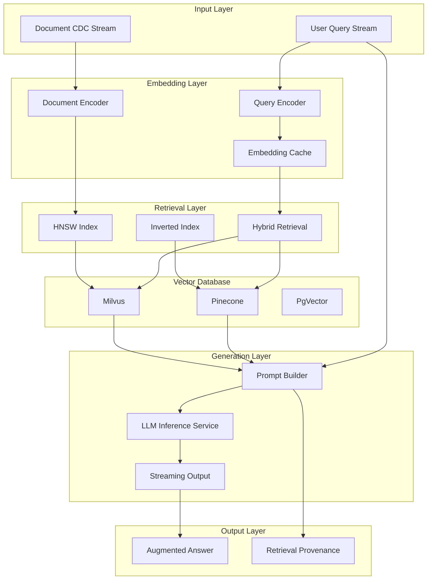
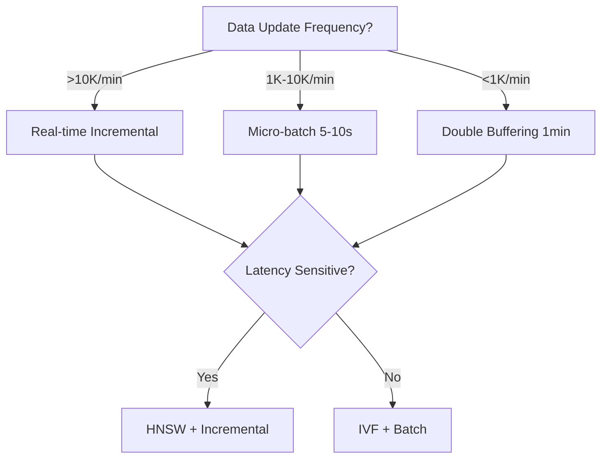
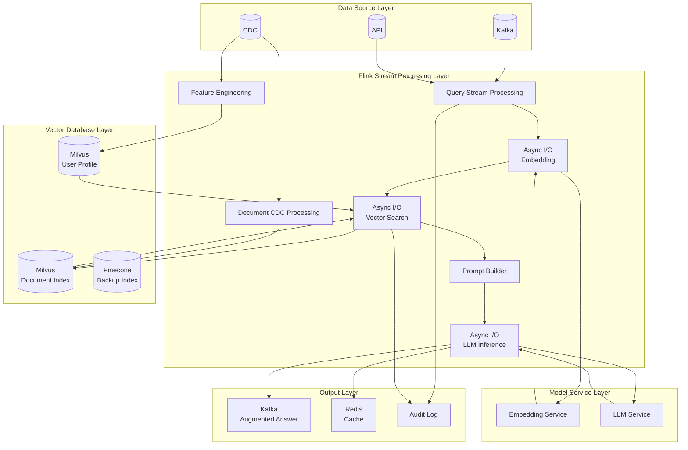
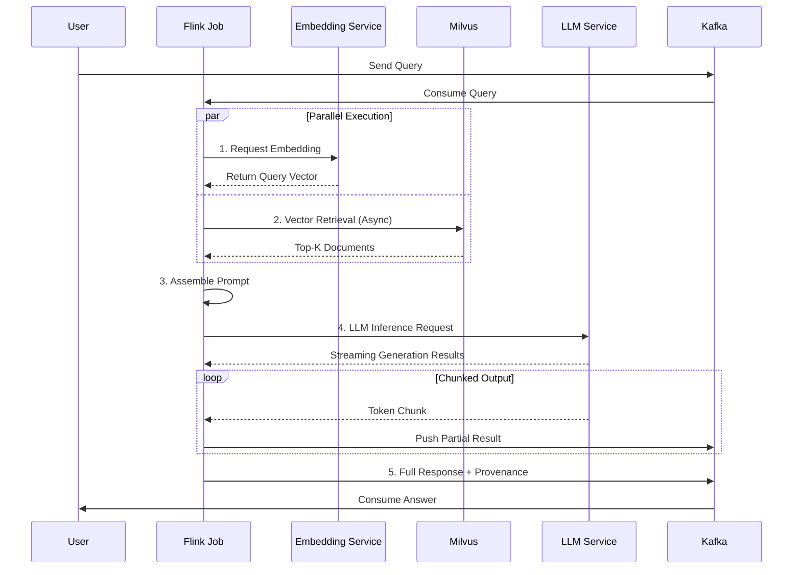
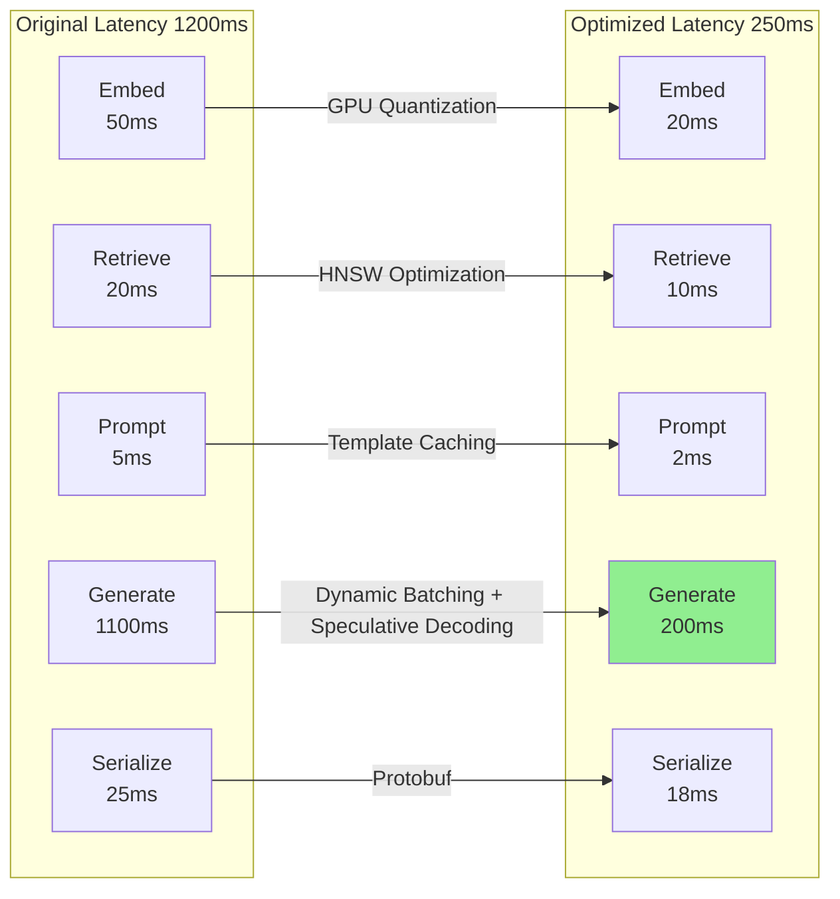

# Real-time RAG (Retrieval-Augmented Generation) with Streaming

> **Stage**: Flink/12-ai-ml | **Prerequisites**: [vector-database-integration.md](./vector-database-integration.md), [vector-search.md](../03-sql-table-api/vector-search.md) | **Formalization Level**: L4-L5

---

## 1. Concept Definitions (Definitions)

### Def-F-12-20: Streaming RAG Architecture

**Definition**: A Streaming RAG Architecture is a distributed system supporting real-time context retrieval and generation augmentation, defined by the following sextuple:

$$
\text{StreamingRAG} = \langle \mathcal{S}_{in}, \mathcal{E}, \mathcal{V}, \mathcal{R}, \mathcal{G}, \mathcal{S}_{out} \rangle
$$

Where:

- **Input Stream** $(\mathcal{S}_{in})$: User query stream $\{(q_i, \tau_i, c_i)\}$, containing query text $q_i$, timestamp $\tau_i$, and context metadata $c_i$
- **Embedding Model** $(\mathcal{E})$: Query encoding function $\mathcal{E}: \mathcal{Q} \rightarrow \mathbb{R}^d$, mapping queries to $d$-dimensional vectors
- **Vector Store** $(\mathcal{V})$: Incrementally updatable vector index $\mathcal{V}_t \subset \mathbb{R}^d \times \mathcal{D}$, where $\mathcal{D}$ is the document collection
- **Retriever** $(\mathcal{R})$: Context retrieval function $\mathcal{R}: \mathbb{R}^d \times \mathcal{V}_t \times \mathbb{N} \rightarrow 2^{\mathcal{D} \times \mathbb{R}}$, returning Top-K relevant documents with similarity scores
- **Generator** $(\mathcal{G})$: LLM inference function $\mathcal{G}: \mathcal{Q} \times 2^{\mathcal{D}} \rightarrow \mathcal{A}$, generating answers based on retrieved context
- **Output Stream** $(\mathcal{S}_{out})$: Augmented generation result stream $\{(a_i, r_i, \tau'_i)\}$, containing answer $a_i$, retrieved context $r_i$, and output timestamp $\tau'_i$

**Formal Constraint**:

$$
\forall (q, \tau) \in \mathcal{S}_{in}: \tau' - \tau \leq \Delta_{max}
$$

Where $\Delta_{max}$ is the end-to-end latency upper bound, typically 500ms-2s (depending on the generation model).

**Intuitive Explanation**: Streaming RAG enables LLMs to answer questions based on the latest data in real-time by converting user queries to vectors, retrieving relevant document chunks, constructing augmented prompts, and finally generating context-aware responses.

---

### Def-F-12-21: Streaming Vector Retrieval Mechanism

**Definition**: A Streaming Vector Retrieval Mechanism is a retrieval system supporting incremental index updates and low-latency queries, defined by the following quadruple:

$$
\text{SVR} = \langle \mathcal{I}, \mathcal{U}, \mathcal{Q}, \mathcal{C} \rangle
$$

Where:

- **Index Structure** $(\mathcal{I})$: Approximate nearest neighbor index supporting dynamic insert/delete, $\mathcal{I}_t = (V_t, E_t)$, where $V_t$ is the vector set and $E_t$ is the index structure (e.g., HNSW graph edges)
- **Update Operators** $(\mathcal{U})$: Family of incremental update functions
  - Insert: $\mathcal{U}_{ins}: \mathcal{I}_t \times (\mathbf{v}, d) \rightarrow \mathcal{I}_{t+1}$
  - Delete: $\mathcal{U}_{del}: \mathcal{I}_t \times id \rightarrow \mathcal{I}_{t+1}$
  - Flush: $\mathcal{U}_{flush}: \mathcal{I}_t \rightarrow \mathcal{I}'_{t}$ (index optimization)
- **Query Operator** $(\mathcal{Q})$: Streaming query processing function

$$
    \mathcal{Q}(\mathbf{q}, k, \mathcal{I}_t) = \{ (d_i, s_i) \mid s_i = \text{sim}(\mathbf{q}, \mathbf{v}_i), \text{top}_k(\{s_i\}) \}
    $$

- **Consistency Guarantee** $(\mathcal{C})$: Consistency protocol between index and source data
  - Eventual Consistency: $\lim_{t \rightarrow \infty} \mathcal{I}_t = \mathcal{I}^*_{source}$
  - Strong Consistency: $\forall t: \mathcal{I}_t \sim_{\epsilon} \mathcal{I}^*_{source}$

**Def-F-12-21a: Double Buffering Strategy**

To support non-stop index updates, an active/backup dual index mechanism is adopted:

$$
\mathcal{I}^{active}_t = \begin{cases}
\mathcal{I}_A & \text{if } t \in [nT, (n+\frac{1}{2})T) \\
\mathcal{I}_B & \text{if } t \in [(n+\frac{1}{2})T, (n+1)T)
\end{cases}
$$

Where updates are performed asynchronously on the backup index, switching every $T/2$ cycle.

---

### Def-F-12-22: Real-time Feature Engineering Pipeline

**Definition**: A Real-time Feature Engineering Pipeline is a continuous processing pipeline that transforms raw data streams into model-usable feature representations:

$$
\text{RFEPipeline} = \langle \mathcal{F}_{raw}, \mathcal{T}, \mathcal{F}_{feat}, \mathcal{W}, \mathcal{A} \rangle
$$

Where:

- **Raw Features** $(\mathcal{F}_{raw})$: Raw field collection from input data streams
- **Transform Operators** $(\mathcal{T})$: Sequence of feature transformation functions $\mathcal{T} = [\tau_1, \tau_2, ..., \tau_m]$, each $\tau_i: \mathcal{X}_{in} \rightarrow \mathcal{X}_{out}$
- **Derived Features** $(\mathcal{F}_{feat})$: Output feature vector space $\mathcal{F}_{feat} \subseteq \mathbb{R}^d$
- **Window Policy** $(\mathcal{W})$: Time window definition, $\mathcal{W}(t) = [t - \Delta, t)$, supporting tumbling/sliding/session windows
- **Aggregation Functions** $(\mathcal{A})$: In-window aggregation operators, such as $\text{mean}$, $\text{sum}$, $\text{count}$, $\text{unique}$, etc.

**Feature Type Classification**:

| Feature Type | Mathematical Definition | State Requirement | Example |
|-------------|------------------------|-------------------|---------|
| **Point Feature** | $f(x_t)$ | Stateless | Text length, ID encoding |
| **Window Aggregate** | $\text{agg}(\{x_i \mid i \in \mathcal{W}(t)\})$ | ValueState | Click-through rate in past 5 minutes |
| **Sequence Feature** | $[x_{t-n}, ..., x_t]$ | ListState | Last 10 viewed products |
| **Cross Feature** | $f(x_t, y_t)$ | BroadcastState | User-item interaction |
| **Embedding Feature** | $\mathcal{E}(x_t)$ | External Model | BERT text embedding |

**Def-F-12-22a: Feature Consistency Guarantee**

Feature engineering must satisfy training-inference consistency:

$$
\forall t: \mathcal{T}_{train}(x_t) = \mathcal{T}_{inference}(x_t)
$$

Achieved through versioned feature transformation definitions and deterministic computation.

---

### Def-F-12-23: LLM Inference Optimization Patterns

**Definition**: LLM Inference Optimization is a collection of techniques that reduce inference latency and increase throughput through batching, caching, and streaming strategies:

$$
\text{LLMOpt} = \langle \mathcal{B}, \mathcal{K}, \mathcal{P}, \mathcal{S} \rangle
$$

**Def-F-12-23a: Dynamic Batching**

Merges multiple independent requests into batch inference:

$$
\mathcal{B}_{dyn}(t, B_{max}, T_{max}) = \{ r_i \mid t_{arrive}(r_i) \leq t \land |\mathcal{B}| < B_{max} \land (t - t_{first}) < T_{max} \}
$$

Where $B_{max}$ is the maximum batch size and $T_{max}$ is the maximum wait time.

Throughput gain:

$$
\eta_{batch} = \frac{\text{throughput}(\mathcal{B})}{\text{throughput}(single)} \approx O(\log B) \text{ to } O(B^{0.8})
$$

**Def-F-12-23b: KV-Cache Management**

Key-value cache reuse for autoregressive generation:

$$
\text{KV}_{cache}(t+1) = \text{Concat}(\text{KV}_{cache}(t), \text{ComputeKV}(x_{t+1}))
$$

Cache hit rate is positively correlated with sequence prefix sharing degree.

**Def-F-12-23c: Streaming Generation**

Chunked output of generation results, reducing first-token latency:

$$
\mathcal{G}_{stream}(q, ctx) = \{ chunk_i \mid chunk_i = \mathcal{G}(q, ctx)_{[p_i, p_{i+1})} \}
$$

Where $p_i$ is the output position, and first-chunk latency $L_{first} \ll L_{total}$.

---

## 2. Property Derivations (Properties)

### Prop-F-12-20: Streaming RAG End-to-End Latency Decomposition

**Proposition**: The end-to-end latency $L_{E2E}$ of a streaming RAG system satisfies the following upper bound:

$$
L_{E2E} \leq L_{embed} + L_{retrieve} + L_{prompt} + L_{generate} + L_{serialize}
$$

Component definitions:

| Component | Typical Range | Optimization Strategy |
|-----------|--------------|----------------------|
| $L_{embed}$ | 10-50ms | GPU inference, model quantization |
| $L_{retrieve}$ | 5-20ms | HNSW index, pre-filtering |
| $L_{prompt}$ | 1-5ms | Template pre-compilation, parallel assembly |
| $L_{generate}$ | 100-1000ms | Dynamic batching, speculative decoding |
| $L_{serialize}$ | 1-10ms | Binary protocol, compression |

**Derivation**: Each stage executes in pipeline, total latency is the sum of critical path. Through asynchronous pipeline overlapping embedding and retrieval, it can be reduced to:

$$
L_{E2E}^{optimized} \approx \max(L_{embed}, L_{retrieve}) + L_{generate} + O(1)
$$

---

### Prop-F-12-21: Vector Retrieval Recall-Latency Tradeoff

**Proposition**: For HNSW index, retrieval parameter $ef$ (search depth) satisfies the following relationships with recall $R$ and latency $L$:

$$
R(ef) = 1 - \alpha \cdot e^{-\beta \cdot ef}, \quad \alpha, \beta > 0
$$

$$
L(ef) = \gamma + \delta \cdot ef, \quad \gamma, \delta > 0
$$

**Optimal Parameter Derivation**: Given target recall $R_{target}$, minimum latency configuration is:

$$
ef_{opt} = \left\lceil -\frac{1}{\beta} \cdot \ln\left(\frac{1 - R_{target}}{\alpha}\right) \right\rceil
$$

**Engineering Significance**: When $R_{target} = 0.95$, $ef_{opt} \approx 64-128$ (depending on data distribution).

---

### Lemma-F-12-20: Feature Freshness and Model Performance Relationship

**Lemma**: Let feature timestamp be $t_f$, inference time be $t$, feature staleness $\Delta = t - t_f$, model performance decay satisfies:

$$
\text{Perf}(\Delta) = \text{Perf}_0 \cdot e^{-\lambda \Delta}
$$

Where $\lambda$ is the feature timeliness coefficient, real-time features ($\Delta < 1s$) maintain > 95% performance.

---

## 3. Relationship Establishment (Relations)

### 3.1 RAG Architecture Component Relationship Graph



### 3.2 Mapping to Flink Core Capabilities

| RAG Component | Flink Capability | Relationship Type |
|--------------|------------------|-------------------|
| Real-time Embedding | Async I/O + ML_PREDICT（实验性） | Native Integration |
| Vector Index Update | DataStream + Checkpoint | State Consistency |
| Feature Engineering | ProcessFunction + State | Native Integration |
| Dynamic Batching | Window + Trigger | Extended Implementation |
| Streaming Generation | AsyncFunction + SideOutput | Combined Implementation |

### 3.3 Vector Database Integration Matrix

| Feature | Milvus | Pinecone | PgVector | Use Case |
|---------|--------|----------|----------|----------|
| **Deployment Mode** | Self-hosted/K8s | Fully Managed | PostgreSQL Extension | - |
| **Streaming Updates** | Incremental HNSW | Auto-optimized | Real-time Index | High-frequency updates |
| **Hybrid Query** | Scalar Filter + Vector | Metadata Filter | SQL Native | Structured constraints |
| **Flink Integration** | gRPC Connector | REST Connector | JDBC | - |
| **Latency (p99)** | <10ms | <50ms | <100ms | Latency-sensitive |

---

## 4. Argumentation Process (Argumentation)

### 4.1 Why Choose Streaming RAG Over Batch RAG?

**Comparative Analysis**:

| Dimension | Batch RAG | Streaming RAG |
|-----------|-----------|---------------|
| **Data Freshness** | Hour-level latency | Second-level latency |
| **Index Update** | Full rebuild | Incremental update |
| **Resource Pattern** | Bursty high load | Stable load |
| **Applicable Scenarios** | Static knowledge base | Dynamic content platform |
| **Complexity** | Low | Medium-High |

**Decision Boundary**:

$$
\text{Choose Streaming RAG} \iff \frac{\Delta_{batch}}{\Delta_{stream}} > 10 \land \text{update\_frequency} > 1000/\text{day}
$$

### 4.2 Streaming Index Update Strategy Comparison

**Strategy A: Real-time Incremental Update**

- Each incoming document updates index immediately
- Pros: Freshest index
- Cons: High update overhead (HNSW graph reconstruction cost)

**Strategy B: Micro-batch Update**

- Accumulate $N$ records or $T$ seconds before batch update
- Pros: Amortized update cost
- Cons: Second-level index latency

**Strategy C: Double Buffering**

- Background rebuild of new index, atomic switch upon completion
- Pros: Zero query interruption
- Cons: Double memory footprint

**Selection Recommendation**:



### 4.3 Embedding Model: Service vs. Local Deployment

**Service Approach**:
- Independent Embedding Service (REST/gRPC)
- Pros: Model independent upgrades, multi-language support
- Cons: Network round-trip latency, serialization overhead

**Local Approach**:
- Flink UDF embedded model (ONNX Runtime)
- Pros: Zero network latency, high throughput
- Cons: Model size limitations, JVM memory pressure

**Hybrid Strategy**: High-frequency models locally, long-tail models as services.

---

## 5. Formal Proof / Engineering Argument (Proof / Engineering Argument)

### 5.1 Formal Correctness of Streaming RAG Architecture

**Theorem (Thm-F-12-20): Streaming RAG Semantic Equivalence**

Let batch RAG result be $R_{batch}(q, D)$, streaming RAG result be $R_{stream}(q, D(t))$, if the following are satisfied:

1. Vector index consistency: $\forall t: \mathcal{V}_t \supseteq D(t - \Delta_{sync})$
2. Embedding determinism: $\mathcal{E}(q)$ is a pure function
3. Retrieval monotonicity: $D_1 \subseteq D_2 \Rightarrow R(q, D_1) \subseteq R(q, D_2)$

Then within synchronization delay $\Delta_{sync}$, streaming RAG is semantically equivalent to batch RAG:

$$
\lim_{\Delta_{sync} \rightarrow 0} R_{stream}(q, D(t)) = R_{batch}(q, D(t))
$$

**Proof Outline**:

1. By condition 1, streaming index at time $t$ contains at least data from $t-\Delta_{sync}$
2. By condition 2, query embedding result is uniquely determined
3. By condition 3, index incremental updates do not lose existing results
4. When $\Delta_{sync} \rightarrow 0$, streaming index converges to batch data collection
5. Therefore retrieval result sets converge, Q.E.D.

---

### 5.2 State Boundary Analysis of Feature Engineering Pipeline

**Engineering Argument**: Flink State Storage Requirements Calculation

For a feature engineering pipeline with $N$ keys, memory usage by state type:

| State Type | Per-Key Usage | Total Memory Estimate |
|-----------|---------------|----------------------|
| ValueState | $O(d \cdot 4B)$ | $N \cdot d \cdot 4B$ |
| ListState (length $L$) | $O(L \cdot d \cdot 4B)$ | $N \cdot L \cdot d \cdot 4B$ |
| MapState (avg $K$ keys) | $O(K \cdot (key + value))$ | $N \cdot K \cdot (|key| + |value|)$ |

**Example**: 10 million users, each maintaining embeddings for last 20 behaviors (768-dim):

$$
M = 10^7 \times 20 \times 768 \times 4B = 614.4GB
$$

With incremental compression (Float16 + sparse encoding), reducible to ~150GB.

---

### 5.3 Throughput Optimization of Dynamic Batching

**Argument**: Derivation of Optimal Batch Size $B^*$

Let single request latency be $L_{single}$, batch processing latency be $L_{batch}(B)$, throughput optimization objective:

$$
\max_B \eta(B) = \frac{B}{L_{batch}(B)}
$$

Assume batch processing latency has sublinear relationship with batch size:

$$
L_{batch}(B) = L_{fixed} + L_{variable} \cdot B^{\alpha}, \quad 0 < \alpha < 1
$$

Take derivative and set $\frac{d\eta}{dB} = 0$:

$$
B^* = \left( \frac{L_{fixed}}{L_{variable}} \cdot \frac{1}{\alpha - 1} \right)^{\frac{1}{\alpha}}
$$

**LLM Inference Measured Parameters**:
- $L_{fixed}$ (startup overhead): 20-50ms
- $L_{variable}$ (per token): 5-10ms
- $\alpha$: 0.7-0.9

Optimal batch size $B^* \approx 8-16$ (balancing latency and throughput).

---

## 6. Example Validation (Examples)

### 6.1 Complete Streaming RAG Pipeline (Flink + Milvus + OpenAI)

```java
import org.apache.flink.streaming.api.datastream.DataStream;
import org.apache.flink.streaming.api.environment.StreamExecutionEnvironment;
import org.apache.flink.streaming.api.functions.async.AsyncFunction;
import org.apache.flink.streaming.api.functions.async.ResultFuture;

/**
 * Real-time RAG System Complete Implementation
 * Architecture: Flink -> Milvus -> LLM Service
 */
public class StreamingRAGPipeline {

    public static void main(String[] args) throws Exception {
        StreamExecutionEnvironment env =
            StreamExecutionEnvironment.getExecutionEnvironment();
        env.setParallelism(4);

        // ============================================
        // 1. User Query Stream
        // ============================================
        DataStream<UserQuery> queryStream = env
            .addSource(new KafkaSource<UserQuery>()
                .setTopics("user-queries")
                .setGroupId("rag-processor")
                .setStartingOffsets(OffsetsInitializer.latest()))
            .assignTimestampsAndWatermarks(
                WatermarkStrategy.<UserQuery>forBoundedOutOfOrderness(
                    Duration.ofSeconds(5))
                    .withTimestampAssigner((q, ts) -> q.getTimestamp()));

        // ============================================
        // 2. Query Embedding (Async I/O calling Embedding Service)
        // ============================================
        DataStream<EmbeddedQuery> embeddedStream = AsyncDataStream
            .unorderedWait(
                queryStream,
                new EmbeddingAsyncFunction("text-embedding-3-small"),
                Duration.ofMillis(100),  // timeout
                100                      // concurrency
            );

        // ============================================
        // 3. Vector Retrieval (Milvus Lookup)
        // ============================================
        DataStream<RetrievalResult> retrievalStream = AsyncDataStream
            .unorderedWait(
                embeddedStream,
                new MilvusRetrievalFunction(
                    "http://milvus-cluster:19530",
                    "knowledge_base",
                    5,        // topK
                    "COSINE"
                ),
                Duration.ofMillis(50),
                200
            );

        // ============================================
        // 4. Prompt Building + LLM Inference
        // ============================================
        DataStream<LLMResponse> llmStream = AsyncDataStream
            .unorderedWait(
                retrievalStream,
                new LLMInferenceFunction(
                    "https://api.openai.com/v1/chat/completions",
                    "gpt-4",
                    512,      // max_tokens
                    0.7       // temperature
                ),
                Duration.ofSeconds(5),
                50        // LLM concurrency limit
            );

        // ============================================
        // 5. Result Output
        // ============================================
        llmStream
            .map(response -> new EnrichedAnswer(
                response.getQueryId(),
                response.getGeneratedText(),
                response.getRetrievedDocs(),
                response.getLatencyMs()
            ))
            .addSink(new KafkaSink<EnrichedAnswer>()
                .setBootstrapServers("kafka:9092")
                .setRecordSerializer(...)
                .build());

        env.execute("Streaming RAG Pipeline");
    }

    // ============================================
    // Embedding Async Function Implementation
    // ============================================
    static class EmbeddingAsyncFunction
            extends RichAsyncFunction<UserQuery, EmbeddedQuery> {

        private transient HttpClient httpClient;
        private final String modelName;

        @Override
        public void open(Configuration parameters) {
            httpClient = HttpClient.newBuilder()
                .connectTimeout(Duration.ofSeconds(5))
                .build();
        }

        @Override
        public void asyncInvoke(UserQuery query,
                               ResultFuture<EmbeddedQuery> resultFuture) {

            // Call OpenAI Embedding API
            EmbeddingRequest request = new EmbeddingRequest(
                modelName,
                query.getText()
            );

            httpClient.sendAsync(
                HttpRequest.newBuilder()
                    .uri(URI.create("https://api.openai.com/v1/embeddings"))
                    .header("Authorization", "Bearer " + apiKey)
                    .header("Content-Type", "application/json")
                    .POST(BodyPublishers.ofString(toJson(request)))
                    .build(),
                BodyHandlers.ofString()
            ).thenAccept(response -> {
                EmbeddingResult result = parseResponse(response.body());
                resultFuture.complete(Collections.singletonList(
                    new EmbeddedQuery(
                        query.getQueryId(),
                        query.getText(),
                        result.getEmbedding(),  // float[1536]
                        query.getTimestamp()
                    )
                ));
            });
        }
    }

    // ============================================
    // Milvus Vector Retrieval Async Function
    // ============================================
    static class MilvusRetrievalFunction
            extends RichAsyncFunction<EmbeddedQuery, RetrievalResult> {

        private transient MilvusServiceClient milvusClient;
        private final String collectionName;
        private final int topK;
        private final String metricType;

        @Override
        public void open(Configuration parameters) {
            milvusClient = new MilvusServiceClient(
                ConnectParam.newBuilder()
                    .withUri(milvusUri)
                    .build()
            );
        }

        @Override
        public void asyncInvoke(EmbeddedQuery query,
                               ResultFuture<RetrievalResult> resultFuture) {

            SearchParam searchParam = SearchParam.newBuilder()
                .withCollectionName(collectionName)
                .withVectors(Collections.singletonList(query.getEmbedding()))
                .withVectorFieldName("content_vector")
                .withTopK(topK)
                .withMetricType(MetricType.valueOf(metricType))
                .withOutFields(Arrays.asList("doc_id", "content", "title"))
                .build();

            milvusClient.searchAsync(searchParam)
                .thenAccept(response -> {
                    List<Document> docs = parseSearchResults(response);
                    resultFuture.complete(Collections.singletonList(
                        new RetrievalResult(
                            query.getQueryId(),
                            query.getText(),
                            query.getEmbedding(),
                            docs,
                            System.currentTimeMillis()
                        )
                    ));
                });
        }
    }

    // ============================================
    // LLM Inference Async Function (with Dynamic Batching)
    // ============================================
    static class LLMInferenceFunction
            extends RichAsyncFunction<RetrievalResult, LLMResponse> {

        private transient BatchInferenceClient batchClient;

        @Override
        public void open(Configuration parameters) {
            // Use client-side dynamic batching
            batchClient = new BatchInferenceClient(
                endpoint,
                modelName,
                8,        // maxBatchSize
                20        // maxWaitMs
            );
        }

        @Override
        public void asyncInvoke(RetrievalResult result,
                               ResultFuture<LLMResponse> resultFuture) {

            // Build augmented prompt
            String prompt = buildRAGPrompt(
                result.getQueryText(),
                result.getRetrievedDocs()
            );

            batchClient.submit(prompt)
                .thenAccept(generatedText -> {
                    resultFuture.complete(Collections.singletonList(
                        new LLMResponse(
                            result.getQueryId(),
                            generatedText,
                            result.getRetrievedDocs(),
                            System.currentTimeMillis() - result.getTimestamp()
                        )
                    ));
                });
        }

        private String buildRAGPrompt(String query, List<Document> docs) {
            StringBuilder context = new StringBuilder();
            context.append("Answer the question based on the following reference documents:\n\n");
            for (int i = 0; i < docs.size(); i++) {
                context.append("[").append(i + 1).append("] ")
                       .append(docs.get(i).getTitle())
                       .append("\n")
                       .append(docs.get(i).getContent())
                       .append("\n\n");
            }
            context.append("User Question: ").append(query).append("\n");
            context.append("Answer:");
            return context.toString();
        }
    }
}
```

### 6.2 Real-time Feature Engineering Pipeline Example

```java
/**
 * User Real-time Interest Feature Engineering
 * Input: User behavior stream (click/favorite/purchase)
 * Output: User interest vector (for personalized retrieval)
 */
public class UserInterestFeaturePipeline {

    public static void main(String[] args) throws Exception {
        StreamExecutionEnvironment env =
            StreamExecutionEnvironment.getExecutionEnvironment();

        // User behavior stream
        DataStream<UserBehavior> behaviorStream = env
            .addSource(new KafkaSource<>())
            .assignTimestampsAndWatermarks(
                WatermarkStrategy.<UserBehavior>forBoundedOutOfOrderness(
                    Duration.ofSeconds(10)));

        // Item vector broadcast stream (from Milvus or Feature Store)
        DataStream<Map<String, float[]>> itemVectorStream = env
            .addSource(new ItemVectorSource())
            .broadcast();

        // Feature engineering processing
        DataStream<UserProfile> userProfileStream = behaviorStream
            .keyBy(UserBehavior::getUserId)
            .connect(itemVectorStream)
            .process(new InterestAggregationFunction());

        // Output to vector database (user profile index)
        userProfileStream
            .addSink(new MilvusSink<UserProfile>()
                .withCollection("user_profiles")
                .withVectorField("interest_vector"));

        env.execute("User Interest Feature Pipeline");
    }

    /**
     * User Interest Aggregation ProcessFunction
     * State: Recent behavior sequence + aggregated interest vector
     */
    static class InterestAggregationFunction
            extends KeyedCoProcessFunction<String, UserBehavior,
                                           Map<String, float[]>, UserProfile> {

        // State declarations
        private ValueState<float[]> interestVectorState;
        private ListState<UserBehavior> recentBehaviorsState;
        private MapState<String, Integer> categoryCountState;

        @Override
        public void open(Configuration parameters) {
            StateTtlConfig ttlConfig = StateTtlConfig
                .newBuilder(Time.hours(24))
                .setUpdateType(StateTtlConfig.UpdateType.OnCreateAndWrite)
                .setStateVisibility(
                    StateTtlConfig.StateVisibility.ReturnExpiredIfNotCleanedUp)
                .build();

            interestVectorState = getRuntimeContext().getState(
                new ValueStateDescriptor<>("interest_vector", float[].class));

            recentBehaviorsState = getRuntimeContext().getListState(
                new ListStateDescriptor<>("recent_behaviors", UserBehavior.class));

            categoryCountState = getRuntimeContext().getMapState(
                new MapStateDescriptor<>("category_count", String.class, Integer.class));
        }

        @Override
        public void processElement1(UserBehavior behavior, Context ctx,
                                   Collector<UserProfile> out) throws Exception {

            // 1. Update recent behavior list (sliding window effect)
            List<UserBehavior> recentBehaviors = new ArrayList<>();
            recentBehaviorsState.get().forEach(recentBehaviors::add);
            recentBehaviors.add(behavior);

            // Keep only last 50
            if (recentBehaviors.size() > 50) {
                recentBehaviors = recentBehaviors.subList(
                    recentBehaviors.size() - 50, recentBehaviors.size());
            }
            recentBehaviorsState.update(recentBehaviors);

            // 2. Update category count
            String category = behavior.getItemCategory();
            Integer count = categoryCountState.get(category);
            categoryCountState.put(category, count == null ? 1 : count + 1);

            // 3. Incrementally update interest vector (exponentially weighted moving average)
            float[] currentVector = interestVectorState.value();
            float[] itemVector = itemVectors.get(behavior.getItemId());

            if (currentVector == null) {
                currentVector = itemVector.clone();
            } else {
                // EWMA: v_new = alpha * v_item + (1-alpha) * v_current
                float alpha = getBehaviorWeight(behavior.getAction());
                for (int i = 0; i < currentVector.length; i++) {
                    currentVector[i] = alpha * itemVector[i] +
                                      (1 - alpha) * currentVector[i];
                }
            }
            interestVectorState.update(currentVector);

            // 4. Output profile once per minute
            if (ctx.timestamp() % 60000 < 1000) {
                out.collect(new UserProfile(
                    ctx.getCurrentKey(),
                    currentVector,
                    extractTopCategories(categoryCountState),
                    recentBehaviors.size(),
                    ctx.timestamp()
                ));
            }
        }

        private float getBehaviorWeight(String action) {
            // Different behavior weights: purchase > cart > click
            switch (action) {
                case "purchase": return 0.5f;
                case "cart": return 0.3f;
                case "click": return 0.1f;
                default: return 0.05f;
            }
        }

        @Override
        public void processElement2(Map<String, float[]> vectors, Context ctx,
                                   Collector<UserProfile> out) {
            // Update item vector cache
            this.itemVectors = vectors;
        }
    }
}
```

### 6.3 SQL API Implementation (Flink SQL + VECTOR_SEARCH)（规划中）

```sql
-- ============================================
-- Streaming RAG: Flink SQL Complete Example
-- ============================================

-- 1. User query stream
CREATE TABLE user_queries (
    query_id STRING PRIMARY KEY,
    user_id STRING,
    query_text STRING,
    event_time TIMESTAMP(3),
    WATERMARK FOR event_time AS event_time - INTERVAL '5' SECOND
) WITH (
    'connector' = 'kafka',
    'topic' = 'user-queries',
    'properties.bootstrap.servers' = 'kafka:9092',
    'format' = 'json'
);

-- 2. Document vector table (Milvus connector)
CREATE TABLE document_vectors (
    doc_id STRING PRIMARY KEY,
    content STRING,
    title STRING,
    category STRING,
    content_vector ARRAY<FLOAT>,  -- 1536-dim embedding
    update_time TIMESTAMP(3)
) WITH (
    'connector' = 'milvus',
    'uri' = 'http://milvus-cluster:19530',
    'collection' = 'knowledge_docs'
);

-- 3. LLM inference result table
CREATE TABLE llm_responses (
    request_id STRING PRIMARY KEY,
    response_text STRING,
    retrieved_doc_ids ARRAY<STRING>,
    latency_ms BIGINT,
    response_time TIMESTAMP(3)
) WITH (
    'connector' = 'kafka',
    'topic' = 'llm-responses',
    'format' = 'json'
);

-- ============================================
-- Real-time RAG Pipeline (SQL Implementation)
-- ============================================

INSERT INTO llm_responses
WITH
-- Step 1: Generate query embeddings
query_embeddings AS (
    SELECT
        query_id,
        user_id,
        query_text,
        -- Call Embedding model
        ML_PREDICT('text-embedding-3-small', query_text) AS query_vector, -- 注: ML_PREDICT 为实验性功能
        event_time
    FROM user_queries
),

-- Step 2: Vector retrieval (Top-5 relevant documents)
retrieved_contexts AS (
    SELECT
        q.query_id,
        q.user_id,
        q.query_text,
        COLLECT_SET(ROW(d.doc_id, d.title, d.content, d.similarity_score))
            AS context_docs,
        -- Assemble context text
        STRING_AGG(d.content, '\n---\n') AS context_text,
        q.event_time
    FROM query_embeddings q,
    -- 注: VECTOR_SEARCH 为向量搜索功能（规划中）
LATERAL TABLE(VECTOR_SEARCH(
        query_vector := q.query_vector,
        index_table := 'document_vectors',
        top_k := 5,
        metric := 'COSINE',
        filter := 'category IS NOT NULL'
    )) AS d
    GROUP BY q.query_id, q.user_id, q.query_text, q.event_time
),

-- Step 3: LLM augmented generation
llm_outputs AS (
    SELECT
        query_id AS request_id,
        -- Call LLM to generate answer
        ML_PREDICT('gpt-4', -- 注: ML_PREDICT 为实验性功能
            CONCAT(
                'Answer the question based on the following reference documents:\n\n',
                context_text,
                '\n\nUser Question: ',
                query_text,
                '\n\nAnswer:'
            )
        ) AS response_text,
        TRANSFORM(context_docs, d -> d.doc_id) AS retrieved_doc_ids,
        event_time
    FROM retrieved_contexts
)

SELECT
    request_id,
    response_text,
    retrieved_doc_ids,
    0 AS latency_ms,  -- Should be returned by UDF in practice
    event_time AS response_time
FROM llm_outputs;
```

---

## 7. Visualizations (Visualizations)

### 7.1 Streaming RAG Overall Architecture Diagram



### 7.2 Data Flow Sequence Diagram



### 7.3 Vector Index Update Strategy Comparison

```mermaid
graph TB
    subgraph "Strategy A: Real-time Incremental"
        A1[New Document] --> A2[Immediate Encoding]
        A2 --> A3[Sync Update HNSW]
        A3 --> A4[Index Immediately Visible]
        A5[Query] --> A6[Read Latest Index]
        A6 --> A7[Freshest Results]
    end

    subgraph "Strategy B: Micro-batch Update"
        B1[New Document] --> B2[Buffer Queue]
        B2 -->|5s or 100 records| B3[Batch Encoding]
        B3 --> B4[Batch Insert]
        B5[Query] --> B6[Read Current Index]
        B6 --> B7[Second-level Latency]
    end

    subgraph "Strategy C: Double Buffering"
        C1[New Document] --> C2[Write to New Index]
        C2 --> C3[Background Building]
        C3 -->|1min| C4[Atomic Switch]
        C5[Query] --> C6[Read Active Index]
        C4 --> C6
        C6 --> C7[Minute-level Latency]
    end

    style A4 fill:#90EE90
    style B7 fill:#FFD700
    style C7 fill:#FFA07A
```



### 7.4 Latency Decomposition and Optimization Path



---

## 8. References

[^1]: Lewis, P., et al. "Retrieval-Augmented Generation for Knowledge-Intensive NLP Tasks." NeurIPS 33 (2020): 9459-9474.

[^2]: Milvus Documentation, "Milvus Vector Database - Architecture Overview", 2025. https://milvus.io/docs/architecture_overview.md

[^3]: Pinecone Documentation, "Metadata Filtering and Hybrid Search", 2025. https://docs.pinecone.io/docs/metadata-filtering

[^4]: OpenAI Documentation, "Embeddings API - Best Practices", 2025. https://platform.openai.com/docs/guides/embeddings

[^5]: Apache Flink Documentation, "Async I/O for External Data Access", 2025. https://nightlies.apache.org/flink/flink-docs-stable/docs/dev/datastream/operators/asyncio/

[^6]: Malkov, Y.A. and Yashunin, D.A., "Efficient and robust approximate nearest neighbor search using Hierarchical Navigable Small World graphs", IEEE TPAMI, 42(4), 824-836, 2020.

[^7]: Kwon, W., et al. "vLLM: Efficient Memory Management for Large Language Model Serving with PagedAttention." SOSP 2023.

[^8]: Sheng, Y., et al. "FlexGen: High-Throughput Generative Inference of Large Language Models with a Single GPU." ICML 2023.

[^9]: Yu, G.I., et al. "Orca: A Distributed Serving System for Transformer-Based Generative Models." OSDI 2022.

[^10]: Apache Flink FLIP-393, "Add VECTOR_SEARCH Table Function", https://cwiki.apache.org/confluence/pages/viewpage.action?pageId=255069363
