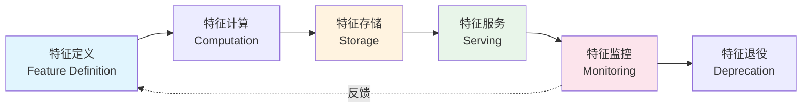
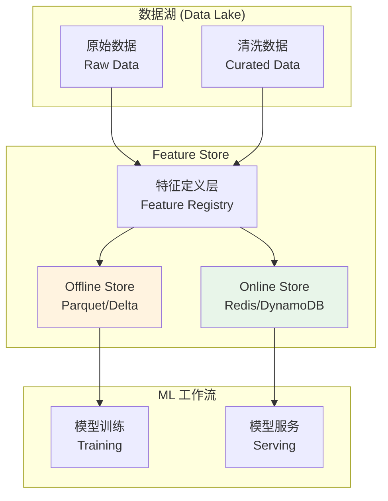
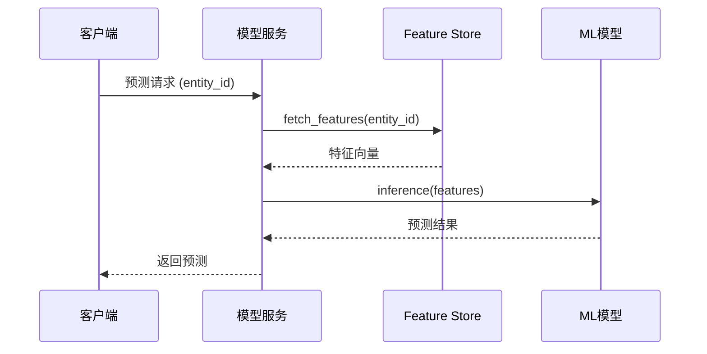
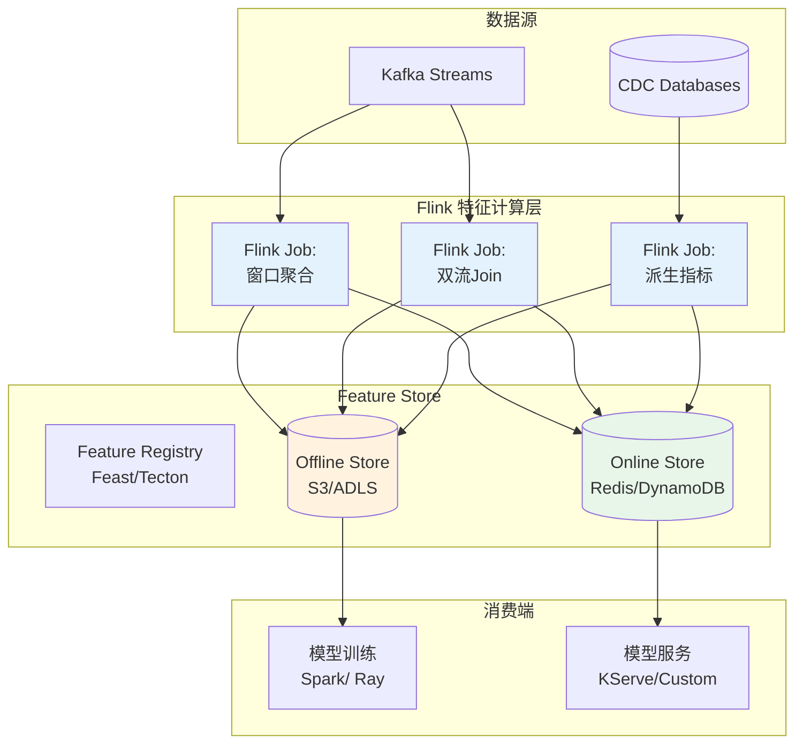
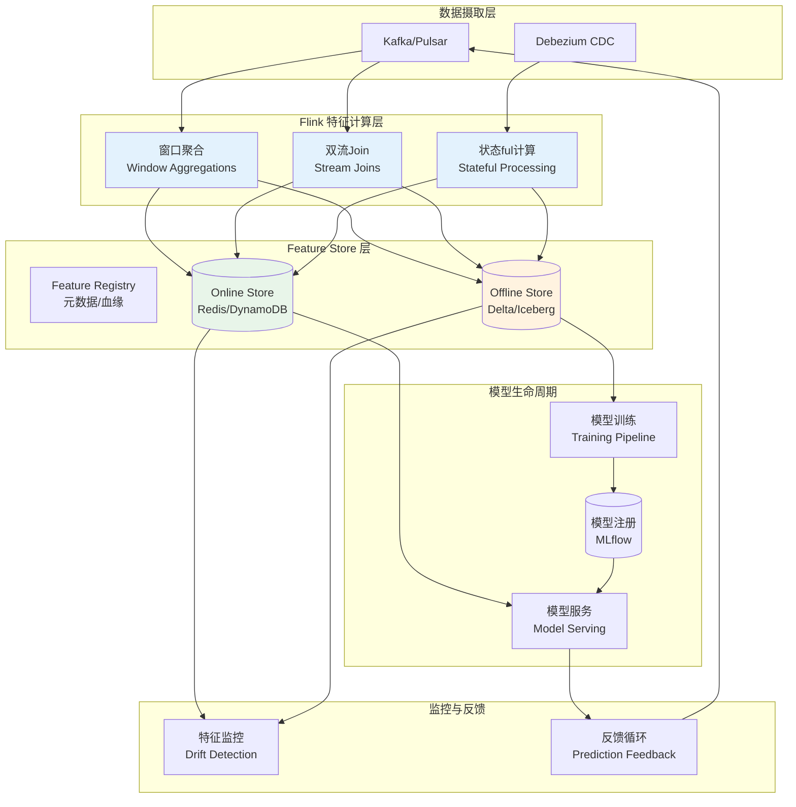
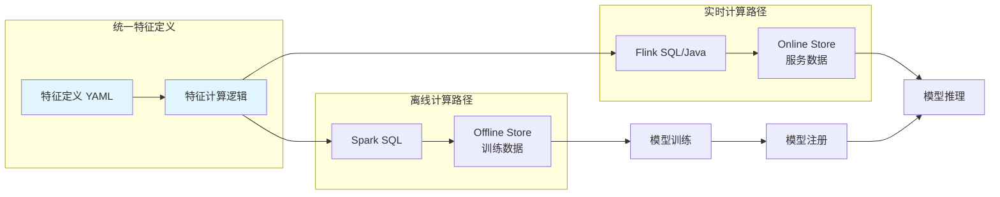
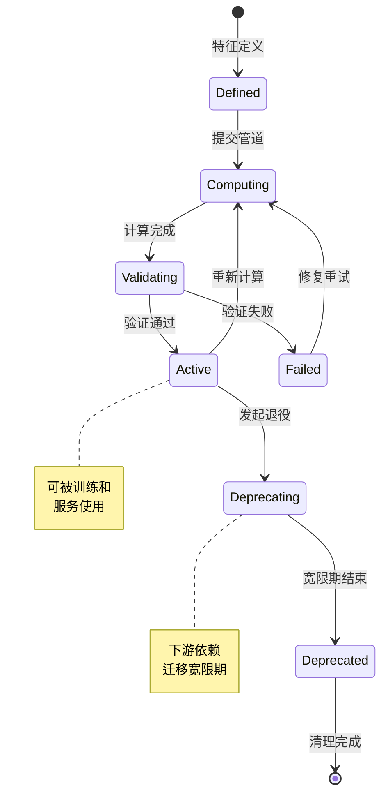
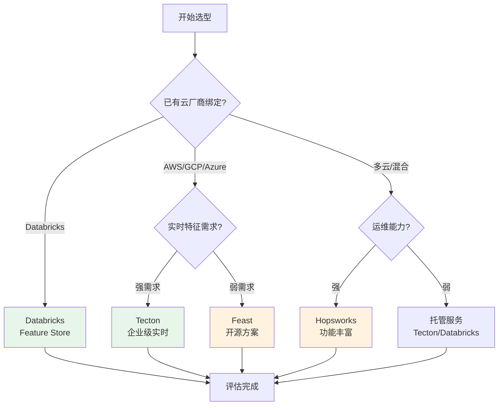

# 实时特征工程与 Feature Store 架构

> **所属阶段**: Flink/12-ai-ml | **前置依赖**: [Flink双流Join机制](../02-core-mechanisms/delta-join.md), [Flink状态管理](../02-core-mechanisms/flink-state-management-complete-guide.md) | **形式化等级**: L4 (工程理论)

---

## 1. 概念定义 (Definitions)

### 1.1 Feature Store 形式化定义

**定义 F-12-20 (Feature Store)**: Feature Store 是一个用于特征**存储、管理、共享和服务**的中央化数据平台，提供特征生命周期管理的统一抽象。

形式化地，Feature Store 可定义为四元组：

$$
\mathcal{FS} = \langle \mathcal{D}_{off}, \mathcal{D}_{on}, \mathcal{T}, \mathcal{S} \rangle
$$

其中：

- $\mathcal{D}_{off}$: Offline Store —— 批量特征存储（数据湖/数仓）
- $\mathcal{D}_{on}$: Online Store —— 低延迟特征服务（Redis/DynamoDB）
- $\mathcal{T}$: 特征转换管道集合
- $\mathcal{S}$: 特征服务 API（Feature Serving）

**定义 F-12-21 (Offline Store vs Online Store)**:

| 维度 | Offline Store | Online Store |
|------|---------------|--------------|
| **存储介质** | Parquet/Delta/Iceberg | Redis/DynamoDB/Cassandra |
| **查询延迟** | 秒级 ~ 分钟级 | 毫秒级 (< 10ms p99) |
| **数据新鲜度** | 小时级 ~ 天级 | 秒级 ~ 分钟级 |
| **查询模式** | 全表扫描、批量读取 | 点查 (Point Lookup) |
| **一致性** | 强一致 (ACID) | 最终一致 |
| **典型用例** | 模型训练、离线评估 | 实时推理、在线预测 |

**定义 F-12-22 (特征新鲜度 Freshness)**: 特征新鲜度 $\mathcal{F}$ 定义为从事件发生到特征可服务的时间延迟：

$$
\mathcal{F} = t_{available} - t_{event}
$$

其中预计算特征 $\mathcal{F}_{pre} \approx O(hours)$，实时特征 $\mathcal{F}_{rt} \approx O(seconds)$。

**定义 F-12-23 (实时特征工程)**: 实时特征工程是在流数据上直接进行特征计算，无需等待批量作业完成的过程。包含三类核心操作：

1. **窗口聚合**: $\text{AGG}_{w}(S) = f(\{e_i \in S \mid t_{e_i} \in [t-w, t)\})$
2. **双流Join**: $\text{Join}(S_1, S_2, \theta) = \{(e_1, e_2) \mid e_1 \in S_1, e_2 \in S_2, \theta(e_1, e_2)\}$
3. **状态ful计算**: $\text{State}(e_t) = g(e_t, \text{State}(e_{t-1}))$

### 1.2 特征生命周期管理



特征生命周期包含以下阶段：

- **定义 (Definition)**: 特征元数据、类型、依赖、owner
- **计算 (Computation)**: 离线/实时特征管道执行
- **存储 (Storage)**: Online + Offline 双写
- **服务 (Serving)**: 训练用批量读取 / 推理用点查
- **监控 (Monitoring)**: 漂移检测、质量监控
- **退役 (Deprecation)**: 版本管理、清理策略

---

## 2. 属性推导 (Properties)

### 2.1 特征新鲜度边界

**定理 F-12-15 (新鲜度下界定理)**: 对于基于 Flink 的实时特征管道，特征新鲜度的理论下界由以下因素决定：

$$
\mathcal{F}_{min} = \max(t_{ingestion}, t_{processing}, t_{sync})
$$

其中：

- $t_{ingestion}$: 数据摄取延迟（Kafka → Flink）
- $t_{processing}$: 特征计算延迟（窗口处理时间）
- $t_{sync}$: Online Store 同步延迟

**证明概要**: 特征新鲜度由管道中最慢的环节决定。在 Flink 管道中：

- Kafka 消费者拉取延迟通常为毫秒级
- Flink 窗口计算的 watermark 等待时间是主要瓶颈
- Online Store 写入延迟取决于存储后端（Redis: ~1ms, DynamoDB: ~10ms）

**推论 F-12-05**: 使用 Flink 的 Processing Time 语义可将 $\mathcal{F}$ 降至秒级，但会牺牲事件时间准确性。

### 2.2 一致性保证

**定理 F-12-16 (训练-服务一致性)**: Feature Store 通过统一特征定义保证训练和服务使用相同的特征计算逻辑，从而消除训练-服务偏差 (Training-Serving Skew)。

形式化表述：

$$
\forall f \in \mathcal{F}: \quad f_{training}(x) \equiv f_{serving}(x)
$$

**引理 F-12-12 (双写一致性)**: Offline Store 和 Online Store 的同步需要满足：

$$
\exists \Delta t: \quad \mathcal{D}_{on}(k, t) = \mathcal{D}_{off}(k, t - \Delta t), \quad \forall k \in \mathcal{K}
$$

其中 $\mathcal{K}$ 是主键集合，典型的 $\Delta t \in [0, 5min]$。

### 2.3 窗口聚合特征属性

**命题 F-12-08**: 对于滑动窗口聚合特征，计算复杂度与窗口数量呈线性关系：

$$
\mathcal{C}_{sliding} = O\left(\frac{T_{window}}{T_{slide}} \cdot N\right)
$$

其中 $N$ 是事件数量，$T_{window}$ 是窗口大小，$T_{slide}$ 是滑动步长。

**引理 F-12-13**: 使用增量聚合（如 Flink 的 AggregateFunction）可将内存复杂度降至 $O(K)$，其中 $K$ 是 key 的数量，与窗口数量无关。

---

## 3. 关系建立 (Relations)

### 3.1 与数据湖的关系



Feature Store 是数据湖之上的**语义层**：

- **数据湖**: 存储原始数据，关注数据存储效率和成本
- **Feature Store**: 管理特征语义，关注特征复用和一致性

### 3.2 与模型服务的关系



特征服务的典型延迟要求：

- **p50**: < 5ms
- **p99**: < 20ms

### 3.3 实时特征与预计算特征映射

| 特征类型 | 计算位置 | 存储位置 | 延迟 | 适用场景 |
|---------|---------|---------|------|---------|
| **预计算 (Batch)** | Spark/Flink Batch | Offline → Online | 小时级 | 用户画像、历史统计 |
| **近实时 (Near-RT)** | Flink Streaming | Online Store | 分钟级 | 实时点击率、会话特征 |
| **实时 (Real-time)** | 请求时计算 | 内存/缓存 | 毫秒级 | 上下文特征、地理位置 |

---

## 4. 论证过程 (Argumentation)

### 4.1 实时特征必要性论证

**场景分析**: 为什么在欺诈检测中需要实时特征？

假设一个信用卡交易场景：

- 攻击者使用被盗卡片进行**快速连续交易**（卡测试攻击）
- 关键检测信号：**过去5分钟内的交易次数**、**交易地理位置变化速度**

如果使用预计算特征（每小时更新）：

```
攻击窗口 = 60分钟
检测延迟 = 60分钟 + 模型推理时间
损失风险 = 极高
```

如果使用实时特征：

```
检测延迟 = 特征新鲜度(<10s) + 模型推理时间(<100ms)
攻击窗口 = 被压缩到秒级
损失风险 = 显著降低
```

### 4.2 反例分析：何时不需要实时特征

实时特征并非银弹，以下场景预计算特征更合适：

1. **稳定性要求高的特征**: 用户长期兴趣画像（变化缓慢）
2. **计算成本极高的特征**: 涉及大量历史数据的全局统计
3. **准确性优先的场景**: 实时计算引入噪声，预计算更精确

### 4.3 窗口选择边界讨论

窗口大小的选择涉及**新鲜度-准确性权衡**：

```
小窗口 (1分钟): 高新鲜度，高方差，易受异常值影响
中窗口 (1小时): 平衡新鲜度和统计稳定性
大窗口 (1天):  低新鲜度，高稳定性，趋势捕捉
```

推荐策略：**多时间粒度特征组合**

- `count_1min`: 捕捉即时异常
- `count_1hour`: 短期行为模式
- `count_1day`: 长期行为基线

---

## 5. 工程论证 (Engineering Argument)

### 5.1 Feature Store 选型矩阵

| 维度 | Feast (开源) | Tecton (商业) | Databricks | Hopsworks | Feathr |
|------|-------------|---------------|------------|-----------|--------|
| **部署模式** | 自托管 | 托管 SaaS | 托管 (DB 生态) | 自托管/托管 | 自托管 |
| **Online Store** | Redis/DynamoDB/Snowflake | 内置 | 内置 | RonDB/Redis | Redis/CosmosDB |
| **Offline Store** | 任意 | 内置 | Delta Lake | HopsFS/Hudi | 任意 |
| **实时特征** | 支持 (需自建) | 原生支持 | 原生支持 | 原生支持 | 支持 |
| **Flink集成** | 需自定义 | 原生支持 | Structured Streaming | 原生支持 | 需自定义 |
| **成本** | 低 (运维成本) | 高 (订阅费) | 中 (平台绑定) | 中 | 低 |
| **适用规模** | 中小型企业 | 大型企业 | Databricks 用户 | 特征工程重度用户 | Microsoft 生态 |

### 5.2 Flink + Feature Store 集成架构



### 5.3 特征服务架构设计

**定理 F-12-17 (特征服务 SLA)**:

对于生产级特征服务，需满足：

$$
\begin{cases}
P(\text{latency} < 10\text{ms}) \geq 0.99 & \text{(延迟)} \\
\text{availability} \geq 99.99\% & \text{(可用性)} \\
\frac{|\text{stale features}|}{|\text{total features}|} < 0.001 & \text{(新鲜度)}
\end{cases}
$$

**工程实现要点**:

1. **多级缓存**: 客户端缓存 → API Gateway缓存 → Online Store
2. **批量点查**: 合并多个特征请求，减少网络 RTT
3. **异步预热**: 热点特征预加载到内存
4. **降级策略**: Online Store 故障时回退到默认值

---

## 6. 实例验证 (Examples)

### 6.1 Flink + Feast 完整实现

以下是一个完整的实时欺诈检测特征工程实现：

```python
# feast/feature_definitions.py
from feast import Entity, Feature, FeatureView, ValueType
from feast.types import Int64, Float64, String
from datetime import timedelta

# 定义实体
user = Entity(
    name="user_id",
    value_type=ValueType.STRING,
    description="用户唯一标识"
)

# 实时特征视图 - 基于 Flink 计算结果
user_transaction_stats = FeatureView(
    name="user_transaction_stats",
    entities=["user_id"],
    ttl=timedelta(hours=24),
    features=[
        Feature(name="txn_count_1h", dtype=Int64),
        Feature(name="txn_amount_sum_1h", dtype=Float64),
        Feature(name="txn_avg_amount_1h", dtype=Float64),
        Feature(name="unique_merchants_1h", dtype=Int64),
        Feature(name="velocity_score", dtype=Float64),
    ],
    online=True,
    source=user_transactions_source,  # 指向 Flink 输出表
)
```

```java
// FlinkJob.java - 实时特征计算
public class FraudFeatureEngineering {

    public static void main(String[] args) {
        StreamExecutionEnvironment env =
            StreamExecutionEnvironment.getExecutionEnvironment();

        // 配置状态后端
        env.setStateBackend(new RocksDBStateBackend("hdfs://checkpoint"));
        env.enableCheckpointing(60000);

        // 读取交易流
        DataStream<Transaction> transactions = env
            .addSource(new FlinkKafkaConsumer<>("transactions",
                new TransactionDeserializer(), kafkaProps));

        // 定义1小时滑动窗口，5分钟步长
        Time windowSize = Time.hours(1);
        Time slideSize = Time.minutes(5);

        // 窗口聚合特征计算
        DataStream<UserFeatures> features = transactions
            .keyBy(Transaction::getUserId)
            .window(SlidingEventTimeWindows.of(windowSize, slideSize))
            .aggregate(new TransactionStatsAggregate())
            .map(new FeatureEnrichment())  // 计算派生指标
            .addSink(new FeatureStoreSink());  // 写入 Online/Offline Store

        env.execute("Fraud Detection Feature Engineering");
    }

    // 增量聚合函数
    static class TransactionStatsAggregate implements
            AggregateFunction<Transaction, Accumulator, UserFeatures> {

        @Override
        public Accumulator createAccumulator() {
            return new Accumulator();
        }

        @Override
        public Accumulator add(Transaction txn, Accumulator acc) {
            acc.count++;
            acc.totalAmount += txn.getAmount();
            acc.merchants.add(txn.getMerchantId());
            return acc;
        }

        @Override
        public UserFeatures getResult(Accumulator acc) {
            return UserFeatures.builder()
                .txnCount1h(acc.count)
                .txnAmountSum1h(acc.totalAmount)
                .txnAvgAmount1h(acc.totalAmount / acc.count)
                .uniqueMerchants1h(acc.merchants.size())
                .build();
        }

        @Override
        public Accumulator merge(Accumulator a, Accumulator b) {
            a.count += b.count;
            a.totalAmount += b.totalAmount;
            a.merchants.addAll(b.merchants);
            return a;
        }
    }
}
```

```java
// FeatureStoreSink.java - 双写 Online/Offline Store
public class FeatureStoreSink extends RichSinkFunction<UserFeatures> {

    private transient RedisClient redisClient;
    private transient DeltaLakeWriter deltaWriter;

    @Override
    public void open(Configuration parameters) {
        // Online Store: Redis 连接
        redisClient = RedisClient.create("redis://feature-store:6379");

        // Offline Store: Delta Lake 写入器
        deltaWriter = new DeltaLakeWriter("s3://features/offline/");
    }

    @Override
    public void invoke(UserFeatures features, Context context) {
        String key = "user:" + features.getUserId();
        long timestamp = features.getEventTime().getMillis();

        // 写入 Online Store (Redis Hash)
        redisClient.hmset(key, Map.of(
            "txn_count_1h", String.valueOf(features.getTxnCount1h()),
            "txn_amount_sum_1h", String.valueOf(features.getTxnAmountSum1h()),
            "txn_avg_amount_1h", String.valueOf(features.getTxnAvgAmount1h()),
            "unique_merchants_1h", String.valueOf(features.getUniqueMerchants1h()),
            "timestamp", String.valueOf(timestamp)
        ));

        // 设置过期时间 (TTL)
        redisClient.expire(key, 86400);  // 24小时

        // 写入 Offline Store (Delta Lake)
        deltaWriter.write(features);
    }
}
```

### 6.2 流式特征 Join 实现

```java
// StreamFeatureJoin.java - 用户行为 + 商品信息 Join
public class StreamFeatureJoin {

    public static void main(String[] args) {
        StreamExecutionEnvironment env =
            StreamExecutionEnvironment.getExecutionEnvironment();

        // 用户点击流
        DataStream<ClickEvent> clicks = env
            .addSource(new FlinkKafkaConsumer<>("clicks", ...));

        // 商品信息流 (维度表，CDC)
        DataStream<ProductInfo> products = env
            .addSource(new FlinkKafkaConsumer<>("products_cdc", ...));

        // 将商品流转换为 State (广播或 Keyed State)
        // 方案1: Broadcast Stream (适合小维度表)
        MapStateDescriptor<String, ProductInfo> productStateDesc =
            new MapStateDescriptor<>("products", String.class, ProductInfo.class);

        BroadcastStream<ProductInfo> productBroadcast = products
            .broadcast(productStateDesc);

        // 双流 Join
        DataStream<EnrichedClick> enrichedClicks = clicks
            .connect(productBroadcast)
            .process(new BroadcastProcessFunction<ClickEvent, ProductInfo, EnrichedClick>() {

                @Override
                public void processElement(ClickEvent click,
                        ReadOnlyContext ctx, Collector<EnrichedClick> out) {
                    ReadOnlyBroadcastState<String, ProductInfo> state =
                        ctx.getBroadcastState(productStateDesc);
                    ProductInfo product = state.get(click.getProductId());

                    if (product != null) {
                        out.collect(EnrichedClick.builder()
                            .userId(click.getUserId())
                            .productId(click.getProductId())
                            .category(product.getCategory())  // 来自维度表
                            .price(product.getPrice())        // 来自维度表
                            .brand(product.getBrand())        // 来自维度表
                            .clickTime(click.getTimestamp())
                            .build());
                    }
                }

                @Override
                public void processBroadcastElement(ProductInfo product,
                        Context ctx, Collector<EnrichedClick> out) {
                    BroadcastState<String, ProductInfo> state =
                        ctx.getBroadcastState(productStateDesc);
                    state.put(product.getProductId(), product);
                }
            });

        // 计算实时用户-品类偏好特征
        DataStream<UserCategoryPreference> preferences = enrichedClicks
            .keyBy(e -> e.getUserId() + ":" + e.getCategory())
            .window(SlidingEventTimeWindows.of(Time.hours(1), Time.minutes(5)))
            .aggregate(new CategoryPreferenceAggregate())
            .addSink(new FeatureStoreSink());

        env.execute("Stream Feature Join");
    }
}
```

### 6.3 派生指标计算

```java
// DerivedMetrics.java - 复杂特征计算
public class DerivedMetrics {

    /**
     * 计算交易速度得分 (Velocity Score)
     * 基于过去 N 笔交易的间隔时间
     */
    public static double calculateVelocityScore(List<Transaction> recentTxns) {
        if (recentTxns.size() < 2) return 0.0;

        List<Long> intervals = new ArrayList<>();
        for (int i = 1; i < recentTxns.size(); i++) {
            long interval = recentTxns.get(i).getTimestamp() -
                           recentTxns.get(i-1).getTimestamp();
            intervals.add(interval);
        }

        double avgInterval = intervals.stream()
            .mapToLong(Long::longValue)
            .average()
            .orElse(0);

        // 速度得分: 间隔越短，得分越高
        return avgInterval > 0 ? 1000.0 / avgInterval : 0;
    }

    /**
     * 计算 Z-Score (异常检测)
     */
    public static double calculateZScore(double value,
            double mean, double stdDev) {
        return stdDev > 0 ? (value - mean) / stdDev : 0;
    }

    /**
     * 计算百分位数 (使用 T-Digest 近似)
     */
    public static double calculatePercentile(List<Double> values, double p) {
        TDigest digest = new TDigest(100);
        values.forEach(digest::add);
        return digest.quantile(p);
    }

    /**
     * 计算比率特征
     */
    public static double calculateRatio(double numerator, double denominator) {
        return denominator > 0 ? numerator / denominator : 0;
    }
}

// Flink ProcessFunction 中使用状态维护统计信息
class StatsProcessFunction extends KeyedProcessFunction<String, Transaction, UserStats> {

    private ValueState<RunningStatistics> statsState;
    private ListState<Transaction> recentTxnsState;

    @Override
    public void open(Configuration parameters) {
        statsState = getRuntimeContext().getState(
            new ValueStateDescriptor<>("stats", RunningStatistics.class));
        recentTxnsState = getRuntimeContext().getListState(
            new ListStateDescriptor<>("recentTxns", Transaction.class));
    }

    @Override
    public void processElement(Transaction txn, Context ctx, Collector<UserStats> out)
            throws Exception {

        RunningStatistics stats = statsState.value();
        if (stats == null) stats = new RunningStatistics();

        // 更新运行统计
        stats.add(txn.getAmount());
        statsState.update(stats);

        // 维护最近交易列表 (滑动窗口)
        recentTxnsState.add(txn);

        // 清理过期数据
        long cutoff = ctx.timestamp() - TimeUnit.HOURS.toMillis(1);
        List<Transaction> recentTxns = new ArrayList<>();
        for (Transaction t : recentTxnsState.get()) {
            if (t.getTimestamp() > cutoff) {
                recentTxns.add(t);
            }
        }
        recentTxnsState.update(recentTxns);

        // 计算派生特征
        double zScore = DerivedMetrics.calculateZScore(
            txn.getAmount(), stats.getMean(), stats.getStdDev());
        double velocityScore = DerivedMetrics.calculateVelocityScore(recentTxns);

        out.collect(UserStats.builder()
            .userId(txn.getUserId())
            .transactionAmount(txn.getAmount())
            .zScore(zScore)
            .velocityScore(velocityScore)
            .txnCount(stats.getCount())
            .build());
    }
}
```

### 6.4 推荐系统实时用户画像

```python
# 实时用户画像特征定义
from feast import FeatureService

# 特征服务：推荐系统用用户画像
user_profile_service = FeatureService(
    name="user_profile_v1",
    features=[
        # 实时行为特征 (Flink 计算)
        user_transaction_stats[[
            "view_count_10min",
            "click_count_10min",
            "category_affinity",
            "price_preference"
        ]],
        # 近实时偏好特征
        user_category_preference[[
            "top_categories",
            "category_distribution"
        ]],
        # 预计算长期画像
        user_longterm_profile[[
            "lifetime_value",
            "churn_risk_score",
            "preferred_brands"
        ]]
    ],
    description="推荐系统用户画像特征服务"
)
```

```java
// 推荐特征计算 Job
public class RecommendationFeatureJob {

    public static void main(String[] args) {
        StreamExecutionEnvironment env =
            StreamExecutionEnvironment.getExecutionEnvironment();

        // 用户行为流
        DataStream<UserEvent> events = env
            .addSource(new FlinkKafkaConsumer<>("user_events", ...));

        // 会话窗口：捕捉用户会话内的行为序列
        DataStream<SessionFeatures> sessionFeatures = events
            .keyBy(UserEvent::getUserId)
            .window(EventTimeSessionWindows.withGap(Time.minutes(30)))
            .aggregate(new SessionFeatureAggregate())
            .addSink(new FeatureStoreSink());

        // 滑动窗口：实时点击率特征
        DataStream<ClickThroughRate> ctrFeatures = events
            .keyBy(UserEvent::getUserId)
            .window(SlidingEventTimeWindows.of(Time.minutes(10), Time.minutes(1)))
            .process(new CTRProcessFunction())
            .addSink(new FeatureStoreSink());

        env.execute("Recommendation Feature Engineering");
    }
}
```

---

## 7. 可视化 (Visualizations)

### 7.1 实时 ML 管道完整架构



### 7.2 特征服务调用流程

```mermaid
sequenceDiagram
    participant Client as 客户端/服务
    participant FS as Feature Store SDK
    participant Cache as 本地缓存
    participant OS as Online Store
    participant OF as Offline Store (Fallback)
    participant REG as Feature Registry

    Client->>FS: get_online_features(entity_ids, feature_refs)
    FS->>REG: 获取特征元数据
    REG-->>FS: 特征定义 + 存储位置

    FS->>Cache: 查询本地缓存
    alt 缓存命中
        Cache-->>FS: 返回缓存特征
    else 缓存未命中
        FS->>OS: 批量点查 (Redis MGET / DynamoDB BatchGet)
        OS-->>FS: 特征值
        FS->>Cache: 写入缓存
    end

    alt Online Store 失败
        FS->>OF: 降级查询 (S3 Select / Spark)
        OF-->>FS: 特征值 (延迟增加)
    end

    FS->>FS: 特征转换/验证
    FS-->>Client: Feature Vector

    Client->>FS: log_feedback(prediction, actual)
    FS->>FB[(反馈存储)]
```

### 7.3 训练-服务一致性保障



### 7.4 特征生命周期状态机



### 7.5 Feature Store 选型决策树



---

## 8. 引用参考 (References)


---

*文档版本: v1.0 | 最后更新: 2026-04-02 | 形式化等级: L4*
