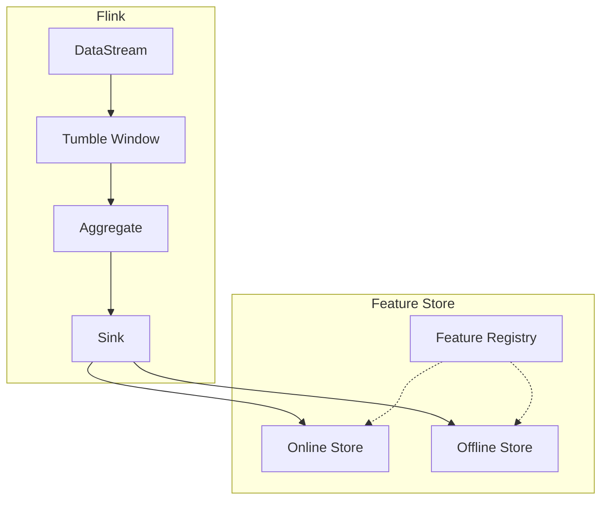
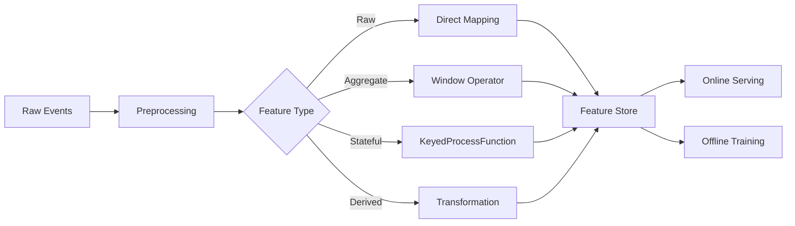
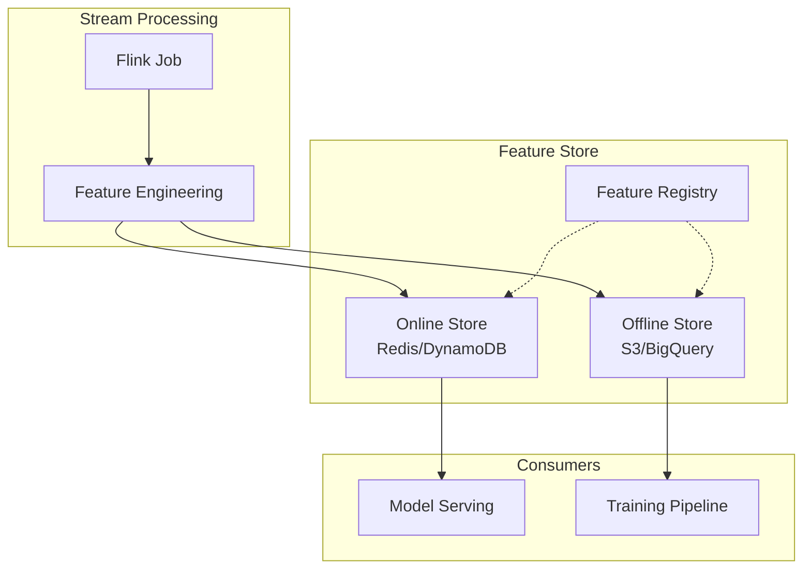

# 实时特征工程与Feature Store指南

> **所属阶段**: Flink/AI-ML | **前置依赖**: [Flink窗口](../03-api/03.3-window-concepts.md) | **形式化等级**: L3-L4

## 执行摘要

本文档系统阐述流式机器学习中的实时特征工程方法，涵盖特征类型、窗口聚合、状态ful特征计算，以及与Feast、Tecton等Feature Store的集成方案。

| 特征类型 | 计算复杂度 | 状态需求 | 实时性 |
|:--------:|:----------:|:--------:|:------:|
| 原始特征 | 低 | 无 | 毫秒 |
| 窗口聚合 | 中 | 窗口状态 | 秒级 |
| 状态ful | 高 | 键控状态 | 毫秒 |
| 派生特征 | 中 | 依赖其他特征 | 毫秒 |

---

## 1. 概念定义 (Definitions)

### Def-AI-10-01: 原始特征 (Raw Feature)

**定义**: 直接从数据源提取未经转换的特征：

$$f_{raw}: Event \rightarrow \mathcal{V}$$

**示例**: 用户ID、时间戳、事件类型、原始数值

---

### Def-AI-10-02: 聚合特征 (Aggregated Feature)

**定义**: 在窗口内对事件进行聚合计算的特征：

$$f_{agg}(W) = \bigoplus_{e \in W} f_{raw}(e)$$

其中 $\bigoplus$ 为聚合操作 (SUM, AVG, COUNT, MAX, MIN等)。

---

### Def-AI-10-03: 派生特征 (Derived Feature)

**定义**: 通过特征转换函数从现有特征派生：

$$f_{derived} = \phi(f_1, f_2, ..., f_n)$$

**变换类型**:

- 数学运算: $f_1 + f_2$, $f_1 \cdot f_2$
- 编码: One-hot, Embedding
- 归一化: Min-Max, Z-Score

---

### Def-AI-10-04: 特征新鲜度 (Feature Freshness)

**定义**: 特征值反映最新数据的时间程度：

$$Freshness = 1 - \frac{t_{current} - t_{feature}}{t_{current} - t_{oldest}}$$

---

### Def-AI-10-05: 在线特征 (Online Feature)

**定义**: 实时计算用于在线推理的特征：

$$f_{online} = Compute(Event_{stream})$$

**延迟要求**: 通常 $< 100ms$

---

### Def-AI-10-06: 离线特征 (Offline Feature)

**定义**: 批处理计算用于训练的特征：

$$f_{offline} = Compute(Dataset_{batch})$$

**特点**: 可预计算、存储于Feature Store

---

### Def-AI-10-07: 特征漂移 (Feature Drift)

**定义**: 特征分布随时间发生统计变化：

$$Drift(f) = D(P_{train}(f) || P_{current}(f))$$

其中 $D$ 为分布距离度量 (KL散度、JS散度、Wasserstein距离)。

---

### Def-AI-10-08: 特征一致性

**定义**: 在线特征与离线特征的分布一致性：

$$Consistency = 1 - |E[f_{online}] - E[f_{offline}]|$$

---

## 2. 属性推导 (Properties)

### Thm-AI-10-01: 窗口聚合正确性

**定理**: 在允许延迟的窗口中，聚合结果最终一致：

$$\lim_{t \to \infty} \bigoplus_{e \in W(t)} f(e) = \bigoplus_{e \in W_{complete}} f(e)$$

---

### Thm-AI-10-02: 在线离线特征一致性

**定理**: 若在线和离线使用相同的计算逻辑和输入数据，则特征一致：

$$f_{online} = f_{offline} \iff Logic_{online} = Logic_{offline} \land Data_{online} = Data_{offline}$$

---

### Thm-AI-10-03: 特征漂移检测灵敏度

**定理**: 漂移检测的灵敏度 $\alpha$ 与误报率 $\beta$ 满足：

$$\alpha = 1 - \beta \cdot \frac{\sigma_{baseline}}{\sigma_{current}}$$

---

## 3. 关系建立 (Relations)

### 3.1 Flink窗口与Feature Store映射



---

## 4. 论证过程 (Argumentation)

### 4.1 窗口类型选择

| 窗口类型 | 适用场景 | 状态大小 |
|:--------:|:---------|:--------:|
| Tumbling | 周期性统计 | 小 |
| Sliding | 平滑指标 | 中 |
| Session | 用户行为 | 大 |
| Global | 全量统计 | 极大 |

---

## 5. 形式证明/工程论证 (Proof)

### 5.1 窗口聚合算法正确性

**增量聚合**:

$$Agg_{t+1} = Combine(Agg_t, Value_{t+1})$$

**可合并性条件**: 存在 $Combine$ 函数满足结合律和交换律。

---

## 6. 实例验证 (Examples)

### 示例1: Tumble窗口用户行为特征

```java
DataStream<FeatureVector> features = events
    .keyBy(Event::getUserId)
    .window(TumblingProcessingTimeWindows.of(Time.minutes(5)))
    .aggregate(new UserBehaviorAggregator());

class UserBehaviorAggregator
    implements AggregateFunction<Event, UserAccumulator, FeatureVector> {

    @Override
    public UserAccumulator createAccumulator() {
        return new UserAccumulator();
    }

    @Override
    public UserAccumulator add(Event event, UserAccumulator acc) {
        acc.clickCount++;
        acc.totalSpent += event.getAmount();
        acc.sessionCount += event.isNewSession() ? 1 : 0;
        return acc;
    }

    @Override
    public FeatureVector getResult(UserAccumulator acc) {
        return new FeatureVector(
            acc.clickCount,
            acc.totalSpent / acc.clickCount, // avg spend per click
            acc.sessionCount
        );
    }

    @Override
    public UserAccumulator merge(UserAccumulator a, UserAccumulator b) {
        a.clickCount += b.clickCount;
        a.totalSpent += b.totalSpent;
        a.sessionCount += b.sessionCount;
        return a;
    }
}
```

---

### 示例2: Session窗口序列特征

```java
DataStream<SessionFeatures> sessionFeatures = events
    .keyBy(Event::getUserId)
    .window(EventTimeSessionWindows.withGap(Time.minutes(30)))
    .process(new SessionFeatureProcessFunction());

class SessionFeatureProcessFunction
    extends ProcessWindowFunction<Event, SessionFeatures, String, TimeWindow> {

    @Override
    public void process(String userId, Context ctx,
                       Iterable<Event> events, Collector<SessionFeatures> out) {

        List<Event> eventList = new ArrayList<>();
        events.forEach(eventList::add);

        // 序列特征
        int eventCount = eventList.size();
        long duration = ctx.window().getEnd() - ctx.window().getStart();
        double avgTimeBetweenEvents = duration / (double) eventCount;

        // 路径特征
        List<String> path = eventList.stream()
            .map(Event::getPage)
            .collect(Collectors.toList());

        // 转化率
        long purchaseEvents = eventList.stream()
            .filter(e -> "purchase".equals(e.getType()))
            .count();
        double conversionRate = purchaseEvents / (double) eventCount;

        out.collect(new SessionFeatures(
            userId,
            eventCount,
            duration,
            avgTimeBetweenEvents,
            path,
            conversionRate
        ));
    }
}
```

---

### 示例3: Feast Feature Store集成

```python
from feast import FeatureStore, Entity, Feature, FeatureView
from feast.types import Int64, Float64, String
from feast.value_type import ValueType
from datetime import timedelta

# 定义实体
user = Entity(
    name="user_id",
    value_type=ValueType.STRING,
    description="User identifier"
)

# 定义特征视图
user_features_view = FeatureView(
    name="user_behavior_features",
    entities=["user_id"],
    ttl=timedelta(hours=24),
    features=[
        Feature(name="click_count_5m", dtype=Int64),
        Feature(name="avg_spend_per_click", dtype=Float64),
        Feature(name="session_count_1h", dtype=Int64),
        Feature(name="conversion_rate", dtype=Float64),
    ],
    online=True,
    source=user_behavior_source,
)

# Flink到Feast的Sink
class FeastSink(SinkFunction[FeatureRow]):

    def __init__(self, repo_path: str):
        self.repo_path = repo_path
        self.store = None

    def open(self, runtime_context):
        self.store = FeatureStore(repo_path=self.repo_path)

    def invoke(self, value: FeatureRow, context):
        # 写入在线存储
        self.store.push(
            feature_view="user_behavior_features",
            df=pd.DataFrame([{
                "user_id": value.user_id,
                "click_count_5m": value.click_count,
                "avg_spend_per_click": value.avg_spend,
                "session_count_1h": value.session_count,
                "conversion_rate": value.conversion_rate,
                "event_timestamp": datetime.now()
            }])
        )
```

---

## 7. 可视化 (Visualizations)

### 实时特征工程流水线



### Feature Store集成架构



---

## 8. 引用参考 (References)
