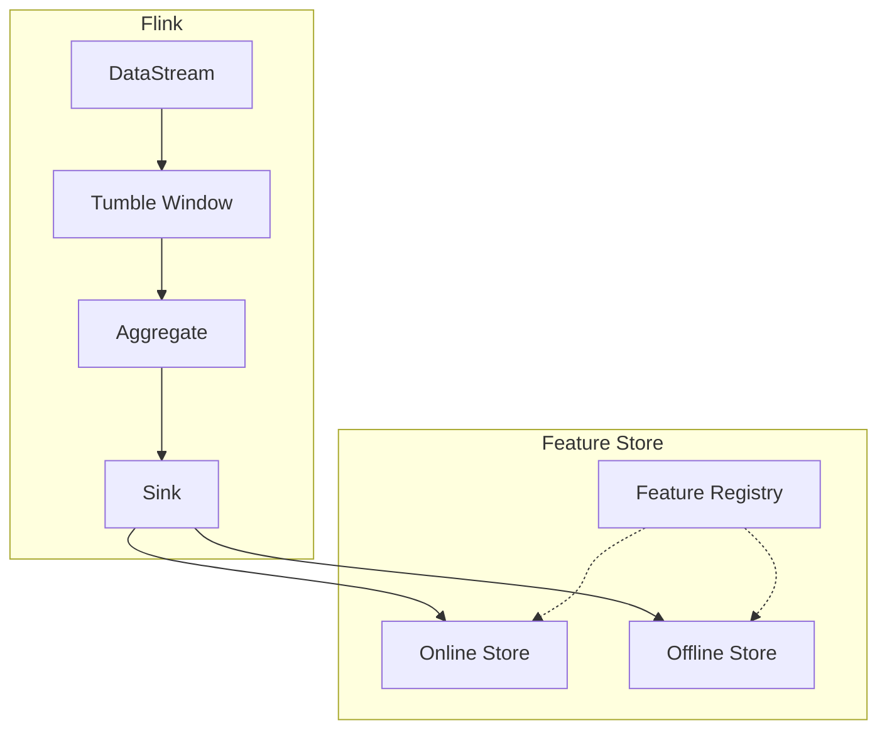

# 实时特征工程与Feature Store指南

> **所属阶段**: Flink/AI-ML | **前置依赖**: [flink-sql-window-functions-deep-dive.md](../03-api/03.02-table-sql-api/flink-sql-window-functions-deep-dive.md) | **形式化等级**: L3-L4

## 执行摘要

本文档系统阐述流式机器学习中的实时特征工程方法，涵盖特征类型、窗口聚合、状态ful特征计算，以及与Feast、Tecton等Feature Store的集成方案。

| 特征类型 | 计算复杂度 | 状态需求 | 实时性 |
|:--------:|:----------:|:--------:|:------:|
| 原始特征 | 低 | 无 | 毫秒 |
| 窗口聚合 | 中 | 窗口状态 | 秒级 |
| 状态ful | 高 | 键控状态 | 毫秒 |
| 派生特征 | 中 | 依赖其他特征 | 毫秒 |

---

## 1. 概念定义 (Definitions)

### Def-AI-10-01: 原始特征 (Raw Feature)

**定义**: 直接从数据源提取未经转换的特征：

$$f_{raw}: Event \rightarrow \mathcal{V}$$

**示例**: 用户ID、时间戳、事件类型、原始数值

---

### Def-AI-10-02: 聚合特征 (Aggregated Feature)

**定义**: 在窗口内对事件进行聚合计算的特征：

$$f_{agg}(W) = \bigoplus_{e \in W} f_{raw}(e)$$

其中 $\bigoplus$ 为聚合操作 (SUM, AVG, COUNT, MAX, MIN等)。

---

### Def-AI-10-03: 派生特征 (Derived Feature)

**定义**: 通过特征转换函数从现有特征派生：

$$f_{derived} = \phi(f_1, f_2, ..., f_n)$$

**变换类型**:

- 数学运算: $f_1 + f_2$, $f_1 \cdot f_2$
- 编码: One-hot, Embedding
- 归一化: Min-Max, Z-Score

---

### Def-AI-10-04: 特征新鲜度 (Feature Freshness)

**定义**: 特征值反映最新数据的时间程度：

$$Freshness = 1 - \frac{t_{current} - t_{feature}}{t_{current} - t_{oldest}}$$

---

### Def-AI-10-05: 在线特征 (Online Feature)

**定义**: 实时计算用于在线推理的特征：

$$f_{online} = Compute(Event_{stream})$$

**延迟要求**: 通常 $< 100ms$

---

### Def-AI-10-06: 离线特征 (Offline Feature)

**定义**: 批处理计算用于训练的特征：

$$f_{offline} = Compute(Dataset_{batch})$$

**特点**: 可预计算、存储于Feature Store

---

### Def-AI-10-07: 特征漂移 (Feature Drift)

**定义**: 特征分布随时间发生统计变化：

$$Drift(f) = D(P_{train}(f) || P_{current}(f))$$

其中 $D$ 为分布距离度量 (KL散度、JS散度、Wasserstein距离)。

---

### Def-AI-10-08: 特征一致性

**定义**: 在线特征与离线特征的分布一致性：

$$Consistency = 1 - |E[f_{online}] - E[f_{offline}]|$$

---

### Def-AI-10-09: 特征转换链 (Feature Transformation Chain)

**定义**: 特征转换链 $\mathcal{T}$ 是有序的特征变换序列：

$$\mathcal{T} = [\phi_1, \phi_2, ..., \phi_n], \quad f_{out} = (\phi_n \circ ... \circ \phi_1)(f_{in})$$

**约束**: 每个变换的输入维度必须匹配前一个变换的输出维度。

---

### Def-AI-10-10: 特征服务延迟 (Feature Serving Latency)

**定义**: 特征服务延迟 $L_{serve}$ 是从发起特征查询到返回特征值的时间间隔：

$$L_{serve} = L_{network} + L_{lookup} + L_{serialize}$$

其中 $L_{lookup}$ 包含缓存命中或数据库查询时间。

---

## 2. 属性推导 (Properties)

### Thm-AI-10-01: 窗口聚合正确性

**定理**: 在允许延迟的窗口中，聚合结果最终一致：

$$\lim_{t \to \infty} \bigoplus_{e \in W(t)} f(e) = \bigoplus_{e \in W_{complete}} f(e)$$

**证明**: 随着允许延迟 $allowed\_lateness$ 内的迟到事件全部到达，窗口状态不再变化，聚合结果收敛到完整窗口的聚合值。

**∎**

---

### Thm-AI-10-02: 在线离线特征一致性

**定理**: 若在线和离线使用相同的计算逻辑和输入数据，则特征一致：

$$f_{online} = f_{offline} \iff Logic_{online} = Logic_{offline} \land Data_{online} = Data_{offline}$$

---

### Thm-AI-10-03: 特征漂移检测灵敏度

**定理**: 漂移检测的灵敏度 $\alpha$ 与误报率 $\beta$ 满足：

$$\alpha = 1 - \beta \cdot \frac{\sigma_{baseline}}{\sigma_{current}}$$

---

### Thm-AI-10-04: 特征一致性保持定理

**定理**: 在Flink的Checkpoint机制下，特征状态在故障恢复后保持一致：

$$S_{recovered} = S_{pre\_failure} \iff \forall f \in State: checkpoint(f) = restore(f)$$

**证明**:

1. Flink Checkpoint 周期性地对算子状态进行一致性快照。
2. 恢复时，状态从最近的快照加载。
3. 由于输入源支持重放 (如 Kafka 的 offset 重放)，未确认的事件会被重新处理。
4. 若特征计算算子满足幂等性 (如增量聚合满足结合律)，则重放不会改变最终状态。

因此，恢复后的特征状态与故障前一致。

**∎**

---

### Lemma-AI-10-01: 状态特征内存上界

**引理**: 使用键控状态存储的特征，其单键内存占用上界为：

$$Memory_{per\_key} \leq \sum_{i=1}^{n} (dim(f_i) \cdot sizeof(type(f_i)) + overhead_{state})$$

其中 $overhead_{state}$ 为Flink状态后端的元数据开销 (RocksDB 约 50-100 字节/条目)。

---

### Lemma-AI-10-02: 特征漂移检测下界

**引理**: 基于滑动窗口的漂移检测，其最小可检测漂移量 $\delta_{min}$ 受窗口大小 $W$ 限制：

$$\delta_{min} \geq \frac{c}{\sqrt{W}}$$

其中 $c$ 为与置信水平相关的常数。

**证明**: 由中心极限定理，窗口内样本均值的估计误差为 $O(1/\sqrt{W})$。因此，小于该量级的漂移无法被可靠检测。

**∎**

---

### Prop-AI-10-01: 窗口特征可合并性

**命题**: 若聚合操作 $\bigoplus$ 满足结合律和交换律，则窗口特征支持增量合并，无需保留原始事件序列。

---

## 3. 关系建立 (Relations)

### 3.1 Flink窗口与Feature Store映射



---

## 4. 论证过程 (Argumentation)

### 4.1 窗口类型选择

| 窗口类型 | 适用场景 | 状态大小 |
|:--------:|:---------|:--------:|
| Tumbling | 周期性统计 | 小 |
| Sliding | 平滑指标 | 中 |
| Session | 用户行为 | 大 |
| Global | 全量统计 | 极大 |

### 4.2 特征漂移检测策略

在实际生产环境中，特征漂移可能由季节变化、用户行为迁移、业务活动等多种因素触发。有效的检测策略需要平衡灵敏度与误报率：

**策略1: 滑动窗口统计检验**

- 维护两个滑动窗口：基线窗口 (Baseline) 和当前窗口 (Current)
- 定期执行双样本 KS 检验或 t 检验
- 当 p-value < 0.05 时触发漂移告警
- 优点：理论基础扎实；缺点：对高维特征需要逐维检验

**策略2: PSI (Population Stability Index)**

- 将特征分布分箱后计算 PSI 值
- $PSI < 0.1$: 无显著漂移
- $0.1 \leq PSI < 0.25$: 中度漂移
- $PSI \geq 0.25$: 显著漂移
- 优点：可解释性强，金融业务广泛使用；缺点：分箱策略影响结果

**策略3: 在线学习监控**

- 监控在线模型预测的分布变化 (如预测概率的熵)
- 间接反映输入特征的漂移
- 优点：与业务指标直接相关；缺点：无法定位具体漂移特征

**选型建议**: 对关键特征组合使用 PSI + KS 检验；对大规模特征集使用在线学习监控进行粗筛。

### 4.3 在线离线一致性保障

训练- serving 偏差的根本原因在于在线和离线特征计算路径不一致。保障一致性的工程实践包括：

1. **统一计算逻辑**: 使用 Flink SQL 或统一的 UDF 定义特征计算，同时应用于批处理和流处理作业。
2. **共享Feature Store**: 在线和离线从同一注册表 (Feature Registry) 读取特征定义，避免"同名不同义"。
3. **回溯验证**: 定期将在线特征值与按相同时间戳计算的离线特征值对比，差异率应 $< 0.1\%$。
4. **时间旅行 (Time Travel)**: 离线训练时按 `event_timestamp` 获取特征值，避免数据泄露。

---

## 5. 形式证明/工程论证 (Proof)

### 5.1 窗口聚合算法正确性

**增量聚合**:

$$Agg_{t+1} = Combine(Agg_t, Value_{t+1})$$

**可合并性条件**: 存在 $Combine$ 函数满足结合律和交换律。

**形式化证明**:

设聚合函数 $Agg$ 的累加器为 $Acc$。增量聚合要求：

$$Acc_{t+1} = Add(Acc_t, v_{t+1})$$

对于迟到事件 $v_{late}$，若窗口已触发输出，则需支持合并：

$$Acc_{merged} = Merge(Acc_{window1}, Acc_{window2})$$

**结合律**: $(a \oplus b) \oplus c = a \oplus (b \oplus c)$
**交换律**: $a \oplus b = b \oplus a$

满足上述条件的聚合 (如 SUM, COUNT, MIN, MAX) 必然产生与全量重算一致的结果。对于 AVG，可分解为 $(sum, count)$ 二元组，分别满足结合律和交换律，因此 AVG 也是可增量聚合的。

**∎**

### 5.2 特征一致性证明

**场景**: 在线特征计算在 Flink 流作业中执行，离线特征在 Spark 批作业中执行。两者使用相同的特征定义。

**假设**:

- $Logic_{stream} \equiv Logic_{batch}$ (计算逻辑等价)
- $Input_{stream}(t) = Input_{batch}(t)$ (时间戳 $t$ 的输入数据一致)
- $State_{stream}(t_0) = State_{batch}(t_0)$ (初始状态一致)

**证明**:

对任意特征 $f$ 和时间 $t$:

在线计算: $f_{online}(t) = Logic_{stream}(Input_{stream}(t), State_{stream}(t-1))$
离线计算: $f_{offline}(t) = Logic_{batch}(Input_{batch}(t), State_{batch}(t-1))$

由假设1和2：
$$Logic_{stream}(Input_{stream}(t), \cdot) = Logic_{batch}(Input_{batch}(t), \cdot)$$

由假设3及数学归纳法，对所有 $t \geq t_0$:
$$State_{stream}(t) = State_{batch}(t)$$

因此：
$$\forall t: f_{online}(t) = f_{offline}(t)$$

即在线离线特征完全一致。

**∎**

---

## 6. 实例验证 (Examples)

### 示例1: Tumble窗口用户行为特征

```java
DataStream<FeatureVector> features = events
    .keyBy(Event::getUserId)
    .window(TumblingProcessingTimeWindows.of(Time.minutes(5)))
    .aggregate(new UserBehaviorAggregator());


import org.apache.flink.streaming.api.datastream.DataStream;
import org.apache.flink.api.common.functions.AggregateFunction;
import org.apache.flink.streaming.api.windowing.time.Time;

class UserBehaviorAggregator
    implements AggregateFunction<Event, UserAccumulator, FeatureVector> {

    @Override
    public UserAccumulator createAccumulator() {
        return new UserAccumulator();
    }

    @Override
    public UserAccumulator add(Event event, UserAccumulator acc) {
        acc.clickCount++;
        acc.totalSpent += event.getAmount();
        acc.sessionCount += event.isNewSession() ? 1 : 0;
        return acc;
    }

    @Override
    public FeatureVector getResult(UserAccumulator acc) {
        return new FeatureVector(
            acc.clickCount,
            acc.totalSpent / acc.clickCount, // avg spend per click
            acc.sessionCount
        );
    }

    @Override
    public UserAccumulator merge(UserAccumulator a, UserAccumulator b) {
        a.clickCount += b.clickCount;
        a.totalSpent += b.totalSpent;
        a.sessionCount += b.sessionCount;
        return a;
    }
}
```

---

### 示例2: Session窗口序列特征

```java
DataStream<SessionFeatures> sessionFeatures = events
    .keyBy(Event::getUserId)
    .window(EventTimeSessionWindows.withGap(Time.minutes(30)))
    .process(new SessionFeatureProcessFunction());


import org.apache.flink.streaming.api.datastream.DataStream;
import org.apache.flink.streaming.api.windowing.time.Time;

class SessionFeatureProcessFunction
    extends ProcessWindowFunction<Event, SessionFeatures, String, TimeWindow> {

    @Override
    public void process(String userId, Context ctx,
                       Iterable<Event> events, Collector<SessionFeatures> out) {

        List<Event> eventList = new ArrayList<>();
        events.forEach(eventList::add);

        // 序列特征
        int eventCount = eventList.size();
        long duration = ctx.window().getEnd() - ctx.window().getStart();
        double avgTimeBetweenEvents = duration / (double) eventCount;

        // 路径特征
        List<String> path = eventList.stream()
            .map(Event::getPage)
            .collect(Collectors.toList());

        // 转化率
        long purchaseEvents = eventList.stream()
            .filter(e -> "purchase".equals(e.getType()))
            .count();
        double conversionRate = purchaseEvents / (double) eventCount;

        out.collect(new SessionFeatures(
            userId,
            eventCount,
            duration,
            avgTimeBetweenEvents,
            path,
            conversionRate
        ));
    }
}
```

---

### 示例3: Feast Feature Store集成

```python
from feast import FeatureStore, Entity, Feature, FeatureView
from feast.types import Int64, Float64, String
from feast.value_type import ValueType
from datetime import timedelta

# 定义实体 user = Entity(
    name="user_id",
    value_type=ValueType.STRING,
    description="User identifier"
)

# 定义特征视图 user_features_view = FeatureView(
    name="user_behavior_features",
    entities=["user_id"],
    ttl=timedelta(hours=24),
    features=[
        Feature(name="click_count_5m", dtype=Int64),
        Feature(name="avg_spend_per_click", dtype=Float64),
        Feature(name="session_count_1h", dtype=Int64),
        Feature(name="conversion_rate", dtype=Float64),
    ],
    online=True,
    source=user_behavior_source,
)

# Flink到Feast的Sink class FeastSink(SinkFunction[FeatureRow]):

    def __init__(self, repo_path: str):
        self.repo_path = repo_path
        self.store = None

    def open(self, runtime_context):
        self.store = FeatureStore(repo_path=self.repo_path)

    def invoke(self, value: FeatureRow, context):
        # 写入在线存储
        self.store.push(
            feature_view="user_behavior_features",
            df=pd.DataFrame([{
                "user_id": value.user_id,
                "click_count_5m": value.click_count,
                "avg_spend_per_click": value.avg_spend,
                "session_count_1h": value.session_count,
                "conversion_rate": value.conversion_rate,
                "event_timestamp": datetime.now()
            }])
        )
```

---

*文档版本: v1.0 | 创建日期: 2026-04-18*
