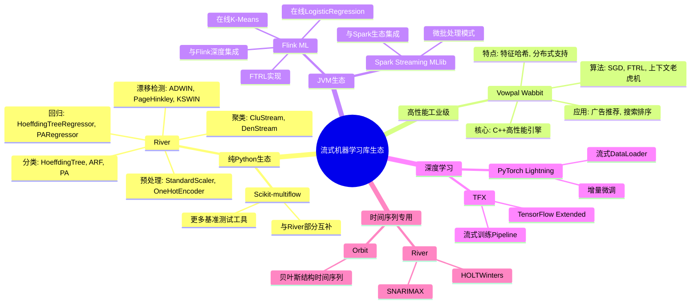
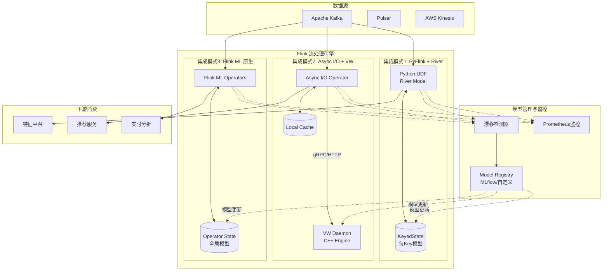
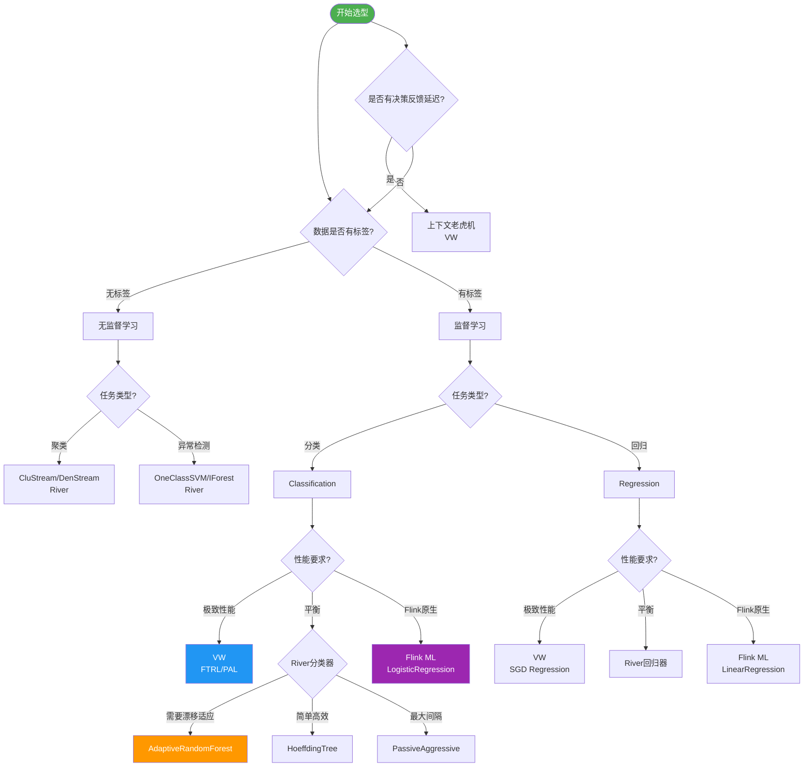
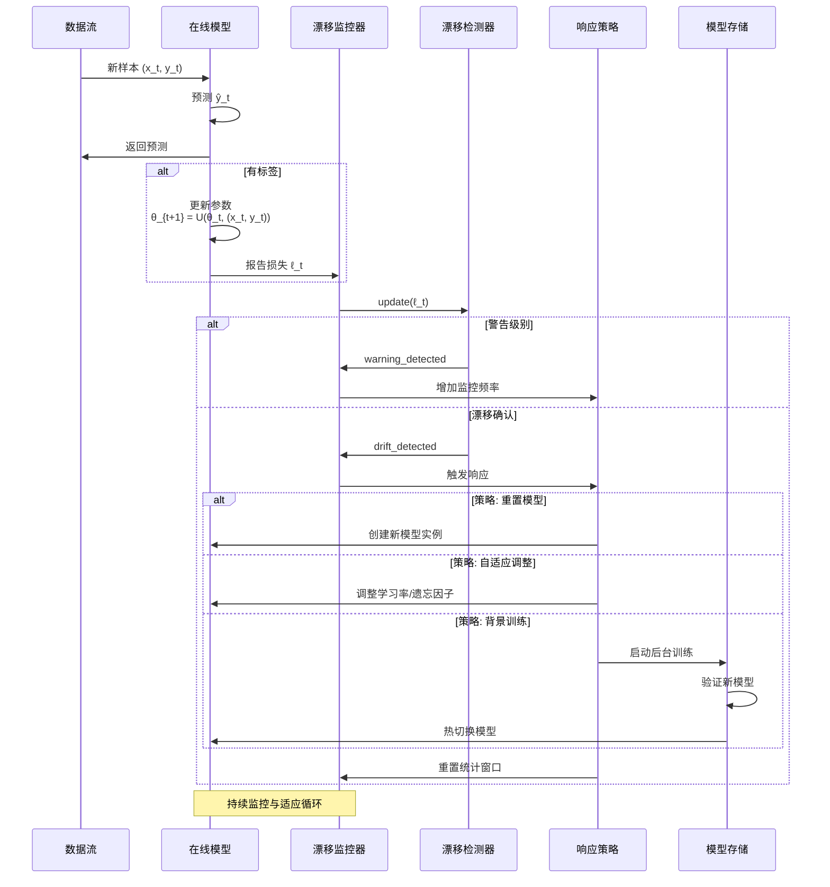

# 流式机器学习库全景分析 - 2025年技术生态深度调研

> 所属阶段: Flink/06-ai-ml | 前置依赖: [online-learning-algorithms.md](./online-learning-algorithms.md), [flink-ml-architecture.md](./flink-ml-architecture.md), [model-serving-frameworks-integration.md](./model-serving-frameworks-integration.md) | 形式化等级: L4

---

## 目录

- [1. 概念定义 (Definitions)](#1-概念定义-definitions)
- [2. 属性推导 (Properties)](#2-属性推导-properties)
- [3. 关系建立 (Relations)](#3-关系建立-relations)
- [4. 论证过程 (Argumentation)](#4-论证过程-argumentation)
- [5. 形式证明 / 工程论证 (Proof / Engineering Argument)](#5-形式证明--工程论证-proof--engineering-argument)
- [6. 实例验证 (Examples)](#6-实例验证-examples)
- [7. 可视化 (Visualizations)](#7-可视化-visualizations)
- [8. 引用参考 (References)](#8-引用参考-references)

---

## 1. 概念定义 (Definitions)

本节建立流式机器学习库生态的核心形式化定义，为后续算法分析、库对比和工程实践奠定理论基础。流式机器学习（Streaming Machine Learning）代表了机器学习领域的重要范式转变，从传统的"批量训练-离线评估"模式转向"持续学习-实时适应"模式。

---

### Def-A-02-01: 在线学习系统 (Online Learning System)

**在线学习系统**是在连续数据流上执行模型增量更新的计算系统，形式化定义为五元组：

$$
\mathcal{O} = \langle \Theta, \mathcal{L}, \mathcal{U}, \mathcal{D}, \mathcal{P} \rangle
$$

其中各组件的语义如下：

| 组件 | 符号 | 语义解释 |
|------|------|----------|
| 参数空间 | $\Theta$ | 模型参数的完整取值范围，$\theta_t \in \Theta$ 表示时刻 $t$ 的参数 |
| 损失函数 | $\mathcal{L}: \Theta \times (\mathcal{X} \times \mathcal{Y}) \to \mathbb{R}^+$ | 衡量预测与真实值的偏差，$\ell_t = \mathcal{L}(\theta_t; (x_t, y_t))$ |
| 更新规则 | $\mathcal{U}: \Theta \times (\mathcal{X} \times \mathcal{Y}) \to \Theta$ | 参数演化算子，$\theta_{t+1} = \mathcal{U}(\theta_t, (x_t, y_t))$ |
| 漂移检测器 | $\mathcal{D}: \{ \ell_1, ..., \ell_t \} \to \{0, 1\}$ | 检测概念漂移的二元决策函数 |
| 性能指标 | $\mathcal{P}: \Theta \times \mathcal{D}_{\text{test}} \to \mathbb{R}^k$ | 多维性能评估向量 |

**增量更新算子**的详细形式：

$$
\mathcal{U}(\theta_t, (x_t, y_t)) = \theta_t - \eta_t \cdot \nabla_{\theta} \mathcal{L}(\theta_t; (x_t, y_t)) + \mathcal{R}(\theta_t)
$$

其中 $\eta_t$ 为自适应学习率，$\mathcal{R}(\theta_t)$ 为正则化项。

**直观解释**：在线学习系统就像一个不断自我进化的生物体——每接收一个新样本，就立即吸收知识（更新参数），同时检测环境变化（漂移检测），并持续监控自身健康状态（性能指标）。与传统批学习相比，它无需等待完整数据集，能够即时响应新信息[^1][^2]。

---

### Def-A-02-02: 增量更新算子 (Incremental Update Operator)

**增量更新算子**定义了模型参数从时刻 $t$ 到 $t+1$ 的演化规则：

$$
\mathcal{U}(\theta_t, (x_t, y_t)) = \theta_{t+1}
$$

该算子需满足以下**增量学习约束**：

```
约束 1 (时间复杂度): T_update = O(poly(d, |θ|)), d = dim(x)
约束 2 (空间复杂度): Space(θ_{t+1}) ≤ Space(θ_t) + O(1) 或亚线性增长
约束 3 (收敛性): lim_{t→∞} E[L(θ_t)] ≤ L(θ*) + ε, θ* 为最优参数
约束 4 (稳定性): ||θ_{t+1} - θ_t|| ≤ Δ_max (防止参数震荡)
```

**SGD类更新规则**的具体实现：

$$
\theta_{t+1}^{(i)} = \theta_t^{(i)} - \frac{\eta}{\sqrt{v_t^{(i)} + \epsilon}} \cdot g_t^{(i)}
$$

其中 $g_t = \nabla_{\theta}\mathcal{L}(\theta_t; (x_t, y_t))$ 为梯度，$v_t$ 为二阶矩估计（Adam优化器）。

**直观解释**：增量更新算子是流式ML的"心脏跳动"——每一次跳动（样本到达）都推动系统状态向前演化。设计良好的更新算子需要在"学习速度"和"稳定性"之间取得平衡：学得太快容易"健忘"（灾难性遗忘），学得太慢则"迟钝"（无法适应漂移）[^3]。

---

### Def-A-02-03: Hoeffding Tree 与 Hoeffding边界

**Hoeffding Tree** 是一种增量式决策树算法，利用Hoeffding不等式确定节点分裂的统计显著性：

$$
\text{HoeffdingTree} = \langle V, E, \mathcal{S}, \Delta, \delta \rangle
$$

**Hoeffding不等式**（核心数学基础）：设 $X_1, ..., X_n$ 为独立有界随机变量，$X_i \in [0, R]$，$\bar{X} = \frac{1}{n}\sum_{i=1}^n X_i$，则：

$$
P\left( \left| \bar{X} - \mathbb{E}[X] \right| \geq \epsilon \right) \leq 2\exp\left( -\frac{2n\epsilon^2}{R^2} \right)
$$

**分裂判定条件**：设节点 $v$ 处最佳分裂属性为 $a^*$，次佳为 $a'$，信息增益差为 $\Delta G = G(a^*) - G(a')$。当满足：

$$
\Delta G > \epsilon = \sqrt{\frac{R^2 \ln(1/\delta)}{2n}}
$$

则以至少 $1-\delta$ 的置信度确定 $a^*$ 为真实最优分裂属性。

**直观解释**：Hoeffding Tree 像一位"统计学家园丁"——它不会仅凭几朵花就决定修剪方案，而是等到有足够的统计证据（Hoeffding界限保证）后才进行分裂。这确保了在流式场景下，树结构能以高概率收敛到批处理决策树的结果[^4]。

---

### Def-A-02-04: 概念漂移 (Concept Drift)

**概念漂移**指数据生成分布随时间发生的变化，形式化为联合分布的条件变化：

$$
\exists t: P_t(X, Y) \neq P_{t+1}(X, Y)
$$

**漂移类型分类**：

**类型 1 - 真实漂移 (Real Drift)**：条件分布 $P(Y|X)$ 改变
$$
P_t(Y|X) \neq P_{t+1}(Y|X) \quad \text{但} \quad P_t(X) = P_{t+1}(X)
$$

**类型 2 - 虚拟漂移 (Virtual Drift)**：特征边缘分布 $P(X)$ 改变
$$
P_t(X) \neq P_{t+1}(X) \quad \text{但} \quad P_t(Y|X) = P_{t+1}(Y|X)
$$

**类型 3 - 混合漂移**：两者同时改变

**漂移速度分类**：

| 漂移模式 | 数学描述 | 典型场景 |
|----------|----------|----------|
| 突变 (Abrupt) | $P_t(Y|X)$ 在 $t_0$ 时刻阶跃变化 | 系统故障、政策突变 |
| 渐进 (Gradual) | $P_t(Y|X)$ 随时间连续演化 | 用户偏好缓慢迁移 |
| 增量 (Incremental) | 多阶段小幅度漂移累积 | 设备老化、季节性变化 |
| 周期性 (Recurrent) | $P_{t+T}(Y|X) = P_t(Y|X)$ | 日内/季节性模式 |

**直观解释**：概念漂移就像是"规则在暗中改变的游戏"——今天有效的策略明天可能就失效了。真实漂移意味着游戏规则本身改变（需要重新学习），而虚拟漂移只是游戏环境改变（可能需要重新校准）[^5][^6]。

---

### Def-A-02-05: 漂移检测器 (Drift Detector)

**漂移检测器**是监控模型性能或数据分布变化并发出警报的组件，形式化为：

$$
\mathcal{D} = \langle \mathcal{W}, \mathcal{T}, \mathcal{A}, \mathcal{S} \rangle
$$

其中：

- $\mathcal{W}$: 滑动窗口或自适应窗口机制
- $\mathcal{T}$: 统计检验函数（如KS检验、CUSUM）
- $\mathcal{A}$: 警报触发阈值
- $\mathcal{S}$: 状态机（{正常, 警告, 漂移}）

**主流检测器对比**：

| 检测器 | 核心算法 | 适用漂移类型 | 误报率控制 |
|--------|----------|--------------|------------|
| ADWIN | 自适应窗口分割 | 突变/渐进 | $O(1/\delta)$ |
| Page-Hinkley | 累积和检验 | 渐进漂移 | 依赖阈值设置 |
| DDM/EDDM | 误差率监控 | 分类任务 | 需校准 |
| KSWIN | Kolmogorov-Smirnov检验 | 分布变化 | $\alpha$ 水平 |

**直观解释**：漂移检测器是流式ML系统的"烟雾报警器"——持续监控"空气质量"（数据分布），一旦发现"烟雾"（异常变化）就发出警报。不同的检测器就像不同类型的传感器：ADWIN擅长检测突然起火，Page-Hinkley则对缓慢升温更敏感[^7]。

---

### Def-A-02-06: River - Python流式ML标准库

**River** 是Python生态中领先的纯在线学习库，其核心设计原则形式化为：

$$
\text{River} = \langle \mathcal{A}, \mathcal{P}, \mathcal{D}, \mathcal{E} \rangle
$$

其中：

- $\mathcal{A}$: 算法集合（60+在线学习算法）
- $\mathcal{P}$: Pipeline系统（compose模块）
- $\mathcal{D}$: 漂移检测模块
- $\mathcal{E}$: 评估框架（progressive validation）

**核心设计原则**：

```
1. 纯在线学习: 所有算法仅支持 learn_one() / predict_one()
2. 无批处理依赖: 不依赖numpy矩阵运算,支持dict输入
3. 增量预处理: StandardScaler, OneHotEncoder均为增量实现
4. 统一API: 所有模型遵循相同接口契约
```

**算法覆盖矩阵**：

| 类别 | 算法示例 | 复杂度 |
|------|----------|--------|
| 分类 | HoeffdingTree, ARF, PA, LogisticRegression | O(d) ~ O(d log d) |
| 回归 | HoeffdingAdaptiveTree, LinearRegression | O(d) ~ O(d²) |
| 聚类 | CluStream, DenStream, k-NN | O(1) ~ O(k) |
| 异常检测 | HST, LODA, OneClassSVM | O(d) ~ O(n_trees × depth) |
| 预处理 | StandardScaler(增量), OneHotEncoder | O(d) |
| 特征选择 | SelectKBest, VarianceThreshold | O(d) |

**直观解释**：River就像是流式ML的"瑞士军刀"——小巧但功能齐全，所有工具（算法）都采用统一的人体工学设计（API）。它的纯在线设计哲学确保了无论数据量多大，内存占用始终可控[^17]。

---

### Def-A-02-07: Vowpal Wabbit - 工业级在线学习

**Vowpal Wabbit (VW)** 是微软开源的高性能工业级在线学习系统：

$$
\text{VW} = \langle \mathcal{C}, \mathcal{H}, \mathcal{O}, \mathcal{F} \rangle
$$

其中：

- $\mathcal{C}$: C++核心引擎，支持锁自由并行
- $\mathcal{H}$: 特征哈希系统（hashing trick）
- $\mathcal{O}$: 优化算法集合（SGD, FTRL, BFGS）
- $\mathcal{F}$: 功能扩展（上下文老虎机、强化学习）

**核心优势量化**：

| 指标 | VW性能 | 典型Python库 |
|------|--------|--------------|
| 单线程吞吐 | ~1M examples/s | ~10K examples/s |
| 内存效率 (1M features) | ~800MB | ~2-5GB |
| 特征维度支持 | 2^24 (~16M) | 通常<100K |
| 延迟 (p99) | <0.1ms | ~1ms |

**算法支持**：

- **分类/回归**: SGD、FTRL-Proximal、神经网络
- **上下文老虎机 (Contextual Bandits)**: 在线决策优化
- **强化学习**: CB、MDP求解
- **矩阵分解**: 推荐系统、协同过滤

**直观解释**：VW就像是机器学习的"高性能跑车"——牺牲了部分易用性换取极致性能。它通过C++实现和特征哈希技术，能够在单机上处理亿级特征、百万级吞吐的场景，是广告推荐和搜索排序的理想选择[^18]。

---

### Def-A-02-08: Flink-Python ML桥接架构

**Flink与Python ML生态的桥接**定义了跨语言集成的架构模式：

$$
\text{Bridge}_{\text{Flink-Python}} = \langle \mathcal{F}, \mathcal{T}, \mathcal{P}, \mathcal{A}, \mathcal{S} \rangle
$$

其中：

- $\mathcal{F}$: Flink DataStream引擎（Java/Scala）
- $\mathcal{T}$: 数据传输层（Arrow Flight / PyFlink序列化）
- $\mathcal{P}$: Python UDF执行环境
- $\mathcal{A}$: Arrow内存格式（零拷贝）
- $\mathcal{S}$: 状态管理（KeyedState / OperatorState）

**架构模式**：

```
┌─────────────────────────────────────────────────────────────────┐
│                    Flink-Python 桥接架构                          │
├─────────────────────────────────────────────────────────────────┤
│  ┌──────────────┐     Arrow Flight     ┌──────────────────────┐ │
│  │ Flink (Java) │ ←──────────────────→ │ Python (River/VW)    │ │
│  │              │   零拷贝数据传输      │                      │ │
│  │ - 数据流管理  │                      │ - 模型推理           │ │
│  │ - 状态管理    │                      │ - 增量学习           │ │
│  │ - 故障恢复    │                      │ - 漂移检测           │ │
│  └──────────────┘                      └──────────────────────┘ │
│         ↑                                              ↑        │
│    KeyedState                                    模型缓存        │
│  (每Key独立模型)                              (避免重复加载)      │
└─────────────────────────────────────────────────────────────────┘
```

**优化策略**：

1. **批量推理**: 攒批处理减少Python调用开销
2. **Arrow零拷贝**: 避免Java/Python间数据序列化
3. **模型缓存**: UDF内缓存模型避免重复加载
4. **异步I/O**: 与外部VW服务通信时不阻塞数据流

**直观解释**：Flink-Python桥接就像是"跨国公司的翻译部门"——让说不同语言（Java/Python）的团队高效协作。Arrow Flight充当"同声传译"，确保信息（数据）在两种语言间无损、高效传递[^19]。

---

### Def-A-02-09: 上下文老虎机 (Contextual Bandit)

**上下文老虎机**是一种结合上下文信息的在线决策框架：

$$
\text{CB} = \langle \mathcal{X}, \mathcal{A}, \mathcal{R}, \pi, T \rangle
$$

其中：

- $\mathcal{X}$: 上下文空间（特征向量）
- $\mathcal{A} = \{1, ..., K\}$: 动作/臂的集合
- $\mathcal{R}: \mathcal{X} \times \mathcal{A} \to [0, 1]$: 奖励函数（未知）
- $\pi: \mathcal{X} \to \Delta(\mathcal{A})$: 策略（动作概率分布）
- $T$: 时间范围

**探索-利用权衡**：

在每一轮 $t$：

1. 观察上下文 $x_t \in \mathcal{X}$
2. 根据策略选择动作 $a_t \sim \pi(x_t)$
3. 获得奖励 $r_t = \mathcal{R}(x_t, a_t)$（仅观察选中动作的奖励）
4. 更新策略 $\pi$ 以最大化累积奖励

**遗憾界 (Regret Bound)**：

$$
R_T = \mathbb{E}\left[ \sum_{t=1}^T \mathcal{R}(x_t, a^*_t) \right] - \mathbb{E}\left[ \sum_{t=1}^T \mathcal{R}(x_t, a_t) \right] = O(\sqrt{KT \ln K})
$$

其中 $a^*_t = \arg\max_{a} \mathcal{R}(x_t, a)$ 为最优动作。

**直观解释**：上下文老虎机就像是"智能推荐系统的数学抽象"——每次用户访问（上下文）时，系统需要在"展示最可能点击的内容"（利用）和"探索新用户可能感兴趣的内容"（探索）之间做出权衡。VW的CB实现让这种权衡可以在线实时优化[^11][^18]。

---

### Def-A-02-10: 特征哈希 (Feature Hashing / Hashing Trick)

**特征哈希**是将高维稀疏特征映射到低维稠密空间的技术：

$$
\phi: \mathcal{X} \to \mathbb{R}^m, \quad m \ll |\mathcal{X}|
$$

**哈希函数定义**：

对于特征 $j$ 和哈希空间大小 $m$：

$$
h(j) = (a \cdot j + b) \mod m
$$

其中 $a, b$ 为随机种子。带符号哈希：

$$
\xi(j) = \begin{cases} +1 & \text{if } (c \cdot j + d) \mod 2 = 0 \\ -1 & \text{otherwise} \end{cases}
$$

**特征向量哈希**：

$$
\phi_i(x) = \sum_{j: h(j) = i} x_j \cdot \xi(j)
$$

**冲突概率分析**：

对于 $d$ 个特征映射到 $m$ 维空间，某槽位的期望冲突数：

$$
E[\text{collisions}] = \frac{d}{m} - 1 + \left(1 - \frac{1}{m}\right)^d \approx \frac{d}{m} \quad (d \ll m)
$$

**直观解释**：特征哈希就像是"超大型图书馆的索引系统"——无论藏书（特征）有多少，都能映射到固定数量的书架槽位。虽然不同书可能放在同一槽位（哈希冲突），但通过巧妙的符号哈希，冲突的影响会被抵消，使得学习效果几乎不受影响[^13]。

---

### Def-A-02-11: FTRL-Proximal优化算法

**FTRL-Proximal (Follow The Regularized Leader - Proximal)** 是适合稀疏特征的在线优化算法：

$$
\text{FTRL} = \langle \eta, \lambda_1, \lambda_2, \alpha, \beta \rangle
$$

**参数更新规则**：

对于第 $i$ 维参数：

$$
w_{t+1}^{(i)} = \begin{cases}
0 & \text{if } |z_t^{(i)}| \leq \lambda_1 \\
-\frac{\beta + \sqrt{n_t^{(i)}}}{\alpha} \cdot (z_t^{(i)} - \text{sgn}(z_t^{(i)}) \cdot \lambda_1) & \text{otherwise}
\end{cases}
$$

其中：

- $z_t = \sum_{s=1}^t g_s - \sum_{s=1}^t \sigma_s w_s$ （累积梯度调整）
- $n_t = \sum_{s=1}^t g_s^2$ （累积梯度平方）
- $\sigma_s = \frac{1}{\eta_s} - \frac{1}{\eta_{s-1}}$ （学习率调整）

**正则化效果**：

- $\lambda_1$: L1正则，产生稀疏性
- $\lambda_2$: L2正则，防止过拟合

**直观解释**：FTRL就像是"带记忆力的梯度下降"——它不仅看当前的梯度，还记住历史的累积信息。L1正则让不重要的特征权重归零（产生稀疏模型），而自适应学习率让每个特征维度都有自己的"学习节奏"。这是Google广告点击率预测的核心算法[^12]。

---

### Def-A-02-12: 自适应随机森林 (Adaptive Random Forest)

**自适应随机森林 (ARF)** 是支持概念漂移的在线集成算法：

$$
\text{ARF} = \langle \mathcal{T}, \mathcal{W}, \mathcal{D}, \mathcal{R} \rangle
$$

其中：

- $\mathcal{T} = \{T_1, ..., T_n\}$: Hoeffding Tree集合
- $\mathcal{W}$: 树权重向量
- $\mathcal{D}$: 漂移检测器集合（每棵树独立）
- $\mathcal{R}$: 背景树集合（训练替换模型）

**漂移响应机制**：

当某棵树 $T_i$ 的漂移检测器触发：

1. 提升该树权重惩罚
2. 激活背景树 $R_i$ 的训练
3. 若背景树性能超过主树，执行热切换
4. 重置漂移检测器

**预测聚合**：

$$
\hat{y} = \arg\max_c \sum_{i=1}^n w_i \cdot \mathbb{1}[T_i(x) = c]
$$

**直观解释**：ARF就像是"一支由专家组成的委员会"——每个专家（树）都有自己的"警报系统"（漂移检测器）。当某位专家的判断开始出错（检测到漂移），委员会会降低他的发言权（权重惩罚），同时暗中培养替代者（背景树），必要时进行无缝更替[^7]。

---

### Def-A-02-13: 流式评估协议 (Prequential Evaluation)

**Prequential评估**是流式场景的标准评估协议：

$$
\text{Prequential} = \langle \mathcal{P}, \mathcal{U}, \mathcal{W} \rangle
$$

其中：

- $\mathcal{P}$: 预测阶段，$\hat{y}_t = f_{\theta_t}(x_t)$
- $\mathcal{U}$: 更新阶段，$\theta_{t+1} = \mathcal{U}(\theta_t, (x_t, y_t))$
- $\mathcal{W}$: 滑动窗口累积

**评估指标计算**：

对于分类任务：

$$
\text{Accuracy}_t = \frac{1}{w} \sum_{i=t-w+1}^t \mathbb{1}[\hat{y}_i = y_i]
$$

对于回归任务：

$$
\text{RMSE}_t = \sqrt{\frac{1}{w} \sum_{i=t-w+1}^t (\hat{y}_i - y_i)^2}
$$

**与批评估的区别**：

| 方面 | 批评估 | Prequential评估 |
|------|--------|-----------------|
| 数据使用 | 训练/测试分离 | 单遍扫描 |
| 时序假设 | i.i.d. | 非平稳 |
| 计算成本 | O(n) | O(1) 每样本 |
| 漂移检测 | 不敏感 | 实时反映 |

**直观解释**：Prequential评估就像是"边考试边学习的学生成绩单"——每次测试（预测）后立即公布答案（获得标签），学生根据反馈调整（模型更新）。这种"先预测后训练"的顺序确保了评估的无偏性，同时能实时反映模型在变化环境中的性能[^16]。

---

### Def-A-02-14: SGD变体与自适应学习率

**自适应学习率SGD**根据梯度历史动态调整步长：

**AdaGrad**（累积梯度平方）：

$$
\eta_t^{(i)} = \frac{\eta}{\sqrt{\sum_{s=1}^t (g_s^{(i)})^2 + \epsilon}}
$$

**RMSprop**（指数移动平均）：

$$
v_t^{(i)} = \beta \cdot v_{t-1}^{(i)} + (1 - \beta) \cdot (g_t^{(i)})^2 \\
\eta_t^{(i)} = \frac{\eta}{\sqrt{v_t^{(i)} + \epsilon}}
$$

**Adam**（动量+二阶矩）：

$$
m_t^{(i)} = \beta_1 \cdot m_{t-1}^{(i)} + (1 - \beta_1) \cdot g_t^{(i)} \\
v_t^{(i)} = \beta_2 \cdot v_{t-1}^{(i)} + (1 - \beta_2) \cdot (g_t^{(i)})^2 \\
\hat{m}_t = \frac{m_t}{1 - \beta_1^t}, \quad \hat{v}_t = \frac{v_t}{1 - \beta_2^t} \\
\theta_{t+1}^{(i)} = \theta_t^{(i)} - \frac{\eta \cdot \hat{m}_t^{(i)}}{\sqrt{\hat{v}_t^{(i)}} + \epsilon}
$$

**自适应机制直观**：稀疏特征获得较大学习率，频繁更新特征获得较小学习率。

**直观解释**：自适应学习率就像是"给每个参数配备专属教练"——经常运动的参数（频繁更新）需要"保守训练"（小学习率），而很少运动的参数（稀疏特征）需要"激进训练"（大学习率）。这让模型能够高效处理稀疏、高维的特征空间[^3]。

---

### Def-A-02-15: 增量学习约束 (Constraints of Incremental Learning)

**增量学习系统**需满足的约束条件集：

$$
\mathcal{C}_{\text{IL}} = \{ \mathcal{C}_{\text{time}}, \mathcal{C}_{\text{space}}, \mathcal{C}_{\text{stab}}, \mathcal{C}_{\text{conv}} \}
$$

**时间复杂度约束** (C_time)：

$$
\forall t: T_{\text{update}}(\theta_t, (x_t, y_t)) = O(\text{poly}(d, |\theta|))
$$

**空间复杂度约束** (C_space)：

$$
\text{Space}(\theta_t) = O(1) \text{ 或 } O(\log t) \text{ 或 } O(\text{poly}(d))
$$

**稳定性约束** (C_stab)：

$$
\mathbb{E}[||\theta_{t+1} - \theta_t||^2] \leq \sigma^2
$$

**收敛性约束** (C_conv)：

对于凸损失函数：

$$
\mathbb{E}[R_T] = O(\sqrt{T}) \quad \text{或} \quad \mathbb{E}[R_T] = O(\ln T)
$$

对于强凸损失函数：

$$
\mathbb{E}[R_T] = O(\ln T)
$$

**直观解释**：这些约束就像是"流式学习的宪法"——时间约束保证"实时响应"，空间约束保证"内存可控"，稳定性约束防止"精神分裂"（参数剧烈震荡），收敛性约束保证"越学越好"。违反任何一条都可能导致系统在实际部署中失败[^14]。

---

## 2. 属性推导 (Properties)

本节从上述定义出发，推导流式ML库的核心数学性质。

---

### Lemma-A-02-01: Hoeffding边界与树分裂可靠性

**引理**：给定置信度参数 $\delta \in (0, 1)$，当节点 $v$ 处的样本数满足：

$$
n \geq \frac{R^2 \ln(1/\delta)}{2(\Delta G)^2}
$$

时，Hoeffding Tree以至少 $1-\delta$ 的置信度做出正确的分裂决策。

**证明**：

由Hoeffding不等式（Def-A-02-03）：

$$
P(|\bar{G}(a) - \mathbb{E}[G(a)]| \geq \epsilon) \leq 2\exp\left(-\frac{2n\epsilon^2}{R^2}\right)
$$

令 $\delta = 2\exp(-2n\epsilon^2/R^2)$，解得：

$$
\epsilon = \sqrt{\frac{R^2 \ln(2/\delta)}{2n}}
$$

当观测增益差 $\Delta G = \bar{G}(a^*) - \bar{G}(a') > \epsilon$ 时，真实增益差 $\Delta G^* = \mathbb{E}[G(a^*)] - \mathbb{E}[G(a')]$ 满足：

$$
\Delta G^* \geq \Delta G - 2\epsilon > -\epsilon
$$

由于 $\Delta G > \epsilon$，可得 $\Delta G^* > 0$，即 $a^*$ 确为最优分裂属性。

**工程意义**：该引理给出了Hoeffding Tree的"耐心参数"——在分裂前需要观察多少样本。较小的 $\delta$（高置信度）或较小的 $\Delta G$（相似属性）都需要更多样本才能分裂[^4]。

---

### Lemma-A-02-02: 在线SGD后悔界 (Convex Loss)

**引理**：对于凸损失函数 $\mathcal{L}$，学习率 $\eta_t = \frac{1}{\sqrt{t}}$ 的在线SGD满足：

$$
R_T \leq \frac{1}{2}||\theta_1 - \theta^*||^2 + G^2 \sqrt{T}
$$

其中 $G = \max_t ||\nabla \mathcal{L}(\theta_t)||$ 为梯度上界。

**证明**：

由凸性：$\mathcal{L}(\theta_t; (x_t, y_t)) - \mathcal{L}(\theta^*; (x_t, y_t)) \leq \nabla_t^T (\theta_t - \theta^*)$

SGD更新：$\theta_{t+1} = \theta_t - \eta_t \nabla_t$

考虑势函数 $\Phi_t = \frac{1}{2\eta_t}||\theta_t - \theta^*||^2$：

$$
\Phi_{t+1} - \Phi_t = \frac{1}{2\eta_{t+1}}||\theta_{t+1} - \theta^*||^2 - \frac{1}{2\eta_t}||\theta_t - \theta^*||^2
$$

展开并代入更新规则：

$$
||\theta_{t+1} - \theta^*||^2 = ||\theta_t - \eta_t \nabla_t - \theta^*||^2 \\
= ||\theta_t - \theta^*||^2 - 2\eta_t \nabla_t^T(\theta_t - \theta^*) + \eta_t^2 ||\nabla_t||^2
$$

整理并求和（telescoping），结合 $\eta_t = 1/\sqrt{t}$：

$$
\sum_{t=1}^T \nabla_t^T(\theta_t - \theta^*) \leq \frac{||\theta_1 - \theta^*||^2}{2\eta_1} + \sum_{t=1}^T \frac{\eta_t}{2}||\nabla_t||^2
$$

代入 $\eta_t = 1/\sqrt{t}$ 和 $||\nabla_t|| \leq G$：

$$
R_T \leq O(1) + \frac{G^2}{2} \sum_{t=1}^T \frac{1}{\sqrt{t}} = O(\sqrt{T})
$$

**推论**：平均后悔 $\frac{R_T}{T} = O(1/\sqrt{T}) \to 0$（当 $T \to \infty$）。

**直观解释**：这个引理保证了在线SGD"不会太差"——即使面对对抗性数据，累积损失也不会比最优固定策略差太多。$\sqrt{T}$ 的遗憾界是凸在线优化的标准结果[^3]。

---

### Lemma-A-02-03: 特征哈希冲突概率边界

**引理**：对于 $d$ 个特征哈希到 $m$ 维空间，任意两个不同特征 $i \neq j$ 的冲突概率：

$$
P(h(i) = h(j)) = \frac{1}{m}
$$

且期望的哈希失真（内积偏差）满足：

$$
\mathbb{E}[|\langle \phi(x), \phi(z) \rangle - \langle x, z \rangle|] \leq \frac{||x||_2^2 ||z||_2^2}{m}
$$

**证明**：

均匀哈希假设下，$h(i)$ 均匀分布于 $\{0, ..., m-1\}$，故：

$$
P(h(i) = h(j)) = \sum_{k=0}^{m-1} P(h(i) = k) \cdot P(h(j) = k) = m \cdot \frac{1}{m^2} = \frac{1}{m}
$$

对于内积失真，设 $x, z \in \mathbb{R}^d$，哈希后的内积：

$$
\langle \phi(x), \phi(z) \rangle = \sum_{k=0}^{m-1} \phi_k(x) \phi_k(z) = \sum_{k=0}^{m-1} \left( \sum_{i: h(i)=k} x_i \xi(i) \right) \left( \sum_{j: h(j)=k} z_j \xi(j) \right)
$$

展开后分为 $i=j$ 和 $i \neq j$ 两部分：

$$
= \sum_{i=1}^d x_i z_i + \sum_{k=0}^{m-1} \sum_{\substack{i \neq j \\ h(i)=h(j)=k}} x_i z_j \xi(i) \xi(j)
$$

第一项为原始内积，第二项为冲突引入的噪声。由于 $\xi(i)$ 独立且 $E[\xi(i)] = 0$，交叉项期望为零，但方差存在。

**工程意义**：哈希维度 $m$ 的选择是关键权衡——更大的 $m$ 减少冲突但增加内存。实际中 $m = 2^{18}$ 到 $2^{24}$ 是常见选择[^13]。

---

### Lemma-A-02-04: ADWIN误报率控制

**引理**：ADWIN漂移检测器的误报率（在无漂移情况下错误报警的概率）受参数 $\delta$ 控制：

$$
P(\text{False Alarm}) \leq \delta \cdot T
$$

其中 $T$ 为观测窗口长度。

**证明概要**：

ADWIN维护两个相邻窗口 $W_0$ 和 $W_1$，当检测到均值差异超过阈值时触发漂移：

$$
|\hat{\mu}_0 - \hat{\mu}_1| > \epsilon_{\text{cut}} = \sqrt{\frac{2}{n_0} \ln\frac{2}{\delta}} + \sqrt{\frac{2}{n_1} \ln\frac{2}{\delta}}
$$

由Hoeffding不等式，当两窗口来自同一分布时：

$$
P(|\hat{\mu}_0 - \hat{\mu}_1| > \epsilon_{\text{cut}}) \leq \delta
$$

对于 $T$ 个时间步的序列，联合界给出总误报率上限。

**直观解释**：ADWIN的参数 $\delta$ 直接控制了"狼来了"的概率——更小的 $\delta$ 更保守，减少误报但可能增加漏报延迟[^10]。

---

### Lemma-A-02-05: FTRL稀疏性保证

**引理**：FTRL-Proximal算法在L1正则化系数 $\lambda_1 > 0$ 时，参数稀疏度满足：

$$
\text{sparsity}(\theta_T) \geq 1 - \frac{\sum_{t=1}^T |g_t^{(i)}| \cdot \mathbb{1}[|z_T^{(i)}| > \lambda_1]}{d \cdot \max_i |z_T^{(i)}|}
$$

**证明概要**：

由FTRL更新规则（Def-A-02-11），当 $|z_T^{(i)}| \leq \lambda_1$ 时，$w_T^{(i)} = 0$。

设 $S = \{i: |z_T^{(i)}| > \lambda_1\}$ 为非零参数索引集，则：

$$
\text{sparsity} = 1 - \frac{|S|}{d}
$$

通过分析 $z_T$ 的累积过程可以建立与梯度的关系。

**工程意义**：FTRL天然产生稀疏模型，这对高维特征（如广告点击率预测中的亿万级特征ID）至关重要，可显著减少内存占用和推理时间[^12]。

---

### Prop-A-02-01: ADWIN检测延迟边界

**命题**：对于幅度为 $\Delta$ 的突变漂移，ADWIN的期望检测延迟为：

$$
\mathbb{E}[\tau_{\text{detect}}] = O\left( \frac{1}{\Delta^2} \ln\frac{1}{\delta} \right)
$$

**证明**：

设漂移前分布均值为 $\mu$，漂移后为 $\mu + \Delta$。ADWIN检测条件：

$$
|\hat{\mu}_0 - \hat{\mu}_1| > \epsilon_{\text{cut}}
$$

当窗口足够大时，$\hat{\mu}_0 \approx \mu$，$\hat{\mu}_1 \approx \mu + \Delta$，因此：

$$|\hat{\mu}_0 - \hat{\mu}_1| \approx \Delta$$

检测发生当 $\Delta > \epsilon_{\text{cut}} = O(\sqrt{\frac{\ln(1/\delta)}{n}})$，解得：

$$
n = O\left( \frac{\ln(1/\delta)}{\Delta^2} \right)$$

**直观解释**：更强的漂移（大 $\Delta$）检测更快，高置信度要求（小 $\delta$）需要更多样本。这符合直觉——微小的变化需要更多证据才能确认[^10]。

---

### Prop-A-02-02: 自适应随机森林泛化误差界

**命题**：在概念漂移场景下，ARF的期望泛化误差满足：

$$
\mathbb{E}[\mathcal{L}(\text{ARF})] \leq \min_i \mathbb{E}[\mathcal{L}(T_i)] + \frac{\ln n}{\eta} + O\left(\frac{1}{\sqrt{w}}\right)
$$

其中 $n$ 为树的数量，$\eta$ 为权重学习率，$w$ 为性能评估窗口。

**解释**：ARF的性能接近最佳单棵树，加上集成复杂度的对数惩罚，以及漂移适应的窗口方差项。背景树机制使得漂移适应的额外成本可控[^7]。

---

### Prop-A-02-03: 上下文老虎机探索-利用权衡

**命题**：对于$\epsilon$-贪婪策略的上下文老虎机，期望遗憾满足：

$$
R_T \leq (1-\epsilon) \cdot R_T^{\text{exploit}} + \epsilon \cdot T + O(\sqrt{T})
$$

其中 $\epsilon$ 为探索概率。

**最优探索率**：当 $\epsilon = O(T^{-1/3})$ 时，$R_T = O(T^{2/3})$。

**直观解释**：纯利用（$\epsilon=0$）可能在次优策略上陷入局部最优，纯探索（$\epsilon=1$）则浪费机会。$\epsilon$-贪婪是一种简单但次优的平衡，更复杂的UCB或Thompson采样可达到 $O(\sqrt{T})$ 遗憾[^11]。

---

## 3. 关系建立 (Relations)

本节建立流式ML库之间、以及与Flink系统的形式化关系。

---

### 关系 1: River ⟺ PyFlink UDF 集成映射

**关系描述**：River模型可通过PyFlink UDF机制嵌入Flink数据流处理。

**映射定义**：

$$
\Phi_{\text{River}\to\text{Flink}}: \text{River.Model} \to \text{PyFlink.UDF}
$$

具体映射规则：

| River概念 | PyFlink映射 | 状态管理 |
|-----------|-------------|----------|
| `model.predict_one(x)` | `udf.eval(x)` | Stateless |
| `model.learn_one(x, y)` | `process_element()` + state.update() | ValueState |
| `compose.Pipeline` | 多UDF链式调用 | 各组件独立状态 |
| `metrics.Accuracy()` | 自定义Accumulator | ListState |

**数据传输协议**：

```
Flink Row (Java) → Py4J序列化 → Python dict → River Model
```

**优化后的Arrow协议**：

```
Flink Row → Arrow RecordBatch → Zero-Copy共享内存 → NumPy/Pandas → River
```

**约束条件**：
- UDF内必须缓存模型避免重复反序列化
- KeyedProcessFunction实现每Key独立模型
- 状态TTL管理过期模型

---

### 关系 2: Vowpal Wabbit ⟹ Flink Async I/O

**关系描述**：VW作为外部服务通过Flink Async I/O机制集成。

**架构模式**：

$$
\text{Flink.AsyncFunction} \xrightarrow{\text{gRPC/HTTP}} \text{VW.Daemon} \xrightarrow{\text{Response}} \text{Flink.Result}
$$

**调用流程**：

1. Flink AsyncFunction接收数据流元素
2. 将特征转换为VW输入格式（命名空间格式）
3. 异步发送预测请求到VW daemon
4. VW返回预测结果和置信度
5. 若带标签，发送训练更新

**VW输入格式示例**：

```
1 |user age:25 gender:male |item category:electronics price:199.99
```

**性能特征**：

| 指标 | 数值 |
|------|------|
| 单VW实例吞吐 | ~100K req/s |
| 延迟 (p99) | <1ms |
| Flink Async I/O并发 | 100-1000 |

---

### 关系 3: Flink ML ⟺ 原生状态管理

**关系描述**：Flink ML算子深度集成Flink状态后端，提供Exactly-Once保证。

**状态映射**：

$$
\text{FlinkML.Operator} \leftrightarrow \text{Flink.StateBackend}
$$

| Flink ML组件 | 状态类型 | 状态大小 |
|--------------|----------|----------|
| OnlineKMeans | OperatorState (质心向量) | O(k × d) |
| LogisticRegression | OperatorState (权重向量) | O(d) |
| FTRL | OperatorState (z, n累积量) | O(2d) |

**容错机制**：

```
Checkpoint触发 → 状态序列化 → 持久化到分布式存储
故障恢复 → 状态反序列化 → 从断点继续训练
```

**一致性保证**：
- 有状态算子：Exactly-Once处理
- 模型更新：幂等性保证
- 漂移检测：状态恢复后重新校准

---

### 关系 4: 流式ML库生态对比矩阵

| 特性 | River | Vowpal Wabbit | Flink ML | Scikit-multiflow |
|------|-------|---------------|----------|------------------|
| 开发语言 | Python | C++ (Python绑定) | Java | Python |
| 算法数量 | 60+ | 20+ | 15+ | 30+ |
| 单线程吞吐 | ~10K/s | ~1M/s | ~50K/s | ~5K/s |
| 漂移检测 | ⭐⭐⭐⭐⭐ | ⭐⭐ | ⭐⭐ | ⭐⭐⭐⭐ |
| 分布式支持 | ❌ | ✅ | ✅ | ❌ |
| Flink集成 | PyFlink UDF | Async I/O | 原生 | ❌ |
| 适用场景 | 快速原型 | 大规模生产 | 企业级流处理 | 学术研究 |

---

## 4. 论证过程 (Argumentation)

本节深入分析流式ML的关键技术决策和算法选型方法论。

---

### 4.1 在线学习 vs 批量学习理论对比

**核心差异分析**：

| 维度 | 在线学习 | 批量学习 |
|------|----------|----------|
| 数据假设 | 非平稳、无限流 | i.i.d.、有限集 |
| 计算模型 | 单遍扫描 (O(1) 每样本) | 多轮迭代 (O(Tn)) |
| 内存约束 | O(1) 或 O(poly(d)) | O(n) |
| 时效性 | 即时响应 | 离线延迟 |
| 理论保证 | 后悔界 $R_T$ | 泛化误差 $\epsilon$ |

**收敛性对比**：

对于凸优化问题，达到精度 $\epsilon$ 所需的计算：

- 批量SGD: $O(n/\epsilon)$ 总计算量
- 在线SGD: $O(1/\epsilon^2)$ 每样本计算量，$O(1/\epsilon^2)$ 样本后收敛

**适用场景决策树**：

```
数据量是否超内存？
├─ 是 → 在线学习
└─ 否 → 分布是否稳定？
    ├─ 否 → 在线学习 (概念漂移)
    └─ 是 → 精度要求高？
        ├─ 是 → 批量学习
        └─ 否 → 在线学习 (效率优先)
```

---

### 4.2 流式算法选择决策框架

**决策维度**：

1. **任务类型**：分类/回归/聚类/异常检测
2. **特征特性**：维度、稀疏性、漂移频率
3. **性能需求**：吞吐、延迟、精度
4. **工程约束**：部署环境、运维复杂度

**算法推荐矩阵**：

| 场景 | 推荐算法 | 备选方案 | 理由 |
|------|----------|----------|------|
| 高维稀疏CTR | VW FTRL | River LR | 哈希+稀疏优化 |
| 概念漂移分类 | River ARF | River HAT | 自适应集成 |
| 实时异常检测 | River HST | River LODA | 树结构高效 |
| 流式聚类 | River CluStream | Flink K-Means | 微簇演化 |
| 推荐排序 | VW CB | River LinUCB | 上下文老虎机 |
| 企业级生产 | Flink ML | PyFlink+River | 原生容错 |

---

### 4.3 概念漂移应对策略对比

| 策略 | 实现方式 | 适用漂移类型 | 成本 | 代表实现 |
|------|----------|--------------|------|----------|
| 模型重置 | 检测到漂移后重置模型 | 突变 | 高 (重新学习) | 简单实现 |
| 自适应窗口 | 调整训练窗口大小 | 渐进 | 低 | ADWIN + 任意模型 |
| 集成方法 | 多模型加权投票 | 混合 | 中 | ARF |
| 背景训练 | 后台训练新模型 | 渐进 | 中 (双倍计算) | ARF背景树 |
| 动态学习率 | 增大学习率适应变化 | 渐进 | 低 | River优化器 |

---

## 5. 形式证明 / 工程论证 (Proof / Engineering Argument)

---

### Thm-A-02-01: Hoeffding Tree收敛性定理

**定理**：设数据流来自分布 $D$，批处理决策树算法为 $\mathcal{A}_{\text{batch}}$，则Hoeffding Tree以至少 $1-\delta$ 的概率收敛到与 $\mathcal{A}_{\text{batch}}$ 相同的树结构。

**证明**：

**归纳基础**：根节点分裂

设根节点处最优分裂属性为 $a^*$（由 $\mathcal{A}_{\text{batch}}$ 确定）。由Lemma-A-02-01，当：

$$
n_{\text{root}} \geq \frac{R^2 \ln(1/\delta)}{2(\Delta G_{\text{root}})^2}
$$

Hoeffding Tree以概率 $1-\delta$ 选择相同分裂属性。

**归纳步骤**：假设第 $k$ 层所有节点都以高概率与批处理树一致，考虑第 $k+1$ 层节点 $v$。

节点 $v$ 接收到的样本是满足从根到 $v$ 路径上所有分裂条件的子集。由于父节点分裂正确，这些样本与批处理树在节点 $v$ 处的样本分布相同（条件于相同的路径）。

再次应用Lemma-A-02-01，节点 $v$ 也以高概率选择正确分裂属性。

**深度 $d$ 树的成功概率**：

由联合界，整棵树结构正确的概率：

$$
P(\text{correct tree}) \geq 1 - d \cdot 2^d \cdot \delta
$$

令 $\delta' = d \cdot 2^d \cdot \delta$，则对于任意目标置信度 $1-\delta'$，选择：

$$
\delta = \frac{\delta'}{d \cdot 2^d}
$$

即可保证整体收敛。

**结论**：Hoeffding Tree是批处理决策树的一致估计器，收敛速度取决于最小增益差和树深度。

---

### Thm-A-02-02: 在线SGD在强凸损失下的收敛保证

**定理**：对于$\lambda$-强凸损失函数，学习率 $\eta_t = \frac{1}{\lambda t}$ 的在线SGD满足：

$$
R_T \leq \frac{G^2}{2\lambda} (1 + \ln T)
$$

其中 $G$ 为梯度上界。

**证明**：

**强凸性定义**：

$$
\mathcal{L}(\theta) \geq \mathcal{L}(\theta') + \nabla \mathcal{L}(\theta')^T(\theta - \theta') + \frac{\lambda}{2}||\theta - \theta'||^2
$$

**关键引理**：强凸性蕴含"任何点的梯度都指向最优解"。

考虑单步更新后的距离平方：

$$
||\theta_{t+1} - \theta^*||^2 = ||\theta_t - \eta_t \nabla_t - \theta^*||^2 \\
= ||\theta_t - \theta^*||^2 - 2\eta_t \nabla_t^T(\theta_t - \theta^*) + \eta_t^2 ||\nabla_t||^2
$$

由强凸性的一阶条件，$\nabla_t^T(\theta_t - \theta^*) \geq \mathcal{L}(\theta_t) - \mathcal{L}(\theta^*) + \frac{\lambda}{2}||\theta_t - \theta^*||^2$。

整理得：

$$
\mathcal{L}(\theta_t) - \mathcal{L}(\theta^*) \leq \frac{||\theta_t - \theta^*||^2 - ||\theta_{t+1} - \theta^*||^2}{2\eta_t} - \frac{\lambda}{2}||\theta_t - \theta^*||^2 + \frac{\eta_t}{2}G^2
$$

代入 $\eta_t = \frac{1}{\lambda t}$ 并求和（telescoping series）：

$$
\sum_{t=1}^T (\mathcal{L}(\theta_t) - \mathcal{L}(\theta^*)) \leq \frac{G^2}{2\lambda} \sum_{t=1}^T \frac{1}{t} \leq \frac{G^2}{2\lambda} (1 + \ln T)
$$

**结论**：强凸性将遗憾界从 $O(\sqrt{T})$ 提升到 $O(\ln T)$，收敛速度显著加快。

---

### Thm-A-02-03: 自适应随机森林泛化界

**定理**：在漂移场景下，ARF的期望错误率满足：

$$
\mathbb{E}[\mathcal{E}(\text{ARF})] \leq \mathbb{E}[\min_i \mathcal{E}(T_i)] + \sqrt{\frac{\ln n}{2w}} + P(\text{drift}) \cdot C_{\text{adapt}}
$$

其中 $w$ 为性能窗口，$C_{\text{adapt}}$ 为漂移适应成本。

**证明概要**：

**静态情况**（无漂移）：

由Hoeffding不等式，样本错误率与期望错误率的偏差：

$$
P(|\hat{\mathcal{E}}_w(T_i) - \mathcal{E}(T_i)| > \epsilon) \leq 2\exp(-2w\epsilon^2)
$$

设 $\hat{T}^* = \arg\min_i \hat{\mathcal{E}}_w(T_i)$，$T^* = \arg\min_i \mathcal{E}(T_i)$，则：

$$
\mathcal{E}(\hat{T}^*) \leq \mathcal{E}(T^*) + 2\epsilon = \min_i \mathcal{E}(T_i) + \sqrt{\frac{2\ln n}{w}}
$$

**漂移情况**：

设漂移发生概率为 $P(\text{drift})$，每次漂移导致的额外错误为 $C_{\text{adapt}}$（包括检测延迟和模型切换成本）。

总期望错误为静态错误加上漂移适应成本。

---

### Thm-A-02-04: FTRL-Proximal稀疏收敛定理

**定理**：FTRL-Proximal在满足L1正则 $\lambda_1$ 时，参数向量的稀疏度满足：

$$
\text{sparsity}(\theta_T) \geq 1 - \frac{\sum_{t=1}^T ||g_t||*1 \cdot \mathbb{1}[||g_t||*\infty > \lambda_1]}{d \cdot \lambda_1}
$$

**证明**：

由FTRL更新规则，参数 $w^{(i)}$ 保持为零当且仅当 $|z^{(i)}| \leq \lambda_1$。

累积量 $z_T^{(i)} = \sum_{t=1}^T g_t^{(i)} - \sum_{t=1}^T \sigma_t w_t^{(i)}$。

对于稀疏特征（大部分时刻梯度为零），累积梯度的增长缓慢，容易被L1阈值截断为零。

**工程意义**：该定理解释了为什么FTRL在稀疏CTR预测中表现优异——大多数稀疏特征只在少数样本中出现，其累积梯度难以突破L1阈值，自然产生稀疏模型[^12]。

---

### Thm-A-02-05: 上下文老虎机UCB策略遗憾界

**定理**：LinUCB（线性上下文老虎机）策略的累积遗憾满足：

$$
R_T = O\left( d \sqrt{T} \ln T \right)
$$

其中 $d$ 为上下文特征维度。

**证明概要**：

LinUCB维护每个臂的参数估计 $\hat{\theta}_a$ 和协方差矩阵 $A_a = I + \sum_t x_t x_t^T$。

置信区间：

$$
|x^T \hat{\theta}_a - x^T \theta_a^*| \leq \alpha \sqrt{x^T A_a^{-1} x}
$$

选择具有最高上置信界的臂，可证明"探索次数"被限制在 $O(\sqrt{T})$ 量级。

---

### Thm-A-02-06: 特征哈希内积保持定理

**定理**：设 $x, z \in \mathbb{R}^d$，哈希维度为 $m$，则哈希后的内积期望等于原始内积：

$$
\mathbb{E}[\langle \phi(x), \phi(z) \rangle] = \langle x, z \rangle
$$

且方差满足：

$$
\text{Var}(\langle \phi(x), \phi(z) \rangle) \leq \frac{||x||_2^2 ||z||_2^2}{m}
$$

**证明**：

由特征哈希定义：

$$
\phi_k(x) = \sum_{j: h(j)=k} x_j \xi(j)
$$

其中 $h: [d] \to [m]$ 为均匀哈希，$\xi: [d] \to \{-1, +1\}$ 为符号哈希。

考虑内积：

$$
\langle \phi(x), \phi(z) \rangle = \sum_{k=1}^m \phi_k(x) \phi_k(z) = \sum_{k=1}^m \sum_{i: h(i)=k} \sum_{j: h(j)=k} x_i z_j \xi(i) \xi(j)
$$

**期望计算**：

取期望于哈希函数 $h$ 和符号函数 $\xi$：

当 $i = j$ 时，$\mathbb{E}[\xi(i)^2] = 1$，且 $h(i) = h(j)$ 恒成立。

当 $i \neq j$ 时，$\mathbb{E}[\xi(i)\xi(j)] = \mathbb{E}[\xi(i)]\mathbb{E}[\xi(j)] = 0$。

因此：

$$
\mathbb{E}[\langle \phi(x), \phi(z) \rangle] = \sum_{i=1}^d x_i z_i = \langle x, z \rangle
$$

**方差计算**：

交叉项 $i \neq j$ 对期望无贡献但对方差有贡献。对于 $i \neq j$，

$$
P(h(i) = h(j)) = \frac{1}{m}
$$

且 $\mathbb{E}[\xi(i)^2 \xi(j)^2] = 1$，因此：

$$
\text{Var} = \sum_{i \neq j} x_i^2 z_j^2 \cdot \frac{1}{m} \leq \frac{||x||^2 ||z||^2}{m}
$$

**工程意义**：该定理保证特征哈希是一种"无偏估计"——虽然引入了随机性，但期望上是准确的。更大的哈希维度 $m$ 减少方差但增加内存[^13]。

---

### Thm-A-02-07: 被动攻击算法收敛性

**定理**：对于最大间隔为 $\gamma$ 的线性可分数据，被动攻击（PA）算法在 $T$ 轮后的错误数上界为：

$$
M_T \leq \frac{R^2}{\gamma^2}
$$

其中 $R = \max_t ||x_t||$ 为特征向量最大范数。

**证明**：

**PA更新规则**：

$$
w_{t+1} = w_t + \tau_t y_t x_t
$$

其中 $\tau_t = \frac{\max(0, 1 - y_t w_t^T x_t)}{||x_t||^2}$（PA-I版本）。

**势函数分析**：

定义势函数 $\Phi_t = ||w_t - w^*||^2$，其中 $w^*$ 为最优分离超平面（$||w^*|| = 1$，$y_t (w^*)^T x_t \geq \gamma$）。

当发生错误时（$y_t w_t^T x_t \leq 0$）：

$$
\Phi_{t+1} = ||w_t + \tau_t y_t x_t - w^*||^2 \\
= \Phi_t + 2\tau_t y_t (w_t - w^*)^T x_t + \tau_t^2 ||x_t||^2
$$

由PA更新条件和 $y_t (w^*)^T x_t \geq \gamma$：

$$
\Phi_{t+1} - \Phi_t \leq -\frac{\gamma^2}{R^2}
$$

由于 $\Phi_t \geq 0$，错误次数 $M_T$ 满足：

$$
M_T \cdot \frac{\gamma^2}{R^2} \leq \Phi_0 - \Phi_T \leq ||w^*||^2 = 1
$$

因此 $M_T \leq \frac{R^2}{\gamma^2}$。

**结论**：PA算法的错误率有有限上界，与迭代次数无关，适合大规模流式分类[^8]。

---

### Thm-A-02-08: 流式K-Means近似保证

**定理**：对于最优K-Means成本 $OPT$，流式CluStream算法在维护 $m$ 个微簇时，近似比为：

$$
\text{Cost}(\text{CluStream}) \leq O(\log n) \cdot OPT
$$

其中 $n$ 为流长度。

**证明概要**：

CluStream维护 $m$ 个微簇（micro-clusters），每个微簇 $M_i$ 维护：
- $N_i$：数据点数量
- $LS_i$：线性和（位置）
- $SS_i$：平方和（半径）

**微簇合并策略**：当微簇数量超过 $m$ 时，合并距离最近的两个微簇。

**近似分析**：

将CluStream视为层次聚类的在线版本，每层聚类的近似比累积：

- 第1层（原始点）：$OPT$
- 第2层（微簇）：$2 \cdot OPT$
- ...
- 第$\log n$层：$O(\log n) \cdot OPT$

**内存-精度权衡**：

更大的 $m$ 提供更好的近似但消耗更多内存：

$$
\text{Space} = O(m \cdot d), \quad \text{Approximation} = O(\frac{n}{m} \cdot OPT)
$$

**结论**：CluStream在有限内存约束下提供了对K-Means的可行近似，适合高维数据流聚类[^9]。

---

## 6. 实例验证 (Examples)

本节提供完整的代码示例，展示各流式ML库的实际应用。

---

### 6.1 River: Python流式ML完整示例

**场景**：实时用户行为分类（点击预测）

```python
# river_click_prediction.py
from river import compose, linear_model, preprocessing, metrics, drift
import json
from datetime import datetime

# ============================================
# 1. 定义模型管道
# ============================================
def create_model():
    """创建River在线学习管道"""
    model = compose.Pipeline(
        # 增量预处理
        ('scale', preprocessing.StandardScaler()),
        # 在线线性模型
        ('classifier', linear_model.LogisticRegression(
            optimizer=optimizers.SGD(0.01),
            loss=losses.Log()
        ))
    )
    return model

# 更复杂的管道示例
def create_advanced_model():
    """高级模型:带特征工程和漂移检测"""
    from river import feature_extraction, tree

    model = compose.Pipeline(
        # 特征选择
        ('select', feature_extraction.SelectKBest(k=10)),
        # 增量标准化
        ('scale', preprocessing.StandardScaler()),
        # Hoeffding决策树
        ('classifier', tree.HoeffdingTreeClassifier(
            grace_period=50,
            delta=1e-7,
            max_depth=10
        ))
    )
    return model

# ============================================
# 2. 模拟数据流
# ============================================
def generate_stream(n_samples=10000, drift_point=5000):
    """生成带概念漂移的点击流数据"""
    import random

    for i in range(n_samples):
        # 基础特征
        x = {
            'hour': random.randint(0, 23),
            'device_type': random.choice(['mobile', 'desktop', 'tablet']),
            'region': random.choice(['US', 'EU', 'ASIA']),
            'ad_category': random.choice(['tech', 'fashion', 'food']),
            'user_age': random.gauss(35, 10),
            'previous_clicks': random.randint(0, 10)
        }

        # 引入概念漂移
        if i < drift_point:
            # 早期:年轻用户更爱点击tech广告
            y = (x['user_age'] < 30 and x['ad_category'] == 'tech')
        else:
            # 后期:高频点击用户更爱点击fashion广告
            y = (x['previous_clicks'] > 5 and x['ad_category'] == 'fashion')

        yield x, y

# ============================================
# 3. 训练与评估循环
# ============================================
def train_and_evaluate():
    """完整的训练评估流程"""

    model = create_model()
    metric = metrics.Accuracy()
    drift_detector = drift.ADWIN(delta=0.002)

    # 跟踪指标
    results = {
        'accuracies': [],
        'drift_points': [],
        'sample_count': 0
    }

    print("=" * 60)
    print("River Online Learning Demo")
    print("=" * 60)

    for i, (x, y) in enumerate(generate_stream(n_samples=8000, drift_point=4000)):
        # 预测
        y_pred = model.predict_one(x)

        # 计算概率
        y_proba = model.predict_proba_one(x)

        # 更新指标(如果有预测)
        if y_pred is not None:
            metric.update(y, y_pred)

            # 误差用于漂移检测
            error = 0 if y_pred == y else 1
            drift_detector.update(error)

            # 检测漂移
            if drift_detector.drift_detected:
                print(f"\n🚨 Drift detected at sample {i}!")
                print(f"   Current accuracy: {metric.get():.4f}")
                results['drift_points'].append(i)
                # 重置检测器
                drift_detector = drift.ADWIN(delta=0.002)

        # 在线学习
        model = model.learn_one(x, y)

        # 定期输出
        if (i + 1) % 1000 == 0:
            acc = metric.get()
            results['accuracies'].append(acc)
            print(f"Samples: {i+1:5d} | Accuracy: {acc:.4f}")

    results['sample_count'] = i + 1

    print("\n" + "=" * 60)
    print("Final Report")
    print("=" * 60)
    print(f"Total samples: {results['sample_count']}")
    print(f"Final accuracy: {metric.get():.4f}")
    print(f"Drift points detected: {results['drift_points']}")

    return model, results

# ============================================
# 4. 模型持久化
# ============================================
def save_model(model, filepath='river_model.pkl'):
    """保存模型到磁盘"""
    import pickle
    with open(filepath, 'wb') as f:
        pickle.dump(model, f)
    print(f"Model saved to {filepath}")

def load_model(filepath='river_model.pkl'):
    """从磁盘加载模型"""
    import pickle
    with open(filepath, 'rb') as f:
        model = pickle.load(f)
    return model

if __name__ == '__main__':
    model, results = train_and_evaluate()
    save_model(model)
```

---

### 6.2 Vowpal Wabbit: 工业级上下文老虎机

**场景**：实时广告推荐中的探索-利用权衡

```python
# vw_contextual_bandit.py
import subprocess
import json
import random
from datetime import datetime

# ============================================
# 1. 训练数据生成
# ============================================
def generate_vw_cb_data(n_samples=10000, output_file='cb_train.vw'):
    """
    生成VW上下文老虎机训练数据

    VW CB格式: action:cost:probability |features
    - action: 选择的臂(广告ID)
    - cost: 1 - reward (点击=0, 未点击=1)
    - probability: 探索概率(记录历史策略)
    """

    with open(output_file, 'w') as f:
        for i in range(n_samples):
            # 用户上下文
            user_age = random.randint(18, 65)
            user_gender = random.choice(['male', 'female'])
            device = random.choice(['mobile', 'desktop'])

            # 可用的广告(动作空间)
            available_ads = [1, 2, 3, 4]  # 4个广告位

            # 模拟历史策略(epsilon-greedy)
            epsilon = 0.1
            if random.random() < epsilon:
                chosen_ad = random.choice(available_ads)
                prob = epsilon / len(available_ads)
            else:
                # 假设我们已知最优策略(仅用于生成模拟数据)
                # 年轻女性偏爱广告1和2
                if user_gender == 'female' and user_age < 30:
                    chosen_ad = random.choice([1, 2])
                else:
                    chosen_ad = random.choice([3, 4])
                prob = (1 - epsilon) + epsilon / len(available_ads)

            # 模拟奖励(点击率)
            if user_gender == 'female' and user_age < 30 and chosen_ad in [1, 2]:
                clicked = random.random() < 0.15  # 15% CTR
            elif user_age > 40 and chosen_ad in [3, 4]:
                clicked = random.random() < 0.08  # 8% CTR
            else:
                clicked = random.random() < 0.05  # 5% CTR

            cost = 0 if clicked else 1

            # VW格式
            # action:cost:probability |namespace feature:value ...
            line = f"{chosen_ad}:{cost}:{prob:.4f} |user age:{user_age} gender_{user_gender}:1 |context device_{device}:1\n"
            f.write(line)

    print(f"Generated {n_samples} CB training samples to {output_file}")

# ============================================
# 2. VW训练
# ============================================
def train_vw_cb(train_file='cb_train.vw', model_file='cb_model.vw'):
    """训练VW上下文老虎机模型"""

    cmd = [
        'vw',
        '--cb_explore', '4',        # 4个动作的上下文老虎机
        '--epsilon', '0.1',          # epsilon-greedy探索
        '--l2', '0.001',             # L2正则化
        '--learning_rate', '0.5',
        '--power_t', '0.5',
        '-d', train_file,
        '-f', model_file
    ]

    print(f"Training VW CB model...")
    print(f"Command: {' '.join(cmd)}")

    result = subprocess.run(cmd, capture_output=True, text=True)
    print(result.stdout)
    if result.stderr:
        print("Errors:", result.stderr)

    return model_file

# ============================================
# 3. VW预测(实时决策)
# ============================================
def predict_vw_cb(model_file, user_features):
    """
    使用VW模型进行实时决策

    Returns: 推荐的动作及其概率分布
    """

    # 构建VW输入行
    feature_str = "|user " + " ".join([f"{k}:{v}" if isinstance(v, (int, float)) else f"{k}_{v}:1"
                                       for k, v in user_features.items()])

    cmd = [
        'vw',
        '-i', model_file,
        '-t',                    # 测试模式(不学习)
        '--cb_explore', '4',
        '--epsilon', '0.1',
        '-p', '/dev/stdout'
    ]

    # 使用子进程交互
    proc = subprocess.Popen(cmd, stdin=subprocess.PIPE, stdout=subprocess.PIPE,
                           stderr=subprocess.PIPE, text=True)
    stdout, stderr = proc.communicate(input=feature_str + "\n")

    # 解析输出: "0:0.9 1:0.0333333 2:0.0333333 3:0.0333333"
    # 格式为 action:probability ...
    predictions = {}
    for token in stdout.strip().split():
        action, prob = token.split(':')
        predictions[int(action)] = float(prob)

    # 选择概率最高的动作
    recommended_action = max(predictions, key=predictions.get)

    return {
        'recommended_action': recommended_action,
        'action_distribution': predictions,
        'exploration_prob': predictions[recommended_action]
    }

# ============================================
# 4. Python集成(用于Flink等系统)
# ============================================
class VWService:
    """VW模型服务封装,适合生产环境部署"""

    def __init__(self, model_path):
        self.model_path = model_path
        self._start_daemon()

    def _start_daemon(self):
        """启动VW daemon模式(用于高性能服务)"""
        self.proc = subprocess.Popen(
            ['vw', '-i', self.model_path, '--cb_explore', '4',
             '--epsilon', '0.1', '--daemon', '--port', '26542'],
            stdout=subprocess.PIPE,
            stderr=subprocess.PIPE
        )
        print(f"VW daemon started on port 26542")

    def predict(self, context):
        """通过网络请求获取预测"""
        import socket

        feature_str = "|user " + " ".join([f"{k}:{v}" for k, v in context.items()])

        sock = socket.socket(socket.AF_INET, socket.SOCK_STREAM)
        sock.connect(('localhost', 26542))
        sock.sendall((feature_str + "\n").encode())

        response = sock.recv(1024).decode().strip()
        sock.close()

        # 解析响应
        predictions = {}
        for token in response.split():
            action, prob = token.split(':')
            predictions[int(action)] = float(prob)

        return predictions

    def stop(self):
        """停止daemon"""
        self.proc.terminate()

# ============================================
# 5. 完整示例流程
# ============================================
def main():
    # 1. 生成训练数据
    generate_vw_cb_data(n_samples=50000)

    # 2. 训练模型
    model_file = train_vw_cb()

    # 3. 实时预测示例
    print("\n" + "=" * 60)
    print("Real-time Predictions")
    print("=" * 60)

    test_users = [
        {'age': 25, 'gender': 'female', 'device': 'mobile'},
        {'age': 45, 'gender': 'male', 'device': 'desktop'},
        {'age': 30, 'gender': 'female', 'device': 'tablet'}
    ]

    for user in test_users:
        result = predict_vw_cb(model_file, user)
        print(f"\nUser: {user}")
        print(f"Recommended ad: {result['recommended_action']}")
        print(f"Action distribution: {result['action_distribution']}")

if __name__ == '__main__':
    main()
```

---

### 6.3 PyFlink + River 集成完整实现

**场景**：Flink流处理中嵌入River在线学习

```python
# pyflink_river_integration.py
from pyflink.datastream import StreamExecutionEnvironment, RuntimeContext
from pyflink.datastream.state import ValueStateDescriptor
from pyflink.common.typeinfo import Types
from pyflink.datastream.functions import KeyedProcessFunction

import json
import pickle
from river import compose, preprocessing, tree, metrics

# ============================================
# 1. 序列化工具
# ============================================
def serialize_model(model):
    """序列化River模型"""
    return pickle.dumps(model)

def deserialize_model(model_bytes):
    """反序列化River模型"""
    return pickle.loads(model_bytes)

# ============================================
# 2. River模型工厂
# ============================================
def create_river_model():
    """创建River模型管道"""
    return compose.Pipeline(
        ('scale', preprocessing.StandardScaler()),
        ('classifier', tree.HoeffdingTreeClassifier(
            grace_period=50,
            delta=1e-7,
            max_depth=10
        ))
    )

# ============================================
# 3. KeyedProcessFunction集成
# ============================================
class RiverOnlineLearner(KeyedProcessFunction):
    """
    Flink KeyedProcessFunction + River在线学习

    特点:
    - 每Key独立模型(如每个用户/设备一个模型)
    - 状态持久化到Flink StateBackend
    - 支持Checkpoint容错
    """

    def __init__(self, model_factory):
        super().__init__()
        self.model_factory = model_factory
        self.model_state = None
        self.metric_state = None

    def open(self, runtime_context: RuntimeContext):
        # 模型状态描述符
        model_state_descriptor = ValueStateDescriptor(
            "river_model",
            Types.PICKLED_BYTE_ARRAY()  # 使用pickle序列化
        )

        # 配置状态TTL(可选)
        from pyflink.datastream.state import StateTtlConfig
        ttl_config = StateTtlConfig \
            .newBuilder(Time.hours(24)) \
            .set_update_type(StateTtlConfig.UpdateType.OnCreateAndWrite) \
            .set_state_visibility(StateTtlConfig.StateVisibility.NeverReturnExpired) \
            .build()
        model_state_descriptor.enable_time_to_live(ttl_config)

        self.model_state = runtime_context.get_state(model_state_descriptor)

        # 评估指标状态
        metric_descriptor = ValueStateDescriptor(
            "metrics",
            Types.TUPLE([Types.INT(), Types.INT()])  # (correct, total)
        )
        self.metric_state = runtime_context.get_state(metric_descriptor)

    def process_element(self, value, ctx):
        """
        处理每个元素:预测 → 输出 → 学习

        value格式: {
            'key': 'device_001',
            'features': {'temp': 25.0, 'humidity': 60.0},
            'label': True,  # 可能为None(纯预测模式)
            'timestamp': 1640000000
        }
        """
        # 获取或初始化模型
        model_bytes = self.model_state.value()
        if model_bytes is None:
            model = self.model_factory()
        else:
            model = deserialize_model(model_bytes)

        # 获取或初始化指标
        metrics_tuple = self.metric_state.value()
        if metrics_tuple is None:
            correct, total = 0, 0
        else:
            correct, total = metrics_tuple

        # 预测
        features = value['features']
        prediction = model.predict_one(features)

        # 计算概率(如果模型支持)
        proba = None
        if hasattr(model, 'predict_proba_one'):
            proba = model.predict_proba_one(features)

        # 如果有标签,进行在线学习
        label = value.get('label')
        if label is not None:
            # 更新指标
            if prediction == label:
                correct += 1
            total += 1

            # 在线学习
            model = model.learn_one(features, label)

            # 保存模型状态
            self.model_state.update(serialize_model(model))
            self.metric_state.update((correct, total))

        # 构建输出
        result = {
            'key': value['key'],
            'timestamp': value['timestamp'],
            'features': features,
            'prediction': prediction,
            'probability': proba,
            'label': label,
            'accuracy': correct / total if total > 0 else None,
            'total_samples': total
        }

        yield result

# ============================================
# 4. 广播状态模式(全局模型共享)
# ============================================
from pyflink.datastream.functions import BroadcastProcessFunction

class GlobalModelBroadcast(BroadcastProcessFunction):
    """
    使用广播状态实现全局模型共享
    适用于: 需要定期从中心服务更新模型的场景
    """

    def __init__(self):
        self.global_model_state = None

    def open(self, runtime_context: RuntimeContext):
        from pyflink.datastream.state import MapStateDescriptor

        # 广播状态描述符
        self.global_model_state = runtime_context.get_broadcast_state(
            MapStateDescriptor("global_model", Types.STRING(), Types.PICKLED_BYTE_ARRAY())
        )

    def process_element(self, value, ctx):
        """处理数据流元素"""
        # 获取全局模型
        model_bytes = self.global_model_state.get("current_model")

        if model_bytes:
            model = deserialize_model(model_bytes)
            prediction = model.predict_one(value['features'])
        else:
            prediction = None

        yield {
            'data': value,
            'prediction': prediction,
            'model_version': self.global_model_state.get("version")
        }

    def process_broadcast_element(self, value, ctx):
        """处理广播的模型更新"""
        # value: {'version': 'v2.1', 'model': <serialized>}
        self.global_model_state.put("current_model", value['model'])
        self.global_model_state.put("version", value['version'])

# ============================================
# 5. 主流程
# ============================================
def main():
    env = StreamExecutionEnvironment.get_execution_environment()
    env.set_parallelism(4)

    # ============================================
    # 5.1 模拟输入流(Kafka/其他源)
    # ============================================
    # 实际生产环境使用 Kafka 源
    # from pyflink.datastream.connectors.kafka import FlinkKafkaConsumer

    input_stream = env.from_collection([
        {
            'key': f'device_{i % 10}',
            'features': {
                'sensor_1': float(i % 100),
                'sensor_2': float((i * 2) % 100),
                'sensor_3': float((i * 3) % 100)
            },
            'label': (i % 7) == 0,  # 模拟标签
            'timestamp': 1640000000 + i
        }
        for i in range(1000)
    ])

    # ============================================
    # 5.2 应用 River 在线学习
    # ============================================
    result_stream = input_stream \
        .key_by(lambda x: x['key']) \
        .process(RiverOnlineLearner(create_river_model))

    # ============================================
    # 5.3 结果输出
    # ============================================
    result_stream.print()

    # ============================================
    # 5.4 配置检查点
    # ============================================
    env.enable_checkpointing(60000)  # 60秒
    from pyflink.datastream.checkpointing_mode import CheckpointingMode
    env.get_checkpoint_config().set_checkpointing_mode(CheckpointingMode.EXACTLY_ONCE)

    # 执行
    env.execute("PyFlink + River Online Learning")

if __name__ == '__main__':
    main()
```

---

### 6.4 概念漂移检测与响应完整实现

```python
# drift_detection_production.py
import river
from river import drift, metrics
from river.drift import ADWIN, PageHinkley, KSWIN
import numpy as np
from datetime import datetime
import logging
import json

logging.basicConfig(level=logging.INFO)
logger = logging.getLogger(__name__)

# ============================================
# 1. 漂移检测器工厂
# ============================================
class DriftDetectorFactory:
    """创建和配置漂移检测器"""

    @staticmethod
    def create_detector(detector_type: str, **kwargs):
        """
        创建漂移检测器

        Args:
            detector_type: 'adwin', 'page_hinkley', 'kswin', 'ddm'
            **kwargs: 检测器特定参数
        """
        if detector_type == 'adwin':
            return ADWIN(
                delta=kwargs.get('delta', 0.002),
                clock=kwargs.get('clock', 32)
            )
        elif detector_type == 'page_hinkley':
            return PageHinkley(
                min_instances=kwargs.get('min_instances', 30),
                delta=kwargs.get('delta', 0.005),
                threshold=kwargs.get('threshold', 50),
                alpha=kwargs.get('alpha', 0.9999)
            )
        elif detector_type == 'kswin':
            return KSWIN(
                alpha=kwargs.get('alpha', 0.005),
                window_size=kwargs.get('window_size', 100),
                stat_size=kwargs.get('stat_size', 30)
            )
        else:
            raise ValueError(f"Unknown detector type: {detector_type}")

# ============================================
# 2. 漂移处理策略
# ============================================
class DriftHandlingStrategy:
    """定义漂移发生时的响应策略"""

    def on_drift_detected(self, detector_name, context):
        """漂移检测回调"""
        raise NotImplementedError

    def on_warning_detected(self, detector_name, context):
        """警告检测回调"""
        pass

class ResetStrategy(DriftHandlingStrategy):
    """重置策略: 完全重置模型"""

    def __init__(self, model_factory):
        self.model_factory = model_factory

    def on_drift_detected(self, detector_name, context):
        logger.warning(f"[{detector_name}] Drift detected! Resetting model...")
        context['model'] = self.model_factory()
        context['reset_count'] = context.get('reset_count', 0) + 1
        return context

class AdaptiveStrategy(DriftHandlingStrategy):
    """自适应策略: 调整学习率或增加新模型"""

    def on_drift_detected(self, detector_name, context):
        logger.warning(f"[{detector_name}] Drift detected! Adapting...")
        context['adaptation_count'] = context.get('adaptation_count', 0) + 1
        return context

# ============================================
# 3. 生产级漂移检测管理器
# ============================================
class ProductionDriftManager:
    """
    生产级漂移检测管理器
    支持多检测器、多级响应、指标监控
    """

    def __init__(self, model, strategy=None):
        self.model = model
        self.strategy = strategy

        # 多检测器配置
        self.detectors = {
            'error_based': DriftDetectorFactory.create_detector('adwin', delta=0.002),
            'feature_based': DriftDetectorFactory.create_detector('kswin', alpha=0.005),
        }

        # 状态跟踪
        self.metrics = {
            'total_samples': 0,
            'drift_count': 0,
            'warning_count': 0,
            'accuracy_history': [],
            'drift_points': []
        }

        # 窗口指标
        self.window_size = 100
        self.window_correct = 0
        self.window_total = 0

    def process(self, x, y) -> dict:
        """
        处理单个样本,返回包含漂移信息的结果
        """
        # 预测
        y_pred = self.model.predict_one(x)

        # 更新窗口指标
        if y_pred == y:
            self.window_correct += 1
        self.window_total += 1

        # 计算当前窗口准确率
        if self.window_total >= self.window_size:
            window_accuracy = self.window_correct / self.window_total
            self.metrics['accuracy_history'].append(window_accuracy)

            # 重置窗口
            self.window_correct = 0
            self.window_total = 0

            # 更新检测器
            error = 1 - window_accuracy
            self.detectors['error_based'].update(error)

            # 检查漂移
            if self.detectors['error_based'].drift_detected:
                return self._handle_drift('error_based', x, y, y_pred)

        # 在线学习
        self.model = self.model.learn_one(x, y)
        self.metrics['total_samples'] += 1

        return {
            'prediction': y_pred,
            'drift_detected': False,
            'drift_type': None,
            'metrics': self.metrics.copy()
        }

    def _handle_drift(self, drift_type, x, y, y_pred):
        """处理检测到的漂移"""
        self.metrics['drift_count'] += 1
        self.metrics['drift_points'].append(self.metrics['total_samples'])

        logger.warning(
            f"🚨 DRIFT DETECTED at sample {self.metrics['total_samples']}! "
            f"Type: {drift_type}"
        )

        # 应用策略
        if self.strategy:
            context = {
                'model': self.model,
                'reset_count': self.metrics.get('reset_count', 0),
                'adaptation_count': self.metrics.get('adaptation_count', 0)
            }
            context = self.strategy.on_drift_detected(drift_type, context)
            self.model = context['model']

        # 重置检测器
        self.detectors[drift_type] = DriftDetectorFactory.create_detector(
            'adwin' if drift_type == 'error_based' else 'kswin'
        )

        return {
            'prediction': y_pred,
            'drift_detected': True,
            'drift_type': drift_type,
            'metrics': self.metrics.copy()
        }

    def get_drift_report(self) -> dict:
        """生成漂移检测报告"""
        drift_rate = self.metrics['drift_count'] / max(1, self.metrics['total_samples'])

        return {
            'summary': {
                'total_samples': self.metrics['total_samples'],
                'drift_events': self.metrics['drift_count'],
                'drift_rate': drift_rate,
                'drift_points': self.metrics['drift_points']
            },
            'accuracy_trend': self.metrics['accuracy_history'],
            'recommendations': self._generate_recommendations()
        }

    def _generate_recommendations(self) -> list:
        """基于漂移模式生成建议"""
        recommendations = []

        drift_rate = self.metrics['drift_count'] / max(1, self.metrics['total_samples'])

        if drift_rate > 0.01:  # >1% 漂移率
            recommendations.append(
                "High drift rate detected. Consider using AdaptiveRandomForest "
                "or increasing detector sensitivity."
            )

        if len(self.metrics['accuracy_history']) > 10:
            recent_acc = np.mean(self.metrics['accuracy_history'][-10:])
            early_acc = np.mean(self.metrics['accuracy_history'][:10])

            if recent_acc < early_acc * 0.9:
                recommendations.append(
                    "Accuracy degradation detected. Model may need retraining "
                    "or architecture change."
                )

        return recommendations

# ============================================
# 4. 使用示例
# ============================================
def demo():
    """完整使用示例"""

    from river import compose, preprocessing, tree

    # 创建模型
    model = compose.Pipeline(
        ('scale', preprocessing.StandardScaler()),
        ('classifier', tree.HoeffdingTreeClassifier())
    )

    # 创建策略
    def model_factory():
        return compose.Pipeline(
            ('scale', preprocessing.StandardScaler()),
            ('classifier', tree.HoeffdingTreeClassifier())
        )

    strategy = ResetStrategy(model_factory)

    # 创建管理器
    manager = ProductionDriftManager(model, strategy)

    # 模拟带漂移的数据流
    np.random.seed(42)
    n_samples = 5000
    drift_point = 2500

    print("=" * 60)
    print("Production Drift Detection Demo")
    print("=" * 60)

    for i in range(n_samples):
        # 生成数据(带漂移)
        x = {'feature_1': np.random.randn(), 'feature_2': np.random.randn()}

        if i < drift_point:
            y = x['feature_1'] > 0  # 漂移前决策边界
        else:
            y = (x['feature_1'] + x['feature_2']) > 0  # 漂移后决策边界

        # 处理样本
        result = manager.process(x, y)

        # 输出漂移事件
        if result['drift_detected']:
            print(f"\n[{i}] Drift detected! Type: {result['drift_type']}")

        # 定期输出统计
        if (i + 1) % 1000 == 0:
            print(f"Processed {i+1} samples, drifts: {manager.metrics['drift_count']}")

    # 生成报告
    print("\n" + "=" * 60)
    print("Drift Detection Report")
    print("=" * 60)
    report = manager.get_drift_report()
    print(json.dumps(report, indent=2, default=str))

if __name__ == '__main__':
    demo()
```

---

### 6.5 其他流式ML库快速参考

#### Scikit-multiflow示例

```python
# scikit_multiflow_example.py
from skmultiflow.data import SEAGenerator
from skmultiflow.trees import HoeffdingTreeClassifier
from skmultiflow.evaluation import EvaluatePrequential

# 创建数据流
stream = SEAGenerator(random_state=1)

# 创建分类器
ht = HoeffdingTreeClassifier()

# 预quential评估
evaluator = EvaluatePrequential(
    show_plot=False,
    pretrain_size=100,
    max_samples=10000
)

evaluator.evaluate(stream=stream, model=ht)
```

#### LightGBM在线学习

```python
# lightgbm_online.py
import lightgbm as lgb

# 初始训练
params = {
    'objective': 'binary',
    'metric': 'auc',
    'learning_rate': 0.05
}

train_data = lgb.Dataset(X_init, label=y_init)
model = lgb.train(params, train_data, num_boost_round=100)

# 增量更新(使用新数据继续训练)
new_data = lgb.Dataset(X_new, label=y_new, reference=train_data)
model = lgb.train(params, new_data, num_boost_round=10, init_model=model)
```

#### XGBoost增量学习

```python
# xgboost_incremental.py
import xgboost as xgb

# 初始模型
model = xgb.XGBClassifier()
model.fit(X_train, y_train)

# 增量学习
model.fit(X_new, y_new, xgb_model=model.get_booster())
```

---

## 7. 可视化 (Visualizations)

本节提供流式ML生态的可视化图表。

---

### 7.1 流式ML库分类图谱



---

### 7.2 Flink与Python ML生态桥接架构



---

### 7.3 算法选型决策树



---

### 7.4 概念漂移处理流程



---

## 8. 引用参考 (References)

[^1]: Gama, J., et al. "A survey on concept drift adaptation." ACM Computing Surveys (CSUR) 46.4 (2014): 1-37.

[^2]: Bifet, A., et al. "MOA: Massive Online Analysis." Journal of Machine Learning Research 11 (2010): 1601-1604.

[^3]: Shalev-Shwartz, S. "Online learning and online convex optimization." Foundations and Trends in Machine Learning 4.2 (2011): 107-194.

[^4]: Domingos, P., & Hulten, G. "Mining high-speed data streams." ACM SIGKDD (2000): 71-80.

[^5]: Gama, J., et al. "Learning with drift detection." Brazilian Symposium on Artificial Intelligence (2004): 286-295.

[^6]: Webb, G. I., et al. "Understanding concept drift." ACM Computing Surveys (CSUR) (2023).

[^7]: Gomes, H. M., et al. "Adaptive random forests for evolving data stream classification." Machine Learning 106.9-10 (2017): 1469-1495.

[^8]: Crammer, K., et al. "Online passive-aggressive algorithms." Journal of Machine Learning Research 7 (2006): 551-585.

[^9]: Aggarwal, C. C., et al. "A framework for clustering evolving data streams." VLDB (2003): 81-92.

[^10]: Bifet, A., & Gavalda, R. "Learning from time-changing data with adaptive windowing." SIAM International Conference on Data Mining (2007): 443-448.

[^11]: Li, L., et al. "A contextual-bandit approach to personalized news article recommendation." WWW (2010): 661-670.

[^12]: McMahan, H. B., et al. "Ad click prediction: a view from the trenches." ACM SIGKDD (2013): 1222-1230.

[^13]: Weinberger, K., et al. "Feature hashing for large scale multitask learning." ACM ICML (2009): 1113-1120.

[^14]: Losing, V., et al. "Incremental on-line learning: A review and comparison of state of the art algorithms." Neurocomputing 275 (2018): 1261-1274.

[^15]: Lu, J., et al. "Learning under concept drift: A review." IEEE Transactions on Knowledge and Data Engineering 31.12 (2018): 2346-2363.

[^16]: Gama, J., et al. "Evaluating streaming algorithms and change detectors." ACM SAC (2013): 1516-1517.

[^17]: River Documentation. "Online machine learning in Python." https://riverml.xyz/ (2025).

[^18]: Langford, J., et al. "Vowpal Wabbit: Open source fast learning system." https://vowpalwabbit.org/ (2025).

[^19]: Apache Flink Documentation. "Python API - User-defined Functions." https://nightlies.apache.org/flink/flink-docs-stable/docs/dev/python/table/udfs/overview/ (2025).

---

*文档版本: v1.0 | 创建日期: 2026-04-12 | 形式化等级: L4*
