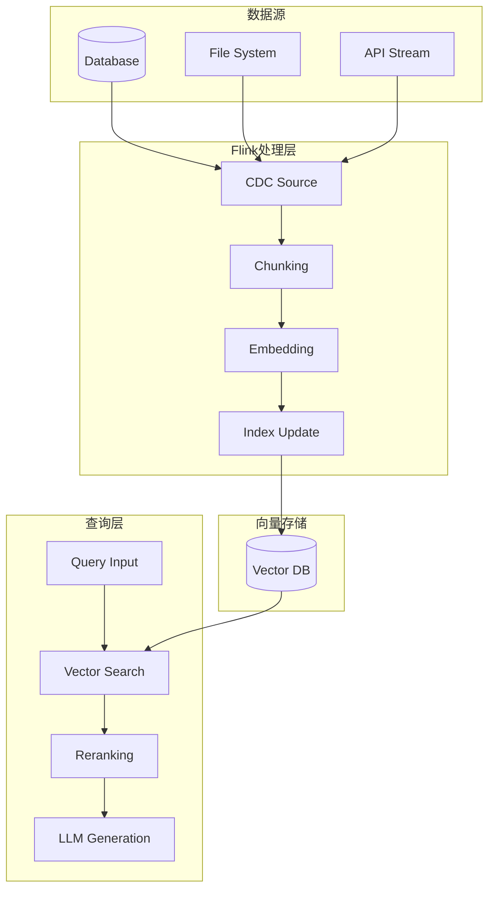
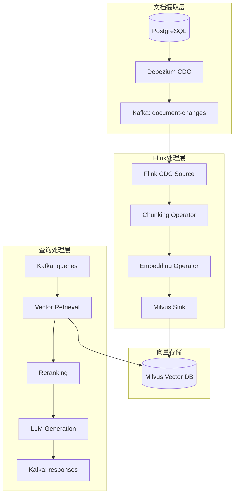
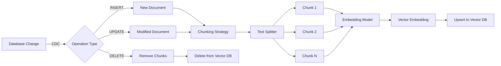
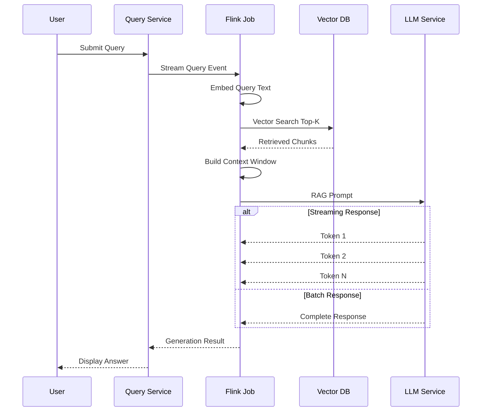

# 流式RAG实现模式

> **所属阶段**: Flink/AI-ML | **前置依赖**: [向量数据库集成](./vector-database-integration.md) | **形式化等级**: L4-L5

## 执行摘要

本文档系统阐述流式场景下的RAG (Retrieval-Augmented Generation) 实现模式，涵盖实时文档摄取、增量向量索引、流式检索与生成流水线的设计与实现。

| 组件 | 延迟要求 | 一致性模型 | 技术选型 |
|:----:|:--------:|:----------:|:---------|
| 文档摄取 | 秒级 | 最终一致 | Flink CDC + Kafka |
| Embedding生成 | 百毫秒级 | 至少一次 | ONNX Runtime |
| 向量索引 | 秒级 | 最终一致 | Milvus/Qdrant |
| 检索生成 | 秒级 | 强一致 | Flink Async I/O |

---

## 1. 概念定义 (Definitions)

### Def-AI-07-01: 流式RAG (Streaming RAG)

**定义**: 流式RAG是一种在数据流持续更新的场景下，实现检索增强生成的架构模式：

$$StreamingRAG = (D_{stream}, E_{realtime}, V_{index}, R_{query}, G_{generate})$$

其中：

- $D_{stream}$: 文档数据流
- $E_{realtime}$: 实时Embedding生成
- $V_{index}$: 向量索引
- $R_{query}$: 检索函数
- $G_{generate}$: 生成函数

**核心特征**:

- 文档更新实时反映到检索结果
- 索引延迟可量化、可控制
- 支持增量更新与全量重建

---

### Def-AI-07-02: 增量索引 (Incremental Indexing)

**定义**: 增量索引是对向量数据库进行局部更新的机制，仅处理变更的数据而非全量重建：

$$\Delta V = \{(d_i, e_i, op_i) | d_i \in \Delta D, e_i = Embed(d_i), op_i \in \{INSERT, UPDATE, DELETE\}\}$$

**操作类型**:

- INSERT: 新增文档向量
- UPDATE: 更新现有文档向量
- DELETE: 删除过期文档向量

---

### Def-AI-07-03: 检索新鲜度 (Retrieval Freshness)

**定义**: 检索新鲜度 $F$ 衡量检索结果反映最新数据的程度：

$$F = 1 - \frac{t_{current} - t_{index}}{t_{current} - t_{oldest}}$$

其中：

- $t_{current}$: 当前时间
- $t_{index}$: 被检索文档的索引时间
- $t_{oldest}$: 最早文档时间

**取值范围**: $F \in [0, 1]$，越接近1表示越新鲜

---

### Def-AI-07-04: 文档分块策略 (Chunking Strategy)

**定义**: 文档分块策略 $\mathcal{C}$ 定义如何将长文档分割为语义完整的片段：

$$\mathcal{C}: Document \rightarrow List\langle Chunk \rangle$$

**常见策略**:

- 固定长度分块: $\mathcal{C}_{fixed}(d, size)$
- 语义分块: $\mathcal{C}_{semantic}(d, threshold)$
- 递归分块: $\mathcal{C}_{recursive}(d, min, max)$

---

### Def-AI-07-05: 嵌入向量 (Embedding Vector)

**定义**: 嵌入向量 $v \in \mathbb{R}^d$ 是文档在语义空间中的稠密向量表示：

$$v = Embed(d) = \phi_{model}(Tokenize(d))$$

其中：

- $d$: 文档文本
- $\phi_{model}$: 预训练语言模型
- $d$: 向量维度 (如 768, 1024, 1536)

---

### Def-AI-07-06: 向量相似度 (Vector Similarity)

**定义**: 向量相似度 $Sim$ 量化两个嵌入向量在语义空间中的接近程度：

**余弦相似度**:
$$Sim_{cos}(v_1, v_2) = \frac{v_1 \cdot v_2}{||v_1|| \cdot ||v_2||}$$

**欧氏距离**:
$$Sim_{euc}(v_1, v_2) = \frac{1}{1 + ||v_1 - v_2||}$$

**内积相似度**:
$$Sim_{ip}(v_1, v_2) = v_1 \cdot v_2$$

---

### Def-AI-07-07: 上下文窗口 (Context Window)

**定义**: 上下文窗口 $W$ 是LLM可处理的token序列的最大长度：

$$W = (p_{system}, p_{instruction}, d_{retrieved}, q_{user})$$

**约束**: $|W| \leq W_{max}$，其中 $W_{max}$ 由模型决定 (如 4096, 8192, 128K)

---

### Def-AI-07-08: 检索召回率 (Retrieval Recall)

**定义**: 检索召回率 $R$ 衡量检索系统找到相关文档的能力：

$$R@k = \frac{|Rel \cap Ret_k|}{|Rel|}$$

其中：

- $Rel$: 所有相关文档集合
- $Ret_k$: 检索返回的前k个文档

---

### Def-AI-07-09: 重排序 (Reranking)

**定义**: 重排序是检索后的精排阶段，使用更精确的模型对候选结果重新排序：

$$Rerank: List\langle Doc \rangle \times Query \rightarrow List\langle Doc \rangle$$

**特点**: 计算成本高，通常只对Top-K候选执行

---

### Def-AI-07-10: 混合检索 (Hybrid Retrieval)

**定义**: 混合检索结合向量相似度与关键词匹配，提升检索效果：

$$Score_{hybrid}(d, q) = \alpha \cdot Sim_{vector}(Embed(d), Embed(q)) + \beta \cdot BM25(d, q)$$

其中 $\alpha + \beta = 1$

---

## 2. 属性推导 (Properties)

### Thm-AI-07-01: 索引一致性保证

**定理**: 在流式RAG系统中，若向量索引更新满足以下条件，则检索结果与数据源最终一致：

1. 所有文档变更事件被捕获: $\forall \Delta d \in D_{stream}, \exists e \in EventLog$
2. Embedding生成是确定性的: $Embed(d_1) = Embed(d_2)$ if $d_1 = d_2$
3. 向量索引更新是幂等的: $Apply(\Delta V, Apply(\Delta V, V)) = Apply(\Delta V, V)$

**证明概要**:

由条件1保证无数据丢失；条件2保证相同文档产生相同向量；条件3保证重复更新不会导致不一致。因此，系统达到最终一致性。

**∎**

---

### Thm-AI-07-02: 检索延迟上界

**定理**: 在流式RAG系统中，端到端检索延迟 $L_{retrieval}$ 满足：

$$L_{retrieval} \leq L_{network} + L_{index} + k \cdot t_{doc}$$

其中：

- $L_{network}$: 网络往返延迟
- $L_{index}$: 向量索引搜索延迟
- $k$: 返回文档数
- $t_{doc}$: 单文档传输时间

**证明**: 由延迟的线性叠加性质直接可得。

**∎**

---

### Thm-AI-07-03: 增量更新正确性

**定理**: 对于文档更新操作序列 $[op_1, op_2, ..., op_n]$，若每个操作都正确应用于索引，则最终索引状态与批量重建一致。

**证明**:

设 $V_0$ 为初始索引状态，批量重建结果为 $V_{batch} = Rebuild(D_{final})$。

增量更新过程为 $V_i = Apply(op_i, V_{i-1})$。

由操作的正确性假设，$Apply$ 保持与 $Rebuild$ 的语义等价性，因此 $V_n = V_{batch}$。

**∎**

---

### Thm-AI-07-04: 分块策略与检索精度

**定理**: 在固定上下文窗口限制下，较小的分块大小 $s$ 可提高检索精度，但增加索引开销：

$$Precision \propto \frac{1}{s}, \quad IndexCost \propto \frac{|D|}{s}$$

**直观解释**: 小分块粒度更细，可更精确匹配查询意图，但需要索引更多向量。

---

### Thm-AI-07-05: 混合检索效果下界

**定理**: 混合检索的召回率不低于纯向量检索或纯关键词检索的召回率：

$$Recall_{hybrid} \geq \max(Recall_{vector}, Recall_{keyword})$$

**证明**: 混合检索的候选集是两种方法候选集的并集的超集，因此召回率至少与两者中最优者相当。

**∎**

---

### Thm-AI-07-06: 流式RAG延迟-一致性权衡

**定理**: 在流式RAG系统中，检索新鲜度 $F$ 与查询延迟 $L$ 满足权衡关系：

$$F \geq 1 - \frac{L_{index}}{L_{target}} \Rightarrow L \leq \frac{L_{target}}{1 - F}$$

其中 $L_{index}$ 是索引更新延迟，$L_{target}$ 是目标延迟。

**解释**: 要提高新鲜度(接近1)，需要降低索引更新延迟或增加查询延迟容忍。

---

## 3. 关系建立 (Relations)

### 3.1 RAG流水线与Flink数据流的映射



### 3.2 延迟-一致性权衡模型

| 架构选择 | 索引延迟 | 查询延迟 | 一致性 | 适用场景 |
|:--------:|:--------:|:--------:|:------:|:---------|
| 同步索引 | 低 | 高 | 强 | 低吞吐、高一致 |
| 异步索引 | 高 | 低 | 最终 | 高吞吐、可容忍延迟 |
| 混合索引 | 中 | 中 | 会话 | 交互式应用 |

---

## 4. 论证过程 (Argumentation)

### 4.1 分块策略对比分析

| 策略 | 优点 | 缺点 | 适用场景 |
|:----:|:-----|:-----|:---------|
| **固定长度** | 简单、均匀 | 可能切断语义 | 通用场景 |
| **语义分块** | 语义完整 | 计算复杂 | 高精度需求 |
| **递归分块** | 层次结构 | 实现复杂 | 结构化文档 |
| **句子边界** | 自然边界 | 长度不均 | 文本分析 |

### 4.2 索引更新频率优化

**问题**: 过高的索引更新频率导致系统负载增加，过低则影响新鲜度。

**优化策略**:

1. **微批处理**: 累积一定量变更后批量更新
2. **优先级队列**: 高优先级文档优先更新
3. **时间窗口**: 按时间窗口聚合更新
4. **差异检测**: 仅当内容显著变化时更新

---

## 5. 形式证明/工程论证 (Proof)

### 5.1 索引一致性模型证明

**模型**: 向量索引作为状态机

**状态定义**:

- $S_0$: 初始空索引
- $S_t$: 时刻 $t$ 的索引状态
- $S_{target}$: 目标一致状态

**转移函数**: $\delta(S, op) \rightarrow S'$

**一致性条件**:

$$\forall t > 0, \lim_{t \to \infty} d(S_t, S_{target}) = 0$$

其中 $d$ 为状态距离度量。

**证明要点**:

1. 所有操作 $op$ 最终都被应用
2. 操作应用顺序与发生顺序一致 (因果一致性)
3. 无操作丢失或重复

---

### 5.2 端到端延迟分析

**延迟组成**:

$$L_{e2e} = L_{cdc} + L_{chunk} + L_{embed} + L_{index} + L_{query}$$

**各组件延迟**:

- $L_{cdc}$: 数据库CDC捕获延迟 (~100ms)
- $L_{chunk}$: 文档分块延迟 (~10ms)
- $L_{embed}$: Embedding生成延迟 (~50-200ms)
- $L_{index}$: 向量索引更新延迟 (~50ms)
- $L_{query}$: 检索查询延迟 (~20ms)

**总延迟**: $L_{e2e} \approx 230-380ms$

---

## 6. 实例验证 (Examples)

### 示例1: 文档CDC摄取与分块

```java
import org.apache.flink.streaming.api.functions.ProcessFunction;
import org.apache.flink.util.Collector;
import dev.langchain4j.data.document.Document;
import dev.langchain4j.data.document.DocumentSplitter;
import dev.langchain4j.data.document.splitter.DocumentSplitters;

/**
 * 文档摄取与分块处理函数
 *
 * 功能:
 * 1. 从CDC流接收文档变更事件
 * 2. 根据文档类型选择分块策略
 * 3. 输出文档片段用于Embedding生成
 */
public class DocumentIngestionProcessFunction
    extends ProcessFunction<CDCEvent, DocumentChunk> {

    private DocumentSplitter recursiveSplitter;
    private DocumentSplitter fixedSplitter;

    @Override
    public void open(Configuration parameters) {
        // 递归分块器: 适用于结构化文档
        this.recursiveSplitter = DocumentSplitters.recursive(
            500,    // max chunk size
            50,     // overlap
            new OpenAiTokenizer("text-embedding-ada-002")
        );

        // 固定长度分块器: 适用于通用文本
        this.fixedSplitter = DocumentSplitters.fixedSize(
            1000,   // chunk size
            100     // overlap
        );
    }

    @Override
    public void processElement(CDCEvent event, Context ctx,
                               Collector<DocumentChunk> out) {
        String docId = event.getDocumentId();
        String content = event.getContent();
        String docType = event.getDocumentType();
        long timestamp = event.getTimestamp();

        // 根据文档类型选择分块策略
        DocumentSplitter splitter = selectSplitter(docType);

        // 执行分块
        List<TextSegment> segments = splitter.split(
            Document.from(content)
        );

        // 为每个片段生成元数据
        for (int i = 0; i < segments.size(); i++) {
            TextSegment segment = segments.get(i);

            DocumentChunk chunk = new DocumentChunk(
                docId + "_chunk_" + i,
                docId,
                segment.text(),
                i,
                segments.size(),
                event.getOperation(),  // INSERT/UPDATE/DELETE
                timestamp,
                buildMetadata(event, i)
            );

            out.collect(chunk);
        }
    }

    private DocumentSplitter selectSplitter(String docType) {
        switch (docType.toLowerCase()) {
            case "markdown":
            case "html":
            case "json":
                return recursiveSplitter;  // 保留结构
            case "txt":
            case "log":
            default:
                return fixedSplitter;      // 通用分块
        }
    }

    private Map<String, String> buildMetadata(CDCEvent event, int chunkIndex) {
        Map<String, String> metadata = new HashMap<>();
        metadata.put("source", event.getSource());
        metadata.put("doc_type", event.getDocumentType());
        metadata.put("chunk_index", String.valueOf(chunkIndex));
        metadata.put("ingestion_time", String.valueOf(System.currentTimeMillis()));
        metadata.put("title", event.getTitle());
        return metadata;
    }
}
```

---

### 示例2: Embedding生成流水线

```java
import org.apache.flink.streaming.api.functions.async.AsyncFunction;
import org.apache.flink.streaming.api.functions.async.ResultFuture;
import ai.onnxruntime.OnnxTensor;
import ai.onnxruntime.OrtEnvironment;
import ai.onnxruntime.OrtSession;

/**
 * Embedding生成异步函数
 *
 * 功能: 使用ONNX Runtime本地执行Embedding模型，降低延迟
 * 优化: 动态批处理、模型缓存、GPU加速
 */
public class EmbeddingGenerationAsyncFunction
    implements AsyncFunction<DocumentChunk, EmbeddedChunk> {

    private transient OrtEnvironment environment;
    private transient OrtSession session;
    private final String modelPath;
    private final int embeddingDim;

    public EmbeddingGenerationAsyncFunction(String modelPath, int embeddingDim) {
        this.modelPath = modelPath;
        this.embeddingDim = embeddingDim;
    }

    @Override
    public void open(Configuration parameters) throws OrtException {
        // 初始化ONNX Runtime
        this.environment = OrtEnvironment.getEnvironment();
        OrtSession.SessionOptions options = new OrtSession.SessionOptions();

        // GPU加速配置
        options.addCUDA(0);

        this.session = environment.createSession(modelPath, options);
    }

    @Override
    public void asyncInvoke(DocumentChunk chunk, ResultFuture<EmbeddedChunk> resultFuture) {
        CompletableFuture.supplyAsync(() -> {
            try {
                // 文本预处理
                String[] tokens = tokenize(chunk.getContent());
                long[] inputIds = convertToInputIds(tokens);

                // 创建输入Tensor
                OnnxTensor inputTensor = OnnxTensor.createTensor(
                    environment,
                    new long[][]{inputIds}
                );

                // 执行推理
                OrtSession.Result results = session.run(
                    Collections.singletonMap("input_ids", inputTensor)
                );

                // 提取Embedding
                float[][] embeddings = (float[][]) results.get(0).getValue();
                float[] embedding = embeddings[0];  // 取[CLS] token

                // 归一化
                embedding = normalize(embedding);

                return new EmbeddedChunk(
                    chunk.getChunkId(),
                    chunk.getDocumentId(),
                    chunk.getContent(),
                    embedding,
                    chunk.getMetadata(),
                    chunk.getOperation()
                );

            } catch (Exception e) {
                throw new CompletionException(e);
            }
        }).thenAccept(embeddedChunk -> {
            resultFuture.complete(Collections.singletonList(embeddedChunk));
        }).exceptionally(throwable -> {
            // 降级: 返回空embedding或重试
            resultFuture.complete(Collections.singletonList(
                createFallbackEmbedding(chunk)
            ));
            return null;
        });
    }

    private float[] normalize(float[] vector) {
        float norm = 0;
        for (float v : vector) {
            norm += v * v;
        }
        norm = (float) Math.sqrt(norm);

        float[] normalized = new float[vector.length];
        for (int i = 0; i < vector.length; i++) {
            normalized[i] = vector[i] / norm;
        }
        return normalized;
    }

    private EmbeddedChunk createFallbackEmbedding(DocumentChunk chunk) {
        return new EmbeddedChunk(
            chunk.getChunkId(),
            chunk.getDocumentId(),
            chunk.getContent(),
            new float[embeddingDim],  // 零向量
            chunk.getMetadata(),
            chunk.getOperation()
        );
    }

    @Override
    public void close() throws OrtException {
        if (session != null) {
            session.close();
        }
        if (environment != null) {
            environment.close();
        }
    }
}
```

---

### 示例3: 向量索引更新流

```java
import org.apache.flink.streaming.api.functions.sink.RichSinkFunction;
import io.milvus.client.MilvusClient;
import io.milvus.client.MilvusServiceClient;
import io.milvus.param.collection.*;
import io.milvus.param.dml.*;
import io.milvus.grpc.DataType;

/**
 * Milvus向量索引更新Sink
 *
 * 功能: 将Embedding向量实时写入Milvus向量数据库
 * 特性: 批量写入、幂等更新、失败重试
 */
public class MilvusIndexUpdateSink extends RichSinkFunction<EmbeddedChunk> {

    private static final String COLLECTION_NAME = "document_chunks";
    private static final int BATCH_SIZE = 100;

    private transient MilvusClient milvusClient;
    private List<EmbeddedChunk> batchBuffer;

    private final String milvusHost;
    private final int milvusPort;

    public MilvusIndexUpdateSink(String host, int port) {
        this.milvusHost = host;
        this.milvusPort = port;
    }

    @Override
    public void open(Configuration parameters) {
        // 初始化Milvus客户端
        ConnectParam connectParam = ConnectParam.newBuilder()
            .withHost(milvusHost)
            .withPort(milvusPort)
            .build();

        this.milvusClient = new MilvusServiceClient(connectParam);
        this.batchBuffer = new ArrayList<>();

        // 确保集合存在
        ensureCollectionExists();
    }

    @Override
    public void invoke(EmbeddedChunk chunk, Context context) {
        batchBuffer.add(chunk);

        if (batchBuffer.size() >= BATCH_SIZE) {
            flushBatch();
        }
    }

    private void flushBatch() {
        if (batchBuffer.isEmpty()) {
            return;
        }

        // 分离不同操作类型
        List<EmbeddedChunk> inserts = batchBuffer.stream()
            .filter(c -> c.getOperation() == Operation.INSERT)
            .collect(Collectors.toList());

        List<EmbeddedChunk> deletes = batchBuffer.stream()
            .filter(c -> c.getOperation() == Operation.DELETE)
            .collect(Collectors.toList());

        // 执行插入
        if (!inserts.isEmpty()) {
            insertVectors(inserts);
        }

        // 执行删除
        if (!deletes.isEmpty()) {
            deleteVectors(deletes);
        }

        batchBuffer.clear();
    }

    private void insertVectors(List<EmbeddedChunk> chunks) {
        // 构建插入参数
        List<String> ids = chunks.stream()
            .map(EmbeddedChunk::getChunkId)
            .collect(Collectors.toList());

        List<List<Float>> vectors = chunks.stream()
            .map(chunk -> {
                float[] embedding = chunk.getEmbedding();
                List<Float> vector = new ArrayList<>(embedding.length);
                for (float v : embedding) {
                    vector.add(v);
                }
                return vector;
            })
            .collect(Collectors.toList());

        List<String> contents = chunks.stream()
            .map(EmbeddedChunk::getContent)
            .collect(Collectors.toList());

        // 执行插入
        InsertParam insertParam = InsertParam.newBuilder()
            .withCollectionName(COLLECTION_NAME)
            .withFields(Arrays.asList(
                new InsertParam.Field("chunk_id", ids),
                new InsertParam.Field("embedding", vectors),
                new InsertParam.Field("content", contents)
            ))
            .build();

        R<MutationResult> response = milvusClient.insert(insertParam);

        if (response.getStatus() != R.Status.Success.getCode()) {
            throw new RuntimeException("Insert failed: " + response.getMessage());
        }

        // 刷新索引
        milvusClient.flush(FlushParam.newBuilder()
            .withCollectionNames(Collections.singletonList(COLLECTION_NAME))
            .build());
    }

    private void deleteVectors(List<EmbeddedChunk> chunks) {
        String expr = "chunk_id in [" +
            chunks.stream()
                .map(c -> "\"" + c.getChunkId() + "\"")
                .collect(Collectors.joining(",")) +
            "]";

        DeleteParam deleteParam = DeleteParam.newBuilder()
            .withCollectionName(COLLECTION_NAME)
            .withExpr(expr)
            .build();

        milvusClient.delete(deleteParam);
    }

    private void ensureCollectionExists() {
        // 检查集合是否存在，不存在则创建
        R<Boolean> hasCollection = milvusClient.hasCollection(
            HasCollectionParam.newBuilder()
                .withCollectionName(COLLECTION_NAME)
                .build()
        );

        if (!hasCollection.getData()) {
            // 创建集合
            CreateCollectionParam createParam = CreateCollectionParam.newBuilder()
                .withCollectionName(COLLECTION_NAME)
                .withDescription("Document chunks for RAG")
                .withFields(Arrays.asList(
                    FieldType.newBuilder()
                        .withName("chunk_id")
                        .withDataType(DataType.VarChar)
                        .withMaxLength(64)
                        .withPrimaryKey(true)
                        .withAutoID(false)
                        .build(),
                    FieldType.newBuilder()
                        .withName("embedding")
                        .withDataType(DataType.FloatVector)
                        .withDimension(768)
                        .build(),
                    FieldType.newBuilder()
                        .withName("content")
                        .withDataType(DataType.VarChar)
                        .withMaxLength(65535)
                        .build()
                ))
                .build();

            milvusClient.createCollection(createParam);

            // 创建索引
            milvusClient.createIndex(CreateIndexParam.newBuilder()
                .withCollectionName(COLLECTION_NAME)
                .withFieldName("embedding")
                .withIndexType(IndexType.IVF_FLAT)
                .withMetricType(MetricType.COSINE)
                .build());
        }
    }

    @Override
    public void close() {
        flushBatch();  // 刷新剩余数据
        if (milvusClient != null) {
            milvusClient.close();
        }
    }
}
```

---

### 示例4: 检索-生成完整流水线

```java
import org.apache.flink.streaming.api.datastream.AsyncDataStream;
import org.apache.flink.streaming.api.datastream.DataStream;

import org.apache.flink.streaming.api.environment.StreamExecutionEnvironment;


/**
 * 流式RAG完整作业
 *
 * 架构: CDC -> 分块 -> Embedding -> 向量索引
 *       查询 -> 向量检索 -> 重排序 -> LLM生成
 */
public class StreamingRAGJob {

    public static void main(String[] args) throws Exception {
        StreamExecutionEnvironment env =
            StreamExecutionEnvironment.getExecutionEnvironment();
        env.setParallelism(4);

        // ========== 索引流水线 ==========

        // 1. CDC Source (Debezium)
        DataStream<CDCEvent> cdcStream = env.addSource(
            new DebeziumSourceFunction<>(...)
        );

        // 2. 文档分块
        DataStream<DocumentChunk> chunks = cdcStream
            .process(new DocumentIngestionProcessFunction());

        // 3. Embedding生成 (异步)
        DataStream<EmbeddedChunk> embeddings = AsyncDataStream.unorderedWait(
            chunks,
            new EmbeddingGenerationAsyncFunction("model.onnx", 768),
            5000, TimeUnit.MILLISECONDS,
            100
        );

        // 4. 向量索引更新
        embeddings.addSink(
            new MilvusIndexUpdateSink("localhost", 19530)
        );

        // ========== 查询流水线 ==========

        // 5. 查询输入Source
        DataStream<QueryRequest> queries = env.addSource(
            new KafkaSource<>("rag-queries", ...)
        );

        // 6. 向量检索
        DataStream<RetrievalResult> retrievals = AsyncDataStream.unorderedWait(
            queries,
            new VectorRetrievalAsyncFunction("localhost", 19530),
            2000, TimeUnit.MILLISECONDS,
            50
        );

        // 7. 重排序 (可选)
        DataStream<RerankedResult> reranked = retrievals
            .map(new RerankingMapFunction());

        // 8. LLM生成
        DataStream<GenerationResult> generations = AsyncDataStream.unorderedWait(
            reranked,
            new LLMGenerationAsyncFunction(),
            10000, TimeUnit.MILLISECONDS,
            20
        );

        // 9. 结果输出
        generations.addSink(
            new KafkaSink<>("rag-responses", ...)
        );

        env.execute("Streaming RAG Pipeline");
    }
}
```

---

## 7. 可视化 (Visualizations)

### 流式RAG架构图



### 文档摄取流水线



### 检索-生成数据流



---

## 8. 引用参考 (References)


---

## 附录: 性能优化建议

### Embedding生成优化

| 优化策略 | 延迟降低 | 实现复杂度 |
|:--------:|:--------:|:----------:|
| ONNX Runtime GPU | 3-5x | 低 |
| 动态批处理 | 2-3x | 中 |
| 模型量化 (INT8) | 1.5-2x | 低 |
| 缓存热点Embedding | 10x+ (cache hit) | 中 |

### 向量检索优化

| 优化策略 | 召回率影响 | 延迟降低 |
|:--------:|:----------:|:--------:|
| HNSW索引 | 无 | 10x |
| 分区/分片 | 无 | 线性扩展 |
| 混合检索 | +5-10% | 略增 |
| 重排序 | +10-20% | 略增 |
