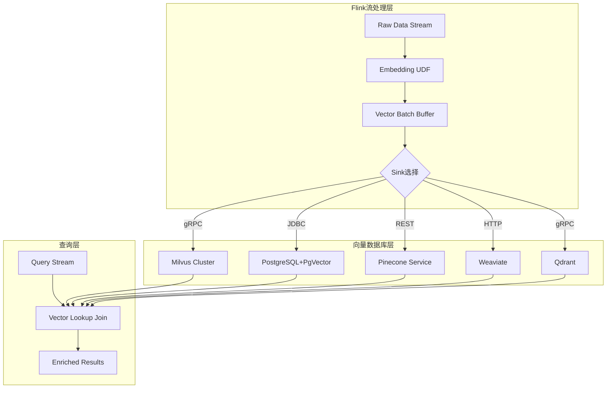
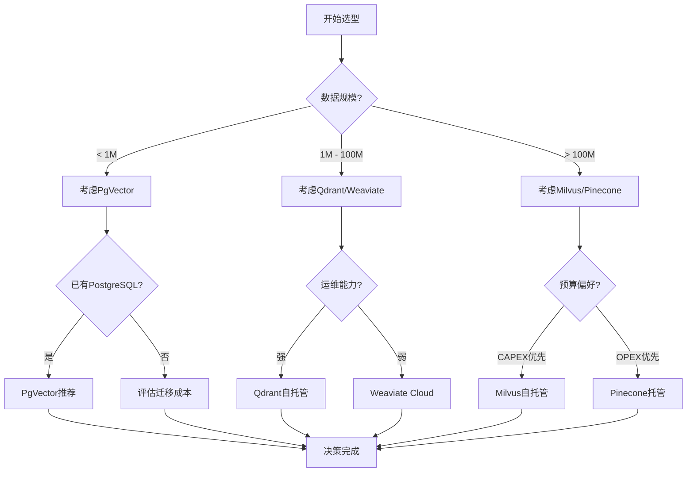
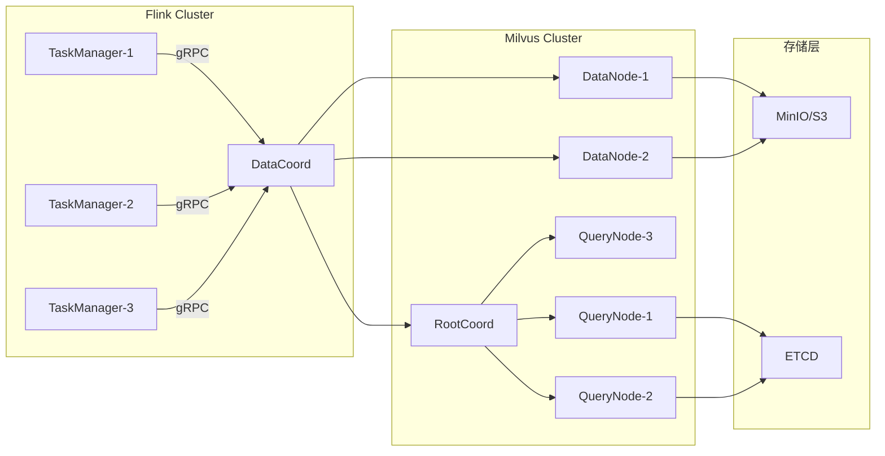
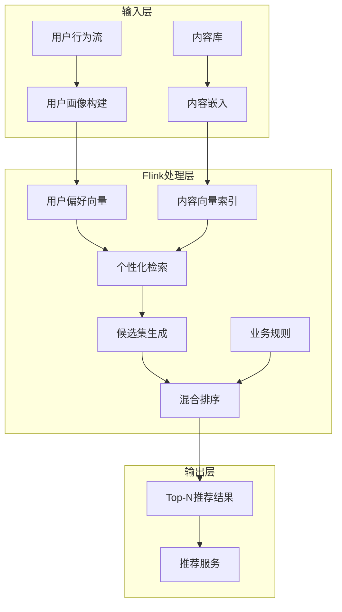
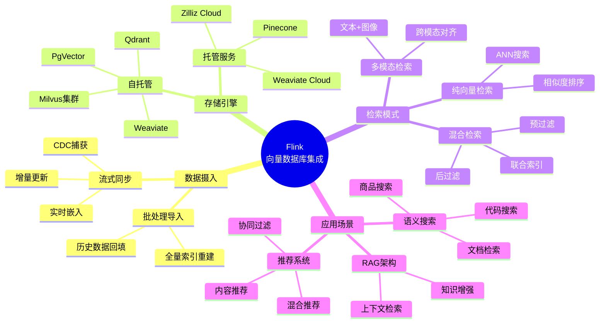
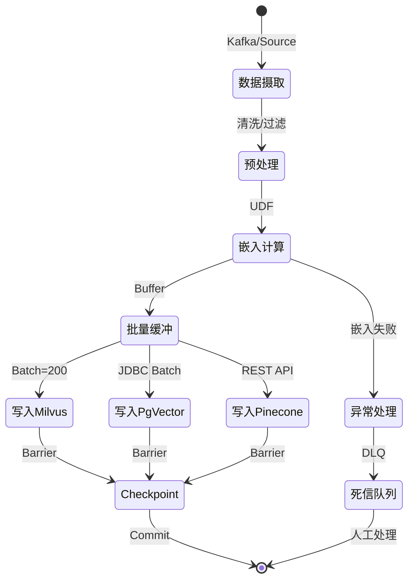
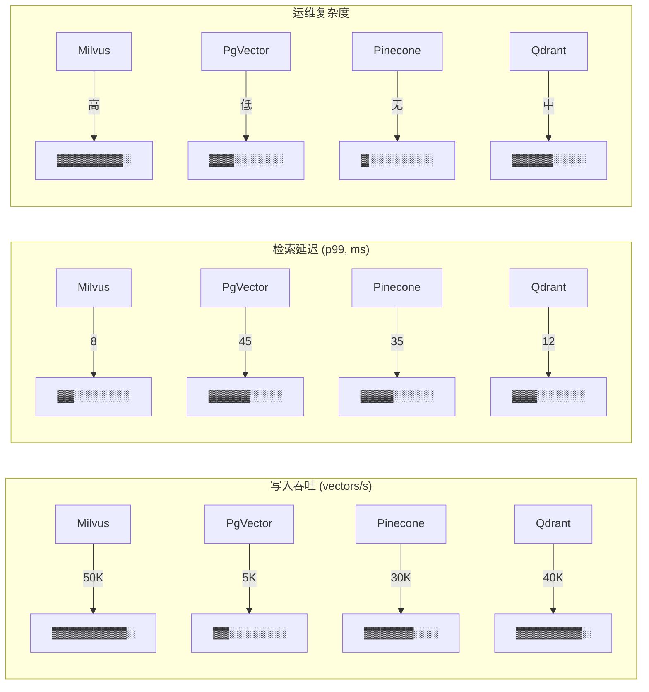

# Flink与向量数据库集成 - Milvus/PgVector/Pinecone

> 所属阶段: Flink | 前置依赖: [11.4-flink-ml-inference.md](./flink-realtime-ml-inference.md), [JDBC连接器](Flink/05-ecosystem/05.01-connectors/jdbc-connector-complete-guide.md) | 形式化等级: L3

## 1. 概念定义 (Definitions)

### Def-F-12-10: 向量数据库连接器 (Vector Database Connector)

向量数据库连接器是Flink与向量数据库系统之间的双向数据交换抽象，支持高维向量数据的流式写入和相似度检索。

**形式化定义：**

设向量数据库为 $\mathcal{VDB}$，Flink数据流为 $\mathcal{D}_F$，则连接器 $C_{vdb}$ 满足：

$$C_{vdb}: \mathcal{D}_F \times \mathbb{N}^d \rightarrow \mathcal{VDB} \times \mathbb{R}^{k \times d}$$

其中：

- $d$: 向量维度
- $k$: 检索返回的Top-K结果数
- 输入：Flink数据流 + 嵌入向量 $\mathbf{v} \in \mathbb{R}^d$
- 输出：向量数据库写入确认 + 相似度检索结果

**接口规范：**

```java
// 向量写入接口
interface VectorSink<T> extends RichSinkFunction<T> {
    void write(VectorRecord<T> record);
    void flushBatch(List<VectorRecord<T>> batch);
}

// 向量检索接口
interface VectorLookupFunction extends TableFunction<Row> {
    @DataTypeHint("ROW<id STRING, vector ARRAY<FLOAT>, score FLOAT>")
    void eval(@DataTypeHint("ARRAY<FLOAT>") float[] queryVector, int topK);
}
```

---

### Def-F-12-11: 嵌入流同步 (Embedding Stream Synchronization)

嵌入流同步是将结构化数据通过嵌入模型实时转换为向量表示，并保证与原始数据流的事务一致性。

**形式化定义：**

设原始数据流为 $S_{raw}$，嵌入模型为 $\mathcal{E}: \mathcal{X} \rightarrow \mathbb{R}^d$，则同步算子 $\mathcal{S}_{emb}$ 定义：

$$\mathcal{S}_{emb}: S_{raw} \rightarrow S_{vector} \text{ 其中 } S_{vector}(t) = \langle id, \mathcal{E}(x_t), metadata_t, timestamp_t \rangle$$

**一致性保证：**

$$\forall t: commit(S_{raw}, t) \Rightarrow commit(S_{vector}, t) \text{ (At-Least-Once)}$$

$$\forall t: exactly\_once(S_{raw}, t) \Leftrightarrow exactly\_once(S_{vector}, t) \text{ (Exactly-Once)}$$

**关键组件：**

| 组件 | 职责 | 实现示例 |
|------|------|----------|
| Embedding UDF | 特征向量化 | `EmbeddingFunction` |
| Checkpoint Barrier | 一致性标记 | Flink Checkpoint |
| Idempotent Writer | 幂等写入 | 基于`id`的UPSERT |

---

### Def-F-12-12: 相似度搜索Sink (Similarity Search Sink)

相似度搜索Sink是支持实时向量检索查询的Flink输出端点，将向量数据库的ANN（Approximate Nearest Neighbor）能力暴露为流处理算子。

**形式化定义：**

设查询向量为 $\mathbf{q} \in \mathbb{R}^d$，距离度量 $\delta: \mathbb{R}^d \times \mathbb{R}^d \rightarrow \mathbb{R}_+$，则搜索Sink $\mathcal{K}$：

$$\mathcal{K}(\mathbf{q}, k) = \{ (\mathbf{v}_i, \delta(\mathbf{q}, \mathbf{v}_i)) \mid \mathbf{v}_i \in \mathcal{VDB}, \delta(\mathbf{q}, \mathbf{v}_i) \leq \delta(\mathbf{q}, \mathbf{v}_{k+1}) \}$$

**支持的相似度度量：**

| 度量 | 公式 | 适用场景 |
|------|------|----------|
| 欧氏距离 (L2) | $\|\mathbf{q} - \mathbf{v}\|_2$ | 几何空间相似 |
| 余弦相似度 | $\frac{\mathbf{q} \cdot \mathbf{v}}{\|\mathbf{q}\| \|\mathbf{v}\|}$ | 方向一致性 |
| 内积 (IP) | $\mathbf{q} \cdot \mathbf{v}$ | 语义相关性 |

---

## 2. 属性推导 (Properties)

### Prop-F-12-01: 批量写入吞吐量优化

**命题：** 向量数据库连接器的吞吐量 $T$ 与批量大小 $B$ 呈次线性关系。

$$T(B) = \frac{B}{L_{net} + B \cdot L_{proc}} \cdot \frac{1}{1 + \alpha \cdot e^{-\beta B}}$$

其中：

- $L_{net}$: 网络延迟
- $L_{proc}$: 单条处理延迟
- $\alpha, \beta$: 批处理效率系数

**最优批量推导：**

$$\frac{dT}{dB} = 0 \Rightarrow B_{opt} \approx \sqrt{\frac{L_{net}}{L_{proc} \cdot \beta}}$$

**工程意义：** 对于高维向量（$d \geq 768$），典型最优批量为100-500条。

---

### Lemma-F-12-01: 向量维度与检索精度关系

**引理：** 在给定索引预算下，近似最近邻检索的召回率 $R$ 与向量维度 $d$ 满足：

$$R(d) = R_0 \cdot \left(1 - \gamma \cdot \frac{d - d_0}{d_{max}}\right)$$

其中 $\gamma$ 为索引类型相关常数，HNSW索引 $\gamma_{HNSW} < \gamma_{IVF}$。

**证明概要：**

1. 高维空间中点间距离趋于集中（维度灾难）
2. HNSW通过分层图结构保持局部连通性，缓解此效应
3. 维度增加导致索引划分粒度降低，召回率下降

---

### Prop-F-12-02: 混合查询延迟下界

**命题：** 向量+结构化混合查询的端到端延迟 $L_{hybrid}$ 满足：

$$L_{hybrid} \geq \max(L_{vector}, L_{filter}) + L_{merge}$$

**实现策略对比：**

| 策略 | 延迟 | 适用场景 |
|------|------|----------|
| 先向量后过滤 | $L_{vector} + L_{filter}^{small}$ | 高选择性向量检索 |
| 先过滤后向量 | $L_{filter} + L_{vector}^{small}$ | 高选择性结构化过滤 |
| 联合索引 | $\approx L_{vector}$ | 频繁混合查询 |

---

## 3. 关系建立 (Relations)

### 3.1 向量数据库生态映射

**主流方案对比矩阵：**

| 特性 | Milvus | PgVector | Pinecone | Weaviate | Qdrant |
|------|--------|----------|----------|----------|--------|
| **部署模式** | 自托管/K8s | PostgreSQL扩展 | 全托管 | 自托管/云 | 自托管/云 |
| **最大维度** | 32,768 | 16,000 | 20,000+ | 65,536 | 65,536 |
| **索引类型** | IVF/HNSW/FLAT | HNSW/ivfflat | 自动优化 | HNSW | HNSW |
| **Flink集成** | 原生Connector | JDBC + SQL | REST API | HTTP/gRPC | gRPC |
| **混合查询** | 完整支持 | SQL原生 | 有限 | GraphQL | 完整支持 |
| **典型延迟** | <10ms | <50ms | <50ms | <20ms | <10ms |
| **规模** | 十亿级 | 百万级 | 十亿级 | 亿级 | 亿级 |

### 3.2 Flink与向量数据库集成架构



### 3.3 与Flink生态的关系

| 相关模块 | 关系类型 | 说明 |
|----------|----------|------|
| Flink ML | 上游依赖 | 提供Embedding模型推理 |
| JDBC Connector | 实现基础 | PgVector集成基于此 |
| Async I/O | 性能优化 | 向量检索并行化 |
| Table API/SQL | 用户接口 | 声明式向量操作 |
| Checkpoint | 一致性保障 | Exactly-Once写入 |

---

## 4. 论证过程 (Argumentation)

### 4.1 向量数据库选型决策树



### 4.2 索引类型选择分析

**HNSW vs IVF对比论证：**

| 维度 | HNSW (Hierarchical NSW) | IVF (Inverted File) |
|------|-------------------------|---------------------|
| **构建成本** | $O(n \log n)$，较高 | $O(n)$，较低 |
| **内存占用** | 高（图结构） | 中（聚类中心） |
| **检索速度** | 快，$O(\log n)$ | 中等，取决于$nprobe$ |
| **动态更新** | 支持增量 | 需重建 |
| **召回率** | >95% @ef=128 | 85-95% @nprobe=128 |

**选型建议：**

- **HNSW**：实时写入场景、对召回率敏感、内存充足
- **IVF**：批量导入场景、内存受限、可接受定期重建

### 4.3 混合查询实现策略论证

**场景：** 检索与"electronics"类别相关的相似产品向量。

**策略A - 预过滤（Pre-filtering）：**

```sql
-- PgVector示例
SELECT * FROM products
WHERE category = 'electronics'
ORDER BY embedding <-> ?
LIMIT 10;
```

- 优点：精确过滤，无冗余计算
- 缺点：类别数据稀疏时向量索引失效

**策略B - 后过滤（Post-filtering）：**

```java
// Milvus示例
// 1. 先执行ANN检索
List<VectorRecord> candidates = milvus.search(queryVector, topK=100);
// 2. 内存过滤
candidates.stream()
    .filter(r -> r.getCategory().equals("electronics"))
    .limit(10)
    .collect();
```

- 优点：向量检索效率高
- 缺点：可能返回不足k条结果

**策略C - 联合索引（Filtered Index）：**

```python
# Milvus partition key
milvus.create_partition("products_electronics")
milvus.load_partition("products_electronics")
```

- 优点：两者优势兼得
- 缺点：存储开销增加

---

## 5. 工程论证 (Engineering Argument)

### 5.1 Flink→Milvus集成方案

**架构论证：**

Milvus的分布式架构与Flink流处理天然契合：



**关键参数论证：**

| 参数 | 推荐值 | 论证依据 |
|------|--------|----------|
| `writeBufferSize` | 10MB | 平衡内存与吞吐量 |
| `batchSize` | 200-500 | 见Prop-F-12-01 |
| `flushInterval` | 5s | 延迟vs持久化权衡 |
| `indexType` | HNSW | 实时场景最优 |
| `M` | 16 | HNSW层数控制 |
| `efConstruction` | 128 | 构建质量vs速度 |

### 5.2 PgVector与Flink JDBC集成

**可行性论证：**

PgVector作为PostgreSQL扩展，可直接利用Flink JDBC Connector：

```java
// 表定义映射
CREATE TABLE vector_items (
    id STRING,
    embedding ARRAY<FLOAT>,  -- 映射为vector类型
    metadata MAP<STRING, STRING>,
    PRIMARY KEY (id) NOT ENFORCED
) WITH (
    'connector' = 'jdbc',
    'url' = 'jdbc:postgresql://host/db?stringtype=unspecified',
    'table-name' = 'items',
    'driver' = 'org.postgresql.Driver'
);
```

**性能边界：**

- **写入吞吐**：~5,000 vectors/s（单PgVector实例）
- **检索延迟**：<50ms（百万级数据，HNSW索引）
- **建议规模**：<10M向量，维度<1536

### 5.3 Pinecone托管服务集成

**架构论证：**

Pinecone的无服务器架构简化了Flink集成，但引入了网络延迟考量：

```
Flink TaskManager → Internet → Pinecone API Gateway → Vector Index
          ↓                                          ↓
    Latency: 10-50ms                          Latency: <5ms
```

**优化策略：**

1. **批量写入**：聚合减少API调用次数
2. **异步检索**：使用Flink Async I/O降低阻塞
3. **区域部署**：Flink与Pinecone同区域部署

---

## 6. 实例验证 (Examples)

### 6.1 Flink→Milvus实时同步Pipeline

```java
import org.apache.flink.streaming.api.datastream.DataStream;
import org.apache.flink.streaming.connectors.milvus.*;

public class MilvusSyncPipeline {
    public static void main(String[] args) throws Exception {
        StreamExecutionEnvironment env =
            StreamExecutionEnvironment.getExecutionEnvironment();

        // 源数据流：产品描述
        DataStream<ProductDocument> source = env
            .addSource(new KafkaSource<>())
            .map(new EmbeddingUDF("text-embedding-3-small"));

        // Milvus Sink配置
        MilvusSinkConfig config = MilvusSinkConfig.builder()
            .withHost("milvus-cluster.default.svc")
            .withPort(19530)
            .withCollection("product_vectors")
            .withBatchSize(200)
            .withFlushInterval(Duration.ofSeconds(5))
            .build();

        // 嵌入转换 + 批量写入
        source
            .map(doc -> VectorRecord.builder()
                .id(doc.getId())
                .vector(doc.getEmbedding())  // float[1536]
                .field("name", doc.getName())
                .field("category", doc.getCategory())
                .field("price", doc.getPrice())
                .build())
            .addSink(new MilvusSink<>(config))
            .name("Milvus Vector Sink");

        env.execute("Product Vector Sync");
    }
}

// 嵌入UDF实现
class EmbeddingUDF extends RichMapFunction<String, ProductDocument> {
    private transient EmbeddingClient client;

    @Override
    public void open(Configuration params) {
        client = EmbeddingClient.create("text-embedding-3-small");
    }

    @Override
    public ProductDocument map(String description) {
        float[] embedding = client.embed(description);
        return new ProductDocument(description, embedding);
    }
}
```

---

### 6.2 实时语义搜索Pipeline

**场景：** 用户输入查询，实时返回相似文档

```java
// 向量检索Lookup Join
TableResult result = tEnv.sqlQuery("""
    SELECT
        q.query_id,
        d.doc_id,
        d.title,
        d.content,
        similarity_score
    FROM query_stream q
    JOIN LATERAL TABLE(
        milvus_lookup(
            q.query_embedding,  -- 查询向量
            'doc_vectors',      -- 集合名
            10,                 -- topK
            'COSINE'            -- 相似度度量
        )
    ) AS d(doc_id, embedding, title, content, similarity_score)
    ON TRUE
    WHERE similarity_score > 0.85
""");

// Lookup Function实现
class MilvusLookupFunction extends TableFunction<Row> {
    private MilvusClient client;

    public void eval(float[] queryVector, String collection,
                     int topK, String metric) {
        SearchResults results = client.search(
            SearchParam.newBuilder()
                .withCollectionName(collection)
                .withVectors(Collections.singletonList(queryVector))
                .withTopK(topK)
                .withMetricType(MetricType.valueOf(metric))
                .build()
        );

        for (SearchResult result : results.getResults()) {
            collect(Row.of(
                result.getId(),
                result.getVector(),
                result.getField("title"),
                result.getField("content"),
                result.getScore()
            ));
        }
    }
}
```

---

### 6.3 混合推荐系统

**场景：** 结合用户画像（结构化）+ 内容相似度（向量）的推荐



```java
// 混合推荐实现
DataStream<Recommendation> recommendations =
    userBehaviorStream
        // 1. 构建用户实时兴趣向量
        .keyBy(UserBehavior::getUserId)
        .window(TumblingEventTimeWindows.of(Time.minutes(5)))
        .aggregate(new InterestVectorAggregate())

        // 2. 向量检索获取候选
        .flatMap(new AsyncFunction<UserVector, Candidate>() {
            @Override
            public void asyncInvoke(UserVector userVec,
                                   ResultFuture<Candidate> resultFuture) {
                // 异步调用Milvus
                milvusAsync.search(
                    userVec.getInterestVector(),
                    topK = 100,
                    filter = "status = 'active'"  // 结构化过滤
                ).thenAccept(results ->
                    resultFuture.complete(results.stream()
                        .map(r -> new Candidate(r.getId(), r.getScore()))
                        .collect(Collectors.toList()))
                );
            }
        })

        // 3. 精排（实时特征拼接）
        .keyBy(Candidate::getItemId)
        .connect(itemFeatureStream)
        .process(new RankingProcessFunction())

        // 4. 多样性后处理
        .keyBy(Rec::getUserId)
        .process(new DiversityRerankFunction(topN = 20));
```

---

## 7. 可视化 (Visualizations)

### 7.1 向量数据库集成全景图



### 7.2 向量写入Pipeline执行树



### 7.3 性能对比矩阵



---

## 8. 引用参考 (References)
