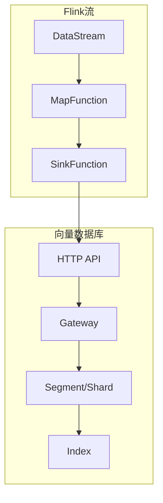
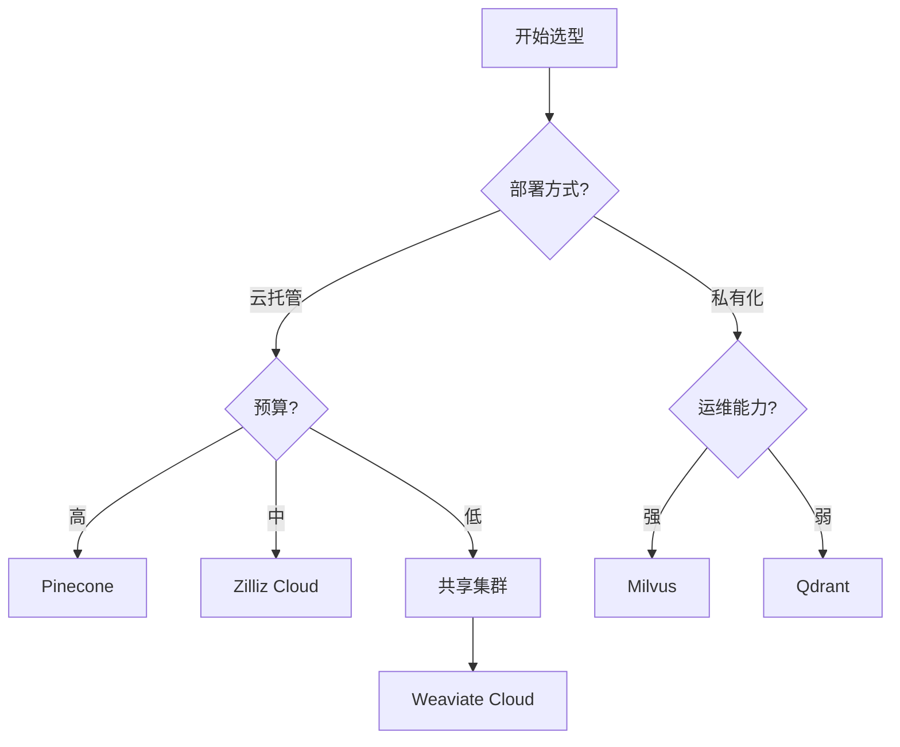
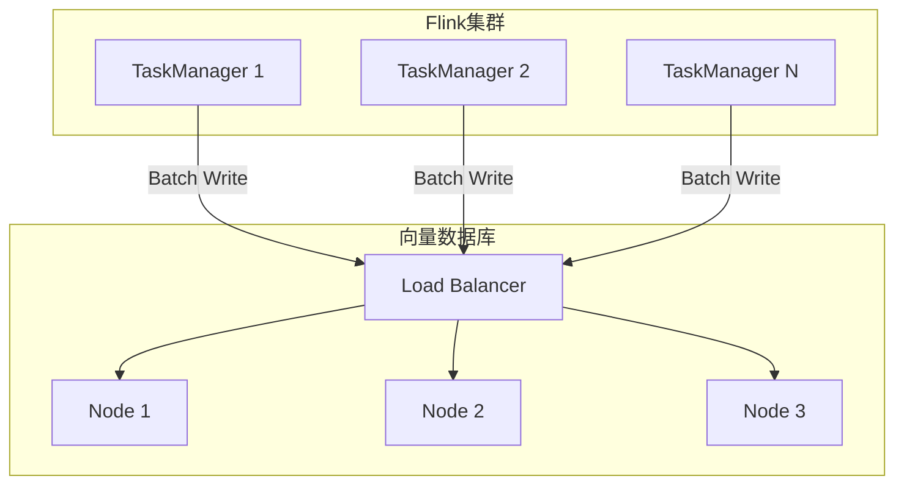
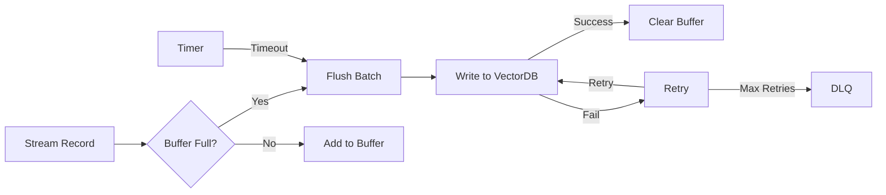

# 向量数据库流式集成指南

> **所属阶段**: Flink/AI-ML | **前置依赖**: [向量数据库基础](./vector-database-integration.md) | **形式化等级**: L3-L4

## 执行摘要

本文档详细阐述主流向量数据库在流式场景中的集成方案，涵盖Milvus、Pinecone、Weaviate、Qdrant的流式写入优化、批量策略、一致性模型对比与选型建议。

| 向量数据库 | 流式写入 | 增量更新 | 批量优化 | 云原生 |
|:----------:|:--------:|:--------:|:--------:|:------:|
| Milvus | ✅ 优秀 | ✅ 支持 | ✅ 自动 | ✅ 是 |
| Pinecone | ✅ 优秀 | ✅ 支持 | ✅ 托管 | ✅ 全托管 |
| Weaviate | ✅ 良好 | ✅ 支持 | ⚠️ 手动 | ✅ 是 |
| Qdrant | ✅ 良好 | ✅ 支持 | ✅ 自动 | ⚠️ 半托管 |
| Chroma | ⚠️ 有限 | ⚠️ 有限 | ❌ 弱 | ❌ 否 |

---

## 1. 概念定义 (Definitions)

### Def-AI-09-01: 流式向量索引 (Streaming Vector Index)

**定义**: 流式向量索引是支持持续数据流入的向量存储机制：

$$I_{stream} = \{(v_i, m_i, t_i) | v_i \in \mathbb{R}^d, m_i \in \mathcal{M}, t_i \in \mathbb{T}\}$$

其中：

- $v_i$: 向量
- $m_i$: 元数据
- $t_i$: 时间戳

---

### Def-AI-09-02: 增量索引更新 (Incremental Index Update)

**定义**: 增量索引更新仅修改索引的局部而非重建：

$$\Delta I = I_{t+1} \ominus I_t = \{add(V^+), remove(V^-), update(V^\pm)\}$$

**操作复杂度**: $O(|\Delta I|)$ vs $O(|I|)$ for full rebuild

---

### Def-AI-09-03: 批量写入策略 (Batch Write Strategy)

**定义**: 批量写入策略决定如何将流式数据累积为批次写入：

$$B^* = \arg\min_B \left( \frac{|B|}{Throughput(B)} + \lambda \cdot Latency(B) \right)$$

**策略类型**:

- 固定大小: $|B| = const$
- 固定时间: $\Delta t = const$
- 混合策略: $\min(|B|, \Delta t)$

---

### Def-AI-09-04: 索引一致性 (Index Consistency)

**定义**: 索引一致性模型定义写入操作何时对查询可见：

$$Visibility(write_{t}, query_{t'}) = \begin{cases} immediate & t' > t \\ eventual & \exists \delta: t' > t + \delta \\ session & same\_session(t', t) \end{cases}$$

---

### Def-AI-09-05: 近似最近邻 (Approximate Nearest Neighbor)

**定义**: ANN在可接受的精度损失下加速向量搜索：

$$ANN(q, I, \epsilon) = \{v | dist(q, v) \leq (1 + \epsilon) \cdot dist(q, v^*)\}$$

其中 $v^*$ 为精确最近邻。

---

### Def-AI-09-06: 向量维度与索引效率

**定义**: 向量维度 $d$ 对索引效率的影响：

$$Efficiency(d) = \frac{1}{\alpha \cdot d + \beta \cdot \log |I|}$$

高维向量($d > 1000$)通常需要降维或特殊索引结构。

---

## 2. 属性推导 (Properties)

### Thm-AI-09-01: 批量写入最优大小

**定理**: 批量写入的最优大小 $B^*$ 满足：

$$B^* = \sqrt{\frac{2 \cdot L_{fixed} \cdot \lambda}{L_{variable}}}$$

其中：

- $L_{fixed}$: 固定开销(连接建立、事务)
- $L_{variable}$: 每向量可变开销
- $\lambda$: 延迟权重因子

---

### Thm-AI-09-02: 索引最终一致性

**定理**: 在异步写入模式下，索引最终一致的时间上界为：

$$T_{consistent} \leq T_{flush} + T_{propagate} + T_{merge}$$

**证明**: 由flush延迟、传播延迟、合并延迟累加可得。

---

### Thm-AI-09-03: 查询延迟与召回率权衡

**定理**: ANN查询的延迟 $L$ 与召回率 $R$ 满足：

$$L \propto \frac{1}{1 - R}$$

即提高召回率必然增加查询延迟。

---

### Thm-AI-09-04: 流式写入吞吐量上界

**定理**: 流式写入的吞吐量 $\Theta$ 受限于：

$$\Theta \leq \min(\Theta_{network}, \Theta_{index}, \Theta_{storage})$$

---

## 3. 关系建立 (Relations)

### 3.1 向量数据库与Flink Sink映射



### 3.2 选型决策矩阵

| 需求 | 推荐 | 理由 |
|:-----|:-----|:-----|
| 高吞吐流式写入 | Milvus/Qdrant | 优秀的批量写入 |
| 全托管云服务 | Pinecone | 零运维 |
| 复杂元数据过滤 | Weaviate | GraphQL支持 |
| 边缘部署 | Qdrant | 轻量级 |
| 成本敏感 | Milvus自托管 | 开源免费 |

---

## 4. 论证过程 (Argumentation)

### 4.1 向量数据库选型决策树



---

## 5. 形式证明/工程论证 (Proof)

### 5.1 批量写入吞吐量分析

**模型**: M/G/1排队模型

**参数**:

- 到达率: $\lambda$
- 服务率: $\mu = \frac{B}{L_{batch}}$

**稳定性条件**: $\lambda < \mu$

**最优批次**: $B^* = \frac{\lambda \cdot L_{fixed}}{1 - \rho}$，其中 $\rho = \lambda / \mu$

---

## 6. 实例验证 (Examples)

### 示例1: Milvus流式集成

```java
import io.milvus.client.MilvusServiceClient;
import io.milvus.param.dml.*;

public class MilvusStreamingSink extends RichSinkFunction<Embedding> {

    private MilvusServiceClient client;
    private List<InsertParam.Field> batchBuffer;
    private static final int BATCH_SIZE = 100;

    @Override
    public void open(Configuration parameters) {
        client = new MilvusServiceClient(
            ConnectParam.newBuilder()
                .withHost("localhost")
                .withPort(19530)
                .build()
        );
        batchBuffer = new ArrayList<>();
    }

    @Override
    public void invoke(Embedding value, Context context) {
        batchBuffer.add(buildField(value));

        if (batchBuffer.size() >= BATCH_SIZE) {
            flush();
        }
    }

    private void flush() {
        InsertParam insertParam = InsertParam.newBuilder()
            .withCollectionName("embeddings")
            .withFields(batchBuffer)
            .build();

        client.insert(insertParam);
        batchBuffer.clear();
    }
}
```

---

### 示例2: Pinecone批量写入优化

```java
public class PineconeBatchSink extends RichSinkFunction<VectorRecord> {

    private PineconeClient client;
    private List<Vector> upsertBuffer;
    private static final int BATCH_SIZE = 100;
    private static final int MAX_RETRIES = 3;

    @Override
    public void open(Configuration parameters) {
        client = new PineconeClient.Builder()
            .withApiKey(System.getenv("PINECONE_API_KEY"))
            .withEnvironment("us-west1-gcp")
            .build();
        upsertBuffer = new ArrayList<>();
    }

    @Override
    public void invoke(VectorRecord record, Context context) {
        upsertBuffer.add(Vector.newBuilder()
            .setId(record.getId())
            .addAllValues(floatArrayToList(record.getValues()))
            .setMetadata(structFromMap(record.getMetadata()))
            .build());

        if (upsertBuffer.size() >= BATCH_SIZE) {
            flushWithRetry();
        }
    }

    private void flushWithRetry() {
        int attempts = 0;
        while (attempts < MAX_RETRIES) {
            try {
                UpsertRequest request = UpsertRequest.newBuilder()
                    .setNamespace("default")
                    .addAllVectors(upsertBuffer)
                    .build();

                client.getAsyncConnection().upsert(request).get();
                upsertBuffer.clear();
                return;
            } catch (Exception e) {
                attempts++;
                if (attempts >= MAX_RETRIES) {
                    throw new RuntimeException("Failed after retries", e);
                }
                Thread.sleep(1000 * attempts); // 指数退避
            }
        }
    }
}
```

---

### 示例3: 自定义VectorDB Sink

```java
public abstract class VectorDBSink<T> extends RichSinkFunction<T> {

    protected List<T> buffer;
    protected int batchSize;
    protected long flushIntervalMs;
    private transient ScheduledExecutorService scheduler;

    public VectorDBSink(int batchSize, long flushIntervalMs) {
        this.batchSize = batchSize;
        this.flushIntervalMs = flushIntervalMs;
    }

    @Override
    public void open(Configuration parameters) {
        buffer = new ArrayList<>();
        scheduler = Executors.newScheduledThreadPool(1);
        scheduler.scheduleAtFixedRate(
            this::flush,
            flushIntervalMs,
            flushIntervalMs,
            TimeUnit.MILLISECONDS
        );
    }

    @Override
    public void invoke(T value, Context context) {
        synchronized (buffer) {
            buffer.add(value);
            if (buffer.size() >= batchSize) {
                flush();
            }
        }
    }

    protected abstract void writeBatch(List<T> batch);

    private void flush() {
        synchronized (buffer) {
            if (!buffer.isEmpty()) {
                List<T> batch = new ArrayList<>(buffer);
                buffer.clear();
                writeBatch(batch);
            }
        }
    }

    @Override
    public void close() {
        scheduler.shutdown();
        flush();
    }
}
```

---

## 7. 可视化 (Visualizations)

### 向量数据库集成架构图



### 批量写入流程图



---

## 8. 引用参考 (References)

---

*文档版本: v1.0 | 创建日期: 2026-04-12*
