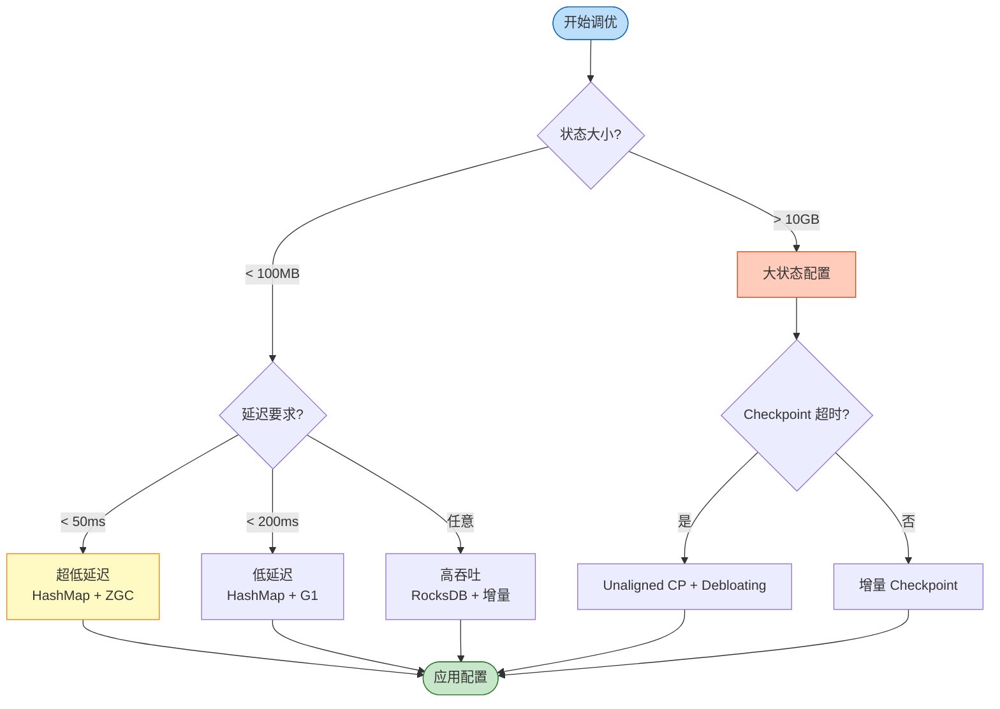
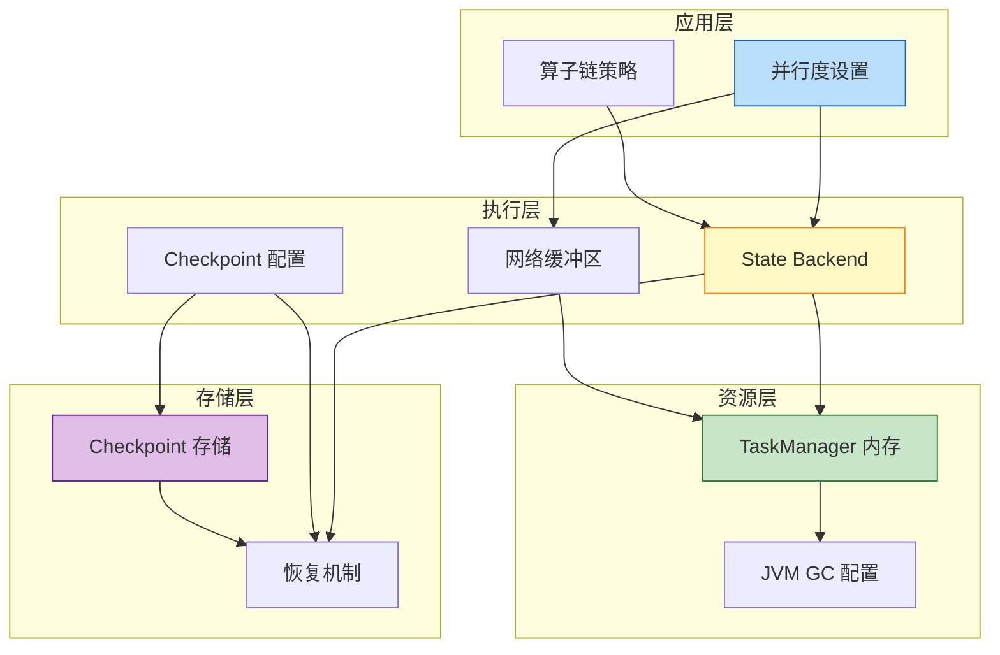
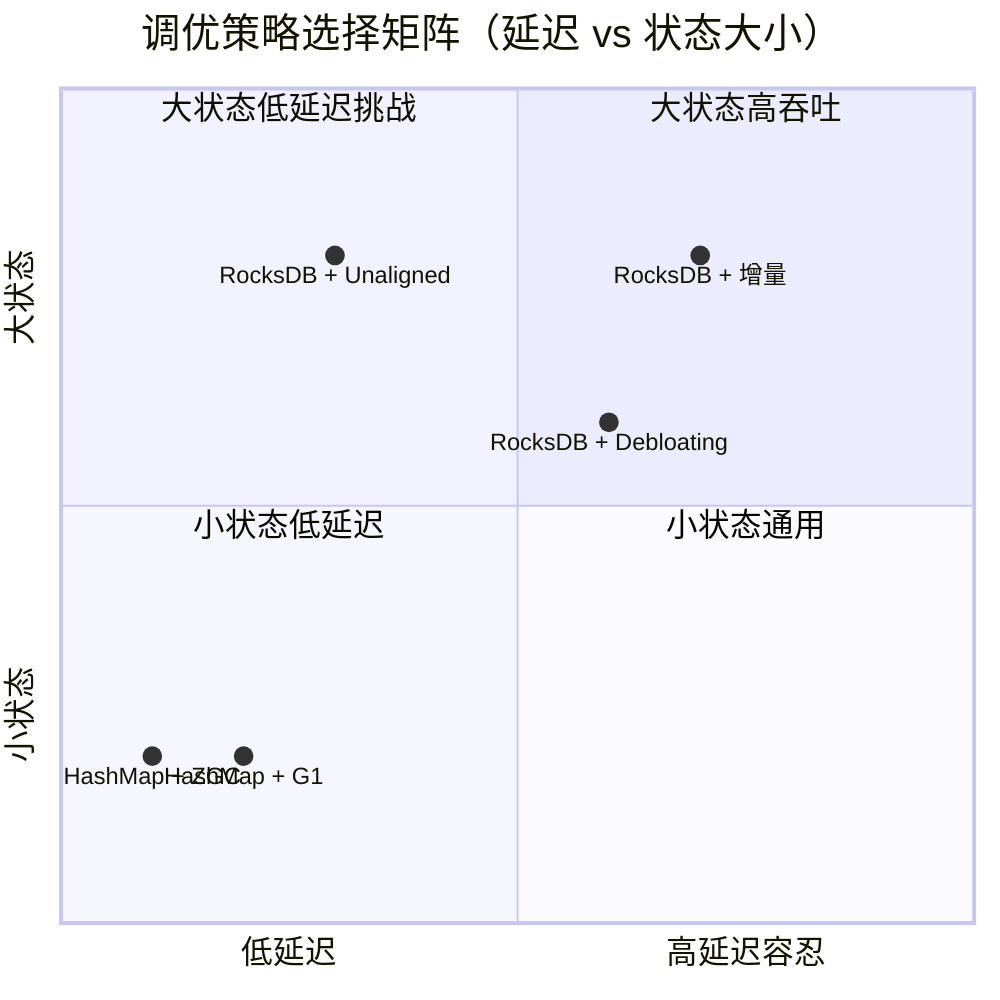

# Flink 性能调优指南 (Performance Tuning Guide)

> 所属阶段: Flink/06-engineering | 前置依赖: [Flink Checkpoint 机制深度剖析](../02-core-mechanisms/checkpoint-mechanism-deep-dive.md), [Flink 背压与流控机制](../02-core-mechanisms/backpressure-and-flow-control.md) | 形式化等级: L4

---

## 目录

- [Flink 性能调优指南 (Performance Tuning Guide)](#flink-性能调优指南-performance-tuning-guide)
  - [目录](#目录)
  - [1. 概念定义 (Definitions)](#1-概念定义-definitions)
    - [Def-F-06-01 (性能调优空间)](#def-f-06-01-性能调优空间)
    - [Def-F-06-02 (并行度与吞吐关系)](#def-f-06-02-并行度与吞吐关系)
    - [Def-F-06-03 (状态后端性能模型)](#def-f-06-03-状态后端性能模型)
    - [Def-F-06-04 (网络缓冲区调优空间)](#def-f-06-04-网络缓冲区调优空间)
    - [Def-F-06-05 (Checkpoint 性能指标)](#def-f-06-05-checkpoint-性能指标)
    - [Def-F-06-06 (JVM GC 调优目标)](#def-f-06-06-jvm-gc-调优目标)
  - [2. 属性推导 (Properties)](#2-属性推导-properties)
    - [Lemma-F-06-01 (并行度边际效应递减)](#lemma-f-06-01-并行度边际效应递减)
    - [Lemma-F-06-02 (状态后端延迟-吞吐权衡)](#lemma-f-06-02-状态后端延迟-吞吐权衡)
    - [Lemma-F-06-03 (网络缓冲区与延迟的负相关)](#lemma-f-06-03-网络缓冲区与延迟的负相关)
    - [Prop-F-06-01 (调优参数的场景敏感性)](#prop-f-06-01-调优参数的场景敏感性)
  - [3. 关系建立 (Relations)](#3-关系建立-relations)
    - [关系 1: 并行度调优 ⟷ 数据倾斜治理](#关系-1-并行度调优--数据倾斜治理)
    - [关系 2: State Backend 选择 ⟷ Checkpoint 性能](#关系-2-state-backend-选择--checkpoint-性能)
    - [关系 3: 网络调优 ⟷ 背压缓解 ⟷ Checkpoint 可靠性](#关系-3-网络调优--背压缓解--checkpoint-可靠性)
    - [关系 4: JVM GC 调优 ⟷ 状态访问性能](#关系-4-jvm-gc-调优--状态访问性能)
  - [4. 论证过程 (Argumentation)](#4-论证过程-argumentation)
    - [4.1 并行度调优方法论](#41-并行度调优方法论)
    - [4.2 State Backend 选型决策框架](#42-state-backend-选型决策框架)
    - [4.3 网络缓冲区调优原理](#43-网络缓冲区调优原理)
    - [4.4 Checkpoint 调优策略](#44-checkpoint-调优策略)
    - [4.5 JVM GC 调优实践](#45-jvm-gc-调优实践)
  - [5. 形式证明 / 工程论证 (Proof / Engineering Argument)](#5-形式证明--工程论证-proof--engineering-argument)
    - [Thm-F-06-01 (最优并行度存在性)](#thm-f-06-01-最优并行度存在性)
    - [Thm-F-06-02 (网络缓冲区配置下限)](#thm-f-06-02-网络缓冲区配置下限)
    - [工程论证: 场景化调优策略组合](#工程论证-场景化调优策略组合)
  - [6. 实例验证 (Examples)](#6-实例验证-examples)
    - [6.1 低延迟场景调优配置](#61-低延迟场景调优配置)
    - [6.2 高吞吐场景调优配置](#62-高吞吐场景调优配置)
    - [6.3 大状态场景调优配置](#63-大状态场景调优配置)
    - [6.4 JVM GC 调优配置](#64-jvm-gc-调优配置)
  - [7. 可视化 (Visualizations)](#7-可视化-visualizations)
    - [7.1 性能调优决策流程图](#71-性能调优决策流程图)
    - [7.2 调优参数层次关系图](#72-调优参数层次关系图)
    - [7.3 场景化调优策略映射图](#73-场景化调优策略映射图)
  - [8. 场景化调优参数速查表](#8-场景化调优参数速查表)
  - [9. 引用参考 (References)](#9-引用参考-references)

## 1. 概念定义 (Definitions)

本节建立 Flink 性能调优的严格形式化定义，与 [Flink Checkpoint 机制深度剖析](../02-core-mechanisms/checkpoint-mechanism-deep-dive.md) 和 [Flink 背压与流控机制](../02-core-mechanisms/backpressure-and-flow-control.md) 保持一致[^1][^2][^3]。

### Def-F-06-01 (性能调优空间)

**性能调优空间** $\mathcal{T} = \langle P, S, N, C, G \rangle$，其中：$P$ 为并行度参数，$S$ 为状态后端参数，$N$ 为网络缓冲区参数，$C$ 为 Checkpoint 参数，$G$ 为 JVM GC 参数。

**调优目标函数**：$\max_{t \in \mathcal{T}} \mathcal{F}(t) = \alpha \cdot Throughput(t) - \beta \cdot Latency(t) - \gamma \cdot ResourceCost(t)$[^1][^3]。

### Def-F-06-02 (并行度与吞吐关系)

设作业在并行度 $p$ 下的吞吐量为 $T(p)$，**并行度效率**为 $\eta(p) = T(p) / (p \cdot T(1))$。**最优并行度** $p_{opt} = \arg\max_{p} ( T(p) - \lambda \cdot p )$[^3][^4]。

### Def-F-06-03 (状态后端性能模型)

| Backend 类型 | $T_{read}$ | $T_{write}$ | $S_{memory}$ | 适用场景 |
|-------------|-----------|------------|-------------|---------|
| HashMapStateBackend | $O(1)$ | $O(1)$ | 高 (全内存) | 小状态、低延迟 |
| RocksDBStateBackend | $O(log n)$ | $O(1)$ 均摊 | 中 (BlockCache) | 大状态、高吞吐 |

状态访问延迟：$T_{access} = T_{lookup} + T_{serialization} + T_{deserialization}$[^1][^5]。

### Def-F-06-04 (网络缓冲区调优空间)

$\mathcal{N} = \langle B_{total}, B_{segment}, B_{exclusive}, B_{floating}, B_{debloat} \rangle$，其中 $B_{total}$ 为网络内存总量，$B_{segment}$ 默认 32KB[^2][^6]。

**端到端延迟**：$Latency_{e2e} \propto \sum_{e \in Path} B_{inflight}(e) / Throughput(e)$。

### Def-F-06-05 (Checkpoint 性能指标)

| 指标 | 符号 | 健康阈值 |
|------|------|---------|
| Checkpoint 持续时间 | $T_{duration}$ | < 60s |
| 同步阶段耗时 | $T_{sync}$ | < 100ms |
| 异步阶段耗时 | $T_{async}$ | < 30s |
| 成功率 | $R_{success}$ | > 99% |

恢复时间：$T_{recovery} \approx T_{replay} + T_{restore}$[^1][^7]。

### Def-F-06-06 (JVM GC 调优目标)

| GC 算法 | 停顿特性 | 适用场景 | 推荐度 |
|--------|---------|---------|-------|
| G1 GC | 可预测停顿 | 通用场景 | ★★★★★ |
| ZGC | 亚毫秒停顿 | 超低延迟 | ★★★★☆ |
| Shenandoah | 低停顿 | 通用场景 | ★★★☆☆ |
| Parallel GC | 高吞吐 | 批处理 | ★★☆☆☆ |

[^8][^9]

---

## 2. 属性推导 (Properties)

### Lemma-F-06-01 (并行度边际效应递减)

**陈述**：当并行度 $p$ 超过数据分区数 $N_{partition}$ 后，吞吐量增益 $\Delta T \to 0$。

**证明**：当 $p \leq N_{partition}$ 时吞吐线性增长；当 $p > N_{partition}$ 时，$p - N_{partition}$ 个 Source 子任务空闲，下游算子无法获得额外数据，$T(p) \approx T(N_{partition})$。∎

### Lemma-F-06-02 (状态后端延迟-吞吐权衡)

**陈述**：$T_{latency}^{HashMap} \ll T_{latency}^{RocksDB}$，但当状态 $S > S_{threshold}$ 时，$T_{throughput}^{HashMap} \ll T_{throughput}^{RocksDB}$。

**证明**：HashMapStateBackend 的 $T_{read} = O(1)$，但 $S > S_{threshold}$ 时触发频繁 Full GC；RocksDBStateBackend 不受堆大小限制。∎

### Lemma-F-06-03 (网络缓冲区与延迟的负相关)

**陈述**：在带宽饱和前，增加缓冲区数量 $B$ 可降低延迟 $L$：$\partial L / \partial B < 0$。

**证明**：由 Little's Law，$L_{queue} = N_{buffer} / \lambda$。增加缓冲区提升并行传输能力，降低平均排队延迟。∎

### Prop-F-06-01 (调优参数的场景敏感性)

| 场景 | 敏感参数 | 不敏感参数 |
|------|---------|-----------|
| 低延迟 (< 100ms) | $N$ (网络缓冲区), $G$ (GC) | $C$ (Checkpoint 间隔) |
| 高吞吐 (> 100K/s) | $P$ (并行度), $S$ (状态后端) | $G$ (GC 算法) |
| 大状态 (> 100GB) | $S$ (增量 Checkpoint), $C$ (超时) | $N$ (缓冲区 Debloating) |
| 高可用 (金融级) | $C$ (对齐模式), $G$ (GC 停顿) | $P$ (最大并行度) |

---

## 3. 关系建立 (Relations)

### 关系 1: 并行度调优 ⟷ 数据倾斜治理

并行度调优有效性受数据分布影响：$T_{effective}(p) = \min_{i} T_{subtask}(i) \cdot p$。**最优并行度**：$p_{opt} = \max( N_{partition}, R_{target}/R_{single} \cdot 1/\eta_{balance} )$[^3][^4]。

### 关系 2: State Backend 选择 ⟷ Checkpoint 性能

| Backend | 同步阶段 | Checkpoint 大小 | 恢复速度 |
|---------|---------|----------------|---------|
| HashMap | 与状态大小成正比 | 全量状态 | 快 |
| RocksDB (全量) | 文件列表操作 | 全量 SST | 中 |
| RocksDB (增量) | 文件列表操作 | 仅变更 SST | 慢(需合并) |

由 [Checkpoint 机制深度剖析](../02-core-mechanisms/checkpoint-mechanism-deep-dive.md)：$Storage_{incremental} \ll Storage_{full}$[^1][^5]。

### 关系 3: 网络调优 ⟷ 背压缓解 ⟷ Checkpoint 可靠性

由 [背压与流控机制](../02-core-mechanisms/backpressure-and-flow-control.md)：

1. **Debloating** 降低飞行中数据量 $B_{inflight}$
2. 降低的 $B_{inflight}$ 缩短 Aligned Checkpoint 的 Barrier 传播时间
3. Unaligned Checkpoint 的物化数据量降低

**联合策略**：High Backpressure $\implies$ Debloating + Unaligned Checkpoint[^2][^6][^7]。

### 关系 4: JVM GC 调优 ⟷ 状态访问性能

**HashMapStateBackend**：状态在堆内存，GC 直接影响访问延迟。Young GC 导致纳秒级停顿，Old GC 导致秒级停顿。

**RocksDBStateBackend**：状态在堆外内存和磁盘，GC 影响较小，需关注 `MaxDirectMemorySize`。

---

## 4. 论证过程 (Argumentation)

### 4.1 并行度调优方法论

**基础公式**：$p_{opt} = \max( N_{source}, R_{target} / R_{single} )$

**修正公式**：$p_{corrected} = p_{opt} \cdot \max_{i} Load(i) / \bar{Load}$

**Slot 配置**：`taskmanager.numberOfTaskSlots = min(作业最大并行度, CPU核心数)`

### 4.2 State Backend 选型决策框架

| 状态大小 | 延迟要求 | 推荐 Backend |
|---------|---------|-------------|
| < 100MB | < 10ms | HashMapStateBackend |
| 100MB - 1GB | < 100ms | HashMapStateBackend |
| 1GB - 10GB | < 100ms | RocksDB + SSD |
| > 10GB | 任意 | RocksDB + 增量 Checkpoint |
| 频繁更新 | 任意 | RocksDB |
| 大量点查 | < 10ms | HashMapStateBackend |

**RocksDB 调优**：

```java
state.backend.rocksdb.block.cache-size: 256mb
state.backend.rocksdb.writebuffer.count: 4
state.backend.rocksdb.threads.threads-number: 4
state.backend.rocksdb.predefined-options: FLASH_SSD_OPTIMIZED
```

### 4.3 网络缓冲区调优原理

**总网络内存**：$M_{network} = taskmanager.memory.network.fraction \times taskmanager.memory.total$

**缓冲区数量**：$N_{buffers} = M_{network} / 32KB$

**关键参数**：

| 参数 | 默认值 | 调优建议 |
|------|-------|---------|
| `buffers-per-channel` | 2 | 2-10 |
| `floating-buffers-per-gate` | 8 | 8-并行度 |
| `buffer-debloat.target` | 1s | 0.5s-2s |

**Debloating 机制**：$N_{target}(t) = \lceil \lambda(t) \cdot T_{target} / B_{segment} \rceil$[^2][^6]。

### 4.4 Checkpoint 调优策略

**间隔选择**：$T_{interval} = \min( R_{tolerance} / R_{process}, T_{max} )$

| 场景 | 推荐模式 |
|------|---------|
| 无背压、低延迟 | Aligned |
| 有背压、Checkpoint 超时 | Unaligned |
| 超高并发、大状态 | Unaligned + Debloating |

**超时配置**：$T_{timeout} = 3 \sim 5 \times T_{avg}$

### 4.5 JVM GC 调优实践

**G1 GC**：

```bash
-XX:+UseG1GC
-XX:MaxGCPauseMillis=20
-Xms4g -Xmx4g
-XX:InitiatingHeapOccupancyPercent=35
```

**ZGC（JDK 17+）**：

```bash
-XX:+UseZGC
-XX:+ZGenerational
-Xms8g -Xmx8g
```

---

## 5. 形式证明 / 工程论证 (Proof / Engineering Argument)

### Thm-F-06-01 (最优并行度存在性)

**陈述**：存在有限的最优并行度 $p_{opt}$ 使性能目标函数 $\mathcal{F}(p)$ 达到最大。

**证明**：$\mathcal{F}(p) = \alpha \cdot T(p) - \beta \cdot L(p) - \gamma \cdot C(p)$。由 Lemma-F-06-01，$T(p)$ 先线性增长后饱和；$L(p)$ 单调不减（网络开销 $O(p^2)$）。对于 $p \leq N_{partition}$，$\mathcal{F}(p)$ 先增后减；对于 $p > N_{partition}$，$\mathcal{F}(p)$ 单调递减。因此存在 $p_{opt} \in [1, N_{partition}]$。∎

### Thm-F-06-02 (网络缓冲区配置下限)

**陈述**：网络缓冲区总数 $N_{total} \geq \sum_{g} ( N_{channels}(g) \cdot B_{min} + B_{floating} )$，$B_{min} = 2$。

**证明**：输入门 $g$ 需 $n \cdot B_{exclusive} + B_{floating} + B_{reserved}$。由 [背压与流控机制](../02-core-mechanisms/backpressure-and-flow-control.md) Thm 5.1，Credit-based 流控要求 $Credit_{granted} \geq InFlight_{max}$。因此 $N_{total} = \sum_{g} ( n_g \cdot 2 + 8 ) + B_{reserved}$。∎

### 工程论证: 场景化调优策略组合

| 状态组合 | 调优策略 |
|---------|---------|
| $S_{state}$ < 1GB, $L_{target}$ < 100ms | HashMap + G1 + Debloating |
| $S_{state}$ > 10GB, $R_{target}$ > 100K/s | RocksDB 增量 + 高并行度 |
| $B_{backpressure}$ = 高, $L_{target}$ < 500ms | Unaligned CP + Debloating |
| $M_{resource}$ 受限 | RocksDB + 限制并行度 |

---

## 6. 实例验证 (Examples)

### 6.1 低延迟场景调优配置

**场景**：金融交易处理，延迟 < 50ms，状态 < 100MB。

```java
env.setParallelism(8);
env.setStateBackend(new HashMapStateBackend());
env.enableCheckpointing(5000);
env.getCheckpointConfig().setCheckpointingMode(CheckpointingMode.EXACTLY_ONCE);
env.getCheckpointConfig().setAlignmentTimeout(Duration.ofMillis(100));
env.getCheckpointConfig().disableUnalignedCheckpoints();

Configuration config = new Configuration();
config.setString("taskmanager.network.memory.buffer-debloat.enabled", "true");
config.setString("taskmanager.network.memory.buffer-debloat.target", "500ms");
env.configure(config);
```

**JVM**：`-XX:+UseG1GC -XX:MaxGCPauseMillis=10 -Xms2g -Xmx2g`

### 6.2 高吞吐场景调优配置

**场景**：日志处理，吞吐 > 500K records/s。

```java
env.setParallelism(64);
env.setStateBackend(new EmbeddedRocksDBStateBackend(true));
env.enableCheckpointing(60000);
env.getCheckpointConfig().enableUnalignedCheckpoints();
env.getCheckpointConfig().setAlignmentTimeout(Duration.ofSeconds(10));

Configuration cfg = new Configuration();
cfg.setString("state.backend.rocksdb.block.cache-size", "512mb");
cfg.setString("state.backend.rocksdb.predefined-options", "FLASH_SSD_OPTIMIZED");
env.configure(cfg);
```

**JVM**：`-XX:+UseG1GC -XX:MaxGCPauseMillis=50 -Xms8g -Xmx8g -XX:MaxDirectMemorySize=2g`

### 6.3 大状态场景调优配置

**场景**：用户画像，状态 > 100GB。

```java
env.setParallelism(32);
env.setStateBackend(new EmbeddedRocksDBStateBackend(true));
env.enableCheckpointing(300000);
env.getCheckpointConfig().setCheckpointTimeout(600000);
env.getCheckpointConfig().setPreferCheckpointForRecovery(true);
env.getCheckpointConfig().enableUnalignedCheckpoints();

StateTtlConfig ttlConfig = StateTtlConfig
    .newBuilder(Time.days(7))
    .cleanupIncrementally(10, true)
    .build();

Configuration cfg = new Configuration();
cfg.setString("state.backend.rocksdb.block.cache-size", "2gb");
env.configure(cfg);
```

**JVM**：`-XX:+UseG1GC -XX:MaxGCPauseMillis=100 -Xms32g -Xmx32g -XX:MaxDirectMemorySize=8g`

**flink-conf.yaml**：

```yaml
taskmanager.memory.process.size: 64gb
taskmanager.memory.network.fraction: 0.15
taskmanager.network.memory.buffers-per-channel: 8
taskmanager.network.memory.floating-buffers-per-gate: 64
```

### 6.4 JVM GC 调优配置

**ZGC 超低延迟（JDK 17+）**：

```bash
-XX:+UseZGC -XX:+ZGenerational -Xms16g -Xmx16g
-XX:MaxDirectMemorySize=4g -XX:+AlwaysPreTouch
```

**G1 GC 通用配置**：

```bash
-XX:+UseG1GC -XX:MaxGCPauseMillis=20 -Xms8g -Xmx8g
-XX:InitiatingHeapOccupancyPercent=35 -XX:G1HeapRegionSize=16m
```

---

## 7. 可视化 (Visualizations)

### 7.1 性能调优决策流程图



**图说明**：决策树从状态大小出发，结合延迟、吞吐确定调优策略；大状态场景默认使用 RocksDB + 增量 Checkpoint；低延迟场景优先使用 HashMapStateBackend 和低停顿 GC。

### 7.2 调优参数层次关系图



**图说明**：四层架构展示调优参数的影响范围；应用层决策向下传导到执行层和资源层。

### 7.3 场景化调优策略映射图



**图说明**：X 轴表示延迟容忍度（左低右高），Y 轴表示状态大小（下小上大）。

---

## 8. 场景化调优参数速查表

| 参数类别 | 参数名 | 低延迟场景 | 高吞吐场景 | 大状态场景 |
|---------|-------|-----------|-----------|-----------|
| **并行度** | `parallelism.default` | 8-16 | 32-128 | 16-64 |
| | `taskmanager.numberOfTaskSlots` | 4-8 | 8-16 | 4-8 |
| **State Backend** | `state.backend` | HashMap | RocksDB | RocksDB |
| | `state.backend.incremental` | false | true | true |
| | `state.backend.rocksdb.block.cache-size` | 64mb | 256-512mb | 1-2gb |
| | `state.backend.rocksdb.writebuffer.count` | 2 | 4-6 | 6-8 |
| **Checkpoint** | `execution.checkpointing.interval` | 5-10s | 30-60s | 3-5min |
| | `execution.checkpointing.timeout` | 30s | 3-5min | 10min |
| | `execution.checkpointing.unaligned` | false | true | true |
| | `execution.checkpointing.min-pause` | 500ms | 5-30s | 60s |
| **网络缓冲区** | `taskmanager.network.memory.fraction` | 0.1 | 0.1 | 0.15 |
| | `taskmanager.network.memory.buffers-per-channel` | 2 | 4-8 | 4-8 |
| | `taskmanager.network.memory.floating-buffers-per-gate` | 8 | 16-64 | 32-64 |
| | `taskmanager.network.memory.buffer-debloat.enabled` | true | true | true |
| | `taskmanager.network.memory.buffer-debloat.target` | 500ms | 1-2s | 2s |
| **JVM** | `-XX:+UseG1GC` / `-XX:+UseZGC` | ZGC | G1 | G1 |
| | `-XX:MaxGCPauseMillis` | 10 | 50 | 100 |
| | `-Xms / -Xmx` | 2-4g | 8-16g | 32-64g |
| | `-XX:MaxDirectMemorySize` | 512m | 2g | 8g |
| | `-XX:InitiatingHeapOccupancyPercent` | 35 | 35 | 30 |

**说明**：

- **低延迟场景**：prioritize 延迟，牺牲部分吞吐
- **高吞吐场景**：prioritize 吞吐，允许较高延迟
- **大状态场景**：prioritize 稳定性，避免 OOM 和 Checkpoint 超时

---

## 9. 引用参考 (References)

[^1]: Apache Flink Documentation, "Checkpointing", 2025. <https://nightlies.apache.org/flink/flink-docs-stable/docs/dev/datastream/fault-tolerance/checkpointing/>

[^2]: Apache Flink Documentation, "Network Buffer Tuning", 2025. <https://nightlies.apache.org/flink/flink-docs-stable/docs/deployment/memory/network_mem_tuning/>

[^3]: Apache Flink Documentation, "Tuning Checkpoints and Large State", 2025. <https://nightlies.apache.org/flink/flink-docs-stable/docs/ops/state/large_state_tuning/>

[^4]: Apache Flink Documentation, "Parallel Execution", 2025. <https://nightlies.apache.org/flink/flink-docs-stable/docs/dev/datastream/execution/parallel/>

[^5]: Apache Flink Documentation, "RocksDB State Backend", 2025. <https://nightlies.apache.org/flink/flink-docs-stable/docs/ops/state/state_backends/#rocksdb-state-backend>

[^6]: Apache Flink Documentation, "Checkpointing under Backpressure", 2025. <https://nightlies.apache.org/flink/flink-docs-stable/docs/ops/state/checkpointing_under_backpressure/>

[^7]: Apache Flink Documentation, "Configuring Unaligned Checkpoints", 2025. <https://nightlies.apache.org/flink/flink-docs-stable/docs/dev/datastream/fault-tolerance/checkpointing/#unaligned-checkpoints>

[^8]: Oracle Documentation, "Java HotSpot VM Garbage Collection Tuning Guide", 2025. <https://docs.oracle.com/javase/8/docs/technotes/guides/vm/gctuning/>

[^9]: Apache Flink Documentation, "JVM Tuning", 2025. <https://nightlies.apache.org/flink/flink-docs-stable/docs/deployment/memory/mem_tuning/>

---

*文档版本: v1.0 | 更新日期: 2026-04-02 | 状态: 已完成*
