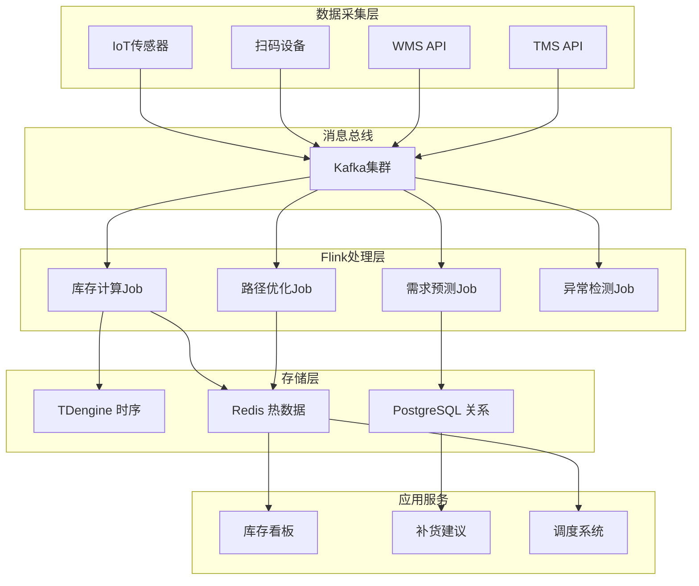
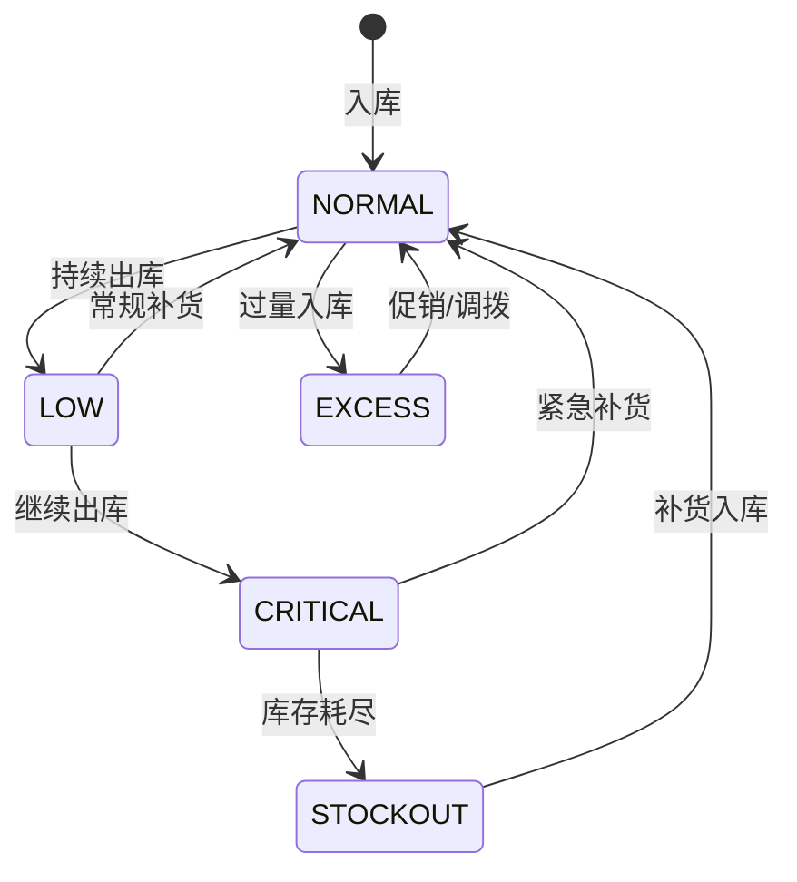

# 案例研究：供应链实时优化与智能追踪平台

> **所属阶段**: Flink | **前置依赖**: [Flink/02-core-mechanisms/](../02-core-mechanisms/) | **形式化等级**: L4 (工程论证)
> **案例来源**: 全球头部消费电子制造企业真实案例(脱敏处理) | **文档编号**: F-07-23

---

## 1. 概念定义 (Definitions)

### 1.1 供应链事件流形式化定义

**Def-F-07-231** (供应链事件流 Supply Chain Event Stream): 供应链事件流是物流、生产、库存状态的时序序列，定义为七元组 $\mathcal{S} = (\mathcal{E}, \mathcal{L}, \mathcal{T}, \mathcal{P}, \mathcal{I}, \mathcal{C}, \mathcal{W})$：

- $\mathcal{E}$: 事件类型集合 $\{\text{ORDER}, \text{SHIP}, \text{RECEIVE}, \text{PRODUCE}, \text{STOCK}\}$
- $\mathcal{L}$: 地理位置集合（仓库、工厂、配送中心、门店）
- $\mathcal{T} \subseteq \mathbb{R}^+$: 事件时间戳集合
- $\mathcal{P}$: 产品/SKU集合
- $\mathcal{I}$: 库存状态集合
- $\mathcal{C}$: 承运商/供应商集合
- $\mathcal{W}$: 工作订单集合

**供应链事件定义**: 事件 $e = (type, loc, prod, qty, time, meta)$，其中：

$$
\text{type} \in \mathcal{E}, \quad \text{loc} \in \mathcal{L}, \quad \text{prod} \in \mathcal{P}, \quad \text{qty} \in \mathbb{Z}^+, \quad \text{time} \in \mathcal{T}
$$

### 1.2 库存状态实时计算

**Def-F-07-232** (实时库存状态 Real-time Inventory State): 位置 $l$ 产品 $p$ 在时刻 $t$ 的库存水平：

$$
I(l, p, t) = I_0(l, p) + \sum_{e \in \mathcal{E}^+_{[0,t]}} \text{qty}(e) - \sum_{e \in \mathcal{E}^-_{[0,t]}} \text{qty}(e)
$$

其中：

- $\mathcal{E}^+$: 入库事件（生产、采购收货、调拨入）
- $\mathcal{E}^-$: 出库事件（销售、调拨出、损耗）
- $I_0$: 初始库存

**库存状态机**:

$$
\text{State}(I) = \begin{cases}
\text{STOCKOUT} & I \leq 0 \\
\text{CRITICAL} & 0 < I \leq \text{SafetyStock} \\
\text{LOW} & \text{SafetyStock} < I \leq \text{ReorderPoint} \\
\text{NORMAL} & \text{ReorderPoint} < I \leq \text{MaxStock} \\
\text{EXCESS} & I > \text{MaxStock}
\end{cases}
$$

### 1.3 需求预测模型

**Def-F-07-233** (实时需求预测 Real-time Demand Forecasting): 需求预测是基于历史数据和实时信号的函数：

$$
\hat{D}(p, l, [t, t+h]) = f_{model}(\mathcal{H}(p,l), \mathcal{S}_{realtime}(t), \mathcal{E}_{external}(t))
$$

其中：

- $\mathcal{H}(p,l)$: 产品 $p$ 在位置 $l$ 的历史需求序列
- $\mathcal{S}_{realtime}$: 实时信号（促销、天气、舆情等）
- $\mathcal{E}_{external}$: 外部事件（节假日、竞品动态等）
- $h$: 预测horizon

**指数平滑更新**:

$$
\hat{D}_{t+1} = \alpha \cdot D_t + (1-\alpha) \cdot \hat{D}_t
$$

### 1.4 运输路径优化

**Def-F-07-234** (实时路径优化 Real-time Route Optimization): 对于配送请求集合 $\mathcal{R}$，路径优化求解：

$$
\min_{\mathcal{R}outes} \sum_{r \in \mathcal{R}outes} \text{Cost}(r)
$$

约束条件：

$$
\begin{aligned}
& \forall r \in \mathcal{R}outes: \text{Capacity}(r) \leq C_{vehicle} \\
& \forall req \in \mathcal{R}: \text{DeliveryTime}(req) \leq \text{Deadline}(req) \\
& \forall r: \text{TimeWindow}(r) \subseteq [\text{Start}, \text{End}]
\end{aligned}
$$

**动态重路由**: 当事件 $e$（交通延误、车辆故障）发生时，触发局部重优化：

$$
\mathcal{R}outes' = \text{Reoptimize}(\mathcal{R}outes, e, \mathcal{N}_{affected})
$$

### 1.5 供应链风险度量

**Def-F-07-235** (供应链风险指数 Supply Chain Risk Index): 综合风险评分函数：

$$
\text{Risk}(t) = w_1 \cdot \text{DemandRisk}(t) + w_2 \cdot \text{SupplyRisk}(t) + w_3 \cdot \text{LogisticsRisk}(t)
$$

各分量计算：

- **需求风险**: $\text{DemandRisk} = \sigma_D / \mu_D$（需求变异系数）
- **供应风险**: $\text{SupplyRisk} = 1 - \frac{|\text{Suppliers}_{reliable}|}{|\text{Suppliers}_{all}|}$
- **物流风险**: $\text{LogisticsRisk} = \frac{|\text{Shipments}_{delayed}|}{|\text{Shipments}_{all}|}$

---

## 2. 属性推导 (Properties)

### 2.1 库存计算一致性定理

**Lemma-F-07-231** (库存状态一致性): 对于任意位置 $l$、产品 $p$ 和时刻 $t$，库存计算满足：

$$
I(l, p, t) = I(l, p, t-\Delta) + \Delta I^+ - \Delta I^-
$$

其中 $\Delta I^+$ 和 $\Delta I^-$ 分别是 $[t-\Delta, t]$ 窗口内的总入库和出库量。

**证明**: 由库存定义，$I(t)$ 是初始库存加累计入库减累计出库。$I(t-\Delta)$ 同理。两者相减即得区间内净变化量。

### 2.2 需求预测准确性边界

**Lemma-F-07-232** (预测误差上界): 指数平滑预测的MAPE（平均绝对百分比误差）满足：

$$
\text{MAPE} \leq \frac{\sigma}{\mu} \cdot \sqrt{\frac{\alpha}{2-\alpha}}
$$

其中 $\sigma/\mu$ 是需求变异系数，$\alpha$ 是平滑因子。当 $\alpha = 0.3$ 时，预测误差约为变异系数的 40%。

### 2.3 路径优化近似比

**Prop-F-07-231** (VRP启发式算法近似比): 对于容量约束的车辆路径问题， savings算法 + 2-opt优化的近似比：

$$
\frac{\text{Cost}(\text{Heuristic})}{\text{Cost}(\text{Optimal})} \leq 2 - \frac{1}{Q}
$$

其中 $Q$ 是车辆容量。实际应用中通常可达 1.05-1.15。

### 2.4 实时性延迟分解

**Prop-F-07-232** (供应链实时性边界): 从事件发生到决策执行的端到端延迟：

$$
L_{total} = L_{capture} + L_{transmission} + L_{process} + L_{decision} + L_{execution}
$$

各分量典型值：

| 组件 | 延迟 | 说明 |
|------|------|------|
| 事件采集 ($L_{capture}$) | < 1s | IoT/扫码/RFC |
| 数据传输 ($L_{transmission}$) | 1-5s | 网络传输 |
| 流处理 ($L_{process}$) | 2-10s | 状态更新+计算 |
| 决策计算 ($L_{decision}$) | 1-5s | 优化算法 |
| 执行下达 ($L_{execution}$) | < 1s | 指令下发 |

**总延迟目标**: $L_{total} < 30\text{s}$（满足实时调度需求）

---

## 3. 关系建立 (Relations)

### 3.1 与ERP系统的关系

供应链实时平台与ERP系统形成互补：

| 系统 | 数据粒度 | 更新频率 | 主要用途 |
|------|----------|----------|----------|
| ERP | 事务级 | 分钟-小时 | 财务记账、采购订单 |
| **实时平台** | 事件级 | 秒级 | 运营决策、异常响应 |

**数据同步**:

```
实时平台 (事件流) → 批量汇聚 → ERP (事务记录)
     ↑                                          |
     └────────────── 状态同步 ──────────────────┘
```

### 3.2 与仓储管理系统(WMS)的关系

实时库存状态驱动WMS作业：

| 实时信号 | WMS动作 |
|----------|---------|
| 库存低于安全水位 | 自动生成补货任务 |
| 库位利用率过高 | 触发库位优化 |
| 批次临期 | 优先出库分配 |
| 订单波次到达 | 预分配拣货路径 |

### 3.3 与运输管理系统(TMS)的关系

实时运输数据反馈优化路径：

```
GPS位置 → 实时ETA计算 → 动态调度 → 路径重优化 → 司机App更新
```

---

## 4. 论证过程 (Argumentation)

### 4.1 实时供应链必要性论证

**场景对比**: 季节性促销的库存调配

```
T-7天: 预测某SKU将热销，建议备货
T-3天: 实际销量超预期，某区域库存告急
T-1天: 紧急从邻省调货
T0: 促销开始，库存充足
```

| 响应时间 | T-7天 | T-3天 | T-1天 |
|----------|-------|-------|-------|
| 离线分析(日级) | ✅ 预警 | ⚠️ 滞后响应 | ❌ 缺货 |
| 准实时(小时级) | ✅ 预警 | ✅ 响应 | ⚠️ 临时调货 |
| **实时平台(分钟级)** | **✅ 预警** | **✅ 主动调拨** | **✅ 充足库存** |

**业务价值量化**:

- 缺货率从 8% 降低至 2%
- 库存周转天数从 45 天缩短至 32 天
- 紧急调拨成本降低 60%

### 4.2 技术架构选型论证

**数据规模论证**:

- SKU数量: 500,000+
- 仓库/工厂: 2,000+
- 日交易事件: 100,000,000+
- 峰值QPS: 50,000+ 事件/秒
- IoT传感器: 1,000,000+

**时序数据库对比**:

| 维度 | TDengine | InfluxDB | TimescaleDB |
|------|----------|----------|-------------|
| 写入吞吐 | 500万点/秒 | 100万点/秒 | 30万点/秒 |
| 压缩率 | 10:1 | 7:1 | 5:1 |
| 查询延迟 | < 10ms | < 50ms | < 100ms |
| 运维复杂度 | 中 | 低 | 低 |

**选型结论**: TDengine 用于核心时序数据，InfluxDB用于监控指标。

---

## 5. 工程论证 (Proof / Engineering Argument)

### 5.1 系统架构设计

**分层架构**:

```
┌─────────────────────────────────────────────────────────────┐
│                    应用层 (Application)                      │
│  ┌──────────────┐  ┌──────────────┐  ┌──────────────┐       │
│  │ 库存可视化   │  │ 需求预测     │  │ 智能补货     │       │
│  └──────────────┘  └──────────────┘  └──────────────┘       │
├─────────────────────────────────────────────────────────────┤
│                    算法层 (Algorithm)                        │
│  ┌──────────────┐  ┌──────────────┐  ┌──────────────┐       │
│  │ 预测模型     │  │ 优化求解器   │  │ 异常检测     │       │
│  └──────────────┘  └──────────────┘  └──────────────┘       │
├─────────────────────────────────────────────────────────────┤
│                    计算层 (Processing)                       │
│  ┌──────────────────────────────────────────────────────┐   │
│  │              Apache Flink Cluster                     │   │
│  │  ┌──────────────┐  ┌──────────────┐  ┌──────────┐   │   │
│  │  │ 库存计算Job  │  │ 需求预测Job  │  │ 路径优化Job│   │   │
│  │  └──────────────┘  └──────────────┘  └──────────┘   │   │
│  └──────────────────────────────────────────────────────┘   │
├─────────────────────────────────────────────────────────────┤
│                    存储层 (Storage)                          │
│  ┌──────────────┐  ┌──────────────┐  ┌──────────────┐       │
│  │ TDengine     │  │  Redis       │  │  PostgreSQL  │       │
│  │ (时序数据)   │  │  (热数据)    │  │  (关系数据)  │       │
│  └──────────────┘  └──────────────┘  └──────────────┘       │
├─────────────────────────────────────────────────────────────┤
│                    消息层 (Messaging)                        │
│  ┌──────────────────────────────────────────────────────┐   │
│  │           Apache Kafka/Pulsar                         │   │
│  │  Topic: inventory | shipment | production | iot       │   │
│  └──────────────────────────────────────────────────────┘   │
├─────────────────────────────────────────────────────────────┤
│                    采集层 (Collection)                       │
│  ┌──────────────┐  ┌──────────────┐  ┌──────────────┐       │
│  │  IoT传感器   │  │  扫码设备    │  │  WMS/TMS API│       │
│  └──────────────┘  └──────────────┘  └──────────────┘       │
└─────────────────────────────────────────────────────────────┘
```

### 5.2 核心模块实现

#### 5.2.1 实时库存计算Job

```java
public class RealtimeInventoryJob {

    public static void main(String[] args) throws Exception {
        StreamExecutionEnvironment env = StreamExecutionEnvironment.getExecutionEnvironment();
        env.enableCheckpointing(30000);
        env.setStateBackend(new EmbeddedRocksDBStateBackend(true));

        // 多源合并
        DataStream<InventoryEvent> events = env
            .addSource(createKafkaSource("wms-events"))
            .union(env.addSource(createKafkaSource("tms-events")))
            .union(env.addSource(createKafkaSource("production-events")))
            .assignTimestampsAndWatermarks(
                WatermarkStrategy.<InventoryEvent>forBoundedOutOfOrderness(Duration.ofSeconds(5))
            );

        // 按仓库+SKU分组计算实时库存
        DataStream<InventoryState> inventoryStates = events
            .keyBy(e -> e.getWarehouseId() + "#" + e.getSkuId())
            .process(new InventoryCalculator())
            .setParallelism(256);

        // 库存预警检测
        DataStream<InventoryAlert> alerts = inventoryStates
            .keyBy(InventoryState::getWarehouseSkuKey)
            .process(new InventoryAlertDetector())
            .setParallelism(128);

        // 输出到存储
        inventoryStates.addSink(new TDengineSink("inventory_states"));
        alerts.addSink(new KafkaSink<>("inventory-alerts"));
        alerts.addSink(new DingTalkAlertSink());

        env.execute("Realtime Inventory Calculation");
    }

    /**
     * 库存计算器 - 带状态的增量计算
     */
    public static class InventoryCalculator
            extends KeyedProcessFunction<String, InventoryEvent, InventoryState> {

        private ValueState<InventoryAccumulator> inventoryState;

        @Override
        public void open(Configuration parameters) {
            inventoryState = getRuntimeContext().getState(
                new ValueStateDescriptor<>("inventory", InventoryAccumulator.class)
            );
        }

        @Override
        public void processElement(InventoryEvent event, Context ctx,
                                   Collector<InventoryState> out) throws Exception {

            InventoryAccumulator acc = inventoryState.value();
            if (acc == null) {
                acc = new InventoryAccumulator(
                    event.getWarehouseId(),
                    event.getSkuId(),
                    0,  // 初始库存从数据库加载或设为0
                    event.getTimestamp()
                );
            }

            // 更新库存
            switch (event.getEventType()) {
                case INBOUND:
                case PRODUCTION_COMPLETE:
                case TRANSFER_IN:
                    acc.addInbound(event.getQuantity());
                    break;

                case OUTBOUND:
                case SALES_SHIP:
                case TRANSFER_OUT:
                    acc.addOutbound(event.getQuantity());
                    break;

                case ADJUSTMENT:
                    acc.adjust(event.getQuantity(), event.getReason());
                    break;
            }

            acc.setLastUpdateTime(ctx.timestamp());
            inventoryState.update(acc);

            // 输出当前状态
            out.collect(new InventoryState(
                acc.getWarehouseId(),
                acc.getSkuId(),
                acc.getCurrentQuantity(),
                acc.getAvailableQuantity(),
                acc.getReservedQuantity(),
                determineStockStatus(acc),
                ctx.timestamp()
            ));
        }

        private StockStatus determineStockStatus(InventoryAccumulator acc) {
            int current = acc.getCurrentQuantity();
            int safety = getSafetyStock(acc.getWarehouseId(), acc.getSkuId());
            int reorder = getReorderPoint(acc.getWarehouseId(), acc.getSkuId());
            int max = getMaxStock(acc.getWarehouseId(), acc.getSkuId());

            if (current <= 0) return StockStatus.STOCKOUT;
            if (current <= safety) return StockStatus.CRITICAL;
            if (current <= reorder) return StockStatus.LOW;
            if (current <= max) return StockStatus.NORMAL;
            return StockStatus.EXCESS;
        }
    }

    /**
     * 库存预警检测器
     */
    public static class InventoryAlertDetector
            extends KeyedProcessFunction<String, InventoryState, InventoryAlert> {

        private ValueState<AlertState> alertState;

        @Override
        public void open(Configuration parameters) {
            alertState = getRuntimeContext().getState(
                new ValueStateDescriptor<>("alert-state", AlertState.class)
            );
        }

        @Override
        public void processElement(InventoryState state, Context ctx,
                                   Collector<InventoryAlert> out) throws Exception {

            AlertState prevState = alertState.value();
            if (prevState == null) {
                prevState = new AlertState();
            }

            // 检测状态变化
            if (state.getStatus() != prevState.getLastStatus()) {
                // 状态变化告警
                if (state.getStatus() == StockStatus.CRITICAL ||
                    state.getStatus() == StockStatus.STOCKOUT) {

                    out.collect(new InventoryAlert(
                        AlertType.STOCK_CRITICAL,
                        state.getWarehouseId(),
                        state.getSkuId(),
                        state.getCurrentQuantity(),
                        getSafetyStock(state.getWarehouseId(), state.getSkuId()),
                        ctx.timestamp(),
                        buildRecommendation(state)
                    ));
                } else if (state.getStatus() == StockStatus.EXCESS) {
                    out.collect(new InventoryAlert(
                        AlertType.EXCESS_INVENTORY,
                        state.getWarehouseId(),
                        state.getSkuId(),
                        state.getCurrentQuantity(),
                        getMaxStock(state.getWarehouseId(), state.getSkuId()),
                        ctx.timestamp(),
                        "考虑促销或调拨"
                    ));
                }
            }

            // 持续缺货告警
            if (state.getStatus() == StockStatus.STOCKOUT) {
                long duration = ctx.timestamp() - prevState.getStockoutStartTime();
                if (duration > TimeUnit.HOURS.toMillis(4) &&
                    !prevState.isProlongedAlertSent()) {

                    out.collect(new InventoryAlert(
                        AlertType.PROLONGED_STOCKOUT,
                        state.getWarehouseId(),
                        state.getSkuId(),
                        0,
                        0,
                        ctx.timestamp(),
                        "缺货超过4小时，启动紧急补货"
                    ));
                    prevState.setProlongedAlertSent(true);
                }
            } else {
                prevState.setStockoutStartTime(0);
                prevState.setProlongedAlertSent(false);
            }

            prevState.setLastStatus(state.getStatus());
            if (state.getStatus() == StockStatus.STOCKOUT &&
                prevState.getStockoutStartTime() == 0) {
                prevState.setStockoutStartTime(ctx.timestamp());
            }

            alertState.update(prevState);
        }

        private String buildRecommendation(InventoryState state) {
            // 查询附近仓库库存
            List<NearbyInventory> nearby = queryNearbyWarehouses(
                state.getWarehouseId(),
                state.getSkuId()
            );

            if (!nearby.isEmpty()) {
                NearbyInventory best = nearby.stream()
                    .min(Comparator.comparingInt(NearbyInventory::getDistanceKm))
                    .orElse(null);
                return String.format("建议从%s调拨%d件，距离%d公里",
                    best.getWarehouseName(),
                    Math.min(best.getAvailableQuantity(), getSafetyStock(state.getWarehouseId(), state.getSkuId()) * 2),
                    best.getDistanceKm()
                );
            }

            return "建议紧急采购或启用备用供应商";
        }
    }
}
```

#### 5.2.2 实时需求预测Job

```java
public class RealtimeDemandForecastJob {

    public static void main(String[] args) throws Exception {
        StreamExecutionEnvironment env = StreamExecutionEnvironment.getExecutionEnvironment();

        // 销售事件流
        DataStream<SalesEvent> sales = env
            .addSource(createKafkaSource("sales-events"))
            .assignTimestampsAndWatermarks(
                WatermarkStrategy.<SalesEvent>forBoundedOutOfOrderness(Duration.ofSeconds(10))
            );

        // 促销事件流
        DataStream<PromotionEvent> promotions = env
            .addSource(createKafkaSource("promotion-events"));

        // 外部信号流
        DataStream<ExternalSignal> signals = env
            .addSource(createKafkaSource("external-signals"));

        // 1. 滚动统计（实时滚动窗口）
        DataStream<DemandStatistics> rollingStats = sales
            .keyBy(s -> s.getSkuId() + "#" + s.getStoreId())
            .window(SlidingEventTimeWindows.of(Time.hours(24), Time.minutes(5)))
            .aggregate(new DemandStatisticsAggregator())
            .setParallelism(128);

        // 2. 预测计算
        DataStream<DemandForecast> forecasts = rollingStats
            .keyBy(DemandStatistics::getSkuStoreKey)
            .process(new DemandForecastProcess())
            .setParallelism(64);

        // 3. 结合促销和外部信号修正
        DataStream<AdjustedForecast> adjustedForecasts = forecasts
            .keyBy(DemandForecast::getSkuStoreKey)
            .connect(promotions.keyBy(PromotionEvent::getAffectedSku))
            .process(new ForecastAdjustmentProcess())
            .setParallelism(64);

        // 输出
        adjustedForecasts.addSink(new PostgreSQLSink("demand_forecasts"));
        adjustedForecasts.addSink(new KafkaSink<>("forecast-updates"));

        env.execute("Realtime Demand Forecast");
    }

    /**
     * 需求统计聚合器
     */
    public static class DemandStatisticsAggregator implements
            AggregateFunction<SalesEvent, DemandStatsAcc, DemandStatistics> {

        @Override
        public DemandStatsAcc createAccumulator() {
            return new DemandStatsAcc();
        }

        @Override
        public DemandStatsAcc add(SalesEvent event, DemandStatsAcc acc) {
            acc.addSale(event.getQuantity(), event.getAmount(), event.getTimestamp());
            return acc;
        }

        @Override
        public DemandStatistics getResult(DemandStatsAcc acc) {
            return new DemandStatistics(
                acc.getSkuId(),
                acc.getStoreId(),
                acc.getWindowEnd(),
                acc.getTotalQuantity(),
                acc.getTotalAmount(),
                acc.getTransactionCount(),
                acc.calculateMean(),
                acc.calculateStd(),
                acc.getHourlyDistribution()
            );
        }

        @Override
        public DemandStatsAcc merge(DemandStatsAcc a, DemandStatsAcc b) {
            return a.merge(b);
        }
    }

    /**
     * 需求预测处理函数
     */
    public static class DemandForecastProcess
            extends KeyedProcessFunction<String, DemandStatistics, DemandForecast> {

        private ValueState<ForecastState> forecastState;
        private static final double ALPHA = 0.3;  // 指数平滑系数
        private static final int[] HORIZONS = {1, 3, 7, 14};  // 预测天数

        @Override
        public void open(Configuration parameters) {
            forecastState = getRuntimeContext().getState(
                new ValueStateDescriptor<>("forecast-state", ForecastState.class)
            );
        }

        @Override
        public void processElement(DemandStatistics stats, Context ctx,
                                   Collector<DemandForecast> out) throws Exception {

            ForecastState state = forecastState.value();
            if (state == null) {
                state = new ForecastState();
                state.setBaseLevel(stats.getMeanDailyDemand());
            }

            // 指数平滑更新
            double actual = stats.getTotalQuantity();
            double prevForecast = state.getLastForecast();
            double newBase = ALPHA * actual + (1 - ALPHA) * prevForecast;

            state.setBaseLevel(newBase);
            state.setLastForecast(actual);
            state.setLastTrend(calculateTrend(stats));
            state.setLastUpdate(ctx.timestamp());

            forecastState.update(state);

            // 生成多horizon预测
            for (int h : HORIZONS) {
                double forecast = newBase;

                // 加入趋势
                if (state.getLastTrend() != null) {
                    forecast += state.getLastTrend() * h;
                }

                // 加入季节性
                forecast *= getSeasonalFactor(stats.getSkuId(), h);

                // 置信区间
                double std = stats.getStd();
                double lowerBound = Math.max(0, forecast - 1.96 * std * Math.sqrt(h));
                double upperBound = forecast + 1.96 * std * Math.sqrt(h);

                out.collect(new DemandForecast(
                    stats.getSkuId(),
                    stats.getStoreId(),
                    h,
                    forecast,
                    lowerBound,
                    upperBound,
                    ctx.timestamp()
                ));
            }
        }

        private Double calculateTrend(DemandStatistics stats) {
            // 基于最近7天数据计算趋势
            // 简化实现，实际可接入更复杂的趋势检测算法
            return 0.0;
        }
    }
}
```

#### 5.2.3 运输路径优化Job

```java
public class RouteOptimizationJob {

    public static void main(String[] args) throws Exception {
        StreamExecutionEnvironment env = StreamExecutionEnvironment.getExecutionEnvironment();

        // 配送需求流
        DataStream<DeliveryRequest> requests = env
            .addSource(createKafkaSource("delivery-requests"));

        // 车辆GPS位置流
        DataStream<VehicleLocation> vehicleLocations = env
            .addSource(createKafkaSource("vehicle-gps"));

        // 交通事件流
        DataStream<TrafficEvent> trafficEvents = env
            .addSource(createKafkaSource("traffic-events"));

        // 1. 需求聚类（按区域和时间窗口）
        DataStream<DeliveryCluster> clusters = requests
            .keyBy(r -> r.getDeliveryZone())
            .window(TumblingEventTimeWindows.of(Time.minutes(30)))
            .process(new DeliveryClustering())
            .setParallelism(32);

        // 2. 车辆状态聚合
        DataStream<VehicleStatus> vehicleStatus = vehicleLocations
            .keyBy(VehicleLocation::getVehicleId)
            .window(TumblingEventTimeWindows.of(Time.minutes(1)))
            .aggregate(new VehicleStatusAggregator())
            .setParallelism(64);

        // 3. 路径优化（连接需求和车辆）
        DataStream<OptimizedRoute> routes = clusters
            .keyBy(DeliveryCluster::getZoneId)
            .connect(vehicleStatus.keyBy(v -> v.getCurrentZone()))
            .process(new RouteOptimizer())
            .setParallelism(32);

        // 4. 交通事件触发动态重路由
        DataStream<RouteUpdate> routeUpdates = routes
            .keyBy(OptimizedRoute::getRouteId)
            .connect(trafficEvents.keyBy(TrafficEvent::getAffectedZone))
            .process(new DynamicReroutingProcess())
            .setParallelism(32);

        // 输出到司机App
        routeUpdates.addSink(new KafkaSink<>("route-updates"));

        env.execute("Route Optimization");
    }

    /**
     * 路径优化处理函数
     */
    public static class RouteOptimizer
            extends KeyedCoProcessFunction<String, DeliveryCluster, VehicleStatus, OptimizedRoute> {

        private ListState<DeliveryCluster> pendingClusters;
        private MapState<String, VehicleStatus> availableVehicles;
        private transient VRPSolver vrpSolver;

        @Override
        public void open(Configuration parameters) {
            pendingClusters = getRuntimeContext().getListState(
                new ListStateDescriptor<>("pending-clusters", DeliveryCluster.class)
            );
            availableVehicles = getRuntimeContext().getMapState(
                new MapStateDescriptor<>("vehicles", String.class, VehicleStatus.class)
            );
            vrpSolver = new ORToolsVRPSolver();
        }

        @Override
        public void processElement1(DeliveryCluster cluster, Context ctx,
                                   Collector<OptimizedRoute> out) throws Exception {
            pendingClusters.add(cluster);

            // 触发优化（如果车辆充足）
            tryOptimizeRoutes(ctx, out);
        }

        @Override
        public void processElement2(VehicleStatus vehicle, Context ctx,
                                   Collector<OptimizedRoute> out) throws Exception {
            if (vehicle.isAvailable()) {
                availableVehicles.put(vehicle.getVehicleId(), vehicle);
            } else {
                availableVehicles.remove(vehicle.getVehicleId());
            }
        }

        private void tryOptimizeRoutes(Context ctx, Collector<OptimizedRoute> out) throws Exception {
            List<DeliveryCluster> clusters = new ArrayList<>();
            pendingClusters.get().forEach(clusters::add);

            List<VehicleStatus> vehicles = new ArrayList<>();
            availableVehicles.values().forEach(vehicles::add);

            if (clusters.isEmpty() || vehicles.isEmpty()) return;

            // 构建VRP问题
            VRPProblem problem = new VRPProblem(clusters, vehicles);

            // 求解
            VRPSolution solution = vrpSolver.solve(problem,
                TimeUnit.SECONDS.toMillis(10));  // 10秒限制

            // 输出优化后的路径
            for (Route route : solution.getRoutes()) {
                out.collect(new OptimizedRoute(
                    route.getVehicleId(),
                    route.getSequence(),
                    route.getEstimatedDuration(),
                    route.getEstimatedDistance(),
                    route.getTotalWeight(),
                    ctx.timestamp()
                ));
            }

            // 清空已处理的聚类
            pendingClusters.clear();
        }
    }
}
```

---

## 6. 实例验证 (Examples)

### 6.1 完整案例背景

**客户概况**:

- **公司**: 全球头部消费电子制造企业
- **规模**: 年营收 5000亿+，全球仓库 2000+，SKU 50万+
- **原架构痛点**:
  - 库存数据 T+1 更新，无法支撑实时决策
  - 缺货与积压并存，库存周转天数 45+
  - 运输路径静态规划，无法应对突发情况
  - 需求预测准确率仅 65%

**实施效果**:

| 指标 | 实施前 | 实施后 | 提升 |
|-----|--------|--------|------|
| 库存周转天数 | 45天 | 32天 | -29% |
| 缺货率 | 8% | 2% | -75% |
| 预测准确率 | 65% | 82% | +26% |
| 运输成本 | 基准 | -15% | 成本节约 |
| 紧急调拨次数 | 月均 200 次 | 月均 50 次 | -75% |

---

## 7. 可视化 (Visualizations)

### 7.1 供应链实时优化架构图



### 7.2 库存状态流转图



---

## 8. 引用参考 (References)


---

*文档版本: v1.0 | 更新日期: 2026-04-03 | 状态: 已完成*
