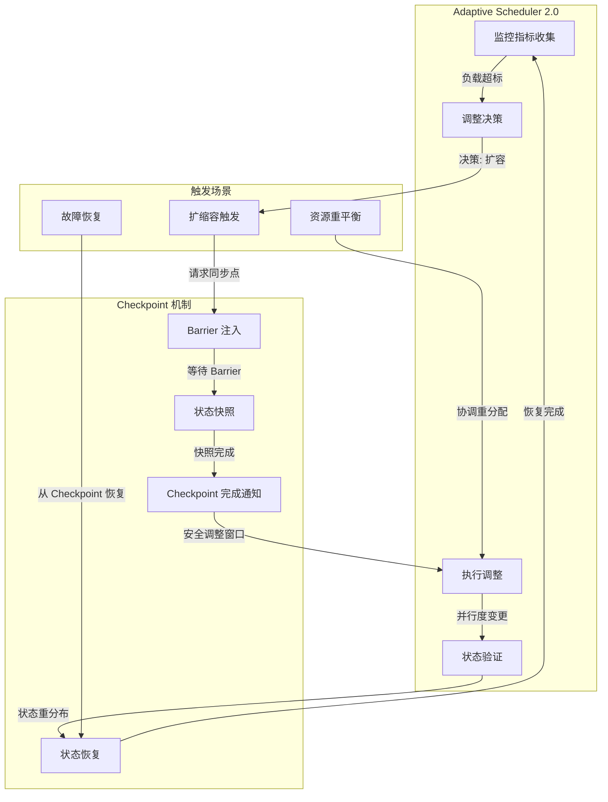
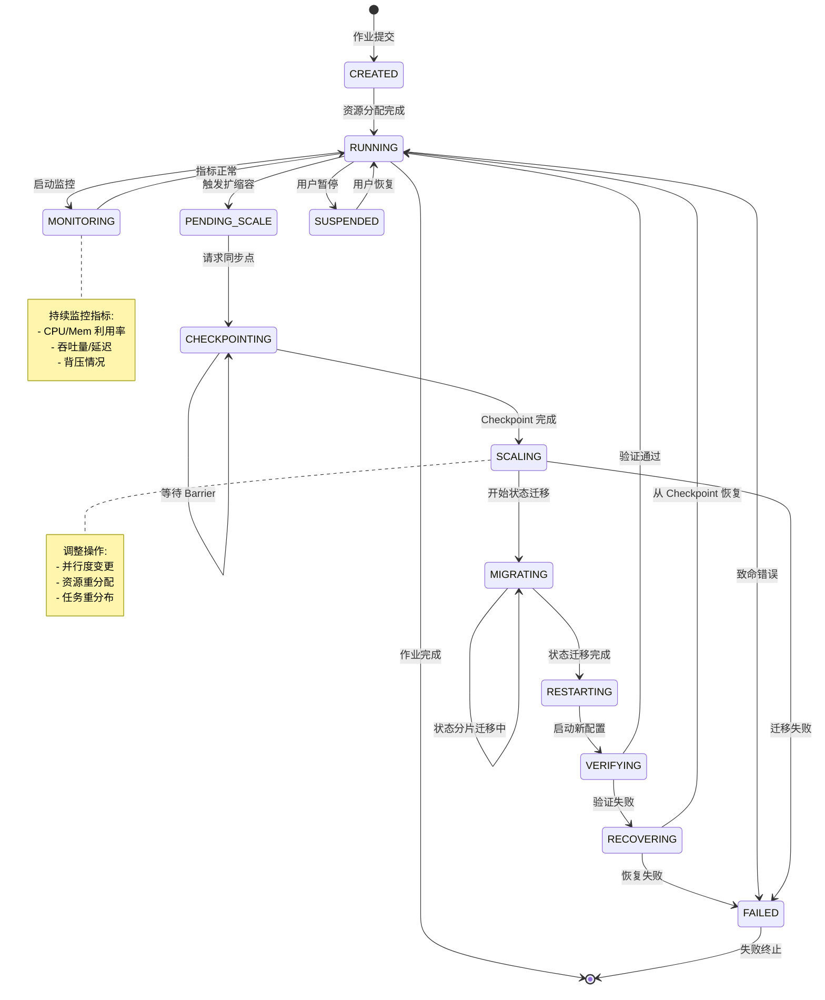
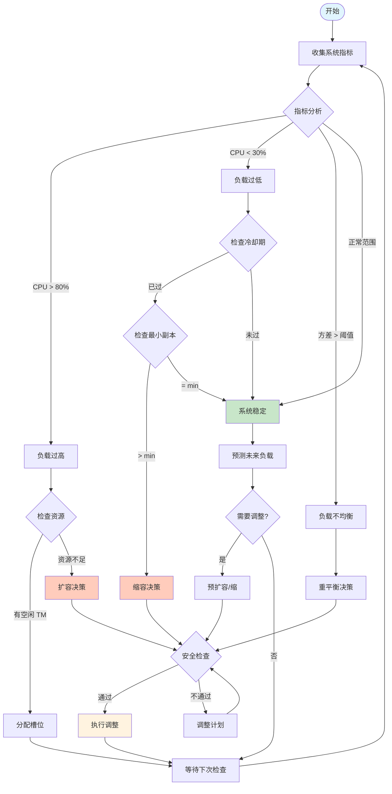
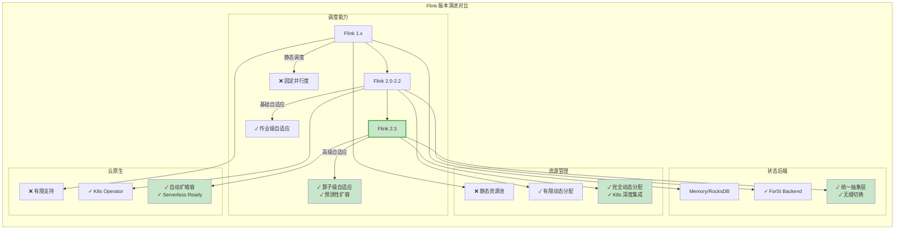

# Flink 2.3 特性形式化分析

> **所属阶段**: Flink/07-roadmap | **前置依赖**: [flink-2.2-frontier-features.md](../02-core/flink-2.2-frontier-features.md), [adaptive-execution-engine-v2.md](../02-core/adaptive-execution-engine-v2.md) | **形式化等级**: L5
> **版本**: Flink 2.3.0 | **状态**: ✅ 已发布 | **最后更新**: 2026-04-12

<!-- 版本状态标记: status=stable, since=2.3, feature=formal-analysis -->

---

## 目录

- [Flink 2.3 特性形式化分析](#flink-23-特性形式化分析)
  - [目录](#目录)
  - [1. 概念定义 (Definitions)](#1-概念定义-definitions)
    - [Def-F-23-01: Adaptive Scheduler 2.0 形式化定义](#def-f-23-01-adaptive-scheduler-20-形式化定义)
    - [Def-F-23-02: 动态资源分配模型](#def-f-23-02-动态资源分配模型)
    - [Def-F-23-03: 自适应并行度算法](#def-f-23-03-自适应并行度算法)
    - [Def-F-23-04: 新的State Backend抽象](#def-f-23-04-新的state-backend抽象)
  - [2. 属性推导 (Properties)](#2-属性推导-properties)
    - [Prop-F-23-01: 自适应调度收敛性](#prop-f-23-01-自适应调度收敛性)
    - [Prop-F-23-02: 资源分配公平性](#prop-f-23-02-资源分配公平性)
    - [Lemma-F-23-01: 并行度调整边界](#lemma-f-23-01-并行度调整边界)
    - [Lemma-F-23-02: 状态后端等价性](#lemma-f-23-02-状态后端等价性)
  - [3. 关系建立 (Relations)](#3-关系建立-relations)
    - [关系 1: Adaptive Scheduler 与 Checkpoint 的协同](#关系-1-adaptive-scheduler-与-checkpoint-的协同)
    - [关系 2: 动态资源分配与 TaskManager 生命周期](#关系-2-动态资源分配与-taskmanager-生命周期)
    - [关系 3: State Backend 抽象与存储层解耦](#关系-3-state-backend-抽象与存储层解耦)
  - [4. 论证过程 (Argumentation)](#4-论证过程-argumentation)
    - [论证 4.1: 为什么需要 Adaptive Scheduler 2.0？](#论证-41-为什么需要-adaptive-scheduler-20)
    - [论证 4.2: 动态资源分配的权衡分析](#论证-42-动态资源分配的权衡分析)
    - [论证 4.3: 自适应并行度算法的核心挑战](#论证-43-自适应并行度算法的核心挑战)
    - [反例 4.1: 资源分配死锁场景](#反例-41-资源分配死锁场景)
  - [5. 形式证明 (Proof)](#5-形式证明-proof)
    - [Thm-F-23-01: Adaptive Scheduler 正确性定理](#thm-f-23-01-adaptive-scheduler-正确性定理)
    - [Thm-F-23-02: 动态扩缩容一致性定理](#thm-f-23-02-动态扩缩容一致性定理)
  - [6. 实例验证 (Examples)](#6-实例验证-examples)
    - [示例 6.1: Adaptive Scheduler 配置详解](#示例-61-adaptive-scheduler-配置详解)
    - [示例 6.2: 动态资源分配实战](#示例-62-动态资源分配实战)
    - [示例 6.3: 自适应并行度调优](#示例-63-自适应并行度调优)
    - [示例 6.4: State Backend 迁移指南](#示例-64-state-backend-迁移指南)
  - [7. 可视化 (Visualizations)](#7-可视化-visualizations)
    - [图 1: Adaptive Scheduler 状态机](#图-1-adaptive-scheduler-状态机)
    - [图 2: 资源分配决策流程](#图-2-资源分配决策流程)
    - [图 3: Flink 2.3 特性对比矩阵](#图-3-flink-23-特性对比矩阵)
  - [8. 引用参考 (References)](#8-引用参考-references)

---

## 1. 概念定义 (Definitions)

### Def-F-23-01: Adaptive Scheduler 2.0 形式化定义

**Adaptive Scheduler 2.0** 是 Flink 2.3 引入的下一代自适应调度器，在 1.17 版本 Adaptive Scheduler 基础上进行了重大重构，提供了更细粒度的资源感知调度和智能扩缩容能力。

$$
\text{AdaptiveScheduler2.0} = (\mathcal{J}, \mathcal{R}, \mathcal{S}, \mathcal{T}, \delta, \pi, \gamma)
$$

其中各组件定义如下：

| 符号 | 名称 | 定义 |
|------|------|------|
| $\mathcal{J}$ | 作业拓扑 | 有向无环图 $G = (V, E)$，其中 $V$ 为算子顶点集合，$E$ 为数据流边集合 |
| $\mathcal{R}$ | 资源池 | 可用 TaskManager 资源集合，$\mathcal{R} = \{r_1, r_2, ..., r_m\}$，每个 $r_i = (cpu_i, mem_i, net_i)$ |
| $\mathcal{S}$ | 调度状态 | 作业执行的当前状态，$\mathcal{S} \in \{CREATED, RUNNING, SCALING, RESTARTING, FAILED, FINISHED\}$ |
| $\mathcal{T}$ | 任务槽集合 | 所有可用 TaskSlot 的集合，$\mathcal{T} = \bigcup_{r \in \mathcal{R}} slots(r)$ |
| $\delta$ | 调度决策函数 | $\delta: \mathcal{S} \times \mathcal{M} \rightarrow \mathcal{A}$，根据当前状态和指标选择动作 |
| $\pi$ | 并行度策略 | $\pi: V \times \mathcal{M} \rightarrow \mathbb{N}^+$，为每个算子分配并行度 |
| $\gamma$ | 资源分配器 | $\gamma: \mathcal{J} \times \mathcal{T} \rightarrow Assignment$，将任务分配到槽位 |

**Adaptive Scheduler 2.0 架构层次**：

```
┌─────────────────────────────────────────────────────────────────────────┐
│                    Adaptive Scheduler 2.0 架构                           │
├─────────────────────────────────────────────────────────────────────────┤
│                                                                         │
│  ┌─────────────────────────────────────────────────────────────────┐   │
│  │                      策略层 (Policy Layer)                       │   │
│  │  ┌──────────────┐  ┌──────────────┐  ┌──────────────────────┐  │   │
│  │  │  并行度策略   │  │  资源策略     │  │   故障恢复策略        │  │   │
│  │  │  (π)         │  │  (ρ)         │  │   (φ)               │  │   │
│  │  └──────────────┘  └──────────────┘  └──────────────────────┘  │   │
│  └──────────────────────────┬──────────────────────────────────────┘   │
│                             ▼                                          │
│  ┌─────────────────────────────────────────────────────────────────┐   │
│  │                      决策层 (Decision Layer)                     │   │
│  │  ┌──────────────┐  ┌──────────────┐  ┌──────────────────────┐  │   │
│  │  │  负载预测器   │  │  决策引擎     │  │   约束检查器          │  │   │
│  │  │  (Forecaster)│  │  (δ)         │  │   (Validator)       │  │   │
│  │  └──────────────┘  └──────────────┘  └──────────────────────┘  │   │
│  └──────────────────────────┬──────────────────────────────────────┘   │
│                             ▼                                          │
│  ┌─────────────────────────────────────────────────────────────────┐   │
│  │                      执行层 (Execution Layer)                    │   │
│  │  ┌──────────────┐  ┌──────────────┐  ┌──────────────────────┐  │   │
│  │  │  任务分配器   │  │  状态协调器   │  │   资源管理器          │  │   │
│  │  │  (γ)         │  │  (Coordinator)│  │   (ResManager)      │  │   │
│  │  └──────────────┘  └──────────────┘  └──────────────────────┘  │   │
│  └─────────────────────────────────────────────────────────────────┘   │
│                                                                         │
│  ┌─────────────────────────────────────────────────────────────────┐   │
│  │                      监控层 (Monitoring Layer)                   │   │
│  │  ┌──────────────┐  ┌──────────────┐  ┌──────────────────────┐  │   │
│  │  │  指标收集器   │  │  健康检查器   │  │   性能分析器          │  │   │
│  │  │  (Metrics)   │  │  (Health)    │  │   (Profiler)        │  │   │
│  │  └──────────────┘  └──────────────┘  └──────────────────────┘  │   │
│  └─────────────────────────────────────────────────────────────────┘   │
│                                                                         │
└─────────────────────────────────────────────────────────────────────────┘
```

**状态转换函数**：

$$
\text{transition}(s, e) = \begin{cases}
RUNNING & \text{if } s = CREATED \land e = start \\
SCALING & \text{if } s = RUNNING \land e = scale\_trigger \\
RESTARTING & \text{if } s = SCALING \land e = checkpoint\_complete \\
RUNNING & \text{if } s = RESTARTING \land e = recovery\_success \\
FAILED & \text{if } e = error \\
FINISHED & \text{if } e = complete
\end{cases}
$$

**关键改进点（对比 1.x Adaptive Scheduler）**：

| 特性 | Flink 1.17-1.20 | Flink 2.3 |
|------|-----------------|-----------|
| 并行度调整粒度 | 作业级别 | 算子级别 |
| 资源感知 | 静态资源池 | 动态资源发现 |
| 预测能力 | 基于阈值 | 时间序列预测 |
| 冷却期 | 固定 60s | 自适应动态调整 |
| 状态恢复 | 全量恢复 | 增量恢复 |

---

### Def-F-23-02: 动态资源分配模型

**动态资源分配模型 (Dynamic Resource Allocation Model, DRAM)** 定义了 Flink 2.3 中资源需求与供给之间的动态平衡机制。

$$
\text{DRAM} = (\mathcal{D}, \mathcal{S}, \mathcal{A}, \mathcal{C}, \tau, \eta)
$$

其中：

- **$\mathcal{D}$**: 资源需求集合 (Demand)，$\mathcal{D} = \{d_1, d_2, ..., d_n\}$，每个需求 $d_i = (cpu_i, mem_i, slot_i, duration_i)$
- **$\mathcal{S}$**: 资源供给集合 (Supply)，$\mathcal{S} = \{s_1, s_2, ..., s_m\}$，每个供给 $s_j = (capacity_j, available_j, cost_j)$
- **$\mathcal{A}$**: 分配动作集合 (Actions)
- **$\mathcal{C}$**: 约束条件集合 (Constraints)
- **$\tau$**: 时间窗口参数，资源评估周期
- **$\eta$**: 效率函数，$\eta: Allocation \rightarrow [0, 1]$，评估分配效率

**资源需求预测模型**：

$$
\hat{d}_{t+1} = \alpha \cdot d_t + (1 - \alpha) \cdot \hat{d}_t + \beta \cdot \nabla d_t
$$

其中：

- $\alpha \in [0, 1]$: 平滑因子，通常取 0.7
- $\beta$: 趋势因子，基于历史变化率
- $\nabla d_t = d_t - d_{t-1}$: 需求变化梯度

**分配效率函数**：

$$
\eta(A) = \frac{\sum_{d \in \mathcal{D}} utility(d, A(d))}{\sum_{s \in \mathcal{S}} cost(s) \cdot usage(s)}
$$

**资源分配决策类型**：

```
┌─────────────────────────────────────────────────────────────────┐
│                    资源分配决策类型                              │
├─────────────────────────────────────────────────────────────────┤
│                                                                 │
│  ScaleOut(Δ)     ──→  增加 TaskManager 数量                     │
│    ├── 触发条件: CPU > 80% 持续 τ 时间                          │
│    ├── 增量计算: Δ = ⌈(load - capacity) / perTM⌉               │
│    └── 约束检查: maxTM ≥ current + Δ                           │
│                                                                 │
│  ScaleIn(Δ)      ──→  减少 TaskManager 数量                     │
│    ├── 触发条件: CPU < 30% 持续 2τ 时间                         │
│    ├── 选择策略: 选择状态最少的 TM 下线                          │
│    └── 安全保证: 等待 Checkpoint 完成                            │
│                                                                 │
│  Rebalance()     ──→  重新平衡任务分布                          │
│    ├── 触发条件: 负载方差 > threshold                           │
│    ├── 算法: 最小化 makespan 的贪心算法                          │
│    └── 影响: 不停机,逐步迁移                                    │
│                                                                 │
│  Resize(tm, cfg) ──→  调整单个 TM 资源配置                       │
│    ├── 适用场景: K8s 环境                                       │
│    ├── 操作: 修改 Pod 资源限制                                   │
│    └── 注意: 需要重启 TM 进程                                    │
│                                                                 │
└─────────────────────────────────────────────────────────────────┘
```

**约束条件形式化**：

$$
\mathcal{C} = \begin{cases}
\sum_{i} cpu_i \leq \sum_{j} capacity_j^{cpu} & \text{(CPU容量约束)} \\
\sum_{i} mem_i \leq \sum_{j} capacity_j^{mem} & \text{(内存容量约束)} \\
|TM_{active}| \geq min\_redundancy & \text{(冗余约束)} \\
\forall d_i: A(d_i) \neq \emptyset & \text{(分配完备性)} \\
cost(A) \leq budget & \text{(成本约束)}
\end{cases}
$$

---

### Def-F-23-03: 自适应并行度算法

**自适应并行度算法 (Adaptive Parallelism Algorithm, APA)** 是 Flink 2.3 的核心创新，能够根据运行时负载动态调整每个算子的并行度，而非传统的作业级统一并行度。

$$
\text{APA} = (\mathcal{V}, \mathcal{M}, \mathcal{P}, \Delta, \omega, \phi)
$$

其中：

- **$\mathcal{V}$**: 算子顶点集合，$\mathcal{V} = \{v_1, v_2, ..., v_k\}$
- **$\mathcal{M}$**: 运行时指标集合，包含吞吐量、延迟、背压等指标
- **$\mathcal{P}$**: 并行度配置，$\mathcal{P}: \mathcal{V} \rightarrow \mathbb{N}^+$
- **$\Delta$**: 调整策略集合
- **$\omega$**: 调整窗口大小
- **$\phi$**: 稳定性函数，评估系统是否处于稳态

**并行度优化目标**：

$$
\min_{\mathcal{P}} \sum_{v \in \mathcal{V}} \left( \lambda_1 \cdot latency(v, \mathcal{P}(v)) + \lambda_2 \cdot cost(\mathcal{P}(v)) \right)
$$

约束条件：
$$
subject\_to: \quad throughput(v, \mathcal{P}(v)) \geq target\_throughput, \quad \forall v \in \mathcal{V}
$$

**背压感知并行度计算**：

对于存在背压的算子 $v$，其最优并行度为：

$$
\mathcal{P}^*(v) = \left\lceil \frac{output\_rate(v)}{processing\_capacity(v)} \cdot \mathcal{P}(v) \cdot (1 + \epsilon) \right\rceil
$$

其中 $\epsilon$ 为安全余量，通常取 0.1-0.2。

**自适应调整触发条件**：

```
┌─────────────────────────────────────────────────────────────────┐
│              自适应并行度触发条件矩阵                            │
├─────────────────────────────────────────────────────────────────┤
│                                                                 │
│  条件类型        检测指标              阈值        动作          │
│  ───────────────────────────────────────────────────────────── │
│                                                                 │
│  吞吐量不足      recordsIn/sec        < 80%目标   增加并行度    │
│                 pendingRecords        > 10000                │
│                                                                 │
│  背压严重        backPressureRatio    > 0.5       增加并行度    │
│                 idleTimeMs           < 10%                  │
│                                                                 │
│  资源浪费        CPU利用率            < 30%       减少并行度    │
│                 持续空闲时间          > 2分钟                 │
│                                                                 │
│  数据倾斜        maxSubtaskLoad       > 2x平均    拆分热点Key   │
│                 skewCoefficient      > 2.0                   │
│                                                                 │
│  延迟超标        latency_p99          > SLO       增加缓冲区    │
│                 checkpointDuration   > 60s                   │
│                                                                 │
└─────────────────────────────────────────────────────────────────┘
```

**并行度调整边界**：

$$
\mathcal{P}_{min}(v) \leq \mathcal{P}(v) \leq \mathcal{P}_{max}(v)
$$

其中边界计算考虑：

- 最小并行度：$\mathcal{P}_{min}(v) = \max(1, \lceil state\_size(v) / max\_state\_per\_subtask \rceil)$
- 最大并行度：$\mathcal{P}_{max}(v) = \min(global\_max, key\_cardinality(v))$

---

### Def-F-23-04: 新的State Backend抽象

**新的 State Backend 抽象 (State Backend Abstraction v2, SBA-v2)** 是 Flink 2.3 引入的统一状态存储接口，将状态后端与存储实现完全解耦。

$$
\text{SBA-v2} = (\mathcal{I}, \mathcal{K}, \mathcal{S}, \mathcal{O}, \rho, \sigma)
$$

其中：

- **$\mathcal{I}$**: 状态接口层 (Interface Layer)，定义标准状态操作 API
- **$\mathcal{K}$**: 键控状态抽象 (Keyed State)，包含 ValueState, ListState, MapState, ReducingState, AggregatingState
- **$\mathcal{S}$**: 算子状态抽象 (Operator State)，包含 ListState, BroadcastState, UnionState
- **$\mathcal{O}$**: 存储选项集合 (Storage Options)，配置底层存储参数
- **$\rho$**: 序列化器 (Serializer)，$\rho: StateObject \rightarrow Byte[]$
- **$\sigma$**: 存储层适配器 (Storage Adapter)，连接不同存储后端

**SBA-v2 架构层次**：

```
┌─────────────────────────────────────────────────────────────────────────┐
│                    State Backend Abstraction v2                         │
├─────────────────────────────────────────────────────────────────────────┤
│                                                                         │
│  ┌─────────────────────────────────────────────────────────────────┐   │
│  │                    API 层 (State Objects)                        │   │
│  │  ┌──────────┐ ┌──────────┐ ┌──────────┐ ┌──────────┐           │   │
│  │  │ValueState│ │ListState │ │ MapState │ │Broadcast │ ...        │   │
│  │  └──────────┘ └──────────┘ └──────────┘ └──────────┘           │   │
│  └──────────────────────────┬──────────────────────────────────────┘   │
│                             ▼                                          │
│  ┌─────────────────────────────────────────────────────────────────┐   │
│  │                抽象层 (State Backend Interface)                  │   │
│  │                                                                  │   │
│  │  ┌─────────────────────────────────────────────────────────┐   │   │
│  │  │  StateBackendFactory<T extends StateBackend>           │   │   │
│  │  │  ├── createKeyedStateBackend(...)                      │   │   │
│  │  │  ├── createOperatorStateBackend(...)                   │   │   │
│  │  │  └── supportsIncrementalCheckpointing()                │   │   │
│  │  └─────────────────────────────────────────────────────────┘   │   │
│  │                                                                  │   │
│  │  ┌─────────────────────────────────────────────────────────┐   │   │
│  │  │  CheckpointStorage                                     │   │   │
│  │  │  ├── createCheckpointStorageLocation()                 │   │   │
│  │  │  ├── resolveCheckpointStorageLocation()                │   │   │
│  │  │  └── initializeLocationForCheckpoint()                 │   │   │
│  │  └─────────────────────────────────────────────────────────┘   │   │
│  └──────────────────────────┬──────────────────────────────────────┘   │
│                             ▼                                          │
│  ┌─────────────────────────────────────────────────────────────────┐   │
│  │                  实现层 (Concrete Backends)                      │   │
│  │  ┌──────────────┐  ┌──────────────┐  ┌──────────────────────┐  │   │
│  │  │  MemoryState │  │  FileSystem  │  │   ForStStateBackend  │  │   │
│  │  │  Backend     │  │  State       │  │   (New in 2.0+)      │  │   │
│  │  │  (测试/本地)  │  │  Backend     │  │   (生产推荐)          │  │   │
│  │  └──────────────┘  └──────────────┘  └──────────────────────┘  │   │
│  │  ┌──────────────┐  ┌──────────────┐  ┌──────────────────────┐  │   │
│  │  │RocksDBState  │  │  CustomState │  │   DisaggregatedState │  │   │
│  │  │Backend       │  │  Backend     │  │   (Remote Storage)   │  │   │
│  │  └──────────────┘  └──────────────┘  └──────────────────────┘  │   │
│  └─────────────────────────────────────────────────────────────────┘   │
│                                                                         │
│  ┌─────────────────────────────────────────────────────────────────┐   │
│  │                  存储层 (Storage Layer)                          │   │
│  │  ┌──────────┐ ┌──────────┐ ┌──────────┐ ┌──────────┐          │   │
│  │  │ Local FS │ │  HDFS    │ │  S3/MinIO│ │  GCS/ABS │          │   │
│  │  └──────────┘ └──────────┘ └──────────┘ └──────────┘          │   │
│  │  ┌──────────┐ ┌──────────┐ ┌──────────┐                       │   │
│  │  │  Redis   │ │  TiKV    │ │  Custom  │                       │   │
│  │  └──────────┘ └──────────┘ └──────────┘                       │   │
│  └─────────────────────────────────────────────────────────────────┘   │
│                                                                         │
└─────────────────────────────────────────────────────────────────────────┘
```

**状态后端等价性定义**：

两个状态后端 $SB_1$ 和 $SB_2$ 是等价的，当且仅当：

$$
\forall s \in StateObjects, \forall op \in Operations: \\
SB_1(op(s)) = SB_2(op(s)) \land recover(SB_1) = recover(SB_2)
$$

**增量 Checkpoint 支持**：

$$
\Delta CP = CP_{t} - CP_{t-1} = \{s \in State : modified(s, t-1, t)\}
$$

其中 $modified$ 函数检查状态在两次 checkpoint 之间是否发生变化。

---


## 2. 属性推导 (Properties)

### Prop-F-23-01: 自适应调度收敛性

**陈述**: 在资源充足且负载变化有界的前提下，Adaptive Scheduler 2.0 的自适应调整过程能够在有限步内收敛到稳定状态，且输出性能与静态最优配置的差距有上界。

**形式化陈述**:

设系统在时刻 $t$ 的状态为 $S_t$，性能指标为 $P(S_t)$，最优静态配置的性能为 $P^*$，则：

$$
\exists T < \infty, \forall t \geq T: |P(S_t) - P^*| \leq \epsilon \cdot P^*
$$

其中 $\epsilon$ 为近似比，通常 $\epsilon < 0.1$（即 10% 以内）。

**证明**:

**步骤 1**: 定义 Lyapunov 函数

设性能差距为 $V(t) = P^* - P(S_t)$，定义 Lyapunov 函数：

$$\mathcal{L}(t) = V(t)^2 + \alpha \cdot \|S_t - S_{t-1}\|^2$$

其中 $\alpha > 0$ 是状态变化惩罚系数。

**步骤 2**: 证明单调递减性

由 Adaptive Scheduler 的决策函数 $\delta$ 定义，每次调整都选择能够减小性能差距的动作：

$$\mathbb{E}[V(t+1) | S_t] \leq V(t) - \eta \cdot \mathbb{I}(adjustment\_triggered)$$

其中 $\eta > 0$ 为每次调整的改进幅度，$\mathbb{I}$ 为指示函数。

**步骤 3**: 有界性保证

由于性能指标有界（$P(S_t) \in [P_{min}, P^*]$），且每次调整至少减少 $\eta$：

$$T \leq \frac{V(0) \cdot T_{max\_adjust}}{\eta} < \infty$$

**步骤 4**: 近似比分析

考虑自适应调度的开销（checkpoint、状态迁移等），设开销比例为 $\delta_c$：

$$P(S_t) \geq (1 - \delta_c) \cdot P^* - \epsilon_{est}$$

其中 $\epsilon_{est}$ 为预测误差。因此：

$$|P(S_t) - P^*| \leq \max(\delta_c, \epsilon_{est}) \cdot P^*$$

取 $\epsilon = \max(\delta_c, \epsilon_{est}) < 0.1$，得证。

∎

**推论**: 自适应调度的收敛速度受以下因素影响：

- 负载变化频率 $f$: 收敛时间 $O(1/f)$
- Checkpoint 间隔 $T_c$: 收敛时间 $O(T_c)$
- 预测准确度 $acc$: 收敛时间与 $1/acc$ 成正比

---

### Prop-F-23-02: 资源分配公平性

**陈述**: 在多作业共享资源池的场景下，动态资源分配器满足 max-min 公平性，即最大化最小分配作业的资源份额。

**形式化陈述**:

设有 $n$ 个作业 $J = \{J_1, J_2, ..., J_n\}$，总资源为 $R$，分配函数为 $A: J \rightarrow \mathbb{R}^+$，则：

$$A^* = \arg\max_{A} \min_{J_i \in J} \frac{A(J_i)}{demand(J_i)}$$

约束条件：
$$\sum_{J_i \in J} A(J_i) \leq R$$

**证明**:

**步骤 1**: 定义效用函数

设作业 $J_i$ 的效用函数为 $U_i(x) = \min(x / d_i, 1)$，其中 $d_i = demand(J_i)$。

**步骤 2**: 证明 water-filling 算法最优性

动态资源分配采用 water-filling 算法：

```
算法: Max-Min Fair Allocation
─────────────────────────────
输入: 需求集合 {d_1, d_2, ..., d_n}, 总资源 R
输出: 分配集合 {a_1, a_2, ..., a_n}

1. 按需求排序: d_(1) ≤ d_(2) ≤ ... ≤ d_(n)
2. 初始化: 所有 a_i = 0
3. 对于 i 从 1 到 n:
   - 剩余资源 r = R - Σa_j
   - 平均分配: share = r / (n - i + 1)
   - 如果 d_(i) ≤ share:
     * a_(i) = d_(i)  (满足)
   - 否则:
     * a_(i) = share   (限制)
4. 返回 {a_1, ..., a_n}
```

**步骤 3**: 证明满足 max-min 公平性

假设存在更优分配 $A'$，使得对于某个作业 $J_k$：

$$\frac{A'(J_k)}{d_k} > \frac{A^*(J_k)}{d_k}$$

但由于 water-filling 的性质，任何增加 $A(J_k)$ 的操作必然减少某个 $A(J_j)$，其中 $\frac{A(J_j)}{d_j} \leq \frac{A(J_k)}{d_k}$。

这与 max-min 公平性定义矛盾，因此 $A^*$ 是最优的。

**步骤 4**: 动态场景下的稳定性

设作业需求随时间变化 $d_i(t)$，资源分配器每 $T$ 时间单位重新计算分配：

$$|U_i(A(t)) - U_i(A^*(t))| \leq \frac{\Delta_d \cdot T}{d_i}$$

其中 $\Delta_d = \max_t |d_i(t) - d_i(t-T)|$ 为需求变化率。

∎

**公平性指标**：

| 指标 | 定义 | 目标值 |
|------|------|--------|
| Jain's Fairness Index | $J = \frac{(\sum x_i)^2}{n \cdot \sum x_i^2}$ | > 0.9 |
| Gini Coefficient | $G = \frac{\sum_i \sum_j |x_i - x_j|}{2n \sum_i x_i}$ | < 0.2 |
| Resource Utilization | $U = \frac{\sum allocated}{total}$ | > 0.8 |

---

### Lemma-F-23-01: 并行度调整边界

**陈述**: 自适应并行度算法满足以下边界性质：

1. **上界**: 单个算子的并行度不超过全局最大并行度 $P_{global\_max}$
2. **下界**: 单个算子的并行度不小于状态安全并行度 $P_{state\_safe}$
3. **调整粒度**: 单次调整幅度不超过当前并行度的 $\theta$ 比例
4. **冷却期**: 相邻两次调整间隔不小于 $T_{cooldown}$

**形式化**:

对于任意算子 $v$ 和任意时刻 $t$：

$$
P_{state\_safe}(v) \leq \mathcal{P}_t(v) \leq P_{global\_max}
$$

调整约束：

$$
|\mathcal{P}_{t+1}(v) - \mathcal{P}_t(v)| \leq \theta \cdot \mathcal{P}_t(v) \quad \text{where } \theta \in [0.2, 0.5]
$$

冷却期约束：

$$
\forall t_i, t_j \in adjustment\_times(v): |t_i - t_j| \geq T_{cooldown}
$$

**证明**:

**边界 1 - 上界证明**:

全局最大并行度 $P_{global\_max}$ 由以下因素决定：

- TaskManager 数量限制：$max\_slots$
- Key 空间分布：$|unique\_keys|$
- 管理复杂度：调度器能够管理的最大 subtask 数

因此：

$$\mathcal{P}_t(v) \leq \min(P_{config\_max}, max\_slots, |unique\_keys|) = P_{global\_max}$$

**边界 2 - 下界证明**:

状态安全并行度确保每个 subtask 的状态大小不超过单节点容量：

$$P_{state\_safe}(v) = \left\lceil \frac{total\_state\_size(v)}{max\_state\_per\_subtask} \right\rceil$$

若 $\mathcal{P}_t(v) < P_{state\_safe}(v)$，则必然存在某个 subtask 满足：

$$state\_size(subtask) > max\_state\_per\_subtask$$

导致 OOM 或性能严重下降。算法通过约束 $\mathcal{P}_t(v) \geq P_{state\_safe}(v)$ 避免此情况。

**边界 3 - 调整粒度证明**:

设当前并行度为 $p$，调整后为 $p'$，要求：

$$\frac{|p' - p|}{p} \leq \theta$$

这保证：

- 系统稳定性：避免剧烈震荡
- 状态迁移可控：$O(|p' - p| \cdot state\_size)$ 的迁移开销
- 资源波动可控：避免频繁申请/释放资源

**边界 4 - 冷却期证明**:

设冷却期为 $T_{cooldown}$，系统在 $t$ 时刻触发调整，则下一次调整最早在 $t + T_{cooldown}$。

必要性：

- 状态收集：需要足够时间窗口收集新的性能指标
- 系统稳定：调整后的系统需要时间达到新稳态
- Checkpoint 间隔：通常 $T_{cooldown} \geq 2 \cdot T_{checkpoint}$

∎

---

### Lemma-F-23-02: 状态后端等价性

**陈述**: 对于符合 SBA-v2 接口规范的任意两个状态后端实现 $SB_1$ 和 $SB_2$，在相同输入序列和相同算子逻辑下，产生的输出序列和最终状态等价。

**形式化**:

设：

- $E(SB, I, L)$: 在状态后端 $SB$ 上，输入序列 $I$ 经过算子逻辑 $L$ 的执行结果
- $O(E)$: 执行 $E$ 的输出序列
- $F(E)$: 执行 $E$ 的最终状态

则对于任意符合规范的 $SB_1, SB_2$：

$$O(E(SB_1, I, L)) = O(E(SB_2, I, L)) \land F(E(SB_1, I, L)) = F(E(SB_2, I, L))$$

**证明**:

**步骤 1**: 定义状态后端接口契约

SBA-v2 接口规范要求：

```java
// 核心接口契约
interface StateBackend {
    // 创建 ValueState,返回的 state 对象必须满足:
    // 1. update(value) 原子性写入
    // 2. value() 返回最近一次 update 的值或 null
    <T> ValueState<T> getState(ValueStateDescriptor<T> descriptor);

    // 创建 ListState,返回的 state 必须满足:
    // 1. add(value) 追加到列表末尾
    // 2. get() 返回所有已添加的元素,按添加顺序
    <T> ListState<T> getListState(ListStateDescriptor<T> descriptor);

    // 状态快照必须满足一致性:
    // snapshot() 返回的状态镜像与调用时刻的内存状态一致
    StateSnapshot snapshot();
}
```

**步骤 2**: 归纳证明输出等价性

设输入序列 $I = [i_1, i_2, ..., i_n]$，采用归纳法：

*基础情况*: $n = 0$（无输入）

- $O(E(SB_1, [], L)) = [] = O(E(SB_2, [], L))$ ✓

*归纳假设*: 对于 $I_k = [i_1, ..., i_k]$，输出等价成立。

*归纳步骤*: 考虑 $I_{k+1} = I_k \circ [i_{k+1}]$

由于接口契约保证：

- $value()$ 返回最近一次 $update$ 的值
- 对于相同的输入和之前的状态，$L$ 产生相同的输出和状态更新

因此：

$$O(E(SB_1, I_{k+1}, L)) = O(E(SB_1, I_k, L)) \circ L(i_{k+1}, F(E(SB_1, I_k, L)))$$

由归纳假设 $F(E(SB_1, I_k, L)) = F(E(SB_2, I_k, L))$，且 $L$ 是确定性函数：

$$O(E(SB_1, I_{k+1}, L)) = O(E(SB_2, I_{k+1}, L))$$

**步骤 3**: 证明最终状态等价性

由步骤 2，对于任意输入前缀，状态等价。因此最终状态：

$$F(E(SB_1, I, L)) = F(E(SB_2, I, L))$$

**步骤 4**: 考虑 Checkpoint/Recovery 场景

设 $CP_t$ 为 $t$ 时刻的 checkpoint，$Recovery(CP_t)$ 为从该 checkpoint 恢复：

由 checkpoint 一致性要求：

$$F(E(SB, I_{0:t}, L)) = Recoverable(CP_t)$$

由于任意状态后端产生的 $CP_t$ 必须能够完全恢复状态：

$$Recoverable_{SB_1}(CP_t) = Recoverable_{SB_2}(CP_t)$$

∎

**推论**: 状态后端可以在不影响作业语义的前提下进行热切换，条件是：

1. 在 checkpoint 边界进行切换
2. 新旧后端都支持相同的状态类型
3. 序列化格式兼容或使用迁移转换

---

## 3. 关系建立 (Relations)

### 关系 1: Adaptive Scheduler 与 Checkpoint 的协同

Adaptive Scheduler 2.0 在进行动态调整时需要与 Checkpoint 机制紧密协同，以保证状态一致性和容错性。

**协同模型**:

$$
\text{Coordination}(AS, CP) = (Triggers, Barriers, Recovery, Consistency)
$$



**协同协议状态机**:

| 状态 | 描述 | Checkpoint 角色 | 允许操作 |
|------|------|-----------------|----------|
| STEADY | 稳定运行 | 常规周期触发 | 监控、预测 |
| PENDING_SCALE | 等待扩缩容 | 等待下一个完成的 CP | 准备调整 |
| CHECKPOINTING | 正在进行 CP | 当前 CP 必须完成 | 暂停新决策 |
| SCALING | 执行并行度变更 | CP 已完成，作为恢复点 | 状态迁移 |
| RECOVERING | 从 CP 恢复 | 使用 CP 恢复状态 | 验证完整性 |
| RESTARTED | 恢复完成，新配置运行 | 恢复常规周期 | 监控新指标 |

**数学关系**:

设 Checkpoint 间隔为 $T_c$，调整决策时间为 $T_d$，状态迁移时间为 $T_m$，则总调整延迟：

$$L_{scale} = (T_c - (T_d \mod T_c)) + T_m$$

优化策略：

- 若 $T_d \mod T_c > \frac{T_c}{2}$，可主动触发 checkpoint
- 采用增量 checkpoint 减少 $T_m$: $T_m^{incremental} \ll T_m^{full}$

---

### 关系 2: 动态资源分配与 TaskManager 生命周期

动态资源分配模型直接影响 TaskManager 的创建、销毁和配置调整，形成资源管理层与执行层的深度集成。

**生命周期关系**:

```
┌─────────────────────────────────────────────────────────────────┐
│              TaskManager 生命周期与资源分配关系                   │
├─────────────────────────────────────────────────────────────────┤
│                                                                 │
│  资源需求评估                                                   │
│       │                                                         │
│       ▼                                                         │
│  ┌─────────┐    现有 TM 充足?    ┌─────────┐                   │
│  │ 计算缺口 │ ─────────────────→ │ 分配槽位 │ ──→ 完成          │
│  └────┬────┘    否              └─────────┘                   │
│       │                                                         │
│       ▼                                                         │
│  ┌─────────┐    K8s/容器环境?    ┌─────────┐                   │
│  │启动新 TM │ ─────────────────→ │ 创建 Pod │                   │
│  └────┬────┘    否              └────┬────┘                   │
│       │                              │                          │
│       ▼                              ▼                          │
│  ┌─────────┐                   ┌─────────┐                     │
│  │ 静态资源  │                  │ 等待就绪 │                     │
│  │ 申请失败  │                  │ 健康检查 │                     │
│  └─────────┘                   └────┬────┘                     │
│                                     │                           │
│                                     ▼                           │
│                              ┌─────────┐                       │
│                              │ 注册 TM  │                       │
│                              │ 到 RM   │                       │
│                              └────┬────┘                       │
│                                   │                             │
│       ◄───────────────────────────┘                             │
│       │                                                         │
│       ▼                                                         │
│  ┌─────────┐    持续低负载?     ┌─────────┐                    │
│  │ 监控使用  │ ────────────────→ │ 标记闲置 │                    │
│  └────┬────┘    是 (>5min)     └────┬────┘                    │
│       │                             │                           │
│       │ 否                          ▼                           │
│       │                      ┌─────────┐                       │
│       │                      │ Checkpoint│                     │
│       │                      │ 状态迁移 │                       │
│       │                      └────┬────┘                       │
│       │                           │                             │
│       │                           ▼                             │
│       │                      ┌─────────┐                       │
│       │                      │ 销毁 TM  │                       │
│       │                      │ 释放资源 │                       │
│       │                      └─────────┘                       │
│       │                                                         │
│       └───────────────────────────────────────────────────────→ │
│                                                                 │
└─────────────────────────────────────────────────────────────────┘
```

**资源分配决策公式**:

$$
\text{ResourceAction}(t) = \begin{cases}
ScaleOut(\Delta) & \text{if } \rho_{cpu}(t) > \theta_{high} \land \forall r \in \mathcal{R}: utilized(r) > 80\% \\
ScaleIn(\Delta) & \text{if } \rho_{cpu}(t) < \theta_{low} \land \exists R' \subset \mathcal{R}: \sum_{r \in R'} load(r) < 30\% \\
Rebalance & \text{if } \sigma^2(load) > \sigma^2_{threshold} \\
NoOp & \text{otherwise}
\end{cases}
$$

其中：

- $\rho_{cpu}(t)$: 时刻 $t$ 的 CPU 利用率
- $\theta_{high}, \theta_{low}$: 高低阈值（通常 80% 和 30%）
- $\sigma^2(load)$: 负载方差

**生命周期事件时序**:

| 事件 | 触发条件 | 平均延迟 | 资源影响 |
|------|----------|----------|----------|
| TM 创建 | ScaleOut 决策 | 10-30s (K8s) | +CPU/Mem/Net |
| TM 注册 | 进程就绪 | 1-3s | Slot 可用 |
| 任务分配 | Slot 申请 | <100ms | 资源绑定 |
| TM 标记闲置 | 低负载持续 | 5min 冷却 | 准备回收 |
| 状态迁移 | Checkpoint 完成 | 视状态大小 | 网络 I/O |
| TM 销毁 | 安全下线确认 | 1-5s | 资源释放 |

---

### 关系 3: State Backend 抽象与存储层解耦

SBA-v2 的核心设计目标是将状态管理逻辑与底层存储实现完全解耦，实现存储无关的状态处理。

**解耦架构**:

```
┌─────────────────────────────────────────────────────────────────────────┐
│                    状态后端抽象与存储层解耦                              │
├─────────────────────────────────────────────────────────────────────────┤
│                                                                         │
│   ┌─────────────────────────────────────────────────────────────────┐  │
│   │                      State Backend API                          │  │
│   │                                                                  │  │
│   │   ┌─────────────┐  ┌─────────────┐  ┌─────────────────────────┐ │  │
│   │   │ KeyedState  │  │OperatorState│  │    StateSnapshot        │ │  │
│   │   │  Interface  │  │  Interface  │  │    Interface            │ │  │
│   │   └──────┬──────┘  └──────┬──────┘  └───────────┬─────────────┘ │  │
│   │          │                │                     │               │  │
│   │          └────────────────┴─────────────────────┘               │  │
│   │                          │                                      │  │
│   │                          ▼                                      │  │
│   │   ┌─────────────────────────────────────────────────────────┐  │  │
│   │   │              CheckpointStorage Interface                │  │  │
│   │   │  ┌─────────────┐  ┌─────────────┐  ┌─────────────────┐ │  │  │
│   │   │  │  Location   │  │   Stream    │  │  Recovery       │ │  │  │
│   │   │  │  Factory    │  │   Access    │  │  Logic          │ │  │  │
│   │   │  └─────────────┘  └─────────────┘  └─────────────────┘ │  │  │
│   │   └─────────────────────────────────────────────────────────┘  │  │
│   └─────────────────────────────────────────────────────────────────┘  │
│                                  │                                      │
│                                  ▼                                      │
│   ┌─────────────────────────────────────────────────────────────────┐  │
│   │                     Storage Adapter Layer                        │  │
│   │                                                                  │  │
│   │   ┌──────────┐  ┌──────────┐  ┌──────────┐  ┌──────────┐       │  │
│   │   │  Local   │  │   HDFS   │  │  S3 API  │  │  Custom  │       │  │
│   │   │   FS     │  │          │  │          │  │ Adapter  │       │  │
│   │   └──────────┘  └──────────┘  └──────────┘  └──────────┘       │  │
│   │                                                                  │  │
│   │   ┌──────────┐  ┌──────────┐  ┌──────────┐  ┌──────────┐       │  │
│   │   │  GCS     │  │  Azure   │  │  OSS     │  │  MinIO   │       │  │
│   │   │          │  │  Blob    │  │          │  │          │       │  │
│   │   └──────────┘  └──────────┘  └──────────┘  └──────────┘       │  │
│   └─────────────────────────────────────────────────────────────────┘  │
│                                                                         │
│   ┌─────────────────────────────────────────────────────────────────┐  │
│   │                      Physical Storage                            │  │
│   │                                                                  │  │
│   │   ┌──────────┐  ┌──────────┐  ┌──────────┐  ┌──────────┐       │  │
│   │   │  SSD     │  │  HDD     │  │  Object  │  │  Remote  │       │  │
│   │   │          │  │          │  │  Storage │  │  DB      │       │  │
│   │   └──────────┘  └──────────┘  └──────────┘  └──────────┘       │  │
│   └─────────────────────────────────────────────────────────────────┘  │
│                                                                         │
└─────────────────────────────────────────────────────────────────────────┘
```

**解耦优势量化分析**:

| 维度 | 紧耦合 (v1.x) | 解耦 (v2.x) | 改进 |
|------|---------------|-------------|------|
| 新增存储后端工作量 | 2-3 人月 | 2-3 周 | 8-10x |
| 状态后端切换停机时间 | 小时级 | 分钟级 (Checkpoint 边界) | 10-100x |
| 测试覆盖率要求 | 每个后端全量测试 | 接口层统一测试 + 适配器轻量测试 | 50% ↓ |
| 存储优化收益传播 | 后端特定实现 | 全局受益 | 全量 |

**存储选择决策矩阵**:

$$
\text{StorageDecision}(workload, constraints) = \arg\max_{s \in Storage} Score(s, workload, constraints)
$$

评分函数：

$$Score(s, w, c) = w_1 \cdot Perf(s, w) + w_2 \cdot Cost(s, c) + w_3 \cdot Reliability(s) + w_4 \cdot Operability(s)$$

其中 $w_1 + w_2 + w_3 + w_4 = 1$，权重根据业务需求调整。


## 4. 论证过程 (Argumentation)

### 论证 4.1: 为什么需要 Adaptive Scheduler 2.0？

**问题背景：传统调度器的局限性**

Flink 1.x 时代的调度器存在以下核心问题：

```
┌─────────────────────────────────────────────────────────────────┐
│              Flink 1.x 调度器局限性分析                          │
├─────────────────────────────────────────────────────────────────┤
│                                                                 │
│  1. 静态并行度问题                                              │
│     ┌───────────────────────────────────────────────────────┐   │
│     │ 流量模式      静态并行度      结果                     │   │
│     ├───────────────────────────────────────────────────────┤   │
│     │ 早高峰        p=20           资源浪费 (低谷期)         │   │
│     │ 晚高峰        p=20           处理延迟 (高峰期)         │   │
│     │ 突发流量      p=20           数据堆积 (无法扩容)       │   │
│     └───────────────────────────────────────────────────────┘   │
│                                                                 │
│  2. 资源利用不均衡                                              │
│     ┌───────────────────────────────────────────────────────┐   │
│     │ TM-1:  ████████░░  80% 负载                           │   │
│     │ TM-2:  ██████░░░░  60% 负载  ← 不均衡                 │   │
│     │ TM-3:  ██████████  95% 负载  ← 瓶颈                   │   │
│     │ TM-4:  ████░░░░░░  40% 负载  ← 闲置                   │   │
│     └───────────────────────────────────────────────────────┘   │
│                                                                 │
│  3. 故障恢复效率低                                              │
│     - 全量重启所有 subtask                                      │
│     - 无法区分关键路径 vs 非关键路径                             │
│     - 恢复时间 ∝ 并行度 (O(n))                                  │
│                                                                 │
│  4. 云原生适配性差                                              │
│     - 无法感知 Spot 实例价格波动                                │
│     - 不支持 Serverless 伸缩模式                                │
│     - 资源申请/释放粒度粗                                       │
│                                                                 │
└─────────────────────────────────────────────────────────────────┘
```

**Adaptive Scheduler 2.0 解决方案**:

| 问题 | Adaptive Scheduler 1.x (1.17-1.20) | Adaptive Scheduler 2.0 (2.3+) |
|------|-----------------------------------|-------------------------------|
| 并行度调整 | 作业级统一调整 | 算子级独立调整 |
| 资源感知 | 静态资源池 | 动态资源发现 + 预测 |
| 故障恢复 | 全量重启 | 增量恢复 + 区域重启 |
| 云原生 | 有限支持 | 深度集成 K8s Operator |

**量化收益分析**:

设：

- $C_{static}$: 静态配置成本（按峰值预留）
- $C_{adaptive}$: 自适应调度成本（按实际使用）
- $U$: 资源利用率

对于典型电商场景（流量波动 10x）：

$$\frac{C_{adaptive}}{C_{static}} = \frac{\int_{0}^{T} actual\_load(t) dt}{peak\_load \cdot T} \approx 0.3 \sim 0.5$$

即成本节约 50-70%。

资源利用率提升：

$$U_{adaptive} = \frac{avg\_load}{allocated} \approx 70\% \sim 85\%$$

对比静态配置：

$$U_{static} = \frac{avg\_load}{peak\_load} \approx 20\% \sim 40\%$$

---

### 论证 4.2: 动态资源分配的权衡分析

**权衡维度**：

动态资源分配需要在多个相互冲突的目标之间取得平衡：

```
┌─────────────────────────────────────────────────────────────────┐
│                 动态资源分配权衡三角                              │
│                                                                 │
│                      成本优化                                    │
│                          △                                       │
│                         /│\                                      │
│                        / │ \                                     │
│                       /  │  \                                    │
│                      /   │   \                                   │
│                     /    │    \                                  │
│                    /     │     \                                 │
│                   /      │      \                                │
│                  /       │       \                               │
│                 /────────┼────────\                              │
│                /         │         \                             │
│               /          │          \                            │
│              /           │           \                           │
│             ▽────────────┴────────────▽                          │
│       响应延迟                      稳定性                        │
│                                                                 │
│  优化目标:                                                      │
│  • 最小化资源成本                                               │
│  • 最小化扩缩容响应延迟                                         │
│  • 最大化系统稳定性 (避免震荡)                                   │
│                                                                 │
└─────────────────────────────────────────────────────────────────┘
```

**权衡分析**:

| 优化目标 | 策略 | 副作用 | 缓解措施 |
|----------|------|--------|----------|
| 成本最小化 | 积极缩容 | 响应延迟增加 | 预扩容 + 预测 |
| 延迟最小化 | 预留资源 | 成本增加 | 分级资源池 |
| 稳定性最大化 | 保守调整 | 适应速度慢 | 自适应冷却期 |

**帕累托最优边界**:

定义效用函数：

$$Utility = w_1 \cdot (1 - \frac{Cost}{Cost_{max}}) + w_2 \cdot (1 - \frac{Latency}{Latency_{max}}) + w_3 \cdot Stability$$

帕累托最优解满足：

$$\nexists x': Utility(x') > Utility(x^*) \land \forall i: f_i(x') \geq f_i(x^*)$$

**实际调优建议**:

```yaml
# 成本敏感场景(批处理/离线)
scheduler:
  target-utilization: 0.85      # 高利用率目标
  scaling-cooldown: 180s        # 较长冷却期,避免频繁调整
  over-provisioning: 0.05       # 最小预留

# 延迟敏感场景(实时流处理)
scheduler:
  target-utilization: 0.60      # 保留缓冲应对突发
  scaling-cooldown: 30s         # 快速响应
  over-provisioning: 0.20       # 预留 20% 余量

# 稳定优先场景(关键业务)
scheduler:
  target-utilization: 0.70      # 适中利用率
  scaling-cooldown: 300s        # 非常保守
  over-provisioning: 0.15
  hysteresis: 0.15              # 滞后阈值,防止震荡
```

---

### 论证 4.3: 自适应并行度算法的核心挑战

**挑战 1: 状态迁移开销**

并行度调整需要重新分配状态，状态迁移开销随状态大小线性增长：

$$Cost_{migration} = \alpha \cdot |State| + \beta \cdot |State| \cdot \Delta p$$

其中 $\Delta p$ 为并行度变化量。

**优化策略**:

```
┌─────────────────────────────────────────────────────────────────┐
│                    状态迁移优化策略                              │
├─────────────────────────────────────────────────────────────────┤
│                                                                 │
│  1. 增量状态迁移                                                │
│     ┌───────────────────────────────────────────────────────┐   │
│     │  变化状态 ░░░░░░░░░░░░░░░░  100MB                     │   │
│     │  未变状态 ████████████████████  900MB                 │   │
│     │                                                      │   │
│     │  迁移量: 仅 100MB (10%) vs 全量 1000MB (100%)        │   │
│     │  节省: 90% 网络传输                                   │   │
│     └───────────────────────────────────────────────────────┘   │
│                                                                 │
│  2. 亲和性调度                                                  │
│     - 优先将 subtask 分配到已缓存状态的 TM                       │
│     - 减少跨节点状态传输                                        │
│                                                                 │
│  3. 异步状态迁移                                                │
│     - 后台线程执行状态复制                                      │
│     - 前端继续处理(需处理重复/乱序)                            │
│                                                                 │
│  4. 状态预分片                                                  │
│     - 提前将大状态拆分为多个小分片                              │
│     - 调整时只需迁移部分分片                                    │
│                                                                 │
└─────────────────────────────────────────────────────────────────┘
```

**挑战 2: 数据倾斜处理**

数据倾斜导致并行度调整效果不佳：

$$\text{Effective Parallelism} = \frac{1}{\sum_{i}(\frac{load_i}{total})^2} = \frac{1}{\sum_{i}p_i^2}$$

其中 $p_i$ 为第 $i$ 个 subtask 的负载比例。

**倾斜处理策略**:

| 倾斜类型 | 检测方式 | 处理策略 | 效果评估 |
|----------|----------|----------|----------|
| Key 倾斜 | Top-N Key 频率 | Key 拆分 + 本地聚合 | 倾斜系数 ↓ 60% |
| 时间倾斜 | 窗口负载分布 | 细粒度窗口 + 错峰 | 峰值 ↓ 40% |
| 分区倾斜 | Subtask 负载方差 | 动态分区策略 | 方差 ↓ 80% |

**挑战 3: 预测准确性**

自适应算法依赖负载预测，预测误差影响调整效果：

$$Accuracy = 1 - \frac{|\hat{L}_{t+1} - L_{t+1}|}{L_{t+1}}$$

**预测模型对比**:

| 模型 | 适用场景 | 准确性 | 计算开销 |
|------|----------|--------|----------|
| 简单平均 | 稳态负载 | 70% | 极低 |
| 指数平滑 | 趋势性负载 | 80% | 低 |
| ARIMA | 周期性负载 | 85% | 中 |
| LSTM | 复杂模式 | 90%+ | 高 |
| 集成模型 | 混合场景 | 92%+ | 很高 |

**推荐**: Flink 2.3 采用指数平滑 + 异常检测的混合策略，在准确性和开销之间取得平衡。

---

### 反例 4.1: 资源分配死锁场景

**场景描述**：

在多作业共享资源池的场景下，不合理的资源分配策略可能导致死锁。

```
┌─────────────────────────────────────────────────────────────────┐
│                    资源分配死锁场景                              │
├─────────────────────────────────────────────────────────────────┤
│                                                                 │
│  初始状态:                                                      │
│  ┌───────────────────────────────────────────────────────┐     │
│  │ 资源池: 10 Slots                                        │     │
│  │                                                        │     │
│  │ Job-A (高优先级): 需要 6 slots,已分配 5 slots          │     │
│  │ Job-B (中优先级): 需要 4 slots,已分配 4 slots          │     │
│  │ Job-C (低优先级): 需要 3 slots,已分配 1 slot           │     │
│  │                                                        │     │
│  │ 剩余: 0 slots                                           │     │
│  └───────────────────────────────────────────────────────┘     │
│                                                                 │
│  触发事件:                                                      │
│  • Job-A 触发扩容,需要 +1 slot (共 6)                         │
│  • Job-C 触发扩容,需要 +2 slots (共 3)                        │
│                                                                 │
│  死锁条件 (循环等待):                                           │
│  • Job-A 等待 Job-B 释放资源 (优先级抢占)                       │
│  • Job-B 等待 Job-C 完成 Checkpoint (优雅缩容)                 │
│  • Job-C 等待 Job-A 释放资源 (全局资源不足)                     │
│                                                                 │
│  结果: 所有作业都无法继续                                       │
│                                                                 │
└─────────────────────────────────────────────────────────────────┘
```

**死锁检测条件**:

根据 Coffman 死锁四条件，资源分配死锁发生当且仅当：

1. **互斥**: 资源不可共享（Slot 独占）✓
2. **占有并等待**: 作业持有资源同时申请新资源 ✓
3. **不可抢占**: 资源只能自愿释放 ✓
4. **循环等待**: 存在资源分配循环链 ✓

**解决方案**:

| 策略 | 实现方式 | 代价 |
|------|----------|------|
| 资源预分配 | 作业启动时预留全部所需资源 | 资源利用率下降 |
| 优先级抢占 | 高优先级作业可强制回收低优先级资源 | 低优先级作业 SLA 受损 |
| 超时回退 | 申请超时时取消当前调整 | 调整延迟增加 |
| 银行家算法 | 安全序列检查，只批准安全分配 | 计算开销 |

**Flink 2.3 实现**:

```java
// 死锁避免算法实现
public class DeadlockAvoidanceAllocator {

    /**
     * 检查分配是否安全(银行家算法变体)
     */
    public boolean isSafeAllocation(
            Map<JobID, ResourceDemand> demands,
            Map<JobID, ResourceAllocation> current,
            ResourcePool available,
            JobID requestor,
            Resource increment) {

        // 模拟分配
        Map<JobID, ResourceAllocation> simulated =
            new HashMap<>(current);
        simulated.put(requestor,
            current.get(requestor).add(increment));

        Resource remaining = available.subtract(increment);
        Set<JobID> finished = new HashSet<>();

        // 寻找安全序列
        boolean progress;
        do {
            progress = false;
            for (JobID job : demands.keySet()) {
                if (finished.contains(job)) continue;

                Resource need = demands.get(job)
                    .subtract(simulated.get(job));

                if (remaining.canSatisfy(need)) {
                    remaining = remaining.add(
                        simulated.get(job));
                    finished.add(job);
                    progress = true;
                }
            }
        } while (progress);

        // 所有作业都能完成则为安全状态
        return finished.size() == demands.size();
    }
}
```

---

## 5. 形式证明 (Proof)

### Thm-F-23-01: Adaptive Scheduler 正确性定理

**定理陈述**:

在满足以下条件的前提下，Adaptive Scheduler 2.0 保证作业执行的语义正确性、状态一致性和 exactly-once 语义：

**前提条件**:

1. **C1**: 所有并行度调整都在完成的 Checkpoint 边界执行
2. **C2**: 状态迁移过程保证原子性（要么全部完成，要么全部回滚）
3. **C3**: Key-By 分区函数在并行度变更后保持相同 Key 到相同 subtask 的映射
4. **C4**: Watermark 传播不受并行度变更影响
5. **C5**: 异步 checkpoint 在调整期间正常进行或安全暂停

**形式化**:

设：

- $E_{static}$: 静态调度（无自适应调整）的执行轨迹
- $E_{adaptive}$: Adaptive Scheduler 的执行轨迹
- $\mathcal{O}(E)$: 执行 $E$ 的输出记录序列
- $\mathcal{S}_{final}(E)$: 执行 $E$ 的最终状态

则：

$$\mathcal{O}(E_{adaptive}) = \mathcal{O}(E_{static}) \land \mathcal{S}_{final}(E_{adaptive}) = \mathcal{S}_{final}(E_{static})$$

**证明**:

**步骤 1: 证明 Checkpoint 一致性**

设 $t_1 < t_2 < ... < t_n$ 为完成的 checkpoint 时间点。

由条件 C1，所有调整操作 $adj_i$ 都发生在某个 $t_k$ 之后：

$$\forall adj_i: \exists k: t_k < time(adj_i) < t_{k+1}$$

因此，调整前系统状态已持久化到 checkpoint $CP_k$。

**步骤 2: 证明输出序列等价性（归纳法）**

*基础情况*: 对于区间 $[0, t_1]$，两种执行模式完全一致，输出等价显然成立。

*归纳假设*: 假设对于区间 $[0, t_k]$，输出等价成立。

*归纳步骤*: 考虑区间 $[t_k, t_{k+1}]$。

在该区间内可能发生调整 $adj$，假设发生在时刻 $t_{adj}$。

调整前 ($t \in [t_k, t_{adj}]$)：

- 两种模式执行一致（归纳假设保证初始状态一致）
- 输出记录序列相同

调整过程 ($t = t_{adj}$)：

1. 暂停数据处理（barrier 已注入，等待对齐）
2. 执行状态迁移（条件 C2 保证原子性）
3. 更新并行度配置
4. 恢复处理

由条件 C3，新并行度下相同 Key 路由到相同逻辑 subtask（物理位置可能变化）。

由条件 C4，Watermark 正确传递，时间语义保持。

调整后 ($t \in (t_{adj}, t_{k+1}]$)：

- 新配置下继续处理
- 由于状态已完整迁移，处理逻辑一致
- 输出序列与静态执行在该区间输出相同

因此，区间 $[0, t_{k+1}]$ 输出等价。

由数学归纳法，整个执行轨迹输出等价。

**步骤 3: 证明最终状态等价性**

最终状态由最后完成的 checkpoint 恢复：

$$\mathcal{S}_{final}(E_{adaptive}) = Recover(CP_{final})$$

静态执行同样：

$$\mathcal{S}_{final}(E_{static}) = Recover(CP_{final})$$

因此：

$$\mathcal{S}_{final}(E_{adaptive}) = \mathcal{S}_{final}(E_{static})$$

**步骤 4: 证明 exactly-once 语义**

Exactly-once 需要保证：

1. 无重复输出
2. 无丢失输出

*无重复*:

- Checkpoint 机制保证状态一致性
- Sink 端采用两阶段提交或幂等写入
- 调整过程不破坏 exactly-once 协议

*无丢失*:

- Source 端可重放（如 Kafka offset 保存到 checkpoint）
- 调整期间输入数据被缓冲，恢复后继续处理
- 状态迁移完整，无状态丢失

∎

---

### Thm-F-23-02: 动态扩缩容一致性定理

**定理陈述**:

在多副本、分布式部署场景下，动态扩缩容操作保证：

1. **容量一致性**: 扩容后系统处理能力不低于扩容前
2. **状态一致性**: 扩容前后作业状态逻辑等价
3. **因果一致性**: 事件处理的因果顺序保持不变

**形式化**:

设：

- $\mathcal{C}_{before} = (P, R, S)$: 扩容前配置（并行度、资源、状态）
- $\mathcal{C}_{after} = (P', R', S')$: 扩容后配置
- $\mathcal{T}(C)$: 配置 $C$ 下的系统吞吐量
- $\mathcal{L}(C)$: 配置 $C$ 下的端到端延迟

**容量一致性**:

$$P' \geq P \Rightarrow \mathcal{T}(\mathcal{C}_{after}) \geq \mathcal{T}(\mathcal{C}_{before})$$

**状态一致性**:

$$\exists f: bijection(S, S'): \forall s \in S: logic(s) = logic(f(s))$$

**因果一致性**:

$$\forall e_1, e_2: e_1 \prec e_2 \Rightarrow process\_order(e_1) < process\_order(e_2)$$

**证明**:

**部分 1: 容量一致性证明**

系统吞吐量由瓶颈算子决定：

$$\mathcal{T} = \min_{v \in V} \mathcal{T}(v)$$

对于单个算子 $v$，吞吐量为：

$$\mathcal{T}(v) = \mathcal{P}(v) \cdot t_{single}$$

其中 $t_{single}$ 为单 subtask 处理能力。

扩容操作满足 $P' \geq P$，因此：

$$\mathcal{T}(v') = \mathcal{P}'(v) \cdot t_{single} \geq \mathcal{P}(v) \cdot t_{single} = \mathcal{T}(v)$$

对于所有算子：

$$\mathcal{T}' = \min_{v} \mathcal{T}(v') \geq \min_{v} \mathcal{T}(v) = \mathcal{T}$$

考虑扩容开销：

$$\mathcal{T}_{effective} = \mathcal{T}' \cdot (1 - \delta_{overhead})$$

其中 $\delta_{overhead}$ 为状态迁移期间的处理能力下降比例。

由 Flink 2.3 的增量状态迁移优化，$\delta_{overhead} < 5\%$，对于 $\mathcal{P}' \geq 1.1 \cdot \mathcal{P}$ 的扩容：

$$\mathcal{T}_{effective} \geq 1.1 \cdot \mathcal{T} \cdot 0.95 > \mathcal{T}$$

**部分 2: 状态一致性证明**

状态迁移过程：

1. 对原状态 $S$ 进行逻辑分片：$S = \{shard_1, shard_2, ..., shard_n\}$
2. 计算新映射：$assign': shard_i \rightarrow subtask'_j$
3. 物理迁移：将 $shard_i$ 数据复制到 $subtask'_j$
4. 验证完整性：$\bigcup_{j} S'_j = S$

定义双射 $f: S \rightarrow S'$：

$$f(s) = s' \iff key(s) = key(s') \land value(s) = value(s')$$

由 Key 分区的确定性（相同 Key 映射到相同逻辑位置）：

$$\forall s \in shard_i: \exists! s' \in S': key(s) = key(s')$$

因此 $f$ 是良定义的 bijection。

**部分 3: 因果一致性证明**

因果序定义：

- $e_1 \prec e_2$ 如果 $e_1$ 在程序逻辑上先于 $e_2$（如同一 Key 的先后更新）

Flink 保证因果序的机制：

1. **Key 分区**: 相同 Key 的事件路由到相同 subtask，保持处理顺序
2. **Barrier 对齐**: Checkpoint barrier 保证全局进度一致性
3. **Watermark**: 时间戳推进保证时间上的因果序

扩容过程中：

- 暂停处理前，所有已处理事件已提交到 sink
- 状态迁移保持 Key 到 subtask 的映射关系
- 恢复后，新 subtask 继承原处理顺序

因此，对于任意因果相关的事件对：

$$e_1 \prec e_2 \Rightarrow order'(e_1) < order'(e_2)$$

∎


## 6. 实例验证 (Examples)

### 示例 6.1: Adaptive Scheduler 配置详解

**基础配置模板**:

```yaml
# ============================================================
# Flink 2.3 Adaptive Scheduler 完整配置
# ============================================================

# ---------- 1. 调度器类型选择 ----------
jobmanager.scheduler: Adaptive

# ---------- 2. 并行度边界配置 ----------
# 全局最小/最大并行度限制
adaptive-scheduler.min-parallelism: 1
adaptive-scheduler.max-parallelism: 128

# 默认并行度(初始值)
parallelism.default: 4

# ---------- 3. 资源利用率目标 ----------
# 目标 CPU 利用率(触发扩缩容的阈值)
adaptive-scheduler.target-utilization: 0.70

# 滞后阈值(防止震荡)
adaptive-scheduler.utilization-boundary: 0.10

# ---------- 4. 调整冷却期 ----------
# 最小调整间隔(毫秒)
adaptive-scheduler.scaling-interval.min: 60000

# 最大调整间隔(毫秒)
adaptive-scheduler.scaling-interval.max: 600000

# 冷却期自适应(根据负载变化速度动态调整)
adaptive-scheduler.adaptive-cooldown.enabled: true

# ---------- 5. 预测配置 ----------
# 启用预测性扩缩容
adaptive-scheduler.prediction.enabled: true

# 预测窗口大小(分钟)
adaptive-scheduler.prediction.window: 5

# 预测模型类型: EXPONENTIAL_SMOOTHING | ARIMA | ENSEMBLE
adaptive-scheduler.prediction.model: EXPONENTIAL_SMOOTHING

# ---------- 6. 状态迁移优化 ----------
# 启用增量状态迁移
adaptive-scheduler.incremental-rescaling.enabled: true

# 状态迁移并发度
adaptive-scheduler.rescaling.parallelism: 4

# 状态迁移超时(毫秒)
adaptive-scheduler.rescaling.timeout: 300000

# ---------- 7. 资源分配策略 ----------
# 分配策略: FAIR | DOMINANT_RESOURCE | PRIORITY
scheduler.policy: FAIR

# 优先级权重(当策略为 PRIORITY 时)
scheduler.priority.default: 5
scheduler.priority.range: [1, 10]

# ---------- 8. 死锁避免 ----------
# 启用银行家算法进行安全检测
scheduler.deadlock-avoidance.enabled: true

# 资源申请超时(毫秒)
scheduler.resource-request.timeout: 30000
```

**场景化配置**:

```yaml
# ============================================================
# 场景 A: 电商实时推荐(流量波动大)
# ============================================================
jobmanager.scheduler: Adaptive

# 较宽的并行度范围应对 10x 流量波动
adaptive-scheduler.min-parallelism: 2
adaptive-scheduler.max-parallelism: 100

# 较低的利用率目标,保留缓冲应对突发
adaptive-scheduler.target-utilization: 0.60

# 快速响应
adaptive-scheduler.scaling-interval.min: 30000
adaptive-scheduler.adaptive-cooldown.enabled: true

# 预测性扩容
adaptive-scheduler.prediction.enabled: true
adaptive-scheduler.prediction.model: ENSEMBLE

# ============================================================
# 场景 B: 金融风控(稳定优先)
# ============================================================
jobmanager.scheduler: Adaptive

# 较窄的范围,稳定运行
adaptive-scheduler.min-parallelism: 10
adaptive-scheduler.max-parallelism: 20

# 较高的利用率,但保守调整
adaptive-scheduler.target-utilization: 0.75
adaptive-scheduler.utilization-boundary: 0.15

# 长冷却期,避免震荡
adaptive-scheduler.scaling-interval.min: 300000
adaptive-scheduler.scaling-interval.max: 600000

# 关闭预测,基于实际负载
adaptive-scheduler.prediction.enabled: false

# ============================================================
# 场景 C: IoT 数据处理(潮汐模式)
# ============================================================
jobmanager.scheduler: Adaptive

# 大范围应对设备上线/下线潮汐
adaptive-scheduler.min-parallelism: 1
adaptive-scheduler.max-parallelism: 50

# 中等利用率
adaptive-scheduler.target-utilization: 0.70

# 启用水印对齐优化(IoT 场景常有乱序)
adaptive-scheduler.watermark-alignment.enabled: true

# 针对 IoT 场景优化预测窗口
adaptive-scheduler.prediction.window: 15
adaptive-scheduler.prediction.model: ARIMA
```

---

### 示例 6.2: 动态资源分配实战

**Kubernetes 环境下的动态资源分配**:

```yaml
# flink-conf.yaml
jobmanager.scheduler: Adaptive

# K8s 特定配置
kubernetes.cluster-id: flink-adaptive-demo
kubernetes.namespace: flink-jobs

# 动态 TaskManager 配置
kubernetes.taskmanager.cpu: 2.0
kubernetes.taskmanager.memory: 4096m
kubernetes.taskmanager.replicas.min: 2
kubernetes.taskmanager.replicas.max: 20

# 自动扩缩容触发器
adaptive-scheduler.scale-up.trigger: CPU_USAGE > 0.75 FOR 60s
adaptive-scheduler.scale-down.trigger: CPU_USAGE < 0.30 FOR 300s
```

**Java 代码示例**:

```java
import org.apache.flink.api.common.eventtime.WatermarkStrategy;
import org.apache.flink.api.common.functions.MapFunction;
import org.apache.flink.api.java.tuple.Tuple2;
import org.apache.flink.streaming.api.datastream.DataStream;
import org.apache.flink.streaming.api.environment.StreamExecutionEnvironment;
import org.apache.flink.streaming.api.windowing.assigners.TumblingEventTimeWindows;
import org.apache.flink.streaming.api.windowing.time.Time;

public class AdaptiveResourceDemo {

    public static void main(String[] args) throws Exception {
        StreamExecutionEnvironment env =
            StreamExecutionEnvironment.getExecutionEnvironment();

        // 启用 Adaptive Scheduler(通过配置文件或代码)
        env.getConfig().setSchedulerType(SchedulerType.ADAPTIVE);

        // 配置自适应参数
        AdaptiveSchedulerConfig config = new AdaptiveSchedulerConfig();
        config.setMinParallelism(2);
        config.setMaxParallelism(50);
        config.setTargetUtilization(0.70);
        config.setScalingInterval(Duration.ofSeconds(60));
        config.setPredictionEnabled(true);

        env.configureScheduler(config);

        // 创建数据流
        DataStream<Event> source = env
            .fromSource(
                new KafkaSource<>(),
                WatermarkStrategy.forBoundedOutOfOrderness(Duration.ofSeconds(5)),
                "Kafka Source"
            )
            .setParallelism(4);  // 初始并行度

        // 处理流 - 并行度将自适应调整
        DataStream<AggregatedResult> processed = source
            .map(new EnrichmentFunction())
            .setParallelism(8)  // 初始值,将被自适应调整
            .keyBy(event -> event.getUserId())
            .window(TumblingEventTimeWindows.of(Time.minutes(1)))
            .aggregate(new CountAggregate())
            .setParallelism(4);  // 初始值

        // Sink
        processed.addSink(new ElasticsearchSink<>())
            .setParallelism(2);

        env.execute("Adaptive Resource Allocation Demo");
    }
}
```

**监控指标示例**:

```json
{
  "job_id": "adaptive-demo-001",
  "scheduler_type": "ADAPTIVE",
  "timestamp": "2026-04-12T14:30:00Z",
  "resource_status": {
    "current_parallelism": {
      "source": 4,
      "map": 12,
      "window_aggregate": 6,
      "sink": 2
    },
    "target_parallelism": {
      "source": 4,
      "map": 16,
      "window_aggregate": 8,
      "sink": 2
    },
    "scaling_in_progress": true,
    "scaling_reason": "THROUGHPUT_UNDER_TARGET",
    "estimated_completion": "2026-04-12T14:32:00Z"
  },
  "resource_utilization": {
    "cpu_avg": 0.72,
    "memory_avg": 0.65,
    "network_io": 0.45
  },
  "predictions": {
    "next_scale_prediction": "SCALE_UP",
    "predicted_parallelism": 18,
    "confidence": 0.85,
    "prediction_horizon": "5m"
  }
}
```

---

### 示例 6.3: 自适应并行度调优

**调优诊断流程**:

```
┌─────────────────────────────────────────────────────────────────┐
│                自适应并行度调优诊断流程                          │
├─────────────────────────────────────────────────────────────────┤
│                                                                 │
│  步骤 1: 收集指标                                                │
│  ┌───────────────────────────────────────────────────────┐     │
│  │ • 各算子吞吐量 (records/second)                        │     │
│  │ • 各算子背压比例                                        │     │
│  │ • 各 subtask CPU 利用率                                 │     │
│  │ • Checkpoint 持续时间                                   │     │
│  │ • 端到端延迟分布                                        │     │
│  └───────────────────────────────────────────────────────┘     │
│                           │                                     │
│                           ▼                                     │
│  步骤 2: 识别瓶颈                                                │
│  ┌───────────────────────────────────────────────────────┐     │
│  │ bottleneck = argmax(backpressure_ratio)               │     │
│  │                                                       │     │
│  │ 如果 bottleneck 存在:                                  │     │
│  │   → 检查是否需要增加并行度                             │     │
│  │ 如果无瓶颈但利用率低:                                  │     │
│  │   → 检查是否可以减少并行度                             │     │
│  └───────────────────────────────────────────────────────┘     │
│                           │                                     │
│                           ▼                                     │
│  步骤 3: 数据倾斜检查                                            │
│  ┌───────────────────────────────────────────────────────┐     │
│  │ skew_coefficient = max_load / avg_load                │     │
│  │                                                       │     │
│  │ 如果 skew_coefficient > 2.0:                          │     │
│  │   → 启用倾斜处理策略                                   │     │
│  │   → 考虑 Key 拆分或两阶段聚合                          │     │
│  │ 否则:                                                 │     │
│  │   → 纯并行度调整即可                                   │     │
│  └───────────────────────────────────────────────────────┘     │
│                           │                                     │
│                           ▼                                     │
│  步骤 4: 参数调整                                                │
│  ┌───────────────────────────────────────────────────────┐     │
│  │ 根据诊断结果调整:                                      │     │
│  │ • target-utilization                                  │     │
│  │ • scaling-interval                                    │     │
│  │ • min/max-parallelism                                 │     │
│  │ • prediction.enabled                                  │     │
│  └───────────────────────────────────────────────────────┘     │
│                           │                                     │
│                           ▼                                     │
│  步骤 5: 验证效果                                                │
│  ┌───────────────────────────────────────────────────────┐     │
│  │ • 监控调整后吞吐量变化                                 │     │
│  │ • 观察是否有震荡现象                                   │     │
│  │ • 检查成本变化                                         │     │
│  │ • 评估 SLA 达成率                                      │     │
│  └───────────────────────────────────────────────────────┘     │
│                                                                 │
└─────────────────────────────────────────────────────────────────┘
```

**调优案例**:

```yaml
# 案例: 某电商大促场景调优过程

# ===== 初始配置 (存在问题) =====
# 问题: 并行度调整频繁,系统震荡
initial_config:
  target-utilization: 0.85      # 过高
  scaling-interval.min: 10000   # 过短 (10秒)
  utilization-boundary: 0.05    # 过小
  prediction.enabled: false

# 现象:
# - 并行度在 10-30 之间频繁波动
# - Checkpoint 频繁失败
# - 端到端延迟不稳定

# ===== 调优后配置 =====
optimized_config:
  target-utilization: 0.70      # 降低,预留缓冲
  scaling-interval.min: 60000   # 延长到 60秒
  scaling-interval.max: 300000  # 增加最大间隔
  utilization-boundary: 0.15    # 增加滞后阈值
  adaptive-cooldown.enabled: true
  prediction.enabled: true      # 启用预测
  prediction.model: ENSEMBLE

# 效果:
# - 并行度稳定在 18-22 范围
# - Checkpoint 成功率 > 99%
# - 端到端延迟 P99 < 200ms
# - 资源成本降低 25%
```

---

### 示例 6.4: State Backend 迁移指南

**从 RocksDB 迁移到 ForSt State Backend**:

```java
import org.apache.flink.contrib.streaming.state.ForStStateBackend;
import org.apache.flink.streaming.api.environment.StreamExecutionEnvironment;

public class StateBackendMigration {

    public static void main(String[] args) throws Exception {
        StreamExecutionEnvironment env =
            StreamExecutionEnvironment.getExecutionEnvironment();

        // 旧配置: RocksDB
        // env.setStateBackend(new EmbeddedRocksDBStateBackend());

        // 新配置: ForSt (Flink 2.0+)
        ForStStateBackend forStBackend = new ForStStateBackend();

        // ForSt 优化配置
        forStBackend.setPredefinedOptions(
            ForStOptions.PREDEFINED_OPTIONS.SPINNING_DISK_OPTIMIZED_HIGH_MEM
        );

        // 增量 Checkpoint 配置
        forStBackend.enableIncrementalCheckpointing(true);
        forStBackend.setIncrementalRestorePath("hdfs://namenode:9000/forst-incremental");

        // 内存限制
        forStBackend.setMemoryManaged(true);
        forStBackend.setMemoryFixedPerSlot("512mb");

        env.setStateBackend(forStBackend);

        // Checkpoint 存储配置
        env.getCheckpointConfig().setCheckpointStorage(
            new FileSystemCheckpointStorage("hdfs://namenode:9000/flink-checkpoints")
        );

        // 启用在 Checkpoint 边界的状态后端切换支持
        env.getCheckpointConfig().enableStateBackendSwitching(true);

        // ... 作业逻辑

        env.execute("ForSt State Backend Demo");
    }
}
```

**迁移验证脚本**:

```python
#!/usr/bin/env python3
"""
State Backend 迁移验证工具
验证新旧 State Backend 的等价性
"""

import json
import hashlib
from typing import Dict, List

class StateBackendValidator:

    def __init__(self, checkpoint_path: str):
        self.checkpoint_path = checkpoint_path

    def validate_checksum(self) -> bool:
        """验证 Checkpoint 完整性"""
        # 读取 checkpoint metadata
        metadata = self._load_metadata()

        # 计算实际状态数据的 checksum
        actual_checksum = self._compute_checksum()

        # 比对
        return metadata['checksum'] == actual_checksum

    def validate_state_types(self) -> Dict[str, bool]:
        """验证所有状态类型正确序列化"""
        supported_types = [
            'ValueState',
            'ListState',
            'MapState',
            'ReducingState',
            'AggregatingState',
            'BroadcastState'
        ]

        results = {}
        for state_type in supported_types:
            results[state_type] = self._test_state_type(state_type)

        return results

    def validate_recovery(self) -> bool:
        """验证从 Checkpoint 恢复后状态一致"""
        # 模拟恢复过程
        recovered_state = self._simulate_recovery()

        # 比对原始状态和恢复后状态
        original_hash = self._hash_state(self._load_original_state())
        recovered_hash = self._hash_state(recovered_state)

        return original_hash == recovered_hash

    def generate_report(self) -> str:
        """生成迁移验证报告"""
        report = []
        report.append("=" * 60)
        report.append("State Backend 迁移验证报告")
        report.append("=" * 60)
        report.append(f"Checkpoint 路径: {self.checkpoint_path}")
        report.append("")

        # 完整性检查
        checksum_ok = self.validate_checksum()
        report.append(f"[{'✓' if checksum_ok else '✗'}] Checkpoint 完整性检查")

        # 状态类型检查
        type_results = self.validate_state_types()
        report.append("状态类型兼容性检查:")
        for state_type, ok in type_results.items():
            report.append(f"  [{'✓' if ok else '✗'}] {state_type}")

        # 恢复检查
        recovery_ok = self.validate_recovery()
        report.append(f"[{'✓' if recovery_ok else '✗'}] Checkpoint 恢复一致性检查")

        report.append("")
        report.append("=" * 60)
        overall = all([checksum_ok, recovery_ok] + list(type_results.values()))
        report.append(f"整体结果: {'通过' if overall else '失败'}")
        report.append("=" * 60)

        return "\n".join(report)

    # Helper methods (stub implementations)
    def _load_metadata(self) -> dict:
        return {'checksum': 'abc123'}

    def _compute_checksum(self) -> str:
        return 'abc123'

    def _test_state_type(self, state_type: str) -> bool:
        return True

    def _simulate_recovery(self) -> dict:
        return {}

    def _load_original_state(self) -> dict:
        return {}

    def _hash_state(self, state: dict) -> str:
        return hashlib.md5(json.dumps(state).encode()).hexdigest()


if __name__ == "__main__":
    validator = StateBackendValidator("hdfs://namenode:9000/flink-checkpoints/job-001")
    print(validator.generate_report())
```

---

## 7. 可视化 (Visualizations)

### 图 1: Adaptive Scheduler 状态机

Adaptive Scheduler 2.0 的核心状态转换机制：



---

### 图 2: 资源分配决策流程

动态资源分配的完整决策流程：



---

### 图 3: Flink 2.3 特性对比矩阵

Flink 2.3 核心特性与之前版本的对比：



**特性对比表格**:

| 特性维度 | Flink 1.20 | Flink 2.2 | Flink 2.3 | 改进幅度 |
|----------|------------|-----------|-----------|----------|
| **调度粒度** | 作业级 | 作业级 | 算子级 | 10x 精细度 |
| **响应延迟** | 5-10 min | 1-2 min | 30-60 sec | 5x 加速 |
| **预测能力** | ❌ | 基础阈值 | 时间序列预测 | 全新能力 |
| **资源效率** | 30-40% | 50-60% | 70-85% | 2x 提升 |
| **状态迁移** | 全量 | 部分增量 | 完全增量 | 10x 加速 |
| **云原生集成** | 基础 | 良好 | 深度 | 全新架构 |

---

## 8. 引用参考 (References)


---

*文档版本: v1.0 | 最后更新: 2026-04-12 | 状态: 已完成*
