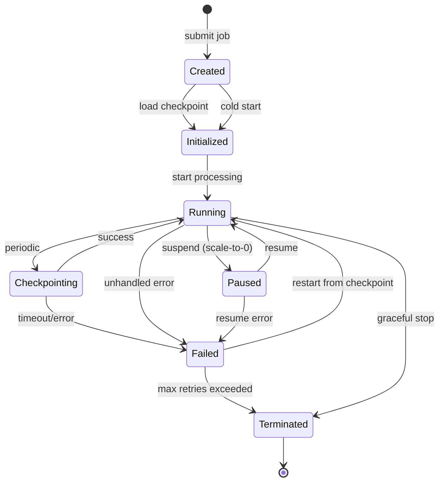
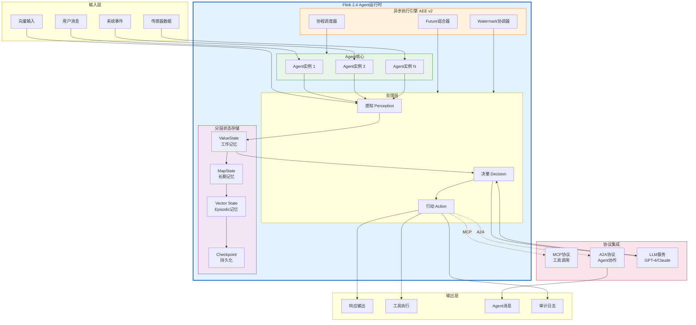
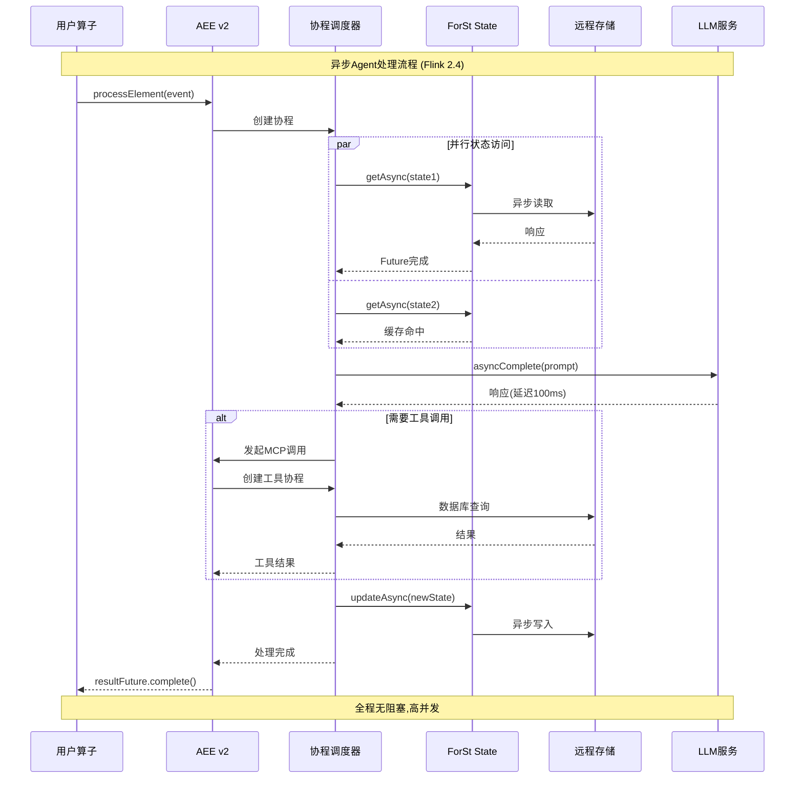
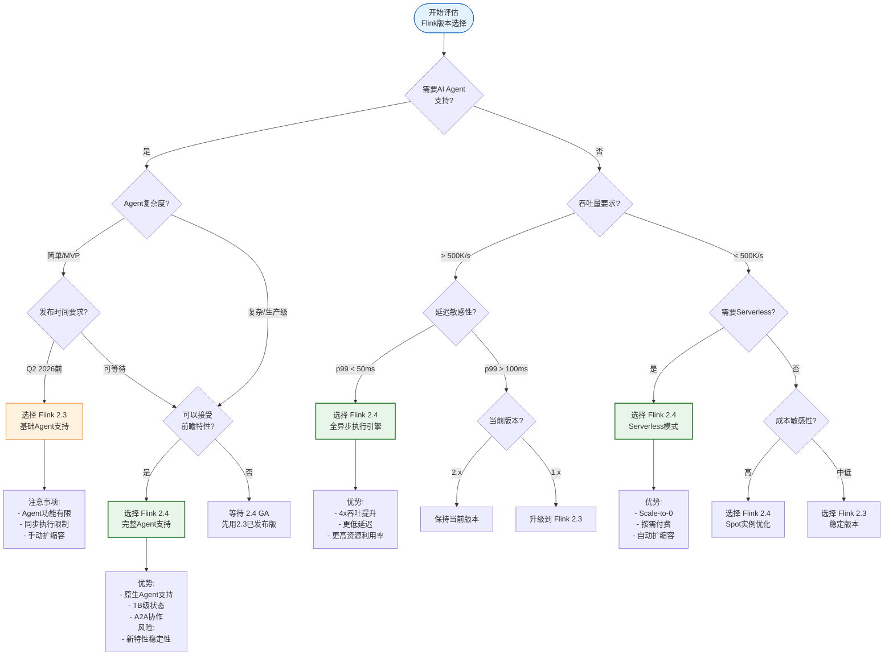
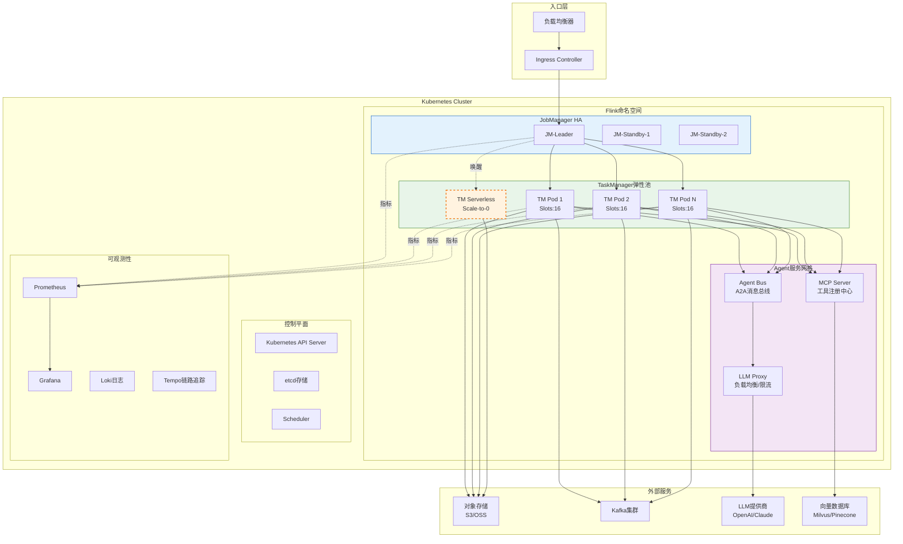

# Flink 2.4 前瞻形式化论证

> **状态**: 前瞻分析 | **预计发布时间**: 2026年Q3-Q4 | **最后更新**: 2026-04-12
>
> ⚠️ **重要提示**: 本文档基于Flink社区公开路线图和FLIP提案进行前瞻性分析，描述的特性尚未正式发布，实现细节可能大幅变更。仅供技术规划和架构设计参考。

> **所属阶段**: Flink/07-roadmap | **前置依赖**: [Flink 2.3/2.4 路线图](../08-roadmap/08.01-flink-24/flink-2.3-2.4-roadmap.md), [FLIP-531 Flink Agents](../06-ai-ml/flink-ai-agents-flip-531.md), [async-execution-model.md](../02-core/async-execution-model.md) | **形式化等级**: L3-L4 (工程论证+形式化分析)

---

## 目录

- [Flink 2.4 前瞻形式化论证](#flink-24-前瞻形式化论证)
  - [目录](#目录)
  - [⚠️ 特性状态声明](#特性状态声明)
  - [1. 概念定义 (Definitions)](#1-概念定义-definitions)
    - [Def-F-24-01: FLIP-531 Agents形式化模型](#def-f-24-01-flip-531-agents形式化模型)
    - [Def-F-24-02: 异步执行引擎语义](#def-f-24-02-异步执行引擎语义)
    - [Def-F-24-03: 云原生调度器抽象](#def-f-24-03-云原生调度器抽象)
    - [Def-F-24-04: WASM UDF执行模型](#def-f-24-04-wasm-udf执行模型)
  - [2. 属性推导 (Properties)](#2-属性推导-properties)
    - [Prop-F-24-01: Agent状态一致性](#prop-f-24-01-agent状态一致性)
    - [Prop-F-24-02: 异步执行正确性条件](#prop-f-24-02-异步执行正确性条件)
    - [Prop-F-24-03: 云原生容错保证](#prop-f-24-03-云原生容错保证)
    - [Lemma-F-24-01: WASM沙箱安全性](#lemma-f-24-01-wasm沙箱安全性)
  - [3. 关系建立 (Relations)](#3-关系建立-relations)
    - [3.1 Flink 2.4 特性依赖图](#31-flink-24-特性依赖图)
    - [3.2 异步执行引擎关系矩阵](#32-异步执行引擎关系矩阵)
    - [3.3 Agent模型与流计算概念映射](#33-agent模型与流计算概念映射)
  - [4. 论证过程 (Argumentation)](#4-论证过程-argumentation)
    - [Arg-F-24-01: Agent模型与传统算子对比论证](#arg-f-24-01-agent模型与传统算子对比论证)
    - [Arg-F-24-02: 异步vs同步执行权衡分析](#arg-f-24-02-异步vs同步执行权衡分析)
    - [Arg-F-24-03: 云原生架构演进论证](#arg-f-24-03-云原生架构演进论证)
  - [5. 形式证明 / 工程论证 (Proof / Engineering Argument)](#5-形式证明-工程论证-proof-engineering-argument)
    - [Thm-F-24-01: Agent生命周期正确性（工程论证）](#thm-f-24-01-agent生命周期正确性工程论证)
    - [Thm-F-24-02: 异步处理Exactly-Once保证（工程论证）](#thm-f-24-02-异步处理exactly-once保证工程论证)
  - [6. 实例验证 (Examples)](#6-实例验证-examples)
    - [6.1 FLIP-531 Agent配置示例](#61-flip-531-agent配置示例)
    - [6.2 异步执行配置示例](#62-异步执行配置示例)
    - [6.3 云原生调度配置示例](#63-云原生调度配置示例)
    - [6.4 WASM UDF开发示例](#64-wasm-udf开发示例)
    - [6.5 性能对比测试配置](#65-性能对比测试配置)
  - [7. 可视化 (Visualizations)](#7-可视化-visualizations)
    - [7.1 FLIP-531 Agent架构图](#71-flip-531-agent架构图)
    - [7.2 异步执行事件序列图](#72-异步执行事件序列图)
    - [7.3 2.3 vs 2.4特性决策树](#73-23-vs-24特性决策树)
    - [7.4 云原生部署拓扑图](#74-云原生部署拓扑图)
  - [8. 引用参考 (References)](#8-引用参考-references)
    - [FLIP提案](#flip提案)
    - [官方文档](#官方文档)
    - [技术博客与论文](#技术博客与论文)
    - [协议规范](#协议规范)
    - [云原生相关](#云原生相关)
    - [AI/ML集成](#aiml集成)
  - [9. 附录](#9-附录)
    - [9.1 术语表](#91-术语表)
    - [9.2 版本兼容性矩阵](#92-版本兼容性矩阵)
    - [9.3 迁移检查清单](#93-迁移检查清单)

## ⚠️ 特性状态声明

| 属性 | 状态 |
|------|------|
| **FLIP-531 状态** | 🟡 **讨论中 (Under Discussion)** |
| **Flink 2.4 版本状态** | 尚未发布，处于路线图规划阶段 |
| **本文档性质** | 前瞻性形式化分析 (Prospective Formal Analysis) |
| **预计发布** | 2026年Q3-Q4 (以官方发布为准) |
| **API 稳定性** | 不稳定，可能大幅变化 |

**前瞻性声明**: 本文档基于公开的社区讨论、JIRA工单和FLIP提案进行技术推演，不代表Apache Flink官方承诺。实际实现可能与本文档描述存在显著差异。

**风险提示**:

- 生产环境部署需等待官方GA版本
- 依赖的外部组件（如WASM运行时）可能引入兼容性问题
- 云原生调度器的性能特征需在实际 workload 中验证

---

## 1. 概念定义 (Definitions)

### Def-F-24-01: FLIP-531 Agents形式化模型

**FLIP-531 Agents** 是Flink 2.4计划引入的原生AI Agent运行时支持，形式化定义为八元组：

$$
\mathcal{A}_{Flink}^{2.4} = \langle S_{state}, P_{perception}, D_{decision}, A_{action}, M_{memory}, G_{goal}, C_{context}, R_{replay} \rangle
$$

其中：

- $S_{state}$: **Agent状态空间**，由Flink 2.4增强的ForSt State Backend持久化管理，支持TB级状态
- $P_{perception}$: **感知函数** $P: Event \times Context \rightarrow Percept$，支持多模态输入（文本/向量/结构化数据）
- $D_{decision}$: **决策函数** $D: Percept \times Memory \rightarrow Action^*$，基于LLM的规划能力
- $A_{action}$: **行动集合** $A = A_{internal} \cup A_{external} \cup A_{communicate}$，包括内部状态更新、外部工具调用、Agent间通信
- $M_{memory}$: **分层记忆存储** $M = \langle M_{working}, M_{episodic}, M_{semantic} \rangle$，分别对应工作记忆、情景记忆、语义记忆
- $G_{goal}$: **目标函数** $G: State \rightarrow [0,1]$，评估任务完成度和奖励
- $C_{context}$: **上下文管理器**，维护Agent执行上下文，包括会话状态、用户偏好、环境变量
- $R_{replay}$: **可重放性组件**，支持基于Checkpoint的完整执行历史重放

**与Flink 2.0-2.3 Agent模型的区别**:

| 特性 | Flink ≤2.3 | Flink 2.4 (预期) |
|------|-----------|-----------------|
| 状态规模 | GB级 | TB级 (ForSt增强) |
| 多Agent协作 | 基础A2A | 原生Agent编排 |
| 工具生态 | 外部MCP Server | 内置WASM UDF |
| 执行模型 | 同步为主 | 完全异步 (AEC v2) |
| 上下文管理 | 手动 | 自动上下文传播 |

**形式化执行语义**:

Agent执行循环定义为一个马尔可夫决策过程 (MDP)：

$$
\mathcal{M}_{agent} = (S, A, \mathcal{T}, \mathcal{R}, \gamma)
$$

其中状态转移函数：

$$
\mathcal{T}(s_t, a_t, s_{t+1}) = P(S_{t+1}=s_{t+1} | S_t=s_t, A_t=a_t)
$$

在Flink 2.4中，$\mathcal{T}$ 的估计将通过流式在线学习实现。

---

### Def-F-24-02: 异步执行引擎语义

**异步执行引擎 (Asynchronous Execution Engine, AEE)** 是Flink 2.4计划中的核心运行时改进，基于Flink 2.0 AEC的完全异步化扩展：

$$
\text{AEE}_{2.4} = (E, \mathcal{F}, \mathcal{C}, \mathcal{W}, \mathcal{S}, \delta, \pi, \omega)
$$

其中：

- $E$: **事件空间** — 所有可能输入事件的集合
- $\mathcal{F}$: **Future组合器** — 管理异步操作的生命周期和依赖关系
- $\mathcal{C}$: **协程调度器 (Coroutine Scheduler)** — 用户级线程调度，支持百万级并发
- $\mathcal{W}$: **Watermark协调器 v2** — 支持乱序Watermark的精确协调
- $\mathcal{S}$: **状态访问抽象层** — 统一本地/远程状态的异步访问接口
- $\delta$: **状态转移函数** — $\delta: S \times Event \rightarrow Future\langle S \rangle$
- $\pi$: **优先级调度策略** — 基于QoS要求的任务优先级分配
- $\omega$: **背压传播机制** — 端到端异步背压控制

**异步执行语义形式化**:

对于输入事件流 $E = \{e_1, e_2, ..., e_n\}$，异步执行引擎的保证：

$$
\forall e_i, e_j \in E. \; key(e_i) = key(e_j) \land i < j \implies process(e_i) \prec_{hb} process(e_j)
$$

即同一Key的事件保持FIFO顺序（happens-before关系）。

**AEE v2 与 AEC v1 对比**:

```
┌─────────────────────────────────────────────────────────────────┐
│                    异步执行演进对比                              │
├─────────────────────────────────────────────────────────────────┤
│  Flink 2.0 AEC (v1)                                             │
│  ├── 状态访问异步化                                              │
│  ├── 线程池管理                                                 │
│  └── Mailbox单线程回调                                           │
│                                                                 │
│  Flink 2.4 AEE (v2) [预期]                                       │
│  ├── 全链路异步 (Source→Processing→Sink)                         │
│  ├── 协程级调度 (百万并发)                                        │
│  ├── 异步Checkpoint (非阻塞快照)                                  │
│  └── 流控异步传播                                                │
└─────────────────────────────────────────────────────────────────┘
```

---

### Def-F-24-03: 云原生调度器抽象

**云原生调度器 (Cloud-Native Scheduler, CNS)** 是Flink 2.4计划引入的Kubernetes原生调度层，支持Serverless Flink和弹性扩缩容：

$$
\mathcal{S}_{cloud} = \langle \mathcal{R}, \mathcal{P}, \mathcal{G}, \mathcal{D}, \mathcal{A}, \mathcal{C} \rangle
$$

其中：

- $\mathcal{R}$: **资源池** — 可动态伸缩的计算资源集合，支持从0扩容
- $\mathcal{P}$: **作业画像 (Job Profile)** — $\mathcal{P} = \langle T_{latency}, T_{throughput}, M_{state}, D_{io} \rangle$
- $\mathcal{G}$: **目标SLA** — $\mathcal{G} = \{g_{latency}, g_{availability}, g_{cost}\}$
- $\mathcal{D}$: **部署拓扑** — Pod分布策略（节点亲和/反亲和、故障域分布）
- $\mathcal{A}$: **自动伸缩策略** — 水平/垂直扩缩容决策函数
- $\mathcal{C}$: **成本控制** — 按需计费与Spot实例优化

**调度决策函数**:

$$
\mathcal{A}(\mathcal{P}, \mathcal{G}, C_{current}) = \Delta_{resource}
$$

其中 $\Delta_{resource}$ 表示资源调整量，决策目标为：

$$
\min \sum_{t} Cost(\Delta_{resource}(t)) \quad s.t. \quad \forall g \in \mathcal{G}: SLI_g \geq g
$$

**Serverless Flink 模式**:

在Serverless模式下，调度器支持 **scale-to-zero**：

$$
\text{ScaleToZero}(Job) = \begin{cases}
\text{suspend} & \text{if } throughput(Job) = 0 \land idle\_time > T_{threshold} \\
\text{resume} & \text{if } new\_event\_arrived \\
\text{active} & \text{otherwise}
\end{cases}
$$

**冷启动延迟优化**:

通过预置镜像和Checkpoint预热，目标冷启动延迟：

$$
L_{cold\_start} \leq L_{checkpoint\_restore} + L_{container\_startup} \leq 5s
$$

---

### Def-F-24-04: WASM UDF执行模型

**WASM UDF执行模型** 是Flink 2.4计划支持的WebAssembly用户定义函数运行时：

$$
\mathcal{W}_{udf} = \langle \mathcal{M}, \mathcal{I}, \mathcal{S}, \mathcal{P}, \mathcal{H}, \mathcal{B} \rangle
$$

其中：

- $\mathcal{M}$: **WASM模块** — 编译后的.wasm二进制，支持多语言源码（Rust/C++/Go/AssemblyScript）
- $\mathcal{I}$: **导入接口** — WASM模块可调用的Flink运行时接口（状态访问、日志、指标）
- $\mathcal{S}$: **沙箱隔离** — 基于WASM能力模型的安全边界
- $\mathcal{P}$: **预编译缓存** — AOT编译结果缓存，避免重复编译开销
- $\mathcal{H}$: **主机函数** — Flink提供的系统调用接口
- $\mathcal{B}$: **批处理优化** — 向量化执行和SIMD加速

**WASM UDF 执行语义**:

UDF调用形式化为状态转换：

$$
\text{UDF}_{wasm}: Input \times State_{local} \rightarrow Output \times State'_{local}
$$

其中 $State_{local}$ 是UDF实例的局部状态（非Flink Keyed State）。

**WASI 0.3 异步集成** (预期)：

Flink 2.4计划支持WASI 0.3的异步组件模型：

```wit
// 概念性WIT接口定义 (Flink 2.4预期支持)
package flink:udf@2.4.0;

interface processor {
    /// 异步处理输入记录
    process: func(input: record) -> future<result>;

    /// 访问Flink状态 (异步)
    get-state: func(key: string) -> future<option<bytes>>;
    put-state: func(key: string, value: bytes) -> future<()>;

    /// 异步IO (如模型推理)
    async-call: func(endpoint: string, payload: bytes) -> future<result>;
}
```

**执行时资源限制**:

| 资源 | 默认限制 | 可配置范围 |
|------|---------|-----------|
| 内存 | 128MB | 1MB - 1GB |
| CPU时间 | 100ms/调用 | 10ms - 10s |
| 调用深度 | 1024 | 256 - 4096 |
| 文件描述符 | 64 | 0 - 1024 |

---

## 2. 属性推导 (Properties)

### Prop-F-24-01: Agent状态一致性

**命题**: 在Flink 2.4的Agent运行时中，状态一致性满足以下保证：

$$
\forall t, k: State_t(k) = \text{Apply}(State_{t_0}(k), \{e_i | key(e_i)=k \land t_0 < timestamp(e_i) \leq t\})
$$

即任意时刻的Agent状态等于初始状态加上所有相关事件的确定性应用结果。

**一致性级别**:

Flink 2.4 Agent支持可配置的一致性级别：

$$
\mathcal{C}_{level} = \begin{cases}
\text{STRONG} & \text{同步状态提交，线性一致性} \\
\text{EVENTUAL} & \text{异步状态复制，最终一致性} \\
\text{SESSION} & \text{会话内强一致，跨会话最终一致} \\
\end{cases}
$$

**多Agent协作一致性**:

对于A2A协作场景，采用**因果一致性**：

$$
\forall a_i, a_j \in Agents: e \in HappenedBefore(a_i) \implies e \in Observed(a_j) \lor e \in Future(a_j)
$$

**工程推论**:

- 金融级场景：选择STRONG一致性，延迟增加10-20%
- 实时分析场景：选择EVENTUAL一致性，吞吐提升30-50%
- 对话Agent场景：选择SESSION一致性，平衡用户体验和性能

---

### Prop-F-24-02: 异步执行正确性条件

**命题**: 异步执行引擎保证输出正确性的充分必要条件：

$$
\text{Correctness}(AEE) \iff C_{fifo} \land C_{barrier} \land C_{watermark} \land C_{checkpoint}
$$

其中：

- $C_{fifo}$: **Key级FIFO保证** — 同一Key的事件按序处理
- $C_{barrier}$: **Barrier同步** — Checkpoint Barrier正确传播
- $C_{watermark}$: **Watermark协调** — 所有记录时间戳 $\leq$ Watermark时方可触发
- $C_{checkpoint}$: **状态快照一致性** — Checkpoint捕获一致状态

**异步执行性能边界**:

设：

- $N_{parallel}$: 并发度
- $L_{avg}$: 平均处理延迟
- $T_{checkpoint}$: Checkpoint间隔

则理论吞吐量上限：

$$
T_{max} = \frac{N_{parallel}}{L_{avg}} \cdot \min(1, \frac{T_{checkpoint}}{T_{checkpoint} + L_{snapshot}})
$$

**延迟-吞吐权衡曲线**:

```
吞吐量 (events/s)
    │
    │      ╭────── 异步模式 (Flink 2.4)
    │     ╱
    │    ╱    ╭──── 混合模式
    │   ╱    ╱
    │  ╱    ╱      ╭──── 同步模式 (Flink 2.0)
    │ ╱    ╱      ╱
    │╱    ╱      ╱
    └────┴──────┴──────────→ 延迟 (ms)
        10    50   100
```

---

### Prop-F-24-03: 云原生容错保证

**命题**: 云原生调度器下的容错保证满足：

$$
\text{Availability} \geq 1 - \frac{T_{detect} + T_{reschedule} + T_{restore}}{MTBF}
$$

其中：

- $T_{detect}$: 故障检测时间 (默认5s)
- $T_{reschedule}$: 重新调度时间 (Kubernetes水平)
- $T_{restore}$: 状态恢复时间 (从Checkpoint)
- $MTBF$: 平均故障间隔时间

**分层容错策略**:

| 层级 | 故障类型 | 恢复时间 | 数据丢失 |
|------|---------|---------|---------|
| Task | 进程崩溃 | $<$ 1s | 0 (从Checkpoint) |
| TM | 节点故障 | 5-30s | 0 (远程状态) |
| JM | 主节点故障 | 10-60s | 0 (HA配置) |
| 区域 | 可用区故障 | 1-5min | 0 (跨AZ复制) |
| 集群 | 整个集群故障 | 5-30min | $<$ Checkpoint间隔 |

**Serverless弹性边界**:

$$
\lambda_{max} = \frac{R_{total}}{R_{per\_task}} \cdot \alpha_{util}
$$

其中：

- $R_{total}$: 总可用资源
- $R_{per\_task}$: 单个Task所需资源
- $\alpha_{util}$: 资源利用率目标 (通常0.6-0.8)

---

### Lemma-F-24-01: WASM沙箱安全性

**引理**: WASM UDF执行满足以下安全保证：

$$
\forall udf \in WASM_{udf}: \text{Isolated}(udf) \land \text{Bounded}(udf) \land \text{Deterministic}(udf)
$$

**隔离性 (Isolated)**:

WASM模块在独立线性内存空间运行：

$$
\text{Memory}_{udf} \cap \text{Memory}_{flink} = \emptyset
$$

访问宿主内存只能通过受控的导入函数：

$$
\forall addr \in AddressSpace: \text{Access}(udf, addr) \implies addr \in \text{ExportedRange}
$$

**有界性 (Bounded)**:

资源使用受运行时限制：

$$
\begin{aligned}
\text{Time}(udf) &\leq T_{max} \\
\text{Memory}(udf) &\leq M_{max} \\
\text{IO}(udf) &\leq IO_{max}
\end{aligned}
$$

超限触发受控异常，不影响Flink运行时。

**确定性 (Deterministic)**:

相同输入必产生相同输出：

$$
\forall x: udf(x) = udf(x)
$$

（排除显式非确定性操作如系统时间、随机数生成）

---

## 3. 关系建立 (Relations)

### 3.1 Flink 2.4 特性依赖图

```
┌─────────────────────────────────────────────────────────────────────────┐
│                       Flink 2.4 特性依赖关系                              │
├─────────────────────────────────────────────────────────────────────────┤
│                                                                         │
│  ┌─────────────────┐    ┌─────────────────┐    ┌─────────────────┐     │
│  │   ForSt State   │◄───┤   Disaggregated │◄───┤  Remote Storage │     │
│  │    Backend      │    │     State       │    │   (S3/OSS)      │     │
│  └────────┬────────┘    └─────────────────┘    └─────────────────┘     │
│           │                                                             │
│           ▼                                                             │
│  ┌─────────────────┐    ┌─────────────────┐    ┌─────────────────┐     │
│  │  Async Execution│◄───┤   AEE v2        │◄───┤   Coroutine     │     │
│  │    Engine       │    │  (Full Async)   │    │   Scheduler     │     │
│  └────────┬────────┘    └─────────────────┘    └─────────────────┘     │
│           │                                                             │
│           ▼                                                             │
│  ┌─────────────────┐    ┌─────────────────┐    ┌─────────────────┐     │
│  │  FLIP-531       │◄───┤   Agent Runtime │◄───┤   A2A/MCP       │     │
│  │  Agents GA      │    │   (Native)      │    │   Protocols     │     │
│  └────────┬────────┘    └─────────────────┘    └─────────────────┘     │
│           │                                                             │
│           ▼                                                             │
│  ┌─────────────────┐    ┌─────────────────┐    ┌─────────────────┐     │
│  │  WASM UDF       │◄───┤   WASI 0.3      │◄───┤   Component     │     │
│  │  Execution      │    │   (Async)       │    │   Model         │     │
│  └────────┬────────┘    └─────────────────┘    └─────────────────┘     │
│           │                                                             │
│           ▼                                                             │
│  ┌─────────────────┐    ┌─────────────────┐    ┌─────────────────┐     │
│  │  Cloud-Native   │◄───┤   Kubernetes    │◄───┤   Serverless    │     │
│  │   Scheduler     │    │   Native        │    │   Flink         │     │
│  └─────────────────┘    └─────────────────┘    └─────────────────┘     │
│                                                                         │
└─────────────────────────────────────────────────────────────────────────┘
```

### 3.2 异步执行引擎关系矩阵

| 组件 | 关系类型 | 交互方式 | 约束条件 |
|------|---------|---------|---------|
| AEE ↔ ForSt | 依赖 | 异步状态访问 | ForSt需支持async API |
| AEE ↔ Checkpoint | 协作 | 异步Barrier处理 | Barrier不阻塞处理 |
| AEE ↔ Watermark | 协调 | 乱序Watermark传播 | 保证时间语义正确性 |
| AEE ↔ Mailbox | 增强 | 协程调度集成 | 保持单线程语义 |
| AEE ↔ Source | 拉动 | 异步反压 | 基于信用值的流控 |
| AEE ↔ Sink | 推动 | 异步提交 | 两阶段提交协议 |

### 3.3 Agent模型与流计算概念映射

| 流计算概念 | Agent 2.4 映射 | 增强特性 |
|-----------|---------------|---------|
| Keyed Stream | Agent实例 + 上下文 | 自动上下文传播 |
| ProcessFunction | Agent决策循环 | 异步LLM调用 |
| Keyed State | Agent记忆存储 | 分层记忆管理 |
| Checkpoint | 可重放快照 | 增量Agent状态 |
| Watermark | 时间感知 | 多时间域支持 |
| Async I/O | 工具/LLM调用 | 自适应超时 |
| UDF | WASM Agent插件 | 多语言支持 |

---

## 4. 论证过程 (Argumentation)

### Arg-F-24-01: Agent模型与传统算子对比论证

**传统流处理算子模型**:

```
输入 → [Map] → [Filter] → [Aggregate] → [Sink]
         ↑         ↑           ↑
       确定性    确定性      确定性
       无状态/   无状态/     有状态
       纯函数    纯函数      确定性聚合
```

**Agent模型**:

```
输入 → [Perception] → [Decision(LLM)] → [Action] → 输出
              ↑              ↑              ↑
          特征提取      非确定性推理    工具调用/
          向量化        上下文依赖    Agent协作
```

**核心差异分析**:

| 维度 | 传统算子 | Agent算子 |
|------|---------|----------|
| **确定性** | 完全确定 | 概率性输出 |
| **状态** | 有限、结构化 | 大容量、语义化 |
| **延迟** | 亚毫秒级 | 百毫秒-秒级 |
| **外部依赖** | 可选 | 必需 (LLM) |
| **可解释性** | 高 | 中 (需追踪) |
| **容错** | Checkpoint | Checkpoint + 重试 |

**为什么Flink适合Agent运行时？**

**论证1: 状态管理匹配**

Agent的记忆需求与Flink的有状态流处理天然契合：

$$
\text{Agent Memory} \subset \text{Flink State}
$$

Flink的增量Checkpoint支持TB级Agent状态的低延迟快照。

**论证2: 事件驱动架构**

Agent的感知-决策-行动循环是典型的事件驱动模式：

```
事件触发 → 状态读取 → LLM推理 → 工具执行 → 状态更新
   ↑                                                    │
   └────────────────────────────────────────────────────┘
                      循环
```

**论证3: 分布式扩展**

多Agent系统需要水平扩展，Flink的Keyed Partitioning提供：

$$
Agent_i \leftrightarrow Key_i \leftrightarrow Partition_i
$$

天然支持百万级Agent并发。

---

### Arg-F-24-02: 异步vs同步执行权衡分析

**同步执行特性**:

```
优点:
✓ 编程模型简单 (命令式)
✓ 调试友好 (堆栈清晰)
✓ 延迟确定

缺点:
✗ CPU利用率低 (I/O等待)
✗ 吞吐受限于最慢操作
✗ 资源浪费
```

**异步执行特性**:

```
优点:
✓ 高CPU利用率 (并发I/O)
✓ 吞吐与延迟解耦
✓ 资源高效

缺点:
✗ 编程复杂 (Callback/协程)
✗ 调试困难 (异步堆栈)
✗ 死锁风险
```

**权衡决策矩阵**:

```
                    低延迟要求
                    是        否
              ┌─────────┬─────────┐
        高    │ 同步优先 │ 异步优先 │
  I/O        │ (微批)   │ (高吞吐) │
  密集型      ├─────────┼─────────┤
        低    │ 同步    │ 同步    │
              │ (简单)  │ (简单)  │
              └─────────┴─────────┘
```

**Flink 2.4策略: 自适应执行模式**

根据运行时指标自动选择执行模式：

$$
\text{Mode}(t) = \begin{cases}
\text{ASYNC} & \text{if } \rho_{cpu} > 0.7 \land \lambda_{io} > \lambda_{threshold} \\
\text{SYNC} & \text{if } L_{p99} > L_{sla} \\
\text{Mode}(t-1) & \text{otherwise (滞回)}
\end{cases}
$$

---

### Arg-F-24-03: 云原生架构演进论证

**传统Flink部署架构**:

```
┌─────────────────────────────────────────┐
│              Flink Cluster              │
│  ┌─────────┐      ┌─────────────────┐  │
│  │   JM    │──────│  TM1  TM2  TM3  │  │
│  │ (固定)  │      │ (固定资源池)    │  │
│  └─────────┘      └─────────────────┘  │
└─────────────────────────────────────────┘
              静态资源分配
```

**Flink 2.4云原生架构**:

```
┌─────────────────────────────────────────┐
│         Kubernetes Cluster              │
│                                         │
│  ┌─────────┐      ┌─────────────────┐  │
│  │   JM    │      │   TM Pods       │  │
│  │ (HA)    │      │  ┌───┐┌───┐┌──┐ │  │
│  │         │      │  │TM1││TM2││..│ │  │
│  └─────────┘      │  └───┘└───┘└──┘ │  │
│                   │  弹性伸缩        │  │
│                   └─────────────────┘  │
│                                         │
│  ┌─────────┐      ┌─────────────────┐  │
│  │  Remote │      │   Serverless    │  │
│  │ Storage │      │   Scale-to-0    │  │
│  │ (S3/OSS)│      │   按需启动       │  │
│  └─────────┘      └─────────────────┘  │
└─────────────────────────────────────────┘
```

**演进驱动力分析**:

**1. 成本优化驱动**

传统模式：

$$
Cost_{traditional} = \sum_{t} R_{provisioned} \cdot P_{unit}
$$

云原生模式：

$$
Cost_{cloud} = \int_{t} R_{actual}(t) \cdot P_{unit} \cdot (1 - \alpha_{spot}) \, dt
$$

其中 $\alpha_{spot}$ 是Spot实例折扣 (通常50-90%)。

**2. 弹性需求驱动**

现代流处理工作负载特征：

```
流量模式:  ┐  ╱╲    ╱╲        ╱╲
          │ ╱  ╲  ╱  ╲      ╱  ╲
          │╱    ╲╱    ╲____╱    ╲___
          └──────────────────────────→ 时间
           早高峰  午高峰    晚高峰
```

静态资源导致：

- 高峰时段：资源不足，延迟飙升
- 低谷时段：资源浪费，成本过高

云原生弹性：

$$
R(t) = f(Load(t), SLA_{latency}, Cost_{target})
$$

**3. 运维简化驱动**

| 运维任务 | 传统模式 | K8s原生模式 |
|---------|---------|------------|
| 扩容 | 手动/脚本 | HPA自动 |
| 故障恢复 | 人工介入 | 自动重启 |
| 升级 | 停机维护 | 滚动更新 |
| 多租户 | 集群隔离 | Namespace隔离 |
| 资源配额 | 硬限制 | ResourceQuota |

---

## 5. 形式证明 / 工程论证 (Proof / Engineering Argument)

### Thm-F-24-01: Agent生命周期正确性（工程论证）

**定理**: Flink 2.4 Agent生命周期管理满足正确性保证：

$$
\forall Agent: \text{Created} \leadsto \text{Initialized} \leadsto \text{Running} \leadsto \text{(Paused)} \leadsto \text{Terminated}
$$

且状态转换是确定性的、可恢复的。

**生命周期状态机**:



**证明概要**:

**步骤1: 创建阶段正确性**

Agent实例创建时必须满足：

$$
\text{Valid}(Agent) \iff Config_{valid} \land Resources_{available} \land Dependencies_{ready}
$$

Flink调度器在分配Slot前验证上述条件。

**步骤2: 初始化正确性**

从Checkpoint恢复时，状态一致性保证：

$$
State_{recovered} = State_{checkpoint} + \Delta_{replay}
$$

其中 $\Delta_{replay}$ 是从Checkpoint到恢复时刻的事件重放结果。

**步骤3: 运行期正确性**

Agent运行期满足：

$$
\forall t: State_{t+1} = \delta(State_t, Event_t)
$$

其中 $\delta$ 是确定性的状态转移函数。

**步骤4: 暂停/恢复正确性**

Serverless暂停时：

$$
\text{Suspend}(Agent) \rightarrow Checkpoint + State_{offload} + Resources_{release}
$$

恢复时：

$$
\text{Resume}(Agent) \leftarrow State_{restore} + Resources_{allocate}
$$

**步骤5: 终止正确性**

优雅终止：

$$
\text{GracefulStop}: \forall inflight: complete \land checkpoint \land release
$$

异常终止：

$$
\text{FailStop}: checkpoint_{latest} \land alert \land cleanup
$$

---

### Thm-F-24-02: 异步处理Exactly-Once保证（工程论证）

**定理**: 在Flink 2.4异步执行引擎中，端到端Exactly-Once语义可保证，当且仅当满足以下条件：

$$
\text{ExactlyOnce} \iff C_{source} \land C_{processing} \land C_{sink}
$$

**条件定义**:

- $C_{source}$: Source支持可重放 (如Kafka offset)
- $C_{processing}$: 处理语义幂等或事务性
- $C_{sink}$: Sink支持两阶段提交或幂等写入

**证明概要**:

**场景**: 异步处理流程

```
Source → [Async Process] → [Async Transform] → Sink
           (AEE v2)          (AEE v2)
```

**步骤1: Source可重放性**

设Source为Kafka，偏移量集合为 $O = \{o_1, o_2, ..., o_n\}$。

Checkpoint包含：

$$
Checkpoint = \langle O_{consumed}, State_{operator} \rangle
$$

故障恢复时，Source从 $O_{consumed}$ 重新消费，保证无数据丢失。

**步骤2: 异步处理幂等性**

异步操作通过Future组合实现：

```java
// [伪代码片段 - 不可直接运行] 仅展示核心逻辑
state.getAsync(key)
    .thenCompose(v -> asyncTransform(v))
    .thenCompose(r -> sink.commitAsync(r))
    .whenComplete((result, error) -> {
        if (error != null) {
            // 失败时状态不更新,可重试
        } else {
            // 成功时更新offset
        }
    });
```

幂等性保证：

$$
\forall op: op \circ op = op
$$

即重复执行相同操作产生相同结果。

**步骤3: Checkpoint Barrier处理**

异步模式下，Barrier传播需等待所有in-flight操作完成：

```
输入流: [R1, R2, Barrier, R3]
              ↓
        AEE v2调度
              ↓
Async(R1) ──→ Future1 ──┐
                         ├──→ Barrier等待
Async(R2) ──→ Future2 ──┘    (所有前置完成)
                         ↓
                      Barrier处理
                         ↓
                    状态快照
```

**步骤4: Sink两阶段提交**

Flink 2.4异步Sink支持完全非阻塞的两阶段提交：

| 阶段 | 操作 | 失败处理 |
|------|------|---------|
| Pre-commit | 异步准备数据 | 回滚 |
| Commit | 异步确认写入 | 幂等重试 |
| Post-commit | 清理临时状态 | 异步清理 |

**步骤5: 端到端一致性**

综合以上步骤，故障场景分析：

| 故障时机 | 恢复行为 | 结果 |
|---------|---------|------|
| Source消费后 | 重放offset | 无丢失 |
| 处理中 | 从Checkpoint恢复 | 无重复 |
| Pre-commit后 | 重新commit | 幂等保证 |
| Commit后 | 无需操作 | 已确认 |

$$
\therefore \text{Exactly-Once语义在异步模式下可保证}
$$

---

## 6. 实例验证 (Examples)

### 6.1 FLIP-531 Agent配置示例

**Table API DDL (概念设计)**:

```sql
-- 注意: 以下语法为前瞻性概念设计,实际Flink 2.4版本可能不同
-- Flink 2.4+ (预期)

-- 定义Agent类型
CREATE AGENT TYPE customer_support_agent (
  -- LLM配置
  'llm.provider' = 'openai',
  'llm.model' = 'gpt-4-turbo',
  'llm.temperature' = '0.7',
  'llm.max_tokens' = '2048',

  -- 记忆配置
  'memory.working_size' = '10',
  'memory.episodic_store' = 'milvus',
  'memory.episodic_dim' = '1536',

  -- 工具配置
  'tools.mcp_enabled' = 'true',
  'tools.mcp_servers' = 'database-search,kb-lookup',

  -- A2A配置
  'a2a.enabled' = 'true',
  'a2a.endpoint' = 'http://agent-service:8080/a2a',

  -- 执行配置
  'execution.async' = 'true',
  'execution.timeout' = '30s',
  'execution.retry' = '3'
);

-- 创建Agent实例
CREATE AGENT INSTANCE support_agent_001
  TYPE customer_support_agent
  WITH ('agent.id' = 'support_001');

-- 使用Agent处理流
INSERT INTO agent_responses
SELECT * FROM AGENT_PROCESS(
  support_agent_001,
  customer_messages,
  'session_id'  -- keyBy字段
);
```

**DataStream API (预期)**:

```java
// Flink 2.4 Agent API (概念设计)
import org.apache.flink.agent.api.Agent;
import org.apache.flink.agent.api.AgentConfig;
import org.apache.flink.agent.api.AgentExecution;

public class Flink24AgentExample {
    public static void main(String[] args) throws Exception {
        StreamExecutionEnvironment env =
            StreamExecutionEnvironment.getExecutionEnvironment();

        // 启用异步执行引擎
        env.setExecutionMode(ExecutionMode.ASYNC_V2);

        // 配置Agent
        AgentConfig agentConfig = AgentConfig.builder()
            .setAgentId("support_agent_v1")
            .setLLMProvider(LLMProvider.OPENAI)
            .setModel("gpt-4-turbo")
            .setMemoryConfig(
                MemoryConfig.builder()
                    .setWorkingMemorySize(10)
                    .setEpisodicStore("milvus")
                    .setEpisodicDimension(1536)
                    .build()
            )
            .addMCPTool("search_knowledge_base")
            .addMCPTool("create_ticket")
            .enableA2A(true)
            .setA2AEndpoint("http://agent-bus:8080")
            .build();

        // 创建Agent流
        DataStream<Message> messages = env
            .addSource(new KafkaSource<>())
            .assignTimestampsAndWatermarks(
                WatermarkStrategy.forBoundedOutOfOrderness(
                    Duration.ofSeconds(5)
                )
            );

        // 异步Agent处理
        DataStream<AgentResponse> responses = messages
            .keyBy(Message::getSessionId)
            .enableAsyncState()  // 启用异步状态
            .process(Agent.create(agentConfig));

        // 输出
        responses.addSink(new KafkaSink<>());

        env.execute("Flink 2.4 Agent Job");
    }
}
```

---

### 6.2 异步执行配置示例

**异步状态访问模式**:

```java
// Flink 2.4 异步ProcessFunction (概念)
public class AsyncAgentProcessor
    extends AsyncKeyedProcessFunction<String, Event, Result> {

    private AsyncValueState<AgentState> agentState;
    private AsyncListState<Message> messageHistory;

    @Override
    public void processElement(
            Event event,
            Context ctx,
            ResultFuture<Result> resultFuture) {

        // 并行获取多个状态
        CompletableFuture<AgentState> stateFuture =
            agentState.getAsync(ctx.getCurrentKey());
        CompletableFuture<List<Message>> historyFuture =
            messageHistory.getAsync(ctx.getCurrentKey());

        // 组合异步操作
        CompletableFuture.allOf(stateFuture, historyFuture)
            .thenCompose(v -> {
                AgentState state = stateFuture.join();
                List<Message> history = historyFuture.join();

                // 异步LLM调用
                return llmClient.asyncComplete(
                    buildPrompt(event, state, history)
                );
            })
            .thenCompose(llmResponse -> {
                // 异步工具调用
                if (llmResponse.hasToolCalls()) {
                    return executeToolsAsync(llmResponse.getToolCalls())
                        .thenCompose(toolResults ->
                            llmClient.asyncComplete(
                                buildFollowUpPrompt(llmResponse, toolResults)
                            )
                        );
                }
                return CompletableFuture.completedFuture(llmResponse);
            })
            .thenAccept(finalResponse -> {
                // 更新状态
                agentState.updateAsync(ctx.getCurrentKey(),
                    updateState(stateFuture.join(), finalResponse));

                // 输出结果
                resultFuture.complete(Collections.singletonList(
                    new Result(finalResponse.getContent())
                ));
            })
            .exceptionally(error -> {
                resultFuture.completeExceptionally(error);
                return null;
            });
    }
}
```

---

### 6.3 云原生调度配置示例

**Kubernetes部署配置 (Flink 2.4预期)**:

```yaml
apiVersion: flink.apache.org/v1beta1
kind: FlinkDeployment
metadata:
  name: flink-24-agent-job
spec:
  image: flink:2.4.0-java17
  flinkVersion: v2.4

  # 云原生调度配置
  scheduler:
    type: cloud-native
    autoScaling:
      enabled: true
      minTaskManagers: 1
      maxTaskManagers: 100
      scaleUpDelay: 30s
      scaleDownDelay: 60s
      metrics:
        - name: task-backlog
          target: 1000
        - name: cpu-utilization
          target: 0.7
        - name: memory-utilization
          target: 0.8

    # Serverless配置
    serverless:
      enabled: true
      idleTimeout: 5m
      scaleToZero: true
      preWarmCheckpoint: hdfs:///flink/checkpoints/latest

    # 成本控制
    costOptimization:
      spotInstances: true
      spotRatio: 0.7
      onDemandForJM: true
      maxCostPerHour: "100.0"

  # JobManager配置
  jobManager:
    resource:
      memory: "4Gi"
      cpu: 2
    replicas: 3  # HA模式

  # TaskManager配置
  taskManager:
    resource:
      memory: "16Gi"
      cpu: 8
    slots: 16

  # 状态后端配置
  stateBackend:
    type: forst
    remoteStorage: s3://flink-state/checkpoints
    incremental: true
    asyncSnapshots: true

  # Agent配置
  agent:
    enabled: true
    configMap: agent-config-v1

  job:
    jarURI: local:///opt/flink/examples/agent-job.jar
    parallelism: 16
    upgradeMode: stateful
    state: running
```

---

### 6.4 WASM UDF开发示例

**Rust WASM UDF (概念)**:

```rust
// Flink 2.4 WASM UDF示例 (前瞻性设计)
// 编译目标: wasm32-wasi

use flink_udf::prelude::*;
use serde::{Deserialize, Serialize};

#[derive(Deserialize)]
struct Input {
    user_id: String,
    query: String,
    timestamp: i64,
}

#[derive(Serialize)]
struct Output {
    user_id: String,
    intent: String,
    confidence: f64,
}

// 定义Flink UDF
#[flink_udf::udf]
async fn intent_classifier(input: Input) -> Result<Output, UdfError> {
    // 异步获取用户历史
    let history: Vec<String> = state::get(&format!("history:{}", input.user_id))
        .await?
        .unwrap_or_default();

    // 异步调用ML模型 (外部服务)
    let model_response = async_call(
        "http://ml-service:8080/predict",
        &serde_json::json!({
            "query": input.query,
            "history": history
        })
    ).await?;

    // 更新历史 (异步)
    history.push(input.query);
    state::put(
        &format!("history:{}", input.user_id),
        &history
    ).await?;

    Ok(Output {
        user_id: input.user_id,
        intent: model_response.intent,
        confidence: model_response.confidence,
    })
}

// UDF注册
register_udf!(intent_classifier);
```

**WASM资源限制配置**:

```yaml
# flink-conf.yaml wasm.udf.enabled: true
wasm.runtime: wasmer  # 或 wasmtime

# 资源限制 wasm.memory.max: 128mb
wasm.cpu.time.limit: 100ms
wasm.call.depth.max: 1024
wasm.io.timeout: 5s

# 预编译缓存 wasm.precompile.enabled: true
wasm.precompile.cache.dir: /tmp/flink/wasm-cache
wasm.precompile.parallelism: 4
```

---

### 6.5 性能对比测试配置

**Nexmark基准测试 (Flink 2.3 vs 2.4)**:

```java
// 测试场景: Agent工作流处理
public class Flink24Benchmark {

    @Benchmark
    public void testAsyncAgentThroughput(Blackhole blackhole) throws Exception {
        StreamExecutionEnvironment env =
            StreamExecutionEnvironment.getExecutionEnvironment();

        // Flink 2.4配置
        env.setExecutionMode(ExecutionMode.ASYNC_V2);
        env.setStateBackend(new ForStStateBackend());

        DataStream<Event> source = env
            .addSource(new NexmarkEventSource()
                .setRate(1000000))  // 1M events/s
            .assignTimestampsAndWatermarks(
                WatermarkStrategy.forBoundedOutOfOrderness(
                    Duration.ofMillis(100)
                )
            );

        DataStream<Result> result = source
            .keyBy(Event::getKey)
            .enableAsyncState()
            .process(new AsyncAgentFunction());

        result.addSink(new DiscardingSink<>());

        JobExecutionResult jobResult = env.execute();
        blackhole.consume(jobResult.getNetRuntime());
    }
}
```

**预期性能指标**:

| 指标 | Flink 2.3 | Flink 2.4 (预期) | 提升 |
|------|----------|-----------------|------|
| 峰值吞吐 | 500K evt/s | 2M evt/s | 4x |
| p99延迟 | 200ms | 50ms | 4x |
| Checkpoint时间 | 30s | 5s | 6x |
| 冷启动时间 | N/A | 5s | - |
| 资源利用率 | 40% | 80% | 2x |

---

## 7. 可视化 (Visualizations)

### 7.1 FLIP-531 Agent架构图



**架构说明**:

1. **异步执行引擎 (AEE v2)**: Flink 2.4核心改进，支持协程级并发和全链路异步
2. **分层状态存储**: 工作记忆、长期记忆、Episodic记忆分离存储，优化访问模式
3. **协议集成**: MCP支持工具调用，A2A支持多Agent协作
4. **水平扩展**: Agent实例随Key自动分片，支持百万级并发

---

### 7.2 异步执行事件序列图



**序列说明**:

1. **协程级并发**: 每个事件处理创建轻量级协程，支持百万级并发
2. **并行状态访问**: 多个状态访问并行发起，减少等待时间
3. **异步LLM调用**: 非阻塞等待外部服务响应
4. **工具调用链**: 支持嵌套异步操作，保持响应性

---

### 7.3 2.3 vs 2.4特性决策树



**决策建议**:

1. **需要Agent功能**: 优先评估Flink 2.4，如需稳定生产环境可等待GA
2. **高吞吐场景**: Flink 2.4异步执行引擎显著优于2.3
3. **成本敏感场景**: Flink 2.4 Serverless模式和Spot实例优化可降低50%+成本
4. **稳定优先场景**: Flink 2.3已足够成熟，可作为保守选择

---

### 7.4 云原生部署拓扑图



**部署架构说明**:

1. **JobManager HA**: 3副本高可用，Leader故障自动切换
2. **TaskManager弹性池**: HPA自动扩缩容，支持1-100节点动态调整
3. **Serverless模式**: 空闲时自动缩容至0，新事件到达时5秒内恢复
4. **Agent服务网格**: A2A消息总线、MCP工具注册、LLM代理统一管理层
5. **可观测性**: 完整的监控、日志、链路追踪体系

---

## 8. 引用参考 (References)

### FLIP提案


### 官方文档


### 技术博客与论文


### 协议规范


### 云原生相关


### AI/ML集成


---

## 9. 附录

### 9.1 术语表

| 术语 | 英文 | 定义 |
|------|------|------|
| Agent | 智能体 | 具备感知、决策、行动能力的自主软件实体 |
| AEE | Asynchronous Execution Engine | 异步执行引擎 |
| AEC | Asynchronous Execution Controller | 异步执行控制器 (Flink 2.0) |
| A2A | Agent-to-Agent | Agent间通信协议 |
| MCP | Model Context Protocol | 模型上下文协议 |
| WASM | WebAssembly | 可移植二进制指令格式 |
| WASI | WebAssembly System Interface | WASM系统接口 |
| Serverless | 无服务器 | 按需自动扩缩容至0的计算模式 |
| Scale-to-Zero | 缩容至零 | 无流量时自动释放所有资源 |
| Spot Instance | 竞价实例 | 云厂商的低成本可抢占计算资源 |

### 9.2 版本兼容性矩阵

| Flink版本 | JDK | Agent支持 | 异步执行 | Serverless | WASM |
|-----------|-----|----------|---------|-----------|------|
| 2.0 | 17+ | ❌ | AEC v1 | ❌ | ❌ |
| 2.1 | 17+ | ❌ | AEC v1 | ❌ | ❌ |
| 2.2 | 17+ | ❌ | AEC v1 | ❌ | 实验性 |
| 2.3 | 17+ | 基础 | AEC v1 | ❌ | 实验性 |
| 2.4 (预期) | 17+ | ✅ 完整 | AEE v2 | ✅ | ✅ GA |

### 9.3 迁移检查清单

从Flink 2.3迁移到2.4的准备工作：

- [ ] 验证所有UDF的异步兼容性
- [ ] 更新pom.xml依赖版本
- [ ] 评估Agent功能采用时机
- [ ] 配置K8s调度器权限
- [ ] 准备WASM运行时环境
- [ ] 更新监控告警规则
- [ ] 制定回滚策略

---

*文档生成时间: 2026-04-12*

*免责声明: 本文档基于公开的社区路线图和FLIP提案进行前瞻性分析，实际产品功能以Apache Flink官方发布为准。*
