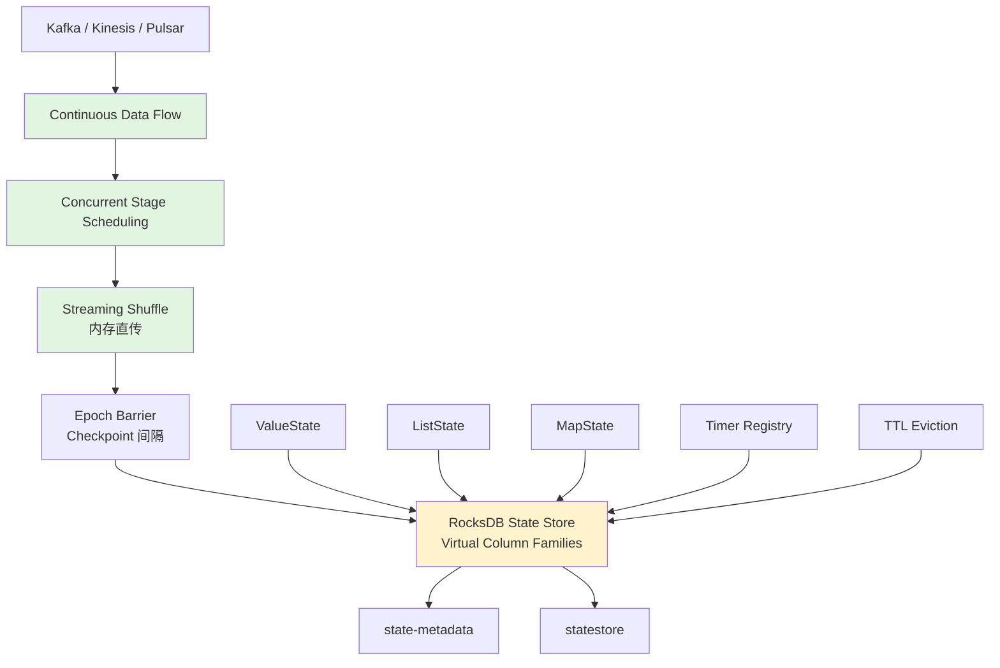
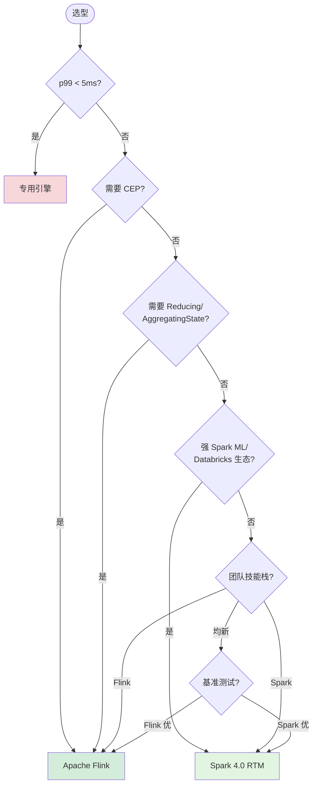
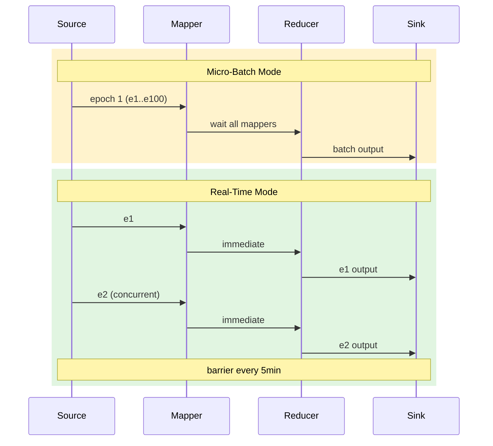

# Apache Spark 4.0 Real-Time Mode (RTM) 深度分析

> 所属阶段: Flink/07-roadmap | 前置依赖: [Flink/02-core/flink-exactly-once-semantics.md](../../Flink/02-core/), [Knowledge/05-mapping-guides/stream-processing-engine-comparison.md](../../Knowledge/05-mapping-guides/) | 形式化等级: L3-L4

## 1. 概念定义 (Definitions)

### Def-F-RTM-01: Real-Time Mode (RTM) 执行模型

**定义**: Apache Spark Real-Time Mode 是一种**混合执行模型**（Hybrid Execution Model），在保留微批架构容错优势的基础上，通过**连续数据流**（Continuous Data Flow）、**并发阶段调度**（Concurrent Stage Scheduling）和**流式 Shuffle**（Streaming Shuffle）三项机制，使 Spark Structured Streaming 能够以事件级粒度处理无界数据流。

形式化地，设输入事件流为 $E = \{e_1, e_2, \dots\}$，RTM 定义处理函数族 $\mathcal{F} = \{f_1, \dots, f_k\}$。RTM 的执行语义满足：

$$
\forall e_i \in E, \quad \text{latency}(e_i) = t_{\text{out}}(e_i) - t_{\text{in}}(e_i) \leq L_{\text{p99}}
$$

其中 $L_{\text{p99}}$ 为 p99 延迟上界，Databricks 基准测试测得范围为 **个位数毫秒至 ~300ms**[^1]。与传统微批模式（MBM）的核心差异在于：MBM 将事件离散化为固定边界的 epoch，事件需等待上游阶段完全完成后才能进入下游；RTM 允许事件在**更长持续时间的 epoch**内以流水线方式连续流经各算子阶段，阶段间无需屏障同步[^2]。

### Def-F-RTM-02: Arbitrary Stateful Processing API v2 (transformWithState)

**定义**: `transformWithState` 是 Spark 4.0 引入的任意有状态处理算子，通过面向对象的 `StatefulProcessor` 接口将状态管理提升为"多变量状态命名空间"。

形式化地，设分组键空间为 $\mathcal{K}$，对于每个键 $k \in \mathcal{K}$，处理器维护状态变量集合 $\mathcal{S}_k = \{s_{k,1}, \dots, s_{k,m}\}$，其中每个状态变量可具化为：

- **ValueState<T>**：单值状态，$|s_{k,j}| = 1$
- **ListState<T>**：追加列表，$s_{k,j} = [v_1, \dots, v_n]$
- **MapState<K, V>**：键值映射，$s_{k,j} \in \mathcal{K}' \times \mathcal{V}$

每个状态变量可独立配置 TTL 策略 $\tau_j: \mathbb{R}^+ \to \{\text{alive}, \text{expired}\}$，基于处理时间触发自动清理[^3]。

### Def-F-RTM-03: State Data Source 可观测性接口

**定义**: State Data Source 是 Spark 4.0 提供的流状态外部查询接口，将内部状态存储抽象为可读 DataFrame，暴露两个层级视图：

- **state-metadata**：算子级元数据，含 `operatorId`、`batchId`、`partitioning` 等
- **statestore**：键值级状态数据，支持 `ValueState`/`ListState`/`MapState` 读取及变更流追踪

形式化地，设检查点目录为 $C$，状态数据源定义查询映射 $\mathcal{Q}: C \times \{\text{metadata}, \text{statestore}\} \times \{\text{operatorId}\} \to \text{DataFrame}$，满足只读约束 $\forall q \in \mathcal{Q}, \text{write}(q) = \emptyset$[^4]。

---

## 2. 属性推导 (Properties)

### Prop-F-RTM-01: RTM 延迟上界与工作量复杂度相关性

**命题**: 在 RTM 模式下，端到端 p99 延迟与算子链长度 $n$ 呈亚线性增长关系。

**推导依据**: RTM 的三项架构创新改变延迟构成：(1) **连续数据流**消除 epoch 边界等待；(2) **并发阶段调度**使下游算子在上游未完成全部输入时即可处理已就绪数据，流水线深度开销从 $O(n)$ 降为 $O(1)$；(3) **流式 Shuffle**将磁盘驻留改为内存直传，消除磁盘 I/O 延迟。Databricks 基准测试表明，对于特征工程类工作负载，Spark RTM 的 p99 延迟可比 Apache Flink 低 **最高 92%**[^5]。但该比较针对特定低状态复杂度负载，不能泛化。

### Prop-F-RTM-02: RTM 与 MBM 的语义等价性约束

**命题**: 对于无状态转换（Projection、Filter）和单调聚合，RTM 与 MBM 在输出语义上等价；但对于依赖全局排序或屏障同步的算子，二者可能存在时序差异。

**说明**: RTM 维持微批架构的 checkpoint 语义——epoch 边界处仍使用屏障进行恢复记账。Exactly-Once 保证仍成立（基于 epoch 级 checkpoint 重放），输出新鲜度显著提升（单个事件无需等待整个 epoch），状态一致性取决于 RocksDB 事务隔离级别。

### Lemma-F-RTM-01: transformWithState 状态链式约束

**引理**: `transformWithState` 支持与其他有状态算子链式组合，但链内状态 Schema Evolution 必须是单调扩展的。

**证明思路**: Spark 通过 State Schema V3 和 Avro 编码支持状态 Schema 演变。设状态 Schema 序列为 $S_1, S_2, \dots$，由于历史 checkpoint 中的状态数据可能以旧 Schema 编码，系统必须保证 $\forall i < j, \text{dom}(S_i) \subseteq \text{dom}(S_j)$。字段删除或类型窄化将导致状态恢复失败[^3]。

---

## 3. 关系建立 (Relations)

### 3.1 与 Flink 的架构映射

| 维度 | Spark 4.0 RTM | Apache Flink |
|------|--------------|--------------|
| **执行模型** | 混合模型：连续流 + epoch barrier | 原生事件驱动 |
| **延迟** | p99: ~5ms – ~300ms | p99: ~10ms – ~100ms |
| **状态后端** | RocksDB（当前唯一）| RocksDB / Heap / 自定义 |
| **状态类型** | ValueState / ListState / MapState | 上述 + ReducingState / AggregatingState |
| **CEP** | 无原生库 | FlinkCEP 原生支持 |
| **Exactly-Once** | Checkpoint 重放（epoch 级）| Chandy-Lamport 分布式快照 |
| **批流一体** | 统一 DataFrame API（强）| DataStream + Table API |
| **ML 集成** | MLlib / Spark Connect（强）| FlinkML（较弱）|

Spark RTM 使 Spark 从"批处理为主、微批流处理为辅"演进为"批流真正统一"的引擎，在保持极高吞吐优势的同时将延迟下探至专用流处理引擎区间[^5][^6]。

### 3.2 与 Dataflow 模型的关联

Spark RTM 的语义可映射至 Dataflow 模型[^9]：**What** 维度与 MBM 共享同一套 DataFrame 语义；**Where** 维度窗口触发从"批完成触发"变为"事件就绪即触发"；**When** 维度输出时间从 `max(batch_interval, processing_time)` 降低为 `processing_time + pipeline_overhead`；**How** 维度 Late Data 处理仍依赖 Watermark 机制。

### 3.3 与 Spark 历史演进的连续性

```
updateStateByKey (Spark 1.x) → mapWithState (Spark 2.x)
→ mapGroupsWithState / flatMapGroupsWithState (Spark 2.2+)
→ transformWithState API v2 (Spark 4.0) + Real-Time Mode (Spark 4.0/4.1)
```

`transformWithState` 基于 SPIP 彻底重构，解决了旧 API 的七大核心问题：类型受限、过期不灵活、无协处理、无 Schema 演进、初始化困难、无副作用输出、无法链式有状态算子[^3]。

---

## 4. 论证过程 (Argumentation)

### 4.1 RTM 三大技术创新的工程论证

**连续数据流**: RTM 将 epoch 边界演化为 checkpoint 间隔（默认 5min），事件在 epoch 内部以流水线方式连续流动。固定开销（调度、屏障、checkpoint）被大量事件摊薄：$T_{\text{RTM}} \approx T_{\text{fixed}}/N_{\text{events}} + T_{\text{pipeline}}$。当 $N_{\text{events}} \gg 1$ 时，均摊项趋近于零[^2]。

**并发阶段调度**: 微批模式下 reducer 必须等待所有 mapper 完成。RTM 允许下游 stage 消费已就绪的 shuffle 文件，无需等待整个 stage 完成，消除了 head-of-line blocking[^2]。

**流式 Shuffle**: 传统 Spark Shuffle 基于磁盘驻留的排序合并。RTM 改为内存直传，mapper 输出通过内存缓冲区直接推送给 reducer，消除了磁盘写入和远程拉取延迟。代价是内存占用增加，若任务失败需从 checkpoint 重放整个 epoch[^2]。

### 4.2 反例分析：RTM 不适用场景

- **CEP 模式匹配**: FlinkCEP 支持基于 NFA 的复杂事件序列检测（如 `A → B+ → C within 5min`）。Spark 4.0 无原生 CEP 库，语义表达能力存在根本缺口。
- **跨数据中心有状态作业**: Flink 支持增量 checkpoint 和 Savepoint 精确状态迁移，跨版本兼容性更强。Spark RTM checkpoint 约束更严格。
- **亚毫秒延迟（<5ms）**: 金融高频交易等场景受 JVM GC、序列化开销限制，专用引擎（Aeron、FPGA）更优。

### 4.3 边界讨论：状态规模与内存约束

`transformWithState` 强制要求 RocksDB 后端。RocksDB 使用本地磁盘存储状态，内存仅作缓存：状态规模上限达 TB 级；高并发下 LRU 缓存淘汰可能产生读放大；GC 压力显著低于 Heap Backend，这是 Spark 放弃内存状态存储的重要工程决策[^7]。

---

## 5. 形式证明 / 工程论证 (Proof / Engineering Argument)

### Thm-F-RTM-01: Spark RTM 的选型充分性判据

**定理**: 对于流处理工作负载 $W$，若满足以下条件，则 Spark 4.0 RTM 是充分且优选的技术选型：

1. **延迟约束**: $L_{\text{p99}}^{\text{required}} \geq 5\text{ms}$
2. **状态复杂度**: 状态操作可表示为 ValueState / ListState / MapState 组合，无需 CEP
3. **生态依赖**: 工作负载与 Spark MLlib、Delta Lake 或 Databricks 平台存在协同需求
4. **运维约束**: 团队已具备 Spark Structured Streaming 经验，无法承担引入 Flink 的第二套技术栈成本

**工程论证**: *充分性* — 条件 (1)(2) 确保 RTM 的延迟能力与语义表达能力覆盖需求；*优选性* — 当条件 (3) 强烈满足时（如团队已使用 Spark 进行批量模型训练，需复用特征工程逻辑进行在线推理），Spark RTM 带来的"逻辑一致性收益"可能超过纯技术维度的性能差异[^5]；*反证* — 若条件 (2) 不满足，则无论其他条件如何，Spark RTM 均不构成充分选型。

### 工程论证：延迟-吞吐量帕累托前沿

传统认知中 Flink 占据"低延迟-中等吞吐"区域，Spark MBM 占据"高延迟-高吞吐"区域。Spark RTM 使 Spark 的帕累托前沿向左下方扩展，覆盖原属 Flink 的部分区域。Databricks 基准测试显示在特征工程负载下 RTM 延迟低于 Flink 且吞吐量相当[^5][^6]。但需注意该结论的外部有效性限制：测试数据集可能偏向 Spark 优化路径，Flink 调优空间未必充分探索。工程决策应基于**自身工作负载的实际基准测试**。

---

## 6. 实例验证 (Examples)

### 6.1 启用 RTM

```python
from pyspark.sql.streaming import RealTimeTrigger

spark.readStream \
    .format("kafka") \
    .option("subscribe", "transactions") \
    .load() \
    .selectExpr("CAST(value AS STRING)") \
    .writeStream \
    .format("kafka") \
    .option("topic", "processed") \
    .trigger(RealTimeTrigger.apply()) \
    .start()
```

关键：迁移到 RTM **仅需修改 trigger**，无需重写业务逻辑[^1]。

### 6.2 transformWithState 广告归因

```python
class AdAttributionProcessor(StatefulProcessor):
    def init(self, handle):
        self.request = handle.getValueState("req", Encoder,
                                           ttlConfig=TTLConfig("30m"))
        self.impressions = handle.getListState("imp", Encoder,
                                               ttlConfig=TTLConfig("24h"))

    def handleInputRows(self, key, rows, timerCtx):
        for row in rows:
            if row.type == "request":
                self.request.update(row)
                timerCtx.registerTimer(row.ts + 1800000)
            elif row.type == "impression":
                self.impressions.append(row)

    def handleExpiredTimer(self, key, ts):
        yield AttributionResult(self.request.get(),
                               list(self.impressions.get()))
        self.request.clear(); self.impressions.clear()
```

展示了**状态变量分离**、**事件时间计时器**、**TTL 自动清理**三大模式[^1][^3]。

### 6.3 状态数据源调试

```python
# 算子级元数据
spark.read.format("state-metadata").load("/checkpoints/job").show()

# 键值级状态
spark.read.format("statestore").option("operatorId", 0) \
    .load("/checkpoints/job") \
    .groupBy("key").count().orderBy("count", ascending=False).show(10)
```

State Data Source 使工程师可直接检查有状态算子内部状态，无需侵入式日志[^4]。

### 6.4 生产案例：DraftKings 欺诈检测

> "Real-Time Mode together with transformWithState has been a game changer. We built unified feature pipelines for ML training and online inference, achieving ultra-low latencies that were simply not possible earlier."[^5]

该案例验证了 RTM 在**实时特征工程**中的核心价值：统一批训练与流推理代码库，消除"逻辑漂移"风险。

---

## 7. 可视化 (Visualizations)

### 图 1：Spark RTM 混合执行模型架构层次图



### 图 2：Spark RTM vs Flink 选型决策树



### 图 3：MBM vs RTM 执行时序对比



---

## 8. 引用参考 (References)

[^1]: Databricks, "Why Apache Spark Real-Time Mode Is A Game Changer for Ad Attribution", 2026-02. <https://www.databricks.com/blog/why-apache-spark-real-time-mode-game-changer-ad-attribution>

[^2]: Databricks, "Breaking the Microbatch Barrier: The Architecture of Apache Spark Real-Time Mode", 2026-03. <https://www.databricks.com/blog/breaking-microbatch-barrier-architecture-apache-spark-real-time-mode>

[^3]: B. Konieczny, "What's new in Apache Spark 4.0.0 - Arbitrary state API v2 - internals", Waitingforcode, 2025-08. <https://www.waitingforcode.com/apache-spark-structured-streaming/whats-new-apache-spark-4-0-arbitrary-state-api-v2-internals/read>

[^4]: Apache Spark, "Spark Release 4.0.0", 2025-05. <https://spark.apache.org/releases/spark-release-4-0-0.html>

[^5]: Databricks, "Real-Time Mode: Ultra-low latency streaming on Spark APIs without a second engine", 2026-03. <https://www.databricks.com/blog/real-time-mode-ultra-low-latency-streaming-spark-apis-without-second-engine>

[^6]: Databricks, "Introducing Real-Time Mode in Apache Spark Structured Streaming", 2025-08. <https://www.databricks.com/blog/introducing-real-time-mode-apache-sparktm-structured-streaming>

[^7]: DataGalaxy, "Apache Spark 4.0 is here: Top features revolutionizing data engineering & analytics", 2025-06. <https://engineering.datagalaxy.com/apache-spark-4-0-is-here-top-features-revolutionizing-data-engineering-and-analytics-8d273d7c4621>


[^9]: T. Akidau et al., "The Dataflow Model", PVLDB, 8(12), 2015.
