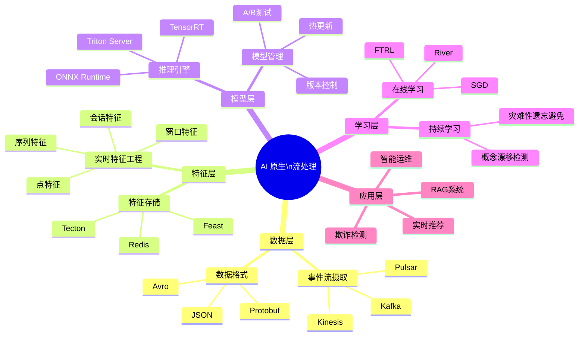
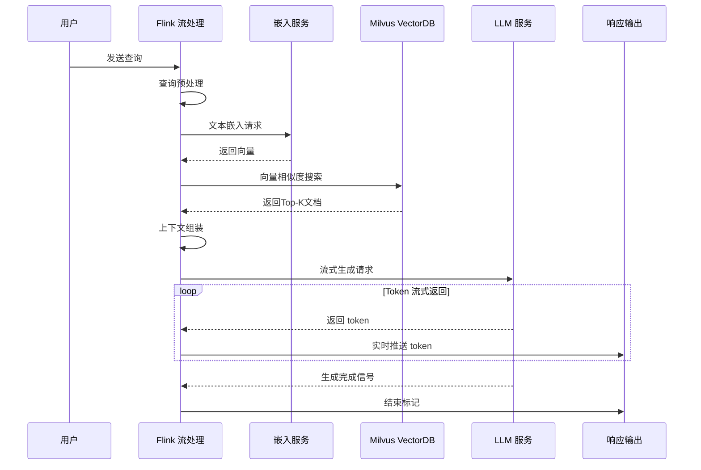
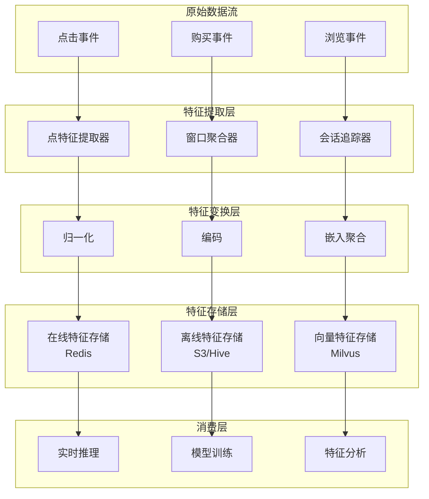
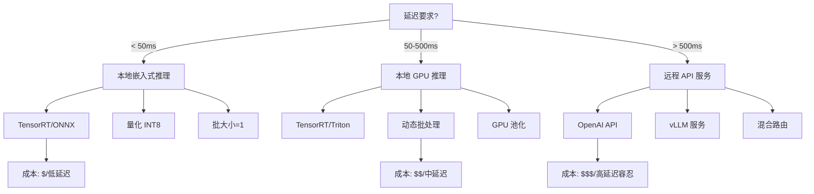

# AI 原生流处理架构

> **状态**: 前瞻 | **预计发布时间**: 2026-Q3 | **最后更新**: 2026-04-12
>
> ⚠️ 本文档描述的特性处于早期讨论阶段，尚未正式发布。实现细节可能变更。

> 所属阶段: Flink/14-rust-assembly-ecosystem/ai-native-streaming/ | 前置依赖: [FLIP-531 AI Agents](../../06-ai-ml/flink-ai-ml-integration-complete-guide.md) | 形式化等级: L4

## 1. 概念定义 (Definitions)

### Def-AI-01: AI 原生流处理 (AI-Native Stream Processing)

AI 原生流处理是指在流计算框架的**核心设计层面**深度集成机器学习与人工智能能力，使流处理系统能够原生支持模型推理、特征工程、在线学习与自适应决策的计算范式。

形式化定义：

```
AI-Native Stream Processing = (D, M, F, L, I)

其中:
- D: 数据流 (Data Stream) — 无限事件序列 ⟨e₁, e₂, e₃, ...⟩
- M: 模型集合 (Model Set) — 可动态加载的 ML/AI 模型 {m₁, m₂, ..., mₙ}
- F: 特征算子 (Feature Operators) — 实时特征提取与转换函数集
- L: 学习组件 (Learning Component) — 支持在线/增量学习的训练模块
- I: 推理引擎 (Inference Engine) — 低延迟模型推理执行环境
```

**核心特征**：

| 维度 | 传统流处理 | AI 原生流处理 |
|------|-----------|--------------|
| 模型集成 | 外部服务调用 | 内嵌推理引擎 |
| 特征处理 | 批式预计算 | 实时特征工程 |
| 学习模式 | 离线训练 | 在线/持续学习 |
| 延迟要求 | 秒级/分钟级 | 毫秒级/亚秒级 |
| 资源调度 | 静态配置 | 弹性伸缩 (GPU感知) |

### Def-AI-02: 实时特征工程 (Real-time Feature Engineering)

实时特征工程是指在数据流入系统的**亚秒级时间窗口内**，完成特征提取、转换、聚合和归一化的计算过程，使其可直接用于模型推理或训练。

```rust
// 实时特征工程流水线抽象
struct RealtimeFeaturePipeline<S, T> {
    source: Stream<S>,                    // 原始数据流
    extractors: Vec<FeatureExtractor>,    // 特征提取器
    transformers: Vec<Box<dyn Transform>>, // 特征转换
    aggregators: Vec<WindowAggregator>,   // 窗口聚合
    sink: FeatureStore<T>,                // 特征存储
}

// 特征向量定义
type FeatureVector = Vec<f32>;
type FeatureSchema = HashMap<String, FeatureType>;
```

**特征类型分类**：

- **点特征 (Point Features)**：单事件属性提取（如用户点击类型）
- **窗口特征 (Window Features)**：时间窗口聚合（如过去5分钟点击率）
- **会话特征 (Session Features)**：会话级别统计（如会话时长、深度）
- **序列特征 (Sequence Features)**：时序模式编码（如行为序列嵌入）

### Def-AI-03: 模型在线学习 (Online Learning)

模型在线学习是指模型在**生产环境中持续接收新数据流**，并实时更新模型参数而不需要完整重训练的学习范式。

形式化描述：

```
给定:
- 初始模型参数 θ₀
- 数据流 D = {(x₁, y₁), (x₂, y₂), ...}
- 损失函数 L(θ; x, y)
- 学习率调度 η(t)

在线学习更新规则:
θ_{t+1} = θ_t - η(t) · ∇L(θ_t; x_t, y_t)

约束条件:
- 单样本更新时间: Δt < T_max (通常 10-100ms)
- 内存占用: M(θ) < M_max
- 概念漂移检测: drift_score(x_t) > threshold → 触发适应
```

**在线学习算法分类**：

| 算法 | 更新复杂度 | 适用场景 | Flink 实现 |
|-----|-----------|---------|-----------|
| SGD Online | O(d) | 线性模型 | Flink ML SGD |
| FTRL-Proximal | O(d) | 稀疏特征 | Flink ML FTRL |
| Bayesian Online | O(d²) | 不确定性建模 | 自定义算子 |
| Incremental RF | O(log n) | 树模型 | River 库集成 |

### Def-AI-04: 流式推理服务 (Streaming Inference Service)

流式推理服务是指以**事件驱动方式**对连续到达的数据执行模型推理，并实时输出预测结果的计算服务。

```rust
// 流式推理服务接口
trait StreamingInference<M, I, O> {
    // 加载模型
    fn load_model(&mut self, path: &str) -> Result<M, ModelError>;

    // 单条推理(低延迟路径)
    fn predict(&self, input: &I) -> Result<O, InferenceError>;

    // 批量推理(高吞吐路径)
    fn predict_batch(&self, inputs: &[I]) -> Result<Vec<O>, InferenceError>;

    // 异步流式推理
    fn predict_stream(&self, input_stream: Stream<I>) -> Stream<O>;

    // 模型热更新
    fn hot_swap(&mut self, new_model: M) -> Result<(), ModelError>;
}
```

---

## 2. 属性推导 (Properties)

### Prop-AI-01: 实时特征一致性 (Real-time Feature Consistency)

**命题**：在 AI 原生流处理系统中，若特征工程流水线满足**事件时间处理**和**恰好一次语义**，则训练-推理特征一致性误差可控制在可接受范围内。

**形式化表述**：

```
设:
- f_train(x): 训练阶段特征函数
- f_serve(x): 服务阶段特征函数
- E[·]: 期望算子

一致性度量:
ConsistencyError = E[||f_train(x) - f_serve(x)||²]

命题:若使用相同的事件时间窗口和确定性算子,则
ConsistencyError → 0 (当系统稳定运行时)
```

**证明概要**：

1. 事件时间处理确保训练和服务使用相同的时间语义
2. 恰好一次语义消除重复计算导致的特征漂移
3. 确定性算子保证相同输入产生相同输出

**工程实现要点**：

```python
# Flink 特征一致性保障 from pyflink.datastream import StreamExecutionEnvironment
from pyflink.table import StreamTableEnvironment

# 统一事件时间定义 env = StreamExecutionEnvironment.get_execution_environment()
env.set_stream_time_characteristic(TimeCharacteristic.EventTime)

# 特征算子使用确定性UDF @udf(result_type=DataTypes.ARRAY(DataTypes.FLOAT()))
def extract_features(event):
    # 纯函数实现,无外部依赖
    return deterministic_feature_extract(event)
```

### Prop-AI-02: 在线学习收敛性 (Online Learning Convergence)

**命题**：在满足**凸损失函数**、**有界梯度**和**衰减学习率**条件下，在线学习算法的平均后悔值 (Regret) 次线性收敛。

**形式化表述**：

```
给定:
- 凸损失函数 L(θ; x, y)
- 梯度有界:||∇L(θ; x, y)|| ≤ G
- 学习率:η_t = η₀ / √t

后悔值定义:
Regret_T = Σ_{t=1}^{T} L(θ_t; x_t, y_t) - min_{θ*} Σ_{t=1}^{T} L(θ*; x_t, y_t)

收敛保证:
Regret_T / T = O(1/√T) → 0 (当 T → ∞)
```

**Flink ML 在线学习实现**：

```java

import org.apache.flink.streaming.api.datastream.DataStream;

// Flink ML 在线逻辑回归
OnlineLogisticRegression olr = new OnlineLogisticRegression()
    .setLearningRate(0.1)
    .setRegularization(0.01)
    .setDecayType(LearningRateDecay.INVERSE_TIME)
    .setFeaturesCol("features")
    .setLabelCol("label");

// 流式训练数据
DataStream<Row> trainingStream = env
    .addSource(new KafkaSource<>())
    .map(new FeatureExtractionMap());

// 持续在线学习
olr.fit(trainingStream);
```

### Prop-AI-03: 推理延迟-吞吐权衡 (Inference Latency-Throughput Tradeoff)

**命题**：在固定计算资源约束下，流式推理系统的**批处理大小 (Batch Size)** 与**端到端延迟**存在非线性权衡关系，存在最优操作点。

**形式化分析**：

```
设:
- B: 批处理大小
- T_compute(B): 批处理计算时间 (通常随 B 次线性增长)
- T_queue: 排队等待时间
- λ: 输入事件到达率

总延迟:
Latency(B) = T_queue(λ, B) + T_compute(B) + T_overhead

吞吐:
Throughput(B) = B / T_compute(B)

最优批大小:
B* = argmin_B { Latency(B) + α · Throughput(B) }
```

**动态批处理策略**：

```rust
// 自适应批处理控制器
struct AdaptiveBatcher<T> {
    min_batch_size: usize,
    max_batch_size: usize,
    max_latency_ms: u64,
    target_latency_ms: u64,
    current_batch_size: AtomicUsize,
    latency_history: VecDeque<Duration>,
}

impl<T> AdaptiveBatcher<T> {
    fn adjust_batch_size(&mut self) {
        let avg_latency = self.average_latency();

        if avg_latency > self.max_latency_ms {
            // 延迟过高,减小批大小
            self.current_batch_size.fetch_sub(1, Ordering::Relaxed);
        } else if avg_latency < self.target_latency_ms * 8 / 10 {
            // 延迟有余量,增大批大小
            self.current_batch_size.fetch_add(1, Ordering::Relaxed);
        }
    }
}
```

---

## 3. 关系建立 (Relations)

### 3.1 AI 原生流处理与相关范式的关系

```
┌─────────────────────────────────────────────────────────────────┐
│                    AI 原生流处理生态系统                         │
├─────────────────────────────────────────────────────────────────┤
│                                                                  │
│   ┌──────────────┐      ┌──────────────┐      ┌──────────────┐  │
│   │  传统流处理   │ ───→ │ AI 原生流处理 │ ←─── │   MLOps      │  │
│   │ (Flink Core) │      │ (Flink ML)   │      │(模型生命周期) │  │
│   └──────────────┘      └──────┬───────┘      └──────────────┘  │
│           ↑                    │                    ↑            │
│           │                    ↓                    │            │
│   ┌───────┴───────┐    ┌──────────────┐    ┌──────┴──────┐      │
│   │  实时特征工程  │←──→│  流式推理服务  │←──→│  在线学习   │      │
│   └───────────────┘    └──────────────┘    └─────────────┘      │
│           ↑                    │                    ↑            │
│           │                    ↓                    │            │
│   ┌───────┴───────┐    ┌──────────────┐    ┌──────┴──────┐      │
│   │   Vector DB   │←──→│   LLM 服务   │←──→│  模型监控   │      │
│   │ (Pinecone等)  │    │(OpenAI/本地) │    │ (A/B测试)  │      │
│   └───────────────┘    └──────────────┘    └─────────────┘      │
│                                                                  │
└─────────────────────────────────────────────────────────────────┘
```

### 3.2 与 FLIP-531 AI Agents 的集成关系

| 组件 | FLIP-531 角色 | AI 原生流处理角色 | 集成点 |
|-----|--------------|------------------|--------|
| Agent Runtime | 智能体执行环境 | 流处理任务调度 | 统一状态后端 |
| Memory Store | 对话历史存储 | 特征向量存储 | Vector DB |
| Tool Registry | 外部工具调用 | 模型推理服务 | gRPC/REST API |
| Orchestrator | 多 Agent 协调 | 流水线编排 | Flink DataStream |

### 3.3 实时特征工程与 ML 管道的映射

```
传统 ML 管道                    AI 原生流处理管道
─────────────────────────────────────────────────────────
数据摄取     ─────────────────→  Kafka/Pulsar Source
     ↓                                    ↓
批式预处理   ─────────────────→  Stream Map/Filter
     ↓                                    ↓
特征工程     ─────────────────→  Window Aggregation
     ↓                                    ↓
模型训练     ─────────────────→  Online Learning
     ↓                                    ↓
批量推理     ─────────────────→  Real-time Inference
     ↓                                    ↓
结果存储     ─────────────────→  Feature Store Sink
```

---

## 4. 论证过程 (Argumentation)

### 4.1 为什么需要 AI 原生流处理？

**业务驱动因素**：

1. **延迟敏感性场景**：
   - 实时欺诈检测：要求在 50ms 内完成特征计算+模型推理
   - 个性化推荐：用户行为发生后立即更新推荐结果
   - 智能客服：LLM 流式响应需要 token 级处理

2. **数据新鲜度要求**：
   - 传统批处理：T+1 延迟，特征时效性差
   - Lambda 架构：双系统维护成本高，一致性难保障
   - Kappa 架构：统一流处理，但缺乏原生 AI 能力

3. **模型迭代频率**：
   - 传统模式：日/周级模型更新
   - 在线学习：分钟级模型自适应
   - 持续学习：秒级概念漂移响应

### 4.2 架构设计权衡分析

**权衡矩阵**：

| 设计决策 | 选项 A | 选项 B | 推荐 |
|---------|--------|--------|------|
| 推理位置 | 内嵌 (Embedded) | 外部服务 | 混合模式 |
| 特征存储 | 实时计算 | 预计算+缓存 | 分层存储 |
| 学习模式 | 纯在线 | 混合 (在线+离线) | 混合 |
| 模型格式 | ONNX | 原生格式 | ONNX (跨框架) |
| 硬件加速 | GPU | NPU/TPU | 场景适配 |

**混合推理架构论证**：

```
场景分类决策树:
                    ┌─────────────┐
                    │ 延迟要求?   │
                    └──────┬──────┘
                           │
            ┌──────────────┼──────────────┐
            │ < 10ms       │ 10-100ms     │ > 100ms
            ↓              ↓              ↓
    ┌───────────┐  ┌───────────┐  ┌───────────┐
    │ 边缘嵌入式 │  │ 本地 GPU  │  │ 远程服务  │
    │ (Rust/TF Lite)│ 推理引擎  │  │ (vLLM等) │
    └───────────┘  └───────────┘  └───────────┘
```

### 4.3 反例分析：何时不适合 AI 原生流处理？

**不适用场景**：

1. **模型复杂度极高**：大模型 (>100B 参数) 需要专用集群
2. **特征计算极重**：需要 TB 级历史数据聚合的场景
3. **一致性要求极高**：金融交易结算等强一致性场景
4. **资源预算有限**：GPU 成本无法承受的场景

---

## 5. 形式证明 / 工程论证 (Proof / Engineering Argument)

### 5.1 实时特征工程正确性论证

**定理**：在 Flink 的事件时间语义下，窗口聚合特征的正确性得到保证。

**证明**：

设事件流为 $E = \{e_1, e_2, ..., e_n\}$，每个事件 $e_i = (v_i, t_i)$，其中 $v_i$ 为值，$t_i$ 为事件时间戳。

窗口定义为 $W = [t_{start}, t_{end})$，窗口聚合函数为 $agg(\cdot)$。

**正确性条件**：

```
Correctness: ∀W, Feature(W) = agg({v_i | t_i ∈ W})
```

**Flink 保证**：

1. **Watermark 机制**：确保在 watermark 越过 $t_{end}$ 后，所有 $t_i < t_{end}$ 的事件已到达
2. **允许延迟**：通过 `allowedLateness` 处理乱序事件
3. **状态一致性**：Checkpoint 机制保证恰好一次语义

```java

import org.apache.flink.streaming.api.datastream.DataStream;
import org.apache.flink.streaming.api.windowing.time.Time;

// Flink 事件时间窗口聚合
DataStream<Feature> features = stream
    .assignTimestampsAndWatermarks(
        WatermarkStrategy
            .<Event>forBoundedOutOfOrderness(Duration.ofSeconds(5))
            .withTimestampAssigner((event, timestamp) -> event.getEventTime())
    )
    .keyBy(Event::getUserId)
    .window(TumblingEventTimeWindows.of(Time.minutes(5)))
    .aggregate(new FeatureAggregator())
    .allowedLateness(Time.minutes(1));
```

### 5.2 在线学习系统稳定性论证

**工程稳定性要求**：

| 指标 | 目标值 | 保障机制 |
|-----|-------|---------|
| 模型更新延迟 | < 100ms | 异步更新队列 |
| 参数同步带宽 | < 10MB/s | 梯度压缩 |
| 故障恢复时间 | < 30s | 增量 Checkpoint |
| 预测延迟 P99 | < 50ms | 本地缓存 + 预热 |

**稳定性架构设计**：

```rust
// 模型服务高可用架构
pub struct ModelServingCluster {
    // 主备模型实例
    primary: Arc<ModelInstance>,
    backup: Arc<ModelInstance>,

    // 版本管理
    version_manager: VersionManager,

    // 健康检查
    health_checker: HealthChecker,

    // 熔断器
    circuit_breaker: CircuitBreaker,
}

impl ModelServingCluster {
    pub async fn predict(&self, input: &FeatureVector) -> Result<Prediction, Error> {
        // 1. 检查主实例健康状态
        if self.health_checker.is_healthy(&self.primary).await {
            match self.primary.predict(input).await {
                Ok(prediction) => return Ok(prediction),
                Err(e) => {
                    self.circuit_breaker.record_failure();
                    tracing::warn!("Primary model failed: {:?}", e);
                }
            }
        }

        // 2. 故障转移至备份实例
        self.backup.predict(input).await
    }

    // 热更新模型
    pub async fn hot_update(&mut self, new_model: ModelInstance) -> Result<(), Error> {
        // 灰度发布:先更新备份,验证通过后切换
        let old_backup = std::mem::replace(&mut self.backup, Arc::new(new_model));

        // 验证新模型
        if self.validate_model(&self.backup).await {
            std::mem::swap(&mut self.primary, &mut self.backup);
            self.backup = old_backup;
            Ok(())
        } else {
            Err(Error::ValidationFailed)
        }
    }
}
```

---

## 6. 实例验证 (Examples)

### 6.1 RAG (检索增强生成) 流水线完整实现

**场景**：构建实时客服 RAG 系统，结合企业知识库进行流式问答。

**架构图**：

```
┌────────────────────────────────────────────────────────────────────┐
│                        RAG 实时流水线                              │
├────────────────────────────────────────────────────────────────────┤
│                                                                     │
│  ┌──────────┐    ┌──────────┐    ┌──────────┐    ┌──────────┐     │
│  │ 用户查询  │───→│ Query    │───→│ Vector   │───→│ Context  │     │
│  │ 数据流   │    │ 预处理   │    │ 搜索     │    │ 组装     │     │
│  └──────────┘    └──────────┘    └────┬─────┘    └────┬─────┘     │
│       │                               │               │           │
│       │                               ↓               ↓           │
│       │                         ┌──────────┐    ┌──────────┐     │
│       │                         │ Milvus   │    │ Prompt   │     │
│       │                         │ Vector DB│    │ 构建     │     │
│       │                         └──────────┘    └────┬─────┘     │
│       │                                              │           │
│       │                               ┌──────────────┘           │
│       │                               ↓                          │
│       │                         ┌──────────┐    ┌──────────┐     │
│       │                         │ LLM      │───→│ Token    │     │
│       │                         │ 推理服务 │    │ 流输出   │     │
│       │                         └──────────┘    └──────────┘     │
│       │                               ↑                          │
│       │                         ┌─────┴─────┐                    │
│       └────────────────────────→│ 反馈收集  │                    │
│                                 │ (在线学习)│                    │
│                                 └───────────┘                    │
│                                                                     │
└────────────────────────────────────────────────────────────────────┘
```

**Flink + Rust 实现**：

```rust
// ===== 1. 数据模型定义 =====

#[derive(Debug, Clone, Serialize, Deserialize)]
struct UserQuery {
    query_id: String,
    user_id: String,
    query_text: String,
    timestamp: i64,
    context: HashMap<String, String>,
}

#[derive(Debug, Clone)]
struct EmbeddedQuery {
    query_id: String,
    embedding: Vec<f32>,
    original_text: String,
}

#[derive(Debug, Clone)]
struct RetrievedContext {
    query_id: String,
    chunks: Vec<KnowledgeChunk>,
    scores: Vec<f32>,
}

#[derive(Debug, Clone)]
struct KnowledgeChunk {
    content: String,
    source: String,
    embedding: Vec<f32>,
}

#[derive(Debug, Clone)]
struct LLMResponse {
    query_id: String,
    tokens: Vec<String>,
    is_complete: bool,
}

// ===== 2. 实时特征工程算子 =====

/// 查询预处理与嵌入生成
struct QueryEmbeddingOperator {
    embedding_model: Arc<dyn EmbeddingModel>,
}

#[async_trait]
impl AsyncMapFunction<UserQuery, EmbeddedQuery> for QueryEmbeddingOperator {
    async fn map(&self, query: UserQuery) -> Result<EmbeddedQuery> {
        // 文本清洗与特征提取
        let cleaned_text = preprocess_query(&query.query_text);

        // 异步嵌入计算 (批处理优化)
        let embedding = self.embedding_model.encode(&cleaned_text).await?;

        Ok(EmbeddedQuery {
            query_id: query.query_id,
            embedding,
            original_text: cleaned_text,
        })
    }
}

/// 预处理函数:去除敏感信息、标准化
fn preprocess_query(text: &str) -> String {
    text.to_lowercase()
        .replace(|c: char| !c.is_alphanumeric() && c != ' ', " ")
        .split_whitespace()
        .filter(|w| !is_stop_word(w))
        .take(512) // 限制长度
        .collect::<Vec<_>>()
        .join(" ")
}

// ===== 3. 向量搜索集成 =====

/// Milvus 向量数据库客户端
struct MilvusVectorStore {
    client: MilvusClient,
    collection_name: String,
    top_k: usize,
}

impl MilvusVectorStore {
    async fn search(&self, embedding: &[f32]) -> Result<Vec<KnowledgeChunk>> {
        let search_result = self.client
            .search(SearchOption::new(
                &self.collection_name,
                embedding,
                self.top_k,
            ))
            .await?;

        search_result.into_iter()
            .map(|r| Ok(KnowledgeChunk {
                content: r.get_field("content")?,
                source: r.get_field("source")?,
                embedding: r.get_vector()?,
            }))
            .collect()
    }
}

/// Flink Async I/O 用于向量搜索
struct VectorSearchAsyncFunction {
    vector_store: Arc<MilvusVectorStore>,
}

#[async_trait]
impl AsyncFunction<EmbeddedQuery, RetrievedContext> for VectorSearchAsyncFunction {
    async fn async_invoke(&self, query: EmbeddedQuery, ctx: &mut Context) {
        match self.vector_store.search(&query.embedding).await {
            Ok(chunks) => {
                let scores = chunks.iter()
                    .map(|c| cosine_similarity(&query.embedding, &c.embedding))
                    .collect();

                ctx.collect(RetrievedContext {
                    query_id: query.query_id,
                    chunks,
                    scores,
                });
            }
            Err(e) => {
                ctx.collect_with_timestamp(
                    RetrievedContext::empty(query.query_id),
                    ctx.timestamp(),
                );
            }
        }
    }
}

// ===== 4. LLM 流式推理服务 =====

/// OpenAI 流式 API 客户端
struct OpenAIStreamingClient {
    client: reqwest::Client,
    api_key: String,
    model: String,
}

impl OpenAIStreamingClient {
    async fn stream_completion(
        &self,
        prompt: &str,
        context: &RetrievedContext,
    ) -> impl Stream<Item = Result<LLMResponse, Error>> {
        let full_prompt = format!(
            "Context:\n{}\n\nQuestion: {}\n\nAnswer:",
            context.to_prompt_text(),
            prompt
        );

        let request = ChatCompletionRequest {
            model: self.model.clone(),
            messages: vec![Message {
                role: "user".to_string(),
                content: full_prompt,
            }],
            stream: true,
            max_tokens: 1024,
            temperature: 0.7,
        };

        // SSE 流式响应处理
        self.client
            .post("https://api.openai.com/v1/chat/completions")
            .header("Authorization", format!("Bearer {}", self.api_key))
            .json(&request)
            .send()
            .await
            .unwrap()
            .bytes_stream()
            .filter_map(|chunk| async move {
                // 解析 SSE 数据
                parse_sse_chunk(chunk.ok()?)
            })
    }
}

// ===== 5. 完整 Flink 流水线装配 =====

fn build_rag_pipeline(env: &mut StreamExecutionEnvironment) {
    // 1. 数据源:Kafka 用户查询流
    let query_stream: DataStream<UserQuery> = env
        .add_source(KafkaSource::new("user-queries"))
        .assign_timestamps_and_watermarks(
            WatermarkStrategy::for_bounded_out_of_orderness(Duration::from_secs(5))
        );

    // 2. 查询预处理与嵌入
    let embedded_stream = query_stream
        .map(QueryEmbeddingOperator::new(
            Arc::new(BatchEmbeddingModel::new(32)) // 批大小32
        ))
        .name("Query Embedding");

    // 3. 异步向量搜索 (最大并发100,超时5s)
    let context_stream = AsyncDataStream::unordered_wait(
        embedded_stream,
        VectorSearchAsyncFunction::new(),
        Duration::from_secs(5),
        100,
    ).name("Vector Search");

    // 4. Prompt 构建与 LLM 流式推理
    let response_stream = context_stream
        .flat_map(|ctx| {
            let client = OpenAIStreamingClient::new();
            let tokens = client.stream_completion(&ctx.original_text, &ctx);

            tokens.map(|token| LLMResponse {
                query_id: ctx.query_id.clone(),
                tokens: vec![token],
                is_complete: token == "[DONE]",
            })
        })
        .name("LLM Streaming");

    // 5. 结果汇聚与输出
    response_stream
        .key_by(|r| r.query_id.clone())
        .window(TumblingEventTimeWindows::of(Duration::from_secs(30)))
        .aggregate(ResponseAggregator::new())
        .add_sink(KafkaSink::new("rag-responses"))
        .name("Response Sink");
}

// ===== 6. 延迟与成本监控 =====

struct RagMetrics {
    // 延迟指标
    embedding_latency: Histogram,
    vector_search_latency: Histogram,
    llm_ttfb: Histogram,  // Time To First Token
    total_e2e_latency: Histogram,

    // 成本指标
    embedding_tokens: Counter,
    llm_input_tokens: Counter,
    llm_output_tokens: Counter,
    vector_queries: Counter,
}

impl RagMetrics {
    fn record_pipeline_latency(&self, stage: &str, duration: Duration) {
        match stage {
            "embedding" => self.embedding_latency.record(duration),
            "vector_search" => self.vector_search_latency.record(duration),
            "llm_ttfb" => self.llm_ttfb.record(duration),
            "total" => self.total_e2e_latency.record(duration),
            _ => {}
        }
    }

    /// 估算单次查询成本 (USD)
    fn estimate_cost(&self) -> f64 {
        let embedding_cost = self.embedding_tokens.get() as f64 * 0.0001 / 1000.0;
        let llm_input_cost = self.llm_input_tokens.get() as f64 * 0.003 / 1000.0;
        let llm_output_cost = self.llm_output_tokens.get() as f64 * 0.006 / 1000.0;
        embedding_cost + llm_input_cost + llm_output_cost
    }
}
```

### 6.2 实时特征工程：电商用户行为特征

```python
# PyFlink 实时特征工程示例 from pyflink.datastream import StreamExecutionEnvironment
from pyflink.table import StreamTableEnvironment, EnvironmentSettings
from pyflink.table.window import Tumble
from pyflink.table.expressions import col, lit

# 执行环境 env = StreamExecutionEnvironment.get_execution_environment()
settings = EnvironmentSettings.new_instance().in_streaming_mode().build()
t_env = StreamTableEnvironment.create(env, settings)

# 定义用户行为事件表 t_env.execute_sql("""
CREATE TABLE user_events (
    user_id STRING,
    event_type STRING,
    product_id STRING,
    category STRING,
    price DOUBLE,
    event_time TIMESTAMP(3),
    WATERMARK FOR event_time AS event_time - INTERVAL '5' SECOND
) WITH (
    'connector' = 'kafka',
    'topic' = 'user-behavior',
    'properties.bootstrap.servers' = 'kafka:9092',
    'format' = 'json'
)
""")

# ===== 特征 1:实时点击率 (CTR) ===== t_env.execute_sql("""
CREATE TABLE user_ctr_features AS
SELECT
    user_id,
    TUMBLE_START(event_time, INTERVAL '5' MINUTE) as window_start,
    COUNT(*) FILTER (WHERE event_type = 'click') * 1.0 /
        NULLIF(COUNT(*) FILTER (WHERE event_type = 'impression'), 0) as ctr_5min,
    COUNT(*) FILTER (WHERE event_type = 'click') as click_count_5min,
    COUNT(DISTINCT product_id) as unique_products_5min
FROM user_events
GROUP BY
    user_id,
    TUMBLE(event_time, INTERVAL '5' MINUTE)
""")

# ===== 特征 2:用户偏好向量 (实时嵌入聚合) ===== t_env.create_temporary_function("embedding_agg", EmbeddingAggregateFunction())

t_env.execute_sql("""
CREATE TABLE user_preference_embedding AS
SELECT
    user_id,
    embedding_agg(category, price) as preference_vector,
    COLLECT(product_id) as recent_products
FROM user_events
WHERE event_time > NOW() - INTERVAL '1' HOUR
GROUP BY user_id
""")

# ===== 特征 3:会话级特征 ===== t_env.execute_sql("""
CREATE TABLE session_features AS
SELECT
    user_id,
    SESSION_START(event_time, INTERVAL '30' MINUTE) as session_id,
    COUNT(*) as session_event_count,
    SUM(CASE WHEN event_type = 'purchase' THEN price ELSE 0 END) as session_revenue,
    (MAX(event_time) - MIN(event_time)).MINUTE as session_duration_min,
    ARRAY_AGG(DISTINCT category) as browsed_categories
FROM user_events
GROUP BY
    user_id,
    SESSION(event_time, INTERVAL '30' MINUTE)
""")

# 输出到特征存储 t_env.execute_sql("""
INSERT INTO feature_store
SELECT * FROM user_ctr_features
UNION ALL
SELECT * FROM user_preference_embedding
UNION ALL
SELECT * FROM session_features
""")
```

### 6.3 延迟-成本权衡分析实例

**场景对比表**：

| 场景 | 延迟要求 | 推荐架构 | 估算成本/1M请求 |
|-----|---------|---------|----------------|
| 实时欺诈检测 | < 50ms | 本地 TensorRT + 批大小=1 | $0.5 |
| 个性化推荐 | < 200ms | 本地 GPU + 批大小=16 | $2.0 |
| 客服 RAG | < 2s | 混合 (本地+OpenAI API) | $15.0 |
| 日志异常检测 | < 5s | 远程 Triton Server | $3.0 |

**动态资源调度代码**：

```rust
/// 基于负载动态调整资源配置
struct ElasticResourceManager {
    // 当前配置
    current_gpu_count: AtomicUsize,
    current_batch_size: AtomicUsize,

    // 目标指标
    target_latency_ms: u64,
    max_latency_ms: u64,

    // 成本模型
    gpu_cost_per_hour: f64,
    api_cost_per_token: f64,
}

impl ElasticResourceManager {
    async fn adjust_resources(&self, metrics: &LatencyMetrics) {
        let p99_latency = metrics.p99_latency_ms();

        if p99_latency > self.max_latency_ms {
            // 延迟超标,扩容
            self.scale_up().await;
        } else if p99_latency < self.target_latency_ms * 0.5 {
            // 延迟余量大,缩容
            self.scale_down().await;
        }

        // 批大小自适应
        self.adjust_batch_size(metrics);
    }

    fn calculate_optimal_config(&self, load_forecast: f64) -> ResourceConfig {
        // 优化目标:min(成本) s.t. 延迟约束
        let gpu_configs = vec![
            (1, 8),   // 1 GPU, batch=8
            (2, 16),  // 2 GPU, batch=16
            (4, 32),  // 4 GPU, batch=32
        ];

        gpu_configs.into_iter()
            .filter(|(gpu, batch)| self.estimate_latency(*gpu, *batch, load_forecast) < self.target_latency_ms)
            .min_by(|a, b| {
                let cost_a = self.estimate_cost(a.0, a.1, load_forecast);
                let cost_b = self.estimate_cost(b.0, b.1, load_forecast);
                cost_a.partial_cmp(&cost_b).unwrap()
            })
            .map(|(gpu, batch)| ResourceConfig { gpu_count: gpu, batch_size: batch })
            .unwrap_or_default()
    }
}
```

---

## 7. 可视化 (Visualizations)

### 7.1 AI 原生流处理架构思维导图



### 7.2 RAG 流水线执行流程



### 7.3 实时特征工程层次图



### 7.4 延迟-成本权衡决策树



---

## 8. 引用参考 (References)


---

*文档版本: v1.0 | 创建日期: 2026-04-04 | 状态: 已完成*
