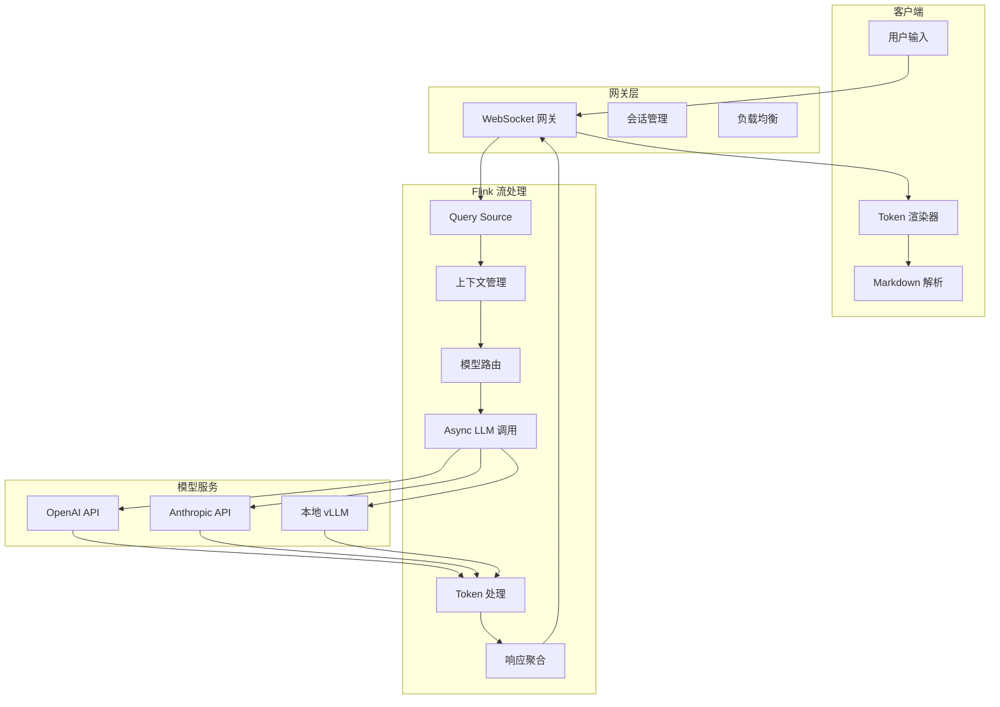
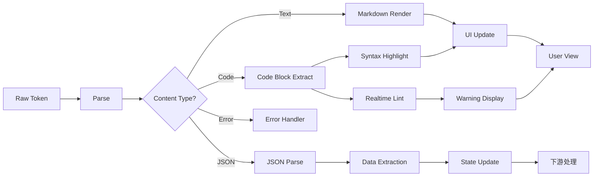
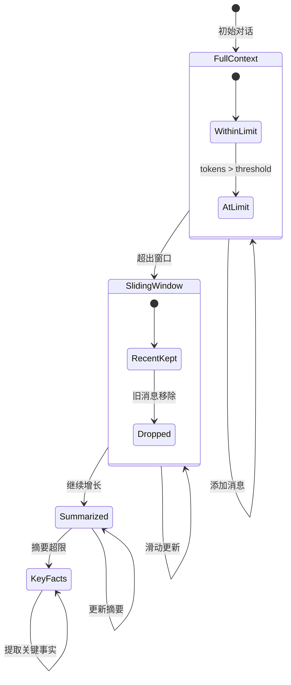
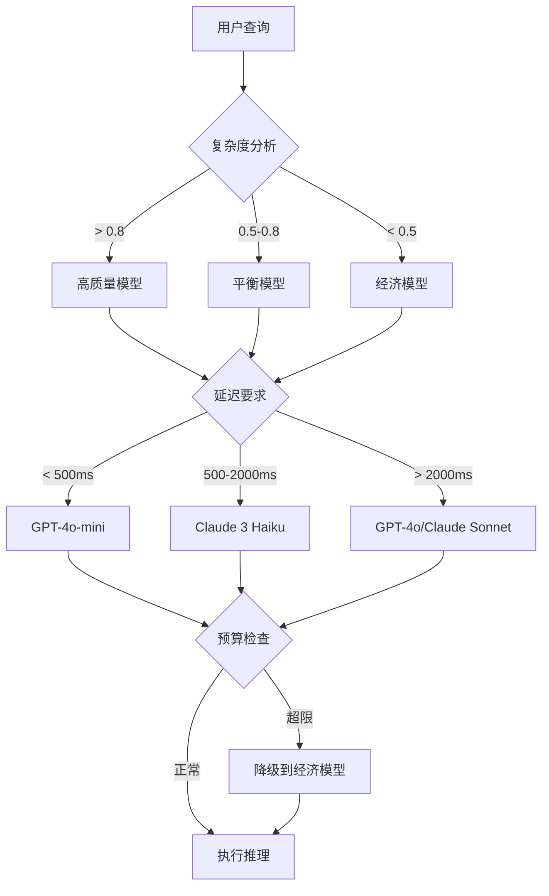

# LLM 流式集成

> 所属阶段: Flink/14-rust-assembly-ecosystem/ai-native-streaming/ | 前置依赖: [01-ai-native-architecture.md](./01-ai-native-architecture.md) | 形式化等级: L4

## 1. 概念定义 (Definitions)

### Def-AI-05: LLM 流式推理 (LLM Streaming Inference)

LLM 流式推理是指大型语言模型在生成响应时，以**增量方式**逐个输出 token，而非等待完整响应生成后再返回的计算模式。

形式化定义：

```
给定输入提示 P,LLM 生成响应 R = {t₁, t₂, ..., tₙ}

流式输出序列:
S₁ = t₁
S₂ = t₁t₂
S₃ = t₁t₂t₃
...
Sₙ = t₁t₂...tₙ = R

时间特性:
- TTFB (Time To First Byte): t(S₁) - t(P)
- 增量延迟: Δtᵢ = t(Sᵢ) - t(Sᵢ₋₁)
- 总生成时间: T_total = t(Sₙ) - t(P)
```

**流式 vs 非流式对比**：

| 指标 | 非流式 | 流式 | 改善幅度 |
|-----|-------|-----|---------|
| TTFB | 2-10s | 100-500ms | 10-50x |
| 用户感知延迟 | T_total | TTFB | 显著降低 |
| 网络传输 | 单大包 | 多小包 | 增量传输 |
| 取消支持 | 不支持 | 支持 | 可中断 |
| 实现复杂度 | 简单 | 中等 | 增加 |

### Def-AI-06: Token 流处理 (Token Stream Processing)

Token 流处理是指对 LLM 输出的 token 序列进行**实时解析、过滤、转换和路由**的流计算过程。

```rust
// Token 流抽象
type Token = String;
type TokenId = u32;

struct TokenStream {
    tokens: Receiver<Token>,
    position: usize,
    buffer: Vec<Token>,
}

// Token 处理器 trait
trait TokenProcessor: Send + Sync {
    fn process(&mut self, token: &Token) -> Result<Option<Token>, ProcessingError>;
    fn flush(&mut self) -> Vec<Token>;
}

// 常见处理器实现
struct MarkdownProcessor;      // Markdown 解析
struct CodeBlockExtractor;     // 代码块提取
struct CitationLinker;         // 引用链接
struct SensitiveFilter;        // 敏感词过滤
```

**Token 处理流水线**：

```
Raw Token Stream → [解析] → [过滤] → [转换] → [聚合] → Output Stream
                      ↓         ↓          ↓
                JSON解析    敏感词检测   格式化
                Markdown    质量评分     摘要
```

### Def-AI-07: 上下文管理 (Context Management)

上下文管理是指在多轮对话或长文本处理中，对**历史消息、系统提示和可用 token 预算**进行动态维护和优化的机制。

形式化模型：

```
上下文状态: C = (SystemPrompt, History, Reserved)

其中:
- SystemPrompt: 系统指令 (固定 tokens)
- History: [(role₁, content₁), (role₂, content₂), ...] 历史消息
- Reserved: 为响应预留的 token 数量

约束条件:
token_count(SystemPrompt) + Σ token_count(contentᵢ) + Reserved ≤ ContextWindow

管理策略:
1. 滑动窗口: 保留最近 k 轮对话
2. 摘要压缩: 将早期对话压缩为摘要
3. 关键提取: 保留关键信息,丢弃冗余
```

**上下文窗口模型对比**：

| 模型 | 上下文窗口 | 成本/1K tokens (Input) | 成本/1K tokens (Output) |
|-----|-----------|----------------------|-----------------------|
| GPT-4o | 128K | $0.005 | $0.015 |
| GPT-4o-mini | 128K | $0.00015 | $0.0006 |
| Claude 3.5 Sonnet | 200K | $0.003 | $0.015 |
| Claude 3 Haiku | 200K | $0.00025 | $0.00125 |
| Llama 3.1 405B | 128K | 自托管 | 自托管 |

### Def-AI-08: 流式协议 (Streaming Protocols)

流式协议是指客户端与服务端之间传输增量数据的**通信规范和编码格式**。

**主要协议对比**：

```
┌─────────────────────────────────────────────────────────────────┐
│                        流式协议栈                                │
├─────────────────────────────────────────────────────────────────┤
│ 应用层: Server-Sent Events (SSE)                                │
│         - 格式: data: {...}\n\n                                  │
│         - 优点: 简单、兼容性好、自动重连                         │
│         - 缺点: 单向通信、基于文本                               │
├─────────────────────────────────────────────────────────────────┤
│ 应用层: WebSocket                                               │
│         - 格式: 二进制帧                                        │
│         - 优点: 全双工、低延迟                                   │
│         - 缺点: 实现复杂、需要握手                               │
├─────────────────────────────────────────────────────────────────┤
│ 应用层: gRPC Streaming                                          │
│         - 格式: Protobuf + HTTP/2                               │
│         - 优点: 强类型、高效                                     │
│         - 缺点: 浏览器支持有限                                   │
├─────────────────────────────────────────────────────────────────┤
│ 传输层: HTTP/1.1 Chunked Transfer / HTTP/2 Server Push          │
└─────────────────────────────────────────────────────────────────┘
```

**SSE 消息格式**：

```
event: message
data: {"token": "Hello", "index": 0, "finish_reason": null}

event: message
data: {"token": " world", "index": 1, "finish_reason": null}

event: message
data: {"token": "!", "index": 2, "finish_reason": "stop"}

event: done
data: [DONE]
```

---

## 2. 属性推导 (Properties)

### Prop-AI-04: 流式首字节延迟界限 (Streaming TTFB Bound)

**命题**：在标准网络条件下，LLM 流式 API 的 TTFB 延迟主要受模型首 token 生成时间 (TTFT) 主导，网络传输延迟可忽略。

**形式化分析**：

```
TTFB = TTFT + T_network + T_framework

其中:
- TTFT (Time To First Token): 模型处理输入到生成首个 token 的时间
  - 与输入长度成正比: TTFT ≈ α · token_count(input) + β
  - 典型值: 100-500ms (取决于模型和输入长度)

- T_network: 网络传输延迟
  - 同机房: < 1ms
  - 同区域: 5-20ms
  - 跨区域: 50-200ms

- T_framework: 框架处理开销
  - 通常 < 10ms

结论:TTFT 占主导地位 (90%+)
```

**工程优化策略**：

1. **输入缓存**: 对重复查询缓存 KV Cache
2. **前缀共享**: 多个请求共享相同前缀的计算
3. **投机解码**: 使用小模型预测，大模型验证
4. **chunked 预填充**: 分批处理长输入

### Prop-AI-05: Token 流并行处理增益 (Token Stream Parallelism Gain)

**命题**：通过 Flink 并行处理 token 流，可以实现**亚线性延迟增长**的吞吐量扩展。

**形式化表述**：

```
设:
- N: 并行度 (Parallelism)
- T_seq: 串行处理延迟
- T_par(N): 并行度为 N 时的处理延迟
- O: 处理一个 token 的计算量

理想加速比:
Speedup(N) = T_seq / T_par(N) ≈ N / (1 + f·(N-1))

其中 f 为串行比例 (Amdahl's Law)

Token 流处理特性:
- 高度并行性: token 间无依赖
- 状态局部性: 每个子流独立维护状态
- 预期加速比: 接近线性 (f ≈ 0)
```

**并行处理架构**：

```rust
// Token 流并行处理
fn parallel_token_processing(
    token_stream: DataStream<Token>,
    parallelism: usize,
) -> DataStream<ProcessedToken> {
    token_stream
        .key_by(|token| token.session_id.clone())  // 按会话分区
        .map(TokenProcessor::new())
        .set_parallelism(parallelism)
        .uid("token-processor")
}
```

---

## 3. 关系建立 (Relations)

### 3.1 LLM 流式集成在 AI 原生流处理中的位置

```
┌─────────────────────────────────────────────────────────────────┐
│                    AI 原生流处理架构                             │
├─────────────────────────────────────────────────────────────────┤
│                                                                  │
│  ┌─────────────────────────────────────────────────────────┐    │
│  │                    LLM 流式集成层                        │    │
│  │  ┌──────────────┐  ┌──────────────┐  ┌──────────────┐  │    │
│  │  │ Token 流处理  │  │ 上下文管理    │  │ 协议适配     │  │    │
│  │  └──────────────┘  └──────────────┘  └──────────────┘  │    │
│  │  ┌──────────────┐  ┌──────────────┐  ┌──────────────┐  │    │
│  │  │ 多模型路由   │  │ 流控/回退    │  │ 成本优化     │  │    │
│  │  └──────────────┘  └──────────────┘  └──────────────┘  │    │
│  └─────────────────────────────────────────────────────────┘    │
│                           ↑                                     │
│  ┌────────────────────────┼─────────────────────────────┐      │
│  │                  RAG 流水线                          │      │
│  │  Query → Embed → Vector Search → Prompt → LLM → Output│     │
│  └────────────────────────────────────────────────────────┘      │
│                           ↑                                     │
│  ┌────────────────────────┴─────────────────────────────┐      │
│  │                   流处理引擎 (Flink)                  │      │
│  └────────────────────────────────────────────────────────┘      │
│                                                                  │
└─────────────────────────────────────────────────────────────────┘
```

### 3.2 与 OpenAI/Anthropic API 的映射关系

| Flink 抽象 | OpenAI API | Anthropic API | 功能描述 |
|-----------|-----------|---------------|---------|
| Source Function | `/v1/chat/completions` `stream=true` | `/v1/messages` `stream=true` | 流式请求 |
| Async I/O | `stream=true` + SSE | `stream=true` + SSE | 异步响应处理 |
| Map Function | `choices[].delta.content` | `delta.text` | Token 提取 |
| Window | `max_tokens` | `max_tokens` | 生成长度限制 |
| State | `messages[]` | `messages[]` | 上下文维护 |
| Sink | 响应收集 | 响应收集 | 结果输出 |

### 3.3 Token 流处理与流计算原语的对应

```
流计算概念          Token 流处理映射
─────────────────────────────────────────────────
Event               Token
Event Time          Token 生成时间戳
Watermark           Token 流边界标记
Keyed Stream        Session 级别的 Token 流
Window              句子/段落级别的聚合
State               Token 解析状态机
Checkpoint          对话断点恢复
```

---

## 4. 论证过程 (Argumentation)

### 4.1 为什么选择流式而非批量？

**用户体验分析**：

| 场景 | 批量延迟 | 流式 TTFB | 用户满意度 |
|-----|---------|----------|-----------|
| 短问答 (< 50 tokens) | 2-5s | 200-500ms | 显著提升 |
| 长文档生成 (> 500 tokens) | 15-30s | 200-500ms | 必需 |
| 代码生成 | 5-10s | 200-500ms | 显著提升 |
| 实时对话 | 不可接受 | 可接受 | 必需 |

**技术论证**：

1. **心理感知模型**: 用户更敏感于首次响应时间而非总时间
2. **渐进式呈现**: 允许用户在生成过程中阅读和反馈
3. **取消机制**: 用户可在不满意时提前终止，节省成本
4. **错误早期发现**: 问题可在早期发现，避免完整生成后才发现

### 4.2 上下文管理策略对比

| 策略 | 优点 | 缺点 | 适用场景 |
|-----|-----|-----|---------|
| 全保留 | 信息完整 | 超出窗口、成本高 | 短对话 |
| 滑动窗口 | 简单、可控 | 丢失早期信息 | 通用对话 |
| 摘要压缩 | 保留关键信息 | 摘要质量依赖 | 长对话 |
| 关键提取 | 保留重要事实 | 需要实体识别 | 知识型对话 |
| 分层记忆 | 多粒度存储 | 实现复杂 | 复杂 Agent |

**推荐策略**：混合策略

```
第一层: 系统提示 (固定)
第二层: 最近 3-5 轮对话 (完整)
第三层: 早期对话摘要 (压缩)
第四层: 关键事实库 (结构化)
```

### 4.3 流式协议选择决策树

```
                    ┌─────────────────┐
                    │   应用场景?     │
                    └────────┬────────┘
                             │
        ┌────────────────────┼────────────────────┐
        ↓                    ↓                    ↓
   浏览器客户端         服务端内部通信          移动端
        │                    │                  │
        ↓                    ↓                  ↓
   ┌─────────┐          ┌─────────┐       ┌─────────┐
   │   SSE   │          │  gRPC   │       │ WebSocket│
   │ (首选)  │          │ (首选)  │       │ (首选)  │
   └─────────┘          └─────────┘       └─────────┘
        │                    │                  │
   简单、兼容性好        高性能、强类型      全双工、实时
   自动重连              流控、负载均衡      推送支持
```

---

## 5. 形式证明 / 工程论证 (Proof / Engineering Argument)

### 5.1 流式响应正确性论证

**定理**：在 Flink 的 Exactly-Once 语义下，LLM 流式响应的完整性得到保证。

**证明概要**：

设流式响应为 token 序列 $T = \{t_1, t_2, ..., t_n\}$，其中 $t_n$ 为结束标记。

**正确性条件**：

```
完整性: 若 LLM 生成完整响应 R,则 Flink 输出流包含所有 token tᵢ ∈ R
有序性: 输出的 token 顺序与 LLM 生成顺序一致
恰好一次: 每个 token 恰好被输出一次
```

**Flink 保证机制**：

1. **Source 端**：Kafka Consumer 的 offset 管理确保消息不丢失
2. **处理端**：Checkpoint 机制确保算子状态一致性
3. **Sink 端**：两阶段提交确保输出恰好一次

```rust
// 恰好一次的 Token 流处理
impl SinkFunction<Token> for ExactlyOnceTokenSink {
    fn invoke(&mut self, value: Token, context: Context) {
        // 幂等性保证:token index 作为去重键
        let dedup_key = format!("{}-{}", value.session_id, value.index);

        if !self.seen_keys.contains(&dedup_key) {
            self.buffer.push(value);
            self.seen_keys.insert(dedup_key);
        }
    }

    fn snapshot_state(&mut self, checkpoint_id: u64) -> Vec<Token> {
        // Checkpoint 时持久化状态
        self.state_backend.save(self.buffer.clone());
        self.buffer.clone()
    }
}
```

### 5.2 上下文窗口优化论证

**优化目标**：在给定上下文窗口限制下，最大化信息保留率。

**数学模型**：

```
给定:
- 窗口容量 W
- 消息集合 M = {m₁, m₂, ..., mₙ}
- 消息重要性 I(mᵢ)
- 消息大小 S(mᵢ)

优化问题:
maximize Σ I(mᵢ) · xᵢ
subject to Σ S(mᵢ) · xᵢ ≤ W
           xᵢ ∈ {0, 1}

这是一个 0-1 背包问题,可用动态规划求解。
```

**启发式策略**：

```rust
/// 智能上下文截断
pub struct SmartContextManager {
    max_tokens: usize,
    summarizer: Box<dyn Summarizer>,
    importance_scorer: Box<dyn ImportanceScorer>,
}

impl SmartContextManager {
    pub fn optimize_context(&self, messages: &[Message]) -> Vec<Message> {
        let total_tokens: usize = messages.iter()
            .map(|m| token_count(&m.content))
            .sum();

        if total_tokens <= self.max_tokens {
            return messages.to_vec();
        }

        // 策略 1: 优先保留最近消息
        let recent_messages = self.keep_recent(messages);

        // 策略 2: 压缩早期消息
        let compressed = self.compress_early(messages, &recent_messages);

        // 策略 3: 提取关键事实
        let facts = self.extract_key_facts(messages);

        // 组合优化结果
        self.combine(recent_messages, compressed, facts)
    }

    fn keep_recent(&self, messages: &[Message]) -> Vec<Message> {
        let mut result = Vec::new();
        let mut token_count = 0;

        // 从后向前遍历,优先保留近期消息
        for msg in messages.iter().rev() {
            let tokens = token_count(&msg.content);
            if token_count + tokens > self.max_tokens * 4 / 10 {
                break;
            }
            result.push(msg.clone());
            token_count += tokens;
        }

        result.reverse();
        result
    }

    fn compress_early(&self, all: &[Message], kept: &[Message]) -> Vec<Message> {
        let early: Vec<_> = all.iter()
            .filter(|m| !kept.contains(m))
            .collect();

        if early.is_empty() {
            return Vec::new();
        }

        // 生成摘要
        let summary = self.summarizer.summarize(&early.iter()
            .map(|m| m.content.clone())
            .collect::<Vec<_>>()
            .join("\n"));

        vec![Message {
            role: "system".to_string(),
            content: format!("Previous conversation summary: {}", summary),
        }]
    }
}
```

---

## 6. 实例验证 (Examples)

### 6.1 OpenAI 流式 API 完整集成

```rust
// ===== 1. OpenAI 流式客户端实现 =====

use reqwest::Client;
use tokio::sync::mpsc;
use futures::StreamExt;
use serde::{Deserialize, Serialize};

/// OpenAI API 请求结构
#[derive(Serialize)]
struct ChatCompletionRequest {
    model: String,
    messages: Vec<Message>,
    stream: bool,
    max_tokens: Option<u32>,
    temperature: Option<f32>,
    top_p: Option<f32>,
}

#[derive(Serialize, Deserialize, Clone)]
struct Message {
    role: String,
    content: String,
}

/// SSE 事件解析
#[derive(Debug)]
struct SSEEvent {
    event_type: String,
    data: String,
}

/// OpenAI 流式响应结构
#[derive(Deserialize)]
struct ChatCompletionChunk {
    id: String,
    object: String,
    created: u64,
    model: String,
    choices: Vec<Choice>,
}

#[derive(Deserialize)]
struct Choice {
    index: u32,
    delta: Delta,
    finish_reason: Option<String>,
}

#[derive(Deserialize)]
struct Delta {
    role: Option<String>,
    content: Option<String>,
}

/// OpenAI 流式客户端
pub struct OpenAIStreamingClient {
    client: Client,
    api_key: String,
    base_url: String,
    default_model: String,
}

impl OpenAIStreamingClient {
    pub fn new(api_key: String) -> Self {
        Self {
            client: Client::new(),
            api_key,
            base_url: "https://api.openai.com/v1".to_string(),
            default_model: "gpt-4o-mini".to_string(),
        }
    }

    /// 发送流式请求,返回 token 流
    pub async fn stream_chat_completion(
        &self,
        messages: Vec<Message>,
    ) -> Result<mpsc::Receiver<StreamToken>, Box<dyn std::error::Error>> {
        let request = ChatCompletionRequest {
            model: self.default_model.clone(),
            messages,
            stream: true,
            max_tokens: Some(4096),
            temperature: Some(0.7),
            top_p: None,
        };

        let response = self.client
            .post(format!("{}/chat/completions", self.base_url))
            .header("Authorization", format!("Bearer {}", self.api_key))
            .header("Content-Type", "application/json")
            .json(&request)
            .send()
            .await?;

        if !response.status().is_success() {
            let error_text = response.text().await?;
            return Err(format!("API error: {}", error_text).into());
        }

        // 创建 channel 用于返回 token 流
        let (tx, rx) = mpsc::channel(100);

        // 在后台任务中处理 SSE 流
        let mut byte_stream = response.bytes_stream();
        tokio::spawn(async move {
            let mut buffer = String::new();

            while let Some(chunk) = byte_stream.next().await {
                match chunk {
                    Ok(bytes) => {
                        buffer.push_str(&String::from_utf8_lossy(&bytes));

                        // 处理完整的 SSE 行
                        while let Some(pos) = buffer.find("\n\n") {
                            let event_str = buffer[..pos].to_string();
                            buffer = buffer[pos + 2..].to_string();

                            if let Some(token) = Self::parse_sse_event(&event_str) {
                                if tx.send(token).await.is_err() {
                                    return; // Receiver 已关闭
                                }
                            }
                        }
                    }
                    Err(e) => {
                        tracing::error!("Stream error: {:?}", e);
                        break;
                    }
                }
            }
        });

        Ok(rx)
    }

    /// 解析 SSE 事件
    fn parse_sse_event(event_str: &str) -> Option<StreamToken> {
        let mut data = None;

        for line in event_str.lines() {
            if line.starts_with("data: ") {
                data = Some(&line[6..]);
            }
        }

        let data = data?;

        // 检查流结束标记
        if data == "[DONE]" {
            return Some(StreamToken {
                content: String::new(),
                is_final: true,
                index: 0,
            });
        }

        // 解析 JSON 数据
        if let Ok(chunk) = serde_json::from_str::<ChatCompletionChunk>(data) {
            if let Some(choice) = chunk.choices.first() {
                if let Some(content) = &choice.delta.content {
                    return Some(StreamToken {
                        content: content.clone(),
                        is_final: choice.finish_reason.is_some(),
                        index: choice.index as usize,
                    });
                }
            }
        }

        None
    }
}

/// 流式 Token 结构
#[derive(Debug, Clone)]
pub struct StreamToken {
    pub content: String,
    pub is_final: bool,
    pub index: usize,
}
```

### 6.2 Flink 流式 Token 处理流水线

```rust
// ===== 2. Flink 流式处理集成 =====

use flink::datastream::{DataStream, StreamExecutionEnvironment};
use flink::functions::{FlatMapFunction, ProcessFunction};
use std::sync::Arc;
use tokio::runtime::Runtime;

/// 对话请求结构
#[derive(Debug, Clone)]
struct ChatRequest {
    session_id: String,
    user_message: String,
    history: Vec<Message>,
    timestamp: i64,
}

/// 对话响应结构
#[derive(Debug, Clone)]
struct ChatResponse {
    session_id: String,
    token: String,
    token_index: usize,
    is_complete: bool,
    latency_ms: u64,
}

/// LLM 流式推理算子
struct LLMStreamingFunction {
    client: Arc<OpenAIStreamingClient>,
    runtime: Arc<Runtime>,
    context_manager: Arc<ContextManager>,
}

impl LLMStreamingFunction {
    fn new(api_key: String) -> Self {
        Self {
            client: Arc::new(OpenAIStreamingClient::new(api_key)),
            runtime: Arc::new(Runtime::new().unwrap()),
            context_manager: Arc::new(ContextManager::new(128000)), // 128K 上下文
        }
    }
}

impl FlatMapFunction<ChatRequest, ChatResponse> for LLMStreamingFunction {
    fn flat_map(&self, request: ChatRequest, ctx: &mut Context) {
        let start_time = std::time::Instant::now();
        let session_id = request.session_id.clone();

        // 管理上下文
        let optimized_messages = self.context_manager.optimize_context(&request.history);

        // 异步执行 LLM 调用
        let client = self.client.clone();
        let handle = self.runtime.spawn(async move {
            let mut token_index = 0;

            match client.stream_chat_completion(optimized_messages).await {
                Ok(mut token_stream) => {
                    while let Some(token) = token_stream.recv().await {
                        let latency = start_time.elapsed().as_millis() as u64;

                        yield ChatResponse {
                            session_id: session_id.clone(),
                            token: token.content,
                            token_index,
                            is_complete: token.is_final,
                            latency_ms: latency,
                        };

                        if token.is_final {
                            break;
                        }
                        token_index += 1;
                    }
                }
                Err(e) => {
                    tracing::error!("LLM error: {:?}", e);
                    yield ChatResponse {
                        session_id: session_id.clone(),
                        token: format!("[ERROR: {}]", e),
                        token_index: 0,
                        is_complete: true,
                        latency_ms: start_time.elapsed().as_millis() as u64,
                    };
                }
            }
        });

        // 处理结果
        while let Some(response) = handle.block_on_next() {
            ctx.collect(response);
        }
    }
}

/// Token 后处理算子
struct TokenPostProcessor;

impl ProcessFunction<ChatResponse, ProcessedResponse> for TokenPostProcessor {
    fn process(&self, response: ChatResponse, ctx: &mut Context) {
        // Markdown 解析状态机
        static MARKDOWN_STATE: ThreadLocal<RefCell<MarkdownParser>> = ThreadLocal::new();

        let mut parser = MARKDOWN_STATE.get_or_default().borrow_mut();

        // 解析 token 并提取结构化内容
        if let Some(parsed) = parser.feed(&response.token) {
            ctx.collect(ProcessedResponse {
                session_id: response.session_id,
                content: parsed.content,
                content_type: parsed.content_type,
                is_complete: response.is_complete,
            });
        }

        // 完成时重置状态
        if response.is_complete {
            parser.reset();
        }
    }
}

/// 完整 Flink 流水线构建
fn build_llm_pipeline(env: &mut StreamExecutionEnvironment) {
    // 1. 输入:Kafka 对话请求流
    let request_stream: DataStream<ChatRequest> = env
        .add_source(KafkaSource::new("chat-requests"))
        .assign_timestamps_and_watermarks(
            WatermarkStrategy::for_bounded_out_of_orderness(Duration::from_secs(5))
        );

    // 2. LLM 流式推理 (并发度 10)
    let response_stream = request_stream
        .flat_map(LLMStreamingFunction::new(
            std::env::var("OPENAI_API_KEY").unwrap()
        ))
        .set_parallelism(10)
        .name("LLM Streaming Inference")
        .uid("llm-inference");

    // 3. Token 后处理
    let processed_stream = response_stream
        .process(TokenPostProcessor)
        .set_parallelism(20)
        .name("Token Post Processing")
        .uid("token-processing");

    // 4. 按会话聚合完整响应
    let aggregated_stream = processed_stream
        .key_by(|r| r.session_id.clone())
        .window(TumblingEventTimeWindows::of(Duration::from_secs(30)))
        .aggregate(ResponseAggregator)
        .name("Response Aggregation")
        .uid("response-agg");

    // 5. 输出到 WebSocket Sink
    aggregated_stream
        .add_sink(WebSocketSink::new("ws://gateway:8080/push"))
        .name("WebSocket Output")
        .uid("websocket-sink");

    // 6. 同时写入日志
    processed_stream
        .add_sink(KafkaSink::new("chat-logs"))
        .name("Audit Log")
        .uid("audit-sink");
}
```

### 6.3 多模型路由与成本优化

```rust
// ===== 3. 智能模型路由 =====

/// 模型能力配置
#[derive(Clone)]
struct ModelCapability {
    name: String,
    max_tokens: usize,
    cost_per_1k_input: f64,
    cost_per_1k_output: f64,
    latency_profile: LatencyProfile,  // 延迟特性
    quality_score: f64,                // 质量评分 0-1
}

/// 延迟特性
#[derive(Clone)]
struct LatencyProfile {
    ttft_ms: u64,      // Time To First Token
    tps: f64,          // Tokens Per Second
}

/// 模型路由器
struct ModelRouter {
    models: Vec<ModelCapability>,
    default_model: String,
    cost_budget: Option<f64>,
    latency_sla_ms: Option<u64>,
}

impl ModelRouter {
    /// 根据查询特征选择最优模型
    fn select_model(&self, query: &QueryFeatures) -> &ModelCapability {
        let candidates: Vec<_> = self.models.iter()
            .filter(|m| self.meets_constraints(m, query))
            .collect();

        if candidates.is_empty() {
            // 无满足约束的模型,使用默认
            return self.models.iter()
                .find(|m| m.name == self.default_model)
                .unwrap();
        }

        // 根据查询复杂度选择
        if query.complexity > 0.8 {
            // 复杂查询:优先质量
            candidates.iter()
                .max_by(|a, b| a.quality_score.partial_cmp(&b.quality_score).unwrap())
                .unwrap()
        } else if query.latency_critical {
            // 延迟敏感:优先 TTFT
            candidates.iter()
                .min_by(|a, b| a.latency_profile.ttft_ms.cmp(&b.latency_profile.ttft_ms))
                .unwrap()
        } else {
            // 默认:性价比最优
            candidates.iter()
                .max_by(|a, b| {
                    let score_a = a.quality_score / (a.cost_per_1k_input + a.cost_per_1k_output);
                    let score_b = b.quality_score / (b.cost_per_1k_input + b.cost_per_1k_output);
                    score_a.partial_cmp(&score_b).unwrap()
                })
                .unwrap()
        }
    }

    fn meets_constraints(&self, model: &ModelCapability, query: &QueryFeatures) -> bool {
        // 检查 token 限制
        if query.estimated_input_tokens + query.estimated_output_tokens > model.max_tokens {
            return false;
        }

        // 检查延迟 SLA
        if let Some(sla) = self.latency_sla_ms {
            let estimated_latency = model.latency_profile.ttft_ms +
                (query.estimated_output_tokens as f64 / model.latency_profile.tps * 1000.0) as u64;
            if estimated_latency > sla {
                return false;
            }
        }

        true
    }
}

/// 查询特征
struct QueryFeatures {
    estimated_input_tokens: usize,
    estimated_output_tokens: usize,
    complexity: f64,           // 0-1,基于提示词分析
    latency_critical: bool,    // 是否延迟敏感
    domain: String,            // 领域 (code, chat, analysis, etc.)
}

// ===== 4. 成本监控与告警 =====

/// 成本监控器
struct CostMonitor {
    daily_budget: f64,
    current_spend: AtomicF64,
    cost_breakdown: DashMap<String, f64>,  // 按模型/功能维度
}

impl CostMonitor {
    fn record_usage(&self, model: &str, input_tokens: u32, output_tokens: u32) {
        let cost = self.calculate_cost(model, input_tokens, output_tokens);
        self.current_spend.fetch_add(cost, Ordering::Relaxed);

        *self.cost_breakdown.entry(model.to_string()).or_insert(0.0) += cost;

        // 检查预算
        let total = self.current_spend.load(Ordering::Relaxed);
        if total > self.daily_budget * 0.8 {
            tracing::warn!("Cost alert: {:.2}% of daily budget used",
                total / self.daily_budget * 100.0);
        }
    }

    fn calculate_cost(&self, model: &str, input_tokens: u32, output_tokens: u32) -> f64 {
        let rates = match model {
            "gpt-4o" => (0.005, 0.015),
            "gpt-4o-mini" => (0.00015, 0.0006),
            "claude-3-sonnet" => (0.003, 0.015),
            _ => (0.001, 0.003),
        };

        input_tokens as f64 / 1000.0 * rates.0 +
        output_tokens as f64 / 1000.0 * rates.1
    }
}
```

### 6.4 流式响应处理示例：代码生成助手

```rust
// ===== 5. 代码生成实时处理示例 =====

/// 代码块提取器
struct CodeBlockExtractor {
    in_code_block: bool,
    current_language: Option<String>,
    current_code: String,
    completed_blocks: Vec<CodeBlock>,
}

#[derive(Clone)]
struct CodeBlock {
    language: String,
    code: String,
    is_complete: bool,
}

impl TokenProcessor for CodeBlockExtractor {
    fn process(&mut self, token: &str) -> Result<Option<String>, ProcessingError> {
        // 检测代码块开始 ```language
        if token.contains("```") && !self.in_code_block {
            self.in_code_block = true;
            self.current_language = extract_language(token);
            self.current_code.clear();
            return Ok(None);
        }

        // 检测代码块结束 ```
        if token.contains("```") && self.in_code_block {
            self.in_code_block = false;
            let block = CodeBlock {
                language: self.current_language.clone().unwrap_or_default(),
                code: self.current_code.clone(),
                is_complete: true,
            };
            self.completed_blocks.push(block);

            // 触发实时语法检查
            return Ok(Some(format!(
                "[CODE_BLOCK: {}]\n{}",
                self.current_language.as_ref().unwrap_or(&"text".to_string()),
                self.current_code
            )));
        }

        // 累积代码内容
        if self.in_code_block {
            self.current_code.push_str(token);

            // 实时流式输出 (可选)
            return Ok(Some(token.to_string()));
        }

        // 普通文本
        Ok(Some(token.to_string()))
    }
}

/// 实时语法检查
struct RealtimeLinter {
    language_servers: HashMap<String, Arc<dyn LanguageServer>>,
}

impl RealtimeLinter {
    async fn lint_streaming(&self, code_stream: &mut mpsc::Receiver<String>, language: &str)
        -> mpsc::Receiver<Diagnostic>
    {
        let (tx, rx) = mpsc::channel(10);

        if let Some(ls) = self.language_servers.get(language) {
            let ls = ls.clone();
            let lang = language.to_string();

            tokio::spawn(async move {
                let mut buffer = String::new();
                let mut version = 0;

                while let Some(chunk) = code_stream.recv().await {
                    buffer.push_str(&chunk);
                    version += 1;

                    // 每 10 个字符或流结束时检查
                    if chunk.len() >= 10 || buffer.len() % 50 == 0 {
                        let diagnostics = ls.diagnostics(&buffer, version).await;
                        for diag in diagnostics {
                            let _ = tx.send(diag).await;
                        }
                    }
                }

                // 最终检查
                let diagnostics = ls.diagnostics(&buffer, version + 1).await;
                for diag in diagnostics {
                    let _ = tx.send(diag).await;
                }
            });
        }

        rx
    }
}

/// 完整代码生成流水线
async fn code_generation_pipeline(prompt: String, session_id: String) {
    // 1. 发送 LLM 请求
    let client = OpenAIStreamingClient::new(env::var("OPENAI_API_KEY").unwrap());
    let mut token_stream = client.stream_chat_completion(vec![
        Message {
            role: "system".to_string(),
            content: "You are a helpful coding assistant.".to_string(),
        },
        Message {
            role: "user".to_string(),
            content: prompt,
        },
    ]).await.unwrap();

    // 2. 创建处理组件
    let mut code_extractor = CodeBlockExtractor::new();
    let linter = RealtimeLinter::new();
    let mut response_buffer = String::new();

    // 3. 流式处理
    while let Some(token) = token_stream.recv().await {
        // 提取代码块
        if let Some(processed) = code_extractor.process(&token.content).unwrap() {
            response_buffer.push_str(&processed);

            // 实时推送到前端
            send_to_websocket(&session_id, &processed).await;
        }

        // 检测到完整代码块时触发 lint
        if token.is_final || response_buffer.contains("[CODE_BLOCK:") {
            // 异步语法检查
            // ...
        }
    }
}
```

---

## 7. 可视化 (Visualizations)

### 7.1 LLM 流式处理架构图



### 7.2 Token 流处理流水线



### 7.3 上下文管理状态机



### 7.4 多模型路由决策流程



---

## 8. 引用参考 (References)


---

*文档版本: v1.0 | 创建日期: 2026-04-04 | 状态: 已完成*
