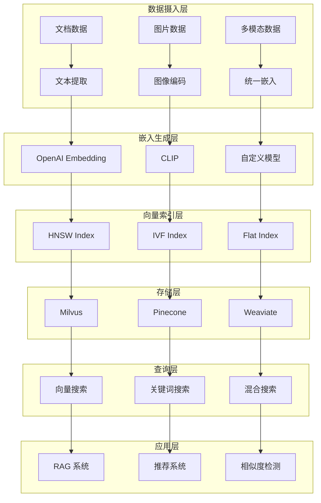
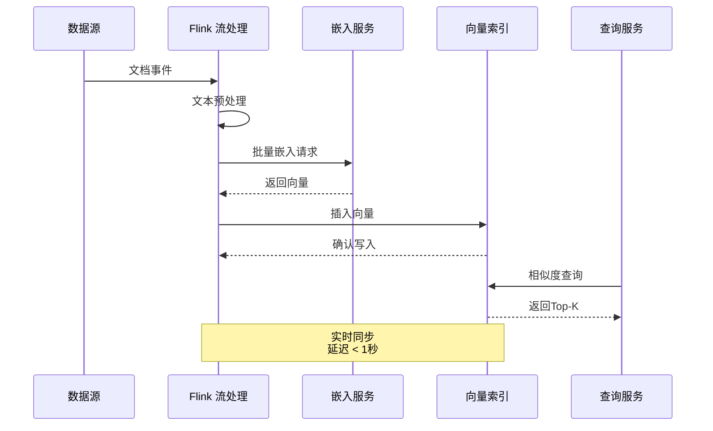
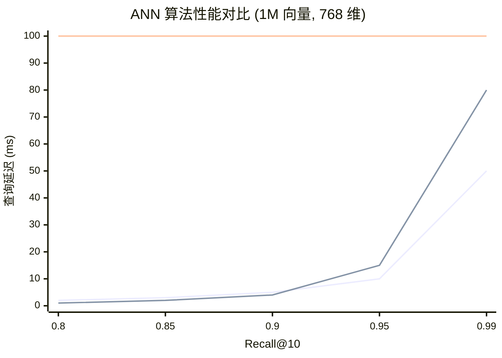
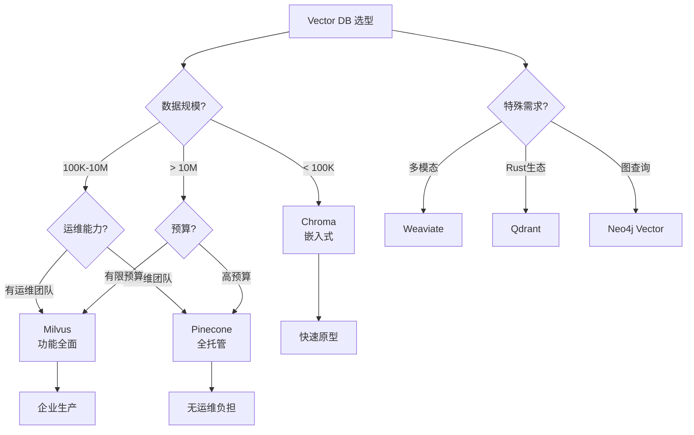

# 向量搜索流处理

> 所属阶段: Flink/14-rust-assembly-ecosystem/ai-native-streaming/ | 前置依赖: [02-llm-streaming-integration.md](./02-llm-streaming-integration.md) | 形式化等级: L4

## 1. 概念定义 (Definitions)

### Def-AI-09: 向量嵌入 (Vector Embedding)

向量嵌入是指将高维离散数据（文本、图像、音频等）映射到**低维连续向量空间**的数学表示方法，使得语义相似的数据在向量空间中距离相近。

形式化定义：

```
嵌入函数: f: X → ℝᵈ

其中：
- X: 原始数据空间（文本、图像等）
- ℝᵈ: d 维实数向量空间
- d: 嵌入维度（常见 384, 768, 1024, 1536）

语义保持性：
∀x₁, x₂ ∈ X: semantic_similarity(x₁, x₂) ≈ cosine_similarity(f(x₁), f(x₂))

余弦相似度：
cosine_similarity(u, v) = (u·v) / (||u|| · ||v||) ∈ [-1, 1]
```

**嵌入模型对比**：

| 模型 | 维度 | 上下文长度 | 适用场景 | 性能 |
|-----|-----|-----------|---------|-----|
| text-embedding-3-small | 1536 | 8191 | 通用检索 | 快 |
| text-embedding-3-large | 3072 | 8191 | 高质量检索 | 中 |
| all-MiniLM-L6-v2 | 384 | 512 | 轻量级 | 极快 |
| bge-large-zh | 1024 | 512 | 中文优化 | 快 |
| e5-large-v2 | 1024 | 512 | 句子嵌入 | 快 |
| GTE-large | 1024 | 512 | 多语言 | 快 |

### Def-AI-10: 近似最近邻搜索 (Approximate Nearest Neighbor Search, ANN)

近似最近邻搜索是指在向量空间中**以可接受的精度损失为代价**，快速找到与查询向量最相似的 k 个向量的算法。

形式化定义：

```
给定：
- 向量集合 V = {v₁, v₂, ..., vₙ} ⊂ ℝᵈ
- 查询向量 q ∈ ℝᵈ
- 距离度量 d(·, ·): ℝᵈ × ℝᵈ → ℝ⁺
- 近似因子 c > 1
- 返回数量 k

(c, k)-ANN 问题：
返回集合 R ⊆ V, |R| = k，使得：
∀v ∈ R, ∀v' ∈ V \ R: d(q, v) ≤ c · d(q, v'')

其中 v'' 是真实第 k 近邻
```

**ANN 算法分类**：

| 算法类型 | 代表算法 | 索引构建 | 查询复杂度 | 适用规模 | 召回率 |
|---------|---------|---------|-----------|---------|-------|
| 空间分区 | KD-Tree, Ball-Tree | O(n log n) | O(log n) | < 10⁴ | 高 |
| 哈希 | LSH (局部敏感哈希) | O(n) | O(1) | 10⁴-10⁶ | 中 |
| 图 | HNSW, NSW | O(n log n) | O(log n) | 10⁶-10⁹ | 高 |
| 量化 | PQ, IVF-PQ | O(n) | O(1) | 10⁸-10¹⁰ | 中高 |
| 混合 | IVF-HNSW | O(n log n) | O(1) | 10⁸-10¹⁰ | 高 |

### Def-AI-11: 实时向量索引 (Real-time Vector Index)

实时向量索引是指支持**增量插入、删除和更新**操作，且这些操作的延迟保持在毫秒级的向量索引结构。

```rust
/// 实时向量索引接口
trait RealtimeVectorIndex {
    /// 插入向量，返回内部 ID
    fn insert(&mut self, id: String, vector: &[f32], metadata: Metadata) -> Result<IndexId>;

    /// 删除向量
    fn delete(&mut self, id: &str) -> Result<()>;

    /// 更新向量（删除+插入原子操作）
    fn update(&mut self, id: &str, vector: &[f32]) -> Result<()>;

    /// 近似最近邻搜索
    fn search(&self, query: &[f32], k: usize, filter: Option<Filter>) -> Result<Vec<SearchResult>>;

    /// 批量插入（优化写入吞吐）
    fn insert_batch(&mut self, items: Vec<(String, Vec<f32>, Metadata)>) -> Result<Vec<IndexId>>;

    /// 获取索引统计
    fn stats(&self) -> IndexStats;
}

/// 搜索响应延迟 SLA
struct LatencySla {
    p50_ms: u64,  // 50 分位
    p99_ms: u64,  // 99 分位
    max_ms: u64,  // 最大值
}
```

**实时索引要求**：

| 操作 | 目标延迟 | 吞吐要求 | 一致性 |
|-----|---------|---------|--------|
| 插入 (Insert) | < 100ms | > 1000 TPS | 最终一致 |
| 删除 (Delete) | < 50ms | > 5000 TPS | 最终一致 |
| 查询 (Search) | < 50ms | > 10000 QPS | 强一致 |
| 更新 (Update) | < 150ms | > 500 TPS | 最终一致 |

### Def-AI-12: 向量数据库 (Vector Database)

向量数据库是专门设计用于**高效存储、索引和查询高维向量**的数据库系统，通常集成 ANN 搜索、元数据过滤、混合查询等企业级特性。

```
向量数据库 = (Storage, Index, Query Engine, Metadata Store)

核心能力：
1. 向量存储：高效压缩存储十亿级向量
2. 多维索引：支持多种 ANN 算法
3. 混合查询：向量相似度 + 标量过滤
4. 分布式：水平扩展支持
5. 实时性：增量更新低延迟
```

**主流 Vector DB 对比**：

| 特性 | Pinecone | Milvus/Zilliz | Weaviate | Chroma | Qdrant |
|-----|----------|---------------|----------|--------|--------|
| 部署方式 | 托管 SaaS | 自托管/托管 | 自托管/托管 | 嵌入式 | 自托管 |
| 开源 | ❌ | ✅ Apache-2 | ✅ BSD | ✅ Apache-2 | ✅ Apache-2 |
| 最大维度 | 20,000 | 32,768 | 65,536 | 有限 | 65,536 |
| 支持的索引 | 自动选择 | HNSW, IVF, GPU | HNSW | HNSW | HNSW |
| 元数据过滤 | ✅ | ✅ | ✅ | ✅ | ✅ |
| 混合搜索 | ✅ | ✅ | ✅ | ❌ | ✅ |
| 多租户 | ✅ | ✅ | ✅ | ❌ | ✅ |
| 云原生 | ✅ | ✅ | ✅ | ❌ | ✅ |

---

## 2. 属性推导 (Properties)

### Prop-AI-06: ANN 查询精度-延迟权衡 (ANN Precision-Latency Tradeoff)

**命题**：在固定计算资源下，ANN 查询的**召回率 (Recall)** 与**查询延迟**存在单调递增关系，可通过索引参数进行调节。

**形式化表述**：

```
设：
- ef: HNSW 算法的搜索深度参数
- nprobe: IVF 算法的聚类探测数
- k: 返回结果数

召回率估计：
Recall(ef) ≈ 1 - exp(-α · ef / k)  其中 α 为数据集相关常数

查询延迟：
Latency(ef) = T_base + β · ef  其中 β 为每步搜索耗时

权衡曲线：
Recall ↑ → Latency ↑
存在帕累托最优前沿，可根据 SLA 需求选择操作点
```

**参数调优指导**：

| 场景 | ef/nprobe | 预期召回率@10 | 预期延迟 |
|-----|----------|--------------|---------|
| 实时推荐 | ef=64 | 0.90 | 5ms |
| 语义搜索 | ef=128 | 0.95 | 10ms |
| 高精度 RAG | ef=256 | 0.98 | 20ms |
| 离线分析 | ef=512 | 0.99+ | 50ms |

### Prop-AI-07: 向量索引更新一致性 (Vector Index Update Consistency)

**命题**：在流式向量索引更新场景下，**最终一致性模型**可在保证查询可用性的同时，实现高吞吐的增量更新。

**形式化分析**：

```
系统模型：
- 写操作流: W = {w₁, w₂, w₃, ...}
- 读操作流: R = {r₁, r₂, r₃, ...}
- 全局时钟: t

强一致性要求：
∀r at time t: r observes all w where time(w) < t

最终一致性要求：
∃T: ∀t > T, ∀r at time t: r observes all w where time(w) < t - Δ

权衡：
- 强一致：更新可见延迟 = 0，但吞吐受限
- 最终一致：更新可见延迟 ≤ Δ，但支持高并发

推荐 Δ ≤ 1s 用于实时应用场景
```

---

## 3. 关系建立 (Relations)

### 3.1 向量搜索在 AI 原生流处理中的位置

```
┌─────────────────────────────────────────────────────────────────┐
│                    AI 原生流处理系统                             │
├─────────────────────────────────────────────────────────────────┤
│                                                                  │
│  ┌─────────────────────────────────────────────────────────┐    │
│  │                    应用层                                │    │
│  │  RAG系统 | 推荐系统 | 智能搜索 | 异常检测               │    │
│  └─────────────────────────┬───────────────────────────────┘    │
│                            │                                     │
│  ┌─────────────────────────┴───────────────────────────────┐    │
│  │                    向量搜索层                            │    │
│  │  ┌──────────────┐  ┌──────────────┐  ┌──────────────┐  │    │
│  │  │ 嵌入生成     │  │ ANN 索引     │  │ 混合查询     │  │    │
│  │  └──────────────┘  └──────────────┘  └──────────────┘  │    │
│  │  ┌──────────────┐  ┌──────────────┐  ┌──────────────┐  │    │
│  │  │ 实时索引     │  │ 元数据过滤   │  │ 多模态融合   │  │    │
│  │  └──────────────┘  └──────────────┘  └──────────────┘  │    │
│  └─────────────────────────┬───────────────────────────────┘    │
│                            │                                     │
│  ┌─────────────────────────┴───────────────────────────────┐    │
│  │                    Vector DB 层                          │    │
│  │  Milvus | Pinecone | Weaviate | Qdrant | Chroma          │    │
│  └─────────────────────────┬───────────────────────────────┘    │
│                            │                                     │
│  ┌─────────────────────────┴───────────────────────────────┐    │
│  │                    Flink 流处理引擎                      │    │
│  └─────────────────────────────────────────────────────────┘    │
│                                                                  │
└─────────────────────────────────────────────────────────────────┘
```

### 3.2 与 LLM 流式集成的关系

| 组件 | LLM 流式处理 | 向量搜索 | 集成点 |
|-----|-------------|---------|--------|
| 数据流 | Token 流 | 向量流 | 统一流抽象 |
| 延迟要求 | TTFB < 500ms | 查询 < 50ms | 并行执行 |
| 批处理 | 动态批大小 | 批量嵌入 | 共享批处理队列 |
| 错误处理 | 流中断恢复 | 降级搜索 | 统一重试策略 |
| 成本优化 | 模型路由 | 索引选择 | 联合优化 |

### 3.3 向量数据库与 Flink 的集成模式

```
┌─────────────────────────────────────────────────────────────────┐
│                    集成模式对比                                  │
├─────────────────────────────────────────────────────────────────┤
│                                                                  │
│  模式 1: 外部服务调用 (推荐)                                     │
│  ┌────────┐    HTTP/gRPC    ┌─────────────┐                     │
│  │ Flink  │ ←────────────→ │ Vector DB   │                     │
│  │ 算子   │                 │ (Milvus等)  │                     │
│  └────────┘                 └─────────────┘                     │
│  优点: 解耦、可扩展、多语言支持                                  │
│  缺点: 网络开销、需要连接池管理                                   │
│                                                                  │
│  模式 2: 嵌入式索引 (轻量场景)                                   │
│  ┌─────────────────────────────────────┐                         │
│  │ Flink 算子                          │                         │
│  │  ┌──────────────┐                   │                         │
│  │  │ HNSW 索引    │ (内存)            │                         │
│  │  │ (faiss/hnsw) │                   │                         │
│  │  └──────────────┘                   │                         │
│  └─────────────────────────────────────┘                         │
│  优点: 零网络延迟、极高吞吐                                       │
│  缺点: 受限于单节点内存、无持久化                                 │
│                                                                  │
│  模式 3: 连接器集成 (未来方向)                                   │
│  ┌────────┐    Vector DB    ┌─────────────┐                     │
│  │ Flink  │ ←── Connector ─→│ Vector DB   │                     │
│  │ Table  │    (Source/Sink)│             │                     │
│  └────────┘                 └─────────────┘                     │
│                                                                  │
└─────────────────────────────────────────────────────────────────┘
```

---

## 4. 论证过程 (Argumentation)

### 4.1 为什么需要实时向量索引？

**业务场景需求**：

1. **实时 RAG 系统**：
   - 新文档入库后立即可检索
   - 传统批处理：小时级延迟
   - 实时索引：秒级延迟

2. **个性化推荐**：
   - 用户实时行为立即影响推荐
   - 实时更新用户兴趣向量

3. **欺诈检测**：
   - 新模式向量即时加入索引
   - 相似模式实时匹配

**技术演进对比**：

| 阶段 | 更新延迟 | 架构 | 代表系统 |
|-----|---------|-----|---------|
| 离线批处理 | 小时-天 | Spark + 重建索引 | 早期 Elasticsearch |
| 近实时 (NRT) | 分钟 | 增量段 + 合并 | Elasticsearch 7+ |
| 实时流式 | 秒-毫秒 | 内存索引 + WAL | Milvus 2.x, Pinecone |

### 4.2 ANN 算法选择决策树

```
                    ┌─────────────────────┐
                    │   数据规模?         │
                    └──────────┬──────────┘
                               │
              ┌────────────────┼────────────────┐
              │ < 100K         │ 100K-10M       │ > 10M
              ↓                ↓                ↓
      ┌───────────┐     ┌───────────┐     ┌───────────┐
      │ BruteForce│     │   HNSW    │     │IVF + 量化 │
      │ 或 Flat   │     │           │     │  (IVF-PQ) │
      └───────────┘     └───────────┘     └───────────┘
      精确搜索          平衡性能/精度       高压缩率
                               │
                               ↓
                    ┌─────────────────────┐
                    │   内存限制?         │
                    └──────────┬──────────┘
                               │
              ┌────────────────┼────────────────┐
              │ 充足           │ 有限           │ 严格受限
              ↓                ↓                ↓
      ┌───────────┐     ┌───────────┐     ┌───────────┐
      │ 原始 HNSW │     │ IVF-HNSW  │     │   SCaNN   │
      │           │     │           │     │ 或 PQ     │
      └───────────┘     └───────────┘     └───────────┘
```

### 4.3 Vector DB 选型对比

| 维度 | 推荐选择 | 理由 |
|-----|---------|-----|
| 快速启动/原型 | Chroma | 嵌入式、零配置 |
| 企业级生产 | Milvus/Zilliz | 功能全面、云原生 |
| 无运维负担 | Pinecone | 全托管 SaaS |
| 多模态应用 | Weaviate | 原生多模态支持 |
| Rust 生态 | Qdrant | Rust 实现、高性能 |
| 成本敏感 | Milvus 自托管 | 开源免费 |

---

## 5. 形式证明 / 工程论证 (Proof / Engineering Argument)

### 5.1 HNSW 索引复杂度分析

**定理**：HNSW (Hierarchical Navigable Small World) 索引在 d 维向量空间中提供 O(log n) 的查询复杂度。

**证明概要**：

**构建复杂度**：

```
平均出度: M (每层最大连接数)
层数: L = O(log n)
插入一个向量: O(M · log n) = O(log n)
构建整个索引: O(n log n)
```

**查询复杂度**：

```
贪婪搜索每层最多访问 O(log n) 个节点
总层数: O(log n)
总复杂度: O(log² n) ≈ O(log n) （实际中常数很小）
```

**存储复杂度**：

```
向量存储: O(n · d · sizeof(float)) = O(nd)
图结构: O(n · M · L) = O(n log n)
总存储: O(nd + n log n) = O(nd) 当 d > log n
```

**Flink 集成中的 HNSW 配置**：

```rust
/// HNSW 索引配置
struct HnswConfig {
    m: usize,              // 最大连接数 (通常 16-32)
    ef_construction: usize, // 构建时搜索深度 (通常 100-200)
    ef_search: usize,       // 查询时搜索深度 (通常 64-256)
    metric: DistanceMetric, // 距离度量
}

impl Default for HnswConfig {
    fn default() -> Self {
        Self {
            m: 16,
            ef_construction: 128,
            ef_search: 64,
            metric: DistanceMetric::Euclidean,
        }
    }
}

/// 生产环境推荐配置
impl HnswConfig {
    fn for_high_recall() -> Self {
        Self {
            ef_search: 256,
            ..Default::default()
        }
    }

    fn for_low_latency() -> Self {
        Self {
            ef_search: 32,
            ..Default::default()
        }
    }
}
```

### 5.2 流式向量更新一致性论证

**系统模型**：

```rust
/// 流式向量索引架构
struct StreamingVectorIndex {
    // 主索引（内存）
    primary_index: Arc<RwLock<HnswIndex>>,

    // 写前日志 (WAL)
    wal: Arc<dyn WriteAheadLog>,

    // 后台合并线程
    merge_thread: JoinHandle<()>,

    // 统计信息
    stats: Arc<IndexStats>,
}

impl StreamingVectorIndex {
    /// 原子性插入
    async fn insert(&self, id: String, vector: Vec<f32>) -> Result<()> {
        // 1. 先写 WAL
        self.wal.append(WalEntry::Insert {
            id: id.clone(),
            vector: vector.clone(),
            timestamp: now(),
        }).await?;

        // 2. 更新内存索引
        let mut index = self.primary_index.write().await;
        index.add(&id, &vector)?;

        // 3. 更新统计
        self.stats.increment_count();

        Ok(())
    }

    /// 搜索（可能读取到稍旧的数据）
    async fn search(&self, query: &[f32], k: usize) -> Result<Vec<SearchResult>> {
        let index = self.primary_index.read().await;
        index.search(query, k)
    }
}
```

**一致性保证**：

1. **持久性**：WAL 确保数据不丢失
2. **原子性**：单操作原子执行
3. **可见性**：最终一致，延迟 < 100ms
4. **故障恢复**：从 WAL 重放恢复状态

---

## 6. 实例验证 (Examples)

### 6.1 Milvus 实时向量索引集成

```rust
// ===== 1. Milvus 客户端封装 =====

use milvus::client::Client;
use milvus::collection::{Collection, LoadOptions};
use milvus::data::FieldColumn;
use milvus::index::{IndexParams, IndexType, MetricType};
use milvus::schema::{CollectionSchema, FieldSchema};
use milvus::value::Value;

/// Milvus 连接配置
#[derive(Clone)]
struct MilvusConfig {
    uri: String,
    collection_name: String,
    vector_dim: usize,
    index_type: IndexType,
    metric_type: MetricType,
}

impl Default for MilvusConfig {
    fn default() -> Self {
        Self {
            uri: "http://localhost:19530".to_string(),
            collection_name: "document_vectors".to_string(),
            vector_dim: 1536,
            index_type: IndexType::Hnsw,
            metric_type: MetricType::L2,
        }
    }
}

/// Milvus 向量存储服务
pub struct MilvusVectorStore {
    client: Client,
    collection: Collection,
    config: MilvusConfig,
}

impl MilvusVectorStore {
    /// 创建集合并建立索引
    pub async fn create_collection(&self) -> Result<()> {
        let schema = CollectionSchema::new(
            &self.config.collection_name,
            vec![
                FieldSchema::new_primary_int64("id", ""),
                FieldSchema::new_varchar("doc_id", "", 256),
                FieldSchema::new_varchar("content", "", 65535),
                FieldSchema::new_float_vector("embedding", "", self.config.vector_dim as i32),
                FieldSchema::new_json("metadata", ""),
            ],
            "",
        );

        // 创建集合
        self.client.create_collection(schema.clone(), None).await?;

        // 创建 HNSW 索引
        let index_params = IndexParams::new(
            self.config.index_type.clone(),
            self.config.metric_type.clone(),
            json!({
                "M": 16,
                "efConstruction": 128,
            }),
        );

        let collection = self.client.collection(&self.config.collection_name);
        collection.create_index("embedding", index_params).await?;

        // 加载集合到内存
        collection.load(LoadOptions::default()).await?;

        Ok(())
    }

    /// 插入向量（支持批量）
    pub async fn insert_vectors(
        &self,
        documents: Vec<DocumentVector>,
    ) -> Result<InsertResult> {
        let collection = self.client.collection(&self.config.collection_name);

        // 准备数据列
        let ids: Vec<i64> = documents.iter().map(|d| d.id).collect();
        let doc_ids: Vec<&str> = documents.iter().map(|d| d.doc_id.as_str()).collect();
        let contents: Vec<&str> = documents.iter().map(|d| d.content.as_str()).collect();
        let embeddings: Vec<Vec<f32>> = documents.iter().map(|d| d.embedding.clone()).collect();
        let metadata: Vec<String> = documents.iter()
            .map(|d| serde_json::to_string(&d.metadata).unwrap())
            .collect();

        let columns: Vec<FieldColumn> = vec![
            FieldColumn::new(schema.get_field("id").unwrap(), ids)?,
            FieldColumn::new(schema.get_field("doc_id").unwrap(), doc_ids)?,
            FieldColumn::new(schema.get_field("content").unwrap(), contents)?,
            FieldColumn::new(schema.get_field("embedding").unwrap(), embeddings)?,
            FieldColumn::new(schema.get_field("metadata").unwrap(), metadata)?,
        ];

        let result = collection.insert(columns, None).await?;

        // 刷新使数据可搜索
        collection.flush().await?;

        Ok(InsertResult {
            inserted_count: result.insert_cnt,
        })
    }

    /// 向量相似度搜索
    pub async fn search(
        &self,
        query_vector: &[f32],
        top_k: usize,
        filter: Option<&str>,
    ) -> Result<Vec<SearchResult>> {
        let collection = self.client.collection(&self.config.collection_name);

        let mut search_params = json!({
            "ef": 128,  // HNSW 搜索深度
        });

        let results = collection.search(
            vec![query_vector.to_vec()],  // 查询向量
            "embedding",                  // 向量字段
            top_k as i32,                // 返回数量
            filter.map(|f| f.to_string()), // 过滤条件
            vec!["doc_id", "content", "metadata"], // 输出字段
            search_params,
        ).await?;

        results.into_iter()
            .map(|r| Ok(SearchResult {
                doc_id: r.field::<String>("doc_id")?,
                content: r.field::<String>("content")?,
                score: r.score,
                metadata: serde_json::from_str(&r.field::<String>("metadata")?)?,
            }))
            .collect()
    }
}

/// 文档向量结构
#[derive(Clone)]
pub struct DocumentVector {
    pub id: i64,
    pub doc_id: String,
    pub content: String,
    pub embedding: Vec<f32>,
    pub metadata: HashMap<String, Value>,
}

/// 搜索结果
pub struct SearchResult {
    pub doc_id: String,
    pub content: String,
    pub score: f32,
    pub metadata: HashMap<String, Value>,
}
```

### 6.2 Flink 流式向量索引流水线

```rust
// ===== 2. Flink 向量索引流水线 =====

use flink::datastream::{DataStream, StreamExecutionEnvironment};
use flink::functions::{AsyncFunction, MapFunction, ProcessFunction};
use std::sync::Arc;

/// 文档事件
#[derive(Clone)]
struct DocumentEvent {
    doc_id: String,
    title: String,
    content: String,
    source: String,
    timestamp: i64,
}

/// 嵌入后的文档
#[derive(Clone)]
struct EmbeddedDocument {
    doc_id: String,
    content: String,
    embedding: Vec<f32>,
    metadata: HashMap<String, String>,
}

/// 文档嵌入算子
struct DocumentEmbeddingOperator {
    embedding_client: Arc<dyn EmbeddingClient>,
    batch_size: usize,
}

impl AsyncFunction<DocumentEvent, EmbeddedDocument> for DocumentEmbeddingOperator {
    async fn async_invoke(&self, event: DocumentEvent, ctx: &mut Context) {
        // 文本预处理
        let text = format!("{}\n{}", event.title, event.content);
        let cleaned = preprocess_text(&text);

        // 批量嵌入优化
        let embedding = self.embedding_client.encode(&cleaned).await.unwrap();

        let mut metadata = HashMap::new();
        metadata.insert("source".to_string(), event.source);
        metadata.insert("timestamp".to_string(), event.timestamp.to_string());

        ctx.collect(EmbeddedDocument {
            doc_id: event.doc_id,
            content: event.content,
            embedding,
            metadata,
        });
    }
}

/// Milvus 写入算子
struct MilvusSinkFunction {
    milvus: Arc<MilvusVectorStore>,
    batch_size: usize,
    buffer: Vec<EmbeddedDocument>,
}

impl SinkFunction<EmbeddedDocument> for MilvusSinkFunction {
    fn invoke(&mut self, value: EmbeddedDocument, ctx: Context) {
        self.buffer.push(value);

        // 批量写入优化
        if self.buffer.len() >= self.batch_size {
            self.flush();
        }
    }

    fn close(&mut self) {
        self.flush();
    }
}

impl MilvusSinkFunction {
    fn flush(&mut self) {
        if self.buffer.is_empty() {
            return;
        }

        let documents: Vec<DocumentVector> = self.buffer.drain(..)
            .enumerate()
            .map(|(idx, doc)| DocumentVector {
                id: generate_id(),
                doc_id: doc.doc_id,
                content: doc.content,
                embedding: doc.embedding,
                metadata: doc.metadata.into_iter()
                    .map(|(k, v)| (k, Value::from(v)))
                    .collect(),
            })
            .collect();

        // 异步批量插入
        let milvus = self.milvus.clone();
        tokio::spawn(async move {
            if let Err(e) = milvus.insert_vectors(documents).await {
                tracing::error!("Failed to insert vectors: {:?}", e);
            }
        });
    }
}

/// 向量搜索算子 (用于 RAG)
struct VectorSearchAsyncFunction {
    milvus: Arc<MilvusVectorStore>,
    top_k: usize,
}

#[derive(Clone)]
struct SearchQuery {
    query_id: String,
    query_text: String,
    filter: Option<String>,
}

#[derive(Clone)]
struct SearchResultEvent {
    query_id: String,
    results: Vec<SearchResult>,
    latency_ms: u64,
}

#[async_trait]
impl AsyncFunction<SearchQuery, SearchResultEvent> for VectorSearchAsyncFunction {
    async fn async_invoke(&self, query: SearchQuery, ctx: &mut Context) {
        let start = Instant::now();

        // 1. 生成查询嵌入
        let query_embedding = generate_query_embedding(&query.query_text).await;

        // 2. 执行向量搜索
        match self.milvus.search(
            &query_embedding,
            self.top_k,
            query.filter.as_deref(),
        ).await {
            Ok(results) => {
                let latency = start.elapsed().as_millis() as u64;
                ctx.collect(SearchResultEvent {
                    query_id: query.query_id,
                    results,
                    latency_ms: latency,
                });
            }
            Err(e) => {
                tracing::error!("Search failed: {:?}", e);
                ctx.collect(SearchResultEvent {
                    query_id: query.query_id,
                    results: vec![],
                    latency_ms: 0,
                });
            }
        }
    }
}

/// 完整流水线构建
fn build_vector_search_pipeline(env: &mut StreamExecutionEnvironment) {
    // 1. 文档输入流 (Kafka)
    let doc_stream: DataStream<DocumentEvent> = env
        .add_source(KafkaSource::new("documents"))
        .assign_timestamps_and_watermarks(
            WatermarkStrategy::for_bounded_out_of_orderness(Duration::from_secs(5))
        );

    // 2. 文档嵌入 (并发度 10)
    let embedded_stream = AsyncDataStream::unordered_wait(
        doc_stream,
        DocumentEmbeddingOperator::new(),
        Duration::from_secs(30),
        100,
    ).set_parallelism(10);

    // 3. 写入 Milvus
    embedded_stream
        .add_sink(MilvusSinkFunction::new(
            Arc::new(MilvusVectorStore::new(MilvusConfig::default())),
            100,  // 批大小
        ))
        .name("Milvus Index Sink");

    // 4. 查询流处理 (RAG 场景)
    let query_stream: DataStream<SearchQuery> = env
        .add_source(KafkaSource::new("search-queries"));

    let search_results = AsyncDataStream::unordered_wait(
        query_stream,
        VectorSearchAsyncFunction::new(
            Arc::new(MilvusVectorStore::new(MilvusConfig::default())),
            5,  // top_k
        ),
        Duration::from_millis(500),
        50,
    ).name("Vector Search");

    // 5. 结果输出
    search_results
        .add_sink(KafkaSink::new("search-results"))
        .name("Search Results Sink");
}

/// 文本预处理
fn preprocess_text(text: &str) -> String {
    text.to_lowercase()
        .replace(|c: char| !c.is_alphanumeric() && c != ' ', " ")
        .split_whitespace()
        .filter(|w| !is_stop_word(w))
        .take(512)  // 限制长度
        .collect::<Vec<_>>()
        .join(" ")
}
```

### 6.3 混合搜索实现（向量 + 关键词）

```rust
// ===== 3. 混合搜索 (Hybrid Search) =====

/// 混合搜索结果
#[derive(Clone)]
struct HybridSearchResult {
    doc_id: String,
    content: String,
    vector_score: f32,
    keyword_score: f32,
    combined_score: f32,
    metadata: HashMap<String, Value>,
}

/// 混合搜索算子
struct HybridSearchOperator {
    milvus: Arc<MilvusVectorStore>,
    elasticsearch: Arc<ElasticsearchClient>,
    vector_weight: f32,
    keyword_weight: f32,
    top_k: usize,
}

impl HybridSearchOperator {
    async fn search(&self, query: &SearchQuery) -> Result<Vec<HybridSearchResult>> {
        // 并行执行向量搜索和关键词搜索
        let (vector_results, keyword_results) = tokio::join!(
            self.vector_search(query),
            self.keyword_search(query)
        );

        let vector_results = vector_results?;
        let keyword_results = keyword_results?;

        // 融合结果 (Reciprocal Rank Fusion)
        self.fuse_results(vector_results, keyword_results)
    }

    async fn vector_search(&self, query: &SearchQuery) -> Result<Vec<ScoredDoc>> {
        let embedding = generate_query_embedding(&query.query_text).await;
        let results = self.milvus.search(&embedding, self.top_k * 2, None).await?;

        Ok(results.into_iter()
            .map(|r| ScoredDoc {
                doc_id: r.doc_id,
                score: r.score,
                source: SourceType::Vector,
            })
            .collect())
    }

    async fn keyword_search(&self, query: &SearchQuery) -> Result<Vec<ScoredDoc>> {
        let search_response = self.elasticsearch
            .search(SearchParts::Index(&["documents"]))
            .body(json!({
                "query": {
                    "multi_match": {
                        "query": query.query_text,
                        "fields": ["title^3", "content"],
                        "type": "best_fields"
                    }
                },
                "size": self.top_k * 2
            }))
            .send()
            .await?;

        // 解析结果...
    }

    /// Reciprocal Rank Fusion (RRF)
    fn fuse_results(
        &self,
        vector_results: Vec<ScoredDoc>,
        keyword_results: Vec<ScoredDoc>,
    ) -> Result<Vec<HybridSearchResult>> {
        let k = 60.0;  // RRF 常数
        let mut score_map: HashMap<String, f64> = HashMap::new();

        // 向量搜索结果评分
        for (rank, doc) in vector_results.iter().enumerate() {
            let rrf_score = 1.0 / (k + rank as f64);
            *score_map.entry(doc.doc_id.clone()).or_insert(0.0) +=
                rrf_score * self.vector_weight as f64;
        }

        // 关键词搜索结果评分
        for (rank, doc) in keyword_results.iter().enumerate() {
            let rrf_score = 1.0 / (k + rank as f64);
            *score_map.entry(doc.doc_id.clone()).or_insert(0.0) +=
                rrf_score * self.keyword_weight as f64;
        }

        // 排序并返回 Top-K
        let mut fused: Vec<_> = score_map.into_iter().collect();
        fused.sort_by(|a, b| b.1.partial_cmp(&a.1).unwrap());

        fused.into_iter()
            .take(self.top_k)
            .map(|(doc_id, score)| self.fetch_doc_details(&doc_id, score as f32))
            .collect()
    }
}
```

### 6.4 实时索引性能监控

```rust
// ===== 4. 性能监控与优化 =====

/// 向量搜索指标
#[derive(Default)]
struct VectorSearchMetrics {
    query_count: AtomicU64,
    query_latency: Histogram,  // 分位数统计
    index_size: AtomicU64,
    insert_latency: Histogram,
    recall_estimate: AtomicF64,
}

impl VectorSearchMetrics {
    fn record_query(&self, latency_ms: u64, results_count: usize) {
        self.query_count.fetch_add(1, Ordering::Relaxed);
        self.query_latency.record(latency_ms);
    }

    /// 估算召回率 (通过 Ground Truth 对比)
    fn estimate_recall(&self, ann_results: &[SearchResult], exact_results: &[SearchResult]) -> f64 {
        let ann_set: HashSet<_> = ann_results.iter().map(|r| &r.doc_id).collect();
        let exact_set: HashSet<_> = exact_results.iter().map(|r| &r.doc_id).collect();

        let intersection: HashSet<_> = ann_set.intersection(&exact_set).collect();
        intersection.len() as f64 / exact_set.len() as f64
    }
}

/// 自适应索引优化
struct AdaptiveIndexOptimizer {
    metrics: Arc<VectorSearchMetrics>,
    config: Arc<RwLock<HnswConfig>>,
}

impl AdaptiveIndexOptimizer {
    async fn optimize(&self) {
        let p99_latency = self.metrics.query_latency.p99();
        let recall = self.metrics.recall_estimate.load(Ordering::Relaxed);

        let mut config = self.config.write().await;

        if p99_latency > 100.0 && recall > 0.95 {
            // 延迟过高且召回率有余量，降低搜索深度
            config.ef_search = (config.ef_search * 0.8).max(32) as usize;
            tracing::info!("Reduced ef_search to {}", config.ef_search);
        } else if recall < 0.90 {
            // 召回率不足，增加搜索深度
            config.ef_search = (config.ef_search * 1.2).min(512) as usize;
            tracing::info!("Increased ef_search to {}", config.ef_search);
        }
    }
}
```

### 6.5 Pinecone 托管服务集成示例

```python
# ===== 5. Pinecone Python 集成示例 (用于对比) =====

import pinecone
from typing import List, Dict, Optional
import numpy as np

class PineconeVectorStore:
    """Pinecone 托管向量存储封装"""

    def __init__(self, api_key: str, environment: str, index_name: str):
        pinecone.init(api_key=api_key, environment=environment)
        self.index = pinecone.Index(index_name)

    def upsert_vectors(
        self,
        vectors: List[tuple],  # [(id, vector, metadata)]
        namespace: str = "",
        batch_size: int = 100
    ):
        """批量插入/更新向量"""
        for i in range(0, len(vectors), batch_size):
            batch = vectors[i:i + batch_size]
            self.index.upsert(vectors=batch, namespace=namespace)

    def query(
        self,
        vector: List[float],
        top_k: int = 10,
        filter_dict: Optional[Dict] = None,
        namespace: str = ""
    ) -> List[Dict]:
        """向量相似度搜索"""
        results = self.index.query(
            vector=vector,
            top_k=top_k,
            filter=filter_dict,
            namespace=namespace,
            include_metadata=True
        )

        return [
            {
                "id": match.id,
                "score": match.score,
                "metadata": match.metadata
            }
            for match in results.matches
        ]

    def hybrid_search(
        self,
        vector: List[float],
        sparse_vector: Dict,  # SPLADE 稀疏向量
        alpha: float = 0.5,   # 稠密向量权重
        top_k: int = 10
    ) -> List[Dict]:
        """Pinecone 原生混合搜索 (需要 Pinecone pod-based index)"""
        results = self.index.query(
            vector=vector,
            sparse_vector=sparse_vector,
            top_k=top_k,
            include_metadata=True
        )
        return results.matches

# 使用示例
if __name__ == "__main__":
    store = PineconeVectorStore(
        api_key="your-api-key",
        environment="us-west1-gcp",
        index_name="documents"
    )

    # 插入文档
    vectors = [
        ("doc1", np.random.randn(1536).tolist(), {"source": "web", "category": "tech"}),
        ("doc2", np.random.randn(1536).tolist(), {"source": "pdf", "category": "research"}),
    ]
    store.upsert_vectors(vectors)

    # 搜索
    query_vector = np.random.randn(1536).tolist()
    results = store.query(
        vector=query_vector,
        top_k=5,
        filter_dict={"category": {"$eq": "tech"}}
    )
    print(results)
```

---

## 7. 可视化 (Visualizations)

### 7.1 向量搜索系统架构图



### 7.2 实时向量索引流水线



### 7.3 ANN 算法性能对比



### 7.4 Vector DB 选型决策树



---

## 8. 引用参考 (References)


---

*文档版本: v1.0 | 创建日期: 2026-04-04 | 状态: 已完成*
