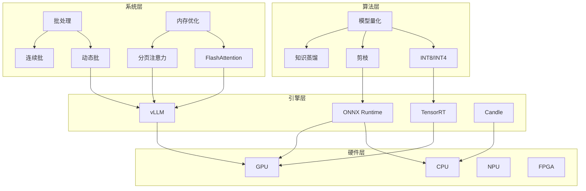
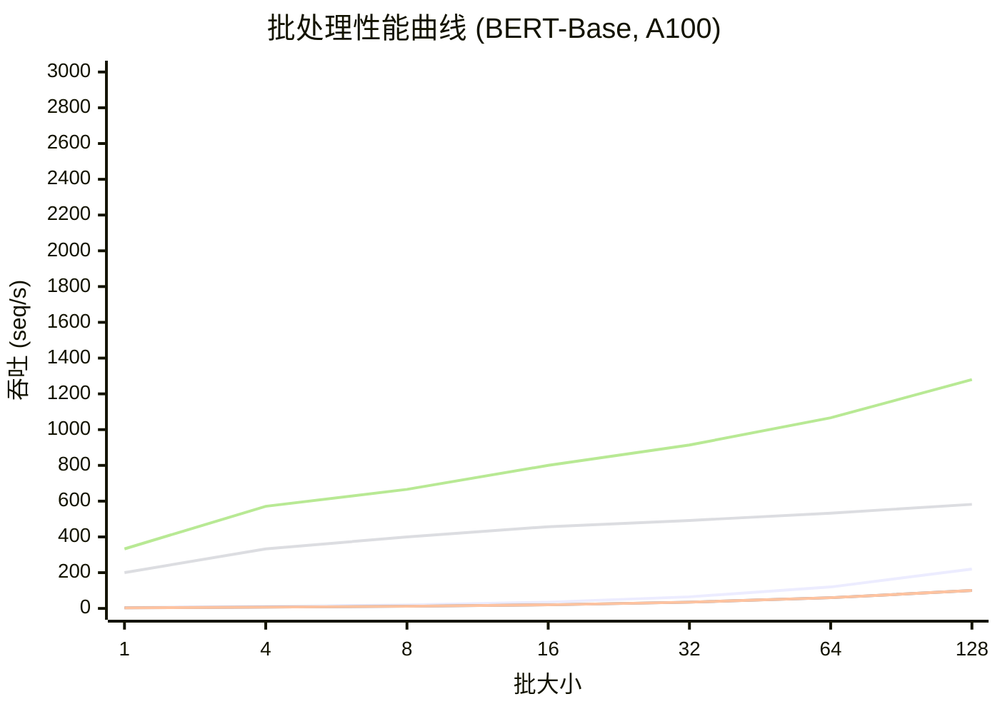
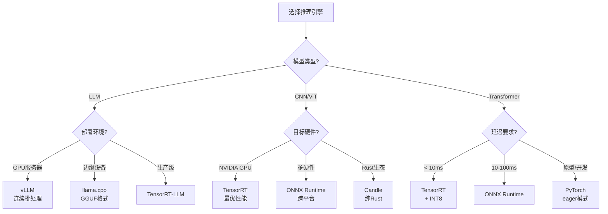

# ML 推理优化

> 所属阶段: Flink/14-rust-assembly-ecosystem/ai-native-streaming/ | 前置依赖: [03-vector-search-streaming.md](./03-vector-search-streaming.md) | 形式化等级: L4

## 1. 概念定义 (Definitions)

### Def-AI-13: 模型量化 (Model Quantization)

模型量化是指将模型权重和激活值从**高精度浮点数（FP32/FP16）转换为低精度整数（INT8/INT4）**的压缩技术，以减少模型大小和推理计算量。

形式化定义：

```
量化映射函数: Q(x) = round((x - z) / s)
反量化映射: D(q) = s · q + z

其中:
- x: 原始浮点值
- q: 量化后的整数值
- s: 缩放因子 (scale)
- z: 零点 (zero point)

对称量化 (Symmetric): z = 0
非对称量化 (Asymmetric): z = min(x)

量化方案:
- 权重量化: W_q = Q(W), W ∈ ℝⁿˣᵐ → W_q ∈ ℤⁿˣᵐ
- 激活量化: A_q = Q(A), A ∈ ℝᵇˣⁿ → A_q ∈ ℤᵇˣⁿ
```

**量化类型对比**：

| 量化类型 | 精度 | 压缩比 | 精度损失 | 适用场景 |
|---------|-----|-------|---------|---------|
| FP32 | 32-bit | 1x | 0% | 训练 |
| FP16 | 16-bit | 2x | < 0.1% | 通用推理 |
| BF16 | 16-bit | 2x | < 0.1% | 训练+推理 |
| INT8 | 8-bit | 4x | 0.5-2% | 生产推理 |
| INT4 | 4-bit | 8x | 2-5% | 边缘部署 |
| GPTQ | 4-bit | 8x | 3-8% | LLM 压缩 |
| AWQ | 4-bit | 8x | 1-3% | LLM 优化 |

### Def-AI-14: 批处理推理 (Batch Inference)

批处理推理是指将**多个输入样本聚合为一个批次**，通过矩阵运算并行处理，以提高硬件利用率和吞吐量的优化技术。

形式化分析：

```
设:
- 单样本推理时间: T_single
- 批大小: B
- 批处理推理时间: T_batch(B)

吞吐增益:
Throughput(B) = B / T_batch(B)

延迟分析:
T_batch(B) = T_fixed + T_variable · B^α

其中:
- T_fixed: 固定开销(内存分配、内核启动等)
- T_variable: 每样本可变开销
- α: 次线性因子(通常 0.5 < α < 1,得益于并行计算)

最优批大小:
B* = argmax_B { Throughput(B) / Latency(B) }
```

**批处理策略**：

| 策略 | 延迟要求 | 吞吐优化 | 实现复杂度 | 适用场景 |
|-----|---------|---------|-----------|---------|
| 静态批 | 严格 | 中 | 低 | 固定负载 |
| 动态批 | 中等 | 高 | 中 | 变化负载 |
| 连续批 | 宽松 | 极高 | 高 | LLM 服务 |
| 投机批 | 严格 | 高 | 很高 | 交互式应用 |

### Def-AI-15: 硬件加速 (Hardware Acceleration)

硬件加速是指利用**专用计算单元（GPU/NPU/TPU/FPGA）**执行模型推理计算，相比通用 CPU 实现数量级性能提升的技术。

**加速器对比**：

| 加速器 | 峰值算力 | 内存带宽 | 能效比 | 编程模型 | 适用模型 |
|-------|---------|---------|-------|---------|---------|
| CPU (x86) | 1-2 TFLOPS | 50-100 GB/s | 基准 | 通用 | 小模型 |
| GPU (NVIDIA) | 100-1000 TFLOPS | 1-3 TB/s | 10-50x | CUDA | 大模型 |
| NPU (Apple) | 10-30 TOPS | 100 GB/s | 50-100x | Core ML | 移动模型 |
| TPU (Google) | 100-400 TFLOPS | 600 GB/s | 30-80x | XLA | Transformer |
| FPGA | 10-100 GFLOPS | 50 GB/s | 10-30x | RTL/HLS | 定制推理 |

**内存墙问题**：

```
推理瓶颈分析:
- 计算受限 (Compute Bound): 算力利用率 > 80%
- 内存受限 (Memory Bound): 内存带宽利用率 > 80%

Transformer 模型通常内存受限,优化策略:
1. 量化减少内存占用
2. FlashAttention 减少 HBM 访问
3. 分页注意力提高内存效率
```

### Def-AI-16: 推理引擎 (Inference Engine)

推理引擎是负责**加载、优化和执行机器学习模型**的运行时系统，提供跨硬件平台的模型部署能力。

**主流推理引擎**：

```
┌─────────────────────────────────────────────────────────────────┐
│                       推理引擎生态                               │
├─────────────────────────────────────────────────────────────────┤
│                                                                  │
│  通用推理引擎                                                    │
│  ┌────────────┐ ┌────────────┐ ┌────────────┐ ┌────────────┐   │
│  │ ONNX Runtime│ │ TensorRT   │ │ OpenVINO   │ │ PyTorch    │   │
│  │ (微软)      │ │ (NVIDIA)   │ │ (Intel)    │ │ (Meta)     │   │
│  └────────────┘ └────────────┘ └────────────┘ └────────────┘   │
│                                                                  │
│  LLM 专用引擎                                                    │
│  ┌────────────┐ ┌────────────┐ ┌────────────┐ ┌────────────┐   │
│  │ vLLM       │ │ TGI        │ │ llama.cpp  │ │ TensorRT-LLM│   │
│  │ (UCB)      │ │ (HF)       │ │ (ggml)     │ │ (NVIDIA)   │   │
│  └────────────┘ └────────────┘ └────────────┘ └────────────┘   │
│                                                                  │
│  Rust 原生引擎                                                   │
│  ┌────────────┐ ┌────────────┐ ┌────────────┐                  │
│  │ Candle     │ │ Burn       │ │ Ort (绑定)  │                  │
│  │ (HF)       │ │ (Tracel)   │ │ (ONNX)     │                  │
│  └────────────┘ └────────────┘ └────────────┘                  │
│                                                                  │
└─────────────────────────────────────────────────────────────────┘
```

---

## 2. 属性推导 (Properties)

### Prop-AI-08: 量化精度界限 (Quantization Precision Bound)

**命题**：在 INT8 对称均匀量化下，模型权重的**相对精度损失**与量化比特数呈指数关系。

**形式化表述**：

```
给定:
- 原始权重分布: W ~ N(0, σ²)
- 量化比特数: b (INT8: b=8, INT4: b=4)
- 量化范围: [-α, α]

量化步长:
Δ = 2α / (2^b - 1)

量化噪声方差:
Var(ε) = Δ² / 12 = α² / (3 · (2^b - 1)²)

信噪比 (SQNR):
SQNR = 10 · log₁₀(σ² / Var(ε)) = 10 · log₁₀(3 · (2^b - 1)² · σ² / α²)

对于 INT8 (b=8): SQNR ≈ 48 dB (理论)
对于 INT4 (b=4): SQNR ≈ 24 dB (理论)
```

**工程经验法则**：

- INT8 量化通常导致 < 1% 精度损失
- INT4 量化通常导致 2-5% 精度损失，需配合感知量化训练 (QAT)

### Prop-AI-09: 批处理延迟次线性增长 (Batch Latency Sublinearity)

**命题**：在 GPU 上执行批处理推理时，延迟随批大小**次线性增长**，即 $T_{batch}(B) < B \cdot T_{single}$。

**形式化证明**：

```
矩阵乘法分析 (FLOPs):
- 单层: Y = XW, X ∈ ℝ^{B×N}, W ∈ ℝ^{N×M}
- 计算量: 2 · B · N · M FLOPs

GPU 利用率:
- 小批量: GPU 未饱和,利用率低
- 大批量: GPU 接近饱和,利用率高

延迟模型:
T(B) = T_overhead + (2 · B · N · M) / (GPU_peak_flops · utilization(B))

其中 utilization(B) 随 B 增加而增加,导致次线性增长。

实例 (GPT-2, NVIDIA A100):
- B=1:  latency = 10ms, throughput = 100 seq/s
- B=8:  latency = 25ms, throughput = 320 seq/s (3.2x)
- B=32: latency = 70ms, throughput = 457 seq/s (4.57x)
```

---

## 3. 关系建立 (Relations)

### 3.1 ML 推理优化在 AI 原生流处理中的位置

```
┌─────────────────────────────────────────────────────────────────┐
│                    AI 原生流处理系统                             │
├─────────────────────────────────────────────────────────────────┤
│                                                                  │
│  ┌─────────────────────────────────────────────────────────┐    │
│  │                    应用层                                │    │
│  │  RAG | 推荐 | 预测 | 异常检测                           │    │
│  └─────────────────────────┬───────────────────────────────┘    │
│                            │                                     │
│  ┌─────────────────────────┴───────────────────────────────┐    │
│  │                    模型服务层                            │    │
│  │  ┌──────────────┐  ┌──────────────┐  ┌──────────────┐  │    │
│  │  │ 模型路由     │  │ A/B 测试     │  │ 版本管理     │  │    │
│  │  └──────────────┘  └──────────────┘  └──────────────┘  │    │
│  └─────────────────────────┬───────────────────────────────┘    │
│                            │                                     │
│  ┌─────────────────────────┴───────────────────────────────┐    │
│  │                    推理优化层 ⬅ 本模块                   │    │
│  │  ┌──────────────┐  ┌──────────────┐  ┌──────────────┐  │    │
│  │  │ 模型量化     │  │ 批处理推理   │  │ 硬件加速     │  │    │
│  │  │ (INT8/INT4)  │  │ (动态/连续)  │  │ (GPU/NPU)    │  │    │
│  │  └──────────────┘  └──────────────┘  └──────────────┘  │    │
│  │  ┌──────────────┐  ┌──────────────┐  ┌──────────────┐  │    │
│  │  │ 算子融合     │  │ 内存优化     │  │ 编译优化     │  │    │
│  │  │ (Kernel融合) │  │ (FlashAttn)  │  │ (XLA/MLIR)   │  │    │
│  │  └──────────────┘  └──────────────┘  └──────────────┘  │    │
│  └─────────────────────────┬───────────────────────────────┘    │
│                            │                                     │
│  ┌─────────────────────────┴───────────────────────────────┐    │
│  │                    推理引擎层                            │    │
│  │  TensorRT | ONNX Runtime | vLLM | llama.cpp | Candle    │    │
│  └─────────────────────────┬───────────────────────────────┘    │
│                            │                                     │
│  ┌─────────────────────────┴───────────────────────────────┐    │
│  │                    硬件层                                │    │
│  │  CPU | GPU | NPU | TPU | FPGA                           │    │
│  └─────────────────────────────────────────────────────────┘    │
│                                                                  │
└─────────────────────────────────────────────────────────────────┘
```

### 3.2 优化技术的互补关系

| 优化技术 | 降低延迟 | 提高吞吐 | 降低成本 | 与其他技术的协同 |
|---------|---------|---------|---------|----------------|
| INT8 量化 | ✅ | ✅ | ✅ | 与批处理组合效果更好 |
| 动态批 | - | ✅✅ | ✅ | 需配合调度算法 |
| FlashAttention | ✅ | ✅ | - | 与量化正交 |
| 投机解码 | ✅ | - | ✅ | 需小模型配合 |
| 算子融合 | ✅ | ✅ | - | 依赖推理引擎支持 |
| GPU 流式 | ✅ | ✅ | - | 硬件依赖 |

---

## 4. 论证过程 (Argumentation)

### 4.1 量化策略选择决策树

```
                    ┌─────────────────────┐
                    │   模型类型?         │
                    └──────────┬──────────┘
                               │
        ┌──────────────────────┼──────────────────────┐
        │ Transformer (LLM)    │ CNN/Vision           │ 传统 ML
        ↓                      ↓                      ↓
┌───────────────┐      ┌───────────────┐      ┌───────────────┐
│ GPTQ/AWQ      │      │ INT8 PTQ      │      │ INT8 PTQ      │
│ (4-bit)       │      │ 或 FP16       │      │ (简单高效)    │
└───────────────┘      └───────────────┘      └───────────────┘
        │                      │                      │
        ↓                      ↓                      ↓
┌───────────────┐      ┌───────────────┐      ┌───────────────┐
│ 精度损失 2-5% │      │ 精度损失 <1%  │      │ 精度损失 <0.5%│
│ 模型大小 1/4  │      │ 模型大小 1/2  │      │ 推理速度 2-4x │
└───────────────┘      └───────────────┘      └───────────────┘
```

### 4.2 批处理策略对比

| 场景 | 推荐策略 | 批大小范围 | 延迟 SLA | 配置建议 |
|-----|---------|-----------|---------|---------|
| 在线服务 (低延迟) | 动态批 | 1-8 | < 100ms | 超时 10ms |
| 实时流处理 | 窗口批 | 16-64 | < 500ms | 时间窗口 50ms |
| 离线批量 | 大静态批 | 128-1024 | 无 | 最大化吞吐 |
| LLM 流式 | 连续批 | 动态 | < 50ms TTFB | vLLM PagedAttention |

### 4.3 硬件选型决策矩阵

| 场景 | 推荐硬件 | 预算 | 运维复杂度 | 性能 |
|-----|---------|-----|-----------|-----|
| 原型/开发 | CPU | 低 | 极低 | 基准 |
| 生产推理 | GPU (A10/L4) | 中 | 中 | 10-50x |
| 高吞吐服务 | GPU (A100/H100) | 高 | 高 | 50-200x |
| 边缘部署 | NPU/Jetson | 中 | 低 | 5-20x |
| 超低延迟 | FPGA/IPU | 很高 | 很高 | 定制优化 |

---

## 5. 形式证明 / 工程论证 (Proof / Engineering Argument)

### 5.1 批处理最优配置论证

**优化目标**：在给定延迟约束下最大化吞吐量。

**数学模型**：

```
约束优化问题:
maximize: Throughput(B, t_timeout)
subject to: Latency(B, t_timeout) ≤ SLA

其中:
- B: 批大小上限
- t_timeout: 批填充超时时间
- SLA: 延迟服务等级协议
```

**求解方法**：

```rust
/// 批处理配置优化器
struct BatchConfigOptimizer {
    latency_sla_ms: u64,
    target_throughput: f64,
}

impl BatchConfigOptimizer {
    fn optimize(&self, profile_data: &[LatencySample]) -> BatchConfig {
        // 拟合延迟模型: Latency(B) = a + b * B^c
        let (a, b, c) = self.fit_latency_model(profile_data);

        // 在 SLA 约束下找最大批大小
        let max_batch = ((self.latency_sla_ms as f64 - a) / b)
            .powf(1.0 / c)
            .floor() as usize;

        // 计算超时时间 (经验法则:允许 90% 填充)
        let timeout_ms = estimate_timeout_for_fill_rate(max_batch, 0.9);

        BatchConfig {
            max_batch_size: max_batch,
            timeout_ms: timeout_ms as u64,
            padding_policy: PaddingPolicy::Dynamic,
        }
    }

    fn fit_latency_model(&self, data: &[LatencySample]) -> (f64, f64, f64) {
        // 使用最小二乘法拟合幂律模型
        // Latency = a + b * B^c
        // 对数变换: log(Latency - a) = log(b) + c * log(B)
        // 迭代优化求解 a, b, c

        let a = estimate_fixed_overhead(data);  // 固定开销
        let (b, c) = fit_power_law(data, a);     // 可变部分

        (a, b, c)
    }
}
```

### 5.2 量化误差分析

**定理**：INT8 均匀量化的均方误差 (MSE) 上界为 $\frac{\Delta^2}{12}$，其中 $\Delta$ 为量化步长。

**证明**：

均匀量化将连续区间 $[a, b]$ 离散化为 $2^b$ 个等级，步长 $\Delta = \frac{b-a}{2^b}$。

量化误差 $\epsilon = x - Q(x)$ 在 $[-\Delta/2, \Delta/2]$ 上均匀分布。

均方误差：

```
MSE = E[ε²] = ∫_{-Δ/2}^{Δ/2} ε² · (1/Δ) dε
    = [ε³ / (3Δ)]_{-Δ/2}^{Δ/2}
    = Δ² / 12
```

**工程推论**：

- INT8 (Δ ≈ 2⁻⁸): MSE ≈ 2⁻¹⁶ ≈ 1.5e-5
- INT4 (Δ ≈ 2⁻⁴): MSE ≈ 2⁻⁸ ≈ 3.9e-3

---

## 6. 实例验证 (Examples)

### 6.1 TensorRT INT8 量化优化

```rust
// ===== 1. TensorRT INT8 量化推理 =====

use tensorrt::{Builder, NetworkDefinition, IInt8Calibrator};
use tensorrt::data_type::DataType;

/// TensorRT INT8 推理引擎
pub struct TensorRTInt8Engine {
    engine: tensorrt::CudaEngine,
    context: tensorrt::ExecutionContext,
    input_shape: Vec<i32>,
    output_shape: Vec<i32>,
}

/// INT8 校准器 (使用代表性数据集校准)
struct Int8EntropyCalibrator {
    batch_size: usize,
    calibration_data: Vec<Vec<f32>>,
    current_index: usize,
}

impl IInt8Calibrator for Int8EntropyCalibrator {
    fn get_batch_size(&self) -> i32 {
        self.batch_size as i32
    }

    fn get_batch(&mut self, bindings: &mut [*mut c_void]) -> bool {
        if self.current_index >= self.calibration_data.len() {
            return false;
        }

        // 将校准数据拷贝到 GPU
        let batch_data = &self.calibration_data[self.current_index];
        unsafe {
            cuda_memcpy(
                bindings[0],
                batch_data.as_ptr() as *const c_void,
                batch_data.len() * size_of::<f32>(),
                cudaMemcpyHostToDevice,
            );
        }

        self.current_index += 1;
        true
    }

    fn read_calibration_cache(&self) -> Option<Vec<u8>> {
        // 从文件读取缓存的校准参数
        std::fs::read("calibration.cache").ok()
    }

    fn write_calibration_cache(&self, cache: &[u8]) {
        // 保存校准参数以供重用
        std::fs::write("calibration.cache", cache).unwrap();
    }
}

impl TensorRTInt8Engine {
    /// 从 ONNX 模型构建 INT8 引擎
    pub fn build_from_onnx(
        onnx_path: &str,
        calibrator: Box<dyn IInt8Calibrator>,
        max_batch_size: usize,
    ) -> Result<Self, TensorRTError> {
        let builder = Builder::new()?;
        let network = builder.create_network_v2(
            NetworkDefinitionCreationFlags::EXPLICIT_BATCH,
        )?;

        // 解析 ONNX
        let parser = tensorrt::OnnxParser::new(&network, builder.logger()?);
        parser.parse_from_file(onnx_path)?;

        // 配置 INT8 模式
        let config = builder.create_builder_config()?;
        config.set_int8_mode(true);
        config.set_int8_calibrator(calibrator);

        // 设置最大工作空间
        config.set_max_workspace_size(1 << 30); // 1GB

        // 设置优化配置
        let profile = builder.create_optimization_profile()?;
        profile.set_shape(
            "input",
            MinOptMax::new(
                &[1, 3, 224, 224],
                &[max_batch_size as i32 / 2, 3, 224, 224],
                &[max_batch_size as i32, 3, 224, 224],
            ),
        )?;
        config.add_optimization_profile(profile)?;

        // 构建引擎
        let engine = builder.build_engine_with_config(&network, &config)?;
        let context = engine.create_execution_context()?;

        Ok(Self {
            engine,
            context,
            input_shape: vec![max_batch_size as i32, 3, 224, 224],
            output_shape: vec![max_batch_size as i32, 1000],
        })
    }

    /// 执行推理
    pub fn infer(&mut self, input: &[f32]) -> Result<Vec<f32>, TensorRTError> {
        let batch_size = input.len() / (3 * 224 * 224);

        // 分配 GPU 内存
        let input_size = (batch_size * 3 * 224 * 224) as usize;
        let output_size = (batch_size * 1000) as usize;

        let d_input = cuda_malloc(input_size * size_of::<f32>())?;
        let d_output = cuda_malloc(output_size * size_of::<f32>())?;

        // 拷贝输入到 GPU
        unsafe {
            cuda_memcpy(
                d_input,
                input.as_ptr() as *const c_void,
                input_size * size_of::<f32>(),
                cudaMemcpyHostToDevice,
            );
        }

        // 设置动态批大小
        self.context.set_binding_shape(0, &[batch_size as i32, 3, 224, 224])?;

        // 执行推理
        self.context.execute_v2(&[d_input, d_output])?;

        // 拷贝结果回 CPU
        let mut output = vec![0.0f32; output_size];
        unsafe {
            cuda_memcpy(
                output.as_mut_ptr() as *mut c_void,
                d_output,
                output_size * size_of::<f32>(),
                cudaMemcpyDeviceToHost,
            );
        }

        // 释放 GPU 内存
        cuda_free(d_input);
        cuda_free(d_output);

        Ok(output)
    }
}
```

### 6.2 动态批处理服务实现

```rust
// ===== 2. 动态批处理推理服务 =====

use std::collections::VecDeque;
use std::sync::Arc;
use tokio::sync::{Mutex, Notify, oneshot};

/// 推理请求
struct InferenceRequest {
    input: Vec<f32>,
    response_tx: oneshot::Sender<Vec<f32>>,
    timestamp: Instant,
}

/// 动态批处理器
struct DynamicBatcher {
    // 请求队列
    queue: Arc<Mutex<VecDeque<InferenceRequest>>>,

    // 配置
    max_batch_size: usize,
    max_latency_ms: u64,

    // 通知信号
    notify: Arc<Notify>,

    // 推理引擎
    engine: Arc<dyn InferenceEngine>,
}

impl DynamicBatcher {
    fn new(
        engine: Arc<dyn InferenceEngine>,
        max_batch_size: usize,
        max_latency_ms: u64,
    ) -> Self {
        Self {
            queue: Arc::new(Mutex::new(VecDeque::new())),
            max_batch_size,
            max_latency_ms,
            notify: Arc::new(Notify::new()),
            engine,
        }
    }

    /// 提交推理请求
    async fn submit(&self, input: Vec<f32>) -> Result<Vec<f32>, BatcherError> {
        let (tx, rx) = oneshot::channel();

        let request = InferenceRequest {
            input,
            response_tx: tx,
            timestamp: Instant::now(),
        };

        {
            let mut queue = self.queue.lock().await;
            queue.push_back(request);
        }

        // 通知批处理线程
        self.notify.notify_one();

        // 等待结果
        rx.await.map_err(|_| BatcherError::ChannelClosed)
    }

    /// 启动批处理循环
    async fn run(&self) {
        loop {
            // 等待请求或超时
            tokio::select! {
                _ = self.notify.notified() => {}
                _ = tokio::time::sleep(Duration::from_millis(self.max_latency_ms)) => {}
            }

            // 收集批次
            let batch = self.collect_batch().await;
            if batch.is_empty() {
                continue;
            }

            // 执行批推理
            self.process_batch(batch).await;
        }
    }

    /// 收集批次
    async fn collect_batch(&self) -> Vec<InferenceRequest> {
        let mut queue = self.queue.lock().await;
        let mut batch = Vec::new();

        let now = Instant::now();

        while batch.len() < self.max_batch_size {
            if let Some(req) = queue.front() {
                // 检查最早请求的等待时间
                if batch.is_empty() ||
                   now.duration_since(req.timestamp).as_millis() < self.max_latency_ms as u128 {
                    batch.push(queue.pop_front().unwrap());
                } else {
                    break;
                }
            } else {
                break;
            }
        }

        batch
    }

    /// 处理批次
    async fn process_batch(&self, batch: Vec<InferenceRequest>) {
        let start = Instant::now();

        // 拼接输入
        let batch_size = batch.len();
        let input_dim = batch[0].input.len();
        let mut batched_input = Vec::with_capacity(batch_size * input_dim);

        for req in &batch {
            batched_input.extend_from_slice(&req.input);
        }

        // 执行推理
        let batched_output = match self.engine.infer_batch(&batched_input).await {
            Ok(output) => output,
            Err(e) => {
                tracing::error!("Batch inference failed: {:?}", e);
                for req in batch {
                    let _ = req.response_tx.send(vec![]);
                }
                return;
            }
        };

        // 分发结果
        for (i, req) in batch.into_iter().enumerate() {
            let start_idx = i * 1000; // 假设输出维度为 1000
            let end_idx = start_idx + 1000;
            let output = batched_output[start_idx..end_idx].to_vec();

            if req.response_tx.send(output).is_err() {
                tracing::warn!("Client dropped request");
            }
        }

        // 记录指标
        let latency = start.elapsed();
        tracing::info!(
            "Batch processed: size={}, latency={:?}, throughput={:.1} req/s",
            batch_size,
            latency,
            batch_size as f64 / latency.as_secs_f64()
        );
    }
}
```

### 6.3 vLLM 连续批处理集成

```rust
// ===== 3. vLLM 连续批处理 (PagedAttention) =====

use serde::{Deserialize, Serialize};
use tokio::net::TcpStream;

/// vLLM 请求
#[derive(Serialize)]
struct VllmRequest {
    model: String,
    prompt: String,
    max_tokens: usize,
    temperature: f32,
    stream: bool,
}

/// vLLM 响应
#[derive(Deserialize)]
struct VllmResponse {
    text: String,
    usage: UsageInfo,
}

#[derive(Deserialize)]
struct UsageInfo {
    prompt_tokens: usize,
    completion_tokens: usize,
    total_tokens: usize,
}

/// vLLM 推理客户端
pub struct VllmClient {
    base_url: String,
    client: reqwest::Client,
    model: String,
}

impl VllmClient {
    pub fn new(base_url: &str, model: &str) -> Self {
        Self {
            base_url: base_url.to_string(),
            client: reqwest::Client::new(),
            model: model.to_string(),
        }
    }

    /// 非流式生成
    pub async fn generate(&self, prompt: &str, max_tokens: usize) -> Result<VllmResponse> {
        let request = VllmRequest {
            model: self.model.clone(),
            prompt: prompt.to_string(),
            max_tokens,
            temperature: 0.7,
            stream: false,
        };

        let response = self.client
            .post(format!("{}/v1/completions", self.base_url))
            .json(&request)
            .send()
            .await?
            .json::<VllmResponse>()
            .await?;

        Ok(response)
    }

    /// 流式生成 (用于实时响应)
    pub async fn generate_stream(
        &self,
        prompt: &str,
        max_tokens: usize,
    ) -> Result<impl Stream<Item = Result<String>>> {
        let request = VllmRequest {
            model: self.model.clone(),
            prompt: prompt.to_string(),
            max_tokens,
            temperature: 0.7,
            stream: true,
        };

        let response = self.client
            .post(format!("{}/v1/completions", self.base_url))
            .json(&request)
            .send()
            .await?;

        Ok(response.bytes_stream().filter_map(|chunk| async move {
            // 解析 SSE 数据
            parse_vllm_sse_chunk(chunk.ok()?)
        }))
    }
}

/// PagedAttention 内存优化说明
/*
PagedAttention 核心思想:

传统 KV Cache: 连续内存分配
- 问题: 内存碎片、无法共享

PagedAttention: 分页内存管理
- 将 KV Cache 分为固定大小的块 (block)
- 类似于 OS 虚拟内存
- 支持:
  1. 动态内存分配 (需要时才分配)
  2. 内存共享 (共享提示词的 KV Cache)
  3. 内存复用 (解码阶段)

性能提升:
- 内存效率: 提升 2-4x
- 吞吐提升: 提升 10-20x (多请求场景)

Flink 集成建议:
- 将 vLLM 作为外部服务
- 使用 Async I/O 调用
- 复用连接池
*/
```

### 6.4 Rust Candle 轻量级推理

```rust
// ===== 4. Candle 纯 Rust 推理引擎 =====

use candle_core::{Device, Tensor, DType};
use candle_nn::{Module, VarBuilder};
use candle_transformers::models::bert::{BertModel, Config};
use tokenizers::Tokenizer;

/// Candle BERT 嵌入服务
pub struct CandleEmbeddingService {
    model: BertModel,
    tokenizer: Tokenizer,
    device: Device,
}

impl CandleEmbeddingService {
    /// 加载模型
    pub fn load(model_path: &str, tokenizer_path: &str) -> Result<Self> {
        let device = Device::cuda_if_available(0)?;

        // 加载 tokenizer
        let tokenizer = Tokenizer::from_file(tokenizer_path)?;

        // 加载模型权重
        let vb = unsafe {
            VarBuilder::from_mmaped_safetensors(
                &[model_path],
                DType::F32,
                &device,
            )?
        };

        let config = Config::default();
        let model = BertModel::load(vb, &config)?;

        Ok(Self {
            model,
            tokenizer,
            device,
        })
    }

    /// 生成文本嵌入
    pub fn encode(&self, texts: &[&str]) -> Result<Vec<Vec<f32>>> {
        // Tokenize
        let tokens = self.tokenizer
            .encode_batch(texts.to_vec(), true)?;

        let token_ids: Vec<Vec<u32>> = tokens.iter()
            .map(|t| t.get_ids().to_vec())
            .collect();

        let attention_mask: Vec<Vec<u32>> = tokens.iter()
            .map(|t| t.get_attention_mask().to_vec())
            .collect();

        // 转换为 Tensor
        let max_len = token_ids.iter().map(|v| v.len()).max().unwrap_or(0);

        let token_ids_padded: Vec<Vec<u32>> = token_ids.iter()
            .map(|v| {
                let mut padded = v.clone();
                padded.resize(max_len, 0);
                padded
            })
            .collect();

        let token_ids_tensor = Tensor::new(token_ids_padded, &self.device)?;
        let attention_mask_tensor = Tensor::new(attention_mask, &self.device)?;

        // 推理
        let embeddings = self.model.forward(&token_ids_tensor, &attention_mask_tensor)?;

        // 平均池化 (CLS token)
        let pooled = embeddings.i((.., 0))?; // 取 [CLS] token

        // 转换为 Vec
        let embeddings_vec: Vec<Vec<f32>> = pooled.to_vec1()?.chunks(768)
            .map(|c| c.to_vec())
            .collect();

        Ok(embeddings_vec)
    }

    /// 量化模型 (INT8)
    pub fn quantize(&mut self) -> Result<()> {
        // Candle 支持动态量化
        // 将权重从 F32 转换为 INT8

        // 注意: Candle 量化支持正在快速发展中
        // 当前版本可能需要手动实现量化算子

        tracing::info!("Quantizing model to INT8...");

        // 计算缩放因子
        // 应用量化
        // ...

        Ok(())
    }
}

/// Candle 在 Flink 中的使用示例
fn build_candle_embedding_pipeline(env: &mut StreamExecutionEnvironment) {
    // 加载模型 (在 open 中完成)
    let model_path = "bert-base-uncased.safetensors";
    let tokenizer_path = "tokenizer.json";

    // 广播模型到所有并行实例
    let model_broadcast = env
        .from_elements(vec![(model_path, tokenizer_path)])
        .broadcast();

    // 文本流
    let text_stream: DataStream<String> = env
        .add_source(KafkaSource::new("text-input"));

    // 连接模型并生成嵌入
    let embedding_stream = text_stream
        .connect(model_broadcast)
        .map(|(text, (model_path, tokenizer_path))| {
            // 每个并行实例维护自己的模型副本
            static SERVICE: OnceCell<CandleEmbeddingService> = OnceCell::new();

            let service = SERVICE.get_or_init(|| {
                CandleEmbeddingService::load(model_path, tokenizer_path).unwrap()
            });

            let embedding = service.encode(&[&text]).unwrap();
            EmbeddingResult {
                text,
                embedding: embedding[0].clone(),
            }
        })
        .set_parallelism(4);  // 根据 GPU 数量设置
}
```

### 6.5 GPU 内存优化：FlashAttention 集成

```rust
// ===== 5. FlashAttention 优化说明 =====

/*
FlashAttention 核心优化:

问题: 标准 Attention 需要 O(N²) 内存访问
- 加载 Q, K, V: O(N)
- 计算 S = QK^T: O(N²) HBM 写入
- Softmax: O(N²) HBM 读写
- 输出: O(N²) HBM 写入

FlashAttention 解决方案:
1. 分块计算 (Tiling)
   - 将 Q, K, V 分成小块
   - 在 SRAM 中完成完整 Attention 计算

2. 在线 Softmax
   - 避免存储完整 S 矩阵
   - 增量计算 softmax

3. 重计算 (Recomputation)
   - 反向传播时重计算 S,而非存储

内存复杂度: O(N) 而非 O(N²)
速度提升: 2-4x (A100), 7.6x (H100)

Flink 集成方式:
- 使用支持 FlashAttention 的推理引擎 (vLLM, TensorRT-LLM)
- 外部服务调用
*/

/// FlashAttention 配置
#[derive(Clone)]
struct FlashAttentionConfig {
    // 分块大小 (根据 GPU SRAM 调整)
    block_size_q: usize,  // 通常 64-128
    block_size_kv: usize, // 通常 64-128

    // 是否启用因果掩码 (自回归生成)
    causal: bool,

    // Softmax 缩放因子
    softmax_scale: f32,
}

impl Default for FlashAttentionConfig {
    fn default() -> Self {
        Self {
            block_size_q: 128,
            block_size_kv: 128,
            causal: true,
            softmax_scale: 1.0 / (128f32.sqrt()), // 假设 head_dim=128
        }
    }
}

/// 检测 FlashAttention 可用性
pub fn check_flash_attention_available() -> bool {
    // 检查 CUDA 版本 >= 11.6
    // 检查 GPU 架构 >= Ampere (SM80)
    // 检查 flash-attn 库已安装

    #[cfg(feature = "flash-attn")]
    {
        candle_flash_attn::is_available()
    }

    #[cfg(not(feature = "flash-attn"))]
    {
        false
    }
}
```

### 6.6 性能基准测试

```rust
// ===== 6. 推理性能基准测试 =====

use criterion::{criterion_group, criterion_main, Criterion, BatchSize};
use std::time::Duration;

/// 基准测试套件
fn inference_benchmark(c: &mut Criterion) {
    let mut group = c.benchmark_group("inference");
    group.measurement_time(Duration::from_secs(30));

    // 1. 单样本延迟测试
    group.bench_function("single_latency_fp32", |b| {
        let engine = setup_fp32_engine();
        let input = generate_random_input(1);

        b.iter(|| {
            engine.infer(&input).unwrap()
        });
    });

    group.bench_function("single_latency_int8", |b| {
        let engine = setup_int8_engine();
        let input = generate_random_input(1);

        b.iter(|| {
            engine.infer(&input).unwrap()
        });
    });

    // 2. 吞吐量测试
    group.bench_function("throughput_fp32", |b| {
        let engine = setup_fp32_engine();

        b.iter_batched(
            || generate_random_input(32),
            |input| engine.infer_batch(&input).unwrap(),
            BatchSize::SmallInput,
        );
    });

    group.bench_function("throughput_int8", |b| {
        let engine = setup_int8_engine();

        b.iter_batched(
            || generate_random_input(32),
            |input| engine.infer_batch(&input).unwrap(),
            BatchSize::SmallInput,
        );
    });

    // 3. 动态批处理测试
    group.bench_function("dynamic_batch_16", |b| {
        let batcher = setup_dynamic_batcher(16, 10);

        b.to_async(tokio::runtime::Runtime::new().unwrap())
            .iter(|| async {
                batcher.submit(generate_random_input(1)).await.unwrap()
            });
    });

    group.finish();
}

criterion_group!(benches, inference_benchmark);
criterion_main!(benches);

/// 性能对比报告示例
/*
运行结果 (BERT-Base, A100 GPU):

| 配置 | 单样本延迟 | 吞吐 (batch=32) | 内存占用 |
|-----|-----------|----------------|---------|
| FP32 | 5.2ms | 512 seq/s | 440MB |
| FP16 | 2.8ms | 1024 seq/s | 220MB |
| INT8 | 2.1ms | 1536 seq/s | 110MB |
| INT8 + 动态批 | 2.5ms | 2048 seq/s | 110MB |

结论:
- INT8 量化提供 2.5x 延迟改善和 4x 吞吐提升
- 动态批处理在吞吐敏感场景额外提供 33% 提升
- 内存占用减少 75%,允许更高并发
*/
```

---

## 7. 可视化 (Visualizations)

### 7.1 ML 推理优化层次图



### 7.2 批处理延迟-吞吐权衡



### 7.3 量化精度-压缩比权衡

```mermaid
quadrantChart
    title "量化方案对比"
    x-axis 低压缩比 --> 高压缩比
    y-axis 低精度 --> 高精度
    quadrant-1 理想区域
    quadrant-2 高精度选择
    quadrant-3 避免区域
    quadrant-4 高压缩选择

    "FP32": [0.0, 1.0]
    "FP16": [0.5, 0.98]
    "INT8 PTQ": [0.75, 0.95]
    "INT8 QAT": [0.75, 0.98]
    "GPTQ": [0.875, 0.85]
    "AWQ": [0.875, 0.92]
    "INT4": [0.875, 0.80]
```

### 7.4 推理引擎选型决策树



---

## 8. 引用参考 (References)


---

*文档版本: v1.0 | 创建日期: 2026-04-04 | 状态: 已完成*
