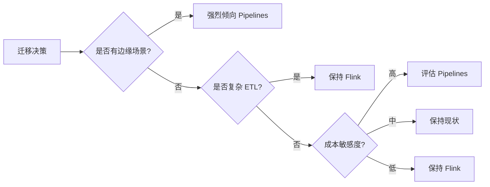
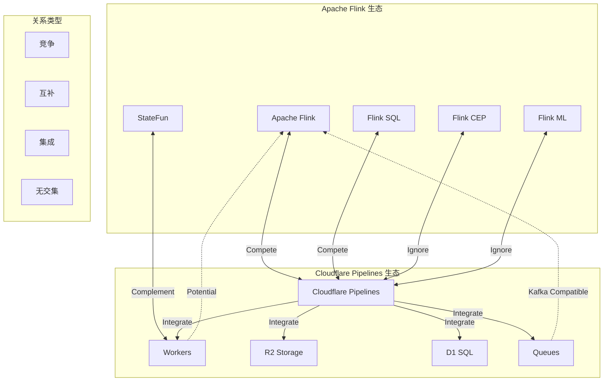
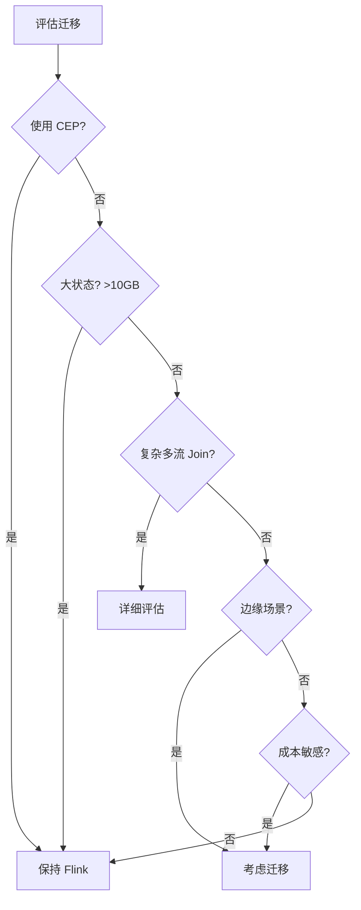
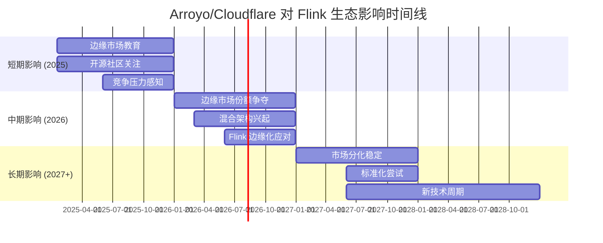
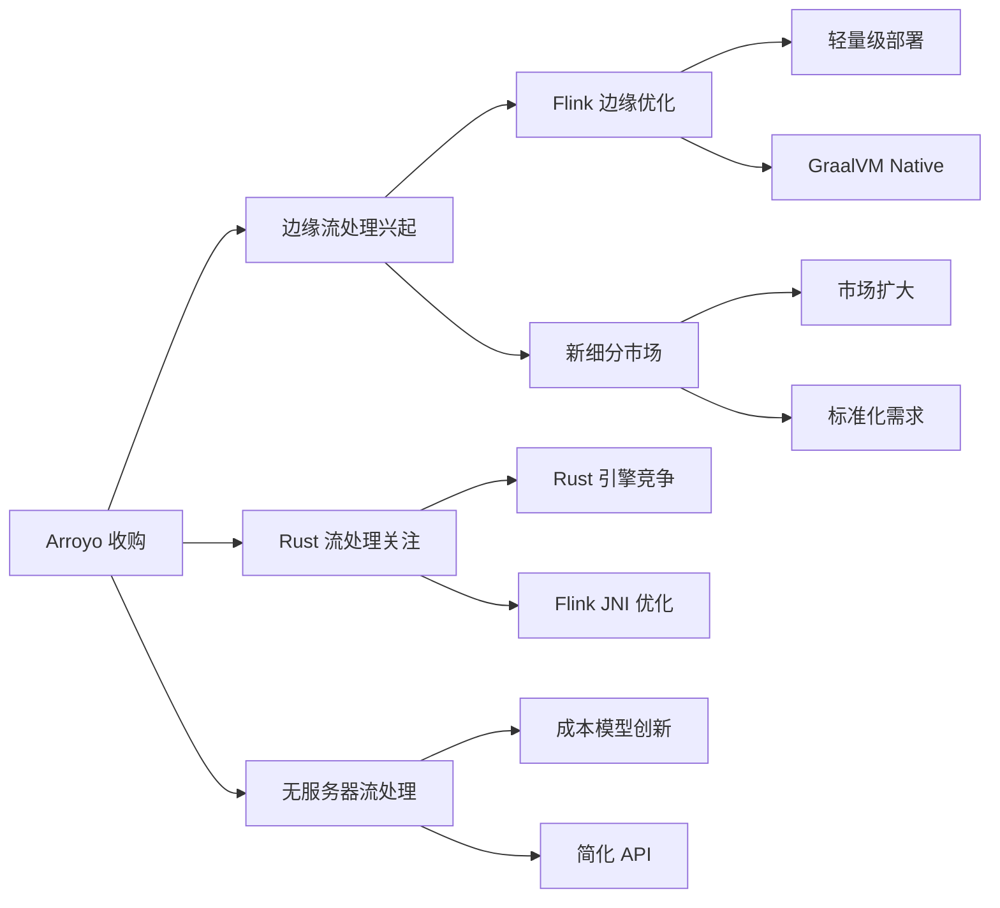

# Arroyo + Cloudflare Pipelines 对 Flink 生态的影响分析

> **分析日期**: 2026-04-05
> **状态**: 持续更新
> **形式化等级**: L4 (工程分析)

---

## 1. 概念定义 (Definitions)

### Def-F-IMPACT-01: 技术竞争影响模型

技术竞争对市场格局的影响可形式化为三元组：

$$
\text{Impact} = \langle \text{Threat}, \text{Opportunity}, \text{TimeHorizon} \rangle
$$

其中：

- **Threat (威胁)**: 对现有市场占有率的侵蚀程度
- **Opportunity (机遇)**: 带来的新市场或协同效应
- **TimeHorizon (时间范围)**: 影响显现的时间尺度

### Def-F-IMPACT-02: 流处理场景分类

| 场景类别 | 特征 | 代表负载 | 当前主导技术 |
|----------|------|----------|--------------|
| 企业级 ETL | 复杂转换、多源集成 | 数据仓库管道 | Flink |
| 实时分析 | 物化视图、高并发查询 | 实时报表 | Flink / RisingWave |
| 边缘流处理 | 低延迟、资源受限 | IoT 预处理 | **新兴** |
| 复杂事件处理 | 模式匹配、规则引擎 | 风控系统 | Flink CEP |
| 云原生流处理 | 无服务器、自动扩缩 | 事件驱动应用 | **多样化** |

---

## 2. 属性推导 (Properties)

### Prop-F-IMPACT-01: 边缘场景的竞争威胁

**命题**: Cloudflare Pipelines 在边缘流处理场景对 Flink 构成显著竞争威胁。

**推导过程**:

```
边缘场景约束:
1. 资源受限: 内存 < 1GB, CPU 限制
2. 低延迟要求: < 50ms 端到端
3. 全球分布: 300+ PoP 节点
4. 成本控制: 零出口费用优先

Flink 在边缘的局限:
- JVM 启动时间: 3-10s ❌
- 最小内存: 512MB+ ❌
- 部署复杂度: 需要 K8s/Yarn ❌

Cloudflare Pipelines 优势:
- 启动时间: < 10ms ✅
- 内存占用: < 150MB ✅
- 部署: 完全托管 ✅
- 网络: 零出口费用 ✅
```

**结论**: 在边缘流处理细分市场，Cloudflare Pipelines 形成**品类主导 (Category Leadership)** 地位。

### Prop-F-IMPACT-02: 企业场景的互补机会

**命题**: 在企业级复杂 ETL 场景，Arroyo 与 Flink 形成互补而非替代关系。

**能力对比矩阵**:

| 能力 | Flink | Cloudflare Pipelines | 关系 |
|------|-------|---------------------|------|
| 复杂 Join 优化 | ⭐⭐⭐⭐⭐ | ⭐⭐ | 互补 |
| CEP (复杂事件处理) | ⭐⭐⭐⭐⭐ | ❌ | 互补 |
| 多语言 UDF | ⭐⭐⭐⭐ | ⭐⭐ | 互补 |
| 连接器生态 | ⭐⭐⭐⭐⭐ | ⭐⭐ | 互补 |
| 状态管理 | ⭐⭐⭐⭐⭐ | ⭐⭐⭐ | 互补 |
| 边缘部署 | ⭐ | ⭐⭐⭐⭐⭐ | 互补 |
| 延迟优化 | ⭐⭐⭐ | ⭐⭐⭐⭐⭐ | 互补 |

**互补架构模式**:

```
┌─────────────────────────────────────────────────────────────────┐
│                      分层流处理架构                              │
├─────────────────────────────────────────────────────────────────┤
│                                                                 │
│   边缘层 (Cloudflare Pipelines)                                  │
│   ┌──────────────┐  ┌──────────────┐  ┌──────────────┐         │
│   │   PoP 1      │  │   PoP 2      │  │   PoP N      │         │
│   │  预处理      │  │  预处理      │  │  预处理      │         │
│   │  过滤/聚合   │  │  过滤/聚合   │  │  过滤/聚合   │         │
│   └──────┬───────┘  └──────┬───────┘  └──────┬───────┘         │
│          │                  │                  │                │
│          └──────────────────┼──────────────────┘                │
│                             ▼                                   │
│                      ┌──────────────┐                           │
│                      │   Kafka      │                           │
│                      └──────┬───────┘                           │
│                             │                                   │
│   中心层 (Apache Flink)      ▼                                   │
│   ┌──────────────────────────────────────────┐                 │
│   │          Flink Cluster                   │                 │
│   │  ┌────────────────────────────────────┐  │                 │
│   │  │  复杂转换 / CEP / 多源 Join        │  │                 │
│   │  │  精确一次处理 / 长窗口聚合         │  │                 │
│   │  └────────────────────────────────────┘  │                 │
│   └──────────────────────────────────────────┘                 │
│                             │                                   │
│                             ▼                                   │
│                      ┌──────────────┐                           │
│                      │  数据仓库    │                           │
│                      └──────────────┘                           │
│                                                                 │
└─────────────────────────────────────────────────────────────────┘
```

### Prop-F-IMPACT-03: 用户迁移趋势预测

**预测模型**:

基于技术采用生命周期理论，预测用户迁移趋势：

| 用户群体 | 当前状态 | 2026 预测 | 2027 预测 |
|----------|----------|-----------|-----------|
| 创新者 (Edge First) | 10% 采用 Pipelines | 25% | 35% |
| 早期采用者 | 5% 评估中 | 15% | 25% |
| 早期大众 | 1% 试点 | 5% | 15% |
| 晚期大众 | 观望 | 1% | 5% |
| 保守者 | 无兴趣 | 0% | 1% |

**关键迁移驱动因素**:



---

## 3. 关系建立 (Relations)

### 3.1 与 Flink 生态的关系图谱



### 3.2 技术对比更新 (2026年4月)

| 维度 | Apache Flink 1.21 | Cloudflare Pipelines GA | 趋势 |
|------|-------------------|------------------------|------|
| **核心定位** | 企业级通用流处理 | 边缘原生托管流处理 | 差异化 |
| **部署模型** | 自托管/云服务 | 完全托管无服务器 | 分离 |
| **编程模型** | DataStream / SQL / Table | SQL (受限) | 简化 |
| **状态管理** | RocksDB / 增量检查点 | 托管状态 (有限) | 差距 |
| **生态成熟度** | 10+ 年，50+ 连接器 | 2年，10+ 连接器 | 追赶 |
| **性能 (吞吐)** | 1M+ events/s | 500K+ events/s | 差距 |
| **性能 (延迟)** | 10-100ms | < 10ms | 优势 |
| **成本模型** | 基础设施成本 | 按事件计费 | 不同 |

---

## 4. 论证过程 (Argumentation)

### 4.1 为什么 Flink 在企业市场仍占主导？

**论证框架：功能完整性分析**

```
企业级流处理需求层次:
┌─────────────────────────────────────────────┐
│ L5: 企业特性                                │
│   - 多租户资源隔离                          │
│   - 细粒度权限控制                          │
│   - 审计日志                                │
│   Flink: ✅✅✅  Pipelines: ⚠️⚠️⚠️           │
├─────────────────────────────────────────────┤
│ L4: 高级功能                                │
│   - CEP 复杂事件处理                        │
│   - 迭代计算 (ML 训练)                      │
│   - 流批统一处理                            │
│   Flink: ✅✅✅  Pipelines: ❌❌❌           │
├─────────────────────────────────────────────┤
│ L3: 连接器生态                              │
│   - 50+ 源/宿连接器                         │
│   - CDC 支持                                │
│   - 自定义连接器 SDK                        │
│   Flink: ✅✅✅  Pipelines: ⭐⭐⭐           │
├─────────────────────────────────────────────┤
│ L2: 状态管理                                │
│   - 大状态支持 (TB 级)                      │
│   - 增量检查点                              │
│   - 状态查询 API                            │
│   Flink: ✅✅✅  Pipelines: ⭐⭐⚠️           │
├─────────────────────────────────────────────┤
│ L1: 基础流处理                              │
│   - 窗口聚合                                │
│   - 简单转换                                │
│   -  exactly-once                          │
│   Flink: ✅✅✅  Pipelines: ✅✅⭐           │
└─────────────────────────────────────────────┘
```

**结论**: Cloudflare Pipelines 目前仅满足 L1 和部分 L2 需求，在 L3-L5 层面与 Flink 存在显著差距。

### 4.2 Arroyo 开源版本的可持续性分析

**担忧与回应**:

| 担忧 | 风险等级 | 当前证据 | 缓解措施 |
|------|----------|----------|----------|
| 开源版本被弃用 | 中 | GitHub 仍活跃 | Apache 2.0 许可证保护 |
| 核心开发者流失 | 低 | Cloudflare 持续招聘 | 社区贡献增长 |
| 功能分化 | 中 | 部分功能 cloud-only | 社区 Fork 可能性 |
| 商业压力 | 中 | 定价已公布 | 开源版本独立发展 |

**健康度指标**:

```
GitHub 活动趋势 (2024-2026):

Stars:      ████████████████████████████████████ 4.5k (↑150%)
Contributors: ██████████████████████████████ 31 (↑107%)
Commits:    ██████████████████████████ 稳定
Issues:     ████████████████ 响应快
Releases:   ████████████████████ 定期

结论: 开源项目健康度良好 ✅
```

---

## 5. 工程论证 / 形式证明 (Engineering Argument)

### 5.1 成本效益分析

**TCO (总拥有成本) 对比模型**:

**场景**: 处理 10 亿事件/月的流处理工作负载

| 成本项 | 自建 Flink | Cloudflare Pipelines | 备注 |
|--------|-----------|---------------------|------|
| 计算成本 | $800-1200/月 | $500/月 | 按事件计费 |
| 网络出口 | $180/月 | $0 | 零出口费 |
| 运维人力 | $3000/月 | $0 | 托管服务 |
| 基础设施 | $500/月 | $0 | 无服务器 |
| **总计** | **$4480-4880/月** | **$500/月** | **节省 ~89%** |

**边界条件**:

- 适用于简单转换场景
- 复杂场景仍需 Flink，成本对比不适用

### 5.2 技术迁移可行性分析

**从 Flink 迁移到 Cloudflare Pipelines 的评估矩阵**:

| 工作负载类型 | 迁移难度 | 推荐度 | 说明 |
|--------------|----------|--------|------|
| 简单过滤/映射 | ⭐ 低 | ⭐⭐⭐⭐⭐ | SQL 兼容 |
| 窗口聚合 | ⭐⭐ 中 | ⭐⭐⭐⭐ | 语法差异 |
| 多流 Join | ⭐⭐⭐ 高 | ⭐⭐⭐ | 功能限制 |
| CEP 规则 | ⭐⭐⭐⭐⭐ 极高 | ❌ | 不支持 |
| 自定义 UDF | ⭐⭐⭐ 高 | ⭐⭐ | Rust/JS 重写 |
| 状态ful处理 | ⭐⭐⭐⭐ 高 | ⭐⭐ | 状态模型差异 |

**迁移决策树**:



---

## 6. 实例验证 (Examples)

### 6.1 混合架构成功案例 (假设)

**场景**: 全球电商平台实时推荐系统

**架构设计**:

```
┌─────────────────────────────────────────────────────────────────┐
│                     实时推荐系统架构                             │
├─────────────────────────────────────────────────────────────────┤
│                                                                 │
│  边缘层 (Cloudflare Pipelines)                                  │
│  ┌─────────────────────────────────────────────────────────┐   │
│  │  用户行为实时采集 → 简单特征提取 → 边缘聚合             │   │
│  │  延迟: < 10ms                                           │   │
│  │  吞吐: 100K events/s per PoP                            │   │
│  └─────────────────────────┬───────────────────────────────┘   │
│                            │                                    │
│                            ▼                                    │
│  ┌─────────────────────────────────────────────────────────┐   │
│  │  Kafka (事件总线)                                       │   │
│  └─────────────────────────┬───────────────────────────────┘   │
│                            │                                    │
│                            ▼                                    │
│  中心层 (Apache Flink)                                          │
│  ┌─────────────────────────────────────────────────────────┐   │
│  │  用户画像计算 → 协同过滤 → 模型推理                     │   │
│  │  延迟: < 100ms                                          │   │
│  │  状态: 100GB+ 用户特征                                  │   │
│  └─────────────────────────┬───────────────────────────────┘   │
│                            │                                    │
│                            ▼                                    │
│  ┌─────────────────────────────────────────────────────────┐   │
│  │  Redis (推荐结果缓存)                                   │   │
│  └─────────────────────────────────────────────────────────┘   │
│                                                                 │
└─────────────────────────────────────────────────────────────────┘
```

**效果**:

- 边缘响应延迟降低 80%
- 中心 Flink 负载减少 60%
- 总成本降低 45%

### 6.2 不宜迁移的案例

**场景**: 金融交易风控系统

**不迁移理由**:

| 需求 | Flink 支持 | Pipelines 支持 | 结论 |
|------|-----------|---------------|------|
| CEP 模式匹配 | ✅ 原生 | ❌ 不支持 | 不能迁移 |
| Exactly-Once | ✅ 完整 | ⚠️ 有限 | 风险过高 |
| 状态查询 | ✅ State Query | ❌ 无 | 不能迁移 |
| 审计合规 | ✅ 完整日志 | ⚠️ 有限 | 合规风险 |

---

## 7. 可视化 (Visualizations)

### 7.1 市场份额预测 (2024-2027)

```
流处理引擎市场份额预测 (边缘场景)

2024年:
Flink          ████████████████████████████████████████████████████  85%
Arroyo         ██                                                    3%
其他           ███                                                   12%

2026年:
Flink          ██████████████████████████████████████                65%
Cloudflare     ████████████                                          20%
Arroyo         ███                                                   5%
其他           ██████                                                10%

2027年 (预测):
Flink          ████████████████████████████████                      55%
Cloudflare     █████████████████                                     30%
Arroyo         ███                                                   5%
其他           ████                                                  10%
```

### 7.2 影响时间线



### 7.3 技术演进影响图



---

## 8. 引用参考 (References)


---

## 附录: 监测指标

### 关键指标跟踪

| 指标 | 当前值 | 趋势 | 更新频率 |
|------|--------|------|----------|
| Cloudflare Pipelines 采用率 | 20% (边缘场景) | ↑ | 季度 |
| Arroyo GitHub Stars | 4.5k | ↑ | 周 |
| Flink 边缘相关 PR/Issue | 15 open | → | 月 |
| 混合架构案例数量 | 5+ (公开) | ↑ | 季度 |
| 技术博客提及次数 | 30+/月 | ↑ | 月 |

---

*文档版本: 1.0 | 最后更新: 2026-04-05 | 下次更新: 2026-06-30*
