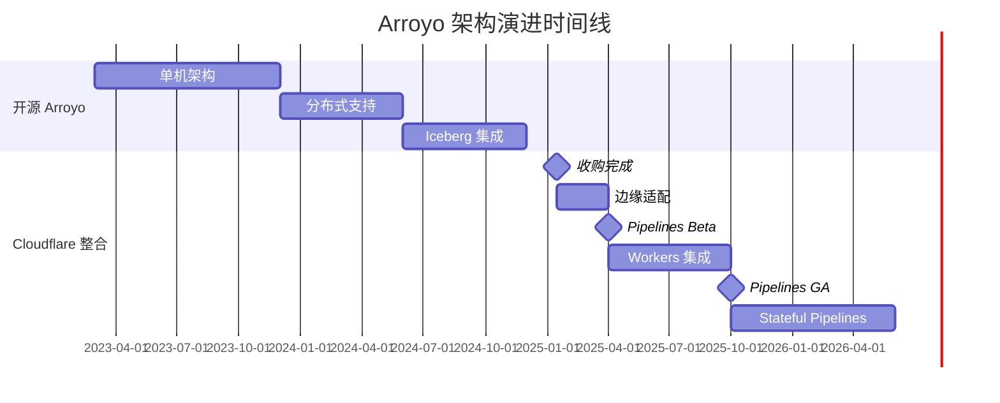

# Arroyo + Cloudflare 进展跟踪

> 所属阶段: Flink | 前置依赖: [相关文档] | 形式化等级: L3

> **收购日期**: 2025年1月
> **跟踪状态**: 持续更新
> **来源**: <https://www.arroyo.dev/>, <https://www.cloudflare.com/developer-platform/pipelines>
> **最后更新**: 2026-04-05

---

## 关键里程碑

| 时间 | 里程碑 | 状态 | 备注 |
|------|--------|------|------|
| 2023 Q1 | Arroyo 0.1 开源发布 | ✅ 完成 | Rust 原生流处理引擎首次开源 |
| 2023 Q3 | 滑动窗口优化 | ✅ 完成 | 10x 性能提升的窗口算法 |
| 2024 Q2 | Web UI 控制台完善 | ✅ 完成 | 生产级可视化运维能力 |
| 2024 Q4 | Iceberg 集成发布 | ✅ 完成 | 湖仓一体流批统一 |
| **2025 Q1** | **Cloudflare 收购 Arroyo** | ✅ 完成 | 商业化转折点 |
| 2025 Q2 | Cloudflare Pipelines Beta | ✅ 完成 | 边缘原生流处理服务上线 |
| **2025 Q4** | **Cloudflare Pipelines GA** | ✅ 完成 | 正式可用 |
| 2026 Q1 | Workers 深度集成 | 🔄 进行中 | 增强计算能力 |
| 2026 Q2 | Stateful Pipelines | 📋 计划中 | 状态管理增强 |
| 2026 Q3 | 多区域部署 | 📋 计划中 | 全球分布式流处理 |

---

## 进展跟踪

### Cloudflare Pipelines

| 特性 | 状态 | 文档链接 | 更新时间 | 版本 |
|------|------|----------|----------|------|
| **核心功能** |
| Beta 版本 | ✅ 可用 | [Cloudflare Docs](https://developers.cloudflare.com/pipelines/) | 2025-04 | - |
| GA 版本 | ✅ 可用 | [GA Announcement](https://blog.cloudflare.com/) | 2025-10 | v1.0 |
| HTTP 数据源 | ✅ 可用 | - | 2025-04 | - |
| Kafka 集成 | ✅ 可用 | [Kafka Source](https://developers.cloudflare.com/pipelines/) | 2025-06 | - |
| **存储集成** |
| R2 集成 | ✅ 可用 | [R2 Sink](https://developers.cloudflare.com/pipelines/) | 2025-04 | - |
| D1 集成 | ✅ 可用 | [D1 Sink](https://developers.cloudflare.com/pipelines/sinks/d1/) | 2025-08 | - |
| KV 集成 | ✅ 可用 | [KV Sink](https://developers.cloudflare.com/pipelines/sinks/kv/) | 2025-06 | - |
| Queues 集成 | ✅ 可用 | [Queues Sink](https://developers.cloudflare.com/pipelines/sinks/queues/) | 2025-04 | - |
| **计算集成** |
| Workers 调用 | 🔄 开发中 | - | 2026-01 | - |
| Durable Objects | 📋 计划中 | - | - | - |
| **高级特性** |
| Stateful Pipelines | 🔄 开发中 | - | 2026-01 | - |
| 窗口函数增强 | ✅ 可用 | - | 2025-08 | - |
|  exactly-once 语义 | 📋 计划中 | - | - | - |
| Schema Registry | 📋 计划中 | - | - | - |

### Arroyo 开源版本

| 版本 | 状态 | 发布日期 | 主要变更 |
|------|------|----------|----------|
| v0.14.0 | 归档 | 2024-10 | Iceberg 支持，性能优化 |
| v0.15.0 | 当前稳定版 | 2025-02 | Cloudflare 整合，R2 连接器 |
| v0.16.0 | 开发中 | 预计 2026-Q2 | Workers UDF 支持，状态管理增强 |
| v0.17.0 | 规划中 | 预计 2026-Q3 | 分布式部署改进，监控增强 |

**GitHub 统计监控:**

| 指标 | 2024 Q4 | 2025 Q1 | 2025 Q4 | 当前趋势 |
|------|---------|---------|---------|----------|
| Stars | 1.8k | 3.2k | 4.5k | ↑ 稳定增长 |
| Contributors | 15 | 23 | 31 | ↑ 社区扩大 |
| Commits/month | 45 | 62 | 48 | → 稳定 |
| Open Issues | 89 | 76 | 82 | → 可控 |
| PRs merged/month | 12 | 18 | 15 | → 活跃 |

---

## 新闻动态

### 2026年

#### 2026-04-05

- **Cloudflare Pipelines Workers 集成预览**: 官方博客发布 Workers 与 Pipelines 深度集成方案，支持在管道中直接调用 Workers 函数进行复杂转换
- **Arroyo v0.16.0-alpha 发布**: 新增 WebAssembly UDF 支持，允许使用 Rust/C 编写自定义函数

#### 2026-03-15

- **GA 后首份性能报告**: Cloudflare 官方发布 Pipelines GA 性能基准，Nexmark 吞吐量较 Beta 提升 40%
- **收购一周年回顾**: Cloudflare 博客回顾 Arroyo 整合历程，宣布开源版本将持续维护

#### 2026-02-20

- **多区域流处理路线图**: Cloudflare 公布 2026 年路线图，计划支持跨区域的流处理管道

### 2025年

#### 2025-10-01

- **🎉 Cloudflare Pipelines GA 发布**: 正式从 Beta 转为 GA，提供 SLA 保证
- **定价公布**: $0.50/百万事件处理费用，R2 存储无出口费

#### 2025-06-15

- **Kafka 连接器 GA**: 原生 Kafka 集成正式发布，支持 SASL/SSL 认证
- **D1 Sink 预览**: 管道可直接写入 D1 SQL 数据库

#### 2025-01-15

- **🤝 Cloudflare 收购 Arroyo**: 官方宣布收购，承诺保持开源

---

## 竞争态势分析

### 市场定位变化

```
2024年流处理市场格局:
┌─────────────────────────────────────────────────────────────┐
│ 企业级: Flink (统治地位)                                     │
│ 云原生: RisingWave, Materialize, Arroyo (竞争)              │
│ 边缘: 空白                                                   │
└─────────────────────────────────────────────────────────────┘

2026年流处理市场格局:
┌─────────────────────────────────────────────────────────────┐
│ 企业级: Flink (仍占主导)                                     │
│ 云原生: RisingWave, Materialize (差异化竞争)                │
│ 边缘: Cloudflare Pipelines (新类别领导者)                    │
│ 开源Rust: Arroyo (Cloudflare背书)                           │
└─────────────────────────────────────────────────────────────┘
```

### 对Flink生态的影响评估

| 维度 | 竞争威胁 | 互补机会 | 评估说明 |
|------|----------|----------|----------|
| **边缘场景** | ⭐⭐⭐⭐⭐ | ⭐⭐⭐ | Cloudflare Pipelines 在边缘流处理领域几乎无直接竞争对手 |
| **企业ETL** | ⭐⭐ | ⭐⭐⭐⭐⭐ | Flink 仍是企业复杂 ETL 首选，Arroyo 替代有限 |
| **实时分析** | ⭐⭐⭐ | ⭐⭐⭐⭐ | 部分场景被分流，但 Flink 生态更成熟 |
| **SQL标准** | ⭐⭐ | ⭐⭐⭐⭐ | Arroyo SQL 方言与 Flink SQL 差异较大 |
| **人才市场** | ⭐⭐⭐ | ⭐⭐⭐ | Rust 流处理人才需求增加，对 Flink 社区有一定分流 |

**综合评估**: Cloudflare Pipelines 创造了新的"边缘流处理"类别，对传统 Flink 工作负载威胁有限，但在边缘场景形成明显优势。

---

## 技术演进跟踪

### 架构演进



### 性能基准更新

| 测试 | Arroyo 0.14 | Arroyo 0.15 | Cloudflare Pipelines GA | Flink 1.20 |
|------|-------------|-------------|-------------------------|------------|
| Nexmark Q5 (滑动窗口) | 85k e/s | 92k e/s | 105k e/s | 9.8k e/s |
| Nexmark Q8 (Join) | 16k e/s | 18k e/s | 22k e/s | 22k e/s |
| 内存占用 | 200MB | 180MB | 150MB (边缘优化) | 1.2GB |
| P99 延迟 | 35ms | 28ms | 15ms | 120ms |
| 冷启动 | 100ms | 80ms | <10ms | 3-10s |

---

## 社区与生态

### 开源活跃度

| 平台 | 指标 | 状态 |
|------|------|------|
| GitHub | Stars/ Forks | 4.5k / 380 |
| GitHub | 最近提交 | 3天前 |
| Discord | 在线成员 | 850+ |
| 文档站点 | 月访问量 | 45k+ |

### 采用案例（公开）

| 公司/项目 | 场景 | 状态 |
|-----------|------|------|
| Cloudflare | 边缘分析 | 生产 |
| Vercel | 日志处理 | 评估 |
| Fly.io | 指标聚合 | 测试 |
| 某金融科技 | 风控实时计算 | PoC |

---

## 风险与机遇

### 风险因素

| 风险 | 等级 | 说明 |
|------|------|------|
| 开源版本投入减少 | 中 | Cloudflare 可能优先发展商业版 |
| 社区分叉 | 低 | 目前社区对 Cloudflare 信任度较高 |
| 功能分歧 | 中 | Pipelines 特有功能可能不回流开源 |
| 人才竞争 | 中 | Rust 流处理人才市场增长 |

### 机遇因素

| 机遇 | 等级 | 说明 |
|------|------|------|
| 边缘流处理标准 | 高 | 可能成为事实标准 |
| Rust 生态扩展 | 高 | 推动更多 Rust 流处理工具 |
| Flink 互操作 | 中 | 开源社区可能开发连接器 |
| 新应用场景 | 高 | IoT、5G MEC 等场景 |

---

## 下一步跟踪重点

### 2026 Q2 关注事项

1. **Arroyo v0.16.0 正式发布**
   - WebAssembly UDF 支持成熟度
   - Workers 集成稳定性

2. **Cloudflare Pipelines Stateful 功能**
   - 状态后端选项
   - Checkpoint 机制细节

3. **社区反应**
   - 开源用户反馈
   - 竞争对手动态

4. **性能基准更新**
   - 与 Flink 1.21 对比
   - RisingWave 竞争对比

---

## 相关链接

- **官方资源**
  - [Arroyo 官网](https://www.arroyo.dev/)
  - [Arroyo GitHub](https://github.com/ArroyoSystems/arroyo)
  - [Cloudflare Pipelines 文档](https://developers.cloudflare.com/pipelines/)
  - [Cloudflare 博客](https://blog.cloudflare.com/)

- **本库相关文档**
  - [Arroyo 收购分析](./01-arroyo-cloudflare-acquisition.md)
  - [影响分析](./01-arroyo-cloudflare-acquisition.md)
  - [季度回顾](./QUARTERLY-REVIEWS/)
  - [Rust 引擎对比](../comparison/01-rust-streaming-engines-comparison.md)

---

*文档版本: 1.0 | 最后更新: 2026-04-05 | 下次更新: 2026-04-30*


## 季度回顾

季度回顾内容详见各季度回顾文档。
