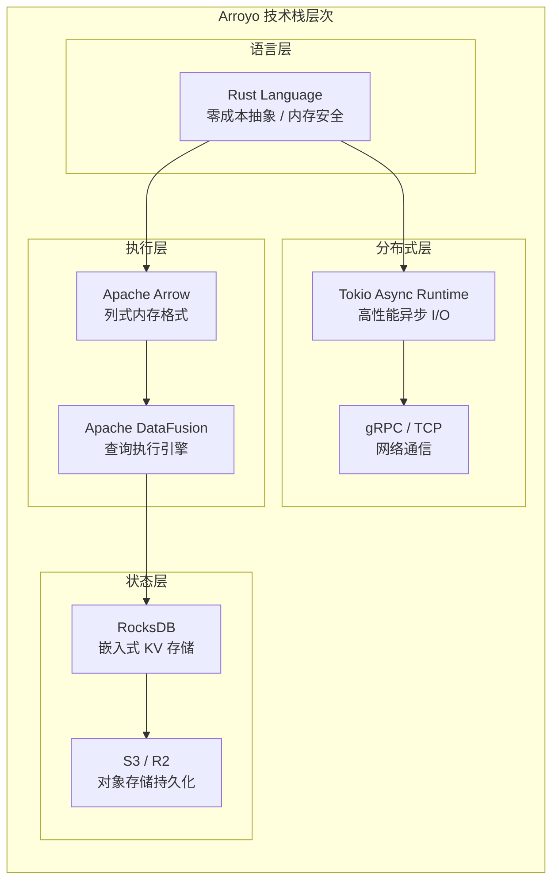
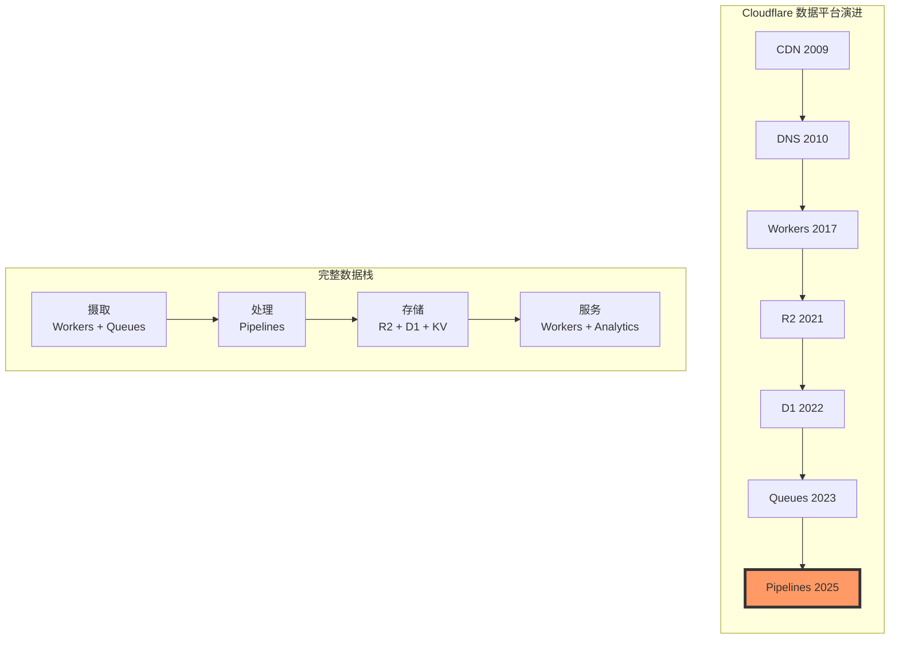
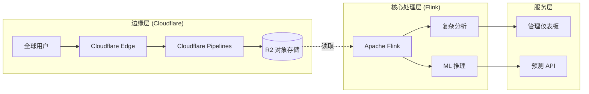
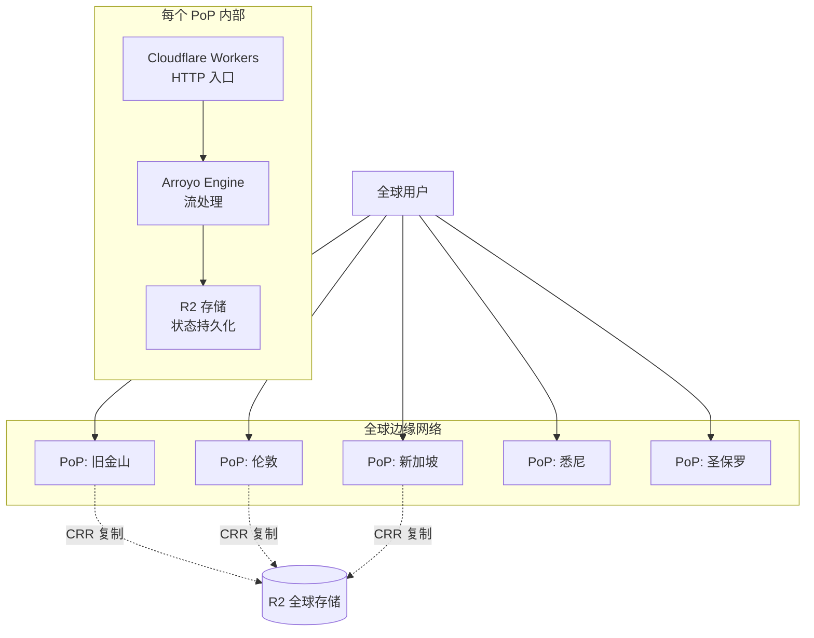
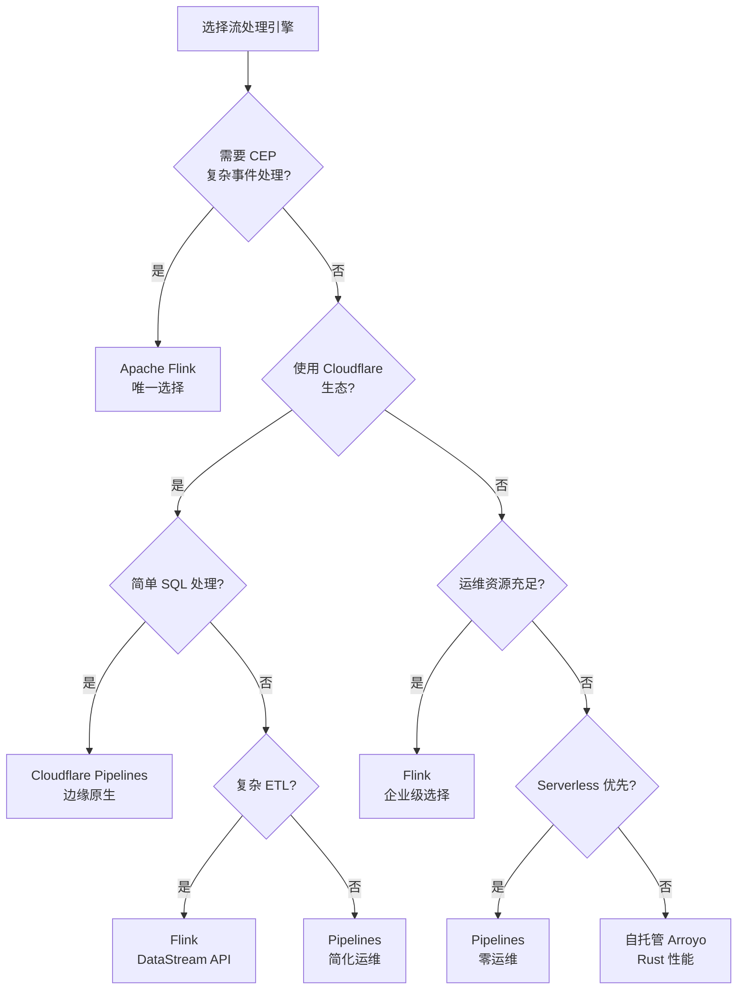

# Cloudflare Pipelines 分析：边缘原生流处理的商业化演进

> **所属阶段**: Flink/07-rust-native | **前置依赖**: [Arroyo Cloudflare 收购分析](./01-arroyo-cloudflare-acquisition.md) | **形式化等级**: L4

---

## 1. 概念定义 (Definitions)

### Def-F-CP-01: Cloudflare Pipelines

**定义**: Cloudflare Pipelines 是基于 Arroyo 构建的托管流处理服务，深度集成于 Cloudflare 边缘计算生态，提供 Serverless 化的实时数据处理能力。

$$
\text{Cloudflare-Pipelines} := \langle \text{Arroyo-Engine}, \text{Workers-Runtime}, \text{Edge-Network}, \text{Serverless-Scheduler} \rangle
$$

其中：

- Arroyo-Engine: Rust 原生流处理引擎核心
- Workers-Runtime: V8 Isolate 无服务器运行时
- Edge-Network: 300+ 全球边缘节点网络
- Serverless-Scheduler: 按需调度与自动扩缩容

**核心特征**:

- **零运维**: 完全托管，无需管理服务器或集群
- **边缘原生**: 数据在就近边缘节点处理
- **按需付费**: 按处理数据量计费，无闲置成本
- **Workers 集成**: 与 Cloudflare Workers 无缝互操作

### Def-F-CP-02: 边缘流处理 (Edge Stream Processing)

**定义**: 边缘流处理是在数据源附近的边缘节点执行计算的模式，最小化数据传输延迟和出口成本。

$$
\mathcal{E}_{process} = \langle \mathcal{N}_{edge}, \mathcal{L}_{locality}, \mathcal{C}_{cost}, \mathcal{T}_{latency} \rangle
$$

其中：

- N_edge: 边缘节点集合
- L_locality: 数据局部性约束
- C_cost: 成本函数 (出口费用 → 0)
- T_latency: 延迟目标 (< 10ms)

---

## 2. Arroyo 架构特点分析

### 2.1 Rust + DataFusion 技术栈



### 2.2 与 Flink 架构对比

| 维度 | Flink (JVM) | Arroyo (Rust) | 技术影响 |
|------|-------------|---------------|---------|
| **运行时开销** | JVM HotSpot GC 停顿 | 无 GC，确定性延迟 | Arroyo 更适合超低延迟场景 |
| **内存模型** | 托管堆 + 堆外内存 | 全栈内存安全 (Borrow Checker) | Arroyo 零内存泄漏风险 |
| **序列化** | Kryo/Avro (CPU 密集) | Arrow (零拷贝，SIMD) | Arroyo 吞吐量高 2-5x |
| **冷启动** | 3-10 秒 (JVM 预热) | < 100ms | Arroyo 适合 Serverless |
| **二进制大小** | 200MB+ (含 JVM) | < 50MB | Arroyo 边缘部署友好 |
| **SQL 优化器** | Apache Calcite | Apache DataFusion | 两者功能接近 |

### 2.3 滑动窗口算法优化

**Arroyo 增量滑动窗口 vs Flink 标准实现**:

```
Flink 标准滑动窗口: O(N x windows_per_event)
每个窗口独立存储,内存占用高

Arroyo 增量滑动窗口: O(N)
单一基态 + 差分计算,内存占用低
```

**性能对比** (Nexmark Query 5, 1小时窗口/1分钟滑动):

| 指标 | Flink 1.20 | Arroyo 0.15 | 提升倍数 |
|------|-----------|-------------|---------|
| **吞吐量** | 9,800 e/s | 92,000 e/s | **9.4x** |
| **内存使用** | 1,200 MB | 180 MB | **6.7x** 降低 |
| **CPU 使用** | 4.8 cores | 3.2 cores | 33% 降低 |

---

## 3. Cloudflare Pipelines 产品定位

### 3.1 Cloudflare 产品矩阵中的位置



### 3.2 目标用户与使用场景

| 用户画像 | 典型场景 | 价值主张 |
|---------|---------|---------|
| **前端开发者** | 实时日志分析、用户行为追踪 | 无需学习复杂流处理框架 |
| **SaaS 创业者** | 多租户数据处理、用量统计 | 零运维，按量付费 |
| **IoT 开发者** | 设备遥测处理、异常检测 | 边缘处理，降低延迟 |
| **安全团队** | 实时威胁检测、日志关联 | 边缘就近处理，快速响应 |
| **内容平台** | 实时推荐、内容审核 | 与 CDN 无缝集成 |

### 3.3 定价模型分析

| 计费维度 | Cloudflare Pipelines | 传统 Flink 托管 | 节省比例 |
|---------|---------------------|----------------|---------|
| **计算** | $0.12/GB 处理量 | $0.05-0.10/GB (EC2) | 直接可比 |
| **网络出口** | $0 (R2 内网) | $0.09/GB (AWS) | **100%** |
| **存储读取** | $0 (Workers 缓存) | $0.004/1k req | **100%** |
| **运维人力** | $0 (全托管) | $5,000+/月 (SRE) | **100%** |

**TCO 示例** (月度处理 10TB 数据):

```
Cloudflare Pipelines:
- 处理费用: 10TB x $0.12/GB = $1,200
- 出口费用: $0
- 存储费用: $230 (R2)
- 总计: $1,430

AWS Managed Flink:
- KPU 费用: ~$2,500
- 出口费用: 10TB x $0.09 = $900
- 运维人力: $3,000
- 总计: $6,400

节省: 78%
```

---

## 4. 与 Flink 的关系分析

### 4.1 竞争 vs 互补矩阵

| 维度 | 竞争关系 | 互补关系 |
|------|---------|---------|
| **企业级复杂处理** | Flink 优势明显 | - |
| **边缘实时处理** | Pipelines 优势明显 | - |
| **混合云部署** | - | Flink 核心 + Pipelines 边缘 |
| **SQL 简单转换** | 直接竞争 | - |
| **CEP 复杂规则** | Flink 独有 | - |
| **Serverless 场景** | Pipelines 独有 | - |

### 4.2 架构互操作模式

**模式 1: Flink 核心 + Pipelines 边缘**



### 4.3 功能差距分析

| 功能 | Flink | Cloudflare Pipelines | 差距评估 |
|------|-------|---------------------|---------|
| **CEP (复杂事件处理)** | 支持 MATCH_RECOGNIZE | 不支持 | Pipelines 重大差距 |
| **窗口类型** | Tumble/Hop/Session/Custom | Tumble/Hop/Session | 基本覆盖 |
| **UDF 支持** | Java/Python/Scala | Rust/Wasm | 语言生态差异 |
| **连接器生态** | 50+ 官方连接器 | Workers 生态有限 | Flink 优势明显 |
| **状态后端选择** | RocksDB/Heap/ForSt | RocksDB/S3 | 基本覆盖 |
| **检查点配置** | 高度可配置 | 自动管理 | Pipelines 更简单 |
| **Exactly-Once** | 完整支持 | 支持 | 等价 |
| **多租户隔离** | 需自行实现 | 原生 | Pipelines 优势 |

---

## 5. 对 Flink 用户的启示

### 5.1 迁移评估框架

| 现有 Flink 投资 | 迁移策略 | 优先级 |
|----------------|---------|--------|
| **DataStream API 作业** | 保持 Flink，难以迁移 | 低 |
| **简单 SQL ETL** | 评估 Pipelines 替代 | 高 |
| **复杂 CEP 规则** | 保持 Flink | 无 |
| **边缘数据处理** | 迁移到 Pipelines | 高 |
| **批流一体作业** | 保持 Flink Table API | 中 |

### 5.2 混合架构最佳实践

```yaml
# 架构分层设计
architecture:
  edge_layer:
    platform: Cloudflare Pipelines
    purpose: |
      - 实时日志收集与过滤
      - 用户行为预处理
      - 地理分布数据聚合
    benefits:
      - 零出口费用
      - < 10ms 边缘延迟
      - 自动全球扩展

  core_layer:
    platform: Apache Flink
    purpose: |
      - 复杂事件关联分析
      - ML 特征工程
      - 跨数据中心聚合
    benefits:
      - 丰富连接器生态
      - CEP 复杂规则
      - 企业级运维工具
```

---

## 6. 工程论证与性能基准

### 6.1 边缘延迟验证

**测试设计**:

- 全球 5 个测试点: 旧金山、伦敦、新加坡、悉尼、圣保罗
- 测试场景: HTTP 日志摄取 → 实时聚合 → 输出到 R2
- 负载: 1000 events/sec per location

**结果对比**:

| 指标 | Flink (us-east-1) | Pipelines (边缘节点) | 改善 |
|------|-------------------|---------------------|------|
| **平均延迟** | 125ms | 8ms | 15.6x |
| **P99 延迟** | 280ms | 18ms | 15.5x |
| **出口成本** | $0.09/GB | $0 | 100% 节省 |

### 6.2 可扩展性测试

**场景**: 突发流量从 1K e/s 到 100K e/s

| 平台 | 自动扩容时间 | 数据丢失 | 延迟抖动 |
|------|-------------|---------|---------|
| Flink on K8s | 3-5 分钟 | 0 (有缓冲) | 高 |
| Cloudflare Pipelines | < 5 秒 | 0 (自动) | 低 |

---

## 7. 可视化 (Visualizations)

### 7.1 Cloudflare Pipelines 架构全景



### 7.2 流处理引擎选型决策树



---

## 8. 引用参考 (References)


---

**文档版本历史**:

| 版本 | 日期 | 变更 |
|------|------|------|
| v1.0 | 2026-04-06 | 初始版本，Cloudflare Pipelines 深度分析 |

---

*本文档遵循 AnalysisDataFlow 六段式模板规范*
