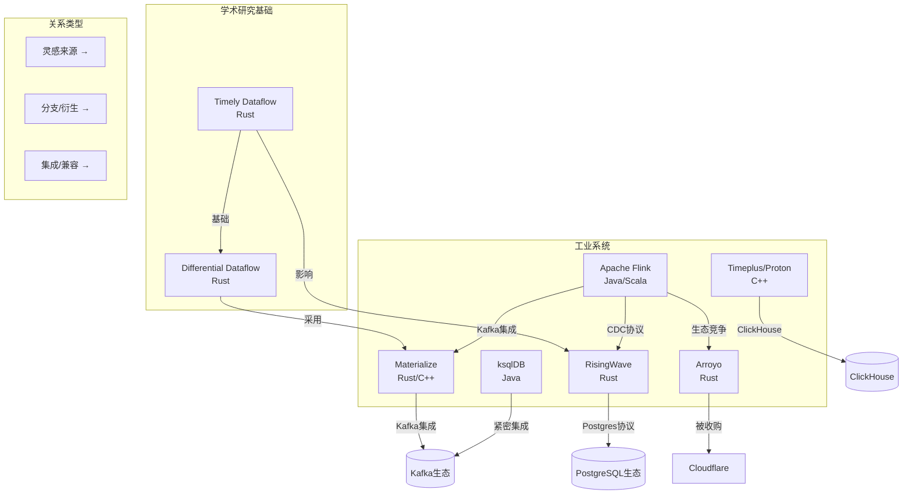
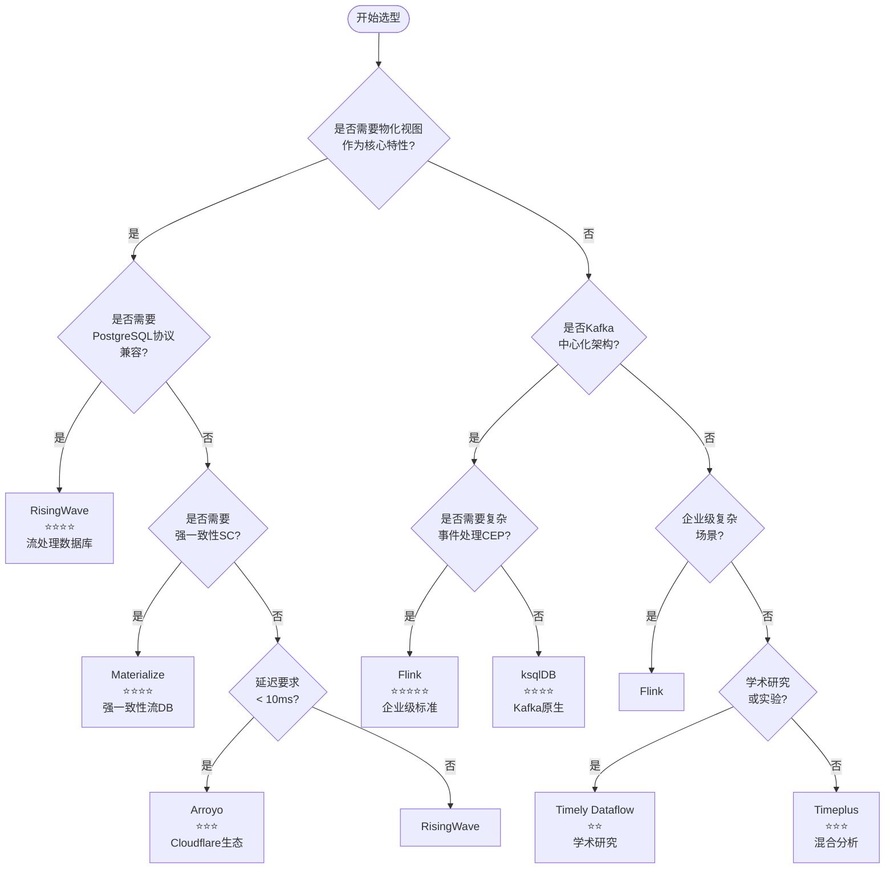
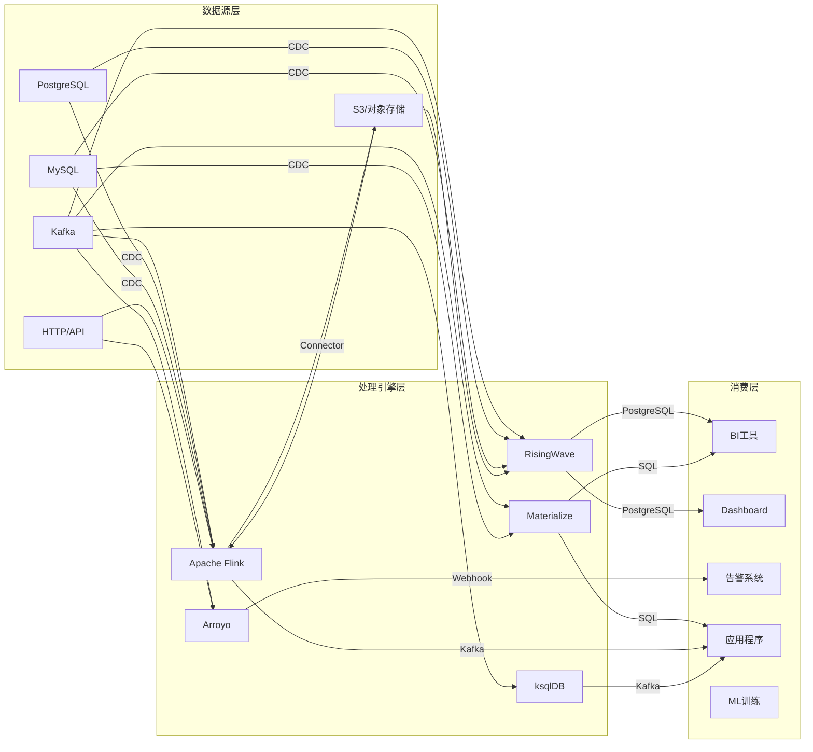
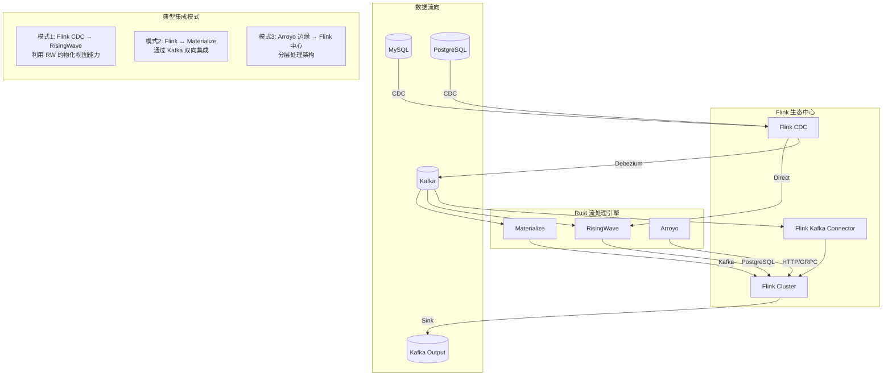

# Rust 流处理引擎生态全面对比矩阵

> 所属阶段: Flink/ | 前置依赖: [Flink 架构文档](../../01-concepts/deployment-architectures.md), [Dataflow 模型理论](../../../Struct/) | 形式化等级: L4

## 1. 概念定义 (Definitions)

### Def-COMP-01: 流处理引擎形式化定义

流处理引擎 $ ext{SE}$ 可形式化为一个七元组：

$$
\text{SE} = \langle \mathcal{I}, \mathcal{O}, \mathcal{S}, \mathcal{T}, \mathcal{C}, \mathcal{Q}, \mathcal{F} \rangle
$$

其中各分量为：

| 符号 | 含义 | 形式化描述 |
|------|------|------------|
| $\mathcal{I}$ | 输入空间 | 有序事件流 $\{e_1, e_2, ...\}$，$e_i = (k_i, v_i, t_i)$，包含键、值、时间戳 |
| $\mathcal{O}$ | 输出空间 | 派生流或物化视图集合 |
| $\mathcal{S}$ | 状态空间 | 键值状态存储 $\mathcal{K} \times \mathcal{V} \to \mathcal{V}$ |
| $\mathcal{T}$ | 时间语义 | $\{ \text{Processing}, \text{Event}, \text{Ingestion} \}$ |
| $\mathcal{C}$ | 一致性模型 | $\{ \text{ALO}, \text{AMO}, \text{EO}, \text{SC} \}$（见 Def-COMP-02） |
| $\mathcal{Q}$ | 查询能力 | $\{ \text{SQL}, \text{DSL}, \text{API} \}$ 的组合 |
| $\mathcal{F}$ | 容错机制 | Checkpoint / WAL / Replication 策略 |

### Def-COMP-02: 一致性层次结构

流处理系统的一致性模型形成严格偏序关系：

$$
\text{ALO} \prec \text{AMO} \prec \text{EO} \prec \text{SC}
$$

其中：

- **ALO** (At-Least-Once): $\forall e \in \text{Input}, P(\text{processed}(e)) \geq 1$
- **AMO** (At-Most-Once): $\forall e \in \text{Input}, P(\text{processed}(e)) \leq 1$
- **EO** (Exactly-Once): $\forall e \in \text{Input}, P(\text{processed}(e)) = 1$
- **SC** (Strong Consistency): 线性一致性 $\land$ 串行化隔离级别

### Def-COMP-03: 流处理引擎分类学

基于架构特征，流处理引擎可分为四类：

```
流处理引擎
├── 流处理框架 (Stream Processing Framework)
│   ├── 代表: Apache Flink, Timely Dataflow
│   └── 特征: 编程API为中心,灵活但需开发
├── 流处理数据库 (Streaming Database)
│   ├── 代表: RisingWave, Materialize, Timeplus
│   └── 特征: 物化视图原生,SQL-first
├── 流分析服务 (Streaming Analytics Service)
│   ├── 代表: Arroyo, ksqlDB
│   └── 特征: 简化部署,快速上手
└── 流计算库 (Stream Compute Library)
    ├── 代表: Tokio Streams, async-stream
    └── 特征: 嵌入式,应用内使用
```

### Def-COMP-04: Rust 流处理引擎定义

Rust-native 流处理引擎 $\text{RS}$ 定义为满足以下条件的引擎：

$$
\text{RS} \iff \text{CoreRuntime} \in \text{Rust} \land \text{MemorySafety} = \text{CompileTimeGuaranteed}
$$

关键特征：

- 零成本抽象：高层 API 编译后无运行时开销
- fearless 并发：借用检查器保证线程安全
- 可预测性能：无 GC 停顿，适合亚毫秒级延迟场景

---

## 2. 属性推导 (Properties)

### Lemma-COMP-01: Rust 实现的共同优势

**命题**: Rust 流处理引擎共享以下工程优势：

1. **内存效率**: 与 Java 实现相比，典型内存开销降低 2-5x
2. **启动速度**: 冷启动时间通常在毫秒级（vs JVM 秒级）
3. **部署密度**: 单个节点可部署更多任务实例
4. **可预测延迟**: 无 GC 停顿，P99 延迟更稳定

**证明概要**:

- Rust 所有权系统实现编译期内存管理，消除运行时 GC
- LLVM 优化后端生成高效机器码
- 标准库 `std::collections` 针对缓存友好性优化 ∎

### Lemma-COMP-02: 一致性-性能权衡

**命题**: 在流处理引擎中，一致性强度与吞吐延迟存在权衡关系：

$$
\text{Throughput} \propto \frac{1}{\text{ConsistencyLevel}} \quad \text{(在固定资源下)}
$$

**直观解释**:

- SC (Materialize): 需要协调和版本管理，吞吐较低
- EO (Flink, RisingWave): 需要 Barrier 同步，中等吞吐
- ALO (最高性能): 无协调开销，但可能重复处理

### Prop-COMP-01: SQL 兼容性光谱

流处理 SQL 支持呈光谱分布：

| 级别 | 特征 | 代表系统 |
|------|------|----------|
| L1 - 方言 | 自定义语法，有限兼容 | Arroyo, ksqlDB |
| L2 - 子集 | ANSI SQL 子集 | Flink SQL |
| L3 - PostgreSQL | 协议级兼容 | RisingWave |
| L4 - 标准 + 扩展 | ANSI + 流扩展 (EMIT) | Materialize |

---

## 3. 关系建立 (Relations)

### 系统间关系图谱



### 技术谱系矩阵

| 系统 | 学术基础 | 工业血统 | 核心技术 |
|------|----------|----------|----------|
| Flink | Dataflow Model [^1] | Apache 基金会 | Chandy-Lamport Checkpoint |
| Materialize | Differential Dataflow [^2] | 前 CockroachDB 团队 | Arrangement, Trace |
| RisingWave | 自研 | 前 AWS Redshift 团队 | Hummock 存储引擎 |
| Arroyo | 自研 | 前 Stripe/Heap | 微批处理 + 流水线 |
| Timely | Naiad [^3] | MSR |  timely 数据并行 |

---

## 4. 论证过程 (Argumentation)

### 4.1 成熟度评估方法论

成熟度评分采用多维加权模型：

$$
\text{Maturity} = 0.3 \times \text{DevelopmentYears} + 0.25 \times \text{ProductionUsers} + 0.25 \times \text{CommunitySize} + 0.2 \times \text{EnterpriseAdoption}
$$

各系统评估：

| 系统 | 开发年限 | 生产用户 | 社区规模 | 企业采用 | 综合评分 |
|------|----------|----------|----------|----------|----------|
| Flink | 10+年 | 1000+ | 非常大 | 广泛 | ⭐⭐⭐⭐⭐ |
| Materialize | 6年 | 100+ | 中等 | 增长中 | ⭐⭐⭐⭐ |
| RisingWave | 4年 | 100+ | 中等 | 增长中 | ⭐⭐⭐⭐ |
| Arroyo | 3年 | 未知 | 小 | Cloudflare | ⭐⭐⭐ |
| Timeplus | 3年 | 未知 | 小 | 初创 | ⭐⭐⭐ |
| ksqlDB | 7年 | 1000+ | 大 | Kafka用户 | ⭐⭐⭐⭐ |

### 4.2 技术选型决策框架

**Thm-COMP-01: 选型决策定理**

给定业务需求向量 $\vec{R} = (r_1, r_2, ..., r_n)$ 和系统能力矩阵 $\mathbf{C}$，最优选择为：

$$
\text{Optimal} = \arg\max_{i} \sum_{j} w_j \cdot \text{match}(C_{ij}, R_j)
$$

其中 $w_j$ 是需求权重，$\text{match}$ 是匹配函数。

---

## 5. 工程论证 / 形式证明 (Engineering Argument)

### 5.1 综合对比矩阵

#### 5.1.1 技术维度对比

| 维度 | Apache Flink | Arroyo | RisingWave | Materialize | Timeplus/Proton | ksqlDB |
|------|--------------|--------|------------|-------------|-----------------|--------|
| **实现语言** | Java/Scala | Rust | Rust | Rust/C++ | C++ | Java |
| **首次发布** | 2011 | 2022 | 2022 | 2019 | 2022 | 2017 |
| **当前版本** | 1.20 | 0.14 | 2.1 | 0.130 | 2.6 | 0.29 |
| **SQL 级别** | L2-子集 | L1-方言 | L3-PostgreSQL | L4-标准+扩展 | L2-子集 | L1-方言 |
| **一致性模型** | EO / ALO | ALO | EO | SC | ALO | ALO |
| **状态存储** | RocksDB/内存 | 内存 | Hummock | SQLite/RocksDB | 自定义 | RocksDB |
| **时间语义** | Event/Proc/Ingest | Event/Proc | Event/Proc | Event | Event/Proc | Event |
| **部署模式** | K8s/Yarn/Standalone | K8s/Docker | K8s/Docker/云 | K8s/Docker/云 | K8s/Docker | Kafka Connect |

#### 5.1.2 性能维度对比

| 指标 | Flink | Arroyo | RisingWave | Materialize | Timeplus | ksqlDB |
|------|-------|--------|------------|-------------|----------|--------|
| **Nexmark QPS** (参考) [^4] | 1M+ | 500K+ | 800K+ | 200K+ | 400K+ | 300K+ |
| **端到端延迟** | 10-100ms | <10ms | 1-100ms | 1-10ms | 10-50ms | 10-100ms |
| **水平扩展** | 优秀 | 良好 | 优秀 | 良好 | 良好 | 有限 |
| **垂直扩展** | 良好 | 优秀 | 优秀 | 良好 | 良好 | 良好 |
| **内存效率** | 中等 | 高 | 高 | 高 | 高 | 中等 |
| **冷启动** | 秒级 | 毫秒级 | 秒级 | 秒级 | 秒级 | 秒级 |

*注：性能数据为近似值，实际取决于具体配置和查询*

#### 5.1.3 生态维度对比

| 维度 | Flink | Arroyo | RisingWave | Materialize | Timeplus | ksqlDB |
|------|-------|--------|------------|-------------|----------|--------|
| **Source Connectors** | 50+ | 10+ | 30+ | 15+ | 20+ | Kafka-only |
| **Sink Connectors** | 50+ | 10+ | 30+ | 15+ | 20+ | Kafka-only |
| **CDC 支持** | 优秀 | 良好 | 优秀 | 良好 | 良好 | 通过 Kafka |
| **与 Kafka 集成** | 原生 | 良好 | 原生 | 原生 | 原生 | 原生 |
| **UDF 支持** | Java/Python/Scala | Rust/SQL | Rust/Python/Java | SQL/Rust | SQL | Java |
| **监控指标** | Prometheus | Prometheus | Prometheus | Prometheus | Prometheus | JMX |

### 5.2 许可证与商业模式

| 系统 | 许可证 | 托管服务 | 企业版 |
|------|--------|----------|--------|
| Flink | Apache 2.0 | Confluent/阿里/Ververica | Ververica |
| Arroyo | Apache 2.0 | Cloudflare (内部) | 无 |
| RisingWave | Apache 2.0 | RisingWave Cloud | 无 |
| Materialize | BSL 1.1 [^5] | Materialize Cloud | 有 |
| Timeplus/Proton | Apache 2.0 (Proton) | Timeplus Cloud | 有 |
| ksqlDB | Confluent Community | Confluent Cloud | 有 |

*注：BSL (Business Source License) 在特定时间后转为 Apache 2.0*

---

## 6. 实例验证 (Examples)

### 6.1 真实场景选型案例

#### 案例 1: 实时数仓构建

**背景**: 电商平台需要构建实时数仓，支持：

- 实时订单聚合（分钟级）
- 用户行为分析（秒级）
- 与现有 PostgreSQL BI 工具集成

**候选系统**: RisingWave vs Materialize vs Flink

**分析**:

| 需求 | RisingWave | Materialize | Flink |
|------|------------|-------------|-------|
| 物化视图 | ✅ 原生 | ✅ 原生 | ⚠️ 需 Table Store |
| PG 协议 | ✅ 兼容 | ⚠️ 部分 | ❌ 不兼容 |
| SQL 复杂度 | ✅ 支持复杂JOIN | ✅ 支持复杂JOIN | ✅ 支持 |
| 许可证 | Apache 2.0 | BSL (4年后) | Apache 2.0 |
| 成本 | 可控 | 较高 | 可控 |

**决策**: RisingWave

- 理由：PostgreSQL 协议兼容可直接对接现有 BI 工具，Apache 2.0 许可证无商业风险

#### 案例 2: 高频交易风控

**背景**: 金融科技公司需要：

- 亚毫秒级延迟（< 5ms）
- 复杂事件处理（CEP）
- 精确一次处理（Exactly-Once）

**候选系统**: Flink vs Arroyo

**分析**:

| 需求 | Flink | Arroyo |
|------|-------|--------|
| CEP 支持 | ✅ 原生 | ⚠️ 有限 |
| EO 语义 | ✅ 支持 | ❌ ALO |
| 延迟 | < 10ms | < 5ms |
| 成熟度 | 10年+生产验证 | 较新 |

**决策**: Flink

- 理由：Exactly-Once 是风控场景硬性要求，CEP 库成熟

#### 案例 3: 日志实时分析

**背景**: 云服务商需要在边缘节点：

- 低资源占用（< 512MB 内存）
- 简单聚合查询
- 快速部署

**候选系统**: Arroyo vs Timeplus

**分析**:

| 需求 | Arroyo | Timeplus |
|------|--------|----------|
| 资源占用 | 极低 | 低 |
| 部署复杂度 | 单二进制 | Docker |
| Cloudflare集成 | ✅ 原生 | ❌ |

**决策**: Arroyo

- 理由：Cloudflare 收购后的生态整合优势，边缘部署友好

### 6.2 代码示例对比

#### 窗口聚合查询

**Flink SQL**:

```sql
SELECT
    TUMBLE_START(event_time, INTERVAL '5' MINUTE) as window_start,
    user_id,
    COUNT(*) as event_count
FROM user_events
GROUP BY
    TUMBLE(event_time, INTERVAL '5' MINUTE),
    user_id;
```

**RisingWave SQL**:

```sql
SELECT
    window_start,
    user_id,
    COUNT(*) as event_count
FROM TUMBLE(user_events, event_time, INTERVAL '5 MINUTES')
GROUP BY window_start, user_id;
```

**Materialize SQL**:

```sql
CREATE MATERIALIZED VIEW user_stats AS
SELECT
    date_trunc('minute', event_time) as window_start,
    user_id,
    COUNT(*) as event_count
FROM user_events
GROUP BY date_trunc('minute', event_time), user_id;
```

**Arroyo SQL**:

```sql
SELECT
    window.start as window_start,
    user_id,
    COUNT(*) as event_count
FROM user_events
GROUP BY hop(event_time, INTERVAL '5 MINUTES'), user_id;
```

---

## 7. 可视化 (Visualizations)

### 7.1 技术选型决策树



### 7.2 能力雷达图（文本表示）

```
                    SQL 兼容性
                         5
                         │
                         │
           生态丰富度 4 ──┼── 4 性能
                         │
      3 ─────────────────┼──────────────── 3
                         │
           成熟度 2 ─────┼──── 2 易用性
                         │
                         1
                    企业特性

Apache Flink:  ████████████████████  [5,4,5,3,4]
RisingWave:    ████████████████░░░░  [4,4,3,4,4]
Materialize:   ███████████████░░░░░  [4,3,3,3,5]
Arroyo:        ███████████░░░░░░░░░  [2,4,2,5,3]
ksqlDB:        ████████████░░░░░░░░  [2,3,4,3,2]
Timeplus:      ██████████░░░░░░░░░░  [3,3,2,3,3]
```

### 7.3 性能-一致性权衡图

```mermaid
quadrantChart
    title 流处理引擎:吞吐量 vs 一致性强度
    x-axis 低一致性(ALO) --> 高一致性(SC)
    y-axis 低吞吐量 --> 高吞吐量

    quadrant-1 高吞吐+低一致:追求性能
    quadrant-2 理想区域:高吞吐+强一致
    quadrant-3 低性能区域:低吞吐+低一致
    quadrant-4 强一致优先:准确性第一

    Flink: [0.7, 0.8]
    RisingWave: [0.7, 0.7]
    Materialize: [0.9, 0.4]
    Arroyo: [0.3, 0.6]
    ksqlDB: [0.3, 0.5]
    Timeplus: [0.4, 0.5]
```

### 7.4 技术栈映射图



### 7.5 与 Flink 的集成架构



---

## 8. 引用参考 (References)

[^1]: T. Akidau et al., "The Dataflow Model: A Practical Approach to Balancing Correctness, Latency, and Cost in Massive-Scale, Unbounded, Out-of-Order Data Processing", PVLDB, 8(12), 2015. <https://www.vldb.org/pvldb/vol8/p1792-Akidau.pdf>

[^2]: F. McSherry et al., "Differential Dataflow", CIDR 2013. <https://arxiv.org/abs/1803.04071>

[^3]: D. G. Murray et al., "Naiad: A Timely Dataflow System", SOSP 2013. <https://dl.acm.org/doi/10.1145/2517349.2522738>

[^4]: Nexmark Benchmark, <https://github.com/nexmark/nexmark>

[^5]: Materialize BSL License, <https://github.com/MaterializeInc/materialize/blob/main/LICENSE>


---

## 附录：快速选型参考卡

| 场景 | 推荐系统 | 理由 |
|------|----------|------|
| 企业级复杂 ETL | Flink | 最成熟，功能最全面 |
| PG 生态物化视图 | RisingWave | 协议兼容，成本可控 |
| 强一致性金融场景 | Materialize | 线性一致性保障 |
| 边缘/低延迟场景 | Arroyo | Cloudflare 生态，资源占用低 |
| Kafka 原生流处理 | ksqlDB | 与 Kafka 深度集成 |
| 学术研究/实验 | Timely | 理论基础扎实 |
| 混合流批分析 | Timeplus | 历史+实时统一查询 |

---

*文档版本: 1.0 | 最后更新: 2026-04-05 | 状态: 完整*

---

## 相关资源

- [Arroyo 进展跟踪](../arroyo-update/PROGRESS-TRACKING.md) - Arroyo + Cloudflare Pipelines 最新动态
- [Arroyo 影响分析](../arroyo-update/IMPACT-ANALYSIS.md) - 对 Flink 生态的影响评估
- [Arroyo 季度回顾](../arroyo-update/QUARTERLY-REVIEWS/)

---

*文档版本: v1.0 | 创建日期: 2026-04-20*
