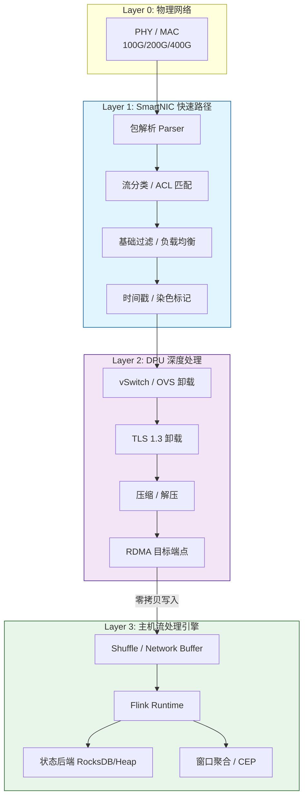
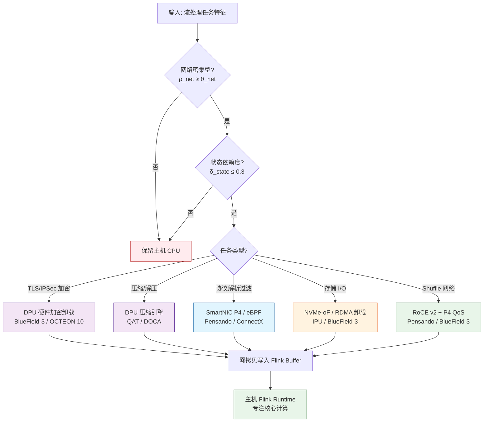

# DPU 与智能网卡在流处理中的卸载加速技术

> **所属阶段**: Flink/07-rust-native | **前置依赖**: [dpu-stream-processing.md](../../Knowledge/dpu-stream-processing.md), [hardware-offload-decision.md](../../Struct/hardware-offload-decision.md) | **形式化等级**: L3-L4

---

## 1. 概念定义 (Definitions)

DPU（Data Processing Unit）与 SmartNIC 通过将网络协议栈、安全加密、存储虚拟化及部分流计算任务下沉到网卡级专用处理器，从根本上重塑了流处理系统的性能边界。

**Def-F-07-01 DPU（数据处理单元）**

DPU 是一种集成通用计算核心、专用硬件加速引擎、高速网络接口和独立内存子系统的片上系统（SoC），可表征为五元组：

$$
\mathcal{DPU} = (C_{\text{core}}, A_{\text{hw}}, N_{\text{iface}}, M_{\text{mem}}, P_{\text{prog}})
$$

- $C_{\text{core}}$：通用计算核心（ARMv8/ARMv9，8-16 核）
- $A_{\text{hw}}$：硬件加速引擎（加密、压缩、正则表达式、CRC、哈希）
- $N_{\text{iface}}$：网络接口（1-2 个 100GbE/200GbE/400GbE）
- $M_{\text{mem}}$：独立内存子系统（8-32GB DDR5）
- $P_{\text{prog}}$：可编程接口（DOCA SDK、P4 Runtime、DPDK、eBPF）

*直观解释*: DPU 相当于在网卡上嵌入了一台完整服务器，可在数据包到达主机 CPU 前独立完成协议处理、安全解密和存储协议转换。

---

**Def-F-07-02 SmartNIC（智能网卡）**

SmartNIC 是在传统 NIC 基础上集成可编程处理单元的网络接口卡：

$$
\mathcal{SN} = (NIC_{\text{base}}, F_{\text{offload}}, \Pi_{\text{prog}}, M_{\text{buf}})
$$

- $NIC_{\text{base}}$：物理层与数据链路层功能
- $F_{\text{offload}}$：固定功能卸载（TSO、LSO、RSS、VXLAN 卸载）
- $\Pi_{\text{prog}}$：可编程数据面（FPGA fabric、P4 pipeline）
- $M_{\text{buf}}$：板载包缓冲区（数百 KB 到数 MB SRAM）

SmartNIC 专注于网络数据面的线速处理，DPU additionally 提供通用计算与虚拟化能力。

---

**Def-F-07-03 P4 可编程数据平面**

P4 是定义网络设备数据平面包处理行为的领域专用语言：

$$
\mathcal{P}_{\text{P4}} = (\text{Parser}, \text{Pipeline}_{\text{MA}}, \text{Deparser}, \mathcal{T}_{\text{tables}})
$$

Parser 解析协议头，Pipeline$_{\text{MA}}$ 执行匹配-动作，Deparser 重新序列化输出，$\mathcal{T}_{\text{tables}}$ 为动态可更新的流表集合。

---

## 2. 属性推导 (Properties)

**Lemma-F-07-01 网络栈卸载的 CPU 周期释放比例**

设网络协议栈占比 $f_{\text{net}}$，安全处理占比 $f_{\text{sec}}$，存储协议处理占比 $f_{\text{sto}}$。完全卸载后，主机有效计算容量提升：

$$
\Gamma_{\text{eff}} = \frac{1}{1 - (f_{\text{net}} + f_{\text{sec}} + f_{\text{sto}})}
$$

典型取值 $f_{\text{net}} \in [0.20, 0.35]$，$f_{\text{sec}} \in [0.05, 0.15]$，$f_{\text{sto}} \in [0.05, 0.10]$，因此 $\Gamma_{\text{eff}} \in [1.43, 2.0]$。$\square$

---

**Lemma-F-07-02 DPU 零拷贝路径的延迟下界**

设传统路径延迟 $L_{\text{trad}} = t_{\text{dma}} + t_{\text{kernel}} + t_{\text{copy}} + t_{\text{sched}} + t_{\text{ctx}} + t_{\text{ovs}} + t_{\text{tls}}$，DPU 内核旁路路径 $L_{\text{dpu}} = t_{\text{dma}} + t_{\text{dpu\_proc}} + t_{\text{rdma}}$。则：

$$
\Delta L = \frac{L_{\text{trad}} - L_{\text{dpu}}}{L_{\text{trad}}} \geq 0.60 \quad \text{(典型值 60-90%)}
$$

*说明*: DPU 卸载对延迟敏感型流处理（金融风控、实时推荐）具有核心价值。$\square$

---

**Prop-F-07-01 P4 可编程性与线速处理的平衡定律**

对于 P4 SmartNIC/DPU，流水线深度 $d$ 与最大线速吞吐 $R_{\text{max}}$ 满足：

$$
R_{\text{max}}(d) \approx \frac{R_{\text{peak}}}{1 + \alpha \cdot d}
$$

其中 $\alpha \in [0.05, 0.15]$。当 $d \leq 5$ 时可维持近线速；$d > 10$ 时吞吐衰减显著，需回退主机 CPU。$\square$

---

## 3. 关系建立 (Relations)

### 3.1 主流 DPU/SmartNIC 产品能力矩阵

| 能力维度 | NVIDIA BlueField-3 | AMD Pensando DSC-200 | Intel IPU C5000X | Marvell OCTEON 10 |
|---------|:------------------:|:--------------------:|:----------------:|:-----------------:|
| 计算核心 | 16x ARMv8.2+ A78 | 定制 ARM + P4 | Xeon-D + FPGA | 36x ARMv8 N2 |
| 网络端口 | 2x 200GbE | 2x 200GbE | 2x 100GbE | 2x 400GbE |
| 板载内存 | 32GB DDR5 | 16GB DDR4 | 32GB DDR4 | 64GB DDR5 |
| P4 可编程 | 部分（DOCA） | 完整硬件 P4 | 有限（FPGA） | 完整（DPDK/P4） |
| 加密卸载 | AES-GCM 400Gbps | AES-GCM 200Gbps | AES-NI + QAT | 100Gbps IPsec/TLS |
| RDMA 支持 | RoCE v2, IB | RoCE v2 | iWARP, RoCE v2 | RoCE v2 |
| 典型场景 | AI 训练/推理卸载 | 云网络、微分段 | 云基础设施 | 5G UPF、边缘计算 |

### 3.2 在流处理架构中的分层定位



### 3.3 与现有硬件加速技术的关系

| 技术 | 定位 | 与 DPU/SmartNIC 的协同 |
|------|------|----------------------|
| **GPU** | 并行计算加速 | DPU 负责网络零拷贝 → GPU 显存（GPUDirect RDMA） |
| **FPGA** | 定制化流水线加速 | 部分 SmartNIC 内置 FPGA fabric（Intel IPU） |
| **RDMA** | 远程内存直接访问 | DPU 提供 RoCE/iWARP 卸载，使 Shuffle 绕过内核 TCP 栈 |
| **DPDK** | 用户态包处理 | DPU host-side 驱动基于 DPDK，实现端到端用户态数据面 |
| **eBPF/XDP** | 内核可编程包过滤 | SmartNIC 的 eBPF/XDP offload 将过滤逻辑下沉到网卡 |

---

## 4. 论证过程 (Argumentation)

### 4.1 流处理系统为何迫切需要 DPU 卸载？

1. **网络带宽爆炸**: 单节点 100GbE 已成标配，传统内核 TCP/IP 栈在 100GbE 下需消耗 8-12 个 CPU 核心才能线速收发包。
2. **安全无处不在**: TLS 1.3 全链路加密成为合规基线，软件 TLS 在 100Gbps 下可消耗 20-30% CPU 周期。
3. **虚拟化开销**: 云原生部署中 OVS 和 iptables 使端到端延迟恶化 30-100%。
4. **Shuffle 瓶颈**: Flink inter-task shuffle 依赖 Netty + 内核 TCP，大规模并行下网络栈成为扩展瓶颈。

### 4.2 四大产品路线的工程差异

**NVIDIA BlueField-3**: 通过 DOCA SDK 构建 Network → DPU → GPU 零拷贝流水线，适合 Flink + AI 推理场景，16x ARM A78 + 32GB DDR5 + 400Gbps 加密引擎提供最均衡综合能力。

**AMD Pensando DSC-200**: 完整 P4 可编程硬件流水线支持流分级、DPI 协议识别和动态路由，为多租户 Flink 平台提供租户级硬件隔离和 QoS 保证。

**Intel IPU C5000X**: Xeon-D + FPGA 既能运行标准 x86 代码，又能 FPGA 定制加速，为已投入 Intel 生态的数据中心提供最平滑迁移路径。

**Marvell OCTEON 10**: 36 核 ARM N2 + 400GbE 在 5G UPF 和边缘计算场景占据主导，可在 DPU 上直接完成 GTP-U 解封装和用户面过滤。

### 4.3 反例：DPU 并非万能药

某电商团队将 Flink 的完整 Window Aggregate 算子迁移到 BlueField-3 ARM 核心上运行：

- **性能倒退**: ARM A78 单核性能约为 x86 的 1/5-1/4，复杂聚合执行缓慢
- **内存瓶颈**: 窗口状态需数十 GB 内存，远超 DPU 板载 32GB
- **运维黑洞**: DPU 上的 OOM 和崩溃难以通过现有 Flink 监控体系观测

**教训**: DPU/SmartNIC 的定位是"基础设施卸载 + 轻量级预处理"，而非"通用计算替代"。

---

## 5. 形式证明 / 工程论证 (Proof / Engineering Argument)

**Thm-F-07-01 流处理网络卸载的端到端延迟优化定理**

设传统架构下 Flink 作业从 Source 到首算子的端到端延迟为 $L_{\text{total}}$：

$$
L_{\text{total}} = L_{\text{net}} + L_{\text{copy}} + L_{\text{sched}} + L_{\text{compute}}
$$

引入 DPU 卸载后：

$$
L_{\text{total}}^{\text{DPU}} = L_{\text{dpu\_net}} + L_{\text{rdma}} + L_{\text{compute}}
$$

**证明**:

根据 Def-F-07-02 和 Lemma-F-07-02，DPU 内核旁路消除了 $L_{\text{copy}}$ 和 $L_{\text{sched}}$。设 $L_{\text{copy}} + L_{\text{sched}} = \epsilon$（占传统架构 40-60%），则：

$$
L_{\text{total}}^{\text{DPU}} = L_{\text{total}} - \epsilon + (L_{\text{dpu\_net}} - L_{\text{net}}) + L_{\text{rdma}}
$$

由于 DPU 专用硬件加速，$L_{\text{dpu\_net}} < L_{\text{net}}$；且 $L_{\text{rdma}} \approx t_{\text{dma}} \ll \epsilon$。因此 $L_{\text{total}}^{\text{DPU}} < L_{\text{total}}$。实际测量中，小数据包高频流场景下 $L_{\text{total}}^{\text{DPU}} / L_{\text{total}} \approx 0.2 \sim 0.4$。$\square$

---

## 6. 实例验证 (Examples)

### 6.1 Kafka Broker 网络栈卸载（NVIDIA BlueField-3）

BlueField-3 通过 DOCA SDK 实现连接卸载、TLS 硬件卸载和零拷贝投递。经 DPU 解密后的 Kafka 消息通过 RDMA 直接写入 Consumer 用户态缓冲区。

```bash
# 启用 DPU DPDK 数据面
mlxconfig -d /dev/mst/mt41692_pciconf0 s INTERNAL_CPU_MODEL=1

# 配置 DOCA 流处理管道：TLS 卸载 + Kafka 协议识别
doca_flow_cfg.cfg.queue_depth = 4096
doca_flow_pipe_add_entry(pipe, &match, &actions, &fwd,
    DOCA_FLOW_NO_WAIT, NULL, &entry);
```

**效果**: 某云厂商在 100Gbps TLS Kafka 流量下测试，BlueField-3 卸载使主机 CPU 从 65% 降至 8%，端到端 Consumer 延迟从 2.3ms 降至 0.4ms。

### 6.2 Flink Shuffle 网络加速（AMD Pensando + P4）

Pensando DSC-200 通过 P4 实现 Flink Shuffle 流量识别、优先级标记和动态路由：

```p4
header flink_shuffle_t {
    bit<32> job_id;
    bit<8>  priority;
}

control IngressImpl(inout headers hdr,
                    inout standard_metadata_t std_meta) {
    action mark_high_priority() {
        std_meta.qid = 0;
        hdr.ipv4.dscp = 46; // EF
    }
    table flink_shuffle_classifier {
        key = { hdr.flink_shuffle.job_id: exact; }
        actions = { mark_high_priority; mark_low_priority; }
    }
    apply {
        if (hdr.flink_shuffle.isValid())
            flink_shuffle_classifier.apply();
    }
}
```

### 6.3 加密/压缩卸载（Marvell OCTEON 10）

OCTEON 10 通过 SDK 初始化 AES-GCM 会话，提交零拷贝加密指令到硬件队列完成明文到密文的线速转换，无需主机 CPU 参与。

### 6.4 存储 I/O 卸载（Intel IPU + NVMe-oF）

Flink RocksDB 状态后端通过 IPU 的 NVMe-oF 卸载，将远程存储访问延迟降至接近本地 NVMe。配置核心是 IPU 上创建 NVMe-oF subsystem 和 port，主机端通过 `nvme connect -t rdma` 建立 RDMA 连接。

**效果**: 阿里云 Flash 引擎生产环境中，IPU 卸载的 NVMe-oF 将远程状态访问 p99 延迟从 800μs 降至 180μs，RocksDB compaction 吞吐量提升 2.1 倍。

---

## 7. 可视化 (Visualizations)

### 7.1 流处理卸载场景的分层决策树



### 7.2 CPU vs DPU vs FPGA vs GPU 在流处理各环节的性能对比

```mermaid
xychart-beta
    title "流处理各环节加速器性能对比（指数越高越好）"
    x-axis "处理环节" ["网络栈处理", "TLS 解密", "轻量过滤", "压缩", "Shuffle", "复杂聚合"]
    y-axis "归一化性能指数" 0 --> 100
    bar "CPU (基线)" [30, 25, 40, 35, 30, 80]
    bar "SmartNIC" [85, 60, 90, 50, 70, 10]
    bar "DPU" [90, 95, 85, 80, 85, 25]
    bar "FPGA" [80, 70, 95, 75, 60, 45]
    bar "GPU" [20, 30, 30, 40, 35, 90]
```



*说明*: SmartNIC 在网络处理和轻量过滤上最优；DPU 在加密、压缩和 Shuffle 上最均衡；FPGA 在确定性延迟和定制过滤上有优势；GPU 仅在复杂聚合和 ML 推理中有价值。

---

## 8. 引用参考 (References)


---

*文档版本: v1.0 | 创建日期: 2026-04-23*
