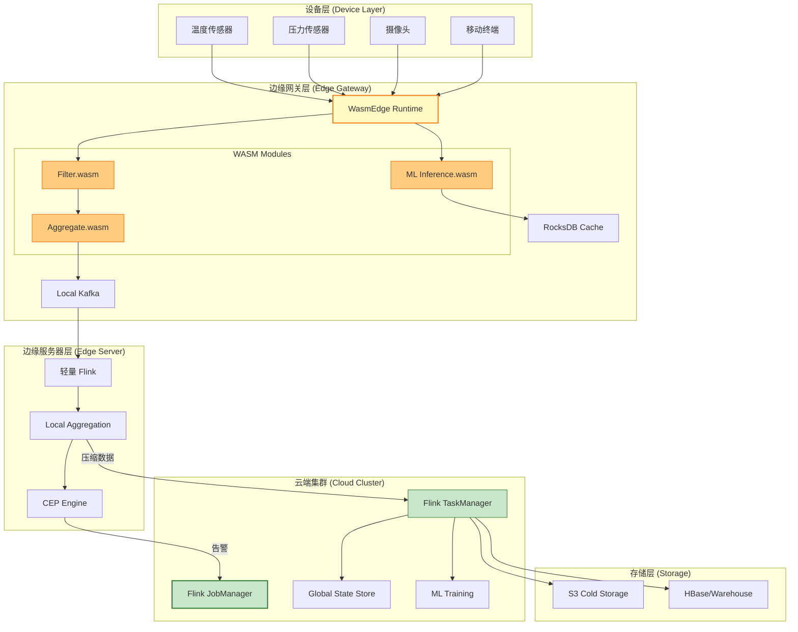
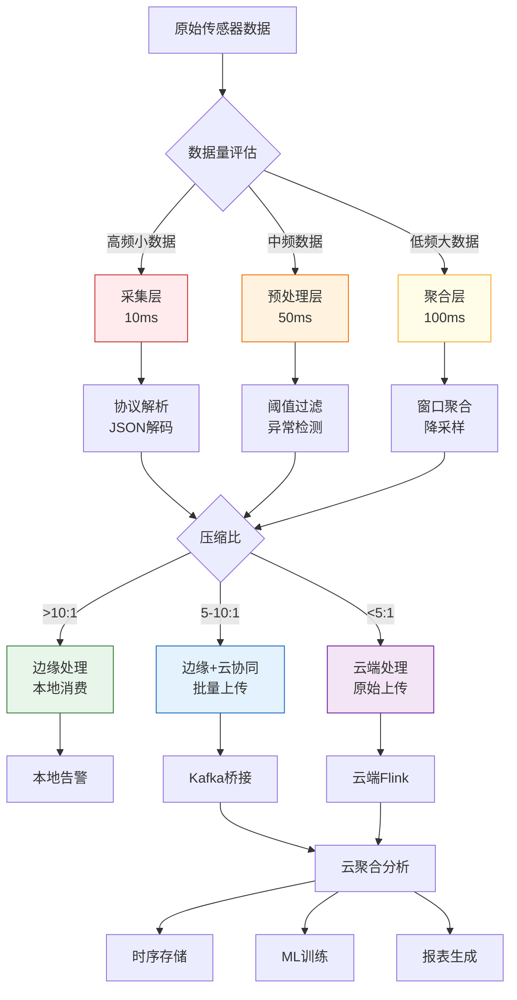
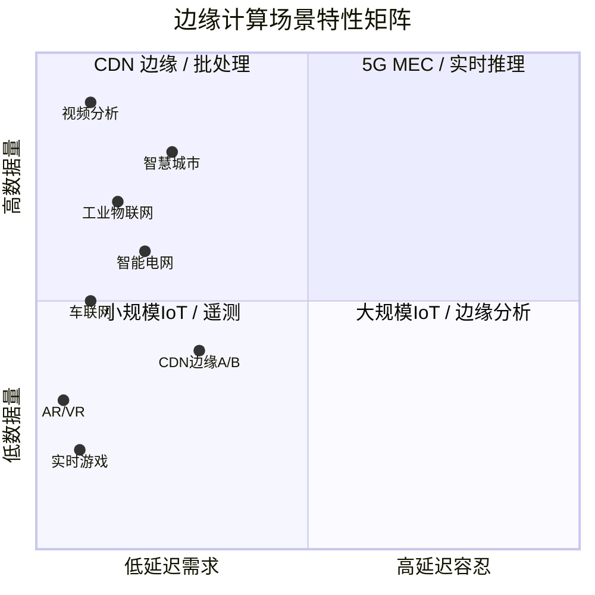
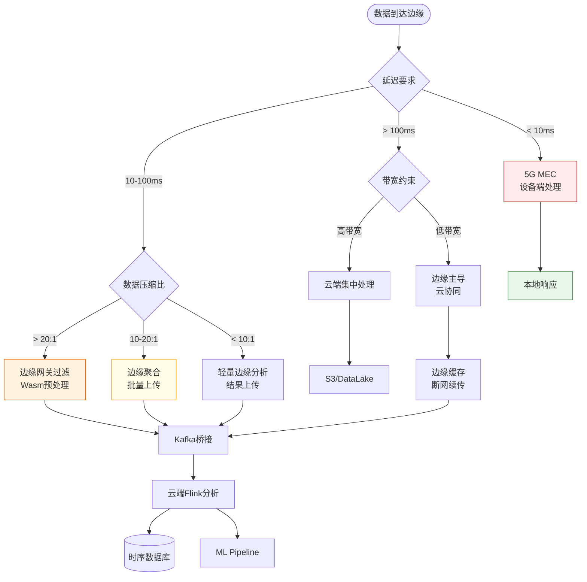

# 边缘计算 Wasm 运行时架构设计 (Edge Computing Wasm Runtime Architecture)

> **所属阶段**: Flink/14-rust-assembly-ecosystem/edge-wasm-runtime | **前置依赖**: [WASM UDF Frameworks](../../03-api/09-language-foundations/09-wasm-udf-frameworks.md), [IoT 流处理案例](../../09-practices/09.01-case-studies/case-iot-stream-processing.md) | **形式化等级**: L3-L4

---

## 目录

- [边缘计算 Wasm 运行时架构设计 (Edge Computing Wasm Runtime Architecture)](#边缘计算-wasm-运行时架构设计-edge-computing-wasm-runtime-architecture)
  - [目录](#目录)
  - [1. 概念定义 (Definitions)](#1-概念定义-definitions)
    - [Def-EDGE-01: 边缘-云协同模型 (Edge-Cloud Collaborative Model)](#def-edge-01-边缘-云协同模型-edge-cloud-collaborative-model)
    - [Def-EDGE-02: 分层数据处理架构 (Layered Data Processing Architecture)](#def-edge-02-分层数据处理架构-layered-data-processing-architecture)
    - [Def-EDGE-03: 延迟-带宽权衡空间 (Latency-Bandwidth Trade-off Space)](#def-edge-03-延迟-带宽权衡空间-latency-bandwidth-trade-off-space)
    - [Def-EDGE-04: Wasm 边缘运行时 (Wasm Edge Runtime)](#def-edge-04-wasm-边缘运行时-wasm-edge-runtime)
    - [Def-EDGE-05: 资源受限执行环境 (Resource-Constrained Execution Environment)](#def-edge-05-资源受限执行环境-resource-constrained-execution-environment)
  - [2. 属性推导 (Properties)](#2-属性推导-properties)
    - [Prop-EDGE-01: 边缘处理最优性命题](#prop-edge-01-边缘处理最优性命题)
    - [Prop-EDGE-02: 分层架构可扩展性命题](#prop-edge-02-分层架构可扩展性命题)
    - [Prop-EDGE-03: Wasm 沙箱隔离安全性](#prop-edge-03-wasm-沙箱隔离安全性)
    - [Prop-EDGE-04: 网络分区容错性](#prop-edge-04-网络分区容错性)
  - [3. 关系建立 (Relations)](#3-关系建立-relations)
    - [3.1 边缘-云架构映射关系](#31-边缘-云架构映射关系)
    - [3.2 IoT/5G/CDN 场景覆盖矩阵](#32-iot5gcdn-场景覆盖矩阵)
    - [3.3 Flink 运行时与 Wasm 运行时关系](#33-flink-运行时与-wasm-运行时关系)
  - [4. 论证过程 (Argumentation)](#4-论证过程-argumentation)
    - [4.1 为何选择 Wasm 而非容器](#41-为何选择-wasm-而非容器)
    - [4.2 边缘部署位置决策树](#42-边缘部署位置决策树)
    - [4.3 资源受限环境优化策略](#43-资源受限环境优化策略)
  - [5. 形式证明 / 工程论证 (Proof / Engineering Argument)]()
    - [5.1 分层处理延迟上界证明](#51-分层处理延迟上界证明)
    - [5.2 安全隔离形式化论证](#52-安全隔离形式化论证)
    - [5.3 边缘-云协同一致性论证](#53-边缘-云协同一致性论证)
  - [6. 实例验证 (Examples)](#6-实例验证-examples)
    - [6.1 IoT 场景：智能工厂边缘网关](#61-iot-场景智能工厂边缘网关)
    - [6.2 5G 场景：MEC 边缘计算节点](#62-5g-场景mec-边缘计算节点)
    - [6.3 CDN 场景：边缘流处理 Worker](#63-cdn-场景边缘流处理-worker)
    - [6.4 WasmEdge + Flink 集成示例]()
  - [7. 可视化 (Visualizations)](#7-可视化-visualizations)
    - [7.1 边缘-云协同架构图](#71-边缘-云协同架构图)
    - [7.2 分层数据处理流程图](#72-分层数据处理流程图)
    - [7.3 IoT/5G/CDN 场景对比矩阵](#73-iot5gcdn-场景对比矩阵)
    - [7.4 延迟-带宽权衡决策图](#74-延迟-带宽权衡决策图)
  - [8. 引用参考 (References)](#8-引用参考-references)

---

## 1. 概念定义 (Definitions)

### Def-EDGE-01: 边缘-云协同模型 (Edge-Cloud Collaborative Model)

**边缘-云协同模型**是一种分布式计算架构，通过在物理位置靠近数据源的边缘节点执行计算，同时与云端进行协同，实现低延迟、高带宽效率的数据处理。

形式化定义为：

$$
\text{EdgeCloudModel} = \langle E, C, D, S, \delta, \beta, \mathcal{R} \rangle
$$

其中：

| 符号 | 定义 | 说明 |
|------|------|------|
| $E$ | 边缘节点集合 | $E = \{e_1, e_2, ..., e_n\}$，每个边缘节点具有计算、存储、网络能力 |
| $C$ | 云端中心集群 | 中心化 Flink 集群，具有充足计算资源 |
| $D$ | 数据流集合 | $D = \{d_1, d_2, ..., d_m\}$，表示各类数据流 |
| $S$ | 协同策略函数 | $S: D \times E \times C \rightarrow \{E, C, E \cap C\}$，决定数据处理位置 |
| $\delta$ | 延迟函数 | $\delta(e_i, C)$ 表示边缘节点 $e_i$ 到云端的通信延迟 |
| $\beta$ | 带宽函数 | $\beta(e_i, C)$ 表示边缘节点 $e_i$ 到云端的可用带宽 |
| $\mathcal{R}$ | 资源约束集合 | 边缘节点的资源上限约束 |

**协同模式分类**:

```
边缘-云协同模式
├── 完全边缘模式 (Edge-Only)
│   └── 处理完全在边缘完成,结果本地消费
├── 边缘主导模式 (Edge-Primary)
│   └── 预处理在边缘,聚合分析在云端
├── 云主导模式 (Cloud-Primary)
│   └── 边缘仅做数据收集,处理在云端
└── 混合协同模式 (Hybrid)
    └── 动态决策,边缘/云根据负载切换
```

### Def-EDGE-02: 分层数据处理架构 (Layered Data Processing Architecture)

**分层数据处理架构**将数据处理任务按延迟、计算复杂度、状态需求划分为多个层次，每层在最适合的执行环境中运行。

形式化定义为：

$$
\text{LayeredArch} = \langle L, \prec, T, R, \phi \rangle
$$

其中：

| 符号 | 定义 | 说明 |
|------|------|------|
| $L$ | 层级集合 | $L = \{l_1, l_2, ..., l_k\}$，表示 $k$ 个处理层级 |
| $\prec$ | 层级偏序关系 | $l_i \prec l_j$ 表示层级 $i$ 的输出是层级 $j$ 的输入 |
| $T$ | 任务类型映射 | $T: L \rightarrow \{\text{Filter}, \text{Transform}, \text{Aggregate}, \text{ML}\}$ |
| $R$ | 资源需求映射 | $R: L \rightarrow (CPU, Memory, Storage, GPU)$ |
| $\phi$ | 层级分配函数 | $\phi: L \rightarrow E \cup C$，决定每层运行的位置 |

**标准四层架构**:

| 层级 | 名称 | 延迟要求 | 典型任务 | 执行位置 |
|------|------|---------|---------|---------|
| $l_1$ | 采集层 | $< 10\text{ms}$ | 协议解析、数据解码 | 边缘设备 |
| $l_2$ | 预处理层 | $< 50\text{ms}$ | 过滤、去重、格式转换 | 边缘网关 |
| $l_3$ | 聚合层 | $< 500\text{ms}$ | 窗口聚合、本地分析 | 边缘服务器 |
| $l_4$ | 分析层 | $< 5\text{s}$ | CEP、ML推理、全局聚合 | 云端 |

### Def-EDGE-03: 延迟-带宽权衡空间 (Latency-Bandwidth Trade-off Space)

**延迟-带宽权衡空间**描述了在边缘计算环境中，数据处理位置选择对端到端延迟和网络带宽消耗的影响关系。

形式化定义为：

$$
\text{TradeOffSpace} = \{(L_{total}, B_{total}) \mid \exists \pi \in \Pi: L_{total} = L(\pi) \land B_{total} = B(\pi)\}
$$

其中：

$$
L_{total} = L_{proc}^{edge} + L_{trans} + L_{proc}^{cloud}
$$

$$
B_{total} = B_{upload} + B_{download}
$$

**权衡曲线**:

| 处理策略 | 延迟特征 | 带宽特征 | 适用场景 |
|---------|---------|---------|---------|
| 纯边缘处理 | $L_{proc}^{edge}$ 最小 | $B_{upload} \approx 0$ | 实时控制、紧急告警 |
| 边缘预处理+云聚合 | 中等 | $B_{upload}$ 减少 60-90% | 时序分析、趋势监控 |
| 纯云端处理 | $L_{trans}$ 最大 | $B_{upload}$ 最大 | 复杂分析、全局聚合 |

### Def-EDGE-04: Wasm 边缘运行时 (Wasm Edge Runtime)

**Wasm 边缘运行时**是针对资源受限边缘环境优化的 WebAssembly 执行引擎，支持轻量级、安全隔离的用户代码执行。

形式化定义为：

$$
\text{WasmEdgeRuntime} = \langle \mathcal{M}, \mathcal{H}, \mathcal{S}, \mathcal{C}, \mathcal{W} \rangle
$$

其中：

| 组件 | 定义 | 边缘优化特性 |
|------|------|-------------|
| $\mathcal{M}$ | WASM 模块集合 | 模块体积 $< 10\text{MB}$，启动时间 $< 50\text{ms}$ |
| $\mathcal{H}$ | Host Function 接口 | 提供 IoT/5G/CDN 专用 API |
| $\mathcal{S}$ | 安全沙箱 | Capability-based 安全模型 |
| $\mathcal{C}$ | 编译器/解释器 | AOT 编译支持，减少运行时开销 |
| $\mathcal{W}$ | WASI 接口 | 支持文件、网络、时钟等系统调用 |

**主流边缘 Wasm 运行时对比**:

| 运行时 | 冷启动 | 内存占用 | AOT 支持 | 边缘优化 |
|--------|--------|---------|---------|---------|
| **WasmEdge** | $< 10\text{ms}$ | $\sim 15\text{MB}$ | ✅ | ⭐⭐⭐ |
| **Wasmtime** | $< 20\text{ms}$ | $\sim 20\text{MB}$ | ✅ | ⭐⭐ |
| **Wasmer** | $< 30\text{ms}$ | $\sim 25\text{MB}$ | ✅ | ⭐⭐ |
| **V8-Lite** | $< 50\text{ms}$ | $\sim 40\text{MB}$ | ❌ | ⭐ |

### Def-EDGE-05: 资源受限执行环境 (Resource-Constrained Execution Environment)

**资源受限执行环境**指边缘节点在 CPU、内存、存储、能源等方面存在严格约束的计算环境。

形式化定义为：

$$
\text{ResConstrainedEnv} = \langle C_{max}, M_{max}, S_{max}, P_{max}, T_{duty} \rangle
$$

其中：

| 参数 | 定义 | 典型边缘值 |
|------|------|-----------|
| $C_{max}$ | 最大 CPU 核数 | 1-4 核 ARM/x86 |
| $M_{max}$ | 最大内存 | 512MB - 8GB |
| $S_{max}$ | 最大存储 | 4GB - 128GB eMMC/SSD |
| $P_{max}$ | 最大功耗 | 5W - 65W |
| $T_{duty}$ | 运行周期约束 | 电池供电/太阳能 |

---

## 2. 属性推导 (Properties)

### Prop-EDGE-01: 边缘处理最优性命题

**命题**: 对于延迟敏感型任务，边缘处理优于云端处理当且仅当满足以下条件：

$$
\forall t \in T_{latency\text{-}sensitive}: L_{edge}(t) < L_{cloud}(t) \iff L_{proc}^{edge}(t) < L_{trans}(t) + L_{proc}^{cloud}(t)
$$

**证明概要**:

设 $t$ 为延迟敏感任务，$D_{in}$ 为输入数据量，$D_{out}$ 为输出数据量。

云端处理延迟：

$$
L_{cloud} = L_{trans}^{up}(D_{in}) + L_{proc}^{cloud} + L_{trans}^{down}(D_{out})
$$

边缘处理延迟：

$$
L_{edge} = L_{proc}^{edge} + L_{trans}^{up}(D_{out})
$$

由于边缘到云端带宽有限，通常 $D_{in} \gg D_{out}$（预处理后），因此：

$$
L_{trans}^{up}(D_{in}) \gg L_{trans}^{up}(D_{out})
$$

当 $L_{proc}^{edge} - L_{proc}^{cloud} < L_{trans}^{up}(D_{in}) - L_{trans}^{down}(D_{out})$ 时，边缘处理更优。

**工程推论**: 对于 $D_{in}/D_{out} > 10$ 且 $L_{trans}^{up} > 100\text{ms}$ 的场景，边缘处理延迟优势显著。

### Prop-EDGE-02: 分层架构可扩展性命题

**命题**: 分层数据处理架构的可扩展性与层级解耦度正相关：

$$
\text{Scalability}(LayeredArch) \propto \sum_{i=1}^{k-1} \text{Decoupling}(l_i, l_{i+1})
$$

其中解耦度定义为：

$$
\text{Decoupling}(l_i, l_{i+1}) = 1 - \frac{|SharedState(l_i, l_{i+1})|}{|State(l_i)| + |State(l_{i+1})|}
$$

**论证**:

分层架构通过异步消息队列（如 Kafka、MQTT）实现层级间解耦：

1. **水平扩展**: 每层可独立扩展，$l_i$ 的并行度不受 $l_{i+1}$ 约束
2. **故障隔离**: 某层故障不会级联到其他层
3. **弹性伸缩**: 根据负载动态调整每层资源

### Prop-EDGE-03: Wasm 沙箱隔离安全性

**命题**: Wasm 模块的内存安全隔离性优于传统进程级隔离：

$$
\forall m \in \mathcal{M}: IsolationStrength(WasmSandbox(m)) > IsolationStrength(Process(m))
$$

**论证**:

Wasm 安全模型基于以下机制：

1. **线性内存隔离**: 每个模块拥有独立的线性内存空间，通过边界检查防止越界访问
2. **Capability-based 安全**: 模块只能访问显式导入的能力（函数、内存、表）
3. **确定性执行**: Wasm 指令集无未定义行为，执行结果可预测
4. **无隐式系统调用**: 必须通过 WASI 接口进行系统调用，可审计、可限制

### Prop-EDGE-04: 网络分区容错性

**命题**: 边缘-云协同架构在网络分区时，边缘节点可降级为自治模式继续服务：

$$
\forall e \in E: \text{NetworkPartition}(e, C) \implies e \text{ can operate in } \text{AutonomousMode}(e)
$$

**容错机制**:

| 分区类型 | 边缘行为 | 数据一致性策略 |
|---------|---------|--------------|
| 短暂分区 (< 30s) | 本地缓存，重连后批量同步 | 时间戳排序 |
| 中等分区 (30s-5min) | 本地聚合，压缩后传输 | 增量同步 |
| 长期分区 (> 5min) | 全自治，分区恢复后冲突解决 | CRDT/向量时钟 |

---

## 3. 关系建立 (Relations)

### 3.1 边缘-云架构映射关系

边缘-云协同架构与 Flink 运行时组件的映射关系：

```
┌─────────────────────────────────────────────────────────────────┐
│                        云端 Flink 集群                          │
│  ┌──────────────┐  ┌──────────────┐  ┌──────────────┐           │
│  │  JobManager  │  │ TaskManager  │  │  State Store │           │
│  │  (全局协调)   │  │  (复杂计算)   │  │  (RocksDB)   │           │
│  └──────┬───────┘  └──────┬───────┘  └──────┬───────┘           │
│         │                 │                 │                   │
│         └─────────────────┴─────────────────┘                   │
│                           │                                     │
│                      Kafka/MQTT Bridge                          │
└───────────────────────────┬─────────────────────────────────────┘
                            │ (压缩数据流)
┌───────────────────────────┼─────────────────────────────────────┐
│                      边缘网关层                                │
│                           │                                     │
│  ┌────────────────────────┼────────────────────────┐            │
│  │           WasmEdge Runtime (轻量计算)            │            │
│  │  ┌──────────────┐  ┌──────────────┐             │            │
│  │  │  Filter WASM │  │ Aggregate WASM│             │            │
│  │  │  (数据过滤)   │  │  (本地聚合)   │             │            │
│  │  └──────────────┘  └──────────────┘             │            │
│  └─────────────────────────────────────────────────┘            │
│                           │                                     │
│                      Local RocksDB (断网缓存)                    │
└───────────────────────────┬─────────────────────────────────────┘
                            │ (原始数据)
┌───────────────────────────┼─────────────────────────────────────┐
│                      设备接入层                                │
│  ┌──────────┐  ┌──────────┐  ┌──────────┐                       │
│  │  MQTT    │  │  CoAP    │  │  HTTP/2  │                       │
│  │  传感器   │  │  传感器   │  │   设备    │                       │
│  └──────────┘  └──────────┘  └──────────┘                       │
└─────────────────────────────────────────────────────────────────┘
```

### 3.2 IoT/5G/CDN 场景覆盖矩阵

| 维度 | IoT 场景 | 5G MEC 场景 | CDN 边缘场景 |
|------|---------|-------------|-------------|
| **数据源** | 传感器、PLC | 移动终端、车载 | 用户请求、日志 |
| **数据量** | 高频小数据 | 中频中数据 | 低频大数据 |
| **延迟要求** | $< 100\text{ms}$ | $< 10\text{ms}$ | $< 50\text{ms}$ |
| **移动性** | 静态为主 | 高移动性 | 静态 |
| **离线容忍** | 4-8 小时 | 数分钟 | 数小时 |
| **主要协议** | MQTT/CoAP | 5G N6/N9 | HTTP/gRPC |
| **Wasm 应用** | 数据过滤、聚合 | 实时推理、缓存 | A/B测试、个性化 |
| **代表平台** | WasmEdge + EMQX | Azure MEC + Wasm | Cloudflare Workers |

### 3.3 Flink 运行时与 Wasm 运行时关系

```
┌────────────────────────────────────────────────────────────┐
│                    Flink Runtime                          │
│  ┌─────────────────────────────────────────────────────┐  │
│  │              Flink TaskManager                       │  │
│  │  ┌───────────────────────────────────────────────┐  │  │
│  │  │            Flink UDF Operator                  │  │  │
│  │  │  ┌─────────────────────────────────────────┐  │  │  │
│  │  │  │         Wasm UDF Bridge                  │  │  │  │
│  │  │  │  ┌───────────────────────────────────┐  │  │  │  │
│  │  │  │  │       WasmEdge Runtime            │  │  │  │  │
│  │  │  │  │  ┌─────────────────────────────┐  │  │  │  │  │
│  │  │  │  │  │      WASM Module            │  │  │  │  │  │
│  │  │  │  │  │  (Rust/C/Go compiled)       │  │  │  │  │  │
│  │  │  │  │  └─────────────────────────────┘  │  │  │  │  │
│  │  │  │  │  ┌─────────────────────────────┐  │  │  │  │  │
│  │  │  │  │  │      WASI Interface         │  │  │  │  │  │
│  │  │  │  │  │  (文件/网络/时钟)            │  │  │  │  │  │
│  │  │  │  │  └─────────────────────────────┘  │  │  │  │  │
│  │  │  │  └───────────────────────────────────┘  │  │  │  │
│  │  │  └─────────────────────────────────────────┘  │  │  │
│  │  └───────────────────────────────────────────────┘  │  │
│  └─────────────────────────────────────────────────────┘  │
└────────────────────────────────────────────────────────────┘
```

---

## 4. 论证过程 (Argumentation)

### 4.1 为何选择 Wasm 而非容器

在边缘计算场景下，Wasm 相对于容器（Docker）具有显著优势：

| 对比维度 | Docker 容器 | Wasm 模块 | 边缘场景影响 |
|---------|------------|----------|-------------|
| **启动时间** | 1-10 秒 | 10-50 毫秒 | 边缘按需启动，延迟降低 100x |
| **内存占用** | 50-500 MB | 5-50 MB | 边缘内存受限，节省 10x |
| **镜像体积** | 100MB-1GB | 1-10 MB | 边缘带宽受限，传输更快 |
| **冷启动延迟** | 高 | 极低 | 边缘 Serverless 可行 |
| **安全隔离** | 命名空间隔离 | 能力模型隔离 | 多租户更安全 |
| **可移植性** | 依赖宿主机内核 | 字节码级可移植 | 跨边缘平台部署 |

**决策逻辑**:

```
边缘设备资源评估
    │
    ├── CPU > 4 核 && 内存 > 8GB && 存储 > 100GB
    │       └── 可选:容器或 Wasm
    │
    └── CPU <= 4 核 || 内存 <= 8GB || 存储 <= 100GB
            └── 推荐:Wasm(资源效率更高)
```

### 4.2 边缘部署位置决策树

```
                    应用延迟要求
                         │
            ┌────────────┴────────────┐
            │                         │
       < 10ms (极低)               > 10ms
            │                         │
    部署到 5G MEC                  数据量评估
    /设备端 Wasm                      │
                               ┌────┴────┐
                               │         │
                           高压缩比    低压缩比
                          (> 10:1)    (< 10:1)
                               │         │
                         边缘网关处理   边缘+云协同
                         (Wasm 预聚合) (分层架构)
```

### 4.3 资源受限环境优化策略

针对边缘资源约束的 Wasm 运行时优化：

**内存优化**:

```rust
// 使用 wasm32-wasi 目标,禁用默认特性
// Cargo.toml
[profile.release]
opt-level = "z"      # 优化体积
lto = true           # 链接时优化
panic = "abort"      # 禁用 panic 处理
strip = true         # 去除符号表

[dependencies]
# 使用 no_std 兼容库 serde = { version = "1.0", default-features = false }
```

**启动优化**:

| 技术 | 效果 | 实现方式 |
|------|------|---------|
| AOT 编译 | 启动时间从 100ms 降至 10ms | `wasmedge compile app.wasm app.wasmso` |
| 模块预加载 | 消除 IO 延迟 | 启动时预加载到内存 |
| 实例池化 | 复用已初始化实例 | 维护 warm 实例池 |
| 精简 WASI | 减少导入函数数量 | 自定义 minimal WASI |

---

## 5. 形式证明 / 工程论证 (Proof / Engineering Argument)

### 5.1 分层处理延迟上界证明

**定理**: 在 $k$ 层分层架构中，端到端延迟存在上界：

$$
L_{e2e} \leq \sum_{i=1}^{k} L_{proc}^{max}(l_i) + \sum_{i=1}^{k-1} L_{trans}^{max}(l_i, l_{i+1})
$$

**证明**:

设数据流经过层级 $l_1 \rightarrow l_2 \rightarrow ... \rightarrow l_k$，每个层级的处理延迟为 $L_{proc}(l_i)$，层级间传输延迟为 $L_{trans}(l_i, l_{i+1})$。

根据延迟叠加原理：

$$
L_{e2e} = \sum_{i=1}^{k} L_{proc}(l_i) + \sum_{i=1}^{k-1} L_{trans}(l_i, l_{i+1})
$$

由于每层处理延迟有界 $L_{proc}(l_i) \leq L_{proc}^{max}(l_i)$，传输延迟有界 $L_{trans}(l_i, l_{i+1}) \leq L_{trans}^{max}(l_i, l_{i+1})$：

$$
L_{e2e} \leq \sum_{i=1}^{k} L_{proc}^{max}(l_i) + \sum_{i=1}^{k-1} L_{trans}^{max}(l_i, l_{i+1}) = L_{e2e}^{max}
$$

**工程应用**:

对于 IoT 场景的标准四层架构：

| 层级 | $L_{proc}^{max}$ | $L_{trans}^{max}$ | 累计延迟 |
|------|------------------|-------------------|---------|
| $l_1$ (采集) | 10ms | - | 10ms |
| $l_2$ (预处理) | 50ms | 20ms | 80ms |
| $l_3$ (聚合) | 100ms | 50ms | 230ms |
| $l_4$ (分析) | 500ms | 200ms | 930ms |

端到端延迟上界约为 1 秒，满足绝大多数 IoT 分析场景需求。

### 5.2 安全隔离形式化论证

**定理**: Wasm 沙箱满足强隔离性：模块 $m$ 无法访问未显式授权的资源。

**形式化**:

设资源集合为 $\mathcal{R} = \{r_1, r_2, ..., r_n\}$，模块 $m$ 的导入集合为 $Imports(m) \subseteq \mathcal{R}$。

Wasm 执行语义确保：

$$
\forall r \in \mathcal{R}: r \notin Imports(m) \implies \neg CanAccess(m, r)
$$

**证明要点**:

1. **线性内存隔离**: 模块只能访问其自身的线性内存 $Mem(m)$，访问其他内存触发 trap
2. **函数导入限制**: 模块只能调用导入表中列出的宿主函数
3. **全局状态隔离**: 模块的全局变量对其他模块不可见
4. **无指针逃逸**: Wasm 无原始指针类型，无法构造指向外部内存的指针

### 5.3 边缘-云协同一致性论证

**工程论证**: 在边缘-云协同架构中，通过以下机制保证数据处理一致性：

**数据流一致性**:

| 一致性级别 | 机制 | 适用场景 |
|-----------|------|---------|
| **至多一次** | 无重试，数据可能丢失 | 非关键遥测 |
| **至少一次** | 重试 + 去重 | 时序数据 |
| **精确一次** | Checkpoint + 幂等输出 | 计费、交易 |

**实现策略**:

```
边缘 Checkpoint 流程:
1. 定时触发 Checkpoint (默认 10s 间隔)
2. 冻结边缘状态 (RocksDB 快照)
3. 将 Checkpoint 数据异步上传云端
4. 云端保存到分布式存储
5. 确认后清理本地旧 Checkpoint

故障恢复:
1. 边缘节点故障后重启
2. 从云端下载最新 Checkpoint
3. 恢复到故障前状态
4. 继续处理新数据
```

---

## 6. 实例验证 (Examples)

### 6.1 IoT 场景：智能工厂边缘网关

**场景描述**: 某智能工厂部署 10,000 个传感器，需要在边缘进行数据预处理。

**边缘网关配置**:

```yaml
# edge-gateway-config.yaml device_profile:
  cpu: 4 cores ARM64
  memory: 8GB
  storage: 128GB SSD
  network: 4G/5G + WiFi

wasmedge_runtime:
  version: "0.14.0"
  aot_enabled: true
  max_memory: 4GB
  max_modules: 50

wasm_modules:
  - name: "sensor_filter"
    path: "/opt/wasm/sensor_filter.wasm"
    function: "filter_anomaly"
    memory_limit: "128MB"

  - name: "local_aggregate"
    path: "/opt/wasm/aggregator.wasm"
    function: "aggregate_10s"
    memory_limit: "256MB"

flink_bridge:
  kafka_brokers: "cloud-kafka:9092"
  batch_size: 1000
  flush_interval_ms: 5000
  compression: "lz4"
```

**Wasm 模块代码 (Rust)**:

```rust
// sensor_filter/src/lib.rs
use serde::{Deserialize, Serialize};

#[derive(Deserialize)]
struct SensorReading {
    sensor_id: String,
    timestamp: u64,
    value: f64,
    unit: String,
}

#[derive(Serialize)]
struct FilteredReading {
    sensor_id: String,
    timestamp: u64,
    value: f64,
    is_anomaly: bool,
}

#[no_mangle]
pub extern "C" fn filter_anomaly(input: i32) -> i32 {
    // 使用 host function 读取输入
    let reading: SensorReading = host::read_input(input);

    // 简单异常检测逻辑
    let threshold = get_threshold(&reading.sensor_id);
    let is_anomaly = reading.value.abs() > threshold;

    let result = FilteredReading {
        sensor_id: reading.sensor_id,
        timestamp: reading.timestamp,
        value: reading.value,
        is_anomaly,
    };

    // 返回结果指针
    host::write_output(&result)
}

fn get_threshold(sensor_id: &str) -> f64 {
    // 从边缘缓存获取阈值
    host::get_config(sensor_id, "threshold")
        .unwrap_or(100.0)
}
```

**性能指标**:

| 指标 | 值 | 说明 |
|------|-----|------|
| 边缘处理吞吐 | 500,000 events/sec | 单网关 |
| 过滤后数据量 | 原 20% | 节省 80% 带宽 |
| 边缘延迟 P99 | 45ms | 采集到上传 |
| Wasm 冷启动 | 12ms | AOT 编译后 |

### 6.2 5G 场景：MEC 边缘计算节点

**场景描述**: 5G MEC 节点为 AR/VR 应用提供超低延迟推理服务。

**MEC 架构**:

```
┌─────────────────────────────────────────────────────┐
│                5G Core Network                      │
│                                                     │
│  ┌─────────────┐      ┌─────────────────────────┐  │
│  │   UPF       │─────▶│  Cloud Flink Cluster    │  │
│  │ (用户面)    │      │  (全局模型训练)          │  │
│  └──────┬──────┘      └─────────────────────────┘  │
│         │                                           │
│         │ N6 接口 (本地分流)                        │
│         ▼                                           │
│  ┌─────────────────────────────────────────────┐   │
│  │          MEC Host (边缘服务器)               │   │
│  │  ┌───────────────────────────────────────┐  │   │
│  │  │      WasmEdge + WASI-NN Runtime       │  │   │
│  │  │  ┌─────────┐  ┌─────────┐            │  │   │
│  │  │  │ Pose    │  │ Object  │            │  │   │
│  │  │  │ Estimation│  │Detection│            │  │   │
│  │  │  │ WASM    │  │ WASM    │            │  │   │
│  │  │  └────┬────┘  └────┬────┘            │  │   │
│  │  │       │            │                 │  │   │
│  │  │       └─────┬──────┘                 │  │   │
│  │  │             ▼                        │  │   │
│  │  │  ┌─────────────────┐                 │  │   │
│  │  │  │   OpenVINO/     │                 │  │   │
│  │  │  │   TensorFlow    │                 │  │   │
│  │  │  │   Lite Backend  │                 │  │   │
│  │  │  └─────────────────┘                 │  │   │
│  │  └───────────────────────────────────────┘  │   │
│  │                                             │   │
│  │  Local Cache: Redis + RocksDB               │   │
│  └─────────────────────────────────────────────┘   │
└─────────────────────────────────────────────────────┘
```

**推理延迟对比**:

| 部署方式 | 端到端延迟 | 适用场景 |
|---------|-----------|---------|
| 云端推理 | 50-100ms | 非实时分析 |
| MEC 边缘推理 | 5-15ms | AR/VR 交互 |
| 设备端推理 | 1-5ms | 紧急响应 |

### 6.3 CDN 场景：边缘流处理 Worker

**场景描述**: 在 CDN 边缘节点部署 Wasm Worker，实现请求级实时处理。

**Cloudflare Workers 模式**:

```javascript
// edge-worker.js - 在 V8 Isolate 中运行
// 等效 Wasm 模块用 Rust 实现

export default {
  async fetch(request, env, ctx) {
    const url = new URL(request.url);

    // A/B 测试逻辑
    if (url.pathname === '/api/recommendations') {
      const bucket = getABBucket(request);

      // 调用 Rust/Wasm 推理模块
      const recommendations = await env.WASM_INFERENCE_MODULE
        .get_recommendations(bucket, request.cf.country);

      return new Response(JSON.stringify(recommendations), {
        headers: { 'Content-Type': 'application/json' }
      });
    }

    // 日志采集与实时聚合
    if (url.pathname === '/api/analytics') {
      // 本地聚合
      const metrics = await aggregateMetrics(request);
      // 异步发送到 Kafka
      ctx.waitUntil(sendToKafka(metrics));

      return new Response('OK');
    }

    return fetch(request);
  }
};
```

### 6.4 WasmEdge + Flink 集成示例

**Flink Wasm UDF 实现**:

```java
import org.apache.flink.streaming.api.environment.StreamExecutionEnvironment;

import org.apache.flink.table.api.TableEnvironment;


// Flink Wasm UDF 注册与使用
public class EdgeWasmIntegration {

    public static void main(String[] args) throws Exception {
        StreamExecutionEnvironment env =
            StreamExecutionEnvironment.getExecutionEnvironment();

        // 注册 Wasm UDF
        env.registerFunction("wasm_filter",
            new WasmScalarFunction()
                .withModulePath("/opt/wasm/edge_filter.wasm")
                .withFunctionName("filter_sensor_data")
                .withMemoryLimit(128 * 1024 * 1024) // 128MB
                .withTimeout(100)); // 100ms

        // 创建表环境
        StreamTableEnvironment tableEnv = StreamTableEnvironment.create(env);

        // 定义 Kafka 源表
        tableEnv.executeSql("""
            CREATE TABLE sensor_events (
                sensor_id STRING,
                temperature DOUBLE,
                pressure DOUBLE,
                event_time TIMESTAMP(3),
                WATERMARK FOR event_time AS event_time - INTERVAL '5' SECOND
            ) WITH (
                'connector' = 'kafka',
                'topic' = 'sensor-raw',
                'properties.bootstrap.servers' = 'edge-kafka:9092',
                'format' = 'json'
            )
            """);

        // 使用 Wasm UDF 进行边缘过滤
        tableEnv.executeSql("""
            CREATE TABLE filtered_events (
                sensor_id STRING,
                temperature DOUBLE,
                is_anomaly BOOLEAN,
                event_time TIMESTAMP(3)
            ) WITH (
                'connector' = 'kafka',
                'topic' = 'sensor-filtered',
                'properties.bootstrap.servers' = 'cloud-kafka:9092',
                'format' = 'json'
            )
            """);

        // 执行过滤 (Wasm UDF)
        tableEnv.executeSql("""
            INSERT INTO filtered_events
            SELECT
                sensor_id,
                temperature,
                wasm_filter(temperature, pressure) as is_anomaly,
                event_time
            FROM sensor_events
            WHERE wasm_filter(temperature, pressure) = false
            """);
    }
}
```

---

## 7. 可视化 (Visualizations)

### 7.1 边缘-云协同架构图



### 7.2 分层数据处理流程图



### 7.3 IoT/5G/CDN 场景对比矩阵



### 7.4 延迟-带宽权衡决策图



---

## 8. 引用参考 (References)


---

*文档版本: v1.0 | 更新日期: 2026-04-04 | 状态: 已完成*
