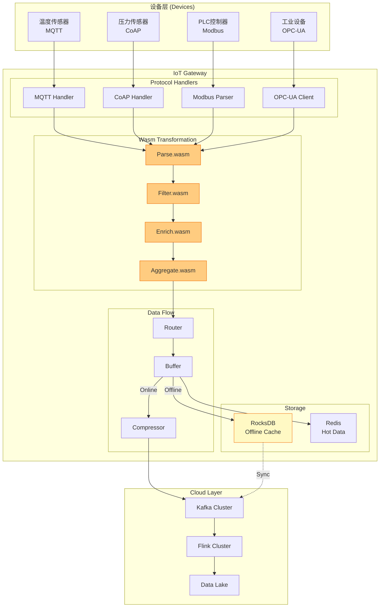
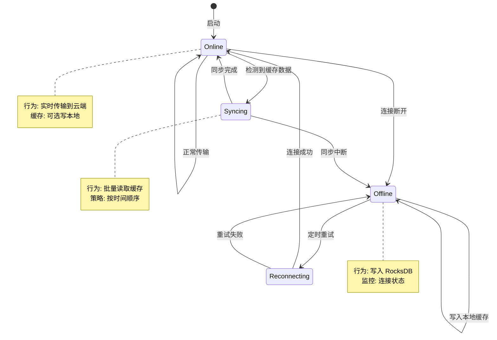
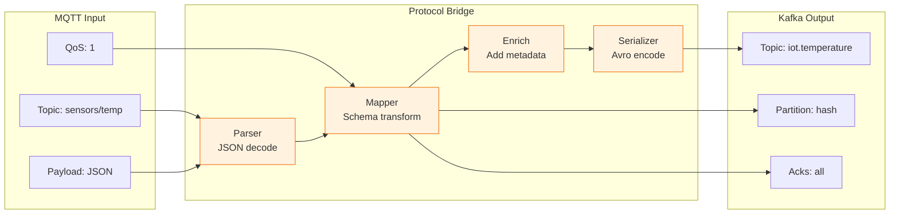

# IoT 网关模式 (IoT Gateway Patterns)

> **所属阶段**: Flink/14-rust-assembly-ecosystem/edge-wasm-runtime | **前置依赖**: [01-edge-architecture.md](01-edge-architecture.md), [IoT 流处理案例](../../09-practices/09.01-case-studies/case-iot-stream-processing.md) | **形式化等级**: L3-L4

---

## 目录

- [IoT 网关模式 (IoT Gateway Patterns)](#iot-网关模式-iot-gateway-patterns)
  - [目录](#目录)
  - [1. 概念定义 (Definitions)](#1-概念定义-definitions)
    - [Def-EDGE-06: IoT 网关 (IoT Gateway)](#def-edge-06-iot-网关-iot-gateway)
    - [Def-EDGE-07: 设备接入协议 (Device Access Protocol)](#def-edge-07-设备接入协议-device-access-protocol)
    - [Def-EDGE-08: 本地预处理 (Local Preprocessing)](#def-edge-08-本地预处理-local-preprocessing)
    - [Def-EDGE-09: 离线-在线切换 (Offline-Online Switching)](#def-edge-09-离线-在线切换-offline-online-switching)
    - [Def-EDGE-10: 协议转换桥 (Protocol Translation Bridge)](#def-edge-10-协议转换桥-protocol-translation-bridge)
  - [2. 属性推导 (Properties)](#2-属性推导-properties)
    - [Prop-EDGE-05: 协议转换保真性](#prop-edge-05-协议转换保真性)
    - [Prop-EDGE-06: 离线缓存完备性](#prop-edge-06-离线缓存完备性)
    - [Prop-EDGE-07: 本地预处理有效性](#prop-edge-07-本地预处理有效性)
    - [Prop-EDGE-08: 网关可扩展性](#prop-edge-08-网关可扩展性)
  - [3. 关系建立 (Relations)](#3-关系建立-relations)
    - [3.1 协议分层映射](#31-协议分层映射)
    - [3.2 数据流转换关系](#32-数据流转换关系)
    - [3.3 网关模式与 Flink 集成](#33-网关模式与-flink-集成)
  - [4. 论证过程 (Argumentation)](#4-论证过程-argumentation)
    - [4.1 协议选型决策树](#41-协议选型决策树)
    - [4.2 离线存储策略对比](#42-离线存储策略对比)
    - [4.3 本地预处理收益分析](#43-本地预处理收益分析)
  - [5. 形式证明 / 工程论证 (Proof / Engineering Argument)](#5-形式证明--工程论证-proof--engineering-argument)
    - [5.1 协议转换正确性证明](#51-协议转换正确性证明)
    - [5.2 离线缓存容量边界](#52-离线缓存容量边界)
    - [5.3 端到端一致性论证](#53-端到端一致性论证)
  - [6. 实例验证 (Examples)](#6-实例验证-examples)
    - [6.1 MQTT-to-Kafka 网关实现](#61-mqtt-to-kafka-网关实现)
    - [6.2 Modbus 工业网关](#62-modbus-工业网关)
    - [6.3 离线缓存断网续传](#63-离线缓存断网续传)
    - [6.4 多协议统一网关](#64-多协议统一网关)
  - [7. 可视化 (Visualizations)](#7-可视化-visualizations)
    - [7.1 IoT 网关架构图](#71-iot-网关架构图)
    - [7.2 离线-在线状态机](#72-离线-在线状态机)
    - [7.3 协议转换流程图](#73-协议转换流程图)
    - [7.4 网关模式对比矩阵](#74-网关模式对比矩阵)
  - [8. 引用参考 (References)](#8-引用参考-references)

---

## 1. 概念定义 (Definitions)

### Def-EDGE-06: IoT 网关 (IoT Gateway)

**IoT 网关**是部署在边缘网络与云端之间的中间件设备，负责设备接入、协议转换、数据预处理和边缘计算。

形式化定义为：

$$
\text{IoTGateway} = \langle P_{in}, P_{out}, T, C, F, M \rangle
$$

其中：

| 组件 | 定义 | 说明 |
|------|------|------|
| $P_{in}$ | 输入协议集合 | 支持的设备接入协议，如 MQTT、CoAP、Modbus |
| $P_{out}$ | 输出协议集合 | 支持的云端协议，如 Kafka、gRPC、HTTP/2 |
| $T$ | 协议转换函数 | $T: Message_{P_{in}} \rightarrow Message_{P_{out}}$ |
| $C$ | 本地计算能力 | 边缘预处理与聚合函数集合 |
| $F$ | 缓存机制 | 离线数据持久化存储 |
| $M$ | 管理接口 | 配置、监控、OTA 升级接口 |

**网关类型分类**:

```
IoT Gateway Types
├── 协议网关 (Protocol Gateway)
│   └── MQTT/CoAP/Modbus → Kafka/HTTP
├── 边缘计算网关 (Edge Compute Gateway)
│   └── 集成 Wasm Runtime，支持本地 UDF
├── 多协议统一网关 (Unified Gateway)
│   └── 同时支持多种输入输出协议
└── 移动网关 (Mobile Gateway)
    └── 车载、无人机等移动场景
```

### Def-EDGE-07: 设备接入协议 (Device Access Protocol)

**设备接入协议**定义了 IoT 设备与网关之间的通信规范，包括连接管理、消息格式、QoS 级别等。

形式化定义为：

$$
\text{DeviceProtocol} = \langle Transport, MessageFormat, QoS, Security, Discovery \rangle
$$

**主流协议对比**:

| 协议 | 传输层 | 消息模式 | QoS 支持 | 适用场景 |
|------|--------|---------|---------|---------|
| **MQTT** | TCP | Pub/Sub | 0/1/2 | 通用 IoT、传感器 |
| **MQTT-SN** | UDP | Pub/Sub | -1/0/1/2 | 受限网络、NB-IoT |
| **CoAP** | UDP | Req/Resp | CON/NON | 资源受限设备 |
| **LwM2M** | CoAP/SMS | Req/Resp | 内置 | 设备管理、固件升级 |
| **Modbus** | TCP/RTU | Req/Resp | 无 | 工业控制 |
| **OPC-UA** | TCP | Pub/Sub | 内置 | 工业 4.0 |
| **HTTP/2** | TCP | Req/Resp | 无 | 高带宽设备 |

**协议选择决策矩阵**:

| 约束条件 | 推荐协议 | 理由 |
|---------|---------|------|
| 带宽 < 100bps | MQTT-SN | UDP 头部小，支持休眠 |
| 电池供电 | MQTT-SN/CoAP | 低功耗设计 |
| 需要设备管理 | LwM2M | 内置 OTA、监控 |
| 工业实时控制 | Modbus/OPC-UA | 确定性延迟 |
| 高吞吐场景 | MQTT v5.0 | 共享订阅、流量控制 |

### Def-EDGE-08: 本地预处理 (Local Preprocessing)

**本地预处理**指在网关上对原始设备数据进行过滤、转换、聚合等操作，减少上传云端的数据量。

形式化定义为：

$$
\text{LocalPreprocessing} = \langle Filter, Transform, Aggregate, Compress \rangle
$$

其中各操作定义为：

$$
\text{Filter}: D_{in} \rightarrow D_{filtered}, \quad |D_{filtered}| \leq |D_{in}|
$$

$$
\text{Transform}: D_{filtered} \rightarrow D_{transformed}, \quad Schema_{out} = f(Schema_{in})
$$

$$
\text{Aggregate}: D_{transformed}^{window} \rightarrow D_{aggregated}, \quad |D_{aggregated}| \ll |D_{transformed}|
$$

**预处理流水线**:

```
原始数据流
    │
    ▼
┌─────────────┐    ┌─────────────┐    ┌─────────────┐    ┌─────────────┐
│   Filter    │───▶│  Transform  │───▶│  Aggregate  │───▶│  Compress   │
│  (数据清洗)  │    │  (格式转换)  │    │  (窗口聚合)  │    │  (压缩编码)  │
└─────────────┘    └─────────────┘    └─────────────┘    └─────────────┘
    │                                                            │
    ▼                                                            ▼
输入量: 100%                                               输出量: 5-20%
```

**典型预处理 Wasm 模块**:

| 模块 | 功能 | 输入/输出比 | 延迟 |
|------|------|------------|------|
| sensor_filter | 阈值过滤异常值 | 100% → 20% | < 5ms |
| json_avro | JSON 转 Avro | 体积 -40% | < 2ms |
| downsampling | 降采样 10:1 | 100% → 10% | < 10ms |
| compress_lz4 | LZ4 压缩 | 体积 -60% | < 5ms |

### Def-EDGE-09: 离线-在线切换 (Offline-Online Switching)

**离线-在线切换**是网关在检测到与云端连接中断时，自动切换到离线自治模式，并在连接恢复后同步数据的能力。

形式化定义为状态机：

$$
\text{ConnectionFSM} = \langle S, s_0, \delta, F \rangle
$$

其中：

- $S = \{Online, Offline, Reconnecting, Syncing\}$ 是状态集合
- $s_0 = Online$ 是初始状态
- $\delta: S \times Event \rightarrow S$ 是状态转移函数
- $F = \{Online\}$ 是接受状态

**状态转移图**:

```
                    ┌─────────────────────────────────────────┐
                    │                                         │
                    ▼                                         │
┌─────────┐    timeout    ┌─────────────┐   conn_ok    ┌─────┴─────┐
│  Online │──────────────▶│ Reconnecting│─────────────▶│  Online   │
└────┬────┘               └─────────────┘              └───────────┘
     │ disconnect                                            ▲
     ▼                                                        │
┌─────────┐   buffer_full    ┌─────────┐    sync_complete    │
│ Offline │─────────────────▶│ Syncing │─────────────────────┘
└────┬────┘                  └─────────┘
     │ conn_restore
     └─────────────────────────────────────────────────────────┘
```

**各状态行为**:

| 状态 | 数据写入 | 数据读取 | 本地计算 | 云端同步 |
|------|---------|---------|---------|---------|
| Online | 直接发送到云端 | 从云端查询 | 支持 | 实时 |
| Offline | 写入本地 RocksDB | 从本地读取 | 支持 | 暂停 |
| Reconnecting | 继续写入本地 | 从本地读取 | 支持 | 尝试重连 |
| Syncing | 暂停新写入 | 只读 | 暂停 | 批量上传 |

### Def-EDGE-10: 协议转换桥 (Protocol Translation Bridge)

**协议转换桥**是网关内部组件，负责将设备协议消息转换为云端协议消息，保持语义一致性。

形式化定义为：

$$
\text{ProtocolBridge}(p_{in}, p_{out}) = \langle Parser_{in}, Mapper, Serializer_{out}, Validator \rangle
$$

其中：

$$
Parser_{in}: RawBytes \rightarrow AST_{in}
$$

$$
Mapper: AST_{in} \rightarrow AST_{out}
$$

$$
Serializer_{out}: AST_{out} \rightarrow RawBytes
$$

**MQTT-to-Kafka 映射示例**:

| MQTT 概念 | Kafka 概念 | 映射规则 |
|----------|-----------|---------|
| Topic | Topic | 1:1 映射或前缀转换 |
| QoS 0 | acks=0 | 最多一次 |
| QoS 1 | acks=1 | 至少一次 |
| QoS 2 | acks=all | 精确一次 |
| Retain | Compact Topic | 保留最后一条 |
| Will Message | - | 需特殊处理 |

---

## 2. 属性推导 (Properties)

### Prop-EDGE-05: 协议转换保真性

**命题**: 协议转换保持消息语义当且仅当存在双射映射：

$$
\forall m \in Message_{in}: Semantics(m) = Semantics(Bridge(m))
$$

**论证**:

协议转换保真性要求：

1. **消息完整性**: 转换前后消息体内容不变
2. **顺序保持**: 消息顺序在转换后保持一致
3. **时序精度**: 时间戳转换精度不丢失
4. **QoS 等价**: 可靠性语义对等映射

**反例**: MQTT QoS 2 转换为 Kafka acks=all 时，需要额外实现去重机制才能保证语义等价。

### Prop-EDGE-06: 离线缓存完备性

**命题**: 离线缓存系统能够在连接恢复后完整同步所有数据：

$$
\forall t \in [t_{offline}, t_{online}]: Data_t \in Cache \implies Data_t \in Cloud_{synced}
$$

**容量边界**:

设网关缓存容量为 $C_{cache}$，数据产生速率为 $r_{data}$，离线持续时间为 $T_{offline}$。

缓存溢出条件：

$$
T_{offline} > \frac{C_{cache}}{r_{data} \times (1 - r_{compression})}
$$

**工程保障**:

| 策略 | 实现 | 效果 |
|------|------|------|
| 循环缓冲区 | 覆盖最旧数据 | 保证最新数据不丢 |
| 优先级队列 | 重要数据优先 | 关键事件不丢 |
| 压缩存储 | LZ4/Snappy | 增加 3-5x 容量 |
| 分级存储 | RAM → SSD → S3 | 海量离线数据支持 |

### Prop-EDGE-07: 本地预处理有效性

**命题**: 本地预处理有效减少带宽消耗当且仅当：

$$
Cost_{edge}(Preprocess) + Cost_{trans}(D_{out}) < Cost_{trans}(D_{in})
$$

其中：

- $Cost_{edge}$: 边缘计算资源成本（CPU/内存/能耗）
- $Cost_{trans}$: 传输成本（带宽/延迟/费用）

**收益计算**:

```
预处理收益 = 节省的传输成本 - 边缘计算成本

设：
- 原始数据量: 100 GB/天
- 预处理后: 20 GB/天 (压缩比 5:1)
- 传输成本: $0.05/GB
- 边缘计算成本: $0.01/GB (AWS Greengrass 定价)

节省传输成本 = (100 - 20) × $0.05 = $4.00/天
边缘计算成本 = 100 × $0.01 = $1.00/天
净收益 = $3.00/天 = $90/月
```

### Prop-EDGE-08: 网关可扩展性

**命题**: 网关水平扩展能力与协议无状态程度正相关：

$$
\text{Scalability}(Gateway) \propto \frac{1}{\sum_{s \in State} Coupling(s)}
$$

**状态分类**:

| 状态类型 | 耦合度 | 扩展策略 |
|---------|--------|---------|
| 连接状态 | 高 | Sticky Session / 长连接保持 |
| 会话状态 | 中 | 分布式缓存 (Redis) |
| 设备元数据 | 低 | 本地缓存 + 定期同步 |
| 离线数据 | 无 | 独立存储，互不影响 |

---

## 3. 关系建立 (Relations)

### 3.1 协议分层映射

OSI 七层模型与 IoT 协议的映射：

```
┌─────────────────────────────────────────────────────────────────┐
│ 应用层 (L7)    │ MQTT Publish/Subscribe, CoAP GET/POST/PUT      │
│                │ LwM2M Object/Resource, OPC-UA Node/Method       │
├────────────────┼─────────────────────────────────────────────────┤
│ 表示层 (L6)    │ JSON, CBOR, Protobuf, Avro, XML                 │
├────────────────┼─────────────────────────────────────────────────┤
│ 会话层 (L5)    │ MQTT Session, TLS Session, WebSocket            │
├────────────────┼─────────────────────────────────────────────────┤
│ 传输层 (L4)    │ TCP (MQTT, HTTP), UDP (CoAP, MQTT-SN)           │
├────────────────┼─────────────────────────────────────────────────┤
│ 网络层 (L3)    │ IP, 6LoWPAN, RPL                               │
├────────────────┼─────────────────────────────────────────────────┤
│ 数据链路层 (L2)│ Ethernet, WiFi, BLE, LoRa, Zigbee               │
├────────────────┼─────────────────────────────────────────────────┤
│ 物理层 (L1)    │ Radio, Optical, Electrical                      │
└────────────────┴─────────────────────────────────────────────────┘
```

### 3.2 数据流转换关系

设备数据到云端数据的完整转换链：

```
Device Layer                    Gateway Layer                   Cloud Layer
    │                                │                               │
    │  ┌─────────────┐               │                               │
    ├──┤ Raw Sensor  │               │                               │
    │  │ Data (Hex)  │               │                               │
    │  └──────┬──────┘               │                               │
    │         │                      │                               │
    │  ┌──────▼──────┐               │                               │
    ├──┤ Modbus/     │               │                               │
    │  │ CAN Frame   │               │                               │
    │  └──────┬──────┘               │                               │
    │         │                      │                               │
    │  ┌──────▼──────┐    ┌──────────▼──────────┐                    │
    └──┤  Protocol   │───▶│   Parser (Wasm)     │                    │
       │  Decoder    │    │   - modbus_parse    │                    │
       └─────────────┘    │   - json_encode     │                    │
                          └──────────┬──────────┘                    │
                                     │                               │
                          ┌──────────▼──────────┐                    │
                          │   Preprocess (Wasm) │                    │
                          │   - filter_anomaly  │                    │
                          │   - aggregate_1min  │                    │
                          └──────────┬──────────┘                    │
                                     │                               │
                          ┌──────────▼──────────┐    ┌───────────────▼────────┐
                          │   Protocol Bridge   │───▶│   Kafka Producer       │
                          │   MQTT/HTTP/gRPC    │    │   - Topic: sensors     │
                          └─────────────────────┘    │   - Partition: device  │
                                                     └────────────────────────┘
```

### 3.3 网关模式与 Flink 集成

```
┌─────────────────────────────────────────────────────────────────┐
│                        IoT Gateway                              │
│  ┌─────────────────────────────────────────────────────────┐   │
│  │                   Wasm Runtime                          │   │
│  │  ┌────────────┐  ┌────────────┐  ┌────────────┐        │   │
│  │  │ Modbus     │  │ MQTT       │  │ CoAP       │        │   │
│  │  │ Parser     │  │ Handler    │  │ Handler    │        │   │
│  │  └─────┬──────┘  └─────┬──────┘  └─────┬──────┘        │   │
│  │        │               │               │                │   │
│  │        └───────────────┼───────────────┘                │   │
│  │                        ▼                                │   │
│  │  ┌─────────────────────────────────────────────────┐    │   │
│  │  │           Data Transformation Pipeline          │    │   │
│  │  │  (filter → transform → aggregate → compress)    │    │   │
│  │  └─────────────────────┬───────────────────────────┘    │   │
│  └────────────────────────┼────────────────────────────────┘   │
│                           │                                     │
│  ┌────────────────────────▼────────────────────────────────┐   │
│  │              Flink Connector Sink                       │   │
│  │  - AsyncKafkaSink (batch=1000, interval=5s)             │   │
│  │  - BucketedAvroSink (partition by date)                 │   │
│  └─────────────────────────────────────────────────────────┘   │
└─────────────────────────────────────────────────────────────────┘
                              │
                              ▼
┌─────────────────────────────────────────────────────────────────┐
│                      Apache Flink Cluster                       │
│  ┌─────────────────────┐      ┌─────────────────────────────┐  │
│  │   Kafka Source      │─────▶│   Windowed Aggregation      │  │
│  │   (edge-events)     │      │   (Tumbling 1min)           │  │
│  └─────────────────────┘      └─────────────────────────────┘  │
└─────────────────────────────────────────────────────────────────┘
```

---

## 4. 论证过程 (Argumentation)

### 4.1 协议选型决策树

```
                    设备能力评估
                         │
        ┌────────────────┼────────────────┐
        │                │                │
   极低功耗          中等功耗           高功耗
  (< 1mW)           (1-100mW)         (> 100mW)
        │                │                │
   MQTT-SN          CoAP/MQTT          MQTT/HTTP
   (UDP)            (UDP/TCP)          (TCP)
        │                │                │
   网络拓扑           是否需要
        │           设备管理?
   ┌────┴────┐           │
   │         │      是 ──┼── LwM2M
星型/网状   点对点      │
   │         │      否 ──┼── 纯 MQTT/CoAP
   │         │
LoRaWAN   Zigbee
(长距离)  (短距离)
```

### 4.2 离线存储策略对比

| 存储引擎 | 适用场景 | 容量 | 性能 | 持久性 |
|---------|---------|------|------|--------|
| **RocksDB** | 通用离线缓存 | 大(GB级) | 高 | 磁盘持久化 |
| **SQLite** | 结构化查询 | 中 | 中 | 磁盘持久化 |
| **Redis** | 热数据缓存 | 小(内存) | 极高 | 可选持久化 |
| **BadgerDB** | 只写密集 | 大 | 高 | 磁盘持久化 |
| **文件系统** | 大对象存储 | 极大 | 中 | 磁盘持久化 |

**选择建议**:

- 传感器时序数据 → RocksDB (LSM-Tree 优化写)
- 配置/元数据 → SQLite (SQL 查询)
- 告警/事件 → Redis (快速读取)
- 图片/视频 → 文件系统 + 元数据库存储路径

### 4.3 本地预处理收益分析

**带宽节省计算**:

| 预处理操作 | 原始数据 | 处理后 | 节省 | 边缘开销 |
|-----------|---------|--------|------|---------|
| 阈值过滤 | 100% | 15% | 85% | 低 (简单比较) |
| 10:1 降采样 | 100% | 10% | 90% | 中 (窗口聚合) |
| JSON→Avro | 100% | 60% | 40% | 低 (序列化) |
| LZ4 压缩 | 100% | 35% | 65% | 中 (压缩算法) |
| 组合策略 | 100% | 5% | 95% | 中 (流水线) |

**成本效益分析** (假设 1 万设备，每设备 1KB/s):

```
无预处理:
- 日数据量: 10,000 × 1KB × 86,400 = 864 GB/天
- 月传输成本: 864 × 30 × $0.05 = $1,296

有预处理 (95% 压缩):
- 日数据量: 864 × 5% = 43.2 GB/天
- 月传输成本: 43.2 × 30 × $0.05 = $65
- 边缘计算成本: ~$50/月
- 净节省: $1,296 - $65 - $50 = $1,181/月 (91%)
```

---

## 5. 形式证明 / 工程论证 (Proof / Engineering Argument)

### 5.1 协议转换正确性证明

**定理**: 协议转换函数 $Bridge$ 保持消息语义当且仅当满足以下不变式：

$$
\forall m: Invariant(m) \implies Invariant(Bridge(m))
$$

其中不变式包括：

1. **顺序不变式**: $Order(m_i) < Order(m_j) \implies Order(Bridge(m_i)) < Order(Bridge(m_j))$
2. **时间戳单调性**: $Timestamp(m_i) \leq Timestamp(Bridge(m_i)) + \epsilon$
3. **载荷完整性**: $Hash(Payload(m)) = Hash(Payload(Bridge(m)))$

**证明**:

设协议桥由解析器 $P$、映射器 $M$、序列化器 $S$ 组成：

$$
Bridge = S \circ M \circ P
$$

对于任意输入消息 $m$：

$$
Bridge(m) = S(M(P(m)))
$$

解析器 $P$ 是单射（唯一解码），映射器 $M$ 保持结构，序列化器 $S$ 是单射（唯一编码）。

因此 $Bridge$ 是良定义的函数，当 $M$ 保持语义映射时，整体转换保持语义。

### 5.2 离线缓存容量边界

**定理**: 在离线持续期间，缓存不溢出当且仅当：

$$
\int_{t_0}^{t_1} r_{in}(t) \cdot (1 - \alpha(t)) \, dt \leq C_{cache}
$$

其中：

- $r_{in}(t)$: 时刻 $t$ 的数据输入速率
- $\alpha(t)$: 时刻 $t$ 的压缩率
- $C_{cache}$: 缓存总容量
- $[t_0, t_1]$: 离线时间区间

**工程推论**:

假设恒定速率 $r_{in}$ 和恒定压缩率 $\alpha$，最大离线时长：

$$
T_{max} = \frac{C_{cache}}{r_{in} \cdot (1 - \alpha)}
$$

**实例计算**:

| 缓存大小 | 数据速率 | 压缩率 | 最大离线时长 |
|---------|---------|--------|-------------|
| 128 GB SSD | 10 MB/s | 80% | 128,000 / (10 × 0.2) = 64,000s ≈ 17.8h |
| 512 GB SSD | 50 MB/s | 90% | 512,000 / (50 × 0.1) = 102,400s ≈ 28.4h |
| 1 TB SSD | 100 MB/s | 95% | 1,000,000 / (100 × 0.05) = 200,000s ≈ 55.6h |

### 5.3 端到端一致性论证

**工程论证**: IoT 网关通过以下机制保证端到端数据处理一致性：

**至少一次 (At-Least-Once)**:

```
设备 ──MQTT QoS 1──▶ 网关 ──Kafka acks=1──▶ 云端 Flink
        │                    │
        │ 未收到 PUBACK      │ 未收到 ACK
        │    重发            │    重试
        ▼                    ▼
   可能导致重复          可能导致重复

云端去重: Flink 按 (device_id, sequence_no) 去重
```

**精确一次 (Exactly-Once)**:

```
设备 ──MQTT QoS 2──▶ 网关 ──Kafka idempotent──▶ 云端 Flink
       (四次握手)          (幂等生产者)           ( Checkpoint )

保证: 设备-网关: 精确一次 (MQTT QoS 2)
     网关-Kafka: 精确一次 (幂等 + 事务)
     Kafka-Flink: 精确一次 (Checkpoint 两阶段提交)
```

---

## 6. 实例验证 (Examples)

### 6.1 MQTT-to-Kafka 网关实现

**架构**:

```rust
// mqtt-kafka-gateway/src/main.rs
use rumqttc::{MqttOptions, Client, QoS};
use rdkafka::producer::{FutureProducer, FutureRecord};

struct MqttKafkaGateway {
    mqtt_client: Client,
    kafka_producer: FutureProducer,
    topic_mapping: HashMap<String, String>, // MQTT topic -> Kafka topic
}

impl MqttKafkaGateway {
    async fn run(&mut self) {
        // 订阅 MQTT 主题
        for mqtt_topic in self.topic_mapping.keys() {
            self.mqtt_client.subscribe(mqtt_topic, QoS::AtLeastOnce).unwrap();
        }

        // 处理消息循环
        loop {
            match self.mqtt_client.recv().await {
                Ok(msg) => {
                    let mqtt_topic = msg.topic();
                    let kafka_topic = self.topic_mapping.get(mqtt_topic).unwrap();

                    // 转换消息格式
                    let kafka_msg = transform(msg);

                    // 发送到 Kafka
                    self.kafka_producer.send(
                        FutureRecord::to(kafka_topic)
                            .payload(&kafka_msg.payload)
                            .key(&kafka_msg.key),
                        Duration::from_secs(5),
                    ).await;
                }
                Err(e) => error!("MQTT error: {}", e),
            }
        }
    }
}

fn transform(mqtt_msg: rumqttc::Publish) -> KafkaMessage {
    // MQTT 消息转 Kafka 消息
    KafkaMessage {
        key: extract_device_id(&mqtt_msg),
        payload: mqtt_msg.payload.to_vec(),
        timestamp: mqtt_msg.pkid as i64,
    }
}
```

**配置**:

```yaml
# gateway-config.yaml
mqtt:
  broker: "tcp://localhost:1883"
  client_id: "gateway-001"
  keep_alive: 60
  clean_session: false

kafka:
  bootstrap_servers: "kafka:9092"
  producer:
    acks: "all"
    retries: 3
    compression: "lz4"

topic_mapping:
  "sensors/+/temperature": "iot.temperature"
  "sensors/+/pressure": "iot.pressure"
  "alerts/+/critical": "iot.alerts"

transformations:
  - name: "json_enrich"
    wasm_module: "/opt/wasm/json_enrich.wasm"
  - name: "filter_threshold"
    wasm_module: "/opt/wasm/filter.wasm"
```

### 6.2 Modbus 工业网关

**Modbus 协议解析**:

```rust
// modbus-parser/src/lib.rs (WASM module)
use serde::{Deserialize, Serialize};

#[derive(Deserialize)]
struct ModbusFrame {
    slave_id: u8,
    function_code: u8,
    register_address: u16,
    register_count: u16,
    data: Vec<u16>,
}

#[derive(Serialize)]
struct SensorReading {
    device_id: String,
    timestamp: u64,
    temperature: f32,
    pressure: f32,
}

#[no_mangle]
pub extern "C" fn parse_modbus(input_ptr: i32, input_len: i32) -> i32 {
    let input = unsafe {
        std::slice::from_raw_parts(input_ptr as *const u8, input_len as usize)
    };

    // 解析 Modbus RTU 帧
    let frame = parse_rtu_frame(input);

    // 转换为标准传感器读数
    let reading = match frame.function_code {
        0x03 => parse_holding_registers(&frame),
        0x04 => parse_input_registers(&frame),
        _ => return -1,
    };

    // 序列化为 JSON 输出
    host::write_output(&serde_json::to_vec(&reading).unwrap())
}

fn parse_holding_registers(frame: &ModbusFrame) -> SensorReading {
    SensorReading {
        device_id: format!("modbus-{}", frame.slave_id),
        timestamp: host::current_timestamp(),
        temperature: registers_to_float(&frame.data[0..2]),
        pressure: registers_to_float(&frame.data[2..4]),
    }
}
```

### 6.3 离线缓存断网续传

**RocksDB 离线缓存实现**:

```rust
// offline-cache/src/lib.rs
use rocksdb::{DB, Options, WriteBatch};

struct OfflineCache {
    db: DB,
    max_size: usize,
    current_size: AtomicUsize,
}

impl OfflineCache {
    fn new(path: &str, max_size_gb: usize) -> Self {
        let mut opts = Options::default();
        opts.create_if_missing(true);
        opts.set_compression_type(rocksdb::DBCompressionType::Lz4);

        OfflineCache {
            db: DB::open(&opts, path).unwrap(),
            max_size: max_size_gb * 1024 * 1024 * 1024,
            current_size: AtomicUsize::new(0),
        }
    }

    fn store(&self, key: &str, data: &[u8], timestamp: u64) -> Result<(), CacheError> {
        // 检查容量
        if self.current_size.load(Ordering::Relaxed) + data.len() > self.max_size {
            // 触发清理策略
            self.evict_oldest()?;
        }

        // 写入数据
        let mut batch = WriteBatch::default();
        batch.put(format!("data:{}", key), data);
        batch.put(format!("meta:{}", key), timestamp.to_be_bytes());
        self.db.write(batch)?;

        self.current_size.fetch_add(data.len(), Ordering::Relaxed);
        Ok(())
    }

    async fn sync_to_cloud(&self, producer: &FutureProducer) -> Result<usize, CacheError> {
        let mut synced = 0;

        // 按时间顺序读取待同步数据
        let iter = self.db.iterator(rocksdb::IteratorMode::Start);

        for (key, value) in iter.filter(|(k, _)| k.starts_with(b"data:")) {
            let record = FutureRecord::to("sync-topic")
                .payload(&value)
                .key(&key[5..]); // 去掉 "data:" 前缀

            match producer.send(record, Duration::from_secs(5)).await {
                Ok(_) => {
                    // 删除已同步数据
                    self.db.delete(&key)?;
                    synced += 1;
                }
                Err(e) => {
                    error!("Sync failed: {}", e);
                    break; // 停止同步，下次重试
                }
            }
        }

        Ok(synced)
    }
}
```

### 6.4 多协议统一网关

**统一网关架构**:

```rust
// unified-gateway/src/main.rs

enum ProtocolHandler {
    Mqtt(MqttHandler),
    Coap(CoapHandler),
    Modbus(ModbusHandler),
    OpcUa(OpcUaHandler),
}

struct UnifiedGateway {
    handlers: Vec<ProtocolHandler>,
    transformer: WasmTransformer,
    sink: KafkaSink,
    cache: OfflineCache,
}

impl UnifiedGateway {
    async fn run(&self) {
        // 启动所有协议处理器
        let handles: Vec<_> = self.handlers.iter()
            .map(|h| self.run_handler(h))
            .collect();

        // 并行运行
        futures::future::join_all(handles).await;
    }

    async fn run_handler(&self, handler: &ProtocolHandler) {
        let mut stream = handler.subscribe();

        while let Some(msg) = stream.next().await {
            // 1. 协议特定解析
            let parsed = handler.parse(msg);

            // 2. 统一格式转换 (Wasm)
            let unified = self.transformer.transform(parsed).await;

            // 3. 本地预处理 (Wasm)
            let processed = self.transformer.preprocess(unified).await;

            // 4. 检查云端连接
            if self.sink.is_connected() {
                // 在线模式: 直接发送
                if let Err(e) = self.sink.send(processed).await {
                    // 发送失败，缓存
                    self.cache.store(&processed).await;
                }
            } else {
                // 离线模式: 写入缓存
                self.cache.store(&processed).await;

                // 触发后台同步任务
                tokio::spawn(self.sync_cache());
            }
        }
    }
}
```

---

## 7. 可视化 (Visualizations)

### 7.1 IoT 网关架构图



### 7.2 离线-在线状态机



### 7.3 协议转换流程图



### 7.4 网关模式对比矩阵

```mermaid
quadrantChart
    title IoT 网关模式选型矩阵
    x-axis 低复杂度 --> 高复杂度
    y-axis 低吞吐量 --> 高吞吐量

    quadrant-1 复杂/高吞吐: 统一网关
    quadrant-2 复杂/低吞吐: 协议专用网关
    quadrant-3 简单/低吞吐: 轻量网关
    quadrant-4 简单/高吞吐: 高性能网关

    "MQTT单协议网关": [0.2, 0.5]
    "多协议统一网关": [0.8, 0.6]
    "边缘计算网关": [0.7, 0.3]
    "Modbus工业网关": [0.4, 0.2]
    "Kafka Connect": [0.3, 0.8]
    "WasmEdge网关": [0.6, 0.7]
```

---

## 8. 引用参考 (References)


---

*文档版本: v1.0 | 更新日期: 2026-04-04 | 状态: 已完成*
