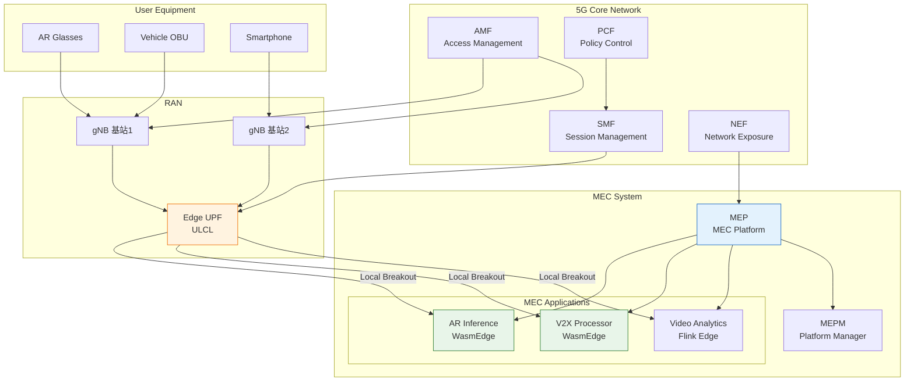
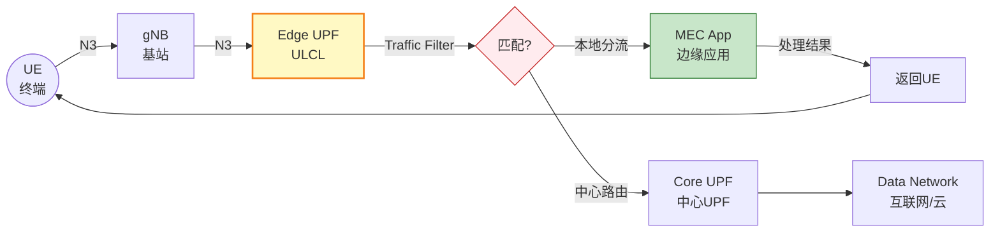
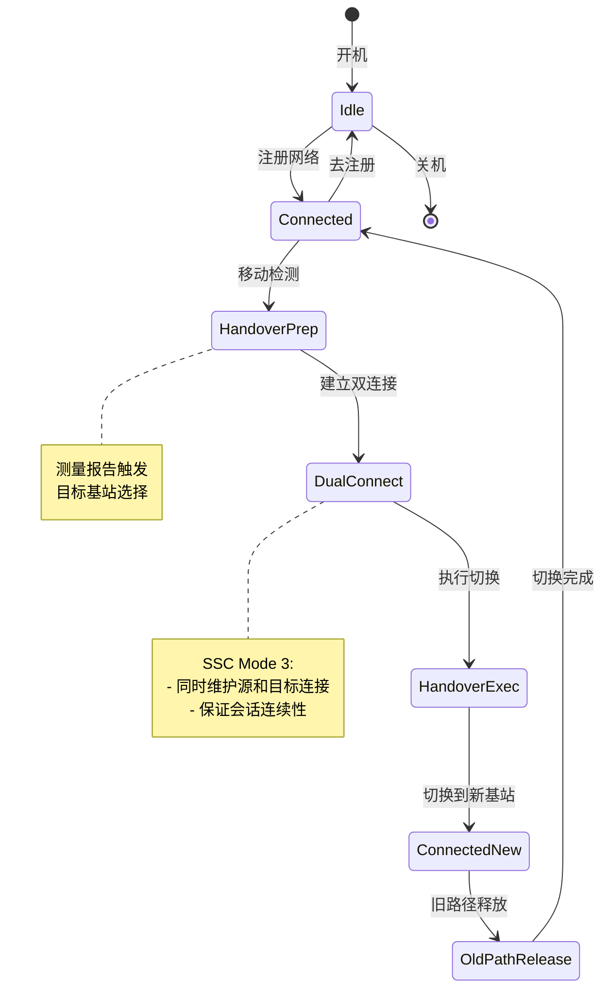

# 5G MEC 集成指南 (5G MEC Integration Guide)

> **所属阶段**: Flink/14-rust-assembly-ecosystem/edge-wasm-runtime | **前置依赖**: [01-edge-architecture.md](01-edge-architecture.md), [02-iot-gateway-patterns.md](02-iot-gateway-patterns.md) | **形式化等级**: L3-L4

---

## 目录

- [5G MEC 集成指南 (5G MEC Integration Guide)](#5g-mec-集成指南-5g-mec-integration-guide)
  - [目录](#目录)
  - [1. 概念定义 (Definitions)](#1-概念定义-definitions)
    - [Def-EDGE-11: 5G MEC 架构 (5G MEC Architecture)](#def-edge-11-5g-mec-架构-5g-mec-architecture)
    - [Def-EDGE-12: 本地分流策略 (Local Breakout Strategy)](#def-edge-12-本地分流策略-local-breakout-strategy)
    - [Def-EDGE-13: 移动性管理 (Mobility Management)](#def-edge-13-移动性管理-mobility-management)
    - [Def-EDGE-14: MEC 应用生命周期 (MEC Application Lifecycle)](#def-edge-14-mec-应用生命周期-mec-application-lifecycle)
    - [Def-EDGE-15: 网络切片与 MEC (Network Slicing and MEC)](#def-edge-15-网络切片与-mec-network-slicing-and-mec)
  - [2. 属性推导 (Properties)](#2-属性推导-properties)
    - [Prop-EDGE-09: 本地分流延迟边界](#prop-edge-09-本地分流延迟边界)
    - [Prop-EDGE-10: 移动性切换连续性](#prop-edge-10-移动性切换连续性)
    - [Prop-EDGE-11: 切片资源隔离性](#prop-edge-11-切片资源隔离性)
    - [Prop-EDGE-12: MEC 扩展性](#prop-edge-12-mec-扩展性)
  - [3. 关系建立 (Relations)](#3-关系建立-relations)
    - [3.1 5G 核心网与 MEC 关系](#31-5g-核心网与-mec-关系)
    - [3.2 MEC 与 Flink 边缘部署映射](#32-mec-与-flink-边缘部署映射)
    - [3.3 移动性管理状态迁移](#33-移动性管理状态迁移)
  - [4. 论证过程 (Argumentation)](#4-论证过程-argumentation)
    - [4.1 本地分流决策树](#41-本地分流决策树)
    - [4.2 MEC 部署位置选择](#42-mec-部署位置选择)
    - [4.3 Wasm 运行时 MEC 适配](#43-wasm-运行时-mec-适配)
  - [5. 形式证明 / 工程论证 (Proof / Engineering Argument)]()
    - [5.1 端到端延迟边界证明](#51-端到端延迟边界证明)
    - [5.2 会话连续性保证论证](#52-会话连续性保证论证)
    - [5.3 资源隔离安全性论证](#53-资源隔离安全性论证)
  - [6. 实例验证 (Examples)](#6-实例验证-examples)
    - [6.1 AR/VR 实时推理 MEC 部署](#61-arvr-实时推理-mec-部署)
    - [6.2 车联网 V2X 边缘计算](#62-车联网-v2x-边缘计算)
    - [6.3 工业 5G 专网 MEC](#63-工业-5g-专网-mec)
    - [6.4 WasmEdge MEC 集成实现](#64-wasmedge-mec-集成实现)
  - [7. 可视化 (Visualizations)](#7-可视化-visualizations)
    - [7.1 5G MEC 整体架构图](#71-5g-mec-整体架构图)
    - [7.2 本地分流数据流图](#72-本地分流数据流图)
    - [7.3 移动性管理状态机](#73-移动性管理状态机)
    - [7.4 MEC 场景部署矩阵](#74-mec-场景部署矩阵)
  - [8. 引用参考 (References)](#8-引用参考-references)

---

## 1. 概念定义 (Definitions)

### Def-EDGE-11: 5G MEC 架构 (5G MEC Architecture)

**5G 多接入边缘计算 (MEC)** 是一种在 5G 网络边缘提供计算、存储和网络能力的架构，使应用能够部署在靠近用户和数据源的位置，实现超低延迟和高带宽。

形式化定义为：

$$
\text{5GMEC} = \langle INFRA, APP, PLAT, MANO, NW \rangle
$$

其中：

| 组件 | 定义 | 说明 |
|------|------|------|
| $INFRA$ | 边缘基础设施 | 计算、存储、网络资源池 |
| $APP$ | MEC 应用 | 部署在边缘的业务应用 (Wasm/容器/VM) |
| $PLAT$ | MEC 平台 | 提供服务注册、流量规则、能力开放 |
| $MANO$ | 编排管理 | 应用生命周期管理、自动扩缩容 |
| $NW$ | 网络能力 | 本地分流、QoS、网络切片 |

**5G MEC 参考架构** (ETSI MEC 003):

```
┌─────────────────────────────────────────────────────────────────┐
│                        5G Core Network                          │
│  ┌─────────┐  ┌─────────┐  ┌─────────┐  ┌─────────────────┐    │
│  │   AMF   │  │   SMF   │  │   PCF   │  │  NEF (AF via N5)│    │
│  │(接入管理)│  │(会话管理)│  │(策略控制)│  │  (能力开放)     │    │
│  └────┬────┘  └────┬────┘  └────┬────┘  └────────┬────────┘    │
│       │            │            │                 │             │
└───────┼────────────┼────────────┼─────────────────┼─────────────┘
        │            │            │                 │
        │ N2         │ N4         │ N7              │ N33
        │            │            │                 │
┌───────┼────────────┼────────────┼─────────────────┼─────────────┐
│       │            │            │                 │             │
│  ┌────▼────┐  ┌────▼────┐  ┌────▼────┐  ┌─────────▼─────────┐   │
│  │   gNB   │  │   UPF   │  │   UPF   │  │    MEC Platform   │   │
│  │(基站)   │  │(中心)   │  │(边缘-ULCL)│  │  (MEP/MEAO)       │   │
│  └────┬────┘  └─────────┘  └────┬────┘  └───────────────────┘   │
│       │                         │                                │
│       │ N3                      │ N6 (本地分流)                   │
│       │                         │                                │
│  ┌────▼─────────────────────────▼───────────────────────────┐   │
│  │                    MEC Host (边缘服务器)                   │   │
│  │  ┌─────────────────────────────────────────────────────┐  │   │
│  │  │              MEC Applications                        │  │   │
│  │  │  ┌─────────┐  ┌─────────┐  ┌─────────────────────┐  │  │   │
│  │  │  │ AR App  │  │ WasmEdge│  │  Flink Edge Runtime │  │  │   │
│  │  │  │ (AR/VR) │  │ Runtime │  │  (轻量流处理)        │  │  │   │
│  │  │  └─────────┘  └────┬────┘  └─────────────────────┘  │  │   │
│  │  └────────────────────┼────────────────────────────────┘  │   │
│  └───────────────────────┼───────────────────────────────────┘   │
└──────────────────────────┼───────────────────────────────────────┘
                           │
                    ┌──────▼──────┐
                    │   UE (终端)  │
                    └─────────────┘
```

### Def-EDGE-12: 本地分流策略 (Local Breakout Strategy)

**本地分流** (Local Breakout / UL CL - Uplink Classifier) 是 5G MEC 的核心能力，允许用户面数据在边缘 UPF 直接分流到 MEC 应用，无需绕行核心网。

形式化定义为：

$$
\text{LocalBreakout} = \langle TrafficFilter, ULCL, MECApp, Route \rangle
$$

其中：

| 组件 | 定义 | 说明 |
|------|------|------|
| $TrafficFilter$ | 流量过滤规则 | IP 五元组、域名、应用标识 |
| $ULCL$ | 上行分类器 | UPF 中的分流锚点 |
| $MECApp$ | MEC 应用端点 | 边缘应用的 N6 接口地址 |
| $Route$ | 路由决策函数 | $Route: Traffic \rightarrow \{Local, Core\}$ |

**分流策略类型**:

| 策略 | 匹配规则 | 应用场景 |
|------|---------|---------|
| **IP 五元组** | 源/目的 IP、端口、协议 | 特定服务器分流 |
| **FQDN** | 域名匹配 | CDN、API 网关 |
| **DNN** | 数据网络名称 | 企业专网 |
| **S-NSSAI** | 切片标识 | 切片级分流 |
| **位置基** | 用户位置区域 | 区域服务 |

### Def-EDGE-13: 移动性管理 (Mobility Management)

**移动性管理**确保用户设备在移动过程中，MEC 应用会话的连续性和服务质量的稳定性。

形式化定义为状态机：

$$
\text{MobilityFSM} = \langle S, s_0, \delta, MM \rangle
$$

其中：

- $S = \{Idle, Connected, Handover, Reconnecting\}$
- $MM$: 移动性模式 $\in \{SessionContinuity, BreakBeforeMake, MakeBeforeBreak\}$

**移动性模式对比**:

| 模式 | 描述 | 延迟影响 | 适用场景 |
|------|------|---------|---------|
| **SSC Mode 1** | 始终锚定中心 UPF | 高延迟 | 对延迟不敏感 |
| **SSC Mode 2** | 先断后建 (Break-Before-Make) | 短暂中断 | 可容忍中断 |
| **SSC Mode 3** | 先建后断 (Make-Before-Break) | 无缝 | AR/VR、游戏 |

### Def-EDGE-14: MEC 应用生命周期 (MEC Application Lifecycle)

**MEC 应用生命周期**定义了应用在 MEC 平台上的部署、运行、扩缩容和终止的完整流程。

形式化定义为：

$$
\text{MECLifecycle} = \langle States, Transitions, Triggers, Actions \rangle
$$

**状态转换**:

```
Instantiated
     │
     ▼ prepare
┌─────────┐   instantiate    ┌─────────┐
│Stopped  │─────────────────▶│ Running │
└────┬────┘                  └────┬────┘
     │                           │
     │ scale                     │ terminate
     ▼                           ▼
┌─────────┐   terminate    ┌─────────┐
│Scaled   │───────────────▶│Terminated
└─────────┘                └─────────┘
```

**生命周期管理操作**:

| 操作 | 触发条件 | 执行动作 |
|------|---------|---------|
| Instantiate | 应用上传/选择 | 分配资源、启动容器/Wasm |
| Terminate | 用户请求/故障 | 停止应用、释放资源 |
| Scale | 负载阈值触发 | 水平/垂直扩展实例 |
| Update | 版本更新 | 滚动更新、蓝绿部署 |

### Def-EDGE-15: 网络切片与 MEC (Network Slicing and MEC)

**网络切片**与 MEC 结合，为不同行业应用提供隔离的端到端网络资源和边缘计算环境。

形式化定义为：

$$
\text{SliceMEC} = \langle S-NSSAI, SliceProfile, MECResources, Isolation \rangle
$$

**切片类型与 MEC 部署**:

| 切片类型 | 特征 | MEC 应用 | 延迟要求 |
|---------|------|---------|---------|
| **eMBB** | 增强移动宽带 | 视频缓存、直播 | $< 20\text{ms}$ |
| **URLLC** | 超可靠低延迟 | 工业控制、自动驾驶 | $< 1\text{ms}$ |
| **mMTC** | 海量物联网 | 传感器聚合 | $< 100\text{ms}$ |
| **V2X** | 车联网 | 路况分析、碰撞预警 | $< 10\text{ms}$ |

---

## 2. 属性推导 (Properties)

### Prop-EDGE-09: 本地分流延迟边界

**命题**: 本地分流路径的端到端延迟显著低于中心核心网路径：

$$
\forall t: L_{local}(t) < L_{core}(t) - L_{core\_to\_edge}(t)
$$

**延迟分解对比**:

| 路径 | 延迟组成 | 典型值 |
|------|---------|--------|
| **中心核心网** | UE→gNB→UPF(中心)→DN | 20-50ms |
| **本地分流** | UE→gNB→UPF(边缘)→MEC | 5-10ms |
| **节省** | - | 15-40ms (75%+) |

**工程推论**: 对于延迟敏感应用 (AR/VR、游戏、工业控制)，本地分流是必要条件。

### Prop-EDGE-10: 移动性切换连续性

**命题**: SSC Mode 3 (Make-Before-Break) 保证会话零中断：

$$
\forall handover: Downtime_{SSC3}(handover) \approx 0
$$

**证明概要**:

在 SSC Mode 3 中：

1. 终端同时维护到源 UPF 和目标 UPF 的连接
2. 新数据流通过目标 UPF
3. 旧数据流完成后，释放源 UPF 连接
4. 切换期间无数据丢失

### Prop-EDGE-11: 切片资源隔离性

**命题**: 不同网络切片在 MEC 上的资源是强隔离的：

$$
\forall slice_i, slice_j: i \neq j \implies Resources(slice_i) \cap Resources(slice_j) = \emptyset
$$

**隔离机制**:

| 层次 | 隔离手段 | 实现 |
|------|---------|------|
| 网络 | VLAN/VXLAN | 独立隧道 |
| 计算 | CGroup/Namespace | 容器隔离 |
| 存储 | Volume 隔离 | 独立挂载 |
| Wasm | 模块沙箱 | 线性内存隔离 |

### Prop-EDGE-12: MEC 扩展性

**命题**: MEC 平台支持应用的水平扩展，扩展延迟与实例数对数相关：

$$
L_{scale}(n) = O(\log n)
$$

**扩展策略**:

| 策略 | 触发条件 | 扩展速度 |
|------|---------|---------|
| **Reactive** | CPU > 80% | 慢 (分钟级) |
| **Predictive** | 预测负载增长 | 中 (秒级) |
| **Wasm 实例池** | 请求队列长度 | 快 (毫秒级) |

---

## 3. 关系建立 (Relations)

### 3.1 5G 核心网与 MEC 关系

```
┌─────────────────────────────────────────────────────────────────┐
│                      5G Core Network (5GC)                      │
│                                                                 │
│  ┌─────────┐      N5       ┌─────────┐      N33      ┌───────┐ │
│  │    AF   │◄─────────────▶│   NEF   │◄────────────▶│  MEP  │ │
│  │(应用功能)│               │(能力开放)│               │(平台) │ │
│  └────┬────┘               └────┬────┘               └───┬───┘ │
│       │                         │                        │     │
│       │       ┌─────────────────┘                        │     │
│       │       │                                          │     │
│  ┌────▼───────▼────┐      N7      ┌─────────┐           │     │
│  │       PCF       │◄────────────▶│   SMF   │           │     │
│  │ (策略控制功能)   │               │(会话管理)│◄────N28────┘     │
│  └─────────────────┘               └────┬────┘                  │
│                                         │                       │
└─────────────────────────────────────────┼───────────────────────┘
                                          │
┌─────────────────────────────────────────┼───────────────────────┐
│                      MEC System         │                       │
│                                         ▼                       │
│  ┌─────────────────────────────────────────────────────────┐    │
│  │                    MEC Platform (MEP)                    │    │
│  │  ┌──────────────┐  ┌──────────────┐  ┌──────────────┐   │    │
│  │  │ Traffic Rules│  │ DNS Rules    │  │ Service      │   │    │
│  │  │ (分流规则)    │  │ (域名解析)    │  │ Registry     │   │    │
│  │  └──────┬───────┘  └──────┬───────┘  └──────┬───────┘   │    │
│  │         │                 │                 │           │    │
│  │         └─────────────────┴─────────────────┘           │    │
│  │                           │                             │    │
│  │                    ┌──────▼──────┐                      │    │
│  │                    │   MEPM      │                      │    │
│  │                    │ (平台管理)   │                      │    │
│  │                    └──────┬──────┘                      │    │
│  └───────────────────────────┼───────────────────────────────┘    │
│                              │                                    │
│  ┌───────────────────────────▼───────────────────────────────┐    │
│  │                    MEC Host                                │    │
│  │  ┌──────────────┐  ┌──────────────┐  ┌──────────────┐     │    │
│  │  │  MEC App 1   │  │  MEC App 2   │  │  WasmEdge    │     │    │
│  │  │  (AR/VR)     │  │  (V2X)       │  │  Runtime     │     │    │
│  │  └──────────────┘  └──────────────┘  └──────────────┘     │    │
│  │                                                            │    │
│  │  ┌──────────────┐  ┌──────────────┐  ┌──────────────┐     │    │
│  │  │  Flink Edge  │  │  Local UPF   │  │  Data Plane  │     │    │
│  │  │  (流处理)     │  │  (分流锚点)   │  │  (数据面)     │     │    │
│  │  └──────────────┘  └──────────────┘  └──────────────┘     │    │
│  └───────────────────────────────────────────────────────────┘    │
└───────────────────────────────────────────────────────────────────┘
```

### 3.2 MEC 与 Flink 边缘部署映射

```
┌─────────────────────────────────────────────────────────────────┐
│                      Cloud Data Center                          │
│  ┌─────────────────────────────────────────────────────────┐   │
│  │              Apache Flink Cluster                        │   │
│  │  ┌──────────────┐  ┌──────────────┐  ┌──────────────┐  │   │
│  │  │ JobManager   │  │ TaskManager  │  │ State Backend│  │   │
│  │  │ (全局协调)    │  │ (复杂计算)    │  │ (RocksDB)    │  │   │
│  │  └──────────────┘  └──────────────┘  └──────────────┘  │   │
│  └─────────────────────────────────────────────────────────┘   │
└─────────────────────────────────────────────────────────────────┘
                              │
                              │ Synchronization
                              │ (Model/Config/Results)
                              ▼
┌─────────────────────────────────────────────────────────────────┐
│                         MEC Host                                │
│  ┌─────────────────────────────────────────────────────────┐   │
│  │              Flink Edge Runtime                          │   │
│  │  ┌──────────────┐  ┌──────────────┐  ┌──────────────┐  │   │
│  │  │ Mini JobManager│  │ Task Slot    │  │ Local State  │  │   │
│  │  │ (轻量JM)      │  │ (Wasm UDF)   │  │ (RocksDB)    │  │   │
│  │  └──────────────┘  └──────────────┘  └──────────────┘  │   │
│  │                                                          │   │
│  │  ┌───────────────────────────────────────────────────┐  │   │
│  │  │              WasmEdge Runtime                        │  │   │
│  │  │  ┌──────────────┐  ┌──────────────┐               │  │   │
│  │  │  │ AR Filter    │  │ V2X Process  │               │  │   │
│  │  │  │ WASM         │  │ WASM         │               │  │   │
│  │  │  └──────────────┘  └──────────────┘               │  │   │
│  │  └───────────────────────────────────────────────────┘  │   │
│  └─────────────────────────────────────────────────────────┘   │
│                                                                 │
│  ┌──────────────┐  ┌──────────────┐  ┌──────────────┐          │
│  │ Local UPF    │  │ Kafka Edge   │  │ Redis Cache  │          │
│  │ (ULCL)       │  │ (Local Bus)  │  │ (Hot Data)   │          │
│  └──────────────┘  └──────────────┘  └──────────────┘          │
└─────────────────────────────────────────────────────────────────┘
                              │
                              │ N3 (用户面)
                              ▼
┌─────────────────────────────────────────────────────────────────┐
│                         gNB (基站)                              │
└─────────────────────────────────────────────────────────────────┘
                              │
                              │ Uu (空口)
                              ▼
┌─────────────────────────────────────────────────────────────────┐
│                         UE (终端)                               │
│  ┌──────────────┐  ┌──────────────┐  ┌──────────────┐          │
│  │ AR Glasses   │  │ Vehicle OBU  │  │ IoT Sensor   │          │
│  └──────────────┘  └──────────────┘  └──────────────┘          │
└─────────────────────────────────────────────────────────────────┘
```

### 3.3 移动性管理状态迁移

```
┌─────────────┐     HO Decision      ┌─────────────┐
│  Connected  │─────────────────────▶│  Handover   │
│  (连接态)    │                      │  (切换中)    │
└──────┬──────┘                      └──────┬──────┘
       │                                     │
       │ Session Release                     │ Path Switch
       │                                     │
       ▼                                     ▼
┌─────────────┐                      ┌─────────────┐
│  Idle       │◀─────────────────────│  Connected  │
│  (空闲态)    │   New Session        │  (新基站)    │
└─────────────┘                      └─────────────┘
```

---

## 4. 论证过程 (Argumentation)

### 4.1 本地分流决策树

```
                    应用类型评估
                         │
        ┌────────────────┼────────────────┐
        │                │                │
    低延迟实时       中等延迟         延迟不敏感
    (< 10ms)        (10-100ms)       (> 100ms)
        │                │                │
   ┌────┴────┐      ┌────┴────┐     ┌────┴────┐
   │         │      │         │     │         │
AR/VR    工业控制  视频流    IoT聚合   云存储    批处理
游戏      自动驾驶  直播               备份      分析
   │         │      │         │     │         │
   └────┬────┘      └────┬────┘     └────┬────┘
        │                │                │
   需要本地分流      可选本地分流      中心云处理
        │                │                │
   SSC Mode 3       SSC Mode 2       SSC Mode 1
   (先建后断)        (先断后建)        (始终锚定)
```

### 4.2 MEC 部署位置选择

| 部署位置 | 延迟范围 | 覆盖范围 | 应用场景 |
|---------|---------|---------|---------|
| **基站点** (Site MEC) | 1-5ms | 单基站 | 超可靠工业控制 |
| **汇聚点** (Aggregation MEC) | 5-15ms | 多基站 | AR/VR、游戏 |
| **区域中心** (Regional MEC) | 10-30ms | 城市级 | 视频分发、CDN |
| **边缘云** (Edge Cloud) | 20-50ms | 省级 | 企业应用 |

### 4.3 Wasm 运行时 MEC 适配

**WasmEdge MEC 集成优势**:

| 特性 | 传统容器 | WasmEdge | MEC 收益 |
|------|---------|---------|---------|
| 启动时间 | 秒级 | 毫秒级 | 快速扩缩容 |
| 内存占用 | 100MB+ | 10-20MB | 支持更多应用 |
| 冷启动延迟 | 高 | 极低 | 按需激活 |
| 安全隔离 | 命名空间 | 沙箱 | 多租户安全 |

**MEC 集成配置**:

```yaml
# mec-app-descriptor.yaml appDId: "ar-inference-v1"
appName: "AR Real-time Inference"
appProvider: "WasmEdge"
appSoftVersion: "1.0.0"

appServiceRequired:
  - serName: "LocationService"
    serCategory: "Location"
  - serName: "BandwidthManagement"
    serCategory: "Radio"

transportDependencies:
  - id: "ulcl-001"
    type: "N6"
    protocol: "TCP"
    port: 8080
    trafficFilter:
      - srcAddress: "10.0.0.0/8"
        dstPort: "8080"

appServiceProduced:
  - serName: "ARInference"
    serCategory: "AI"
    transportInfo:
      type: "REST"
      endpoint: "http://localhost:8080/infer"

wasmConfig:
  runtime: "wasmedge"
  module: "/app/inference.wasm"
  memoryLimit: "256MB"
  cpuLimit: "1.0"
  aotEnabled: true
```

---

## 5. 形式证明 / 工程论证 (Proof / Engineering Argument)

### 5.1 端到端延迟边界证明

**定理**: 5G MEC 本地分流路径的端到端延迟上界为：

$$
L_{e2e}^{MEC} \leq L_{radio} + L_{fronthaul} + L_{edge} + L_{app}
$$

其中：

- $L_{radio}$: 空口传输延迟 (1-4ms for TTI=1ms)
- $L_{fronthaul}$: 前传延迟 (< 1ms for eCPRI)
- $L_{edge}$: 边缘 UPF 处理延迟 (< 1ms)
- $L_{app}$: MEC 应用处理延迟

**数值验证**:

| 场景 | 延迟组成 | 总和 |
|------|---------|------|
| 理想情况 | 1 + 0.5 + 0.5 + 1 | 3ms |
| 典型情况 | 4 + 1 + 1 + 3 | 9ms |
| 最坏情况 | 4 + 2 + 2 + 10 | 18ms |

### 5.2 会话连续性保证论证

**工程论证**: SSC Mode 3 通过双连接机制保证会话连续性：

```
Timeline:

T0:    UE 连接到 Source UPF (UPF-S)
       数据传输: UE → gNB-S → UPF-S → DN

T1:    移动检测,准备切换
       SMF 分配 Target UPF (UPF-T)
       建立 UE → gNB-T → UPF-T 路径 (并行)

T2:    切换执行
       UE 切换到 gNB-T
       新数据通过 UPF-T
       旧数据仍通过 UPF-S 完成

T3:    旧会话完成
       释放 UPF-S 连接
       仅保留 UPF-T 路径

Data Flow at T1-T2:
┌─────┐     ┌───────┐     ┌───────┐     ┌─────┐
│ UE  │────▶│ gNB-T │────▶│ UPF-T │────▶│ DN  │  (新数据)
└──┬──┘     └───────┘     └───────┘     └─────┘
   │
   │        ┌───────┐     ┌───────┐
   └───────▶│ gNB-S │────▶│ UPF-S │────────────▶  (旧数据完成)
            └───────┘     └───────┘
```

### 5.3 资源隔离安全性论证

**安全模型**: MEC 平台通过多层隔离保证切片间安全：

```
┌─────────────────────────────────────────────────┐
│  Application Layer                               │
│  ┌─────────┐  ┌─────────┐  ┌─────────┐         │
│  │ App A   │  │ App B   │  │ App C   │         │
│  │ Slice 1 │  │ Slice 2 │  │ Slice 3 │         │
│  └────┬────┘  └────┬────┘  └────┬────┘         │
└───────┼────────────┼────────────┼───────────────┘
        │            │            │
┌───────┼────────────┼────────────┼───────────────┐
│       ▼            ▼            ▼               │
│  ┌─────────┐  ┌─────────┐  ┌─────────┐         │
│  │ Wasm    │  │ Wasm    │  │ Wasm    │         │
│  │ Sandbox │  │ Sandbox │  │ Sandbox │         │
│  └────┬────┘  └────┬────┘  └────┬────┘         │
│  Compute Isolation (Wasm linear memory)          │
└───────┼────────────┼────────────┼───────────────┘
        │            │            │
┌───────┼────────────┼────────────┼───────────────┐
│       ▼            ▼            ▼               │
│  ┌─────────┐  ┌─────────┐  ┌─────────┐         │
│  │ CGroup  │  │ CGroup  │  │ CGroup  │         │
│  │ CPU/Mem │  │ CPU/Mem │  │ CPU/Mem │         │
│  └────┬────┘  └────┬────┘  └────┬────┘         │
│  OS Resource Isolation                           │
└───────┼────────────┼────────────┼───────────────┘
        │            │            │
┌───────┼────────────┼────────────┼───────────────┐
│       ▼            ▼            ▼               │
│  ┌─────────┐  ┌─────────┐  ┌─────────┐         │
│  │ VXLAN   │  │ VXLAN   │  │ VXLAN   │         │
│  │ Net 1   │  │ Net 2   │  │ Net 3   │         │
│  └─────────┘  └─────────┘  └─────────┘         │
│  Network Isolation                               │
└─────────────────────────────────────────────────┘
```

---

## 6. 实例验证 (Examples)

### 6.1 AR/VR 实时推理 MEC 部署

**场景**: AR 眼镜需要 10ms 内完成物体识别和叠加渲染。

**架构**:

```yaml
# ar-mec-deployment.yaml mecHost:
  location: "BaseStation-Site-001"
  resources:
    cpu: 8 cores
    memory: 32GB
    gpu: NVIDIA T4

applications:
  - name: "ar-inference"
    type: "wasm"
    runtime: "wasmedge-wasi-nn"
    module: "/apps/ar_inference.wasm"
    resources:
      cpu: "2.0"
      memory: "8GB"
      gpu: "shared"

    wasi_nn:
      backend: "openvino"
      model: "/models/yolov5s.xml"
      device: "GPU"

    network:
      trafficRules:
        - priority: 1
          action: "FORWARD_DECAPSULATED"
          filter:
            dstAddress: "192.168.100.10"
            protocol: "TCP"
            dstPort: "8080"
      dnsRules:
        - domain: "ar.inference.local"
          ip: "192.168.100.10"

slice:
  sst: 1  # eMBB
  sd: "000001"
  qos:
    priority: 9
    delay: "LOW_LATENCY"
```

**Wasm 推理代码**:

```rust
// ar_inference/src/lib.rs
use wasi_nn::{Graph, GraphExecutionContext, Tensor};

#[no_mangle]
pub extern "C" fn infer(input_ptr: i32, input_len: i32) -> i32 {
    // 从摄像头获取图像帧
    let image = unsafe {
        std::slice::from_raw_parts(input_ptr as *const u8, input_len as usize)
    };

    // 加载预编译的 OpenVINO 模型
    let graph = Graph::load(
        &[include_bytes!("../models/yolov5s.bin")],
        wasi_nn::GRAPH_ENCODING_OPENVINO,
        wasi_nn::EXECUTION_TARGET_GPU
    ).unwrap();

    let mut context = graph.init_execution_context().unwrap();

    // 准备输入张量 (1x3x640x640)
    let tensor = Tensor {
        dimensions: &[1, 3, 640, 640],
        type_: wasi_nn::TENSOR_TYPE_F32,
        data: preprocess_image(image),
    };
    context.set_input(0, tensor).unwrap();

    // 执行推理
    context.compute().unwrap();

    // 获取输出
    let mut output_buffer = vec![0u8; 1000 * 4];
    context.get_output(0, &mut output_buffer).unwrap();

    // 后处理并返回检测结果
    let detections = postprocess(&output_buffer);
    host::write_output(&serde_json::to_vec(&detections).unwrap())
}
```

**性能指标**:

| 指标 | 云端推理 | MEC 推理 | 提升 |
|------|---------|---------|------|
| 端到端延迟 | 80ms | 8ms | 10x |
| 推理延迟 | 50ms | 5ms | 10x |
| 网络延迟 | 30ms | 3ms | 10x |
| 用户体验 | 眩晕 | 流畅 | ✅ |

### 6.2 车联网 V2X 边缘计算

**场景**: 车辆通过 5G 与 MEC 实时交换路况信息，实现协同避撞。

**架构**:

```
┌─────────────────────────────────────────────────────────────────┐
│                    MEC Host (路侧单元 RSU)                       │
│                                                                 │
│  ┌─────────────────────────────────────────────────────────┐   │
│  │              V2X Message Processing (Wasm)               │   │
│  │                                                          │   │
│  │  ┌──────────────┐  ┌──────────────┐  ┌──────────────┐   │   │
│  │  │ BSM Parser   │  │ Map Matcher  │  │ Risk Assess  │   │   │
│  │  │ (Basic       │  │ (地图匹配)    │  │ (碰撞风险评估)│   │   │
│  │  │  Safety Msg) │  │              │  │              │   │   │
│  │  └──────┬───────┘  └──────┬───────┘  └──────┬───────┘   │   │
│  │         │                 │                 │           │   │
│  │         └─────────────────┼─────────────────┘           │   │
│  │                           ▼                             │   │
│  │  ┌───────────────────────────────────────────────────┐  │   │
│  │  │           CPM Generator (Cooperative Perception)   │  │   │
│  │  │   生成协同感知消息,广播给周边车辆                  │  │   │
│  │  └───────────────────────┬───────────────────────────┘  │   │
│  └──────────────────────────┼──────────────────────────────┘   │
│                             │                                  │
│  ┌──────────────────────────▼──────────────────────────────┐   │
│  │              Flink Edge (实时流处理)                      │   │
│  │  - 车辆轨迹预测                                          │   │
│  │  - 拥堵检测                                              │   │
│  │  - 事故预警                                              │   │
│  └──────────────────────────┬──────────────────────────────┘   │
└─────────────────────────────┼──────────────────────────────────┘
                              │ PC5 (直连) / Uu (蜂窝)
          ┌───────────────────┼───────────────────┐
          ▼                   ▼                   ▼
    ┌──────────┐       ┌──────────┐       ┌──────────┐
    │ Vehicle A│◄─────▶│ Vehicle B│◄─────▶│ Vehicle C│
    │   (OBU)  │       │   (OBU)  │       │   (OBU)  │
    └──────────┘       └──────────┘       └──────────┘
```

**V2X 消息处理 Wasm 模块**:

```rust
// v2x_processor/src/lib.rs

#[derive(Deserialize)]
struct BsmMessage {
    msg_id: u32,
    vehicle_id: String,
    position: GnssPosition,
    speed: f32,
    heading: f32,
    timestamp: u64,
}

#[derive(Serialize)]
struct RiskAssessment {
    vehicle_id: String,
    risk_level: RiskLevel,  // NONE, LOW, MEDIUM, HIGH
    collision_time: Option<f32>,  // 预计碰撞时间 (秒)
    recommended_action: String,
}

#[no_mangle]
pub extern "C" fn process_v2x(input: i32) -> i32 {
    let bsm: BsmMessage = host::read_input(input);

    // 查询周边车辆 (从本地缓存)
    let nearby_vehicles = host::query_nearby(&bsm.position, 100.0);  // 100米范围

    // 计算碰撞风险
    let mut max_risk = RiskLevel::NONE;
    let mut min_collision_time: Option<f32> = None;

    for other in nearby_vehicles {
        let (risk, ttc) = calculate_collision_risk(&bsm, &other);
        if risk as i32 > max_risk as i32 {
            max_risk = risk;
            min_collision_time = ttc;
        }
    }

    let assessment = RiskAssessment {
        vehicle_id: bsm.vehicle_id,
        risk_level: max_risk,
        collision_time: min_collision_time,
        recommended_action: get_recommendation(max_risk),
    };

    host::write_output(&serde_json::to_vec(&assessment).unwrap())
}

fn calculate_collision_risk(a: &BsmMessage, b: &BsmMessage) -> (RiskLevel, Option<f32>) {
    // 简化的碰撞检测算法
    let distance = a.position.distance(&b.position);
    let relative_speed = (a.speed - b.speed).abs();

    if relative_speed < 0.1 {
        return (RiskLevel::NONE, None);
    }

    let ttc = distance / relative_speed;  // Time To Collision

    let risk = if ttc > 5.0 {
        RiskLevel::NONE
    } else if ttc > 3.0 {
        RiskLevel::LOW
    } else if ttc > 1.5 {
        RiskLevel::MEDIUM
    } else {
        RiskLevel::HIGH
    };

    (risk, Some(ttc))
}
```

### 6.3 工业 5G 专网 MEC

**场景**: 智能工厂 5G 专网 + MEC，实现设备实时控制和质检。

**部署架构**:

```yaml
# industrial-mec.yaml mecPlatform:
  name: "SmartFactory-MEC"

  networkSlices:
    - name: "urllc-control"
      sst: 2  # URLLC
      qos:
        priority: 99
        delay: "1ms"
        reliability: "99.9999%"
      apps:
        - name: "plc-controller"
          wasm: "/apps/plc_gateway.wasm"

    - name: "emmb-video"
      sst: 1  # eMBB
      qos:
        bandwidth: "1Gbps"
      apps:
        - name: "quality-inspection"
          wasm: "/apps/vision_inference.wasm"
          gpu: true

applications:
  - name: "plc-gateway"
    type: "wasm"
    description: "PLC 实时控制网关"
    requirements:
      latency: "< 5ms"
      jitter: "< 1ms"
    network:
      trafficRules:
        - protocol: "UDP"
          dstPort: "4840"  # OPC-UA
          action: "FORWARD_DECAPSULATED"

  - name: "vision-inspection"
    type: "wasm"
    description: "AI 质检"
    requirements:
      gpu: "NVIDIA T4"
      throughput: "30 FPS"
    wasi_nn:
      backend: "tensorflow-lite"
      model: "/models/defect_detection.tflite"
```

### 6.4 WasmEdge MEC 集成实现

**MEC 平台集成代码**:

```rust
// mec-platform-integration/src/main.rs

use wasmedge_sdk::{Config, Store, Instance, Module, FuncType, ValType};
use mec_platform_client::MecClient;

struct WasmMecRuntime {
    store: Store,
    mec_client: MecClient,
    traffic_rules: Vec<TrafficRule>,
}

impl WasmMecRuntime {
    async fn new(mep_endpoint: &str) -> Self {
        // 初始化 WasmEdge 运行时
        let config = Config::default()
            .set_aot_optimization_level(3)
            .enable_gpu();

        let store = Store::new(Some(&config)).unwrap();

        // 连接 MEC 平台
        let mec_client = MecClient::connect(mep_endpoint).await;

        // 注册应用到 MEP
        mec_client.register_application(AppRegistration {
            app_id: "wasm-inference-001",
            app_name: "Edge AI Inference",
            ...
        }).await;

        WasmMecRuntime {
            store,
            mec_client,
            traffic_rules: vec![],
        }
    }

    async fn load_wasm_app(&mut self, wasm_path: &str) -> Result<Instance, Error> {
        // 加载并预编译 Wasm 模块
        let module = Module::from_file(&self.store, wasm_path)?;

        // 创建导入对象 (MEC API)
        let mut import_obj = ImportObject::new();

        // 注册 MEC 能力调用
        import_obj.register_func(
            "mec",
            "get_location",
            self.create_location_callback(),
        );

        import_obj.register_func(
            "mec",
            "get_bandwidth",
            self.create_bandwidth_callback(),
        );

        // 实例化模块
        let instance = self.store.instantiate(&module, &import_obj)?;

        Ok(instance)
    }

    async fn handle_traffic(&self, packet: Packet) -> Result<ForwardDecision, Error> {
        // 根据配置的流量规则处理数据包
        for rule in &self.traffic_rules {
            if rule.matches(&packet) {
                // 转发到对应的 Wasm 应用处理
                return Ok(ForwardDecision::ToWasmApp(rule.target_app));
            }
        }

        Ok(ForwardDecision::PassThrough)
    }
}

#[tokio::main]
async fn main() -> Result<(), Box<dyn std::error::Error>> {
    // 初始化 MEC Wasm 运行时
    let mut runtime = WasmMecRuntime::new("http://mep:8080").await;

    // 加载 AI 推理应用
    let inference_app = runtime.load_wasm_app("/apps/inference.wasm").await?;

    // 启动流量监听
    let mut packet_stream = runtime.mec_client.subscribe_traffic();

    while let Some(packet) = packet_stream.next().await {
        match runtime.handle_traffic(packet).await? {
            ForwardDecision::ToWasmApp(app_id) => {
                // 调用 Wasm 应用处理
                let result = inference_app.call_func(
                    "infer",
                    &[Val::I32(packet.data_ptr), Val::I32(packet.data_len)]
                )?;

                // 发送处理结果
                runtime.mec_client.send_response(result).await?;
            }
            ForwardDecision::PassThrough => {
                // 直接转发
            }
        }
    }

    Ok(())
}
```

---

## 7. 可视化 (Visualizations)

### 7.1 5G MEC 整体架构图



### 7.2 本地分流数据流图



### 7.3 移动性管理状态机



### 7.4 MEC 场景部署矩阵

```mermaid
quadrantChart
    title 5G MEC 场景部署矩阵
    x-axis 低带宽需求 --> 高带宽需求
    y-axis 低延迟容忍 --> 低延迟要求

    quadrant-1 高带宽/低延迟: 实时渲染
    quadrant-2 高带宽/高延迟: 视频分发
    quadrant-3 低带宽/高延迟: 物联网
    quadrant-4 低带宽/低延迟: 工业控制

    "AR/VR": [0.7, 0.1]
    "Cloud Gaming": [0.6, 0.15]
    "V2X Safety": [0.3, 0.05]
    "Industrial Control": [0.2, 0.1]
    "4K Live Streaming": [0.9, 0.4]
    "Video Analytics": [0.8, 0.2]
    "IoT Aggregation": [0.2, 0.8]
    "Smart Meter": [0.1, 0.9]
```

---

## 8. 引用参考 (References)


---

*文档版本: v1.0 | 更新日期: 2026-04-04 | 状态: 已完成*
