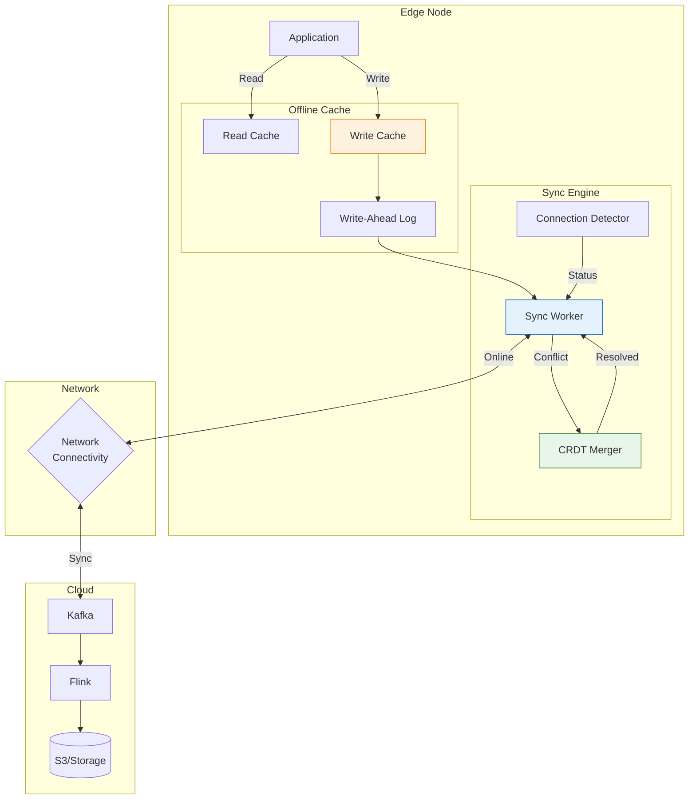
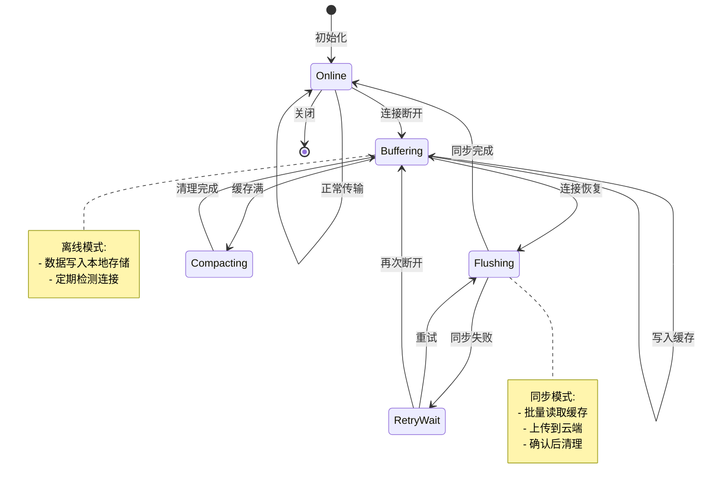
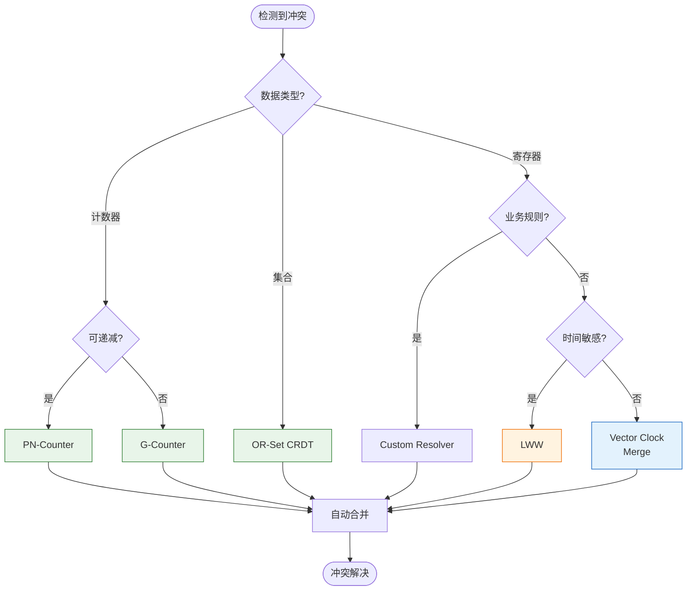

# 离线同步策略 (Offline Synchronization Strategies)

> **所属阶段**: Flink/14-rust-assembly-ecosystem/edge-wasm-runtime | **前置依赖**: [01-edge-architecture.md](01-edge-architecture.md), [02-iot-gateway-patterns.md](02-iot-gateway-patterns.md), [03-5g-mec-integration.md](03-5g-mec-integration.md) | **形式化等级**: L3-L4

---

## 目录

- [离线同步策略 (Offline Synchronization Strategies)](#离线同步策略-offline-synchronization-strategies)
  - [目录](#目录)
  - [1. 概念定义 (Definitions)](#1-概念定义-definitions)
    - [Def-EDGE-16: 断网续传机制 (Resilient Transmission Mechanism)](#def-edge-16-断网续传机制-resilient-transmission-mechanism)
    - [Def-EDGE-17: 冲突解决策略 (Conflict Resolution Strategy)](#def-edge-17-冲突解决策略-conflict-resolution-strategy)
    - [Def-EDGE-18: 状态一致性保证 (State Consistency Guarantee)](#def-edge-18-状态一致性保证-state-consistency-guarantee)
    - [Def-EDGE-19: 边缘缓存模型 (Edge Caching Model)](#def-edge-19-边缘缓存模型-edge-caching-model)
    - [Def-EDGE-20: 同步协议 (Synchronization Protocol)](#def-edge-20-同步协议-synchronization-protocol)
  - [2. 属性推导 (Properties)](#2-属性推导-properties)
    - [Prop-EDGE-13: 断网续传完整性](#prop-edge-13-断网续传完整性)
    - [Prop-EDGE-14: 冲突解决收敛性](#prop-edge-14-冲突解决收敛性)
    - [Prop-EDGE-15: 最终一致性保证](#prop-edge-15-最终一致性保证)
    - [Prop-EDGE-16: 存储容量边界](#prop-edge-16-存储容量边界)
  - [3. 关系建立 (Relations)](#3-关系建立-relations)
    - [3.1 离线-在线状态转换关系](#31-离线-在线状态转换关系)
    - [3.2 同步策略与一致性模型映射](#32-同步策略与一致性模型映射)
    - [3.3 Flink Checkpoint 与边缘同步](#33-flink-checkpoint-与边缘同步)
  - [4. 论证过程 (Argumentation)](#4-论证过程-argumentation)
    - [4.1 断网检测策略对比](#41-断网检测策略对比)
    - [4.2 冲突解决策略选择](#42-冲突解决策略选择)
    - [4.3 存储引擎选型决策](#43-存储引擎选型决策)
  - [5. 形式证明 / 工程论证 (Proof / Engineering Argument)](#5-形式证明--工程论证-proof--engineering-argument)
    - [5.1 断网续传正确性证明](#51-断网续传正确性证明)
    - [5.2 CRDT 收敛性证明](#52-crdt-收敛性证明)
    - [5.3 一致性级别权衡论证](#53-一致性级别权衡论证)
  - [6. 实例验证 (Examples)](#6-实例验证-examples)
    - [6.1 RocksDB 离线缓存实现](#61-rocksdb-离线缓存实现)
    - [6.2 CRDT 计数器同步](#62-crdt-计数器同步)
    - [6.3 向量时钟冲突解决](#63-向量时钟冲突解决)
    - [6.4 断网续传与 Flink 集成](#64-断网续传与-flink-集成)
  - [7. 可视化 (Visualizations)](#7-可视化-visualizations)
    - [7.1 离线同步架构图](#71-离线同步架构图)
    - [7.2 断网续传状态机](#72-断网续传状态机)
    - [7.3 冲突解决决策树](#73-冲突解决决策树)
    - [7.4 一致性模型对比矩阵](#74-一致性模型对比矩阵)
  - [8. 引用参考 (References)](#8-引用参考-references)

---

## 1. 概念定义 (Definitions)

### Def-EDGE-16: 断网续传机制 (Resilient Transmission Mechanism)

**断网续传机制**是在边缘节点与云端连接中断时，将数据暂存于本地存储，并在连接恢复后自动恢复传输的机制。

形式化定义为：

$$
\text{ResilientTx} = \langle Detector, Buffer, AckTracker, Resumer, RetryPolicy \rangle
$$

其中：

| 组件 | 定义 | 功能 |
|------|------|------|
| $Detector$ | 连接检测器 | 检测网络连通性状态变化 |
| $Buffer$ | 本地缓存 | 持久化存储待发送数据 |
| $AckTracker$ | 确认追踪器 | 记录已发送/未发送数据偏移 |
| $Resumer$ | 续传器 | 从断点恢复传输 |
| $RetryPolicy$ | 重试策略 | 定义重试间隔、退避算法 |

**断网续传流程**:

```
正常传输
    │
    ▼
连接中断检测 ──► 触发缓存模式 ──► 数据写入本地存储
    │                                    │
    │                                    ▼
    │                            定时检测连接
    │                                    │
    │                           连接恢复 ◄─── 仍断开
    │                                │
    └───────────────────────────────►┘
                                     │
                                     ▼
                            读取断点位置
                                     │
                                     ▼
                            从断点续传
                                     │
                                     ▼
                            确认成功后清理缓存
```

### Def-EDGE-17: 冲突解决策略 (Conflict Resolution Strategy)

**冲突解决策略**定义了当边缘节点与云端数据发生冲突时（如同一记录被双方修改），如何确定最终值的规则。

形式化定义为：

$$
\text{ConflictResolution} = \langle D_{edge}, D_{cloud}, T_{edge}, T_{cloud}, Resolver \rangle \rightarrow D_{final}
$$

**策略类型**:

| 策略 | 规则 | 适用场景 |
|------|------|---------|
| **Last-Write-Wins (LWW)** | 时间戳最新的获胜 | 配置数据、状态更新 |
| **First-Write-Wins (FWW)** | 先写入的获胜 | 初始化数据、种子值 |
| **Merge** | 合并双方修改 | 列表追加、计数器累加 |
| **Custom** | 业务逻辑决定 | 复杂业务规则 |
| **Reject** | 拒绝冲突，人工介入 | 关键业务数据 |

### Def-EDGE-18: 状态一致性保证 (State Consistency Guarantee)

**状态一致性保证**定义了边缘节点与云端状态同步的语义级别，从弱一致性到强一致性的光谱。

形式化定义为：

$$
\text{Consistency} \in \{Eventual, Causal, Session, Sequential, Linearizable\}
$$

**一致性级别对比**:

| 级别 | 定义 | 延迟 | 可用性 | 适用场景 |
|------|------|------|--------|---------|
| **Linearizable** | 所有操作表现为原子、实时顺序 | 高 | 低 | 金融交易 |
| **Sequential** | 操作全局有序，但非实时 | 中高 | 中 | 配置管理 |
| **Causal** | 因果相关的操作有序 | 中 | 中高 | 协作编辑 |
| **Eventual** | 最终所有副本一致 | 低 | 高 | 日志、遥测 |

### Def-EDGE-19: 边缘缓存模型 (Edge Caching Model)

**边缘缓存模型**定义了数据在边缘节点的存储结构、淘汰策略和容量管理。

形式化定义为：

$$
\text{EdgeCache} = \langle Store, Index, EvictionPolicy, Capacity, TTL \rangle
$$

**缓存类型**:

```
Edge Cache Types
├── 写缓存 (Write Cache)
│   └── 待上传云端的数据
│       ├── FIFO Queue (顺序上传)
│       ├── Priority Queue (优先级)
│       └── Time-Window Buffer (时间窗口)
│
├── 读缓存 (Read Cache)
│   └── 从云端预取的数据
│       ├── LRU (最近最少使用)
│       ├── LFU (最少频率使用)
│       └── TTL-based (时间过期)
│
└── 混合缓存 (Hybrid Cache)
    └── 读写混合场景
        ├── Write-Through (直写)
        ├── Write-Back (回写)
        └── Write-Around (绕写)
```

### Def-EDGE-20: 同步协议 (Synchronization Protocol)

**同步协议**定义了边缘节点与云端之间数据交换的消息格式、时序和确认机制。

形式化定义为：

$$
\text{SyncProtocol} = \langle Messages, Sequence, AckMode, Compression, Encryption \rangle
$$

**协议类型对比**:

| 协议 | 模式 | 特点 | 适用场景 |
|------|------|------|---------|
| **Delta Sync** | 增量 | 仅传输差异 | 大文件、数据库 |
| **Batch Sync** | 批量 | 攒批后传输 | 日志、事件流 |
| **Streaming Sync** | 流式 | 实时连续传输 | 实时数据 |
| **CRDT Sync** | 无协调 | 自动合并 | 计数器、集合 |

---

## 2. 属性推导 (Properties)

### Prop-EDGE-13: 断网续传完整性

**命题**: 断网续传机制保证所有数据最终到达云端：

$$
\forall d \in D_{generated}: Eventually(d \in D_{cloud})
$$

**证明概要**:

1. 数据生成时立即写入本地缓存 $Buffer$ (持久化)
2. 连接恢复时，$AckTracker$ 识别未确认数据
3. $Resumer$ 重传未确认数据
4. $RetryPolicy$ 保证无限重试直至成功
5. 云端确认后从 $Buffer$ 移除

### Prop-EDGE-14: 冲突解决收敛性

**命题**: 使用 CRDT (Conflict-free Replicated Data Type) 的冲突解决保证收敛：

$$
\forall r_1, r_2 \in Replicas: Merge(r_1, r_2) = Merge(r_2, r_1)
$$

**CRDT 类型**:

| 类型 | 操作 | 合并函数 | 应用场景 |
|------|------|---------|---------|
| G-Counter | 递增 | 取最大值 | 访问计数 |
| PN-Counter | 递增/递减 | 分量合并 | 库存计数 |
| G-Set | 添加 | 并集 | 去重集合 |
| OR-Set | 添加/删除 | 观测删除 | 购物车 |
| LWW-Register | 写入 | 时间戳最大 | 配置项 |

### Prop-EDGE-15: 最终一致性保证

**命题**: 在无新写入和网络分区恢复后，所有副本最终一致：

$$
\lim_{t \to \infty} D_{edge}(t) = \lim_{t \to \infty} D_{cloud}(t) \quad \text{if} \quad WriteRate(t) \to 0
$$

**收敛条件**:

- 同步协议保证所有更新传播到所有副本
- 冲突解决策略是确定性的
- 网络分区最终会恢复

### Prop-EDGE-16: 存储容量边界

**命题**: 边缘缓存容量决定了最大可持续离线时长：

$$
T_{max} = \frac{C_{cache} \times (1 - \alpha)}{R_{write} - R_{sync}}
$$

其中：

- $C_{cache}$: 缓存总容量
- $\alpha$: 压缩率
- $R_{write}$: 数据写入速率
- $R_{sync}$: 同步速率 (在线时)

---

## 3. 关系建立 (Relations)

### 3.1 离线-在线状态转换关系

```
┌─────────────────────────────────────────────────────────────────┐
│                    Offline-Online State Machine                  │
│                                                                  │
│   ┌─────────────┐                                               │
│   │   Online    │◄─────────────────────────────────────────┐    │
│   │  (在线模式)  │                                          │    │
│   └──────┬──────┘                                          │    │
│          │ disconnect                                       │    │
│          ▼                                                 │    │
│   ┌─────────────┐      timeout      ┌─────────────┐       │    │
│   │  Detecting  │──────────────────▶│  Offline    │       │    │
│   │ (检测断网)   │                   │  (离线模式)  │       │    │
│   └─────────────┘                   └──────┬──────┘       │    │
│          ▲                                 │               │    │
│          │ recover                          │ write        │    │
│          │                                 ▼               │    │
│   ┌──────┴──────┐                   ┌─────────────┐       │    │
│   │  Reconnect  │◄──────────────────│   Buffer    │       │    │
│   │  (重连中)    │    buffer full    │  (写入缓存)  │       │    │
│   └──────┬──────┘                   └─────────────┘       │    │
│          │                                                  │    │
│          │ connected                                         │    │
│          ▼                                                  │    │
│   ┌─────────────┐      sync complete                        │    │
│   │   Syncing   │───────────────────────────────────────────┘    │
│   │  (同步中)    │                                               │
│   └─────────────┘                                               │
│                                                                  │
└─────────────────────────────────────────────────────────────────┘
```

### 3.2 同步策略与一致性模型映射

| 同步策略 | 一致性级别 | 冲突处理 | 延迟 | 带宽 |
|---------|-----------|---------|------|------|
| **强同步** | Linearizable | 锁/事务 | 高 | 高 |
| **异步复制** | Eventual | LWW/CRDT | 低 | 中 |
| **因果同步** | Causal | 向量时钟 | 中 | 中 |
| **会话同步** | Session | 客户端版本 | 低 | 低 |
| **批量同步** | Eventual | 批量合并 | 低 | 低 |

### 3.3 Flink Checkpoint 与边缘同步

```
┌─────────────────────────────────────────────────────────────────┐
│                    Edge-Cloud Sync Integration                   │
│                                                                  │
│  ┌──────────────────────┐      ┌──────────────────────┐        │
│  │    Edge Flink        │      │    Cloud Flink       │        │
│  │                      │      │                      │        │
│  │  ┌────────────────┐  │      │  ┌────────────────┐  │        │
│  │  │ State Backend  │  │      │  │ State Backend  │  │        │
│  │  │ (RocksDB)      │  │      │  │ (RocksDB/S3)   │  │        │
│  │  └───────┬────────┘  │      │  └───────┬────────┘  │        │
│  │          │           │      │          │           │        │
│  │  ┌───────▼────────┐  │      │  ┌───────▼────────┐  │        │
│  │  │   Checkpoint   │  │ Sync │  │   Checkpoint   │  │        │
│  │  │   (Incremental)│◄─┼──────┼─▶│   (Incremental)│  │        │
│  │  └────────────────┘  │      │  └────────────────┘  │        │
│  │                      │      │                      │        │
│  │  ┌────────────────┐  │      │  ┌────────────────┐  │        │
│  │  │  Output Buffer │  │      │  │  Input Source  │  │        │
│  │  │  (Offline Cache)│◄─┼──────┼─▶│  (Kafka/HDFS)  │  │        │
│  │  └────────────────┘  │      │  └────────────────┘  │        │
│  └──────────────────────┘      └──────────────────────┘        │
│                                                                  │
│  Sync Mechanisms:                                                │
│  1. Checkpoint Sync: Incremental state upload to cloud          │
│  2. Output Sync: Buffered records sent when online              │
│  3. Async Barrier: Non-blocking checkpoint during sync          │
│                                                                  │
└─────────────────────────────────────────────────────────────────┘
```

---

## 4. 论证过程 (Argumentation)

### 4.1 断网检测策略对比

| 检测策略 | 机制 | 延迟 | 误报率 | 资源消耗 |
|---------|------|------|--------|---------|
| **Heartbeat** | 定时心跳包 | 高 (心跳周期) | 低 | 中 |
| **TCP Keepalive** | OS 级保活 | 中 | 低 | 低 |
| **应用层 Ping** | 应用级探测 | 低 | 中 | 中 |
| **发送失败检测** | 发送超时 | 最低 | 低 | 最低 |

**推荐组合策略**:

```
                    断网检测
                         │
        ┌────────────────┼────────────────┐
        │                │                │
   实时性要求高      资源受限          可靠性要求高
        │                │                │
   发送失败检测      TCP Keepalive     多层检测
   + 快速重试        + 心跳备份         (应用+TCP+心跳)
```

### 4.2 冲突解决策略选择

```
                    数据类型评估
                         │
        ┌────────────────┼────────────────┐
        │                │                │
    可交换操作       不可交换           需要业务规则
        │                │                │
   ┌────┴────┐      ┌────┴────┐     ┌────┴────┐
   │         │      │         │     │         │
计数器    集合      配置项    状态    订单     库存
   │         │      │         │     │         │
   └────┬────┘      └────┬────┘     └────┬────┘
        │                │                │
       CRDT            LWW            Custom
       (自动合并)    (时间戳)       (业务逻辑)
```

### 4.3 存储引擎选型决策

| 存储引擎 | 写入性能 | 读取性能 | 压缩 | 适用场景 |
|---------|---------|---------|------|---------|
| **RocksDB** | 极高 (LSM) | 高 | 好 | 通用时序数据 |
| **SQLite** | 中 | 高 | 中 | 结构化查询 |
| **BadgerDB** | 极高 | 中 | 好 | 只写密集 |
| **文件系统** | 高 | 中 | 无 | 大对象存储 |

---

## 5. 形式证明 / 工程论证 (Proof / Engineering Argument)

### 5.1 断网续传正确性证明

**定理**: 断网续传机制保证数据不丢失且最终到达云端。

**证明**:

设数据 $d$ 在时刻 $t_0$ 生成：

1. **持久化保证**: $d$ 立即写入 $Buffer$ (持久化存储)
   $$\forall d: Write(d) \implies Persist(d) \in Buffer$$

2. **确认追踪**: $AckTracker$ 维护已确认偏移 $ack\_offset$
   $$Unacked = \{d_i \mid offset(d_i) > ack\_offset\}$$

3. **无限重试**: $RetryPolicy$ 保证重试次数无上限
   $$\forall d \in Unacked: \lim_{n \to \infty} P(Success_n) = 1$$

4. **幂等性**: 云端去重保证重复发送不导致重复数据
   $$Idempotent(Send(d))$$

因此，$Eventually(d \in D_{cloud})$。

### 5.2 CRDT 收敛性证明

**定理**: G-Counter (Grow-only Counter) CRDT 满足收敛性。

**证明**:

G-Counter 定义：

- 状态: $G = [c_1, c_2, ..., c_n]$，每个副本维护一个分量
- 操作: $Increment(G, i) = G[i]++$
- 合并: $Merge(G_a, G_b) = [max(G_a[1], G_b[1]), ..., max(G_a[n], G_b[n])]$

证明合并的交换律和结合律：

1. **交换律**: $Merge(G_a, G_b) = Merge(G_b, G_a)$
   - 因为 $max(a, b) = max(b, a)$

2. **结合律**: $Merge(G_a, Merge(G_b, G_c)) = Merge(Merge(G_a, G_b), G_c)$
   - 因为 $max(a, max(b, c)) = max(max(a, b), c)$

因此 G-Counter 是状态基 CRDT，满足收敛性。

### 5.3 一致性级别权衡论证

**工程权衡**:

| 一致性级别 | 实现复杂度 | 性能影响 | 应用场景 |
|-----------|-----------|---------|---------|
| **强一致性** | 高 (2PC/Paxos) | 高延迟 | 金融交易 |
| **因果一致性** | 中 (向量时钟) | 中延迟 | 社交应用 |
| **最终一致性** | 低 (异步复制) | 低延迟 | 日志/遥测 |

**CAP 权衡**:

```
                    CAP Theorem
                         │
        ┌────────────────┼────────────────┐
        │                │                │
    网络分区(P)        一致性(C)         可用性(A)
        │                │                │
   ┌────┴────┐      ┌────┴────┐     ┌────┴────┐
   │         │      │         │     │         │
接受分区    优先CP    强一致     优先AP   最终一致
   │         │      │         │     │         │
   └────┬────┘      └────┬────┘     └────┬────┘
        │                │                │
   边缘计算场景      金融核心系统      IoT遥测
   (离线优先)       (一致性优先)     (可用性优先)
```

---

## 6. 实例验证 (Examples)

### 6.1 RocksDB 离线缓存实现

```rust
// offline_cache/src/lib.rs

use rocksdb::{DB, Options, WriteBatch, ColumnFamilyDescriptor};
use serde::{Serialize, Deserialize};
use std::sync::atomic::{AtomicU64, Ordering};

#[derive(Serialize, Deserialize, Clone)]
pub struct CachedRecord {
    pub id: String,
    pub payload: Vec<u8>,
    pub timestamp: u64,
    pub priority: u8,  // 0-255, higher = more important
    pub attempts: u32,
}

pub struct OfflineCache {
    db: DB,
    write_buffer: WriteBatch,
    ack_offset: AtomicU64,
    max_size: usize,
}

impl OfflineCache {
    pub fn new(path: &str, max_size_gb: usize) -> Result<Self, CacheError> {
        let mut opts = Options::default();
        opts.create_if_missing(true);
        opts.create_missing_column_families(true);

        // 针对写入优化
        opts.set_write_buffer_size(64 * 1024 * 1024);  // 64MB
        opts.set_max_write_buffer_number(3);
        opts.set_target_file_size_base(64 * 1024 * 1024);
        opts.set_compression_type(rocksdb::DBCompressionType::Lz4);

        // 创建列族
        let cfs = vec![
            ColumnFamilyDescriptor::new("records", opts.clone()),
            ColumnFamilyDescriptor::new("metadata", opts.clone()),
        ];

        let db = DB::open_cf_descriptors(&opts, path, cfs)?;

        Ok(OfflineCache {
            db,
            write_buffer: WriteBatch::default(),
            ack_offset: AtomicU64::new(0),
            max_size: max_size_gb * 1024 * 1024 * 1024,
        })
    }

    /// 写入数据到本地缓存
    pub fn write(&mut self, record: CachedRecord) -> Result<(), CacheError> {
        let cf = self.db.cf_handle("records")
            .ok_or(CacheError::ColumnFamilyNotFound)?;

        // 使用时间戳+序号作为 key,保证有序
        let key = format!("{:020}", record.timestamp);
        let value = serde_json::to_vec(&record)?;

        self.write_buffer.put_cf(cf, &key, &value);

        // 批量写入优化
        if self.write_buffer.len() > 100 {
            self.flush()?;
        }

        Ok(())
    }

    /// 刷新缓冲区到磁盘
    pub fn flush(&mut self) -> Result<(), CacheError> {
        if self.write_buffer.is_empty() {
            return Ok(());
        }

        self.db.write(&self.write_buffer)?;
        self.write_buffer.clear();

        // 同步 WAL,确保数据持久化
        self.db.sync_wal()?;

        Ok(())
    }

    /// 读取待同步的数据(从 ack_offset 之后)
    pub fn read_pending(&self, batch_size: usize) -> Result<Vec<CachedRecord>, CacheError> {
        let cf = self.db.cf_handle("records")
            .ok_or(CacheError::ColumnFamilyNotFound)?;

        let start_key = format!("{:020}", self.ack_offset.load(Ordering::SeqCst));

        let mut records = Vec::new();
        let iter = self.db.iterator_cf(
            cf,
            rocksdb::IteratorMode::From(start_key.as_bytes(), rocksdb::Direction::Forward)
        );

        for (_, value) in iter.take(batch_size) {
            let record: CachedRecord = serde_json::from_slice(&value)?;
            records.push(record);
        }

        Ok(records)
    }

    /// 确认数据已同步,更新 ack_offset
    pub fn acknowledge(&self, timestamp: u64) -> Result<(), CacheError> {
        let cf = self.db.cf_handle("metadata")
            .ok_or(CacheError::ColumnFamilyNotFound)?;

        self.ack_offset.store(timestamp, Ordering::SeqCst);
        self.db.put_cf(cf, b"ack_offset", timestamp.to_be_bytes())?;

        Ok(())
    }

    /// 清理已确认的数据
    pub fn compact(&self) -> Result<(), CacheError> {
        let cf = self.db.cf_handle("records")
            .ok_or(CacheError::ColumnFamilyNotFound)?;

        let ack = self.ack_offset.load(Ordering::SeqCst);
        let end_key = format!("{:020}", ack);

        // 删除已确认的数据
        self.db.delete_range_cf(cf, b"", end_key.as_bytes())?;

        // 触发 compaction
        self.db.compact_range_cf(cf, None::<&[u8]>, None::<&[u8]>);

        Ok(())
    }

    /// 获取缓存统计
    pub fn stats(&self) -> Result<CacheStats, CacheError> {
        let cf = self.db.cf_handle("records")
            .ok_or(CacheError::ColumnFamilyNotFound)?;

        let mut total_size = 0;
        let mut count = 0;

        let iter = self.db.iterator_cf(cf, rocksdb::IteratorMode::Start);
        for (_, value) in iter {
            total_size += value.len();
            count += 1;
        }

        Ok(CacheStats {
            record_count: count,
            total_size_bytes: total_size,
            ack_offset: self.ack_offset.load(Ordering::SeqCst),
        })
    }
}

#[derive(Debug)]
pub struct CacheStats {
    pub record_count: usize,
    pub total_size_bytes: usize,
    pub ack_offset: u64,
}
```

### 6.2 CRDT 计数器同步

```rust
// crdt_counter/src/lib.rs

/// G-Counter (Grow-only Counter) CRDT
#[derive(Clone, Debug, Default)]
pub struct GCounter {
    /// Each replica maintains its own count
    counts: Vec<u64>,
    /// Index of this replica
    replica_id: usize,
}

impl GCounter {
    pub fn new(replica_id: usize, num_replicas: usize) -> Self {
        GCounter {
            counts: vec![0; num_replicas],
            replica_id,
        }
    }

    /// Increment this replica's count
    pub fn increment(&mut self) {
        self.counts[self.replica_id] += 1;
    }

    /// Get the total value
    pub fn value(&self) -> u64 {
        self.counts.iter().sum()
    }

    /// Merge with another G-Counter
    pub fn merge(&mut self, other: &GCounter) {
        for (i, (a, b)) in self.counts.iter_mut().zip(other.counts.iter()).enumerate() {
            *a = (*a).max(*b);
        }
    }

    /// Serialize for network transmission
    pub fn serialize(&self) -> Vec<u8> {
        bincode::serialize(self).unwrap()
    }

    pub fn deserialize(data: &[u8]) -> Self {
        bincode::deserialize(data).unwrap()
    }
}

/// PN-Counter (Increment/Decrement Counter) CRDT
#[derive(Clone, Debug, Default)]
pub struct PNCounter {
    /// Positive increments
    p: GCounter,
    /// Negative increments
    n: GCounter,
}

impl PNCounter {
    pub fn new(replica_id: usize, num_replicas: usize) -> Self {
        PNCounter {
            p: GCounter::new(replica_id, num_replicas),
            n: GCounter::new(replica_id, num_replicas),
        }
    }

    pub fn increment(&mut self) {
        self.p.increment();
    }

    pub fn decrement(&mut self) {
        self.n.increment();
    }

    pub fn value(&self) -> i64 {
        self.p.value() as i64 - self.n.value() as i64
    }

    pub fn merge(&mut self, other: &PNCounter) {
        self.p.merge(&other.p);
        self.n.merge(&other.n);
    }
}

#[cfg(test)]
mod tests {
    use super::*;

    #[test]
    fn test_g_counter() {
        let mut counter_a = GCounter::new(0, 2);
        let mut counter_b = GCounter::new(1, 2);

        // Both replicas increment
        counter_a.increment();
        counter_a.increment();
        counter_b.increment();

        // Merge
        let mut merged = counter_a.clone();
        merged.merge(&counter_b);

        assert_eq!(merged.value(), 3);
    }

    #[test]
    fn test_pn_counter() {
        let mut counter_a = PNCounter::new(0, 2);
        let mut counter_b = PNCounter::new(1, 2);

        counter_a.increment();
        counter_a.increment();
        counter_b.decrement();

        let mut merged = counter_a.clone();
        merged.merge(&counter_b);

        assert_eq!(merged.value(), 1);  // 2 - 1 = 1
    }
}
```

### 6.3 向量时钟冲突解决

```rust
// vector_clock/src/lib.rs

use std::collections::HashMap;
use std::cmp::Ordering;

/// Vector Clock for causal ordering
#[derive(Clone, Debug, Default)]
pub struct VectorClock {
    /// Map from replica ID to logical timestamp
    clocks: HashMap<String, u64>,
}

impl VectorClock {
    pub fn new() -> Self {
        VectorClock {
            clocks: HashMap::new(),
        }
    }

    /// Increment this replica's clock
    pub fn increment(&mut self, replica_id: &str) {
        *self.clocks.entry(replica_id.to_string()).or_insert(0) += 1;
    }

    /// Update from another vector clock (take element-wise max)
    pub fn update(&mut self, other: &VectorClock) {
        for (replica, timestamp) in &other.clocks {
            let entry = self.clocks.entry(replica.clone()).or_insert(0);
            *entry = (*entry).max(*timestamp);
        }
    }

    /// Compare two vector clocks
    pub fn compare(&self, other: &VectorClock) -> Ordering {
        let mut dominates = false;
        let mut dominated = false;

        // Check all keys from both clocks
        let all_keys: std::collections::HashSet<_> = self.clocks.keys()
            .chain(other.clocks.keys())
            .collect();

        for key in all_keys {
            let a = self.clocks.get(key).copied().unwrap_or(0);
            let b = other.clocks.get(key).copied().unwrap_or(0);

            if a > b {
                dominates = true;
            } else if b > a {
                dominated = true;
            }
        }

        match (dominates, dominated) {
            (true, false) => Ordering::Greater,
            (false, true) => Ordering::Less,
            (false, false) => Ordering::Equal,
            (true, true) => Ordering::Equal, // Concurrent
        }
    }

    /// Check if there is a conflict (concurrent updates)
    pub fn is_concurrent(&self, other: &VectorClock) -> bool {
        self.compare(other) == Ordering::Equal && self.clocks != other.clocks
    }
}

/// Versioned value with vector clock
#[derive(Clone, Debug)]
pub struct VersionedValue<T> {
    pub value: T,
    pub clock: VectorClock,
}

impl<T: Clone> VersionedValue<T> {
    pub fn new(value: T, replica_id: &str) -> Self {
        let mut clock = VectorClock::new();
        clock.increment(replica_id);

        VersionedValue { value, clock }
    }

    /// Update the value
    pub fn update(&mut self, new_value: T, replica_id: &str) {
        self.value = new_value;
        self.clock.increment(replica_id);
    }

    /// Merge with another versioned value
    pub fn merge(&mut self, other: &VersionedValue<T>, resolver: fn(&T, &T) -> T) {
        match self.clock.compare(&other.clock) {
            Ordering::Less => {
                // Other is newer, take it
                self.value = other.value.clone();
                self.clock = other.clock.clone();
            }
            Ordering::Greater => {
                // Self is newer, keep it
            }
            Ordering::Equal => {
                if self.clock.is_concurrent(&other.clock) {
                    // Conflict! Use resolver
                    self.value = resolver(&self.value, &other.value);
                    self.clock.update(&other.clock);
                    self.clock.increment("merge");
                }
                // If clocks are equal and not concurrent, they're the same
            }
        }
    }
}

#[cfg(test)]
mod tests {
    use super::*;

    #[test]
    fn test_causal_ordering() {
        let mut vc_a = VectorClock::new();
        let mut vc_b = VectorClock::new();

        // A does something
        vc_a.increment("A");

        // B receives A's update and does something
        vc_b.update(&vc_a);
        vc_b.increment("B");

        // A should happen-before B
        assert!(vc_a.compare(&vc_b) == Ordering::Less);
    }

    #[test]
    fn test_concurrent_conflict() {
        let mut vc_a = VectorClock::new();
        let mut vc_b = VectorClock::new();

        // Both A and B do something independently (concurrent)
        vc_a.increment("A");
        vc_b.increment("B");

        assert!(vc_a.is_concurrent(&vc_b));
        assert!(vc_b.is_concurrent(&vc_a));
    }
}
```

### 6.4 断网续传与 Flink 集成

```rust
// flink_edge_sync/src/lib.rs

use flink_rust_connector::{FlinkSource, FlinkSink, CheckpointListener};
use async_trait::async_trait;

/// Flink Source that supports offline mode
pub struct ResilientFlinkSource {
    cache: OfflineCache,
    cloud_source: Box<dyn FlinkSource>,
    online: AtomicBool,
}

#[async_trait]
impl FlinkSource for ResilientFlinkSource {
    async fn next(&mut self) -> Option<Record> {
        if self.online.load(Ordering::SeqCst) {
            // Online mode: read from cloud
            match self.cloud_source.next().await {
                Some(record) => {
                    // Also cache locally for potential offline use
                    let _ = self.cache.write(CachedRecord {
                        id: format!("{}", record.timestamp),
                        payload: record.serialize(),
                        timestamp: record.timestamp,
                        priority: 5,
                        attempts: 0,
                    });
                    Some(record)
                }
                None => None,
            }
        } else {
            // Offline mode: read from local cache
            match self.cache.read_pending(1).await {
                Ok(records) if !records.is_empty() => {
                    Some(Record::deserialize(&records[0].payload))
                }
                _ => {
                    // No more cached records, wait
                    tokio::time::sleep(Duration::from_millis(100)).await;
                    None
                }
            }
        }
    }
}

/// Flink Sink with offline buffering
pub struct ResilientFlinkSink {
    cache: OfflineCache,
    cloud_sink: Box<dyn FlinkSink>,
    sync_worker: SyncWorker,
}

impl ResilientFlinkSink {
    pub async fn new(cloud_sink: Box<dyn FlinkSink>, cache_path: &str) -> Self {
        let cache = OfflineCache::new(cache_path, 10).unwrap();
        let sync_worker = SyncWorker::new(cache.clone(), cloud_sink.clone());

        ResilientFlinkSink {
            cache,
            cloud_sink,
            sync_worker,
        }
    }

    pub async fn write(&mut self, record: Record) -> Result<(), SinkError> {
        // Always write to local cache first
        let cached = CachedRecord {
            id: format!("{}-{}", record.key, record.timestamp),
            payload: record.serialize(),
            timestamp: record.timestamp,
            priority: record.priority,
            attempts: 0,
        };

        self.cache.write(cached)?;

        // Try to send to cloud immediately if online
        if self.sync_worker.is_online().await {
            self.sync_worker.trigger_sync().await;
        }

        Ok(())
    }
}

/// Background sync worker
pub struct SyncWorker {
    cache: OfflineCache,
    cloud_sink: Box<dyn FlinkSink>,
    online: AtomicBool,
}

impl SyncWorker {
    pub fn new(cache: OfflineCache, cloud_sink: Box<dyn FlinkSink>) -> Self {
        let worker = SyncWorker {
            cache,
            cloud_sink,
            online: AtomicBool::new(true),
        };

        // Start background sync task
        tokio::spawn(worker.run());

        worker
    }

    async fn run(&self) {
        loop {
            if self.online.load(Ordering::SeqCst) {
                // Read pending records from cache
                match self.cache.read_pending(100).await {
                    Ok(records) if !records.is_empty() => {
                        for record in records {
                            let r = Record::deserialize(&record.payload);

                            match self.cloud_sink.write(r).await {
                                Ok(_) => {
                                    // Acknowledge successful sync
                                    let _ = self.cache.acknowledge(record.timestamp).await;
                                }
                                Err(_) => {
                                    // Mark as failed, will retry
                                    self.online.store(false, Ordering::SeqCst);
                                    break;
                                }
                            }
                        }

                        // Compact acknowledged records
                        let _ = self.cache.compact().await;
                    }
                    _ => {
                        // No pending records, sleep
                        tokio::time::sleep(Duration::from_secs(1)).await;
                    }
                }
            } else {
                // Offline mode, check connectivity periodically
                tokio::time::sleep(Duration::from_secs(5)).await;

                if self.check_connectivity().await {
                    self.online.store(true, Ordering::SeqCst);
                }
            }
        }
    }

    async fn check_connectivity(&self) -> bool {
        // Try to connect to cloud sink
        self.cloud_sink.ping().await.is_ok()
    }

    pub async fn is_online(&self) -> bool {
        self.online.load(Ordering::SeqCst)
    }

    pub async fn trigger_sync(&self) {
        // Signal to wake up sync loop
    }
}
```

---

## 7. 可视化 (Visualizations)

### 7.1 离线同步架构图



### 7.2 断网续传状态机



### 7.3 冲突解决决策树



### 7.4 一致性模型对比矩阵

```mermaid
quadrantChart
    title 一致性模型 vs 应用场景
    x-axis 低一致性要求 --> 高一致性要求
    y-axis 低可用性容忍 --> 高可用性要求

    quadrant-1 高一致/高可用: 分布式事务
    quadrant-2 低一致/高可用: 最终一致
    quadrant-3 低一致/低可用: 单点系统
    quadrant-4 高一致/低可用: 强一致

    "物联网遥测": [0.1, 0.9]
    "日志收集": [0.15, 0.85]
    "用户配置": [0.6, 0.7]
    "购物车": [0.4, 0.8]
    "库存管理": [0.8, 0.5]
    "银行转账": [0.95, 0.2]
    "订单系统": [0.85, 0.4]
    "游戏状态": [0.3, 0.9]
```

---

## 8. 引用参考 (References)


---

*文档版本: v1.0 | 更新日期: 2026-04-04 | 状态: 已完成*

---

*文档版本: v1.0 | 创建日期: 2026-04-20*
