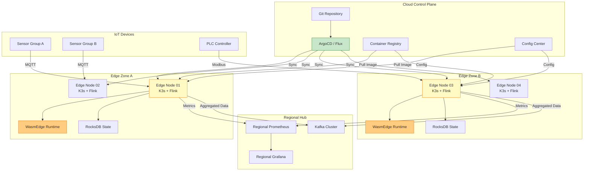
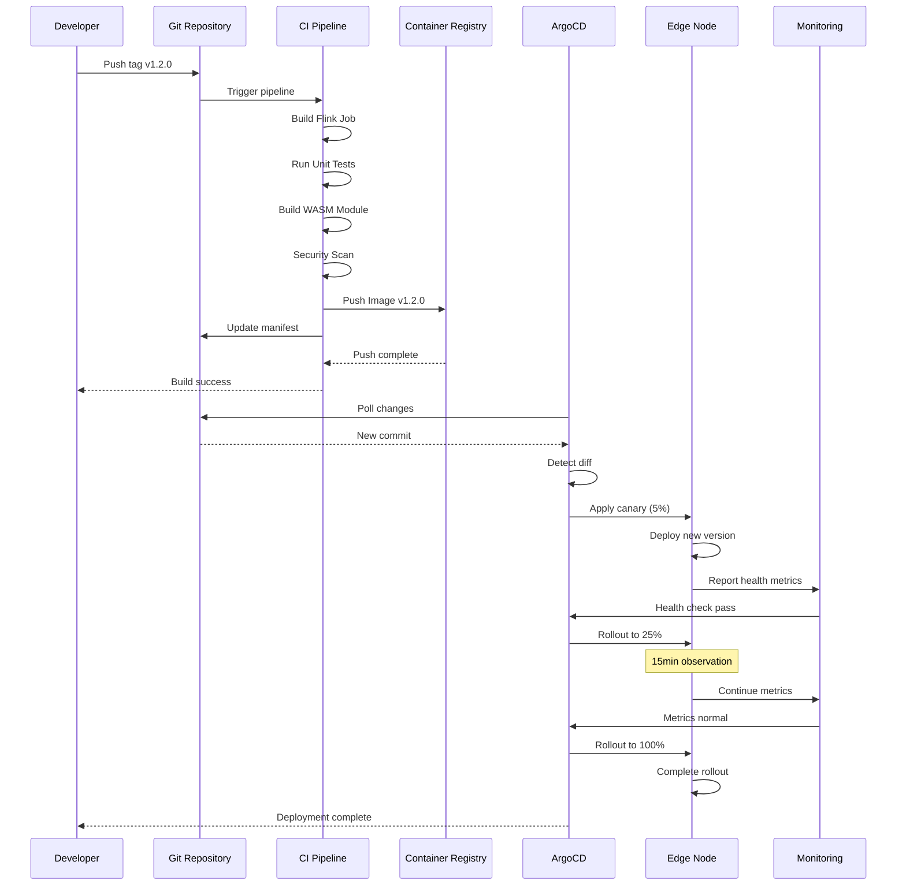
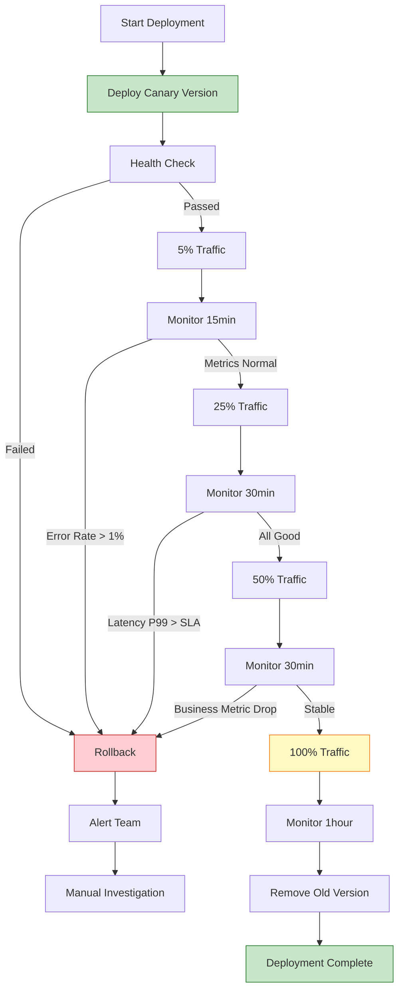
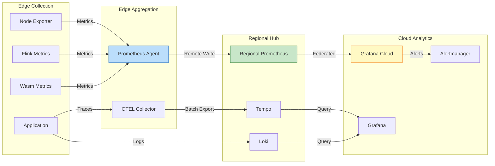

# 边缘流处理生产部署指南 (Edge Stream Processing Production Deployment Guide)

> **所属阶段**: Flink/07-rust-native/edge-wasm-runtime | **前置依赖**: [01-edge-architecture.md](01-edge-architecture.md), [04-offline-sync-strategies.md](04-offline-sync-strategies.md) | **形式化等级**: L4

---

## 目录

- [边缘流处理生产部署指南 (Edge Stream Processing Production Deployment Guide)](#边缘流处理生产部署指南-edge-stream-processing-production-deployment-guide)
  - [目录](#目录)
  - [1. 概念定义 (Definitions)](#1-概念定义-definitions)
    - [Def-F-07-05-01: 生产部署拓扑 (Production Deployment Topology)](#def-f-07-05-01-生产部署拓扑-production-deployment-topology)
    - [Def-F-07-05-02: 边缘集群编排模型 (Edge Cluster Orchestration Model)](#def-f-07-05-02-边缘集群编排模型-edge-cluster-orchestration-model)
    - [Def-F-07-05-03: 灰度发布策略 (Canary Deployment Strategy)](#def-f-07-05-03-灰度发布策略-canary-deployment-strategy)
    - [Def-F-07-05-04: 边缘可观测性堆栈 (Edge Observability Stack)](#def-f-07-05-04-边缘可观测性堆栈-edge-observability-stack)
    - [Def-F-07-05-05: 灾难恢复目标 (Disaster Recovery Objectives)](#def-f-07-05-05-灾难恢复目标-disaster-recovery-objectives)
  - [2. 属性推导 (Properties)](#2-属性推导-properties)
    - [Prop-F-07-05-01: 部署原子性](#prop-f-07-05-01-部署原子性)
    - [Prop-F-07-05-02: 配置一致性](#prop-f-07-05-02-配置一致性)
    - [Prop-F-07-05-03: 故障域隔离性](#prop-f-07-05-03-故障域隔离性)
    - [Prop-F-07-05-04: 回滚安全性](#prop-f-07-05-04-回滚安全性)
  - [3. 关系建立 (Relations)](#3-关系建立-relations)
    - [3.1 CI/CD 流水线与边缘部署关系](#31-cicd-流水线与边缘部署关系)
    - [3.2 多环境配置层级关系](#32-多环境配置层级关系)
    - [3.3 监控指标聚合层级](#33-监控指标聚合层级)
  - [4. 论证过程 (Argumentation)](#4-论证过程-argumentation)
    - [4.1 部署策略选择决策树](#41-部署策略选择决策树)
    - [4.2 资源规划方法论](#42-资源规划方法论)
    - [4.3 安全配置最佳实践](#43-安全配置最佳实践)
  - [5. 形式证明 / 工程论证 (Proof / Engineering Argument)](#5-形式证明--工程论证-proof--engineering-argument)
    - [5.1 零停机部署可行性论证](#51-零停机部署可行性论证)
    - [5.2 配置漂移检测机制](#52-配置漂移检测机制)
    - [5.3 跨边缘数据一致性保障](#53-跨边缘数据一致性保障)
  - [6. 实例验证 (Examples)](#6-实例验证-examples)
    - [6.1 完整生产部署流程](#61-完整生产部署流程)
    - [6.2 Kubernetes Edge 部署模板](#62-kubernetes-edge-部署模板)
    - [6.3 Docker Compose 边缘部署](#63-docker-compose-边缘部署)
    - [6.4 监控告警配置](#64-监控告警配置)
  - [7. 可视化 (Visualizations)](#7-可视化-visualizations)
    - [7.1 生产部署架构图](#71-生产部署架构图)
    - [7.2 CI/CD 流水线时序图](#72-cicd-流水线时序图)
    - [7.3 灰度发布流程图](#73-灰度发布流程图)
    - [7.4 监控数据流图](#74-监控数据流图)
  - [8. 引用参考 (References)](#8-引用参考-references)

---

## 1. 概念定义 (Definitions)

### Def-F-07-05-01: 生产部署拓扑 (Production Deployment Topology)

**生产部署拓扑**定义了边缘流处理系统在生产环境中的物理和逻辑部署结构。

形式化定义为：

$$
\text{DeploymentTopology} = \langle Z, N, S, C, D, R \rangle
$$

其中：

| 符号 | 定义 | 说明 |
|------|------|------|
| $Z$ | 可用区集合 | $Z = \{z_1, z_2, ..., z_m\}$，每个可用区包含若干边缘节点 |
| $N$ | 边缘节点集合 | $N = \{n_1, n_2, ..., n_n\}$，每个节点具有资源容量 $cap(n_i)$ |
| $S$ | 服务集合 | $S = \{s_1, s_2, ..., s_k\}$，边缘部署的服务实例 |
| $C$ | 配置集合 | $C = \{c_1, c_2, ..., c_p\}$，各层级配置参数 |
| $D$ | 部署关系 | $D: S \times N \rightarrow \{0, 1\}$，服务到节点的部署映射 |
| $R$ | 流量路由规则 | $R: Traffic \rightarrow S$，请求路由策略 |

**部署拓扑层级**：

```
生产部署拓扑
├── 云端控制平面 (Cloud Control Plane)
│   ├── GitOps Repository
│   ├── ArgoCD / Flux
│   └── 全局配置中心 (Consul / etcd)
│
├── 区域汇聚层 (Regional Aggregation)
│   ├── 区域 Kafka Cluster
│   ├── 区域监控中心
│   └── 区域配置代理
│
└── 边缘执行层 (Edge Execution Layer)
    ├── 边缘节点集群 (Kubernetes / Docker Swarm)
    ├── Wasm 运行时 (WasmEdge)
    └── 本地存储 (RocksDB / SQLite)
```

### Def-F-07-05-02: 边缘集群编排模型 (Edge Cluster Orchestration Model)

**边缘集群编排模型**定义了边缘节点上容器和 Wasm 工作负载的调度、部署和管理机制。

形式化定义为：

$$
\text{OrchestrationModel} = \langle W, P, Sch, Scale, Heal \rangle
$$

其中：

| 组件 | 定义 | 说明 |
|------|------|------|
| $W$ | 工作负载集合 | $W = W_{container} \cup W_{wasm}$ |
| $P$ | 调度策略 | $P: W \times N \rightarrow \mathbb{R}^+$，节点评分函数 |
| $Sch$ | 调度器 | 根据策略将工作负载分配到节点 |
| $Scale$ | 自动扩缩容 | $Scale: Metrics \times Threshold \rightarrow Replicas$ |
| $Heal$ | 自愈机制 | $Heal: Failure \rightarrow Action$ |

**K3s 边缘编排特性**：

| 特性 | 实现方式 | 边缘优化 |
|------|---------|---------|
| 轻量控制平面 | 单节点 SQLite 后端 | 内存占用 < 512MB |
| 离线自治 | 本地 API Server 缓存 | 断网可独立运行 |
| 快速启动 | 预拉取镜像 + 快照恢复 | 节点重启 < 30s |
| 资源限制 | Pod 资源配额 + OOM 保护 | 防止资源耗尽 |

### Def-F-07-05-03: 灰度发布策略 (Canary Deployment Strategy)

**灰度发布策略**是一种渐进式部署方法，通过逐步将流量切换到新版本，降低发布风险。

形式化定义为：

$$
\text{CanaryStrategy} = \langle V_{old}, V_{new}, T, \gamma, \phi, \mathcal{M} \rangle
$$

其中：

| 符号 | 定义 | 说明 |
|------|------|------|
| $V_{old}$ | 旧版本实例集 | 当前运行的稳定版本 |
| $V_{new}$ | 新版本实例集 | 待发布的版本 |
| $T$ | 流量分配函数 | $T: Request \rightarrow \{V_{old}, V_{new}\}$ |
| $\gamma$ | 灰度比例 | $\gamma \in [0, 1]$，新版本流量占比 |
| $\phi$ | 升级策略 | 线性 / 指数 / 手动控制 |
| $\mathcal{M}$ | 健康检查指标 | 错误率、延迟、资源使用 |

**灰度发布阶段**：

| 阶段 | 流量比例 | 持续时间 | 检查点 |
|------|---------|---------|--------|
| 初始 | 0% | 5min | 部署成功、健康检查通过 |
| 小规模 | 5% | 15min | 错误率 < 1%、P99 < 100ms |
| 中规模 | 25% | 30min | 业务指标正常 |
| 大规模 | 50% | 30min | 资源使用稳定 |
| 全量 | 100% | - | 监控 1 小时后下线旧版本 |

### Def-F-07-05-04: 边缘可观测性堆栈 (Edge Observability Stack)

**边缘可观测性堆栈**是用于监控、日志收集、链路追踪的完整解决方案，适应边缘环境的资源限制。

形式化定义为：

$$
\text{ObservabilityStack} = \langle M, L, T, Agg, Store, Alert \rangle
$$

其中：

| 组件 | 定义 | 边缘实现 |
|------|------|---------|
| $M$ | 指标采集 | Node Exporter + cAdvisor (精简版) |
| $L$ | 日志收集 | Promtail / Fluent Bit |
| $T$ | 链路追踪 | OpenTelemetry Collector (边缘精简配置) |
| $Agg$ | 数据聚合 | 边缘本地聚合 + 批量上传 |
| $Store$ | 存储 | 本地 VictoriaMetrics / 云端 Grafana Cloud |
| $Alert$ | 告警 | 本地 Alertmanager + 云端集成 |

**资源优化指标**：

| 组件 | 标准版资源 | 边缘优化版 | 节省 |
|------|-----------|-----------|------|
| Prometheus | 2GB RAM | 200MB RAM | 90% |
| Grafana Agent | 500MB RAM | 50MB RAM | 90% |
| Jaeger Agent | 300MB RAM | 30MB RAM | 90% |
| 日志收集器 | 1GB RAM | 100MB RAM | 90% |

### Def-F-07-05-05: 灾难恢复目标 (Disaster Recovery Objectives)

**灾难恢复目标**定义了边缘系统在面对故障时的恢复时间目标和数据丢失容忍度。

形式化定义为：

$$
\text{DRObjectives} = \langle RTO, RPO, MTTR, MTBF, BackupPolicy \rangle
$$

其中：

| 指标 | 定义 | 边缘典型值 |
|------|------|-----------|
| $RTO$ | 恢复时间目标 | 节点级: < 5min，区域级: < 30min |
| $RPO$ | 恢复点目标 | 关键数据: < 1min，普通数据: < 1h |
| $MTTR$ | 平均修复时间 | < 15min (自动恢复) |
| $MTBF$ | 平均故障间隔 | > 720h (30天) |
| $BackupPolicy$ | 备份策略 | 本地快照 + 云端备份 |

---

## 2. 属性推导 (Properties)

### Prop-F-07-05-01: 部署原子性

**命题**: 边缘部署操作满足原子性，即部署要么完全成功，要么完全回滚：

$$
\forall deploy: State_{after}(deploy) \in \{State_{success}, State_{rollback}\}
$$

**证明概要**:

1. **预检查阶段**: 验证配置语法、资源可用性、依赖关系
2. **预部署阶段**: 创建新实例，但不接收流量
3. **切换阶段**: 原子性更新路由规则 (使用 etcd 事务)
4. **回滚机制**: 健康检查失败时，自动回滚到上一个稳定版本

**原子性保障措施**：

| 层级 | 保障机制 | 实现 |
|------|---------|------|
| 配置 | 版本化 + 校验 | GitOps + jsonschema |
| 部署 | 蓝绿部署 | 同时运行新旧版本 |
| 路由 | 原子切换 | 使用 envoy xDS / Istio |
| 回滚 | 快速回滚 | 保留最近 3 个版本 |

### Prop-F-07-05-02: 配置一致性

**命题**: 边缘集群的配置最终一致，收敛时间有界：

$$
\forall c \in C: \lim_{t \to \infty} Config_{edge}(c, t) = Config_{source}(c)
$$

**收敛时间上界**：

$$
T_{converge} \leq T_{poll} + T_{propagate} + T_{apply}
$$

其中：

- $T_{poll}$: 配置轮询间隔 (默认 30s)
- $T_{propagate}$: 网络传播延迟 (< 1s)
- $T_{apply}$: 应用配置时间 (< 5s)

### Prop-F-07-05-03: 故障域隔离性

**命题**: 边缘部署的故障域边界清晰，单点故障不影响全局：

$$
\forall f \in FailureDomain_i: Impact(f) \cap S_{other} = \emptyset
$$

**故障域划分**：

| 故障域级别 | 范围 | 隔离机制 |
|-----------|------|---------|
| 节点级 | 单边缘节点 | Pod 反亲和性 |
| 可用区级 | 单可用区 | 网络分区 + 配置隔离 |
| 区域级 | 单区域 | DNS 故障转移 |
| 全局级 | 控制平面 | 多主架构 |

### Prop-F-07-05-04: 回滚安全性

**命题**: 部署回滚操作保证数据一致性：

$$
\forall rollback: Data_{consistency}(rollback) = true
$$

**回滚安全机制**：

1. **状态快照**: 部署前自动创建状态快照
2. **增量备份**: 运行期间增量备份到云端
3. **冲突检测**: 回滚前检测数据冲突
4. **手动确认**: 数据冲突时人工介入

---

## 3. 关系建立 (Relations)

### 3.1 CI/CD 流水线与边缘部署关系

```
┌─────────────────────────────────────────────────────────────────┐
│                     Git Repository                               │
│  ┌─────────────┐  ┌─────────────┐  ┌─────────────┐             │
│  │ Source Code │  │ Config YAML │  │ WASM Module │             │
│  │   (Java)    │  │   (K8s)     │  │   (Rust)    │             │
│  └──────┬──────┘  └──────┬──────┘  └──────┬──────┘             │
└─────────┼────────────────┼────────────────┼─────────────────────┘
          │                │                │
          ▼                ▼                ▼
┌─────────────────────────────────────────────────────────────────┐
│                      CI Pipeline                                 │
│  ┌──────────┐  ┌──────────┐  ┌──────────┐  ┌──────────┐        │
│  │  Build   │─▶│   Test   │─▶│  Package │─▶│  Push    │        │
│  │ (Maven)  │  │ (JUnit)  │  │ (Docker) │  │ (Registry│        │
│  └──────────┘  └──────────┘  └──────────┘  └──────────┘        │
└───────────────────────────┬─────────────────────────────────────┘
                            │ Artifact
                            ▼
┌─────────────────────────────────────────────────────────────────┐
│                      CD Pipeline (GitOps)                        │
│  ┌─────────────────────────────────────────────────────────┐    │
│  │              ArgoCD / Flux (云端)                        │    │
│  │  ┌──────────┐  ┌──────────┐  ┌──────────┐              │    │
│  │  │  Sync    │─▶│  Diff    │─▶│  Apply   │              │    │
│  │  │          │  │          │  │          │              │    │
│  │  └──────────┘  └──────────┘  └──────────┘              │    │
│  └──────────────────────────┬──────────────────────────────┘    │
└─────────────────────────────┼────────────────────────────────────┘
                              │
              ┌───────────────┼───────────────┐
              ▼               ▼               ▼
        ┌─────────┐     ┌─────────┐     ┌─────────┐
        │ Edge-01 │     │ Edge-02 │     │ Edge-03 │
        │ (Zone-A)│     │ (Zone-B)│     │ (Zone-C)│
        └─────────┘     └─────────┘     └─────────┘
```

### 3.2 多环境配置层级关系

```
配置层级继承结构
│
├── global-config.yaml          # 全局默认配置
│   ├── env: production
│   ├── log.level: INFO
│   └── metrics.enabled: true
│
├── regional-config.yaml        # 区域级覆盖
│   ├── region: asia-pacific
│   ├── timezone: Asia/Shanghai
│   └── kafka.brokers: [kafka-asia:9092]
│
└── edge-config.yaml            # 边缘节点级覆盖
    ├── node.id: edge-01
    ├── resources.memory: 4GB
    └── wasm.max_modules: 20

配置合并规则: edge > regional > global
```

### 3.3 监控指标聚合层级

| 层级 | 采集频率 | 保留时长 | 聚合方式 |
|------|---------|---------|---------|
| 边缘节点 | 15s | 1h | 原始数据 |
| 区域汇聚 | 1min | 24h | 平均值 / 百分位 |
| 云端中心 | 5min | 90d | 降采样聚合 |
| 长期存储 | 1h | 1y | 统计摘要 |

---

## 4. 论证过程 (Argumentation)

### 4.1 部署策略选择决策树

```
                    边缘环境评估
                         │
         ┌───────────────┼───────────────┐
         │               │               │
    网络稳定         间歇性断网       完全离线
         │               │               │
    ┌────┴────┐     ┌────┴────┐     ┌────┴────┐
    │         │     │         │     │         │
  GitOps   蓝绿部署  本地Git  灰度发布  手动部署  预置镜像
    │         │     │         │     │         │
    └────┬────┘     └────┬────┘     └────┬────┘
         │               │               │
    实时同步         断网缓存         批量更新
```

### 4.2 资源规划方法论

**容量规划公式**：

$$
Resource_{required} = Baseline \times (1 + Growth\%) \times RedundancyFactor
$$

其中：

- $Baseline$: 当前资源使用基线
- $Growth\%$: 预期增长 (通常 20-30%)
- $RedundancyFactor$: 冗余系数 (通常 1.5x)

**边缘节点资源规划示例**：

| 组件 | CPU (cores) | Memory (GB) | Storage (GB) |
|------|------------|-------------|--------------|
| K3s Agent | 0.5 | 0.5 | 10 |
| WasmEdge Runtime | 1.0 | 1.0 | 5 |
| Flink Edge | 1.0 | 2.0 | 20 |
| Monitoring | 0.5 | 0.5 | 10 |
| **预留** | 1.0 | 2.0 | 15 |
| **总计** | **4.0** | **6.0** | **60** |

### 4.3 安全配置最佳实践

**边缘安全分层**：

| 层级 | 安全措施 | 实现 |
|------|---------|------|
| 网络 | mTLS、Network Policy | cert-manager + Calico |
| 认证 | 证书认证、Token | x509 + Service Account |
| 授权 | RBAC、ResourceQuota | K8s RBAC |
| 运行时 | Seccomp、AppArmor | RuntimeClass |
| Wasm | Capability 限制 | WASI 权限控制 |

---

## 5. 形式证明 / 工程论证 (Proof / Engineering Argument)

### 5.1 零停机部署可行性论证

**定理**: 通过蓝绿部署策略，边缘服务可实现零停机更新。

**论证**:

设服务 $S$ 有 $n$ 个实例，流量分配函数为 $T$。

**初始状态** (全量旧版本):
$$
T(request) = V_{old}, \quad \forall request
$$

**切换过程**:

1. 部署 $V_{new}$ 实例，健康检查通过
2. 逐步调整流量比例 $\gamma: 0 \to 1$
3. 流量分配函数变为:

$$
T(request) = \begin{cases} V_{new} & \text{if } hash(request) < \gamma \\ V_{old} & \text{otherwise} \end{cases}
$$

**零停机条件**:

- $V_{new}$ 健康检查通过前，$\gamma = 0$
- 切换过程中，$V_{old}$ 和 $V_{new}$ 同时可用
- 回滚时立即将 $\gamma$ 置为 0

### 5.2 配置漂移检测机制

**配置漂移**定义为边缘实际配置与期望配置的差异：

$$
Drift(c) = \|Config_{actual}(c) - Config_{expected}(c)\| > \epsilon
$$

**检测算法**:

```
每 30s 执行:
    for each config in desired_configs:
        actual_hash = hash(get_actual_config(config.key))
        expected_hash = config.hash

        if actual_hash != expected_hash:
            alert("Config drift detected", config.key)
            if auto_remediate:
                apply_config(config)
```

### 5.3 跨边缘数据一致性保障

**数据一致性模型**:

| 场景 | 一致性级别 | 机制 |
|------|-----------|------|
| 配置数据 | 强一致性 | etcd / Consul |
| 运行时状态 | 最终一致性 | 异步复制 + CRDT |
| 日志数据 | 最终一致性 | 批量上传 |
| 指标数据 | 近似一致性 | 采样聚合 |

---

## 6. 实例验证 (Examples)

### 6.1 完整生产部署流程

**阶段一：环境准备**

```bash
# 1. 边缘节点初始化 #!/bin/bash
# edge-node-init.sh

# 安装 K3s (轻量 Kubernetes)
curl -sfL https://get.k3s.io | INSTALL_K3S_EXEC="--disable traefik" sh -

# 安装 WasmEdge curl -sSf https://raw.githubusercontent.com/WasmEdge/WasmEdge/master/utils/install.sh | bash

# 配置节点标签 kubectl label node $(hostname) node-type=edge zone=asia-east-1

# 安装边缘监控 kubectl apply -f edge-monitoring-stack.yaml
```

**阶段二：GitOps 配置**

```yaml
# argocd-application.yaml apiVersion: argoproj.io/v1alpha1
kind: Application
metadata:
  name: edge-streaming-platform
  namespace: argocd
spec:
  project: production
  source:
    repoURL: https://github.com/company/edge-platform.git
    targetRevision: v1.2.0
    path: overlays/production/edge
  destination:
    server: https://edge-k8s-api.company.com
    namespace: streaming
  syncPolicy:
    automated:
      prune: true
      selfHeal: true
    syncOptions:
      - CreateNamespace=true
  retry:
    limit: 5
    backoff:
      duration: 5s
      factor: 2
      maxDuration: 3m
```

**阶段三：部署流水线**

```yaml
# .github/workflows/edge-deploy.yaml name: Edge Production Deploy

on:
  push:
    tags:
      - 'v*'

jobs:
  build:
    runs-on: ubuntu-latest
    steps:
      - uses: actions/checkout@v4

      - name: Build Flink Job
        run: mvn clean package -DskipTests

      - name: Build WASM Module
        run: |
          cd wasm-modules/sensor-filter
          cargo build --target wasm32-wasi --release

      - name: Build Container Image
        run: |
          docker build -t $REGISTRY/flink-edge:$GITHUB_REF_NAME .
          docker push $REGISTRY/flink-edge:$GITHUB_REF_NAME

  deploy-canary:
    needs: build
    runs-on: ubuntu-latest
    steps:
      - name: Deploy to Canary Nodes (5%)
        run: |
          kubectl apply -k overlays/canary
          kubectl set image deployment/flink-edge \
            flink-edge=$REGISTRY/flink-edge:$GITHUB_REF_NAME \
            -n streaming --selector=canary=true

      - name: Wait for Health Check
        run: |
          sleep 300  # 5分钟观察期
          ./scripts/health-check.sh canary

  deploy-production:
    needs: deploy-canary
    runs-on: ubuntu-latest
    steps:
      - name: Rolling Update to Production
        run: |
          kubectl apply -k overlays/production
          kubectl rollout status deployment/flink-edge -n streaming
```

### 6.2 Kubernetes Edge 部署模板

```yaml
# base/flink-edge-deployment.yaml apiVersion: apps/v1
kind: Deployment
metadata:
  name: flink-edge-runtime
  namespace: streaming
spec:
  replicas: 2
  strategy:
    type: RollingUpdate
    rollingUpdate:
      maxSurge: 1
      maxUnavailable: 0
  selector:
    matchLabels:
      app: flink-edge
  template:
    metadata:
      labels:
        app: flink-edge
      annotations:
        prometheus.io/scrape: "true"
        prometheus.io/port: "9249"
    spec:
      nodeSelector:
        node-type: edge
      tolerations:
        - key: "edge"
          operator: "Equal"
          value: "true"
          effect: "NoSchedule"
      containers:
        - name: flink-edge
          image: registry.company.com/flink-edge:v1.2.0
          imagePullPolicy: IfNotPresent
          resources:
            requests:
              memory: "2Gi"
              cpu: "1000m"
            limits:
              memory: "4Gi"
              cpu: "2000m"
          ports:
            - containerPort: 8081
              name: web-ui
            - containerPort: 9249
              name: metrics
          env:
            - name: FLINK_CONF_DIR
              value: /opt/flink/conf
            - name: EDGE_NODE_ID
              valueFrom:
                fieldRef:
                  fieldPath: spec.nodeName
          volumeMounts:
            - name: flink-config
              mountPath: /opt/flink/conf
            - name: wasm-modules
              mountPath: /opt/wasm
            - name: state-storage
              mountPath: /opt/flink/state
          livenessProbe:
            httpGet:
              path: /overview
              port: 8081
            initialDelaySeconds: 60
            periodSeconds: 30
          readinessProbe:
            httpGet:
              path: /overview
              port: 8081
            initialDelaySeconds: 10
            periodSeconds: 5
      volumes:
        - name: flink-config
          configMap:
            name: flink-edge-config
        - name: wasm-modules
          persistentVolumeClaim:
            claimName: wasm-modules-pvc
        - name: state-storage
          hostPath:
            path: /data/flink-state
            type: DirectoryOrCreate

---
apiVersion: v1
kind: ConfigMap
metadata:
  name: flink-edge-config
  namespace: streaming
data:
  flink-conf.yaml: |
    jobmanager.memory.process.size: 1024m
    taskmanager.memory.process.size: 2048m
    taskmanager.numberOfTaskSlots: 2
    parallelism.default: 2
    state.backend: rocksdb
    state.checkpoints.dir: file:///opt/flink/state/checkpoints
    execution.checkpointing.interval: 30s
    execution.checkpointing.min-pause: 15s

    # 边缘优化配置
    taskmanager.memory.network.min: 128m
    taskmanager.memory.network.max: 256m
    taskmanager.memory.managed.fraction: 0.3

    # 离线容错
    execution.checkpointing.unaligned: true
    execution.checkpointing.max-concurrent-checkpoints: 1

  log4j.properties: |
    rootLogger.level = INFO
    rootLogger.appenderRef.console.ref = ConsoleAppender
    appender.console.name = ConsoleAppender
    appender.console.type = CONSOLE
    appender.console.layout.type = PatternLayout
    appender.console.layout.pattern = %d{yyyy-MM-dd HH:mm:ss} %-5p %c{1}:%L - %m%n
```

### 6.3 Docker Compose 边缘部署

```yaml
# docker-compose.edge.yaml version: '3.8'

services:
  flink-edge:
    image: flink:1.18-scala_2.12-java11
    container_name: flink-edge-jobmanager
    hostname: jobmanager
    command: jobmanager
    ports:
      - "8081:8081"
    environment:
      - JOB_MANAGER_RPC_ADDRESS=jobmanager
      - FLINK_PROPERTIES=
          jobmanager.memory.process.size=1024m
          state.backend=rocksdb
          state.checkpoints.dir=file:///tmp/flink-checkpoints
    volumes:
      - ./flink-conf.yaml:/opt/flink/conf/flink-conf.yaml
      - ./wasm-modules:/opt/wasm:ro
      - flink-state:/tmp/flink-checkpoints
    networks:
      - edge-network
    restart: unless-stopped
    healthcheck:
      test: ["CMD", "curl", "-f", "http://localhost:8081/overview"]
      interval: 30s
      timeout: 10s
      retries: 3
      start_period: 40s

  taskmanager:
    image: flink:1.18-scala_2.12-java11
    container_name: flink-edge-taskmanager
    hostname: taskmanager
    command: taskmanager
    environment:
      - JOB_MANAGER_RPC_ADDRESS=jobmanager
      - FLINK_PROPERTIES=
          taskmanager.memory.process.size=2048m
          taskmanager.numberOfTaskSlots=4
          state.backend=rocksdb
    volumes:
      - ./wasm-modules:/opt/wasm:ro
      - flink-state:/tmp/flink-state
    depends_on:
      - flink-edge
    networks:
      - edge-network
    restart: unless-stopped
    deploy:
      resources:
        limits:
          cpus: '2.0'
          memory: 2G

  wasmedge-runtime:
    image: wasmedge/slim-runtime:0.14.0
    container_name: wasmedge-udf
    volumes:
      - ./wasm-modules:/opt/wasm:ro
      - /var/run/docker.sock:/var/run/docker.sock
    environment:
      - WASM_MODULE_PATH=/opt/wasm
      - WASM_MAX_MEMORY=512MB
    networks:
      - edge-network
    restart: unless-stopped

  prometheus:
    image: prom/prometheus:v2.48.0
    container_name: edge-prometheus
    command:
      - '--config.file=/etc/prometheus/prometheus.yml'
      - '--storage.tsdb.path=/prometheus'
      - '--storage.tsdb.retention.time=24h'
      - '--web.enable-lifecycle'
    ports:
      - "9090:9090"
    volumes:
      - ./prometheus.yml:/etc/prometheus/prometheus.yml
      - prometheus-data:/prometheus
    networks:
      - edge-network
    restart: unless-stopped

  grafana:
    image: grafana/grafana:10.2.0
    container_name: edge-grafana
    ports:
      - "3000:3000"
    environment:
      - GF_SECURITY_ADMIN_PASSWORD=admin
      - GF_USERS_ALLOW_SIGN_UP=false
      - GF_SERVER_ROOT_URL=http://localhost:3000
    volumes:
      - ./grafana/dashboards:/etc/grafana/provisioning/dashboards
      - ./grafana/datasources:/etc/grafana/provisioning/datasources
      - grafana-data:/var/lib/grafana
    networks:
      - edge-network
    restart: unless-stopped

volumes:
  flink-state:
  prometheus-data:
  grafana-data:

networks:
  edge-network:
    driver: bridge
```

### 6.4 监控告警配置

```yaml
# prometheus-rules.yaml groups:
  - name: edge-streaming-alerts
    interval: 30s
    rules:
      # Flink Job 健康度
      - alert: FlinkJobFailed
        expr: flink_jobmanager_job_numberOfFailedJobs > 0
        for: 1m
        labels:
          severity: critical
          component: flink
        annotations:
          summary: "Flink job failed on {{ $labels.instance }}"
          description: "Job {{ $labels.job_name }} has failed"

      - alert: FlinkCheckpointFailed
        expr: rate(flink_jobmanager_job_numberOfFailedCheckpoints[5m]) > 0.1
        for: 2m
        labels:
          severity: warning
          component: flink
        annotations:
          summary: "Flink checkpoint failure rate high"
          description: "Checkpoint failure rate is {{ $value }} per second"

      # Wasm 运行时健康度
      - alert: WasmModuleCrash
        expr: rate(wasm_module_crash_total[5m]) > 0
        for: 1m
        labels:
          severity: critical
          component: wasmedge
        annotations:
          summary: "WASM module crash detected"
          description: "Module {{ $labels.module_name }} crashed {{ $value }} times"

      - alert: WasmHighMemoryUsage
        expr: wasm_module_memory_usage_bytes / wasm_module_memory_limit_bytes > 0.9
        for: 5m
        labels:
          severity: warning
          component: wasmedge
        annotations:
          summary: "WASM module memory usage high"
          description: "Module {{ $labels.module_name }} using {{ $value | humanizePercentage }} memory"

      # 边缘节点资源
      - alert: EdgeNodeHighCPU
        expr: 100 - (avg by(instance) (irate(node_cpu_seconds_total{mode="idle"}[5m])) * 100) > 85
        for: 5m
        labels:
          severity: warning
          component: infrastructure
        annotations:
          summary: "Edge node CPU usage high"
          description: "CPU usage is {{ $value }}% on {{ $labels.instance }}"

      - alert: EdgeNodeHighMemory
        expr: (node_memory_MemTotal_bytes - node_memory_MemAvailable_bytes) / node_memory_MemTotal_bytes * 100 > 90
        for: 5m
        labels:
          severity: critical
          component: infrastructure
        annotations:
          summary: "Edge node memory usage critical"
          description: "Memory usage is {{ $value }}% on {{ $labels.instance }}"

      - alert: EdgeNodeDiskFull
        expr: (node_filesystem_avail_bytes{mountpoint="/"} / node_filesystem_size_bytes{mountpoint="/"}) < 0.1
        for: 5m
        labels:
          severity: critical
          component: infrastructure
        annotations:
          summary: "Edge node disk space low"
          description: "Disk usage > 90% on {{ $labels.instance }}"

      # 网络连接
      - alert: EdgeNodeOffline
        expr: up{job="edge-nodes"} == 0
        for: 2m
        labels:
          severity: critical
          component: network
        annotations:
          summary: "Edge node offline"
          description: "Node {{ $labels.instance }} has been down for > 2 minutes"

      # 业务指标
      - alert: HighProcessingLatency
        expr: histogram_quantile(0.99, rate(flink_taskmanager_job_task_operator_latency[5m])) > 1000
        for: 5m
        labels:
          severity: warning
          component: business
        annotations:
          summary: "Processing latency P99 > 1s"
          description: "Current P99 latency: {{ $value }}ms"

---
# alertmanager-config.yaml global:
  smtp_smarthost: 'smtp.company.com:587'
  smtp_from: 'alerts@company.com'
  smtp_auth_username: 'alerts@company.com'
  smtp_auth_password: '${SMTP_PASSWORD}'

route:
  receiver: 'default-receiver'
  group_by: ['alertname', 'severity', 'component']
  group_wait: 30s
  group_interval: 5m
  repeat_interval: 4h
  routes:
    - match:
        severity: critical
      receiver: 'pagerduty-critical'
      continue: true
    - match:
        component: flink
      receiver: 'flink-team'
    - match:
        component: wasmedge
      receiver: 'edge-team'

receivers:
  - name: 'default-receiver'
    email_configs:
      - to: 'ops@company.com'
        subject: '[ALERT] {{ .GroupLabels.alertname }}'
        body: |
          {{ range .Alerts }}
          Alert: {{ .Annotations.summary }}
          Description: {{ .Annotations.description }}
          Instance: {{ .Labels.instance }}
          Time: {{ .StartsAt }}
          {{ end }}

  - name: 'pagerduty-critical'
    pagerduty_configs:
      - service_key: '${PAGERDUTY_KEY}'
        severity: critical
        description: '{{ .GroupLabels.alertname }}'

  - name: 'flink-team'
    slack_configs:
      - api_url: '${SLACK_WEBHOOK_FLINK}'
        channel: '#flink-alerts'
        title: 'Flink Alert: {{ .GroupLabels.alertname }}'
        text: '{{ range .Alerts }}{{ .Annotations.summary }}{{ end }}'

  - name: 'edge-team'
    slack_configs:
      - api_url: '${SLACK_WEBHOOK_EDGE}'
        channel: '#edge-alerts'
        title: 'Edge Alert: {{ .GroupLabels.alertname }}'
        text: '{{ range .Alerts }}{{ .Annotations.summary }}{{ end }}'
```

---

## 7. 可视化 (Visualizations)

### 7.1 生产部署架构图



### 7.2 CI/CD 流水线时序图



### 7.3 灰度发布流程图



### 7.4 监控数据流图



---

## 8. 引用参考 (References)


---

*文档版本: v1.0 | 更新日期: 2026-04-08 | 状态: 已完成*

---

*文档版本: v1.0 | 创建日期: 2026-04-20*
