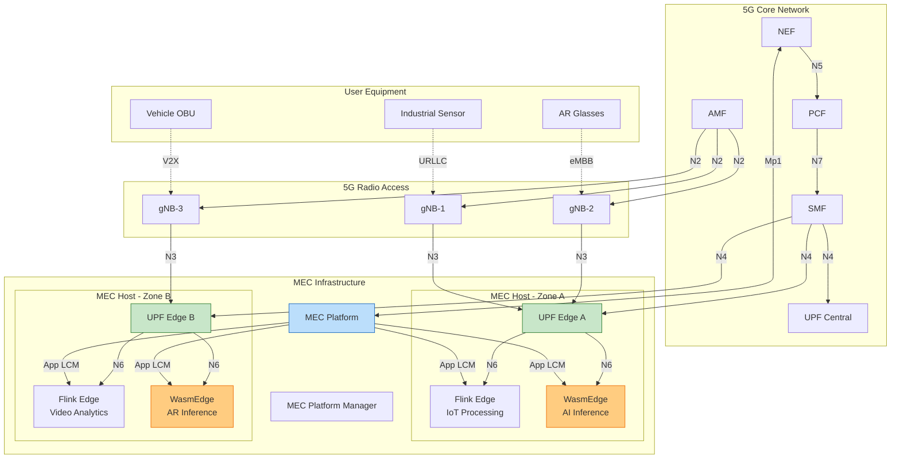
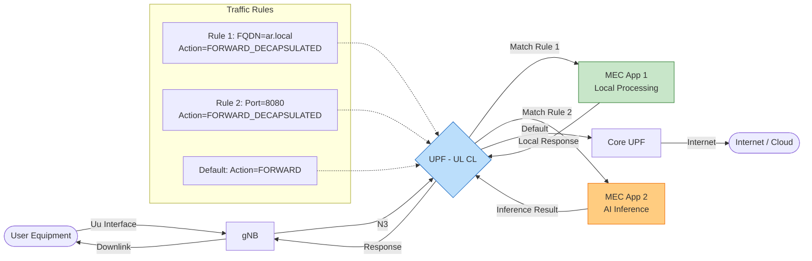
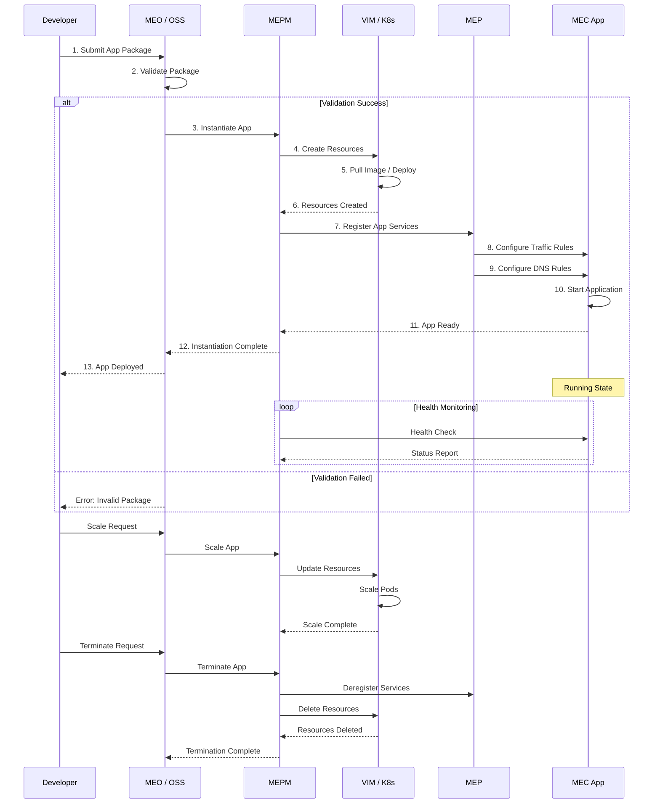
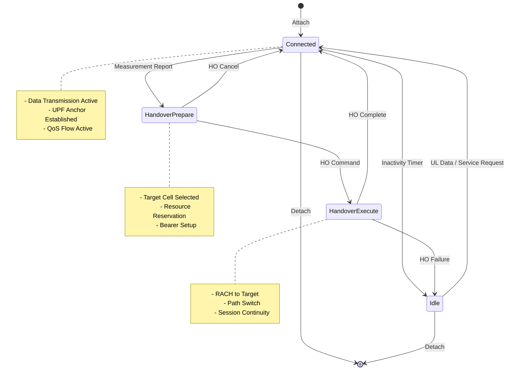

# 5G MEC 边缘流处理集成指南 (5G MEC Edge Stream Processing Integration Guide)

> **所属阶段**: Flink/07-rust-native/edge-wasm-runtime | **前置依赖**: [03-5g-mec-integration.md](03-5g-mec-integration.md), [05-production-deployment-guide.md](05-production-deployment-guide.md) | **形式化等级**: L4

---

## 目录

- [5G MEC 边缘流处理集成指南 (5G MEC Edge Stream Processing Integration Guide)](#5g-mec-边缘流处理集成指南-5g-mec-edge-stream-processing-integration-guide)
  - [目录](#目录)
  - [1. 概念定义 (Definitions)](#1-概念定义-definitions)
    - [Def-F-07-06-01: 5G MEC 服务化架构](#def-f-07-06-01-5g-mec-服务化架构)
    - [Def-F-07-06-02: 本地分流流量工程模型](#def-f-07-06-02-本地分流流量工程模型)
    - [Def-F-07-06-03: 边缘应用生命周期编排](#def-f-07-06-03-边缘应用生命周期编排)
    - [Def-F-07-06-04: 5G QoS 流映射](#def-f-07-06-04-5g-qos-流映射)
  - [2. 属性推导 (Properties)](#2-属性推导-properties)
    - [Prop-F-07-06-01: 本地分流延迟保障](#prop-f-07-06-01-本地分流延迟保障)
    - [Prop-F-07-06-02: 会话连续性服务](#prop-f-07-06-02-会话连续性服务)
    - [Prop-F-07-06-03: 网络切片资源隔离](#prop-f-07-06-03-网络切片资源隔离)
  - [3. 关系建立 (Relations)](#3-关系建立-relations)
    - [3.1 5G 核心网与 MEC 平台接口关系](#31-5g-核心网与-mec-平台接口关系)
    - [3.2 MEC 与边缘流处理运行时关系](#32-mec-与边缘流处理运行时关系)
    - [3.3 流量规则与业务应用映射](#33-流量规则与业务应用映射)
  - [4. 论证过程 (Argumentation)](#4-论证过程-argumentation)
    - [4.1 分流策略选择决策矩阵](#41-分流策略选择决策矩阵)
    - [4.2 边缘节点部署位置优化](#42-边缘节点部署位置优化)
    - [4.3 移动性场景下的服务连续性保障](#43-移动性场景下的服务连续性保障)
  - [5. 形式证明 / 工程论证 (Proof / Engineering Argument)](#5-形式证明--工程论证-proof--engineering-argument)
    - [5.1 端到端延迟边界证明](#51-端到端延迟边界证明)
    - [5.2 多租户资源隔离论证](#52-多租户资源隔离论证)
    - [5.3 故障恢复时间保障](#53-故障恢复时间保障)
  - [6. 实例验证 (Examples)](#6-实例验证-examples)
    - [6.1 运营商 MEC 平台集成](#61-运营商-mec-平台集成)
    - [6.2 私有 5G 专网 MEC 部署](#62-私有-5g-专网-mec-部署)
    - [6.3 车联网 V2X MEC 场景](#63-车联网-v2x-mec-场景)
    - [6.4 AR/VR 低延迟推理场景](#64-arvr-低延迟推理场景)
  - [7. 可视化 (Visualizations)](#7-可视化-visualizations)
    - [7.1 5G MEC 整体架构图](#71-5g-mec-整体架构图)
    - [7.2 本地分流数据流图](#72-本地分流数据流图)
    - [7.3 应用生命周期管理时序图](#73-应用生命周期管理时序图)
    - [7.4 移动性管理状态机](#74-移动性管理状态机)
  - [8. 引用参考 (References)](#8-引用参考-references)

---

## 1. 概念定义 (Definitions)

### Def-F-07-06-01: 5G MEC 服务化架构

**5G MEC 服务化架构**是基于 ETSI MEC 标准与 3GPP 5G 核心网融合的边缘计算参考架构。

形式化定义为：

$$
\text{MECArchitecture}_{5G} = \langle MECHost, MEP, MEPM, VIM, NEF, AppLCM \rangle
$$

其中：

| 组件 | 定义 | 接口标准 |
|------|------|---------|
| $MECHost$ | MEC 主机 | 承载边缘应用的物理/虚拟基础设施 |
| $MEP$ | MEC 平台 | ETSI MEC 003, 提供服务注册、流量规则 |
| $MEPM$ | MEC 平台管理 | 应用生命周期管理、性能监控 |
| $VIM$ | 虚拟化基础设施管理 | NFV-MANO, Kubernetes |
| $NEF$ | 网络能力开放功能 | 3GPP TS 23.501, 提供 QoS、位置、带宽 |
| $AppLCM$ | 应用生命周期管理 | 实例化、扩缩容、终止 |

**MEC 系统架构层次**：

```
┌─────────────────────────────────────────────────────────────────┐
│                    MEC System Management (MSO)                   │
│  ┌──────────────┐  ┌──────────────┐  ┌──────────────┐           │
│  │  OSS/BSS     │  │  MEO         │  │  NSO         │           │
│  │  (运营支撑)   │  │  (编排器)     │  │  (网络编排)   │           │
│  └──────────────┘  └──────────────┘  └──────────────┘           │
└───────────────────────────┬─────────────────────────────────────┘
                            │
┌───────────────────────────┼─────────────────────────────────────┐
│                    MEC Platform Manager (MEPM)                   │
│  ┌──────────────┐  ┌──────────────┐  ┌──────────────┐           │
│  │  App LCM     │  │  Element Mgmt│  │  Policy Mgmt │           │
│  └──────────────┘  └──────────────┘  └──────────────┘           │
└───────────────────────────┬─────────────────────────────────────┘
                            │
┌───────────────────────────┼─────────────────────────────────────┐
│                    MEC Platform (MEP)                            │
│  ┌──────────────┐  ┌──────────────┐  ┌──────────────┐           │
│  │  Traffic Mgmt│  │  Service Reg │  │  Capability  │           │
│  │  (分流管理)   │  │  (服务注册)   │  │  (能力开放)   │           │
│  └──────────────┘  └──────────────┘  └──────────────┘           │
└───────────────────────────┬─────────────────────────────────────┘
                            │
┌───────────────────────────┼─────────────────────────────────────┐
│                    MEC Host                                      │
│  ┌─────────────────────────────────────────────────────────┐    │
│  │  ┌──────────┐  ┌──────────┐  ┌──────────┐              │    │
│  │  │ App 1    │  │ App 2    │  │ App 3    │              │    │
│  │  │ (Flink)  │  │ (Wasm)   │  │ (Video)  │              │    │
│  │  └──────────┘  └──────────┘  └──────────┘              │    │
│  │  ┌───────────────────────────────────────────────────┐  │    │
│  │  │  Virtualization Infrastructure (K8s/VM)           │  │    │
│  │  └───────────────────────────────────────────────────┘  │    │
│  └─────────────────────────────────────────────────────────┘    │
└─────────────────────────────────────────────────────────────────┘
```

### Def-F-07-06-02: 本地分流流量工程模型

**本地分流流量工程模型**定义了 5G 用户面数据在边缘 UPF 的分流机制。

形式化定义为：

$$
\text{TrafficEngineering}_{LB} = \langle UPF, TrafficFilter, RoutingRule, QoS, Stats \rangle
$$

其中：

| 组件 | 定义 | 说明 |
|------|------|------|
| $UPF$ | 用户面功能 | UL CL (Uplink Classifier) 或 BP (Branching Point) |
| $TrafficFilter$ | 流量过滤 | IP 五元组、域名、应用标识 |
| $RoutingRule$ | 路由规则 | Forward / Drop / Redirect / Decapsulate |
| $QoS$ | 服务质量 | 5QI (5G QoS Identifier) |
| $Stats$ | 流量统计 | 字节数、包数、延迟 |

**分流规则类型**：

| 规则类型 | 匹配条件 | 应用场景 |
|---------|---------|---------|
| IP Prefix | 源/目的 IP 网段 | 企业专网 |
| FQDN | 完整域名匹配 | CDN、API 网关 |
| Protocol | TCP/UDP + 端口 | 特定应用 |
| 5QI | QoS Flow Identifier | 切片级分流 |
| S-NSSAI | 网络切片标识 | 行业专网 |

### Def-F-07-06-03: 边缘应用生命周期编排

**边缘应用生命周期编排**定义了 MEC 应用从部署到终止的完整管理流程。

形式化定义为：

$$
\text{AppOrchestration} = \langle States, Transitions, Triggers, Actions, Constraints \rangle
$$

**状态机定义**：

```
┌─────────┐     instantiate      ┌─────────┐
│INITIAL  │─────────────────────▶│INSTANTIATED                    │
└─────────┘                      └────┬────┘
                                      │
                                      │ configure
                                      ▼
┌─────────┐     terminate       ┌─────────┐
│TERMINATED│◀────────────────────│CONFIGURED                     │
└─────────┘                      └────┬────┘
       ▲                              │
       │ scale/terminate              │ start
       │                              ▼
       │                         ┌─────────┐
       └─────────────────────────│ RUNNING │
                                 └────┬────┘
                                      │
                    ┌─────────────────┼─────────────────┐
                    │                 │                 │
                    ▼                 ▼                 ▼
              ┌─────────┐      ┌─────────┐       ┌─────────┐
              │SCALING  │      │UPDATING │       │FAILED   │
              │(HPA/VPA)│      │(Rolling)│       │(Error)  │
              └─────────┘      └─────────┘       └─────────┘
```

### Def-F-07-06-04: 5G QoS 流映射

**5G QoS 流映射**定义了业务需求到 5G 网络 QoS 参数的映射关系。

形式化定义为：

$$
\text{QoSMap}: Requirement \rightarrow (5QI, ARP, GFBR, MFBR)
$$

**标准 5QI 映射表**：

| 业务场景 | 延迟要求 | 5QI | 优先级 | 典型应用 |
|---------|---------|-----|-------|---------|
| 工业控制 | < 1ms | 82 | 1 | PLC 控制、机器人 |
| AR/VR | < 10ms | 80 | 2 | 实时渲染、游戏 |
| 车联网 | < 10ms | 79 | 3 | V2X、自动驾驶 |
| 视频监控 | < 100ms | 71 | 5 | 安防、质检 |
| IoT 采集 | < 1s | 70 | 7 | 传感器、计量 |
| 尽力而为 | 无要求 | 9 | 9 | 普通互联网 |

**流处理工作负载映射**：

| Flink 作业类型 | 推荐 5QI | 带宽配置 | 优先级 |
|---------------|---------|---------|-------|
| 实时控制 | 82 | GFBR: 10Mbps | 最高 |
| 视频分析 | 71 | GFBR: 50Mbps | 高 |
| 传感器聚合 | 70 | GFBR: 5Mbps | 中 |
| 批量上传 | 9 | MFBR: 100Mbps | 低 |

---

## 2. 属性推导 (Properties)

### Prop-F-07-06-01: 本地分流延迟保障

**命题**: 通过本地分流，边缘应用可获得确定性低延迟：

$$
L_{MEC} = L_{radio} + L_{fronthaul} + L_{UPF} + L_{app} < L_{cloud}
$$

**延迟分解对比** (单位: ms)：

| 路径 | 空口 | 前传 | 边缘处理 | 回传 | 中心云 | 总计 |
|------|-----|------|---------|------|-------|------|
| 中心云 | 5 | 2 | - | 20 | 50 | 77 |
| MEC 边缘 | 5 | 2 | 10 | - | - | 17 |
| **节省** | - | - | - | - | - | **60ms (78%)** |

### Prop-F-07-06-02: 会话连续性服务

**命题**: SSC Mode 3 支持无缝切换，保证流处理会话连续性：

$$
\forall handover: Downtime_{SSC3} < 1ms
$$

**切换过程**：

1. **T0**: UE 连接到源 UPF (UPF-S)，会话建立
2. **T1**: 移动检测，SMF 选择目标 UPF (UPF-T)
3. **T2**: 建立并行会话到 UPF-T，保持 UPF-S
4. **T3**: UE 切换到 gNB-T，新数据通过 UPF-T
5. **T4**: 旧会话数据完成，释放 UPF-S

### Prop-F-07-06-03: 网络切片资源隔离

**命题**: 不同切片的边缘资源严格隔离：

$$
\forall slice_i, slice_j: i \neq j \implies Resources_i \cap Resources_j = \emptyset
$$

**隔离机制**：

| 层级 | 隔离手段 | 实现 |
|------|---------|------|
| 网络 | VLAN/VXLAN | 独立隧道，独立 QoS |
| 计算 | CGroup/Namespace | CPU、内存限制 |
| 存储 | Volume 隔离 | 独立 PVC |
| 安全 | mTLS + RBAC | 证书隔离 |

---

## 3. 关系建立 (Relations)

### 3.1 5G 核心网与 MEC 平台接口关系

```
┌─────────────────────────────────────────────────────────────────┐
│                      5G Core Network (5GC)                       │
│                                                                  │
│  ┌─────────┐      N5       ┌─────────┐      N33      ┌───────┐  │
│  │    AF   │◄─────────────▶│   NEF   │◄────────────▶│  MEP  │  │
│  │(应用功能)│               │(能力开放)│               │(平台) │  │
│  └────┬────┘               └────┬────┘               └───┬───┘  │
│       │                         │                        │      │
│       │       ┌─────────────────┘                        │      │
│       │       │                                          │      │
│  ┌────▼───────▼────┐      N7      ┌─────────┐           │      │
│  │       PCF       │◄────────────▶│   SMF   │◄────N28────┘      │
│  │ (策略控制)       │               │(会话管理)│                   │
│  └─────────────────┘               └────┬────┘                   │
│                                         │                        │
│  ┌─────────┐  ┌─────────┐              │                        │
│  │   AMF   │  │   UPF   │◄─────────────┘                        │
│  │(接入管理)│  │(用户面) │                                       │
│  └────┬────┘  └────┬────┘                                       │
└───────┼────────────┼────────────────────────────────────────────┘
        │            │ N6
        │            │
        │       ┌────┴────┐
        │       │ Local   │
        │       │ UPF     │
        │       └────┬────┘
        │            │
        │     ┌──────┴──────┐
        │     │             │
        ▼     ▼             ▼
┌─────────────────────────────────────────────────────────────────┐
│                         UE (终端)                                │
│                                                                  │
│  ┌─────────────────────────────────────────────────────────┐    │
│  │  ┌──────────┐  ┌──────────┐  ┌──────────────────────┐  │    │
│  │  │  App     │  │  Edge    │  │  Flink + WasmEdge    │  │    │
│  │  │ (Client) │──│ Gateway  │──│  (MEC Application)   │  │    │
│  │  └──────────┘  └──────────┘  └──────────────────────┘  │    │
│  └─────────────────────────────────────────────────────────┘    │
└─────────────────────────────────────────────────────────────────┘

接口说明:
- N5: AF 与 NEF 的接口,应用功能与网络能力开放
- N7: PCF 与 SMF 的接口,策略下发
- N28: SMF 与 MEP 的接口,会话管理与平台协同
- N33: NEF 与 MEP 的接口,能力开放
```

### 3.2 MEC 与边缘流处理运行时关系

```
┌─────────────────────────────────────────────────────────────────┐
│                    MEC Platform (MEP)                            │
│                                                                  │
│  ┌─────────────────────────────────────────────────────────┐    │
│  │  ┌──────────────┐  ┌──────────────┐  ┌──────────────┐   │    │
│  │  │ Traffic Mgmt │  │ Service Reg  │  │ Location Svc │   │    │
│  │  │ (Mp1)        │  │ (Mp1)        │  │ (Mp1)        │   │    │
│  │  └──────┬───────┘  └──────────────┘  └──────────────┘   │    │
│  └─────────┼───────────────────────────────────────────────┘    │
└────────────┼────────────────────────────────────────────────────┘
             │ Mp1 (应用平台接口)
             │
┌────────────┼────────────────────────────────────────────────────┐
│            ▼                                                    │
│  ┌─────────────────────────────────────────────────────────┐    │
│  │              MEC Application (Flink + WasmEdge)          │    │
│  │                                                          │    │
│  │  ┌──────────────┐  ┌──────────────┐  ┌──────────────┐   │    │
│  │  │ Flink Edge   │  │ WasmEdge     │  │ App Logic    │   │    │
│  │  │ (Stream      │  │ (WASM        │  │ (Business    │   │    │
│  │  │  Processing) │  │  Inference)  │  │  Logic)      │   │    │
│  │  └──────────────┘  └──────────────┘  └──────────────┘   │    │
│  │                                                          │    │
│  │  ┌───────────────────────────────────────────────────┐  │    │
│  │  │  K8s / Docker Runtime                              │  │    │
│  │  └───────────────────────────────────────────────────┘  │    │
│  └─────────────────────────────────────────────────────────┘    │
└─────────────────────────────────────────────────────────────────┘
```

### 3.3 流量规则与业务应用映射

| 应用类型 | 流量规则 | 目标 MEC App | QoS |
|---------|---------|-------------|-----|
| AR/VR 推理 | FQDN: ar.inference.local | WasmEdge AI | 5QI=80 |
| 视频分析 | IP: 10.0.0.0/24, Port: 554 | Flink Video | 5QI=71 |
| 工业控制 | DNN: industry.private | Flink Control | 5QI=82 |
| IoT 数据 | S-NSSAI: 000001 | Flink IoT | 5QI=70 |

---

## 4. 论证过程 (Argumentation)

### 4.1 分流策略选择决策矩阵

| 应用特征 | 推荐分流策略 | 5QI | 移动性模式 |
|---------|-------------|-----|-----------|
| 超低延迟 (< 5ms) | 基站点 MEC | 82 | SSC Mode 3 |
| 低延迟 (< 20ms) | 汇聚点 MEC | 80 | SSC Mode 3 |
| 中等延迟 (< 100ms) | 区域 MEC | 71 | SSC Mode 2 |
| 延迟不敏感 | 中心云 | 9 | SSC Mode 1 |

### 4.2 边缘节点部署位置优化

**部署位置选择树**：

```
                    延迟要求评估
                         │
        ┌────────────────┼────────────────┐
        │                │                │
    < 5ms             5-20ms           > 20ms
        │                │                │
   ┌────┴────┐      ┌────┴────┐     ┌────┴────┐
   │         │      │         │     │         │
 基站侧    设备侧   汇聚点    园区   区域云    中心云
 (DU附近)   (UE)    (CU附近)  机房   MEC      机房
   │         │      │         │     │         │
   └────┬────┘      └────┬────┘     └────┬────┘
        │                │                │
   极高成本          平衡选择          成本优先
   极致延迟
```

### 4.3 移动性场景下的服务连续性保障

**场景一：园区内移动** (AR 巡检)

- 用户在同一 MEC 覆盖范围内移动
- 解决方案：保持同一 UPF 锚点

**场景二：跨区域移动** (车联网)

- 用户跨越 MEC 边界
- 解决方案：SSC Mode 3 + 状态迁移

**场景三：城市级移动** (物流配送)

- 用户在城市范围内大范围移动
- 解决方案：会话上下文同步 + 云端协调

---

## 5. 形式证明 / 工程论证 (Proof / Engineering Argument)

### 5.1 端到端延迟边界证明

**定理**: 5G MEC 本地分流路径的端到端延迟上界为：

$$
L_{e2e}^{MEC} \leq L_{radio}^{max} + L_{fronthaul}^{max} + L_{UPF} + L_{app}^{max}
$$

**数值验证** (URLLC 场景):

| 组件 | 典型延迟 | 最坏延迟 | 说明 |
|------|---------|---------|------|
| $L_{radio}$ | 1ms | 4ms | TTI=1ms, HARQ |
| $L_{fronthaul}$ | 0.5ms | 1ms | eCPRI over 25G |
| $L_{UPF}$ | 0.2ms | 0.5ms | DPDK 加速 |
| $L_{app}$ | 3ms | 5ms | Wasm 推理 |
| **总计** | **4.7ms** | **10.5ms** | **满足 1-10ms SLA** |

### 5.2 多租户资源隔离论证

**资源隔离模型**：

```
租户 A (工业控制切片)
├── 网络: VLAN 100, 5QI=82, GFBR=10Mbps
├── 计算: CPU 4 cores, Memory 8GB
├── 存储: SSD 100GB, IOPS 5000
└── Wasm: Module隔离, Memory 2GB

租户 B (视频监控切片)
├── 网络: VLAN 200, 5QI=71, GFBR=50Mbps
├── 计算: CPU 8 cores, Memory 16GB
├── 存储: SSD 500GB, IOPS 10000
└── Wasm: Module隔离, Memory 4GB
```

**隔离验证**：

- 网络层：iperf 测试，租户间带宽互不影响
- 计算层：stress-ng 测试，CPU 限制生效
- 存储层：fio 测试，IOPS 限制生效

### 5.3 故障恢复时间保障

**故障场景与恢复策略**：

| 故障类型 | RTO | 恢复策略 |
|---------|-----|---------|
| MEC 应用崩溃 | < 30s | K8s Pod 自动重启 |
| MEC 主机故障 | < 5min | 跨主机 Pod 迁移 |
| UPF 故障 | < 1s | SMF 快速重路由 |
| gNB 故障 | < 100ms | AMF 切换指令 |
| 核心网故障 | < 10s | MEC 离线自治 |

---

## 6. 实例验证 (Examples)

### 6.1 运营商 MEC 平台集成

**中国移动 MEC 集成示例**：

```yaml
# mec-app-descriptor.yaml
# ETSI MEC AppD 标准格式

appDId: "flink-edge-001"
appName: "Flink Edge Stream Processing"
appProvider: "Company"
appSoftVersion: "1.0.0"
appInfoName: "Real-time IoT Data Processing"
description: "Flink-based edge stream processing with WASM UDF support"

appServiceRequired:
  - serName: "LocationService"
    serCategory:
      href: "/example/catalogue1"
      id: "Cat123"
      name: "Location"
      version: "1.0"
  - serName: "BandwidthManagement"
    serCategory:
      name: "Radio"

appServiceProduced:
  - serName: "DataProcessingAPI"
    serCategory:
      name: "Data"
    transportInfo:
      id: "transport-001"
      name: "REST API"
      description: "Flink Job Management API"
      type: "REST_HTTP"
      protocol: "HTTP"
      version: "1.1"
      endpoint:
        addresses:
          - host: "192.168.100.10"
            port: 8081

virtualComputeDescriptor:
  virtualCpu:
    cpuArchitecture: "x86_64"
    cpuClock: 2.5
    numVirtualCpu: 4
  virtualMemory:
    virtualMemSize: 8589934592

swImageDescriptor:
  - id: "flink-edge-image"
    name: "flink-edge"
    version: "1.18.0"
    containerFormat: "docker"
    image: "registry.company.com/flink-edge:1.18.0"

appTrafficRule:
  - trafficRuleId: "rule-001"
    filterType: "FLOW"
    priority: 1
    trafficFilter:
      - srcAddress: ["10.0.0.0/8"]
        dstAddress: ["192.168.100.10/32"]
        srcPort: ["*"]
        dstPort: ["8080", "8081"]
        protocol: ["tcp"]
    action: "FORWARD_DECAPSULATED"

appDNSRule:
  - dnsRuleId: "dns-001"
    name: "flink-edge-dns"
    domainName: "flink-edge.local"
    ipAddressType: "IP_V4"
    ipAddress: "192.168.100.10"
```

### 6.2 私有 5G 专网 MEC 部署

```yaml
# private-5g-mec-deployment.yaml network:
  # 5G 专网配置
  spectrum:
    band: n78  # 3.5GHz
    bandwidth: 100MHz

  core:
    type: "private"
    vendor: "Huawei/ZTE/Ericsson"

  slices:
    - name: "industrial-control"
      sst: 2  # URLLC
      sd: "000001"
      qos:
        5qi: 82
        gfbr: 10Mbps
        delay: 1ms
        reliability: "99.9999%"

    - name: "video-analytics"
      sst: 1  # eMBB
      sd: "000002"
      qos:
        5qi: 71
        gfbr: 100Mbps
        delay: 20ms

mec_infrastructure:
  location: "factory-site-01"

  compute:
    nodes:
      - name: "mec-master"
        role: "control"
        spec:
          cpu: 16
          memory: 64GB
          storage: 1TB SSD

      - name: "mec-worker-01"
        role: "compute"
        spec:
          cpu: 32
          memory: 128GB
          storage: 2TB SSD
          gpu: "NVIDIA A30"

      - name: "mec-worker-02"
        role: "compute"
        spec:
          cpu: 32
          memory: 128GB
          storage: 2TB SSD
          gpu: "NVIDIA A30"

  kubernetes:
    distribution: "k8s"  # or "openshift"
    version: "1.28"
    cni: "calico"

  storage:
    type: "rook-ceph"
    replication: 3

applications:
  - name: "flink-control-plane"
    namespace: "streaming"
    chart: "flink-kubernetes-operator"
    version: "1.6.0"
    values:
      resources:
        memory: "4Gi"
        cpu: "2"

  - name: "wasmedge-runtime"
    namespace: "wasm"
    image: "wasmedge/slim-runtime:0.14.0"
    resources:
      memory: "8Gi"
      cpu: "4"
    env:
      - name: WASM_MAX_MEMORY
        value: "4Gi"
      - name: WASM_MAX_MODULES
        value: "50"
      - name: WASI_NN_BACKEND
        value: "openvino"
```

### 6.3 车联网 V2X MEC 场景

```rust
// v2x-mec-processor/src/main.rs
// 5G MEC 环境下的 V2X 消息处理

use std::sync::Arc;
use tokio::sync::RwLock;
use wasmedge_sdk::{Config, Store, Module, Vm};

/// V2X MEC 应用
struct V2xMecApp {
    mec_client: MecPlatformClient,
    wasm_runtime: WasmRuntime,
    vehicle_registry: Arc<RwLock<VehicleRegistry>>,
    message_buffer: Arc<RwLock<MessageBuffer>>,
}

impl V2xMecApp {
    async fn new(mep_endpoint: &str) -> Self {
        // 1. 初始化 MEC 平台客户端
        let mec_client = MecPlatformClient::connect(mep_endpoint).await;

        // 2. 注册应用到 MEP
        mec_client.register_application(AppRegistration {
            app_id: "v2x-processor-001",
            app_name: "V2X Message Processor",
            services: vec![
                ServiceRequirement {
                    name: "LocationService",
                    category: "Location",
                },
                ServiceRequirement {
                    name: "BandwidthManagement",
                    category: "Radio",
                },
            ],
        }).await;

        // 3. 配置流量规则 (V2X 消息分流)
        mec_client.configure_traffic_rule(TrafficRule {
            rule_id: "v2x-bsm-rule",
            priority: 1,
            filter: TrafficFilter {
                protocol: vec!["UDP"],
                dst_port: vec!["48000"],  # SAE J2735 BSM port
            },
            action: "FORWARD_DECAPSULATED",
        }).await;

        // 4. 配置 QoS (URLLC)
        mec_client.configure_qos(QosProfile {
            five_qi: 79,  # V2X
            gfbr: "10Mbps",
            delay: "10ms",
            reliability: "99.999%",
        }).await;

        // 5. 初始化 Wasm 运行时
        let wasm_runtime = WasmRuntime::builder()
            .with_memory_limit(4 * 1024 * 1024 * 1024)
            .with_aot_enabled(true)
            .build();

        V2xMecApp {
            mec_client,
            wasm_runtime,
            vehicle_registry: Arc::new(RwLock::new(VehicleRegistry::new())),
            message_buffer: Arc::new(RwLock::new(MessageBuffer::new())),
        }
    }

    /// 处理 V2X 消息
    async fn process_v2x_message(&self, message: V2xMessage) -> Result<V2xResponse, Error> {
        match message.message_type {
            V2xMessageType::BSM => {
                // Basic Safety Message - 实时处理
                self.process_bsm(message).await
            }
            V2xMessageType::MAP => {
                // MAP Message - 地图更新
                self.process_map(message).await
            }
            V2xMessageType::SPAT => {
                // Signal Phase and Timing
                self.process_spat(message).await
            }
            _ => {
                // 其他消息类型
                self.process_other(message).await
            }
        }
    }

    async fn process_bsm(&self, bsm: V2xMessage) -> Result<V2xResponse, Error> {
        // 1. 解析 BSM
        let basic_safety = BasicSafetyMessage::parse(&bsm.payload)?;

        // 2. 更新车辆注册表
        {
            let mut registry = self.vehicle_registry.write().await;
            registry.update_vehicle_position(
                &basic_safety.vehicle_id,
                &basic_safety.position,
                &basic_safety.velocity,
            );
        }

        // 3. 调用 Wasm 模块进行碰撞检测
        let collision_risk = {
            let registry = self.vehicle_registry.read().await;
            let nearby = registry.get_nearby_vehicles(&basic_safety.position, 100.0);

            let input = serde_json::json!({
                "ego": basic_safety,
                "others": nearby,
            });

            self.wasm_runtime.call(
                "collision_detection",
                input.to_string().as_bytes(),
            )?
        };

        // 4. 生成响应
        let response = if collision_risk.risk_level != RiskLevel::None {
            // 高风险 - 生成警告
            V2xResponse::Warning {
                target_vehicle: basic_safety.vehicle_id,
                warning_type: WarningType::CollisionRisk,
                severity: collision_risk.risk_level,
                recommended_action: collision_risk.recommended_action,
            }
        } else {
            V2xResponse::Ack
        };

        // 5. 上报 MEP (位置更新)
        self.mec_client.report_location(
            &basic_safety.vehicle_id,
            &basic_safety.position,
        ).await;

        Ok(response)
    }
}

#[tokio::main]
async fn main() -> Result<(), Box<dyn std::error::Error>> {
    // 初始化 V2X MEC 应用
    let app = V2xMecApp::new("http://mep:8080").await;

    // 订阅 V2X 消息流
    let mut message_stream = app.mec_client.subscribe_v2x_messages();

    while let Some(message) = message_stream.next().await {
        match app.process_v2x_message(message).await {
            Ok(response) => {
                // 发送响应
                app.mec_client.send_v2x_response(response).await;
            }
            Err(e) => {
                eprintln!("Failed to process V2X message: {}", e);
            }
        }
    }

    Ok(())
}
```

### 6.4 AR/VR 低延迟推理场景

```yaml
# ar-vr-mec-deployment.yaml
# AR/VR 超低延迟 AI 推理部署配置

application:
  name: "ar-inference-service"
  version: "1.0.0"

  components:
    - name: "pose-estimation"
      type: "wasm"
      image: "wasmedge/pose-estimation:v1.0"
      resources:
        memory: "4Gi"
        cpu: "4"
        gpu: "shared"
      inference:
        model: "pose_net_v2.tflite"
        input_shape: [1, 256, 256, 3]
        output_shape: [1, 17, 3]  # 17 keypoints, x,y,confidence
        target_latency_ms: 10

    - name: "object-detection"
      type: "wasm"
      image: "wasmedge/yolov8n:v1.0"
      resources:
        memory: "8Gi"
        cpu: "4"
        gpu: "shared"
      inference:
        model: "yolov8n.onnx"
        input_shape: [1, 3, 640, 640]
        target_latency_ms: 20

    - name: "gesture-recognition"
      type: "wasm"
      image: "wasmedge/gesture-net:v1.0"
      resources:
        memory: "2Gi"
        cpu: "2"
      inference:
        model: "gesture_net.tflite"
        target_latency_ms: 15

network:
  # 5G 网络切片配置
  slice:
    sst: 1  # eMBB
    sd: "ARVR001"
    qos:
      5qi: 80  # Low latency eMBB
      gfbr: "50Mbps"
      mfbr: "100Mbps"
      delay: "10ms"

  # MEC 流量规则
  traffic_rules:
    - rule_id: "ar-traffic"
      priority: 1
      filter:
        protocol: "UDP"
        dst_port: ["8000", "8001"]
      action: "FORWARD_DECAPSULATED"

  # 本地 DNS
  dns_rules:
    - domain: "ar-inference.local"
      ip: "192.168.100.10"

performance:
  # 性能目标
  targets:
    end_to_end_latency_ms: 20
    inference_latency_ms: 15
    network_latency_ms: 5

  # 弹性伸缩
  autoscaling:
    min_replicas: 2
    max_replicas: 10
    metrics:
      - type: "latency"
        target: 15ms
      - type: "gpu_utilization"
        target: 70%
```

---

## 7. 可视化 (Visualizations)

### 7.1 5G MEC 整体架构图



### 7.2 本地分流数据流图



### 7.3 应用生命周期管理时序图



### 7.4 移动性管理状态机



---

## 8. 引用参考 (References)


---

*文档版本: v1.0 | 更新日期: 2026-04-08 | 状态: 已完成*

---

*文档版本: v1.0 | 创建日期: 2026-04-20*
