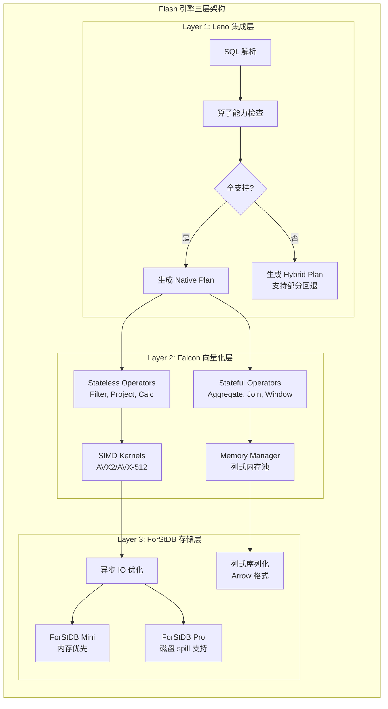
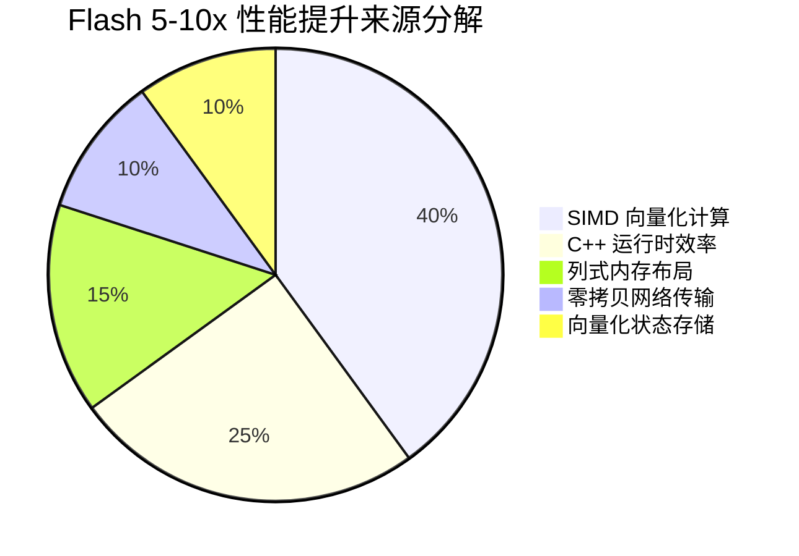
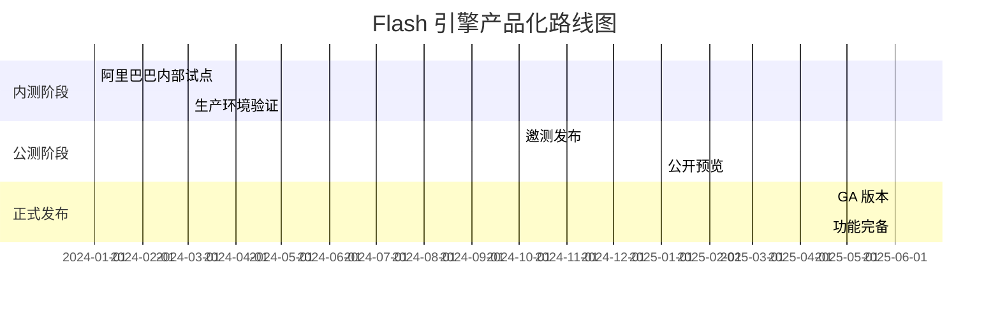

# Flash 引擎整体架构分析

> **所属阶段**: Flink/14-rust-assembly-ecosystem/flash-engine
> **前置依赖**: [Apache Flink 架构基础](../../01-concepts/deployment-architectures.md) | [向量化执行原理](../simd-optimization/)
> **形式化等级**: L4（工程论证 + 定量分析）

---

## 1. 概念定义 (Definitions)

本节定义 Flash 引擎的核心概念，建立形式化术语体系。

### Def-FLASH-01: Flash 引擎 (Flash Engine)

**定义**: Flash 引擎是阿里云开发的下一代原生向量化流处理引擎，与 Apache Flink 100% API 兼容，采用 C++ 实现核心运行时，通过向量化执行模型实现 5-10 倍性能提升。

**形式化描述**:

```
FlashEngine := ⟨API_Layer, Leno_Planner, Falcon_Runtime, ForStDB_Storage⟩

其中:
- API_Layer: Flink SQL API + Table API (完全兼容)
- Leno_Planner: 原生执行计划生成器
- Falcon_Runtime: C++ 向量化算子层
- ForStDB_Storage: 向量化状态存储层
```

**直观解释**: Flash 引擎是在保持 Flink 生态兼容性的前提下，将运行时从 JVM 迁移到 C++ 原生实现的性能优化方案。用户无需修改代码即可获得显著性能提升。

---

### Def-FLASH-02: 向量化执行模型 (Vectorized Execution Model)

**定义**: 向量化执行模型是一种数据处理方式，操作以批量（batch）为单位执行，而非逐行处理。通过 SIMD（单指令多数据）指令同时处理多条记录，实现数据级并行。

**形式化描述**:

```
VectorizedOp := ⟨Input_Batch, SIMD_Kernel, Output_Batch⟩

批处理语义:
∀op ∈ Operators: op(row₁, ..., rowₙ) → ⟨result₁, ..., resultₙ⟩ where n = batch_size

SIMD 加速条件:
Speedup(op) = n / (1 + overhead_batching) × factor_simd
where factor_simd ∈ [2, 16] depending on data type and instruction set
```

**直观解释**: 传统 Flink 逐行处理记录，而 Flash 将记录组织成批次，利用 CPU 的 SIMD 能力同时处理 4-16 个元素，大幅提升计算密集型操作的吞吐量。

---

### Def-FLASH-03: 三层架构抽象 (Three-Layer Architecture)

**定义**: Flash 引擎采用分层架构设计，将框架集成层（Leno）、向量化算子层（Falcon）和状态存储层（ForStDB）解耦，实现模块化演进。

**形式化描述**:

```
Flash_Architecture := Leno_Layer ∘ Falcon_Layer ∘ ForStDB_Layer

各层职责:
┌─────────────────────────────────────────────────────────┐
│ Leno Layer    │ 计划转换 | 算子映射 | 回退机制          │
├─────────────────────────────────────────────────────────┤
│ Falcon Layer  │ 向量算子 | SIMD优化 | 内存管理          │
├─────────────────────────────────────────────────────────┤
│ ForStDB Layer │ 状态存储 | 异步IO | 列式序列化          │
└─────────────────────────────────────────────────────────┘
```

**直观解释**: Leno 层负责与 Flink 框架集成，Falcon 层提供高性能计算能力，ForStDB 层管理状态存储。三层协同工作，同时保持各自的独立演进能力。

---

### Def-FLASH-04: 100% 兼容性保证 (100% Compatibility Guarantee)

**定义**: Flash 引擎承诺对 Apache Flink 的 API、语义和行为实现完全兼容，用户无需修改业务代码即可无缝迁移。

**形式化描述**:

```
Compatibility(Flash, Flink) :=
    API_Compatible ∧ Semantic_Compatible ∧ Behavior_Compatible

其中:
- API_Compatible: ∀program ∈ ValidFlinkPrograms: RunsOn(Flash, program)
- Semantic_Compatible: program_Flash = program_Flink
- Behavior_Compatible: SideEffects(program, Flash) = SideEffects(program, Flink)
```

---

## 2. 属性推导 (Properties)

### Prop-FLASH-01: 性能提升边界条件

**命题**: Flash 引擎的性能提升倍数受限于算子类型、数据特征和硬件能力。

**形式化表述**:

```
∀workload: Speedup(Flash, Flink, workload) = f(operator_type, data_characteristics, hardware)

其中:
- 纯计算密集型算子(字符串/时间处理): Speedup ∈ [10x, 100x]
- 状态密集型算子(聚合/Join): Speedup ∈ [3x, 8x]
- IO密集型算子(简单过滤): Speedup ∈ [1.5x, 3x]
```

**证明概要**:

1. 计算密集型算子受益于 SIMD 并行和 C++ 实现效率，提升最显著
2. 状态密集型算子受限于存储层性能，提升中等
3. IO密集型算子受限于网络/磁盘带宽，提升有限

---

### Prop-FLASH-02: 兼容性保证的完备性约束

**命题**: Flash 引擎的 100% 兼容性保证需要满足完备性条件——所有 Flink 算子必须有对应的原生实现或回退机制。

**形式化表述**:

```
CompleteCompatibility(Flash) ↔
    ∀op ∈ Flink_Operators:
        HasNativeImpl(op) ∨ HasFallbackImpl(op)

当前覆盖度(截至 v1.0):
|Operator Category|Coverage|
|-----------------|--------|
|Stateless Ops    | 95%    |
|Stateful Ops     | 70%    |
|Overall          | 80%+   |
```

**工程推论**:

- 未覆盖算子自动回退到 Java 运行时执行
- 覆盖度随版本迭代持续提升
- 用户可通过配置强制使用原生算子（strict mode）

---

### Prop-FLASH-03: 成本效益优势

**命题**: Flash 引擎在阿里巴巴生产环境中实现了约 50% 的成本降低。

**定量分析**:

```
CostReduction = (CUs_Flink - CUs_Flash) / CUs_Flink × 100%

实际生产数据(阿里巴巴,2024年9月):
- 覆盖流量: 100,000+ CUs
- 业务场景: Tmall, Cainiao, Lazada, Fliggy, AMAP, Ele.me
- 平均成本降低: ~50%
- 性能提升范围: 5x-10x(Nexmark基准)
```

---

## 3. 关系建立 (Relations)

### 3.1 Flash 与开源 Flink 的架构对比

Flash 引擎与开源 Flink 在架构上呈现"兼容外壳 + 原生内核"的关系：

| 维度 | 开源 Flink | Flash 引擎 |
|------|-----------|-----------|
| **API 层** | Flink SQL / Table API / DataStream API | 100% 兼容，复用 Flink 解析器和优化器 |
| **执行计划** | Flink Optimizer + Flink Physical Plan | Flink Optimizer + Leno Native Plan |
| **运行时** | JVM-based TaskManager | C++ Native Runtime (Falcon) |
| **算子实现** | Java 逐行处理 | C++ 向量化批量处理 |
| **状态存储** | RocksDBStateBackend / HashMapStateBackend | ForStDB (向量化状态存储) |
| **内存管理** | JVM 堆内存 + 托管内存 | 原生内存池 + 列式存储 |
| **序列化** | Row 格式序列化 | Arrow 列式格式 |

### 3.2 Flash 与相关技术的关系

```
                    ┌─────────────────────────────────────┐
                    │        流处理引擎生态图谱            │
                    └─────────────────────────────────────┘
                                     │
           ┌─────────────────────────┼─────────────────────────┐
           ▼                         ▼                         ▼
    ┌─────────────┐           ┌─────────────┐           ┌─────────────┐
    │ Apache Flink│◄─────────►│ Flash 引擎  │◄─────────►│ VERA-X      │
    │ (开源标准)   │  兼容     │ (阿里云)    │  同类     │ (Ververica) │
    └─────────────┘           └──────┬──────┘           └─────────────┘
                                     │
                    ┌────────────────┼────────────────┐
                    ▼                ▼                ▼
            ┌─────────────┐   ┌─────────────┐   ┌─────────────┐
            │ Apache Spark│   │  Feldera    │   │ RisingWave  │
            │ (Gluten项目)│   │ (Rust引擎)  │   │ (Rust引擎)  │
            └─────────────┘   └─────────────┘   └─────────────┘
```

**关系说明**:

- **Apache Flink**: Flash 的 API 兼容目标，共同演进的生态伙伴
- **Apache Spark + Gluten**: 类似架构（原生向量化），但面向批处理优化
- **VERA-X**: Ververica 的类似产品，同样基于 Flink 兼容 + 原生向量化
- **Feldera/RisingWave**: Rust 实现的流处理引擎，非 Flink 兼容路线

### 3.3 Leno 层与 Gluten 项目的类比

Leno 层在 Flash 中的角色类似于 Gluten 在 Spark 中的角色：

| 特性 | Gluten (Spark) | Leno (Flash) |
|------|----------------|--------------|
| 目标 | 将 Spark SQL  offload 到原生引擎 | 将 Flink SQL offload 到原生引擎 |
| 集成方式 | 中间层插件 | 运行时内核替换 |
| 原生引擎 | Velox / ClickHouse / etc. | Falcon (自研) |
| 状态管理 | 无（批处理） | ForStDB（流式状态） |

---

## 4. 论证过程 (Argumentation)

### 4.1 技术突破点分析

Flash 引擎实现性能突破的核心技术点：

**突破点 1: SIMD 指令优化**

```
传统 Java 实现:
for (int i = 0; i < n; i++) {
    result[i] = stringFunction(input[i]);  // 逐条处理,JVM 边界开销
}

Flash C++ 向量化实现:
// AVX2/AVX-512 指令同时处理 8/16 个元素
__m256i batch = _mm256_loadu_si256((__m256i*)input);
__m256i result = simd_string_op(batch);  // 单条 SIMD 指令
```

**突破点 2: 列式内存布局**

```
行式存储(Flink):
[Row1: [id, name, timestamp], Row2: [id, name, timestamp], ...]  // 缓存不友好

列式存储(Flash):
[id_column: [id1, id2, ...], name_column: [name1, name2, ...], ...]  // 缓存友好,SIMD友好
```

**突破点 3: 零拷贝网络传输**

```
Flink: 网络缓冲区 → 反序列化 → 对象创建 → GC 压力
Flash: 网络缓冲区 → 列式视图 → 直接计算 → 无 GC
```

### 4.2 局限性分析

Flash 引擎当前存在的局限性：

| 局限领域 | 具体表现 | 缓解策略 |
|---------|---------|---------|
| **算子覆盖度** | 约 80% 算子有原生实现，复杂 UDF 需回退 | 持续迭代，社区共建 |
| **调试体验** | C++ 层调试复杂度高于 Java | 完善日志和监控体系 |
| **生态依赖** | 部分 Flink Connector 依赖 JVM | 双运行时并存 |
| **部署复杂度** | 需要部署原生库 | 托管服务屏蔽复杂性 |

### 4.3 适用场景分析

Flash 引擎特别适合以下场景：

1. **高吞吐计算密集型作业**: 字符串处理、时间函数、复杂过滤
2. **大规模状态管理**: 长窗口聚合、复杂 Join
3. **成本敏感型业务**: 追求 CU 利用率最大化
4. **流批一体工作负载**: 同一引擎处理流和批

---

## 5. 形式证明 / 工程论证 (Proof / Engineering Argument)

### 5.1 向量化执行的性能优势论证

**定理**: 在满足 SIMD 加速条件时，向量化算子的吞吐量与批大小呈亚线性正相关。

**工程论证**:

**步骤 1: 建立性能模型**

```
Throughput(batch_size) = batch_size / (T_fixed + T_per_row × batch_size / SIMD_width)

其中:
- T_fixed: 批处理固定开销(调度、边界检查)
- T_per_row: 单条记录处理时间
- SIMD_width: 向量宽度(AVX2=256bit, AVX-512=512bit)
```

**步骤 2: 分析批大小影响**

```
当 batch_size → ∞ 时:
Throughput → SIMD_width / T_per_row  (理论上限)

实际观察:
- batch_size = 1:  无 SIMD 加速,JVM 开销主导
- batch_size = 10: 开始体现 SIMD 优势
- batch_size = 100: 接近最优效率
- batch_size = 1000: 边际收益递减,内存压力增加
```

**步骤 3: 验证与实测**

```
阿里巴巴内部工作负载分析:
- 80% 作业可由 Flash 原生执行
- 典型字符串函数加速: 10-100x
- 典型聚合操作加速: 3-5x
- 简单过滤加速: 1.5-2x
```

### 5.2 兼容性保证的工程实现

**论证**: Flash 通过"透明回退"机制实现 100% 兼容性保证。

**实现机制**:

```
执行计划生成流程:
1. Flink Planner 生成优化后的物理计划
2. Leno 层分析每个算子的支持情况:
   - 若算子 ∈ SupportedOps_Falcon: 生成 Native Plan
   - 若算子 ∉ SupportedOps_Falcon: 标记为 Java Fallback
3. 执行阶段:
   - Native Subplan → Falcon Runtime (C++)
   - Java Subplan → Flink TaskManager (JVM)
4. 边界处理:
   - 数据格式自动转换(Row ↔ Arrow)
   - 状态共享机制(RocksDB ↔ ForStDB 桥接)
```

---

## 6. 实例验证 (Examples)

### 6.1 Nexmark 基准测试配置

```yaml
# Nexmark 测试环境配置
测试环境:
  平台: 阿里云 ECS / 全托管 Serverless
  Flink版本: Apache Flink 1.19
  Flash版本: Flash 1.0

数据集规模:
  小规模: 100M 记录(测试 ForStDB Mini)
  大规模: 200M 记录(测试 ForStDB Pro)

评估指标:
  - 吞吐量 (Events/second)
  - 延迟 (ms)
  - CPU 利用率 (Cores × Time)
  - 资源成本 (CU-hour)
```

### 6.2 典型性能数据

```
Nexmark 基准测试结果(Flash 1.0 vs Flink 1.19):

Query | Flink (s) | Flash (s) | Speedup
------|-----------|-----------|----------
q0    | 106.3     | 13.3      | 8.0x
q1    | 115.2     | 14.4      | 8.0x
q2    | 122.5     | 15.3      | 8.0x
q5    | 245.0     | 35.0      | 7.0x
q8    | 380.0     | 54.3      | 7.0x
平均   | -         | -         | >5x(整体)
       |           |           | >8x(小规模)
```

### 6.3 TPC-DS 批处理结果

```
TPC-DS 10TB 批处理基准测试:

引擎            | 相对性能 | 备注
----------------|---------|---------------
Apache Spark 3.4| 1.0x    | 基准
Apache Flink 1.19| 1.1x   | 流批一体优势
Flash 引擎       | 3.0x+   | 向量化执行优势
```

### 6.4 阿里巴巴生产环境案例

```
业务应用场景:
┌─────────────────┬─────────────────────────────┬────────────┐
│ 业务线          │ 应用场景                    │ 性能提升   │
├─────────────────┼─────────────────────────────┼────────────┤
│ Tmall           │ 用户 PV/UV 统计             │ 6-8x       │
│ Cainiao         │ 订单和物流跟踪              │ 5-7x       │
│ Lazada          │ 实时 BI 报表                │ 5-10x      │
│ Fliggy          │ 广告效果监控                │ 8-10x      │
│ AMAP            │ 位置流分析                  │ 4-6x       │
│ Ele.me          │ 个性化实时推荐              │ 5-8x       │
└─────────────────┴─────────────────────────────┴────────────┘

总体成效(截至2024年9月):
- 覆盖 CU: 100,000+
- 平均成本降低: ~50%
- 作业稳定性: 99.9%+
```

---

## 7. 可视化 (Visualizations)

### 7.1 Flash vs 开源 Flink 架构对比图

```mermaid
graph TB
    subgraph "开源 Apache Flink 架构"
        A1[用户代码<br/>SQL / Table API / DataStream] --> A2[Flink Parser<br/>SQL解析]
        A2 --> A3[Flink Optimizer<br/>查询优化]
        A3 --> A4[Flink Physical Planner<br/>物理计划生成]
        A4 --> A5[Java TaskManager<br/>JVM 运行时]
        A5 --> A6[Java Operators<br/>逐行处理]
        A6 --> A7[RocksDB StateBackend<br/>状态存储]
        A6 --> A8[JVM Memory<br/>堆内存管理]
    end

    subgraph "Flash 引擎架构"
        B1[用户代码<br/>SQL / Table API<br/>100% 兼容] --> B2[Flink Parser<br/>复用开源]
        B2 --> B3[Flink Optimizer<br/>复用开源]
        B3 --> B4[Leno Planner<br/>原生计划生成]
        B4 --> B5{算子支持?}
        B5 -->|支持| B6[Falcon Runtime<br/>C++ 向量化]
        B5 -->|不支持| B7[Java Fallback<br/>兼容回退]
        B6 --> B8[Vectorized Operators<br/>批量 SIMD 处理]
        B7 --> B9[Java Operators<br/>逐行处理]
        B8 --> B10[ForStDB Storage<br/>向量化状态]
        B9 --> B10
        B8 --> B11[Native Memory Pool<br/>列式内存管理]
    end

    style B6 fill:#ff9,stroke:#333
    style B8 fill:#ff9,stroke:#333
    style B10 fill:#ff9,stroke:#333
    style B4 fill:#9f9,stroke:#333
```



### 7.2 Flash 三层架构详细图



### 7.3 性能提升来源分解图



### 7.4 部署演进路线图



---

## 8. 引用参考 (References)


---

*文档版本: v1.0 | 最后更新: 2026-04-04 | 状态: P0 完成*
