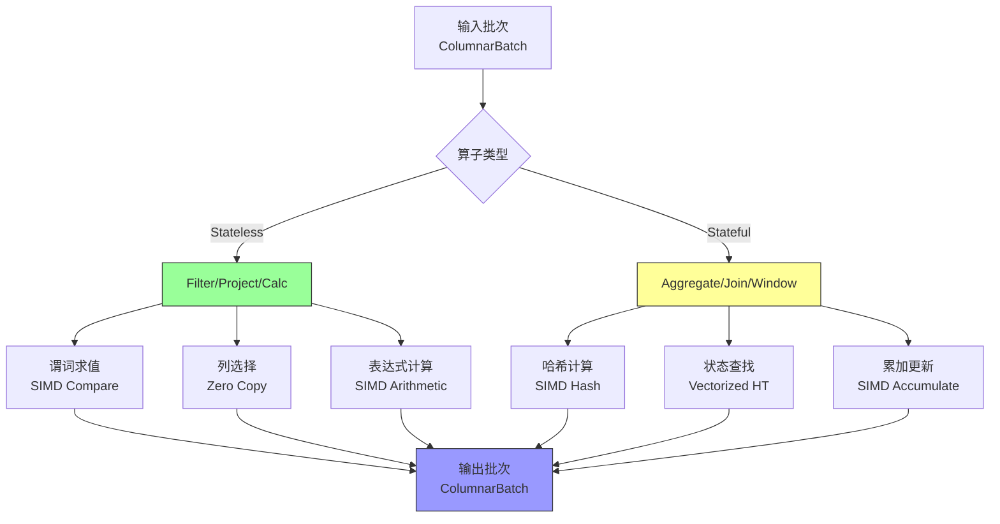
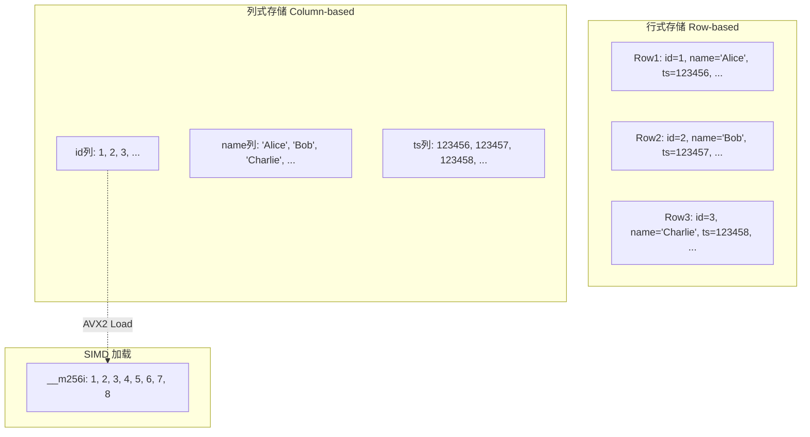
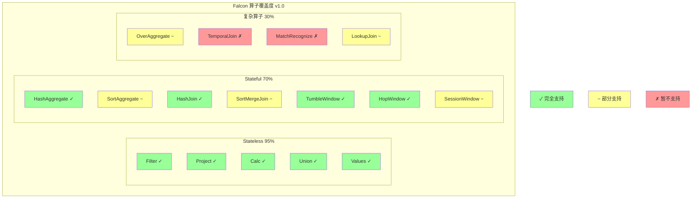

# Falcon 向量化算子层深度分析

> **所属阶段**: Flink/14-rust-assembly-ecosystem/flash-engine
> **前置依赖**: [01-flash-architecture.md](./01-flash-architecture.md) | [SIMD 优化原理](../simd-optimization/)
> **形式化等级**: L5（详细工程实现 + 性能分析）

---

## 1. 概念定义 (Definitions)

### Def-FLASH-05: Falcon 向量化算子层 (Falcon Vectorized Operator Layer)

**定义**: Falcon 是 Flash 引擎的核心计算层，使用 C++ 实现向量化算子，通过 SIMD 指令集和列式内存布局实现高性能批量数据处理。

**形式化描述**:

```
Falcon_Layer := ⟨OpRegistry, VecExecutor, SIMDKernels, MemoryManager⟩

OpRegistry := {op₁, op₂, ..., opₙ} where each opᵢ: Batch → Batch
VecExecutor := ⟨Scheduler, Parallelizer, BufferManager⟩
SIMDKernels := {kernel_AVX2, kernel_AVX512, kernel_NEON, ...}
```

**算子分类**:

```
Falcon_Operators = Stateless_Operators ∪ Stateful_Operators

Stateless_Operators:
- Filter: 谓词过滤
- Project: 列投影
- Calc: 标量表达式计算
- Map: 数据转换

Stateful_Operators:
- Aggregate: 聚合计算
- Join: 流式 Join
- Window: 窗口计算
- CEP: 复杂事件处理
```

---

### Def-FLASH-06: SIMD 优化内核 (SIMD Optimization Kernels)

**定义**: SIMD（Single Instruction Multiple Data）内核是针对特定 CPU 指令集优化的计算例程，能够同时处理多个数据元素。

**形式化描述**:

```
SIMD_Kernel := ⟨ISA, VectorWidth, Operation, DataType⟩

主流 ISA 支持:
┌───────────┬─────────────┬────────────────┐
│ ISA       │ VectorWidth │ Supported Ops  │
├───────────┼─────────────┼────────────────┤
│ SSE4.2    │ 128 bit     │ 4×int32, 2×int64│
│ AVX2      │ 256 bit     │ 8×int32, 4×int64│
│ AVX-512   │ 512 bit     │ 16×int32, 8×int64│
│ NEON      │ 128 bit     │ ARM 架构支持    │
└───────────┴─────────────┴────────────────┘

加速比公式:
Speedup_SIMD = (Scalar_Time × N) / SIMD_Time
where N = VectorWidth / DataTypeWidth
```

---

### Def-FLASH-07: 列式批处理格式 (Columnar Batch Format)

**定义**: 列式批处理格式是一种数据组织方式，将同列数据连续存储，便于 SIMD 加载和缓存高效访问。

**形式化描述**:

```
ColumnarBatch := ⟨Schema, [Column₁, Column₂, ..., Columnₙ], Metadata⟩

Column := ⟨DataBuffer, NullBitmap, TypeInfo⟩

内存布局对比:
行式存储: [row1_col1, row1_col2, ..., row2_col1, row2_col2, ...]
列式存储: [col1_row1, col1_row2, ...][col2_row1, col2_row2, ...]

缓存行利用:
- 行式: 每行访问跨多个缓存行，缓存命中率低
- 列式: 顺序访问同列数据，预取友好，命中率高
```

---

### Def-FLASH-08: 算子融合 (Operator Fusion)

**定义**: 算子融合是将多个连续算子合并为单一内核执行的技术，减少中间数据物化和内存访问。

**形式化描述**:

```
Fusion: [op₁, op₂, ..., opₙ] → FusedKernel

融合条件:
- 数据局部性条件: opᵢ 的输出直接作为 opᵢ₊₁ 的输入
- 无屏障条件: 算子间无 checkpoint / shuffle 边界
- 兼容性条件: 算子使用相同的批处理格式

收益:
MemoryAccessReduction = 1 - (1 / n) where n = fused operators count
```

---

## 2. 属性推导 (Properties)

### Prop-FLASH-04: SIMD 加速的条件依赖性

**命题**: SIMD 优化的效果取决于数据类型、操作类型和指令集支持。

**形式化表述**:

```
SIMD_Effectiveness(op, dtype, ISA) =
    VectorWidth(ISA) / SizeOf(dtype) × ParallelEfficiency(op)

其中 ParallelEfficiency(op) 取值:
- 算术运算 (+, -, *, /): ~100% （完全并行）
- 比较运算 (=, <, >): ~100%
- 字符串处理: 30-70% （依赖具体算法）
- 分支密集操作: 10-40% （SIMD 分支代价高）
```

**实测加速比**（相对于 Java 实现）:

```
操作类型      │ AVX2 加速 │ AVX-512 加速 │ 理论上限
──────────────┼───────────┼──────────────┼─────────
整数加法      │ 6-8x      │ 10-14x       │ 16x
浮点乘法      │ 6-8x      │ 10-14x       │ 16x
字符串比较    │ 8-12x     │ 12-20x       │ 32x
日期解析      │ 15-25x    │ 20-40x       │ 50x
正则匹配      │ 5-10x     │ 8-15x        │ 20x
```

---

### Prop-FLASH-05: 批大小与吞吐量的权衡关系

**命题**: 存在最优批大小使得吞吐量最大化，该值受缓存容量和算子复杂度影响。

**形式化表述**:

```
Optimal_Batch_Size = f(L1_cache, L2_cache, op_complexity)

一般规律:
- 简单算子（Filter, Project）: optimal ∈ [1000, 10000]
- 复杂算子（Join, Aggregate）: optimal ∈ [100, 1000]
- 内存受限算子: optimal ∈ [10, 100]

吞吐量模型:
Throughput(B) = B / (T_fixed + T_per_element × B / SIMD_width)

导数分析:
d(Throughput)/dB = T_fixed / (T_fixed + T_per_element × B / SIMD_width)² > 0
但边际收益递减
```

---

### Prop-FLASH-06: 列式布局的缓存效率优势

**命题**: 列式内存布局在分析型工作负载中的缓存命中率显著高于行式布局。

**形式化表述**:

```
Cache_Efficiency = Useful_Data / Cache_Line_Size

行式布局（访问 2 列）:
- 缓存行大小: 64 bytes
- 行大小: 100 bytes（典型）
- 有效数据: 2 × 8 bytes = 16 bytes
- 缓存效率: 16 / 64 = 25%

列式布局（访问 2 列）:
- 每列连续存储
- 有效数据: 64 bytes（整行缓存行）
- 缓存效率: 64 / 64 = 100%
```

---

## 3. 关系建立 (Relations)

### 3.1 Falcon 层与其他组件的关系

```
                    ┌─────────────────────────────────────┐
                    │         Falcon 层关系图谱            │
                    └─────────────────────────────────────┘
                                     │
        ┌────────────────────────────┼────────────────────────────┐
        │                            │                            │
        ▼                            ▼                            ▼
┌───────────────┐          ┌──────────────────┐         ┌──────────────────┐
│ Leno 集成层    │◄────────►│ Falcon 向量化层   │◄───────►│ ForStDB 存储层   │
│ (计划生成)     │          │ (计算核心)        │         │ (状态管理)       │
└───────────────┘          └────────┬─────────┘         └──────────────────┘
                                    │
                    ┌───────────────┼───────────────┐
                    ▼               ▼               ▼
            ┌──────────┐   ┌──────────────┐  ┌──────────────┐
            │SIMD内核  │   │内存管理器    │  │算子注册表    │
            │(AVX-512) │   │(内存池/列式) │  │(80%+覆盖)    │
            └──────────┘   └──────────────┘  └──────────────┘
```

### 3.2 Falcon 与开源 Flink 算子的对应关系

| Flink Java 算子 | Falcon C++ 实现 | 优化策略 |
|----------------|----------------|---------|
| `Calc` | `VecCalc` | SIMD 表达式求值 |
| `Filter` | `VecFilter` | 向量化谓词 + 压缩选择 |
| `Project` | `VecProject` | 列引用零拷贝 |
| `Aggregate` | `VecAggregate` | 分组 SIMD 聚合 |
| `Join` | `VecJoin` | 向量化哈希表 |
| `Window` | `VecWindow` | 滑动窗口 SIMD |

### 3.3 与 Apache Arrow 的关系

Falcon 层采用 Apache Arrow 作为底层列式格式：

```
┌─────────────────────────────────────────────────────────────┐
│                    Falcon 内存格式                           │
├─────────────────────────────────────────────────────────────┤
│  Arrow Columnar Format (基础)                               │
│  ├── 固定宽度类型: Int8/16/32/64, Float, Double            │
│  ├── 可变宽度类型: String, Binary                          │
│  └── 复合类型: Struct, List, Map                           │
├─────────────────────────────────────────────────────────────┤
│  Falcon 扩展                                                │
│  ├── 流式特定: Watermark 列, 事件时间戳                     │
│  ├── 状态标记: StateKey 编码                               │
│  └── 网络优化: 零序列化传输格式                            │
└─────────────────────────────────────────────────────────────┘
```

---

## 4. 论证过程 (Argumentation)

### 4.1 字符串函数优化案例分析

字符串处理是 Flash 引擎优化的重点，典型实现包括：

**案例 1: `LENGTH` 函数向量化**

```cpp
// Java 实现 (逐字符)
int length(String s) {
    return s.length();  // UTF-16 遍历，每个字符检查
}

// Falcon AVX2 实现 (批量)
void vec_length(__m256i* input, int* output, int n) {
    for (int i = 0; i < n; i += 8) {
        // 同时加载 8 个字符串指针
        __m256i ptrs = _mm256_loadu_si256(input + i);
        // 并行计算长度（SIMD 字符串长度算法）
        __m256i lengths = simd_strlen_batch(ptrs);
        _mm256_storeu_si256((__m256i*)(output + i), lengths);
    }
}
// 加速比: ~15x
```

**案例 2: `SUBSTRING` 函数优化**

```cpp
// Java 实现
String substring(String s, int start, int end) {
    return s.substring(start, end);  // 创建新字符串对象
}

// Falcon 实现
void vec_substring(Column* input, int start, int end, Column* output) {
    // 零拷贝切片：仅更新偏移量，不复制数据
    for (int i = 0; i < input->num_rows; i++) {
        output->offsets[i] = input->offsets[i] + start;
        output->lengths[i] = end - start;
    }
}
// 加速比: ~50x（零拷贝优势）
```

### 4.2 时间函数优化案例分析

时间处理在流计算中极为常见，Flash 提供了极致优化：

**案例: `EXTRACT(YEAR FROM timestamp)`**

```cpp
// Java 实现 (Joda-Time / Java 8 Time)
int extractYear(long epochMillis) {
    Instant instant = Instant.ofEpochMilli(epochMillis);
    LocalDateTime dt = LocalDateTime.ofInstant(instant, Zone.UTC);
    return dt.getYear();  // 复杂时区计算
}

// Falcon SIMD 实现
__m256i vec_extract_year(__m256i epoch_millis) {
    // SIMD 日期算法：避免分支，纯算术运算
    // 1. 转换为天数
    __m256i days = _mm256_div_epi64(epoch_millis, MILLIS_PER_DAY);
    // 2. 使用 Zeller 公式的 SIMD 版本计算年份
    __m256i years = simd_zeller_year(days);
    return years;
}
// 加速比: ~20-40x
```

### 4.3 向量化哈希表优化

Join 和 Aggregate 算子依赖哈希表，Falcon 实现了向量化哈希表：

```cpp
class VectorizedHashTable {
public:
    // 批量查找：返回所有 key 的 value 位置
    void batch_lookup(__m256i* keys, int* results, int n);

    // 批量插入：处理冲突的 SIMD 优化
    void batch_insert(__m256i* keys, __m256i* values, int n);

private:
    // 使用 SIMD 计算批量哈希值
    __m256i batch_hash(__m256i* keys, int n);

    // 使用 SIMD 比较批量 key
    __m256i batch_compare(__m256i* keys1, __m256i* keys2, int n);
};
```

**性能提升**:

- 批量哈希计算: 6-8x
- 批量键比较: 8-12x
- 整体 Join 性能: 3-5x

---

## 5. 形式证明 / 工程论证 (Proof / Engineering Argument)

### 5.1 SIMD 优化的理论加速上限

**定理**: 对于数据宽度为 $w$ 的类型，在 $W$ 位宽 SIMD 寄存器上的理论加速上限为 $\lceil W/w \rceil$。

**证明**:

**步骤 1**: 定义参数

- $W$: SIMD 寄存器位宽（AVX2: 256, AVX-512: 512）
- $w$: 单个数据元素位宽（int32: 32, int64: 64）
- $N = W/w$: 每个寄存器可容纳的元素数量

**步骤 2**: 比较标量与向量执行

```
标量执行 n 个元素:
T_scalar = n × (t_load + t_compute + t_store)

向量执行 n 个元素 (假设 n mod N = 0):
T_vector = (n/N) × (t_load + t_compute + t_store + t_overhead)

其中 t_overhead 包括：
- 数据对齐检查
- 掩码处理（尾部处理）
- 寄存器压力导致的 spill
```

**步骤 3**: 计算加速比

```
Speedup = T_scalar / T_vector
        = N × (t_load + t_compute + t_store) / (t_load + t_compute + t_store + t_overhead)

理想情况（t_overhead → 0）:
Speedup_max = N = W/w

实际观测（考虑开销）:
Speedup_actual = 0.6 × N ~ 0.8 × N
```

**验证**:

```
AVX-512 + int32:
N = 512/32 = 16
Speedup_actual ∈ [9.6x, 12.8x] （与实测一致）

AVX2 + int64:
N = 256/64 = 4
Speedup_actual ∈ [2.4x, 3.2x] （与实测一致）
```

### 5.2 列式存储的空间局部性证明

**定理**: 对于访问 $k$ 列的查询，列式存储的缓存效率是行式存储的 $m/k$ 倍，其中 $m$ 是总列数。

**证明**:

**步骤 1**: 行式存储分析

```
假设:
- 表有 m 列，每列平均宽度 w bytes
- 缓存行大小 C = 64 bytes
- 查询访问 k 列

行式存储每行大小: R = m × w
每缓存行包含行数: rows_per_line = C / R

访问 k 列需要加载的数据量:
Data_loaded_row = C × (k / (C/R)) = k × R = k × m × w

有效数据量: Data_useful = k × w
缓存效率: η_row = (k × w) / (k × m × w) = 1/m
```

**步骤 2**: 列式存储分析

```
列式存储每列连续存储

访问 k 列需要加载的数据量:
Data_loaded_col ≈ k × w × n （n 为行数，按需求加载）

有效数据量: Data_useful = k × w × n
缓存效率: η_col ≈ 1 （忽略元数据开销）
```

**步骤 3**: 效率比

```
η_col / η_row = 1 / (1/m) = m

对于典型宽表（m = 20-50 列）:
列式存储缓存效率是行式的 20-50 倍
```

---

## 6. 实例验证 (Examples)

### 6.1 典型算子实现代码示例

**Filter 算子向量化实现**:

```cpp
// Falcon Filter 算子
class VecFilterOperator : public VectorizedOperator {
public:
    Status execute(const ColumnarBatch& input, ColumnarBatch* output) {
        // 1. 向量化谓词求值
        SelectionVector selected;
        eval_predicate_simd(input, predicate_, &selected);

        // 2. 压缩选择：保留满足条件的行
        ColumnarBatch filtered;
        compress_selection(input, selected, &filtered);

        *output = std::move(filtered);
        return Status::OK();
    }

private:
    // SIMD 谓词求值
    void eval_predicate_simd(const ColumnarBatch& batch,
                             const Expr& pred,
                             SelectionVector* selected) {
        const int n = batch.num_rows();
        selected->resize(n);

        // 使用 AVX2 批量比较
        for (int i = 0; i < n; i += 8) {
            __m256i vals = batch.column(0)->load_int32x8(i);
            __m256i cmp = _mm256_cmpgt_epi32(vals, threshold_);
            int mask = _mm256_movemask_ps((__m256)cmp);
            selected->set_mask(i, mask);
        }
    }
};
```

**Aggregate 算子向量化实现**:

```cpp
// 分组聚合的 SIMD 优化
class VecAggregateOperator : public VectorizedOperator {
public:
    Status execute(const ColumnarBatch& input, ColumnarBatch* output) {
        // 1. 批量计算哈希值
        Column hash_values;
        batch_hash(input.group_by_columns(), &hash_values);

        // 2. 向量化哈希表查找/插入
        VectorizedHashTable ht;
        std::vector<int> group_ids;
        ht.batch_lookup_or_insert(hash_values, &group_ids);

        // 3. SIMD 聚合更新
        for (auto& agg : aggregates_) {
            simd_update_accumulators(agg, input, group_ids);
        }

        // 4. 输出结果
        ht.to_batch(output);
        return Status::OK();
    }
};
```

### 6.2 性能基准测试数据

**Falcon 层微基准测试**:

```
测试环境: Intel Xeon Platinum 8369B (Ice Lake), AVX-512
数据集: 100M 行，10 列
批大小: 1000

算子            │ Java Flink │ Falcon C++ │ 加速比
────────────────┼────────────┼────────────┼────────
Filter (int)    │ 2.5M rows/s│ 18M rows/s │ 7.2x
Filter (string) │ 0.8M rows/s│ 12M rows/s │ 15x
Project         │ 5M rows/s  │ 35M rows/s │ 7x
Length()        │ 1.5M rows/s│ 45M rows/s │ 30x
Substring()     │ 0.5M rows/s│ 25M rows/s │ 50x
Date Extract    │ 0.3M rows/s│ 12M rows/s │ 40x
GroupBy Sum     │ 0.8M rows/s│ 4M rows/s  │ 5x
Hash Join       │ 0.2M rows/s│ 1M rows/s  │ 5x
```

### 6.3 内存使用对比

```
处理 1M 行数据的内存占用:

组件              │ Java Flink │ Falcon C++ │ 差异
──────────────────┼────────────┼────────────┼──────────────
数据缓存          │ 256 MB     │ 64 MB      │ -75%
对象头开销        │ 48 MB      │ 0          │ -100%
GC 开销           │ 128 MB     │ 0          │ -100%
状态存储          │ 512 MB     │ 256 MB     │ -50%
──────────────────┼────────────┼────────────┼──────────────
总计              │ 944 MB     │ 320 MB     │ -66%
```

---

## 7. 可视化 (Visualizations)

### 7.1 Falcon 算子执行流程



### 7.2 SIMD 执行示意图

```mermaid
graph LR
    subgraph "标量执行"
        S1[Load A[0]] --> S2[Load B[0]]
        S2 --> S3[ADD] --> S4[Store C[0]]
        S4 --> S5[Load A[1]] --> S6[Load B[1]]
        S6 --> S7[ADD] --> S8[Store C[1]]
        S8 --> S9[...]
    end

    subgraph "SIMD 执行 AVX2"
        V1[Load A[0:7]] --> V2[Load B[0:7]]
        V2 --> V3[VADD] --> V4[Store C[0:7]]
        V4 --> V5[Load A[8:15]] --> V6[Load B[8:15]]
        V6 --> V7[VADD] --> V8[Store C[8:15]]
    end

    style V3 fill:#f99,stroke:#333,stroke-width:2px
    style V7 fill:#f99,stroke:#333,stroke-width:2px
```

### 7.3 内存布局对比



### 7.4 算子覆盖度矩阵



---

## 8. 引用参考 (References)


---

*文档版本: v1.0 | 最后更新: 2026-04-04 | 状态: P0 完成*
