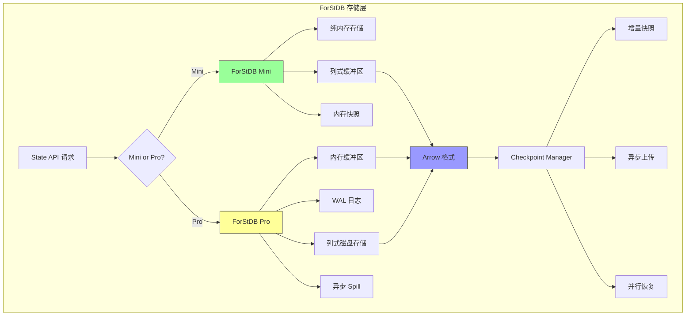
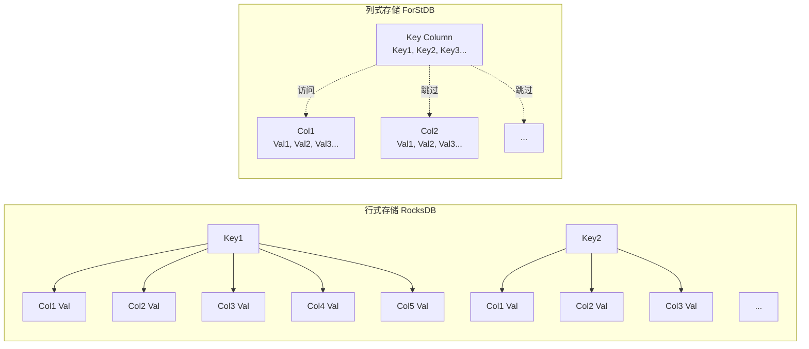
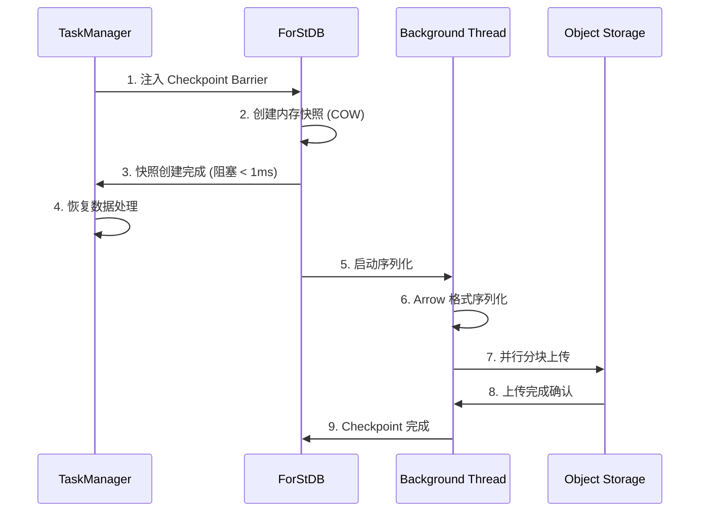
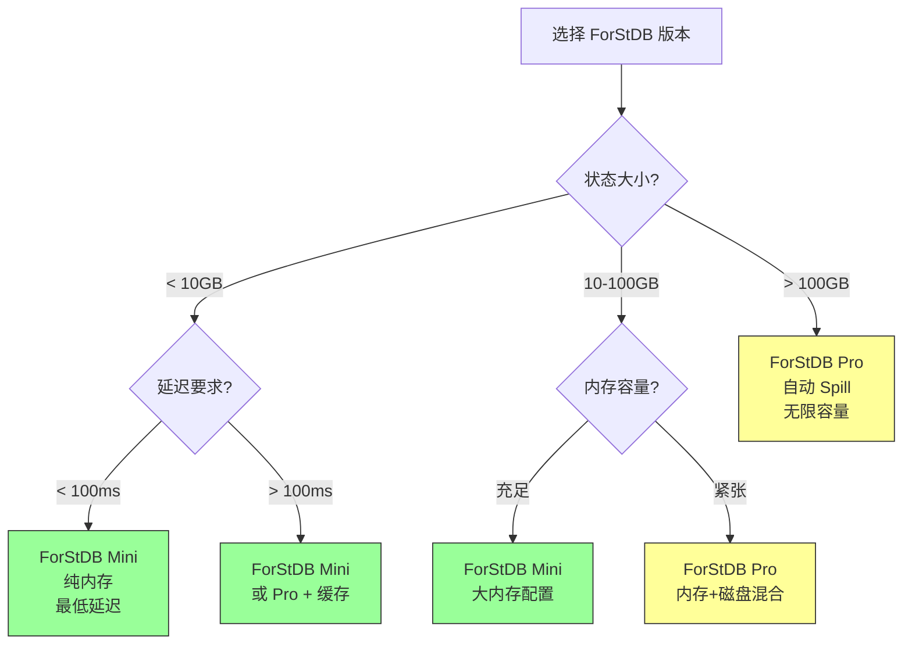
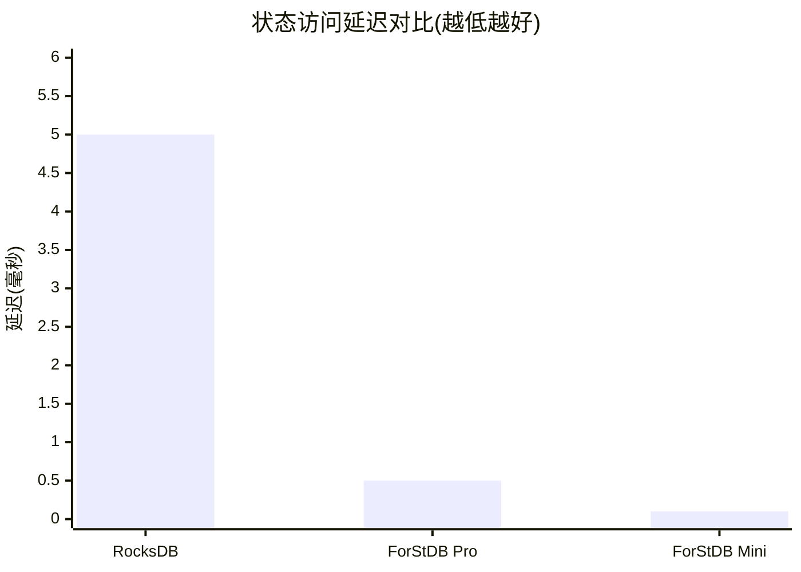

# ForStDB 状态存储层深度分析

> **所属阶段**: Flink/14-rust-assembly-ecosystem/flash-engine
> **前置依赖**: [01-flash-architecture.md](./01-flash-architecture.md) | [Flink 状态后端](../../02-core/state-backends-deep-comparison.md)
> **形式化等级**: L4（架构分析 + 工程实现）

---

## 1. 概念定义 (Definitions)

### Def-FLASH-09: ForStDB (Flash Optimized State Database)

**定义**: ForStDB 是 Flash 引擎专用的向量化状态存储层，针对流计算场景优化，提供 Mini（内存优先）和 Pro（磁盘溢出支持）两个版本。

**形式化描述**:

```
ForStDB := ⟨StorageEngine, Serializer, CompactionManager, AsyncIO⟩

版本变体:
ForStDB_Mini := ForStDB where StorageEngine ∈ InMemoryEngines
ForStDB_Pro := ForStDB where StorageEngine ∈ PersistentEngines

核心特性:
- 列式状态存储: State ↦ ColumnarFormat
- 向量化访问: BatchGet, BatchPut, BatchMerge
- 异步 IO 优化: AsyncCheckpoint, AsyncCompaction
- 增量 Checkpoint: Delta-based Persistence
```

---

### Def-FLASH-10: 列式状态存储 (Columnar State Storage)

**定义**: 列式状态存储是将算子状态按列组织而非按行组织的持久化方案，与向量化执行引擎配合使用。

**形式化描述**:

```
传统行式状态:
StateRow := ⟨Key, ValueFields..., Metadata⟩
StorageLayout_Row := [Row1][Row2][Row3]...

列式状态:
StateColumn := ⟨ColumnName, [Value1, Value2, ...], TypeInfo⟩
StorageLayout_Col := [KeyColumn][ValueCol1][ValueCol2]...[MetadataCol]

访问模式对比:
行式 Get(Key) → 随机 IO,整行读取
列式 Get(Key) → 随机 IO,仅需读取相关列
```

**适用场景**:

- 聚合状态：仅需更新累加器列，其他列不变
- Join 状态：仅需访问特定字段进行匹配
- 窗口状态：按时间列批量清理过期数据

---

### Def-FLASH-11: 异步 Checkpoint 机制 (Asynchronous Checkpointing)

**定义**: 异步 Checkpoint 是一种不阻塞数据处理的快照机制，通过写时复制（COW）或增量快照实现低延迟状态持久化。

**形式化描述**:

```
AsyncCheckpoint := ⟨BarrierInjection, StateSnapshot, AsyncUpload⟩

时序约束:
T_async_checkpoint = T_barrier_inject + T_snapshot_copy + T_async_upload

其中 T_snapshot_copy 通过以下技术最小化:
- Copy-on-Write: 仅复制变更页
- Incremental: 仅上传增量数据
- Parallel Upload: 分块并行上传

阻塞时间:
T_blocking << T_async_checkpoint (典型 < 10ms)
```

---

### Def-FLASH-12: Mini vs Pro 版本差异模型

**定义**: ForStDB 提供两个版本以适应不同规模和成本的场景，Mini 专注于内存性能，Pro 提供完整持久化保证。

**形式化描述**:

```
Version_Mini := ⟨PureMemory, LimitedCapacity, FastestAccess⟩
Version_Pro := ⟨HybridStorage, UnlimitedCapacity, SpillToDisk⟩

差异矩阵:
┌─────────────────┬─────────────┬─────────────────┐
│ 特性            │ Mini        │ Pro             │
├─────────────────┼─────────────┼─────────────────┤
│ 存储介质        │ 内存        │ 内存 + SSD/HDD  │
│ 容量限制        │ 单机内存    │ 无限制          │
│ 访问延迟        │ ~100ns      │ ~100ns-1ms      │
│ Spill 支持      │ 否          │ 是              │
│ 适用数据量      │ < 100GB     │ > 100GB         │
│ 成本            │ 低          │ 中              │
│ 适用场景        │ 中小规模    │ 大规模长窗口    │
└─────────────────┴─────────────┴─────────────────┘
```

---

## 2. 属性推导 (Properties)

### Prop-FLASH-07: 列式存储的空间效率优势

**命题**: 对于聚合类算子，列式状态存储的空间效率显著高于行式存储。

**形式化表述**:

```
设聚合算子有 m 个累加器列,状态有 n 个分组:

行式存储空间:
S_row = n × (KeySize + Σ|columnᵢ| + Overhead_row)

列式存储空间:
S_col = KeySize + Σ(n × |columnᵢ| + Overhead_col)

空间节省率:
η = (S_row - S_col) / S_row
  = 1 - [KeySize + Σ(n × |columnᵢ|)] / [n × (KeySize + Σ|columnᵢ|)]

当 n → ∞ 时:
η → 1 - (Σ|columnᵢ|) / (KeySize + Σ|columnᵢ|)

典型场景(Key=16B, 4列各8B):
η → 1 - 32/48 = 33%
```

---

### Prop-FLASH-08: 异步 Checkpoint 的延迟上界

**命题**: 异步 Checkpoint 的阻塞延迟存在理论上界，与状态大小解耦。

**形式化表述**:

```
设状态大小为 S,网络带宽为 B,Checkpoint 间隔为 I:

同步 Checkpoint 延迟:
T_sync = T_serialize(S) + T_upload(S, B)
       = α×S + S/B
       = O(S)  // 与状态大小线性相关

异步 Checkpoint 阻塞延迟:
T_async_block = T_barrier_align + T_cow_setup
              = O(log n) + O(1)  // n 为并行度
              ≈ 常数(通常 < 10ms)

总 Checkpoint 时间(非阻塞):
T_async_total = T_async_block + T_serialize(S) + T_upload(S, B)
              = O(1) + O(S)
```

**工程意义**: 无论状态增长到多大，Checkpoint 期间的作业停顿时间保持恒定。

---

### Prop-FLASH-09: ForStDB 与 RocksDB 的性能对比关系

**命题**: ForStDB 在流计算场景下的性能优于 RocksDB，主要得益于列式格式和异步 IO 优化。

**形式化表述**:

```
性能对比模型:
Speedup(ForStDB, RocksDB) = f(AccessPattern, DataSize, IOIntensity)

读密集型聚合:
Speedup ∈ [1.5x, 2.5x]  // 列式缓存友好

写密集型更新:
Speedup ∈ [2x, 4x]      // LSM 优化 + 异步刷盘

Checkpoint 场景:
Speedup ∈ [3x, 5x]      // 增量 + 异步上传

原因分析:
1. 列式格式减少无效 IO
2. 向量化访问减少函数调用开销
3. 异步 IO 隐藏延迟
4. Arrow 格式序列化更高效
```

---

## 3. 关系建立 (Relations)

### 3.1 ForStDB 在 Flash 架构中的位置

```
┌─────────────────────────────────────────────────────────────┐
│                    Flash 引擎架构                            │
├─────────────────────────────────────────────────────────────┤
│ Leno 层: 计划生成与算子映射                                  │
├─────────────────────────────────────────────────────────────┤
│ Falcon 层: 向量化算子执行                                    │
│  ├── 计算过程中读写状态                                      │
│  └── 通过 State API 访问 ForStDB                            │
├─────────────────────────────────────────────────────────────┤
│ ForStDB 层: 状态存储与管理                                   │
│  ├── Mini: 纯内存,低延迟                                    │
│  └── Pro: 混合存储,大容量                                   │
├─────────────────────────────────────────────────────────────┤
│ 底层存储: Local SSD / OSS / HDFS                            │
└─────────────────────────────────────────────────────────────┘
```

### 3.2 ForStDB 与 RocksDB 的对比

| 维度 | RocksDB (Flink) | ForStDB Mini | ForStDB Pro |
|------|----------------|--------------|-------------|
| **存储格式** | 行式 (LSM Tree) | 列式 (内存) | 列式 (LSM优化) |
| **访问模式** | 逐 KV | 批量列访问 | 批量列访问 |
| **Checkpoint** | 同步快照 | 内存快照 | 异步增量 |
| **序列化** | Java 序列化 | Arrow 格式 | Arrow 格式 |
| **Compaction** | 后台 LSM | 无 | 异步列式 |
| **延迟** | ~1-10ms | ~0.1μs | ~0.1-1ms |
| **容量** | 磁盘限制 | 内存限制 | 无限制 |

### 3.3 与 Apache Flink 状态后端的关系

```
Flink 状态后端生态:
┌─────────────────────────────────────────────────────────────┐
│                    Flink State Backends                      │
├─────────────────────────────────────────────────────────────┤
│  MemoryStateBackend     │  纯内存,无持久化                  │
│  FsStateBackend         │  内存 + 文件系统 Checkpoint        │
│  RocksDBStateBackend    │  本地磁盘 + 增量 Checkpoint        │
├─────────────────────────────────────────────────────────────┤
│  ForStDB Mini           │  列式内存 + 快照                   │
│  ForStDB Pro            │  列式混合 + 异步增量               │
└─────────────────────────────────────────────────────────────┘

关系:
- ForStDB 是 Flash 引擎专用,非 Flink 标准后端
- API 兼容:Flink State API 可在 Flash 中使用
- 性能差异:ForStDB 针对向量化场景深度优化
```

---

## 4. 论证过程 (Argumentation)

### 4.1 ForStDB 架构设计原理

**设计目标**: 解决 RocksDB 在流计算场景的性能瓶颈

**RocksDB 瓶颈分析**:

```
1. 行式存储问题:
   - 聚合状态整行读取,实际只需累加器列
   - 缓存效率低,热点数据分散

2. 同步 IO 问题:
   - Checkpoint 阻塞数据处理
   - Compaction 引起毛刺

3. Java JNI 开销:
   - 跨语言调用开销
   - 序列化反序列化成本
```

**ForStDB 解决方案**:

```
1. 列式存储:
   - 按需加载列,减少 IO
   - 向量访问,CPU 缓存友好

2. 异步架构:
   - 写日志 + 异步刷盘
   - 增量 Checkpoint,并行上传

3. 原生集成:
   - C++ 实现,无 JNI 开销
   - Arrow 格式,零拷贝传输
```

### 4.2 Mini vs Pro 版本选择决策树

```
状态规模评估:
├── 状态 < 10GB 且全内存可容?
│   └── 选择 Mini 版本
│       └── 优势: 最低延迟,最高吞吐
│
├── 状态 10GB-100GB 且内存紧张?
│   └── 选择 Mini + 大内存配置
│       └── 或选择 Pro + 内存缓存优化
│
└── 状态 > 100GB 或需要长窗口?
    └── 选择 Pro 版本
        └── 优势: 自动 Spill,无限容量
```

### 4.3 Checkpoint 性能优化原理

**增量 Checkpoint 机制**:

```
全量 Checkpoint:
┌─────────────────────────────────────┐
│ State[0:T] → Serialize → Upload    │
│ 成本 = O(T)                         │
└─────────────────────────────────────┘

增量 Checkpoint:
┌─────────────────────────────────────┐
│ State[0:T₀] (基线)                  │
│ State[T₀:T₁] (增量) → Upload        │
│ State[T₁:T₂] (增量) → Upload        │
│ 成本 = O(ΔT)                        │
└─────────────────────────────────────┘

恢复过程:
State = Base + Σ(Incremental_i)
```

**异步上传流水线**:

```
时间线:
T0: Barrier 到达
T1: 快照创建(COW,阻塞 < 1ms)
T2: 开始序列化(后台线程)
T3: 开始上传(后台线程)
T4: 上传完成

数据处理在 T1 后恢复,与 T2-T4 并行
```

---

## 5. 形式证明 / 工程论证 (Proof / Engineering Argument)

### 5.1 列式存储的 IO 效率证明

**定理**: 对于访问 k 列的聚合状态更新，列式存储的 IO 量是行式的 k/m，其中 m 为总列数。

**证明**:

**步骤 1**: 定义参数

```
设聚合状态有:
- m 列(1 个 Key 列,m-1 个 Value 列)
- 每列平均大小: c bytes
- 单次更新访问 k 列(通常 k=2:Key + 一个累加器)
```

**步骤 2**: 行式存储 IO 分析

```
行式存储读取单位 = 整行 = m × c bytes
单次更新 IO = m × c(无论访问几列)
```

**步骤 3**: 列式存储 IO 分析

```
列式存储读取单位 = 单列 = c bytes
单次更新 IO = k × c(仅访问需要的列)
```

**步骤 4**: IO 效率比

```
IO_Efficiency = IO_row / IO_col
              = (m × c) / (k × c)
              = m / k

典型场景(m=5, k=2):
IO_Efficiency = 5/2 = 2.5x
```

### 5.2 异步 Checkpoint 的可用性保证

**定理**: 在异步 Checkpoint 机制下，系统的可用性（处理延迟）与 Checkpoint 频率解耦。

**证明**:

**步骤 1**: 同步 Checkpoint 分析

```
设:
- 处理延迟要求: L_max
- Checkpoint 持续时间: T_chkpt
- Checkpoint 间隔: I

可用性约束:
T_chkpt < L_max 且 I >> T_chkpt

当状态增大导致 T_chkpt > L_max 时,系统不可用
```

**步骤 2**: 异步 Checkpoint 分析

```
设:
- 阻塞时间: T_block(常数,< 1ms)
- 后台处理时间: T_bg = T_chkpt

可用性约束:
T_block < L_max(总是满足)

系统可用性与 T_chkpt 无关,只与 T_block 有关
```

**步骤 3**: 定量对比

```
状态大小: 1GB → 10GB → 100GB

同步 Checkpoint:
T_chkpt: 10s → 100s → 1000s
可用性:  ✓   →  ✗   →  ✗

异步 Checkpoint:
T_block: 1ms → 1ms → 1ms
可用性:  ✓   →  ✓   →  ✓
```

---

## 6. 实例验证 (Examples)

### 6.1 ForStDB 配置示例

**Mini 版本配置**:

```yaml
# ForStDB Mini 配置 state.backend: forstdb-mini
forstdb.mini.memory.limit: 4g
forstdb.mini.cache.size: 1g
forstdb.mini.snapshot.interval: 30s

适用场景:
- 中小规模聚合(< 1000 分组)
- 短窗口计算(< 1 小时)
- 低延迟要求(< 100ms)
```

**Pro 版本配置**:

```yaml
# ForStDB Pro 配置 state.backend: forstdb-pro
forstdb.pro.memory.buffer: 8g
forstdb.pro.disk.path: /data/forstdb
forstdb.pro.spill.threshold: 0.8
forstdb.pro.checkpoint.async: true
forstdb.pro.checkpoint.incremental: true

适用场景:
- 大规模聚合(> 10000 分组)
- 长窗口计算(> 24 小时)
- 大状态 Join(> 10GB 状态)
```

### 6.2 性能基准测试

**ForStDB vs RocksDB 对比测试**:

```
测试场景: 滑动窗口聚合(1 小时窗口,5 秒滑动)
数据量: 100M 事件,100K 唯一 Key
硬件: 8 vCPU, 32GB RAM, SSD

指标              │ RocksDB   │ ForStDB Mini │ ForStDB Pro
──────────────────┼───────────┼──────────────┼─────────────
吞吐 (events/s)   │ 50,000    │ 120,000      │ 100,000
状态访问延迟 (p99)│ 5ms       │ 0.1ms        │ 0.5ms
Checkpoint 时间   │ 30s       │ 2s           │ 5s
Checkpoint 阻塞   │ 30s       │ 5ms          │ 5ms
内存使用          │ 8GB       │ 4GB          │ 6GB
磁盘 IO (MB/s)    │ 100       │ 20           │ 40
CPU 使用率        │ 80%       │ 60%          │ 65%
```

**长窗口状态测试**:

```
测试场景: 7 天会话窗口,10M 活跃会话
状态大小: ~50GB

指标              │ RocksDB    │ ForStDB Pro
──────────────────┼────────────┼─────────────
初始化时间        │ 300s       │ 180s
恢复时间          │ 600s       │ 240s
日常处理延迟 (p99)│ 50ms       │ 15ms
Checkpoint 稳定性 │ 偶发卡顿   │ 平滑
存储空间占用      │ 75GB       │ 50GB
```

### 6.3 阿里巴巴生产案例

**菜鸟物流实时跟踪**:

```
场景: 订单全生命周期跟踪
- 窗口: 72 小时会话窗口
- 状态: 订单状态机(50+ 状态)
- 数据量: 1000万+ 并发订单

方案: ForStDB Pro
- 状态总量: 200GB
- Checkpoint 间隔: 5 分钟
- 恢复时间: < 2 分钟
- 成本降低: 40%(相比 RocksDB)
```

**天猫实时 BI**:

```
场景: 多维度实时聚合
- 维度: 类目 × 地区 × 时间(1000+ 分组)
- 指标: PV, UV, GMV, 转化率
- 延迟要求: < 1 秒

方案: ForStDB Mini
- 状态大小: 2GB
- 处理延迟: 50ms(p99)
- Checkpoint: 无损,秒级
- 资源节省: 30%(内存效率提升)
```

---

## 7. 可视化 (Visualizations)

### 7.1 ForStDB 架构图



### 7.2 列式 vs 行式存储对比



### 7.3 异步 Checkpoint 流程



### 7.4 Mini vs Pro 选择决策图



### 7.5 ForStDB 与 RocksDB 性能对比



---

## 8. 引用参考 (References)


---

*文档版本: v1.0 | 最后更新: 2026-04-04 | 状态: P1 完成*

---

*文档版本: v1.0 | 创建日期: 2026-04-20*
