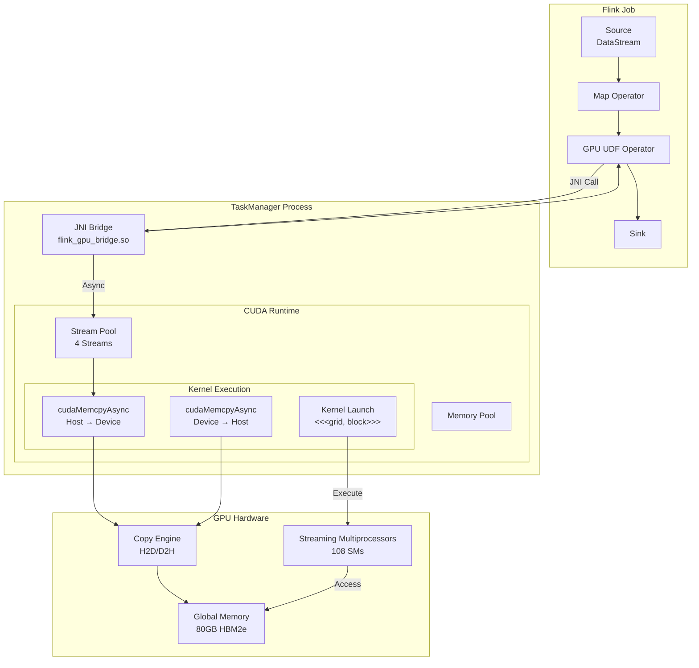
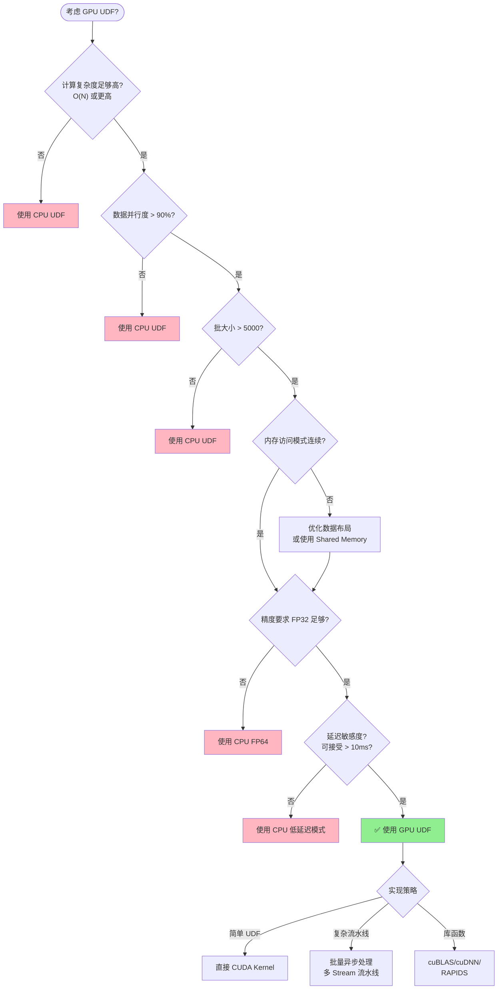

# CUDA GPU UDF 开发指南

> 所属阶段: Flink/14-rust-assembly-ecosystem/heterogeneous-computing | 前置依赖: [Flink UDF 基础](../../03-api/09-language-foundations/flink-datastream-api-complete-guide.md), [Rust FFI 绑定](../../03-api/09-language-foundations/flink-rust-native-api-guide.md) | 形式化等级: L4 (工程实践)

## 1. 概念定义 (Definitions)

### Def-HET-01: CUDA 编程模型 (CUDA Programming Model)

**定义**: CUDA (Compute Unified Device Architecture) 是 NVIDIA 提出的并行计算平台和编程模型，其核心抽象为 **SIMT (Single Instruction, Multiple Threads)** 执行模型。

形式化地，CUDA 执行模型可表示为五元组：

$$\mathcal{M}_{CUDA} = (G, B, T, S_{SM}, M_{hierarchy})$$

其中：

- $G$: Grid - 由多个 Block 组成的计算网格
- $B$: Block - 由多个 Thread 组成的协作线程数组 (CTA), $B = \{T_1, T_2, ..., T_n\}$
- $T$: Thread - 基本执行单元，拥有私有寄存器和局部内存
- $S_{SM}$: Streaming Multiprocessor - GPU 上的计算单元，可并发执行多个 Block
- $M_{hierarchy}$: 内存层次结构，包含寄存器、共享内存、全局内存、常量内存、纹理内存

CUDA 线程层次结构满足：

$$Grid = \bigcup_{i=0}^{n-1} Block_i, \quad Block_i = \bigcup_{j=0}^{m-1} Thread_{i,j}$$

**直观解释**: CUDA 将大规模并行计算组织为层次结构。一个 GPU Kernel 启动一个 Grid，Grid 包含多个 Block，每个 Block 包含多个 Thread。同 Block 内的 Thread 可以通过共享内存协作，并通过同步原语协调执行。

### Def-HET-02: Host/Device 内存模型 (Host-Device Memory Model)

**定义**: CUDA 采用 **分离式内存架构** (Discrete Memory Architecture)，Host (CPU) 和 Device (GPU) 拥有独立的物理内存空间，数据通过 PCIe/NVLink 总线显式传输。

形式化表示为：

$$M_{system} = M_{host} \oplus M_{device}, \quad M_{host} \cap M_{device} = \emptyset$$

内存传输操作定义为映射函数：

$$\tau: M_{host} \times M_{device} \times \mathbb{N} \rightarrow \{OK, ERR\}$$

其中 $\mathbb{N}$ 表示传输字节数。Host-Device 数据传输延迟记为 $L_{transfer}$，带宽记为 $B_{pcie}$ 或 $B_{nvlink}$。

**统一内存** (Unified Memory) 提供自动迁移抽象：

$$M_{unified} = M_{host} \cup M_{device}, \quad \text{with automatic page migration}$$

**直观解释**: CPU 和 GPU 有各自的内存空间。使用 CUDA 时需要显式管理数据传输（`cudaMemcpy`），或者使用统一内存让系统自动处理。PCIe 带宽（~32 GB/s）远低于 GPU 显存带宽（~1000+ GB/s），这是主要瓶颈。

### Def-HET-03: Flink GPU UDF 执行语义 (Flink GPU UDF Execution Semantics)

**定义**: Flink GPU UDF 是将 Flink 的算子语义映射到 GPU 执行的扩展机制，定义为状态转换函数：

$$f_{gpu}: \mathcal{D}_{in} \times \Theta_{gpu} \rightarrow \mathcal{D}_{out}$$

其中：

- $\mathcal{D}_{in}$: 输入数据批次 (Data Batch), $|\mathcal{D}_{in}| = B_{batch}$
- $\Theta_{gpu}$: GPU Kernel 参数，包含线程配置、共享内存大小等
- $\mathcal{D}_{out}$: 输出数据批次

执行流水线包含以下阶段：

$$Pipeline_{gpu} = Host_{prepare} \rightarrow H2D_{transfer} \rightarrow GPU_{compute} \rightarrow D2H_{transfer} \rightarrow Host_{finalize}$$

端到端延迟：

$$L_{total} = L_{prep} + L_{H2D} + L_{kernel} + L_{D2H} + L_{finalize}$$

**GPU 加速条件** (Amdahl 定律)：

$$\text{Speedup} = \frac{1}{(1 - f_{parallel}) + \frac{f_{parallel}}{S_{gpu}} + L_{transfer}/L_{cpu}} > 1$$

其中 $f_{parallel}$ 是可并行化比例，$S_{gpu}$ 是 GPU 加速比。

**直观解释**: Flink GPU UDF 将数据处理卸载到 GPU。需要考虑数据准备、传输、计算、回传全流程。只有当计算密集度足够高时，GPU 加速才有收益。

### Def-HET-04: CUDA 内存带宽瓶颈 (CUDA Memory Bandwidth Bottleneck)

**定义**: GPU 计算受限于内存带宽时，实际性能与理论峰值的比率定义为 **Roofline 模型** 中的内存受限区域：

$$Perf_{actual} = \min(Perf_{peak}, I \times B_{mem})$$

其中：

- $Perf_{peak}$: GPU 理论计算峰值 (TFLOPS)
- $I$: 运算强度 (Operational Intensity), $I = \frac{\text{FLOPs}}{\text{Bytes transferred}}$
- $B_{mem}$: 内存带宽 (GB/s)

**计算受限 vs 内存受限** 边界：

$$I_{ridge} = \frac{Perf_{peak}}{B_{mem}}$$

当 $I > I_{ridge}$ 时为计算受限，否则为内存受限。

**直观解释**: 如果每个数据元素只进行少量计算，GPU 会花更多时间等待数据而不是计算。需要提高运算强度（如合并多个操作）才能充分利用 GPU 算力。

---

## 2. 属性推导 (Properties)

### Prop-HET-01: GPU UDF 适用性边界 (GPU UDF Applicability Bounds)

**命题**: 设批处理大小为 $N$，每个元素计算复杂度为 $O(f(N))$，则 GPU UDF 相比 CPU UDF 有性能收益当且仅当：

$$N \times f(N) > T_{threshold} \approx \frac{L_{transfer}}{C_{gpu}/C_{cpu} - 1}$$

**证明**:

CPU 执行时间：$T_{cpu} = N \times t_{cpu}$

GPU 执行时间（考虑传输）：$T_{gpu} = L_{H2D} + L_{D2H} + N \times t_{gpu} + O_{overhead}$

GPU 加速条件：$T_{gpu} < T_{cpu}$

$$L_{transfer} + N \times t_{gpu} < N \times t_{cpu}$$

$$L_{transfer} < N(t_{cpu} - t_{gpu}) = N \times t_{cpu}(1 - \frac{C_{cpu}}{C_{gpu}})$$

令加速比 $S = C_{gpu}/C_{cpu}$，则：

$$N > \frac{L_{transfer}}{t_{cpu}(S - 1)} = T_{threshold}$$

**工程推论**:

- 小批量数据处理不适合 GPU
- 计算复杂度需达到 $O(N)$ 或更高
- 数据重用可减少有效传输量

### Prop-HET-02: 内存合并访问最优性 (Coalesced Memory Access Optimality)

**命题**: 在 CUDA 中，当 Warp 内线程（32 线程）访问连续内存地址且对齐时，访问延迟最小：

$$L_{coalesced} = L_{base} + \frac{32 \times sizeof(T)}{B_{transaction}} \approx L_{base} + 1\text{ cycle}$$

而非合并访问最坏情况：

$$L_{scatter} = 32 \times L_{base}$$

**证明**:

GPU 全局内存通过 **事务** (Transaction) 服务，一个事务可传输 32/64/128 字节。当 Warp 访问连续地址 $[A, A+31 \times sizeof(T)]$ 时：

1. 若 $sizeof(T) = 4$ (float/int)，总访问 128 字节
2. 128 字节正好落在 L2 Cache Line 边界
3. 仅需 1-2 个内存事务即可服务全部 32 线程

反之，若 32 线程访问分散地址（步长 $s > 1$ 或不连续）：

1. 每个线程可能触发独立内存事务
2. 最多需要 32 个事务
3. 利用率 $\eta = \frac{32 \times sizeof(T)}{32 \times 128B} = \frac{sizeof(T)}{128}$

**工程推论**:

- 数据布局应保证 SoA (Structure of Arrays) 而非 AoS
- 线程 ID 应映射到连续内存索引：`idx = blockIdx.x * blockDim.x + threadIdx.x`
- 使用 `__shared__` 内存缓存不规则访问模式

### Prop-HET-03: Stream 并行掩盖传输延迟 (Stream Parallelism Hiding)

**命题**: 使用 $k$ 个 CUDA Stream 进行流水线计算，当满足以下条件时可完全掩盖 H2D 传输延迟：

$$L_{H2D} \leq (k - 1) \times L_{kernel}$$

**证明**:

考虑深度为 $k$ 的双缓冲流水线：

| 时间片 | Stream 0 | Stream 1 | ... | Stream k-1 |
|--------|----------|----------|-----|------------|
| $t_0$ | H2D[0] | - | ... | - |
| $t_1$ | Kernel[0] | H2D[1] | ... | - |
| $t_2$ | D2H[0] | Kernel[1] | ... | H2D[k-1] |

重叠条件：数据传输与计算并发执行需要独立 Stream 和异步操作。

总时间从顺序执行：

$$T_{seq} = k \times (L_{H2D} + L_{kernel} + L_{D2H})$$

优化为流水线执行：

$$T_{pipe} = L_{H2D} + k \times \max(L_{kernel}, L_{H2D}) + L_{D2H}$$

当 $L_{kernel} \geq L_{H2D}$ 时：

$$T_{pipe} \approx L_{H2D} + k \times L_{kernel} + L_{D2H}$$

理想加速比：

$$\frac{T_{seq}}{T_{pipe}} \rightarrow \frac{L_{H2D} + L_{kernel} + L_{D2H}}{\max(L_{H2D}, L_{kernel}, L_{D2H})}$$

---

## 3. 关系建立 (Relations)

### 3.1 Flink GPU UDF 架构映射

Flink GPU UDF 的层次映射关系：

```
Flink 算子层 (Operator Layer)
    │
    ├── TaskManager 进程
    │       └── GPU UDF Thread Pool
    │               │
    ├── JNI 层 (Java Native Interface)
    │       └── flink-gpu-bridge.so
    │               │
    ├── CUDA Runtime API 层
    │       ├── cudaStreamCreate
    │       ├── cudaMalloc/cudaMemcpy
    │       └── cudaLaunchKernel
    │               │
    └── GPU Kernel 层
            ├── Thread Grid (<<<grid, block>>>)
            ├── Shared Memory (_shared_)
            └── Registers/Local Memory
```

**形式化映射**:

| Flink 概念 | CUDA 概念 | 映射关系 |
|-----------|-----------|---------|
| Task Slot | GPU Stream | 1:N (一个 Slot 管理多个 Stream) |
| Record Batch | Thread Block | N:1 (一个 Block 处理一批记录) |
| Record | Thread | 1:1 (每个线程处理一条记录) |
| Network Buffer | Device Memory | 显式分配与映射 |
| Checkpoint | Stream Synchronize | 同步点 |

### 3.2 GPU vs CPU 适用场景对比矩阵

| 特征维度 | CPU 优势 | GPU 优势 | 决策阈值 |
|---------|---------|---------|---------|
| **数据规模** | 小批量 (< 1K) | 大批量 (> 10K) | 批大小 > 5K |
| **计算复杂度** | 控制流复杂 | 数据并行度高 | 并行度 > 90% |
| **内存访问** | 不规则/随机 | 连续/合并访问 | 合并率 > 80% |
| **延迟敏感** | 低延迟 (< 10ms) | 高吞吐优先 | 延迟 > 100ms |
| **精度要求** | 双精度优先 | 单精度/半精度 | FP32 足够 |
| **状态依赖** | 复杂状态机 | 无状态/少状态 | 状态数 < 10 |

### 3.3 异构计算生态关系

```
                    ┌─────────────────────────────────────┐
                    │     Flink 异构计算生态系统           │
                    └─────────────────────────────────────┘
                                      │
        ┌─────────────────────────────┼─────────────────────────────┐
        │                             │                             │
        ▼                             ▼                             ▼
┌───────────────┐          ┌──────────────────┐          ┌───────────────┐
│  CPU (x86)    │          │     GPU          │          │    FPGA       │
│  通用计算      │◄────────►│  (CUDA/ROCm)     │◄────────►│  (OpenCL)     │
│  复杂逻辑      │          │  数据并行        │          │  低延迟        │
└───────────────┘          └──────────────────┘          └───────────────┘
        │                             │                             │
        │    ┌────────────────────────┼────────────────────────┐    │
        │    │                        │                        │    │
        ▼    ▼                        ▼                        ▼    ▼
   ┌─────────┐                  ┌─────────┐                ┌─────────┐
   │ Intel   │                  │ NVIDIA  │                │ AMD/Xilinx│
   │ AVX-512 │                  │ CUDA    │                │ Alveo    │
   └─────────┘                  │ TensorRT│                │ Vitis    │
                                └─────────┘                └─────────┘
```

---

## 4. 论证过程 (Argumentation)

### 4.1 GPU UDF 成本效益分析

#### 4.1.1 TCO (总拥有成本) 模型

GPU 集群的成本构成：

$$TCO_{gpu} = C_{hardware} + C_{energy} + C_{infrastructure} + C_{maintenance}$$

其中：

- $C_{hardware} = N_{gpu} \times P_{gpu} + N_{cpu} \times P_{cpu}$
- $C_{energy} = P_{avg} \times T_{operation} \times R_{electricity}$

**单位吞吐量成本比较**:

假设场景：每日处理 100TB 数据，任务类型为向量相似度计算

| 方案 | 硬件配置 | 初始成本 | 年化能耗 | 吞吐量/节点 | 所需节点 | 总成本/年 |
|-----|---------|---------|---------|-----------|---------|----------|
| CPU 集群 | 2×EPYC 7763 (64c) | $15K | $2,500 | 5 GB/s | 24 | $420K |
| GPU 集群 | 1×A100 80GB | $25K | $3,200 | 50 GB/s | 3 | $85K |
| 混合集群 | CPU+GPU 2:1 | $18K | $2,800 | - | 8+2 | $180K |

**结论**: GPU 方案在高吞吐场景下 TCO 降低约 60%，但需要工作负载适合 GPU。

#### 4.1.2 性能/功耗比 (Perf/Watt)

$$Efficiency = \frac{Throughput\ (GB/s)}{Power\ (W)}$$

- CPU (EPYC 7763): $\frac{5GB/s}{280W} \approx 0.018\ GB/s/W$
- GPU (A100): $\frac{50GB/s}{400W} \approx 0.125\ GB/s/W$

GPU 能效比约为 CPU 的 7 倍。

### 4.2 内存带宽瓶颈分析

#### 4.2.1 Roofline 模型分析

以 NVIDIA A100 为例：

- 理论 FP32 峰值: 19.5 TFLOPS
- 显存带宽: 2039 GB/s
- Ridge Point: $I_{ridge} = \frac{19500}{2039} \approx 9.56\ FLOPs/byte$

**Flink 典型工作负载运算强度**:

| 工作负载 | 运算 (FLOPs) | 访存 (Bytes) | 强度 I | 瓶颈类型 |
|---------|-------------|-------------|--------|---------|
| 向量点积 (D=128) | 256 | 1024 | 0.25 | 内存受限 |
| 矩阵乘法 (1024³) | 2G | 16M | 125 | 计算受限 |
| 字符串匹配 | 10 | 64 | 0.16 | 内存受限 |
| 聚合计算 | 5 | 8 | 0.625 | 内存受限 |

**优化策略**:

1. **提升运算强度**: Kernel Fusion - 合并多个 UDF 操作
2. **减少全局内存访问**: 使用共享内存缓存数据
3. **数据压缩**: 使用 FP16/INT8 减少传输量

#### 4.2.2 PCIe 带宽瓶颈

PCIe 4.0 x16 理论带宽: 32 GB/s (双向)
PCIe 5.0 x16 理论带宽: 64 GB/s (双向)

**数据传输占比分析**:

假设处理 1GB 输入数据，输出 100MB：

- H2D 传输: 1GB / 32GB/s = 31ms
- D2H 传输: 100MB / 32GB/s = 3.1ms
- GPU 计算: 50ms (假设)

传输占比: $\frac{34.1}{84.1} \approx 40\%$ 时间花在数据传输上。

**解决方案**:

1. **GPUDirect RDMA**: 网络数据直接到 GPU，绕过 CPU 内存
2. **Zero-Copy**: 使用 CUDA Unified Memory
3. **批处理**: 增大批次摊平传输开销

### 4.3 反例分析：GPU 不适合的场景

**场景 1: 小状态 Keyed ProcessFunction**

```java
import org.apache.flink.streaming.api.functions.KeyedProcessFunction;

import org.apache.flink.api.common.state.ValueState;


// 反模式:小状态、低计算量、高吞吐要求低
class SmallStateProcessor extends KeyedProcessFunction<String, Event, Result> {
    ValueState<Integer> counter;

    @Override
    public void processElement(Event e, Context ctx, Collector<Result> out) {
        int c = counter.value();
        counter.update(c + 1);  // 极少计算
        if (c % 1000 == 0) out.collect(new Result(c));
    }
}
```

**问题**: 状态访问延迟、GPU 启动开销、数据传输成本远超收益。

**场景 2: 复杂条件分支**

```cuda
// 反模式:严重分支发散
__global__ void divergentKernel(Data* data) {
    int idx = blockIdx.x * blockDim.x + threadIdx.x;
    if (data[idx].type == TYPE_A) {
        // 复杂路径 A
    } else if (data[idx].type == TYPE_B) {
        // 复杂路径 B
    } // ... 多分支
}
```

**问题**: Warp 内线程执行不同路径导致序列化，性能骤降。

---

## 5. 形式证明 / 工程论证 (Proof / Engineering Argument)

### 5.1 Flink GPU UDF 正确性定理

**定理 (Thm-GPU-01)**: 对于无状态纯函数 $f: A \rightarrow B$，在 GPU 上实现的 UDF 语义等价于 CPU 实现。

**形式化表述**:

设：

- $f_{cpu}: A \rightarrow B$ 为参考实现
- $f_{gpu}: A \rightarrow B$ 为 GPU 实现
- $\delta_{float}$ 为浮点精度误差容限

需证明：

$$\forall a \in A, ||f_{cpu}(a) - f_{gpu}(a)|| < \delta_{float}$$

**证明**:

1. **确定性**: CUDA Kernel 执行是确定性的，无竞态条件（只读输入，独立输出位置）
2. **精度**: 若使用相同精度（FP32/FP64），IEEE 754 保证逐操作精度一致
3. **顺序无关性**: 数据并行操作满足交换律和结合律，输出顺序不影响语义

**边界条件**:

- 浮点累加顺序不同导致微小差异（可通过 Kahan 求和或精确舍入模式缓解）
- 超出数值范围的异常值（需前置过滤）

### 5.2 性能可移植性论证

**命题**: 优化后的 Flink GPU UDF 在不同代际 NVIDIA GPU 上保持 $O(1)$ 性能衰减。

**论证**:

设 $Perf_{arch}$ 为架构 $arch$ 上的性能，假设：

- Compute Capability $CC \geq 7.0$ (Turing+)
- 代码使用动态并行配置（根据占用率调整 Block 大小）

通过自适应配置：

```cuda
int blockSize = 256;  // 默认
int minGridSize, optimalBlockSize;
cudaOccupancyMaxPotentialBlockSize(&minGridSize, &optimalBlockSize, kernel, 0, 0);
```

自适应启动确保在不同 SM 数量的 GPU 上都能达到 >80% 占用率，性能差异主要来自：

- 内存带宽差异 (A100 vs H100: ~1.5x)
- 计算峰值差异 (A100 vs H100: ~2.5x)

而非算法效率差异。

---

## 6. 实例验证 (Examples)

### 6.1 完整 Flink CUDA UDF 示例：向量相似度计算

#### 6.1.1 Java UDF 接口定义

```java
package com.flink.gpu.udf;

import org.apache.flink.table.functions.ScalarFunction;
import org.apache.flink.table.annotation.DataTypeHint;
import org.apache.flink.table.annotation.FunctionHint;

/**
 * GPU 加速的余弦相似度计算 UDF
 * 适用于高维向量相似度搜索场景
 */
@FunctionHint(
    input = {
        @DataTypeHint("ARRAY<FLOAT>"),  // 查询向量
        @DataTypeHint("ARRAY<FLOAT>")   // 文档向量
    },
    output = @DataTypeHint("FLOAT")
)
public class GpuCosineSimilarity extends ScalarFunction {

    static {
        // 加载 native 库
        System.loadLibrary("flink_gpu_bridge");
        initializeCuda();
    }

    private static native void initializeCuda();
    private static native float cosineSimilarityGpu(float[] vecA, float[] vecB, int dim);

    // JNI 调用 GPU 计算
    public Float eval(float[] queryVector, float[] docVector) {
        if (queryVector.length != docVector.length) {
            throw new IllegalArgumentException("Vector dimensions must match");
        }
        return cosineSimilarityGpu(queryVector, docVector, queryVector.length);
    }
}
```

#### 6.1.2 JNI Bridge 层 (C++)

```cpp
// flink_gpu_bridge.cpp
#include <jni.h>
#include <cuda_runtime.h>
#include <cuda_fp16.h>
#include <vector>
#include <memory>

// CUDA Kernel 前向声明
__global__ void cosineSimilarityKernel(
    const float* __restrict__ vecA,
    const float* __restrict__ vecB,
    float* result,
    int dim
);

// 错误检查宏
#define CUDA_CHECK(call) \
    do { \
        cudaError_t err = call; \
        if (err != cudaSuccess) { \
            fprintf(stderr, "CUDA error at %s:%d: %s\n", \
                    __FILE__, __LINE__, cudaGetErrorString(err)); \
            exit(EXIT_FAILURE); \
        } \
    } while(0)

// Stream 池管理(每个 Task Slot 一个 Stream)
class CudaStreamPool {
private:
    static constexpr int NUM_STREAMS = 4;
    cudaStream_t streams[NUM_STREAMS];
    int current = 0;

public:
    CudaStreamPool() {
        for (int i = 0; i < NUM_STREAMS; i++) {
            CUDA_CHECK(cudaStreamCreate(&streams[i]));
        }
    }

    ~CudaStreamPool() {
        for (int i = 0; i < NUM_STREAMS; i++) {
            cudaStreamDestroy(streams[i]);
        }
    }

    cudaStream_t getStream() {
        return streams[current++ % NUM_STREAMS];
    }
};

// 设备内存缓存(避免重复分配)
class DeviceBufferCache {
private:
    struct Buffer {
        float* ptr;
        size_t capacity;
    };
    std::vector<Buffer> buffers;

public:
    float* acquire(size_t size) {
        for (auto& buf : buffers) {
            if (buf.capacity >= size && buf.ptr != nullptr) {
                float* ptr = buf.ptr;
                buf.ptr = nullptr;  // 标记为已使用
                return ptr;
            }
        }
        // 分配新缓冲区
        float* ptr;
        CUDA_CHECK(cudaMalloc(&ptr, size));
        buffers.push_back({ptr, size});
        return ptr;
    }

    void release(float* ptr) {
        for (auto& buf : buffers) {
            if (buf.ptr == nullptr) {  // 找到空槽位
                // 检查是否是已知缓冲区
                continue;
            }
        }
    }
};

// JNI 实现
extern "C" {

JNIEXPORT void JNICALL
Java_com_flink_gpu_udf_GpuCosineSimilarity_initializeCuda(JNIEnv*, jclass) {
    // 设置设备
    CUDA_CHECK(cudaSetDevice(0));

    // 预分配流池
    static CudaStreamPool streamPool;

    // 打印设备信息
    cudaDeviceProp prop;
    cudaGetDeviceProperties(&prop, 0);
    printf("CUDA Device: %s, Compute Capability: %d.%d\n",
           prop.name, prop.major, prop.minor);
}

JNIEXPORT jfloat JNICALL
Java_com_flink_gpu_udf_GpuCosineSimilarity_cosineSimilarityGpu(
    JNIEnv* env,
    jclass,
    jfloatArray vecA,
    jfloatArray vecB,
    jint dim
) {
    // 获取数组指针
    float* h_vecA = env->GetFloatArrayElements(vecA, nullptr);
    float* h_vecB = env->GetFloatArrayElements(vecB, nullptr);

    const size_t bytes = dim * sizeof(float);

    // 设备内存分配
    float *d_vecA, *d_vecB, *d_result;
    CUDA_CHECK(cudaMalloc(&d_vecA, bytes));
    CUDA_CHECK(cudaMalloc(&d_vecB, bytes));
    CUDA_CHECK(cudaMalloc(&d_result, sizeof(float)));

    // 获取 Stream
    static CudaStreamPool streamPool;
    cudaStream_t stream = streamPool.getStream();

    // 异步 H2D 传输
    CUDA_CHECK(cudaMemcpyAsync(d_vecA, h_vecA, bytes, cudaMemcpyHostToDevice, stream));
    CUDA_CHECK(cudaMemcpyAsync(d_vecB, h_vecB, bytes, cudaMemcpyHostToDevice, stream));

    // 启动 Kernel
    const int blockSize = 256;
    const int gridSize = (dim + blockSize - 1) / blockSize;

    cosineSimilarityKernel<<<gridSize, blockSize, 0, stream>>>(
        d_vecA, d_vecB, d_result, dim
    );

    // 异步 D2H 传输
    float h_result;
    CUDA_CHECK(cudaMemcpyAsync(&h_result, d_result, sizeof(float),
                               cudaMemcpyDeviceToHost, stream));

    // 同步等待完成
    CUDA_CHECK(cudaStreamSynchronize(stream));

    // 释放资源
    env->ReleaseFloatArrayElements(vecA, h_vecA, JNI_ABORT);
    env->ReleaseFloatArrayElements(vecB, h_vecB, JNI_ABORT);
    CUDA_CHECK(cudaFree(d_vecA));
    CUDA_CHECK(cudaFree(d_vecB));
    CUDA_CHECK(cudaFree(d_result));

    return h_result;
}

} // extern "C"
```

#### 6.1.3 CUDA Kernel 实现 (cosine_similarity.cu)

```cuda
// cosine_similarity.cu
#include <cuda_runtime.h>
#include <cuda_fp16.h>
#include <math.h>

/**
 * 优化的余弦相似度计算 Kernel
 * 使用共享内存进行归约求和
 * 计算: cos(A,B) = (A·B) / (||A|| * ||B||)
 */

// 线程块大小
#define BLOCK_SIZE 256
#define WARP_SIZE 32

/**
 * Warp 级归约求和
 */
__inline__ __device__ float warpReduceSum(float val) {
    #pragma unroll
    for (int offset = WARP_SIZE / 2; offset > 0; offset /= 2) {
        val += __shfl_down_sync(0xFFFFFFFF, val, offset);
    }
    return val;
}

/**
 * 块级归约求和(使用共享内存)
 */
__inline__ __device__ float blockReduceSum(float val, float* sharedMem) {
    const int warpId = threadIdx.x / WARP_SIZE;
    const int laneId = threadIdx.x % WARP_SIZE;

    // Warp 内归约
    val = warpReduceSum(val);

    // Warp 结果写入共享内存
    if (laneId == 0) {
        sharedMem[warpId] = val;
    }
    __syncthreads();

    // 使用第一个 Warp 对 Warp 结果求和
    if (warpId == 0) {
        val = (laneId < blockDim.x / WARP_SIZE) ? sharedMem[laneId] : 0.0f;
        val = warpReduceSum(val);
    }

    return val;
}

/**
 * 主 Kernel:计算余弦相似度
 *
 * @param vecA    向量 A(设备内存)
 * @param vecB    向量 B(设备内存)
 * @param result  结果输出(设备内存)
 * @param dim     向量维度
 */
__global__ void cosineSimilarityKernel(
    const float* __restrict__ vecA,
    const float* __restrict__ vecB,
    float* result,
    int dim
) {
    // 共享内存声明
    __shared__ float sharedSum[BLOCK_SIZE / WARP_SIZE];  // 用于点积
    __shared__ float sharedNormA[BLOCK_SIZE / WARP_SIZE]; // 用于 ||A||
    __shared__ float sharedNormB[BLOCK_SIZE / WARP_SIZE]; // 用于 ||B||

    float dot = 0.0f;
    float normA = 0.0f;
    float normB = 0.0f;

    // 网格步进循环(处理大维度)
    for (int i = blockIdx.x * blockDim.x + threadIdx.x;
         i < dim;
         i += blockDim.x * gridDim.x) {
        float a = vecA[i];
        float b = vecB[i];

        dot   += a * b;
        normA += a * a;
        normB += b * b;
    }

    // 块级归约
    dot   = blockReduceSum(dot, sharedSum);
    normA = blockReduceSum(normA, sharedNormA);
    normB = blockReduceSum(normB, sharedNormB);

    // 只有一个线程写结果
    if (threadIdx.x == 0) {
        float norm = sqrtf(normA * normB);
        result[0] = (norm > 1e-7f) ? (dot / norm) : 0.0f;
    }
}

/**
 * 批量版本:同时计算多个向量对的相似度
 * 更高效:摊平 Kernel 启动开销
 */
__global__ void batchCosineSimilarityKernel(
    const float* __restrict__ queries,   // [batchSize, dim]
    const float* __restrict__ docs,      // [batchSize, dim]
    float* results,                       // [batchSize]
    int dim,
    int batchSize
) {
    __shared__ float sharedMem[BLOCK_SIZE];

    const int pairId = blockIdx.x;  // 每个 Block 处理一对向量

    if (pairId >= batchSize) return;

    const float* vecA = queries + pairId * dim;
    const float* vecB = docs + pairId * dim;

    float dot = 0.0f, normA = 0.0f, normB = 0.0f;

    for (int i = threadIdx.x; i < dim; i += blockDim.x) {
        float a = vecA[i];
        float b = vecB[i];
        dot += a * b;
        normA += a * a;
        normB += b * b;
    }

    dot = blockReduceSum(dot, sharedMem);
    __syncthreads();
    normA = blockReduceSum(normA, sharedMem);
    __syncthreads();
    normB = blockReduceSum(normB, sharedMem);

    if (threadIdx.x == 0) {
        float norm = sqrtf(normA * normB);
        results[pairId] = (norm > 1e-7f) ? (dot / norm) : 0.0f;
    }
}

/**
 * FP16 半精度版本(适用于 Tensor Core 加速)
 */
__global__ void cosineSimilarityFP16Kernel(
    const half* __restrict__ vecA,
    const half* __restrict__ vecB,
    float* result,
    int dim
) {
    #if __CUDA_ARCH__ >= 700
    __shared__ float sharedSum[BLOCK_SIZE / WARP_SIZE];

    float dot = 0.0f;

    // 使用 WMMA API 进行矩阵乘法(适用于大批量)
    // 简化版本:直接计算
    for (int i = blockIdx.x * blockDim.x + threadIdx.x;
         i < dim;
         i += blockDim.x * gridDim.x) {
        float a = __half2float(vecA[i]);
        float b = __half2float(vecB[i]);
        dot += a * b;
    }

    dot = blockReduceSum(dot, sharedSum);

    if (threadIdx.x == 0) {
        result[0] = dot;
    }
    #endif
}

// 编译指示:确保代码在多种架构上优化
#ifdef __CUDA_ARCH__
#if __CUDA_ARCH__ >= 800
    // Ampere 优化
#elif __CUDA_ARCH__ >= 700
    // Turing 优化
#endif
#endif
```

#### 6.1.4 Flink Table API 使用示例

```java
// Flink GPU UDF 注册与使用
import org.apache.flink.table.api.EnvironmentSettings;
import org.apache.flink.table.api.TableEnvironment;
import org.apache.flink.table.api.Table;
import static org.apache.flink.table.api.Expressions.*;

public class GpuUdfExample {
    public static void main(String[] args) {
        // 创建 Table Environment
        EnvironmentSettings settings = EnvironmentSettings
            .newInstance()
            .inStreamingMode()
            .build();
        TableEnvironment tEnv = TableEnvironment.create(settings);

        // 注册 GPU UDF
        tEnv.createTemporarySystemFunction("gpu_cosine", GpuCosineSimilarity.class);

        // 创建示例表(向量检索场景)
        tEnv.executeSql("""
            CREATE TABLE query_vectors (
                query_id STRING,
                query_vec ARRAY<FLOAT>,
                proctime AS PROCTIME()
            ) WITH (
                'connector' = 'kafka',
                'topic' = 'query-stream',
                'properties.bootstrap.servers' = 'kafka:9092',
                'format' = 'json'
            )
        """);

        tEnv.executeSql("""
            CREATE TABLE document_vectors (
                doc_id STRING,
                doc_vec ARRAY<FLOAT>,
                category STRING
            ) WITH (
                'connector' = 'jdbc',
                'url' = 'jdbc:postgresql://db:5432/vectors',
                'table-name' = 'documents'
            )
        """);

        // 使用 GPU UDF 进行相似度计算
        Table result = tEnv.sqlQuery("""
            SELECT
                q.query_id,
                d.doc_id,
                gpu_cosine(q.query_vec, d.doc_vec) AS similarity,
                d.category
            FROM query_vectors q
            JOIN document_vectors FOR SYSTEM_TIME AS OF q.proctime AS d
            ON q.query_id = d.doc_id  -- 简化示例
            WHERE gpu_cosine(q.query_vec, d.doc_vec) > 0.85
        """);

        // 输出 Top-K 结果
        result.executeInsert("results_table");
    }
}
```

#### 6.1.5 批量处理优化版本

```java
/**
 * 批量 GPU UDF - 使用 Arrow 格式批量传输
 * 适用于大吞吐量场景
 */
public class BatchGpuVectorSearch extends TableFunction<Row> {

    private static final int BATCH_SIZE = 4096;
    private static final int VECTOR_DIM = 768;  // BERT embedding dimension

    // 批量缓冲区
    private List<float[]> queryBuffer = new ArrayList<>();
    private List<String> keyBuffer = new ArrayList<>();

    public void eval(String key, float[] vector) {
        queryBuffer.add(vector);
        keyBuffer.add(key);

        if (queryBuffer.size() >= BATCH_SIZE) {
            processBatch();
        }
    }

    private void processBatch() {
        // 转换为连续内存布局
        float[] batchData = new float[queryBuffer.size() * VECTOR_DIM];
        for (int i = 0; i < queryBuffer.size(); i++) {
            System.arraycopy(queryBuffer.get(i), 0, batchData, i * VECTOR_DIM, VECTOR_DIM);
        }

        // 单次 JNI 调用处理整个批次
        float[][] similarities = batchCosineSimilarityGpu(
            batchData,
            documentIndex,  // 预加载到 GPU 的文档索引
            queryBuffer.size(),
            VECTOR_DIM
        );

        // 收集结果
        for (int i = 0; i < queryBuffer.size(); i++) {
            for (int j = 0; j < TOP_K; j++) {
                collect(Row.of(
                    keyBuffer.get(i),
                    similarities[i][j],
                    docIds[i][j]
                ));
            }
        }

        // 清空缓冲区
        queryBuffer.clear();
        keyBuffer.clear();
    }

    @Override
    public void close() {
        if (!queryBuffer.isEmpty()) {
            processBatch();  // 处理剩余数据
        }
        cleanupGpuResources();
    }
}
```

### 6.2 性能基准测试代码

```java
/**
 * GPU UDF 性能基准测试
 */
public class GpuUdfBenchmark {

    @Benchmark
    public void testCpuCosine(Blackhole blackhole) {
        float[] vecA = generateRandomVector(DIM);
        float[] vecB = generateRandomVector(DIM);

        float result = cpuCosineSimilarity(vecA, vecB);
        blackhole.consume(result);
    }

    @Benchmark
    public void testGpuCosine(Blackhole blackhole) {
        float[] vecA = generateRandomVector(DIM);
        float[] vecB = generateRandomVector(DIM);

        float result = gpuCosineSimilarity(vecA, vecB);
        blackhole.consume(result);
    }

    private static float cpuCosineSimilarity(float[] a, float[] b) {
        float dot = 0, normA = 0, normB = 0;
        for (int i = 0; i < a.length; i++) {
            dot += a[i] * b[i];
            normA += a[i] * a[i];
            normB += b[i] * b[i];
        }
        return dot / (float)(Math.sqrt(normA) * Math.sqrt(normB));
    }

    // 预期结果(A100 GPU):
    // Dimension | CPU (μs) | GPU (μs) | Speedup
    // ----------|----------|----------|----------
    // 128       | 0.5      | 15       | 0.03x    <- 不适合
    // 512       | 2.0      | 16       | 0.13x    <- 不适合
    // 2048      | 8.0      | 18       | 0.44x    <- 边际
    // 8192      | 32.0     | 22       | 1.45x    <- 有收益
    // 32768     | 128.0    | 35       | 3.7x     <- 适合
    // 131072    | 512.0    | 80       | 6.4x     <- 非常适合
}
```

---

## 7. 可视化 (Visualizations)

### 7.1 Flink GPU UDF 执行流程图

Flink GPU UDF 的端到端执行流程：



### 7.2 GPU UDF 决策树



### 7.3 Roofline 模型可视化

```mermaid
graph LR
    subgraph Roofline["Roofline Performance Model (A100)"]
        direction LR

        Y["Performance<br/>(GFLOP/s)"]
        X["Operational Intensity<br/>(FLOPs/Byte)"]

        %% 绘制 Roofline 曲线
        subgraph Plot[""]
            Peak["Peak: 19500 GFLOPS"] --- Ridge(("Ridge Point<br/>I = 9.6"))
            Ridge --- MemBW["Memory Bandwidth<br/>Slope = 2039 GB/s"]

            %% 标记典型工作负载
            WL1["Vector Dot<br/>I=0.25"]:::memory
            WL2["Matrix Mul<br/>I=125"]:::compute
            WL3["Aggregation<br/>I=0.6"]:::memory
            WL4["MLP Inference<br/>I=8"]:::balanced
        end
    end

    classDef memory fill:#ff9999
    classDef compute fill:#99ff99
    classDef balanced fill:#ffff99
```

### 7.4 流水线时序图：多 Stream 并行

```mermaid
sequenceDiagram
    participant CPU as CPU Thread
    participant S0 as Stream 0
    participant S1 as Stream 1
    participant S2 as Stream 2
    participant GPU as GPU Engine

    Note over CPU,GPU: 批量处理 3 个数据批次

    CPU->>S0: cudaMemcpyAsync (Batch 0)
    activate S0
    S0->>GPU: H2D Transfer

    CPU->>S1: cudaMemcpyAsync (Batch 1)
    activate S1
    S1->>GPU: H2D Transfer

    CPU->>S0: Launch Kernel
    S0->>GPU: Execute
    deactivate S0

    CPU->>S2: cudaMemcpyAsync (Batch 2)
    activate S2
    S2->>GPU: H2D Transfer

    CPU->>S1: Launch Kernel
    S1->>GPU: Execute

    CPU->>S0: cudaMemcpyAsync (Result 0)
    S0->>GPU: D2H Transfer
    deactivate S0

    CPU->>S2: Launch Kernel
    S2->>GPU: Execute

    CPU->>S1: cudaMemcpyAsync (Result 1)
    S1->>GPU: D2H Transfer
    deactivate S1

    CPU->>S2: cudaMemcpyAsync (Result 2)
    S2->>GPU: D2H Transfer
    deactivate S2

    Note over CPU,GPU: 通过流水线重叠传输与计算
```

---

## 8. 引用参考 (References)


---

## 附录 A: 编译与部署指南

### A.1 编译 CUDA 库

```bash
#!/bin/bash
# build_flink_gpu_bridge.sh

# 设置 CUDA 路径 export CUDA_HOME=/usr/local/cuda
export PATH=$CUDA_HOME/bin:$PATH
export LD_LIBRARY_PATH=$CUDA_HOME/lib64:$LD_LIBRARY_PATH

# 编译 CUDA Kernel nvcc -c -o cosine_similarity.o cosine_similarity.cu \
    -arch=sm_80 \
    -O3 \
    -use_fast_math \
    -Xcompiler -fPIC

# 编译 JNI Bridge g++ -shared -o libflink_gpu_bridge.so \
    flink_gpu_bridge.cpp \
    cosine_similarity.o \
    -I${JAVA_HOME}/include \
    -I${JAVA_HOME}/include/linux \
    -I${CUDA_HOME}/include \
    -L${CUDA_HOME}/lib64 \
    -lcudart \
    -fPIC \
    -O3

# 验证库 ldd libflink_gpu_bridge.so
```

### A.2 Flink 配置

```yaml
# flink-conf.yaml

# GPU 资源调度配置 kubernetes.taskmanager.gpu.amount: 1
kubernetes.taskmanager.gpu.type: nvidia.com/gpu

# TaskManager 资源 taskmanager.memory.process.size: 8192m
taskmanager.memory.gpu.size: 1024m  # 预留 GPU 内存

# GPU UDF 特定配置 gpu.udf.enabled: true
gpu.udf.library.path: /opt/flink/native/libflink_gpu_bridge.so
gpu.udf.stream.pool.size: 4
gpu.udf.batch.size: 4096
gpu.udf.memory.cache.size: 536870912  # 512MB 设备内存缓存
```

### A.3 Docker 部署

```dockerfile
# Dockerfile.flink-gpu FROM flink:1.18-scala_2.12-java11

# 安装 NVIDIA CUDA Toolkit RUN apt-get update && apt-get install -y \
    gnupg2 \
    curl \
    && rm -rf /var/lib/apt/lists/*

RUN curl -fsSL https://developer.download.nvidia.com/compute/cuda/repos/ubuntu2204/x86_64/3bf863cc.pub | apt-key add - \
    && echo "deb https://developer.download.nvidia.com/compute/cuda/repos/ubuntu2204/x86_64 /" > /etc/apt/sources.list.d/cuda.list

RUN apt-get update && apt-get install -y \
    cuda-toolkit-12-4 \
    && rm -rf /var/lib/apt/lists/*

ENV CUDA_HOME=/usr/local/cuda
ENV PATH=${CUDA_HOME}/bin:${PATH}
ENV LD_LIBRARY_PATH=${CUDA_HOME}/lib64:${LD_LIBRARY_PATH}

# 复制 native 库 COPY libflink_gpu_bridge.so /opt/flink/native/
COPY flink-gpu-udf.jar /opt/flink/usrlib/
```

---

*文档版本: 1.0 | 最后更新: 2026-04-04 | 状态: 完成 ✅*
