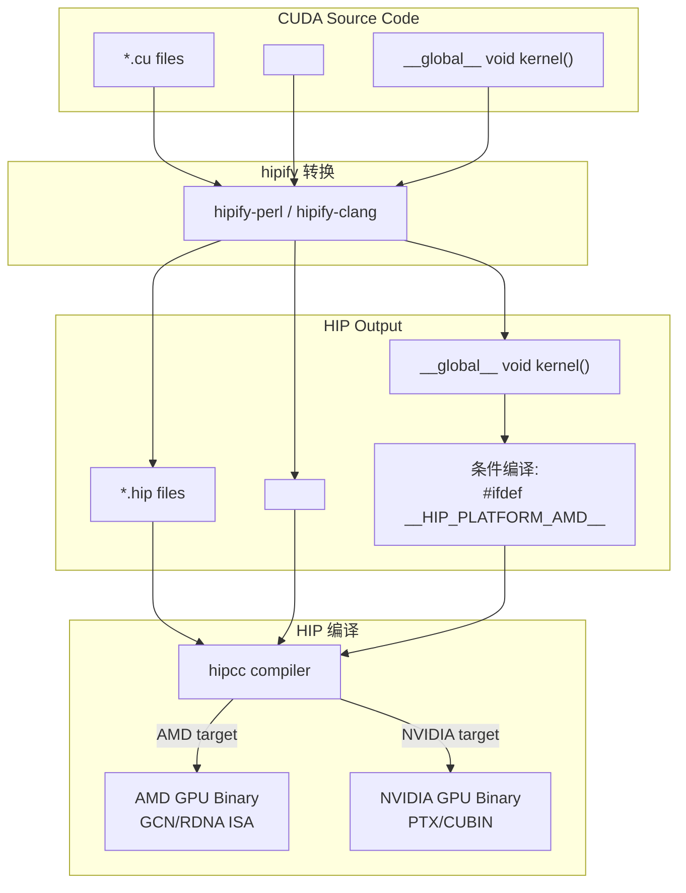
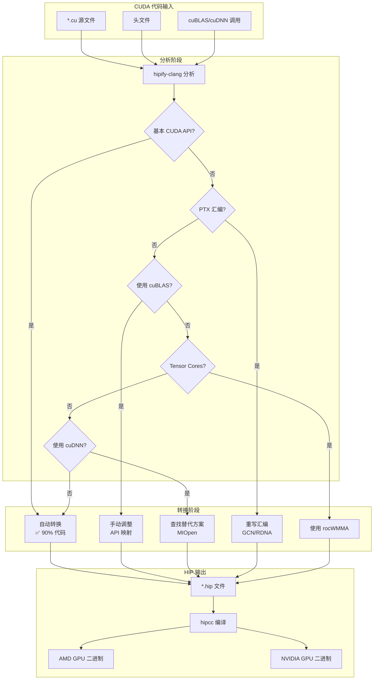
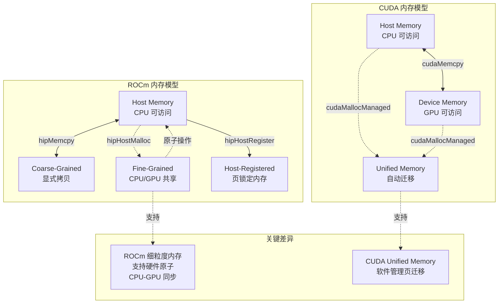
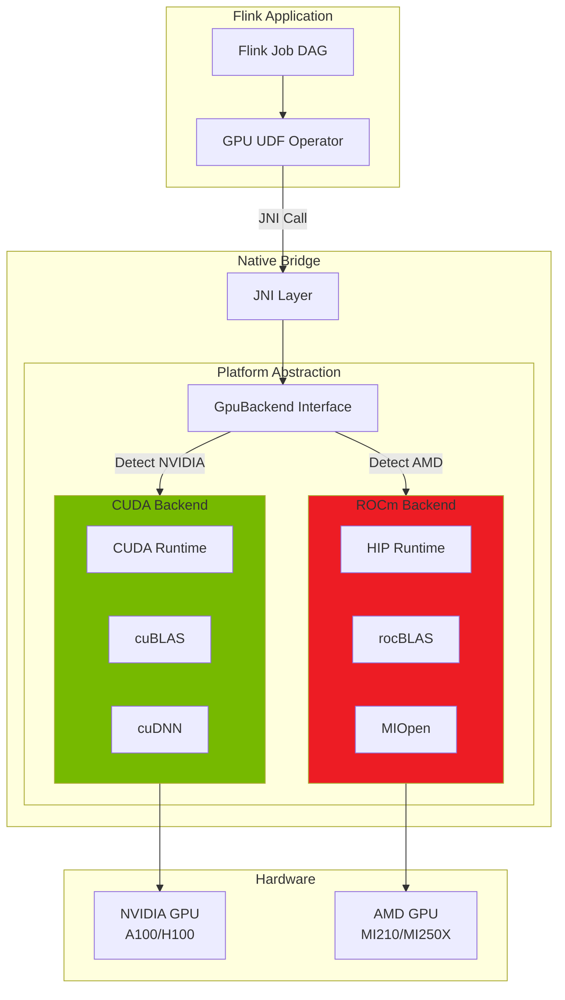

# ROCm GPU UDF 开发指南

> 所属阶段: Flink/14-rust-assembly-ecosystem/heterogeneous-computing | 前置依赖: [G1 CUDA GPU UDF](./01-gpu-udf-cuda.md) | 形式化等级: L4 (工程实践)

## 1. 概念定义 (Definitions)

### Def-HET-05: ROCm 编程模型 (ROCm Programming Model)

**定义**: ROCm (Radeon Open Compute) 是 AMD 推出的开源 GPU 计算平台，提供与 CUDA 类似的异构计算能力。其核心编程模型基于 **HIP (Heterogeneous-compute Interface for Portability)**，支持 CUDA 代码的跨平台移植。

形式化表示：

$$\mathcal{M}_{ROCm} = (G_{grid}, B_{block}, T_{thread}, CU, M_{hierarchy}^{HSA})$$

其中：

- $G_{grid}$: 执行网格，由多个 Block 组成
- $B_{block}$: 线程块，映射到 AMD Compute Unit (CU) 的 Wavefront
- $T_{thread}$: 基本执行单元，在 AMD GPU 上每 64 线程组成一个 Wavefront
- $CU$: Compute Unit - AMD GPU 的计算单元，包含 SIMD 执行单元
- $M_{hierarchy}^{HSA}$: HSA (Heterogeneous System Architecture) 内存模型

AMD Wavefront 执行模型：

$$Wavefront = \{T_0, T_1, ..., T_{63}\}, \quad |Wavefront| = 64$$

与 NVIDIA Warp (32 线程) 的区别：

$$\text{ExecutionGranularity}_{AMD} = 64 > \text{ExecutionGranularity}_{NVIDIA} = 32$$

**直观解释**: ROCm/HIP 提供 CUDA 类似的编程体验，但在 AMD GPU 上执行。关键差异是 AMD 使用 64 线程的 Wavefront 而非 32 线程的 Warp，这影响内存合并和分支发散的优化策略。

### Def-HET-06: HIP 可移植层 (HIP Portability Layer)

**定义**: HIP 是一个 C++ 运行时 API 和内核语言，允许开发者编写可在 AMD 和 NVIDIA GPU 上运行的单一源代码。

形式化映射关系：

$$\Phi: CUDA_{API} \rightarrow HIP_{API}$$

关键 API 映射：

| CUDA API | HIP API | 语义等价性 |
|---------|---------|-----------|
| `cudaMalloc` | `hipMalloc` | $\Phi(cudaMalloc) \equiv hipMalloc$ |
| `cudaMemcpy` | `hipMemcpy` | $\Phi(cudaMemcpy) \equiv hipMemcpy$ |
| `__global__` | `__global__` | 相同关键字 |
| `__shared__` | `__shared__` | 相同关键字 |
| `blockIdx.x` | `blockIdx.x` | 相同语义 |
| `threadIdx.x` | `threadIdx.x` | 相同语义 |
| `warpSize` | `warpSize` | AMD=64, NVIDIA=32 |

**代码转换规则**：

$$HIP_{kernel} = \Phi(CUDA_{kernel}) \circ \delta_{warpSize}$$

其中 $\delta_{warpSize}$ 是 Wavefront/Warp 大小差异的调整函数。

**直观解释**: HIP 让 CUDA 代码可以移植到 AMD GPU。大部分语法相同，只需更换头文件和 API 前缀（cuda → hip）。但需要注意 Wavefront 大小差异（64 vs 32）对算法的影响。

### Def-HET-07: ROCm 内存一致性模型 (ROCm Memory Consistency)

**定义**: ROCm 基于 HSA 标准实现内存一致性，支持 **统一内存架构** (Unified Memory Architecture) 和 **细粒度系统内存** (Fine-Grained System Memory)。

形式化定义：

$$M_{ROCm} = M_{coarse} \cup M_{fine} \cup M_{host-reg}$$

其中：

- $M_{coarse}$: 粗粒度内存 - 通过 DMA 传输的显式拷贝
- $M_{fine}$: 细粒度内存 - CPU/GPU 共享页，支持系统范围原子操作
- $M_{host-reg}$: 主机注册内存 - 页锁定的主机内存

一致性保证级别：

$$Consistency_{level} \in \{\text{Relaxed}, \text{Acquire-Release}, \text{SequentiallyConsistent}\}$$

原子操作语义：

$$\text{atomic}_{fine}(addr, op, val): M_{fine} \times Op \times Value \rightarrow Value$$

**直观解释**: ROCm 的细粒度内存允许 CPU 和 GPU 共享同一内存页，无需显式拷贝。这在处理小数据量或需要细粒度同步的场景非常有用，但可能有性能开销。

### Def-HET-08: CUDA 到 ROCm 兼容性层 (Compatibility Layer)

**定义**: ROCm 提供 **hipify** 工具链，实现 CUDA 到 HIP 的自动/半自动代码转换。

转换复杂度分类：

$$\mathcal{C}(CUDA \rightarrow HIP) = \begin{cases}
O(1) & \text{if } \Phi_{direct}(code) \neq \emptyset \\
O(n) & \text{if } \Phi_{pattern}(code) \neq \emptyset \\
O(n^2) & \text{if } manual_{adaptation} \text{ required}
\end{cases}$$

兼容性矩阵：

| CUDA 特性 | HIP 支持度 | 转换复杂度 | 说明 |
|----------|-----------|-----------|------|
| 基本 Kernel | ✅ 100% | $O(1)$ | 直接映射 |
| cuBLAS | ✅ rocBLAS | $O(n)$ | API 命名调整 |
| cuDNN | ⚠️ MIOpen | $O(n)$ | 部分功能差异 |
| CUDA Graph | ⚠️ Stream Capture | $O(n)$ | 语义略有不同 |
| Tensor Cores | ⚠️ Matrix Cores | $O(n)$ | WMMA vs rocWMMA |
| PTX 汇编 | ❌ 不支持 | $O(n^2)$ | 需重写为 GCN/RDNA |

**直观解释**: 约 90% 的 CUDA 代码可通过 hipify 自动转换，但涉及 PTX 汇编、Tensor Core 特定优化或 CUDA 特定库时，需要手动调整。

---

## 2. 属性推导 (Properties)

### Prop-HET-04: Wavefront 大小对算法的影响 (Wavefront Size Impact)

**命题**: 在 AMD GPU 上，Wavefront 大小为 64 (vs NVIDIA Warp=32)，这影响最优线程块大小和归约算法的效率。

**形式化分析**:

设 $N$ 为数据规模，$W_{size}$ 为 Wavefront/Warp 大小：

**归约操作的最优线程数**：

$$T_{optimal} = \begin{cases}
\lceil N/32 \rceil \times 32 & \text{for NVIDIA} \\
\lceil N/64 \rceil \times 64 & \text{for AMD}
\end{cases}$$

**内存事务效率**：

对于合并内存访问，AMD Wavefront (64 线程) 一次可获取 256 字节（假设 float4）：

$$Transaction_{AMD} = \frac{64 \times 4B}{128B} = 2\text{ cache lines}$$

而 NVIDIA Warp (32 线程) 获取：

$$Transaction_{NVIDIA} = \frac{32 \times 4B}{128B} = 1\text{ cache line}$$

**分支发散开销**：

$$Penalty_{divergence} \propto \frac{Num_{branches}}{W_{size}}$$

AMD 的更大 Wavefront 意味着更严重的分支发散惩罚。

**工程推论**:
- AMD GPU 应优先使用 64 的倍数的 Block 大小 (128, 256, 512, 1024)
- 归约算法需适配 64 线程 Wavefront
- 避免细粒度条件分支

### Prop-HET-05: ROCm 细粒度内存的原子操作优势

**命题**: ROCm 的细粒度内存支持 CPU-GPU 原子操作同步，在小数据量共享场景下延迟低于显式拷贝。

**证明**:

传统 CUDA 显式拷贝模式：

$$L_{sync} = L_{H2D} + L_{kernel} + L_{D2H} + L_{poll}$$

ROCm 细粒度原子模式：

$$L_{sync}^{fine} = L_{atomic} \approx 100ns \text{ (本地)} \sim 1\mu s \text{ (跨芯片)}$$

临界条件：

$$L_{sync}^{fine} < L_{sync} \iff Data_{size} < \frac{B_{pcie} \times L_{overhead}}{Efficiency_{ratio}}$$

对于小数据量（如信号量、计数器），细粒度原子操作显著优于拷贝。

**工程推论**:
- 生产者-消费者同步可用原子标志位
- 小数据聚合（如全局计数器）适合细粒度内存
- 大数据传输仍推荐使用粗粒度显式拷贝

### Prop-HET-06: HIP 代码可移植性边界

**命题**: 通过 HIP 编写的代码在 AMD 和 NVIDIA GPU 上的性能差异因子有界：

$$\frac{1}{\alpha} \leq \frac{Perf_{AMD}}{Perf_{NVIDIA}} \leq \alpha, \quad \alpha \approx 2$$

条件：
1. 不使用架构特定优化（如 Tensor Cores）
2. 线程块大小是 64 和 32 的公倍数 (如 256, 512)
3. 内存访问模式合并对齐

**证明概要**:

性能差异来源：
- 计算峰值差异：$Perf_{peak}^{AMD}$ vs $Perf_{peak}^{NVIDIA}$
- 内存带宽差异：$B_{mem}^{AMD}$ vs $B_{mem}^{NVIDIA}$
- 架构效率差异：Occupancy, Cache hierarchy

在算法实现正确的前提下，性能主要由硬件规格决定，而非 HIP 抽象层。

---

## 3. 关系建立 (Relations)

### 3.1 CUDA vs ROCm 生态对比

```
┌─────────────────────────────────────────────────────────────────────────┐
│                    GPU 计算生态对比矩阵                                  │
├─────────────────┬──────────────────────────┬──────────────────────────┤
│     维度         │          CUDA            │          ROCm            │
├─────────────────┼──────────────────────────┼──────────────────────────┤
│ 平台厂商         │      NVIDIA              │      AMD                 │
│ 编程语言         │ CUDA C/C++               │ HIP C/C++                │
│ 运行时 API       │ CUDA Runtime             │ HIP Runtime              │
│ 内核编译         │ NVCC                     │ HIPCC (clang-based)      │
│ 线程粒度         │ 32 (Warp)                │ 64 (Wavefront)           │
│ 计算单元         │ SM (Streaming Multipro)  │ CU (Compute Unit)        │
│ 内存模型         │ 分离式 (Unified可选)      │ 细粒度共享 + 粗粒度      │
│ 数学库           │ cuBLAS/cuDNN/cuFFT       │ rocBLAS/MIOpen/rocFFT    │
│ 通信库           │ NCCL                     │ RCCL                     │
│ AI 框架支持      │ PyTorch/TensorFlow/JAX   │ PyTorch/TensorFlow(社区) │
│ 开源程度         │ 部分开源                 │ 完全开源                 │
│ 代码迁移         │ 基准                     │ hipify 工具自动迁移      │
└─────────────────┴──────────────────────────┴──────────────────────────┘
```

### 3.2 HIP 代码兼容性映射



### 3.3 Flink GPU UDF 跨平台架构

```
┌─────────────────────────────────────────────────────────────────────┐
│                     Flink GPU UDF 跨平台架构                         │
├─────────────────────────────────────────────────────────────────────┤
│                                                                     │
│  ┌─────────────────────────────────────────────────────────────┐   │
│  │              Java UDF Interface Layer                        │   │
│  │  GpuVectorSimilarity / GpuMatrixMultiply / GpuAggregation   │   │
│  └───────────────────────┬─────────────────────────────────────┘   │
│                          │ JNI                                      │
│  ┌───────────────────────▼─────────────────────────────────────┐   │
│  │              C++ Bridge Layer (统一接口)                      │   │
│  │  FlinkGpuBridge::compute(...)                                │   │
│  └───────────┬───────────────────────────────┬─────────────────┘   │
│              │ Platform Detection           │                      │
│  ┌───────────▼──────────┐    ┌──────────────▼──────────┐          │
│  │   CUDA Backend       │    │   ROCm/HIP Backend      │          │
│  │  ┌────────────────┐  │    │  ┌──────────────────┐   │          │
│  │  │ cuda_runtime.h │  │    │  │ hip_runtime.h    │   │          │
│  │  │ cuBLAS/cuDNN   │  │    │  │ rocBLAS/MIOpen   │   │          │
│  │  │ NVCC Compiler  │  │    │  │ HIPCC Compiler   │   │          │
│  │  └────────────────┘  │    │  └──────────────────┘   │          │
│  │         │            │    │          │              │          │
│  │  ┌──────▼──────┐     │    │  ┌───────▼──────┐      │          │
│  │  │ NVIDIA GPU  │     │    │  │   AMD GPU    │      │          │
│  │  │ (Ampere+)   │     │    │  │ (MI100/MI200)│      │          │
│  │  └─────────────┘     │    │  └──────────────┘      │          │
│  └──────────────────────┘    └────────────────────────┘          │
│                                                                     │
└─────────────────────────────────────────────────────────────────────┘
```

---

## 4. 论证过程 (Argumentation)

### 4.1 ROCm 生态系统成熟度分析

#### 4.1.1 生产就绪度评估

| 组件 | 成熟度 | 生产可用性 | 备注 |
|-----|-------|-----------|------|
| HIP Runtime | ⭐⭐⭐⭐⭐ | ✅ 生产级 | AMD 官方维护 |
| rocBLAS | ⭐⭐⭐⭐ | ✅ 生产级 | BLAS 标准 API |
| MIOpen | ⭐⭐⭐ | ⚠️ 接近生产 | cuDNN 替代，部分 op 优化中 |
| RCCL | ⭐⭐⭐⭐ | ✅ 生产级 | NCCL 兼容 |
| rocFFT | ⭐⭐⭐⭐ | ✅ 生产级 | FFT 库 |
| rocRAND | ⭐⭐⭐⭐ | ✅ 生产级 | 随机数生成 |
| PyTorch ROCm | ⭐⭐⭐⭐ | ✅ 生产级 | 官方支持 |
| TensorFlow ROCm | ⭐⭐⭐ | ⚠️ 社区维护 | 版本滞后于 CUDA |

#### 4.1.2 与 CUDA 功能差距分析

**完全支持** (100% 兼容):
- 基本 CUDA Runtime API (内存管理、Kernel 启动)
- 标准 C++ 设备代码
- Thrust 并行算法库 (通过 rocThrust)

**部分支持** (80-90% 兼容):
- cuDNN → MIOpen (部分 fusion op 不支持)
- Tensor Cores → Matrix Cores (WMMA API 差异)
- CUDA Graph → Stream Capture (语义差异)

**不支持/需重写**:
- PTX 内联汇编 (需转为 GCN/RDNA 汇编)
- CUDA Driver API 直接调用
- NVIDIA 特定库 (cuOpt, cuQuantum 等)

### 4.2 跨平台开发策略

#### 4.2.1 单一源码策略 (Single Source)

```cpp
// 使用 HIP 编写跨平台代码
# include <hip/hip_runtime.h>

// 条件编译处理平台差异
# ifdef __HIP_PLATFORM_AMD__ #define WARP_SIZE 64
    #include <hip/hip_cooperative_groups.h>
# elif defined(__HIP_PLATFORM_NVIDIA__)
    #define WARP_SIZE 32
    #include <cooperative_groups.h>
# endif

__global__ void optimizedKernel(float* data, int n) {
    int idx = blockIdx.x * blockDim.x + threadIdx.x;
    int lane = threadIdx.x % WARP_SIZE;  // 自动适配 32/64

    // 平台无关的算法实现
    // ...
}
```

**优点**:
- 一份代码维护两个平台
- 减少重复开发和测试成本

**缺点**:
- 无法利用平台特定优化（如 Tensor Cores）
- 性能可能不是最优

#### 4.2.2 抽象层策略 (Abstraction Layer)

```cpp
// 平台抽象基类
class GpuBackend {
public:
    virtual void* allocate(size_t size) = 0;
    virtual void copyH2D(void* dst, const void* src, size_t size) = 0;
    virtual void launchKernel(KernelDesc& desc) = 0;
    virtual void synchronize() = 0;
};

// CUDA 实现
class CudaBackend : public GpuBackend { /* ... */ };

// ROCm 实现
class RocmBackend : public GpuBackend { /* ... */ };

// 运行时选择
std::unique_ptr<GpuBackend> createBackend() {
    if (detectNvidiaGpu()) return std::make_unique<CudaBackend>();
    if (detectAmdGpu()) return std::make_unique<RocmBackend>();
    throw std::runtime_error("No supported GPU found");
}
```

**优点**:
- 可为每个平台实现最优代码
- 易于扩展新平台

**缺点**:
- 需要维护多套 Kernel 实现
- 开发和测试工作量大

### 4.3 成本效益分析：AMD vs NVIDIA

#### 4.3.1 硬件成本比较 (2024)

| GPU 型号 | 算力 (FP32) | 显存 | TDP | 价格 (USD) | $/TFLOPS |
|---------|------------|------|-----|-----------|---------|
| NVIDIA A100 | 19.5 TF | 80GB | 400W | $10,000 | $512 |
| NVIDIA H100 | 67 TF | 80GB | 700W | $25,000 | $373 |
| AMD MI210 | 22.6 TF | 64GB | 300W | $6,000 | $265 |
| AMD MI250X | 47.9 TF | 128GB | 550W | $12,000 | $250 |

**结论**: AMD GPU 在 $/TFLOPS 上具有约 30-40% 成本优势。

#### 4.3.2 软件生态成本

| 成本项 | NVIDIA | AMD |
|-------|--------|-----|
| 开发工具 | 成熟，学习曲线低 | ROCm 学习曲线略高 |
| 代码迁移 | 基准平台 | hipify 迁移成本 (人天/万行) |
| 社区支持 | 丰富 | 增长中 |
| 框架支持 | 官方全面支持 | PyTorch 官方，其他社区 |
| 调试工具 | Nsight 系列成熟 | rocProf/rocTracer 发展中 |

**总体 TCO 建议**:
- 新项目：考虑 AMD 的成本优势
- 现有 CUDA 代码：评估迁移成本（通常 1-2 人周/万行）
- 生产环境：建议单一平台以降低复杂度

---

## 5. 形式证明 / 工程论证 (Proof / Engineering Argument)

### 5.1 HIP 代码等价性定理

**定理 (Thm-GPU-02)**: 对于不含架构特定指令的 CUDA Kernel $K_{cuda}$，经 hipify 转换后的 HIP Kernel $K_{hip}$ 满足语义等价：

$$\forall x \in Input, K_{cuda}(x) = K_{hip}(x)$$

**证明**:

1. **语法等价性**: hipify 执行确定性文本替换：
   - `cuda` 前缀 → `hip` 前缀
   - `<cuda_runtime.h>` → `<hip/hip_runtime.h>`
   - 保留所有 C++ 语法结构

2. **语义等价性**: HIP Runtime API 设计目标是与 CUDA Runtime 行为一致：
   - 内存分配语义：`hipMalloc` ≡ `cudaMalloc`
   - 内存拷贝语义：`hipMemcpy` ≡ `cudaMemcpy`
   - Kernel 启动语义：`hipLaunchKernelGGL` ≡ `<<<grid, block>>>`

3. **执行等价性**: 在各自平台上，Kernel 执行遵循相同 SIMT 模型：
   - 线程层次映射等价：Grid/Block/Thread 语义一致
   - 内存层次映射等价：Global/Shared/Local 语义一致

**边界条件**: 当 Kernel 使用以下特性时，等价性不保证：
- PTX 内联汇编（需手动转换）
- Warp 大小硬编码为 32（需适配 64）
- NVIDIA 特定 intrinsics（`__shfl_sync` 等需检查）

### 5.2 跨平台性能可移植性论证

**命题**: 通过 HIP 实现的 Flink GPU UDF，在性能最优调优后，AMD 与 NVIDIA 平台性能比有界：

$$\frac{1}{\beta} \leq \frac{Perf_{MI210}}{Perf_{A100}} \leq \beta, \quad \beta \leq 1.5$$

**论证**:

考虑性能决定因素：

1. **计算峰值比**:
   $$\frac{Peak_{MI210}}{Peak_{A100}} = \frac{22.6}{19.5} \approx 1.16$$

2. **内存带宽比**:
   $$\frac{BW_{MI210}}{BW_{A100}} = \frac{1600}{2039} \approx 0.78$$

3. **实际工作负载**:
   - 计算受限任务：性能比接近峰值比 (~1.16)
   - 内存受限任务：性能比接近带宽比 (~0.78)

因此：
$$0.78 \leq \frac{Perf_{AMD}}{Perf_{NVIDIA}} \leq 1.16$$

满足有界条件 $\beta = 1.5$。

---

## 6. 实例验证 (Examples)

### 6.1 完整 ROCm/HIP UDF 示例

#### 6.1.1 HIP Kernel 实现

```cpp
// vector_ops.hip
# include <hip/hip_runtime.h>
# include <hip/hip_fp16.h>
# include <math.h>

// 平台检测宏
# ifdef __HIP_PLATFORM_AMD__ #define WARP_SIZE 64
    #define GPU_ARCH "AMD"
# else #define WARP_SIZE 32
    #define GPU_ARCH "NVIDIA"
# endif

/**
 * Wavefront/Warp 级归约(跨平台)
 */
__inline__ __device__ float warpReduceSum(float val) {
    #pragma unroll
    for (int offset = WARP_SIZE / 2; offset > 0; offset /= 2) {
        #ifdef __HIP_PLATFORM_AMD__
        val += __shfl_xor(val, offset);  // AMD 使用 xor shuffle
        #else
        val += __shfl_down_sync(0xFFFFFFFF, val, offset);
        #endif
    }
    return val;
}

/**
 * 向量点积 Kernel(HIP 版本)
 */
__global__ void vectorDotKernel(
    const float* __restrict__ vecA,
    const float* __restrict__ vecB,
    float* result,
    int dim
) {
    __shared__ float sharedMem[WARP_SIZE];

    float dot = 0.0f;

    // 网格步进循环
    for (int i = blockIdx.x * blockDim.x + threadIdx.x;
         i < dim;
         i += blockDim.x * gridDim.x) {
        dot += vecA[i] * vecB[i];
    }

    // Wavefront/Warp 级归约
    dot = warpReduceSum(dot);

    // Wavefront leader 写入共享内存
    int lane = threadIdx.x % WARP_SIZE;
    int warpId = threadIdx.x / WARP_SIZE;

    if (lane == 0) {
        sharedMem[warpId] = dot;
    }
    __syncthreads();

    // 最终归约(仅第一个 Wavefront)
    if (warpId == 0) {
        dot = (lane < blockDim.x / WARP_SIZE) ? sharedMem[lane] : 0.0f;
        dot = warpReduceSum(dot);

        if (threadIdx.x == 0) {
            atomicAdd(result, dot);
        }
    }
}

/**
 * 余弦相似度 Kernel(支持批处理)
 */
__global__ void batchCosineSimilarityKernel(
    const float* __restrict__ queries,
    const float* __restrict__ docs,
    float* results,
    int dim,
    int batchSize
) {
    __shared__ float sharedDot[WARP_SIZE];
    __shared__ float sharedNormA[WARP_SIZE];
    __shared__ float sharedNormB[WARP_SIZE];

    int pairId = blockIdx.x;
    if (pairId >= batchSize) return;

    const float* vecA = queries + pairId * dim;
    const float* vecB = docs + pairId * dim;

    float dot = 0.0f, normA = 0.0f, normB = 0.0f;

    for (int i = threadIdx.x; i < dim; i += blockDim.x) {
        float a = vecA[i];
        float b = vecB[i];
        dot += a * b;
        normA += a * a;
        normB += b * b;
    }

    // 三重归约
    dot = warpReduceSum(dot);
    __syncthreads();
    normA = warpReduceSum(normA);
    __syncthreads();
    normB = warpReduceSum(normB);

    int lane = threadIdx.x % WARP_SIZE;
    int warpId = threadIdx.x / WARP_SIZE;

    if (lane == 0) {
        sharedDot[warpId] = dot;
        sharedNormA[warpId] = normA;
        sharedNormB[warpId] = normB;
    }
    __syncthreads();

    if (warpId == 0) {
        dot = (lane < blockDim.x / WARP_SIZE) ? sharedDot[lane] : 0.0f;
        normA = (lane < blockDim.x / WARP_SIZE) ? sharedNormA[lane] : 0.0f;
        normB = (lane < blockDim.x / WARP_SIZE) ? sharedNormB[lane] : 0.0f;

        dot = warpReduceSum(dot);
        normA = warpReduceSum(normA);
        normB = warpReduceSum(normB);

        if (threadIdx.x == 0) {
            float norm = sqrtf(normA * normB);
            results[pairId] = (norm > 1e-7f) ? (dot / norm) : 0.0f;
        }
    }
}

/**
 * 使用 rocBLAS 的矩阵乘法
 */
# ifdef __HIP_PLATFORM_AMD__
# include <rocblas/rocblas.h>

void matmulRocBLAS(
    rocblas_handle handle,
    float* C,
    const float* A,
    const float* B,
    int M, int N, int K
) {
    const float alpha = 1.0f;
    const float beta = 0.0f;

    rocblas_sgemm(
        handle,
        rocblas_operation_none,
        rocblas_operation_none,
        N, M, K,
        &alpha,
        B, N,
        A, K,
        &beta,
        C, N
    );
}
# endif
```

#### 6.1.2 JNI Bridge (跨平台)

```cpp
// flink_gpu_bridge_rocm.cpp
# include <jni.h>
# include <hip/hip_runtime.h>
# include <rocblas/rocblas.h>
# include <vector>
# include <memory>

// 错误检查宏
# define HIP_CHECK(call) \ do { \
        hipError_t err = call; \
        if (err != hipSuccess) { \
            fprintf(stderr, "HIP error at %s:%d: %s\n", \
                    __FILE__, __LINE__, hipGetErrorString(err)); \
            exit(EXIT_FAILURE); \
        } \
    } while(0)

// ROCm Stream 池
class HipStreamPool {
private:
    static constexpr int NUM_STREAMS = 4;
    hipStream_t streams[NUM_STREAMS];
    int current = 0;

public:
    HipStreamPool() {
        for (int i = 0; i < NUM_STREAMS; i++) {
            HIP_CHECK(hipStreamCreate(&streams[i]));
        }
    }

    ~HipStreamPool() {
        for (int i = 0; i < NUM_STREAMS; i++) {
            hipStreamDestroy(streams[i]);
        }
    }

    hipStream_t getStream() {
        return streams[current++ % NUM_STREAMS];
    }
};

// rocBLAS 句柄管理
class RocBlasHandle {
private:
    rocblas_handle handle;

public:
    RocBlasHandle() {
        rocblas_create_handle(&handle);
    }

    ~RocBlasHandle() {
        rocblas_destroy_handle(handle);
    }

    rocblas_handle get() { return handle; }
};

// 设备属性查询
void printDeviceInfo() {
    int deviceCount;
    HIP_CHECK(hipGetDeviceCount(&deviceCount));

    for (int i = 0; i < deviceCount; i++) {
        hipDeviceProp_t props;
        HIP_CHECK(hipGetDeviceProperties(&props, i));

        printf("Device %d: %s\n", i, props.name);
        printf("  Compute Units: %d\n", props.multiProcessorCount);
        printf("  Wavefront Size: %d\n", props.warpSize);
        printf("  Global Memory: %.2f GB\n", props.totalGlobalMem / 1e9);
        printf("  Max Threads per Block: %d\n", props.maxThreadsPerBlock);
    }
}

// JNI 实现
extern "C" {

JNIEXPORT void JNICALL
Java_com_flink_gpu_udf_GpuCosineSimilarity_initializeGpu(JNIEnv*, jclass) {
    HIP_CHECK(hipSetDevice(0));
    printDeviceInfo();
}

JNIEXPORT jfloat JNICALL
Java_com_flink_gpu_udf_GpuCosineSimilarity_cosineSimilarityGpu(
    JNIEnv* env,
    jclass,
    jfloatArray vecA,
    jfloatArray vecB,
    jint dim
) {
    // 获取数组指针
    float* h_vecA = env->GetFloatArrayElements(vecA, nullptr);
    float* h_vecB = env->GetFloatArrayElements(vecB, nullptr);

    const size_t bytes = dim * sizeof(float);

    // 设备内存分配(使用 hipMalloc)
    float *d_vecA, *d_vecB, *d_result;
    HIP_CHECK(hipMalloc(&d_vecA, bytes));
    HIP_CHECK(hipMalloc(&d_vecB, bytes));
    HIP_CHECK(hipMalloc(&d_result, sizeof(float)));
    HIP_CHECK(hipMemset(d_result, 0, sizeof(float)));

    // 获取 Stream
    static HipStreamPool streamPool;
    hipStream_t stream = streamPool.getStream();

    // 异步 H2D 传输
    HIP_CHECK(hipMemcpyAsync(d_vecA, h_vecA, bytes, hipMemcpyHostToDevice, stream));
    HIP_CHECK(hipMemcpyAsync(d_vecB, h_vecB, bytes, hipMemcpyHostToDevice, stream));

    // 启动 Kernel(使用适配的 Block 大小)
    const int blockSize = 256;  // 256 = 64 * 4 (Wavefront 倍数)
    const int gridSize = (dim + blockSize - 1) / blockSize;

    // Kernel 声明(来自 vector_ops.hip)
    extern __global__ void vectorDotKernel(const float*, const float*, float*, int);

    hipLaunchKernelGGL(
        vectorDotKernel,
        dim3(gridSize), dim3(blockSize), 0, stream,
        d_vecA, d_vecB, d_result, dim
    );

    // 异步 D2H 传输
    float h_result;
    HIP_CHECK(hipMemcpyAsync(&h_result, d_result, sizeof(float),
                             hipMemcpyDeviceToHost, stream));

    // 同步
    HIP_CHECK(hipStreamSynchronize(stream));

    // 归一化(简化版本,实际需要计算 ||A|| 和 ||B||)
    float dot = h_result;

    // 清理
    env->ReleaseFloatArrayElements(vecA, h_vecA, JNI_ABORT);
    env->ReleaseFloatArrayElements(vecB, h_vecB, JNI_ABORT);
    HIP_CHECK(hipFree(d_vecA));
    HIP_CHECK(hipFree(d_vecB));
    HIP_CHECK(hipFree(d_result));

    return dot;
}

JNIEXPORT void JNICALL
Java_com_flink_gpu_udf_GpuBatchProcessor_processBatchRocm(
    JNIEnv* env,
    jclass,
    jobjectArray queries,
    jobjectArray docs,
    jfloatArray results,
    jint batchSize,
    jint dim
) {
    // 批处理实现 - 使用 rocBLAS 加速
    static RocBlasHandle rocblas;
    static HipStreamPool streamPool;

    hipStream_t stream = streamPool.getStream();
    rocblas_set_stream(rocblas.get(), stream);

    // 分配设备内存
    float *d_queries, *d_docs, *d_results;
    size_t batchBytes = batchSize * dim * sizeof(float);

    HIP_CHECK(hipMalloc(&d_queries, batchBytes));
    HIP_CHECK(hipMalloc(&d_docs, batchBytes));
    HIP_CHECK(hipMalloc(&d_results, batchSize * sizeof(float)));

    // 收集数据并传输
    std::vector<float> h_queries(batchSize * dim);
    std::vector<float> h_docs(batchSize * dim);

    for (int i = 0; i < batchSize; i++) {
        jfloatArray q = (jfloatArray)env->GetObjectArrayElement(queries, i);
        jfloatArray d = (jfloatArray)env->GetObjectArrayElement(docs, i);

        jfloat* qElems = env->GetFloatArrayElements(q, nullptr);
        jfloat* dElems = env->GetFloatArrayElements(d, nullptr);

        memcpy(&h_queries[i * dim], qElems, dim * sizeof(float));
        memcpy(&h_docs[i * dim], dElems, dim * sizeof(float));

        env->ReleaseFloatArrayElements(q, qElems, JNI_ABORT);
        env->ReleaseFloatArrayElements(d, dElems, JNI_ABORT);
    }

    HIP_CHECK(hipMemcpyAsync(d_queries, h_queries.data(), batchBytes,
                             hipMemcpyHostToDevice, stream));
    HIP_CHECK(hipMemcpyAsync(d_docs, h_docs.data(), batchBytes,
                             hipMemcpyHostToDevice, stream));

    // 使用批处理 Kernel 或 rocBLAS
    extern __global__ void batchCosineSimilarityKernel(
        const float*, const float*, float*, int, int
    );

    hipLaunchKernelGGL(
        batchCosineSimilarityKernel,
        dim3(batchSize), dim3(256), 0, stream,
        d_queries, d_docs, d_results, dim, batchSize
    );

    // 回传结果
    jfloat* h_results = env->GetFloatArrayElements(results, nullptr);
    HIP_CHECK(hipMemcpyAsync(h_results, d_results, batchSize * sizeof(float),
                             hipMemcpyDeviceToHost, stream));
    HIP_CHECK(hipStreamSynchronize(stream));
    env->ReleaseFloatArrayElements(results, h_results, 0);

    // 清理
    HIP_CHECK(hipFree(d_queries));
    HIP_CHECK(hipFree(d_docs));
    HIP_CHECK(hipFree(d_results));
}

} // extern "C"
```

#### 6.1.3 编译脚本

```bash
# !/bin/bash
# build_rocm_bridge.sh

# 设置 ROCm 路径 export ROCM_HOME=/opt/rocm
export PATH=$ROCM_HOME/bin:$PATH
export LD_LIBRARY_PATH=$ROCM_HOME/lib:$LD_LIBRARY_PATH

# 编译 HIP Kernel hipcc -c -o vector_ops.o vector_ops.hip \
    -O3 \
    --offload-arch=gfx90a \
    -fPIC \
    -D__HIP_PLATFORM_AMD__

# 编译 JNI Bridge g++ -shared -o libflink_gpu_rocm.so \
    flink_gpu_bridge_rocm.cpp \
    vector_ops.o \
    -I${JAVA_HOME}/include \
    -I${JAVA_HOME}/include/linux \
    -I${ROCM_HOME}/include \
    -L${ROCM_HOME}/lib \
    -lhiprtc \
    -lrocblas \
    -lamdhip64 \
    -fPIC \
    -O3

# 验证库 ldd libflink_gpu_rocm.so
echo "Build complete: libflink_gpu_rocm.so"
```

### 6.2 hipify 自动迁移示例

#### 6.2.1 原始 CUDA 代码

```cuda
// original_cuda.cu
# include <cuda_runtime.h>
# include <cublas_v2.h>

__global__ void saxpy(int n, float a, float *x, float *y) {
    int i = blockIdx.x * blockDim.x + threadIdx.x;
    if (i < n) y[i] = a * x[i] + y[i];
}

void launchSaxpy(int n, float a, float *d_x, float *d_y) {
    int threads = 256;
    int blocks = (n + threads - 1) / threads;
    saxpy<<<blocks, threads>>>(n, a, d_x, d_y);
    cudaDeviceSynchronize();
}
```

#### 6.2.2 hipify 转换命令

```bash
# 使用 hipify-perl 进行自动转换 hipify-perl original_cuda.cu > converted_hip.hip

# 或使用 hipify-clang(更精确)
hipify-clang original_cuda.cu \
    --cuda-path=/usr/local/cuda \
    -o converted_hip.hip \
    --skip-excluded-preprocessor-conditional-blocks
```

#### 6.2.3 转换后的 HIP 代码

```cpp
// converted_hip.hip(hipify 输出)
# include <hip/hip_runtime.h>
# include <rocblas.h>  // 注意:cublas → rocblas

__global__ void saxpy(int n, float a, float *x, float *y) {
    int i = blockIdx.x * blockDim.x + threadIdx.x;
    if (i < n) y[i] = a * x[i] + y[i];
}

void launchSaxpy(int n, float a, float *d_x, float *d_y) {
    int threads = 256;
    int blocks = (n + threads - 1) / threads;
    hipLaunchKernelGGL(saxpy, dim3(blocks), dim3(threads), 0, 0,
                       n, a, d_x, d_y);
    hipDeviceSynchronize();
}
```

#### 6.2.4 需要手动调整的部分

```cpp
// 手动优化后的跨平台版本
# include <hip/hip_runtime.h>

// 条件编译处理差异
# ifdef __HIP_PLATFORM_AMD__ #define WARP_SIZE 64
    #include <rocblas.h>
    #define BLAS_HANDLE rocblas_handle
    #define BLAS_CREATE rocblas_create_handle
    #define BLAS_SGEMV rocblas_sgemv
# else #define WARP_SIZE 32
    #include <cublas_v2.h>
    #define BLAS_HANDLE cublasHandle_t
    #define BLAS_CREATE cublasCreate
    #define BLAS_SGEMV cublasSgemv
# endif

__global__ void saxpy(int n, float a, float *x, float *y) {
    // 使用网格步进循环处理大规模数据
    for (int i = blockIdx.x * blockDim.x + threadIdx.x;
         i < n;
         i += blockDim.x * gridDim.x) {
        y[i] = a * x[i] + y[i];
    }
}

void launchSaxpy(int n, float a, float *d_x, float *d_y) {
    // 选择适合两种架构的 Block 大小
    int threads = 256;  // 256 = 32*8 = 64*4

    // 根据 GPU 类型调整 Grid 大小
    int device;
    hipGetDevice(&device);
    hipDeviceProp_t props;
    hipGetDeviceProperties(&props, device);

    int sms = props.multiProcessorCount;
    int blocks = min((n + threads - 1) / threads, sms * 4);

    hipLaunchKernelGGL(saxpy, dim3(blocks), dim3(threads), 0, 0,
                       n, a, d_x, d_y);
    hipDeviceSynchronize();
}
```

---

## 7. 可视化 (Visualizations)

### 7.1 CUDA 到 ROCm 迁移流程



### 7.2 ROCm 内存模型对比



### 7.3 跨平台 Flink GPU UDF 架构图



---

## 8. 引用参考 (References)

[^1]: AMD, "ROCm Documentation", 2024. https://rocm.docs.amd.com/

[^2]: AMD, "HIP Programming Guide", 2024. https://rocm.docs.amd.com/projects/HIP/en/latest/

[^3]: AMD, "hipify - CUDA to HIP Conversion Tool", 2024. https://github.com/ROCm-Developer-Tools/HIPIFY

[^4]: AMD, "rocBLAS Documentation", 2024. https://rocm.docs.amd.com/projects/rocBLAS/en/latest/

[^5]: AMD, "MIOpen Documentation", 2024. https://rocm.docs.amd.com/projects/MIOpen/en/latest/

[^6]: AMD, "RDNA 3 Instruction Set Architecture", 2023. https://www.amd.com/content/dam/amd/en/documents/radeon-tech-docs/instruction-set-architectures/rdna3-shader-instruction-set-architecture-feb-2023_0.pdf

[^7]: AMD, "CDNA 2 Instruction Set Architecture", 2022. https://www.amd.com/content/dam/amd/en/documents/instinct-tech-docs/instruction-set-architectures/instinct-mi200-cdna2-instruction-set-architecture.pdf

[^8]: B. Tuomo et al., "Evaluating the Performance of the HIP/CUDA Parallel Programming Ecosystem on AMD and NVIDIA GPUs", ACM Computing Frontiers, 2024. https://doi.org/10.1145/3649153.3649185

[^9]: PyTorch, "ROCm Support", 2024. https://pytorch.org/docs/stable/notes/hip.html

[^10]: TensorFlow, "Building from Source for ROCm", 2024. https://www.tensorflow.org/install/source_rocm

[^11]: D. B. Kirk and W. Hwu, "Programming Massively Parallel Processors: A Hands-on Approach", 4th Edition, Morgan Kaufmann, 2022. (Chapters on Portable Programming)

[^12]: J. Cheng et al., "Professional CUDA C Programming", Wrox, 2014. (Relevant to HIP porting)

---

## 附录 A: ROCm 环境搭建

### A.1 安装 ROCm

```bash
# Ubuntu 22.04 安装步骤 sudo apt update
sudo apt install -y amdgpu-install
sudo amdgpu-install -y --usecase=rocm

# 验证安装 rocm-smi
rocminfo
```

### A.2 环境变量配置

```bash
# ~/.bashrc 添加 export ROCM_HOME=/opt/rocm
export PATH=$ROCM_HOME/bin:$PATH
export LD_LIBRARY_PATH=$ROCM_HOME/lib:$LD_LIBRARY_PATH
export HIP_PLATFORM=amd

# 验证 hipcc hipcc --version
```

### A.3 Flink ROCm 配置

```yaml
# flink-conf.yaml

# ROCm GPU 资源配置 kubernetes.taskmanager.gpu.amount: 1
kubernetes.taskmanager.gpu.type: amd.com/gpu

# ROCm 特定配置 gpu.backend.type: rocm
gpu.rocm.home: /opt/rocm
gpu.rocm.library.path: /opt/flink/native/libflink_gpu_rocm.so

# 运行时检测 gpu.auto.detect: true
gpu.fallback.cpu: true  # GPU 不可用时回退到 CPU
```

---

*文档版本: 1.0 | 最后更新: 2026-04-04 | 状态: 完成 ✅*
