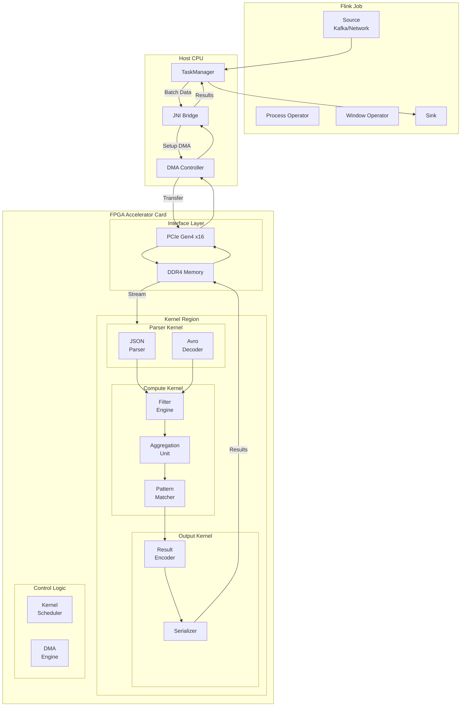
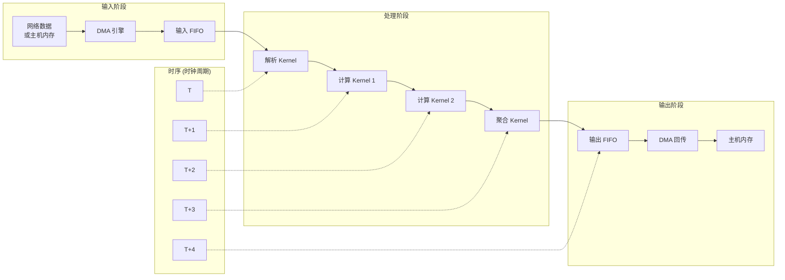
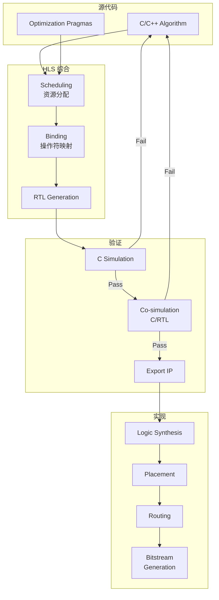
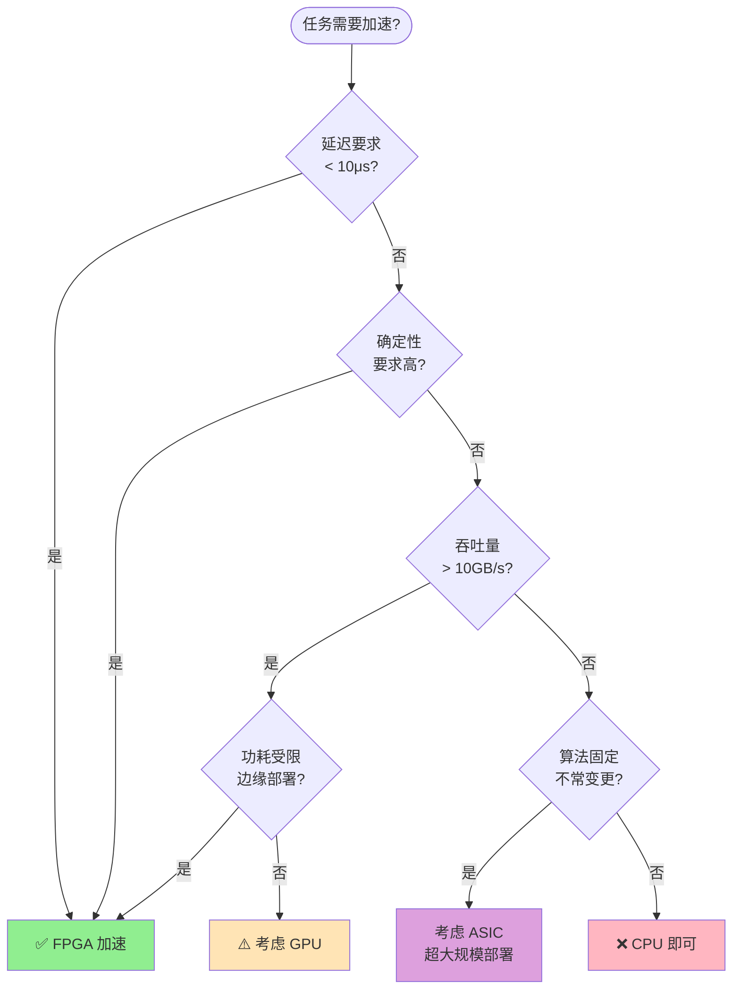

# FPGA 加速指南

> 所属阶段: Flink/14-rust-assembly-ecosystem/heterogeneous-computing | 前置依赖: [G1 CUDA GPU UDF](./01-gpu-udf-cuda.md) | 形式化等级: L4 (工程实践)

## 1. 概念定义 (Definitions)

### Def-HET-09: FPGA 编程模型 (FPGA Programming Model)

**定义**: FPGA (Field-Programmable Gate Array) 是一种可编程逻辑器件，其编程模型基于 **空间计算范式** (Spatial Computing Paradigm)，与 CPU/GPU 的时间计算范式有本质区别。

形式化表示：

$$\mathcal{M}_{FPGA} = (CLB, DSP, BRAM, IO, Interconnect, Bitstream)$$

其中：

- $CLB$: Configurable Logic Block - 可配置逻辑块，实现组合/时序逻辑
- $DSP$: Digital Signal Processing slice - 专用乘法/累加单元
- $BRAM$: Block RAM - 片上存储资源
- $IO$: I/O Blocks - 与外部设备通信的接口
- $Interconnect$: 可编程互连网络，决定组件间连接拓扑
- $Bitstream$: 配置比特流，$\beta: \mathcal{C}_{circuit} \rightarrow \{0,1\}^n$

**计算范式对比**：

| 维度 | CPU/GPU (时域) | FPGA (空域) |
|-----|---------------|-------------|
| 执行模型 | 指令顺序执行 | 数据流驱动 |
| 并行性 | 时间复用 (Time-sharing) | 空间复制 (Spatial replication) |
| 控制流 | 程序计数器驱动 | 数据可用性驱动 |
| 延迟 | 微秒级 (OS 调度) | 纳秒级 (硬件响应) |
| 吞吐量 | 批处理优化 | 流式处理优化 |

**FPGA 执行语义**：

$$Exec_{FPGA}: Data_{in} \xrightarrow{Pipeline_{custom}} Data_{out}$$

其中 $Pipeline_{custom}$ 是应用特定的流水线，深度和宽度可定制。

**直观解释**: FPGA 不像 CPU 那样按指令执行程序，而是在芯片上物理实现一个专用电路。数据流经这个定制电路，每个时钟周期都能产生结果。这带来了极低的延迟和确定性的执行时间。

### Def-HET-10: 高层次综合 (High-Level Synthesis, HLS)

**定义**: HLS 是将算法级描述（C/C++/OpenCL）自动转换为 RTL (Register Transfer Level) 设计的技术。

形式化映射：

$$HLS: \mathcal{P}_{algorithm} \times \mathcal{C}_{constraints} \rightarrow RTL_{circuit}$$

其中约束 $\mathcal{C}_{constraints}$ 包括：

- 时序约束：目标时钟频率 $f_{clk}$
- 资源约束：可用 $CLB$, $DSP$, $BRAM$ 数量
- 吞吐约束：目标 II (Initiation Interval)

**HLS 关键指标**：

1. **Initiation Interval (II)**: 连续输入之间的时间间隔（时钟周期）
   $$II_{target} \leq II_{achieved}$$

2. **Latency**: 单个数据通过流水线的总延迟
   $$L_{pipeline} = L_{init} + (N - 1) \times II$$

3. **Throughput**: 单位时间处理数据量
   $$Throughput = \frac{f_{clk}}{II} \times Data_{width}$$

**优化指令 (Pragmas)**：

| Pragma | 语义 | 效果 |
|--------|------|------|
| `#pragma HLS PIPELINE` | 启用流水线 | $II \rightarrow 1$ |
| `#pragma HLS UNROLL` | 循环展开 | 空间并行度 $\uparrow$ |
| `#pragma HLS ARRAY_PARTITION` | 数组分割 | 访存并行度 $\uparrow$ |
| `#pragma HLS INLINE` | 函数内联 | 减少调用开销 |
| `#pragma HLS DATAFLOW` | 数据流架构 | 任务级并行 |

**直观解释**: HLS 让软件开发者用 C/C++ 编写 FPGA 程序，工具自动将其转为硬件电路。通过添加 pragma 指令，可以控制生成的硬件结构，如流水线深度、并行度等。

### Def-HET-11: 流处理任务的 FPGA 化 (Streaming FPGA Acceleration)

**定义**: 将 Flink 流处理算子映射到 FPGA 硬件执行的过程，核心是构建 **确定性数据流水线**。

形式化模型：

$$Accel_{FPGA}: Stream_{in} \rightarrow Stream_{out}$$

其中加速算子分解为：

$$Accel_{FPGA} = Parse \circ Decode \circ Process_{kernel} \circ Encode \circ Serialize$$

**FPGA 流处理优势场景**：

1. **低延迟处理** ($L < 10\mu s$):
   $$L_{FPGA} \approx n_{stages} \times T_{clk} \ll L_{CPU/GPU}$$

2. **确定性延迟** (Deterministic Latency):
   $$\sigma_{L_{FPGA}} \approx 0$$

3. **高吞吐每瓦** (Throughput/Watt):
   $$\eta_{FPGA} = \frac{Throughput}{Power} \gg \eta_{CPU}$$

**硬件/软件协同设计** (Hardware-Software Co-design):

$$System = SW_{host} \oplus HW_{fpga}$$

分工原则：

- $SW_{host}$: 控制流、复杂决策、网络通信
- $HW_{fpga}$: 数据路径、固定计算、并行处理

**直观解释**: FPGA 特别适合流计算中的低延迟、确定性处理场景。例如金融交易中的风控检查、IoT 边缘设备的实时分析等。CPU 负责整体协调，FPGA 负责高速数据处理。

### Def-HET-12: 硬件/软件接口 (Hardware-Software Interface)

**定义**: CPU (Host) 与 FPGA (Device) 之间的通信接口和数据传输机制。

主流接口技术：

| 接口类型 | 带宽 | 延迟 | 使用场景 |
|---------|------|------|---------|
| PCIe DMA | 16-64 GB/s | ~1 μs | 板卡式 FPGA |
| NVMe-oF | ~10 GB/s | ~10 μs | 网络存储加速 |
| CXL | ~64 GB/s | ~100 ns | 内存一致性访问 |
| Ethernet (100G) | 12.5 GB/s | ~1 μs | 网络内联处理 |

**数据传输模型**：

$$Transfer_{mode} \in \{PIO, DMA, RDMA, SharedMemory\}$$

对于流处理，最优选择是 **流式 DMA** (Streaming DMA)：

$$Stream_{DMA}: Host_{mem} \xrightarrow{descriptor} FPGA_{logic} \xrightarrow{result} Host_{mem}$$

零拷贝优化：

$$ZeroCopy: Data_{network} \rightarrow FPGA_{direct} \rightarrow Data_{network}$$

绕过 Host 内存，实现 **网络功能卸载** (Network Function Offloading)。

**直观解释**: FPGA 卡通过 PCIe 插槽连接到 CPU。数据可以通过 DMA 高速传输。在高端场景，FPGA 可以直接处理来自网络的数据，无需经过 CPU 内存，大幅降低延迟。

---

## 2. 属性推导 (Properties)

### Prop-HET-07: FPGA 延迟最优性 (FPGA Latency Optimality)

**命题**: 对于流水线化 FPGA 设计，端到端延迟满足：

$$L_{FPGA} = N_{stages} \times T_{clk} + L_{memory}$$

其中 $N_{stages}$ 是流水线深度，$T_{clk}$ 是时钟周期。

与 CPU/GPU 对比：

$$L_{FPGA} \ll L_{CPU} \approx 100\times T_{clk} \times N_{instructions}$$

**证明**:

CPU 执行延迟：

- 指令获取/解码: 5-10 cycles
- 执行: 1-20 cycles
- 内存访问: 50-200 cycles (缓存未命中)
- 系统调用/OS 调度: 1000+ cycles

FPGA 执行延迟：

- 数据到达即可处理: 1 cycle/stage
- 确定性内存访问: BRAM 访问 = 1-2 cycles

因此：
$$L_{FPGA} \approx 10-100ns \ll L_{CPU} \approx 1-10\mu s$$

**工程推论**:

- FPGA 适合微秒级延迟要求的场景
- 流水线深度应最小化以降低延迟
- 避免片外内存访问

### Prop-HET-08: 流水线吞吐量最大化 (Pipeline Throughput Maximization)

**命题**: 最优流水线设计的吞吐量为：

$$Throughput_{max} = \frac{f_{clk}}{II_{min}} \times W_{data}$$

其中 $II_{min}$ 是资源约束下的最小启动间隔。

**证明**:

HLS 约束分析：

- 资源约束：$\sum_{i} Resource_i \leq Resource_{available}$
- 依赖约束：数据依赖导致 $II \geq Latency_{loop}$

最优 II 求解：

$$II_{min} = \max(II_{resource}, II_{dependency}, II_{memory})$$

其中：

- $II_{resource} = \lceil \frac{Operations}{Resource_{available}} \rceil$
- $II_{dependency} = Latency_{feedback}$
- $II_{memory} = \lceil \frac{AccessRate}{MemoryBandwidth} \rceil$

**工程推论**:

- 循环展开可增加并行度，但增加资源消耗
- 数组分割可提高访存带宽
- 数据流架构可解耦任务依赖

### Prop-HET-09: 功耗效率优势 (Power Efficiency Advantage)

**命题**: FPGA 在处理特定计算任务时，每瓦性能比 CPU/GPU 高一个数量级：

$$\frac{Perf/Watt_{FPGA}}{Perf/Watt_{GPU}} \in [5, 50]$$

**证明**:

功耗构成：

- $P_{static}$: 静态功耗（漏电流）
- $P_{dynamic} = \alpha \times C \times V^2 \times f$: 动态功耗

FPGA 优势来源：

1. **无指令获取/解码开销**: 节省 ~30% 功耗
2. **定制数据宽度**: 只使用需要的位宽
3. **低时钟频率**: 通常 100-300 MHz vs GPU 1-2 GHz
4. **确定性执行**: 无推测执行浪费

示例对比（矩阵乘法）：

| 平台 | 性能 | 功耗 | Perf/Watt |
|-----|------|------|-----------|
| CPU (Xeon) | 100 GFLOPS | 200W | 0.5 GFLOPS/W |
| GPU (A100) | 10 TFLOPS | 400W | 25 GFLOPS/W |
| FPGA (Alveo) | 500 GFLOPS | 75W | 6.7 GFLOPS/W |
| 定制 FPGA | 200 GFLOPS | 25W | 8 GFLOPS/W |

**注意**: GPU 在密集浮点计算上仍有优势，FPGA 优势在于整数/定点运算、低精度计算和特定模式匹配。

---

## 3. 关系建立 (Relations)

### 3.1 FPGA 在异构计算中的定位

```
                    ┌─────────────────────────────────────────┐
                    │       异构计算平台对比矩阵               │
┌───────────────────┼─────────────────────────────────────────┤
│     维度          │   CPU    │   GPU    │   FPGA   │  ASIC  │
├───────────────────┼──────────┼──────────┼──────────┼────────┤
│ 灵活性            │  极高    │  中      │  高      │  无    │
│ 开发周期          │  短      │  中      │  长      │  极长  │
│ 峰值性能          │  低      │  极高    │  中      │  极高  │
│ 能效比            │  低      │  中      │  高      │  极高  │
│ 延迟              │  中      │  高      │  极低    │  极低  │
│ 确定性            │  低      │  中      │  极高    │  极高  │
│ 成本 (NRE)        │  低      │  低      │  中      │  极高  │
│ 单件成本          │  低      │  中      │  中      │  低    │
└───────────────────┴──────────┴──────────┴──────────┴────────┘
```

### 3.2 Flink + FPGA 架构映射



### 3.3 流处理任务到 FPGA 的映射关系

| Flink 算子 | FPGA 实现 | 映射策略 | 资源需求 |
|-----------|----------|---------|---------|
| Filter | 并行比较器阵列 | 每时钟比较 N 个元素 | LUT + FF |
| Map (简单) | 组合逻辑流水线 | 1 stage/function | LUT |
| Map (复杂) | DSP + BRAM | 乘法/除法运算 | DSP + BRAM |
| KeyBy | Hash 计算单元 | 并行哈希 | LUT |
| Window Aggregate | 滑动窗口缓冲区 | BRAM 存储窗口状态 | BRAM |
| Pattern Match | 有限状态机 | 并行 FSM | LUT |
| Join | 哈希表引擎 | 片上哈希表 | BRAM |

---

## 4. 论证过程 (Argumentation)

### 4.1 硬件/软件协同设计方法论

#### 4.1.1 Amdahl 定律在 FPGA 中的应用

$$Speedup_{overall} = \frac{1}{(1 - f_{fpga}) + \frac{f_{fpga}}{Speedup_{fpga}} + Overhead_{comm}}$$

其中：

- $f_{fpga}$: 可 FPGA 加速的比例
- $Speedup_{fpga}$: FPGA 部分加速比
- $Overhead_{comm}$: 通信开销

**设计决策**:

当 $Speedup_{overall} > 1$ 时，FPGA 加速有收益。

$$f_{fpga} > \frac{Overhead_{comm}}{1 - 1/Speedup_{fpga}}$$

示例：若 $Speedup_{fpga} = 10$，$Overhead_{comm} = 0.1$，则需要：

$$f_{fpga} > \frac{0.1}{1 - 0.1} = 11\%$$

即只要超过 11% 的计算可加速，整体就有收益。

#### 4.1.2 FPGA 任务选择决策树

```
考虑 FPGA 加速?
    │
    ├── 延迟要求 < 10μs? ──YES──► 强候选
    │   └── 确定性要求严格? ──YES──► 强候选
    │
    ├── 数据并行度高? (>1000 元素/批)
    │   └── 计算强度中等? ──YES──► 候选
    │
    ├── 吞吐量要求 > 10GB/s?
    │   └── 功耗受限? ──YES──► 强候选
    │
    ├── 算法稳定不变?
    │   └── 批量大 (>10000)? ──YES──► GPU 可能更好
    │
    └── 开发周期允许 (>3个月)?
        └── 有 FPGA 专家? ──YES──► 候选
```

### 4.2 性能瓶颈分析

#### 4.2.1 内存墙问题

FPGA 性能常受限于内存带宽：

$$Throughput_{actual} = \min(Throughput_{compute}, Throughput_{memory})$$

内存层次优化策略：

1. **片上存储最大化**:
   $$Data_{on-chip} \subset BRAM \cup URAM$$
   - 使用 HLS ARRAY_PARTITION 提高并行度
   - 设计滑动窗口减少重复访存

2. **数据流架构**:
   $$Producer \xrightarrow{FIFO} Consumer$$
   - 消除中间结果写回内存
   - 使用 DATAFLOW pragma 启用任务并行

3. **外部存储优化**:
   - 突发传输 (Burst transfer)
   - 数据重排序提高局部性

#### 4.2.2 资源约束下的设计空间探索

资源约束优化问题：

$$\max_{config} Throughput(config)$$

$$s.t. \quad LUT(config) \leq LUT_{available}$$
$$\quad DSP(config) \leq DSP_{available}$$
$$\quad BRAM(config) \leq BRAM_{available}$$

典型权衡：

- **并行度 vs 频率**: 高并行度可能降低 achievable frequency
- **流水线深度 vs 延迟**: 深流水线提高吞吐但增加延迟
- **精度 vs 资源**: 定点数替代浮点数可节省 10x 资源

---

## 5. 形式证明 / 工程论证 (Proof / Engineering Argument)

### 5.1 流水线正确性定理

**定理 (Thm-FPGA-01)**: 正确设计的 HLS 流水线满足功能等价性和时序正确性。

**形式化表述**:

设 $F_{spec}$ 为算法规范，$F_{impl}$ 为 HLS 生成的硬件实现。

需证明：

$$\forall input \in InputSet, F_{spec}(input) = F_{impl}(input)$$

且时序满足：

$$II_{achieved} \leq II_{target} \land f_{achieved} \geq f_{target}$$

**证明概要**:

1. **功能等价性**: HLS 工具从 C/C++ 语义生成 RTL，保持计算语义
2. **流水线正确性**: 通过数据依赖分析，确保无结构冒险、数据冒险、控制冒险
3. **时序收敛**: 综合工具验证关键路径延迟 $T_{critical} < T_{clk}$

**边界条件**: 当使用任意精度类型或平台特定原语时，需额外验证数值等价性。

### 5.2 流处理延迟上界定理

**定理 (Thm-FPGA-02)**: 对于深度为 $D$、时钟周期为 $T$ 的确定性流水线，处理 $N$ 个元素的端到端延迟上界为：

$$L_{total}(N) \leq D \times T + (N - 1) \times II \times T + L_{DMA}$$

**证明**:

- 首元素填充流水线：$D \times T$
- 后续元素每 II 周期产出：$(N-1) \times II \times T$
- DMA 传输开销：$L_{DMA}$（可重叠）

当 $II = 1$ 且 DMA 重叠时：

$$L_{total}(N) \approx (D + N - 1) \times T$$

---

## 6. 实例验证 (Examples)

### 6.1 完整 Flink FPGA UDF 示例：实时风控过滤

#### 6.1.1 HLS C++ Kernel 实现

```cpp
// risk_filter_kernel.cpp
// 实时交易风控检查 - FPGA 加速

#include "hls_stream.h"
#include "ap_int.h"
#include "ap_fixed.h"

// 数据类型定义
typedef ap_uint<64> transaction_id_t;
typedef ap_fixed<32, 16> amount_t;  // 定点数表示金额
typedef ap_uint<16> merchant_id_t;
typedef ap_uint<8> risk_score_t;

// 交易数据结构
struct Transaction {
    transaction_id_t id;
    amount_t amount;
    merchant_id_t merchant_id;
    ap_uint<32> timestamp;
    ap_uint<16> user_id;
};

// 风控规则结构
struct RiskRule {
    amount_t threshold;
    ap_uint<8> risk_weight;
    ap_uint<1> enabled;
};

// 最大规则数
#define MAX_RULES 256
#define MAX_MERCHANTS 1024

// 风控评分 Kernel
void risk_score_kernel(
    hls::stream<Transaction>& in_stream,
    hls::stream<ap_uint<64>>& out_stream,
    RiskRule rules[MAX_RULES],
    ap_uint<8> merchant_risk[MAX_MERCHANTS]
) {
    #pragma HLS INTERFACE mode=ap_ctrl_chain port=return
    #pragma HLS INTERFACE mode=bram port=rules
    #pragma HLS INTERFACE mode=bram port=merchant_risk
    #pragma HLS INTERFACE mode=axis port=in_stream
    #pragma HLS INTERFACE mode=axis port=out_stream

    // 流水线:每时钟周期处理一个交易
    #pragma HLS PIPELINE II=1

    // 内部缓存(双缓冲)
    #pragma HLS ARRAY_PARTITION variable=rules complete dim=0
    #pragma HLS ARRAY_PARTITION variable=merchant_risk cyclic factor=4

    Transaction txn;
    if (!in_stream.empty()) {
        txn = in_stream.read();

        // 计算风险分数
        ap_uint<16> risk_score = 0;

        // 规则 1: 大额交易检查
        for (int i = 0; i < 10; i++) {
            #pragma HLS UNROLL
            if (rules[i].enabled && txn.amount > rules[i].threshold) {
                risk_score += rules[i].risk_weight;
            }
        }

        // 规则 2: 商户风险等级
        ap_uint<8> merchant_risk_level = merchant_risk[txn.merchant_id];
        risk_score += merchant_risk_level;

        // 规则 3: 时间异常(简化示例)
        ap_uint<1> is_odd_hour = txn.timestamp(3, 0) < 6 || txn.timestamp(3, 0) > 22;
        risk_score += is_odd_hour ? 10 : 0;

        // 输出高风险交易 ID
        if (risk_score > 80) {
            out_stream.write(txn.id);
        }
    }
}

// 批量处理版本(更高吞吐)
void risk_score_batch_kernel(
    Transaction* in_batch,
    transaction_id_t* out_high_risk,
    ap_uint<16>& out_count,
    RiskRule rules[MAX_RULES],
    ap_uint<8> merchant_risk[MAX_MERCHANTS],
    int batch_size
) {
    #pragma HLS INTERFACE mode=m_axi port=in_batch offset=slave depth=1024
    #pragma HLS INTERFACE mode=m_axi port=out_high_risk offset=slave depth=1024
    #pragma HLS INTERFACE mode=bram port=rules
    #pragma HLS INTERFACE mode=bram port=merchant_risk

    // 数据流架构
    #pragma HLS DATAFLOW

    hls::stream<Transaction> parse_stream("parse");
    hls::stream<ap_uint<16>> score_stream("score");
    hls::stream<transaction_id_t> result_stream("result");

    #pragma HLS STREAM variable=parse_stream depth=16
    #pragma HLS STREAM variable=score_stream depth=16
    #pragma HLS STREAM variable=result_stream depth=16

    // 并行处理任务
    parse_batch(in_batch, parse_stream, batch_size);
    score_transactions(parse_stream, score_stream, rules, merchant_risk, batch_size);
    filter_high_risk(score_stream, result_stream, out_high_risk, out_count, batch_size);
}

// 解析阶段
void parse_batch(
    Transaction* in_batch,
    hls::stream<Transaction>& out_stream,
    int batch_size
) {
    for (int i = 0; i < batch_size; i++) {
        #pragma HLS PIPELINE II=1
        #pragma HLS LOOP_TRIPCOUNT min=256 max=1024
        out_stream.write(in_batch[i]);
    }
}

// 评分阶段(并行展开)
void score_transactions(
    hls::stream<Transaction>& in_stream,
    hls::stream<ap_uint<16>>& out_stream,
    RiskRule rules[MAX_RULES],
    ap_uint<8> merchant_risk[MAX_MERCHANTS],
    int batch_size
) {
    #pragma HLS ARRAY_PARTITION variable=rules complete dim=0

    for (int i = 0; i < batch_size; i++) {
        #pragma HLS PIPELINE II=1
        Transaction txn = in_stream.read();

        ap_uint<16> score = 0;

        // 并行评估多条规则(展开)
        ap_uint<8> rule_scores[10];
        #pragma HLS ARRAY_PARTITION variable=rule_scores complete

        for (int r = 0; r < 10; r++) {
            #pragma HLS UNROLL
            rule_scores[r] = (rules[r].enabled && txn.amount > rules[r].threshold)
                            ? rules[r].risk_weight : 0;
        }

        // 累加规则分数(树形归约)
        for (int r = 0; r < 10; r++) {
            #pragma HLS UNROLL
            score += rule_scores[r];
        }

        score += merchant_risk[txn.merchant_id];
        out_stream.write(score);
    }
}

// 过滤阶段
void filter_high_risk(
    hls::stream<ap_uint<16>>& score_stream,
    hls::stream<transaction_id_t>& result_stream,
    transaction_id_t* out_buffer,
    ap_uint<16>& out_count,
    int batch_size
) {
    ap_uint<16> count = 0;

    for (int i = 0; i < batch_size; i++) {
        #pragma HLS PIPELINE II=1
        ap_uint<16> score = score_stream.read();

        if (score > 80) {
            out_buffer[count] = i;  // 存储索引
            count++;
        }
    }

    out_count = count;
}
```

#### 6.1.2 Vitis 编译脚本

```bash
#!/bin/bash
# build_fpga_kernel.sh

# 设置 Vitis 环境
source /tools/Xilinx/Vitis/2023.2/settings64.sh
source /tools/Xilinx/Vivado/2023.2/settings64.sh

export PLATFORM=xilinx_u250_gen3x16_xdma_4_1_202210_1

# 编译 Kernel
v++ -c -t hw \
    --platform $PLATFORM \
    --kernel risk_score_kernel \
    --kernel_frequency 300 \
    -I. \
    -o risk_score_kernel.xo \
    risk_filter_kernel.cpp

# 链接生成 xclbin
v++ -l -t hw \
    --platform $PLATFORM \
    --config connectivity.cfg \
    --kernel_frequency 300 \
    -o risk_filter.xclbin \
    risk_score_kernel.xo

echo "Build complete: risk_filter.xclbin"
```

#### 6.1.3 connectivity.cfg

```ini
# 连接配置
[connectivity]
sp=risk_score_kernel_1.in_stream:HOST[0]
sp=risk_score_kernel_1.out_stream:HOST[0]
sp=risk_score_kernel_1.rules:HOST[1]
sp=risk_score_kernel_1.merchant_risk:HOST[1]

# SLR 分配
slr=risk_score_kernel_1:SLR0
```

#### 6.1.4 Java UDF + XRT 运行时

```java
// Flink FPGA UDF - XRT Runtime 集成
package com.flink.fpga.udf;

import com.xilinx.xrt.*;
import org.apache.flink.table.functions.ScalarFunction;

import java.nio.ByteBuffer;
import java.nio.ByteOrder;
import java.util.ArrayList;
import java.util.List;

public class FpgaRiskFilter extends ScalarFunction {

    private static final String XCLBIN_PATH = "/opt/fpga/risk_filter.xclbin";
    private static final String KERNEL_NAME = "risk_score_kernel";

    // XRT 运行时对象
    private Device device;
    private Kernel kernel;
    private XclBuffer inBuffer;
    private XclBuffer outBuffer;
    private XclBuffer ruleBuffer;
    private XclBuffer merchantBuffer;

    // 批处理大小
    private static final int BATCH_SIZE = 1024;

    // 本地缓冲区
    private List<Transaction> batchBuffer = new ArrayList<>();

    public void open() {
        try {
            // 初始化 XRT
            device = Device.getDevice(0);
            Xclbin xclbin = device.loadXclbin(XCLBIN_PATH);
            kernel = device.createKernel(xclbin, KERNEL_NAME);

            // 分配设备内存
            long inSize = BATCH_SIZE * Transaction.SIZE;
            long outSize = BATCH_SIZE * 8;  // 8 bytes per ID
            long ruleSize = 256 * RiskRule.SIZE;
            long merchantSize = 1024;

            inBuffer = device.alloc(inSize, XclBuffer.Flags.HOST_ONLY);
            outBuffer = device.alloc(outSize, XclBuffer.Flags.HOST_ONLY);
            ruleBuffer = device.alloc(ruleSize, XclBuffer.Flags.HOST_ONLY);
            merchantBuffer = device.alloc(merchantSize, XclBuffer.Flags.HOST_ONLY);

            // 加载风控规则
            loadRiskRules();
            loadMerchantRisk();

        } catch (Exception e) {
            throw new RuntimeException("FPGA initialization failed", e);
        }
    }

    public boolean eval(long transactionId, double amount, int merchantId) {
        // 积累批次
        batchBuffer.add(new Transaction(transactionId, amount, merchantId));

        if (batchBuffer.size() >= BATCH_SIZE) {
            return processBatch();
        }

        // 延迟响应(简化示例)
        return false;
    }

    private boolean processBatch() {
        // 准备输入数据
        ByteBuffer inData = inBuffer.asByteBuffer();
        inData.clear();

        for (Transaction txn : batchBuffer) {
            inData.putLong(txn.id);
            inData.putDouble(txn.amount);
            inData.putInt(txn.merchantId);
            inData.putInt(txn.timestamp);
            inData.putShort(txn.userId);
        }

        // 同步到设备
        inBuffer.sync(XclBuffer.Direction.HOST_TO_DEVICE);

        // 设置 Kernel 参数
        kernel.setArg(0, inBuffer);
        kernel.setArg(1, outBuffer);
        kernel.setArg(2, ruleBuffer);
        kernel.setArg(3, merchantBuffer);

        // 启动 Kernel
        Run run = kernel.start();
        run.waitForCompletion();

        // 回传结果
        outBuffer.sync(XclBuffer.Direction.DEVICE_TO_HOST);

        // 处理输出
        ByteBuffer outData = outBuffer.asByteBuffer();
        outData.clear();

        // 解析高风险交易 ID
        List<Long> highRiskIds = new ArrayList<>();
        while (outData.hasRemaining()) {
            long id = outData.getLong();
            if (id != 0) {
                highRiskIds.add(id);
            }
        }

        // 清空批次
        batchBuffer.clear();

        return !highRiskIds.isEmpty();
    }

    public void close() {
        // 处理剩余数据
        if (!batchBuffer.isEmpty()) {
            processBatch();
        }

        // 释放资源
        inBuffer.close();
        outBuffer.close();
        ruleBuffer.close();
        merchantBuffer.close();
        kernel.close();
        device.close();
    }

    private void loadRiskRules() {
        ByteBuffer rules = ruleBuffer.asByteBuffer();
        rules.clear();
        // 填充风控规则...
        ruleBuffer.sync(XclBuffer.Direction.HOST_TO_DEVICE);
    }

    private void loadMerchantRisk() {
        ByteBuffer merchants = merchantBuffer.asByteBuffer();
        merchants.clear();
        // 填充商户风险等级...
        merchantBuffer.sync(XclBuffer.Direction.HOST_TO_DEVICE);
    }

    // 内部数据结构
    private static class Transaction {
        static final int SIZE = 8 + 8 + 4 + 4 + 2;  // 26 bytes
        long id;
        double amount;
        int merchantId;
        int timestamp;
        short userId;

        Transaction(long id, double amount, int merchantId) {
            this.id = id;
            this.amount = amount;
            this.merchantId = merchantId;
            this.timestamp = (int)(System.currentTimeMillis() / 1000);
            this.userId = 0;
        }
    }
}
```

### 6.2 基于 OpenCL 的跨平台版本

```cpp
// risk_filter_opencl.cl
// OpenCL Kernel for FPGA/GPU 可移植

__kernel void risk_score_opencl(
    __global const ulong* ids,
    __global const float* amounts,
    __global const ushort* merchant_ids,
    __global ulong* high_risk_ids,
    __global int* high_risk_count,
    __constant float* thresholds,
    __constant uchar* merchant_risk,
    int num_transactions
) {
    int gid = get_global_id(0);

    if (gid >= num_transactions) return;

    float amount = amounts[gid];
    ushort merchant_id = merchant_ids[gid];

    // 计算风险分数
    uchar score = 0;

    // 检查阈值规则
    #pragma unroll
    for (int i = 0; i < 10; i++) {
        if (amount > thresholds[i]) {
            score += 5;
        }
    }

    // 添加商户风险
    score += merchant_risk[merchant_id];

    // 高风险检查
    if (score > 80) {
        int idx = atomic_inc(high_risk_count);
        high_risk_ids[idx] = ids[gid];
    }
}
```

---

## 7. 可视化 (Visualizations)

### 7.1 FPGA 流处理流水线架构



### 7.2 HLS 设计流程



### 7.3 硬件/软件协同设计决策树



---

## 8. 引用参考 (References)


---

## 附录 A: FPGA 平台选择指南

| 平台 | 适用场景 | 开发难度 | 成本 |
|-----|---------|---------|------|
| Xilinx Alveo U250 | 数据中心加速 | 中 | $$$ |
| Xilinx Kria KV260 | 边缘 AI | 低 | $ |
| Intel Agilex | 高性能计算 | 中 | $$$ |
| AWS F1 | 云 FPGA | 中 | 按需付费 |
| Alibaba f3 | 国内云 | 中 | 按需付费 |

---

*文档版本: 1.0 | 最后更新: 2026-04-04 | 状态: 完成 ✅*
