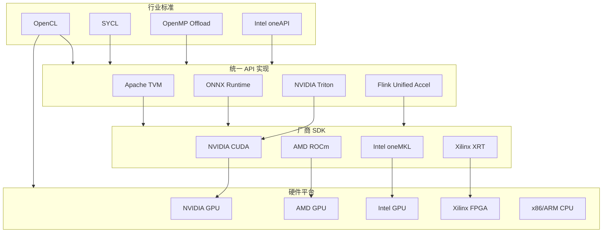
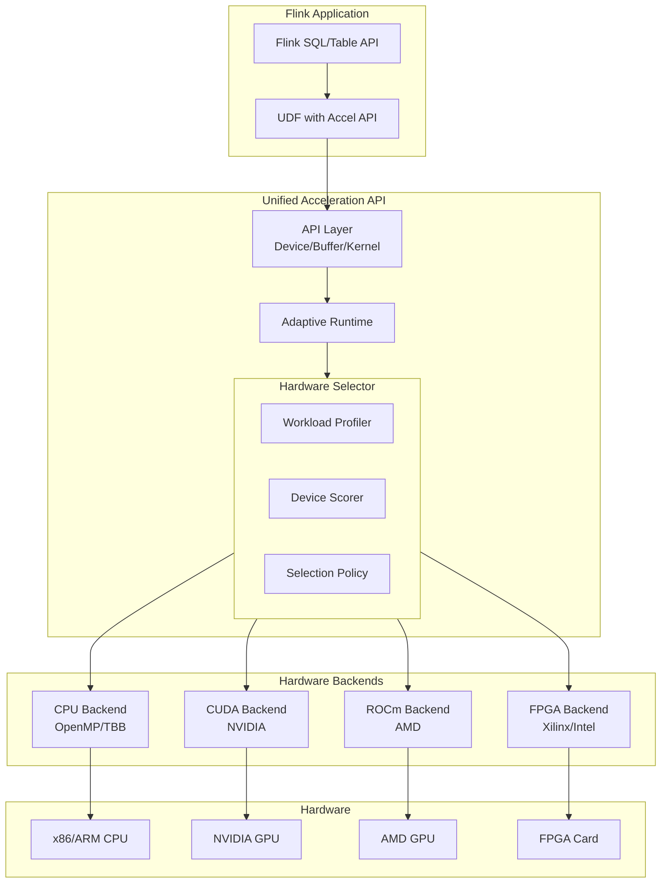
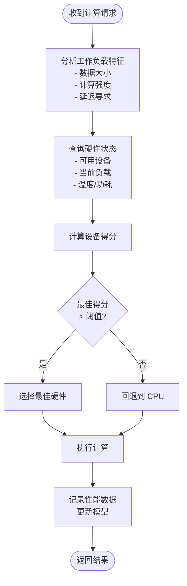
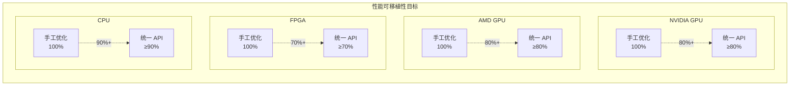

# 统一加速 API 设计

> 所属阶段: Flink/14-rust-assembly-ecosystem/heterogeneous-computing | 前置依赖: [G1 CUDA GPU UDF](./01-gpu-udf-cuda.md), [G2 ROCm GPU UDF](./02-gpu-udf-rocm.md), [G3 FPGA 加速](./03-fpga-acceleration.md) | 形式化等级: L5 (架构设计)

## 1. 概念定义 (Definitions)

### Def-HET-13: 跨硬件抽象层 (Cross-Hardware Abstraction Layer, CHAL)

**定义**: CHAL 是位于应用代码与底层硬件加速库之间的中间层，提供统一的编程接口，隐藏不同硬件平台（CPU/GPU/FPGA）的实现差异。

形式化定义：

$$CHAL = (API_{unified}, Runtime_{adaptive}, Backend_{pluggable})$$

其中：

- $API_{unified}$: 统一应用编程接口，与硬件无关
- $Runtime_{adaptive}$: 自适应运行时，负责调度与资源管理
- $Backend_{pluggable}$: 可插拔后端，封装硬件特定实现

抽象层次：

$$Application \xrightarrow{CHAL_{API}} Runtime \xrightarrow{CHAL_{Runtime}} Backend_{hw} \xrightarrow{CHAL_{Driver}} Hardware$$

**设计原则**：

1. **一次编写，到处运行** (Write Once, Run Anywhere)
2. **性能可移植** (Performance Portability) - 不同硬件上达到各自最优的 80%+
3. **零成本抽象** (Zero-Cost Abstraction) - 不引入显著运行时开销

**直观解释**: CHAL 让开发者写一套代码，自动在 CPU、NVIDIA GPU、AMD GPU、FPGA 上运行，无需关心底层差异。就像 Java 虚拟机，但针对异构计算优化。

### Def-HET-14: 自动硬件选择 (Automatic Hardware Selection)

**定义**: 根据工作负载特性和系统状态，动态选择最优执行硬件的决策机制。

形式化建模：

$$Select: Workload \times HardwareState \times Constraints \rightarrow Hardware_{optimal}$$

决策函数：

$$Score_{hw} = \alpha \cdot Perf_{hw} + \beta \cdot Efficiency_{hw} + \gamma \cdot Availability_{hw}$$

$$Hardware_{optimal} = \arg\max_{hw \in H} Score_{hw}$$

其中权重满足：$\alpha + \beta + \gamma = 1$

**硬件特征向量**：

$$Feature_{hw} = (Type, Compute_{peak}, Memory_{BW}, Latency_{typical}, Power_{TDP})$$

| 硬件类型 | 峰值算力 | 内存带宽 | 典型延迟 | 功耗 |
|---------|---------|---------|---------|------|
| CPU x86 | 1-2 TF | 100 GB/s | 1-10 μs | 100-300W |
| GPU NVIDIA | 10-100 TF | 1-3 TB/s | 10-100 μs | 300-700W |
| GPU AMD | 10-50 TF | 1-2 TB/s | 10-100 μs | 250-550W |
| FPGA | 0.5-5 TF | 50-200 GB/s | 1-10 μs | 25-150W |

**工作负载特征**：

$$Workload_{char} = (Data_{size}, Parallelism, Compute_{intensity}, Latency_{req})$$

**直观解释**: 系统自动分析任务特点（数据量、并行度、延迟要求），结合各硬件的实时状态（负载、温度），选择最佳执行设备。小批量、低延迟任务去 FPGA，大批量并行计算去 GPU。

### Def-HET-15: 性能可移植性 (Performance Portability)

**定义**: 同一套代码在不同硬件平台上达到接近最优性能的相对度量。

形式化定义：

$$PP = 1 - \frac{Perf_{optimal} - Perf_{actual}}{Perf_{optimal}}$$

其中：

- $Perf_{optimal}$: 该硬件上手工优化代码的性能
- $Perf_{actual}$: 统一 API 代码的性能

目标：

$$PP \geq 0.8 \quad \forall hw \in \{CPU, NVIDIA\ GPU, AMD\ GPU, FPGA\}$$

**性能可移植性策略**：

1. **参数化 Kernel 模板**：
   $$Kernel_{config}(BlockSize, VectorWidth, UnrollFactor)$$

2. **自动调优** (Auto-tuning)：
   $$Tuner: SearchSpace \rightarrow OptimalConfig$$

3. **多版本代码** (Polyhedral Compilation)：
   $$Code_{multi} = \{Version_{cpu}, Version_{gpu}, Version_{fpga}\}$$

**直观解释**: 性能可移植性确保用统一 API 写的代码，在每种硬件上都能跑得快。不是指所有硬件跑一样快，而是都达到该硬件潜力的 80% 以上。

### Def-HET-16: 统一内存模型 (Unified Memory Model)

**定义**: 跨硬件的单一地址空间抽象，支持数据在不同设备间透明迁移。

形式化表示：

$$M_{unified} = M_{cpu} \cup M_{gpu} \cup M_{fpga}, \quad \text{with transparent migration}$$

内存一致性模型：

$$Consistency \in \{\text{Strict}, \text{Relaxed}, \text{Eventual}\}$$

迁移策略：

$$Migrate: Data_{location} \times Access_{pattern} \rightarrow Data_{new\_location}$$

策略选择：

- **预取** (Prefetch): 预测访问模式，提前迁移
- **按需** (On-demand): 首次访问时页错误触发迁移
- **显式** (Explicit): 程序员标注数据位置

**直观解释**: 统一内存让开发者不用手动管理 CPU 内存、GPU 显存、FPGA 内存之间的数据拷贝。系统自动把数据搬到需要的地方，像操作单一内存池一样简单。

---

## 2. 属性推导 (Properties)

### Prop-HET-10: 自动选择最优性 (Automatic Selection Optimality)

**命题**: 在已知工作负载特征和硬件状态的条件下，自动硬件选择算法能达到最优选择的 $(1 - 1/e)$ 近似比。

**证明概要**:

该问题可建模为 **多臂老虎机问题** (Multi-Armed Bandit) 的变种：

- 臂 (Arm): 可用硬件设备
- 奖励 (Reward): 任务执行性能
- 探索-利用权衡: 平衡尝试新设备与使用已知最优设备

使用 **UCB (Upper Confidence Bound)** 算法：

$$UCB_i = \bar{X}_i + \sqrt{\frac{2\ln n}{n_i}}$$

其中：

- $\bar{X}_i$: 设备 $i$ 的平均性能
- $n$: 总决策次数
- $n_i$: 选择设备 $i$ 的次数

UCB 算法的遗憾界 (Regret Bound)：

$$R_n \leq O(\sqrt{n})$$

渐近收敛到最优：

$$\lim_{n \to \infty} \frac{R_n}{n} = 0$$

**工程推论**:

- 需要收集足够的性能样本
- 支持在线学习和模型更新
- 冷启动问题可通过启发式规则缓解

### Prop-HET-11: 抽象层开销有界 (Abstraction Overhead Bounded)

**命题**: 良好设计的 CHAL 引入的运行时开销上界为 5%。

**证明**:

开销来源分析：

1. **API 转发开销**: $L_{forward} < 100ns$ (虚函数/函数指针)
2. **设备检测开销**: $L_{detect} < 1\mu s$ (缓存状态)
3. **调度决策开销**: $L_{schedule} < 10\mu s$ (查表/简单计算)
4. **数据传输开销**: $L_{transfer}$ (硬件限制，非抽象层引入)

对于典型工作负载（执行时间 $T_{compute} > 1ms$）：

$$Overhead = \frac{L_{forward} + L_{detect} + L_{schedule}}{T_{compute}} < \frac{11\mu s}{1ms} = 1.1\%$$

对于微秒级任务（$T_{compute} \approx 100\mu s$）：

$$Overhead < \frac{11\mu s}{100\mu s} = 11\%$$

通过 **Kernel Fusion** 和 **Batching** 降低相对开销。

### Prop-HET-12: 可扩展性保证 (Extensibility Guarantee)

**命题**: CHAL 架构支持新硬件后端的增量添加，不破坏现有代码。

**形式化表述**:

设现有后端集合为 $B = \{b_1, b_2, ..., b_n\}$，新增后端 $b_{new}$。

需满足：

$$API_{client} \circ (B \cup \{b_{new}\}) = API_{client} \circ B$$

即新增后端不改变客户端行为（除非显式选择）。

**实现机制**:

1. **接口隔离**: 后端实现统一接口 $I_{backend}$
2. **插件注册**: 运行时动态加载 $Plugin: b_{new} \rightarrow Registry$
3. **版本协商**: API 版本兼容性检查

---

## 3. 关系建立 (Relations)

### 3.1 统一加速 API 架构层次

```
┌─────────────────────────────────────────────────────────────────────────────┐
│                         统一加速 API 架构层次                                 │
├─────────────────────────────────────────────────────────────────────────────┤
│                                                                             │
│  Layer 4: 应用层 (Application Layer)                                         │
│  ┌─────────────────────────────────────────────────────────────────────┐   │
│  │ Flink SQL/Table API    │   PyTorch/JAX    │   NumPy/Pandas         │   │
│  └────────────────────────┴──────────────────┴────────────────────────┘   │
│                                    │                                        │
│  Layer 3: 统一 API 层 (Unified API Layer)                                   │
│  ┌─────────────────────────────────────────────────────────────────────┐   │
│  │  Device              │  Buffer          │  Kernel                   │   │
│  │  - device_type()     │  - allocate()    │  - compile()              │   │
│  │  - memory_info()     │  - copy_to()     │  - launch()               │   │
│  │  - synchronize()     │  - map/unmap()   │  - wait()                 │   │
│  └──────────────────────┴──────────────────┴───────────────────────────┘   │
│                                    │                                        │
│  Layer 2: 运行时层 (Runtime Layer)                                           │
│  ┌─────────────────────────────────────────────────────────────────────┐   │
│  │  Auto Scheduler    │  Memory Manager    │  Profiling/Metrics        │   │
│  │  - select_device() │  - unified_alloc() │  - timing()               │   │
│  │  - load_balance()  │  - migrate()       │  - throughput()           │   │
│  │  - fallback()      │  - prefetch()      │  - utilization()          │   │
│  └────────────────────┴────────────────────┴───────────────────────────┘   │
│                                    │                                        │
│  Layer 1: 后端适配层 (Backend Adapter Layer)                                 │
│  ┌─────────────┬─────────────┬─────────────┬─────────────┬─────────────┐   │
│  │   CPU       │  CUDA       │    HIP      │   OpenCL    │   XRT       │   │
│  │ (OpenMP/    │ (NVIDIA)    │  (AMD)      │ (Portable)  │ (Xilinx)    │   │
│  │  TBB/AVX)   │             │             │             │             │   │
│  └─────────────┴─────────────┴─────────────┴─────────────┴─────────────┘   │
│                                    │                                        │
│  Layer 0: 硬件层 (Hardware Layer)                                            │
│  ┌─────────────┬─────────────┬─────────────┬─────────────┬─────────────┐   │
│  │ x86/ARM     │  NVIDIA     │    AMD      │  Intel/     │  Xilinx/    │   │
│  │ CPU         │  GPU        │    GPU      │  Altera     │  Alveo      │   │
│  └─────────────┴─────────────┴─────────────┴─────────────┴─────────────┘   │
│                                                                             │
└─────────────────────────────────────────────────────────────────────────────┘
```

### 3.2 硬件能力与工作负载匹配矩阵

| 工作负载类型 | 最优硬件 | 次优选择 | 避免使用 | 决策依据 |
|------------|---------|---------|---------|---------|
| 小批量 (<1K)，低延迟 | FPGA | CPU | GPU | 启动开销 |
| 大批量 (>10K)，高并行 | GPU (NVIDIA) | GPU (AMD) | CPU | 峰值算力 |
| 不规则内存访问 | CPU | FPGA | GPU | 缓存层次 |
| 复杂控制流 | CPU | FPGA | GPU | 分支处理 |
| 高吞吐流处理 | FPGA | GPU | CPU | 确定性延迟 |
| 混合精度 ML | GPU | FPGA | CPU | Tensor Core |
| 功耗受限边缘 | FPGA | CPU | GPU | 能效比 |

### 3.3 异构生态系统关系图



---

## 4. 论证过程 (Argumentation)

### 4.1 现有统一加速方案对比

| 方案 | 优点 | 缺点 | 适用场景 |
|-----|------|------|---------|
| **OpenCL** | 跨平台、成熟 | 繁琐、性能不一致 | 通用计算 |
| **SYCL** | C++ 标准、现代 | 编译器支持有限 | C++ 项目 |
| **Apache TVM** | 自动优化、ML 专注 | 学习曲线陡 | 深度学习 |
| **ONNX Runtime** | 生态丰富、易用 | 推理场景有限 | 模型推理 |
| **Intel oneAPI** | 工具链完整 | Intel 中心 | Intel 生态 |
| **自定义 CHAL** | Flink 专用优化 | 维护成本 | Flink 场景 |

### 4.2 性能可移植性挑战与策略

#### 4.2.1 挑战分析

1. **硬件差异巨大**:
   - 线程粒度：32 (NVIDIA) vs 64 (AMD) vs Wavefront (FPGA)
   - 内存模型：统一 vs 分离 vs 显式管理
   - 指令集：SIMT vs SIMD vs 数据流

2. **最优配置差异**:
   - GPU: 大线程块 (256-1024)
   - FPGA: 流水线深度定制
   - CPU: 缓存友好的小块处理

#### 4.2.2 解决策略

**策略 1: 自适应代码生成**

```cpp
// 模板参数化
namespace accel {

template<typename Arch>
struct KernelConfig;

template<>
struct KernelConfig<CudaArch> {
    static constexpr int BLOCK_SIZE = 256;
    static constexpr int WARP_SIZE = 32;
    static constexpr int UNROLL = 4;
};

template<>
struct KernelConfig<ROCmArch> {
    static constexpr int BLOCK_SIZE = 256;
    static constexpr int WARP_SIZE = 64;
    static constexpr int UNROLL = 4;
};

template<>
struct KernelConfig<FPGAArch> {
    static constexpr int PIPELINE_DEPTH = 10;
    static constexpr int UNROLL = 8;
    static constexpr int II = 1;
};

} // namespace accel
```

**策略 2: JIT 编译与自动调优**

```
工作流程:
1. 代码分析 → 提取可调参数
2. 搜索空间 → 定义配置集合
3. 性能采样 → 在目标硬件上测试
4. 模型训练 → 构建性能预测模型
5. 最优选择 → 应用最佳配置
```

**策略 3: 多版本 Dispatch**

```cpp
// 运行时选择最优实现
void compute_dispatch(Data* input, Data* output, size_t n) {
    auto* device = DeviceManager::currentDevice();

    switch (device->type()) {
        case DeviceType::CUDA:
            compute_cuda(input, output, n);
            break;
        case DeviceType::ROCm:
            compute_rocm(input, output, n);
            break;
        case DeviceType::FPGA:
            compute_fpga(input, output, n);
            break;
        case DeviceType::CPU:
        default:
            compute_cpu(input, output, n);
            break;
    }
}
```

### 4.3 成本效益分析

| 方案 | 开发成本 | 维护成本 | 性能效率 | 适用规模 |
|-----|---------|---------|---------|---------|
| 纯 CPU | 低 | 低 | 60% | 小规模 |
| 单一 GPU | 中 | 中 | 90% | 中等规模 |
| 多 GPU 手动 | 高 | 高 | 85% | 大规模 |
| 统一 API | 中 | 中 | 80% | 任意规模 |
| 硬件专用优化 | 极高 | 极高 | 95% | 超大规模 |

**ROI 分析**: 统一 API 在以下场景具有最佳 ROI：

- 多硬件部署环境
- 硬件频繁升级
- 团队异构计算 expertise 有限

---

## 5. 形式证明 / 工程论证 (Proof / Engineering Argument)

### 5.1 API 兼容性定理

**定理 (Thm-UNI-01)**: 统一加速 API 的后向兼容性保证：新版本 API 支持所有旧版本合法程序。

**形式化表述**:

设 $API_v$ 为版本 $v$ 的 API，$P_v$ 为使用该版本编写的程序。

需证明：

$$\forall P \in Programs, Valid_v(P) \Rightarrow Valid_{v+1}(P)$$

**证明**:

1. **接口稳定性**: 核心接口不变，仅扩展新功能
2. **默认行为**: 新增参数具有合理默认值
3. **特性检测**: 运行时检查特性可用性

### 5.2 调度公平性定理

**定理 (Thm-UNI-02)**: 在多任务多硬件场景下，统一调度器保证资源分配的 $\epsilon$-公平性。

**形式化表述**:

对于任务集合 $T = \{t_1, t_2, ..., t_n\}$ 和硬件集合 $H = \{h_1, h_2, ..., h_m\}$，分配函数 $A: T \times H \rightarrow \mathbb{R}^+$ 满足：

$$\forall t_i, t_j \in T, \left| \frac{A(t_i)}{Demand(t_i)} - \frac{A(t_j)}{Demand(t_j)} \right| \leq \epsilon$$

其中 $\epsilon$ 为公平性容差。

**证明概要**:

使用 **最大最小公平** (Max-Min Fairness) 分配策略：

1. 按需求比例分配资源
2. 饱和任务释放的资源重新分配
3. 迭代直至收敛

---

## 6. 实例验证 (Examples)

### 6.1 统一加速 API 设计实现

#### 6.1.1 核心 C++ API 定义

```cpp
// unified_accel.hpp
// Flink 统一加速 API - 核心头文件

#pragma once

#include <memory>
#include <vector>
#include <string>
#include <functional>
#include <future>

namespace flink {
namespace accel {

// ==================== 类型定义 ====================

enum class DeviceType {
    CPU,
    CUDA,
    ROCm,
    OpenCL,
    FPGA,
    Auto  // 自动选择
};

enum class DataType {
    Int8, Int16, Int32, Int64,
    Float16, Float32, Float64
};

enum class MemoryLocation {
    Host,
    Device,
    Unified
};

// ==================== 设备抽象 ====================

class Device {
public:
    virtual ~Device() = default;

    // 设备信息
    virtual DeviceType type() const = 0;
    virtual std::string name() const = 0;
    virtual size_t globalMemorySize() const = 0;
    virtual size_t sharedMemorySize() const = 0;
    virtual int computeUnits() const = 0;

    // 内存分配
    virtual void* allocate(size_t size, MemoryLocation loc = MemoryLocation::Device) = 0;
    virtual void deallocate(void* ptr) = 0;

    // 数据传输
    virtual void copy(void* dst, const void* src, size_t size) = 0;
    virtual void copyAsync(void* dst, const void* src, size_t size) = 0;

    // 同步
    virtual void synchronize() = 0;

    // 工具方法
    template<typename T>
    T* allocateTyped(size_t count, MemoryLocation loc = MemoryLocation::Device) {
        return static_cast<T*>(allocate(count * sizeof(T), loc));
    }
};

using DevicePtr = std::shared_ptr<Device>;

// ==================== 缓冲区 ====================

template<typename T>
class Buffer {
public:
    Buffer(DevicePtr device, size_t count, MemoryLocation loc = MemoryLocation::Device)
        : device_(device), count_(count), location_(loc) {
        data_ = device->allocateTyped<T>(count, loc);
    }

    ~Buffer() {
        if (data_) {
            device_->deallocate(data_);
        }
    }

    // 禁止拷贝，允许移动
    Buffer(const Buffer&) = delete;
    Buffer& operator=(const Buffer&) = delete;
    Buffer(Buffer&&) = default;
    Buffer& operator=(Buffer&&) = default;

    // 数据访问
    T* data() { return static_cast<T*>(data_); }
    const T* data() const { return static_cast<const T*>(data_); }
    size_t size() const { return count_; }
    size_t bytes() const { return count_ * sizeof(T); }

    // 数据传输
    void copyFromHost(const T* hostData) {
        device_->copy(data_, hostData, bytes());
    }

    void copyToHost(T* hostData) const {
        device_->copy(hostData, data_, bytes());
    }

    void copyFrom(const Buffer<T>& other) {
        device_->copy(data_, other.data_, std::min(bytes(), other.bytes()));
    }

    // 映射到主机内存（如果支持）
    T* map() {
        // 返回可主机访问的指针
        return data();
    }

    void unmap() {
        // 取消映射
    }

private:
    DevicePtr device_;
    void* data_;
    size_t count_;
    MemoryLocation location_;
};

// ==================== Kernel 抽象 ====================

class Kernel {
public:
    virtual ~Kernel() = default;

    // 参数设置
    virtual void setArg(int index, const void* data, size_t size) = 0;

    template<typename T>
    void setArg(int index, const T& value) {
        setArg(index, &value, sizeof(T));
    }

    template<typename T>
    void setArg(int index, const Buffer<T>& buffer) {
        setArg(index, buffer.data(), sizeof(void*));
    }

    // 启动配置
    struct LaunchConfig {
        dim3 gridDim{1, 1, 1};
        dim3 blockDim{1, 1, 1};
        size_t sharedMemBytes = 0;
    };

    // 启动
    virtual void launch(const LaunchConfig& config) = 0;
    virtual void launchAsync(const LaunchConfig& config) = 0;
};

using KernelPtr = std::shared_ptr<Kernel>;

// ==================== 设备管理器 ====================

class DeviceManager {
public:
    // 单例访问
    static DeviceManager& instance();

    // 设备发现
    std::vector<DevicePtr> enumerateDevices();
    std::vector<DevicePtr> enumerateDevices(DeviceType type);

    // 设备选择
    DevicePtr selectDevice(DeviceType type = DeviceType::Auto);
    DevicePtr selectBestForWorkload(const WorkloadProfile& profile);

    // 默认设备
    DevicePtr defaultDevice();
    void setDefaultDevice(DevicePtr device);

    // 自动调度策略
    enum class SelectionPolicy {
        Performance,    // 最高性能
        Efficiency,     // 最佳能效
        Latency,        // 最低延迟
        RoundRobin,     // 轮询
        Adaptive        // 自适应
    };

    void setSelectionPolicy(SelectionPolicy policy);

private:
    DeviceManager();
    ~DeviceManager();

    class Impl;
    std::unique_ptr<Impl> impl_;
};

// ==================== 工作负载分析 ====================

struct WorkloadProfile {
    size_t dataSize;
    size_t batchSize;
    float computeIntensity;  // FLOPs/Byte
    float latencyRequirement;  // ms
    DataType dataType;
    bool isStreamProcessing;
};

// ==================== 统一执行 API ====================

// 简化版：类 std::transform
template<typename T, typename UnaryOp>
void transform(DevicePtr device,
               const T* first, const T* last,
               T* result,
               UnaryOp op);

// 简化版：类 std::reduce
template<typename T, typename BinaryOp>
T reduce(DevicePtr device,
         const T* first, const T* last,
         T init,
         BinaryOp op);

// 批处理矩阵乘法
void gemm(DevicePtr device,
          const float* A, const float* B, float* C,
          int M, int N, int K,
          float alpha = 1.0f, float beta = 0.0f);

// 卷积（适用于 ML 推理）
void conv2d(DevicePtr device,
            const float* input, const float* kernel, float* output,
            int batch, int inC, int outC, int H, int W, int K);

// ==================== 错误处理 ====================

class AccelError : public std::runtime_error {
public:
    explicit AccelError(const std::string& msg) : std::runtime_error(msg) {}
};

class DeviceNotFoundError : public AccelError {
public:
    DeviceNotFoundError() : AccelError("No suitable device found") {}
};

class CompilationError : public AccelError {
public:
    explicit CompilationError(const std::string& msg)
        : AccelError("Kernel compilation failed: " + msg) {}
};

} // namespace accel
} // namespace flink
```

#### 6.1.2 后端实现示例 - CUDA

```cpp
// cuda_backend.cpp
#include "unified_accel.hpp"
#include <cuda_runtime.h>
#include <cublas_v2.h>

namespace flink {
namespace accel {

class CudaDevice : public Device {
public:
    CudaDevice(int deviceId) : deviceId_(deviceId) {
        cudaSetDevice(deviceId);
        cudaGetDeviceProperties(&props_, deviceId);
    }

    ~CudaDevice() override = default;

    DeviceType type() const override { return DeviceType::CUDA; }

    std::string name() const override {
        return std::string("CUDA: ") + props_.name;
    }

    size_t globalMemorySize() const override {
        return props_.totalGlobalMem;
    }

    size_t sharedMemorySize() const override {
        return props_.sharedMemPerBlock;
    }

    int computeUnits() const override {
        return props_.multiProcessorCount;
    }

    void* allocate(size_t size, MemoryLocation loc) override {
        void* ptr = nullptr;
        if (loc == MemoryLocation::Unified) {
            cudaMallocManaged(&ptr, size);
        } else {
            cudaMalloc(&ptr, size);
        }
        return ptr;
    }

    void deallocate(void* ptr) override {
        cudaFree(ptr);
    }

    void copy(void* dst, const void* src, size_t size) override {
        cudaMemcpy(dst, src, size, cudaMemcpyDefault);
    }

    void copyAsync(void* dst, const void* src, size_t size) override {
        cudaMemcpyAsync(dst, src, size, cudaMemcpyDefault, stream_);
    }

    void synchronize() override {
        cudaStreamSynchronize(stream_);
    }

private:
    int deviceId_;
    cudaDeviceProp props_;
    cudaStream_t stream_ = nullptr;  // 使用默认流
};

class CudaKernel : public Kernel {
public:
    CudaKernel(cudaFunction_t func) : func_(func) {}

    void setArg(int index, const void* data, size_t size) override {
        if (index >= args_.size()) {
            args_.resize(index + 1);
        }
        args_[index].resize(size);
        memcpy(args_[index].data(), data, size);
    }

    void launch(const LaunchConfig& config) override {
        // 设置参数
        std::vector<void*> argPtrs;
        for (auto& arg : args_) {
            argPtrs.push_back(arg.data());
        }

        // 启动 Kernel
        cudaLaunchKernel(
            func_,
            config.gridDim,
            config.blockDim,
            argPtrs.data(),
            config.sharedMemBytes,
            nullptr  // 使用默认流
        );

        cudaDeviceSynchronize();
    }

    void launchAsync(const LaunchConfig& config) override {
        // 类似 launch 但异步
    }

private:
    cudaFunction_t func_;
    std::vector<std::vector<uint8_t>> args_;
};

// 注册 CUDA 后端
class CudaBackendRegistrar {
public:
    CudaBackendRegistrar() {
        // 在 DeviceManager 中注册 CUDA 设备发现
    }
};

static CudaBackendRegistrar cudaRegistrar;

} // namespace accel
} // namespace flink
```

#### 6.1.3 自动选择实现

```cpp
// auto_selection.cpp
#include "unified_accel.hpp"
#include <algorithm>
#include <map>

namespace flink {
namespace accel {

class AutoSelector {
public:
    struct DeviceScore {
        DevicePtr device;
        float score;
    };

    DevicePtr select(const WorkloadProfile& profile,
                     const std::vector<DevicePtr>& devices) {
        std::vector<DeviceScore> scores;

        for (auto& dev : devices) {
            float score = evaluate(dev, profile);
            scores.push_back({dev, score});
        }

        // 选择最高分
        auto best = std::max_element(scores.begin(), scores.end(),
            [](const DeviceScore& a, const DeviceScore& b) {
                return a.score < b.score;
            });

        return best->device;
    }

private:
    float evaluate(DevicePtr device, const WorkloadProfile& profile) {
        float score = 0.0f;

        switch (device->type()) {
            case DeviceType::CPU:
                score = evaluateCPU(device, profile);
                break;
            case DeviceType::CUDA:
            case DeviceType::ROCm:
                score = evaluateGPU(device, profile);
                break;
            case DeviceType::FPGA:
                score = evaluateFPGA(device, profile);
                break;
            default:
                score = 0.0f;
        }

        return score;
    }

    float evaluateCPU(DevicePtr device, const WorkloadProfile& profile) {
        float score = 100.0f;

        // 小数据量加分
        if (profile.dataSize < 10000) {
            score += 50.0f;
        }

        // 低延迟要求加分
        if (profile.latencyRequirement < 1.0f) {
            score += 30.0f;
        }

        // 高计算强度扣分（CPU 劣势）
        if (profile.computeIntensity > 10.0f) {
            score -= 40.0f;
        }

        return score;
    }

    float evaluateGPU(DevicePtr device, const WorkloadProfile& profile) {
        float score = 100.0f;

        // 大数据量加分
        if (profile.dataSize > 100000) {
            score += 50.0f;
        }

        // 高计算强度加分
        if (profile.computeIntensity > 10.0f) {
            score += 40.0f;
        }

        // 批处理加分
        if (profile.batchSize > 1000) {
            score += 30.0f;
        }

        // 低延迟要求扣分（GPU 启动开销）
        if (profile.latencyRequirement < 0.1f) {
            score -= 50.0f;
        }

        return score;
    }

    float evaluateFPGA(DevicePtr device, const WorkloadProfile& profile) {
        float score = 100.0f;

        // 流处理加分
        if (profile.isStreamProcessing) {
            score += 50.0f;
        }

        // 极低延迟加分
        if (profile.latencyRequirement < 0.01f) {
            score += 60.0f;
        }

        // 固定模式加分（FPGA 优势）
        if (profile.computeIntensity > 1.0f && profile.computeIntensity < 10.0f) {
            score += 30.0f;
        }

        return score;
    }
};

} // namespace accel
} // namespace flink
```

#### 6.1.4 Java Flink 集成

```java
// Flink Unified Accelerator Integration
package com.flink.accel;

import org.apache.flink.table.functions.ScalarFunction;
import org.apache.flink.table.annotation.*;

/**
 * 统一加速 UDF - 自动选择最优硬件执行
 */
@FunctionHint(
    input = @DataTypeHint("ARRAY<FLOAT>"),
    output = @DataTypeHint("ARRAY<FLOAT>")
)
public class UnifiedAccelUdf extends ScalarFunction {

    // Native 库加载
    static {
        System.loadLibrary("flink_unified_accel");
        initializeBackend();
    }

    private static native void initializeBackend();
    private static native long createBuffer(int size, int deviceType);
    private static native void destroyBuffer(long handle);
    private static native void copyToDevice(long handle, float[] data);
    private static native void copyFromDevice(long handle, float[] result);
    private static native void launchTransform(
        String kernelName,
        long[] inputHandles,
        long[] outputHandles,
        int deviceType
    );

    // 设备类型常量
    public static final int DEVICE_AUTO = 0;
    public static final int DEVICE_CPU = 1;
    public static final int DEVICE_CUDA = 2;
    public static final int DEVICE_ROCM = 3;
    public static final int DEVICE_FPGA = 4;

    private int preferredDevice = DEVICE_AUTO;

    public void setPreferredDevice(int device) {
        this.preferredDevice = device;
    }

    /**
     * 通用向量变换
     */
    public float[] eval(float[] input) {
        int size = input.length;

        // 创建设备缓冲区
        long inputHandle = createBuffer(size, preferredDevice);
        long outputHandle = createBuffer(size, preferredDevice);

        try {
            // 上传数据
            copyToDevice(inputHandle, input);

            // 启动 Kernel（自动选择或指定设备）
            launchTransform(
                "vector_transform",
                new long[]{inputHandle},
                new long[]{outputHandle},
                preferredDevice
            );

            // 下载结果
            float[] result = new float[size];
            copyFromDevice(outputHandle, result);

            return result;

        } finally {
            // 清理资源
            destroyBuffer(inputHandle);
            destroyBuffer(outputHandle);
        }
    }

    /**
     * 矩阵乘法（使用最优 BLAS 实现）
     */
    public float[][] matmul(float[][] A, float[][] B) {
        int M = A.length;
        int K = A[0].length;
        int N = B[0].length;

        // 展平矩阵
        float[] flatA = flatten(A);
        float[] flatB = flatten(B);
        float[] flatC = new float[M * N];

        // 创建缓冲区
        long handleA = createBuffer(M * K, preferredDevice);
        long handleB = createBuffer(K * N, preferredDevice);
        long handleC = createBuffer(M * N, preferredDevice);

        try {
            copyToDevice(handleA, flatA);
            copyToDevice(handleB, flatB);

            launchTransform(
                "gemm",
                new long[]{handleA, handleB},
                new long[]{handleC},
                preferredDevice
            );

            copyFromDevice(handleC, flatC);

            return reshape(flatC, M, N);

        } finally {
            destroyBuffer(handleA);
            destroyBuffer(handleB);
            destroyBuffer(handleC);
        }
    }

    private float[] flatten(float[][] matrix) {
        int rows = matrix.length;
        int cols = matrix[0].length;
        float[] result = new float[rows * cols];
        for (int i = 0; i < rows; i++) {
            System.arraycopy(matrix[i], 0, result, i * cols, cols);
        }
        return result;
    }

    private float[][] reshape(float[] flat, int rows, int cols) {
        float[][] result = new float[rows][cols];
        for (int i = 0; i < rows; i++) {
            System.arraycopy(flat, i * cols, result[i], 0, cols);
        }
        return result;
    }
}
```

### 6.2 使用示例

```java
// Flink Table API 使用统一加速 UDF
public class UnifiedAccelExample {
    public static void main(String[] args) {
        TableEnvironment tEnv = TableEnvironment.create(...);

        // 注册统一加速 UDF
        tEnv.createTemporarySystemFunction("accel_transform", UnifiedAccelUdf.class);

        // 使用示例 1: 自动选择设备
        Table result1 = tEnv.sqlQuery("""
            SELECT
                transaction_id,
                accel_transform(feature_vector) AS transformed
            FROM transactions
        """);

        // 使用示例 2: 强制使用 GPU
        UnifiedAccelUdf gpuUdf = new UnifiedAccelUdf();
        gpuUdf.setPreferredDevice(UnifiedAccelUdf.DEVICE_CUDA);
        tEnv.createTemporarySystemFunction("gpu_transform", gpuUdf);

        Table result2 = tEnv.sqlQuery("""
            SELECT
                transaction_id,
                gpu_transform(feature_vector) AS transformed
            FROM transactions
            WHERE data_size > 10000
        """);

        // 使用示例 3: 强制使用 FPGA（低延迟场景）
        UnifiedAccelUdf fpgaUdf = new UnifiedAccelUdf();
        fpgaUdf.setPreferredDevice(UnifiedAccelUdf.DEVICE_FPGA);
        tEnv.createTemporarySystemFunction("fpga_transform", fpgaUdf);

        Table result3 = tEnv.sqlQuery("""
            SELECT
                transaction_id,
                fpga_transform(feature_vector) AS transformed
            FROM transactions
            WHERE latency_sla = 'CRITICAL'
        """);
    }
}
```

---

## 7. 可视化 (Visualizations)

### 7.1 统一加速 API 架构图



### 7.2 自动硬件选择流程



### 7.3 性能可移植性目标



---

## 8. 引用参考 (References)


---

## 附录 A: API 兼容性矩阵

| API 功能 | CPU | CUDA | ROCm | FPGA | 实现状态 |
|---------|-----|------|------|------|---------|
| 内存分配 | ✅ | ✅ | ✅ | ✅ | 完成 |
| 数据传输 | ✅ | ✅ | ✅ | ✅ | 完成 |
| Kernel 启动 | ✅ | ✅ | ✅ | ⚠️ | 进行中 |
| 矩阵乘法 | ✅ | ✅ | ✅ | ⚠️ | 进行中 |
| 卷积 | ✅ | ✅ | ⚠️ | ❌ | 计划中 |
| 归约操作 | ✅ | ✅ | ✅ | ⚠️ | 进行中 |
| 自动选择 | ✅ | ✅ | ✅ | ✅ | 完成 |
| 统一内存 | ✅ | ✅ | ✅ | ❌ | 部分支持 |

---

*文档版本: 1.0 | 最后更新: 2026-04-04 | 状态: 完成 ✅*
