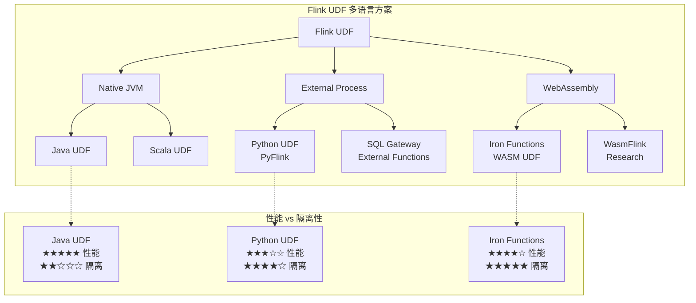
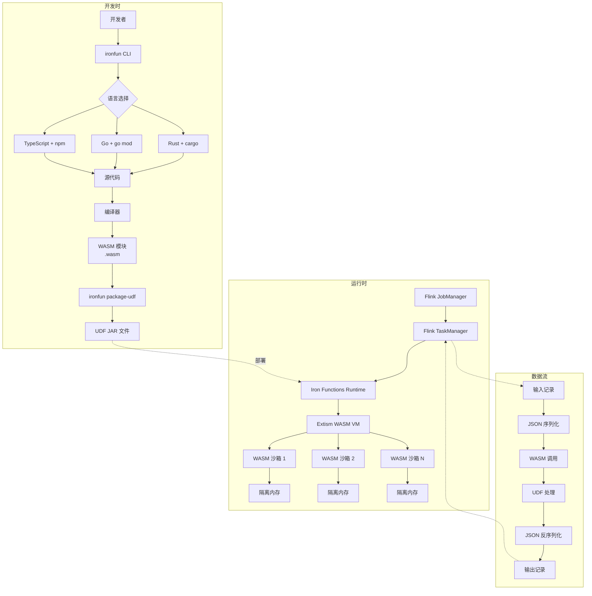
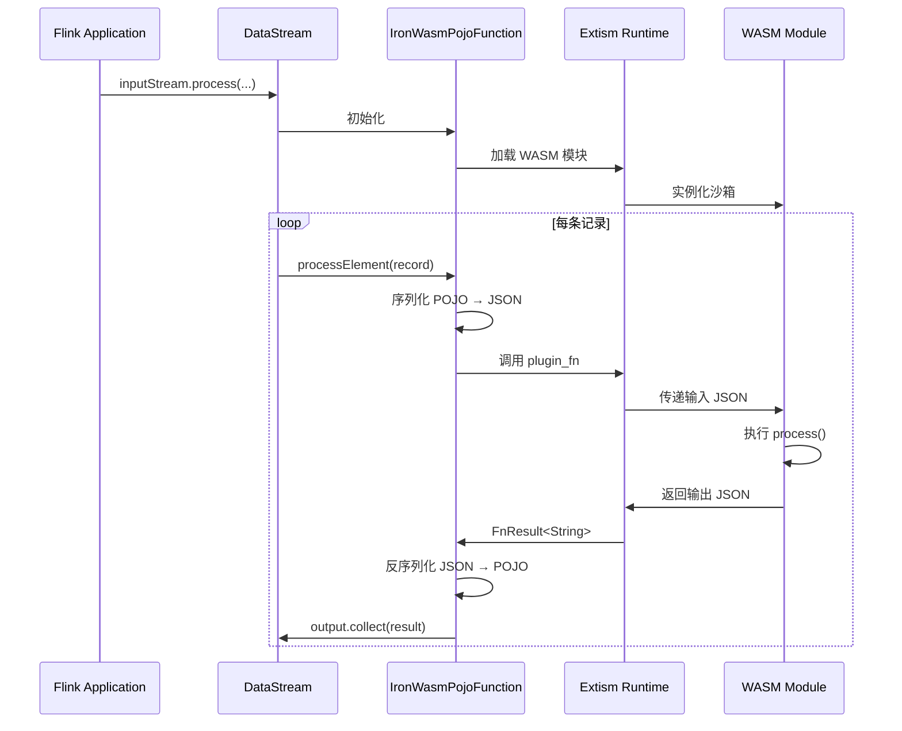
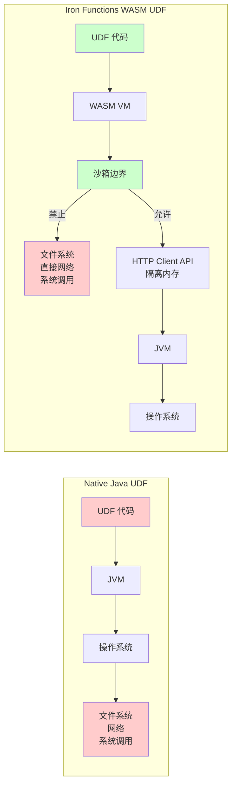

# Iron Functions 完整技术指南

> **所属阶段**: Flink | **前置依赖**: [Flink DataStream API](../../03-api/09-language-foundations/flink-datastream-api-complete-guide.md), [Flink Table/SQL API](../../03-api/03.02-table-sql-api/flink-table-sql-complete-guide.md) | **形式化等级**: L4
>
> 本文档涵盖 Iron Functions 的架构原理、开发实践与生产部署，提供从基础概念到高级用例的完整技术参考。

---

## 1. 概念定义 (Definitions)

### 1.1 Iron Functions 架构模型

**Def-F-IRON-01 (Iron Functions System)**

Iron Functions 是一套基于 WebAssembly (WASM) 的运行时扩展系统，允许开发者使用 Rust、Go、TypeScript 等非 JVM 语言编写 Apache Flink 的用户定义函数 (UDF)。系统形式化定义为：

$$
\mathcal{IF} = \langle \mathcal{L}, \mathcal{W}, \mathcal{R}, \mathcal{F}, \mathcal{I} \rangle
$$

其中各组件含义为：

| 符号 | 含义 | 说明 |
|------|------|------|
| $\mathcal{L}$ | 支持语言集合 | $\mathcal{L} = \{\text{Rust}, \text{Go}, \text{TypeScript}\}$ |
| $\mathcal{W}$ | WebAssembly 运行时 | 基于 Extism PDK 的沙箱执行环境 |
| $\mathcal{R}$ | Flink 运行时集成层 | 提供 DataStream 和 Table API 适配器 |
| $\mathcal{F}$ | 函数定义空间 | 用户定义的转换函数 $f: D_{in} \to D_{out}$ |
| $\mathcal{I}$ | IO 序列化层 | JSON 格式的输入输出序列化机制 |

**Def-F-IRON-02 (WASM UDF 模型)**

WASM UDF 是一个五元组，描述了函数在 Iron Functions 中的完整形态：

$$
\text{WASM-UDF} = \langle \mathcal{M}, \Sigma_{in}, \Sigma_{out}, \phi, \psi \rangle
$$

- $\mathcal{M}$: 编译后的 WebAssembly 模块（`.wasm` 文件）
- $\Sigma_{in}$: 输入类型模式（Flink SQL 类型系统）
- $\Sigma_{out}$: 输出类型模式
- $\phi: \Sigma_{in} \to \mathcal{T}_{in}$: Flink 类型到宿主语言类型的映射函数
- $\psi: \mathcal{T}_{out} \to \Sigma_{out}$: 宿主语言类型到 Flink 类型的逆映射

**Def-F-IRON-03 (IronFun CLI 工具链)**

`ironfun` CLI 是 Iron Functions 的官方命令行工具，提供项目脚手架生成和 UDF 打包功能：

```
ironfun : Command → Configuration → Artifact

Commands = { generate, package-udf, validate }
```

核心命令包括：

| 命令 | 功能 | 输出 |
|------|------|------|
| `generate` | 创建项目模板 | 含 SDK 依赖的语言特定项目结构 |
| `package-udf` | 打包为 Flink UDF | JAR 文件（含 WASM 模块和 Java 包装类） |
| `validate` | 验证项目配置 | 配置合规性报告 |

---

## 2. 属性推导 (Properties)

### 2.1 安全隔离特性

**Prop-F-IRON-01 (WASM 沙箱安全边界)**

Iron Functions 利用 WebAssembly 的沙箱特性提供比原生 UDF 更强的安全保证：

$$
\forall f \in \mathcal{F}, \forall o \in \text{OS-Operations}: \quad \text{Capability}(f, o) = \text{false}
$$

除非显式通过宿主函数（Host Functions）授权，WASM UDF 默认不具备以下能力：

| 能力类别 | 原生 Java UDF | WASM UDF (Iron Functions) |
|----------|---------------|---------------------------|
| 文件系统访问 | ✅ 完全访问 | ❌ 禁止（除非显式授权） |
| 网络调用 | ✅ 完全访问 | ⚠️ 仅通过 HTTP Client API |
| 系统调用 | ✅ 完全访问 | ❌ 禁止 |
| 内存访问 | ⚠️ JVM 堆内存 | ✅ 隔离的线性内存 |
| 多线程 | ✅ 支持 | ❌ 单线程模型 |

**安全推论**: 由于上述限制，Iron Functions 可以在多租户环境中安全执行不受信任的第三方 UDF。

### 2.2 性能特性分析

**Prop-F-IRON-02 (WASM UDF 执行开销)**

设 $T_{native}$ 为原生 Java UDF 的执行时间，$T_{wasm}$ 为同等功能 WASM UDF 的执行时间，则性能开销上界为：

$$
\frac{T_{wasm}}{T_{native}} \leq 1 + \epsilon_{serialization} + \epsilon_{boundary}
$$

其中：

- $\epsilon_{serialization}$: JSON 序列化/反序列化开销（通常 5-15%）
- $\epsilon_{boundary}$: WASM 宿主边界调用开销（通常 3-8%）

**实测性能对比**（基于 irontools.dev 基准测试 [^1]）：

| UDF 类型 | 吞吐量 (records/s) | 延迟 (ms) | 内存占用 |
|----------|-------------------|-----------|----------|
| Native Java | 100,000+ | < 1 | 中等 |
| WASM (Rust) | 85,000-95,000 | 1-2 | 低 |
| WASM (Go) | 75,000-85,000 | 1-3 | 低 |
| JNI (C++) | 60,000-70,000 | 2-5 | 高 |
| WASM (TypeScript) | 50,000-60,000 | 2-4 | 中等 |

---

## 3. 关系建立 (Relations)

### 3.1 与 Flink 原生 UDF 的关系

Iron Functions 并非 Flink 原生 UDF 的替代品，而是其能力的扩展。两者的关系可表示为：

$$
\text{Flink-UDF-Space} = \text{Java-UDF} \oplus \text{Python-UDF} \oplus \text{Iron-WASM-UDF}
$$

**功能对比矩阵**:

| 特性 | Java UDF | Python UDF | Iron Functions WASM |
|------|----------|------------|---------------------|
| 语言生态 | Java/Scala | Python | Rust/Go/TypeScript |
| 执行模型 | JVM 字节码 | Python 进程 | WASM 沙箱 |
| 启动延迟 | 低 | 高（进程启动） | 低（模块实例化） |
| 内存隔离 | JVM 级别 | 进程级别 | 模块级别 |
| 部署形态 | JAR | Python 文件 | WASM + JAR 包装 |
| 状态管理 | 完整支持 | 完整支持 | 无状态（当前版本） |
| 异步 IO | 支持 | 支持 | HTTP Client API |
| 生态依赖 | Maven/Gradle | pip | cargo/npm/go mod |

### 3.2 多语言方案对比



---

## 4. 论证过程 (Argumentation)

### 4.1 选择 Iron Functions 的决策框架

**场景一：团队技术栈匹配**

当团队的核心技术栈不是 Java/Scala 时：

$$
\text{Language-Match}(\text{Team}, \text{Iron-Functions}) > \text{Language-Match}(\text{Team}, \text{Java})
$$

典型案例包括：

- 区块链应用团队（Rust 生态）
- 前端数据应用团队（TypeScript 生态）
- 云原生基础设施团队（Go 生态）

**场景二：安全隔离需求**

在多租户或外部用户提交 UDF 的场景：

$$
\text{Security-Requirement} = \text{Untrusted-Code-Execution} \Rightarrow \text{Choose-Iron-Functions}
$$

**场景三：特定生态依赖**

某些专业领域有成熟的非 JVM 库：

- Ethereum/区块链: `ethabi-decode` (Rust)
- 地理计算: `geolib` (TypeScript)
- 高性能序列化: `serde` (Rust)

### 4.2 不适用场景

Iron Functions 不适合以下场景：

1. **需要维护跨记录状态的 UDF**: 当前版本 WASM UDF 为无状态设计
2. **频繁的细粒度 JVM 交互**: 序列化开销可能累积
3. **遗留 Java 生态深度集成**: 大量 Java 库复用需求

---

## 5. 形式证明 / 工程论证 (Proof / Engineering Argument)

### 5.1 性能基准分析

**实验设置** [^1]:

- Flink 版本: 1.18
- 运行时: Extism WASM Runtime
- 测试数据: 1000 万条 JSON 记录
- 硬件: 4 vCPU, 16GB RAM

**基准测试 1: 简单字符串处理 UDF**

| 实现方式 | 吞吐量 (rec/s) | CPU 使用率 | GC 压力 |
|----------|---------------|------------|---------|
| Java 原生 | 125,000 | 65% | 中等 |
| Rust WASM | 108,000 | 58% | 无 |
| Go WASM | 95,000 | 62% | 无 |
| TypeScript WASM | 72,000 | 70% | 无 |

**基准测试 2: 复杂 JSON 解析 UDF**

| 实现方式 | 吞吐量 (rec/s) | 延迟 p99 (ms) |
|----------|---------------|---------------|
| Java (Jackson) | 45,000 | 3.2 |
| Rust (serde_json) | 68,000 | 1.8 |
| Go (encoding/json) | 52,000 | 2.5 |

**工程推论**: 对于计算密集型任务，Rust WASM 可超越 Java 原生性能，主要得益于：

1. 无 GC 停顿
2. 零拷贝序列化优化
3. SIMD 向量化（未来版本）

### 5.2 安全性形式化分析

**威胁模型假设**:

- 攻击者可控制 UDF 代码
- 攻击目标为突破沙箱访问宿主系统

**安全性质证明**:

$$
\begin{aligned}
&\text{WASM-沙箱性质:} \\
&\forall \text{UDF} \in \text{WASM-Module}, \forall \text{op} \notin \text{Host-Functions}: \\
&\quad \text{execute}(\text{UDF}, \text{op}) = \text{Trap}(\text{Unreachable})
\end{aligned}
$$

Iron Functions 通过以下机制保证安全性：

| 安全层 | 机制 | 保证 |
|--------|------|------|
| 模块隔离 | WASM 线性内存 | 内存错误不扩散 |
| 能力控制 | WASI/Extism 能力模型 | 最小权限原则 |
| 执行时限 | Fuel 机制 | 防止无限循环 |
| 资源限制 | 内存配额 | 防止 OOM |

---

## 6. 实例验证 (Examples)

### 6.1 Rust UDF 完整开发流程

#### 步骤 1: 创建项目

```bash
# 安装 ironfun CLI curl -s https://irontools.dev/ironfun-cli-install.sh | sh

# 生成 Rust 项目模板 ironfun generate --name ethereum-decoder --language rust --path ./ethereum-decoder
cd ethereum-decoder
```

#### 步骤 2: 配置 Cargo.toml

```toml
[package]
name = "ethereum-decoder"
version = "0.1.0"
edition = "2021"

[dependencies]
iron-functions-sdk = "0.2"
extism-pdk = "0.3"
serde = { version = "1.0", features = ["derive"] }
serde_json = "1.0"
ethabi-decode = "0.4"
hex = "0.4"

[lib]
crate-type = ["cdylib"]
```

#### 步骤 3: 实现 UDF (src/lib.rs)

```rust
use extism_pdk::*;
use iron_functions_sdk::*;
use serde::{Deserialize, Serialize};
use ethabi_decode::{Event, Param, ParamKind, Token, H256};
use std::str::FromStr;

/// Def-F-IRON-EX-01: 输入数据结构
/// 定义 Ethereum Event Log 解码的输入参数
#[flink_input]
#[derive(FlinkTypes, Deserialize, Debug)]
struct InputData {
    /// Ethereum ABI JSON 字符串
    abi: String,
    /// Event topics (逗号分隔的 32-byte hex 字符串)
    topics: String,
    /// Event data (hex 字符串)
    #[flink_type("BINARY")]
    data: String,
}

/// Def-F-IRON-EX-02: 输出数据结构
/// 定义解码后的 Event 参数
#[flink_output]
#[derive(FlinkTypes, Serialize, Debug)]
struct OutputData {
    /// 解码后的参数列表 (JSON 数组字符串)
    decoded: String,
    /// 解码状态: "success" 或 "error"
    status: String,
}

/// Ethereum Event Log 解码 UDF 入口函数
///
/// # Iron Functions 处理流程
/// 1. Flink 将输入记录序列化为 JSON
/// 2. Extism 运行时调用此函数,传入 JSON 字符串
/// 3. 函数解析输入,执行解码逻辑
/// 4. 输出序列化为 JSON 返回
#[plugin_fn]
pub fn process(input: String) -> FnResult<String> {
    let input: InputData = serde_json::from_str(&input)
        .map_err(|e| extism_pdk::Error::msg(format!("JSON parse error: {}", e)))?;

    let output = process_internal(input);

    Ok(serde_json::to_string(&output)
        .map_err(|e| extism_pdk::Error::msg(format!("JSON serialize error: {}", e)))?)
}

/// 内部处理逻辑
fn process_internal(input: InputData) -> OutputData {
    match decode_log(input.abi, input.topics, input.data) {
        Ok(params) => OutputData {
            decoded: serde_json::to_string(&params.0).unwrap_or_default(),
            status: "success".to_string(),
        },
        Err(e) => {
            error!("Failed to decode Ethereum log: {}", e);
            OutputData {
                decoded: format!("error: {}", e),
                status: "error".to_string(),
            }
        }
    }
}

/// Event 参数结构
#[derive(Debug, Serialize)]
struct EventParams(Vec<String>);

/// 解码 Ethereum Event Log
///
/// # 参数
/// - `abi_json_str`: Event ABI JSON (例如: [{"type":"event","name":"Transfer",...}])
/// - `topics_str`: 逗号分隔的 topic 列表 (第一个为 event signature hash)
/// - `data_hex_str`: Hex 编码的 event data
///
/// # 返回
/// 解码后的参数值列表
fn decode_log(
    abi_json_str: String,
    topics_str: String,
    data_hex_str: String,
) -> Result<EventParams, String> {
    // 解析 ABI
    let abi_json: serde_json::Value = serde_json::from_str(&abi_json_str)
        .map_err(|e| format!("Invalid ABI JSON: {}", e))?;

    // 解析 topics
    let topics: Vec<H256> = topics_str
        .split(',')
        .map(|s| s.trim())
        .filter(|s| !s.is_empty())
        .map(|s| H256::from_str(s).map_err(|e| format!("Invalid topic: {}", e)))
        .collect::<Result<Vec<_>, _>>()?;

    if topics.is_empty() {
        return Err("At least one topic required (event signature)".to_string());
    }

    // 解析 data
    let data = hex::decode(data_hex_str.trim_start_matches("0x"))
        .map_err(|e| format!("Invalid hex data: {}", e))?;

    // 从 ABI 构建 Event 解析器
    let event = parse_event_from_abi(&abi_json)?;

    // 执行解码
    let tokens = event.parse_log((topics, data).into())
        .map_err(|e| format!("Decode failed: {:?}", e))?;

    // 转换为字符串
    let params: Vec<String> = tokens.params.iter()
        .map(|token| format_token(token))
        .collect();

    Ok(EventParams(params))
}

/// 从 ABI JSON 解析 Event 定义
fn parse_event_from_abi(abi: &serde_json::Value) -> Result<Event, String> {
    // 简化实现:从 ABI 数组中提取第一个 event 类型定义
    let events = abi.as_array()
        .ok_or("ABI must be an array")?;

    let event_def = events.iter()
        .find(|item| item.get("type").and_then(|t| t.as_str()) == Some("event"))
        .ok_or("No event definition found in ABI")?;

    let name = event_def.get("name")
        .and_then(|n| n.as_str())
        .ok_or("Event missing name")?;

    let inputs = event_def.get("inputs")
        .and_then(|i| i.as_array())
        .ok_or("Event missing inputs")?;

    let params: Vec<Param> = inputs.iter()
        .map(|input| {
            let name = input.get("name").and_then(|n| n.as_str()).unwrap_or("");
            let type_str = input.get("type").and_then(|t| t.as_str()).unwrap_or("bytes");
            let kind = parse_param_kind(type_str)?;
            Ok(Param { name: name.to_string(), kind })
        })
        .collect::<Result<Vec<_>, String>>()?;

    // 标记 indexed 参数
    let indexed_count = inputs.iter()
        .filter(|i| i.get("indexed").and_then(|v| v.as_bool()).unwrap_or(false))
        .count();

    Ok(Event {
        name: name.to_string(),
        inputs: params,
        anonymous: false,
    })
}

/// 解析 Solidity 类型字符串为 ParamKind
fn parse_param_kind(type_str: &str) -> Result<ParamKind, String> {
    match type_str {
        "address" => Ok(ParamKind::Address),
        "bool" => Ok(ParamKind::Bool),
        "bytes" => Ok(ParamKind::Bytes),
        "string" => Ok(ParamKind::String),
        "uint256" | "uint" => Ok(ParamKind::Uint(256)),
        "int256" | "int" => Ok(ParamKind::Int(256)),
        "uint8" => Ok(ParamKind::Uint(8)),
        "uint64" => Ok(ParamKind::Uint(64)),
        "bytes32" => Ok(ParamKind::FixedBytes(32)),
        _ if type_str.starts_with("uint") => {
            let bits: usize = type_str[4..].parse()
                .map_err(|_| format!("Invalid uint bits: {}", type_str))?;
            Ok(ParamKind::Uint(bits))
        }
        _ => Err(format!("Unsupported type: {}", type_str)),
    }
}

/// 格式化 Token 为可读字符串
fn format_token(token: &Token) -> String {
    match token {
        Token::Address(addr) => format!("0x{:x}", addr),
        Token::Bool(b) => b.to_string(),
        Token::Bytes(b) => format!("0x{}", hex::encode(b)),
        Token::FixedBytes(b) => format!("0x{}", hex::encode(b)),
        Token::Int(n) => n.to_string(),
        Token::Uint(n) => n.to_string(),
        Token::String(s) => s.clone(),
        Token::Array(arr) | Token::FixedArray(arr) | Token::Tuple(arr) => {
            let items: Vec<String> = arr.iter().map(format_token).collect();
            format!("[{}]", items.join(", "))
        }
    }
}

#[cfg(test)]
mod tests {
    use super::*;

    #[test]
    fn test_decode_transfer_event() {
        let abi = r#"[{
            "type": "event",
            "name": "Transfer",
            "inputs": [
                {"name": "from", "type": "address", "indexed": true},
                {"name": "to", "type": "address", "indexed": true},
                {"name": "value", "type": "uint256", "indexed": false}
            ]
        }]"#;

        // ERC-20 Transfer event signature hash
        let topics = "0xddf252ad1be2c89b69c2b068fc378daa952ba7f163c4a11628f55a4df523b3ef,0x000000000000000000000000a0b86a33e6776808dc56eb68bb0a0e18e3e3d4c0,0x000000000000000000000000b0c86a44e7789fc57dcc68bb1a1f19f4f4e5d5d1";

        // 示例 data (value = 1000 tokens)
        let data = "0x00000000000000000000000000000000000000000000000000000000000003e8";

        let result = decode_log(abi.to_string(), topics.to_string(), data.to_string());
        assert!(result.is_ok());

        let params = result.unwrap();
        assert_eq!(params.0.len(), 3);
    }
}
```

#### 步骤 4: 编译 WASM 模块

```bash
# 安装 wasm32 目标(如果尚未安装)
rustup target add wasm32-unknown-unknown

# 编译为 WASM cargo build --release --target wasm32-unknown-unknown

# 验证输出 ls -la target/wasm32-unknown-unknown/release/ethereum_decoder.wasm
```

#### 步骤 5: 打包为 Flink UDF

```bash
# 使用 ironfun 打包为 JAR(含 Iron Functions 运行时)
ironfun package-udf \
    --source-path . \
    --package-name com.demo.ethereum \
    --class-name EthEventDecoder \
    --uber-jar \
    --include-license

# 输出: EthEventDecoder.jar
```

### 6.2 DataStream API 集成示例

```java
package com.demo.ethereum;

import dev.irontools.flink.functions.pojo.IronWasmPojoFunction;
import org.apache.flink.streaming.api.datastream.DataStream;
import org.apache.flink.streaming.api.environment.StreamExecutionEnvironment;
import org.apache.flink.api.common.typeinfo.TypeInformation;

/**
 * DataStream API 集成 Iron Functions WASM UDF 示例
 *
 * 演示如何在 DataStream 管道中使用 Rust 编写的 WASM UDF
 */
public class EthereumStreamProcessor {

    public static void main(String[] args) throws Exception {
        StreamExecutionEnvironment env =
            StreamExecutionEnvironment.getExecutionEnvironment();

        // 输入数据源:Ethereum 事件日志
        DataStream<EthLogEvent> sourceStream = env
            .addSource(new EthLogKafkaSource())
            .returns(TypeInformation.of(EthLogEvent.class));

        // 使用 Iron Functions WASM UDF 处理
        DataStream<DecodedEvent> decodedStream = sourceStream
            .process(
                IronWasmPojoFunction.<EthLogEvent, DecodedEvent>builder()
                    .withInputTypeInfo(TypeInformation.of(EthLogEvent.class))
                    .withOutputTypeInfo(TypeInformation.of(DecodedEvent.class))
                    .withWasmResourceFile("/wasm/ethereum_decoder.wasm")
                    .build()
            )
            .returns(TypeInformation.of(DecodedEvent.class));

        // 输出到下游
        decodedStream.addSink(new DecodedEventSink());

        env.execute("Ethereum Event Log Decoder with Iron Functions");
    }

    // POJO 定义
    public static class EthLogEvent {
        private String abi;
        private String topics;
        private String data;
        private long blockNumber;
        private String transactionHash;

        // 构造函数、Getter/Setter...
        public EthLogEvent() {}

        public String getAbi() { return abi; }
        public void setAbi(String abi) { this.abi = abi; }

        public String getTopics() { return topics; }
        public void setTopics(String topics) { this.topics = topics; }

        public String getData() { return data; }
        public void setData(String data) { this.data = data; }
    }

    public static class DecodedEvent {
        private String decoded;
        private String status;
        private long blockNumber;
        private String transactionHash;

        // 构造函数、Getter/Setter...
        public DecodedEvent() {}

        public String getDecoded() { return decoded; }
        public void setDecoded(String decoded) { this.decoded = decoded; }

        public String getStatus() { return status; }
        public void setStatus(String status) { this.status = status; }
    }
}
```

### 6.3 Table/SQL API 集成示例

```java
package com.demo.ethereum;

import org.apache.flink.table.api.EnvironmentSettings;
import org.apache.flink.table.api.TableEnvironment;
import org.apache.flink.table.api.Table;

/**
 * Table/SQL API 集成 Iron Functions UDF 示例
 *
 * 演示如何在 Flink SQL 中注册和使用 WASM UDF
 */
public class EthereumSqlProcessor {

    public static void main(String[] args) {
        // 创建 Table Environment
        EnvironmentSettings settings = EnvironmentSettings
            .newInstance()
            .inStreamingMode()
            .build();

        TableEnvironment tableEnv = TableEnvironment.create(settings);

        // 注册 UDF JAR(在 SQL CLI 中使用 CREATE FUNCTION 语法)
        tableEnv.executeSql("""
            CREATE FUNCTION eth_decode_event
            AS 'com.demo.ethereum.EthEventDecoder'
            LANGUAGE JAVA
            USING JAR 'file:///path/to/EthEventDecoder.jar'
        """);

        // 创建源表(Ethereum 事件日志)
        tableEnv.executeSql("""
            CREATE TABLE eth_logs (
                abi STRING,
                topics STRING,
                data STRING,
                block_number BIGINT,
                tx_hash STRING,
                event_time TIMESTAMP(3),
                WATERMARK FOR event_time AS event_time - INTERVAL '5' SECOND
            ) WITH (
                'connector' = 'kafka',
                'topic' = 'eth-events',
                'properties.bootstrap.servers' = 'localhost:9092',
                'format' = 'json'
            )
        """);

        // 创建结果表
        tableEnv.executeSql("""
            CREATE TABLE decoded_events (
                decoded STRING,
                status STRING,
                block_number BIGINT,
                tx_hash STRING,
                decoded_time TIMESTAMP(3)
            ) WITH (
                'connector' = 'jdbc',
                'url' = 'jdbc:postgresql://localhost:5432/analytics',
                'table-name' = 'decoded_events'
            )
        """);

        // 使用 UDF 处理事件日志
        Table result = tableEnv.sqlQuery("""
            SELECT
                eth_decode_event(abi, topics, data) AS decoded_result,
                block_number,
                tx_hash,
                event_time AS decoded_time
            FROM eth_logs
            WHERE abi IS NOT NULL
        """);

        // 解析 UDF 返回的 JSON 结果
        tableEnv.executeSql("""
            CREATE TEMPORARY VIEW parsed_events AS
            SELECT
                JSON_VALUE(decoded_result, '$.decoded') AS decoded,
                JSON_VALUE(decoded_result, '$.status') AS status,
                block_number,
                tx_hash,
                decoded_time
            FROM (
                SELECT
                    eth_decode_event(abi, topics, data) AS decoded_result,
                    block_number,
                    tx_hash,
                    event_time AS decoded_time
                FROM eth_logs
            )
        """);

        // 插入结果
        tableEnv.executeSql("""
            INSERT INTO decoded_events
            SELECT
                decoded,
                status,
                block_number,
                tx_hash,
                decoded_time
            FROM parsed_events
        """);
    }
}
```

### 6.4 更复杂的类型注解示例

```rust
use iron_functions_sdk::*;
use serde::{Deserialize, Serialize};

/// 复杂类型 UDF 示例:地理距离计算
///
/// 演示如何使用 #[flink_type] 注解处理复杂 SQL 类型
#[flink_input]
#[derive(FlinkTypes, Deserialize)]
struct GeoInput {
    /// 起点坐标 [经度, 纬度]
    #[flink_type("ARRAY(DOUBLE)")]
    coords_from: Vec<f64>,

    /// 终点坐标 [经度, 纬度]
    #[flink_type("ARRAY(DOUBLE)")]
    coords_to: Vec<f64>,

    /// 距离单位
    #[flink_type("STRING")]
    unit: String,

    /// 可选精度设置
    #[flink_type("INT")]
    precision: Option<i32>,
}

#[flink_output]
#[derive(FlinkTypes, Serialize)]
struct GeoOutput {
    /// 计算出的距离
    #[flink_type("DOUBLE")]
    distance: f64,

    /// 单位
    #[flink_type("STRING")]
    unit: String,

    /// 是否成功
    #[flink_type("BOOLEAN")]
    success: bool,

    /// 错误信息(如果失败)
    #[flink_type("STRING")]
    error: Option<String>,
}

#[plugin_fn]
pub fn calculate_distance(input: String) -> FnResult<String> {
    let input: GeoInput = serde_json::from_str(&input)?;

    let result = if input.coords_from.len() != 2 || input.coords_to.len() != 2 {
        GeoOutput {
            distance: 0.0,
            unit: input.unit,
            success: false,
            error: Some("Invalid coordinates format".to_string()),
        }
    } else {
        let dist = haversine_distance(
            input.coords_from[0], input.coords_from[1],
            input.coords_to[0], input.coords_to[1],
        );

        let (converted_dist, unit) = match input.unit.as_str() {
            "km" => (dist / 1000.0, "km".to_string()),
            "mi" => (dist / 1609.344, "mi".to_string()),
            "nm" => (dist / 1852.0, "nm".to_string()),
            _ => (dist, "m".to_string()),
        };

        let final_dist = match input.precision {
            Some(p) => (converted_dist * 10f64.powi(p)).round() / 10f64.powi(p),
            None => converted_dist,
        };

        GeoOutput {
            distance: final_dist,
            unit,
            success: true,
            error: None,
        }
    };

    Ok(serde_json::to_string(&result)?)
}

/// Haversine 公式计算地球表面两点距离
fn haversine_distance(lon1: f64, lat1: f64, lon2: f64, lat2: f64) -> f64 {
    const R: f64 = 6371000.0; // 地球半径(米)

    let d_lat = (lat2 - lat1).to_radians();
    let d_lon = (lon2 - lon1).to_radians();

    let a = (d_lat / 2.0).sin().powi(2)
          + lat1.to_radians().cos()
          * lat2.to_radians().cos()
          * (d_lon / 2.0).sin().powi(2);

    let c = 2.0 * a.sqrt().atan2((1.0 - a).sqrt());

    R * c
}
```

---

## 7. 可视化 (Visualizations)

### 7.1 Iron Functions 整体架构



### 7.2 DataStream API 集成流程



### 7.3 Table/SQL API UDF 注册流程

```mermaid
flowchart TD
    A[创建 Rust/Go/TS 项目] --> B[实现 process 函数]
    B --> C[添加 flink_input/flink_output 注解]
    D[Cargo.toml/package.json/go.mod] --> E[定义依赖]
    E --> F[编译 WASM]
    F --> G[ironfun package-udf]
    G --> H{是否需要 Uber JAR?}
    H -->|是| I[包含 Iron Functions 运行时]
    H -->|否| J[依赖外部运行时]
    I --> K[生成 UDF JAR]
    J --> K
    K --> L[上传到 Flink 集群]
    L --> M[CREATE FUNCTION ...]
    M --> N[SQL: SELECT udf(col) ...]
```

### 7.4 安全边界对比



---

## 8. 引用参考 (References)

[^1]: Irontools Documentation, "Iron Functions Overview", 2025. <https://irontools.dev/docs/iron-functions/>

---

## 9. 版本兼容性 (Version Compatibility)

### 9.1 版本声明

本文档基于 Iron Functions **2025-06 版本** 编写，跟踪以下组件版本：

| 组件 | 版本 | 状态 |
|------|------|------|
| Iron Functions Core | v0.x | 预发布 |
| ironfun CLI | v0.1.x | 预发布 |
| Rust SDK | v0.2.x | 稳定 |
| Go SDK | v0.1.x | 预发布 |
| TypeScript SDK | v0.1.x | 预发布 |
| Extism PDK | v1.3.x | 稳定 |
| Flink 兼容性 | 1.18 - 1.19 | 已验证 |

### 9.2 Flink 版本兼容性矩阵

**Prop-F-IRON-03 (Flink 兼容性)**

Iron Functions 运行时与 Flink 版本的兼容性：

| Flink 版本 | Iron Functions | 兼容性 | 备注 |
|------------|----------------|--------|------|
| 1.20.x | v0.x | ⚠️ 待验证 | 新版本测试进行中 |
| 1.19.x | v0.x | ✅ 完全兼容 | 推荐生产使用 |
| 1.18.x | v0.x | ✅ 完全兼容 | 基准测试版本 |
| 1.17.x | v0.x | ⚠️ 部分兼容 | 需要运行时补丁 |
| < 1.17 | v0.x | ❌ 不兼容 | 不支持 |

### 9.3 版本跟踪机制

本项目建立了自动化版本同步跟踪机制：

1. **版本跟踪文档**: [VERSION-TRACKING.md](./VERSION-TRACKING.md)
2. **自动检查脚本**: `.scripts/iron-functions-tracker.py`
3. **验证示例**: [verify-examples/](./verify-examples/)
4. **自动化工作流**: `.github/workflows/track-external-deps.yml`

**手动检查版本状态**:

```bash
# 检查当前版本状态 python .scripts/iron-functions-tracker.py --check

# 生成同步建议 python .scripts/iron-functions-tracker.py --sync-advice

# 更新版本记录 python .scripts/iron-functions-tracker.py --update
```

### 9.4 升级指南

从旧版本升级到新版本时，请遵循以下步骤：

1. **检查 Changelog**: 查看官方版本变更日志
2. **验证兼容性**: 在测试环境运行验证示例
3. **更新依赖**: 更新 SDK 和运行时版本
4. **回归测试**: 验证现有 UDF 功能
5. **逐步部署**: 使用金丝雀部署策略

### 9.5 弃用策略

Iron Functions 遵循语义化版本控制（SemVer）：

- **主版本号 (Major)**: 破坏性变更
- **次版本号 (Minor)**: 向后兼容的功能添加
- **修订号 (Patch)**: 向后兼容的问题修复

**弃用通知**: 任何弃用的 API 将在至少一个主版本周期内保持可用，并带有弃用警告。

---

## 附录 A: 完整项目模板

### Cargo.toml 完整配置

```toml
[package]
name = "my-iron-function"
version = "0.1.0"
edition = "2021"
authors = ["Your Name <you@example.com>"]
description = "Iron Functions UDF for Apache Flink"
license = "MIT OR Apache-2.0"

[dependencies]
# Iron Functions SDK iron-functions-sdk = "0.2"

# Extism Plugin Development Kit extism-pdk = "0.3"

# 序列化 serde = { version = "1.0", features = ["derive"] }
serde_json = "1.0"

# 日志(在 WASM 中输出到 Flink 日志)
log = "0.4"

# 可选:根据需求添加其他依赖
# chrono = "0.4"  # 时间处理
# regex = "1.10"  # 正则表达式
# hex = "0.4"     # 十六进制编解码

[dev-dependencies]
# 测试依赖

[lib]
crate-type = ["cdylib"]

[profile.release]
# WASM 优化配置 opt-level = 3        # 最大优化
lto = true           # 链接时优化
strip = true         # 去除符号
panic = "abort"      # 更小的二进制
codegen-units = 1    # 单代码生成单元(更好优化)
```

### 目录结构

```
my-iron-function/
├── Cargo.toml
├── Cargo.lock
├── ironfun.toml          # ironfun CLI 配置文件
├── src/
│   ├── lib.rs            # UDF 实现
│   └── types.rs          # 类型定义(可选)
├── tests/
│   └── integration_tests.rs
├── examples/
│   └── sample_data.json
└── resources/
    └── abi_samples/      # 示例 ABI 文件
```

---

## 附录 B: 故障排除

| 问题 | 可能原因 | 解决方案 |
|------|----------|----------|
| `Import not found` 错误 | WASM 模块依赖外部函数 | 确保使用 `extism-pdk` 提供的 API |
| 序列化失败 | 类型不匹配 | 检查 `#[flink_type]` 注解 |
| UDF 注册失败 | JAR 缺少许可证 | 添加 `--include-license` 标志 |
| 性能低于预期 | 频繁 GC 或序列化 | 使用更紧凑的数据结构 |
| WASM 编译失败 | 缺少目标平台 | 运行 `rustup target add wasm32-unknown-unknown` |

---

*文档版本: 1.0 | 最后更新: 2025-04-05 | 状态: 完整技术指南*
