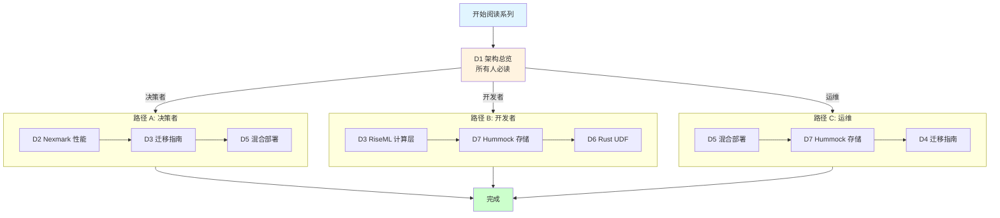
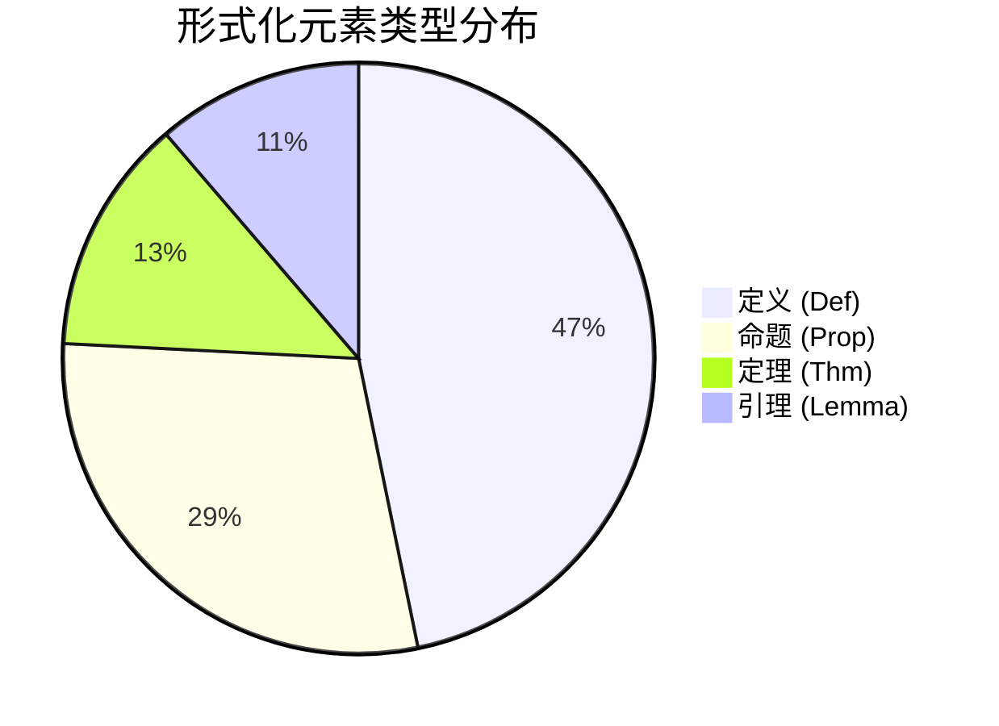
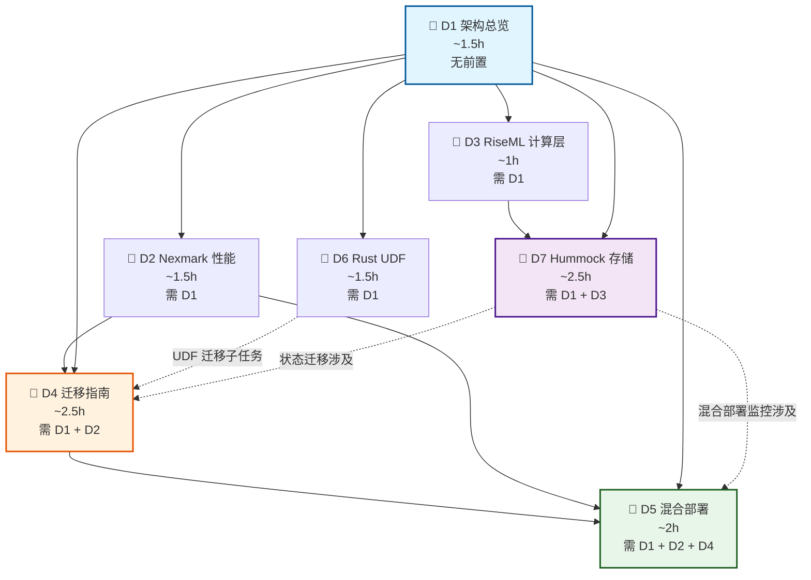
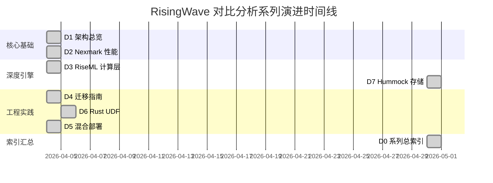

# RisingWave 对比分析系列总索引

> **所属阶段**: Flink/07-rust-native/risingwave-comparison/ | **前置依赖**: 无 | **形式化等级**: L2 (导航索引)
>
> **文档编号**: D0 | **版本**: v1.0 | **日期**: 2026-04-30 | **系列文档数**: 7

---

## 1. 系列概览 (Series Overview)

本系列构成 RisingWave 与 Apache Flink 的全面对比分析体系，覆盖**架构原理、性能基准、计算引擎、存储引擎、迁移实践、混合部署、扩展开发**七大维度。系列总计约 **175KB** 深度内容，含 **62** 个形式化元素与 **35** 张 Mermaid 可视化图表。

### 1.1 文档总览表

| 编号 | 文件 | 大小 | 核心主题 | 形式化元素 | Mermaid 图 |
|:----:|------|:----:|---------|:----------:|:----------:|
| D1 | [01-risingwave-architecture.md](./01-risingwave-architecture.md) | 21KB | 系统架构、计算存储分离、物化视图、PG 协议兼容 | 9 | 4 |
| D2 | [02-nexmark-head-to-head.md](./02-nexmark-head-to-head.md) | 22KB | Nexmark 性能对比、2–500× 差异根因分解、云成本模型 | 9 | 5 |
| D3 | [02-risingwave-riseml-deep-dive.md](./02-risingwave-riseml-deep-dive.md) | 12KB | RiseML 计算层、Fragment/Actor 调度、流批统一执行 | 8 | 4 |
| D4 | [03-migration-guide.md](./03-migration-guide.md) | 30KB | SQL 兼容性矩阵、迁移决策树、双写/CDC 方案、UDF 迁移 | 9 | 4 |
| D5 | [04-hybrid-deployment.md](./04-hybrid-deployment.md) | 29KB | 混合部署架构、统一查询层、协同处理模式、渐进式迁移路线图 | 9 | 5 |
| D6 | [04-risingwave-rust-udf-guide.md](./04-risingwave-rust-udf-guide.md) | 18KB | Rust UDF 开发指南、类型映射、安全沙箱、构建流程 | 7 | 7 |
| D7 | [05-risingwave-hummock-deep-dive.md](./05-risingwave-hummock-deep-dive.md) | 43KB | Hummock 存储引擎、LSM-Tree、SST 格式、Compaction、MVCC | 11 | 6 |
| **合计** | — | **175KB** | — | **62** | **35** |

### 1.2 核心主题关键词云

```
流处理数据库    物化视图    计算存储分离    Nexmark    性能对比
RiseML    Actor 模型    Fragment    流批统一    SQL 迁移
双写迁移    CDC 回放    混合部署    统一查询层    协同处理
Rust UDF    JIT 编译    类型映射    Hummock    LSM-Tree
SST    Compaction    MVCC    Epoch    Shared Buffer
```

---

## 2. 学习路径 (Learning Paths)

不同角色可按以下推荐路径选择性阅读，避免信息过载。

### 2.1 路径 A：技术决策者（CTO / 架构师）

**目标**：快速评估 RisingWave 是否适合业务场景，制定技术选型与迁移策略。

```
D1 架构总览 ──→ D2 性能对比 ──→ D4 迁移指南 ──→ D5 混合部署
  (1-2h)        (1-2h)          (2-3h)          (2-3h)
```

| 阶段 | 关键产出 | 决策支持 |
|------|---------|---------|
| D1 架构 | 理解"流即数据库" vs "流即处理" | 判断产品哲学匹配度 |
| D2 性能 | 量化 2–500× 差异根因与云成本模型 | 评估 TCO 与 ROI |
| D4 迁移 | 迁移复杂度度量、风险因子、回滚方案 | 制定迁移预算与时间表 |
| D5 混合 | 能力互补矩阵、场景分工、渐进式路线图 | 设计双轨并行策略 |

### 2.2 路径 B：内核开发者（Rust / 流计算工程师）

**目标**：深入理解 RisingWave 内部机制，进行性能调优或二次开发。

```
D1 架构总览 ──→ D3 RiseML ──→ D7 Hummock ──→ D6 Rust UDF
  (1-2h)        (1-2h)         (2-3h)          (1-2h)
```

| 阶段 | 关键产出 | 工程价值 |
|------|---------|---------|
| D1 架构 | 全局组件拓扑与数据流 | 建立系统级认知 |
| D3 RiseML | Fragment 调度、流批统一算子、Actor 模型映射 | 理解执行引擎设计 |
| D7 Hummock | LSM-Tree 变体、Version/Epoch 机制、Compaction 策略 | 掌握存储层调优参数 |
| D6 UDF | 原生 Rust UDF 语法、类型映射、安全沙箱 | 扩展查询能力 |

### 2.3 路径 C：运维工程师（SRE / 平台工程师）

**目标**：掌握部署、监控、故障排查与容量规划。

```
D1 架构总览 ──→ D5 混合部署 ──→ D7 Hummock ──→ D4 迁移指南
  (1-2h)        (2-3h)          (2-3h)          (2-3h)
```

| 阶段 | 关键产出 | 运维价值 |
|------|---------|---------|
| D1 架构 | K8s 部署配置、节点角色、状态分层 | 设计集群拓扑 |
| D5 混合 | 双引擎监控、OpenTelemetry 集成、故障排查速查表 | 搭建统一可观测性栈 |
| D7 Hummock | Shared Buffer 调优、Compaction 配置、S3 路径布局 | 存储容量规划与成本优化 |
| D4 迁移 | 双写架构图、一致性校验、回滚操作序列 | 保障迁移过程稳定性 |

### 2.4 学习路径可视化



---

## 3. 交叉引用矩阵 (Cross-Reference Matrix)

下表标明 7 篇文档之间的引用与概念关联强度。矩阵为对称形式，`(行, 列)` 与 `(列, 行)` 表示同一对文档的双向关系。

**图例**：

- 🔗 **强关联**：存在显式前置依赖声明、直接超链接引用或核心内容依赖
- ~ **弱关联**：存在概念提及、对比分析或间接关联
- · **无关联**：无直接引用或显著概念重叠

| 文档 | D1 架构 | D2 性能 | D3 RiseML | D4 迁移 | D5 混合 | D6 UDF | D7 Hummock |
|:----:|:-------:|:-------:|:---------:|:-------:|:-------:|:------:|:----------:|
| **D1 架构** | — | ~ | 🔗 | ~ | ~ | · | 🔗 |
| **D2 性能** | 🔗 | — | · | ~ | ~ | · | ~ |
| **D3 RiseML** | 🔗 | · | — | · | · | · | 🔗 |
| **D4 迁移** | 🔗 | 🔗 | · | — | 🔗 | 🔗 | ~ |
| **D5 混合** | 🔗 | 🔗 | · | 🔗 | — | · | ~ |
| **D6 UDF** | · | · | · | 🔗 | · | — | · |
| **D7 Hummock** | 🔗 | ~ | 🔗 | ~ | ~ | · | — |

### 3.1 强关联说明（🔗）

| 文档对 | 关联依据 |
|--------|---------|
| D1 ↔ D3 | D3 前置依赖声明引用 D1；D3 深入解析 D1 中 Compute Node 的内部 RiseML 引擎 |
| D1 ↔ D7 | D7 前置依赖声明引用 D1；D7 将 D1 概述的 Hummock 状态存储展开为完整存储引擎分析 |
| D1 ↔ D4 | D4 前置依赖声明引用 D1；迁移需基于架构理解进行兼容性评估 |
| D1 ↔ D5 | D5 前置依赖声明引用 D1；混合部署方案基于架构组件映射设计 |
| D2 ↔ D4 | D4 前置依赖声明引用 D2；迁移决策需参考性能基准数据 |
| D2 ↔ D5 | D5 前置依赖声明引用 D2；混合部署场景分工依赖性能对比结论 |
| D3 ↔ D7 | D7 前置依赖声明引用 D3；RiseML 计算层通过 State Store Interface 调用 Hummock |
| D4 ↔ D5 | D5 前置依赖声明引用 D4；混合部署是迁移的进阶形态 |
| D4 ↔ D6 | D4 第 6.3 节显式引用 Rust UDF 指南；UDF 迁移是 SQL 迁移的关键子任务 |

### 3.2 弱关联说明（~）

| 文档对 | 关联依据 |
|--------|---------|
| D1 ↔ D2 | D1 在 Prop-RW-04 中预引用 Nexmark Q5 性能数据；D2 基于 D1 架构组件展开测试 |
| D1 ↔ D4 | D4 中迁移方案涉及 D1 所述的 PG 协议兼容层与状态分层架构 |
| D1 ↔ D5 | D5 中混合部署架构图包含 D1 所述 RisingWave 全部核心组件 |
| D2 ↔ D7 | D2 在性能根因分解中提到 Hummock vs RocksDB 状态管理差异 |
| D4 ↔ D7 | D4 中状态迁移策略涉及 Hummock 存储格式与 Epoch 机制 |
| D5 ↔ D7 | D5 中混合部署的监控与调优涉及 Hummock 缓存命中率与 Compaction |
| D7 ↔ D2 | D7 在状态管理对比映射中引用 Nexmark 场景下的状态访问模式 |

---

## 4. 形式化元素汇总 (Formal Elements Summary)

全系列共包含 **62** 个形式化元素，覆盖定义（Def）、定理（Thm）、引理（Lemma）、命题（Prop）四大类型。编号采用 `Def/Thm/Lemma/Prop-RW-{序号}` 与 `Def/Lemma/Prop-RW-RUST-{序号}` 双轨体系。

### 4.1 总计与分布

| 类型 | 缩写 | 全系列总计 | 占比 | 说明 |
|------|:----:|:----------:|:----:|------|
| **定义** | Def | 29 | 46.8% | 核心概念的形式化刻画 |
| **命题** | Prop | 18 | 29.0% | 可推导的工程性质与约束 |
| **定理** | Thm | 8 | 12.9% | 需完整证明的主要结论 |
| **引理** | Lemma | 7 | 11.3% | 辅助定理的中间结论 |
| **推论** | Cor | 0 | 0% | 本系列暂未使用 |
| **合计** | — | **62** | **100%** | — |

### 4.2 分文档分布

| 文档 | Def | Thm | Lemma | Prop | 小计 |
|:----:|:---:|:---:|:-----:|:----:|:----:|
| D1 架构 | 4 | 1 | 0 | 4 | 9 |
| D2 性能 | 4 | 2 | 0 | 3 | 9 |
| D3 RiseML | 4 | 1 | 2 | 1 | 8 |
| D4 迁移 | 4 | 1 | 0 | 4 | 9 |
| D5 混合 | 4 | 2 | 0 | 3 | 9 |
| D6 UDF | 3 | 0 | 3 | 1 | 7 |
| D7 Hummock | 6 | 1 | 2 | 2 | 11 |
| **合计** | **29** | **8** | **7** | **18** | **62** |

### 4.3 形式化元素分布可视化



### 4.4 关键定理速查

| 编号 | 名称 | 所在文档 | 核心结论 |
|:----:|------|:--------:|---------|
| Thm-RW-01 | 架构正确性论证 | D1 | 计算存储分离架构在 Epoch 单调递增、S3 原子写入、Raft 元数据一致性条件下保证 exactly-once 语义 |
| Thm-RW-02 | 延迟性能定理 | D2 | 窗口聚合查询的 RW/Flink 延迟比满足语言运行时、序列化、状态访问、向量化执行的多因素复合模型 |
| Thm-RW-03 | 吞吐量上限分析 | D2 | 系统最大吞吐量受限于最慢处理阶段的单事件处理时间与并行度乘积 |
| Thm-RW-01 | 流批统一增量等价 | D3 | RiseML Stream 算子增量维护的终态等价于 Batch 全量重计算 |
| Thm-RW-04 | 迁移正确性证明 | D4 | 双写迁移在满足输入源可重放、事件时间对齐、双写期覆盖 Checkpoint 周期条件下保持输出一致性 |
| Thm-RW-05 | 端到端延迟分析 | D5 | 混合架构端到端延迟 = Flink 处理延迟 + 同步延迟 + RW 处理延迟 + 查询延迟 |
| Thm-RW-06 | 成本优化定理 | D5 | 若工作负载分配满足最优性条件，则混合架构 TCO 低于任一单一引擎 |
| Thm-RW-02 | 快照隔离语义等价 | D7 | 在满足 Epoch 单调、Version 原子切换、确定性重放、算子确定性条件下，Hummock Epoch 与 Flink Checkpoint 故障恢复语义等价 |

> **注**：Thm-RW-01 与 Thm-RW-02 在 D1/D3/D7 中因分文档独立编号而出现复用，实际内容各异。

---

## 5. Flink 对标总图 (Flink-RisingWave Mapping)

以下大型 Mermaid 图展示 RisingWave 全栈组件与 Flink 生态的系统性映射关系。左侧为 Apache Flink 组件，右侧为 RisingWave 组件，中间标明映射类型（等价 / 相似 / 无直接对应）。

```mermaid
graph TB
    subgraph "查询接口层"
        F_SQL[Flink SQL Gateway<br/>Table API]
        R_FE[RisingWave Frontend<br/>PostgreSQL Wire Protocol]
        MAP_SQL["🟢 等价映射<br/>SQL 语义互通<br/>PG 协议降低迁移成本"]
    end

    subgraph "计算执行层"
        F_JM[Flink JobManager<br/>调度 + Checkpoint 协调]
        F_TM[Flink TaskManager<br/>JVM 线程池模型]
        F_OP[Flink 算子链<br/>Network Buffer 交换]

        R_META[RisingWave Meta Service<br/>Raft 共识 + Epoch 分配]
        R_CN[RisingWave Compute Node<br/>RiseML Actor 模型]
        R_FRAG[RiseML Fragment<br/>Local/Remote Exchange]

        MAP_COORD["🟢 功能等价<br/>JM ↔ Meta: 集群协调<br/>TM ↔ CN: 执行单元"]
        MAP_EXEC["🟡 哲学差异<br/>线程池 vs Actor<br/>应用层 Checkpoint vs 存储层快照"]
    end

    subgraph "状态管理层"
        F_ROCKS[Flink RocksDB<br/>本地 SSD 状态后端]
        F_HEAP[Flink Heap State<br/>JVM 堆内存状态]
        F_CHK[Flink Checkpoint<br/>异步快照到 S3/HDFS]

        R_HUM[RisingWave Hummock<br/>S3-backed LSM-Tree]
        R_SB[RisingWave Shared Buffer<br/>分布式写缓冲]
        R_COMP[RisingWave Compactor<br/>独立后台合并节点]

        MAP_STATE["🟡 架构差异<br/>本地持久状态 vs 远程主存储<br/>RocksDB 本地线程 vs 独立 Compactor"]
        MAP_CHK["🟢 语义等价<br/>Checkpoint Barrier ↔ Epoch<br/>Chandy-Lamport ↔ Hummock Version"]
    end

    subgraph "数据源与输出"
        F_SRC[Flink Source Function<br/>Kafka / Pulsar / CDC]
        F_SINK[Flink Sink<br/>外部存储 / Kafka]

        R_SRC[RisingWave Source Connector<br/>原生 Kafka / PG CDC / MySQL CDC]
        R_MV[RisingWave Materialized View<br/>内置物化查询结果]

        MAP_SRC["🟢 等价映射<br/>连接器生态高度重叠<br/>Kafka / CDC 即插即用"]
        MAP_SINK["🔴 设计差异<br/>Flink: 显式 Sink 到外部系统<br/>RW: 物化视图 = 内置存储 + 即席查询"]
    end

    subgraph "扩展与 UDF"
        F_UDF[Flink UDF<br/>Java / Python / WASM]
        F_CEP[Flink CEP 库<br/>MATCH_RECOGNIZE]

        R_UDF[RisingWave UDF<br/>Rust 原生 / Python / WASM]
        R_SQL["纯 SQL + 物化视图<br/>无内置 CEP"]

        MAP_UDF["🟡 能力重叠<br/>标量/表/聚合函数互通<br/>Rust UDF 性能更优但生态较小"]
        MAP_CEP["🔴 Flink 独占<br/>RW 无 CEP 支持<br/>混合部署场景保留 Flink CEP"]
    end

    F_SQL --> R_FE
    R_FE -.->|PG Protocol| MAP_SQL

    F_JM --> R_META
    F_TM --> R_CN
    F_OP --> R_FRAG
    R_META -.->|调度 + 容错| MAP_COORD
    R_CN -.->|执行模型| MAP_EXEC

    F_ROCKS --> R_HUM
    F_HEAP --> R_SB
    F_CHK --> R_HUM
    R_HUM -.->|存储哲学| MAP_STATE
    R_SB -.->|快照机制| MAP_CHK

    F_SRC --> R_SRC
    F_SINK --> R_MV
    R_SRC -.->|连接器| MAP_SRC
    R_MV -.->|输出模型| MAP_SINK

    F_UDF --> R_UDF
    F_CEP -.->|无对应| R_SQL
    R_UDF -.->|扩展能力| MAP_UDF
    R_SQL -.->|CEP 缺失| MAP_CEP

    style F_SQL fill:#e3f2fd
    style F_JM fill:#e3f2fd
    style F_TM fill:#e3f2fd
    style F_OP fill:#e3f2fd
    style F_ROCKS fill:#e3f2fd
    style F_HEAP fill:#e3f2fd
    style F_CHK fill:#e3f2fd
    style F_SRC fill:#e3f2fd
    style F_SINK fill:#e3f2fd
    style F_UDF fill:#e3f2fd
    style F_CEP fill:#e3f2fd

    style R_FE fill:#e8f5e9
    style R_META fill:#e8f5e9
    style R_CN fill:#e8f5e9
    style R_FRAG fill:#e8f5e9
    style R_HUM fill:#e8f5e9
    style R_SB fill:#e8f5e9
    style R_COMP fill:#e8f5e9
    style R_SRC fill:#e8f5e9
    style R_MV fill:#e8f5e9
    style R_UDF fill:#e8f5e9
    style R_SQL fill:#fff3e0
```



### 5.1 映射关系总表

| RisingWave 组件 | Flink 对应组件 | 映射类型 | 关键差异 |
|----------------|---------------|:--------:|---------|
| Frontend (PG 协议) | SQL Gateway / Table API | 🟢 等价 | PG 协议兼容性降低迁移成本 |
| Compute Node (RiseML) | TaskManager | 🟢 等价 | Rust Actor 模型 vs JVM 线程池 |
| Meta Service | JobManager | 🟢 等价 | 均基于 Raft 的分布式协调 |
| Hummock | RocksDB State Backend | 🟡 相似 | 远程 S3 主存储 vs 本地 SSD |
| Source Connector | Source Function | 🟢 等价 | 概念等价，API 不同 |
| Materialized View | Sink + 外部存储 | 🔴 差异 | 内置物化视图 vs 显式外部 Sink |
| Compactor | RocksDB 后台线程 | 🔴 差异 | 独立节点 vs 本地线程 |
| Epoch | Checkpoint Barrier | 🟢 等价 | 语义等价，实现层级不同 |
| Rust UDF | Java/Python/WASM UDF | 🟡 相似 | 原生机器码 vs VM/解释执行 |
| — | CEP 库 | 🔴 缺失 | RisingWave 无内置 CEP |

---

## 6. 知识依赖图 (Knowledge Dependency Graph)

以下 `graph TD` 展示 7 篇文档的阅读依赖顺序。节点标注预计阅读时长与前置条件。



### 6.1 依赖规则说明

1. **D1 为唯一根节点**：所有路径均以架构总览为起点，建立 RisingWave 全局认知。
2. **D2 / D3 / D6 为一级分支**：性能对比、计算层、UDF 三者互不依赖，可并行阅读。
3. **D4 为汇合节点**：迁移指南依赖架构理解与性能数据，是决策者的关键产出节点。
4. **D5 为高级节点**：混合部署需在理解单一系统迁移的基础上，才能设计双引擎协同。
5. **D7 为深度 leaf**：Hummock 存储分析最为深入（43KB），适合已掌握架构与计算层的读者。

---

## 7. 版本与更新日志 (Version & Changelog)

### 7.1 各文档版本状态

| 文档 | 完成日期 | 版本 | 状态 | 后续计划 |
|:----:|:--------:|:----:|:----:|---------|
| D1 架构 | 2026-04-04 | v1.0 | ✅ 已完成 | 随 RisingWave 版本迭代更新架构图 |
| D2 性能 | 2026-04-04 | v1.0 | ✅ 已完成 | 补充 Nexmark q21-q22 实测数据 |
| D3 RiseML | 2026-04 | v1.0 | ✅ 已完成 | 跟进 RiseML Batch 执行优化进展 |
| D4 迁移 | 2026-04-04 | v1.0 | ✅ 已完成 | 补充 Flink 1.19 / RisingWave 1.8 兼容性更新 |
| D5 混合 | 2026-04-04 | v1.0 | ✅ 已完成 | 补充生产环境大规模混合部署案例 |
| D6 UDF | 2026-04-05 | v1.0 | ✅ 已完成 | 跟进聚合函数 UDF 正式支持 |
| D7 Hummock | 2026-04-30 | v1.0 | ✅ 已完成 | 补充 Tiered Compaction 性能基准 |
| **D0 索引** | **2026-04-30** | **v1.0** | ✅ **已完成** | **随系列文档更新同步维护** |

### 7.2 系列演进时间线



### 7.3 更新策略

本系列采用**版本锁定 + 增量更新**策略：

1. **基础文档**（D1–D3）随 RisingWave 大版本（v1.8, v2.0 等）进行结构化更新
2. **性能数据**（D2）每季度复测并更新 Nexmark 数据表
3. **工程文档**（D4–D6）随 Flink / RisingWave 功能发布进行兼容性矩阵维护
4. **索引文档**（D0）在任意子文档更新后同步修订交叉引用与统计数字

---

## 8. 引用参考 (References)

本系列文档的引用分散于各子文档末尾，以下汇总系列级核心参考来源：


---

*文档状态: ✅ 已完成 (D0/0) | 系列状态: 7/7 文档全部完成 🎉*
*本索引最后更新: 2026-04-30 | 下次审查: RisingWave v1.8 发布后*
