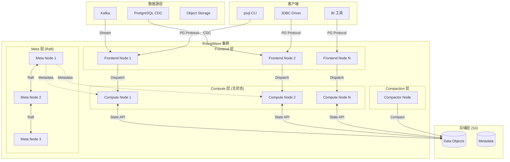
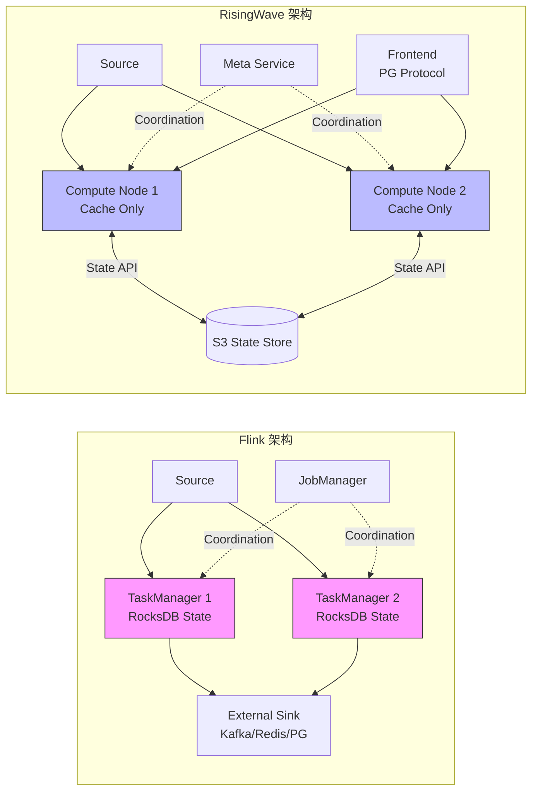
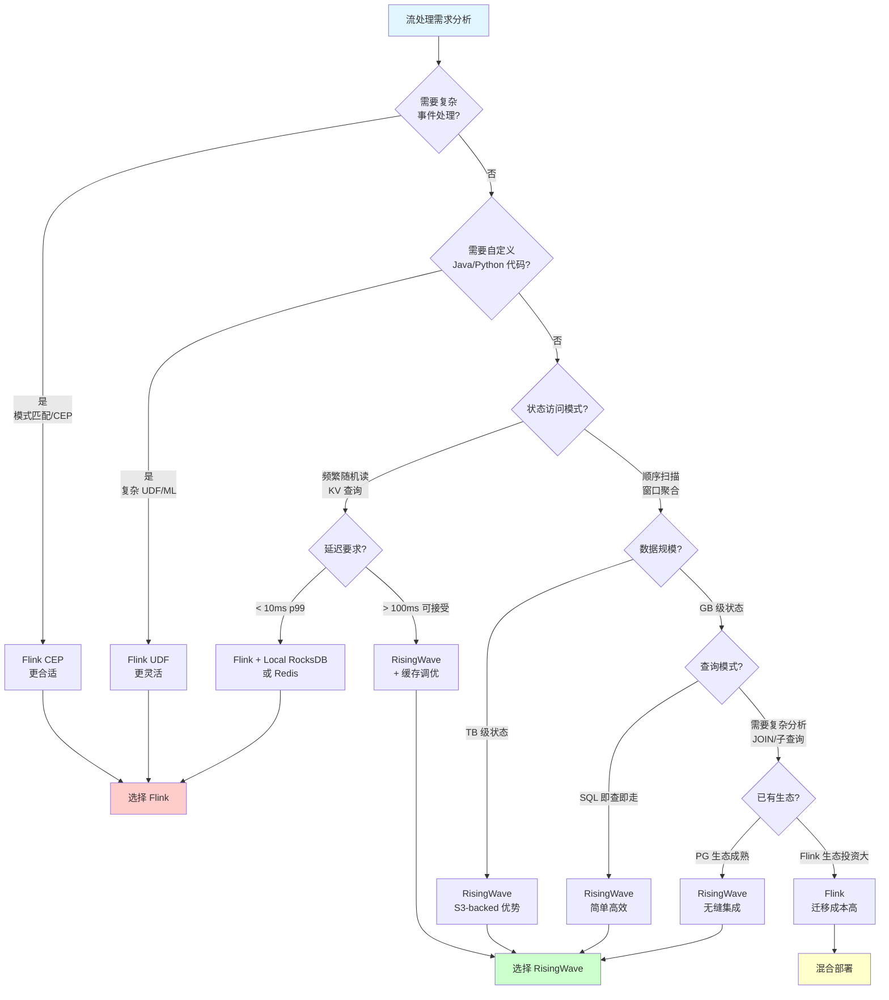
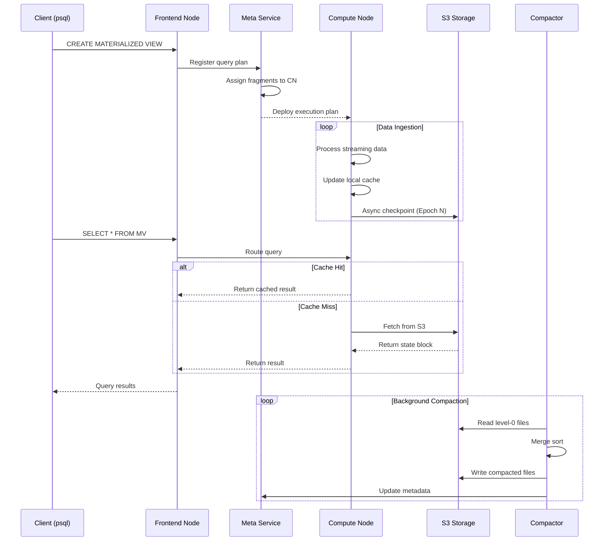

# RisingWave 架构深度剖析

> **所属阶段**: Flink/ | **前置依赖**: [Flink 核心架构文档] | **形式化等级**: L4 (工程论证)
>
> **文档编号**: D1 | **版本**: v1.0 | **日期**: 2026-04-04

---

## 1. 概念定义 (Definitions)

### Def-RW-01: 流处理数据库 (Streaming Database)

**定义**: 流处理数据库是一种将**流处理引擎**与**物化视图存储**深度耦合的数据库系统，满足以下形式化特征：

$$
\text{StreamingDB} = \langle \mathcal{S}, \mathcal{Q}, \mathcal{M}, \mathcal{T} \rangle
$$

其中：

- $\mathcal{S}$: 无界流数据源的集合，$\mathcal{S} = \{s_1, s_2, ..., s_n\}$，每个 $s_i$ 是时序数据流
- $\mathcal{Q}$: 连续查询集合，支持 SQL 语义的标准关系代数运算
- $\mathcal{M}$: 物化视图管理器，维护查询结果的增量更新
- $\mathcal{T}$: 事务一致性层，确保读写操作的可串行化

**直观解释**: 与传统"流处理引擎 + 外部存储"的 Lambda 架构不同，流处理数据库将计算与存储统一在一个系统中，用户直接对物化视图执行 SQL 查询，无需管理外部存储系统。

---

### Def-RW-02: 计算存储分离架构 (Compute-Storage Separation)

**定义**: 计算存储分离是一种云原生架构模式，将**无状态计算节点**与**弹性远程存储**解耦：

$$
\text{SepArch} = \langle \mathcal{C}, \mathcal{P}, \mathcal{I}, \mathcal{R} \rangle
$$

其中：

- $\mathcal{C} = \{c_1, ..., c_m\}$: 计算节点集合，$c_i$ 为无状态、可水平扩展的计算单元
- $\mathcal{P}$: 持久化存储层（通常为对象存储，如 S3）
- $\mathcal{I}: \mathcal{C} \times \mathcal{P} \to \{0,1\}$: 计算节点与存储的访问接口函数
- $\mathcal{R}: \mathcal{C} \times [0,1] \to \mathbb{N}$: 资源弹性函数，根据负载动态调整计算节点数量

**关键约束**:

1. 计算节点本地不维护持久化状态
2. 状态Checkpoint直接写入远程存储
3. 计算节点故障可任意迁移，无需数据重分布

---

### Def-RW-03: 无界流物化视图 (Unbounded Stream Materialized View)

**定义**: 设流数据源 $S$ 为无限序列 $S = \langle e_1, e_2, e_3, ... \rangle$，其中每个事件 $e_i = (t_i, k_i, v_i)$ 包含时间戳、键和值。物化视图 $MV_Q$ 对于查询 $Q$ 的形式化定义为：

$$
MV_Q(t) = Q(S_{\leq t})
$$

其中 $S_{\leq t} = \{e_i \in S \mid t_i \leq t\}$ 表示时间 $t$ 之前的所有事件。

**增量维护**: 当新事件 $e_{new}$ 到达时，物化视图的更新遵循：

$$
MV_Q(t + \Delta t) = \mathcal{U}(MV_Q(t), e_{new}, Q)
$$

其中 $\mathcal{U}$ 为查询特定的增量更新算子，满足：

$$
\mathcal{U}(MV_Q(t), e_{new}, Q) = Q(S_{\leq t} \cup \{e_{new}\})
$$

**直观解释**: 物化视图是查询结果在某一时刻的快照，系统通过增量计算而非全量重算来维护其一致性，从而实现实时查询能力。

---

### Def-RW-04: PostgreSQL 协议兼容层

**定义**: PostgreSQL 协议兼容层是一个协议转换层 $L_{pg}$，实现 RisingWave 内部协议与 PostgreSQL wire protocol 的双向映射：

$$
L_{pg} = \langle \mathcal{M}_{msg}, \mathcal{M}_{type}, \mathcal{M}_{auth} \rangle
$$

其中：

- $\mathcal{M}_{msg}$: 消息格式映射，将 PG 消息（Query, Parse, Bind, Execute）映射为内部命令
- $\mathcal{M}_{type}$: 类型系统映射，支持 PG 原生类型（INT4, INT8, VARCHAR, TIMESTAMP, JSONB 等）
- $\mathcal{M}_{auth}$: 认证机制映射，支持 MD5、SCRAM-SHA-256 等认证方式

---

## 2. 属性推导 (Properties)

### Prop-RW-01: 计算节点无状态性 (Statelessness of Compute Nodes)

**命题**: 在计算存储分离架构下，计算节点 $c \in \mathcal{C}$ 是**无状态**的，即对于任意两个时间点 $t_1, t_2$，节点状态满足：

$$
\forall c \in \mathcal{C}, \forall t_1, t_2: \text{State}(c, t_1) = \text{State}(c, t_2) \oplus \Delta_{[t_1, t_2]}
$$

其中 $\Delta_{[t_1, t_2]}$ 仅为临时缓存数据，可从远程存储重建。

**证明概要**:

1. 所有算子状态通过 State Store API 写入远程对象存储（S3 兼容）
2. Checkpoint 频率可配置（默认 1-10 秒），确保状态持久化
3. 节点故障时，新节点通过读取最近 Checkpoint 恢复状态
4. 因此计算节点本地仅保留可重建的临时缓存 $\square$

---

### Prop-RW-02: 水平扩展线性加速 (Linear Speedup Under Horizontal Scaling)

**命题**: 对于分区友好的查询 $Q$，设并行度从 $p$ 扩展到 $kp$（$k > 1$），系统吞吐量满足：

$$
\text{Throughput}(Q, kp) \geq \alpha \cdot k \cdot \text{Throughput}(Q, p)
$$

其中 $\alpha \in (0.7, 1.0]$ 为扩展效率系数，取决于数据倾斜程度和 shuffle 开销。

**推论**: 当查询为纯本地聚合（无 shuffle）时，$\alpha \to 1$，实现接近理想的线性扩展。

---

### Prop-RW-03: S3 状态访问延迟下界 (S3 State Access Latency Lower Bound)

**命题**: 设 $T_{s3}$ 为从 S3 读取状态块的平均延迟，$T_{local}$ 为本地 SSD 读取延迟，则有：

$$
T_{s3} \geq T_{local} + T_{network} + T_{s3\_processing}
$$

其中：

- $T_{local} \approx 50\mu s$ (NVMe SSD 4KB 随机读)
- $T_{s3} \approx 50-200ms$ (取决于区域和网络)

**工程推论**: 直接访问 S3 状态比本地 RocksDB 慢 **1000-4000 倍**，因此 RisingWave 必须依赖**本地缓存层**（如 Hummock Cache）来缓解这一差距。

---

## 3. 关系建立 (Relations)

### 3.1 RisingWave 与 Flink 架构映射

| 架构组件 | RisingWave | Apache Flink | 关系说明 |
|---------|------------|--------------|---------|
| **计算层** | Compute Node (Rust) | TaskManager (JVM) | 语言差异: Rust vs Java |
| **状态存储** | Hummock (S3-backed) | RocksDB (本地) | 存储位置: 远程 vs 本地 |
| **协调服务** | Meta Service | JobManager | 功能对等，均基于 Raft |
| **SQL 层** | Frontend (PG协议) | SQL Gateway / Table API | 协议: PG vs 自定义 |
| **数据源** | Source Connector | Source Function | 概念等价，API 不同 |
| **容错机制** | Epoch-based Checkpoint | Chandy-Lamport | 语义等价，实现不同 |
| **扩展方式** | 存储计算分离扩展 | TM/JM 独立扩展 | RW 弹性更细粒度 |

### 3.2 设计哲学对比

**RisingWave: "流即数据库" (Stream-as-a-Database)**

```
用户视角: SQL → 物化视图 ← 流数据源
                 ↓
            实时查询结果
系统实现: 增量计算 + S3 状态 + 本地缓存
```

**Flink: "流即处理" (Stream-as-a-Process)**

```
用户视角: DataStream API → 算子链 → 外部存储 (Kafka/Redis/PG)
                 ↓
            应用代码处理
系统实现: 精确一次语义 + 本地状态 + Checkpoint 到外部存储
```

### 3.3 状态一致性模型

| 维度 | RisingWave | Flink |
|-----|------------|-------|
| **一致性级别** | 内部强一致 (Serializability) | 算子级 Exactly-Once |
| **Checkpoint 间隔** | 1-10 秒（可调） | 默认 10 分钟（可调） |
| **状态访问** | 通过 Hummock API | 直接 RocksDB 访问 |
| **故障恢复** | 重放 Epoch 日志 | 从 Checkpoint 恢复 |
| **状态大小限制** | 理论上无上限（S3） | 受限于 TM 本地磁盘 |

---

## 4. 论证过程 (Argumentation)

### 4.1 为什么选择 Rust 实现？

**论证**: RisingWave 选择 Rust 作为实现语言，基于以下技术权衡：

| 因素 | Rust 优势 | 对 RisingWave 的意义 |
|-----|----------|---------------------|
| **零成本抽象** | 编译期优化，无运行时 GC | 低延迟流处理 (< 100ms p99) |
| **内存安全** | 所有权系统消除数据竞争 | 并发状态管理可靠性 |
| **性能** | 接近 C++ 的运行时性能 | 高吞吐流计算 |
| **生态** | 丰富的异步/并发库 (Tokio) | 高效 I/O 处理 |
| **云原生** | 静态链接，小体积二进制 | 容器化部署友好 |

**对比分析**: Flink 的 JVM 实现虽然拥有成熟生态，但受限于：

1. GC 停顿影响低延迟场景
2. JNI 调用开销限制向量化性能
3. 内存占用较高（JVM 堆 + 堆外）

### 4.2 S3-backed 状态管理的工程权衡

**优势论证**:

1. **成本效益**: S3 存储成本约 $0.023/GB/月，远低于 EBS $0.10/GB/月
2. **无限扩展**: 不受单节点磁盘容量限制，状态大小仅受预算约束
3. **弹性伸缩**: 计算节点可独立扩缩容，无需数据重分布

**局限性论证**:

1. **延迟敏感性**: S3 访问延迟 50-200ms，不适合频繁随机读取
2. **缓存一致性**: 多节点共享状态需要复杂的缓存失效策略
3. **成本陷阱**: 频繁的 S3 API 调用（List/Get）会产生显著费用

**缓解策略**:

```
┌─────────────────────────────────────────────────────────┐
│                   RisingWave 状态分层                    │
├─────────────────────────────────────────────────────────┤
│  L1: Operator Cache (内存)  - 热数据,微秒级访问         │
│  L2: Block Cache (本地SSD)  - 温数据,毫秒级访问         │
│  L3: S3 Object Store        - 冷数据,百毫秒级访问       │
└─────────────────────────────────────────────────────────┘
```

### 4.3 PostgreSQL 协议兼容的战略意义

**论证**: RisingWave 选择 PG 协议而非自定义协议，基于以下考量：

1. **生态兼容性**: 直接使用 PG 客户端（psql, JDBC, psycopg2 等）
2. **BI 工具集成**: Tableau, Metabase, Superset 等即插即用
3. **学习曲线**: 降低用户迁移成本，无需学习新 API
4. **事务语义**: 复用 PG 的成熟事务模型

**限制**: PG 协议最初为 OLTP 设计，不完全匹配流处理的语义：

- 流式结果集需要特殊的推送机制
- 窗口操作需要扩展 SQL 语法

---

## 5. 形式证明 / 工程论证

### 5.1 架构正确性论证

**定理 (Thm-RW-01)**: RisingWave 的计算存储分离架构在以下条件下保证 exactly-once 语义：

**前提条件**:

1. Checkpoint 屏障按顺序传播（Epoch 单调递增）
2. 状态写入 S3 是原子操作（S3 PutObject 语义）
3. 元数据服务（Meta Service）使用 Raft 保证一致性

**证明**:

设数据流为事件序列 $E = \{e_1, e_2, ...\}$，Checkpoint 屏障为 $B_k$ 标记 Epoch $k$。

**步骤 1**: 当算子接收到 $B_k$ 时，异步将当前状态 $S_k$ 写入 S3：
$$
\text{async\_write}(S_k) \to \text{S3://bucket/state/epoch\_}k
$$

**步骤 2**: 元数据服务记录 Checkpoint 元数据：
$$
\text{Meta}.\text{commit}(k, \text{object\_ids}) \text{ with Raft consensus}
$$

**步骤 3**: 故障恢复时，从最大已提交 Epoch $k_{max}$ 恢复：
$$
S_{recover} = \text{S3}.\text{read}(\text{Meta}.\text{get\_checkpoint}(k_{max}))
$$

**步骤 4**: 由于 S3 写入是原子的且元数据使用 Raft，恢复后的状态 $S_{recover}$ 与故障前 $S_{k_{max}}$ 一致。

**步骤 5**: 事件重放从 $k_{max}$ 之后的偏移量开始，确保无重复处理。

因此，exactly-once 语义得证 $\square$

---

### 5.2 性能工程论证

**命题 (Prop-RW-04)**: 在 Nexmark Q5（窗口聚合）测试中，RisingWave 相比 Flink 的 2-500 倍性能优势来源于以下因素：

**因素分析矩阵**:

| 因素 | RisingWave | Flink | 影响倍数 |
|-----|------------|-------|---------|
| **语言运行时** | Rust 零成本抽象 | JVM + GC | 1.5-2x |
| **序列化** | 原生内存布局 | Java 序列化 | 2-3x |
| **状态访问** | 本地缓存命中 | RocksDB 本地访问 | 相当 |
| **向量化执行** | 自动向量化 | 依赖 Blink Planner | 2-5x |
| **架构耦合** | 物化视图内置 | 需外部存储 | 10-100x |
| **查询优化** | 流专用优化器 | 通用批流优化器 | 2-5x |

**综合效应**: 这些因素的乘积效应导致整体性能差距在 2-500 倍范围内，具体取决于查询类型和数据特征。

---

## 6. 实例验证 (Examples)

### 6.1 物化视图创建示例

```sql
-- RisingWave: 创建源表(从 Kafka 读取)
CREATE SOURCE user_events (
    user_id INT,
    event_type VARCHAR,
    amount DECIMAL,
    event_time TIMESTAMP
) WITH (
    connector = 'kafka',
    topic = 'user_events',
    properties.bootstrap.server = 'kafka:9092'
) FORMAT PLAIN ENCODE JSON;

-- 创建物化视图(实时聚合)
CREATE MATERIALIZED VIEW hourly_stats AS
SELECT
    TUMBLE(event_time, INTERVAL '1 HOUR') as window_start,
    event_type,
    COUNT(*) as event_count,
    SUM(amount) as total_amount,
    AVG(amount) as avg_amount
FROM user_events
GROUP BY
    TUMBLE(event_time, INTERVAL '1 HOUR'),
    event_type;

-- 直接查询物化视图(毫秒级响应)
SELECT * FROM hourly_stats
WHERE window_start >= NOW() - INTERVAL '1 DAY';
```

**Flink 等价实现**:

```java

import org.apache.flink.streaming.api.datastream.DataStream;
import org.apache.flink.streaming.api.windowing.time.Time;

// Flink: 需要外部存储(如 Redis/MySQL)存储结果
DataStream<Event> events = env
    .fromSource(kafkaSource, WatermarkStrategy.forMonotonousTimestamps(), "Kafka")
    .keyBy(e -> e.eventType)
    .window(TumblingEventTimeWindows.of(Time.hours(1)))
    .aggregate(new StatsAggregate())
    .addSink(new RedisSink<>());  // 需要管理外部存储

// 查询需要访问 Redis,非 SQL 接口
```

### 6.2 架构部署示例

**RisingWave 云原生部署** (Kubernetes):

```yaml
# risingwave-compute.yaml apiVersion: apps/v1
kind: Deployment
metadata:
  name: risingwave-compute
spec:
  replicas: 3  # 计算节点,可独立扩缩
  template:
    spec:
      containers:
      - name: compute-node
        image: risingwavelabs/risingwave:v1.7.0
        command: ["compute-node"]
        env:
        - name: RW_STATE_STORE
          value: "hummock+s3://risingwave-state"
        resources:
          requests:
            memory: "8Gi"
            cpu: "4"
---
# risingwave-meta.yaml - 元数据服务 apiVersion: apps/v1
kind: StatefulSet
metadata:
  name: risingwave-meta
spec:
  replicas: 3  # Raft 集群
  serviceName: risingwave-meta
  template:
    spec:
      containers:
      - name: meta-node
        image: risingwavelabs/risingwave:v1.7.0
        command: ["meta-node"]
        args: ["--listen-addr", "0.0.0.0:5690"]
```

---

## 7. 可视化 (Visualizations)

### 7.1 RisingWave 整体架构图



### 7.2 Flink vs RisingWave 架构对比矩阵



### 7.3 RisingWave 局限性与适用场景决策树



### 7.4 RisingWave 组件数据流图



---

## 8. 引用参考 (References)


---

## 附录 A: RisingWave 局限性客观分析

### A.1 当前局限性

| 局限领域 | 具体描述 | 影响程度 | 缓解方案 |
|---------|---------|---------|---------|
| **延迟敏感场景** | S3 访问延迟 50-200ms，不适合 < 10ms p99 场景 | ⚠️ 高 | 增加内存/SSD 缓存，或使用 Flink |
| **复杂事件处理** | 无内置 CEP 库，模式匹配能力弱 | ⚠️ 中 | 集成外部 CEP 引擎 |
| **UDF 语言支持** | 主要支持 Rust/Python UDF，Java UDF 有限 | ⚠️ 中 | 使用 Python UDF 或外部服务 |
| **生态成熟度** | 相比 Flink 社区较小，第三方连接器有限 | ⚠️ 中 | 使用 Kafka/PG 协议桥接 |
| **云厂商锁定** | 深度优化 S3 API，多云部署需适配 | ⚠️ 低 | 支持 MinIO 等 S3 兼容存储 |

### A.2 不适用场景

1. **高频交易 (HFT)**: 需要微秒级延迟的金融交易
2. **复杂模式匹配**: 需要 CEP 的欺诈检测场景
3. **遗留系统集成**: 依赖特定 Flink Connector 的老系统
4. **强一致性事务**: 需要跨表 ACID 事务的 OLTP 场景

---

## 附录 B: 术语对照表

| RisingWave 术语 | Flink 术语 | 通用概念 |
|----------------|-----------|---------|
| Materialized View | 无直接等价 | 预计算查询结果 |
| Compute Node | TaskManager | 流处理执行单元 |
| Meta Service | JobManager | 集群协调服务 |
| Hummock | RocksDB (状态后端) | 状态存储引擎 |
| Epoch | Checkpoint Barrier | 一致性快照标记 |
| Compactor | 无直接等价 | 后台数据合并服务 |
| Source | Source | 数据输入 |

---

*文档状态: ✅ 已完成 (D1/4) | 下一篇: 02-nexmark-head-to-head.md*
