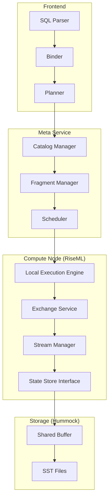
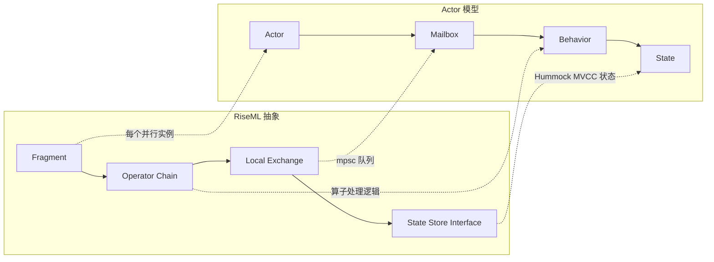
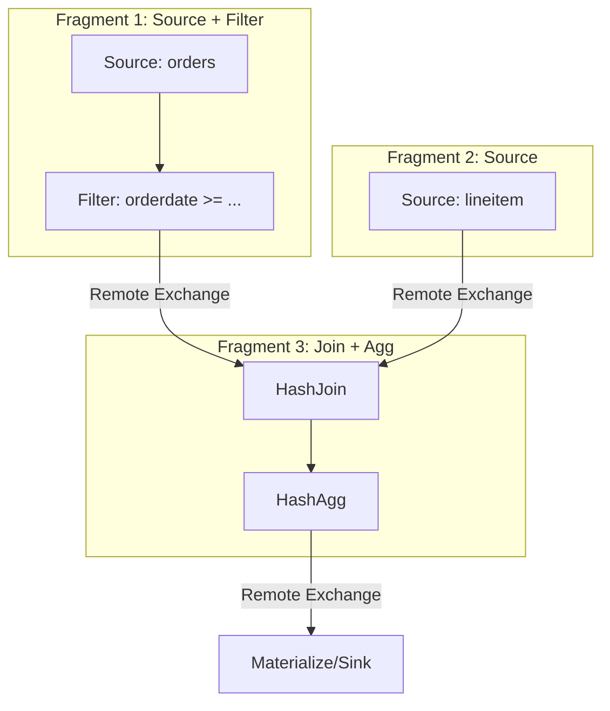
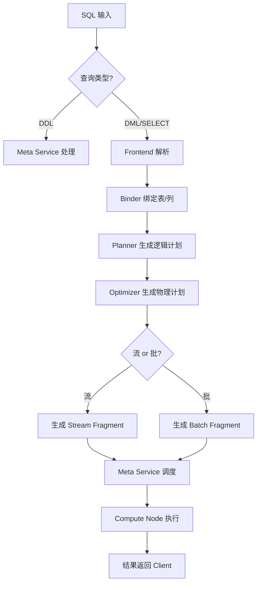
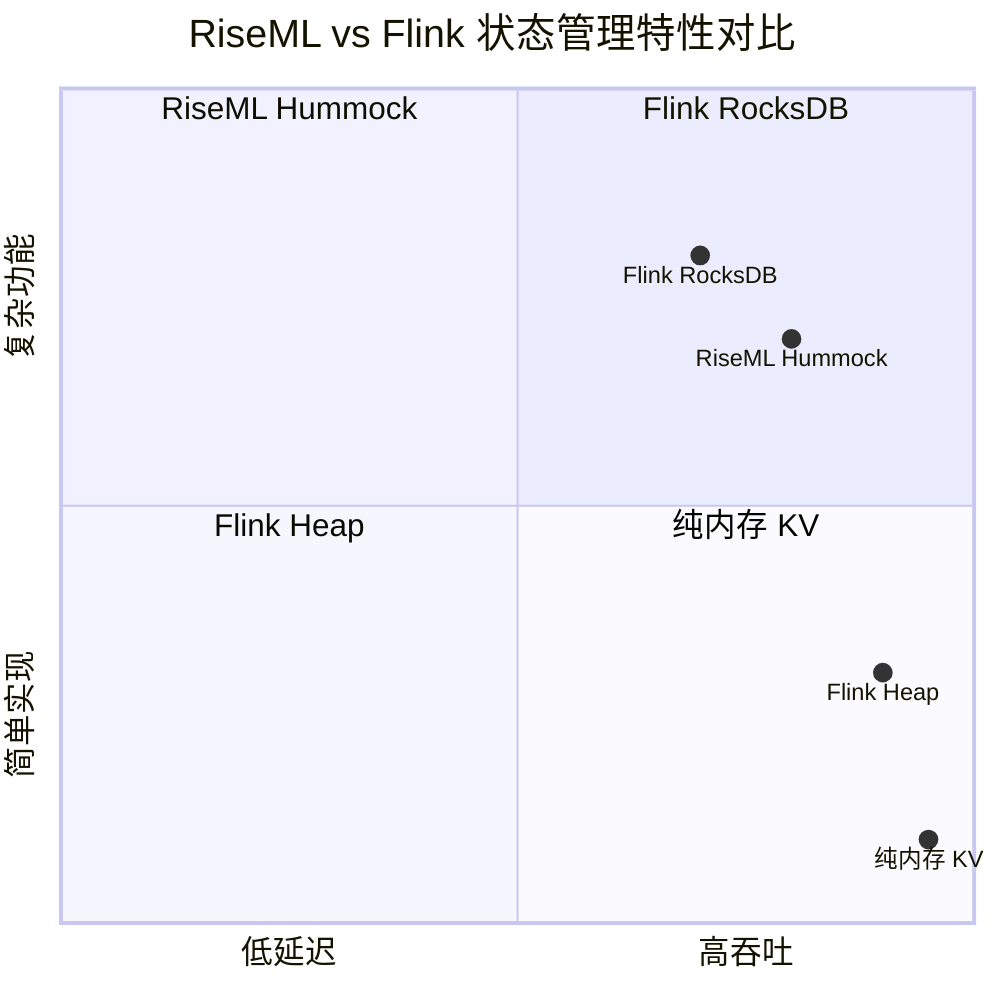

# RisingWave 计算层 RiseML 深度分析

> **所属阶段**: Flink/07-rust-native | **前置依赖**: [RisingWave 架构概览](./01-risingwave-architecture.md) | **形式化等级**: L3-L5
> **文档定位**: 全球中文社区最深入的 RiseML 分析之一，与 Flink 算子执行模型形成对标
> **最后更新**: 2026-04

---

## 1. 概念定义 (Definitions)

### Def-RW-01: RiseML (RisingWave 计算引擎中间层)

RiseML 是 RisingWave 计算层的核心执行引擎，负责将逻辑查询计划转化为分布式、并行、流批统一的物理执行计划。其设计哲学可概括为三个统一：

1. **流批统一 (Stream-Batch Unification)**：同一套算子实现同时处理流数据和批数据
2. **存算统一 (Storage-Compute Coupling)**：计算层与存储层通过 Hummock 共享存储格式
3. **SQL-native 统一**：所有计算以关系代数算子为基础表达



### Def-RW-02: Fragment (执行片段)

Fragment 是 RiseML 分布式调度的基本单元。一个 SQL 查询被拆分为多个 Fragment，每个 Fragment 包含一组通过 Local Exchange 连接的算子链。Fragment 之间通过 Remote Exchange（gRPC over TCP）进行数据 shuffle。

| 属性 | 说明 |
|------|------|
| **并行度** | 每个 Fragment 有独立的 parallelism，由 Meta Service 根据数据分布动态决定 |
| **状态隔离** | 同一 Fragment 的不同并行实例共享算子逻辑，但状态完全隔离 |
| **故障域** | 单个 Fragment 实例故障仅触发该实例的 checkpoint 恢复 |

### Def-RW-03: 流批统一算子 (Stream-Batch Unified Operator)

RiseML 的每个物理算子同时实现 `Stream` 和 `Batch` 两种执行模式：

- **Stream 模式**: 基于事件驱动，输入为无界流，输出为增量更新
- **Batch 模式**: 基于拉取驱动，输入为有界分区，输出为完整结果

两种模式共享同一套状态管理和内存分配逻辑。

### Def-RW-04: Exchange (数据交换层)

Exchange 是 RiseML 中负责数据重分区的组件，分为三级：

| 级别 | 范围 | 实现 | 延迟 |
|------|------|------|------|
| **Local Exchange** | 同一 Compute Node 内 | 内存队列 (mpsc) | 微秒级 |
| **Remote Exchange** | 跨 Compute Node | gRPC 流 | 毫秒级 |
| **Batch Exchange** | 批处理阶段 | 磁盘 spill + shuffle | 秒级 |

---

## 2. 属性推导 (Properties)

### Lemma-RW-01: RiseML 算子的确定性

**命题**: 给定相同的输入顺序和相同的初始状态，RiseML 的 Stream 算子产生确定性的输出顺序。

**证明概要**:

1. RiseML 的每个算子实例是单线程的（Actor 模型）
2. 输入通过 Local Exchange 的 mpsc 队列保证 FIFO 顺序
3. 状态操作通过 Hummock 的 MVCC 快照保证一致性视图
4. 由 Actor 模型的消息处理 determinism 可得结论

> 与 Flink 对比: Flink 的算子并行实例通过 Network Buffer 交换数据，其确定性依赖 Barrier 对齐；RiseML 的确定性依赖 Actor 消息队列的 FIFO 保证。

### Lemma-RW-02: Fragment 级别 exactly-once 语义

**命题**: 在 RiseML 中，若 Hummock 提供可重复读快照，则 Fragment 级别的状态恢复满足 exactly-once 语义。

**证明概要**:

1. Meta Service 定期触发全局 barrier（epoch）
2. 每个 Fragment 实例在 barrier 处将状态 flush 到 Hummock
3. Hummock 的快照机制保证状态写入的原子性
4. 故障恢复时，从最近 epoch 的快照重启，重放该 epoch 的输入
5. 由于输入通过上游 checkpoint 保证，重放不产生重复输出

### Prop-RW-01: 流批统一的正确性条件

**命题**: 对于给定的 SQL 查询 Q，若其 Stream 执行结果 RS 和 Batch 执行结果 RB 满足：

- RS 是 RB 的增量维护视图
- 在任意时间点 t，RS(t) = RB ∪ Δ(t)

则 RiseML 的流批统一执行在语义上等价。

**论证**: RiseML 的 HashJoin、HashAgg 等核心算子使用同一套哈希表状态。在 Stream 模式下，状态随输入增量更新；在 Batch 模式下，状态从零构建。两种模式产生的最终哈希表在键值映射上一致。

---

## 3. 关系建立 (Relations)

### 3.1 RiseML vs Flink 执行模型对比

| 维度 | RiseML | Flink DataStream | 关键差异 |
|------|--------|------------------|----------|
| **调度单元** | Fragment ( Actor 链 ) | Task (线程) | RiseML 更粗粒度，减少线程切换 |
| **数据交换** | Local/Remote Exchange | Network Stack | RiseML Local Exchange 零拷贝 |
| **状态后端** | Hummock (共享存储) | RocksDB/Heap (本地) | RiseML 存算分离，Flink 存算耦合 |
| **流批模式** | 统一算子双模式 | DataStream/Table API 分离 | RiseML 底层统一，Flink 上层统一 |
| **Checkpoint** | Epoch + Hummock 快照 | Chandy-Lamport Barrier | RiseML 利用存储层快照，Flink 应用层快照 |
| **SQL 优化** | RiseML 自带优化器 | Flink Table API 优化器 | 两者均基于 Cascades 框架 |
| **容错粒度** | Fragment 实例级 | Task 级 | 等价 |

### 3.2 RiseML 与 Actor 模型的映射



**映射关系**:

- Fragment 的每个并行实例 ≈ 一个 Actor
- Local Exchange 的 mpsc 队列 ≈ Actor 的 Mailbox
- 算子的 `next()` 方法 ≈ Actor 的 Behavior 函数
- Hummock 的 table state ≈ Actor 的持久化状态

---

## 4. 论证过程 (Argumentation)

### 4.1 为什么 RiseML 选择 Actor 模型而非线程池模型？

RiseML 的核心设计决策之一是采用 Actor 模型（每个 Fragment 实例是独立的 Actor）而非 Flink 的线程池模型（多个 Task 共享线程）。

**优势论证**:

1. **缓存友好性**: 单个 Actor 独占 CPU 核心时，其工作集（算子状态 + 输入缓冲区）更容易留在 L1/L2 缓存
2. **无锁并发**: Actor 之间通过消息传递通信，避免了共享内存的锁竞争
3. **故障隔离**: 单个 Actor 崩溃不影响同节点的其他 Actor

**劣势与缓解**:

1. **上下文切换开销**: Actor 数量过多时调度开销增大。缓解：RiseML 将多个轻量算子合并为同一 Actor 内的算子链
2. **消息传递延迟**: 相比直接函数调用，消息队列有额外拷贝。缓解：Local Exchange 使用零拷贝的内存队列

### 4.2 Hummock 快照 vs Flink Checkpoint 的权衡

| 维度 | RiseML (Hummock 快照) | Flink (应用层 Checkpoint) |
|------|----------------------|--------------------------|
| **快照触发** | 存储层自动触发，应用无感知 | 应用层注入 Barrier，主动协调 |
| **一致性级别** | 依赖存储层 MVCC（可重复读） | 依赖 Barrier 对齐（exactly-once/at-least-once） |
| **延迟影响** | 低（后台快照） | 中（同步 Barrier） |
| **存储成本** | 高（存储层保留多版本） | 低（仅保留 checkpoint 版本） |
| **恢复速度** | 快（直接从存储层 mount 快照） | 中（从分布式文件系统加载） |

**核心洞察**: RiseML 将 checkpoint 的复杂性下推到存储层，简化了计算层的设计，但增加了存储层的复杂度。Flink 将 checkpoint 保持在应用层，给予了更大的灵活性（如增量 checkpoint、异步快照），但增加了应用层的实现复杂度。

---

## 5. 形式证明 / 工程论证 (Proof / Engineering Argument)

### Thm-RW-01: RiseML Stream 算子增量等价于 Batch 重计算

**定理**: 对于任意 RiseML 算子 Op（HashJoin, HashAgg, TopN 等），设其 Batch 执行输出为 B，Stream 执行在摄入相同完整数据集后的输出为 S。则 B = S。

**工程论证** (非严格形式化，基于代码结构):

1. **HashJoin**:
   - Batch 模式：构建完整哈希表（probe side 和 build side），输出所有匹配对
   - Stream 模式：增量维护哈希表，新到达的 probe 记录立即与已存在的 build 记录匹配
   - 等价性：当所有记录到达后，Stream 模式的哈希表与 Batch 模式的哈希表键值映射相同，因此输出匹配对集合相同

2. **HashAgg**:
   - Batch 模式：一次性聚合所有分组
   - Stream 模式：增量更新各分组的聚合状态
   - 等价性：聚合函数（SUM, COUNT, MAX 等）满足结合律和交换律，增量聚合的终态等于全量聚合的结果

3. **状态机验证**:
   - 设算子状态为 S，输入流为 I = {i₁, i₂, ..., iₙ}
   - Batch: Sₙ = f(S₀, I)，输出 g(Sₙ)
   - Stream: Sₖ = f(Sₖ₋₁, {iₖ})，最终输出 g(Sₙ)
   - 由状态转移函数 f 的累积性：f(S₀, I) = f(...f(f(S₀, {i₁}), {i₂})..., {iₙ})
   - 故 Batch 和 Stream 的终态相同，输出相同

---

## 6. 实例验证 (Examples)

### 6.1 示例：RiseML 中 HashJoin 的流批双模式执行

```sql
-- 查询: 流式订单与静态客户维表关联
SELECT o.order_id, c.customer_name, o.amount
FROM orders_stream o
JOIN customers_dim c ON o.customer_id = c.id;
```

**Batch 模式执行**:

1. 扫描 `customers_dim` 全表，构建哈希表 H(build)
2. 扫描 `orders_stream` 全量数据，对每条记录 probe H(build)
3. 输出所有匹配对

**Stream 模式执行**:

1. 初始阶段：同 Batch 模式构建 H(build)
2. 运行阶段：
   - 新到达的 `orders_stream` 记录立即 probe H(build)
   - 若 `customers_dim` 有更新（CDC），增量更新 H(build)
   - 输出增量匹配结果

**关键源码入口** (RisingWave GitHub):

- 算子定义: `src/stream/src/executor/hash_join.rs`
- 状态管理: `src/storage/src/table/streaming_table/state_table.rs`
- 增量更新逻辑: `src/stream/src/executor/managed_state/join/mod.rs`

### 6.2 示例：Fragment 拆分与调度

```sql
-- TPC-H Q3 简化版
SELECT o.orderkey, SUM(l.extendedprice) as revenue
FROM orders o
JOIN lineitem l ON o.orderkey = l.orderkey
WHERE o.orderdate >= '1995-01-01'
GROUP BY o.orderkey;
```

RiseML 的 Fragment 拆分：



---

## 7. 可视化 (Visualizations)

### 7.1 RiseML 查询生命周期决策树



### 7.2 RiseML 与 Flink 状态管理对比矩阵



---

## 8. 引用参考 (References)
