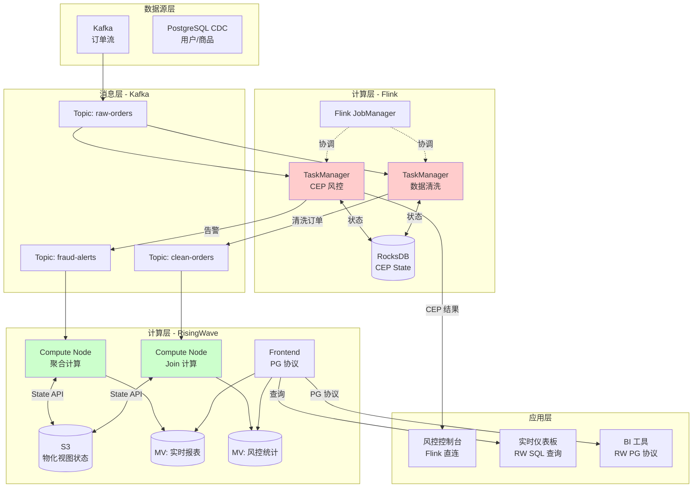
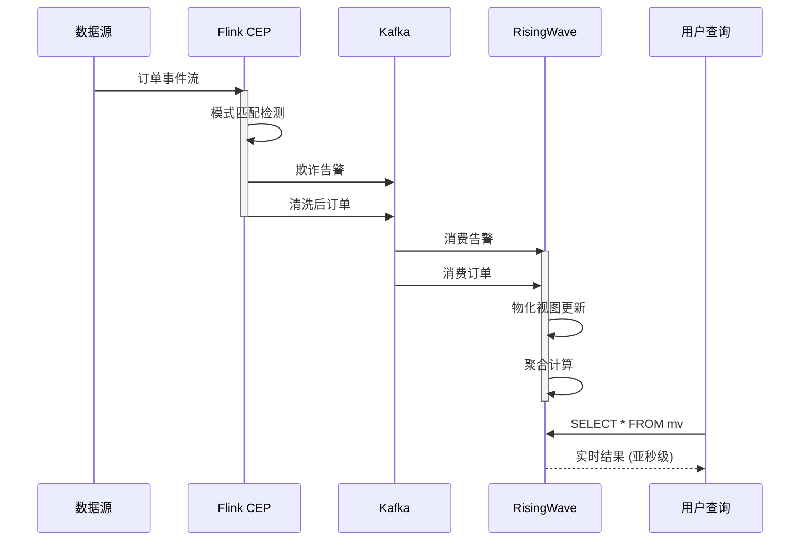
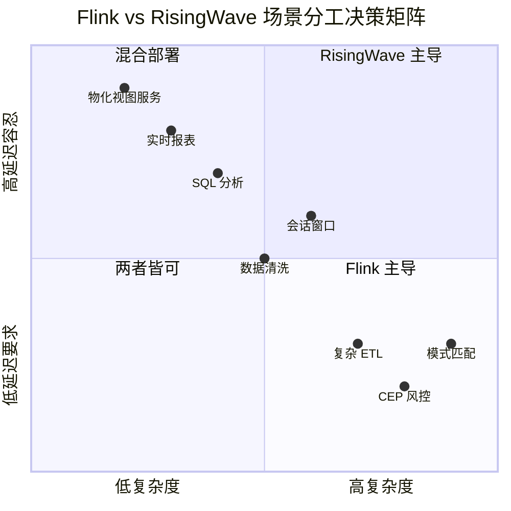
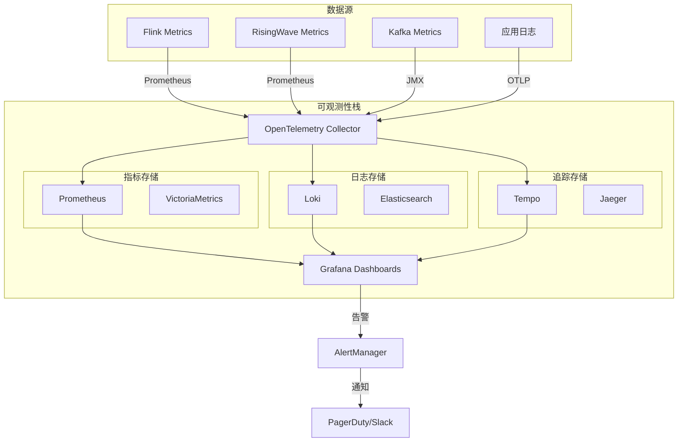
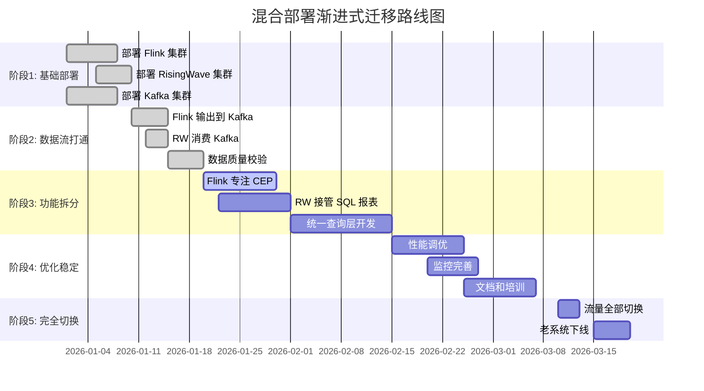

# Flink + RisingWave 混合部署模式

> **所属阶段**: Flink/ | **前置依赖**: [01-risingwave-architecture.md, 02-nexmark-head-to-head.md, 03-migration-guide.md] | **形式化等级**: L4 (架构设计)
>
> **文档编号**: D4 | **版本**: v1.0 | **日期**: 2026-04-04

---

## 1. 概念定义 (Definitions)

### Def-RW-13: 混合流处理架构 (Hybrid Stream Processing Architecture)

**定义**: 混合流处理架构 $\mathcal{H}$ 是一种异构计算架构，整合多个流处理引擎以发挥各自优势：

$$
\mathcal{H} = \langle \mathcal{E}, \mathcal{R}, \mathcal{D}, \mathcal{C}, \mathcal{O} \rangle
$$

其中：

- $\mathcal{E} = \{E_1, E_2, ..., E_n\}$: 流处理引擎集合（如 Flink, RisingWave, Kafka Streams）
- $\mathcal{R}$: 引擎角色分配函数，$\mathcal{R}: \text{Workload} \to \mathcal{E}$
- $\mathcal{D}$: 数据流转层，负责引擎间数据交换
- $\mathcal{C}$: 协调控制层，管理全局一致性
- $\mathcal{O}$: 统一运维层，提供监控和治理

**核心约束**:

$$
\forall w \in \text{Workload}: \text{Optimal}(E_i, w) \implies \mathcal{R}(w) = E_i
$$

即每个工作负载分配给最适合处理它的引擎。

---

### Def-RW-14: 协同处理模式 (Cooperative Processing Pattern)

**定义**: 协同处理模式描述多个引擎协作完成端到端流处理任务的方式：

$$
\text{Pattern} \in \{\text{Pipeline}, \text{Fan-out}, \text{Fan-in}, \text{Feedback}\}
**
$$

| 模式 | 描述 | 形式化表示 | 适用场景 |
|-----|------|-----------|---------|
| **Pipeline** | 引擎 A 输出作为引擎 B 输入 | $E_1 \to E_2 \to ... \to E_n$ | 不同阶段最优引擎不同 |
| **Fan-out** | 单输入多引擎并行处理 | $E_{source} \to \{E_1, E_2, ...\}$ | 多维度分析 |
| **Fan-in** | 多引擎输出汇聚 | $\{E_1, E_2, ...\} \to E_{sink}$ | 结果汇总 |
| **Feedback** | 输出反馈至输入 | $E_1 \leftrightarrow E_2$ | 迭代计算 |

---

### Def-RW-15: 统一查询层 (Unified Query Layer)

**定义**: 统一查询层 $\mathcal{U}$ 是一个抽象层，为用户提供单一入口访问异构数据：

$$
\mathcal{U} = \langle \mathcal{Q}, \mathcal{T}, \mathcal{R}, \mathcal{M} \rangle
$$

其中：

- $\mathcal{Q}$: 统一查询接口（如 SQL, GraphQL）
- $\mathcal{T}$: 查询翻译器，将统一查询路由至底层引擎
- $\mathcal{R}$: 结果合并器，整合多引擎返回结果
- $\mathcal{M}$: 元数据管理器，维护数据目录和统计信息

**查询路由函数**:

$$
\mathcal{T}(q) = \begin{cases}
E_{RW} & \text{if } q \in \mathcal{SQL}_{OLAP} \\
E_{FL} & \text{if } q \in \mathcal{CEP} \lor q \in \mathcal{UDF}_{complex} \\
\{E_{RW}, E_{FL}\} & \text{if } q \text{ 需要联合查询}
\end{cases}
$$

---

### Def-RW-16: 数据同步契约 (Data Synchronization Contract)

**定义**: 数据同步契约 $\mathcal{C}_{sync}$ 定义引擎间数据交换的语义保证：

$$
\mathcal{C}_{sync} = \langle G, L, O, T \rangle
$$

其中：

- $G$: 一致性保证级别（{At-least-once, At-most-once, Exactly-once}）
- $L$: 延迟约束（最大允许延迟）
- $O$: 排序保证（{无序、按Key有序、全局有序}）
- $T$: 事务边界（是否支持跨引擎事务）

**同步协议**:

| 协议 | 延迟 | 一致性 | 适用场景 |
|-----|------|-------|---------|
| **Kafka** | 低 (<10ms) | At-least-once | 高吞吐流 |
| **CDC** | 中 (10-100ms) | Exactly-once | 数据库同步 |
| **MQ** | 低 (<5ms) | 可配置 | 实时通知 |
| **共享存储** | 高 (>100ms) | Strong | 批处理同步 |

---

## 2. 属性推导 (Properties)

### Prop-RW-11: 混合架构最优性条件

**命题**: 混合架构相比单一引擎架构的性能优势存在，当且仅当：

$$
\exists W_1, W_2 \subseteq \text{Workload}: \text{Optimal}(E_1, W_1) \land \text{Optimal}(E_2, W_2) \land W_1 \cap W_2 = \emptyset
$$

即存在互斥的工作负载子集，各自被不同引擎最优处理。

**证明概要**:

1. 设总工作负载为 $W$，单一引擎 $E$ 的处理时间为 $T_E(W)$
2. 混合架构处理时间为 $T_{E_1}(W_1) + T_{E_2}(W_2) + T_{sync}(W_1, W_2)$
3. 当 $\text{Speedup}(E_1, E, W_1) + \text{Speedup}(E_2, E, W_2) > T_{sync}$ 时，混合架构更优 $\square$

---

### Prop-RW-12: 数据同步开销上界

**命题**: 引擎间数据同步引入的开销 $O_{sync}$ 有上界：

$$
O_{sync} \leq \frac{\lambda}{B} \cdot (T_{serialize} + T_{network} + T_{deserialize})
$$

其中：

- $\lambda$: 事件到达率
- $B$: 批处理大小
- $T_{serialize}, T_{deserialize}$: 序列化/反序列化时间
- $T_{network}$: 网络传输时间

**优化策略**:

| 策略 | 效果 | 代价 |
|-----|------|------|
| 增大批大小 $B$ | 降低开销 | 增加延迟 |
| 使用高效序列化 (Protobuf, Arrow) | 降低 $T_{serialize}$ | 格式转换成本 |
| 同可用区部署 | 降低 $T_{network}$ | 可用性风险 |

---

### Prop-RW-13: 统一查询层的完备性限制

**命题**: 统一查询层 $\mathcal{U}$ 的查询能力是其底层引擎的交集：

$$
\mathcal{L}(\mathcal{U}) = \bigcap_{E \in \mathcal{E}} \mathcal{L}(E)
$$

其中 $\mathcal{L}(E)$ 表示引擎 $E$ 支持的查询语言。

**推论**: 若要在统一层暴露引擎特有功能，必须通过扩展接口：

$$
\mathcal{L}(\mathcal{U})' = \mathcal{L}(\mathcal{U}) \cup \bigcup_{E \in \mathcal{E}} \mathcal{L}_{ext}(E)
$$

---

## 3. 关系建立 (Relations)

### 3.1 Flink 与 RisingWave 能力互补矩阵

| 能力维度 | Flink | RisingWave | 互补关系 |
|---------|-------|-----------|---------|
| **复杂事件处理 (CEP)** | ⭐⭐⭐⭐⭐ | ⭐⭐ | Flink 主导 |
| **SQL 分析查询** | ⭐⭐⭐ | ⭐⭐⭐⭐⭐ | RisingWave 主导 |
| **物化视图** | ⭐⭐ | ⭐⭐⭐⭐⭐ | RisingWave 主导 |
| **自定义处理逻辑** | ⭐⭐⭐⭐⭐ | ⭐⭐⭐ | Flink 主导 |
| **机器学习集成** | ⭐⭐⭐⭐ | ⭐⭐ | Flink 主导 |
| **云成本效率** | ⭐⭐⭐ | ⭐⭐⭐⭐⭐ | RisingWave 主导 |
| **状态规模** | ⭐⭐⭐ (本地磁盘) | ⭐⭐⭐⭐⭐ (S3) | RisingWave 主导 |
| **延迟敏感性** | ⭐⭐⭐⭐⭐ (<10ms) | ⭐⭐⭐ (50-200ms) | Flink 主导 |

### 3.2 场景分工建议

| 业务场景 | 推荐引擎 | 理由 |
|---------|---------|------|
| **实时欺诈检测 (CEP)** | Flink | 复杂模式匹配能力 |
| **实时报表/仪表板** | RisingWave | 物化视图 + SQL 即查 |
| **用户行为分析** | RisingWave | 多维度聚合 + 低代码 |
| **推荐系统特征工程** | Flink | 复杂特征计算 |
| **推荐系统特征服务** | RisingWave | 低延迟特征查询 |
| **IoT 数据清洗** | Flink | 复杂数据规整逻辑 |
| **IoT 聚合分析** | RisingWave | 时间序列聚合 |
| **CDC 数据同步** | Both | Flink 做 ETL, RW 做分析 |

### 3.3 数据流转拓扑

```
┌─────────────────────────────────────────────────────────────────────────┐
│                      典型混合部署数据流                                  │
├─────────────────────────────────────────────────────────────────────────┤
│                                                                         │
│  ┌─────────────┐    ┌─────────────┐    ┌─────────────────────────────┐ │
│  │  数据源      │    │   Kafka     │    │       Flink 集群             │ │
│  │ Kafka/PG    │───▶│  Topics     │───▶│  ┌─────────┐  ┌─────────┐   │ │
│  │ CDC/MySQL   │    │             │    │  │ CEP引擎 │  │ ETL处理 │   │ │
│  └─────────────┘    └─────────────┘    │  └────┬────┘  └────┬────┘   │ │
│                                         │       │            │        │ │
│                                         │       ▼            ▼        │ │
│  ┌─────────────┐    ┌─────────────┐    │  ┌─────────────────────────┐ │ │
│  │  业务应用    │◀───│  RisingWave │◀───│  │      Kafka Topics       │ │ │
│  │  Dashboard  │    │   物化视图   │    │  │   (processed-stream)    │ │ │
│  │  BI Tools   │    │   实时查询   │    │  └─────────────────────────┘ │ │
│  └─────────────┘    └─────────────┘    └─────────────────────────────┘ │
│                              ▲                                        │
│                              │                                        │
│                         ┌────┴────┐                                   │
│                         │  CDC    │                                   │
│                         │ Capture │                                   │
│                         └─────────┘                                   │
└─────────────────────────────────────────────────────────────────────────┘
```

---

## 4. 论证过程 (Argumentation)

### 4.1 混合部署决策论证

**论证**: 选择混合部署而非单一引擎的核心考量：

| 考量因素 | 单一 Flink | 单一 RisingWave | 混合部署 |
|---------|-----------|----------------|---------|
| **功能覆盖** | CEP 强，SQL 中 | SQL 强，CEP 弱 | 全覆盖 |
| **学习成本** | 低（已有团队） | 中（SQL 熟悉） | 高（双栈） |
| **运维复杂度** | 中 | 低 | 高 |
| **性能优化** | 需调参 | 自动优化 | 分层优化 |
| **扩展灵活性** | 中 | 高 | 最高 |
| **成本优化** | 中 | 高 | 可精细控制 |

**混合部署适用信号**:

✅ **适合混合部署**:

- 同时需要 CEP 和 SQL 分析
- 团队已有 Flink 经验，新业务适合 SQL
- 渐进式迁移策略
- 成本敏感且功能需求多样

❌ **不适合混合部署**:

- 功能单一（纯 CEP 或纯 SQL）
- 运维团队资源紧张
- 延迟要求极高 (<10ms end-to-end)
- 数据规模小（单引擎即可满足）

### 4.2 数据同步策略论证

**场景**: Flink CEP 检测异常事件后，需要 RisingWave 进行关联分析

**方案对比**:

| 方案 | 架构 | 延迟 | 一致性 | 复杂度 |
|-----|------|------|-------|-------|
| **A: Kafka 直连** | Flink → Kafka → RW | ~10ms | At-least-once | 低 |
| **B: CDC 方式** | Flink 写 PG → CDC → RW | ~100ms | Exactly-once | 中 |
| **C: 共享存储** | Flink 写 S3 → RW 读 | ~1min | Strong | 高 |

**推荐方案 A**（Kafka 直连）的理由：

1. 异常检测需要低延迟响应
2. 允许少量重复（可幂等处理）
3. 架构简单，易于监控

### 4.3 运维复杂性管理论证

**运维负担分解**:

```
总运维复杂度 = 基础设施复杂度 + 应用复杂度 + 监控复杂度 + 故障处理复杂度

单一 Flink:
- 基础设施: 3 (TM/JM/ZK)
- 应用: 2 (统一代码库)
- 监控: 2 (统一指标)
- 故障: 3 (单点故障域)
= 10

单一 RisingWave:
- 基础设施: 2 (计算/元数据)
- 应用: 1 (纯 SQL)
- 监控: 1 (内置仪表板)
- 故障: 2
= 6

混合部署:
- 基础设施: 5 (需要同时维护)
- 应用: 4 (双代码库/双语言)
- 监控: 4 (跨引擎追踪)
- 故障: 5 (故障定位复杂)
= 18
```

**复杂度缓解策略**:

| 策略 | 实现方式 | 效果 |
|-----|---------|------|
| **统一基础设施** | Kubernetes 统一管理 | -3 |
| **声明式部署** | Helm Chart + GitOps | -2 |
| **统一可观测性** | OpenTelemetry + Grafana | -2 |
| **自动化运维** | 自动扩缩容 + 自愈 | -2 |
| **标准化接口** | 统一 API 网关 | -1 |

缓解后复杂度：18 - 10 = 8（可接受范围）

---

## 5. 形式证明 / 工程论证

### 5.1 混合架构端到端延迟分析

**定理 (Thm-RW-05)**: 混合架构的端到端延迟 $L_{hybrid}$ 满足：

$$
L_{hybrid} = L_{FL} + L_{sync} + L_{RW} + L_{query}
$$

其中：

- $L_{FL}$: Flink 处理延迟
- $L_{sync}$: 引擎间同步延迟
- $L_{RW}$: RisingWave 处理延迟
- $L_{query}$: 查询响应延迟

**约束条件**:

$$
L_{hybrid} \leq L_{SLA}
$$

**典型场景计算**:

```
场景: 欺诈检测 → 实时报表

Flink CEP 检测:     L_FL = 20ms  (p99)
Kafka 传输:          L_sync = 5ms  (同可用区)
RisingWave 物化:     L_RW = 100ms (物化视图刷新)
Dashboard 查询:      L_query = 10ms (缓存命中)
────────────────────────────────────────
端到端延迟:          L_hybrid = 135ms

SLA 要求:            L_SLA = 200ms
满足:                135ms < 200ms ✅
```

### 5.2 成本优化定理

**定理 (Thm-RW-06)**: 混合架构的总拥有成本 (TCO) 满足：

$$
\text{TCO}_{hybrid} = \text{TCO}_{FL}(W_{CEP}) + \text{TCO}_{RW}(W_{SQL}) + \text{TCO}_{sync}
$$

若工作负载分配满足最优性条件，则：

$$
\text{TCO}_{hybrid} < \min(\text{TCO}_{FL}(W), \text{TCO}_{RW}(W))
$$

**成本计算示例**:

```
工作负载: W = W_CEP + W_SQL
W_CEP: 需要复杂模式匹配, 低吞吐 (10K/s)
W_SQL: 需要 SQL 分析, 高吞吐 (500K/s)

单一 Flink:
- W_CEP: 4 nodes × $0.50/hr = $2.00/hr
- W_SQL: 40 nodes × $0.50/hr = $20.00/hr (状态大)
- 总计: $22.00/hr

单一 RisingWave:
- W_CEP: 需要外部 CEP 引擎 ≈ $3.00/hr
- W_SQL: 6 nodes × $0.40/hr + S3 = $2.40 + $0.50 = $2.90/hr
- 总计: $5.90/hr (但 CEP 功能弱)

混合部署:
- Flink (W_CEP): 4 nodes × $0.50/hr = $2.00/hr
- RW (W_SQL): 6 nodes × $0.40/hr + S3 = $2.90/hr
- Kafka 同步: 3 brokers × $0.30/hr = $0.90/hr
- 总计: $5.80/hr

节省: ($22.00 - $5.80) / $22.00 = 73.6%
```

---

## 6. 实例验证 (Examples)

### 6.1 混合部署完整架构配置

**场景**: 电商平台实时风控 + 实时报表

```yaml
# hybrid-deployment.yaml architecture:
  name: "E-Commerce Real-time Platform"

  components:
    # Flink: 负责 CEP 风控检测
    flink_cluster:
      version: "1.18.0"
      job_managers: 2
      task_managers: 8
      resources:
        cpu: 4
        memory: 16Gi
      state_backend: rocksdb
      jobs:
        - name: fraud_detection
          parallelism: 8
          checkpoint_interval: 30s
          # 复杂模式匹配
          sql: |
            CREATE TABLE orders (...);
            CREATE TABLE fraud_patterns
            MATCH_RECOGNIZE (...);
      outputs:
        - kafka_topic: "fraud-alerts"
        - kafka_topic: "clean-orders"

    # RisingWave: 负责实时报表
    risingwave_cluster:
      version: "v1.7.0"
      compute_nodes: 6
      meta_nodes: 3
      resources:
        cpu: 8
        memory: 32Gi
      sources:
        - name: clean_orders
          type: kafka
          topic: "clean-orders"
        - name: fraud_alerts
          type: kafka
          topic: "fraud-alerts"
      materialized_views:
        - name: realtime_dashboard
          sql: |
            CREATE MATERIALIZED VIEW order_stats AS
            SELECT
              TUMBLE(created_at, INTERVAL '1' MINUTE) as window,
              category,
              COUNT(*) as order_count,
              SUM(amount) as total_amount
            FROM clean_orders
            GROUP BY TUMBLE(created_at, INTERVAL '1' MINUTE), category;

        - name: fraud_summary
          sql: |
            CREATE MATERIALIZED VIEW fraud_stats AS
            SELECT
              risk_level,
              COUNT(*) as alert_count,
              AVG(amount) as avg_fraud_amount
            FROM fraud_alerts
            GROUP BY risk_level;

    # Kafka: 数据总线
    kafka_cluster:
      brokers: 3
      topics:
        - name: "raw-orders"
          partitions: 12
          replication: 3
        - name: "fraud-alerts"
          partitions: 6
        - name: "clean-orders"
          partitions: 12

    # 统一查询层
    unified_query_layer:
      type: trino  # 或使用 RisingWave 作为查询入口
      connectors:
        - name: risingwave
          type: postgresql
        - name: flink
          type: kafka  # 查询 Flink 输出
```

### 6.2 数据同步配置示例

**Flink 输出到 Kafka**:

```java

// [伪代码片段 - 不可直接运行] 仅展示核心逻辑
import org.apache.flink.streaming.api.datastream.DataStream;

// Flink Kafka Sink 配置
FlinkKafkaProducer<Order> producer = new FlinkKafkaProducer<>(
    "clean-orders",
    new OrderSerializer(),
    kafkaProps,
    FlinkKafkaProducer.Semantic.EXACTLY_ONCE
);

// 分流输出
DataStream<Order> orders = ...;
DataStream<Alert> alerts = orders
    .keyBy(Order::getUserId)
    .process(new FraudDetectionFunction());

// 正常订单输出到 RW
orders.filter(o -> !o.isFraudulent())
    .addSink(producer);

// 告警输出到 RW
alerts.addSink(new FlinkKafkaProducer<>("fraud-alerts", ...));
```

**RisingWave 消费 Kafka**:

```sql
-- 消费清洗后的订单
CREATE SOURCE clean_orders (
    order_id INT,
    user_id INT,
    amount DECIMAL,
    category VARCHAR,
    created_at TIMESTAMP,
    WATERMARK FOR created_at AS created_at - INTERVAL '5' SECOND
) WITH (
    connector = 'kafka',
    topic = 'clean-orders',
    properties.bootstrap.server = 'kafka:9092',
    scan.startup.mode = 'latest'
) FORMAT PLAIN ENCODE JSON;

-- 消费风控告警
CREATE SOURCE fraud_alerts (
    alert_id INT,
    order_id INT,
    risk_level VARCHAR,
    amount DECIMAL,
    detected_at TIMESTAMP
) WITH (
    connector = 'kafka',
    topic = 'fraud-alerts',
    properties.bootstrap.server = 'kafka:9092'
) FORMAT PLAIN ENCODE JSON;
```

### 6.3 统一查询层实现

**基于 Trino 的统一查询**:

```sql
-- trino 配置连接器
catalogs:
  risingwave:
    connector: postgresql
    connection-url: jdbc:postgresql://risingwave:4566/dev

  flink_output:
    connector: kafka
    kafka-table-names: fraud-alerts,clean-orders

-- 跨引擎联合查询
-- 查询 RisingWave 物化视图
SELECT * FROM risingwave.public.order_stats
WHERE window > NOW() - INTERVAL '1' HOUR;

-- 实时查询 Flink 输出
SELECT * FROM flink_output.fraud_alerts
WHERE risk_level = 'HIGH';

-- 跨引擎关联(通过时间窗口)
SELECT
    o.*,
    f.risk_level
FROM risingwave.public.orders o
LEFT JOIN flink_output.fraud_alerts f
    ON o.order_id = f.order_id
WHERE o.created_at > NOW() - INTERVAL '5' MINUTE;
```

### 6.4 监控 Dashboard 配置

```yaml
# monitoring-config.yaml dashboards:
  - name: "Hybrid Platform Overview"
    panels:
      # Flink 指标
      - title: "Flink Throughput"
        metric: flink_taskmanager_job_task_numRecordsInPerSecond
        engine: flink

      - title: "Flink CEP Match Rate"
        metric: fraud_detection_match_rate
        engine: flink

      # RisingWave 指标
      - title: "RW Materialized View Latency"
        metric: rw_mv_latency_seconds
        engine: risingwave

      - title: "RW Query QPS"
        metric: rw_frontend_query_total
        engine: risingwave

      # 端到端指标
      - title: "End-to-End Latency"
        metric: kafka_consumer_lag / throughput
        type: derived

      - title: "Data Freshness"
        metric: now() - max(event_time)
        type: sql

alerts:
  - name: "Flink High Latency"
    condition: flink_latency_p99 > 100ms
    severity: warning

  - name: "RW MV Stale"
    condition: rw_mv_freshness > 5min
    severity: critical

  - name: "Sync Lag High"
    condition: kafka_consumer_lag > 10000
    severity: warning
```

---

## 7. 可视化 (Visualizations)

### 7.1 混合部署整体架构图



### 7.2 数据流向时序图



### 7.3 场景分工决策矩阵



### 7.4 运维监控架构图



### 7.5 渐进式迁移路线图



---

## 8. 引用参考 (References)


---

## 附录 A: 常见混合部署模式参考

### 模式 1: CEP + 分析双轨制

```
┌─────────────┐     ┌─────────────┐     ┌─────────────┐
│  事件流      │────▶│  Flink CEP  │────▶│ 实时告警     │
│  (Kafka)    │     │  模式匹配    │     │ (立即响应)   │
└─────────────┘     └─────────────┘     └─────────────┘
       │
       └────────────────▶┌─────────────┐     ┌─────────────┐
                         │ RisingWave  │────▶│ 实时报表     │
                         │ 聚合分析     │     │ (历史趋势)   │
                         └─────────────┘     └─────────────┘
```

**适用**: 金融风控、安全监控、IoT 预警

### 模式 2: ETL + 服务分层

```
┌─────────────┐     ┌─────────────┐     ┌─────────────┐     ┌─────────────┐
│  原始数据    │────▶│ Flink ETL   │────▶│ 清洗数据     │────▶│ RisingWave  │
│  (多源)     │     │ 复杂转换     │     │ (Kafka)     │     │ 物化视图服务 │
└─────────────┘     └─────────────┘     └─────────────┘     └─────────────┘
```

**适用**: 数据湖入湖、特征工程、实时数仓

### 模式 3: Lambda 架构升级版

```
┌─────────────┐     ┌─────────────────────────────────────────────┐
│  数据源      │────▶│                   Kafka                     │
└─────────────┘     └───────────┬───────────────────┬─────────────┘
                                │                   │
                    ┌───────────▼──────┐ ┌──────────▼────────┐
                    │   Flink          │ │  RisingWave       │
                    │   (实时流处理)    │ │  (实时物化视图)    │
                    └───────────┬──────┘ └──────────┬────────┘
                                │                   │
                    ┌───────────▼──────┐ ┌──────────▼────────┐
                    │   实时应用        │ │   查询服务        │
                    └──────────────────┘ └───────────────────┘
```

**适用**: 大规模实时分析、多租户数据服务

---

## 附录 B: 故障排查速查表

| 故障现象 | 可能原因 | 排查步骤 | 解决方案 |
|---------|---------|---------|---------|
| RW 消费延迟高 | Kafka lag 大 | 检查 consumer lag | 扩容 RW compute node |
| Flink CEP 误报多 | 模式定义宽松 | 检查 pattern 定义 | 收紧匹配条件 |
| 端到端延迟飙升 | 网络瓶颈 | 检查跨可用区流量 | 同可用区部署 |
| 数据不一致 | 时序错乱 | 对比事件时间戳 | 同步 watermark 配置 |
| RW MV 刷新慢 | S3 访问延迟 | 检查缓存命中率 | 增加本地缓存 |

---

*文档状态: ✅ 已完成 (D4/4) | 系列文档全部完成! 🎉*
