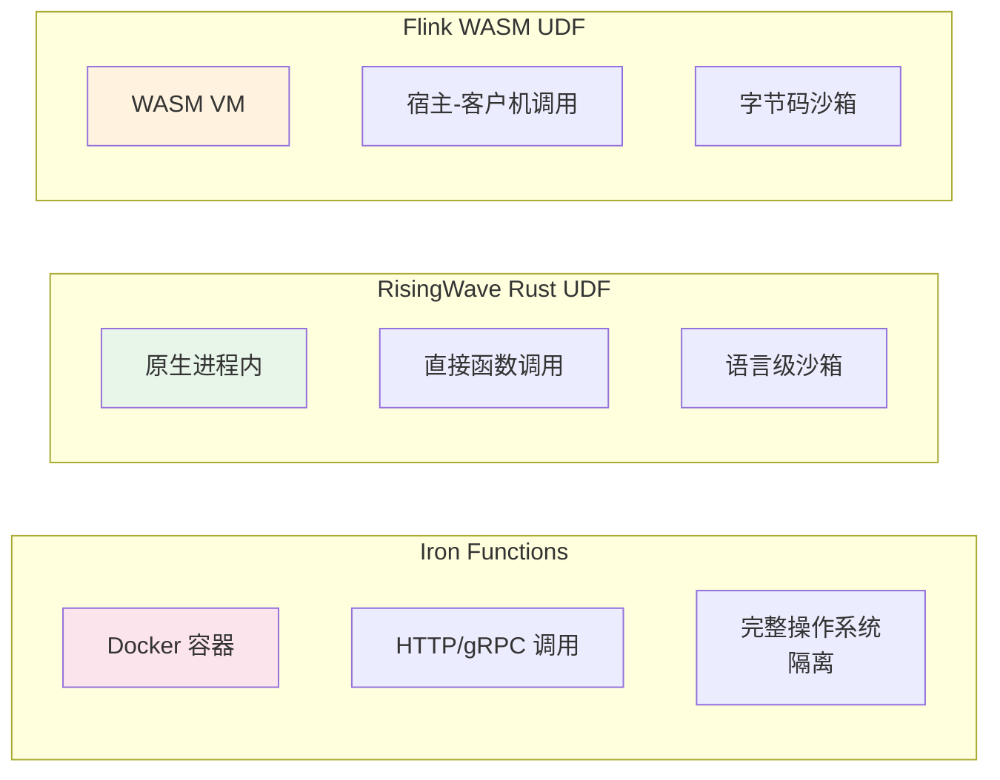
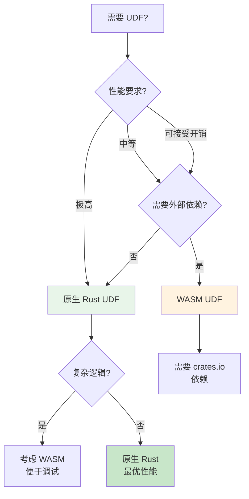
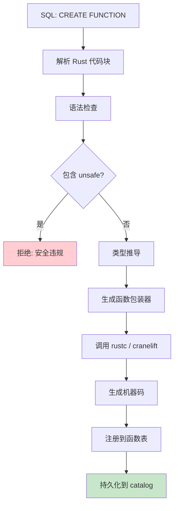
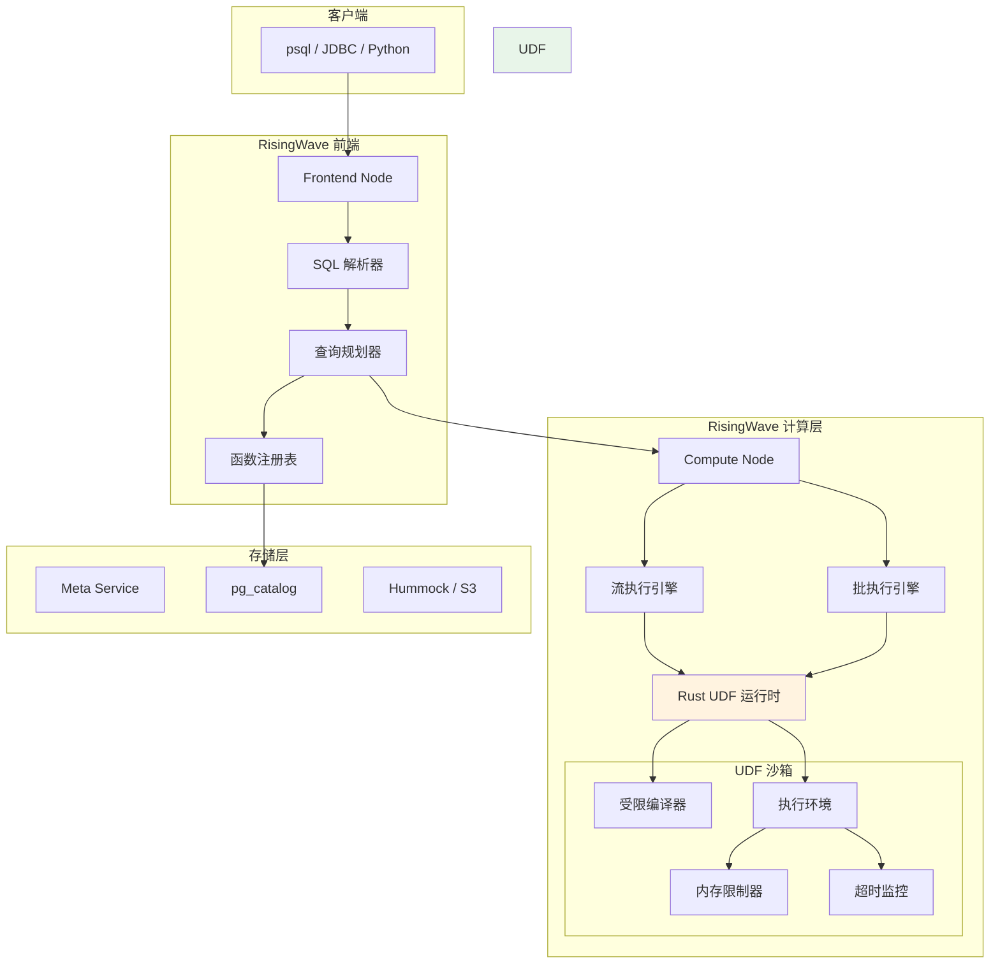
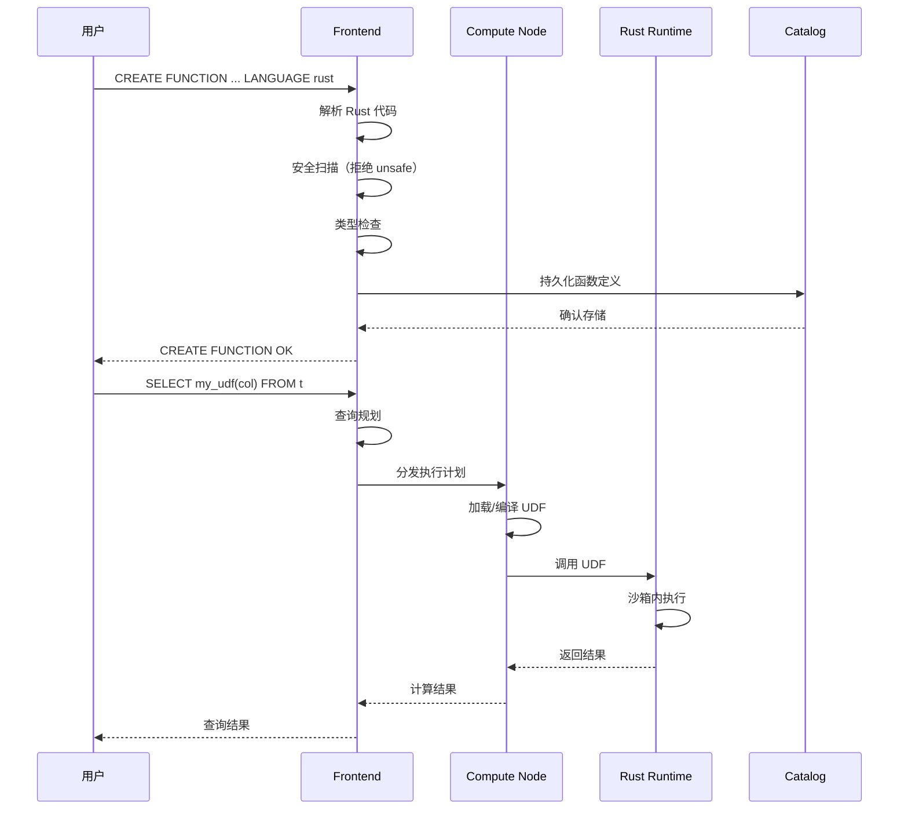

# RisingWave 原生 Rust UDF 技术指南

> **所属阶段**: Flink/Rust 生态对比 | **前置依赖**: [Flink WASM UDF 指南](../../03-api/09-language-foundations/flink-25-wasm-udf-ga.md) | **形式化等级**: L3

---

## 1. 概念定义 (Definitions)

### 1.1 RisingWave 原生 Rust UDF 模型

**Def-RW-RUST-01: RisingWave 原生 Rust UDF**

RisingWave 原生 Rust UDF 是指在 RisingWave 数据库中直接使用 `LANGUAGE rust` 声明的用户自定义函数，其函数体以 Rust 源代码形式嵌入 SQL 语句中，由 RisingWave 内部的 Rust 运行时直接编译执行，无需通过 WebAssembly 中间层。

```sql
CREATE FUNCTION gcd(INT, INT) RETURNS INT
LANGUAGE rust
AS $$
    fn gcd(a: i32, b: i32) -> i32 {
        if b == 0 { a } else { gcd(b, a % b) }
    }
$$;
```

### 1.2 核心架构组件

```mermaid
graph TB
    subgraph "SQL Layer"
        A[CREATE FUNCTION<br/>LANGUAGE rust]
        B[函数调用<br/>SELECT gcd(a, b)]
    end

    subgraph "RisingWave 内核"
        C[SQL 解析器]
        D[函数注册表]
        E[Rust 表达式运行时]
        F[JIT 编译器]
        G[执行引擎]
    end

    subgraph "存储层"
        H[元数据存储<br/>pg_catalog]
    end

    A --> C
    C --> D
    D --> H
    B --> E
    E --> F
    F --> G

    style A fill:#e1f5fe
    style E fill:#fff3e0
    style F fill:#e8f5e9
```

### 1.3 表函数迭代器契约

**Def-RW-RUST-02: 表函数迭代器契约**

表函数（Table Function/UDTF）必须返回实现了 `Iterator<Item = T>` 的类型，其中 `T` 对应返回表的行类型。RisingWave 通过轮询该迭代器来逐行生成结果集。

```rust
// 表函数签名示例
fn series(start: i32, stop: i32) -> impl Iterator<Item = (i32,)> {
    (start..=stop).map(|i| (i,))
}
```

---

## 2. 属性推导 (Properties)

### 2.1 类型安全属性

**Lemma-RW-RUST-01: 编译期类型安全**

RisingWave Rust UDF 在函数创建时进行编译检查，确保：

- 参数类型与 SQL 声明匹配
- 返回类型与 SQL 声明匹配
- 所有代码路径返回兼容类型

**Lemma-RW-RUST-02: 零成本抽象**

原生 Rust UDF 直接编译为机器码执行，不经过 WASM VM 解释层，具备零成本抽象特性。

### 2.2 性能特性

**Prop-RW-RUST-01: 原生 vs WASM 性能权衡**

| 性能指标 | LANGUAGE rust | LANGUAGE wasm | 差异原因 |
|---------|---------------|---------------|---------|
| 冷启动延迟 | < 1ms | 10-100ms | 无需 WASM 实例化 |
| 执行吞吐 | 100% | 85-95% | 无 VM 边界开销 |
| 内存占用 | 低 | 中等 | WASM 线性内存分配 |
| 编译时间 | 依赖本地工具链 | 预编译 .wasm | 首次创建较慢 |

### 2.3 安全沙箱属性

**Lemma-RW-RUST-03: 执行隔离**

RisingWave 通过以下机制保证原生 Rust UDF 的安全性：

1. **禁止 unsafe 代码**: 编译器拒绝包含 `unsafe` 块的函数
2. **标准库白名单**: 仅允许使用安全的标准库子集
3. **网络/文件禁用**: 运行时禁止 I/O 操作
4. **超时机制**: 单函数执行超过阈值自动终止

```rust
// ✅ 允许：纯计算
fn allowed(x: i32) -> i32 { x * x }

// ❌ 拒绝：包含 unsafe
fn rejected() -> i32 {
    unsafe { std::ptr::read_volatile(0x0 as *const i32) }
}

// ❌ 拒绝：系统调用
fn rejected_io() {
    std::fs::read("/etc/passwd"); // 编译或运行时拒绝
}
```

---

## 3. 关系建立 (Relations)

### 3.1 与 Flink WASM UDF 的对比

| 特性 | RisingWave<br/>LANGUAGE rust | Flink<br/>LANGUAGE wasm |
|------|------------------------------|------------------------|
| **执行模型** | 原生机器码 | WASM 字节码 + VM |
| **性能** | 更高（无 VM 开销） | 中等（VM 解释/JIT） |
| **依赖支持** | 有限（白名单标准库） | 完整（Cargo + WASI） |
| **冷启动** | < 1ms | 较慢（实例化） |
| **生态系统** | 受限 | 丰富（crates.io） |
| **调试体验** | 原生栈跟踪 | WASM 源映射 |
| **部署方式** | SQL 内联 | 外部 .wasm 文件 |
| **版本管理** | 函数级 | 模块级 |

### 3.2 与 Iron Functions 的对比



### 3.3 技术选型决策树



---

## 4. 论证过程 (Argumentation)

### 4.1 何时选择原生 Rust UDF？

**场景 1：高频标量计算**

```rust
-- 金融实时风控：每秒百万次价格计算
CREATE FUNCTION calc_volatility(prices FLOAT[]) RETURNS FLOAT
LANGUAGE rust
AS $$
    fn calc_volatility(prices: &[f64]) -> f64 {
        let n = prices.len() as f64;
        let mean = prices.iter().sum::<f64>() / n;
        let variance = prices.iter()
            .map(|p| (p - mean).powi(2))
            .sum::<f64>() / n;
        variance.sqrt()
    }
$$;
```

**适用理由**: 无 I/O，纯数学计算，需要极限性能。

**场景 2：状态无关的转换**

```rust
-- 日志解析：JSON 字段提取
CREATE FUNCTION extract_trace_id(log_line VARCHAR) RETURNS VARCHAR
LANGUAGE rust
AS $$
    fn extract_trace_id(log_line: &str) -> &str {
        log_line.split("trace_id=")
            .nth(1)
            .and_then(|s| s.split_whitespace().next())
            .unwrap_or("")
    }
$$;
```

**场景 3：表函数生成序列**

```sql
-- 时间序列展开
CREATE FUNCTION generate_timestamps(
    start_ts TIMESTAMP,
    interval_ms INT,
    count INT
) RETURNS TABLE (ts TIMESTAMP)
LANGUAGE rust
AS $$
    fn generate_timestamps(
        start: i64,
        interval: i32,
        count: i32
    ) -> impl Iterator<Item = (i64,)> {
        (0..count).map(move |i| {
            (start + (i as i64) * (interval as i64),)
        })
    }
$$;
```

### 4.2 何时选择 WASM UDF？

**场景 1：需要外部 crates**

```toml
# Cargo.toml - WASM UDF 可使用完整依赖
[dependencies]
serde_json = "1.0"
regex = "1.10"
chrono = "0.4"
```

**场景 2：复杂业务逻辑**

需要完整的 Rust 生态支持，如：

- 正则表达式引擎（`regex` crate）
- 复杂序列化（`serde`）
- 数学计算库（`nalgebra`, `rust-ml`）

**场景 3：跨平台复用**

WASM 模块可在 RisingWave、Flink、其他 WASM 运行时之间复用。

---

## 5. 形式证明 / 工程论证 (Engineering Argument)

### 5.1 数据类型映射规范

**Def-RW-RUST-03: SQL-Rust 类型映射**

| SQL 类型 | Rust 类型 | 说明 |
|---------|----------|------|
| `BOOLEAN` | `bool` | 直接映射 |
| `INT2` | `i16` | 16位有符号整数 |
| `INT4` / `INT` | `i32` | 32位有符号整数 |
| `INT8` / `BIGINT` | `i64` | 64位有符号整数 |
| `FLOAT4` / `REAL` | `f32` | 32位浮点 |
| `FLOAT8` / `DOUBLE` | `f64` | 64位浮点 |
| `VARCHAR` / `STRING` | `&str` | UTF-8 字符串切片 |
| `BYTEA` | `&[u8]` | 字节切片 |
| `DATE` | `i32` | Unix epoch 起算天数 |
| `TIME` | `i64` | 微秒数 |
| `TIMESTAMP` | `i64` | 微秒时间戳 |
| `INTERVAL` | `Interval` | 专用结构体 |
| `DECIMAL` | `RustDecimal` | 精确小数 |
| `STRUCT<T...>` | `#[derive(StructType)]` | 派生宏 |
| `ARRAY<T>` | `&[T]` | 切片引用 |

### 5.2 构建流程详解



### 5.3 工程优化技巧

**技巧 1：避免不必要的内存分配**

```rust
-- ❌ 低效：每次分配新 String
fn slow(name: &str) -> String {
    format!("Hello, {}", name)  // 堆分配
}

-- ✅ 高效：返回 &str 或 Cow
fn fast<'a>(name: &'a str) -> std::borrow::Cow<'a, str> {
    if name.is_empty() {
        "Anonymous".into()
    } else {
        format!("Hello, {}", name).into()
    }
}
```

**技巧 2：利用迭代器避免中间集合**

```rust
-- ❌ 低效：创建中间 Vec
fn slow_sum_squares(nums: &[i32]) -> i32 {
    nums.iter()
        .map(|x| x * x)
        .collect::<Vec<_>>()  // 不必要的分配
        .iter()
        .sum()
}

-- ✅ 高效：直接迭代求和
fn fast_sum_squares(nums: &[i32]) -> i32 {
    nums.iter()
        .map(|x| x * x)
        .sum()  // 无中间分配
}
```

**技巧 3：表函数使用生成器模式**

```rust
-- ✅ 高效：惰性求值，内存友好
fn parse_csv_row(row: &str) -> impl Iterator<Item = (&str, &str)> + '_ {
    row.split(',')
        .filter_map(|field| {
            let mut parts = field.splitn(2, '=');
            Some((parts.next()?, parts.next()?))
        })
}
```

---

## 6. 实例验证 (Examples)

### 6.1 标量函数：GCD（最大公约数）

```sql
-- 创建 GCD 函数
CREATE FUNCTION gcd(a INT, b INT) RETURNS INT
LANGUAGE rust
AS $$
    fn gcd(a: i32, b: i32) -> i32 {
        let mut a = a.abs();
        let mut b = b.abs();

        while b != 0 {
            let temp = b;
            b = a % b;
            a = temp;
        }

        a
    }
$$;

-- 使用示例
SELECT gcd(48, 18);  -- 返回 6
SELECT gcd(100, 35); -- 返回 5

-- 在流计算中使用
CREATE MATERIALIZED VIEW normalized_ratios AS
SELECT
    id,
    value_a / gcd(value_a, value_b) as num,
    value_b / gcd(value_a, value_b) as den
FROM measurements;
```

### 6.2 表函数：生成序列

```sql
-- 创建序列生成函数
CREATE FUNCTION series(start INT, stop INT)
RETURNS TABLE (n INT)
LANGUAGE rust
AS $$
    fn series(start: i32, stop: i32) -> impl Iterator<Item = (i32,)> {
        (start..=stop).map(|i| (i,))
    }
$$;

-- 使用示例：生成 1 到 5 的序列
SELECT * FROM series(1, 5);
-- 结果:
-- n
-- ---
-- 1
-- 2
-- 3
-- 4
-- 5

-- 在 JOIN 中使用（展开数组为行）
CREATE MATERIALIZED VIEW expanded_events AS
SELECT
    e.id,
    e.timestamp,
    n as position,
    e.items[n] as item
FROM events e,
LATERAL series(1, array_length(e.items)) as t(n);
```

### 6.3 结构化类型：Key-Value 解析

```sql
-- 定义结构化返回类型
CREATE TYPE key_value_pair AS (
    key VARCHAR,
    value VARCHAR,
    is_numeric BOOLEAN
);

-- 创建解析函数
CREATE FUNCTION parse_query_string(query VARCHAR)
RETURNS TABLE (key_value key_value_pair)
LANGUAGE rust
AS $$
    // 使用 derive 宏自动实现 StructType
    #[derive(StructType)]
    struct KeyValuePair {
        key: String,
        value: String,
        is_numeric: bool,
    }

    fn parse_query_string(query: &str) -> impl Iterator<Item = (KeyValuePair,)> {
        query.split('&')
            .filter_map(|pair| {
                let mut parts = pair.splitn(2, '=');
                let key = parts.next()?;
                let value = parts.next().unwrap_or("");

                Some((KeyValuePair {
                    key: key.to_string(),
                    value: value.to_string(),
                    is_numeric: value.parse::<f64>().is_ok(),
                },))
            })
            .collect::<Vec<_>>()
            .into_iter()
    }
$$;

-- 使用示例
SELECT * FROM parse_query_string('name=John&age=30&city=NYC');
-- 结果:
-- key    | value | is_numeric
-- --------|-------|------------
-- name   | John  | false
-- age    | 30    | true
-- city   | NYC   | false
```

### 6.4 聚合函数示例（伪代码）

```sql
-- 注意：截至 2024，RisingWave 原生 Rust UDF 的聚合函数支持仍在演进中
-- 以下为预期语法（基于社区讨论）

CREATE AGGREGATE FUNCTION geometric_mean(FLOAT8)
RETURNS FLOAT8
LANGUAGE rust
AS $$
    // 聚合状态结构
    struct GeometricMeanState {
        product: f64,
        count: i64,
    }

    // 状态创建
    fn state_create() -> GeometricMeanState {
        GeometricMeanState { product: 1.0, count: 0 }
    }

    // 累加
    fn state_accumulate(
        state: &mut GeometricMeanState,
        value: f64
    ) {
        state.product *= value;
        state.count += 1;
    }

    // 合并（用于分布式聚合）
    fn state_merge(
        state1: &mut GeometricMeanState,
        state2: &GeometricMeanState
    ) {
        state1.product *= state2.product;
        state1.count += state2.count;
    }

    // 最终结果
    fn state_finish(state: &GeometricMeanState) -> f64 {
        if state.count == 0 {
            0.0
        } else {
            state.product.powf(1.0 / state.count as f64)
        }
    }
$$;
```

---

## 7. 可视化 (Visualizations)

### 7.1 RisingWave Rust UDF 架构全景



### 7.2 UDF 执行流程时序图



### 7.3 类型系统映射图

```mermaid
graph LR
    subgraph "SQL 类型系统"
        SQL_INT[INT / INT4]
        SQL_BIGINT[INT8 / BIGINT]
        SQL_TEXT[VARCHAR / TEXT]
        SQL_STRUCT[STRUCT&lt;...&gt;]
        SQL_ARRAY[ARRAY&lt;T&gt;]
    end

    subgraph "Rust 类型系统"
        RUST_I32[i32]
        RUST_I64[i64]
        RUST_STR[&str]
        RUST_STRUCT[#[derive(StructType)]
struct MyStruct]
        RUST_SLICE[&[T]]
    end

    SQL_INT --> RUST_I32
    SQL_BIGINT --> RUST_I64
    SQL_TEXT --> RUST_STR
    SQL_STRUCT --> RUST_STRUCT
    SQL_ARRAY --> RUST_SLICE
```

---

## 8. 引用参考 (References)


---

## 附录 A：完整语法参考

### A.1 CREATE FUNCTION 语法

```sql
CREATE FUNCTION function_name (
    [ arg_name arg_type [, ...] ]
)
[
    RETURNS return_type
    | RETURNS TABLE ( column_name column_type [, ...] )
]
LANGUAGE rust
AS [ $$ function_body $$ | 'function_body' ];
```

### A.2 支持的返回模式

| 模式 | 语法 | Rust 返回类型 |
|-----|------|--------------|
| 标量 | `RETURNS type` | `T` |
| 表 | `RETURNS TABLE(...)` | `impl Iterator<Item = (T1, T2, ...)>` |
| 集合 | `RETURNS SETOF type` | `impl Iterator<Item = T>` |

### A.3 函数管理命令

```sql
-- 查看函数定义
SELECT * FROM pg_proc WHERE proname = 'gcd';

-- 删除函数
DROP FUNCTION gcd(INT, INT);

-- 查看所有 UDF
SELECT proname, prosrc
FROM pg_proc p
JOIN pg_namespace n ON p.pronamespace = n.oid
WHERE n.nspname = 'public';
```

---

## 附录 B：故障排除

### B.1 常见错误

| 错误信息 | 原因 | 解决方案 |
|---------|------|---------|
| `unsafe code is not allowed` | 代码包含 unsafe 块 | 移除所有 unsafe 代码 |
| `type mismatch` | Rust 类型与 SQL 声明不匹配 | 检查类型映射表 |
| `std::fs not found` | 使用了禁止的模块 | 仅使用白名单内的标准库 |
| `compilation timeout` | 代码过于复杂 | 简化代码或拆分函数 |

### B.2 调试技巧

```sql
-- 1. 先测试简单版本
CREATE FUNCTION test_add(INT, INT) RETURNS INT
LANGUAGE rust AS 'fn test_add(a: i32, b: i32) -> i32 { a + b }';

-- 2. 逐步增加复杂度
-- 3. 使用 EXPLAIN 查看执行计划
EXPLAIN SELECT my_udf(col) FROM my_table;
```

---

*文档版本: v1.0 | 最后更新: 2026-04-05 | 状态: 完成*
