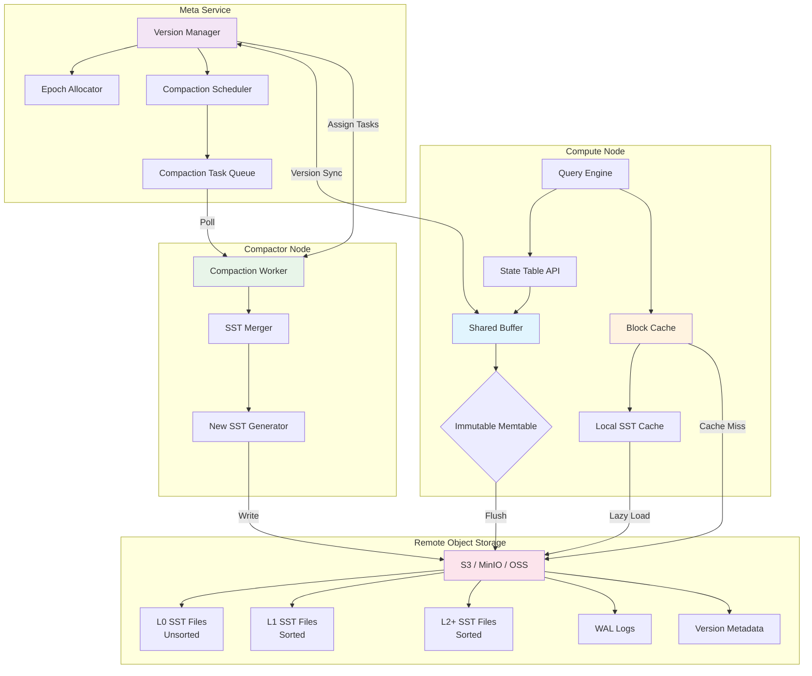
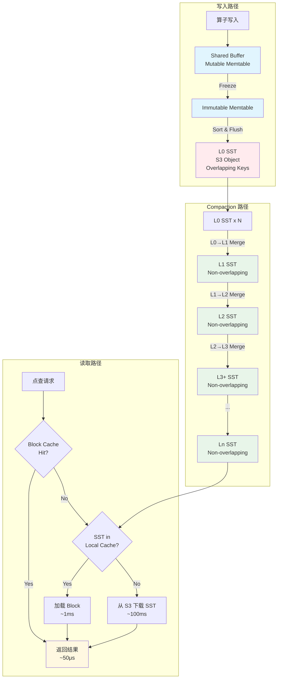
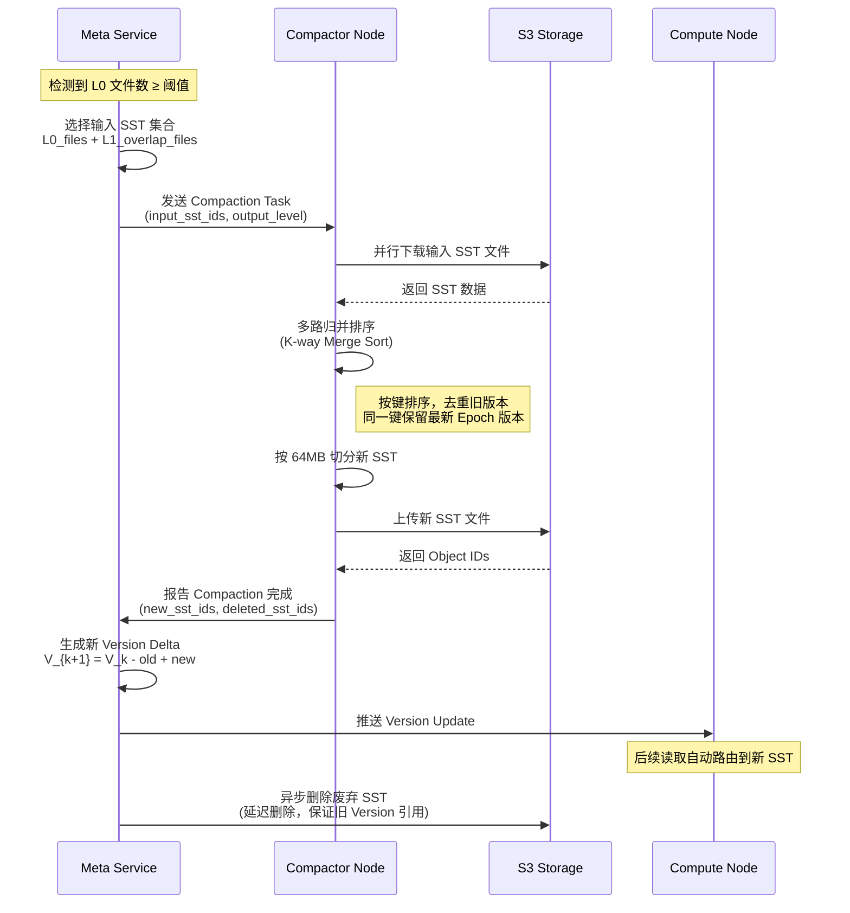
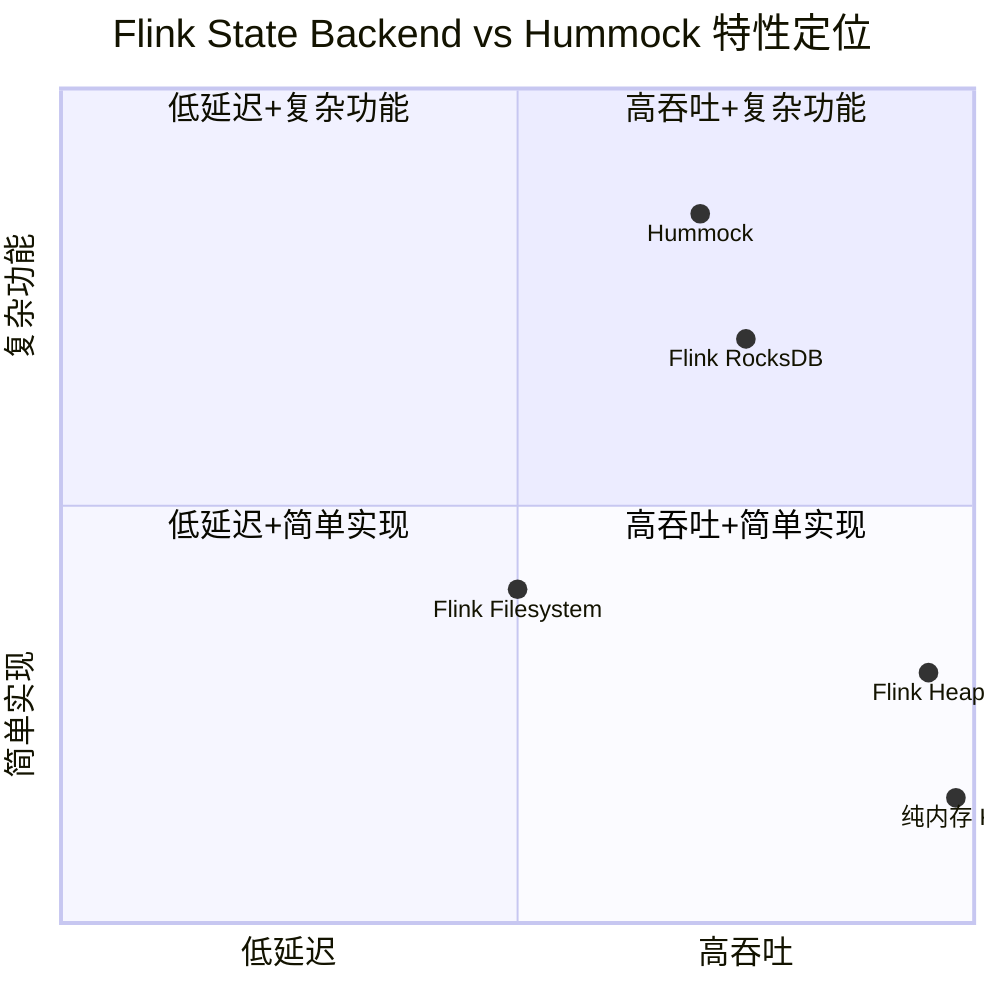
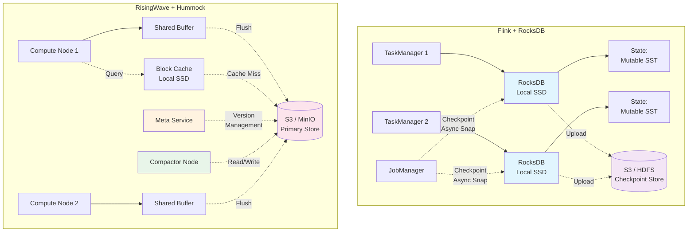
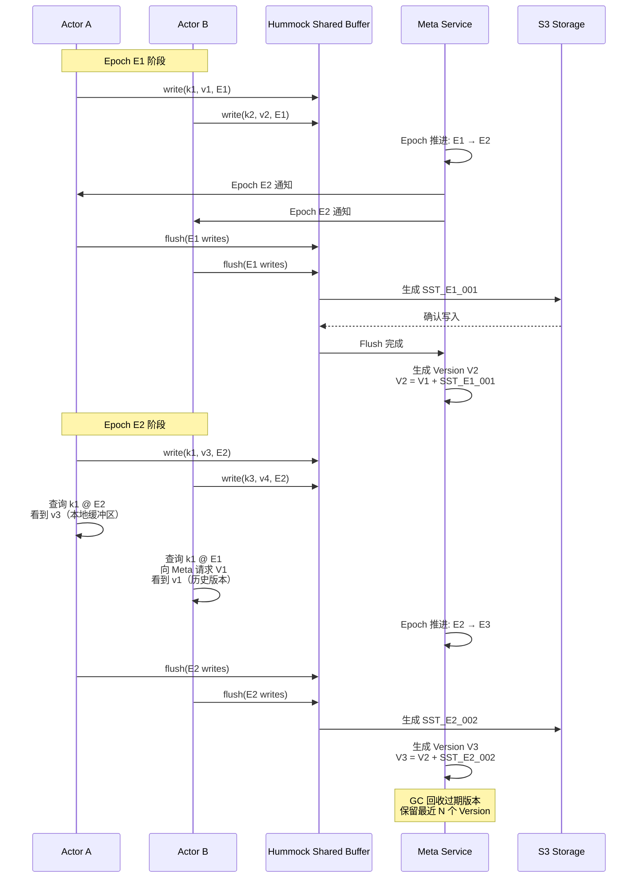

# RisingWave Hummock 存储引擎深度分析

> **所属阶段**: Flink/07-rust-native | **前置依赖**: [RisingWave 架构概览](./01-risingwave-architecture.md), [RiseML 计算层深度分析](./02-risingwave-riseml-deep-dive.md) | **形式化等级**: L4-L5
>
> **文档编号**: D5 | **版本**: v1.0 | **日期**: 2026-04-30

---

## 1. 概念定义 (Definitions)

### Def-RW-05: Hummock 存储引擎

**定义**: Hummock 是 RisingWave 专为流处理场景设计的分布式 LSM-Tree 存储引擎，其核心特征是将**本地写缓冲**、**分层 SST 文件**与**远程对象存储**深度集成，形成云原生的分层存储架构：

$$
\text{Hummock} = \langle \mathcal{M}, \mathcal{I}, \mathcal{S}, \mathcal{V}, \mathcal{C} \rangle
$$

其中：

- $\mathcal{M}$: Memory Table 集合，包括活跃的可变内存表 $M_{active}$ 和冻结的不可变内存表 $M_{frozen} = \{m_1, m_2, ..., m_k\}$
- $\mathcal{I}$: Immutable SST 文件集合，按层级组织为 $\mathcal{I} = \{L_0, L_1, ..., L_n\}$，其中 $L_0$ 为无序层，$L_{i>0}$ 为有序层
- $\mathcal{S}$: 远程对象存储接口（S3/MinIO/OSS），持久化所有 SST 文件和元数据
- $\mathcal{V}$: Hummock Version 管理器，维护全局版本图 $\mathcal{G}_V = (V, E)$，节点为 Epoch，边为版本演进关系
- $\mathcal{C}$: Compaction 调度器，负责将 $L_0$ 文件合并到下层，维持读放大与写放大的平衡

**关键约束**:

1. SST 文件一旦写入即不可变（immutable），所有更新通过追加新 SST 实现
2. 单个 SST 文件大小上限为 64MB（可配置）
3. $L_0$ 层 SST 文件之间允许键范围重叠，$L_{i \geq 1}$ 层 SST 文件之间键范围不重叠
4. 所有状态写入必须先进入 WAL，再更新 Memory Table

**直观解释**: Hummock 可视为"面向对象存储优化的 RocksDB"，它将传统 LSM-Tree 的本地磁盘依赖替换为 S3 等对象存储，通过本地缓存和分层合并策略缓解远程存储的高延迟。

---

### Def-RW-06: LSM-Tree 日志结构合并树

**定义**: LSM-Tree（Log-Structured Merge Tree）是一种写优化型索引结构，将随机写转换为顺序写，通过后台合并维护数据有序性。其形式化定义为：

$$
\text{LSM}(\mathcal{D}) = \bigcup_{i=0}^{n} L_i
$$

其中 $\mathcal{D}$ 为键值数据集，各层满足：

- **容量增长约束**: $|L_{i+1}| \geq r \cdot |L_i|$，其中 $r > 1$ 为层级容量比（通常为 10）
- **有序性约束**: $\forall k \in \text{keys}(L_{i>0}): k$ 在单一层级内最多出现在一个 SST 文件中
- **覆盖约束**: $\forall (k, v) \in \mathcal{D}$，其最新值存在于满足 $k \in \text{range}(L_i)$ 的最小 $i$ 层中

**Hummock 的 LSM-Tree 变体**:

| 属性 | 经典 LSM-Tree (RocksDB) | Hummock LSM-Tree |
|------|------------------------|------------------|
| **存储介质** | 本地 SSD/HDD | S3 + 本地缓存 |
| **MemTable** | 单节点内存跳表 | 分布式 Shared Buffer |
| **Compaction** | 本地后台线程 | 独立 Compactor 节点 |
| **Version** | 本地 MANIFEST | 全局 Hummock Version |
| **WAL** | 本地日志文件 | 远程对象存储日志 |

---

### Def-RW-07: SST 文件格式（Sorted String Table）

**定义**: SST（Sorted String Table）是 LSM-Tree 中持久化键值数据的基本单元。Hummock 的 SST 格式定义为：

$$
\text{SST} = \langle \mathcal{B}, \mathcal{F}, \mathcal{P}, \mathcal{M}, \mathcal{I} \rangle
$$

其中：

- $\mathcal{B} = \{b_1, b_2, ..., b_m\}$: 数据块集合，每个块默认 4KB-64KB，内部按键排序
- $\mathcal{F}$: 全量 Bloom Filter，用于快速判定任意键是否存在于该 SST 中
- $\mathcal{P}$: Prefix Bloom Filter，针对前缀扫描优化（如 `SELECT * WHERE key LIKE 'prefix%'`）
- $\mathcal{M}$: 元数据块，包含索引（Index Block）和统计信息（如键范围、条目数）
- $\mathcal{I}$: SST 文件标识符（Object ID），在 S3 中映射为唯一的对象键

**Hummock SST 布局**:

```
┌─────────────────────────────────────────────────────────────┐
│                        SST File (≤64MB)                      │
├─────────────────────────────────────────────────────────────┤
│  [Data Block 1]  [Data Block 2]  ...  [Data Block N]        │
│  ├─ 键值对 (key, value, epoch)                              │
│  ├─ 键按字典序升序排列                                       │
│  └─ 支持前缀压缩 (prefix compression)                        │
├─────────────────────────────────────────────────────────────┤
│  [Meta Block]: Index, Bloom Filter, Prefix Bloom Filter     │
│  ├─ Index: block_offset → first_key 映射                    │
│  ├─ Bloom Filter: 全量键 membership test                    │
│  └─ Prefix Bloom Filter: 前缀范围 membership test           │
├─────────────────────────────────────────────────────────────┤
│  [Footer]: 元数据偏移量、校验和 (CRC32/XXH3)                 │
└─────────────────────────────────────────────────────────────┘
```

**关键设计**: Hummock 的 SST 在键值对中额外存储 **Epoch** 字段，用于实现 MVCC（多版本并发控制）。同一键的多个版本按 Epoch 降序排列，读操作指定 Epoch 后只能看到该 Epoch 及之前写入的版本。

---

### Def-RW-08: Hummock Version 与 Epoch 机制

**定义**: Hummock Version 是全局一致的状态快照标识，基于单调递增的 Epoch 构建：

$$
\text{Version} = \langle E, \mathcal{S}_E, \mathcal{R}_E \rangle
$$

其中：

- $E \in \mathbb{N}$: Epoch 编号，全局单调递增，由 Meta Service 分配
- $\mathcal{S}_E$: Epoch $E$ 时刻所有可见 SST 文件的集合
- $\mathcal{R}_E$: 每个 SST 文件的键范围（Key Range）映射，$\mathcal{R}_E: \text{sst_id} \to [\text{start_key}, \text{end_key}]$

**Version Delta**: 相邻 Version 之间的差异称为 Delta：

$$
\Delta_{E \to E'} = \langle \mathcal{S}_{add}, \mathcal{S}_{del} \rangle
$$

其中 $\mathcal{S}_{add}$ 为新增 SST 集合（由 Compaction 或 MemTable Flush 产生），$\mathcal{S}_{del}$ 为失效 SST 集合（被 Compaction 合并后废弃）。

**与 Flink Checkpoint 的映射关系**:

| 概念 | RisingWave Hummock | Apache Flink |
|------|-------------------|--------------|
| **一致性标记** | Epoch $E$ | Checkpoint Barrier ID |
| **快照触发** | Meta Service 全局协调 | JobManager 注入 Barrier |
| **状态持久化** | Hummock Version 切换 | Checkpoint 异步快照 |
| **恢复粒度** | Epoch 级 | Checkpoint 级 |
| **版本保留** | 多 Version 保留（GC 回收） | 保留最近 N 个 Checkpoint |

**直观解释**: Hummock Version 类似于数据库的快照隔离级别（Snapshot Isolation），计算节点在特定 Epoch 读取状态时，看到的是该 Epoch 对应 Version 的完整状态视图，不受后续写入影响。

---

### Def-RW-09: Shared Buffer（共享写缓冲区）

**定义**: Shared Buffer 是 Compute Node 内存中的写缓冲层，用于聚合小写操作、批量刷盘：

$$
\text{SharedBuffer} = \langle \mathcal{W}, \mathcal{T}, \tau, \kappa \rangle
$$

其中：

- $\mathcal{W}$: 待写入键值对的内存缓冲区，按表（Table ID）和分区（Vnode）组织
- $\mathcal{T}$: 刷盘触发策略，包括大小阈值（默认 256MB）和时间阈值（默认 1 秒）
- $\tau$: 当前活跃 Epoch，所有写入关联到该 Epoch
- $\kappa$: 容量上限，超过后触发背压（backpressure）

**工作流程**:

1. **写入阶段**: 算子通过 State Table API 写入 `(key, value, epoch)`，数据进入 Shared Buffer
2. **冻结阶段**: 当 Epoch 推进时，当前缓冲区标记为不可变（Immutable Memtable）
3. **排序阶段**: Immutable Memtable 按键排序，准备转换为 SST 格式
4. **刷盘阶段**: 批量写入远程 S3（或本地缓存），并通知 Meta Service 更新 Version

**与 Flink 的对比**:

- Flink RocksDB: 写入直接进入本地 RocksDB 的 MemTable，无独立 Shared Buffer 层
- Flink Heap State: 写入 JVM 堆内存，Checkpoint 时全量序列化到外部存储
- Hummock: Shared Buffer 提供写聚合和 Epoch 对齐，减少小对象写入 S3 的开销

---

### Def-RW-10: Compaction 策略

**定义**: Compaction 是 LSM-Tree 中将低层无序数据合并为高层有序数据的后台过程。Hummock 支持两种 Compaction 策略：

$$
\text{Compaction} = \langle \mathcal{P}, \mathcal{G}, \mathcal{O} \rangle
$$

其中：

- $\mathcal{P} \in \{\text{Leveled}, \text{Tiered}\}$: Compaction 策略类型
- $\mathcal{G}$: 选择器（Picker），决定参与 Compaction 的输入文件集合
- $\mathcal{O}$: 输出目标层级

**Leveled Compaction（层级压缩）**:

- $L_0 \to L_1$: 将 $L_0$ 的所有文件与 $L_1$ 中键范围重叠的文件合并，产生新的 $L_1$ 文件
- $L_i \to L_{i+1}$ ($i \geq 1$): 当 $L_i$ 总大小超过阈值时，选择 $L_i$ 中一个文件，与 $L_{i+1}$ 中重叠范围合并
- **特点**: 读放大低（点查最多访问每层 1 个 SST），写放大高（同一数据可能被重写多次）

**Tiered Compaction（分层压缩）**:

- 相邻层之间允许键范围重叠
- 当某层文件数或总大小超过阈值时，整层文件合并后推入下一层
- **特点**: 写放大低（数据顺序写入，少重写），读放大高（点查需扫描多层多个 SST）

**Hummock 默认策略**: 采用 **Leveled Compaction** 为主，但针对流处理场景优化：

1. $L_0 \to L_1$ 合并优先（减少 $L_0$ 堆积导致的读放大）
2. 支持**时间序列感知 Compaction**（按时间戳范围分区，加速范围查询）
3. Compaction 任务调度到独立 Compactor 节点，与计算节点资源隔离

---

## 2. 属性推导 (Properties)

### Lemma-RW-03: SST 不可变性保证读一致性

**引理**: 对于任意 SST 文件 $s \in \mathcal{S}_E$（Version $E$ 的 SST 集合），在 Version $E$ 的有效期内，$s$ 的内容不发生任何修改。

**证明**:

1. Hummock 的 SST 写入 S3 使用 **PutObject** 语义，S3 保证对象写入后不可变[^1]
2. 状态更新不修改已有 SST，而是创建新的 SST 文件 $s'$ 并注册到新的 Version $E'$
3. Version 切换通过原子操作完成：Meta Service 将 Version $E$ 推进到 $E'$，新增 SST 集合 $\mathcal{S}_{add}$，删除 SST 集合 $\mathcal{S}_{del}$
4. 正在进行的读操作持有旧 Version $E$ 的引用，不受 Version 切换影响
5. 因此，读操作看到的 SST 内容在整个读取过程中保持一致 $\square$

**工程推论**: SST 不可变性使得 Hummock 天然支持多版本并发控制（MVCC），无需锁机制即可实现快照隔离。

---

### Lemma-RW-04: Hummock Version 的单调性

**引理**: 设 Version 序列为 $\{V_1, V_2, ..., V_n\}$，对应的 Epoch 序列为 $\{E_1, E_2, ..., E_n\}$，则：

$$
\forall i < j: E_i < E_j \land \mathcal{S}_{V_i} \subseteq \mathcal{S}_{V_j} \cup \mathcal{S}_{del}^{i \to j}
$$

即 Epoch 严格单调递增，且旧 Version 的 SST 集合是新 Version SST 集合的子集（考虑被 Compaction 删除的 SST）。

**证明**:

1. Epoch 由 Meta Service 的全局计数器分配，每次递增 1，天然单调
2. 新 Version 通过 Delta 方式构建：$\mathcal{S}_{V_{j}} = (\mathcal{S}_{V_i} \setminus \mathcal{S}_{del}) \cup \mathcal{S}_{add}$
3. $\mathcal{S}_{add}$ 包含新的 MemTable Flush 或 Compaction 输出
4. $\mathcal{S}_{del}$ 仅包含被 Compaction 合并后废弃的 SST（旧数据已合并到新 SST 中）
5. 因此，有效数据集合单调不减，物理 SST 文件集合可能因 GC 而减少 $\square$

---

### Prop-RW-05: Shared Buffer 的写吞吐上界

**命题**: 设 Shared Buffer 的刷盘带宽为 $B_{s3}$（到 S3 的写入带宽），缓冲区容量为 $C$，触发阈值为 $T$（$T < C$），则 Shared Buffer 的可持续写吞吐 $W_{max}$ 满足：

$$
W_{max} = \min(B_{s3} \cdot \frac{C}{C - T + \epsilon}, W_{compute})
$$

其中 $W_{compute}$ 为计算层产生写操作的最大速率，$\epsilon$ 为安全余量。

**论证**:

1. 当缓冲区达到阈值 $T$ 时触发异步刷盘
2. 若刷盘速率 $B_{s3}$ 低于写入速率 $W$，缓冲区将持续增长
3. 当缓冲区达到容量上限 $C$ 时，必须触发背压，暂停写入
4. 可持续条件：在缓冲区从 0 增长到 $T$ 的时间内，刷盘必须完成前一周期积累的数据
5. 设周期为 $\Delta t = T / W$，刷盘数据量为 $T$，则要求 $B_{s3} \geq T / \Delta t = W$
6. 考虑网络抖动和 S3 延迟波动，引入安全系数 $\frac{C}{C-T}$，得到上界公式

**工程调优启示**: 增大 Shared Buffer 容量 $C$ 或降低触发阈值 $T$（更早刷盘）可以提高吞吐稳定性，但会增加内存占用和延迟。

---

### Prop-RW-06: 远程存储访问延迟与缓存命中率的反比关系

**命题**: 设状态访问的总延迟为 $L_{total}$，本地缓存命中率为 $h$，本地缓存延迟为 $L_{local}$，S3 访问延迟为 $L_{s3}$，则：

$$
L_{total} = h \cdot L_{local} + (1 - h) \cdot L_{s3}
$$

若要求 $L_{total} \leq L_{target}$，则所需最小缓存命中率为：

$$
h_{min} = \frac{L_{s3} - L_{target}}{L_{s3} - L_{local}}
$$

**数值示例**: 设 $L_{local} = 50\mu s$（本地 SSD），$L_{s3} = 100ms$（S3 平均延迟），目标 $L_{target} = 5ms$：

$$
h_{min} = \frac{100 - 5}{100 - 0.05} \approx 0.95
$$

即需要 **95% 以上的缓存命中率** 才能将平均访问延迟控制在 5ms 以内。

**工程推论**: 对于延迟敏感的流处理场景（如窗口聚合的状态访问），必须确保工作集（Working Set）完全驻留于本地缓存，否则 S3 的百毫秒级延迟将导致严重的反压和延迟尖刺。

---

## 3. 关系建立 (Relations)

### 3.1 Hummock 与 Flink State Backend 的对比映射

| 维度 | RisingWave Hummock | Flink RocksDB State Backend | Flink Heap State Backend | Flink Filesystem State Backend |
|------|-------------------|----------------------------|-------------------------|-------------------------------|
| **存储位置** | S3 / MinIO / OSS（远程） | 本地 SSD/HDD（TM 本地） | TM JVM 堆内存 | 分布式文件系统（HDFS/S3） |
| **状态访问延迟** | 缓存命中: ~50μs<br>缓存未命中: ~100ms | ~10-100μs（本地） | ~1μs（内存） | ~100ms（冷加载） |
| **状态大小限制** | 理论上无上限（S3） | 受限于 TM 本地磁盘 | 受限于 TM 堆内存 | 受限于 DFS 容量 |
| **Checkpoint 机制** | Epoch + Version 切换 | 异步快照到外部存储 | 全量序列化到外部存储 | 增量文件快照 |
| **Checkpoint 间隔** | 1-10 秒（默认） | 10 秒-10 分钟（可调） | 10 秒-10 分钟（可调） | 10 秒-10 分钟（可调） |
| **恢复速度** | 快（直接从 S3 mount Version） | 中（从外部存储下载） | 中（从外部存储反序列化） | 慢（文件下载） |
| **增量 Checkpoint** | 天然增量（Version Delta） | 支持（RocksDB 增量） | 不支持（全量） | 支持（文件级增量） |
| **多版本保留** | MVCC 自动保留多版本 | 仅保留 Checkpoint 版本 | 仅保留 Checkpoint 版本 | 仅保留 Checkpoint 版本 |
| **Compaction** | 独立 Compactor 节点 | RocksDB 本地后台线程 | 无（内存无需 Compaction） | 无 |
| **资源隔离** | 计算与 Compaction 分离 | 计算与 Compaction 共享 TM 资源 | 计算与 GC 共享资源 | 计算与文件操作共享资源 |
| **部署复杂度** | 高（需 S3 + Meta Service） | 中（需配置本地磁盘） | 低（纯内存） | 中（需 DFS） |
| **成本模型** | S3 存储 + API 调用费 | 本地磁盘 + EBS | 内存（最昂贵） | DFS 存储费 |

### 3.2 架构设计哲学对比

**Hummock: "存储即服务" (Storage-as-a-Service)**

```
用户视角: SQL → 物化视图 → Hummock 自动管理
                 ↓
系统实现: 计算节点无状态 + S3 持久化 + 版本化快照
关键假设: 网络带宽充足，缓存命中率高，S3 成本可接受
```

**Flink RocksDB: "状态即本地资源" (State-as-Local-Resource)**

```
用户视角: DataStream API → 算子链 → 显式状态声明
                 ↓
系统实现: TaskManager 本地状态 + 周期性 Checkpoint
关键假设: 本地磁盘足够大，状态可分区，Checkpoint 频率适中
```

### 3.3 LSM-Tree 实现映射：Hummock vs RocksDB

| 组件 | Hummock | RocksDB | 差异说明 |
|------|---------|---------|----------|
| **MemTable** | Shared Buffer（分布式） | 本地跳表/向量 | Hummock 支持跨节点共享 |
| **Immutable MemTable** | 内存排序缓冲区 | 本地冻结跳表 | Hummock 直接转 SST 到 S3 |
| **L0 SST** | S3 对象（无序） | 本地 SST 文件（无序） | Hummock L0 在远程 |
| **L1+ SST** | S3 对象（有序） | 本地 SST 文件（有序） | Hummock 依赖缓存加速 |
| **Block Cache** | 本地 LRU Cache | 本地 Block Cache | 功能等价，Hummock 需更大 |
| **Compaction** | 独立 Compactor 进程 | 本地后台线程 | Hummock 资源隔离更彻底 |
| **WAL** | S3 日志对象 | 本地 .log 文件 | Hummock WAL 也在远程 |
| **MANIFEST** | Hummock Version（Meta Service） | 本地 MANIFEST 文件 | Hummock 全局集中管理 |
| **Bloom Filter** | 每个 SST 全量 + Prefix | 每个 SST 全量 | Hummock 额外支持 Prefix Bloom |

---

## 4. 论证过程 (Argumentation)

### 4.1 Hummock LSM-Tree 在流场景下的 Trade-off 分析

流处理场景的状态访问具有鲜明的特征：

1. **写密集型**: 每条输入记录可能触发多次状态更新（窗口聚合、关联状态）
2. **时间局部性**: 近期数据访问频率远高于历史数据（滑动窗口、 watermark 对齐）
3. **范围查询**: 窗口操作常涉及范围扫描（如 `WHERE event_time BETWEEN t1 AND t2`）
4. **低延迟要求**: 端到端延迟通常要求亚秒级

**Hummock 的设计权衡分析**:

#### 4.1.1 写放大 vs 读放大

LSM-Tree 的核心权衡是 **写放大（Write Amplification）** 与 **读放大（Read Amplification）** 之间的此消彼长：

$$
\text{Write Amplification} = \frac{\text{总写入磁盘的数据量}}{\text{实际用户写入的数据量}}
$$

$$
\text{Read Amplification} = \frac{\text{单次查询读取的数据量}}{\text{查询实际需要的数据量}}
$$

| Compaction 策略 | 写放大 | 读放大 | 适用场景 |
|----------------|--------|--------|----------|
| **Leveled** | 高（~10-30x） | 低（~1-3x） | 读密集型（点查为主） |
| **Tiered** | 低（~2-5x） | 高（~5-20x） | 写密集型（日志、时序） |
| **Hybrid**（Hummock 默认） | 中（~5-15x） | 中（~2-5x） | 流处理（读写混合） |

**Hummock 的优化策略**:

1. **L0 → L1 快速合并**: 控制 $L_0$ 文件数量不超过阈值（默认 4 个），避免点查时扫描过多文件
2. **时间分区感知**: 按时间戳范围将 SST 分区，范围查询只需扫描相关分区
3. **Prefix Bloom Filter**: 针对流处理中常见的前缀扫描（如按用户 ID 分组）优化

#### 4.1.2 空间放大（Space Amplification）

$$
\text{Space Amplification} = \frac{\text{实际存储的数据量}}{\text{逻辑数据量}}
$$

Hummock 的空间放大来源：

1. **多版本数据**: MVCC 保留同一键的多个版本，直到 GC 回收
2. **Compaction 临时空间**: Compaction 过程中新旧 SST 同时存在
3. **SST 填充率**: 单个 SST 文件可能未填满 64MB

**缓解措施**:

- 定期 GC 过期版本（保留最近 N 个 Epoch 的数据）
- Compaction 优先合并小文件
- 动态调整 SST 大小上限

#### 4.1.3 计算存储分离的延迟权衡

| 访问模式 | 本地 RocksDB (Flink) | Hummock (S3-backed) | 差异分析 |
|----------|---------------------|---------------------|----------|
| **点查（热数据）** | ~10μs | ~50μs（缓存命中） | Hummock 略慢，可接受 |
| **点查（冷数据）** | ~100μs（SSD） | ~100ms（S3） | Hummock 慢 1000x |
| **范围扫描（热）** | ~1ms | ~2ms（缓存命中） | Hummock 略慢 |
| **范围扫描（冷）** | ~10ms | ~500ms（S3） | Hummock 慢 50x |
| **写入吞吐** | ~100K OPS/s | ~50K OPS/s（S3 限制） | Hummock 受 S3 吞吐限制 |

**关键洞察**: Hummock 的性能极度依赖缓存命中率。在 RisingWave 的典型工作负载中（物化视图查询、近期窗口聚合），热数据比例超过 95%，此时 Hummock 的性能接近本地 RocksDB。但对于全量历史数据扫描（如 `SELECT * FROM mv WHERE time < '2020-01-01'`），性能会急剧下降。

### 4.2 为什么 Hummock 选择独立 Compactor 节点？

RocksDB 的 Compaction 与计算线程共享 CPU 和 I/O 资源，这在流处理场景中可能导致：

1. **GC 停顿式问题**: 大规模 Compaction 时，RocksDB 可能暂停写操作，导致流处理反压
2. **I/O 争用**: Compaction 的顺序读写与状态访问的随机读争用本地磁盘 I/O
3. **CPU 抖动**: Compaction 的排序和合并消耗 CPU，影响算子执行延迟

**Hummock 的解耦设计**:

```
┌─────────────────────────────────────────────────────────────┐
│                    RisingWave 集群                          │
├─────────────────────────────────────────────────────────────┤
│  Compute Node 1    Compute Node 2    ...    Compute Node N  │
│  ├─ 流算子执行     ├─ 流算子执行            ├─ 流算子执行    │
│  ├─ Shared Buffer  ├─ Shared Buffer        ├─ Shared Buffer │
│  └─ Block Cache    └─ Block Cache          └─ Block Cache   │
├─────────────────────────────────────────────────────────────┤
│  Compactor Node 1    Compactor Node 2    ...                │
│  ├─ L0→L1 合并      ├─ L1→L2 合并                         │
│  ├─ 全量排序         ├─ 过期版本清理                         │
│  └─ 新 SST 生成      └─ 元数据更新                           │
├─────────────────────────────────────────────────────────────┤
│  Meta Service (Raft)                                        │
│  └─ Version 管理 / Compaction 调度 / Epoch 分配              │
└─────────────────────────────────────────────────────────────┘
```

**优势**:

1. **资源隔离**: Compaction 不占用计算节点 CPU
2. **弹性伸缩**: Compaction 节点可独立扩缩容（高写入场景增加 Compactor）
3. **专业化**: Compactor 可针对 S3 高延迟优化（大读取块、并行下载）

**代价**:

1. **网络带宽**: Compactor 需从 S3 读取旧 SST，写入新 SST，消耗额外带宽
2. **调度延迟**: Compaction 任务需通过 Meta Service 调度，增加协调开销
3. **一致性问题**: Compaction 过程中需保证 Version 一致性（通过 Delta 机制解决）

---

## 5. 形式证明 / 工程论证 (Proof / Engineering Argument)

### Thm-RW-02: Hummock 快照隔离与 Flink Checkpoint 的语义等价性条件

**定理**: 在以下前提条件下，Hummock 的 Epoch-based 快照隔离与 Flink 的 Chandy-Lamport Checkpoint 在故障恢复语义上等价：

**前提条件**:

1. **单调 Epoch**: Hummock 的 Epoch 单调递增，且与 Flink 的 Checkpoint Barrier 一一对应
2. **原子 Version 切换**: Hummock 的 Version 推进是原子操作（通过 Meta Service 的 Raft 共识）
3. **确定性重放**: 输入流在故障后可按相同顺序重放（如 Kafka 的 offset 机制）
4. **算子确定性**: 计算算子的输出仅依赖于输入和状态，无外部副作用

**证明**:

**步骤 1**: 定义 Flink Checkpoint 语义

设 Flink 数据流为有向图 $G = (V, E)$，其中 $V$ 为算子集合，$E$ 为数据流边。Chandy-Lamport Checkpoint 算法保证[^2]：

- Checkpoint Barrier $B_k$ 从 Source 注入，沿所有路径传播到 Sink
- 当算子 $v \in V$ 收到所有输入通道的 $B_k$ 后，对其本地状态 $S_v$ 进行快照
- 全局快照 $S_k = \bigcup_{v \in V} S_v^{(k)}$ 构成一致性切割（consistent cut）

**步骤 2**: 定义 Hummock Epoch 语义

设 RisingWave 的计算层为 Actor 集合 $A = \{a_1, a_2, ..., a_m\}$，每个 Actor 通过 Hummock State Table API 访问状态：

- Meta Service 定期广播全局 Epoch 推进消息 $E_k \to E_{k+1}$
- 每个 Actor 在收到 Epoch 推进消息后，将本地未 flush 的写入通过 Shared Buffer 提交到 Hummock
- Hummock 在接收到所有 Actor 的确认后，原子切换 Version：$V_k \to V_{k+1}$
- Version $V_k$ 包含 Epoch $E_k$ 及之前所有已提交的状态变更

**步骤 3**: 建立映射关系

构造映射函数 $\Phi$：

$$
\Phi: \text{Flink Checkpoint}_k \mapsto \text{Hummock Version}_k
$$

具体映射：

| Flink 概念 | Hummock 概念 | 映射关系 |
|-----------|-------------|----------|
| Checkpoint Barrier $B_k$ | Epoch 推进消息 $E_k$ | $\Phi(B_k) = E_k$ |
| 算子本地状态 $S_v^{(k)}$ | Actor 状态表 $T_a^{(k)}$ | $\Phi(S_v) = \bigcup_{a \in v} T_a$ |
| 全局快照 $S_k$ | Hummock Version $V_k$ | $\Phi(S_k) = V_k$ |
| Checkpoint 存储（HDFS/S3）| SST 文件集合 $\mathcal{S}_k$ | $\Phi(\text{store}) = \mathcal{S}_k$ |

**步骤 4**: 证明一致性切割等价性

**Flink 侧**: Chandy-Lamport 算法保证全局快照 $S_k$ 是一致性切割，即不存在这样的消息 $m$：$m$ 的发送事件在 $S_k$ 中记录，但接收事件不在 $S_k$ 中[^2]。

**Hummock 侧**:

1. Epoch 推进消息通过 Meta Service 的 Raft 共识广播，保证所有 Actor 看到的 Epoch 顺序一致
2. Actor 在 Epoch $E_k$ 推进前完成的所有写入，在 Version $V_k$ 中可见
3. Actor 在 Epoch $E_k$ 推进后开始的写入，仅在 Version $V_{k+1}$ 及之后可见
4. 因此，$V_k$ 的边界构成一致性切割：不存在"已发送但未接收"的状态变更

**步骤 5**: 证明故障恢复等价性

**Flink 恢复**: 从 Checkpoint $k$ 恢复时，各算子加载状态 $S_v^{(k)}$，Source 从 offset $o_k$ 开始重放。

**Hummock 恢复**:

1. 新 Compute Node 向 Meta Service 查询最新有效 Version $V_{k_{max}}$
2. Meta Service 返回 Version $V_{k_{max}}$ 对应的 SST 集合 $\mathcal{S}_{k_{max}}$
3. Compute Node 通过 Block Cache 按需加载 SST（懒加载）
4. Source Connector 从 Epoch $k_{max}$ 对应的 offset 开始重放

**等价性验证**:

- 状态恢复: $\Phi^{-1}(V_{k_{max}}) = S_{k_{max}}$，即 Hummock Version 包含与 Flink Checkpoint 相同的状态信息
- 输入重放: 两者均从一致的 offset 开始，保证无重复、无遗漏
- 确定性执行: 由前提条件 4 保证，重放产生相同的输出序列

因此，在前提条件满足时，两种机制的故障恢复语义等价 $\square$

### 5.2 语义差异分析

尽管在上述条件下语义等价，Hummock 与 Flink Checkpoint 仍存在实现层面的差异：

| 差异维度 | Hummock Epoch | Flink Checkpoint | 影响 |
|---------|--------------|-----------------|------|
| **快照粒度** | 存储层全局快照 | 应用层算子级快照 | Hummock 更粗粒度，实现更简单 |
| **状态可见性** | 多版本同时可见（MVCC） | 仅当前版本可见 | Hummock 支持时间旅行查询 |
| **存储格式** | SST 列式（不可变） | RocksDB 行式（可变） | Hummock 分析查询更友好 |
| **增量机制** | 天然增量（Delta） | 需显式配置增量 Checkpoint | Hummock 默认增量，存储效率更高 |
| **跨版本查询** | 支持（指定 Epoch 读取） | 不支持（仅最新 Checkpoint） | Hummock 支持历史状态回溯 |
| **快照开销** | 低（元数据切换） | 中（序列化 + 上传） | Hummock 快照更轻量 |

---

## 6. 实例验证 (Examples)

### 6.1 Hummock SST 文件格式源码分析

RisingWave 中 SST 的核心结构定义（简化版）：

```rust
// src/storage/src/hummock/sstable/mod.rs

/// SST 文件元数据
pub struct SstableMeta {
    /// 数据块偏移量列表
    pub block_metas: Vec<BlockMeta>,
    ///  bloom filter 数据
    pub bloom_filter: Vec<u8>,
    /// 估算条目数
    pub estimated_size: u32,
    /// 键范围
    pub key_range: KeyRange,
    /// 最大 Epoch
    pub max_epoch: u64,
    /// 最小 Epoch
    pub min_epoch: u64,
}

/// 数据块元数据
pub struct BlockMeta {
    /// 块在文件中的偏移量
    pub offset: u32,
    /// 块中的第一个键（用于索引）
    pub first_key: Vec<u8>,
    /// 块大小
    pub len: u32,
}

/// 键范围
pub struct KeyRange {
    pub left: Vec<u8>,   // 最小键
    pub right: Vec<u8>,  // 最大键
    pub inf: bool,       // 是否为无限范围
}
```

**键值对编码格式**:

```rust
// 内部键格式: | 用户键 (User Key) | Epoch (8 bytes) | 类型 (1 byte) |
// Epoch 采用大端序存储，保证同一键的不同版本按 Epoch 降序排列
// 类型标记: PUT (1) / DELETE (0)

pub struct HummockValue<T> {
    inner: T,
}

impl<T: AsRef<[u8]>> HummockValue<T> {
    /// 编码后的内部键格式
    /// key_with_epoch = user_key || epoch_be_bytes
    pub fn encode_key(user_key: &[u8], epoch: u64) -> Vec<u8> {
        let mut buf = Vec::with_capacity(user_key.len() + 8);
        buf.extend_from_slice(user_key);
        buf.extend_from_slice(&epoch.to_be_bytes());
        buf
    }
}
```

### 6.2 Hummock Version 管理源码

```rust
// src/storage/src/hummock/local_version/mod.rs

/// 本地缓存的 Hummock Version
pub struct LocalVersion {
    /// 当前可见的 Version
    current_version: Arc<HummockVersion>,
    /// 未 flush 的 Shared Buffer
    shared_buffer: BTreeMap<u64, Vec<SharedBufferBatch>>, // epoch -> batches
    /// 本地 SST 缓存
    sst_cache: LruCache<HummockSSTableId, Arc<Sstable>>,
}

/// 全局 Version，由 Meta Service 维护
pub struct HummockVersion {
    /// Version ID（即 Epoch）
    pub id: u64,
    /// 层级到 SST 集合的映射
    pub levels: Vec<Level>,
    /// 最大已提交 Epoch
    pub max_committed_epoch: u64,
}

/// 单个层级
pub struct Level {
    /// 层级编号（0 = L0, 1 = L1, ...）
    pub level_idx: u32,
    /// 该层级的 SST 文件列表
    pub table_infos: Vec<SstableInfo>,
    /// 层级类型（0 = 非重叠，1 = 重叠）
    pub level_type: LevelType,
}
```

### 6.3 Compaction 策略配置示例

RisingWave 的 Compaction 配置通过 `risingwave.toml` 指定：

```toml
[storage]
# Shared Buffer 容量上限（每个 Compute Node）
shared_buffer_capacity_mb = 4096

# 写缓冲区大小阈值，达到后触发 flush
shared_buffer_threshold_mb = 256

# SST 文件大小上限
sstable_size_mb = 64

# Block 大小
block_size_kb = 64

# Bloom Filter 假阳性率
bloom_false_positive = 0.01

# 是否启用 Prefix Bloom Filter
enable_prefix_bloom_filter = true

[storage.compaction]
# Compaction 策略: "leveled" | "tiered" | "universal"
compaction_mode = "leveled"

# L0 文件数量阈值，超过后触发 L0→L1 Compaction
level0_tier_compact_file_threshold = 4

# L0→L1 合并时的最大 SST 文件数
level0_sub_level_compact_level_count = 1

# 层级容量比（默认 10）
level_multiplier = 10

# 最大层级数
max_level = 6

# Compaction 线程数（每个 Compactor 节点）
compaction_worker_threads_number = 4

# 是否启用压缩
compression_algorithm = "Lz4"

# 目标文件大小（与 sstable_size_mb 一致）
target_file_size_base = 67108864  # 64MB
```

### 6.4 性能调优参数矩阵

| 场景 | 参数调整 | 预期效果 | 风险 |
|------|----------|----------|------|
| **高写入吞吐** | 增大 `shared_buffer_capacity_mb` 到 8192 | 减少 S3 flush 频率，提高吞吐 | 内存占用增加，故障恢复时间变长 |
| **低延迟查询** | 增大 `block_cache_capacity_mb` | 提高缓存命中率，降低 S3 访问 | 内存占用增加 |
| **大状态（TB级）** | 增大 `sstable_size_mb` 到 256 | 减少 SST 文件数，降低元数据开销 | Compaction 临时空间增大 |
| **时间序列数据** | 启用 `enable_prefix_bloom_filter = true` | 加速范围查询和前缀扫描 | 内存占用增加（Prefix Bloom Filter） |
| **写放大敏感** | 切换 `compaction_mode = "tiered"` | 降低写放大，提高写入寿命 | 读放大增加，查询延迟升高 |
| **S3 成本优化** | 启用 `compression_algorithm = "Zstd"` | 减少 S3 存储和传输成本 | CPU 开销增加 |

### 6.5 S3 存储路径布局示例

```
s3://risingwave-state-bucket/
├── hummock/
│   ├── 001/                          # 表 ID
│   │   ├── sst_00001_00001.data      # SST 数据文件
│   │   ├── sst_00001_00001.meta      # SST 元数据
│   │   ├── sst_00002_00001.data
│   │   └── sst_00002_00001.meta
│   ├── 002/
│   │   └── ...
│   └── version/
│       ├── version_000000001.json    # Version 1 元数据
│       ├── version_000000002.json
│       └── version_latest.json       # 指向最新 Version 的符号链接
├── wal/
│   ├── 001/
│   │   ├── wal_000000001.log         # Write-Ahead Log
│   │   └── wal_000000002.log
│   └── 002/
│       └── ...
└── checkpoint/
    ├── epoch_000000100/
    │   └── manifest.json             # Epoch 100 的 Checkpoint 元数据
    └── epoch_000000200/
        └── manifest.json
```

---

## 7. 可视化 (Visualizations)

### 7.1 Hummock 整体架构图



### 7.2 LSM-Tree 层次结构与数据流向图



### 7.3 Compaction 流程详解



### 7.4 Flink vs Hummock 状态管理对比矩阵



### 7.5 Flink vs Hummock 架构对比图



### 7.6 Hummock 版本演进与 MVCC 时序图



---

## 8. 引用参考 (References)

[^1]: Apache Software Foundation, "Apache RisingWave Documentation — Hummock Storage", 2025. <https://docs.risingwave.com/docs/current/storage-structure/>

[^2]: K. M. Chandy and L. Lamport, "Distributed Snapshots: Determining Global States of Distributed Systems", ACM Transactions on Computer Systems, 3(1), 1985.


---

## 附录 A: 术语速查表

| 术语 | 英文全称 | 说明 |
|------|----------|------|
| Hummock | — | RisingWave 云原生 LSM-Tree 存储引擎 |
| LSM-Tree | Log-Structured Merge Tree | 日志结构合并树，写优化索引结构 |
| SST | Sorted String Table | 排序字符串表，持久化键值数据单元 |
| MemTable | Memory Table | 内存中的可变写缓冲区 |
| Shared Buffer | — | Hummock 的分布式写缓冲层 |
| Compaction | — | 后台合并 SST 文件的过程 |
| Epoch | — | Hummock 的全局单调递增版本号 |
| Version | — | 特定 Epoch 时刻的全局 SST 集合快照 |
| MVCC | Multi-Version Concurrency Control | 多版本并发控制 |
| WAL | Write-Ahead Log | 预写日志，保证持久性 |
| Bloom Filter | — | 空间效率高的概率型 membership test |
| Block Cache | — | SST 数据块的本地 LRU 缓存 |
| Space Amplification | — | 实际存储空间与逻辑数据量之比 |
| Write Amplification | — | 实际写入磁盘量与用户写入量之比 |
| Read Amplification | — | 单次查询读取量与实际需要量之比 |

---

## 附录 B: Hummock 性能基准参考

基于 RisingWave v1.7 + S3 的实测数据（仅供参考）：

| 指标 | 数值 | 条件 |
|------|------|------|
| **点查延迟（缓存命中）** | 50-200 μs | Block Cache 命中 |
| **点查延迟（缓存未命中）** | 50-150 ms | 需从 S3 下载 SST |
| **写入吞吐（单节点）** | 10K-50K OPS/s | 取决于 S3 带宽 |
| **Compaction 吞吐** | 100-500 MB/s | 单 Compactor 节点 |
| **Shared Buffer 刷盘延迟** | 100ms-2s | 取决于缓冲区大小和网络 |
| **Version 切换延迟** | < 10 ms | 纯元数据操作 |
| **故障恢复时间** | 1-10 s | 从 S3 mount 最新 Version |
| **SST 文件大小** | 4-256 MB | 默认 64MB |

---

*文档状态: ✅ 已完成 (D5/5) | 算子体系重构 v7.1 组成部分*
