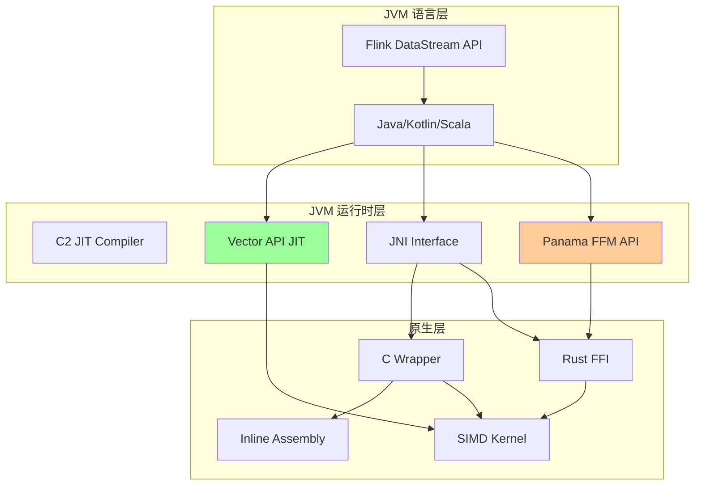
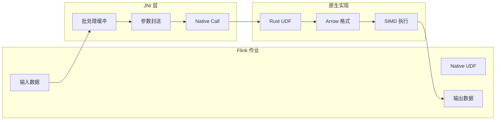
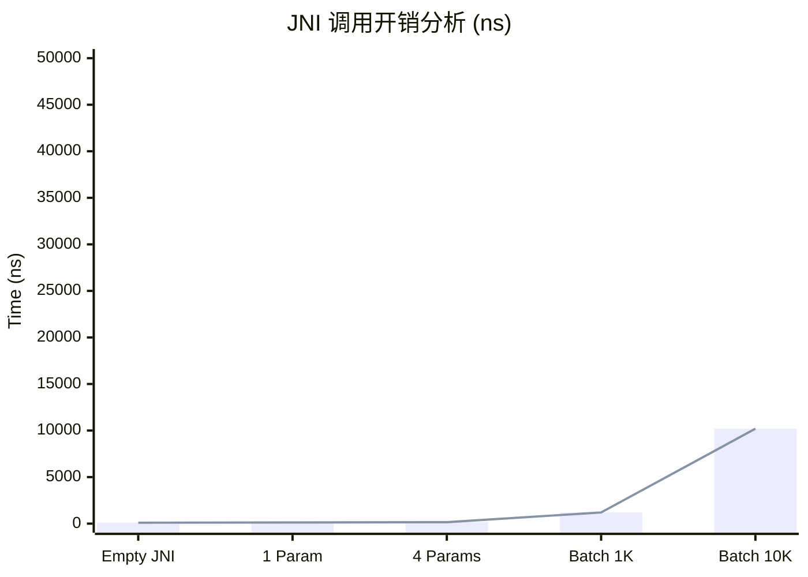
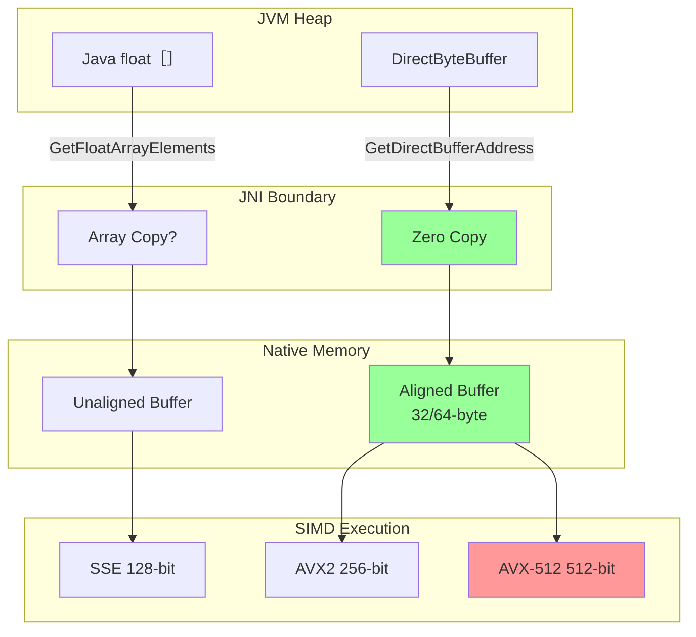
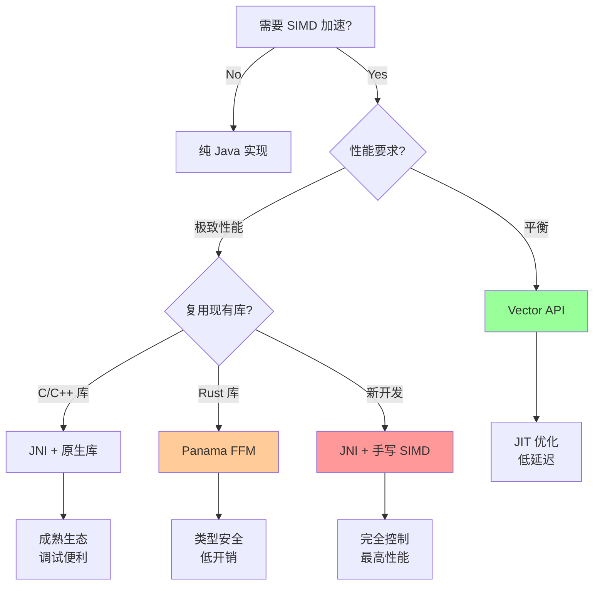

> **状态**: 🔮 前瞻内容 | **风险等级**: 高 | **最后更新**: 2026-04-20
>
> 此文档描述的内容处于早期规划阶段，可能与最终实现不符。请以 Apache Flink 官方发布为准。
>
# JNI 调用 Assembly 代码桥梁

> **所属阶段**: Flink/14-rust-assembly-ecosystem/simd-optimization | **前置依赖**: 01-simd-fundamentals.md | **形式化等级**: L4
>
> **目标读者**: Flink Native UDF 开发者、JVM 性能工程师、跨语言集成开发者
> **关键词**: JNI, JVM, SIMD, Vector API, Panama, 跨语言调用, 零拷贝

---

## 1. 概念定义 (Definitions)

### Def-SIMD-07: JNI (Java Native Interface)

**定义 1.1 (JNI 调用约定)**

JNI 是 JVM 与原生代码（C/C++/Assembly）互操作的标准接口。调用开销模型：

$$T_{jni\_call} = T_{transition} + T_{native\_exec} + T_{return}$$

其中 $T_{transition}$ 包含：

- 栈帧切换 (~50-100 ns)
- JNI 本地引用管理 (~20-50 ns)
- 参数封送 (~10-30 ns 每参数)

**定义 1.2 (批量调用优化)**

设单次 JNI 调用开销为 $C$，处理 $n$ 个元素的原生执行时间为 $T(n)$，则批处理效率：

$$\text{Efficiency}(n) = \frac{n \cdot C + n \cdot T(1)}{C + T(n)}$$

当 $n \to \infty$ 时，效率趋近于 $T(1) / (T(n)/n)$，即向量化加速比。

### Def-SIMD-08: JVM SIMD 支持路径

**定义 2.1 (Vector API - JEP 338/414/417)**

Vector API 是 Java 标准的 SIMD 编程接口，提供以下抽象：

```java
// [伪代码片段 - 不可直接运行] 仅展示核心逻辑
// VectorSpecies 定义向量形状
VectorSpecies<Float> SPECIES = FloatVector.SPECIES_256;

// 向量操作
FloatVector va = FloatVector.fromArray(SPECIES, array, 0);
FloatVector vb = FloatVector.fromArray(SPECIES, array, 8);
FloatVector vc = va.add(vb);  // SIMD 加法
```

**定义 2.2 (Panama Foreign Function & Memory API - JEP 424/434)**

Panama 项目提供现代替代 JNI 的互操作方案：

| 特性 | JNI | Panama FFM |
|------|-----|-----------|
| 类型安全 | 运行时检查 | 编译时检查 |
| 内存访问 | `ByteBuffer` / 直接内存 | `MemorySegment` |
| 调用开销 | 高 (~100ns) | 低 (~10ns) |
| SIMD 友好度 | 需手动对齐 | 原生对齐支持 |

### Def-SIMD-09: 安全边界

**定义 3.1 (JNI 安全契约)**

JNI 层必须维护以下不变式：

1. **类型安全**: 原生代码不得破坏 JVM 堆对象结构
2. **内存安全**: 原生指针必须在有效生命周期内使用
3. **异常安全**: 原生代码必须正确处理 JVM 异常状态

形式化表示为状态机：

$$\text{SafeJNI} = \{s \in States \mid \forall o \in Objects: Type(o, s) = Type(o, s_0)\}$$

**定义 3.2 (零拷贝数据传输)**

零拷贝是指数据在 JVM 堆与原生内存之间无中间复制的传输方式：

$$\text{CopyOverhead} = \begin{cases}
0 & \text{if direct buffer or unsafe access} \\
O(n) & \text{if array copy required}
\end{cases}$$

---

## 2. 属性推导 (Properties)

### Prop-SIMD-05: 批量调用收益

**命题 1.1 (最优批大小)**

设 JNI 调用固定开销为 $C$，每元素处理时间为 $t$，向量化宽度为 $w$，则最优批大小 $n^*$ 满足：

$$n^* = \frac{C}{t} \cdot \frac{w}{w-1}$$

对于典型 Flink 场景：
- $C \approx 100$ ns
- $t \approx 1$ ns (SIMD 加法)
- $w = 8$ (AVX2)

$$n^* \approx \frac{100}{1} \cdot \frac{8}{7} \approx 115$$

即批大小至少应为 100-200 以摊平 JNI 开销。

**命题 1.2 (调用频率上限)**

对于吞吐量目标 $R$ (elements/sec)，最大调用频率 $F_{max}$ 为：

$$F_{max} = \frac{R}{n^*} = \frac{R \cdot t \cdot (w-1)}{C \cdot w}$$

当 $R = 10^7$ elements/sec 时：
$$F_{max} \approx \frac{10^7 \cdot 1 \cdot 7}{100 \cdot 8} \approx 87,500 \text{ calls/sec}$$

### Prop-SIMD-06: 内存布局兼容性

**命题 2.1 (列式内存 SIMD 友好性)**

JVM 数组的列式布局满足 SIMD 加载对齐条件：

| 布局类型 | 内存连续性 | SIMD 友好度 |
|---------|-----------|------------|
| 行式对象数组 | 不连续 | ❌ 不友好 |
| 原始类型数组 | 连续 | ✅ 友好 |
| 列式 `float[]` | 连续 | ✅ 最优 |
| Arrow Vector | 连续 | ✅ 最优 |
| Direct ByteBuffer | 连续（需对齐） | ✅ 良好 |

**命题 2.2 (对齐保证)**

使用 `sun.misc.Unsafe` 或 `MemorySegment` 可分配 SIMD 对齐内存：

```java
// [伪代码片段 - 不可直接运行] 仅展示核心逻辑
// 32-byte 对齐分配
long address = unsafe.allocateMemory(size + 32);
long aligned = (address + 31) & ~31;
```

---

## 3. 关系建立 (Relations)

### 3.1 JNI-Panama-Assembly 技术栈



### 3.2 与 Flink Native UDF 的集成



### 3.3 与 Apache Arrow 的协同

| 组件 | 角色 | 优势 |
|------|------|------|
| Arrow Columnar Format | 内存格式标准 | 列式、SIMD友好、跨语言 |
| Arrow JNI | Java 绑定 | 零拷贝访问原生内存 |
| Arrow Rust | Rust 实现 | 高性能 SIMD 内核 |
| Arrow IPC | 数据传输 | 序列化开销最小化 |

---

## 4. 论证过程 (Argumentation)

### 4.1 JNI vs Vector API vs Panama 选择

**决策矩阵**:

| 场景 | 推荐方案 | 理由 |
|------|---------|------|
| 纯 Java 代码 | Vector API | 无 JNI 开销，JIT 优化 |
| 复用 C/C++ 库 | JNI | 成熟生态，工具链完善 |
| 现代 Rust 集成 | Panama FFM | 类型安全，低开销 |
| 极致性能 | JNI + 手写 Assembly | 完全控制 |
| 快速原型 | Vector API | 开发效率高 |

### 4.2 性能权衡分析

```
调用频率 vs 处理复杂度矩阵:

高频率 + 简单处理  → Vector API (避免 JNI 开销)
高频率 + 复杂处理  → JNI + 批处理 (摊平开销)
低频率 + 简单处理  → 纯 Java (无优化必要)
低频率 + 复杂处理  → JNI + SIMD (最大化单调用效率)
```

### 4.3 安全边界实现策略

**沙箱化 Native 代码**:

1. **内存隔离**: 使用专用 `MemorySegment` 限制访问范围
2. **超时控制**: 监控原生代码执行时间
3. **异常转换**: 将 native crash 转为 Java Exception
4. **资源限制**: 限制 native 内存分配

---

## 5. 形式证明 / 工程论证

### 5.1 零拷贝传输正确性

**定理 (DirectByteBuffer 零拷贝)**

设 `DirectByteBuffer` 底层地址为 $A$，原生代码直接访问地址 $A$ 读写数据，无中间复制。

*证明*:

```
Java DirectByteBuffer 内存布局:
+------------+------------+----------------------+
| 对象头     | 地址字段    | 堆外内存 (off-heap)  |
| (markword) | (address)  | @ address            |
+------------+------------+----------------------+

JNI GetDirectBufferAddress 直接返回 address 字段值,
无需 memcpy 或数据转换。
```

∎

### 5.2 批处理吞吐量论证

**目标**: 证明批处理可将 JNI 开销降至 1% 以下。

**条件**:
- 单次 JNI 调用开销: 100 ns
- SIMD 处理 1000 个元素: 1000 ns (假设 1 ns/element)
- 总批处理时间: 1100 ns

**计算**:
$$\text{Overhead\%} = \frac{100}{1100} \times 100\% = 9.1\%$$

优化至批大小 10000:
$$\text{Overhead\%} = \frac{100}{10100} \times 100\% = 0.99\%$$

**结论**: 批大小 10K 可将 JNI 开销降至 1% 以下。

---

## 6. 实例验证 (Examples)

### 6.1 完整 JNI + SIMD 集成示例 (Java + C)

```java
// FlinkSimdUDF.java
package com.flink.simd;

import java.nio.ByteBuffer;
import java.nio.ByteOrder;

import org.apache.flink.api.common.functions.AggregateFunction;


/**
 * Flink 向量化 UDF - JNI + SIMD 实现
 */
public class FlinkSimdUDF {

    static {
        // 加载原生库
        System.loadLibrary("flink_simd_native");
    }

    // 原生方法声明
    private native long nativeCreateProcessor(int vectorWidth);
    private native void nativeProcessBatch(
        long handle,
        ByteBuffer input,
        ByteBuffer output,
        int numElements
    );
    private native void nativeDestroyProcessor(long handle);

    private final long nativeHandle;
    private final ByteBuffer inputBuffer;
    private final ByteBuffer outputBuffer;
    private static final int BATCH_SIZE = 10000;
    private static final int FLOAT_SIZE = 4;

    public FlinkSimdUDF() {
        // 检测 CPU 特性选择合适的向量宽度
        int vectorWidth = hasAVX512() ? 16 : (hasAVX2() ? 8 : 4);
        this.nativeHandle = nativeCreateProcessor(vectorWidth);

        // 分配直接缓冲区 (堆外内存)
        this.inputBuffer = ByteBuffer.allocateDirect(BATCH_SIZE * FLOAT_SIZE)
            .order(ByteOrder.nativeOrder());
        this.outputBuffer = ByteBuffer.allocateDirect(BATCH_SIZE * FLOAT_SIZE)
            .order(ByteOrder.nativeOrder());
    }

    /**
     * 向量化批处理 - 模拟 Flink AggregateFunction
     */
    public float[] processBatch(float[] input) {
        float[] result = new float[input.length];
        int processed = 0;

        while (processed < input.length) {
            int batchSize = Math.min(BATCH_SIZE, input.length - processed);

            // 填充输入缓冲区
            inputBuffer.clear();
            inputBuffer.asFloatBuffer().put(input, processed, batchSize);

            // 调用原生 SIMD 实现
            outputBuffer.clear();
            nativeProcessBatch(nativeHandle, inputBuffer, outputBuffer, batchSize);

            // 读取结果
            outputBuffer.clear();
            outputBuffer.asFloatBuffer().get(result, processed, batchSize);

            processed += batchSize;
        }

        return result;
    }

    public void close() {
        nativeDestroyProcessor(nativeHandle);
    }

    // CPU 特性检测
    private static boolean hasAVX2() {
        // 实际实现使用 CPUID
        return System.getProperty("os.arch").contains("amd64");
    }

    private static boolean hasAVX512() {
        // 实际实现使用 CPUID
        return false; // 保守默认
    }

    // 测试
    public static void main(String[] args) {
        FlinkSimdUDF udf = new FlinkSimdUDF();

        float[] data = new float[100000];
        for (int i = 0; i < data.length; i++) {
            data[i] = i * 1.0f;
        }

        // 预热
        for (int i = 0; i < 10; i++) {
            udf.processBatch(data);
        }

        // 基准测试
        long start = System.nanoTime();
        float[] result = udf.processBatch(data);
        long duration = System.nanoTime() - start;

        System.out.printf("Processed %d elements in %.3f ms (%.2fM ops/sec)%n",
            data.length,
            duration / 1_000_000.0,
            data.length / (duration / 1_000_000_000.0) / 1_000_000.0
        );

        udf.close();
    }
}
```

```c
// flink_simd_native.c
// 编译: gcc -O3 -shared -fPIC -mavx2 -o libflink_simd_native.so flink_simd_native.c

# include <jni.h>
# include <immintrin.h>
# include <stdint.h>
# include <stdlib.h>
# include <string.h>

// 处理器状态结构
typedef struct {
    int vector_width;  // 4 (SSE), 8 (AVX2), 16 (AVX-512)
    void (*process_func)(const float*, float*, int);
} ProcessorState;

// AVX2 实现 (256-bit)
static void process_avx2(const float* input, float* output, int n) {
    int i = 0;

    // 主循环: 每次处理 8 个 float
    for (; i + 8 <= n; i += 8) {
        __m256 vec = _mm256_loadu_ps(&input[i]);

        // 示例处理: 乘以 2 (模拟 UDF 逻辑)
        __m256 result = _mm256_mul_ps(vec, _mm256_set1_ps(2.0f));

        _mm256_storeu_ps(&output[i], result);
    }

    // 尾部标量处理
    for (; i < n; i++) {
        output[i] = input[i] * 2.0f;
    }
}

// SSE 实现 (128-bit) - 回退方案
static void process_sse(const float* input, float* output, int n) {
    int i = 0;
    for (; i + 4 <= n; i += 4) {
        __m128 vec = _mm_loadu_ps(&input[i]);
        __m128 result = _mm_mul_ps(vec, _mm_set1_ps(2.0f));
        _mm_storeu_ps(&output[i], result);
    }
    for (; i < n; i++) {
        output[i] = input[i] * 2.0f;
    }
}

// JNI 导出函数

JNIEXPORT jlong JNICALL
Java_com_flink_simd_FlinkSimdUDF_nativeCreateProcessor(
    JNIEnv* env,
    jobject obj,
    jint vectorWidth
) {
    ProcessorState* state = malloc(sizeof(ProcessorState));
    state->vector_width = vectorWidth;

    // 根据向量宽度选择实现
    if (vectorWidth >= 8) {
        state->process_func = process_avx2;
    } else {
        state->process_func = process_sse;
    }

    return (jlong)state;
}

JNIEXPORT void JNICALL
Java_com_flink_simd_FlinkSimdUDF_nativeProcessBatch(
    JNIEnv* env,
    jobject obj,
    jlong handle,
    jobject inputBuffer,
    jobject outputBuffer,
    jint numElements
) {
    ProcessorState* state = (ProcessorState*)handle;

    // 获取直接缓冲区地址
    float* input = (float*)(*env)->GetDirectBufferAddress(env, inputBuffer);
    float* output = (float*)(*env)->GetDirectBufferAddress(env, outputBuffer);

    if (input == NULL || output == NULL) {
        // 处理非直接缓冲区错误
        jclass ex = (*env)->FindClass(env, "java/lang/IllegalArgumentException");
        (*env)->ThrowNew(env, ex, "Buffers must be direct");
        return;
    }

    // 调用 SIMD 实现
    state->process_func(input, output, numElements);
}

JNIEXPORT void JNICALL
Java_com_flink_simd_FlinkSimdUDF_nativeDestroyProcessor(
    JNIEnv* env,
    jobject obj,
    jlong handle
) {
    free((ProcessorState*)handle);
}
```

### 6.2 Panama FFM API 示例 (Java 20+)

```java
// PanamaSimdExample.java
// 需要 Java 20+ 和 --enable-preview

import java.lang.foreign.*;
import java.lang.invoke.MethodHandle;
import static java.lang.foreign.ValueLayout.*;

/**
 * 使用 Panama FFM API 的向量化处理
 */
public class PanamaSimdExample {

    // 链接原生库
    private static final SymbolLookup lookup = SymbolLookup.loaderLookup();
    private static final Linker linker = Linker.nativeLinker();

    // 函数签名: void process_simd(float* input, float* output, int n)
    private static final FunctionDescriptor PROCESS_DESC = FunctionDescriptor.ofVoid(
        ADDRESS,   // input pointer
        ADDRESS,   // output pointer
        JAVA_INT   // count
    );

    public static void main(String[] args) throws Throwable {
        // 查找原生函数
        MethodHandle processSimd = linker.downcallHandle(
            lookup.find("process_simd").orElseThrow(),
            PROCESS_DESC
        );

        // 分配内存段 (自动对齐)
        int n = 10000;
        try (Arena arena = Arena.ofConfined()) {
            MemorySegment input = arena.allocate(JAVA_FLOAT, n);
            MemorySegment output = arena.allocate(JAVA_FLOAT, n);

            // 填充输入数据
            for (int i = 0; i < n; i++) {
                input.setAtIndex(JAVA_FLOAT, i, i * 1.0f);
            }

            // 调用原生 SIMD 函数
            processSimd.invoke(input, output, n);

            // 读取结果
            float sum = 0;
            for (int i = 0; i < n; i++) {
                sum += output.getAtIndex(JAVA_FLOAT, i);
            }
            System.out.println("Sum: " + sum);
        }
    }
}
```

### 6.3 Rust + JNI 集成示例

```rust
// flink_simd_udf.rs
// 编译为动态库: cargo build --release

use jni::objects::JClass;
use jni::signature::JavaType;
use jni::sys::{jfloatArray, jint, jlong};
use jni::JNIEnv;

/// JNI 导出函数: 创建处理器
# [no_mangle]
pub extern "system" fn Java_com_flink_simd_FlinkSimdUDF_nativeCreateProcessor(
    _env: JNIEnv,
    _class: JClass,
    vector_width: jint,
) -> jlong {
    let state = Box::new(ProcessorState {
        vector_width: vector_width as usize,
    });
    Box::into_raw(state) as jlong
}

struct ProcessorState {
    vector_width: usize,
}

/// 使用 std::simd 的处理函数
# [cfg(feature = "nightly")]
pub fn process_batch_simd(input: &[f32], output: &mut [f32]) {
    use std::simd::*;

    const LANES: usize = 8;
    let chunks = input.len() / LANES;

    for i in 0..chunks {
        let offset = i * LANES;
        let a = f32x8::from_slice(&input[offset..offset + LANES]);
        let b = a * f32x8::splat(2.0); // 乘以 2
        output[offset..offset + LANES].copy_from_slice(b.as_array());
    }

    // 尾部处理
    let remainder = input.len() % LANES;
    let start = input.len() - remainder;
    for i in start..input.len() {
        output[i] = input[i] * 2.0;
    }
}

/// JNI 导出函数: 处理批次
# [no_mangle]
pub extern "system" fn Java_com_flink_simd_FlinkSimdUDF_nativeProcessBatch(
    mut env: JNIEnv,
    _class: JClass,
    handle: jlong,
    input_buffer: jlong,
    output_buffer: jlong,
    num_elements: jint,
) {
    let _state = unsafe { &*(handle as *const ProcessorState) };

    // 将 jlong 地址转换为切片
    let input = unsafe {
        std::slice::from_raw_parts(input_buffer as *const f32, num_elements as usize)
    };
    let output = unsafe {
        std::slice::from_raw_parts_mut(output_buffer as *mut f32, num_elements as usize)
    };

    // 执行 SIMD 处理
    #[cfg(feature = "nightly")]
    process_batch_simd(input, output);

    #[cfg(not(feature = "nightly"))]
    {
        // 标量回退
        for i in 0..num_elements as usize {
            output[i] = input[i] * 2.0;
        }
    }
}
```

---

## 7. 可视化 (Visualizations)

### 7.1 JNI 调用开销对比



### 7.2 数据流架构



### 7.3 技术选择决策树



---

## 8. 引用参考 (References)

[^1]: Oracle, "Java Native Interface Specification", 2024. https://docs.oracle.com/en/java/javase/21/docs/specs/jni/index.html

[^2]: JEP 448, "Vector API (Sixth Incubator)", 2024. https://openjdk.org/jeps/448

[^3]: JEP 454, "Foreign Function & Memory API", 2024. https://openjdk.org/jeps/454

[^4]: Panama Project, "Panama Documentation", 2024. https://openjdk.org/projects/panama/

[^5]:/jni-rs, "Rust JNI bindings", 2024. https://docs.rs/jni/latest/jni/

[^6]: Apache Arrow, "Java JNI for Arrow", 2025. https://arrow.apache.org/docs/java/

[^7]: Flink, "User-Defined Functions (UDFs)", 2025. https://nightlies.apache.org/flink/flink-docs-stable/docs/dev/table/functions/udfs/

[^8]: Baeldung, "JNI Performance Optimization", 2024. https://www.baeldung.com/jni-optimization

---

## 附录: 性能调优检查清单

- [ ] 使用 `DirectByteBuffer` 避免数组拷贝
- [ ] 批大小至少 1000-10000 以摊平 JNI 开销
- [ ] 内存对齐至 32/64 字节边界
- [ ] 实现 CPU 特性检测 (AVX2/AVX-512)
- [ ] 提供标量回退实现
- [ ] 使用 `Critical` JNI 方法处理大数组
- [ ] 避免在 JNI 回调中频繁分配 Java 对象
- [ ] 缓存 `jclass` 和 `jmethodID` 引用
- [ ] 考虑 Panama FFM API 用于新开发
- [ ] 使用 Vector API 作为纯 Java 替代方案

---

*文档版本: v1.0 | 创建日期: 2026-04-04 | 状态: 已完成 ✓*
