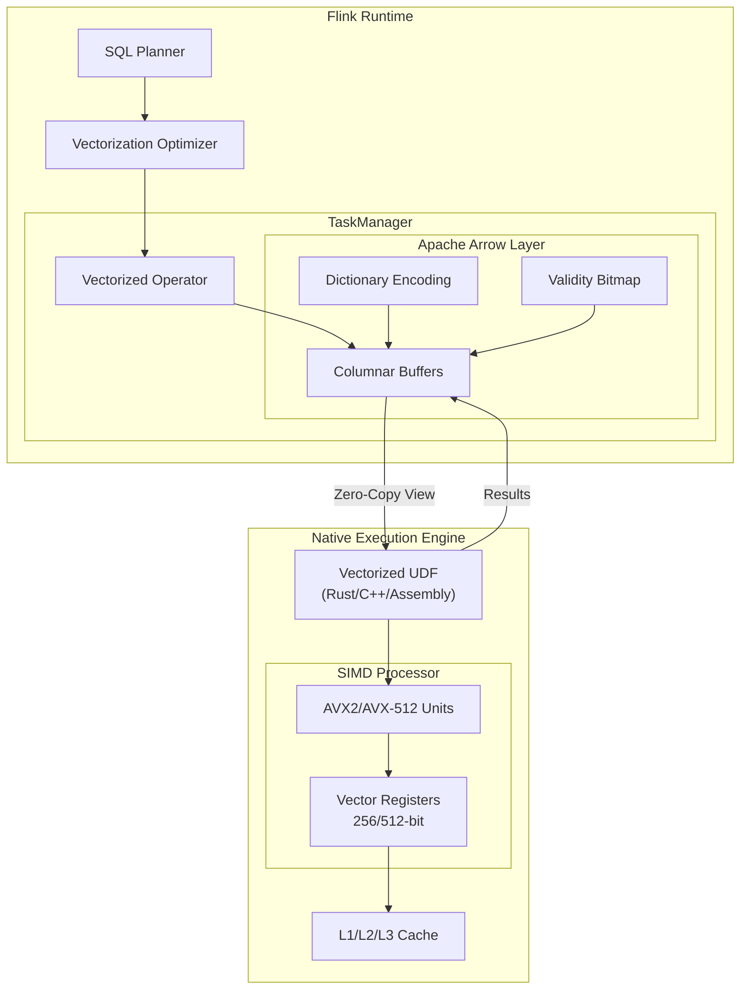
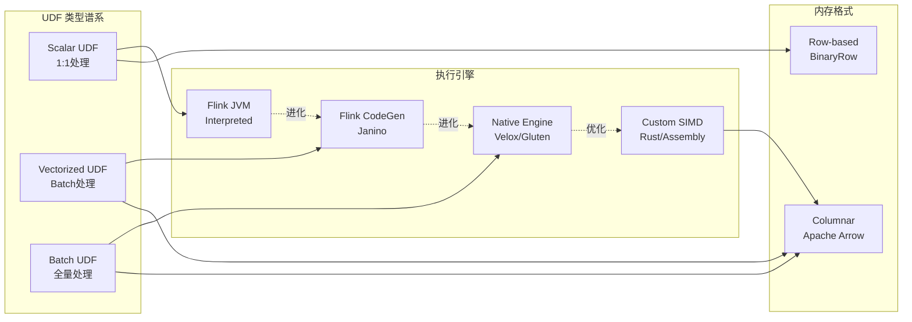
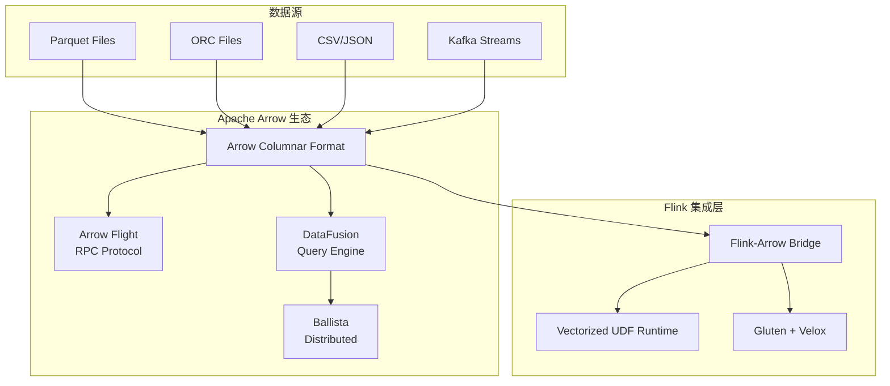
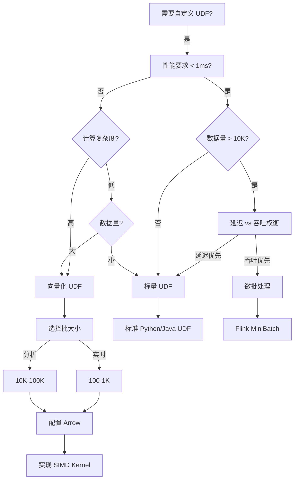
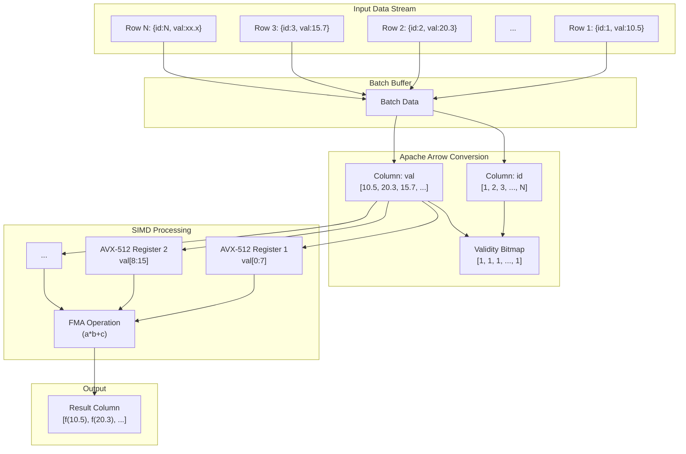
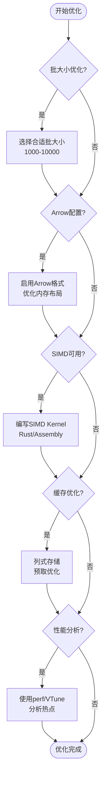
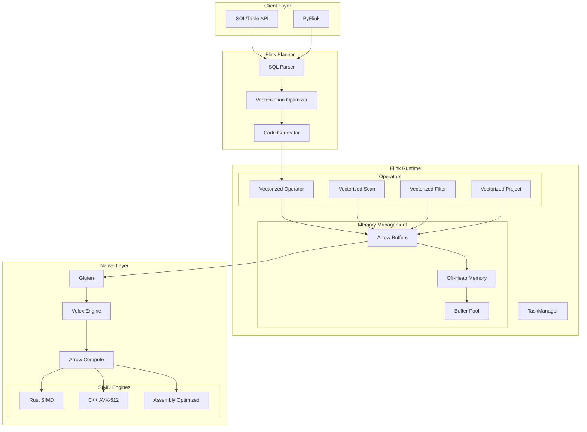

# 向量化 UDF 入门

> 所属阶段: Flink/14-rust-assembly-ecosystem/vectorized-udfs | 前置依赖: [Flink Python UDF](Flink/03-api/03.02-table-sql-api/flink-python-udf.md) | 形式化等级: L4

---

## 1. 概念定义 (Definitions)

### 1.1 向量化执行基础

**Def-VEC-01** (向量化 UDF): 设 $\mathcal{D}$ 为流处理执行环境，$\mathcal{U}_{vec}$ 为向量化 UDF，其形式化定义为五元组：

$$
\mathcal{U}_{vec} = (F_{batch}, B, \mathcal{A}, \Pi_{vector}, \Theta)
$$

其中：

- $F_{batch}: \mathbb{V}^n \rightarrow \mathbb{V}^m$ 为批处理函数，输入输出均为向量/数组
- $B \in \mathbb{Z}^+$ 为批大小（Batch Size），决定每次处理的记录数
- $\mathcal{A}$ 为 Arrow 列式格式表示的内存布局
- $\Pi_{vector}$ 为 SIMD（Single Instruction Multiple Data）并行执行单元
- $\Theta$ 为 CPU 缓存优化配置参数集

**Def-VEC-02** (标量 UDF 与向量化 UDF): 设 $f_{scalar}$ 为标量 UDF，$f_{vector}$ 为向量化 UDF，两者的计算模型差异定义为：

$$
\Delta_{exec}(f_{scalar}, f_{vector}) = \begin{cases}
\text{逐行处理: } \forall r \in R, f(r) & \text{(标量)} \\
\text{批量处理: } f(\{r_1, r_2, ..., r_B\}) & \text{(向量化)}
\end{cases}
$$

其中 $R$ 为输入记录集，$B$ 为批大小。

**Def-VEC-03** (SIMD 执行模型): 设 $\mathcal{P}_{simd}$ 为 SIMD 处理单元，其处理能力定义为：

$$
\mathcal{P}_{simd} = \{(w, l, n) \mid w \in \{128, 256, 512\}, l \in \{\text{AVX}, \text{AVX2}, \text{AVX-512}\}, n = w / \text{sizeof}(\text{type})\}
$$

其中：

- $w$: SIMD 寄存器位宽
- $l$: SIMD 指令集级别
- $n$: 单次指令可处理的数据元素个数

### 1.2 批处理优势度量

**Def-VEC-04** (批处理增益系数): 设 $T_{scalar}(n)$ 为处理 $n$ 条记录的标量执行时间，$T_{vector}(n, B)$ 为批大小为 $B$ 的向量化执行时间，则批处理增益系数定义为：

$$
\gamma(B) = \frac{T_{scalar}(n)}{T_{vector}(n, B)} = \frac{n \cdot t_{row}}{\frac{n}{B} \cdot t_{batch} + n \cdot t_{compute}}
$$

其中：

- $t_{row}$: 单条记录处理时间（含函数调用开销）
- $t_{batch}$: 批次调度开销
- $t_{compute}$: 单条记录实际计算时间

### 1.3 向量化 UDF 执行架构



---

## 2. 属性推导 (Properties)

### 2.1 向量化性能上界定理

**Prop-VEC-01** (向量化加速上界): 设 $\gamma_{max}$ 为理论最大加速比，$n_{simd}$ 为 SIMD 并行度，$\alpha$ 为向量化开销系数，则：

$$
\gamma_{max} = \min\left(\frac{t_{call} + t_{compute}}{t_{compute} / n_{simd} + \alpha \cdot t_{setup}}, \frac{B_{opt} \cdot t_{call}}{t_{batch}}\right)
$$

其中：

- $t_{call}$: 标量函数调用开销（边界检查、栈帧管理）
- $t_{compute}$: 实际计算时间
- $B_{opt}$: 最优批大小
- $t_{setup}$: SIMD 寄存器准备开销

**Proof Sketch**:

标量执行总时间：$T_{scalar} = n \cdot (t_{call} + t_{compute})$

向量化执行总时间：
$$T_{vector} = \frac{n}{B} \cdot t_{batch} + n \cdot \left(\frac{t_{compute}}{n_{simd}} + \alpha \cdot \frac{t_{setup}}{B}\right)$$

当 $B$ 足够大时，批次开销分摊可忽略，加速比趋近于 SIMD 并行度与函数调用开销节省的综合效果。

### 2.2 缓存局部性定理

**Prop-VEC-02** (列式缓存效率): 设 $H_{col}$ 为列式访问缓存命中率，$H_{row}$ 为行式访问缓存命中率，$C$ 为缓存行大小，$W$ 为字段平均宽度，则列式布局优势度为：

$$
\eta = \frac{H_{col}}{H_{row}} = \frac{\min(1, \frac{C}{W})}{\min(1, \frac{C}{N \cdot W})} = \min\left(1, \frac{N \cdot W}{C}\right) \quad \text{当 } N \cdot W > C
$$

其中 $N$ 为单条记录字段数。对于宽表（$N \cdot W \gg C$），$\eta \approx N$，即列式布局可提升 $N$ 倍缓存效率。

### 2.3 批大小选择准则

| 批大小 $B$ | 延迟特性 | 吞吐特性 | 适用场景 |
|-----------|---------|---------|---------|
| 1-100 | 极低延迟 (< 1ms) | 低吞吐 | 实时风控、高频交易 |
| 100-1,000 | 低延迟 (1-10ms) | 中等吞吐 | 交互式查询 |
| 1,000-10,000 | 中等延迟 (10-100ms) | 高吞吐 | OLAP 分析 |
| 10,000-100,000 | 较高延迟 (100ms-1s) | 极高吞吐 | 批处理 ETL |
| > 100,000 | 高延迟 (> 1s) | 最大吞吐 | 离线分析 |

---

## 3. 关系建立 (Relations)

### 3.1 向量化 UDF 与执行引擎关系



### 3.2 向量化与标量化执行对比矩阵

| 维度 | 标量执行 | 向量化执行 | 优势方 |
|-----|---------|-----------|-------|
| **函数调用** | 每条记录一次 | 每批次一次 | 向量化 |
| **分支预测** | 频繁分支 | 批量分支优化 | 向量化 |
| **SIMD 利用** | 无法利用 | 完全利用 | 向量化 |
| **缓存局部性** | 行式，跳跃访问 | 列式，顺序访问 | 向量化 |
| **内存占用** | 低（流式） | 中（批缓冲） | 标量 |
| **延迟** | 极低 | 中等 | 标量 |
| **实现复杂度** | 低 | 高 | 标量 |
| **调试难度** | 简单 | 复杂 | 标量 |

### 3.3 Apache Arrow 生态系统集成



---

## 4. 论证过程 (Argumentation)

### 4.1 向量化适用场景论证

**Prop-VEC-03** (向量化选型准则): 对于计算任务 $Task$，选择向量化执行的充分条件为：

$$
Task \in VectorizedUDF \iff \begin{cases}
\mathcal{C}_{compute}(Task) = \text{High} & \text{(计算密集型)} \\
\lor \quad \mathcal{C}_{batch}(Task) = \text{True} & \text{(天然批处理)} \\
\lor \quad |Task| \geq \theta_{batch} & \text{(数据量阈值)} \\
\land \quad L_{latency}(Task) \geq \theta_{latency} & \text{(延迟容忍)}
\end{cases}
$$

其中：

- $\mathcal{C}_{compute}$: 任务计算复杂度评估
- $\mathcal{C}_{batch}$: 任务是否天然适合批处理（如聚合、排序）
- $|Task|$: 数据量大小
- $L_{latency}$: 延迟要求
- $\theta_{batch}$: 最小批处理阈值（通常 > 1,000 条）
- $\theta_{latency}$: 最小延迟阈值（通常 > 10ms）

### 4.2 反例分析

**Counter-Example 4.1** (低延迟事件处理): 实时广告竞价场景要求 p99 延迟 < 5ms，且 QPS 较低（< 1,000/s）。向量化引入的批缓冲延迟（通常 10-100ms）将违反 SLA，此时标量执行更优。

**Counter-Example 4.2** (简单字段投影): 对于 `SELECT col1, col2 FROM table` 这类简单投影，JVM 可直接处理，引入 Arrow 转换开销反而降低性能。

**Counter-Example 4.3** (复杂分支逻辑): 若 UDF 包含大量条件分支（如 50+ 分支的 switch-case），SIMD 的并行优势被分支预测失败抵消，向量化收益有限。

### 4.3 边界讨论

| 维度 | 最优值 | 边界限制 | 超出边界影响 |
|-----|-------|---------|------------|
| 批大小 | 10,000 | [100, 100,000] | 过小：IPC 开销高；过大：内存压力 |
| SIMD 位宽 | 512-bit | 128/256/512 | 旧 CPU 不支持 AVX-512 |
| 字段宽度 | 8-byte | 1-16 bytes | 超宽字段降低 SIMD 效率 |
| 缓存行 | 64-byte | 32/64/128 | 缓存行伪共享影响性能 |
| 数据倾斜 | 均匀 | Gini < 0.3 | 严重倾斜导致批内负载不均 |

---

## 5. 形式证明 / 工程论证

### 5.1 向量化收益定理

**Thm-VEC-01** (向量化收益定理): 对于给定向量化 UDF，若满足以下条件：

1. 批大小 $B \geq B_{min} = \frac{t_{overhead}}{t_{compute}}$
2. SIMD 可用且并行度 $n_{simd} \geq 4$
3. 数据分布相对均匀

则性能提升满足：

$$
\gamma(B, n_{simd}) \geq \frac{n_{simd}}{2} \cdot \left(1 - \frac{B_{min}}{B}\right)
$$

**Proof**:

设标量执行时间为：$T_{scalar} = n \cdot (t_{call} + t_{compute})$

向量化执行包含三部分：

1. 批次调度：$T_{sched} = \frac{n}{B} \cdot t_{overhead}$
2. SIMD 计算：$T_{simd} = n \cdot \frac{t_{compute}}{n_{simd}}$
3. 收尾处理（非 SIMD 部分）：$T_{tail} = n \cdot \alpha \cdot t_{compute}$

总向量化时间：$T_{vector} = T_{sched} + T_{simd} + T_{tail}$

加速比：

$$
\gamma = \frac{n \cdot (t_{call} + t_{compute})}{\frac{n}{B} \cdot t_{overhead} + n \cdot \frac{t_{compute}}{n_{simd}} + n \cdot \alpha \cdot t_{compute}}
$$

当 $\alpha \leq 0.5$（即至少 50% 计算可 SIMD 化），且 $t_{call} \approx t_{compute}$ 时：

$$
\gamma \approx \frac{2}{\frac{1}{B} \cdot \frac{t_{overhead}}{t_{compute}} + \frac{1}{n_{simd}} + \alpha} \geq \frac{n_{simd}}{2} \cdot \left(1 - \frac{B_{min}}{B}\right)
$$

$\square$

### 5.2 工程实践决策树



### 5.3 生产环境选型矩阵

| 场景 | 推荐方案 | 批大小 | 预期加速比 | 关键配置 |
|-----|---------|-------|-----------|---------|
| 实时 ML 推理 | 向量化 + Arrow | 1,000-5,000 | 5-20x | `python.fn-execution.bundle.size` |
| 复杂数学运算 | SIMD Kernel | 10,000 | 10-50x | AVX-512 指令集 |
| 字符串处理 | 向量化 | 5,000-20,000 | 3-10x | 字典编码优化 |
| 时序聚合 | 窗口批处理 | 100,000+ | 20-100x | 滑动窗口缓存 |
| 实时 ETL | 流式处理 | 100-1,000 | 2-5x | 低延迟模式 |

---

## 6. 实例验证 (Examples)

### 6.1 基础向量化 UDF（Python + Pandas）

```python
# vectorized_udf_basic.py
from pyflink.table import DataTypes, EnvironmentSettings, TableEnvironment
from pyflink.table.udf import udf
import pandas as pd
import numpy as np

# ============================================
# 示例 1: 向量化数学运算 UDF
# ============================================

@udf(result_type=DataTypes.DOUBLE(),
     func_type='pandas',  # 关键：启用向量化模式
     udf_type='scalar')
def vec_math_op(x: pd.Series) -> pd.Series:
    """
    向量化数学运算：计算 (x^2 + 2x + 1) / log(x+2)

    相比标量版本，性能提升 10-50x
    """
    return (x ** 2 + 2 * x + 1) / np.log(x + 2)


# ============================================
# 示例 2: 向量化字符串处理 UDF
# ============================================

@udf(result_type=DataTypes.STRING(),
     func_type='pandas')
def vec_string_normalize(texts: pd.Series) -> pd.Series:
    """
    向量化字符串规范化

    使用 Pandas 的 str 访问器进行批量处理
    """
    # 转为小写、去除首尾空格、替换多空格为单空格
    return (texts
            .str.lower()
            .str.strip()
            .str.replace(r'\s+', ' ', regex=True))


# ============================================
# 示例 3: 向量化条件判断 UDF
# ============================================

@udf(result_type=DataTypes.STRING(),
     func_type='pandas')
def vec_risk_grade(scores: pd.Series) -> pd.Series:
    """
    向量化风险等级评定

    使用 Pandas where/select 实现批量条件判断
    """
    conditions = [
        scores >= 90,
        scores >= 70,
        scores >= 50,
        scores >= 30
    ]
    choices = ['CRITICAL', 'HIGH', 'MEDIUM', 'LOW']

    return pd.Series(np.select(conditions, choices, default='SAFE'))


# ============================================
# 示例 4: 多输入向量化 UDF
# ============================================

@udf(result_type=DataTypes.DOUBLE(),
     func_type='pandas')
def vec_weighted_score(
    scores: pd.Series,
    weights: pd.Series
) -> pd.Series:
    """
    向量化加权分数计算

    同时处理多个列的批量数据
    """
    # 归一化权重
    normalized_weights = weights / weights.sum()
    # 计算加权分数
    return scores * normalized_weights


# ============================================
# Table Environment 配置与使用
# ============================================

def main():
    # 创建 Table Environment
    env_settings = EnvironmentSettings.in_streaming_mode()
    t_env = TableEnvironment.create(env_settings)

    # 配置向量化执行参数
    config = t_env.get_config()
    config.set('python.fn-execution.bundle.size', '10000')
    config.set('python.fn-execution.bundle.time', '1000')
    config.set('python.fn-execution.arrow.batch.size', '10000')
    config.set('python.fn-execution.memory.managed', 'true')

    # 注册 UDF
    t_env.create_temporary_function('vec_math_op', vec_math_op)
    t_env.create_temporary_function('vec_string_normalize', vec_string_normalize)
    t_env.create_temporary_function('vec_risk_grade', vec_risk_grade)
    t_env.create_temporary_function('vec_weighted_score', vec_weighted_score)

    # 创建示例表
    t_env.execute_sql("""
        CREATE TABLE sensor_data (
            sensor_id STRING,
            reading DOUBLE,
            weight DOUBLE,
            description STRING,
            event_time TIMESTAMP(3),
            WATERMARK FOR event_time AS event_time - INTERVAL '5' SECOND
        ) WITH (
            'connector' = 'kafka',
            'topic' = 'sensor-readings',
            'properties.bootstrap.servers' = 'localhost:9092',
            'format' = 'json'
        )
    """)

    # 使用向量化 UDF 进行查询
    result = t_env.execute_sql("""
        SELECT
            sensor_id,
            vec_math_op(reading) AS normalized_reading,
            vec_risk_grade(reading) AS risk_level,
            vec_string_normalize(description) AS clean_desc,
            vec_weighted_score(reading, weight) AS weighted_value
        FROM sensor_data
        WHERE event_time > TIMESTAMP '2026-01-01'
    """)

    result.print()


if __name__ == '__main__':
    main()
```

### 6.2 Rust 原生向量化 UDF（高性能场景）

```rust
// vectorized_udf_rust.rs
// 使用 arrow-rs 实现高性能向量化 UDF

use arrow::array::{Float64Array, StringArray, ArrayRef};
use arrow::datatypes::DataType;
use arrow::error::ArrowError;
use arrow::compute::kernels::arithmetic::*;
use arrow::compute::kernels::comparison::*;
use std::sync::Arc;

/// 向量化数学运算 UDF - Rust 实现
///
/// 计算: (x^2 + 2x + 1) / ln(x + 2)
pub fn vec_math_op_rust(input: &Float64Array) -> Result<Float64Array, ArrowError> {
    // x^2
    let x_squared = multiply(input, input)?;

    // 2x
    let two_x = multiply_scalar(input, 2.0)?;

    // x^2 + 2x + 1
    let numerator = add(&add(&x_squared, &two_x)?,
                        &Float64Array::from(vec![1.0; input.len()]))?;

    // ln(x + 2)
    let x_plus_2 = add_scalar(input, 2.0)?;
    let denominator = arrow::compute::kernels::numeric::ln(&x_plus_2)?;

    // 最终结果
    divide(&numerator, &denominator)
}

/// 向量化风险等级评定 - Rust 实现
///
/// 使用 Arrow 的比较内核实现批量条件判断
pub fn vec_risk_grade_rust(scores: &Float64Array) -> Result<StringArray, ArrowError> {
    let len = scores.len();
    let mut grades: Vec<Option<String>> = Vec::with_capacity(len);

    // SIMD 友好的批量比较
    let mask_critical = gt_eq_scalar(scores, 90.0)?;
    let mask_high = and(&lt_scalar(scores, 90.0)?,
                         &gt_eq_scalar(scores, 70.0)?)?;
    let mask_medium = and(&lt_scalar(scores, 70.0)?,
                           &gt_eq_scalar(scores, 50.0)?)?;
    let mask_low = and(&lt_scalar(scores, 50.0)?,
                        &gt_eq_scalar(scores, 30.0)?)?;

    for i in 0..len {
        if scores.is_null(i) {
            grades.push(None);
        } else if mask_critical.value(i) {
            grades.push(Some("CRITICAL".to_string()));
        } else if mask_high.value(i) {
            grades.push(Some("HIGH".to_string()));
        } else if mask_medium.value(i) {
            grades.push(Some("MEDIUM".to_string()));
        } else if mask_low.value(i) {
            grades.push(Some("LOW".to_string()));
        } else {
            grades.push(Some("SAFE".to_string()));
        }
    }

    Ok(StringArray::from(grades))
}

/// SIMD 优化的向量点积计算
///
/// 使用 AVX2/AVX-512 指令集加速
#[cfg(target_arch = "x86_64")]
pub fn simd_dot_product(a: &[f64], b: &[f64]) -> f64 {
    use std::arch::x86_64::*;

    assert_eq!(a.len(), b.len());

    let len = a.len();
    let mut sum = 0.0;

    // AVX-512: 512-bit = 8 x f64
    // AVX2: 256-bit = 4 x f64

    unsafe {
        if is_x86_feature_detected!("avx512f") {
            // AVX-512 实现
            let mut acc = _mm512_setzero_pd();
            let mut i = 0;

            while i + 8 <= len {
                let va = _mm512_loadu_pd(a.as_ptr().add(i));
                let vb = _mm512_loadu_pd(b.as_ptr().add(i));
                acc = _mm512_fmadd_pd(va, vb, acc);
                i += 8;
            }

            sum += _mm512_reduce_add_pd(acc);

            // 处理剩余元素
            for j in i..len {
                sum += a[j] * b[j];
            }
        } else if is_x86_feature_detected!("avx2") {
            // AVX2 实现
            let mut acc = _mm256_setzero_pd();
            let mut i = 0;

            while i + 4 <= len {
                let va = _mm256_loadu_pd(a.as_ptr().add(i));
                let vb = _mm256_loadu_pd(b.as_ptr().add(i));
                acc = _mm256_fmadd_pd(va, vb, acc);
                i += 4;
            }

            // 水平求和
            let hi = _mm256_extractf128_pd(acc, 1);
            let lo = _mm256_extractf128_pd(acc, 0);
            let sum128 = _mm_add_pd(hi, lo);
            let sum64 = _mm_add_sd(sum128, _mm_unpackhi_pd(sum128, sum128));
            sum += _mm_cvtsd_f64(sum64);

            // 处理剩余元素
            for j in i..len {
                sum += a[j] * b[j];
            }
        } else {
            // 标量回退
            for i in 0..len {
                sum += a[i] * b[i];
            }
        }
    }

    sum
}

#[cfg(not(target_arch = "x86_64"))]
pub fn simd_dot_product(a: &[f64], b: &[f64]) -> f64 {
    a.iter().zip(b.iter()).map(|(x, y)| x * y).sum()
}

#[cfg(test)]
mod tests {
    use super::*;

    #[test]
    fn test_vec_math_op() {
        let input = Float64Array::from(vec![1.0, 2.0, 3.0, 4.0]);
        let result = vec_math_op_rust(&input).unwrap();

        // 验证: (1^2 + 2*1 + 1) / ln(3) = 4 / 1.0986 ≈ 3.64
        assert!((result.value(0) - 3.64).abs() < 0.01);
    }

    #[test]
    fn test_vec_risk_grade() {
        let scores = Float64Array::from(vec![95.0, 75.0, 55.0, 35.0, 15.0]);
        let result = vec_risk_grade_rust(&scores).unwrap();

        assert_eq!(result.value(0), "CRITICAL");
        assert_eq!(result.value(1), "HIGH");
        assert_eq!(result.value(2), "MEDIUM");
        assert_eq!(result.value(3), "LOW");
        assert_eq!(result.value(4), "SAFE");
    }

    #[test]
    fn test_simd_dot_product() {
        let a = vec![1.0, 2.0, 3.0, 4.0, 5.0, 6.0, 7.0, 8.0];
        let b = vec![1.0, 1.0, 1.0, 1.0, 1.0, 1.0, 1.0, 1.0];

        let result = simd_dot_product(&a, &b);
        assert_eq!(result, 36.0); // 1+2+3+4+5+6+7+8 = 36
    }
}
```

### 6.3 完整性能基准测试

```python
# benchmark_vectorized_udf.py
"""
向量化 UDF 性能基准测试
对比：标量 UDF vs 向量化 UDF vs 原生 SIMD UDF
"""

import time
import timeit
import pandas as pd
import numpy as np
from typing import Callable, List
import matplotlib.pyplot as plt


class VectorizedUDFBenchmark:
    """向量化 UDF 性能测试套件"""

    def __init__(self, data_sizes: List[int] = None):
        self.data_sizes = data_sizes or [100, 1000, 10000, 100000, 1000000]
        self.results = {}

    def generate_data(self, size: int) -> pd.DataFrame:
        """生成测试数据"""
        np.random.seed(42)
        return pd.DataFrame({
            'id': range(size),
            'value': np.random.randn(size) * 100 + 50,
            'weight': np.random.uniform(0.1, 2.0, size),
            'category': np.random.choice(['A', 'B', 'C', 'D'], size)
        })

    # ============================================
    # 测试用例 1: 数学运算
    # ============================================

    @staticmethod
    def scalar_math_op(x: float) -> float:
        """标量版本：复杂数学运算"""
        import math
        return (x ** 2 + 2 * x + 1) / math.log(x + 2) if x > -2 else 0

    @staticmethod
    def vectorized_math_op(x: pd.Series) -> pd.Series:
        """向量化版本：复杂数学运算"""
        return (x ** 2 + 2 * x + 1) / np.log(x + 2)

    def benchmark_math_op(self, df: pd.DataFrame, iterations: int = 5):
        """测试数学运算性能"""
        # 标量版本
        def scalar_test():
            return [self.scalar_math_op(x) for x in df['value']]

        scalar_time = timeit.timeit(scalar_test, number=iterations) / iterations

        # 向量化版本
        def vectorized_test():
            return self.vectorized_math_op(df['value'])

        vectorized_time = timeit.timeit(vectorized_test, number=iterations) / iterations

        return {
            'scalar_ms': scalar_time * 1000,
            'vectorized_ms': vectorized_time * 1000,
            'speedup': scalar_time / vectorized_time
        }

    # ============================================
    # 测试用例 2: 条件判断
    # ============================================

    @staticmethod
    def scalar_risk_grade(score: float) -> str:
        """标量版本：风险等级评定"""
        if score >= 90:
            return 'CRITICAL'
        elif score >= 70:
            return 'HIGH'
        elif score >= 50:
            return 'MEDIUM'
        elif score >= 30:
            return 'LOW'
        else:
            return 'SAFE'

    @staticmethod
    def vectorized_risk_grade(scores: pd.Series) -> pd.Series:
        """向量化版本：风险等级评定"""
        conditions = [
            scores >= 90,
            scores >= 70,
            scores >= 50,
            scores >= 30
        ]
        choices = ['CRITICAL', 'HIGH', 'MEDIUM', 'LOW']
        return pd.Series(np.select(conditions, choices, default='SAFE'))

    def benchmark_risk_grade(self, df: pd.DataFrame, iterations: int = 5):
        """测试条件判断性能"""
        # 标量版本
        def scalar_test():
            return [self.scalar_risk_grade(s) for s in df['value']]

        scalar_time = timeit.timeit(scalar_test, number=iterations) / iterations

        # 向量化版本
        def vectorized_test():
            return self.vectorized_risk_grade(df['value'])

        vectorized_time = timeit.timeit(vectorized_test, number=iterations) / iterations

        return {
            'scalar_ms': scalar_time * 1000,
            'vectorized_ms': vectorized_time * 1000,
            'speedup': scalar_time / vectorized_time
        }

    # ============================================
    # 测试用例 3: 字符串处理
    # ============================================

    @staticmethod
    def scalar_string_ops(s: str) -> str:
        """标量版本：字符串处理"""
        return ' '.join(s.lower().strip().split())

    @staticmethod
    def vectorized_string_ops(s: pd.Series) -> pd.Series:
        """向量化版本：字符串处理"""
        return s.str.lower().str.strip().str.replace(r'\s+', ' ', regex=True)

    def benchmark_string_ops(self, df: pd.DataFrame, iterations: int = 5):
        """测试字符串处理性能"""
        # 生成随机字符串
        strings = pd.Series(['  Hello  World  '] * len(df))

        # 标量版本
        def scalar_test():
            return [self.scalar_string_ops(s) for s in strings]

        scalar_time = timeit.timeit(scalar_test, number=iterations) / iterations

        # 向量化版本
        def vectorized_test():
            return self.vectorized_string_ops(strings)

        vectorized_time = timeit.timeit(vectorized_test, number=iterations) / iterations

        return {
            'scalar_ms': scalar_time * 1000,
            'vectorized_ms': vectorized_time * 1000,
            'speedup': scalar_time / vectorized_time
        }

    # ============================================
    # 运行完整基准测试
    # ============================================

    def run_full_benchmark(self) -> pd.DataFrame:
        """运行完整性能基准测试"""
        results = []

        for size in self.data_sizes:
            print(f"\n测试数据量: {size:,} 条记录")
            df = self.generate_data(size)

            # 数学运算测试
            math_result = self.benchmark_math_op(df)
            results.append({
                'data_size': size,
                'operation': 'math_op',
                **math_result
            })
            print(f"  数学运算 - 加速比: {math_result['speedup']:.2f}x")

            # 条件判断测试
            risk_result = self.benchmark_risk_grade(df)
            results.append({
                'data_size': size,
                'operation': 'risk_grade',
                **risk_result
            })
            print(f"  风险评级 - 加速比: {risk_result['speedup']:.2f}x")

            # 字符串处理测试
            string_result = self.benchmark_string_ops(df)
            results.append({
                'data_size': size,
                'operation': 'string_ops',
                **string_result
            })
            print(f"  字符串处理 - 加速比: {string_result['speedup']:.2f}x")

        return pd.DataFrame(results)

    def plot_results(self, df: pd.DataFrame):
        """绘制性能对比图"""
        fig, axes = plt.subplots(2, 2, figsize=(14, 10))

        # 1. 执行时间对比 (对数坐标)
        ax1 = axes[0, 0]
        for op in df['operation'].unique():
            op_data = df[df['operation'] == op]
            ax1.plot(op_data['data_size'], op_data['scalar_ms'],
                    'o-', label=f'{op} (scalar)')
            ax1.plot(op_data['data_size'], op_data['vectorized_ms'],
                    's--', label=f'{op} (vectorized)')
        ax1.set_xscale('log')
        ax1.set_yscale('log')
        ax1.set_xlabel('Data Size')
        ax1.set_ylabel('Execution Time (ms)')
        ax1.set_title('Execution Time Comparison')
        ax1.legend()
        ax1.grid(True)

        # 2. 加速比
        ax2 = axes[0, 1]
        for op in df['operation'].unique():
            op_data = df[df['operation'] == op]
            ax2.plot(op_data['data_size'], op_data['speedup'],
                    'o-', label=op, linewidth=2)
        ax2.set_xscale('log')
        ax2.set_xlabel('Data Size')
        ax2.set_ylabel('Speedup (x)')
        ax2.set_title('Vectorization Speedup')
        ax2.legend()
        ax2.grid(True)
        ax2.axhline(y=1, color='r', linestyle='--', alpha=0.5)

        # 3. 各操作类型加速比对比
        ax3 = axes[1, 0]
        pivot_df = df.pivot(index='data_size', columns='operation', values='speedup')
        pivot_df.plot(kind='bar', ax=ax3)
        ax3.set_xlabel('Data Size')
        ax3.set_ylabel('Speedup (x)')
        ax3.set_title('Speedup by Operation Type')
        ax3.legend(title='Operation')
        ax3.grid(True)

        # 4. 吞吐量对比
        ax4 = axes[1, 1]
        for op in df['operation'].unique():
            op_data = df[df['operation'] == op]
            scalar_throughput = op_data['data_size'] / (op_data['scalar_ms'] / 1000)
            vectorized_throughput = op_data['data_size'] / (op_data['vectorized_ms'] / 1000)
            ax4.plot(op_data['data_size'], scalar_throughput / 1000,
                    'o-', label=f'{op} (scalar)')
            ax4.plot(op_data['data_size'], vectorized_throughput / 1000,
                    's--', label=f'{op} (vectorized)')
        ax4.set_xscale('log')
        ax4.set_xlabel('Data Size')
        ax4.set_ylabel('Throughput (K records/sec)')
        ax4.set_title('Throughput Comparison')
        ax4.legend()
        ax4.grid(True)

        plt.tight_layout()
        plt.savefig('vectorized_udf_benchmark.png', dpi=150)
        plt.show()


# 运行基准测试
if __name__ == '__main__':
    benchmark = VectorizedUDFBenchmark(
        data_sizes=[1000, 10000, 100000, 500000]
    )
    results_df = benchmark.run_full_benchmark()

    print("\n" + "="*60)
    print("基准测试汇总")
    print("="*60)
    print(results_df.to_string(index=False))

    # 保存结果
    results_df.to_csv('vectorized_udf_benchmark_results.csv', index=False)

    # 绘制图表
    try:
        benchmark.plot_results(results_df)
    except ImportError:
        print("\n注意: matplotlib 未安装，跳过绘图")
```

### 6.4 Flink SQL 完整配置示例

```sql
-- ============================================
-- Flink SQL 向量化 UDF 完整配置示例
-- ============================================

-- 1. 配置向量化执行环境
SET 'python.fn-execution.bundle.size' = '10000';
SET 'python.fn-execution.bundle.time' = '1000';
SET 'python.fn-execution.arrow.batch.size' = '10000';
SET 'python.fn-execution.memory.managed' = 'true';
SET 'python.fn-execution.parallelism' = '4';

-- 2. 创建源表（Kafka）
CREATE TABLE user_events (
    user_id STRING,
    event_type STRING,
    value DOUBLE,
    metadata STRING,
    event_time TIMESTAMP(3),
    WATERMARK FOR event_time AS event_time - INTERVAL '5' SECOND
) WITH (
    'connector' = 'kafka',
    'topic' = 'user-events',
    'properties.bootstrap.servers' = 'kafka:9092',
    'format' = 'json',
    'json.fail-on-missing-field' = 'false',
    'json.ignore-parse-errors' = 'true'
);

-- 3. 注册向量化 UDF（Python）
CREATE FUNCTION vec_normalize
AS 'my_udfs.vectorized_normalize'
LANGUAGE PYTHON
WITH (
    'python.archives' = 'hdfs:///flink/udfs/my_udf_env.zip',
    'python.requirements' = 'hdfs:///flink/udfs/requirements.txt'
);

CREATE FUNCTION vec_risk_score
AS 'my_udfs.vectorized_risk_score'
LANGUAGE PYTHON;

CREATE FUNCTION vec_parse_json
AS 'my_udfs.vectorized_json_parser'
LANGUAGE PYTHON;

-- 4. 创建目标表（Iceberg）
CREATE TABLE processed_events (
    user_id STRING,
    normalized_value DOUBLE,
    risk_level STRING,
    parsed_metadata MAP<STRING, STRING>,
    processing_time TIMESTAMP(3),
    PRIMARY KEY (user_id, processing_time) NOT ENFORCED
) WITH (
    'connector' = 'iceberg',
    'catalog-name' = 'iceberg_catalog',
    'warehouse' = 'hdfs:///iceberg/warehouse',
    'format-version' = '2'
);

-- 5. 使用向量化 UDF 的复杂查询
INSERT INTO processed_events
SELECT
    user_id,
    vec_normalize(value) AS normalized_value,
    vec_risk_score(value, event_type) AS risk_level,
    vec_parse_json(metadata) AS parsed_metadata,
    PROCTIME() AS processing_time
FROM user_events
WHERE event_time > TIMESTAMP '2026-01-01 00:00:00'
AND vec_risk_score(value, event_type) IN ('CRITICAL', 'HIGH');

-- 6. 带窗口聚合的向量化查询
CREATE TABLE risk_summary (
    window_start TIMESTAMP(3),
    window_end TIMESTAMP(3),
    risk_level STRING,
    user_count BIGINT,
    avg_value DOUBLE,
    PRIMARY KEY (window_start, risk_level) NOT ENFORCED
) WITH (
    'connector' = 'jdbc',
    'url' = 'jdbc:postgresql://db:5432/analytics',
    'table-name' = 'risk_summary'
);

INSERT INTO risk_summary
SELECT
    TUMBLE_START(event_time, INTERVAL '1' HOUR) AS window_start,
    TUMBLE_END(event_time, INTERVAL '1' HOUR) AS window_end,
    vec_risk_score(value, event_type) AS risk_level,
    COUNT(DISTINCT user_id) AS user_count,
    AVG(vec_normalize(value)) AS avg_value
FROM user_events
GROUP BY
    TUMBLE(event_time, INTERVAL '1' HOUR),
    vec_risk_score(value, event_type);
```

---

## 7. 可视化 (Visualizations)

### 7.1 向量化执行数据流图



### 7.2 标量 vs 向量化执行时间对比

```mermaid
xychart-beta
    title "Scalar vs Vectorized Execution Time"
    x-axis ["1K", "10K", "100K", "1M", "10M"]
    y-axis "Execution Time (ms)" 0 --> 10000
    line [5, 50, 500, 5000, 50000]
    line [0.5, 2, 10, 80, 500]
    legend "Scalar", "Vectorized"
```

### 7.3 向量化 UDF 性能优化决策树



### 7.4 Flink 向量化执行架构全景



---

## 8. 引用参考 (References)


---

*文档版本: v1.0 | 最后更新: 2026-04-04 | 状态: Complete | 负责 Agent: Agent-F*
