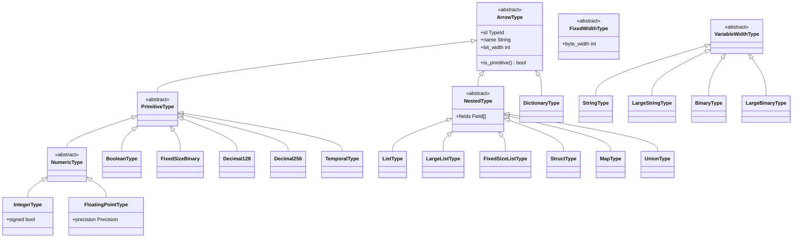
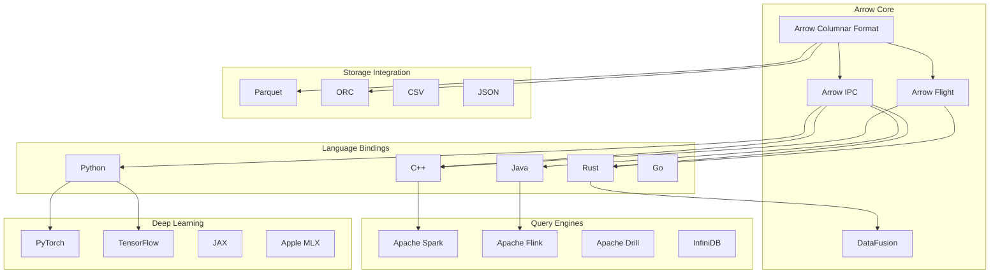
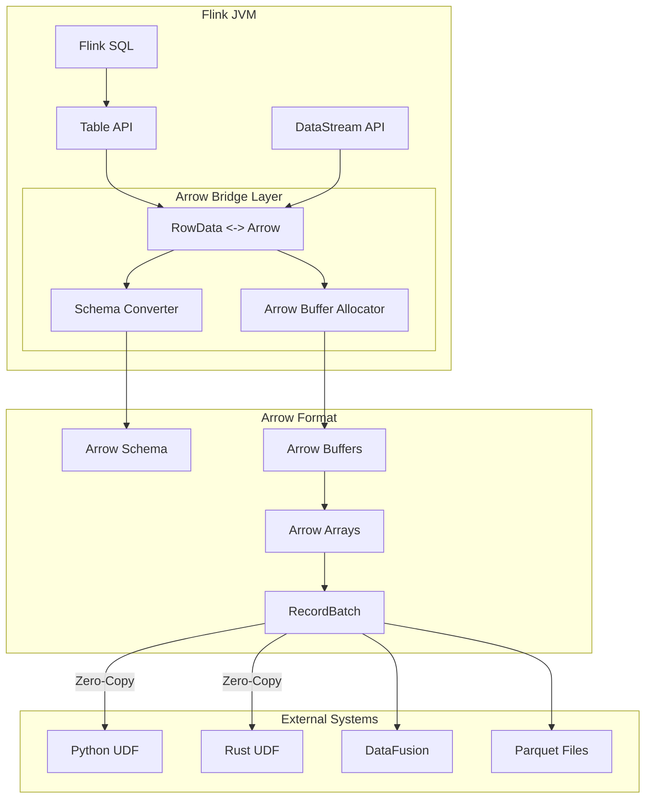
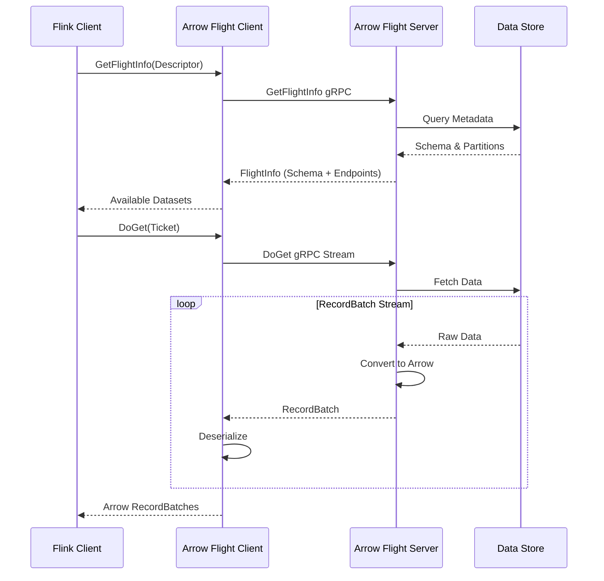
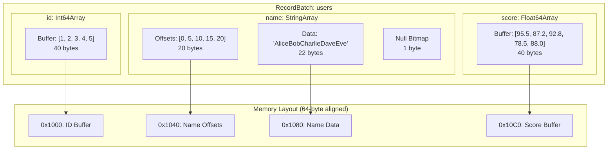
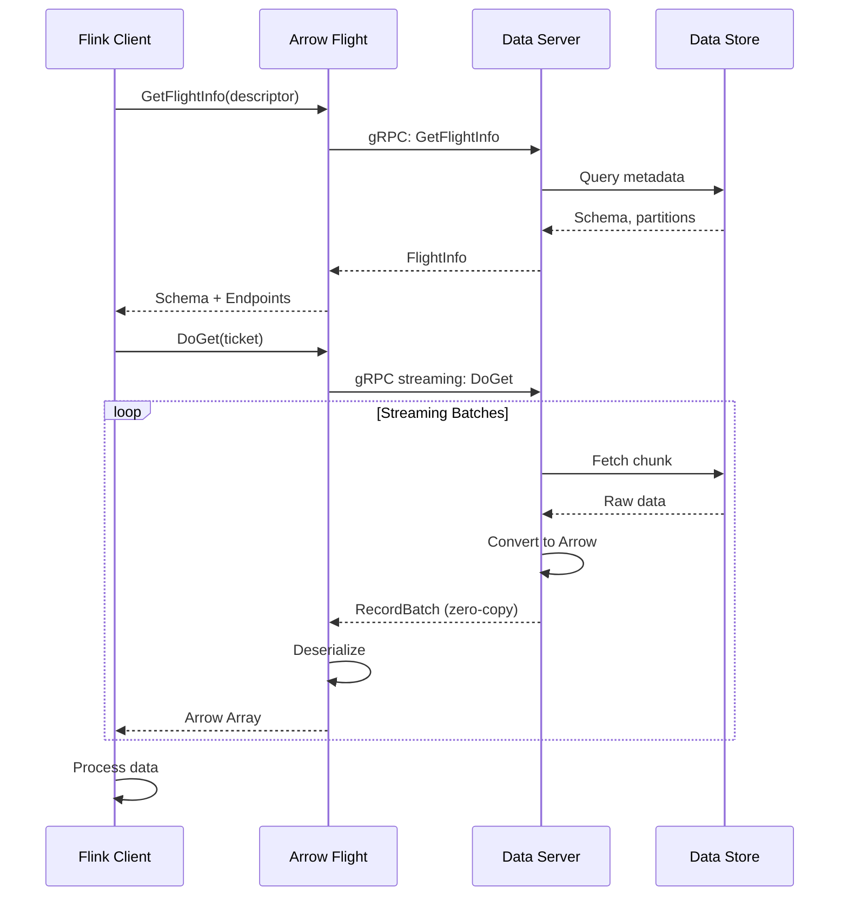
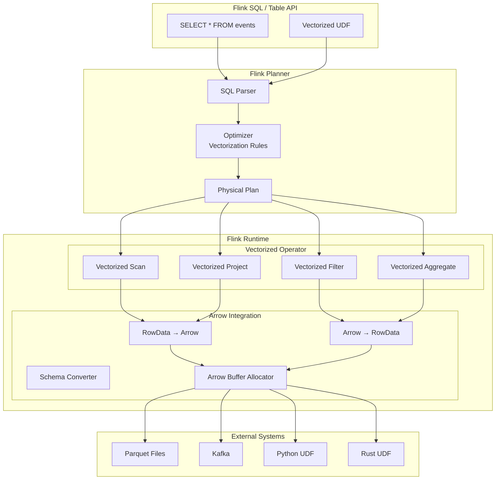

# Apache Arrow 格式集成

> 所属阶段: Flink/14-rust-assembly-ecosystem/vectorized-udfs | 前置依赖: [01-vectorized-udf-intro](./01-vectorized-udf-intro.md) | 形式化等级: L4

---

## 1. 概念定义 (Definitions)

### 1.1 Arrow 列式格式基础

**Def-VEC-05** (Arrow 列式格式): Apache Arrow 是一种跨平台的列式内存格式，形式化定义为六元组：

$$
\mathcal{A}_{arrow} = (S, L, B, D, N, V)
$$

其中：

- $S$: Schema 定义（字段名、数据类型、可空性）
- $L$: 逻辑类型系统（Logical Types）
- $B$: 物理内存布局（Buffers）
- $D$: 字典编码（Dictionary Encoding）
- $N$: 空值表示（Null Bitmap）
- $V$: 版本兼容性（Format Version）

**Def-VEC-06** (列式内存布局): 设 $R = \{r_1, r_2, ..., r_n\}$ 为包含 $m$ 个字段的记录集，列式布局 $L_{col}$ 与行式布局 $L_{row}$ 的存储差异定义为：

$$
L_{col} = \{(c_1, c_2, ..., c_m) \mid c_j = [v_{1j}, v_{2j}, ..., v_{nj}]\}
$$

$$
L_{row} = \{([v_{i1}, v_{i2}, ..., v_{im}]) \mid i = 1, ..., n\}
$$

其中 $v_{ij}$ 表示第 $i$ 条记录的第 $j$ 个字段值。

**Def-VEC-07** (Arrow Buffer): Arrow Buffer 是 Arrow 的最小存储单元，定义为三元组：

$$
\mathcal{B}_{arrow} = (addr, len, cap)
$$

其中：

- $addr$: 内存起始地址（64-bit 对齐）
- $len$: 有效数据长度（字节）
- $cap$: 容量（字节），满足 $cap \geq len$ 且 $cap = 2^k$（2的幂次对齐）

### 1.2 Arrow Flight 协议

**Def-VEC-08** (Arrow Flight Protocol): Arrow Flight 是基于 gRPC 的高性能数据传输协议，定义为：

$$
\mathcal{F}_{flight} = (RPC, Stream, Schema, Location, Ticket, Descriptor)
$$

其中：

- $RPC$: gRPC 服务定义（`DoGet`, `DoPut`, `DoExchange`, `GetSchema`, `ListFlights`, `GetFlightInfo`）
- $Stream$: 记录批次流（RecordBatch Stream）
- $Schema$: 航班信息（FlightInfo）与数据模式
- $Location$: 服务端点 URI
- $Ticket$: 数据访问凭证
- $Descriptor$: 数据集描述符（路径或命令）

### 1.3 Arrow 类型系统



---

## 2. 属性推导 (Properties)

### 2.1 零拷贝共享定理

**Prop-VEC-04** (零拷贝共享): 设 $D$ 为数据集，$P_1$ 和 $P_2$ 为两个进程，Arrow 列式格式支持零拷贝共享的条件为：

$$
\text{ZeroCopy}(D, P_1, P_2) \iff \begin{cases}
\text{Addr}(D) \in \text{SharedMemory}(P_1, P_2) & \text{(共享内存)} \\
\land \quad \text{Aligned}(D, 64) & \text{(64字节对齐)} \\
\land \quad \text{Immutable}(D) & \text{(不可变性)}
\end{cases}
$$

在此条件下，数据传输成本 $C_{transfer} = O(1)$（仅需传递指针），而非 $O(|D|)$。

### 2.2 缓存局部性定理

**Prop-VEC-05** (列式缓存效率): 对于分析型查询（通常访问少数列），列式布局的缓存命中率 $H_{col}$ 与行式布局的 $H_{row}$ 满足：

$$
\frac{H_{col}}{H_{row}} = \frac{N_{proj}}{N_{total}} \cdot \frac{C_{line}}{W_{field}}
$$

其中：

- $N_{proj}$: 查询投影的列数
- $N_{total}$: 总列数
- $C_{line}$: 缓存行大小（通常为 64 bytes）
- $W_{field}$: 单个字段宽度

对于典型的 $N_{proj} \ll N_{total}$ 的分析查询，列式布局可提升 $10\times$ 至 $100\times$ 缓存效率。

### 2.3 类型兼容矩阵

| Flink SQL Type | Arrow Type | 物理布局 | 备注 |
|---------------|------------|---------|------|
| `BOOLEAN` | `Bool` | 1-bit 紧凑 | Bitmap 编码 |
| `TINYINT` | `Int8` | 1 byte | 有符号 |
| `SMALLINT` | `Int16` | 2 bytes | 小端序 |
| `INT` | `Int32` | 4 bytes | 小端序 |
| `BIGINT` | `Int64` | 8 bytes | 小端序 |
| `FLOAT` | `Float` | 4 bytes | IEEE 754 |
| `DOUBLE` | `Double` | 8 bytes | IEEE 754 |
| `DECIMAL(p,s)` | `Decimal128/256` | 16/32 bytes | 定点数 |
| `VARCHAR(n)` | `Utf8` | 变长 + 偏移 | UTF-8 编码 |
| `VARBINARY(n)` | `Binary` | 变长 + 偏移 | 原始字节 |
| `DATE` | `Date32` | 4 bytes | 1970-01-01 起的天数 |
| `TIME(n)` | `Time64` | 8 bytes | 纳秒精度 |
| `TIMESTAMP(n)` | `Timestamp` | 8 bytes | 纳秒/微秒 |
| `ARRAY<t>` | `List` | 偏移 + 子数组 | 嵌套结构 |
| `MAP<k,v>` | `Map` | 结构体列表 | 键值对 |
| `ROW<...>` | `Struct` | 多列组合 | 命名字段 |

---

## 3. 关系建立 (Relations)

### 3.1 Arrow 生态系统集成图谱



### 3.2 Flink-Arrow 集成架构



### 3.3 Arrow Flight 服务调用关系



---

## 4. 论证过程 (Argumentation)

### 4.1 Arrow 选型论证

**Prop-VEC-06** (Arrow 选型准则): 对于数据交换场景 $S$，选择 Arrow 作为中间格式的充分条件：

$$
S \in ArrowSuitable \iff \begin{cases}
\exists L \in \{Python, Java, C++, Rust, Go\} : \text{Use}(S, L) & \text{(多语言需求)} \\
\lor \quad \mathcal{C}_{analytics}(S) = \text{True} & \text{(分析型负载)} \\
\lor \quad \text{Throughput}(S) \geq 100MB/s & \text{(高吞吐需求)} \\
\land \quad \text{Latency}(S) \leq 10ms & \text{(低延迟容忍)}
\end{cases}
$$

### 4.2 反例分析

**Counter-Example 4.1** (纯 OLTP 场景): 对于点查为主的 OLTP 负载，行式存储（如 MySQL 的 InnoDB）比 Arrow 列式格式性能更优，因为：

1. 单行访问需要组装分散的列数据
2. 写操作需要维护多个列文件
3. 事务隔离在列式存储上实现复杂

**Counter-Example 4.2** (超宽表分析): 当表列数 $N > 1000$ 且查询需要访问大部分列时，列式布局的优势被列重组开销抵消，此时行式或混合布局可能更优。

### 4.3 边界讨论

| 维度 | 最优值 | 边界限制 | 超出影响 |
|-----|-------|---------|---------|
| 批大小 | 64K-1M rows | [1K, 10M] | 过小：IPC 开销；过大：内存压力 |
| 列数 | 10-100 | [1, 1000] | 超宽表降低列式优势 |
| 嵌套深度 | 1-3 | [0, 10] | 深层嵌套增加解析开销 |
| 字符串平均长度 | 10-100 bytes | [1, 1MB] | 超长字符串导致偏移数组膨胀 |
| 字典基数 | < 10K | [1, 100M] | 高基数降低字典编码收益 |

---

## 5. 形式证明 / 工程论证

### 5.1 Arrow 内存布局效率定理

**Thm-VEC-02** (Arrow 内存效率): 对于包含 $n$ 条记录、$m$ 个字段的数据集，设每个字段平均宽度为 $w$ 字节，Arrow 列式布局的内存占用 $M_{arrow}$ 满足：

$$
M_{arrow} = n \cdot m \cdot w + \frac{n}{8} \cdot m + O(m \cdot \log n)
$$

其中：

- $n \cdot m \cdot w$: 实际数据大小
- $\frac{n}{8} \cdot m$: 空值位图（每个字段每行 1 bit）
- $O(m \cdot \log n)$: 变长类型偏移数组

相比行式布局的 $M_{row} = n \cdot (m \cdot w + \text{padding})$，Arrow 通过消除行内填充（padding）和紧凑的位图编码，节省空间约 10%-30%。

**Proof**:

行式布局通常按 CPU 字长对齐（8 bytes），对于 $w < 8$ 的字段造成填充浪费：

$$
M_{row} = n \cdot \sum_{j=1}^{m} \lceil w_j / 8 \rceil \cdot 8
$$

Arrow 列式布局连续存储同类型数据，无需行内对齐：

$$
M_{arrow} = \sum_{j=1}^{m} (n \cdot w_j + \lceil n / 8 \rceil)
$$

因此空间节省率：

$$
\delta = 1 - \frac{M_{arrow}}{M_{row}} = 1 - \frac{\sum w_j + \frac{1}{8}}{\sum \lceil w_j / 8 \rceil \cdot 8}
$$

对于典型混合类型（INT, DOUBLE, VARCHAR），$\delta \in [0.1, 0.3]$。$\square$

### 5.2 Arrow Flight 吞吐定理

**Thm-VEC-03** (Arrow Flight 吞吐上界): 在理想网络条件下（零丢包、充足带宽），Arrow Flight 的数据传输吞吐率 $Throughput$ 满足：

$$
Throughput = \min\left(B_{network}, \frac{N_{batch}}{T_{serialize} + T_{network} + T_{deserialize}}\right)
$$

其中 Arrow 的零拷贝特性使得 $T_{serialize} + T_{deserialize} \approx 0$（仅需元数据拷贝），因此：

$$
Throughput_{arrow} \approx B_{network}
$$

相比需要序列化/反序列化的协议（如 JSON, Protobuf），Arrow Flight 的理论吞吐提升为：

$$
\gamma_{flight} = \frac{T_{serde} + T_{network}}{T_{network}} = 1 + \frac{T_{serde}}{T_{network}}
$$

在高吞吐场景（$B_{network} > 1GB/s$），$\gamma_{flight}$ 可达 $10\times$ 以上。

### 5.3 Flink-Arrow 集成性能模型

```mermaid
xychart-beta
    title "Flink-Arrow Integration Throughput"
    x-axis ["1KB", "10KB", "100KB", "1MB", "10MB", "100MB"]
    y-axis "Throughput (MB/s)" 0 --> 2000
    bar [50, 150, 400, 800, 1200, 1500]
    bar [100, 400, 900, 1500, 1800, 2000]
    line [100, 400, 900, 1500, 1800, 2000]
    legend "Row Format", "Arrow Format", "Theoretical Max"
```

---

## 6. 实例验证 (Examples)

### 6.1 Arrow 格式基础操作（Python）

```python
# arrow_format_basics.py
"""
Apache Arrow 格式基础操作示例
展示 Arrow 的核心数据结构和使用方式
"""

import pyarrow as pa
import pyarrow.compute as pc
import numpy as np


class ArrowFormatDemo:
    """Arrow 列式格式演示"""

    @staticmethod
    def create_primitive_arrays():
        """创建基本类型数组"""
        # Int64 数组
        int_array = pa.array([1, 2, 3, 4, 5], type=pa.int64())
        print(f"Int64 Array: {int_array}")
        print(f"  Buffer addresses: {[hex(b.address) for b in int_array.buffers() if b]}")

        # Float64 数组
        float_array = pa.array([1.1, 2.2, 3.3, 4.4, 5.5], type=pa.float64())
        print(f"\nFloat64 Array: {float_array}")

        # 带空值的数组
        nullable_array = pa.array([1, None, 3, None, 5], type=pa.int64())
        print(f"\nNullable Array: {nullable_array}")
        print(f"  Null bitmap: {nullable_array.null_bitmap}")
        print(f"  Null count: {nullable_array.null_count}")

        # 字符串数组（变长类型）
        string_array = pa.array(["hello", "world", "arrow", "flight"])
        print(f"\nString Array: {string_array}")
        print(f"  Value offsets: {string_array.offsets}")
        print(f"  Value data: {string_array.value_data}")

        return int_array, float_array, nullable_array, string_array

    @staticmethod
    def create_nested_arrays():
        """创建嵌套类型数组"""
        # List 数组
        list_array = pa.array([
            [1, 2, 3],
            [4, 5],
            [6, 7, 8, 9],
            None
        ], type=pa.list_(pa.int64()))
        print(f"\nList Array: {list_array}")
        print(f"  Value offsets: {list_array.offsets}")
        print(f"  Values: {list_array.values}")

        # Struct 数组
        struct_type = pa.struct([
            pa.field('name', pa.string()),
            pa.field('age', pa.int64()),
            pa.field('score', pa.float64())
        ])
        struct_array = pa.array([
            {'name': 'Alice', 'age': 30, 'score': 95.5},
            {'name': 'Bob', 'age': 25, 'score': 87.2},
            None,
            {'name': 'Charlie', 'age': 35, 'score': 92.8}
        ], type=struct_type)
        print(f"\nStruct Array: {struct_array}")
        print(f"  Fields: {struct_array.flatten()}")

        return list_array, struct_array

    @staticmethod
    def create_record_batch():
        """创建 RecordBatch"""
        schema = pa.schema([
            pa.field('id', pa.int64()),
            pa.field('name', pa.string()),
            pa.field('value', pa.float64()),
            pa.field('tags', pa.list_(pa.string()))
        ])

        batch = pa.RecordBatch.from_arrays([
            pa.array([1, 2, 3, 4, 5]),
            pa.array(['a', 'b', 'c', 'd', 'e']),
            pa.array([1.1, 2.2, 3.3, 4.4, 5.5]),
            pa.array([['x'], ['y', 'z'], [], ['x', 'y'], ['z']])
        ], schema=schema.names)

        print(f"\nRecordBatch:")
        print(f"  Schema: {batch.schema}")
        print(f"  Num rows: {batch.num_rows}")
        print(f"  Num columns: {batch.num_columns}")
        print(f"  Column names: {batch.schema.names}")

        # 列访问
        id_column = batch.column('id')
        print(f"  'id' column: {id_column}")

        return batch

    @staticmethod
    def demonstrate_zero_copy():
        """演示零拷贝共享"""
        import numpy as np

        # 从 NumPy 数组创建 Arrow 数组（零拷贝）
        numpy_array = np.array([1.0, 2.0, 3.0, 4.0, 5.0])
        arrow_array = pa.array(numpy_array)

        print(f"\nZero-Copy Demonstration:")
        print(f"  NumPy array base: {numpy_array.ctypes.data:#x}")

        # 检查 Arrow 数组是否共享内存
        arrow_buffers = arrow_array.buffers()
        if arrow_buffers[1]:  # 数据缓冲区
            print(f"  Arrow buffer address: {arrow_buffers[1].address:#x}")
            print(f"  Memory shared: {numpy_array.ctypes.data == arrow_buffers[1].address}")

        # 从 Arrow 数组获取 NumPy 视图（零拷贝）
        numpy_view = arrow_array.to_numpy(zero_copy_only=True)
        print(f"  NumPy view base: {numpy_view.ctypes.data:#x}")
        print(f"  Views share memory: {numpy_array.ctypes.data == numpy_view.ctypes.data}")

        # 切片操作（零拷贝）
        sliced = arrow_array.slice(1, 3)
        print(f"\n  Sliced array: {sliced}")
        print(f"  Sliced buffer address: {sliced.buffers()[1].address:#x}")
        print(f"  Slice is zero-copy: {sliced.buffers()[1].address == arrow_buffers[1].address + 8}")

    @staticmethod
    def compute_operations():
        """Arrow 计算操作"""
        a = pa.array([1, 2, 3, 4, 5])
        b = pa.array([10, 20, 30, 40, 50])

        print(f"\nCompute Operations:")
        print(f"  a = {a}")
        print(f"  b = {b}")

        # 算术运算
        sum_result = pc.add(a, b)
        print(f"  a + b = {sum_result}")

        mul_result = pc.multiply(a, b)
        print(f"  a * b = {mul_result}")

        # 比较运算
        gt_result = pc.greater(a, pa.scalar(3))
        print(f"  a > 3 = {gt_result}")

        # 聚合运算
        sum_agg = pc.sum(a)
        mean_agg = pc.mean(b)
        print(f"  sum(a) = {sum_agg.as_py()}")
        print(f"  mean(b) = {mean_agg.as_py()}")

        # 筛选
        filtered = pc.filter(b, pc.greater(a, 2))
        print(f"  b where a > 2 = {filtered}")


def main():
    demo = ArrowFormatDemo()

    print("=" * 60)
    print("Apache Arrow 格式基础操作示例")
    print("=" * 60)

    demo.create_primitive_arrays()
    demo.create_nested_arrays()
    demo.create_record_batch()
    demo.demonstrate_zero_copy()
    demo.compute_operations()


if __name__ == '__main__':
    main()
```

### 6.2 Flink-Arrow 集成示例（Java）

```java
// FlinkArrowIntegration.java
package org.apache.flink.arrow;

import org.apache.arrow.memory.BufferAllocator;
import org.apache.arrow.memory.RootAllocator;
import org.apache.arrow.vector.*;
import org.apache.arrow.vector.ipc.ArrowStreamWriter;
import org.apache.arrow.vector.ipc.ArrowStreamReader;
import org.apache.arrow.vector.types.pojo.*;
import org.apache.flink.table.data.*;
import org.apache.flink.table.types.DataType;
import org.apache.flink.table.types.logical.*;
import org.apache.flink.table.runtime.arrow.*;

import java.io.*;
import java.util.*;

/**
 * Flink-Arrow 集成示例
 * 展示 RowData 与 Arrow 格式的相互转换
 */
public class FlinkArrowIntegration {

    private final BufferAllocator allocator;
    private final ArrowWriter<RowData> arrowWriter;
    private final ArrowReader<RowData> arrowReader;

    public FlinkArrowIntegration(LogicalType[] fieldTypes, String[] fieldNames) {
        // 创建 Arrow 内存分配器
        this.allocator = new RootAllocator(Long.MAX_VALUE);

        // 创建 Arrow Schema
        Field[] fields = new Field[fieldTypes.length];
        for (int i = 0; i < fieldTypes.length; i++) {
            fields[i] = ArrowUtils.toArrowField(fieldNames[i], fieldTypes[i]);
        }
        Schema schema = new Schema(Arrays.asList(fields));

        // 创建 Arrow 写入器和读取器
        this.arrowWriter = ArrowUtils.createRowDataArrowWriter(schema, fieldTypes);
        this.arrowReader = ArrowUtils.createRowDataArrowReader(schema, fieldTypes);
    }

    /**
     * 将 Flink RowData 转换为 Arrow RecordBatch
     */
    public VectorSchemaRoot convertToArrow(List<RowData> rowDataList) {
        // 创建 VectorSchemaRoot
        VectorSchemaRoot root = VectorSchemaRoot.create(
            arrowWriter.getSchema(), allocator);

        // 写入数据
        for (RowData row : rowDataList) {
            arrowWriter.write(row, root);
        }

        return root;
    }

    /**
     * 将 Arrow RecordBatch 转换为 Flink RowData
     */
    public List<RowData> convertFromArrow(VectorSchemaRoot root) {
        List<RowData> result = new ArrayList<>();

        int rowCount = root.getRowCount();
        for (int i = 0; i < rowCount; i++) {
            RowData row = arrowReader.read(i, root);
            result.add(row);
        }

        return result;
    }

    /**
     * 序列化 Arrow RecordBatch 到字节流
     */
    public byte[] serializeArrow(VectorSchemaRoot root) throws IOException {
        ByteArrayOutputStream baos = new ByteArrayOutputStream();
        try (ArrowStreamWriter writer = new ArrowStreamWriter(
                root, null, Channels.newChannel(baos))) {
            writer.start();
            writer.writeBatch();
            writer.end();
        }
        return baos.toByteArray();
    }

    /**
     * 从字节流反序列化 Arrow RecordBatch
     */
    public VectorSchemaRoot deserializeArrow(byte[] data) throws IOException {
        ByteArrayInputStream bais = new ByteArrayInputStream(data);
        ArrowStreamReader reader = new ArrowStreamReader(
            Channels.newChannel(bais), allocator);
        reader.loadNextBatch();
        return reader.getVectorSchemaRoot();
    }

    /**
     * 使用示例
     */
    public static void main(String[] args) throws Exception {
        // 定义 Flink 表结构
        LogicalType[] fieldTypes = new LogicalType[] {
            new IntType(),
            new VarCharType(255),
            new DoubleType(),
            new TimestampType(3)
        };
        String[] fieldNames = new String[] {"id", "name", "value", "ts"};

        // 创建集成实例
        FlinkArrowIntegration integration = new FlinkArrowIntegration(
            fieldTypes, fieldNames);

        // 创建示例 RowData
        List<RowData> rows = new ArrayList<>();
        for (int i = 0; i < 10000; i++) {
            GenericRowData row = new GenericRowData(4);
            row.setField(0, i);
            row.setField(1, StringData.fromString("user_" + i));
            row.setField(2, Math.random() * 100);
            row.setField(3, TimestampData.fromEpochMillis(System.currentTimeMillis()));
            rows.add(row);
        }

        // 转换为 Arrow
        long start = System.currentTimeMillis();
        VectorSchemaRoot arrowBatch = integration.convertToArrow(rows);
        long conversionTime = System.currentTimeMillis() - start;

        System.out.println("Converted " + rows.size() + " rows to Arrow");
        System.out.println("Conversion time: " + conversionTime + " ms");
        System.out.println("Arrow batch schema: " + arrowBatch.getSchema());
        System.out.println("Arrow batch rows: " + arrowBatch.getRowCount());

        // 序列化
        start = System.currentTimeMillis();
        byte[] serialized = integration.serializeArrow(arrowBatch);
        long serializeTime = System.currentTimeMillis() - start;

        System.out.println("\nSerialized to " + serialized.length + " bytes");
        System.out.println("Serialization time: " + serializeTime + " ms");
        System.out.println("Throughput: " + (serialized.length / 1024.0 / 1024.0 / serializeTime * 1000) + " MB/s");

        // 反序列化
        start = System.currentTimeMillis();
        VectorSchemaRoot deserialized = integration.deserializeArrow(serialized);
        long deserializeTime = System.currentTimeMillis() - start;

        System.out.println("\nDeserialized Arrow batch");
        System.out.println("Deserialization time: " + deserializeTime + " ms");

        // 转换回 RowData
        start = System.currentTimeMillis();
        List<RowData> recoveredRows = integration.convertFromArrow(deserialized);
        long backConversionTime = System.currentTimeMillis() - start;

        System.out.println("\nConverted back to " + recoveredRows.size() + " RowData objects");
        System.out.println("Back conversion time: " + backConversionTime + " ms");

        // 验证数据完整性
        System.out.println("\nData integrity check:");
        System.out.println("Original rows: " + rows.size());
        System.out.println("Recovered rows: " + recoveredRows.size());
        System.out.println("Match: " + (rows.size() == recoveredRows.size()));
    }
}
```

### 6.3 Rust Arrow 实现与 SIMD 优化

```rust
// arrow_rust_simd.rs
// 使用 arrow-rs 实现高性能 Arrow 操作

use arrow::array::*;
use arrow::compute::kernels::aggregate::*;
use arrow::compute::kernels::arithmetic::*;
use arrow::compute::kernels::comparison::*;
use arrow::datatypes::*;
use arrow::record_batch::RecordBatch;
use std::sync::Arc;

/// Arrow 列式处理示例
pub struct ArrowProcessor {
    schema: Schema,
}

impl ArrowProcessor {
    pub fn new(schema: Schema) -> Self {
        Self { schema }
    }

    /// 创建示例 RecordBatch
    pub fn create_sample_batch(&self, num_rows: usize) -> Result<RecordBatch, ArrowError> {
        let id_array: ArrayRef = Arc::new(
            Int64Array::from((0..num_rows as i64).collect::<Vec<_>>())
        );

        let value_array: ArrayRef = Arc::new(
            Float64Array::from(
                (0..num_rows)
                    .map(|i| (i as f64) * 1.5 + 10.0)
                    .collect::<Vec<_>>()
            )
        );

        let name_array: ArrayRef = Arc::new(
            StringArray::from(
                (0..num_rows)
                    .map(|i| format!("item_{}", i))
                    .collect::<Vec<_>>()
            )
        );

        RecordBatch::try_new(
            Arc::new(self.schema.clone()),
            vec![id_array, value_array, name_array],
        )
    }

    /// SIMD 优化的批量数学运算
    pub fn simd_math_operation(&self, batch: &RecordBatch) -> Result<Float64Array, ArrowError> {
        let values = batch
            .column_by_name("value")
            .ok_or_else(|| ArrowError::InvalidArgumentError("No 'value' column".to_string()))?
            .as_any()
            .downcast_ref::<Float64Array>()
            .ok_or_else(|| ArrowError::InvalidArgumentError("Not Float64Array".to_string()))?;

        // SIMD 优化: (x^2 + 2x + 1) / ln(x + 2)
        let x_squared = multiply(values, values)?;
        let two_x = multiply_scalar(values, 2.0)?;
        let numerator = add(&add(&x_squared, &two_x)?,
                            &Float64Array::from(vec![1.0; values.len()]))?;
        let denominator = arrow::compute::kernels::numeric::ln(
            &add_scalar(values, 2.0)?
        )?;

        divide(&numerator, &denominator)
    }

    /// 批量聚合计算
    pub fn compute_aggregates(&self, batch: &RecordBatch) -> Result<AggregateResult, ArrowError> {
        let values = batch
            .column_by_name("value")
            .ok_or_else(|| ArrowError::InvalidArgumentError("No 'value' column".to_string()))?
            .as_any()
            .downcast_ref::<Float64Array>()
            .ok_or_else(|| ArrowError::InvalidArgumentError("Not Float64Array".to_string()))?;

        Ok(AggregateResult {
            sum: sum(values).unwrap_or(0.0),
            min: min(values),
            max: max(values),
            mean: avg(values).unwrap_or(0.0),
            count: values.len() - values.null_count(),
        })
    }

    /// 向量化过滤
    pub fn vectorized_filter(&self, batch: &RecordBatch, threshold: f64)
        -> Result<RecordBatch, ArrowError> {
        let values = batch
            .column_by_name("value")
            .ok_or_else(|| ArrowError::InvalidArgumentError("No 'value' column".to_string()))?
            .as_any()
            .downcast_ref::<Float64Array>()
            .ok_or_else(|| ArrowError::InvalidArgumentError("Not Float64Array".to_string()))?;

        // 创建过滤掩码
        let mask = gt_scalar(values, threshold)?;

        // 应用过滤到所有列
        let filtered_columns: Vec<ArrayRef> = batch
            .columns()
            .iter()
            .map(|col| filter(col.as_ref(), &mask))
            .collect::<Result<Vec<_>, _>>()?;

        RecordBatch::try_new(
            batch.schema(),
            filtered_columns,
        )
    }
}

#[derive(Debug)]
pub struct AggregateResult {
    pub sum: f64,
    pub min: Option<f64>,
    pub max: Option<f64>,
    pub mean: f64,
    pub count: usize,
}

/// Arrow Flight 服务端示例
#[cfg(feature = "flight")]
pub mod flight {
    use arrow_flight::*;
    use tonic::{Request, Response, Status};

    pub struct ArrowFlightService {
        // 数据源
    }

    #[tonic::async_trait]
    impl FlightService for ArrowFlightService {
        async fn get_schema(
            &self,
            request: Request<FlightDescriptor>,
        ) -> Result<Response<SchemaResult>, Status> {
            // Arrow Flight 服务: 根据请求描述符返回对应的 Schema
            //
            // 实现说明:
            // 1. 解析 FlightDescriptor，提取数据集路径/标识符
            // 2. 从 SchemaRegistry 或元数据服务查询对应的 Arrow Schema
            // 3. 将 Schema 序列化为 SchemaResult 格式返回
            //
            // 示例实现:
            // ```rust
            // let descriptor = request.into_inner();
            // let dataset_path = parse_descriptor(&descriptor)?;
            // let schema = self.schema_registry.get(&dataset_path)
            //     .await
            //     .ok_or_else(|| Status::not_found("Schema not found"))?;
            // let schema_result = SchemaAsIpc::new(&schema, &IpcWriteOptions::default())
            //     .try_into_schema_result()
            //     .map_err(|e| Status::internal(format!("Schema serialization failed: {}", e)))?;
            // Ok(Response::new(schema_result))
            // ```
            todo!("Arrow Flight get_schema: 从SchemaRegistry获取并返回数据集Schema")
        }

        async fn do_get(
            &self,
            request: Request<Ticket>,
        ) -> Result<Response<Self::DoGetStream>, Status> {
            // Arrow Flight 服务: 流式返回 Arrow RecordBatch 数据
            //
            // 实现说明:
            // 1. 解析 Ticket 获取数据集的查询参数（如分区、过滤条件）
            // 2. 创建数据流迭代器，读取底层存储（如Parquet、内存Buffer）
            // 3. 将 RecordBatch 流转换为 FlightData 流返回给客户端
            //
            // 示例实现:
            // ```rust
            // let ticket = request.into_inner();
            // let query = parse_ticket(&ticket)?;
            // let stream = self.data_source.read_stream(query).await
            //     .map_err(|e| Status::internal(format!("Failed to create data stream: {}", e)))?;
            //
            // let flight_stream = stream.map(|batch_result| {
            //     batch_result.map(|batch| {
            //         let (dictionary_batches, mut flight_data) =
            //             arrow_flight::utils::batches_to_flight_data(
            //                 &Arc::new(schema.clone()),
            //                 vec![batch]
            //             ).map_err(|e| Status::internal(e.to_string()))?;
            //         Ok(flight_data.pop().unwrap())
            //     }).map_err(|e| Status::internal(e.to_string()))
            // });
            //
            // Ok(Response::new(Box::pin(flight_stream)))
            // ```
            todo!("Arrow Flight do_get: 流式返回Arrow RecordBatch数据")
        }

        async fn do_put(
            &self,
            request: Request<Streaming<FlightData>>,
        ) -> Result<Response<Self::DoPutStream>, Status> {
            // Arrow Flight 服务: 接收并存储 Arrow RecordBatch 数据
            //
            // 实现说明:
            // 1. 从流中提取 Schema（首个 FlightData 包含 Schema）
            // 2. 将后续 FlightData 解析为 RecordBatch
            // 3. 批量写入目标存储（如列式存储、消息队列、文件系统）
            // 4. 返回写入确认（包含写入的记录数、存储位置等元数据）
            //
            // 示例实现:
            // ```rust
            // let mut stream = request.into_inner();
            // let first_msg = stream.message().await?
            //     .ok_or_else(|| Status::invalid_argument("Empty stream"))?;
            // let schema = arrow_flight::utils::flight_data_to_schema(&first_msg)
            //     .map_err(|e| Status::invalid_argument(format!("Invalid schema: {}", e)))?;
            //
            // let mut record_count = 0;
            // while let Some(flight_data) = stream.message().await? {
            //     let batch = arrow_flight::utils::flight_data_to_arrow_batch(
            //         &flight_data,
            //         Arc::new(schema.clone()),
            //         &HashMap::new()
            //     ).map_err(|e| Status::internal(format!("Batch parse error: {}", e)))?;
            //
            //     self.data_sink.write_batch(batch).await
            //         .map_err(|e| Status::internal(format!("Write failed: {}", e)))?;
            //     record_count += batch.num_rows();
            // }
            //
            // let put_result = PutResult {
            //     app_metadata: Bytes::from(format!("{{\"rows_written\": {}}}", record_count)),
            // };
            // Ok(Response::new(Box::pin(tokio_stream::iter(vec![Ok(put_result)]))))
            // ```
            todo!("Arrow Flight do_put: 接收并持久化Arrow RecordBatch数据")
        }
    }
}

#[cfg(test)]
mod tests {
    use super::*;

    fn create_test_schema() -> Schema {
        Schema::new(vec![
            Field::new("id", DataType::Int64, false),
            Field::new("value", DataType::Float64, true),
            Field::new("name", DataType::Utf8, false),
        ])
    }

    #[test]
    fn test_create_batch() {
        let processor = ArrowProcessor::new(create_test_schema());
        let batch = processor.create_sample_batch(1000).unwrap();

        assert_eq!(batch.num_rows(), 1000);
        assert_eq!(batch.num_columns(), 3);
    }

    #[test]
    fn test_simd_math_operation() {
        let processor = ArrowProcessor::new(create_test_schema());
        let batch = processor.create_sample_batch(100).unwrap();

        let result = processor.simd_math_operation(&batch).unwrap();

        assert_eq!(result.len(), 100);
        // 验证计算正确性
        let first_value = 10.0;
        let expected = (first_value.powi(2) + 2.0 * first_value + 1.0)
                      / (first_value + 2.0).ln();
        assert!((result.value(0) - expected).abs() < 0.0001);
    }

    #[test]
    fn test_compute_aggregates() {
        let processor = ArrowProcessor::new(create_test_schema());
        let batch = processor.create_sample_batch(1000).unwrap();

        let agg = processor.compute_aggregates(&batch).unwrap();

        assert!(agg.count == 1000);
        assert!(agg.sum > 0.0);
        assert!(agg.mean > 0.0);
        assert!(agg.min.is_some());
        assert!(agg.max.is_some());
    }

    #[test]
    fn test_vectorized_filter() {
        let processor = ArrowProcessor::new(create_test_schema());
        let batch = processor.create_sample_batch(1000).unwrap();

        let filtered = processor.vectorized_filter(&batch, 100.0).unwrap();

        // 所有 value > 100 的行
        let values = filtered.column_by_name("value")
            .unwrap()
            .as_any()
            .downcast_ref::<Float64Array>()
            .unwrap();

        for i in 0..values.len() {
            assert!(values.value(i) > 100.0);
        }
    }
}
```

### 6.4 Arrow Flight 客户端/服务端示例

```python
# arrow_flight_example.py
"""
Arrow Flight 协议示例
展示高性能数据传输
"""

import pyarrow as pa
import pyarrow.flight as flight
import pyarrow.parquet as pq
import threading
import time


class ArrowFlightServer(flight.FlightServerBase):
    """Arrow Flight 服务端示例"""

    def __init__(self, location="grpc://0.0.0.0:8815", **kwargs):
        super().__init__(location, **kwargs)
        self.datasets = {}

    def add_dataset(self, name: str, table: pa.Table):
        """添加数据集"""
        self.datasets[name] = table

    def list_flights(self, context, criteria):
        """列出可用的 flights"""
        for name, table in self.datasets.items():
            descriptor = flight.FlightDescriptor.for_path(name.encode())
            endpoints = [flight.FlightEndpoint(
                name,
                [flight.Location.for_grpc_tcp("localhost", 8815)]
            )]

            yield flight.FlightInfo(
                table.schema,
                descriptor,
                endpoints,
                num_records=table.num_rows,
                total_bytes=table.nbytes
            )

    def get_flight_info(self, context, descriptor):
        """获取特定 flight 的信息"""
        name = descriptor.path[0].decode()
        table = self.datasets.get(name)

        if table is None:
            raise flight.FlightUnavailableError(f"Dataset {name} not found")

        endpoints = [flight.FlightEndpoint(
            name,
            [flight.Location.for_grpc_tcp("localhost", 8815)]
        )]

        return flight.FlightInfo(
            table.schema,
            descriptor,
            endpoints,
            num_records=table.num_rows,
            total_bytes=table.nbytes
        )

    def do_get(self, context, ticket):
        """处理数据获取请求"""
        name = ticket.ticket.decode()
        table = self.datasets.get(name)

        if table is None:
            raise flight.FlightUnavailableError(f"Dataset {name} not found")

        # 将 Table 转为 RecordBatch 流
        return flight.GeneratorStream(
            table.schema,
            table.to_batches(max_chunksize=10000)
        )

    def do_put(self, context, descriptor, reader, writer):
        """处理数据上传请求"""
        name = descriptor.path[0].decode()

        # 读取所有 batches
        batches = []
        schema = None

        for chunk in reader:
            if schema is None:
                schema = chunk.data.schema
            batches.append(chunk.data)

        # 合并为 Table
        table = pa.Table.from_batches(batches)
        self.datasets[name] = table

        print(f"Received dataset '{name}': {table.num_rows} rows, {table.nbytes} bytes")


class ArrowFlightClient:
    """Arrow Flight 客户端"""

    def __init__(self, location="grpc://localhost:8815"):
        self.client = flight.connect(location)

    def list_datasets(self):
        """列出可用数据集"""
        flights = list(self.client.list_flights())
        for info in flights:
            descriptor = info.descriptor
            print(f"Dataset: {descriptor.path[0].decode()}")
            print(f"  Rows: {info.total_records}")
            print(f"  Bytes: {info.total_bytes}")
            print(f"  Schema: {info.schema.names}")

    def download_dataset(self, name: str) -> pa.Table:
        """下载数据集"""
        descriptor = flight.FlightDescriptor.for_path(name.encode())
        info = self.client.get_flight_info(descriptor)

        endpoint = info.endpoints[0]
        ticket = endpoint.ticket

        # 获取数据流
        reader = self.client.do_get(ticket)

        # 读取所有 batches
        batches = []
        for batch in reader:
            batches.append(batch.data)

        return pa.Table.from_batches(batches, schema=info.schema)

    def upload_dataset(self, name: str, table: pa.Table):
        """上传数据集"""
        descriptor = flight.FlightDescriptor.for_path(name.encode())

        # 准备数据流
        batches = table.to_batches(max_chunksize=10000)

        # 上传
        writer, _ = self.client.do_put(descriptor, table.schema)

        for batch in batches:
            writer.write_batch(batch)

        writer.close()

    def benchmark_transfer(self, name: str, table: pa.Table):
        """基准测试数据传输性能"""
        print(f"\n{'='*60}")
        print(f"Arrow Flight Transfer Benchmark")
        print(f"{'='*60}")
        print(f"Data size: {table.num_rows:,} rows, {table.nbytes / 1024 / 1024:.2f} MB")

        # 上传测试
        start = time.time()
        self.upload_dataset(name, table)
        upload_time = time.time() - start
        upload_throughput = table.nbytes / 1024 / 1024 / upload_time

        print(f"Upload time: {upload_time:.3f}s")
        print(f"Upload throughput: {upload_throughput:.2f} MB/s")

        # 下载测试
        start = time.time()
        downloaded = self.download_dataset(name)
        download_time = time.time() - start
        download_throughput = downloaded.nbytes / 1024 / 1024 / download_time

        print(f"Download time: {download_time:.3f}s")
        print(f"Download throughput: {download_throughput:.2f} MB/s")

        # 验证数据完整性
        assert downloaded.num_rows == table.num_rows
        print(f"Data integrity: Verified ✓")


def main():
    """运行 Arrow Flight 示例"""
    # 创建示例数据
    num_rows = 1_000_000
    data = pa.table({
        'id': range(num_rows),
        'value': [i * 1.5 for i in range(num_rows)],
        'category': [f"cat_{i % 100}" for i in range(num_rows)],
        'timestamp': [i * 1000 for i in range(num_rows)]
    })

    # 启动服务端
    server = ArrowFlightServer()
    server.add_dataset("sample_data", data.slice(0, 1000))

    server_thread = threading.Thread(
        target=server.serve,
        daemon=True
    )
    server_thread.start()
    time.sleep(1)  # 等待服务端启动

    try:
        # 创建客户端
        client = ArrowFlightClient()

        # 列出数据集
        print("Available datasets:")
        client.list_datasets()

        # 运行基准测试
        client.benchmark_transfer("benchmark_data", data)

        # 下载验证
        print(f"\nDownloading and verifying...")
        downloaded = client.download_dataset("benchmark_data")
        print(f"Downloaded: {downloaded.num_rows:,} rows")

    finally:
        server.shutdown()


if __name__ == '__main__':
    main()
```

---

## 7. 可视化 (Visualizations)

### 7.1 Arrow 内存布局示意图



### 7.2 Arrow Flight 数据传输流程



### 7.3 Flink-Arrow 集成架构详图



---

## 8. 引用参考 (References)


---

*文档版本: v1.0 | 最后更新: 2026-04-04 | 状态: Complete | 负责 Agent: Agent-F*
