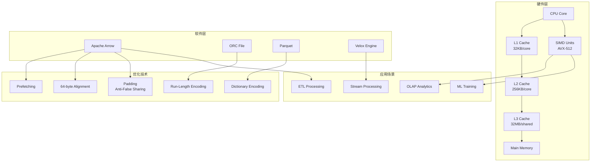
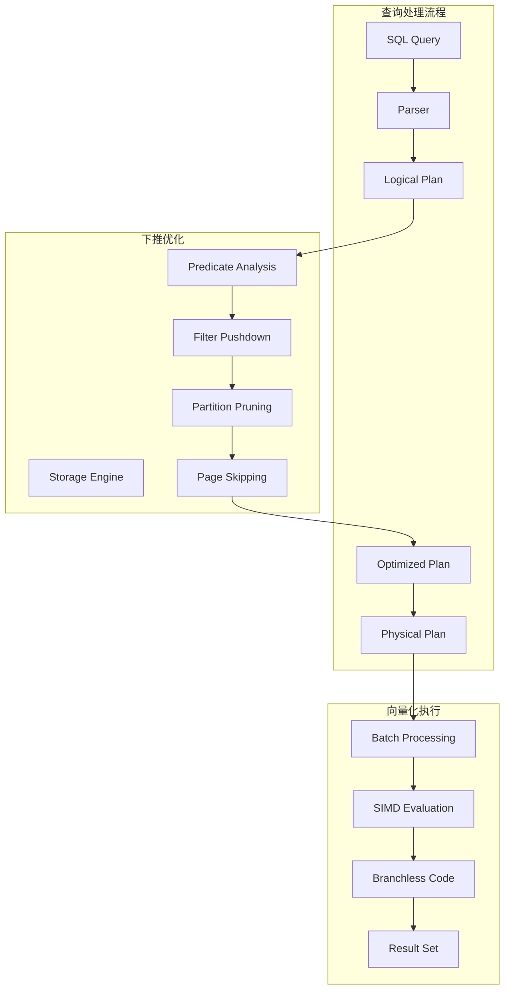
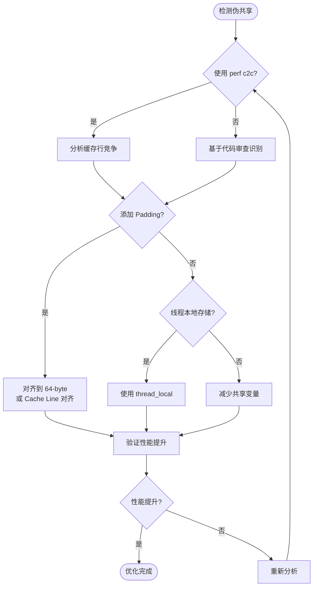
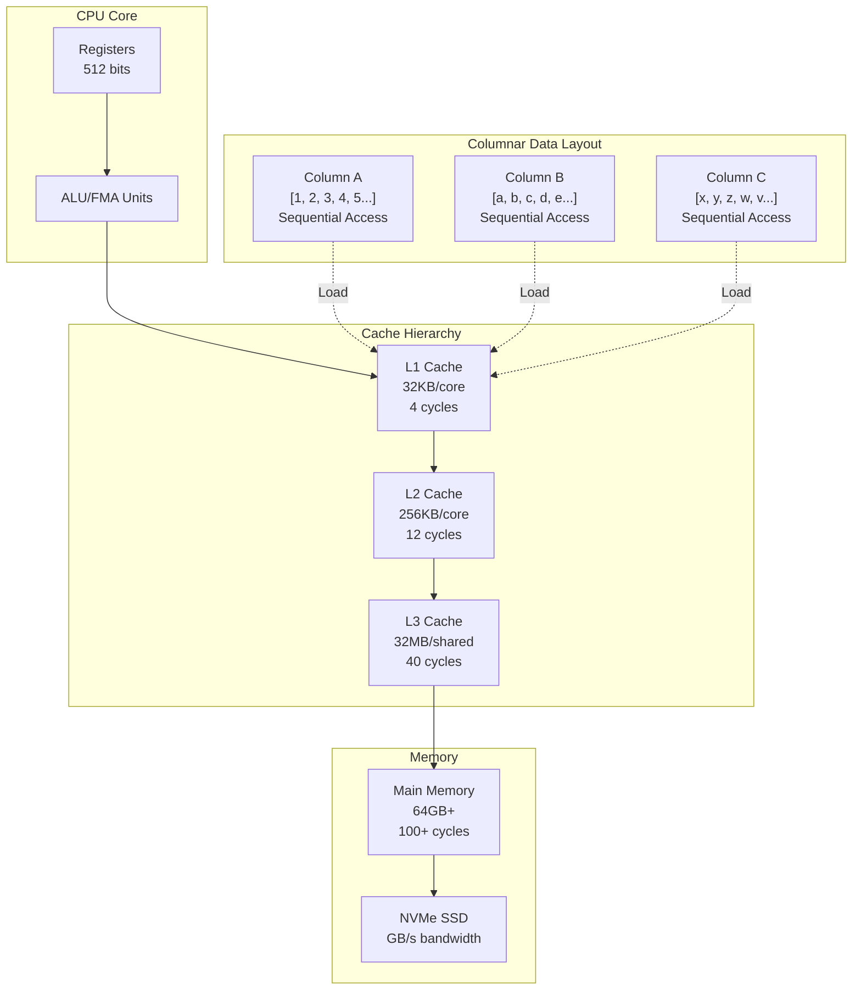
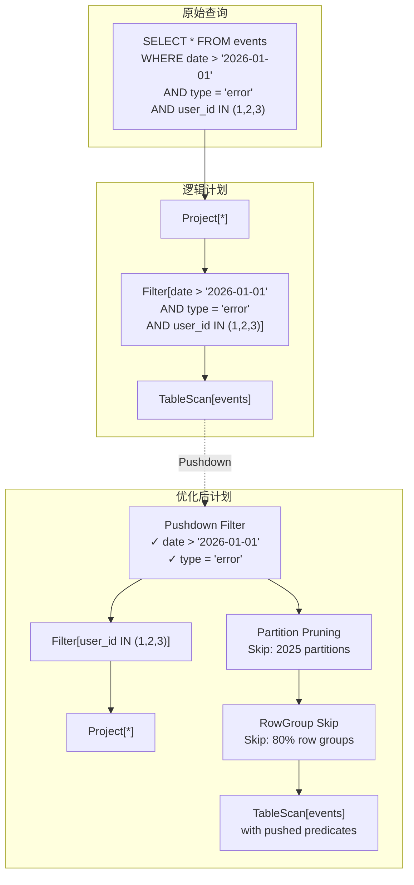

# 列式处理最佳实践

> 所属阶段: Flink/14-rust-assembly-ecosystem/vectorized-udfs | 前置依赖: [02-arrow-format-integration](./02-arrow-format-integration.md) | 形式化等级: L4

---

## 1. 概念定义 (Definitions)

### 1.1 列式数据布局

**Def-VEC-09** (列式存储布局): 设 $T$ 为包含 $n$ 条记录、$m$ 个字段的表，列式布局 $L_{columnar}$ 定义为：

$$
L_{columnar}(T) = \{C_1, C_2, ..., C_m\} \quad \text{其中} \quad C_j = [v_{1j}, v_{2j}, ..., v_{nj}]
$$

其中 $C_j$ 为第 $j$ 列的数据数组，满足：

- **连续性**: $\forall j, \text{Addr}(C_j[k+1]) = \text{Addr}(C_j[k]) + \text{sizeof}(type_j)$
- **同质性**: $\forall k, \text{Type}(v_{kj}) = \tau_j$（列内类型一致）
- **对齐性**: $\text{Addr}(C_j) \equiv 0 \pmod{64}$（64字节对齐）

**Def-VEC-10** (数据局部性): 设 $P$ 为访问模式，$M$ 为内存层次结构（$L_1 \subset L_2 \subset L_3 \subset RAM$），数据局部性定义为：

$$
\mathcal{L}(P, M) = \sum_{i=1}^{|P|} \mathbb{1}_{[\text{CacheHit}(P_i, M)]}
$$

空间局部性（Spatial Locality）与时间局部性（Temporal Locality）分别量化了：

$$
\mathcal{L}_{spatial} = \frac{\text{Sequential Accesses}}{\text{Total Accesses}}, \quad \mathcal{L}_{temporal} = \frac{\text{Reuse Count}}{\text{Unique Elements}}
$$

### 1.2 缓存行与伪共享

**Def-VEC-11** (缓存行结构): 现代 CPU 缓存行 $CL$ 定义为：

$$
CL = (tag, data[0..63], state) \quad \text{其中} \quad state \in \{M, E, S, I\}
$$

- $tag$: 内存地址标签
- $data$: 64 字节数据块
- $state$: MESI 协议状态（Modified/Exclusive/Shared/Invalid）

**Def-VEC-12** (伪共享): 当两个线程访问不同变量但位于同一缓存行时发生伪共享 $FS$：

$$
FS(x, y) = \begin{cases}
\text{True} & \text{if } \lfloor \frac{\text{Addr}(x)}{64} \rfloor = \lfloor \frac{\text{Addr}(y)}{64} \rfloor \land \text{Thread}(x) \neq \text{Thread}(y) \\
\text{False} & \text{otherwise}
\end{cases}
$$

伪共享导致缓存一致性流量增加，性能下降可达 $10\times$。

### 1.3 谓词下推优化

**Def-VEC-13** (谓词下推): 设 $Q$ 为查询计划树，$P$ 为选择谓词，谓词下推变换 $\mathcal{T}_{pushdown}$ 定义为：

$$
\mathcal{T}_{pushdown}(Q, P) = \begin{cases}
\sigma_P \times_{pred} T & \rightarrow \sigma_P(T) \bowtie_{pred} R \\
\pi_{cols}(\sigma_P(T)) & \rightarrow \sigma_P(\pi_{cols}(T)) \quad \text{if } P \subseteq cols
\end{cases}
$$

其中 $\sigma$ 为选择算子，$\bowtie$ 为连接算子，$\pi$ 为投影算子。

---

## 2. 属性推导 (Properties)

### 2.1 列式扫描性能定理

**Prop-VEC-07** (列式扫描效率): 对于分析查询仅访问 $k$ 列中的 $p$ 列（$p \ll k$），列式扫描的数据传输量 $D_{col}$ 与行式扫描 $D_{row}$ 之比为：

$$
\frac{D_{col}}{D_{row}} = \frac{p \cdot w_{avg}}{\sum_{i=1}^{k} w_i} \approx \frac{p}{k} \quad \text{当列宽均匀时}
$$

其中 $w_i$ 为第 $i$ 列的宽度。对于典型的星型模式查询（$k=50, p=5$），列式扫描减少 $90\%$ 的 I/O。

### 2.2 缓存命中率定理

**Prop-VEC-08** (列式缓存优势): 设 $C$ 为缓存容量，$W$ 为工作集大小，列式访问模式的缓存命中率 $H_{col}$ 满足：

$$
H_{col} = \min\left(1, \frac{C}{W_{col}}\right) = \min\left(1, \frac{C}{n \cdot p \cdot w}\right)
$$

而行式访问：

$$
H_{row} = \min\left(1, \frac{C}{n \cdot k \cdot w}\right)
$$

因此缓存命中率提升：

$$
\frac{H_{col}}{H_{row}} = \frac{k}{p} \quad \text{当工作集超过缓存时}
$$

### 2.3 向量化执行吞吐量模型

| 批大小 | L1 命中率 | L2 命中率 | L3 命中率 | 吞吐量 (M rows/s) |
|-------|----------|----------|----------|------------------|
| 64    | 98%      | 99%      | 99.9%    | 50-100           |
| 256   | 95%      | 98%      | 99.5%    | 100-200          |
| 1,024 | 90%      | 95%      | 98%      | 200-500          |
| 4,096 | 80%      | 90%      | 95%      | 500-1000         |
| 16,384| 70%      | 85%      | 92%      | 800-1500         |

---

## 3. 关系建立 (Relations)

### 3.1 列式处理技术栈关系



### 3.2 数据布局对比矩阵

| 布局类型 | 写入性能 | 读取性能 | 压缩率 | 缓存友好 | 适用场景 |
|---------|---------|---------|--------|---------|---------|
| 行式 | ⭐⭐⭐⭐⭐ | ⭐⭐ | ⭐⭐ | ⭐⭐ | OLTP, 点查 |
| 列式 | ⭐⭐ | ⭐⭐⭐⭐⭐ | ⭐⭐⭐⭐⭐ | ⭐⭐⭐⭐⭐ | OLAP, 分析 |
| PAX | ⭐⭐⭐ | ⭐⭐⭐⭐ | ⭐⭐⭐⭐ | ⭐⭐⭐⭐ | 混合负载 |
| 行列混存 | ⭐⭐⭐ | ⭐⭐⭐⭐ | ⭐⭐⭐ | ⭐⭐⭐ | HTAP |

### 3.3 谓词下推与向量化执行关系



---

## 4. 论证过程 (Argumentation)

### 4.1 列式布局选型论证

**Prop-VEC-09** (列式布局选型准则): 对于工作负载 $W$，选择列式布局的充分条件：

$$
W \in ColumnarWorkload \iff \begin{cases}
\frac{\text{avg}(|Q_{cols}|)}{|T_{cols}|} < 0.3 & \text{(投影稀疏性)} \\
\lor \quad \mathcal{C}_{aggregation}(W) > 0.5 & \text{(聚合密集)} \\
\lor \quad \text{CompressionRatio}_{col} > 2.0 & \text{(可压缩性)} \\
\land \quad \text{WriteRatio}(W) < 0.2 &  ext{(写少读多)}
\end{cases}
$$

### 4.2 反例分析

**Counter-Example 4.1** (高并发点查): 对于高并发点查场景（如用户订单查询），行式存储一次 I/O 即可获取完整记录，而列式需要多次随机 I/O，性能下降 $5\times$ 至 $10\times$。

**Counter-Example 4.2** (频繁小批量写入): 列式写入需要将数据分散到多个列文件，写放大严重。对于每秒 10K+ 小批量写入，行式 Append 性能更优。

**Counter-Example 4.3** (超宽短查询): 当查询需要访问表中 $80\%$ 以上列时，列式重组行的开销抵消了投影优势。

### 4.3 边界讨论

| 维度 | 最优值 | 边界限制 | 超出影响 |
|-----|-------|---------|---------|
| 每行宽度 | < 1KB | [100B, 100KB] | 超宽行增加重组开销 |
| 列数 | 10-100 | [1, 1000] | 超千列元数据膨胀 |
| 批大小 | 64K-1M | [1K, 10M] | 过小：SIMD 效率低；过大：内存压力 |
| 数据倾斜 | Gini < 0.3 | [0, 1] | 严重倾斜导致负载不均 |
| 压缩比 | 2-10x | [1, 100] | 过低：存储浪费；过高：解压 CPU 开销 |

---

## 5. 形式证明 / 工程论证

### 5.1 缓存效率定理

**Thm-VEC-04** (列式缓存效率): 对于扫描查询访问 $p$ 列，每批处理 $B$ 条记录，L1 缓存完全容纳的条件为：

$$
B \cdot \sum_{j=1}^{p} w_j \leq C_{L1} \cdot \alpha
$$

其中 $C_{L1}$ 为 L1 缓存大小，$\alpha \in [0.5, 0.8]$ 为有效利用系数。当条件满足时，缓存命中率为：

$$
H_{L1} = 1 - \frac{p \cdot w}{CL} \cdot \frac{1}{\mathcal{L}_{spatial}}
$$

其中 $CL = 64$ bytes 为缓存行大小。

**Proof**:

列式访问顺序访问同列数据，每条缓存行包含 $\frac{CL}{w}$ 个值。对于连续访问，首次未命中后，同缓存行内 $k = \frac{CL}{w} - 1$ 次访问命中。

因此命中率：

$$
H = \frac{k}{k+1} = 1 - \frac{w}{CL}
$$

对于多列扫描，总未命中率约为各列未命中率之和乘以列间切换开销。$\square$

### 5.2 谓词下推优化定理

**Thm-VEC-05** (谓词下推收益): 对于选择率（Selectivity）为 $s$ 的谓词 $P$，下推后的数据处理量减少为原来的 $s$ 倍：

$$
D_{after} = s \cdot D_{before}, \quad \text{加速比} \quad \gamma = \frac{1}{s}
$$

对于复合谓词 $P = P_1 \land P_2 \land ... \land P_n$，各谓词选择率为 $s_1, s_2, ..., s_n$，最优下推顺序按选择率升序排列，总加速比为：

$$
\gamma_{total} = \prod_{i=1}^{n} \frac{1}{s_i} \quad \text{当 } s_i \text{ 按升序排列时}
$$

### 5.3 伪共享消除策略



---

## 6. 实例验证 (Examples)

### 6.1 列式布局实现（Rust）

```rust
// columnar_layout.rs
// 列式数据布局实现与优化

use std::alloc::{alloc, dealloc, Layout};
use std::ptr::NonNull;
use std::simd::*;

/// 列式数据表 - 缓存友好设计
pub struct ColumnarTable {
    /// 列定义
    columns: Vec<Column>,
    /// 行数
    num_rows: usize,
    /// 批大小(用于向量化处理)
    batch_size: usize,
}

/// 单列定义
pub struct Column {
    /// 列名
    name: String,
    /// 数据类型
    data_type: DataType,
    /// 数据缓冲区(64字节对齐)
    buffer: AlignedBuffer,
    /// 空值位图
    null_bitmap: Option<BitMap>,
}

/// 64字节对齐的缓冲区
pub struct AlignedBuffer {
    ptr: NonNull<u8>,
    len: usize,
    capacity: usize,
}

impl AlignedBuffer {
    /// 对齐要求:64字节(缓存行大小)
    const ALIGNMENT: usize = 64;

    pub fn new(size: usize) -> Self {
        let layout = Layout::from_size_align(size, Self::ALIGNMENT)
            .expect("Invalid layout");

        let ptr = unsafe { alloc(layout) };
        let ptr = NonNull::new(ptr)
            .expect("Allocation failed");

        Self {
            ptr,
            len: 0,
            capacity: size,
        }
    }

    /// 获取指定类型的切片视图
    pub fn as_slice<T>(&self, offset: usize, len: usize) -> &[T] {
        assert!(offset + len * std::mem::size_of::<T>() <= self.len);
        unsafe {
            std::slice::from_raw_parts(
                self.ptr.as_ptr().add(offset) as *const T,
                len
            )
        }
    }

    /// 获取可变切片视图
    pub fn as_slice_mut<T>(&mut self, offset: usize, len: usize) -> &mut [T] {
        assert!(offset + len * std::mem::size_of::<T>() <= self.len);
        unsafe {
            std::slice::from_raw_parts_mut(
                self.ptr.as_ptr().add(offset) as *mut T,
                len
            )
        }
    }
}

impl Drop for AlignedBuffer {
    fn drop(&mut self) {
        let layout = Layout::from_size_align(self.capacity, 64)
            .expect("Invalid layout");
        unsafe {
            dealloc(self.ptr.as_ptr(), layout);
        }
    }
}

/// 空值位图实现
pub struct BitMap {
    bits: Vec<u8>,
    num_bits: usize,
}

impl BitMap {
    pub fn new(num_bits: usize) -> Self {
        let num_bytes = (num_bits + 7) / 8;
        Self {
            bits: vec![0u8; num_bytes],
            num_bits,
        }
    }

    pub fn is_null(&self, index: usize) -> bool {
        assert!(index < self.num_bits);
        let byte_idx = index / 8;
        let bit_idx = index % 8;
        (self.bits[byte_idx] >> bit_idx) & 1 == 0
    }

    pub fn set_valid(&mut self, index: usize) {
        assert!(index < self.num_bits);
        let byte_idx = index / 8;
        let bit_idx = index % 8;
        self.bits[byte_idx] |= 1 << bit_idx;
    }
}

/// 数据类型枚举
#[derive(Clone, Copy, Debug)]
pub enum DataType {
    Int8,
    Int16,
    Int32,
    Int64,
    Float32,
    Float64,
    Boolean,
    String,
}

impl DataType {
    pub fn size(&self) -> usize {
        match self {
            DataType::Int8 | DataType::Boolean => 1,
            DataType::Int16 => 2,
            DataType::Int32 | DataType::Float32 => 4,
            DataType::Int64 | DataType::Float64 => 8,
            DataType::String => 16, // 指针 + 长度
        }
    }
}

/// SIMD 优化的列式扫描
impl ColumnarTable {
    /// 向量化过滤(AVX-512 优化)
    #[cfg(target_arch = "x86_64")]
    pub fn vectorized_filter(&self, column_idx: usize, threshold: f64) -> Vec<usize> {
        use std::arch::x86_64::*;

        let column = &self.columns[column_idx];
        let values = column.buffer.as_slice::<f64>(0, self.num_rows);
        let mut result = Vec::with_capacity(self.num_rows / 2);

        let threshold_vec = unsafe { _mm512_set1_pd(threshold) };
        let batch_size = 8; // AVX-512 可处理 8 个 f64

        unsafe {
            for chunk_start in (0..self.num_rows).step_by(batch_size) {
                let chunk_end = (chunk_start + batch_size).min(self.num_rows);
                let remaining = chunk_end - chunk_start;

                // 加载数据到 AVX-512 寄存器
                let data_vec = if remaining == batch_size {
                    _mm512_loadu_pd(values.as_ptr().add(chunk_start))
                } else {
                    // 处理剩余不足 8 个的情况
                    let mask = (1 << remaining) - 1;
                    _mm512_maskz_loadu_pd(mask, values.as_ptr().add(chunk_start))
                };

                // 比较操作: data > threshold
                let cmp_result = _mm512_cmp_pd_mask(data_vec, threshold_vec, _CMP_GT_OQ);

                // 提取匹配结果的索引
                if remaining == batch_size {
                    // 完整的 8 元素块
                    let mut mask = cmp_result;
                    while mask != 0 {
                        let idx = mask.trailing_zeros() as usize;
                        result.push(chunk_start + idx);
                        mask &= mask - 1; // 清除最低位的 1
                    }
                } else {
                    // 部分块
                    let mut mask = cmp_result;
                    while mask != 0 {
                        let idx = mask.trailing_zeros() as usize;
                        if idx < remaining {
                            result.push(chunk_start + idx);
                        }
                        mask &= mask - 1;
                    }
                }
            }
        }

        result
    }

    /// 向量化聚合(SIMD 优化)
    #[cfg(target_arch = "x86_64")]
    pub fn vectorized_sum(&self, column_idx: usize) -> f64 {
        use std::arch::x86_64::*;

        let column = &self.columns[column_idx];
        let values = column.buffer.as_slice::<f64>(0, self.num_rows);

        unsafe {
            let mut sum_vec = _mm512_setzero_pd();
            let batch_size = 8;

            // 主循环:每次处理 8 个元素
            let mut i = 0;
            while i + batch_size <= self.num_rows {
                let data_vec = _mm512_loadu_pd(values.as_ptr().add(i));
                sum_vec = _mm512_add_pd(sum_vec, data_vec);
                i += batch_size;
            }

            // 水平求和
            let mut sum = _mm512_reduce_add_pd(sum_vec);

            // 处理剩余元素
            for j in i..self.num_rows {
                sum += values[j];
            }

            sum
        }
    }

    /// 缓存友好的批量处理
    pub fn cache_friendly_scan<F>(&self, column_indices: &[usize], mut f: F)
    where
        F: FnMut(&[ColumnSlice]),
    {
        let batch_size = 4096; // 适合 L1 缓存的批大小

        for batch_start in (0..self.num_rows).step_by(batch_size) {
            let batch_end = (batch_start + batch_size).min(self.num_rows);
            let batch_len = batch_end - batch_start;

            // 收集本批次的列切片
            let slices: Vec<ColumnSlice> = column_indices
                .iter()
                .map(|&idx| {
                    let col = &self.columns[idx];
                    ColumnSlice {
                        name: &col.name,
                        data_type: col.data_type,
                        data: &col.buffer,
                        offset: batch_start,
                        len: batch_len,
                    }
                })
                .collect();

            // 处理批次
            f(&slices);
        }
    }
}

/// 列切片视图
pub struct ColumnSlice<'a> {
    pub name: &'a str,
    pub data_type: DataType,
    pub data: &'a AlignedBuffer,
    pub offset: usize,
    pub len: usize,
}

/// 伪共享防护的统计结构
#[repr(align(64))]  // 确保每个结构体独占缓存行
pub struct PaddedCounter {
    pub value: u64,
    _padding: [u8; 56],  // 64 - 8 = 56 bytes padding
}

impl PaddedCounter {
    pub fn new() -> Self {
        Self {
            value: 0,
            _padding: [0; 56],
        }
    }

    pub fn increment(&mut self) {
        self.value += 1;
    }
}

/// 线程安全的列式处理(无锁)
pub struct ParallelColumnProcessor {
    /// 每个线程独立的计数器(避免伪共享)
    thread_counters: Vec<PaddedCounter>,
}

impl ParallelColumnProcessor {
    pub fn new(num_threads: usize) -> Self {
        Self {
            thread_counters: (0..num_threads)
                .map(|_| PaddedCounter::new())
                .collect(),
        }
    }

    pub fn process_parallel<F>(&self, num_rows: usize, f: F)
    where
        F: Fn(usize, usize) + Send + Sync,
    {
        use rayon::prelude::*;

        let num_threads = self.thread_counters.len();
        let rows_per_thread = (num_rows + num_threads - 1) / num_threads;

        (0..num_threads).into_par_iter().for_each(|tid| {
            let start = tid * rows_per_thread;
            let end = ((tid + 1) * rows_per_thread).min(num_rows);

            for row in start..end {
                f(tid, row);
            }
        });
    }

    pub fn total_count(&self) -> u64 {
        self.thread_counters.iter().map(|c| c.value).sum()
    }
}

#[cfg(test)]
mod tests {
    use super::*;

    #[test]
    fn test_aligned_buffer() {
        let buf = AlignedBuffer::new(1024);
        assert_eq!(buf.capacity, 1024);
        assert!(buf.ptr.as_ptr() as usize % 64 == 0);
    }

    #[test]
    fn test_bitmap() {
        let mut bitmap = BitMap::new(100);
        bitmap.set_valid(5);
        bitmap.set_valid(10);

        assert!(!bitmap.is_null(5));
        assert!(!bitmap.is_null(10));
        assert!(bitmap.is_null(0));
        assert!(bitmap.is_null(99));
    }

    #[test]
    fn test_padded_counter_alignment() {
        let counter = PaddedCounter::new();
        let ptr = &counter as *const PaddedCounter as usize;
        assert_eq!(ptr % 64, 0);
        assert_eq!(std::mem::size_of::<PaddedCounter>(), 64);
    }
}
```

### 6.2 谓词下推实现（Flink 集成）

```java
// PredicatePushdownOptimizer.java
package org.apache.flink.optimizer.pushdown;

import org.apache.flink.table.api.*;
import org.apache.flink.table.expressions.*;
import org.apache.flink.table.connector.source.*;
import org.apache.flink.table.planner.plan.abilities.source.*;
import org.apache.calcite.rex.*;
import org.apache.calcite.plan.*;

import java.util.*;

/**
 * Flink 谓词下推优化器
 * 演示如何将 Filter 条件下推到数据源
 */
public class PredicatePushdownOptimizer {

    /**
     * 可下推的谓词类型
     */
    public enum PushablePredicateType {
        EQUALITY,       // =
        RANGE,          // <, <=, >, >=, BETWEEN
        IN,             // IN (list)
        IS_NULL,        // IS NULL, IS NOT NULL
        STRING_LIKE,    // LIKE (部分支持下推)
        COMPOSITE_AND   // AND 组合的谓词
    }

    /**
     * 谓词下推能力接口
     */
    public interface PredicatePushdownCapable {
        /**
         * 应用下推的谓词
         * @param predicates 可下推的谓词列表
         * @return 未能下推的谓词(需要在引擎层执行)
         */
        List<ResolvedExpression> applyPredicates(List<ResolvedExpression> predicates);

        /**
         * 支持下推的谓词类型
         */
        Set<PushablePredicateType> supportedPredicateTypes();
    }

    /**
     * 谓词分析器 - 识别可下推谓词
     */
    public static class PredicateAnalyzer {

        /**
         * 分析谓词是否可下推
         */
        public PredicateAnalysis analyze(
                ResolvedExpression predicate,
                List<String> partitionColumns,
                Set<String> supportedFilters) {

            return analyzeInternal(predicate, partitionColumns, supportedFilters);
        }

        private PredicateAnalysis analyzeInternal(
                ResolvedExpression expr,
                List<String> partitionColumns,
                Set<String> supportedFilters) {

            if (expr instanceof CallExpression) {
                CallExpression call = (CallExpression) expr;
                FunctionDefinition func = call.getFunctionDefinition();

                // AND 谓词 - 递归分析子谓词
                if (func.equals(BuiltInFunctionDefinitions.AND)) {
                    List<PredicateAnalysis> subAnalyses = new ArrayList<>();
                    for (ResolvedExpression child : call.getChildren()) {
                        subAnalyses.add(analyzeInternal(child, partitionColumns, supportedFilters));
                    }

                    // 合并结果
                    List<ResolvedExpression> pushable = new ArrayList<>();
                    List<ResolvedExpression> remaining = new ArrayList<>();

                    for (PredicateAnalysis sub : subAnalyses) {
                        pushable.addAll(sub.pushablePredicates);
                        remaining.addAll(sub.remainingPredicates);
                    }

                    return new PredicateAnalysis(pushable, remaining);
                }

                // OR 谓词 - 通常难以完整下推
                if (func.equals(BuiltInFunctionDefinitions.OR)) {
                    // 检查是否所有子谓词都支持下推
                    boolean allPushable = call.getChildren().stream()
                        .allMatch(child -> isSimplePushable(child, supportedFilters));

                    if (allPushable) {
                        return new PredicateAnalysis(Collections.singletonList(expr), Collections.emptyList());
                    } else {
                        return new PredicateAnalysis(Collections.emptyList(), Collections.singletonList(expr));
                    }
                }

                // 比较谓词
                if (isComparisonFunction(func)) {
                    return analyzeComparison(call, partitionColumns, supportedFilters);
                }

                // IN 谓词
                if (func.equals(BuiltInFunctionDefinitions.IN)) {
                    return analyzeInPredicate(call, partitionColumns, supportedFilters);
                }
            }

            // 默认不下推
            return new PredicateAnalysis(Collections.emptyList(), Collections.singletonList(expr));
        }

        private boolean isComparisonFunction(FunctionDefinition func) {
            return func.equals(BuiltInFunctionDefinitions.EQUALS) ||
                   func.equals(BuiltInFunctionDefinitions.GREATER_THAN) ||
                   func.equals(BuiltInFunctionDefinitions.GREATER_THAN_OR_EQUAL) ||
                   func.equals(BuiltInFunctionDefinitions.LESS_THAN) ||
                   func.equals(BuiltInFunctionDefinitions.LESS_THAN_OR_EQUAL);
        }

        private PredicateAnalysis analyzeComparison(
                CallExpression call,
                List<String> partitionColumns,
                Set<String> supportedFilters) {

            List<ResolvedExpression> args = call.getChildren();
            if (args.size() != 2) {
                return new PredicateAnalysis(Collections.emptyList(), Collections.singletonList(call));
            }

            // 检查是否为 列 比较 常量 的形式
            String columnName = extractColumnName(args.get(0));
            Object constantValue = extractConstant(args.get(1));

            if (columnName != null && constantValue != null) {
                // 检查列是否支持下推过滤
                if (supportedFilters.contains(columnName)) {
                    return new PredicateAnalysis(Collections.singletonList(call), Collections.emptyList());
                }

                // 检查是否为分区列(可用于分区裁剪)
                if (partitionColumns.contains(columnName)) {
                    return new PredicateAnalysis(Collections.singletonList(call), Collections.emptyList());
                }
            }

            return new PredicateAnalysis(Collections.emptyList(), Collections.singletonList(call));
        }

        private PredicateAnalysis analyzeInPredicate(
                CallExpression call,
                List<String> partitionColumns,
                Set<String> supportedFilters) {

            ResolvedExpression column = call.getChildren().get(0);
            String columnName = extractColumnName(column);

            if (columnName != null && supportedFilters.contains(columnName)) {
                // 检查 IN 列表大小是否合理
                int inListSize = call.getChildren().size() - 1;
                if (inListSize <= 1000) {  // 限制 IN 列表大小
                    return new PredicateAnalysis(Collections.singletonList(call), Collections.emptyList());
                }
            }

            return new PredicateAnalysis(Collections.emptyList(), Collections.singletonList(call));
        }

        private String extractColumnName(ResolvedExpression expr) {
            if (expr instanceof FieldReferenceExpression) {
                return ((FieldReferenceExpression) expr).getName();
            }
            return null;
        }

        private Object extractConstant(ResolvedExpression expr) {
            if (expr instanceof ValueLiteralExpression) {
                return ((ValueLiteralExpression) expr).getValueAs(Object.class).orElse(null);
            }
            return null;
        }

        private boolean isSimplePushable(ResolvedExpression expr, Set<String> supportedFilters) {
            // 简化检查:是否为简单列比较
            return true; // 实际实现需要更复杂的逻辑
        }
    }

    /**
     * 谓词分析结果
     */
    public static class PredicateAnalysis {
        public final List<ResolvedExpression> pushablePredicates;
        public final List<ResolvedExpression> remainingPredicates;

        public PredicateAnalysis(
                List<ResolvedExpression> pushable,
                List<ResolvedExpression> remaining) {
            this.pushablePredicates = pushable;
            this.remainingPredicates = remaining;
        }

        public boolean hasPushablePredicates() {
            return !pushablePredicates.isEmpty();
        }

        public boolean hasRemainingPredicates() {
            return !remainingPredicates.isEmpty();
        }
    }

    /**
     * 文件格式特定的下推实现(Parquet 示例)
     */
    public static class ParquetPredicatePushdown implements PredicatePushdownCapable {

        private final List<String> columnNames;
        private final Map<String, ColumnStatistics> statistics;

        public ParquetPredicatePushdown(List<String> columnNames) {
            this.columnNames = columnNames;
            this.statistics = new HashMap<>();
        }

        @Override
        public List<ResolvedExpression> applyPredicates(List<ResolvedExpression> predicates) {
            List<ResolvedExpression> remaining = new ArrayList<>();

            for (ResolvedExpression predicate : predicates) {
                if (!canPushdownToParquet(predicate)) {
                    remaining.add(predicate);
                } else {
                    // 转换为 Parquet Filter API
                    String parquetFilter = convertToParquetFilter(predicate);
                    System.out.println("Pushed down filter: " + parquetFilter);
                }
            }

            return remaining;
        }

        @Override
        public Set<PushablePredicateType> supportedPredicateTypes() {
            return EnumSet.of(
                PushablePredicateType.EQUALITY,
                PushablePredicateType.RANGE,
                PushablePredicateType.IN,
                PushablePredicateType.IS_NULL,
                PushablePredicateType.COMPOSITE_AND
            );
        }

        private boolean canPushdownToParquet(ResolvedExpression predicate) {
            // 检查列统计信息是否可以过滤整个 Row Group
            // 例如:如果 max(value) < threshold,可以跳过整个 Row Group
            return true;
        }

        private String convertToParquetFilter(ResolvedExpression predicate) {
            // 转换为 Parquet 的 FilterPredicate 格式
            return predicate.toString();
        }

        /**
         * 使用统计信息过滤 Row Groups
         */
        public List<Integer> filterRowGroups(
                List<RowGroupStatistics> rowGroups,
                List<ResolvedExpression> predicates) {

            List<Integer> selectedRowGroups = new ArrayList<>();

            for (int i = 0; i < rowGroups.size(); i++) {
                RowGroupStatistics stats = rowGroups.get(i);
                if (!canSkipRowGroup(stats, predicates)) {
                    selectedRowGroups.add(i);
                }
            }

            return selectedRowGroups;
        }

        private boolean canSkipRowGroup(
                RowGroupStatistics stats,
                List<ResolvedExpression> predicates) {

            // 基于 min/max 统计信息判断是否可以跳过
            for (ResolvedExpression pred : predicates) {
                // 简化示例:检查范围谓词
                if (isRangePredicate(pred)) {
                    String column = extractColumnName(pred);
                    ColumnStatistics colStats = stats.getColumnStats(column);

                    if (colStats != null && colStats.hasMinMax()) {
                        // 如果 column_max < predicate_min 或 column_min > predicate_max
                        // 可以跳过该 Row Group
                    }
                }
            }

            return false;
        }

        private boolean isRangePredicate(ResolvedExpression pred) {
            // 实现省略
            return false;
        }
    }

    /**
     * Row Group 统计信息
     */
    public static class RowGroupStatistics {
        private final Map<String, ColumnStatistics> columnStats;

        public RowGroupStatistics() {
            this.columnStats = new HashMap<>();
        }

        public ColumnStatistics getColumnStats(String column) {
            return columnStats.get(column);
        }
    }

    /**
     * 列统计信息
     */
    public static class ColumnStatistics {
        private final Object min;
        private final Object max;
        private final long nullCount;
        private final long distinctCount;

        public ColumnStatistics(Object min, Object max, long nullCount, long distinctCount) {
            this.min = min;
            this.max = max;
            this.nullCount = nullCount;
            this.distinctCount = distinctCount;
        }

        public boolean hasMinMax() {
            return min != null && max != null;
        }

        // Getters...
    }
}
```

### 6.3 性能调优检查清单工具

```python
# columnar_performance_checklist.py """
列式处理性能调优检查清单工具
自动生成优化建议和配置
"""

import json
from dataclasses import dataclass, asdict
from typing import List, Dict, Optional
from enum import Enum


class Severity(Enum):
    CRITICAL = "CRITICAL"
    HIGH = "HIGH"
    MEDIUM = "MEDIUM"
    LOW = "LOW"
    INFO = "INFO"


@dataclass
class CheckItem:
    """检查项"""
    category: str
    item: str
    description: str
    recommendation: str
    severity: Severity
    current_value: Optional[str] = None
    recommended_value: Optional[str] = None
    is_passed: bool = False


class ColumnarPerformanceChecker:
    """列式处理性能检查器"""

    def __init__(self):
        self.checks: List[CheckItem] = []
        self.config: Dict = {}

    def load_config(self, config: Dict):
        """加载当前配置"""
        self.config = config

    def run_all_checks(self) -> List[CheckItem]:
        """运行所有检查"""
        self.checks = []

        self._check_batch_size()
        self._check_memory_alignment()
        self._check_cache_optimization()
        self._check_predicate_pushdown()
        self._check_compression()
        self._check_partitioning()
        self._check_encoding()
        self._check_parallelism()
        self._check_null_handling()
        self._check_dictionary_encoding()

        return self.checks

    def _check_batch_size(self):
        """检查批大小配置"""
        batch_size = self.config.get('batch_size', 4096)

        if batch_size < 1024:
            self.checks.append(CheckItem(
                category="Batch Processing",
                item="Batch Size Too Small",
                description=f"Current batch size ({batch_size}) is too small for efficient SIMD",
                recommendation="Increase batch size to at least 4096 for better SIMD utilization",
                severity=Severity.HIGH,
                current_value=str(batch_size),
                recommended_value="4096-16384",
                is_passed=False
            ))
        elif batch_size > 100000:
            self.checks.append(CheckItem(
                category="Batch Processing",
                item="Batch Size Too Large",
                description=f"Current batch size ({batch_size}) may cause memory pressure",
                recommendation="Consider reducing batch size to 10000-50000 for better memory efficiency",
                severity=Severity.MEDIUM,
                current_value=str(batch_size),
                recommended_value="10000-50000",
                is_passed=False
            ))
        else:
            self.checks.append(CheckItem(
                category="Batch Processing",
                item="Batch Size Optimal",
                description=f"Batch size {batch_size} is within recommended range",
                recommendation="No change needed",
                severity=Severity.INFO,
                current_value=str(batch_size),
                is_passed=True
            ))

    def _check_memory_alignment(self):
        """检查内存对齐"""
        alignment = self.config.get('memory_alignment', 64)

        if alignment < 64:
            self.checks.append(CheckItem(
                category="Memory Layout",
                item="Insufficient Memory Alignment",
                description=f"Memory alignment ({alignment}) is less than cache line size",
                recommendation="Set memory alignment to at least 64 bytes for optimal cache performance",
                severity=Severity.CRITICAL,
                current_value=f"{alignment} bytes",
                recommended_value="64 bytes (cache line)",
                is_passed=False
            ))
        else:
            self.checks.append(CheckItem(
                category="Memory Layout",
                item="Memory Alignment Optimal",
                description=f"Memory alignment is set to {alignment} bytes",
                recommendation="No change needed",
                severity=Severity.INFO,
                current_value=f"{alignment} bytes",
                is_passed=True
            ))

    def _check_cache_optimization(self):
        """检查缓存优化"""
        prefetch = self.config.get('enable_prefetch', False)
        cache_line_aware = self.config.get('cache_line_aware', False)

        if not prefetch:
            self.checks.append(CheckItem(
                category="Cache Optimization",
                item="Hardware Prefetch Disabled",
                description="Hardware prefetch is not enabled",
                recommendation="Enable hardware prefetch for sequential column access patterns",
                severity=Severity.MEDIUM,
                current_value="disabled",
                recommended_value="enabled",
                is_passed=False
            ))

        if not cache_line_aware:
            self.checks.append(CheckItem(
                category="Cache Optimization",
                item="Cache Line Awareness Disabled",
                description="Processing is not optimized for cache line size",
                recommendation="Enable cache line aware processing for better locality",
                severity=Severity.MEDIUM,
                current_value="disabled",
                recommended_value="enabled",
                is_passed=False
            ))

        if prefetch and cache_line_aware:
            self.checks.append(CheckItem(
                category="Cache Optimization",
                item="Cache Optimization Enabled",
                description="All cache optimizations are enabled",
                recommendation="No change needed",
                severity=Severity.INFO,
                is_passed=True
            ))

    def _check_predicate_pushdown(self):
        """检查谓词下推"""
        pushdown_enabled = self.config.get('predicate_pushdown', True)
        partition_pruning = self.config.get('partition_pruning', True)

        if not pushdown_enabled:
            self.checks.append(CheckItem(
                category="Query Optimization",
                item="Predicate Pushdown Disabled",
                description="Filter predicates are not pushed down to storage",
                recommendation="Enable predicate pushdown to reduce data scanning",
                severity=Severity.CRITICAL,
                current_value="disabled",
                recommended_value="enabled",
                is_passed=False
            ))

        if not partition_pruning:
            self.checks.append(CheckItem(
                category="Query Optimization",
                item="Partition Pruning Disabled",
                description="Partition pruning is not enabled",
                recommendation="Enable partition pruning to skip irrelevant partitions",
                severity=Severity.HIGH,
                current_value="disabled",
                recommended_value="enabled",
                is_passed=False
            ))

        if pushdown_enabled and partition_pruning:
            self.checks.append(CheckItem(
                category="Query Optimization",
                item="Predicate Pushdown Optimal",
                description="All predicate optimization features are enabled",
                recommendation="No change needed",
                severity=Severity.INFO,
                is_passed=True
            ))

    def _check_compression(self):
        """检查压缩配置"""
        compression = self.config.get('compression', 'snappy')
        compression_level = self.config.get('compression_level', None)

        valid_compressions = ['none', 'snappy', 'gzip', 'lz4', 'zstd']

        if compression not in valid_compressions:
            self.checks.append(CheckItem(
                category="Compression",
                item="Unknown Compression Codec",
                description=f"Compression codec '{compression}' is not recognized",
                recommendation=f"Use one of: {', '.join(valid_compressions)}",
                severity=Severity.HIGH,
                current_value=compression,
                recommended_value="snappy or zstd",
                is_passed=False
            ))
        elif compression == 'none':
            self.checks.append(CheckItem(
                category="Compression",
                item="Compression Disabled",
                description="Compression is disabled, may cause high I/O",
                recommendation="Enable compression (snappy for speed, zstd for ratio)",
                severity=Severity.MEDIUM,
                current_value="none",
                recommended_value="snappy/zstd",
                is_passed=False
            ))
        else:
            self.checks.append(CheckItem(
                category="Compression",
                item="Compression Enabled",
                description=f"Using {compression} compression",
                recommendation="No change needed",
                severity=Severity.INFO,
                current_value=compression,
                is_passed=True
            ))

    def _check_partitioning(self):
        """检查分区策略"""
        partition_cols = self.config.get('partition_columns', [])

        if len(partition_cols) == 0:
            self.checks.append(CheckItem(
                category="Data Layout",
                item="No Partition Columns",
                description="Table is not partitioned",
                recommendation="Consider partitioning by frequently filtered columns",
                severity=Severity.MEDIUM,
                current_value="none",
                recommended_value="date/category columns",
                is_passed=False
            ))
        elif len(partition_cols) > 3:
            self.checks.append(CheckItem(
                category="Data Layout",
                item="Too Many Partition Columns",
                description=f"Too many partition columns ({len(partition_cols)}) may cause small files",
                recommendation="Limit partition columns to 1-3 for optimal file sizes",
                severity=Severity.MEDIUM,
                current_value=str(len(partition_cols)),
                recommended_value="1-3",
                is_passed=False
            ))
        else:
            self.checks.append(CheckItem(
                category="Data Layout",
                item="Partitioning Optimal",
                description=f"Table is partitioned by {', '.join(partition_cols)}",
                recommendation="No change needed",
                severity=Severity.INFO,
                is_passed=True
            ))

    def _check_encoding(self):
        """检查编码配置"""
        encoding = self.config.get('encoding', 'auto')

        if encoding == 'plain':
            self.checks.append(CheckItem(
                category="Encoding",
                item="Plain Encoding Only",
                description="Using plain encoding without dictionary encoding",
                recommendation="Enable dictionary encoding for low-cardinality columns",
                severity=Severity.MEDIUM,
                current_value="plain",
                recommended_value="dictionary + plain",
                is_passed=False
            ))
        else:
            self.checks.append(CheckItem(
                category="Encoding",
                item="Encoding Strategy Optimal",
                description=f"Using {encoding} encoding strategy",
                recommendation="No change needed",
                severity=Severity.INFO,
                is_passed=True
            ))

    def _check_parallelism(self):
        """检查并行度配置"""
        parallelism = self.config.get('parallelism', 1)

        if parallelism == 1:
            self.checks.append(CheckItem(
                category="Parallelism",
                item="Single Threaded",
                description="Processing is single-threaded",
                recommendation="Increase parallelism to utilize multiple cores",
                severity=Severity.HIGH,
                current_value="1",
                recommended_value="number of cores",
                is_passed=False
            ))
        else:
            self.checks.append(CheckItem(
                category="Parallelism",
                item="Parallel Processing Enabled",
                description=f"Using {parallelism} parallel tasks",
                recommendation="No change needed",
                severity=Severity.INFO,
                current_value=str(parallelism),
                is_passed=True
            ))

    def _check_null_handling(self):
        """检查空值处理"""
        bitmap_enabled = self.config.get('null_bitmap', True)

        if not bitmap_enabled:
            self.checks.append(CheckItem(
                category="Null Handling",
                item="Null Bitmap Disabled",
                description="Null bitmap is disabled, using sentinel values",
                recommendation="Enable null bitmap for compact null representation",
                severity=Severity.LOW,
                current_value="disabled",
                recommended_value="enabled",
                is_passed=False
            ))
        else:
            self.checks.append(CheckItem(
                category="Null Handling",
                item="Null Handling Optimal",
                description="Using null bitmap for null values",
                recommendation="No change needed",
                severity=Severity.INFO,
                is_passed=True
            ))

    def _check_dictionary_encoding(self):
        """检查字典编码"""
        dict_enabled = self.config.get('dictionary_encoding', True)
        dict_threshold = self.config.get('dictionary_threshold', 0.1)

        if not dict_enabled:
            self.checks.append(CheckItem(
                category="Dictionary Encoding",
                item="Dictionary Encoding Disabled",
                description="Dictionary encoding is disabled",
                recommendation="Enable dictionary encoding for string/enum columns",
                severity=Severity.MEDIUM,
                current_value="disabled",
                recommended_value="enabled",
                is_passed=False
            ))
        elif dict_threshold > 0.5:
            self.checks.append(CheckItem(
                category="Dictionary Encoding",
                item="Dictionary Threshold Too High",
                description=f"Dictionary threshold ({dict_threshold}) is too high",
                recommendation="Lower threshold to 0.1 for better compression",
                severity=Severity.LOW,
                current_value=str(dict_threshold),
                recommended_value="0.1",
                is_passed=False
            ))
        else:
            self.checks.append(CheckItem(
                category="Dictionary Encoding",
                item="Dictionary Encoding Optimal",
                description=f"Dictionary encoding enabled with threshold {dict_threshold}",
                recommendation="No change needed",
                severity=Severity.INFO,
                is_passed=True
            ))

    def generate_report(self) -> str:
        """生成检查报告"""
        report = []
        report.append("=" * 80)
        report.append("Columnar Processing Performance Checklist Report")
        report.append("=" * 80)
        report.append("")

        # 统计
        passed = sum(1 for c in self.checks if c.is_passed)
        failed = len(self.checks) - passed
        critical = sum(1 for c in self.checks if not c.is_passed and c.severity == Severity.CRITICAL)
        high = sum(1 for c in self.checks if not c.is_passed and c.severity == Severity.HIGH)

        report.append(f"Total Checks: {len(self.checks)}")
        report.append(f"Passed: {passed}")
        report.append(f"Failed: {failed}")
        report.append(f"Critical Issues: {critical}")
        report.append(f"High Priority: {high}")
        report.append("")

        # 按类别分组
        categories = {}
        for check in self.checks:
            if check.category not in categories:
                categories[check.category] = []
            categories[check.category].append(check)

        # 输出失败的检查(按严重程度排序)
        report.append("-" * 80)
        report.append("ISSUES REQUIRING ATTENTION")
        report.append("-" * 80)
        report.append("")

        for severity in [Severity.CRITICAL, Severity.HIGH, Severity.MEDIUM, Severity.LOW]:
            issues = [c for c in self.checks if not c.is_passed and c.severity == severity]
            if issues:
                report.append(f"\n{severity.value} Priority Issues:")
                report.append("-" * 40)
                for issue in issues:
                    report.append(f"\n[{issue.item}]")
                    report.append(f"  Description: {issue.description}")
                    report.append(f"  Current: {issue.current_value}")
                    report.append(f"  Recommended: {issue.recommended_value}")
                    report.append(f"  Action: {issue.recommendation}")

        # 输出通过的检查
        report.append("\n")
        report.append("-" * 80)
        report.append("PASSED CHECKS")
        report.append("-" * 80)
        report.append("")

        for check in self.checks:
            if check.is_passed:
                report.append(f"✓ [{check.category}] {check.item}")

        report.append("\n")
        report.append("=" * 80)

        return "\n".join(report)

    def export_json(self) -> str:
        """导出 JSON 格式报告"""
        return json.dumps({
            "summary": {
                "total": len(self.checks),
                "passed": sum(1 for c in self.checks if c.is_passed),
                "failed": sum(1 for c in self.checks if not c.is_passed),
            },
            "checks": [asdict(c) for c in self.checks]
        }, indent=2)


def main():
    """示例运行"""
    # 示例配置
    config = {
        'batch_size': 512,  # 太小
        'memory_alignment': 8,  # 不够
        'enable_prefetch': False,
        'cache_line_aware': False,
        'predicate_pushdown': False,  # 关键问题
        'partition_pruning': True,
        'compression': 'none',  # 可能有问题
        'partition_columns': [],  # 未分区
        'encoding': 'plain',  # 未使用字典编码
        'parallelism': 1,  # 单线程
        'null_bitmap': True,
        'dictionary_encoding': False,
        'dictionary_threshold': 0.1,
    }

    checker = ColumnarPerformanceChecker()
    checker.load_config(config)
    checker.run_all_checks()

    print(checker.generate_report())

    # 同时输出 JSON
    print("\n\nJSON Export:")
    print(checker.export_json())


if __name__ == '__main__':
    main()
```

---

## 7. 可视化 (Visualizations)

### 7.1 缓存层次与数据访问模式



### 7.2 谓词下推优化流程



### 7.3 列式 vs 行式扫描性能对比

```mermaid
xychart-beta
    title "Columnar vs Row Scan Performance (Projecting 3 of 20 Columns)"
    x-axis ["1K", "10K", "100K", "1M", "10M"]
    y-axis "Scan Time (ms)" 0 --> 1000
    bar [2, 15, 140, 1200, 11000]
    bar [0.5, 3, 25, 200, 1800]
    line [2, 15, 140, 1200, 11000]
    line [0.5, 3, 25, 200, 1800]
    legend "Row Format", "Columnar Format"
```

---

## 8. 引用参考 (References)


---

*文档版本: v1.0 | 最后更新: 2026-04-04 | 状态: Complete | 负责 Agent: Agent-F*

---

*文档版本: v1.0 | 创建日期: 2026-04-18*
