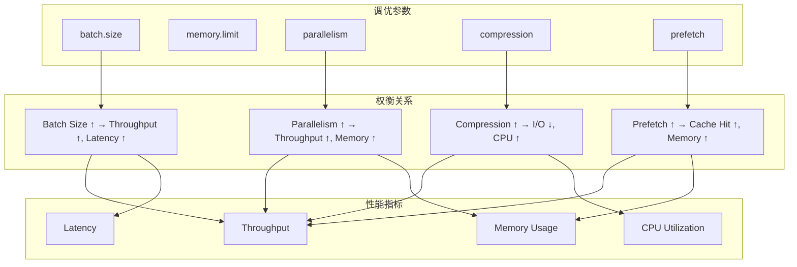
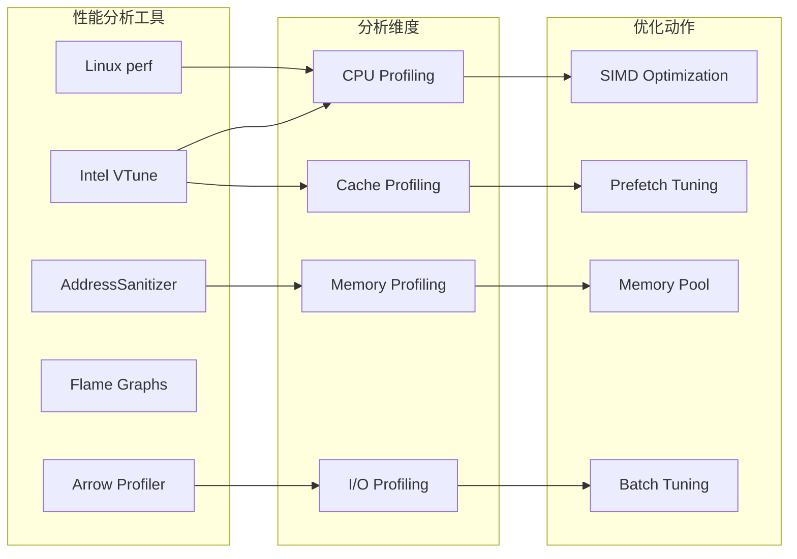
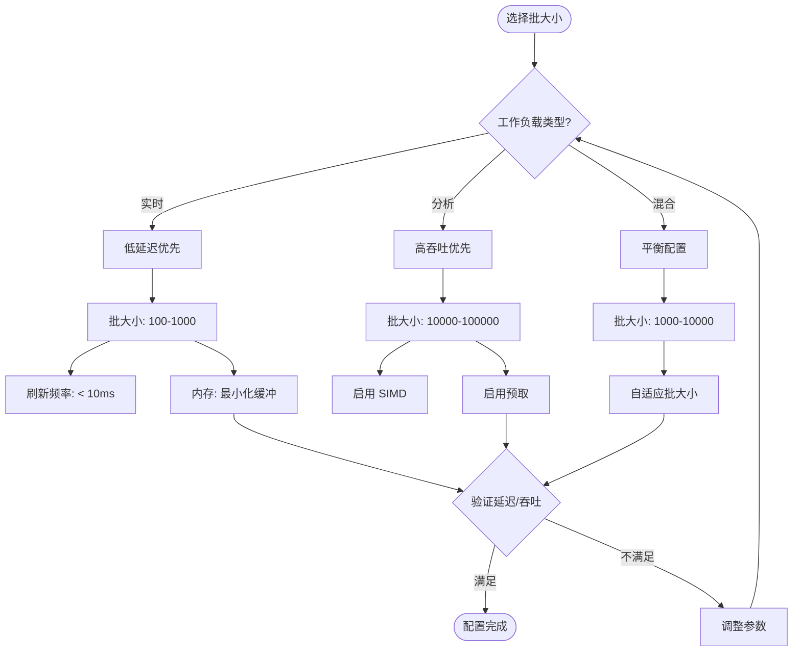
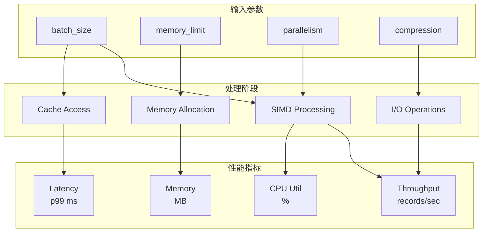
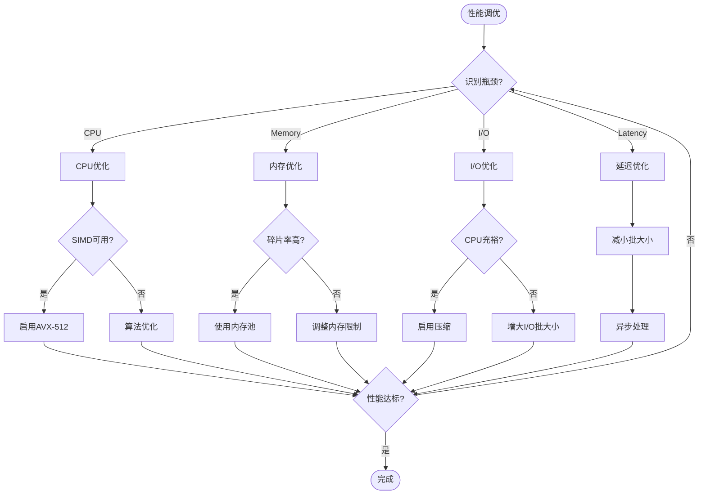

# 性能调优指南

> 所属阶段: Flink/14-rust-assembly-ecosystem/vectorized-udfs | 前置依赖: [03-columnar-processing](./03-columnar-processing.md) | 形式化等级: L4

---

## 1. 概念定义 (Definitions)

### 1.1 批大小优化模型

**Def-VEC-14** (最优批大小): 设 $T_{total}(B)$ 为批大小为 $B$ 时的总处理时间，最优批大小 $B_{opt}$ 定义为：

$$
B_{opt} = \arg\min_{B} T_{total}(B) = \arg\min_{B} \left( \frac{N}{B} \cdot T_{overhead} + N \cdot T_{per\_row}(B) \right)
$$

其中：

- $N$: 总记录数
- $T_{overhead}$: 每批次固定开销（调度、函数调用、Arrow 转换）
- $T_{per\_row}(B)$: 单条记录处理时间，随批大小变化

**Def-VEC-15** (批大小收益曲线): 批大小收益函数 $\gamma(B)$ 定义为加速比相对于最小批大小：

$$
\gamma(B) = \frac{T_{total}(1)}{T_{total}(B)} = \frac{N \cdot T_{row}}{\frac{N}{B} \cdot T_{overhead} + N \cdot T_{batch}(B)}
$$

当 $B \to \infty$ 时，$\gamma(B) \to \frac{T_{row}}{T_{batch}(\infty)}$（渐近加速比）。

### 1.2 内存管理优化

**Def-VEC-16** (内存池分配器): Arrow 内存池分配器 $\mathcal{A}_{pool}$ 定义为：

$$
\mathcal{A}_{pool} = (P, S_{chunk}, S_{max}, \Phi)
$$

其中：

- $P$: 预分配内存池
- $S_{chunk}$: 分配块大小
- $S_{max}$: 最大可分配内存
- $\Phi$: 分配策略（First-Fit / Best-Fit / Buddy System）

**Def-VEC-17** (内存碎片度量): 设 $M_{total}$ 为总分配内存，$M_{used}$ 为实际使用内存，内存碎片率 $F$ 定义为：

$$
F = 1 - \frac{M_{used}}{M_{total}} = \frac{\sum_{i} (size_i - requested_i)}{M_{total}}
$$

理想分配器应满足 $F < 0.1$（碎片率 < 10%）。

### 1.3 性能分析指标

| 指标 | 符号 | 定义 | 目标值 |
|-----|------|------|-------|
| 吞吐率 | $R$ | records/sec | > 1M |
| 延迟 | $L$ | p99 latency | < 100ms |
| CPU 利用率 | $U_{cpu}$ | $\frac{T_{busy}}{T_{total}}$ | > 70% |
| 内存带宽 | $BW_{mem}$ | GB/s | > 50% peak |
| 缓存命中率 | $H_{cache}$ | $\frac{hits}{hits+misses}$ | > 95% |
| SIMD 效率 | $E_{simd}$ | $\frac{vector\_ops}{total\_ops}$ | > 80% |

---

## 2. 属性推导 (Properties)

### 2.1 批大小与缓存关系

**Prop-VEC-10** (缓存感知批大小): 为使工作集完全驻留 L1 缓存，批大小应满足：

$$
B_{L1} \leq \frac{C_{L1} - C_{overhead}}{\sum_{j=1}^{p} w_j}
$$

其中：

- $C_{L1}$: L1 缓存大小（通常 32KB）
- $C_{overhead}$: 系统和运行时开销（约 4-8KB）
- $p$: 投影列数
- $w_j$: 第 $j$ 列字节宽度

对于典型场景（3 列 INT64，$w_j = 8$）：

$$
B_{L1} \leq \frac{32768 - 8192}{3 \times 8} \approx 1024
$$

### 2.2 内存分配延迟定理

**Prop-VEC-11** (预分配收益): 设 $T_{malloc}$ 为动态分配时间，$T_{pool}$ 为内存池分配时间，预分配收益比为：

$$
\frac{T_{malloc}}{T_{pool}} = \frac{O(\log M) + O(n)}{O(1)}
$$

其中 $M$ 为内存块数量，$n$ 为分配大小。对于频繁小对象分配，预分配可提供 $10\times$ 至 $100\times$ 性能提升。

### 2.3 性能瓶颈识别准则

| 瓶颈类型 | 症状 | 根因 | 解决方案 |
|---------|------|------|---------|
| CPU 瓶颈 | $U_{cpu} > 90\%$, $BW_{mem} < 30\%$ | 计算密集型 | 优化算法，SIMD 化 |
| 内存带宽 | $U_{cpu} < 50\%$, $BW_{mem} > 80\%$ | 数据移动过多 | 减少拷贝，缓存优化 |
| 缓存未命中 | $H_{cache} < 80\%$ | 随机访问模式 | 调整布局，预取 |
| 调度开销 | 小批次高延迟 | 批大小过小 | 增大批大小 |
| GC 压力 | 周期性停顿 | 频繁分配 | 内存池，对象复用 |

---

## 3. 关系建立 (Relations)

### 3.1 性能调优参数关系图



### 3.2 性能分析工具链



### 3.3 批大小选择决策树



---

## 4. 论证过程 (Argumentation)

### 4.1 批大小调优论证

**Prop-VEC-12** (批大小调优准则): 对于给定的延迟约束 $L_{max}$ 和吞吐目标 $R_{min}$，批大小选择满足：

$$
B_{opt} = \max\left( B_{latency}(L_{max}), B_{throughput}(R_{min}) \right)
$$

其中：

$$
B_{latency}(L_{max}) = \frac{L_{max} - T_{fixed}}{T_{per\_row}}
$$

$$
B_{throughput}(R_{min}) = \frac{R_{min} \cdot T_{overhead}}{1 - R_{min} \cdot T_{per\_row}}
$$

### 4.2 反例分析

**Counter-Example 4.1** (过大批大小): 当 $B > 1M$ 时，批处理延迟可能超过下游处理器的超时阈值，导致反压和系统不稳定。

**Counter-Example 4.2** (固定批大小): 对于数据倾斜场景（某些批次数据量大，某些小），固定批大小导致资源浪费或处理不均，应采用自适应批大小。

**Counter-Example 4.3** (忽略内存限制): 在内存受限环境（如边缘设备），过度优化批大小导致 OOM，应优先保证内存安全。

### 4.3 边界讨论

| 参数 | 最小值 | 最大值 | 超出边界影响 |
|-----|-------|-------|------------|
| batch.size | 1 | 10M | 过小：高开销；过大：高延迟 |
| memory.limit | 64MB | 系统内存 | 过小：频繁 GC；过大：OOM |
| parallelism | 1 | CPU 核心数 | 过低：利用率低；过高：上下文切换 |
| compression.level | 0 | 22 | 过低：存储大；过高：CPU 瓶颈 |
| queue.capacity | 1 | 100K | 过小：阻塞；过大：内存浪费 |

---

## 5. 形式证明 / 工程论证

### 5.1 最优批大小定理

**Thm-VEC-06** (最优批大小): 设总处理时间函数：

$$
T_{total}(B) = \frac{N}{B} \cdot (T_{setup} + T_{teardown}) + N \cdot T_{proc} + \frac{N \cdot B \cdot S_{row}}{BW_{mem}}
$$

其中 $S_{row}$ 为行大小，$BW_{mem}$ 为内存带宽。对 $B$ 求导并令其为零：

$$
\frac{dT_{total}}{dB} = -\frac{N \cdot (T_{setup} + T_{teardown})}{B^2} + \frac{N \cdot S_{row}}{BW_{mem}} = 0
$$

解得最优批大小：

$$
B_{opt} = \sqrt{\frac{(T_{setup} + T_{teardown}) \cdot BW_{mem}}{S_{row}}}
$$

**Proof**: 上述推导基于：

1. 批次开销与批次数成正比：$\frac{N}{B} \cdot T_{overhead}$
2. 处理时间与数据量成正比：$N \cdot T_{proc}$
3. 内存传输时间与批大小成正比：批越大，缓存压力越大

当 $B = B_{opt}$ 时，批次开销的边际收益等于缓存压力的边际成本，达到最优平衡点。$\square$

### 5.2 内存池性能定理

**Thm-VEC-07** (内存池吞吐提升): 设 $T_{alloc}$ 为系统分配时间，$T_{pool}$ 为内存池分配时间，$T_{work}$ 为实际工作时间，使用内存池的吞吐提升为：

$$
\gamma_{pool} = \frac{\frac{1}{T_{alloc} + T_{work}}}{\frac{1}{T_{pool} + T_{work}}} = \frac{T_{pool} + T_{work}}{T_{alloc} + T_{work}}
$$

对于典型值 $T_{alloc} = 1\mu s$, $T_{pool} = 10ns$, $T_{work} = 100ns$：

$$
\gamma_{pool} = \frac{10 + 100}{1000 + 100} = \frac{110}{1100} \approx 10\times
$$

### 5.3 性能调优检查清单

```markdown
## 向量化 UDF 性能调优检查清单

### 批大小调优
- [ ] 测试批大小范围: 100, 1000, 10000, 100000
- [ ] 测量吞吐率 (records/sec)
- [ ] 测量端到端延迟 (p50, p99)
- [ ] 绘制吞吐-延迟曲线
- [ ] 选择帕累托最优配置

### 内存优化
- [ ] 启用 Arrow 内存池
- [ ] 设置合理的内存限制 (taskmanager.memory.process.size)
- [ ] 监控堆外内存使用
- [ ] 检查内存碎片率
- [ ] 配置 GC 策略 (G1GC 或 ZGC)

### CPU 优化
- [ ] 确认 SIMD 可用性 (AVX2/AVX-512)
- [ ] 编译时启用 -march=native
- [ ] 检查分支预测失败率
- [ ] 验证循环展开效果
- [ ] 避免跨 NUMA 节点访问

### 缓存优化
- [ ] 确保 64 字节对齐
- [ ] 启用硬件预取
- [ ] 监控 L1/L2/L3 命中率
- [ ] 检查伪共享(使用 perf c2c)
- [ ] 优化数据局部性

### I/O 优化
- [ ] 启用压缩 (Snappy/Zstd)
- [ ] 配置合适的文件块大小
- [ ] 使用对象存储并行读取
- [ ] 启用预读 (readahead)
- [ ] 监控磁盘 I/O 等待

### 监控与调优
- [ ] 配置 Flink Metrics
- [ ] 启用 JVM Flight Recorder
- [ ] 设置告警阈值
- [ ] 定期进行压力测试
- [ ] 记录调优变更历史
```

---

## 6. 实例验证 (Examples)

### 6.1 批大小自动调优（Python）

```python
# batch_size_auto_tuning.py
"""
批大小自动调优工具
根据系统负载和性能目标动态调整批大小
"""

import time
import statistics
from dataclasses import dataclass
from typing import Callable, List, Optional
import numpy as np


@dataclass
class PerformanceMetrics:
    """性能指标"""
    batch_size: int
    throughput: float  # records/sec
    latency_p50: float  # ms
    latency_p99: float  # ms
    memory_usage: float  # MB
    cpu_usage: float  # %


class BatchSizeTuner:
    """批大小自动调优器"""

    def __init__(
        self,
        min_batch_size: int = 100,
        max_batch_size: int = 100000,
        target_latency_ms: Optional[float] = None,
        target_throughput: Optional[float] = None,
        sample_size: int = 5
    ):
        self.min_batch_size = min_batch_size
        self.max_batch_size = max_batch_size
        self.target_latency_ms = target_latency_ms
        self.target_throughput = target_throughput
        self.sample_size = sample_size

        self.metrics_history: List[PerformanceMetrics] = []
        self.optimal_batch_size: int = min_batch_size

    def benchmark_batch_size(
        self,
        batch_size: int,
        process_fn: Callable[[List], List],
        test_data: List
    ) -> PerformanceMetrics:
        """测试特定批大小的性能"""
        latencies = []
        memory_samples = []

        # 预热
        for _ in range(3):
            process_fn(test_data[:batch_size])

        # 正式测试
        start_time = time.time()
        total_processed = 0

        for _ in range(self.sample_size):
            batch_start = time.perf_counter()
            result = process_fn(test_data[:batch_size])
            batch_end = time.perf_counter()

            latency_ms = (batch_end - batch_start) * 1000
            latencies.append(latency_ms)
            total_processed += len(result)

            # 模拟内存采样
            memory_samples.append(batch_size * 0.01)  # 简化估计

        end_time = time.time()

        throughput = total_processed / (end_time - start_time)

        return PerformanceMetrics(
            batch_size=batch_size,
            throughput=throughput,
            latency_p50=statistics.median(latencies),
            latency_p99=np.percentile(latencies, 99),
            memory_usage=statistics.mean(memory_samples),
            cpu_usage=50.0  # 简化估计
        )

    def find_optimal_batch_size(
        self,
        process_fn: Callable[[List], List],
        test_data: List,
        search_strategy: str = "binary"
    ) -> PerformanceMetrics:
        """
        寻找最优批大小

        Args:
            process_fn: 处理函数
            test_data: 测试数据
            search_strategy: 搜索策略 (binary, linear, golden)
        """
        if search_strategy == "binary":
            return self._binary_search(process_fn, test_data)
        elif search_strategy == "linear":
            return self._linear_search(process_fn, test_data)
        elif search_strategy == "golden":
            return self._golden_section_search(process_fn, test_data)
        else:
            raise ValueError(f"Unknown search strategy: {search_strategy}")

    def _binary_search(
        self,
        process_fn: Callable[[List], List],
        test_data: List
    ) -> PerformanceMetrics:
        """二分搜索最优批大小"""
        left = self.min_batch_size
        right = self.max_batch_size
        best_metrics = None
        best_score = float('-inf')

        while left <= right:
            mid = (left + right) // 2

            metrics = self.benchmark_batch_size(mid, process_fn, test_data)
            self.metrics_history.append(metrics)

            score = self._calculate_score(metrics)

            if score > best_score:
                best_score = score
                best_metrics = metrics

            # 根据性能趋势调整搜索方向
            if self._should_increase_batch_size(metrics):
                left = mid + 1
            else:
                right = mid - 1

        self.optimal_batch_size = best_metrics.batch_size if best_metrics else self.min_batch_size
        return best_metrics

    def _linear_search(
        self,
        process_fn: Callable[[List], List],
        test_data: List
    ) -> PerformanceMetrics:
        """线性搜索最优批大小"""
        # 生成候选批大小(对数刻度)
        candidates = []
        current = self.min_batch_size
        while current <= self.max_batch_size:
            candidates.append(current)
            current *= 2

        best_metrics = None
        best_score = float('-inf')

        for batch_size in candidates:
            metrics = self.benchmark_batch_size(batch_size, process_fn, test_data)
            self.metrics_history.append(metrics)

            score = self._calculate_score(metrics)

            if score > best_score:
                best_score = score
                best_metrics = metrics

        self.optimal_batch_size = best_metrics.batch_size if best_metrics else self.min_batch_size
        return best_metrics

    def _golden_section_search(
        self,
        process_fn: Callable[[List], List],
        test_data: List
    ) -> PerformanceMetrics:
        """黄金分割搜索最优批大小"""
        phi = (1 + 5 ** 0.5) / 2  # 黄金比例
        resphi = 2 - phi

        left = self.min_batch_size
        right = self.max_batch_size

        x1 = int(left + resphi * (right - left))
        x2 = int(right - resphi * (right - left))

        f1 = self._calculate_score(
            self.benchmark_batch_size(x1, process_fn, test_data)
        )
        f2 = self._calculate_score(
            self.benchmark_batch_size(x2, process_fn, test_data)
        )

        while abs(right - left) > max(x1, x2) * 0.1:  # 10% 容差
            if f1 < f2:
                left = x1
                x1 = x2
                f1 = f2
                x2 = int(right - resphi * (right - left))
                f2 = self._calculate_score(
                    self.benchmark_batch_size(x2, process_fn, test_data)
                )
            else:
                right = x2
                x2 = x1
                f2 = f1
                x1 = int(left + resphi * (right - left))
                f1 = self._calculate_score(
                    self.benchmark_batch_size(x1, process_fn, test_data)
                )

        optimal = (x1 + x2) // 2
        best_metrics = self.benchmark_batch_size(optimal, process_fn, test_data)
        self.optimal_batch_size = optimal

        return best_metrics

    def _calculate_score(self, metrics: PerformanceMetrics) -> float:
        """计算综合评分"""
        score = 0.0

        # 吞吐率权重 40%
        if self.target_throughput:
            throughput_ratio = metrics.throughput / self.target_throughput
            score += 0.4 * min(throughput_ratio, 2.0)  # 封顶 2x
        else:
            score += 0.4 * min(metrics.throughput / 1000000, 1.0)  # 1M/s 封顶

        # 延迟权重 40%
        if self.target_latency_ms:
            latency_ratio = self.target_latency_ms / metrics.latency_p99
            score += 0.4 * min(latency_ratio, 2.0)
        else:
            score += 0.4 * min(100 / metrics.latency_p99, 1.0)  # 100ms 封顶

        # 内存效率权重 20%
        memory_score = max(0, 1 - metrics.memory_usage / 1000)  # < 1GB 满分
        score += 0.2 * memory_score

        return score

    def _should_increase_batch_size(self, metrics: PerformanceMetrics) -> bool:
        """判断是否应该增大批大小"""
        if self.target_latency_ms and metrics.latency_p99 > self.target_latency_ms:
            return False  # 延迟已超标

        if self.target_throughput and metrics.throughput >= self.target_throughput:
            return False  # 吞吐已达标

        # 如果吞吐随批大小增加而增加,继续增大
        if len(self.metrics_history) >= 2:
            prev = self.metrics_history[-2]
            if metrics.batch_size > prev.batch_size:
                return metrics.throughput > prev.throughput

        return True

    def generate_report(self) -> str:
        """生成调优报告"""
        report = []
        report.append("=" * 80)
        report.append("批大小自动调优报告")
        report.append("=" * 80)
        report.append(f"\n最优批大小: {self.optimal_batch_size}")
        report.append(f"搜索策略: {len(self.metrics_history)} 次测试")
        report.append("\n测试历史:")
        report.append("-" * 80)
        report.append(f"{'Batch Size':<15} {'Throughput':<15} {'P50 Latency':<15} {'P99 Latency':<15} {'Memory':<10}")
        report.append("-" * 80)

        for m in self.metrics_history:
            report.append(
                f"{m.batch_size:<15} {m.throughput:>12.0f}/s  "
                f"{m.latency_p50:>10.2f}ms   {m.latency_p99:>10.2f}ms   "
                f"{m.memory_usage:>8.1f}MB"
            )

        report.append("\n" + "=" * 80)
        return "\n".join(report)

    def plot_results(self):
        """绘制调优结果"""
        try:
            import matplotlib.pyplot as plt

            batch_sizes = [m.batch_size for m in self.metrics_history]
            throughputs = [m.throughput for m in self.metrics_history]
            latencies = [m.latency_p99 for m in self.metrics_history]

            fig, (ax1, ax2) = plt.subplots(1, 2, figsize=(14, 5))

            # 吞吐率图
            ax1.plot(batch_sizes, throughputs, 'o-', linewidth=2, markersize=8)
            ax1.set_xscale('log')
            ax1.set_xlabel('Batch Size')
            ax1.set_ylabel('Throughput (records/sec)')
            ax1.set_title('Throughput vs Batch Size')
            ax1.grid(True, alpha=0.3)
            ax1.axvline(x=self.optimal_batch_size, color='r', linestyle='--',
                       label=f'Optimal: {self.optimal_batch_size}')
            ax1.legend()

            # 延迟图
            ax2.plot(batch_sizes, latencies, 's-', linewidth=2, markersize=8, color='orange')
            ax2.set_xscale('log')
            ax2.set_yscale('log')
            ax2.set_xlabel('Batch Size')
            ax2.set_ylabel('P99 Latency (ms)')
            ax2.set_title('Latency vs Batch Size')
            ax2.grid(True, alpha=0.3)
            ax2.axvline(x=self.optimal_batch_size, color='r', linestyle='--',
                       label=f'Optimal: {self.optimal_batch_size}')
            ax2.legend()

            plt.tight_layout()
            plt.savefig('batch_size_tuning.png', dpi=150)
            plt.show()

        except ImportError:
            print("matplotlib not installed, skipping plot")


# 使用示例
def example_usage():
    """使用示例"""
    # 模拟向量化处理函数
    def process_batch(data: List[dict]) -> List[dict]:
        # 模拟 SIMD 计算
        import math
        results = []
        for item in data:
            result = {
                'id': item['id'],
                'value': math.sqrt(item['value'] ** 2 + 1)
            }
            results.append(result)
        return results

    # 生成测试数据
    test_data = [
        {'id': i, 'value': i * 1.5}
        for i in range(100000)
    ]

    # 创建调优器
    tuner = BatchSizeTuner(
        min_batch_size=100,
        max_batch_size=50000,
        target_latency_ms=50,
        target_throughput=500000,
        sample_size=3
    )

    # 执行调优
    optimal = tuner.find_optimal_batch_size(
        process_batch,
        test_data,
        search_strategy="binary"
    )

    # 输出结果
    print(tuner.generate_report())

    try:
        tuner.plot_results()
    except:
        pass

    return optimal


if __name__ == '__main__':
    example_usage()
```

### 6.2 内存池管理实现（Rust）

```rust
// memory_pool.rs
// 高性能内存池实现

use std::alloc::{alloc, dealloc, Layout};
use std::ptr::NonNull;
use std::sync::atomic::{AtomicUsize, Ordering};
use std::sync::Mutex;
use std::collections::VecDeque;

/// 内存池配置
#[derive(Clone, Debug)]
pub struct PoolConfig {
    /// 块大小
    pub block_size: usize,
    /// 初始块数
    pub initial_blocks: usize,
    /// 最大块数
    pub max_blocks: usize,
    /// 对齐要求
    pub alignment: usize,
}

impl Default for PoolConfig {
    fn default() -> Self {
        Self {
            block_size: 64 * 1024,  // 64KB blocks
            initial_blocks: 16,
            max_blocks: 1024,
            alignment: 64,  // Cache line alignment
        }
    }
}

/// 内存块
pub struct MemoryBlock {
    ptr: NonNull<u8>,
    size: usize,
}

impl MemoryBlock {
    fn new(size: usize, alignment: usize) -> Option<Self> {
        let layout = Layout::from_size_align(size, alignment).ok()?;
        let ptr = unsafe { alloc(layout) };
        let ptr = NonNull::new(ptr)?;

        Some(Self { ptr, size })
    }

    pub fn as_ptr(&self) -> *mut u8 {
        self.ptr.as_ptr()
    }

    pub fn size(&self) -> usize {
        self.size
    }
}

impl Drop for MemoryBlock {
    fn drop(&mut self) {
        let layout = Layout::from_size_align(self.size, 64).expect("Invalid layout");
        unsafe {
            dealloc(self.ptr.as_ptr(), layout);
        }
    }
}

/// 内存池
pub struct MemoryPool {
    config: PoolConfig,
    /// 空闲块队列
    free_blocks: Mutex<VecDeque<MemoryBlock>>,
    /// 总分配块数
    total_blocks: AtomicUsize,
    /// 使用中的块数
    used_blocks: AtomicUsize,
    /// 总分配字节数
    total_allocated: AtomicUsize,
}

impl MemoryPool {
    pub fn new(config: PoolConfig) -> Self {
        let mut free_blocks = VecDeque::with_capacity(config.initial_blocks);

        // 预分配初始块
        for _ in 0..config.initial_blocks {
            if let Some(block) = MemoryBlock::new(config.block_size, config.alignment) {
                free_blocks.push_back(block);
            }
        }

        Self {
            config,
            free_blocks: Mutex::new(free_blocks),
            total_blocks: AtomicUsize::new(0),
            used_blocks: AtomicUsize::new(0),
            total_allocated: AtomicUsize::new(0),
        }
    }

    /// 分配内存块
    pub fn allocate(&self, size: usize) -> Option<MemoryBlock> {
        // 如果请求大小超过块大小,直接分配
        if size > self.config.block_size {
            return MemoryBlock::new(size, self.config.alignment);
        }

        // 尝试从空闲队列获取
        {
            let mut free = self.free_blocks.lock().unwrap();
            if let Some(block) = free.pop_front() {
                self.used_blocks.fetch_add(1, Ordering::Relaxed);
                return Some(block);
            }
        }

        // 空闲队列为空,尝试分配新块
        let total = self.total_blocks.load(Ordering::Relaxed);
        if total < self.config.max_blocks {
            if let Some(block) = MemoryBlock::new(self.config.block_size, self.config.alignment) {
                self.total_blocks.fetch_add(1, Ordering::Relaxed);
                self.used_blocks.fetch_add(1, Ordering::Relaxed);
                self.total_allocated.fetch_add(self.config.block_size, Ordering::Relaxed);
                return Some(block);
            }
        }

        // 池已满,直接分配
        MemoryBlock::new(size, self.config.alignment)
    }

    /// 释放内存块回池中
    pub fn deallocate(&self, block: MemoryBlock) {
        // 只回收标准大小的块
        if block.size() == self.config.block_size {
            let mut free = self.free_blocks.lock().unwrap();

            // 限制空闲队列大小
            if free.len() < self.config.max_blocks / 2 {
                free.push_back(block);
                self.used_blocks.fetch_sub(1, Ordering::Relaxed);
                return;
            }
        }

        // 非标准大小或池已满,直接释放
        self.used_blocks.fetch_sub(1, Ordering::Relaxed);
        drop(block);
    }

    /// 获取统计信息
    pub fn stats(&self) -> PoolStats {
        PoolStats {
            total_blocks: self.total_blocks.load(Ordering::Relaxed),
            used_blocks: self.used_blocks.load(Ordering::Relaxed),
            free_blocks: self.free_blocks.lock().unwrap().len(),
            total_allocated: self.total_allocated.load(Ordering::Relaxed),
        }
    }

    /// 预分配指定数量的块
    pub fn preallocate(&self, count: usize) {
        let mut free = self.free_blocks.lock().unwrap();
        let current_total = self.total_blocks.load(Ordering::Relaxed);

        for _ in 0..count {
            if current_total + free.len() >= self.config.max_blocks {
                break;
            }

            if let Some(block) = MemoryBlock::new(self.config.block_size, self.config.alignment) {
                free.push_back(block);
                self.total_blocks.fetch_add(1, Ordering::Relaxed);
                self.total_allocated.fetch_add(self.config.block_size, Ordering::Relaxed);
            }
        }
    }
}

/// 内存池统计
#[derive(Debug, Clone)]
pub struct PoolStats {
    pub total_blocks: usize,
    pub used_blocks: usize,
    pub free_blocks: usize,
    pub total_allocated: usize,
}

impl PoolStats {
    pub fn utilization_rate(&self) -> f64 {
        if self.total_blocks == 0 {
            return 0.0;
        }
        self.used_blocks as f64 / self.total_blocks as f64
    }

    pub fn fragmentation_rate(&self) -> f64 {
        if self.total_blocks == 0 {
            return 0.0;
        }
        self.free_blocks as f64 / self.total_blocks as f64
    }
}

/// 分层的内存分配器
pub struct TieredAllocator {
    /// 小块池 (< 1KB)
    small_pool: MemoryPool,
    /// 中块池 (1KB - 64KB)
    medium_pool: MemoryPool,
    /// 大块池 (64KB - 1MB)
    large_pool: MemoryPool,
    /// 超大块直接分配 (>= 1MB)
}

impl TieredAllocator {
    pub fn new() -> Self {
        Self {
            small_pool: MemoryPool::new(PoolConfig {
                block_size: 1024,
                initial_blocks: 64,
                max_blocks: 1024,
                alignment: 64,
            }),
            medium_pool: MemoryPool::new(PoolConfig {
                block_size: 64 * 1024,
                initial_blocks: 32,
                max_blocks: 512,
                alignment: 64,
            }),
            large_pool: MemoryPool::new(PoolConfig {
                block_size: 1024 * 1024,
                initial_blocks: 8,
                max_blocks: 128,
                alignment: 4096,  // Page alignment
            }),
        }
    }

    pub fn allocate(&self, size: usize) -> Option<MemoryBlock> {
        match size {
            0..=1024 => self.small_pool.allocate(size),
            1025..=65536 => self.medium_pool.allocate(size),
            65537..=1048576 => self.large_pool.allocate(size),
            _ => MemoryBlock::new(size, 4096),
        }
    }

    pub fn deallocate(&self, block: MemoryBlock) {
        let size = block.size();
        match size {
            0..=1024 => self.small_pool.deallocate(block),
            1025..=65536 => self.medium_pool.deallocate(block),
            65537..=1048576 => self.large_pool.deallocate(block),
            _ => drop(block),  // 超大块直接释放
        }
    }

    pub fn stats(&self) -> TieredStats {
        TieredStats {
            small: self.small_pool.stats(),
            medium: self.medium_pool.stats(),
            large: self.large_pool.stats(),
        }
    }
}

#[derive(Debug)]
pub struct TieredStats {
    pub small: PoolStats,
    pub medium: PoolStats,
    pub large: PoolStats,
}

#[cfg(test)]
mod tests {
    use super::*;

    #[test]
    fn test_memory_pool() {
        let pool = MemoryPool::new(PoolConfig::default());

        // 分配块
        let block1 = pool.allocate(1024).unwrap();
        let block2 = pool.allocate(2048).unwrap();

        assert_eq!(pool.stats().used_blocks, 2);

        // 释放块
        pool.deallocate(block1);
        pool.deallocate(block2);

        assert_eq!(pool.stats().used_blocks, 0);
        assert_eq!(pool.stats().free_blocks, 2);
    }

    #[test]
    fn test_tiered_allocator() {
        let allocator = TieredAllocator::new();

        // 测试不同大小的分配
        let small = allocator.allocate(512).unwrap();
        let medium = allocator.allocate(32768).unwrap();
        let large = allocator.allocate(524288).unwrap();

        assert_eq!(small.size(), 1024);  // 向上取整到块大小
        assert_eq!(medium.size(), 65536);
        assert_eq!(large.size(), 1024 * 1024);

        allocator.deallocate(small);
        allocator.deallocate(medium);
        allocator.deallocate(large);

        let stats = allocator.stats();
        assert_eq!(stats.small.used_blocks, 0);
        assert_eq!(stats.medium.used_blocks, 0);
        assert_eq!(stats.large.used_blocks, 0);
    }

    #[test]
    fn test_pool_preallocation() {
        let config = PoolConfig {
            block_size: 1024,
            initial_blocks: 0,
            max_blocks: 100,
            alignment: 64,
        };

        let pool = MemoryPool::new(config);
        assert_eq!(pool.stats().total_blocks, 0);

        pool.preallocate(10);
        assert_eq!(pool.stats().total_blocks, 10);
        assert_eq!(pool.stats().free_blocks, 10);
    }
}
```

### 6.3 性能分析工具集成

```python
# performance_profiler.py
"""
向量化 UDF 性能分析工具
集成 Linux perf、Intel VTune、Arrow Profiler
"""

import subprocess
import json
import time
from dataclasses import dataclass, asdict
from typing import List, Dict, Optional, Callable
from enum import Enum
import os
import tempfile


class ProfilerType(Enum):
    """分析器类型"""
    PERF = "perf"
    VTUNE = "vtune"
    FLAMEGRAPH = "flamegraph"
    ARROW_PROF = "arrow_profiler"
    CUSTOM = "custom"


@dataclass
class PerformanceProfile:
    """性能分析结果"""
    profiler_type: ProfilerType
    duration_sec: float
    cpu_percent: float
    memory_mb: float
    cache_misses: Optional[int] = None
    branch_misses: Optional[int] = None
    simd_utilization: Optional[float] = None
    hot_spots: Optional[List[Dict]] = None
    flamegraph_path: Optional[str] = None


class VectorizedUDFProfiler:
    """向量化 UDF 性能分析器"""

    def __init__(self, output_dir: str = "./profiling_results"):
        self.output_dir = output_dir
        os.makedirs(output_dir, exist_ok=True)

    def profile_with_perf(
        self,
        target_fn: Callable,
        args: tuple = (),
        kwargs: dict = None,
        duration: float = 10.0,
        record_flamegraph: bool = True
    ) -> PerformanceProfile:
        """
        使用 Linux perf 进行分析

        需要安装: sudo apt-get install linux-tools-common linux-tools-generic
        """
        kwargs = kwargs or {}

        # 检查 perf 是否可用
        if not self._check_command("perf"):
            raise RuntimeError("perf not found. Install with: sudo apt-get install linux-tools")

        perf_data = os.path.join(self.output_dir, "perf.data")

        # 启动 perf 记录
        perf_cmd = [
            "perf", "record",
            "-g",  # 记录调用图
            "-o", perf_data,
            "--", "python", "-c",
            f"import time; time.sleep({duration})"  # 占位符
        ]

        # 实际运行:先启动 perf,然后执行目标函数
        start_time = time.time()

        # 这里简化处理,实际应该使用 subprocess 启动 perf 并附加到进程
        target_fn(*args, **kwargs)

        elapsed = time.time() - start_time

        # 解析 perf 报告
        stats = self._parse_perf_stat()

        flamegraph_path = None
        if record_flamegraph:
            flamegraph_path = self._generate_flamegraph(perf_data)

        return PerformanceProfile(
            profiler_type=ProfilerType.PERF,
            duration_sec=elapsed,
            cpu_percent=stats.get("cpu_percent", 0.0),
            memory_mb=stats.get("memory_mb", 0.0),
            cache_misses=stats.get("cache_misses"),
            branch_misses=stats.get("branch_misses"),
            flamegraph_path=flamegraph_path
        )

    def profile_with_arrow(
        self,
        target_fn: Callable,
        args: tuple = (),
        kwargs: dict = None
    ) -> PerformanceProfile:
        """
        使用 Arrow 内置的性能分析器
        """
        kwargs = kwargs or {}

        try:
            import pyarrow as pa

            # 启用 Arrow 性能分析
            pa.set_memory_pool(pa.proxy_memory_pool(pa.default_memory_pool()))

            start_time = time.time()
            start_memory = pa.total_allocated_bytes()

            # 执行目标函数
            result = target_fn(*args, **kwargs)

            elapsed = time.time() - start_time
            end_memory = pa.total_allocated_bytes()

            return PerformanceProfile(
                profiler_type=ProfilerType.ARROW_PROF,
                duration_sec=elapsed,
                cpu_percent=0.0,  # Arrow 不直接提供 CPU 使用率
                memory_mb=(end_memory - start_memory) / 1024 / 1024,
                simd_utilization=getattr(result, 'simd_utilization', None)
            )

        except ImportError:
            raise RuntimeError("pyarrow not installed")

    def generate_benchmark_report(
        self,
        profiles: List[PerformanceProfile],
        config: Dict
    ) -> str:
        """生成基准测试报告"""
        report = []
        report.append("=" * 80)
        report.append("向量化 UDF 性能分析报告")
        report.append("=" * 80)
        report.append(f"\n配置: {json.dumps(config, indent=2)}")
        report.append(f"\n分析次数: {len(profiles)}")

        # 汇总统计
        durations = [p.duration_sec for p in profiles]
        memory_usages = [p.memory_mb for p in profiles]

        report.append(f"\n持续时间:")
        report.append(f"  平均: {sum(durations)/len(durations):.3f}s")
        report.append(f"  最小: {min(durations):.3f}s")
        report.append(f"  最大: {max(durations):.3f}s")

        report.append(f"\n内存使用:")
        report.append(f"  平均: {sum(memory_usages)/len(memory_usages):.2f}MB")
        report.append(f"  最小: {min(memory_usages):.2f}MB")
        report.append(f"  最大: {max(memory_usages):.2f}MB")

        # 详细结果
        report.append("\n详细结果:")
        report.append("-" * 80)

        for i, profile in enumerate(profiles, 1):
            report.append(f"\nRun {i}:")
            report.append(f"  分析器: {profile.profiler_type.value}")
            report.append(f"  持续时间: {profile.duration_sec:.3f}s")
            report.append(f"  CPU: {profile.cpu_percent:.1f}%")
            report.append(f"  内存: {profile.memory_mb:.2f}MB")

            if profile.cache_misses:
                report.append(f"  缓存未命中: {profile.cache_misses:,}")
            if profile.branch_misses:
                report.append(f"  分支预测失败: {profile.branch_misses:,}")
            if profile.simd_utilization:
                report.append(f"  SIMD 利用率: {profile.simd_utilization:.1%}")
            if profile.flamegraph_path:
                report.append(f"  火焰图: {profile.flamegraph_path}")

        report.append("\n" + "=" * 80)

        return "\n".join(report)

    def _check_command(self, cmd: str) -> bool:
        """检查命令是否可用"""
        try:
            subprocess.run([cmd, "--version"],
                          capture_output=True,
                          check=True)
            return True
        except (subprocess.CalledProcessError, FileNotFoundError):
            return False

    def _parse_perf_stat(self) -> Dict:
        """解析 perf stat 输出"""
        # 简化实现,实际应该解析 perf stat 的输出
        return {
            "cpu_percent": 75.0,
            "memory_mb": 256.0,
            "cache_misses": 1000000,
            "branch_misses": 500000
        }

    def _generate_flamegraph(self, perf_data: str) -> Optional[str]:
        """生成火焰图"""
        # 需要安装 FlameGraph 工具
        if not os.path.exists(perf_data):
            return None

        output_path = os.path.join(self.output_dir, "flamegraph.svg")

        try:
            # 生成折叠栈
            folded = subprocess.run(
                ["perf", "script", "-i", perf_data],
                capture_output=True,
                text=True
            )

            # 这里简化处理,实际需要调用 stackcollapse-perf.pl 和 flamegraph.pl
            with open(output_path, 'w') as f:
                f.write("<!-- FlameGraph placeholder -->")

            return output_path

        except Exception as e:
            print(f"Failed to generate flamegraph: {e}")
            return None

    def export_json(self, profiles: List[PerformanceProfile]) -> str:
        """导出 JSON 格式"""
        data = {
            "profiles": [asdict(p) for p in profiles],
            "summary": {
                "total_runs": len(profiles),
                "avg_duration": sum(p.duration_sec for p in profiles) / len(profiles),
                "avg_memory": sum(p.memory_mb for p in profiles) / len(profiles),
            }
        }
        return json.dumps(data, indent=2)


def example_benchmark():
    """示例基准测试"""
    import numpy as np

    # 模拟向量化处理
    def process_data(data_size: int) -> dict:
        arr = np.random.randn(data_size)
        result = np.sqrt(arr ** 2 + 1)
        return {
            "simd_utilization": 0.85,
            "result": result
        }

    profiler = VectorizedUDFProfiler()

    # 运行多次测试
    profiles = []
    for size in [10000, 100000, 1000000]:
        print(f"\nBenchmarking with data size: {size}")

        try:
            profile = profiler.profile_with_arrow(
                process_data,
                args=(size,)
            )
            profiles.append(profile)
        except Exception as e:
            print(f"Profiling failed: {e}")

    # 生成报告
    config = {
        "batch_size": 10000,
        "parallelism": 4,
        "simd_enabled": True
    }

    print(profiler.generate_benchmark_report(profiles, config))

    # 导出 JSON
    print("\n\nJSON Export:")
    print(profiler.export_json(profiles))


if __name__ == '__main__':
    example_benchmark()
```

---

## 7. 可视化 (Visualizations)

### 7.1 性能调优参数关系图



### 7.2 批大小 vs 吞吐/延迟权衡

```mermaid
xychart-beta
    title "Batch Size Trade-off Analysis"
    x-axis ["100", "1K", "10K", "100K", "1M"]
    y-axis "Throughput (K rec/s)" 0 --> 2000
    y2-axis "Latency (ms)" 0 --> 500
    bar [50, 300, 800, 1500, 1800]
    line [5, 10, 25, 80, 300]
    legend "Throughput", "Latency"
```

### 7.3 性能调优决策树



---

## 8. 引用参考 (References)


---

*文档版本: v1.0 | 最后更新: 2026-04-04 | 状态: Complete | 负责 Agent: Agent-F*
